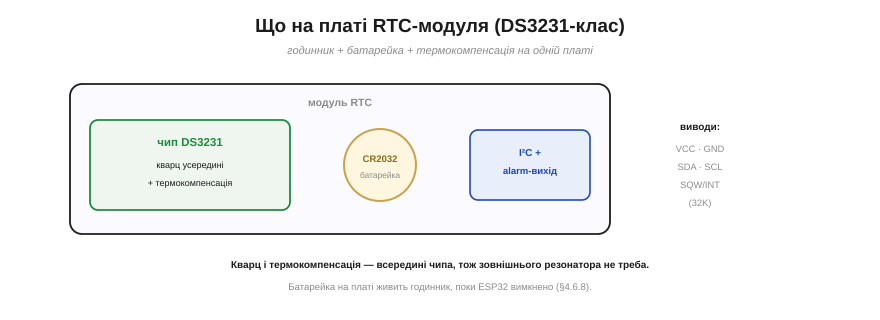
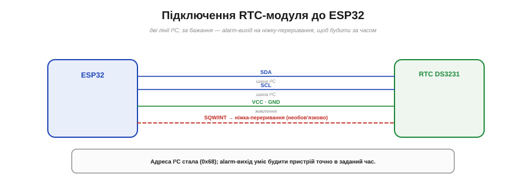

# 🔌 RTC-модуль DS3231-класу: батарейка, термокомпенсація, alarm-вихід

> Компонентна вставка до **теми [§4.6.8 «RTC і реальний час»](timers.md)**. Там ми вирішили, що для точного, тривкого часу беруть зовнішній RTC. Ось він — найпоширеніший модуль і його особливості.

## Що це за деталь

RTC-модуль DS3231-класу — невелика плата, що тримає **справжній календарний час** і віддає його мікроконтролеру по I²C (Рис. 4.6.8c.1). На платі три головні речі: чип **DS3231** (власне годинник), тримач **батарейки** (зазвичай таблетка CR2032) і виводи I²C. Усе разом — це «годинник у коробочці», що йде сам по собі.


*Рис. 4.6.8c.1. На платі: чип DS3231 (кварц і термокомпенсація всередині), батарейка CR2032 (живить годинник, поки ESP32 вимкнено) та виводи I²C з alarm-виходом. Зовнішнього резонатора не треба — він уже в чипі.*

Дві риси роблять DS3231 особливо добрим. По-перше, **кварц у нього всередині** — окремого резонатора чіпляти не треба (на відміну від давніших RTC). По-друге — і це головне — він **термокомпенсований**: усередині є датчик температури, і чип підправляє хід кварцу під неї (§4.6.8), тримаючи точність близько **±2 ppm**, тобто лічені секунди дрейфу на місяць. Батарейка ж живить годинник, коли основний пристрій вимкнено, тож час іде роками без зовнішнього живлення.

## Розпіновка й підключення

Назовні — знайома шина I²C плюс кілька додаткових ніжок (Рис. 4.6.8c.2):

```
VCC, GND   — живлення
SDA, SCL   — шина I²C (адреса стала, 0x68)
SQW/INT    — вихід: будильник (alarm) або меандр
32K        — вихід 32 768 Гц (рідко потрібен)
```


*Рис. 4.6.8c.2. Дві лінії I²C на ESP32, живлення, батарейка в тримач. Вивід SQW/INT за бажання ведуть на ніжку-переривання: модуль смикне її точно в заданий час — і розбудить пристрій. Адреса I²C стала — 0x68.*

Підключення просте: дві лінії I²C на ESP32, живлення, батарейка в тримач. Корисний бонус — вивід **SQW/INT**: модуль уміє **будильник**, тобто смикнути цю ніжку (а через неї — переривання чи пробудження МК) точно в **заданий час**. Це безцінно для пристроїв на батарейках: проспав до призначеної години — RTC сам розбудив.

## Перший байт

Працюють через бібліотеку RTC. Спершу час **виставляють один раз** (з коду, з NTP чи вручну), а далі просто **читають** готові рік-місяць-день-години-хвилини-секунди. Усередині чип тримає час у регістрах у форматі BCD, але бібліотека це ховає — ви бачите звичні числа. Поставити будильник так само просто: задаєте годину, дозволяєте alarm — і чекаєте сигналу на SQW/INT.

## Типові граблі

- **«Зарядка» неперезаряджуваної батарейки.** Дешеві модулі (на кшталт ZS-042) часто мають схему підзарядки, розраховану на акумулятор LIR2032, — а в тримач кладуть звичайну **CR2032**, яку заряджати **не можна**. Така батарейка може текти чи здутися. Поширений лік — перерізати доріжку тієї схеми (або від початку ставити LIR2032).
- **Адреса стала (0x68).** Два DS3231 на одній шині без хитрощів не повісиш — адреса в них однакова.
- **Сусід по платі.** На багатьох модулях поряд із RTC сидить ще й EEPROM (AT24C32) на тій самій шині — пам'ятайте про неї, плануючи I²C.
- **Виставити час.** Поки годинник не заведено, він показує дурницю; не забудьте раз його налаштувати (а сяде батарейка — налаштувати знову).

## Варіації класу

**DS3231** — точний, термокомпенсований, із кварцом усередині: вибір, коли час має бути надійним. **DS1307** — дешевший родич, але **без** термокомпенсації, з зовнішнім кварцом і помітно більшим дрейфом (десятки ppm) — для невибагливих задач. Є й низькоспоживні **PCF8523/PCF8563**. Хочете точність — беріть DS3231; рахуєте копійки й терпите дрейф — DS1307.
