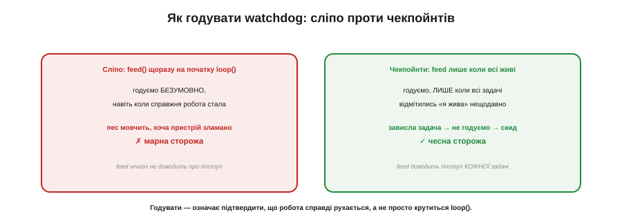
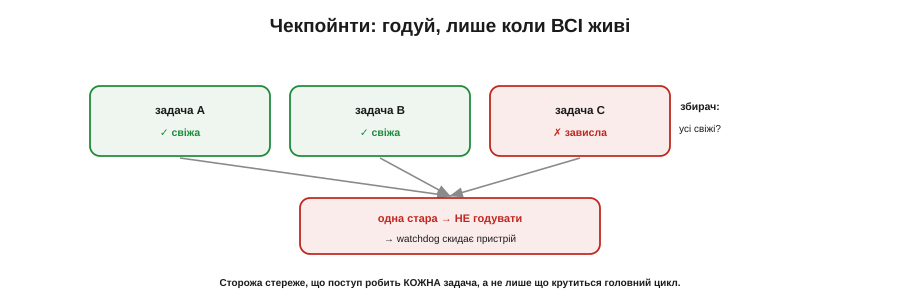

# ⚙️ Як «годувати» watchdog правильно: чекпойнти задач, а не сліпе скидання

> Алгоритмічна вставка до **теми [§4.6.7 «Watchdog: таймер, що рятує від зависання»](timers.md)**. Годувати сторожа треба з місця, що **доводить поступ**. А коли задач багато — як довести, що жива **кожна**? Чекпойнтами.

## Задача

Watchdog скидає пристрій, якщо його не «нагодувати» вчасно (§4.6.7). Та з багатьма задачами постає питання: **звідки** годувати? Сліпий `feed()` на початку `loop()` — найгірша помилка: він годує **завжди**, навіть коли одна із задач давно зависла, а решта цикл усе ще крутиться. Сторожа годують, а пристрій тим часом наполовину мертвий — і весь сенс охорони втрачено (Рис. 4.6.7a.1). Як годувати так, щоб watchdog справді стеріг поступ **усіх** задач?


*Рис. 4.6.7a.1. Сліпий feed() на початку loop() годує безумовно — пес мовчить, хоча справжня робота стала (марна сторожа). Чекпойнти годують, лише коли всі задачі відмітились «я жива»; зависла одна — не годуємо, watchdog скидає (чесна сторожа).*

## Ідея

Замість одного безумовного `feed()` — **чекпойнти** (Рис. 4.6.7a.2). Кожна важлива задача, завершивши свій цикл, **відмічається**: ставить мітку «я жива, ось мій останній успішний оберт». А **одне** місце (раз на цикл) перевіряє: чи всі задачі відмітилися **нещодавно**? Якщо так — `feed()`. Якщо хоч одна не відмічалась довше за свій строк — **не годуємо**, і watchdog чесно скидає пристрій.


*Рис. 4.6.7a.2. Кожна задача відмічається своїм чекпойнтом. Збирач годує watchdog, лише коли всі свіжі; одна застрягла (стара мітка) — годівлю припинено, watchdog скидає. Сторожа стереже поступ КОЖНОЇ задачі, а не лише обертання loop().*

Так годівля стає **доказом**, що поступ робить **кожна** задача, а не лише що крутиться головний цикл. Зависла будь-яка — її чекпойнт «протух», збір не складається, watchdog спрацьовує.

## Псевдокод

```
# кожна задача, завершивши успішний оберт:
checkpoint[i] = now

# збирач (раз на цикл, у головному потоці):
усі_живі = true
для кожної задачі i:
    якщо now − checkpoint[i] > deadline[i]:
        усі_живі = false         # ця задача застрягла
якщо усі_живі:
    feed_watchdog()              # годуємо ЛИШЕ якщо всі поступають
# інакше — не годуємо → watchdog скине
```

Кожній задачі дають **свій** строк `deadline[i]` — трохи більший за її найдовший чесний оберт.

## Складність і пастки на МК

- **Не годувати наосліп.** Головний гріх — `feed()`, що виконується **незалежно** від реальної роботи (на початку `loop()`, з переривання таймера). Він нічого не доводить — лише глушить сторожа. Годуй **після** доказу поступу, не до.
- **Строк під задачу.** `deadline[i]` має бути **більший** за найдовший законний оберт задачі, інакше — **хибні** скиди на чесних, але довгеньких операціях.
- **Збирач має бути досяжним.** Якщо саме той код, що збирає чекпойнти й годує, опиниться в зависанні — годівлі не буде, і watchdog скине. Це **правильно**: краще зайвий скид, ніж мертвий пристрій.
- **Розслідуй, а не глуши.** Коли watchdog таки скинув — **запиши**, яка задача протухла (§4.6.7 радить не замовчувати скиди). Інакше полагодите симптом, а не причину.
- **В RTOS — task watchdog.** Серйозні системи мають готовий «задачний watchdog»: кожна задача **підписується**, і сторож сам стежить, що всі підписані відмічаються. На ESP32 (FreeRTOS) такий механізм є з коробки.

## Підсумок

Правильно годувати watchdog — означає годувати **лише як доказ**, що робота справді рухається. З багатьма задачами це **чекпойнти**: кожна відмічається, а сторожа годуємо, тільки коли **всі** живі. Зависла одна — годівля припиняється, і watchdog чесно перезапускає пристрій. Сліпий `feed()` перетворює сторожа на бутафорію; чекпойнти роблять його справжнім.
