# Розділ 4.6 — Таймери й керування часом

Мікроконтролер мусить не лише **реагувати** на події (це ми опанували в Розділі 4.5) — він має ще й **відчувати час**: знати, скільки минуло, робити щось через рівні проміжки, витримувати точні затримки, вимірювати тривалість імпульсів. За все це відповідає окрема апаратура — **таймер**. По суті це невтомний лічильник, що рахує рівні «тіки» кварцу (звідки ті тіки беруться — розповідає [історична вставка](hist-quartz.md) про кварцовий годинник), і робить це **сам**, не забираючи в процесора ані такту. Цей розділ — про те, як мікроконтролер відмірює час і що з цього можна збудувати.

Будуємо від основи: спершу **що таке таймер-лічильник** і як він рахує такти (ця тема); далі — [період і переповнення](timers.md), [режими захоплення й порівняння](timers.md), [точний час: `millis`/`micros` зсередини](timers.md), [чому `delay()` — зло й неблокуючий час](timers.md), [періодичні події й планування](timers.md) і нарешті [watchdog — таймер, що рятує від зависань](timers.md). Спираємося на все знайоме: **двійкову лічбу** (Модуль 3), **регістри** ([§4.1.3](../mcu-esp32/mcu-esp32.md)) і **переривання** ([Розділ 4.5](../interrupts/interrupts.md)) — бо таймер, дорахувавши, зазвичай саме перериванням і сповіщає.

---

## 4.6.1 Таймер-лічильник: апаратний рахівник тактів

З історії розділу ми винесли просту, але могутню пару: **рівний тік плюс лічильник**. Кварц дає бездоганно рівні коливання, а щось мусить їх **рахувати**, щоб перетворити на час. У мікроконтролері цим «чимось» і є **таймер** — апаратний лічильник тактів. Розберімо, як він улаштований, чому його роблять залізним, як задають швидкість лічби й чому число в його регістрі — це буквально виміряний час.

### Лічильник, що росте з кожним тактом

У серці таймера — звичайний регістр-**лічильник**: комірка, що зберігає число. Особливість у тому, що це число **саме зростає на одиницю** з кожним тактом, який приходить від джерела часу. Тік — лічильник став 1. Ще тік — 2. Ще — 3. І так безперервно, без жодної команди від коду: лічба вбудована в саме залізо.

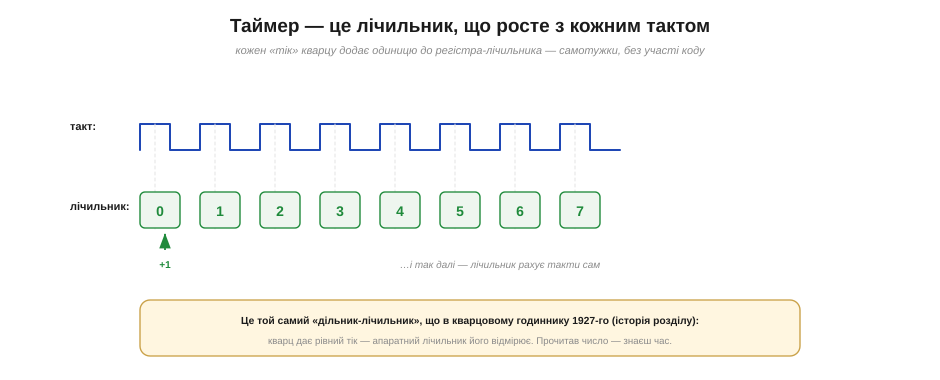
*Рис. 4.6.1.1. Кожен такт (тік) додає одиницю до регістра-лічильника: 0, 1, 2, 3… Це той самий «дільник-лічильник», що в кварцовому годиннику 1927 року (історія розділу): кварц дає рівний тік, а апаратний лічильник його відмірює. Прочитав число в регістрі — знаєш, скільки тіків минуло, тобто скільки спливло часу.*

Це й уся базова ідея таймера: він **рахує час у тіках**. Що довше працює — то більше число в лічильнику, і це число прямо пропорційне часу, що минув. Лишається домовитися, як часто приходять тіки (про це далі) і що робити, коли лічильник переповниться (наступна тема). Та основа гранично проста: **таймер — це лічильник тактів**.

Кілька штрихів до цієї картини. По-перше, лічильник уміє рахувати не лише **вгору**, а й **вниз** — від заданого числа до нуля (це інколи зручніше, коли треба відлічити «скільки лишилося»). По-друге, найпростіший режим — **вільний хід**: лічильник просто рахує вгору, а дорахувавши до максимуму, починає з нуля знову, і так без кінця. Саме у вільному ході працює годинник на кшталт `millis()`. А складніші режими — зупинитися на потрібному числі чи перезапуститися — ми розберемо в наступних темах; вони лише надбудова над тим самим лічильником.

Зриму аналогію легко знайти в побуті. Таймер — це як **лічильник на турнікеті** чи одометр у машині: щось коротко клацає (тут — кварц), а механізм покірно додає одиницю й показує накопичене число. Різниця лише в темпі: турнікет клацає від людей, одометр — від обертів колеса, а таймер — від коливань кристала, мільйони разів на секунду. Принцип же той самий — **рахувати однакові події**, і накопичене число розповідає, скільки їх уже сталося.

### Чому апаратний, а не в коді

Постає природне запитання: навіщо окреме залізо, якщо «порахувати» можна й у коді — крутити цикл і збільшувати змінну? Можна, але це **погана** ідея, і ось чому. Поки процесор крутить такий цикл, він зайнятий **лише** лічбою й нічого іншого робити не може. Точність такого «годинника» жалюгідна: вона залежить від того, скільки інструкцій у циклі, чи не втрутилося переривання, чи не пішов код іншою гілкою. А щойно процесор займеться чимось іншим — лічба **зупиниться**.

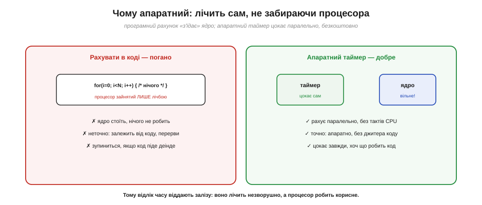
*Рис. 4.6.1.2. Ліворуч — лічба в коді: процесор намертво зайнятий порожнім циклом, рахунок неточний і спиниться, щойно код піде деінде. Праворуч — апаратний таймер: він цокає **паралельно**, не забираючи тактів процесора, точно й завжди, хоч би що робив код. Тому відлік часу віддають залізу.*

Апаратний таймер позбавлений усіх цих вад. Він — окремий вузол чипа, що цокає **сам по собі**, незалежно від процесора: рахує тіки точно й безперервно, поки ядро виконує корисну роботу. Жодного джитера від коду, жодної зупинки. Це класичний приклад того, навіщо в мікроконтролері стільки спеціалізованої периферії: дрібну, але нескінченну роботу (лічити час) віддають простому залізу, звільняючи розумне й дороге ядро для справ.

> 🔧 **Навіщо це.** Запам'ятайте принцип: **час лічить залізо, а не код**. Спроба «відрахувати» затримку порожнім циклом — типова помилка початківця: вона марнує процесор і дає неточний, нестабільний результат. Усі надійні способи працювати з часом, які ми розберемо, спираються на апаратний таймер — він цокає сам, а ви лише читаєте його показання чи просите сповістити, коли набіжить потрібне число.

Варто додати, чому це не дрібниця, а наріжний принцип. Апаратний таймер **детермінований**: один тік — рівно одна одиниця часу, завжди, незалежно від того, що коїться в коді, скільки переривань спрацювало чи якою гілкою пішла програма. Така незворушність і робить його придатним там, де час важить по-справжньому, — у точних вимірах, зв'язку, керуванні. Тому таймери є в **кожному** мікроконтролері, від найдешевшого 8-бітного до ESP32, і завжди їх декілька: відлік часу — надто базова потреба, щоб довіряти її коду.

### Звідки тіки й як задати їхній темп

Тіки таймера походять від системного такту, а той — від кварцу (історія розділу). Але кварц цокає **дуже** швидко: у ESP32 системний такт — десятки мегагерців. Рахувати кожне таке коливання незручно: лічильник миттю переповнювався б, та й рідко треба така дрібна точність. Тому між джерелом такту й лічильником ставлять **передільник** (*prescaler*) — той самий дільник частоти з історії, що ділить швидкий такт на потрібне число, задаючи **темп** лічби.

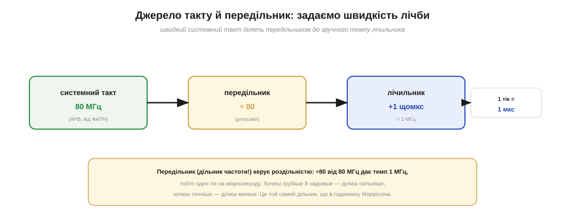
*Рис. 4.6.1.3. Системний такт (80 МГц — такт APB, похідний від кварцу через помножувач-ФАПЧ) проходить крізь **передільник**: поділивши на 80, дістаємо темп 1 МГц — один тік на мікросекунду. Передільник керує роздільністю: хочеш точніше — ділиш менше, хочеш грубіше й надовше — ділиш сильніше. Це той самий дільник частоти, що в годиннику Маррісона.*

Завдяки передільнику ви самі обираєте, **скільки реального часу важить один тік** лічильника. Поділили 80 МГц на 80 — тік дорівнює одній мікросекунді, і лічильник рахує мікросекунди. Поділили на 80 000 — тік дорівнює мілісекунді. Це налаштування — одне з найперших, що роблять із таймером: задати передільник означає вибрати **одиницю часу**, якою таймер міряє. Решта — проста лічба цих одиниць.

Сам передільник — теж лічильник, лише крихітний: він рахує вхідні такти й випускає один вихідний на кожні N. Поділ на 80 означає «пропусти 80 коливань — видай один тік». Кілька звичних налаштувань для 80 МГц: ÷80 дає 1 МГц (тік 1 мкс), ÷8000 — 10 кГц (тік 0.1 мс), ÷80000 — 1 кГц (тік 1 мс). Що більший передільник, то «повільніший» і грубіший тік, зате лічильник довше не переповнюється. Підбираючи передільник, ви фактично крутите ручку «точність ↔ тривалість» під свою задачу.

### Число лічильника — це і є час

Тепер найголовніше для практики. Якщо ви знаєте, **скільки важить один тік**, то число в лічильнику миттю перетворюється на час простим множенням: **час = число тіків × тривалість тіку**. Лічильник показує 1500, а тік налаштовано на 1 мкс? Отже, минуло 1500 мкс, тобто 1.5 мс. От і весь «годинник».

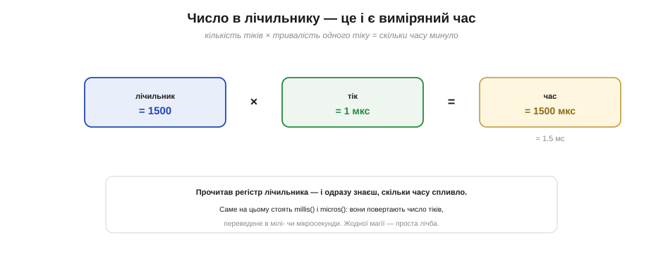
*Рис. 4.6.1.4. Лічильник = 1500, один тік = 1 мкс → минуло 1500 мкс = 1.5 мс. Прочитав регістр лічильника — і одразу знаєш, скільки часу спливло. Саме на цьому стоять `millis()` і `micros()`: вони повертають число тіків, переведене в мілі- чи мікросекунди. Жодної магії — проста лічба.*

Тут і криється зв'язок із функціями, які ви, можливо, вже вживали. `millis()` повертає, скільки мілісекунд минуло від старту, а `micros()` — скільки мікросекунд. Під капотом вони просто **читають апаратний лічильник** (що цокає від кварцу) і переводять його показання в звичні одиниці. Коли ви викликаєте `millis()`, ви буквально питаєте таймер: «скільки тіків ти вже нарахував?» — і дістаєте відповідь у мілісекундах.

Звідси й найчастіше практичне вживання таймера — **виміряти тривалість**. Прийом простий: запам'ятати показання на початку, зробити щось, відняти від нового показання старе — різниця й є витрачений час. Саме так заміряють, скільки виконується шматок коду: `t0 = micros();` … `dt = micros() - t0;`. Таймер тут — секундомір: одне читання на старті, друге на фініші, віднімання дає інтервал. Цим вимірюють і тривалість зовнішніх імпульсів, і швидкодію власних функцій — будь-що, у чого є початок і кінець у часі.

### Роздільність і діапазон: компроміс

Дві властивості таймера визначають, що ним можна виміряти. **Роздільність** — це тривалість одного тіку: дрібніший тік дає точніший вимір (мікросекунди проти мілісекунд), і керується вона передільником. **Діапазон** — це найбільше число, яке вміщає лічильник, перш ніж переповнитися; його задає **число бітів** лічильника.

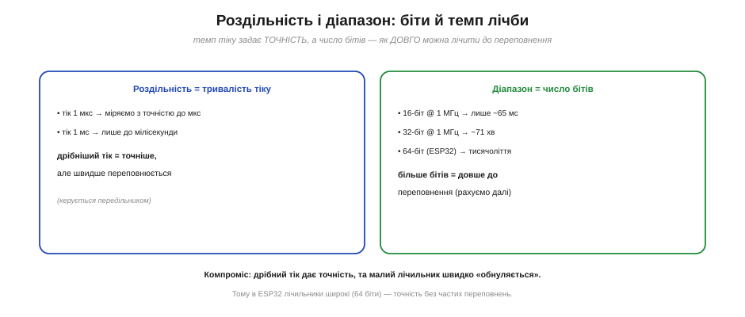
*Рис. 4.6.1.5. Роздільність = тривалість тіку (дрібніший тік — точніше, але швидше переповнення). Діапазон = число бітів: 16-бітний лічильник на 1 МГц переповниться вже за ~65 мс, 32-бітний — за ~71 хвилину, а 64-бітний (як у ESP32) — за тисячоліття. Компроміс: дрібний тік дає точність, та малий лічильник швидко «обнуляється».*

Тут є природний компроміс. Зробиш тік дуже дрібним (велика точність) — лічильник набиратиме своє максимальне число швидко й часто переповнюватиметься. Зробиш лічильник ширшим (більше бітів) — він довше рахуватиме без переповнення, але займе більше місця в чипі. Класичні 8-бітні мікроконтролери мали тісні 8- і 16-бітні таймери, де переповнення треба було пильнувати щомиті. ESP32 у цьому розкішний: його лічильники **64-бітні**, тож навіть із мікросекундним тіком вони рахуватимуть без переповнення довше за вік цивілізації.

На старих 8-бітних чипах цей компроміс відчували гостро. В Arduino Uno, скажімо, таймерів три: два **8-бітні** (рахують лише до 255) і один **16-бітний** (до 65535), і мікросекундний тік переповнював їх за частки секунди — переповнення доводилося ловити й рахувати окремо. ESP32 із 64-бітними лічильниками зняв цей клопіт майже повністю: обирай дрібний тік заради точності, не боячись, що лічильник скоро «обнулиться». Це один із тих випадків, де щедрість сучасного заліза просто **усуває** давній постійний клопіт.

### Таймери в ESP32

Зберімо все на прикладі ESP32. У ньому **чотири** універсальні таймери (зібрані у дві групи по два), і кожен влаштований так, як ми розібрали: бере такт APB (зазвичай 80 МГц, похідний від кварцу через ФАПЧ), пропускає крізь **16-бітний передільник** (ділить на будь-що від 2 до 65 536), а результат рахує **64-бітним** лічильником, що вміє йти як вгору, так і вниз.

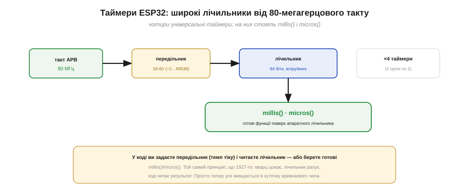
*Рис. 4.6.1.6. Будова таймера ESP32: такт APB (80 МГц) → 16-бітний передільник (÷2…65536) → 64-бітний лічильник (вгору/вниз), і таких таймерів чотири. На цій апаратурі й стоять готові `millis()`/`micros()`. У коді ви або задаєте передільник і читаєте лічильник, або просто берете ці готові функції.*

У повсякденному коді ви рідко чіпаєте таймер напряму — частіше досить `millis()` чи `micros()`. Та коли потрібна повна влада над часом (точний період, апаратна реакція на час), таймер налаштовують руками: задають передільник (вибирають одиницю часу) і далі читають лічильник чи просять його сповістити перериванням. У будь-якому разі під усім цим — та сама пара з 1927 року: кварц цокає, лічильник рахує, код читає результат.

**Порахуймо: передільник, тік і переповнення.**

```
Дано: системний такт 80 МГц, лічильник 64-біт.

Обираємо передільник ÷80:
   тік = 80 / 80 = 1 МГц  →  один тік = 1 мкс  (роздільність)

Скільки минуло, якщо лічильник = 2000?
   час = 2000 тіків × 1 мкс = 2000 мкс = 2 мс

Коли переповниться (за такого тіку)?
   64-біт: 2^64 ≈ 1.8×10^19 тіків × 1 мкс ≈ 584 тисячі років
   (а 16-біт лічильник переповнився б уже за 65 мс!)
```

Приклад показує всю арифметику таймера разом: передільник задає тривалість тіку, число тіків множимо на неї — дістаємо час, а ширина лічильника каже, як довго можна рахувати до переповнення. У ESP32 з його 64 бітами про переповнення можна майже не думати — і це велика зручність порівняно зі старими 8-бітними чипами.

> 🧮 **А коли частота не ділиться рівно?** 1 кГц із 80 МГц виходить **точно** (80 000 = 80 × 1000). Та не всяка ціль так лягає на цілі дільники — і тоді лишається крихітна похибка, що **накопичується** з часом. Як це порахувати й коли воно важить — у вставці [Прескалер і дільники](math-prescaler.md).

> 🔧 **Навіщо це.** На щодня вам майже завжди досить `millis()`/`micros()` — не лізьте в передільники без потреби. Прямо налаштовувати таймер варто, коли треба апаратно реагувати на час (без участі `loop()`), генерувати точний період або ловити тривалість швидких сигналів. Тоді перше рішення — обрати передільник, тобто **одиницю часу**, у якій таймер працюватиме: від цього залежить і точність, і коли він переповниться. А `millis()` лишіть для простого «скільки минуло».

Варто розрізнити дві близькі речі. **Таймер**, про який ми говоримо, рахує час **від старту** чипа й обнуляється при перезавантаженні — він про **проміжки** («минуло стільки-то»). А ось «котра година і яке число» зберігає окремий вузол — **годинник реального часу** (RTC) з власним маленьким кварцом на 32 768 Гц (згадаймо історію), який може цокати навіть у глибокому сні, поки решта чипа спить. Нам у цьому розділі цікавий саме таймер-проміжок; RTC — окрема історія, дотична до режимів сну з [§4.1.4](../mcu-esp32/mcu-esp32.md).

Отже, таймер — це апаратний лічильник, що сам рахує тіки системного такту (родом від кварцу), не забираючи процесора. Передільник задає **тривалість одного тіку** (роздільність), число бітів — **діапазон** до переповнення, а добуток «тіки × тривалість тіку» дає виміряний **час**; на цьому й стоять `millis()`/`micros()`. Ми навмисне двічі згадали слово, що чигає попереду, — **переповнення**: лічильник не може рости вічно, і коли він добігає максимуму, стається щось важливе. Що саме — і як на цьому будують **період** повторюваних подій — розбирає [наступна тема §4.6.2](timers.md).

## 4.6.2 Період і переповнення (авто-перезавантаження)

У [§4.6.1](timers.md) ми з'ясували: таймер — це лічильник, що росте з кожним тіком. Та лічильник **скінченний** — у ньому стільки-то бітів, і вічно рости він не може. Що ж стається, коли він добігає свого максимуму? Він **переповнюється** — обнуляється й починає спочатку. На перший погляд це проблема, та насправді саме переповнення (і вміння керувати ним) перетворює таймер на джерело **рівних, повторюваних подій** — основи будь-якого «годинника» в коді. Ця тема — про переповнення, про те, як зробити з нього подію-переривання, і про **авто-перезавантаження**, яким задають довільний період.

### Переповнення: лічильник доходить до межі й обнуляється

Лічильник на N бітів уміщає числа від 0 до 2ᴺ−1. Дорахувавши до цього максимуму, на наступний тік він не може стати «ще на одиницю більшим» — місця немає, — тож **перекидається** назад у нуль і рахує далі. Це й називають **переповненням** (англ. *overflow*) або «обгортанням» (*wrap-around*). Лічба не зупиняється — вона просто циклічно повторюється, як одометр, що з 999999 перескакує на 000000.

З погляду математики переповнення — це просто **лишок від ділення** на розмір лічильника (те, що в програмуванні звуть операцією за модулем). Лічильник завжди показує справжню кількість тіків **за модулем** 2ᴺ. І це не баг, а цілком передбачувана, корисна поведінка: якщо ви про неї знаєте й правильно з нею рахуєтеся (а як — побачимо наприкінці теми), переповнення нічим не зашкодить. Небезпечне не саме переповнення, а **необізнаність** про нього — коли код мовчки припускає, що лічильник росте вічно.

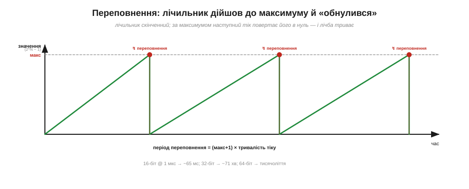
*Рис. 4.6.2.1. Значення лічильника росте до максимуму (2ᴺ−1), а на наступний тік **перекидається** в нуль — це переповнення. Час між двома переповненнями = (макс+1) × тривалість тіку: для 16-бітного лічильника з мікросекундним тіком це лише ~65 мс, для 32-бітного — ~71 хвилина, для 64-бітного — тисячоліття.*

Час між сусідніми переповненнями — величина цілком визначена: це повний діапазон лічильника, помножений на тривалість одного тіку. Згадаймо §4.6.1: вузький лічильник із дрібним тіком переповнюється часто, широкий — рідко. Саме тому на старих 8-бітних чипах переповнення доводилося постійно «ловити», а на 64-бітному ESP32 про нього майже не думають. Та головне зараз інше: момент переповнення — це **подія**, яку можна використати.

### Переповнення — це подія, яку ловлять перериванням

Найцінніше в переповненні те, що таймер уміє **сповістити** про нього. Щойно лічильник перекинувся в нуль, він може підняти **переривання** — те саме, що ми вивчили в Розділі 4.5. Так таймер сам, без жодного опитування в коді, каже: «минув мій повний цикл!» — і викликає обробник.

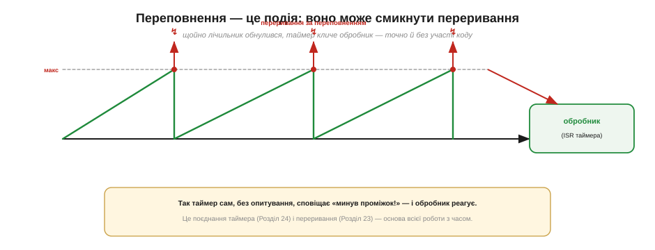
*Рис. 4.6.2.2. Кожне переповнення таймер перетворює на **переривання**: лічильник обнулився — смикнув обробник (ISR таймера). Так об'єднуються дві теми модуля — таймер (Розділ 4.6) рахує час, а переривання (Розділ 4.5) миттєво сповіщає, коли проміжок минув. На цій парі тримається вся точна робота з часом.*

Ось де таймер і переривання зливаються в одне могутнє ціле. Таймер незворушно лічить тіки кварцу, а коли набіжить повний цикл — піднімає переривання, і ваш обробник реагує **точно вчасно**, не марнуючи процесора на перевірки. Це і є канонічний спосіб робити щось «за розкладом»: не опитувати час у циклі (згадаймо §4.5.7), а доручити таймерові смикнути вас, коли час настане.

Варто додати, що сповістити про переповнення таймер може **двома** способами. Перший і головний — підняти переривання, як ми описали. Другий — просто виставити в собі **прапорець** «я переповнився», який код може час від часу опитувати. Перериванням користуються, коли реакція має бути миттєвою й без участі циклу; опитуванням прапорця — у простіших випадках (той самий компроміс із §4.5.7). У будь-якому разі таймер стає **метрономом**: він рівно відбиває такт, а ви або слухаєте його перериванням, або зазираєте на прапорець.

### Свій період: авто-перезавантаження

Є лише одна незручність: «голе» переповнення настає, коли лічильник пройде **весь** свій діапазон, а це рідко той період, який нам потрібен. Хочеться ж не «раз на 65 мс» чи «раз на 71 хвилину», а, скажімо, рівно раз на мілісекунду. Розв'язання — **авто-перезавантаження** (*auto-reload*): ми задаємо лічильникові не повний максимум, а власний **«верх»** (значення перезавантаження), по досягненні якого він скидається й починає знову.

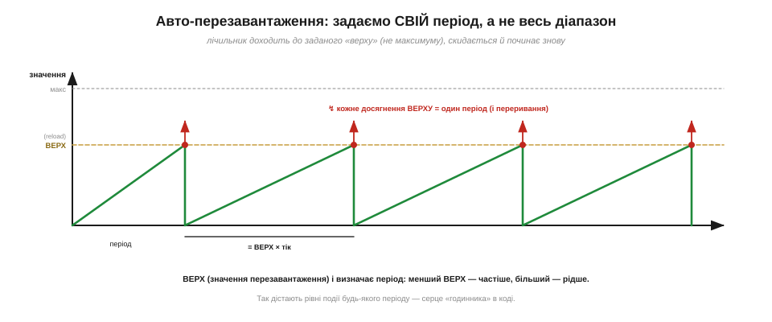
*Рис. 4.6.2.3. Замість того щоб чекати повного діапазону, лічильник доходить до заданого **ВЕРХУ** (менший за максимум), скидається в нуль і починає знову — і так раз за разом. Кожне досягнення ВЕРХУ — це один **період** (і одне переривання). Менший ВЕРХ — події частіше, більший — рідше. Так дістають рівні події будь-якого потрібного періоду.*

З авто-перезавантаженням таймер перетворюється на справжній **генератор періоду**: він знову й знову відлічує однакові проміжки й сповіщає про кожен. Саме так влаштовані всі «роби це кожні N мілісекунд»: таймер налаштовують на потрібний верх, він б'є перериванням щоразу, а обробник виконує дію. Це апаратний, бездоганно рівний метроном — куди точніший за будь-яке відлічування в коді.

Технічно авто-перезавантаження роблять двома дзеркальними способами. Можна рахувати **вгору** до заданого верху, а тоді скинутись у нуль; а можна зарядити лічильник числом і рахувати **вниз** до нуля, після чого перезарядити. Результат однаковий — рівний період, — тож обирають як зручніше чипу. У різних родин і назви свої: десь це «регістр авто-перезавантаження» (ARR), десь — значення «будильника» (*alarm*), як у ESP32, де ви задаєте, на якому числі таймер має «задзвонити». За всіма цими словами ховається та сама проста ідея: лічити до мітки й починати знову.

### Формула періоду: дві ручки

Скільки ж саме триватиме період? Він визначається двома величинами, які ми вже знаємо: значенням **ВЕРХУ** (скільки тіків лічити) і тривалістю одного **тіку** (її задає передільник, §4.6.1). Формула проста:

> **період = ВЕРХ × тривалість тіку = ВЕРХ × передільник / частота такту**

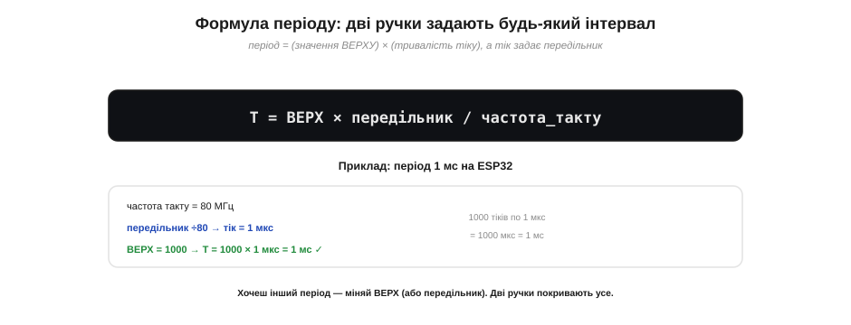
*Рис. 4.6.2.4. Період = ВЕРХ × тривалість тіку, а тривалість тіку задає передільник. Приклад для ESP32: частота 80 МГц, передільник ÷80 дає тік 1 мкс; ВЕРХ = 1000 → період 1000 × 1 мкс = 1 мс. Хочеш інший період — міняй ВЕРХ (або передільник).*

Розгляньмо це числами. На ESP32 системний такт — 80 МГц. Беремо передільник ÷80 — і тік стає рівно 1 мкс. Тепер, щоб дістати період 1 мс (тобто 1000 мкс), задаємо ВЕРХ = 1000: лічильник відлічить 1000 тіків по мікросекунді, скинеться й сповістить — рівно раз на мілісекунду. Дві ручки — передільник і ВЕРХ — покривають геть будь-який період, від часток мікросекунди до годин.

**Порахуймо: переривання кожну 1 мс.**

```
Ціль: рівне переривання кожну 1 мс на ESP32.

  частота такту = 80 000 000 Гц (80 МГц)
  передільник ÷80   →  тік = 80/80 = 1 МГц → 1 мкс
  ВЕРХ = 1000       →  T = 1000 × 1 мкс = 1000 мкс = 1 мс ✓

Перевірка прямою формулою:
  T = ВЕРХ × передільник / частота
    = 1000 × 80 / 80 000 000 = 0.001 с = 1 мс ✓
```

Зверніть увагу, що формула працює в **обидва** боки. Якщо ви знаєте налаштування таймера, то порахуєте його період; а якщо знаєте бажаний період — виведете, який ВЕРХ задати. Саме так і роблять на практиці: беруть зручний передільник, ділять потрібний період на тривалість тіку — і дістають ВЕРХ. Для 1 мс за тіку 1 мкс це 1000; для 0.5 с за тіку 1 мс — 500. Просте ділення туди-сюди, і таймер видає рівно той ритм, який треба.

### Дві ручки під один період

Цікаво, що **одну** й ту саму ціль можна набрати по-різному, граючи двома ручками. Період 1 мс виходить і як «тік 1 мкс × ВЕРХ 1000», і як «тік 10 мкс × ВЕРХ 100», і як «тік 100 мкс × ВЕРХ 10» — усі дають ту саму мілісекунду.

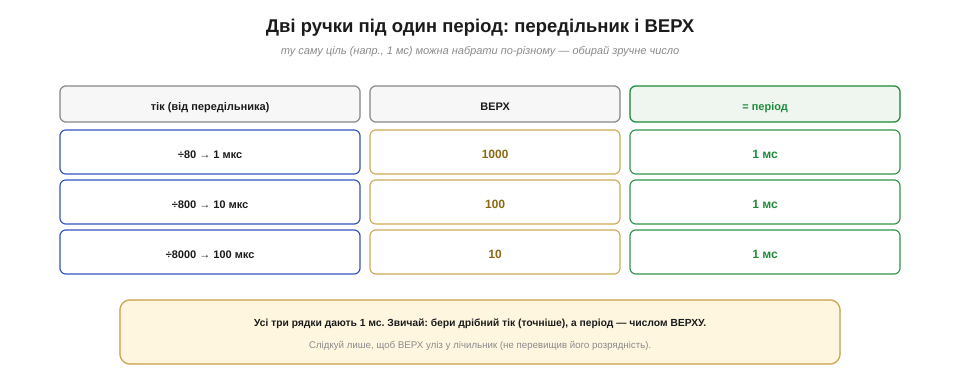
*Рис. 4.6.2.5. Три способи дістати 1 мс: різні пари «тік × ВЕРХ» дають один результат. Звичай — брати дрібний тік (точніше) і задавати період числом ВЕРХУ. Єдине обмеження: ВЕРХ має вміститися в розрядність лічильника.*

Який варіант обрати? Загальне правило — брати **якомога дрібніший тік** (менший передільник), бо це дає тонше «зерно» часу й гнучкість, а період виставляти числом ВЕРХУ. Єдине, за чим стежать: ВЕРХ мусить **уміститися** в лічильник — на 16-бітному не задаси ВЕРХ понад 65535. На 64-бітному ESP32 ця межа така далека, що про неї майже не згадують. Так дві прості ручки дають повну владу над часом.

Дві ручки мають і свої межі. Дуже **короткий** період упирається в частоту такту: швидше за один тік (на ESP32 без передільника це 1/80 МГц = 12.5 нс) таймер бити не вміє. А дуже **довгий** період потребує або великого передільника, або великого ВЕРХУ, або обох — і тут якраз стає в пригоді широкий 64-бітний лічильник ESP32, що дозволяє відлічувати хвилини й години одним таймером. Між цими краями — від десятків наносекунд до годин — лежить увесь робочий діапазон, і дві ручки покривають його повністю.

> 🔧 **Навіщо це.** У коді Arduino для ESP32 ви зазвичай не крутите ці ручки вручну для кожного біта — функції налаштування таймера приймають або частоту/період напряму, або передільник. Та розуміти пару «тік × ВЕРХ» **обов'язково**: саме вона пояснює, чому таймер дає рівно той період, який ви замовили, і що міняти, коли період виходить не той. Якщо періодична подія йде вдвічі частіше чи рідше за очікувану — майже завжди це помилка в передільнику чи ВЕРХУ.

### Переповнення millis() і безпечне віднімання

Наостанок — підступний нюанс, на якому спотикаються мільйони. Функція `millis()` (§4.6.1) теж рахує в скінченному, 32-бітному лічильнику, тож і вона **переповнюється** — приблизно кожні **49.7 дня** її значення перекидається з максимуму в нуль. І якщо порівнювати час «у лоб», після цього переповнення програма зламається: подія, що мала статися, застрягне на багато днів.

Звідки саме «49.7 дня»? Це просто весь діапазон 32-бітного лічильника в мілісекундах: 2³² мілісекунд — близько 4.29 мільярда мс, а поділивши послідовно на 1000, 60, 60 і 24, дістаємо ≈49.7 доби. Цифра здається безпечно далекою, та для пристрою, що працює **роками** без вимкнення (а саме такі й роблять на мікроконтролерах — давачі, контролери, метеостанції), цей момент настане неодмінно, і не раз. Тому «50 днів» — не екзотика, а реальний рубіж, який прошивка мусить пережити коректно.

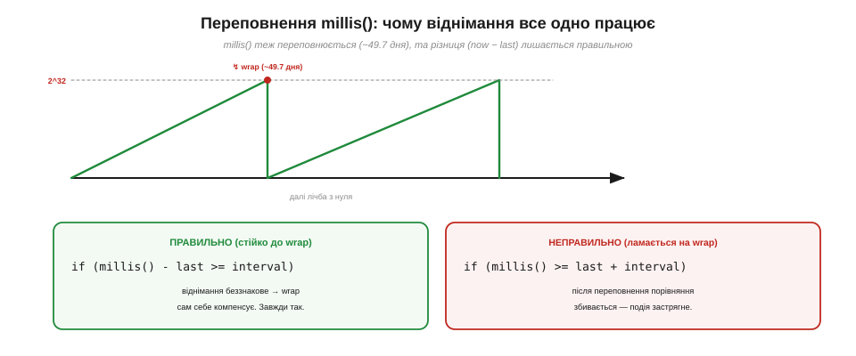
*Рис. 4.6.2.6. `millis()` теж переповнюється (~49.7 дня). **Правильно**: `if (millis() - last >= interval)` — беззнакове віднімання саме компенсує wrap, тож працює завжди. **Неправильно**: `if (millis() >= last + interval)` — після переповнення це порівняння збивається, і подія застрягає. Різниця в дрібниці, та ціна — зависання раз на ~50 днів.*

Рятунок елегантний: завжди працюйте з **різницею** часів, а не з абсолютними значеннями. Вираз `millis() - last` обчислюється в **беззнаковій** арифметиці, де переповнення «само себе компенсує»: навіть коли `millis()` уже перекинувся через нуль, а `last` лишився великим, їхня беззнакова різниця виходить правильною. Тому канонічна перевірка «чи минув інтервал» виглядає так:

**Стійка до переповнення перевірка часу.**

```
// ПРАВИЛЬНО — працює навіть через переповнення (~49.7 дня):
if (millis() - lastTime >= interval) {
  lastTime = millis();
  // ... минув інтервал — робимо дію ...
}

// НЕПРАВИЛЬНО — ламається на переповненні:
//   if (millis() >= lastTime + interval) { ... }
```

> 🔧 **Навіщо це.** Запам'ятайте це як залізне правило: час порівнюють **відніманням** (`now - last >= interval`), а не додаванням до межі. Перший спосіб переживає переповнення непомітно, другий — підкладає міну, що «вибухне» десь через 50 днів безперервної роботи. Баг цей особливо підступний, бо в розробці його **ніколи** не видно (хто тримає прошивку ввімкненою 50 днів поспіль?), а у виробі він рано чи пізно стається. Звичка віднімати рятує від цілого класу таких «довгограючих» зависань.

> 🧮 **Чому віднімання таки працює?** Це не магія, а **модульна арифметика**: усе беззнакове рахується «по колу», за модулем 2³², як на циферблаті. Розрахунок крок за кроком — чому `now − last` дає правильний проміжок навіть на самому переповненні — у вставці [Чому millis() переживає переповнення](math-unsigned-wrap.md).

І ще одне, про що часто забувають: `micros()` переповнюється **набагато** швидше за `millis()`. Оскільки мікросекунд у те саме 32-бітне число влазить у тисячу разів менше, `micros()` обгортається вже приблизно кожні **71 хвилину**. Те саме правило рятує й тут — порівнюйте відніманням (`micros() - last`), і wrap мине непомітно. Просто пам'ятайте, що з мікросекундами «година з чвертю» настає куди раніше за «50 днів» мілісекунд, тож недбалість із `micros()` вилазить помітно частіше.

Отже, лічильник скінченний і неминуче **переповнюється** — обнуляється, дійшовши до межі; і це переповнення таймер уміє перетворити на **переривання**. Щоб дістати власний період, а не повний діапазон, задають **авто-перезавантаження** на свій ВЕРХ: період = ВЕРХ × тривалість тіку, а керують ним дві ручки — передільник і ВЕРХ. І пам'ятайте про переповнення `millis()` (а ще швидше — `micros()`): час завжди порівнюйте **відніманням**, а не додаванням до межі. Ми навчилися робити рівні події за **часом** — дістали апаратний метроном, що б'є бездоганно рівно й сам сповіщає про кожен удар. А як зробити, щоб таймер реагував на **зовнішню** подію — точно відмітив мить її приходу або сам, без коду, смикнув ніжку у потрібний момент? Це — режими **захоплення й порівняння** в [наступній темі §4.6.3](timers.md).

## 4.6.3 Режими захоплення й порівняння (input capture / output compare)

Досі таймер у нас лише **рахував час** і бив перериванням за періодом. Та він уміє куди більше: апаратно зв'язувати свій лічильник із **ніжками** GPIO — і то з точністю, недосяжною для коду. Для цього є два дзеркальні режими. **Захоплення** (*input capture*) працює на **вхід**: воно миттєво «фотографує» лічильник, коли на ніжці стається подія, — даючи точну апаратну мітку часу. **Порівняння** (*output compare*) працює на **вихід**: воно саме виконує дію на ніжці, щойно лічильник дійде до заданого числа. Обидва — про точність, якої коду не дано. Розберімо їх.

### Захоплення: апаратна мітка часу для входу

Уявімо, що треба точно знати **мить**, коли на ніжці стався фронт (наприклад, прийшов імпульс від давача). Можна було б ловити його перериванням і читати `micros()` в обробнику — але між фронтом і читанням мине якийсь час: затримка входу в переривання, джитер (§4.5.2). Захоплення усуває цю ваду повністю. Воно прив'язує лічильник до ніжки **апаратно**: щойно на ніжці стається обраний фронт, залізо тієї ж наносекунди копіює поточне значення лічильника в особливий **регістр захоплення**. Жодного коду, жодної затримки — точний знімок часу події.

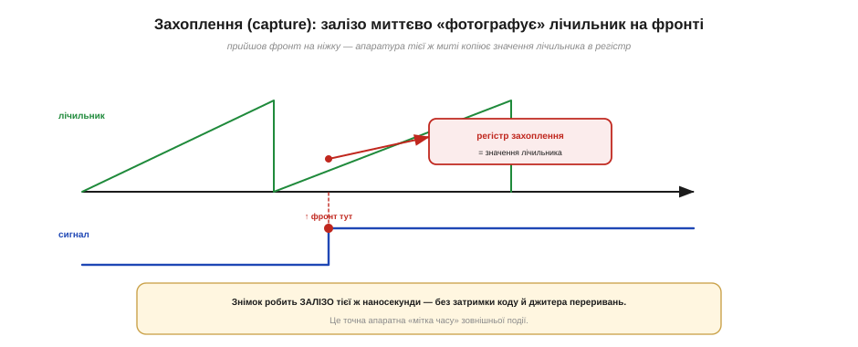
*Рис. 4.6.3.1. Лічильник вільно рахує. Щойно на ніжці стається фронт, апаратура **тієї ж миті** копіює поточне значення лічильника в регістр захоплення. Знімок робить залізо, без участі коду, тож він точний до тіку — це бездоганна апаратна «мітка часу» зовнішньої події.*

Ключове слово — **апаратно**. Програма дізнається про захоплення згодом (зазвичай те саме захоплення піднімає й переривання, щоб сповістити «я зловив фронт, значення вже в регістрі»), та **значення** записано в точну мить події, а не тоді, коли код доплентався його прочитати. Це різниця між «приблизно тоді» й «рівно тоді» — і для вимірювання часу вона вирішальна.

Кілька тонкощів додають захопленню сили. По-перше, для кожного входу можна вибрати, який саме **фронт** ловити — наростання, спад або обидва. По-друге, деякі таймери вміють на захопленні ще й **скинути** лічильник, тож наступне захоплення відразу покаже період, без віднімання. По-третє, якщо вимірюваний інтервал довший за діапазон лічильника, захоплення поєднують із підрахунком **переповнень** (§4.6.2): повний час складають із цілих циклів плюс залишок. Так апаратно міряють і дуже короткі, і досить довгі проміжки.

Аналогія до захоплення — **фотофініш** на перегонах: камера сама клацає точну мить, коли бігун перетнув лінію, і байдуже, де в той час був суддя й чи встиг він глянути. Так само захоплення фіксує точний «час на табло» (значення лічильника) у мить події на ніжці — а код прочитає це табло вже потім, не втративши ані тіку точності. Залізо ловить мить, код її осмислює.

### Навіщо це: виміряти тривалість, період, частоту

Сама по собі мітка одного фронту мало що дає — сила захоплення в **парах**. Захопивши значення на **двох** фронтах і віднявши їх, дістаємо точний інтервал між ними. Захопили фронт наростання й спаду того самого імпульсу — знаємо його **ширину**. Захопили два сусідні фронти наростання — знаємо **період**, а отже, й **частоту** сигналу.


*Рис. 4.6.3.2. Захоплення A на фронті наростання, захоплення B на спаді: ширина імпульсу = (B − A) × тривалість тіку, з точністю до тіку. Так апаратно вимірюють тривалість імпульсів, період і частоту зовнішніх сигналів — від ультразвукового далекоміра до тахометра.*

Це робоча конячка для багатьох задач. Ультразвуковий далекомір вимірює час повернення луни — захопленням. Тахометр рахує частоту імпульсів від колеса — захопленням. Декодування інфрачервоного пульта, вимір ширини сигналів — усе спирається на той самий прийом: апаратно відмітити фронти, відняти, дістати час. І все це — **без джитера**, бо мітки ставило залізо.

**Порахуймо: ширина імпульсу й частота через захоплення.**

```
Тік таймера = 1 мкс.

Ширина імпульсу (фронт ↑, потім спад ↓):
   захоплення A (↑) = 1250
   захоплення B (↓) = 1780
   ширина = (B − A) × тік = (1780 − 1250) × 1 мкс = 530 мкс

Період і частота (два фронти ↑ поспіль):
   A1 = 1250, A2 = 3250
   період  = (3250 − 1250) × 1 мкс = 2000 мкс = 2 мс
   частота = 1 / 2 мс = 500 Гц
```

Конкретний приклад — популярний ультразвуковий далекомір HC-SR04. Він тримає ніжку «луни» високою рівно стільки, скільки звук летить до перешкоди й назад; захопивши фронт і спад цього імпульсу, дістаємо час польоту, а з нього — відстань (звук витрачає ~58 мкс на кожен сантиметр туди-назад). Із мікросекундним тіком захоплення це дає сантиметрову точність. А частоту міряють двома способами: для високої — ловлять період одного циклу (швидко й часто), для низької — рахують фронти за фіксований проміжок (точніше).

> ⚙️ **На практиці.** Як саме написати вимірювання — обробник, що віднімає мітки, як **не помилитися на переповненні** таймера між фронтами й де ховається межа роздільності та діапазону — крок за кроком у вставці [Виміряти імпульс і частоту](proj-input-capture.md).

### Порівняння: апаратна дія на виході

Тепер дзеркальний режим — **порівняння**, що працює на вихід. Тут залізо безперервно **звіряє** лічильник із наперед заданим числом (значенням порівняння), і коли вони збігаються, **само** виконує дію: перемикає ніжку (ставить, скидає чи інвертує її рівень) та/або піднімає переривання. Знову ж — без коду й без затримки: дія стається рівно в той тік, коли лічильник дорівняв мітці.


*Рис. 4.6.3.3. Залізо весь час порівнює лічильник із заданим числом. У тік, коли вони збігаються, воно автоматично виконує дію — перемикає ніжку та/або піднімає переривання. Жодної участі коду: «натискання» стається точно в потрібну мить.*

Порівняння — це спосіб **запланувати** точну дію в часі. «Підніми ніжку, коли лічильник дорівняє 500» — і вона підніметься рівно тоді, хоч би чим був зайнятий процесор. Канали порівняння часто є по кілька на таймер, тож можна запланувати кілька дій на різні моменти. Це протилежність захопленню: захоплення **читає** час події з входу, порівняння **задає** час дії на виході.

До речі, з порівнянням ви вже знайомі під іншим ім'ям. «Будильник» (alarm) із §4.6.2, на якому таймер перезавантажувався й бив перериванням, — це і є порівняння лічильника із заданим числом; просто там дія була «скинутись і сповістити». Загалом же канали порівняння роблять що завгодно в потрібний тік: підняти ніжку, опустити, інвертувати, покликати обробник. А коли каналів кілька, на одному періоді можна розставити **кілька** точних подій — звідси й складніші форми сигналів, і керування фазами.

А аналогія до порівняння — **будильник**: ви наперед називаєте час, і дзвоник спрацює рівно тоді, хоч би чим ви були зайняті. Порівняння — це «постав будильник на показання N»: лічильник дорахує до N, і залізо саме зробить призначену дію. Різниця лише в тому, що замість дзвінка ніжка перемикається чи спрацьовує переривання, а замість годин — тіки таймера. Точний апаратний будильник для ваших сигналів.

### Перемикання на збіг → точна хвиля

Найефектніше порівняння розкривається, коли його поєднати з періодом (§4.6.2). Якщо на **кожен** збіг перемикати ніжку на протилежний рівень, а лічильник раз за разом проходить свій період, — на ніжці з'явиться бездоганно рівна **прямокутна хвиля** точно заданої частоти, і все це **без жодної участі процесора**.

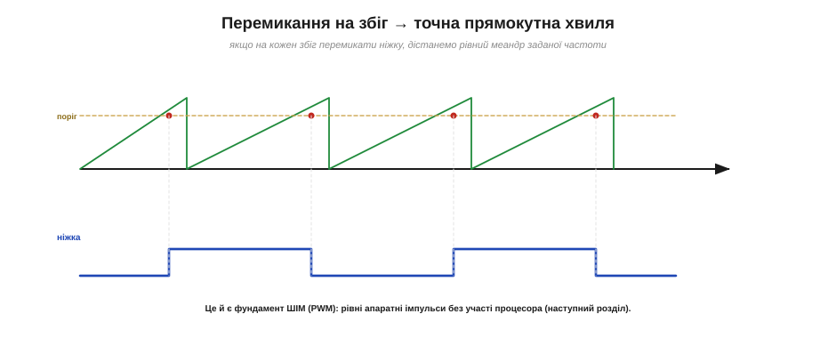
*Рис. 4.6.3.4. Якщо на кожен збіг лічильника з порогом перемикати ніжку, виходить рівний меандр (прямокутна хвиля) точної частоти — і генерує його залізо само. Це і є фундамент **ШІМ** (PWM): апаратні імпульси без навантаження на процесор, яким присвячено наступний розділ.*

Саме на цьому стоїть **широтно-імпульсна модуляція** (PWM), якій присвячено наступний розділ модуля: рухаючи значення порівняння, керують тим, **яку частку** періоду ніжка тримає високий рівень, — а це дозволяє «вдавати» аналог цифровою ніжкою (яскравість, швидкість). Та поки що нам важлива сама ідея: порівняння перетворює таймер на апаратний генератор сигналів, точний до тіку.

Помітьте красиву симетрію двох режимів. Захоплення йде від **світу до лічильника**: подія на ніжці записує час. Порівняння — від **лічильника до світу**: заданий час породжує дію на ніжці. Один читає момент входу, другий призначає момент виходу; разом вони замикають таймер на зовнішні сигнали в обидва боки. Майже все, що пов'язане з точним таймінгом ніжок, — вимір, генерація, ШІМ, протоколи — зводиться до цих двох дзеркальних дій.

### Чому апаратно, а не в коді

Може виникнути думка: навіщо ці складнощі, якщо виміряти час чи смикнути ніжку можна й у коді — перериванням? Можна, але **неточно**. Між подією і реакцією коду завжди є затримка й джитер (§4.5.2): поки процесор увійде в обробник, поки виконає рядки — миті спливають, і то щоразу трохи по-різному. Захоплення й порівняння цього позбавлені, бо прив'язані прямо до **значення лічильника**, а не до того, коли код устигне.

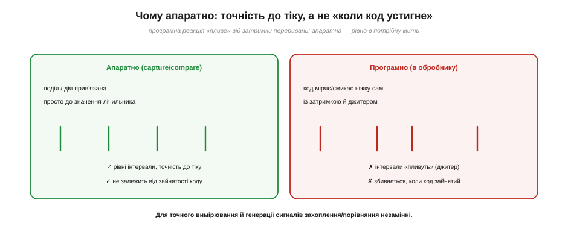
*Рис. 4.6.3.5. Ліворуч — апаратно: подія чи дія прив'язана просто до значення лічильника, тож інтервали рівні, точність до тіку, незалежно від зайнятості коду. Праворуч — програмно: код міряє чи смикає ніжку сам, із затримкою й джитером, що «пливе» і збивається, коли процесор зайнятий.*

> 🔧 **Навіщо це.** Правило просте: **точний час — залізу, приблизний — коду**. Якщо треба зміряти короткий імпульс, точно зловити мить фронту чи видати рівний сигнал — беріть захоплення/порівняння, а не «`micros()` в обробнику». Програмний спосіб годиться для грубих міток (десятки мікросекунд і більше), та для точних вимірів і генерації він безнадійно «пливе». Це той самий урок, що з таймером проти лічби в циклі (§4.6.1): дрібну точну роботу віддають спеціальному залізу.

Щоб відчути масштаб: вхід у переривання й виконання кількох рядків коду коштують **мікросекунди**, і ця затримка ще й «плаває» від такту до такту. А апаратне захоплення чи порівняння точне до **одного тіку** — наносекунди на ESP32. Для вимірювання звукової частоти чи генерації радіосигналу різниця в тисячу разів критична. Та коли вам досить грубої мітки — «приблизно через 10 мс» — програмний спосіб цілком годиться й простіший. Як завжди, інструмент обирають під потрібну точність, а не «про всяк випадок по максимуму».

### Де це в ESP32

Тут — важлива практична поправка. У класичних мікроконтролерах (AVR, STM32) захоплення й порівняння вбудовано **в той самий** таймер — як його канали. ESP32 влаштований інакше: його базові таймери (TIMG) дають лічбу часу й «будильник», а захоплення фронтів і генерацію сигналів винесено в **окремі спеціалізовані блоки**.

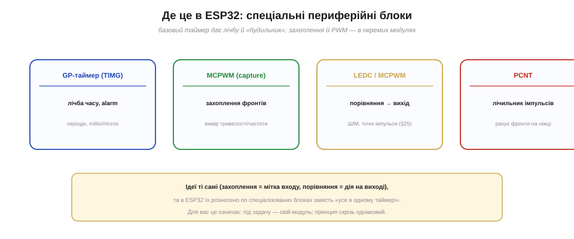
*Рис. 4.6.3.6. Розподіл в ESP32: **GP-таймер (TIMG)** — лічба часу й alarm (періоди, `millis`/`micros`); **MCPWM** має блок **захоплення** (вимір тривалості/частоти); **LEDC/MCPWM** роблять **порівняння → вихід** (ШІМ, точні імпульси); **PCNT** — апаратний лічильник імпульсів на ніжці. Ідеї ті самі, лише рознесені по модулях.*

Для вас це означає просту річ: **ідеї універсальні, а блок — під задачу**. Треба зміряти тривалість чи частоту — береться блок захоплення MCPWM. Треба видати ШІМ чи точні імпульси — LEDC або MCPWM. Треба просто **порахувати** фронти на ніжці (скільки обертів, скільки крапель) — є окремий лічильник імпульсів PCNT. А базовий таймер лишається для відліку часу. Принцип «захоплення = мітка входу, порівняння = дія на виході» скрізь однаковий — змінюється лише, у якому модулі його шукати.

> 🔧 **Навіщо це.** Не лякайтеся «зоопарку» блоків ESP32 — за назвами (MCPWM, LEDC, PCNT) ховаються рівно ті дві ідеї, що ми розібрали. У повсякденній практиці ви рідко налаштовуєте їх вручну: для ШІМ є прості функції (`ledcWrite` тощо), для лічби імпульсів — готові бібліотеки. Та знати, що під ними працює апаратне захоплення/порівняння, корисно: це пояснює, **чому** вони точні й не вантажать процесор, і куди дивитися, коли треба вичавити максимум точності.

Два блоки ESP32 варті окремої згадки, бо дуже корисні. **PCNT** (*pulse counter*) — апаратний лічильник фронтів на ніжці: він рахує імпульси сам, не турбуючи процесора, та ще й уміє декодувати квадратурний сигнал поворотного енкодера (згадаймо приклад із §4.5.7 — тепер без жодного переривання на кожен імпульс). А **RMT** (*remote control*) — блок для точних послідовностей імпульсів: він народився для інфрачервоних пультів, але ним керують і світлодіодними стрічками, і будь-якими сигналами зі строгим таймінгом. Обидва — приклади того, як ESP32 віддає точну роботу з часом спеціальному залізу.

Отже, таймер уміє не лише рахувати час, а й апаратно зв'язувати лічильник із ніжками. **Захоплення** робить точну мітку часу зовнішньої події (вимір тривалості, періоду, частоти), **порівняння** — точну дію на виході в заданий момент (аж до генерації рівних хвиль — основи ШІМ). Обидва б'ють програмний спосіб точністю, бо прив'язані прямо до лічильника, а не до того, коли код устигне; у ESP32 вони живуть у спеціалізованих блоках (MCPWM, LEDC, PCNT). Запам'ятайте дзеркальну пару одним рядком: **захоплення фотографує час входу, порівняння призначає час виходу** — і обидва точні до тіку, без жодної участі коду. Ми багато разів спиралися на `millis()` і `micros()` як на готову даність. Час нарешті зазирнути, **як вони влаштовані зсередини** — як із апаратного лічильника роблять звичні мілі- й мікросекунди. Це [наступна тема §4.6.4](timers.md).

## 4.6.4 Точний час: мілі- й мікросекунди (millis/micros зсередини)

Ми вже не раз вживали `millis()` і `micros()` як готову даність: викликав — дістав час. Тепер, маючи за плечима розуміння таймера (§4.6.1–4.6.3), зазирнімо **під капот** цих функцій. Виявиться, що жодної магії там нема — це просто зручна обгортка над апаратним лічильником, який цокає від кварцу. Розберемо, що саме вони повертають, як влаштовані всередині (і чому по-різному в Arduino Uno та ESP32), яка в них роздільність і точність і як ними правильно користуватися.

### Що вони повертають: час від старту

Найперше — чітко зрозуміти, **що** це за час. `millis()` повертає, скільки **мілісекунд** минуло від моменту, коли чип увімкнувся (чи перезавантажився), а `micros()` — скільки **мікросекунд**. Це **не** «котра година» й не дата: мікроконтролер сам собою не знає календарного часу. Це просто лічильник, що пішов із нуля в мить старту й невпинно росте.

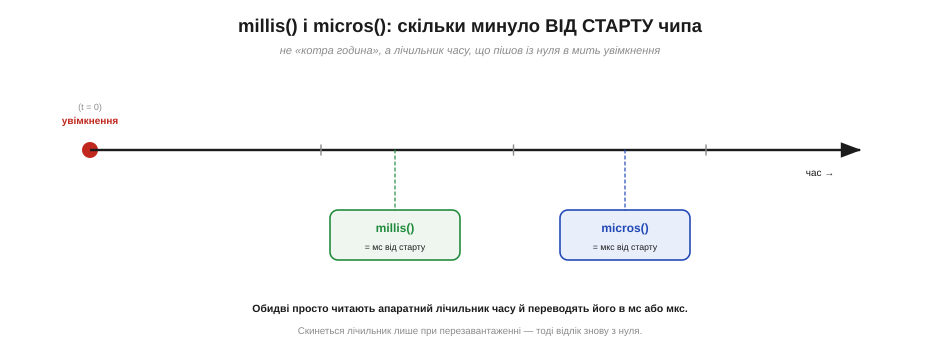
*Рис. 4.6.4.1. Відлік починається з нуля в мить увімкнення. `millis()` віддає мілісекунди від старту, `micros()` — мікросекунди. Це не «котра година», а лічильник часу, що минув; скинеться він лише при перезавантаженні. Обидві функції просто читають апаратний лічильник і переводять його в потрібні одиниці.*

Звідси випливає важлива річ: щоб дізнатися **інтервал** між двома моментами, треба зробити два виміри й **відняти** їх (§4.6.2). Саме так і вживають ці функції — не як абсолютний час, а як точки відліку для різниць. А от **як** саме лічильник перетворюється на мілісекунди — залежить від чипа, і тут Arduino Uno та ESP32 ідуть різними шляхами.

Чому ж мікроконтролер не знає «справжнього» часу? Бо йому нема звідки його взяти: при ввімкненні в чипі немає ані календаря, ані пам'яті про те, котра зараз година, — лічильник просто стартує з нуля. Щоб дізнатися реальну дату й час, пристрою треба їх **повідомити** ззовні: узяти з мережі (інтернет-час), з окремого годинника реального часу з батарейкою або від користувача. Сам же по собі `millis()` — це **час роботи** (uptime), і для вимірювання проміжків більшого й не треба.

### Як це всередині AVR: переривання щомілісекунди

На класичному AVR (Arduino Uno) `millis()` побудовано хитро, бо таймери там вузькі (8-бітні). Працює це так: маленький таймер (Timer0) налаштовано переповнюватися приблизно **раз на мілісекунду**, і кожне його переповнення піднімає **переривання**. В обробнику цього переривання просто збільшується глобальний лічильник мілісекунд. А `millis()` лише повертає його поточне значення.

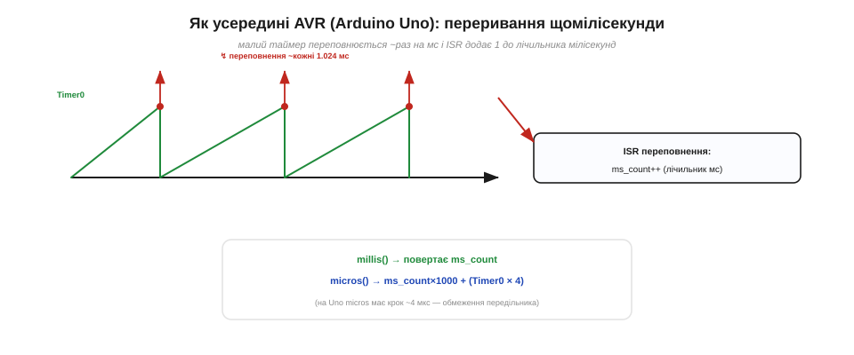
*Рис. 4.6.4.2. На Arduino Uno Timer0 переповнюється приблизно кожні 1.024 мс і викликає переривання, обробник якого робить `ms_count++`. `millis()` повертає цей лічильник, а `micros()` складає `ms_count×1000` із поточним числом у Timer0 (×4, бо крок Timer0 там — 4 мкс). Це класична, але «галаслива» схема: переривання тікає весь час.*

Ця схема працює, та має ваду: переривання спрацьовує **тисячу разів на секунду**, віднімаючи дрібку процесора, а через те, що 1.024 мс — не рівно мілісекунда, доводиться ще й періодично робити дрібну корекцію. Крок `micros()` на Uno виходить ~4 мкс (через передільник Timer0). Для 8-бітного чипа це прийнятний компроміс, але ESP32 робить розумніше.

У цієї схеми є ще й побічний наслідок, відомий кожному ветеранові Arduino. На Uno той самий Timer0 обслуговує не лише `millis()`/`micros()`/`delay()`, а ще й `analogWrite()` на кількох ніжках. Тому варто комусь «перенастроїти» Timer0 під свої потреби — і `millis()` починає брехати, а `delay()` ламається. Це класична пастка спільного ресурсу: один маленький таймер тягне на собі весь облік часу, тож чіпати його напряму небезпечно. ESP32 із його окремим системним таймером від цього клопоту вільний.

### Як це всередині ESP32: широкий лічильник у мікросекундах

ESP32 не мусить городити переривання щомілісекунди, бо має **широкий** (64-бітний) системний таймер, що сам безперервно лічить **мікросекунди** від старту. Тоді все стає тривіальним: `micros()` — це просто **прочитати** цей лічильник, а `millis()` — прочитати й **поділити на 1000**. Жодного обробника, жодної корекції: апаратура цокає сама, а функція лише знімає показання.

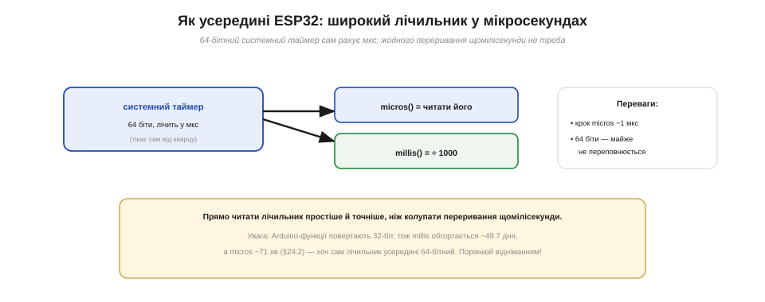
*Рис. 4.6.4.3. На ESP32 системний таймер 64-бітний і лічить мікросекунди сам. `micros()` просто читає його, `millis()` ділить на 1000. Переваги: крок `micros()` ~1 мкс і лічильник майже не переповнюється. Увага: Arduino-функції повертають 32-бітне число, тож `millis()` обгортається ~49.7 дня, а `micros()` ~71 хв (§4.6.2) — хоч сам лічильник усередині 64-бітний. Тому час порівнюйте відніманням.*

Це й точніше (крок 1 мкс проти 4 мкс на Uno), і чистіше (ніщо не смикає процесор щомілісекунди). Та зверніть увагу на тонкість: хоч апаратний лічильник усередині й 64-бітний, звичні Arduino-функції повертають **32-бітне** число, тож назовні `millis()` усе одно обгортається через ~49.7 дня, а `micros()` — аж через ~71 хвилину. Тому правило з §4.6.2 лишається залізним: порівнюйте час **відніманням**.

> 🔧 **Навіщо це.** Практичний висновок: на ESP32 `micros()` дає чесні мікросекунди й безпечний для частих викликів — це швидке читання лічильника. Та пам'ятайте про його швидке (~71 хв) обгортання: якщо міряєте інтервал довший за годину, беріть `millis()`, а не `micros()`. І ніколи не покладайтеся на те, що значення «весь час росте»: і `millis()`, і `micros()` рано чи пізно перескочать через нуль, тож код має це переживати (через віднімання).

Під капотом цей системний таймер доступний і прямо — через функцію `esp_timer_get_time()`, що повертає повноцінне 64-бітне число мікросекунд (саме його `micros()` і обрізає до 32 біт). Якщо вам потрібен по-справжньому довгий відлік без обгортання, беруть її, а не `micros()`. І ще: прочитати 64-бітне значення на 32-бітному ядрі — це насправді **два** читання, тож робити це треба обережно (атомарно, §4.5.6); на щастя, готові функції вже подбали про це за вас, і вам лишається просто їх викликати.

### Роздільність: який найдрібніший крок

Роздільність — це найменша зміна часу, яку функція здатна розрізнити, тобто її **крок**. У `millis()` крок завжди 1 мілісекунда: між двома сусідніми значеннями — рівно мілісекунда, дрібніше вона не бачить. У `micros()` крок набагато тонший — близько мікросекунди на ESP32 (і ~4 мкс на Uno).

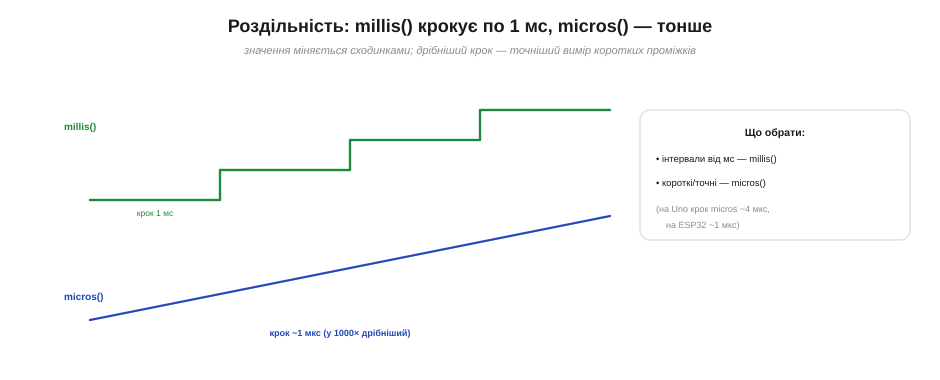
*Рис. 4.6.4.4. Значення міняється сходинками: `millis()` — грубими, по 1 мс; `micros()` — дрібними, ~1 мкс (на ESP32). Для інтервалів від мілісекунд бери `millis()`, для коротких чи точних — `micros()`. На Uno крок `micros()` ~4 мкс, на ESP32 ~1 мкс.*

Звідси простий вибір. Якщо ви відмірюєте інтервали в мілісекундах і більше (блимнути світлодіодом раз на 500 мс, опитати давач раз на секунду) — `millis()` ідеальний і простіший. Якщо ж важать мікросекунди (зміряти короткий імпульс, точно витримати десятки мікросекунд) — потрібен `micros()`. Брати `micros()` «про всяк випадок» там, де досить `millis()`, не варто: він обгортається в тисячу разів швидше.

Тут варто чітко розвести два поняття, які раз у раз плутають: **роздільність** і **точність**. Роздільність — наскільки **дрібно** функція показує час (її крок); точність — наскільки її показання **близькі до правди**. Це різні речі: секундомір може показувати соті частки секунди (тонка роздільність) і водночас відставати на п'ять хвилин (погана точність). `micros()` має чудову роздільність (1 мкс), але його точність обмежена кварцом — і дрібний крок аж ніяк не означає, що та мікросекунда «справжня» до мікросекунди. Саме про точність — наступний підрозділ.

### Точність: вона така ж, як у кварцу

Тут криється тонкість, яку часто плутають із роздільністю. Роздільність — це наскільки **дрібно** функція міряє; точність — наскільки її «секунда» збігається зі **справжньою** секундою. І ось точність `millis()`/`micros()` дорівнює точності **кварцу**: сам лічильник рахує тіки бездоганно рівно, та якщо кварц трохи «біжить» чи «відстає», то й увесь час поїде разом із ним.

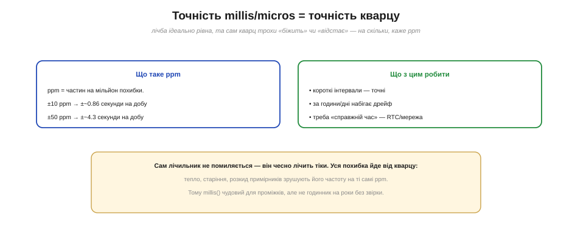
*Рис. 4.6.4.5. Лічильник не помиляється — уся похибка йде від кварцу, і її міряють у **ppm** (частинах на мільйон). ±10 ppm — це близько ±0.86 секунди на добу, ±50 ppm — ±4.3 с/добу. На коротких інтервалах це непомітно, та за дні набігає дрейф. Якщо треба «справжній час», беруть RTC чи звіряються з мережею.*

Похибку кварцу позначають у **ppm** (*parts per million*, частинах на мільйон). Звичайний кварц має десятки ppm, і це означає крихітну, але реальну розбіжність: ±20 ppm — це близько ±1.7 секунди на добу. На коротких проміжках (секунди, хвилини) така похибка зникомо мала, та за тижні безперервної роботи годинник на `millis()` помітно «попливе». Тому для **проміжків** `millis()` чудовий, а для **календарного часу на роки** беруть окремий годинник реального часу (RTC) або звіряються з мережею. До того ж кварц «пливе» від температури й старіння — тож точність ще й залежить від умов.

Та не варто й перебільшувати проблему. Для **відносних** вимірів — «скільки минуло між двома подіями», «витримай 50 мс» — кварцу більш ніж досить: на коротких інтервалах дрейф у ppm дає похибку, яку годі помітити. Морочитися з точністю варто лише там, де час накопичується **довго** й має збігатися з реальним. Тоді беруть або точніший кварц із температурною компенсацією (TCXO, одиниці ppm), або зовнішній RTC-модуль, або періодично звіряють годинник із мережею. Для звичайної ж прошивки `millis()` від штатного кварцу — цілком надійна основа.

**Порахуймо: роздільність і дрейф.**

```
Роздільність:
   millis()  → крок 1 мс
   micros()  → крок ~1 мкс (ESP32), ~4 мкс (Uno)

Дрейф від кварцу ±20 ppm:
   за добу: 86400 с × 20/1 000 000 = ±1.73 с/добу
   за місяць: ≈ ±52 с
→ для таймерів проєкту — байдуже; для «годинника на стіні» — помітно.
```

### Як ними правильно вживати

Зведімо практику докупи. `millis()`/`micros()` застосовують у трьох типових прийомах, і всі вони — про **різницю** часів, а не про абсолютне значення.

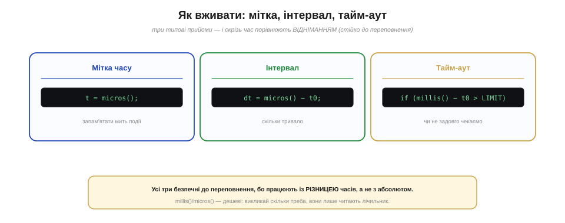
*Рис. 4.6.4.6. **Мітка часу**: `t = micros()` — запам'ятати мить. **Інтервал**: `dt = micros() − t0` — скільки тривало. **Тайм-аут**: `if (millis() − t0 > LIMIT)` — чи не задовго чекаємо. Усі три безпечні до переповнення, бо працюють із різницею часів. І `millis()`/`micros()` дешеві — викликай скільки треба.*

Перший прийом — **мітка часу**: запам'ятати момент події (`t = millis()`). Другий — **інтервал**: відняти дві мітки й дізнатися, скільки минуло (`dt = millis() - t0`). Третій — **тайм-аут**: перевірити, чи не чекаємо ми чогось задовго (`if (millis() - start > LIMIT)`). У всіх трьох ключ — **віднімання**, що робить код стійким до переповнення. І не бійтеся викликати ці функції часто: вони дешеві, лише читають лічильник, тож у циклі їх можна смикати скільки завгодно.

> 🔧 **Навіщо це.** Ці три прийоми — `мітка`, `інтервал`, `тайм-аут` — покривають чи не всю повсякденну роботу з часом у прошивці, і саме на них будується неблокуючий код, до якого ми переходимо далі. Запам'ятайте їх як готові заготовки. І ще раз про головне правило: працюйте з **різницею** часів. Абсолютні порівняння (`millis() > щось`) рано чи пізно зламаються на переповненні; різниця (`millis() - t0 > щось`) — ні.

Чому ж ці прийоми такі важливі? Бо вони — альтернатива простому, але підступному `delay()`. Спокусливо «зачекати 500 мс» одним рядком, та поки `delay()` чекає, програма **стоїть** і нічого більше не робить. Прийоми «мітка + інтервал» дозволяють відмірювати час, **не зупиняючи** решту коду: перевірив `millis() - t0`, ще не час — пішов далі займатися іншим. Цей підхід має навіть усталену назву — «**блимання без delay**» (*blink without delay*), і саме йому присвячено наступну тему. Поки що запам'ятайте трійцю заготовок — вони стануть її будівельними цеглинами.

Остання практична порада. Коли запам'ятовуєте мітку, робіть це **узгоджено**: або всюди `millis()`, або всюди `micros()`, не змішуючи одиниці в одному обчисленні. І не зберігайте час у `int` — для `millis()`/`micros()` потрібен **беззнаковий** 32-бітний тип (`unsigned long`), інакше і діапазон удвічі менший, і віднімання через переповнення перестане «само компенсуватися». Дрібниця, та переплутаний тип — одна з найчастіших причин, чому «правильний» на вигляд код із часом раптом збивається.

Отже, `millis()` і `micros()` — це проста обгортка над апаратним лічильником: вони повертають час **від старту** чипа в мілі- чи мікросекундах. На AVR під ними тікає переривання щомілісекунди, на ESP32 — широкий 64-бітний лічильник у мікросекундах (тому й точніше). Їхня **роздільність** — це крок (1 мс чи ~1 мкс), а **точність** дорівнює точності кварцу (ppm, дрейф). Вживають їх трьома прийомами — мітка, інтервал, тайм-аут, — і завжди через **віднімання** беззнакових значень, що робить показання лічильника надійним інструментом часу. Тепер ми готові спитати: а як **зачекати** заданий час? Найпростіша відповідь — `delay()` — виявляється поганою, і чому саме, а також як чекати **неблокуюче**, розбирає [наступна тема §4.6.5](timers.md).

## 4.6.5 Чому delay() — зло; неблокуючий час (патерн millis)

`delay()` — чи не перше, що вивчає кожен новачок Arduino, і чи не перше, від чого відучується кожен, хто пише серйозні пристрої. Здавалося б, що простіше: «зачекай 500 мс» одним рядком. Та за цією зручністю ховається пастка, яка робить програму **мертвою** на час очікування. Ця тема — про те, чому `delay()` так шкодить, і про головну заміну йому: **неблокуючий** патерн на `millis()`, що його англійською звуть «blink without delay». Опанувавши його, ви зробите крок від «іграшкових» скетчів до справжніх, чуйних пристроїв.

### delay() заморожує весь процесор

Розберімо, що насправді робить `delay(1000)`. Він **не** «нагадує зробити щось через секунду» — він **зупиняє** процесор на цілу секунду в порожньому очікуванні. Поки delay триває, програма не виконує **жодного** іншого рядка: не читає кнопок, не реагує на події, не оновлює нічого. Уся прошивка просто стоїть стовпом, чекаючи, поки спливе час.

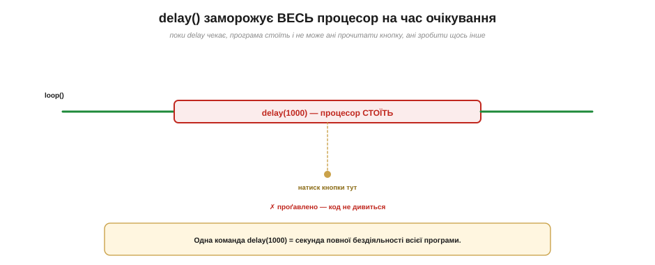
*Рис. 4.6.5.1. `delay(1000)` зупиняє процесор на цілу секунду: `loop()` застрягає, і поки delay чекає, програма не дивиться ні на що. Натиск кнопки, що стався в цей час, просто **проґавлено** — код його не бачив. Одна команда delay = секунда повної бездіяльності всієї прошивки.*

Для найпростішого скетчу (блимнути одним світлодіодом) це не біда — більше нічого й не діється. Але справжній пристрій мусить робити **багато** справ: блимати індикатором, **і** стежити за кнопкою, **і** опитувати давач, **і** оновлювати екран. Щойно з'являється друге діло, `delay()` стає катастрофою.

Тут варто чесне уточнення для ESP32. На «голому» 8-бітному Arduino `delay()` — це справжнє порожнє очікування, що тримає процесор намертво. На ESP32 же `delay()` влаштований ввічливіше: він **поступається** часом системним задачам (Wi-Fi, фоновим службам) і навіть «годує» сторожовий таймер, тож сама система не падає. Та для **вашого** коду це не рятунок: ваш `loop()` усе одно **стоїть** до кінця delay і не робить нічого свого. Тобто на ESP32 delay не валить систему, але вашу програму так само заморожує — проблема чуйності лишається.

### Два діла з різним ритмом — і delay безсилий

Найясніше це видно на простій задачі: блимати двома світлодіодами з **різними** періодами — одним раз на 500 мс, іншим раз на 300 мс. Спробуйте зробити це на `delay()` — і ви зайдете в глухий кут. Поки програма чекає `delay(500)` для першого, другий світлодіод **стоїть**, бо процесор зайнятий очікуванням. Ритми неминуче зіб'ються, бо два незалежні таймінги не вкладаються в один послідовний ланцюжок пауз.

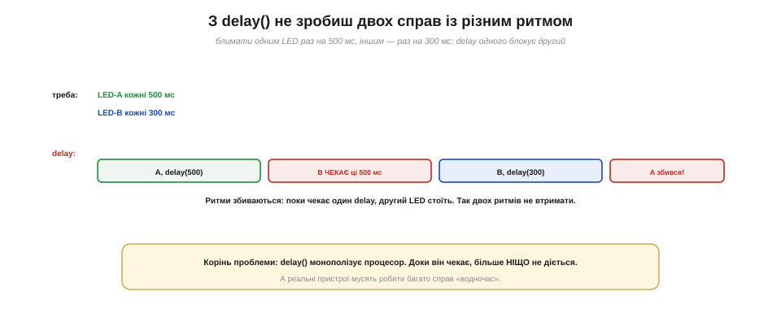
*Рис. 4.6.5.2. Треба блимати LED-A кожні 500 мс, а LED-B — кожні 300 мс. На `delay()` нічого не вийде: поки програма «висить» у delay одного світлодіода, другий мовчить, і ритми збиваються. Корінь біди — `delay()` монополізує процесор: доки він чекає, більше **ніщо** не діється.*

Це й є фундаментальна вада: `delay()` — **блокуючий**. Він захоплює процесор цілком і нікому його не віддає, поки не дочекається. А реальний світ вимагає робити багато справ «водночас» — і блокування тут смертельне. Потрібен підхід, де очікування **не зупиняє** все інше.

Уявіть кухаря, що готує кілька страв. Поганий кухар діє «по delay»: поставив воду — і **стоїть** над нею, нічого більше не роблячи, поки закипить; аж тоді береться до наступного. Добрий кухар діє неблокуюче: поставив воду й, **не чекаючи**, нарізає овочі, помішує соус, раз у раз **зазираючи**, чи не закипіло. Процесор — той самий кухар: `delay()` змушує його тупо стояти над одним казаном, а неблокуючий патерн дозволяє вести всю кухню заразом.

### Неблокуючий патерн: питати «чи вже час?», а не «чекати»

Рятунок — у зміні самого способу думати про час. Замість «**зупинись** і чекай N мілісекунд» ми кажемо: «щоразу, проходячи `loop()`, **перевіряй**, чи не настав уже потрібний момент, — і якщо так, зроби дію, а якщо ні, просто йди далі». Для цього й потрібні `millis()` із §4.6.4: запам'ятовуємо мітку часу останньої дії й щопрохід дивимося, чи минув від неї інтервал.

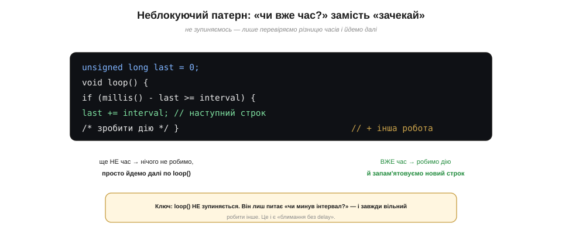
*Рис. 4.6.5.3. Замість зупинки — перевірка: `if (millis() - last >= interval)`. Ще не час → нічого не робимо, просто йдемо далі по `loop()`. Уже час → робимо дію й запам'ятовуємо новий строк (`last += interval`). Головне: `loop()` ніколи не зупиняється, тож завжди вільний робити інше. Це і є «блимання без delay».*

Серце патерну — одна перевірка `if (millis() - last >= interval)`. Якщо інтервал ще не минув, умова хибна, ми її пропускаємо й біжимо далі — `loop()` не гальмує ані на мить. Якщо ж минув — виконуємо дію й оновлюємо мітку (`last += interval` тримає рівний ритм точніше, ніж `last = millis()`). Жодного блокування: між перевірками процесор вільний робити що завгодно.

Цей зсув мислення глибший, ніж здається. По суті ми переходимо від програми, що **веде час за руку** («крок — пауза — крок»), до програми, що **реагує на час** («що вже настало?»). Це та сама зміна перспективи, що з опитування на переривання (§4.5): не ми ганяємось за моментом, а момент сам нас знаходить — тільки тут «подія» це сплив інтервалу, а ловимо ми її не залізом, а швидкою перевіркою в циклі. Тому неблокуючий стиль так природно лягає поряд із перериваннями: обидва про те, щоб не стояти й не чекати дарма.

**Блимання без delay (і ще одне діло поряд).**

```
unsigned long lastBlink = 0;
unsigned long lastRead  = 0;
const unsigned long blinkInterval = 500;   // мс
const unsigned long readInterval  = 100;   // мс

void loop() {
  unsigned long now = millis();

  if (now - lastBlink >= blinkInterval) {   // діло 1: блимати
    lastBlink += blinkInterval;
    ledState = !ledState;
    digitalWrite(LED, ledState);
  }

  if (now - lastRead >= readInterval) {     // діло 2: опитати давач
    lastRead += readInterval;
    readSensor();
  }

  // кнопки й будь-що інше — теж тут, нічого не блокує
}
```

Двоє слів про оновлення мітки. Запис `last += interval` зсуває строк рівно на інтервал, тож середній ритм лишається **точним** навіть якщо окремий прохід трохи спізнився, — добре для рівних періодів. Запис `last = millis()` простіший і «самовирівнюється» (відлік завжди від теперішнього моменту), та може накопичувати дрібний дрейф. Обидва робочі: для строгого ритму беруть `+=`, для невибагливих пауз — `= millis()`. Єдине, чого слід стерегтися з `+=`: якщо `loop()` надовго відлучився й пропустив кілька строків, умова може спрацювати кілька разів поспіль, «надолужуючи» — інколи це треба окремо обмежити.

### loop() крутиться швидко — і встигає все

Чому цей підхід працює? Бо без блокувань `loop()` обертається **дуже** часто — тисячі, а то й сотні тисяч разів на секунду. Кожен такий блискавичний прохід лише перевіряє свої умови «чи вже час?»; здебільшого відповідь «ще ні» — і прохід завершується миттєво. Та зрідка якась умова стає істинною, і тоді відповідна дія виконується — практично вмить, бо черга до неї доходить тисячі разів на секунду.

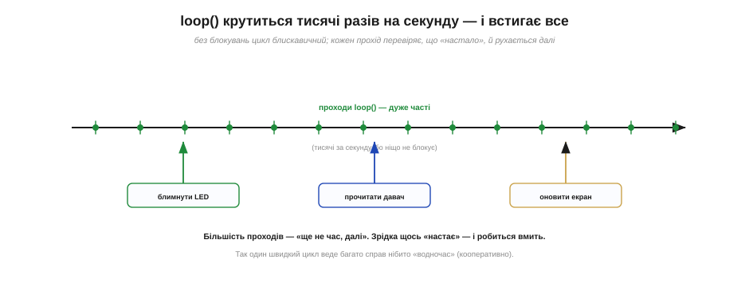
*Рис. 4.6.5.4. Без `delay()` цикл блискавичний: тисячі проходів на секунду. Більшість із них — «ще не час, далі»; зрідка щось «настає» (блимнути, прочитати давач, оновити екран) — і робиться вмить. Так один швидкий цикл веде багато справ нібито «водночас», кооперативно.*

Це створює ілюзію, ніби пристрій робить усе **одночасно**, хоча насправді процесор, як завжди, робить одне діло за раз — просто перемикається між ними так часто, що оку (і кнопці) це непомітно. Така «**кооперативна багатозадачність**» — головний спосіб, яким один простий `loop()` веде десяток справ, лишаючись чуйним до кожної.

Щоб відчути масштаб: порожній `loop()` на ESP32 (240 МГц) обертається сотні тисяч разів на секунду. Саме ця шаленість і дає чуйність — будь-яка подія обслуговується за частки мілісекунди. Та є й зворотний бік: **одне** блокування будь-де руйнує всю картину. Вставили `delay(100)`, чи повільний `Serial.print`, чи дочекалися відповіді давача — і на цей час знов завмерли **всі** задачі циклу. Тому неблокуючий стиль вимагає дисципліни: жодних довгих операцій у `loop()`; усе тривале або дроблять на кроки, або виносять у переривання чи окрему задачу.

### Багато задач — кожна у своєму ритмі

Найкраще патерн розкривається, коли діл багато. Кожному дають **свою** пару змінних — мітку `last` і свій `interval`, — і всі їхні перевірки `if` ставлять поряд в одному `loop()`. Кожна спрацьовує у власному ритмі, не заважаючи іншим.

> ⚙️ **Коли задач багато — зведіть їх у таблицю.** Десяток розкиданих `if`-перевірок плутає; охайніше скласти задачі в **таблицю** {функція, період, останній запуск} і пробігати її одним циклом. Це **кооперативний планувальник** — із псевдокодом і пастками у вставці [Кооперативний планувальник на millis](proj-coop-scheduler.md).

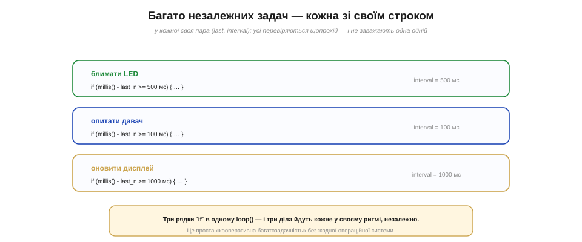
*Рис. 4.6.5.5. Три незалежні задачі — блимати (500 мс), опитувати давач (100 мс), оновлювати дисплей (1000 мс) — кожна зі своєю парою `(last, interval)`. Три рядки `if` в одному `loop()`, і три діла йдуть кожне у своєму темпі, незалежно. Це проста кооперативна багатозадачність без жодної операційної системи.*

> 🔧 **Навіщо це.** Запам'ятайте цей патерн як основну робочу конячку прошивки: **мітка + інтервал + перевірка відніманням**. Він замінює `delay()` усюди, де треба лишатися чуйним. Коли проєкт виросте до багатьох справ, кожну оформлюють окремою парою `(last, interval)` — і додавати нові діла стає легко, бо вони не заважають одне одному. Це не просто прийом, а **спосіб мислення**: програма не «робить крок, чекає, робить крок», а «щопрохід перевіряє, що настало».

Коли задача складніша за «зробити одну дію» — наприклад, послідовність із кроків і пауз («увімкни, зачекай 2 с, вимкни, зачекай 1 с, повтори»), — додають **змінну стану**: вона пам'ятає, на якому кроці ми зараз, а `millis()` відмірює паузи між кроками. Так задача стає крихітним **автоматом станів** (згадаймо дребезг із §4.4.5), що крутиться в тому ж неблокуючому циклі. Це вже місток до справжньої багатозадачності: коли таких автоматів стає багато, на зміну ручному жонглюванню приходить операційна система реального часу, до якої ми ще дійдемо в курсі.

Варто назвати цей стиль його іменем. Один великий цикл, що швидко перебирає всі справи, — це **«суперцикл»** (super-loop), найпоширеніша архітектура простих прошивок. Вона напрочуд потужна для свого класу задач і чудово служить, поки справ небагато. Її межі — що буде, коли задач стане десятки й вони почнуть конфліктувати за час — і те, як їх долає операційна система, окрема велика тема наприкінці модуля. Поки ж суперцикл на неблокуючому `millis` — ваш головний робочий інструмент.

### Коли delay() усе ж припустимий

Сказати, що `delay()` — абсолютне зло, було б перебільшенням. Він не «заборонений» — він просто **блокує**, і вся річ у тім, чи є що блокувати. У крихітній паузі всередині `setup()`, у найпростішому навчальному скетчі, де діло одне-єдине, або в короткому очікуванні, під час якого справді нічого не має статися, — `delay()` цілком прийнятний і навіть зручніший.

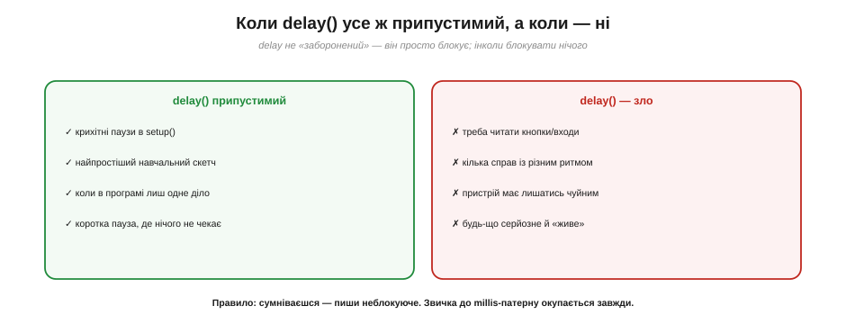
*Рис. 4.6.5.6. `delay()` припустимий: дрібні паузи в `setup()`, найпростіший навчальний скетч, коли в програмі лиш одне діло. `delay()` — зло: коли треба читати кнопки, вести кілька ритмів, лишатися чуйним — словом, у будь-чому серйозному. Правило: сумніваєшся — пиши неблокуюче.*

> 🔧 **Навіщо це.** Не треба фанатично викорінювати кожен `delay()` — у setup чи навчальному прикладі він безпечний. Та щойно пристрій має робити **більше одного діла** чи лишатися чуйним до входів — переходьте на неблокуючий `millis`-патерн, не вагаючись. Найкраще зробити його **звичкою за замовчуванням**: писати неблокуюче майже завжди, а `delay()` лишати для дрібних винятків. Тоді ваші пристрої ніколи не «зависатимуть», поки чогось чекають.

Один корисний виняток назвімо окремо. Для **дуже коротких** і точних пауз — одиниці-десятки мікросекунд, як-от витримати таймінг між бітами саморобного протоколу — є `delayMicroseconds()`. На такому масштабі керувати часом через `millis()` незручно, а блокування на кілька мікросекунд непомітне для решти системи. Тобто крихітні точні затримки інколи доречні навіть у неблокуючому коді; «зло» — саме **довге** блокування на мілісекунди й більше, що крало б чуйність. Як завжди, питання не в забороні, а в масштабі й доречності.

Як же перевести старий скетч із `delay()` на неблокуючий? Рецепт майже механічний. Знайдіть кожен `delay(N)` — це місце, де щось мало статися «через N». Замініть його парою: змінна-мітка `last` і перевірка `if (millis() - last >= N)`. Те, що було **після** delay, кладіть усередину цього `if`, а саму мітку оновлюйте там же. Повторіть для кожного діла. Спершу це здається багатослівнішим за один `delay()`, та вже з другою задачею перевага стає очевидною: справи перестають заважати одна одній.

Отже, `delay()` — підступний саме тим, що **блокує**: на час очікування він заморожує весь процесор, і програма не може робити нічого іншого, через що з ним неможливо вести навіть два прості діла з різним ритмом. Заміна — **неблокуючий патерн** на `millis()`: щопрохід `loop()` перевіряти `if (millis() - last >= interval)`, виконувати дію й оновлювати мітку, нічого не зупиняючи. Так один швидкий цикл веде багато задач кооперативно, лишаючись чуйним. Ми навчилися робити справи через **інтервали**. Наступний крок — поглянути на це ширше: як із таких перевірок будують **періодичні події й планування**, фундамент програм реального часу. Це [наступна тема §4.6.6](timers.md).

## 4.6.6 Періодичні події й планування (фундамент реального часу)

У [§4.6.5](timers.md) ми навчилися вести кілька періодичних справ неблокуюче, кожну зі своєю парою `(last, interval)`. Та коли справ стає багато, розкидані по `loop()` блоки `if` починають захаращувати код. Час навести лад: зібрати задачі в **розклад** і доручити їх запуск маленькому **планувальнику**. Заразом ми торкнемося понять, що лежать в основі систем реального часу: **кооперативності**, **м'якого й жорсткого** реального часу та **системного тіку** — і побачимо, як наш скромний цикл на `millis()` є першим щаблем до справжньої операційної системи.

### Від купи if до таблиці задач

Придивімося до коду з §4.6.5: кожна періодична задача — це трійця «**як часто** (період), **коли востаннє** (мітка), **що робити** (дія)». А якщо так, то замість писати окремий `if` для кожної, можна скласти всі трійці в **таблицю** — список задач, де кожен рядок описує одну справу.


*Рис. 4.6.6.1. Кожна періодична задача — рядок таблиці: що робити, як часто, коли спрацювала востаннє. Блимати LED раз на 500 мс, опитати давач раз на 100 мс, оновити екран раз на 1000 мс. Цикл лише перебирає цю таблицю й запускає ті задачі, чий час настав, — це і є найпростіший планувальник.*

Така таблиця — велике поліпшення. Замість того щоб дублювати логіку перевірки часу в кожному `if`, ми описуємо задачі **даними** (рядками таблиці), а саму перевірку пишемо **один раз**. Додати нову періодичну справу стає тривіально — дописати рядок, не чіпаючи решти коду. Це перший крок від «купи окремих перевірок» до організованого розкладу.

За цим криється загальний і потужний принцип програмування: **описувати дані, а не дублювати код**. Поки задач було дві-три, окремі `if` ще терпимі; та коли їх десять, таблиця стає незрівнянно охайнішою — уся «логіка часу» в одному місці, а задачі — просто рядки. Більше того, таку таблицю легко **налаштовувати**: змінити період задачі — це поправити одне число, а не шукати потрібний `if` серед інших. Дані гнучкі й наочні там, де повторюваний код розповзається й плутає.

### Планувальник: цикл перебирає задачі

Маючи таблицю, сам `loop()` стає коротким і однаковим: пройтися по таблиці й для кожної задачі спитати «чи дозріла?», а дозрілі — запустити. Це і є **планувальник** (scheduler) — крихітний механізм, що вирішує, яку задачу й коли запустити.

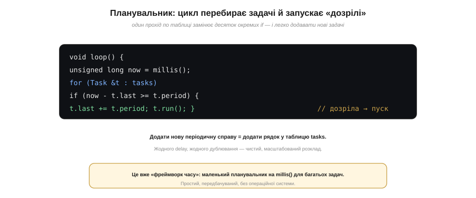
*Рис. 4.6.6.2. `loop()` бере поточний час і в циклі `for` перебирає таблицю задач: для кожної перевіряє `now - last >= period` і, якщо так, оновлює мітку й запускає дію. Один прохід по таблиці замінює десяток окремих `if`, а додати задачу = дописати рядок. Це вже маленький «фреймворк часу» на `millis()`.*

Виходить компактно й масштабовано. Ось як це виглядає в коді:

**Найпростіший планувальник на таблиці задач.**

```
struct Task {
  unsigned long period;   // як часто (мс)
  unsigned long last;     // коли востаннє
  void (*run)();          // що робити
};

Task tasks[] = {
  { 500,  0, toggleLed   },   // блимати
  { 100,  0, readSensor  },   // опитати давач
  { 1000, 0, updateLcd   },   // оновити екран
};

void loop() {
  unsigned long now = millis();
  for (Task &t : tasks)
    if (now - t.last >= t.period) {
      t.last += t.period;
      t.run();              // запускаємо дозрілу задачу
    }
}
```

Усього кілька рядків — а перед нами справжній, хай і простий, планувальник: він веде скільки завгодно періодичних задач, кожну в своєму ритмі, без `delay`, без дублювання. Саме так влаштовано чимало реальних прошивок.

> ⚙️ **А якщо подій не жменя, а тисячі?** Перебирати **весь** список щотіку — це O(N): для десятка задач байдуже, для тисяч таймерів — марнотратство. Тоді беруть спритнішу структуру — **колесо таймерів**, що торкається лише подій «на зараз». Як воно влаштоване — у вставці [Колесо таймерів](proj-timer-wheel.md).

Кілька слів для тих, кому `void (*run)()` ще незнайоме: це **вказівник на функцію**. У таблиці ми зберігаємо не саму дію, а «адресу», за якою лежить потрібна функція, тож `t.run()` означає «виклич ту функцію, що записана в цьому рядку». Такий прийом — серце будь-якого планувальника: він дозволяє тримати **список дій** і викликати їх однаково, не знаючи наперед, які саме. До речі, винаходити цей механізм щоразу не обов'язково — для Arduino є готові бібліотеки кооперативних планувальників, та корисно бодай раз зібрати його руками, щоб розуміти, що всередині.

Є й приємний побічний виграш такого розкладу: кожна задача стає **окремою маленькою функцією** (`toggleLed`, `readSensor`), яку легко прочитати, перевірити й змінити незалежно від інших. Програма з суцільного, заплутаного `loop()` перетворюється на охайний набір коротких справ — а це вже добра архітектура, а не лише економія рядків.

### Межа кооперативності: довга задача затримує всіх

Та цей планувальник має принципове обмеження, яке треба чітко розуміти. Він **кооперативний**: жодна задача не може **перебити** іншу. Запущена задача виконується **до кінця**, і лише потім планувальник переходить до наступної. А отже, якщо одна задача забариться, **усі** інші чекатимуть, навіть якщо їхній час давно настав.


*Рис. 4.6.6.3. Планувальник на `millis()` не витісняє задач: поки виконується довга задача B, задача C, чий час уже настав, мусить **чекати** її завершення. Жодна задача нікого не перебиває — лише чемно чекає черги. Тому кожна **мусить** бути короткою (як ISR у §4.5.3): одна «жадібна» задача псує таймінг усіх інших.*

Це той самий урок, що з обробником переривання (§4.5.3) і з `delay()` (§4.6.5): у кооперативній системі **кожна** задача має відпрацьовувати швидко й віддавати керування. Одна довга задача — і весь розклад «попливе». Тому довгі справи (складні обчислення, обмін даними) дроблять на короткі кроки через автомати станів (§4.6.5) або виносять у переривання. Кооперативний планувальник простий і надійний рівно доти, доки всі його задачі дисципліновано короткі.

Цю межу можна навіть порахувати. У кооперативній системі задача в найгіршому разі чекає на запуск стільки, скільки триває **один повний прохід** — сума тривалостей усіх інших задач, що встигли захопити час. Тож якщо ваші задачі по 50 мкс кожна, а їх двадцять, найбільша затримка — близько мілісекунди; якщо ж одна задача раптом триває 100 мс, то на всі 100 мс «провисне» весь розклад. Звідси й практичне правило проєктування: тримай найдовшу задачу набагато коротшою за найжорсткіший зі своїх строків.

### М'який і жорсткий реальний час

Тут саме час познайомитися з важливим поняттям — **реальним часом**. Програма «реального часу» — це не та, що працює «швидко», а та, що мусить устигати до **строків** (дедлайнів): зробити дію не колись, а **вчасно**. І строки бувають двох сортів.


*Рис. 4.6.6.4. **М'який** реальний час: пропустити строк — не катастрофа, лише трохи гірша якість (блимання збилося, дисплей оновився пізніше). **Жорсткий** реальний час: пропуск строку — відмова, інколи небезпечна (крок двигуна не в строк, подушка безпеки). Планувальник на `millis()` — для м'якого; жорсткий потребує апаратних таймерів або RTOS.*

**М'який** реальний час прощає випадкові запізнення: якщо світлодіод блимнув на 5 мс пізніше, ніхто не постраждає. Саме сюди й годиться наш кооперативний планувальник — він «зазвичай вчасно», і цього досить для переважної більшості задач. **Жорсткий** реальний час запізнень **не** прощає: пропущений строк означає поломку чи небезпеку. Тут кооперативного циклу замало — потрібні апаратні таймери (захоплення/порівняння §4.6.3, що діють без участі коду) або витісняючий планувальник операційної системи.

> 🔧 **Навіщо це.** Чесно оцінюйте, який реальний час вам потрібен. Для **переважної** більшості аматорських і багатьох промислових задач досить **м'якого** — і тоді простий планувальник на `millis()` ідеальний: його легко написати, легко зрозуміти, важко зламати. Не тягніть RTOS чи апаратні таймери туди, де блимання й опитування чудово живуть у суперциклі. А ось коли з'являється **жорсткий** строк (точний крок двигуна, аудіо, безпека) — отут і час спускатися до заліза чи операційної системи.

Тонкість, яку варто засвоїти: «м'яка» програма може мати **окремі жорсткі острівці**. Якщо в загалом неквапливому пристрої є одна по-справжньому критична за часом дія — точний імпульс, крок мотора, — її віддають **апаратному** таймерові (порівняння з §4.6.3) чи перериванню, а решту лишають кооперативному циклу. Тобто не обов'язково тягнути всю систему в жорсткий реальний час: достатньо забезпечити залізом ту єдину дію, що цього вимагає. Це найдешевший шлях — поєднати простий суперцикл із точковою апаратною точністю там, де вона справді потрібна.

Між м'яким і жорстким інженери виділяють ще й проміжний — **«твердий» (firm)** реальний час: запізнілий результат уже **марний**, та не небезпечний (наприклад, кадр відео, що спізнився, просто викидають). Та для практики досить пам'ятати головне розрізнення: чи коштує пропуск строку лише **якості** (м'який), чи означає **відмову** (жорсткий). Від цього й залежить, чи вистачить простого циклу на `millis()`, чи треба апаратний таймер. На щастя, більшість ваших задач — м'які, і це добра новина.

### Системний тік: ритм від таймера

Є й потужніший спосіб організувати розклад — не покладатися на швидкість `loop()`, а задати ритм **апаратно**. Налаштовують таймер бити перериванням рівно й часто (скажімо, раз на мілісекунду) — і цей удар називають **системним тіком** (system tick). Лічильник тіків стає єдиним джерелом часу для планувальника: задачі прив'язують до **кратних** тіків (кожен тік, кожен п'ятий, кожен сотий).

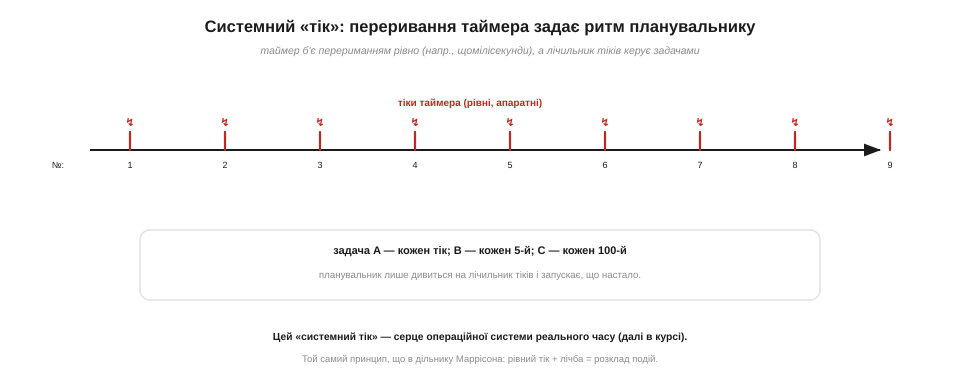
*Рис. 4.6.6.5. Таймер б'є перериванням рівно (наприклад, щомілісекунди) — це «тік». Планувальник дивиться лише на лічильник тіків і запускає задачі за розкладом: A щотіку, B щоп'ятого, C щосотого. Цей системний тік — серце операційної системи реального часу. І це той самий принцип, що в дільнику Маррісона (історія): рівний тік + лічба = розклад подій.*

Перевага тіку — у **рівності**: він приходить від апаратного таймера, а не від того, як швидко крутиться `loop()`, тож ритм планувальника стає точним і незалежним від завантаженості коду. Саме на системному тіку будують **операційні системи реального часу**: їхній планувальник прокидається на кожен тік і вирішує, кому віддати процесор. Наш цикл на `millis()` — спрощена, «безтікова» версія тієї самої ідеї.

У живому ESP32 такий системний тік **уже працює** — його забезпечує вбудована операційна система FreeRTOS, на якій крутиться навіть звичайний Arduino-скетч. Її таймер б'є рівно (типово близько тисячі разів на секунду, хоча це можна налаштувати), і саме на цьому тіку тримається перемикання задач, а заразом і `delay()` на ESP32 (він відмірює час у тіках). Частота тіку — компроміс: частіший дає тоншу роздільність планування, але й більше витрачає процесора на самі переривання. Тож навіть «простий» скетч на ESP32 насправді живе поверх тікового планувальника.

### Куди це веде: до справжнього планувальника

Підсумуймо й погляньмо вперед. Наш кооперативний розклад на `millis()` — це **суперцикл** (§4.6.5) у його розвиненій формі: акуратна таблиця задач, що крутиться в одному циклі. Він чудовий для м'якого реального часу й небагатьох дисциплінованих задач. Його межа — відсутність **витіснення**: довга задача блокує всіх, а термінову не можна пропхати поза чергою.

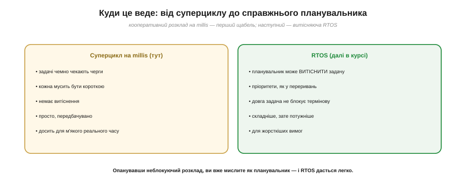
*Рис. 4.6.6.6. Ліворуч — суперцикл на `millis()` (тут): задачі чекають черги, кожна коротка, без витіснення, просто й передбачувано. Праворуч — RTOS (далі в курсі): планувальник може **витіснити** задачу заради терміновішої, з пріоритетами, як у переривань. Опанувавши неблокуючий розклад, ви вже мислите як планувальник — і RTOS дасться легко.*

Наступний щабель — **операційна система реального часу** (RTOS), якій присвячено окремий розділ наприкінці модуля. Її планувальник **витісняючий**: він може зупинити поточну задачу заради важливішої, як високопріоритетне переривання перебиває низьке (§4.5.4). Це складніше, зате знімає головну ваду кооперативного підходу. Та найважливіше: думаючи розкладом і періодами вже зараз, ви засвоюєте саме той спосіб мислення, на якому стоїть будь-який планувальник, — тож перехід до RTOS буде природним.

> 🔧 **Навіщо це.** Не поспішайте до RTOS. Дуже багато добротних пристроїв усе життя працюють на простому суперциклі з таблицею задач — і це не «недороблено», а **доречно**: менше складності, менше багів, легше зрозуміти. Беріться за операційну систему, коли реально впираєтесь у її переваги (жорсткі строки, складна багатозадачність, витіснення), а не «бо так серйозніше». Уміння писати чистий неблокуючий розклад — навичка, що окупається в кожному проєкті, з RTOS чи без.

І остання думка наперед. Кооперативний розклад і RTOS — **не** взаємовиключні: усередині окремої задачі операційної системи ви цілком можете крутити той самий неблокуючий цикл на `millis()`. Тобто навичка нікуди не дінеться — вона лиш стане одним поверхом більшої будівлі. А сама ідея ділити процесорний час між багатьма справами має поважний родовід: вона виросла з «розподілу часу» (time-sharing) великих машин 1960-х, до історії якого ми ще повернемося наприкінці модуля. Планувальник на вашому столі — прямий нащадок тих перших систем, що навчили один комп'ютер служити багатьом.

Отже, багато періодичних задач зручно зібрати в **таблицю** й доручити маленькому **планувальнику**, що перебирає її в `loop()` і запускає дозрілі. Такий планувальник **кооперативний** — не витісняє, тож кожна задача мусить бути короткою; його стихія — **м'який** реальний час. Точніший ритм дає **системний тік** від апаратного таймера, а наступний щабель — витісняюча RTOS. Ми вже вміємо й міряти час, і планувати події. Лишилася одна особлива роль таймера, про яку ми кілька разів згадували, — **сторож**, що рятує пристрій від зависань. Цей **watchdog** і завершує розділ у [наступній темі §4.6.7](timers.md).

## 4.6.7 Watchdog: таймер, що рятує від зависання

Завершимо розділ особливою роллю таймера — **сторожовою**. Хоч би як ретельно ви писали код, прошивка може **зависнути**: потрапити у вічний цикл, застрягти в очікуванні пристрою, що не відповідає, чи спіткнутися об рідкісну помилку, яку годі відтворити. Завислий пристрій — мертвий: він не реагує ні на що, і єдиний рятунок — перезавантаження. Та що, як до пристрою не дотягнутися рукою? Тут і виходить на сцену **watchdog** (сторожовий таймер) — апаратний охоронець, що сам перезапустить чип, якщо програма «замовкне». Це остання лінія оборони надійних вбудованих систем.

### Проблема: зависання, до якого не дотягнутися

Спочатку відчуймо, чому це серйозно. Програма може зависнути з багатьох причин: логічна помилка завела в нескінченний цикл; код чекає на відповідь давача, який заглух; стався збій пам'яті від перешкоди чи космічної частинки. Хоч би яка причина — наслідок один: процесор більше не просувається, пристрій не реагує, і «вилікувати» його може лише скид живлення.

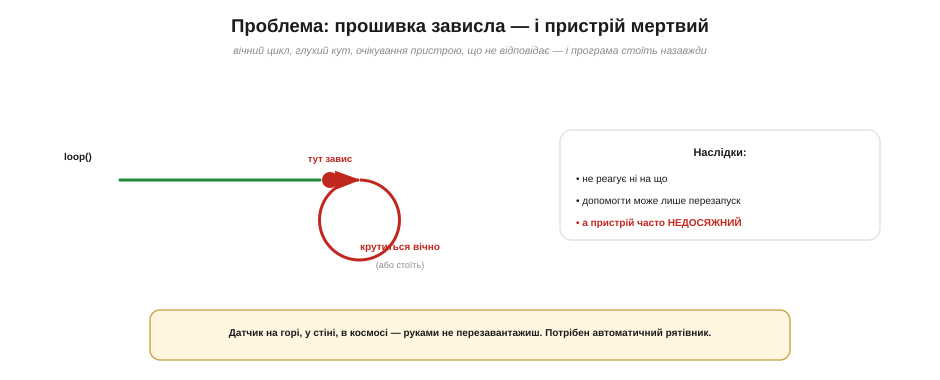
*Рис. 4.6.7.1. Прошивка застрягла — у вічному циклі чи в очікуванні. Пристрій не реагує ні на що, і допоможе лише перезапуск. Та біда в тім, що багато пристроїв **недосяжні**: давач на горі, контролер у стіні, апарат у космосі. Натиснути «reset» нікому — потрібен автоматичний рятівник.*

Саме недосяжність робить зависання нестерпним. Світлодіодний блимавчик на столі можна перемкнути вручну, та промисловий давач, метеостанцію на даху чи супутник — ні. А вимога працювати **місяцями без нагляду** означає, що навіть рідкісний, «раз на мільйон» збій колись та станеться. Покладатися лише на бездоганність коду тут наївно — потрібен механізм, що **сам** виявить зависання й оживить пристрій.

Окремо варто згадати збої, що **не** залежать від якості коду взагалі. Заряджена частинка (космічний промінь, природний радіаційний фон) здатна на льоту **перевернути біт** у пам'яті чи регістрі — це називають «одиничним збоєм» (SEU). У космосі це буденність, та зрідка трапляється й на Землі. Бездоганний код тут безсилий: його стан псує зовнішня фізика. І саме проти таких невловних, невідтворюваних збоїв watchdog незамінний — він не питає **чому** система зависла, а просто повертає її до життя.

### Watchdog: сторожовий таймер, що скине чип

Цей механізм гранично простий і елегантний. **Watchdog** — це окремий апаратний таймер, що невпинно відлічує час **вниз**. Якщо він дійде до нуля, він **перезавантажить** чип. А щоб цього не сталося, працездатна програма має раз у раз **«годувати»** його (англійською — *feed*, *kick* чи *pet*): скидати його лічильник назад до старту, доводячи цим «я ще жива й працюю». Поки програма крутиться — вона годує сторожа, і скиду не буває. Та щойно вона зависне, годувати стане нікому — лічильник дійде до нуля, і watchdog сам перезапустить систему.

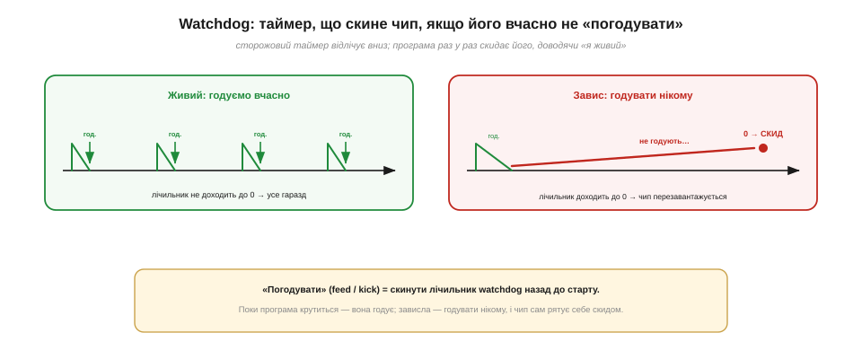
*Рис. 4.6.7.2. Ліворуч — здорова програма регулярно «годує» watchdog (скидає його лічильник), тож той не доходить до нуля. Праворуч — програма зависла, годувати нікому, лічильник добігає нуля — і чип **перезавантажується**. «Погодувати» означає просто скинути лічильник watchdog до початку; зависання вимикає це годування — і чип рятує себе сам.*

Краса ідеї в тому, що watchdog — **незалежний** від процесора вузол: він тікає від власного джерела й не залежить від того, що коїться в коді. Навіть якщо ядро намертво застрягло, сторож продовжує відлічувати — і доводить справу до скиду. Це **остання** лінія оборони: вона не запобігає зависанню, а **відновлює** систему після нього, повертаючи її до робочого стану без участі людини.

Незалежність watchdog часто сягає й **джерела такту**: багато сторожів тікають від власного, окремого генератора (простого RC-осцилятора), а не від головного кварцу. Це зроблено навмисне: якщо відмовить основний такт — а від нього залежить увесь чип, — звичайний таймер теж стане, а ось watchdog зі своїм генератором усе одно дорахує до нуля й перезавантажить систему. Тобто сторож стереже навіть від поломки самого «серцебиття» процесора — справді остання лінія оборони.

### Аналогія: «запобіжник пильності» машиніста

Найкраще суть watchdog передає старий залізничний винахід — **запобіжник пильності** (його ще звуть «вимикачем мерця»). Машиніст поїзда мусить раз у раз натискати педаль чи кнопку, підтверджуючи, що він при тямі. Поки натискає — поїзд їде. Та якщо машиніст знепритомнів і педаль лишилася відпущеною надто довго, система **сама** зупиняє поїзд, рятуючи від катастрофи.

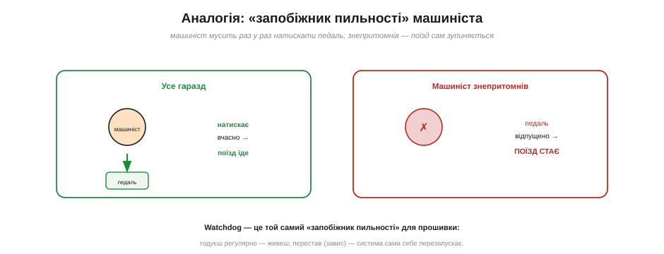
*Рис. 4.6.7.3. Машиніст регулярно натискає педаль — поїзд їде; знепритомнів, педаль відпущено — поїзд сам зупиняється. Watchdog — це той самий «запобіжник пильності» для прошивки: годуєш регулярно (натискаєш) — система живе; перестав (завис) — вона сама себе перезапускає.*

Аналогія точна до дрібниць: «натискання педалі» — це годування watchdog, а «зупинка поїзда» — автоматичний скид. І сенс той самий: система не довіряє безперервній справності оператора (чи коду), а вимагає **постійного доказу життя** — і діє, щойно той доказ зникає.

Те саме спостерігаємо й у людських системах безпеки. Самотній працівник на небезпечній ділянці раз у раз тисне кнопку «я в нормі»; перестав — висилають допомогу. Альпініст виходить на зв'язок за розкладом; зник — починають пошук. Усюди той самий принцип: довіряй не обіцянці справності, а **регулярному сигналу життя** — і дій, коли сигнал обірвався. Watchdog переносить цю давню ідею безпеки у світ кремнію.

### Де годувати правильно

А тепер найважливіша тонкість, на якій ламається багато новачків. Годувати watchdog треба **не абияк**, а саме там, де це **доводить**, що програма реально просувається. Звична правильна точка — кінець головного циклу: якщо `loop()` дійшов донизу здоровим, він годує сторожа; а якщо завис десь усередині — до годування не дійде, і станеться рятівний скид.

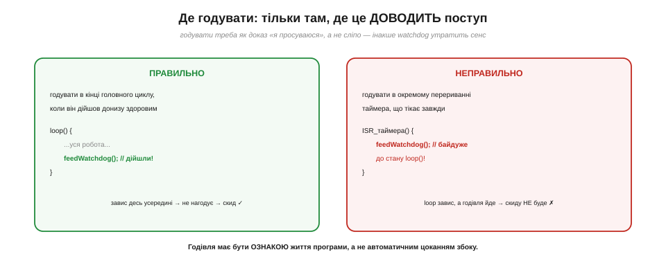
*Рис. 4.6.7.4. Праворуч — **помилка**: годувати watchdog у незалежному перериванні таймера, що тікає завжди. Тоді навіть якщо `loop()` намертво застряг, годування йде, і скиду **не буде** — сторож засліплений. Ліворуч — **правильно**: годувати в кінці `loop()`, як доказ, що цикл проходить здоровим. Годівля має бути **ознакою життя програми**, а не автоматичним цоканням збоку.*

Це і є золоте правило watchdog: **годівля мусить бути доказом поступу**. Найгірша помилка — годувати сторожа «наосліп», з місця, що працює незалежно від основної програми (наприклад, із переривання таймера). Тоді watchdog годуватиметься, навіть коли головний код давно мертвий, — і весь сенс охорони втрачено. Годуйте лише там, де проходження цієї точки справді означає, що система жива й рухається вперед.

> ⚙️ **А якщо задач багато?** Тоді одного «місця поступу» мало: треба, щоб **кожна** важлива задача підтвердила, що жива. Прийом — **чекпойнти**: кожна задача відмічається, а годуємо watchdog, лише коли **всі** відмітились нещодавно. Як це зробити — у вставці [Як «годувати» watchdog правильно](proj-watchdog-feed.md).

> 🔧 **Навіщо це.** Запам'ятайте: watchdog корисний рівно настільки, наскільки чесна його годівля. Найпідступніша помилка — «заткнути» зайві скиди, годуючи сторожа надто часто чи з неправильного місця: так ви глушите сигнал тривоги, замість лікувати причину. Якщо watchdog зрідка скидає пристрій — це **симптом**, а не ворог: шукайте, де код застрягає чи що триває довше за таймаут. Годуйте watchdog як свідчення «усе йде за планом», а не як набридливий будильник, що його хочеться вимкнути.

Найсуворіші watchdog ідуть ще далі — вони **віконні** (windowed): годувати їх можна не лише «не запізно», а й «не зарано». Тобто є вікно часу, у яке має влучити годівля; нагодуєш надто **рано** — і це теж вважається помилкою. Навіщо? Бо «оскаженілий» код, що застряг у щільному циклі, міг би годувати сторожа надто **часто** й тим маскувати свій збій. Віконний watchdog ловить і таке: здорова програма годує рівно в ритм, а збита — або зарано, або запізно.

### Спершу попередження, потім скид

Багато watchdog уміють не просто рубати з плеча, а діяти у два кроки. Спершу, не дочекавшись годівлі, сторож піднімає коротке **переривання-попередження** — даючи програмі останній шанс зробити щось корисне: зберегти важливі дані, записати в журнал причину, акуратно вимкнути небезпечні виходи. І лише якщо й після цього годівлі немає, watchdog виконує **скид**.

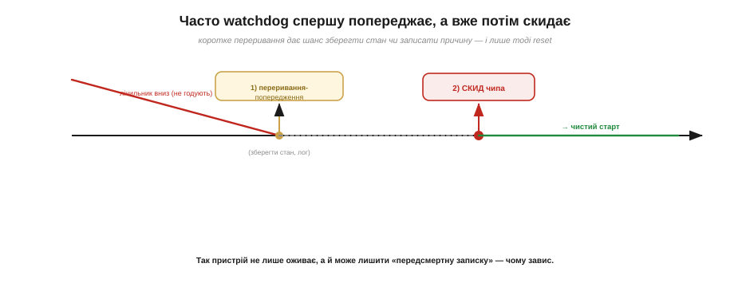
*Рис. 4.6.7.5. Двокроковий watchdog: коли лічильник майже добіг нуля, спершу спрацьовує коротке **переривання-попередження** (зберегти стан, записати причину), а вже потім — **скид** чипа й чистий старт. Так пристрій не лише оживає, а й може лишити «передсмертну записку» — чому він завис.*

Це робить watchdog не лише рятівником, а й **слідчим**: «передсмертна записка» (наприклад, адреса, де код застряг, чи стан змінних) безцінна для пошуку причини зависання. Без неї ви знали б лише, що пристрій час від часу перезавантажується; з нею — маєте слід, який веде до справжнього баґа. Тож двокроковий watchdog і відновлює систему, і допомагає її **полагодити** назавжди.

Watchdog — не єдина така сітка безпеки в чипі. Поряд із ним зазвичай працює **детектор просідання живлення** (brown-out): якщо напруга впала нижче безпечної (сіла батарея, стрибок навантаження), він теж перезавантажує чип, не даючи йому виконувати код «на голодному пайку», де можливі будь-які дивацтва. Разом watchdog і детектор живлення прикривають дві найпідступніші біди автономних пристроїв — зависання й нестабільне живлення, — і обидва варто вмикати в усьому, що має працювати надійно.

### Watchdog у ESP32

У ESP32 сторожів навіть **двоє**, і вони стережуть різні види зависань. **Задачний watchdog** (Task WDT) стежить, чи всі задачі (зокрема й ваш `loop()`) регулярно дістають час на ядрі; якщо якась задача надовго «захопила» процесор і не віддає його, він б'є тривогу. **Перериваннєвий watchdog** (Interrupt WDT) ловить інше — коли переривання вимкнені занадто довго (задовга критична секція §4.5.6 чи завислий обробник), через що система «німіє».

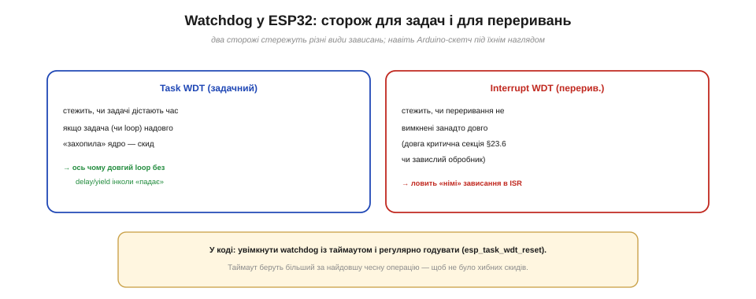
*Рис. 4.6.7.6. **Task WDT** стежить, чи задачі (і `loop`) дістають час, — ось чому довгий `loop()` без `delay`/`yield` інколи «падає» зі скидом. **Interrupt WDT** ловить «німі» зависання, коли переривання вимкнені занадто довго. У коді watchdog вмикають із таймаутом і регулярно годують; таймаут беруть більший за найдовшу чесну операцію, щоб не було хибних скидів.*

Саме через задачний watchdog новачки інколи бачать загадкове «Task watchdog got triggered», запхавши в `loop()` довге блокування без перерви, — і це, по суті, сторож виконує свою роботу. Користуватися watchdog у коді просто: його вмикають із вибраним **таймаутом** і регулярно годують (в ESP-IDF — функцією на кшталт `esp_task_wdt_reset`). Головне рішення — правильний таймаут.

**Налаштувати watchdog: увімкнути, годувати, обрати таймаут.**

```
// Псевдокод суті (деталі API залежать від середовища):

watchdogEnable(5000);        // таймаут 5 секунд

void loop() {
  doWork();                  // якщо завис ТУТ — до feed не дійде
  watchdogFeed();            // дійшли здоровими → скидаємо лічильник
}

// Таймаут 5 с має бути БІЛЬШИЙ за найдовшу чесну ітерацію loop(),
// інакше watchdog скидатиме пристрій без причини (хибні спрацювання).
```

Таймаут — це компроміс. Замалий — і watchdog скидатиме пристрій під час законних, але довгеньких операцій (хибні спрацювання). Завеликий — і пристрій надовго «зависатиме» перед рятівним скидом. Тому беруть таймаут із запасом **більший** за найдовшу нормальну ітерацію, але не настільки великий, щоб користувач устиг помітити «мертвий» пристрій.

Насправді в ESP32 сторожів навіть **три**: до задачного й перериваннєвого додається ще **RTC-watchdog**, що тікає від найживучішого, RTC-домену й стереже навіть **завантаження** — якщо чип застрягне ще до старту вашої програми (приміром, у завантажувачі), оживить його саме він. І остання практична дрібниця: під час налагодження покроково watchdog заважає (поки ви «стоїте» на точці зупину, він вважає це зависанням і скидає), тож на час відлагодження його зазвичай тимчасово вимикають — а в робочій прошивці неодмінно вмикають назад.

> 🔧 **Навіщо це.** Для будь-якого пристрою, що працює без нагляду чи має бути надійним, **вмикайте watchdog** — це дешева страховка від рідкісних, невловних зависань. Та користуйтеся ним чесно: годуйте з місця, що доводить поступ, обирайте таймаут із запасом і **не глушіть** його скиди, а розслідуйте їх. Watchdog не замінює доброго коду — він рятує тоді, коли добрий код усе ж спіткнувся об щось непередбачене. Це остання сітка безпеки, і добре, коли вона є, та погано покладатися на неї щодня.

Отже, watchdog — це апаратний сторож, що сам перезапускає завислий пристрій: програма регулярно «годує» його як доказ життя, а щойно годівля зникне (код завис), настає рятівний скид. Годують його лише там, де це доводить поступ, із таймаутом, більшим за найдовшу чесну операцію, — і вмикають у всьому, що має працювати надійно й без нагляду.

## 4.6.8 RTC і реальний час: годинник, що йде уві сні

Усі годинники, які ми досі будували, мали одну спільну ваду. `millis()` і `micros()` (§4.6.4) — чудові секундоміри, але рахують вони час **від увімкнення**: щойно подали живлення, лічильник пішов від нуля, а вимкнули — і він **забув усе**, наступного разу почавши знову з нуля. Такий годинник відповідає на питання «скільки я вже працюю?», та геть безпорадний перед іншим, не менш важливим: «а **котра зараз година** насправді? яке сьогодні число?». Для журналу з реальними мітками часу, для «увімкни обігрів о сьомій ранку», для «скільки днів тому це сталося» потрібен **інший** годинник — той, що знає **справжній**, календарний час і не забуває його при вимкненні. Це і є **RTC** — *Real-Time Clock*, годинник реального часу.

Уявімо простий приклад — реєстратор температури, що раз на годину записує показник. Із самим `millis()` у журналі стоятимуть мітки на кшталт «через 3 600 000 мс від старту» — а коли пристрій перезавантажиться, відлік піде з нуля, і ви вже не складете, **коли** саме що сталося. З RTC кожен запис дістає чесну мітку «2026-06-11 14:00», і журнал лишається зрозумілим крізь будь-які вимкнення. Різниця між «корисними даними» і «купою чисел без прив'язки до часу» — саме в цьому годиннику.

### Дві різні «годинники»

Розрізнімо їх чітко, бо плутанина тут часта (Рис. 4.6.8.1). `millis()` — це **секундомір**: рахує мілісекунди від старту, і на кожне вимкнення скидається в нуль, стираючи історію. RTC — це **настінний годинник**: він тримає повну календарну дату й час (рік, місяць, день, години, хвилини, секунди), іде собі далі й переживає вимкнення. Перший каже «минуло стільки-то від увімкнення», другий — «зараз така-то мить у світі». Обидва потрібні, але для **різного**: millis — щоб відмірювати проміжки в роботі, RTC — щоб знати абсолютний момент.

Зверніть увагу: це не суперники, а **напарники**. У реальному пристрої вони працюють разом — RTC каже, **який зараз момент** (поставити мітку, спланувати на завтра), а `millis()` точно відмірює **короткі проміжки** в роботі (зачекати 50 мс, опитати раз на секунду). RTC цокає секундами й годинами — для мікросекундних інтервалів він заграбий; millis цокає мілісекундами — але не знає календаря. Кожен робить своє, і добрий код бере від кожного його сильний бік.


*Рис. 4.6.8.1. millis() рахує від увімкнення й скидається в нуль при вимкненні — це секундомір «скільки я працюю». RTC тримає календарну дату й час, іде далі навіть уві сні й переживає вимкнення — це годинник «котра зараз година у світі».*

### Як машина зберігає час: epoch

А як узагалі записати «момент часу» одним зрозумілим машині способом? Людський запис — «11 червня 2026, 14:30:00» — незручний для обчислень: щоб відняти одну дату від іншої, довелося б морочитися з місяцями різної довжини й високосними роками. Тому машини зберігають час **простіше** — як **одне велике число**: скільки **секунд** минуло від умовної точки відліку (Рис. 4.6.8.2). Цю точку прийнято класти на **1 січня 1970 року** (за всесвітнім часом UTC), а саме число звуть **Unix-часом**, або **epoch**.

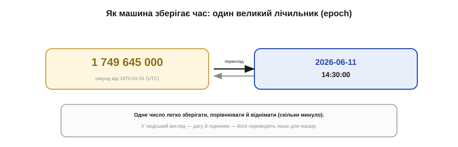
*Рис. 4.6.8.2. Машина зберігає момент часу як одне число — секунди від 1 січня 1970 (UTC). Його легко зберігати, порівнювати й віднімати; у звичну дату-годинник його переводять лише для показу.*

Принада такого запису — у його простоті. Одне число легко **зберігати** (кілька байтів), легко **порівнювати** (більше число — пізніший момент) і легко **віднімати** (різниця двох — це скільки секунд між подіями, без жодної календарної мороки). А в людський вигляд — дату й годинник — його переводять лише наприкінці, **для показу**. Так машина рахує час «у секундах від 1970-го», а ви бачите звичні «11 червня, 14:30».

Корисно відчути масштаб цього числа. Секунд від 1970 року набігло вже понад **півтора мільярда** — тож зберігають його в широкому, 32- чи краще 64-бітному полі (про те, чому 32 біти колись стануть тісними, — окрема історія наприкінці теми). А обчислення з ним справді тривіальні: щоб дізнатися, скільки минуло між двома подіями, просто **віднімаємо** їхні epoch-числа й дістаємо секунди; щоб порівняти, що раніше, — порівнюємо числа. Жодних «а скільки днів у лютому» — уся календарна морока відкладена на самий кінець, коли число треба показати людині.

А чому точка відліку — саме 1970-й? Без особливої містики: це приблизно тоді, коли народжувалися системи, що першими так лічили час, і дату просто **домовилися** взяти за нуль. Важлива не сама дата, а те, що вона **спільна**: коли всі рахують від однієї точки, числа різних пристроїв означають той самий момент і їх можна порівнювати без перекладача.

### Годинник, що йде уві сні

Тепер головна суперсила RTC, винесена в назву теми (Рис. 4.6.8.3). Звичайному годиннику потрібне живлення, щоб цокати, — а пристрій то спить, то вимикається. RTC розв'язує це **крихітною батарейкою** (часто — пласка «таблетка»), що живить **лише годинник** і більше нічого. Решта чипа може спати, бути знеструмленою чи навіть від'єднаною від основного живлення — а RTC на своїй батарейці **знай собі цокає**, тримаючи час. Тому, прокинувшись хоч за годину, хоч за тиждень, пристрій одразу знає правильний час — не питаючи нікого. Звідси й образ: **годинник, що йде уві сні**, поки весь пристрій спочиває.

Це особливо рятує **автономні** пристрої на батарейках. Датчик, що прокидається раз на годину — виміряти й заснути назад, — більшість часу **вимкнений** майже повністю, заради економії заряду. Без годинника, що йде уві сні, він, прокинувшись, не мав би уявлення, котра година, і не зміг би ні поставити чесну мітку, ні діяти за розкладом. А RTC на своїй краплі струму дає йому це знання задарма: проспав — прокинувся — одразу знаєш точний час.

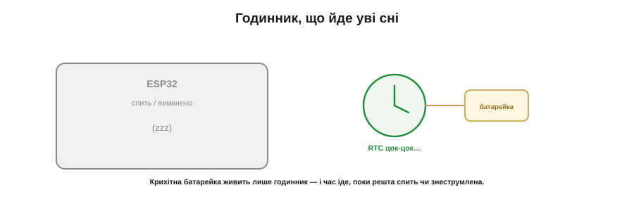
*Рис. 4.6.8.3. Крихітна батарейка живить лише годинник. Решта ESP32 спить чи знеструмлена — а RTC знай собі цокає, тримаючи час. Прокинувшись хоч за тиждень, пристрій одразу знає правильний момент.*

### Внутрішній RTC ESP32 проти зовнішнього

Тут варто знати важливу подробицю саме про ESP32 (Рис. 4.6.8.4). У нього є **власний, вбудований** RTC — і він уміє йти під час **глибокого сну** (deep sleep), тримаючи час, поки чип дрімає між пробудженнями. Це зручно, й часто цього досить. Та в нього дві слабкості: по-перше, без зовнішньої батарейки він **втрачає** час при **повному** знеструмленні (висмикнули живлення — і годинник обнулився); по-друге, його дешевенький внутрішній генератор помітно **дрейфує** — час біжить не зовсім рівно.


*Рис. 4.6.8.4. Внутрішній RTC ESP32 іде в глибокому сні, але без батарейки втрачає час при повному вимкненні й помітно дрейфує. Зовнішній модуль DS3231-класу має власну батарейку (час живе роками), термокомпенсацію (малий дрейф) і вихід-будильник.*

Коли потрібен **точний** і **тривкий** час — той, що переживе будь-яке вимкнення й не збреше за місяці, — ставлять **зовнішній RTC-модуль** класу **DS3231**. У нього власна батарейка (час живе **роками**), вбудована **термокомпенсація** (про неї за мить) і навіть окремий вихід-будильник. Правило просте: досить пережити сон — вистачить внутрішнього RTC; треба надійний календарний час назавжди — берімо зовнішній.

Зовнішній модуль під'єднують кількома дротами по шині **I²C** — як і багато інших давачів, — і далі читають із нього готові рік-місяць-день-години. Та хоч би який RTC ви взяли, лишається спільний клопіт: годинник треба бодай **раз виставити** на правильний час. Внутрішній — після кожного повного знеструмлення; зовнішній із батарейкою — один раз, і він триматиме його роками. Звідси й типовий вибір: пристрій у мережі радше виставлятиме час сам, із NTP; пристрій без мережі потребує батарейного DS3231, якому досить одного налаштування.

> 🔌 **Залізна сторона.** Як влаштований і підключається модуль DS3231-класу — батарейка, термокомпенсація, alarm-вихід — у вставці [RTC-модуль DS3231-класу](comp-rtc-module.md).

### Дрейф: кожен годинник бреше потроху

Чому взагалі годинник «бреше»? Бо **жоден** годинник не йде ідеально рівно (Рис. 4.6.8.5). Його серце — кварцовий резонатор (згадайте історію розділу) — коливається майже, але **не точно** на своїй частоті: трішки швидше або трішки повільніше. Цю похибку міряють у **ppm** (*parts per million*, мільйонних частках) або в секундах за добу. І хоч яка вона мала, вона **накопичується**.


*Рис. 4.6.8.5. Похибка ходу мала, але росте з часом. Дешевий RTC (~20 ppm) збігається десь на хвилину за місяць; термокомпенсований DS3231 (~2 ppm) — на лічені секунди. Тому час доводиться час від часу звіряти.*

Полічімо. Дешевий RTC із похибкою близько **20 ppm** збігається на 20 мільйонних від доби — це приблизно **1.7 секунди на добу**, тобто десь **хвилину на місяць**. За рік — чверть години! А ось термокомпенсований DS3231 тримає всього **~2 ppm** (бо вміє враховувати, як на кварц впливає температура) — це лічені **секунди на місяць**. Звідси й мораль: похибка ходу — не дрібниця на тлі тижнів і місяців, і якщо час має лишатися точним, його доведеться час від часу **звіряти**.

Чому ж термокомпенсація так допомагає? Бо головний ворог кварцу — **температура**: нагрівся чи охолов резонатор, і його частота трохи попливла. Звичайний RTC цього не враховує, тож на спеці чи морозі бреше сильніше. DS3231 же має всередині датчик температури й **підправляє** хід під неї — тому й тримає свої ~2 ppm у широкому діапазоні. А практичне питання «як часто звіряти» розв'язується просто: поділіть свій допуск на похибку. Терпите розбіжність до хвилини, а годинник дрейфує на хвилину за місяць, — отже, звіряйте раз на місяць; треба точність до секунди — звіряйтеся частіше або беріть точніший годинник.

### Синхронізація: звіряти з еталоном

А звіряти — з чим? Із **еталоном** точного часу (Рис. 4.6.8.6). Найзручніший для підключеного пристрою — **NTP** (*Network Time Protocol*, мережевий протокол часу): ESP32 через Wi-Fi питає в сервера точного часу «котра зараз година?», отримує бездоганний UTC і **виставляє** свій годинник наново. Дрейф, що накопичився, цим обнуляється. Роблять це періодично — скажімо, раз на добу, — і годинник лишається точним без жодного зовнішнього модуля. Крім NTP, точний час уміють давати **GPS** (супутники несуть атомний годинник) і спеціальні **радіосигнали** часу.

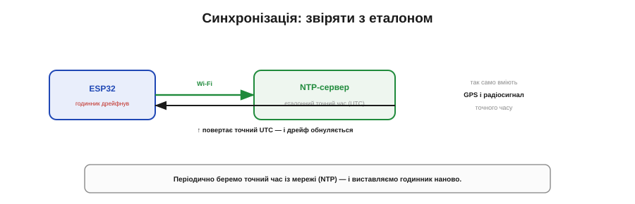
*Рис. 4.6.8.6. Періодична синхронізація: ESP32 через Wi-Fi питає точний час у NTP-сервера, отримує еталонний UTC і виставляє годинник наново — накопичений дрейф обнуляється. Так само точний час дають GPS і радіосигнали.*

Звідси гарне поєднання для ESP32: внутрішній RTC тримає час між синхронізаціями (і переживає сон), а періодичний NTP-запит **підтягує** його до істини, гасячи дрейф. Якщо ж мережі немає — тоді на сцену виходить зовнішній DS3231, чий малий власний дрейф дозволяє довго обходитися **без** звіряння.

Дрібний, але приємний нюанс NTP: він враховує навіть **затримку** дороги до сервера й назад, тож виставляє час із похибкою в лічені мілісекунди — куди точніше, ніж потрібно більшості пристроїв. На практиці ESP32 зазвичай питає час одразу по під'єднанні до Wi-Fi, а потім зрідка повторює, щоб гасити дрейф. Головне — не сподіватися на мережу там, де її може не бути: для пристрою, що працює в полі без зв'язку, синхронізація — розкіш, і тоді весь тягар точності лягає на сам годинник.

### Як пристрій уперше дізнається час

Лишається питання, з якого все починається: звідки пристрій **узагалі** бере час уперше? Сам по собі свіжий мікроконтролер не має жодної гадки, котра година, — годинник треба чимось **завести**. Шляхів кілька. Перший — **з мережі**: під'єднався до Wi-Fi, спитав NTP — і час є. Другий — **з батарейного RTC**: модуль DS3231, якому час виставили колись давно, просто **віддає** збережене, не питаючи нікого. Третій — **вручну**: користувач виставляє час кнопками чи через застосунок (як на старій мікрохвильовці, що блимає «12:00», доки її не наладнаєш). Четвертий — **з GPS**, якщо він є на борту. Часто ці способи поєднують: батарейний RTC дає час одразу при старті, а NTP, щойно з'явиться мережа, уточнює його. Головне розуміти: без жодного з цих джерел пристрій лишиться тим самим «блимаючим 12:00» — знатиме, що час іде, але не знатиме, який саме.

### Чому зберігають UTC

Остання, але важлива звичка: **усередині** час тримають у **UTC** — єдиному всесвітньому часі без поясів і переведення стрілок. А місцевий час (із вашим часовим поясом і літнім/зимовим зсувом) обчислюють **лише для показу** користувачу. Так уникають цілого болота помилок: збережений UTC однозначний, його не зіпсує ні переїзд через пояс, ні переведення годинників навесні. Перевести UTC у місцеву дату — це вже календарна арифметика, варта окремої розмови.

Щоб відчути, від чого це рятує, уявіть, що ви зберегли «02:30 ночі 27 жовтня» — а саме тієї ночі годинники переводять назад, і «02:30» трапляється **двічі**. Котра з них? Або переїхали з пристроєм через часовий пояс — і всі збережені мітки раптом «зсунулися». UTC такого не знає: він тече рівно, без стрибків і поясів. Тому золоте правило — **зберігай UTC, показуй місцеве**.

> 🧮 **Календарна математика.** Як із секунд-epoch дістати рік-місяць-день, звідки беруться високосні роки й часові пояси та чому скрізь зберігають саме UTC — у вставці [Unix-час і календар](math-calendar-math.md).

> 📜 **Коли переповнюється сам час.** Проблема 2000 року й 2038-го — що буде, коли великий лічильник секунд дійде до краю, — історія у вставці [Y2K і 2038](hist-y2k-2038.md).

> 🔧 **Навіщо це.** Якщо вашому пристрою треба **знати справжній час** — ставити мітки в журналі, діяти за розкладом, рахувати дати, — самого `millis()` мало: він не переживає вимкнення й не знає календаря. Тоді беруть RTC: для підключеного пристрою часто досить внутрішнього RTC плюс періодичний **NTP**; для автономного, що мусить знати час і без мережі, — зовнішній **DS3231** із батарейкою. І завжди тримайте час **в UTC** усередині, переводячи в місцевий лише на екрані. Тоді журнал матиме чесні дати, будильники спрацюють вчасно, а пристрій не блиматиме «12:00» після кожного вимкнення.

Підсумуймо. **RTC** — це годинник, що знає **справжній, календарний** час і не забуває його, бо йде на власній батарейці навіть уві сні. Момент часу машина зберігає як **epoch** — одне число секунд від 1970-го. Будь-який годинник **дрейфує**, тож точний час підтримують **синхронізацією** з еталоном (NTP, GPS), а всередині тримають **UTC**, переводячи в місцевий лише для показу. ESP32 має внутрішній RTC (іде в сні, але дрейфує й гине без батарейки); для надійного, тривкого часу беруть зовнішній DS3231.

Цим ми завершуємо розділ про **час**. Ми пройшли його повністю: від ідеї рівного «тіку» (кварц із історії) до апаратного **лічильника-таймера** (§4.6.1), навчилися робити **періоди** через переповнення й авто-перезавантаження (§4.6.2), апаратно міряти й генерувати сигнали **захопленням і порівнянням** (§4.6.3), зазирнули в нутрощі `millis`/`micros` (§4.6.4), відмовилися від згубного `delay()` на користь **неблокуючого** коду (§4.6.5), збудували з нього **планувальник** для багатьох задач (§4.6.6), поставили **watchdog** як останню сторожу (§4.6.7) і, нарешті, навчили пристрій знати **справжній календарний час** — RTC (§4.6.8). Тепер мікроконтролер не лише реагує на світ умить (Розділ 4.5), а й точно відмірює час, діє за розкладом і знає, котра зараз година у світі. А наступний крок — навчити цифрову ніжку «вдавати аналог»: керувати яскравістю, швидкістю, потужністю плавно, а не лише «увімк/вимк». Цей місток між цифровим і аналоговим — **ШІМ і ЦАП** — і відкриває наступний розділ.

> ▶️ Далі: [Розділ 4.7 — PWM і ЦАП](../pwm-dac/pwm-dac.md)
