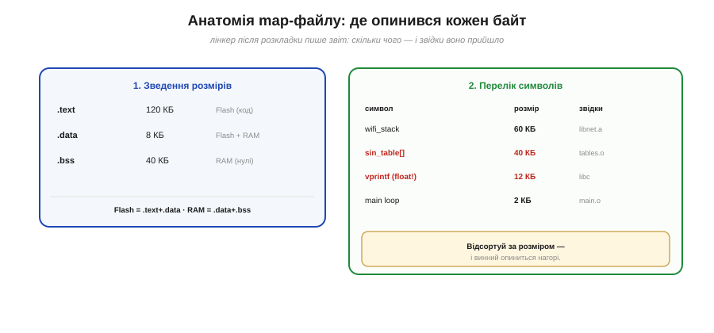
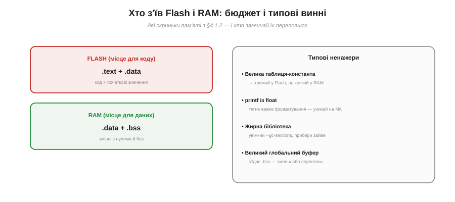

# ⚙️ Читання map-файлу: хто з'їв Flash і RAM

> Алгоритмічна вставка до **теми [§4.2.4 «Образ прошивки й карта пам'яті»](toolchain.md)**. Рано чи пізно прошивка **не влізе** у Flash або в неї скінчиться RAM. Питання «хто стільки з'їв?» має точну відповідь — і дає її **map-файл**.

## Задача

Збірка падає з «region overflowed» — або працює, та раптом бракує RAM. Винного не видно «на око»: байти розкидані по сотнях функцій, таблиць і бібліотек. Треба знайти **конкретного ненажеру** — символ чи бібліотеку, що з'їла найбільше, — щоб знати, що різати.

## Ідея: лінкер лишає звіт

Розкладаючи символи по адресах (§4.2.3), лінкер **знає про кожен байт усе**: де він, якого розміру, з якого об'єктного файлу чи бібліотеки прийшов. За одним прапорцем (`-Map`) він виписує це в **map-файл** — докладний звіт із двох корисних частин (Рис. 4.2.4a.1).


*Рис. 4.2.4a.1. Дві частини map-файлу. **Зведення розмірів** — скільки в кожній секції (.text/.data/.bss) і куди вона лягає (Flash чи RAM). **Перелік символів** — кожен символ, його розмір і **звідки** він (об'єктний файл чи бібліотека). Відсортуй перелік за розміром — і винний нагорі.*

## Як читати: спершу бюджет, потім винний

Порядок дій простий і завжди той самий:

```
1. Бюджет (із зведення):
     Flash = .text + .data      ← код + початкові значення
     RAM   = .data + .bss        ← змінні (з нулями й без)
   → видно, чого саме бракує: місця під код (Flash) чи під дані (RAM).

2. Винний (із переліку):
     відсортувати символи за розміром ↓
     перший-другий рядки — це майже завжди він.
```

Цей зв'язок секцій із Flash і RAM ми вже бачили в §4.2.4 і §4.1.2; map-файл лише прикладає до нього **числа** (Рис. 4.2.4a.2). Якщо переповнився Flash — дивись найбільші у `.text`; якщо RAM — найбільші в `.bss` і `.data`.


*Рис. 4.2.4a.2. Дві скриньки пам'яті й хто їх переповнює. Flash тримає код і початкові значення; RAM — змінні. Праворуч — типові винні: велика таблиця-константа, `printf` із плаваючою комою, жирна бібліотека, великий глобальний буфер.*

## Складність і пастки на МК

- **`printf` з плаваючою комою** — класичний прихований ненажера: підтримка формату `%f` тягне важкий код форматування. На МК його часто свідомо вимикають або беруть полегшену версію.
- **Велика таблиця-константа** має лежати у **Flash**, а не копіюватися в дефіцитну RAM. Якщо вона раптом у `.data` (тобто в RAM) — позначте її як константу, щоб лишилася у Flash (прийом із §4.1.2).
- **Жирна бібліотека** тягне за собою все, що ви з неї торкнулися, ще й сусіднє. Тут рятує **відкидання невжитого** лінкером (`--gc-sections` разом із `-ffunction-sections`): мертвий код просто не потрапляє в образ (споріднене з прибиранням невжитого в [оптимізаторі](proj-optimizer.md)).
- **Великий глобальний буфер** тихо з'їдає `.bss`. Map-файл одразу показує його розмір — часто виявляється, що буфер удесятеро більший, ніж треба.
- **Не лякайтеся обсягу.** Map-файл величезний; не читайте його підряд. Спершу гляньте коротке **зведення розмірів** (та сама інформація, що й у size-звіті з §4.2.4) — воно скаже, **чого** бракує; і вже тоді шукайте винного в переліку, сортуючи за розміром.
- **Міряй, а тоді ріж.** Не ужимайте код навмання: спершу map-файл показує, **що** саме завелике, і вже тоді ви ріжете винного. Інакше згаєте день, оптимізуючи те, що й так дрібне. Map-файл перетворює невиразне «десь забагато» на точне «ось цей символ — ось стільки байтів».

> ▶️ Повернутися до теми: [§4.2.4 — Образ прошивки й карта пам'яті](toolchain.md)
