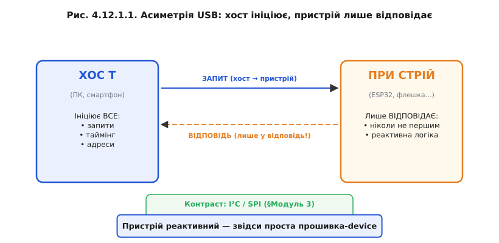
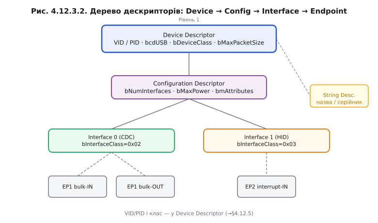
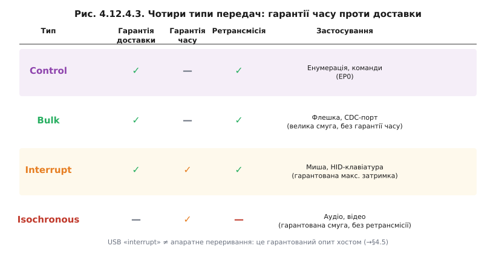
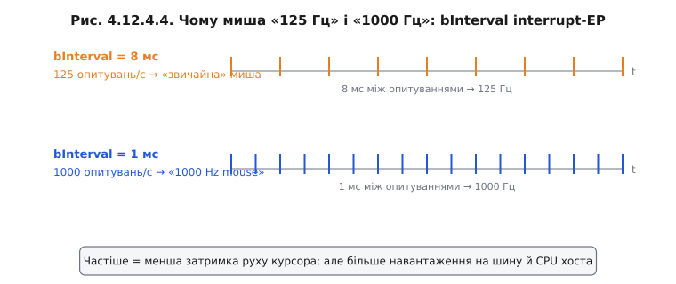
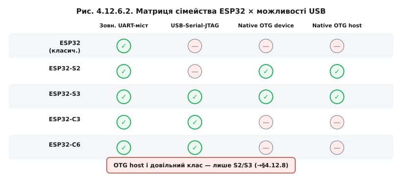
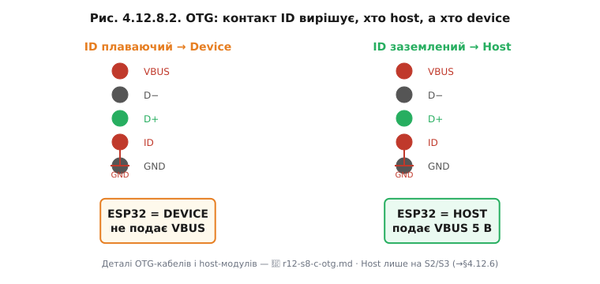

# Розділ 4.12 — USB на мікроконтролері

<!-- Головний файл: r12-usb-mcu.md. Нумерація тем 4.12.1–4.12.8; фігури «Рис. 4.12.Т.k». Папка: r12-usb-mcu/, фігури → img/, генератор figs.py (імпорт зі svgkit). Канон — ../AUTHORING.md. Спиратися лише на модулі 1–4; module 6/7 — лише як «▶️ Далі»/короткий лінк-вперед, без пояснення змісту. -->

Якщо ви вже пройшли §4.2.5 і §4.2.6, то, мабуть, зустрічали таке: підключаєш DevKit до ноутбука кабелем, операційна система розпізнає новий COM-порт, і все — можна заливати прошивку й читати Serial. Але що саме відбувається всередині того кабелю? Якщо уважно придивитися до схеми DevKit, ви помітите окремий чип: CP210x, CH340, FT232 або подібний. Цей чип — USB-UART-міст (§4.2.5🔌). Мікроконтролер ESP32 спілкується з ним через звичайний послідовний порт (UART), а міст перетворює це на USB-CDC і надає операційній системі знайомий COM-порт. Тобто до цього моменту USB для нас був просто «чорним кабелем, по якому тече прошивка й Serial», а реальний USB-стек жив у зовнішньому чипі.

Тепер ми відкриваємо сам кабель.

Чому USB взагалі з'явився? Наприкінці 1990-х на задній панелі комп'ютера стирчало з пів десятка різних роз'ємів: DB-9 для миші й модему, DB-25 для принтера, PS/2 для клавіатури, SCSI для жорстких дисків, ігровий порт для джойстика. Кожен мав свій протокол, власний драйвер, різну швидкість і несумісне живлення. Заміна пристрою нерідко вимагала перезавантаження. Консорціум із семи компаній — Intel, Microsoft, IBM, Apple та інші — задумав один роз'єм і один стек для всього. Так з'явився «Universal Serial Bus». Для розробника мікроконтролерних пристроїв це важливо насамперед ось чим: той самий чип може відрекомендуватися операційній системі як віртуальний COM-порт, флешка або клавіатура — і жодного окремого драйвера встановлювати не потрібно.

Цей розділ іде зверху вниз: спочатку ролі й ієрархія (хто головний і чому), потім фізика двох дротів, далі знайомство хоста з пристроєм (енумерація й дескриптори), потім канали (кінцеві точки) й чотири характери трафіку, потім готові ролі (класи CDC, HID, MSC), далі — конкретика ESP32 (нативний OTG у S2/S3, USB-Serial-JTAG у S3/C3/C6, зовнішній міст у решти), потім живлення з шини й бюджет струму, і нарешті зворотний сценарій — коли сам ESP32 стає хостом і читає флешку чи клавіатуру. Наскрізна теза, яку варто тримати в голові від початку: вся складність USB живе у хості, тому бути пристроєм — значно простіше і цілком посильно для мікроконтролера.

> 📜 **Перед матеріалом — історія**: [«USB: сім компаній проти зоопарку роз'ємів»](hist-usb-birth.md)
>
> Як семеро гравців домовились убити дюжину несумісних стандартів; роль Аджая Бхатта як одного зі співавторів специфікації; чому USB-IF — консорціум, а не продукт однієї компанії. Рекомендую прочитати першою: вона пояснює, чому USB саме такий, а не інший.

---

## 4.12.1 USB з висоти: хост і пристрій, дерево з хабами

Коли вивчаєш новий протокол зв'язку, спокуса одразу зануритись у байти й часові діаграми велика. Але з USB її краще стримати — бо архітектура шини надзвичайно послідовна, і кожна деталь (від структури дескрипторів до типів передач) прямо випливає з одного фундаментального рішення, прийнятого ще на етапі проєктування: рівних на USB-шині немає. Це відрізняє USB від I²C і SPI, де кілька учасників можуть ініціювати обмін, — у них є арбітраж шини й поняття ведучого та веденого в певних ролях. У USB ролі асиметричні й незмінні.

### Один головний — і це навмисно

**Хост** (host) ініціює абсолютно всі транзакції на шині. **Пристрій** (device) лише відповідає — і ніколи не говорить першим, не «стукає» в хост, не оголошує про свою готовність самостійно. Це здається суворим обмеженням, але насправді воно спрощує систему радикально. Оскільки ніхто не може «заговорити» без дозволу хоста, колізій на шині не буває. Пристрій не мусить постійно «слухати ефір» в очікуванні чужих передач — він просто мовчить, поки до нього не звернуться.



*Рис. 4.12.1.1. Хост ініціює всі запити (суцільні стрілки), пристрій відповідає лише у відповідь (пунктир). Контраст із I²C/SPI — там рівноправні учасники.*

> 🔧 **Навіщо це**: для розробника на ESP32 асиметрія ролей означає конкретну річ — **прошивка-пристрій реактивна**. Вона відповідає на запити хоста, а не ініціює їх. Це радикально менше коду й менша складність порівняно з реалізацією хоста. У §4.12.8 побачимо, що буває, коли МК все ж береться бути хостом — і чому це набагато складніше.

### Дерево, а не шина

Топологія USB — це дерево. Корінь дерева — хост (наприклад, контролер у ноутбуці). Від нього ростуть гілки через **хаби** (hub). Кожен хаб сам є USB-пристроєм хаб-класу і розгалужує одне USB-з'єднання у кілька портів. Листя дерева — кінцеві пристрої: миша, флешка, вебкамера.


*Рис. 4.12.1.2. Один фізичний порт ПК = ціле дерево. До 127 адрес, до 5–7 рівнів углиб. Хаб сам — пристрій із власною USB-адресою.*

Важлива деталь: пристрої-листя не «бачать» одне одного. Весь трафік іде через хост. Пристрій А не може надіслати пакет пристрою Б безпосередньо — лише через хост, і тільки якщо хост це організував. Дерево обмежено 127 унікальними адресами і приблизно 5–7 рівнями вглибину. Не плутайте адреси з фізичними гніздами: одного USB-порту ноутбука може бути достатньо, щоб обслуговувати десятки пристроїв.

### Хто кого живить і тактує

Хост не просто роздає команди — він також забезпечує **живлення** (5 В по лінії VBUS) і задає **темп** роботи шини. Кадри, у ритмі яких іде весь трафік, надсилає саме хост (детальніше в §4.12.4). Пристрій може живитися з шини (bus-powered) або від власного джерела (self-powered); цей вибір і пов'язаний бюджет струму розглянемо в §4.12.7.

### Композитний пристрій

Цікава властивість дерева дескрипторів (з нею ми познайомимося в §4.12.3) — один фізичний пристрій може нести кілька **функцій** одночасно. Такий пристрій називається **композитним** (composite device). Наприклад, мікроконтролер може водночас виглядати для системи як віртуальний COM-порт і як клавіатура. Операційна система завантажує для кожної функції свій драйвер, хоча фізично це одне USB-з'єднання. Ми повернемося до цього в §4.12.5.

**Worked-приклад: скільки пристроїв за одним портом**

Уявімо типове робоче місце. Ноутбук → його кореневий хаб → хаб, вбудований у монітор → до монітора підключено: композитна клавіатура з тачпадом (два інтерфейси, одна адреса), флешка, вебкамера. Ще один кореневий хаб ноутбука → зовнішній хаб → аудіоінтерфейс + другий монітор.

```
Адреси на шині:
1 — кореневий хаб #1
2 — хаб монітора
3 — клавіатура+тачпад (композит: 2 інтерфейси, 1 адреса)
4 — флешка
5 — вебкамера
6 — кореневий хаб #2
7 — зовнішній хаб
8 — аудіоінтерфейс
9 — другий монітор (DisplayLink)
Разом: 9 адрес, рівні 1–3, ліміт 127 ще не близький
```


*Рис. 4.12.1.3. Конкретний підрахунок: ліміт 127 — про адреси на дереві, не про фізичні гнізда.*

> 🔧 **Навіщо це**: коли ви проєктуєте пристрій на ESP32, ви майже завжди будете device, а не host. Розуміння «хост головний» відразу пояснює ключовий факт: пристрій не може самостійно «відправити» дані в ПК, доки хост не опитає відповідну кінцеву точку. Це безпосередньо впливає на те, як писати прошивку для CDC-логів — тема §4.12.5.

З'ясували ролі й структуру — тепер спустимося до двох дротів, якими все це йде.

---

## 4.12.2 Шина фізично: D+/D−, швидкості LS/FS/HS, виявлення підключення підтяжкою

Ієрархія зрозуміла: хост головний, пристрій лише відповідає, дерево розгалужується через хаби. Але якими дротами фізично рухається трафік? Виявляється, що вся ця складна машинерія передається лише двома сигнальними дротами — і саме фізика цих дротів пояснює ключові властивості USB: стійкість до завад, допустиму довжину кабелю й спосіб автовиявлення пристрою.

### Чотири дроти

Стандартний USB-кабель (Type-A, Type-B, micro, mini або Type-C) завжди несе чотири провідники: **VBUS** (+5 В живлення), **GND** (спільна земля), **D+** і **D−** (диференційна пара даних). Дані передаються виключно парою D+/D−; живлення — по VBUS/GND. Докладно живлення розглянемо в §4.12.7, а поки зосередимося на даних.


*Рис. 4.12.2.1. Розріз кабелю: VBUS і GND — живлення; D+/D− — вита пара даних (зелений). Живлення детально — §4.12.7.*

### Диференційна пара — навіщо два дроти на один сигнал

Логічний нуль і одиниця кодуються не рівнем одного сигналу відносно землі, а **різницею** напруг між D+ і D−. Коли D+ > D−, це один стан; коли D− > D+, — інший. Чому це важливо? Будь-яка електромагнітна завада, що потрапляє на кабель, однаково впливає на обидва провідники — D+ і D− зсуваються разом. Але різниця між ними залишається незмінною: завада просто зникає у вирахуванні.


*Рис. 4.12.2.2. Завада (помаранчевий) однаково зміщує обидва сигнали. Різниця D+−D− (чорний) — біт цілий.*

> 🔧 **Навіщо це**: саме тому USB тягне на метри там, де одиночна лінія вже б ловила перешкоди. Саме тому D+ і D− скручені разом (вита пара в кабелі) — кручення забезпечує рівний індуктивний зв'язок на обох провідниках. Глибша фізика диференційних ліній передачі — у §6.4.7.

### Швидкості: LS / FS / HS

USB 2.0 визначає три швидкості (двомовні позначення збереглися з часів розробки специфікації):

- **Low-Speed (LS)** — 1,5 Мбіт/с. Миші, клавіатури, геймпади. Мінімальна складність, найдешевший приймач-передавач.
- **Full-Speed (FS)** — 12 Мбіт/с. Більшість мікроконтролерів з нативним USB, у тому числі ESP32-S2/S3. Аудіо, більшість HID-пристроїв, CDC-порти.
- **High-Speed (HS)** — 480 Мбіт/с. Вебкамери, USB-диски, аудіоінтерфейси. Складніший аналоговий фронтенд.

SuperSpeed (USB 3.x, 5 Гбіт/с і вище) використовує принципово іншу фізику й роз'єм — це поза межами розділу.


*Рис. 4.12.2.4. Логарифмічна шкала смуг. ESP32 нативно підтримує лише Full-Speed (12 Мбіт/с) — важливо для §4.12.6.*

### Як хост дізнається, що щось увіткнули — серце теми

Коли в порт хоста нічого не підключено, обидві лінії D+ і D− підтягнуті через резистори до землі на боці хоста (pull-down). Щойно пристрій підключається, він піднімає одну з ліній через резистор 1,5 кОм до 3,3 В:

- якщо підтягнуто **D+** → пристрій оголошує **Full-Speed** (12 Мбіт/с);
- якщо підтягнуто **D−** → пристрій оголошує **Low-Speed** (1,5 Мбіт/с).

Хост бачить, що лінія піднялась із нульового рівня, і запускає **енумерацію** — процедуру знайомства (§4.12.3). Таким чином, одна підтяжка вирішує відразу два завдання: повідомляє хосту про присутність пристрою й одразу декларує швидкість.


*Рис. 4.12.2.3. Зміна рівня на D+ або D− при підключенні → хост стартує енумерацію (→§4.12.3).*

> 🧮 **NRZI і біт-стафінг** — [`r12-s2-m-nrzi.md`]: як біти кодуються без окремої лінії тактування; чому вставляється «нульовий» біт після шести одиниць поспіль.

> 🔌 **USB-C і резистори CC** — [`r12-s2-c-usb-c.md`]: чому в Type-C з'явилися додаткові контакти CC, і звідки береться «кабель лише для заряджання» без даних.

**Worked-приклад: хто тут Full-Speed**

Ситуація: пристрій має підтяжку 1,5 кОм, припаяну між виводом D+ і лінією 3,3 В.

```
Крок 1. Кабель під'єднано.
Крок 2. Підтяжка піднімає D+ до ~3,3 В відносно GND.
Крок 3. Хост вимірює: D+ > D− → стан "J" Full-Speed.
Висновок: пристрій оголошує Full-Speed, 12 Мбіт/с.

Якби підтяжка стояла на D−:
D− > D+ → стан "K" Low-Speed → 1,5 Мбіт/с.

High-Speed: пристрій стартує як FS,
потім negotiates HS під час reset (chirp-sequence).
```

| Підтяжка    | Швидкість    | Типове застосування        |
|-------------|--------------|----------------------------|
| D+ до 3,3 В | Full-Speed 12 Мбіт/с | ESP32-OTG, більшість МК |
| D− до 3,3 В | Low-Speed 1,5 Мбіт/с | Стара миша, клавіатура  |
| Chirp       | High-Speed 480 Мбіт/с | Диски, камери            |

Лінію підтягнули, хост помітив пристрій — і одразу починає його розпитувати. Цей діалог — енумерація.

---

## 4.12.3 Енумерація: як хост знайомиться з пристроєм

Підтяжка 1,5 кОм сказала хосту: «Я тут і я Full-Speed». Але хост ще нічого не знає про цей пристрій — ні що це за клас обладнання, ні яку максимальну швидкість він підтримує, ні скільки струму потребує. Весь цей діалог — **знайомство хоста з пристроєм** — називається **енумерацією** (enumeration). Вона відбувається ще до того, як ОС завантажить будь-який драйвер, і вся її суть — отримати від пристрою відповіді на стандартні запити.

### Адреса за замовчуванням 0

Щойно підключений пристрій відповідає на **USB-адресу 0**. Це єдине місце в USB, де адреса 0 легальна й зарезервована саме для цього: щойно виявленого пристрою, якому ще не призначено індивідуальну адресу. Хост спочатку скидає пристрій (подає reset на шину — певний стан D+ і D−), а потім опитує його на адресі 0. Після того як хост дізнається мінімально необхідне (хоча б розмір буфера EP0), він надсилає команду **SET_ADDRESS** і призначає пристрою унікальну адресу у діапазоні 1–127. Чому адресу дає хост, а не пристрій сам собі? Тому що хост — головний (§4.12.1): він бачить усе дерево і знає, які адреси вільні.

### Дескриптори — анкета пристрою

Уся інформація, яку пристрій надає хосту, зберігається у **дескрипторах** (descriptors) — бінарних структурах фіксованого формату у пам'яті самого пристрою. Дескриптори ієрархічні:

- **Device Descriptor** — загальні відомості про пристрій: версія USB-специфікації, клас/підклас/протокол, максимальний розмір пакета EP0, VID, PID, версія прошивки, кількість конфігурацій.
- **Configuration Descriptor** — одна з можливих конфігурацій пристрою (у більшості пристроїв одна). Містить кількість інтерфейсів, атрибути живлення, максимальний струм.
- **Interface Descriptor** — одна функціональна роль у межах конфігурації (клас інтерфейсу, кількість кінцевих точок).
- **Endpoint Descriptor** — конкретний канал: номер кінцевої точки, напрям, тип передачі, максимальний розмір пакета, інтервал опитування.
- **String Descriptors** — необов'язкові: назва виробника, назва пристрою, серійний номер у зручному для читання вигляді.

Хост читає дескриптори «зверху вниз»: спочатку Device, потім Configuration, потім Interface(и), потім Endpoint(и). Поступово він складає повну картину того, з ким спілкується.



*Рис. 4.12.3.2. Де в ієрархії живуть VID/PID і код класу (→§4.12.5). String-дескриптори — збоку.*

### VID/PID — паспорт пристрою

У Device Descriptor є два поля, на які операційна система звертає особливу увагу: **idVendor (VID)** і **idProduct (PID)**. VID — це 16-бітний ідентифікатор виробника, який видає організація USB Implementers Forum (USB-IF), і він коштує грошей: реєстрація обходиться в кілька тисяч доларів. PID — 16-бітний ідентифікатор конкретного продукту, який виробник призначає сам у межах свого VID.

Пара VID:PID — це, по суті, «паспорт» пристрою: ОС використовує її для підбору потрібного драйвера з бази. Для аматорських і невеликих комерційних проєктів власний VID — розкіш. На практиці розробники нерідко використовують VID/PID, що належать розробницьким інструментам або відкритим проєктам (наприклад, Openmoko або pid.codes), на відповідних ліцензійних умовах.

### Кінцева точка 0 і setup-пакети

Уся енумерація проходить через **endpoint 0** (EP0) — він єдиний, що завжди є на будь-якому USB-пристрої, і є двонапрямним. EP0 — службовий канал типу **control** (детальніше типи передач — §4.12.4). Через нього хост надсилає **SETUP-пакети** — структури фіксованого формату з кодом стандартного запиту. Основні запити при енумерації: `GET_DESCRIPTOR`, `SET_ADDRESS`, `SET_CONFIGURATION`.

### Хід знайомства

Послідовність кроків виглядає так:

1. Підключення → підтяжка D+ → хост реагує.
2. Хост подає **USB reset** (пристрій повертається до початкового стану).
3. `GET_DESCRIPTOR(Device, length=8)` на адресу 0 — хост читає перші 8 байтів, щоб дізнатися `bMaxPacketSize0`.
4. Ще один reset.
5. `SET_ADDRESS(N)` — пристрій отримує унікальну адресу.
6. `GET_DESCRIPTOR(Device, length=18)` на нову адресу — повний Device Descriptor.
7. `GET_DESCRIPTOR(Configuration)`, `Interface`, `Endpoint`…
8. `SET_CONFIGURATION(1)` — хост вибирає конфігурацію. Пристрій переходить у стан **configured** і готовий до роботи.


*Рис. 4.12.3.1. Вся енумерація — через EP0. Хост ініціює кожен крок.*

> ⚙️ **Мінімальний дескриптор своїми руками** — [`r12-s3-a-descriptors.md`]: які саме байти пишемо у флеш, щоб хост побачив Device і Configuration; покрокова збірка без USB-стека.

**Worked-приклад: читаємо device-дескриптор побайтно**

Реальна C-структура Device Descriptor (18 байтів, packed):

```c
/* usb_descriptors.h — Device Descriptor (USB 2.0, §9.6.1) */
struct __attribute__((packed)) usb_device_descriptor {
    uint8_t  bLength;           /* [00] = 0x12 (18 байтів) */
    uint8_t  bDescriptorType;   /* [01] = 0x01 (DEVICE) */
    uint16_t bcdUSB;            /* [02-03] = 0x0200 (USB 2.0) */
    uint8_t  bDeviceClass;      /* [04] = 0x00 (клас в Interface) */
    uint8_t  bDeviceSubClass;   /* [05] = 0x00 */
    uint8_t  bDeviceProtocol;   /* [06] = 0x00 */
    uint8_t  bMaxPacketSize0;   /* [07] = 0x40 (64 байти EP0) */
    uint16_t idVendor;          /* [08-09] = 0x0483 (STMicro) — VID */
    uint16_t idProduct;         /* [0A-0B] = 0x5711 — PID */
    uint16_t bcdDevice;         /* [0C-0D] = 0x0200 */
    uint8_t  iManufacturer;     /* [0E] = 1 (індекс String) */
    uint8_t  iProduct;          /* [0F] = 2 */
    uint8_t  iSerialNumber;     /* [10] = 3 */
    uint8_t  bNumConfigurations;/* [11] = 1 */
};
```

Гекс-дамп відповідного Device Descriptor:

```
Зсув  Hex   Поле
00    12    bLength = 18
01    01    bDescriptorType = DEVICE
02    00    bcdUSB (lo)
03    02    bcdUSB (hi) → USB 2.0
04    00    bDeviceClass = 0 (клас у Interface)
05    00    bDeviceSubClass
06    00    bDeviceProtocol
07    40    bMaxPacketSize0 = 64
08    83 ← idVendor  (little-endian)
09    04 ← VID = 0x0483
0A    11 ← idProduct (little-endian)
0B    57 ← PID = 0x5711
0C    00    bcdDevice (lo)
0D    02    bcdDevice (hi)
0E    01    iManufacturer
0F    02    iProduct
10    03    iSerialNumber
11    01    bNumConfigurations = 1
```


*Рис. 4.12.3.3. Байти 08–0B — VID і PID у little-endian. За цією парою ОС обирає драйвер.*

> 🔧 **Навіщо це**: коли пристрій «визначається як Unknown Device» або «невідомий USB-пристрій» — у переважній більшості випадків це збій саме під час енумерації. Або дескриптор має помилку в полі довжини, або EP0 не встиг відповісти на перший запит, або клас у дескрипторі не збігається з реальними кінцевими точками. Розуміючи кроки енумерації, ви можете читати лог USB-аналізатора (наприклад, Wireshark із USB-плагіном) і точно бачити, на якому кроці все зупинилося.

Пристрій налаштований. Тепер — якими саме каналами й якого характеру тече корисний трафік.

---

## 4.12.4 Кінцеві точки й типи передач

Енумерація відкрила, які канали є в пристрої. Тепер з'ясуємо, що такий канал являє собою фізично і чому для різних завдань — аудіо, клавіатура, флешка — використовуються різні типи каналів із принципово різними гарантіями.

### Кінцева точка — труба в один бік

**Кінцева точка** (endpoint, EP) — це однонапрямний буфер у пристрої. Кожна кінцева точка має номер (0–15) і напрям: **IN** означає «від пристрою до хоста», **OUT** — «від хоста до пристрою». Терміни «IN» і «OUT» завжди беруться з погляду хоста.

EP0 — виняток: він двонапрямний і службовий (control); ми вже використовували його для всієї енумерації. Пара IN-EP і OUT-EP з однаковим номером (наприклад, EP1-IN і EP1-OUT) часто утворює логічний **канал**.


*Рис. 4.12.4.1. Хост ліворуч, пристрій праворуч. EP0 двонапрямний (енумерація, §4.12.3). EP1-IN/OUT — bulk; EP2-IN — interrupt.*

### Хост диктує темп: кадри 1 мс

USB-шина Full-Speed розбита на **кадри** (frame) тривалістю **1 мс** кожен. Хост починає кожен кадр спеціальним пакетом SOF (Start Of Frame) і далі по черзі опитує потрібні кінцеві точки — надсилає запит IN або дані OUT. Пристрій мовчить, поки хост не звернувся до нього. Ось чому ми кажемо, що пристрій «реактивний» — він не може ініціювати передачу даних самостійно, навіть якщо в нього є щось термінове. Це пряме наслідування архітектурного рішення з §4.12.1: один головний.


*Рис. 4.12.4.2. SOF відкриває кожен кадр; пристрій відповідає лише на запит хоста. Деталі — ⚙️ r12-s4-a-frames.*

> ⚙️ **Розклад шини: кадри 1 мс і чому миша 125 Гц** — [`r12-s4-a-frames.md`]: як саме хост розподіляє пропускну здатність кадру між різними кінцевими точками і чому interrupt-EP опитується найчастіше.

### Чотири типи передач — ядро теми

Усі кінцеві точки, крім EP0, можуть належати до одного з трьох нестандартних типів. Разом із control на EP0 маємо чотири характери трафіку:

**Control** — двофазні (або трифазні) транзакції через EP0; гарантована доставка з повтором при помилці; низька пропускна здатність, але надійність на 100%. Використовується виключно для службового обміну: GET_DESCRIPTOR, SET_ADDRESS, команди класу. Хост резервує до 10–20% смуги кадру для control-трафіку.

**Bulk** — передача великих обсягів без гарантії часу доставки, але з гарантією цілісності: якщо пакет не доставлено, його надсилають повторно. Bulk займає ту смугу, що лишилась після control, interrupt й isochronous. Типовий приклад — USB-флешка (MSC, §4.12.5) і CDC-порт для обміну текстом або двійковими даними. Для фонового об'ємного обміну, де важлива цілісність, а не миттєвість, bulk — ідеальний вибір.

**Interrupt** — невеликі порції даних із гарантованою **максимальною затримкою**. Хост опитує interrupt-EP не рідше, ніж задано параметром `bInterval` у дескрипторі. Назва «interrupt» може плутати: це не апаратне переривання мікропроцесора (§4.5) — це лише гарантія, що хост опитає кінцеву точку у визначений інтервал. Типові застосування: миші, клавіатури, HID-пристрої будь-якого роду.

**Isochronous** — потік реального часу. Хост гарантує **фіксовану смугу** в кожному кадрі, але відмовляється від повторних передач: якщо пакет загублено, його не повторюють, просто пропускають. Чому? Тому що для аудіо або відео запізніла порція гірша за відсутню: краще виникне легкий клацок у звуці, ніж буфер переповниться застарілими семплами. Типові застосування: USB-мікрофони, колонки, ізохронні камери.



*Рис. 4.12.4.3. Матриця: Control і Bulk гарантують доставку; Interrupt і Isochronous — час. Тільки Isochronous не має ретрансмісії.*

### Скільки кінцевих точок має типовий пристрій

Набір кінцевих точок пристрою залежить від його класу. Для орієнтиру:

| Клас   | EP0  | Додаткові кінцеві точки            |
|--------|------|------------------------------------|
| CDC    | ✓    | bulk-IN, bulk-OUT, interrupt-IN    |
| HID    | ✓    | interrupt-IN (і interrupt-OUT опц) |
| MSC    | ✓    | bulk-IN, bulk-OUT                  |

**Worked-приклад: чому миша «125 Гц»**

У дескрипторі interrupt-EP є поле `bInterval` — мінімальний інтервал між опитуваннями у мілісекундах (для Full-Speed). Частота опитування = 1000 / bInterval.

```
Звичайна USB-миша:
  bInterval = 8 мс
  Частота опитування = 1000 / 8 = 125 Гц

«Gaming» миша 1000 Гц:
  bInterval = 1 мс
  Частота опитування = 1000 / 1 = 1000 Гц

Компроміс:
  Чим менший bInterval, тим менша затримка руху курсора.
  Але хост мусить виділити слот у КОЖНОМУ кадрі (кожні 1 мс),
  що збільшує накладні витрати на шині й у драйвері.
```



*Рис. 4.12.4.4. bInterval=8 мс → 125 опит./с; bInterval=1 мс → 1000 опит./с. Частіше = менша затримка, більше навантаження.*

> 🔧 **Навіщо це**: тип передачі — інженерне рішення, яке приймається при розробці дескриптора. Якщо взяти bulk для аудіо (де потрібна гарантована смуга), отримаєте джиттер і підстрибування звуку. Якщо взяти isochronous для команд керування (де потрібна гарантована доставка), втрачені команди нікуди не підуть. Вибір типу передачі — це обіцянка щодо часу й надійності.

Маємо канали й характери; але якби кожен пристрій вимагав свого драйвера — USB не злетів би. Рятують класи.

---

## 4.12.5 Класи пристроїв: CDC, HID, MSC

Якби кожен виробник обирав власні кінцеві точки, власний формат даних і власний протокол спілкування з хостом, для кожного нового пристрою потрібен був би унікальний драйвер. Інсталяція з диска, пошук у мережі, проблеми сумісності з версіями ОС — знайома картина з кінця 1990-х. USB розв'язав цю проблему класами: визначив кілька стандартних категорій пристроїв із фіксованим набором кінцевих точок і форматом даних, а ОС постачається з вже вбудованими драйверами для кожного класу. Підключили пристрій → ОС побачила код класу у дескрипторі → завантажила вбудований драйвер → все одразу працює.

### Що таке клас і де він оголошений

Код **класу** (class code) зберігається у Device Descriptor або в Interface Descriptor — залежно від архітектури (чи пристрій має один клас, чи він композитний із кількома). Операційна система читає цей код при енумерації (§4.12.3) і обирає відповідний вбудований драйвер. Клас визначає не лише драйвер, а й очікуваний набір кінцевих точок і формат трафіку. Тому «зробити клас» означає не просто вписати потрібний байт у дескриптор — треба реалізувати рівно той набір кінцевих точок і той протокол, який описує стандарт класу.


*Рис. 4.12.5.1. CDC → COM-порт; HID → клавіатура/миша; MSC → диск. Без завантаження додаткових драйверів.*

### CDC — віртуальний COM-порт

**CDC** (Communications Device Class) — клас, що дозволяє пристрою виглядати для ОС як звичайний **послідовний порт** (COM-порт у Windows, /dev/ttyACM у Linux). Це найзручніший спосіб для МК «розмовляти текстом» із ПК без власного драйвера.

Зверніть увагу на зв'язок із §4.2.5 і §4.2.8: те, що раніше нам давав зовнішній USB-UART-міст (CP210x, CH340), нативний USB-контролер у ESP32-S2/S3 може робити сам — без зайвого чипа. ESP32 «відкривається» в ОС новим COM-портом так само, як колись відкривався міст. З погляду коду на ПК нічого не змінюється.

Набір кінцевих точок для CDC: **bulk-IN** і **bulk-OUT** (потік даних) плюс **interrupt-IN** (для сигналізації про стан лінії — CTS, DCD тощо). Саме тому COM-порт через CDC підходить для передачі даних довільного розміру, де важлива цілісність, але не жорсткий реальний час.

### HID — людино-машинний інтерфейс

**HID** (Human Interface Device) — клас для пристроїв взаємодії людини з комп'ютером: клавіатур, мишей, геймпадів, сенсорних екранів, графічних планшетів. Ключова особливість HID — **report descriptor**: окрема структура (не частина стандартних дескрипторів), яка описує формат «звітів» — пакетів даних, якими пристрій спілкується з хостом. Завдяки report descriptor'у хост може розуміти значення кожного байта у звіті без прив'язки до конкретного виробника.

ОС приймає будь-який HID-пристрій без встановлення додаткового драйвера, тому клас HID — найпростіший спосіб зробити ESP32 клавіатурою, мишею або ігровим контролером.

> ⚙️ **HID-звіти: МК прикидається клавіатурою (макро-пад)** — [`r12-s5-a-hid-reports.md`]: як описати report descriptor, щоб ОС побачила нашу плату як стандартну клавіатуру; мінімальний C-фрагмент для відправки натискань клавіш.

### MSC — накопичувач

**MSC** (Mass Storage Class) — клас для пристроїв зберігання даних: флешок, зовнішніх дисків, карт пам'яті. Поверх USB MSC пристрій реалізує підмножину команд **SCSI** — стандарту, що жив ще до USB і визначає операції читання/запису блоків, отримання інформації про диск тощо. Операційна система бачить такий пристрій як звичайний диск і монтує його файлову систему.

MSC цікавий тим, що ESP32 з SD-карткою (§4.3) може надати ПК доступ до цієї SD-картки як до знімного диска — без жодного додаткового програмного забезпечення. Це зручно для завантаження даних або оновлення конфігураційних файлів без термінального з'єднання.


*Рис. 4.12.5.2. Кожен клас — свій набір кінцевих точок (→§4.12.4) і свій вигляд у ОС.*

### Композит і чому це потужно

Один фізичний пристрій може нести кілька класів-інтерфейсів одночасно — це **композитний пристрій** (composite device, з §4.12.1). Наприклад, ESP32 може одночасно відкриватися як CDC-порт (для логів і команд) і як HID-клавіатура (макро-пад). Операційна система завантажує два незалежні драйвери для одного фізичного з'єднання. Для кінцевого пристрою — один кабель, а за ним — цілий арсенал функцій.


*Рис. 4.12.5.3. Interface 0 = CDC (COM-лог), Interface 1 = HID (макро-пад). ОС бачить два незалежні пристрої.*

> 📜 **BadUSB і Rubber Ducky** — [`r12-s5-history-badusb.md`]: коли клас HID без необхідності драйвера стає зброєю; чому «безневинна» флешка може ввести команди адміністратора; що з цим робити з боку захисту.

**Worked-приклад: чому ваша плата — це COM-порт**

Мінімальна конфігурація CDC у стилі TinyUSB/ESP-IDF:

```c
/* Клас CDC у дескрипторі інтерфейсу */
/* Interface 0: CDC Communication Interface */
uint8_t const desc_configuration[] = {
    /* Config descriptor */
    9, TUSB_DESC_CONFIGURATION,
    U16_TO_U8S_LE(67), /* wTotalLength */
    2,                  /* bNumInterfaces: 2 (CDC = 2 інтерфейси) */
    1,                  /* bConfigurationValue */
    0, 0x80, 250,       /* iConfiguration, bmAttributes, bMaxPower=500mA */

    /* Interface Association: CDC */
    8, TUSB_DESC_INTERFACE_ASSOCIATION,
    0, 2,               /* bFirstInterface=0, bInterfaceCount=2 */
    TUSB_CLASS_CDC, 2, 0, 0,   /* клас CDC, підклас Abstract Control Model */

    /* Interface 0: CDC Control */
    9, TUSB_DESC_INTERFACE,
    0, 0, 1,            /* номер=0, alt=0, EP=1 */
    TUSB_CLASS_CDC, 2, 0, 0,   /* bInterfaceClass=CDC(0x02) */

    /* EP interrupt-IN для управління CDC */
    7, TUSB_DESC_ENDPOINT,
    0x81,               /* EP 1 IN */
    TUSB_XFER_INTERRUPT, U16_TO_U8S_LE(8), 16,

    /* Interface 1: CDC Data */
    9, TUSB_DESC_INTERFACE,
    1, 0, 2,            /* номер=1, alt=0, EP=2 */
    TUSB_CLASS_CDC_DATA, 0, 0, 0,

    /* EP 2 OUT (bulk, дані від хоста) */
    7, TUSB_DESC_ENDPOINT, 0x02, TUSB_XFER_BULK, U16_TO_U8S_LE(64), 0,
    /* EP 2 IN  (bulk, дані до хоста) */
    7, TUSB_DESC_ENDPOINT, 0x82, TUSB_XFER_BULK, U16_TO_U8S_LE(64), 0,
};
/* ОС побачить новий COM / ttyACM пристрій */
```

> 🔧 **Навіщо це**: клас — це обіцянка «для мене вже є готовий драйвер». Обираючи CDC, HID або MSC, ви отримуєте сумісність з будь-яким ПК безкоштовно. Це головна причина, чому USB на МК такий зручний: не потрібно писати й підтримувати власний драйвер для ОС, достатньо правильно заповнити дескриптори.

Теорія повна: ролі, фізика, енумерація, канали, класи. Прикладемо її до конкретного чипа — ESP32.

---

## 4.12.6 USB в ESP32: нативний USB-OTG (S2/S3) і USB-Serial-JTAG (S3/C3/C6) проти зовнішнього моста

Усе попереднє — загальний USB. Тепер конкретика: чим саме оснащені різні моделі сімейства ESP32 і яке рішення підходить для якої задачі. Сімейство ESP32 різноманітне (§4.1.7), і щодо USB — картина суттєво відрізняється від чипа до чипа.

### Три способи мати USB на ESP32


*Рис. 4.12.6.1. Зліва: ESP32 + зовнішній міст. У центрі: S2/S3 з нативним OTG. Праворуч: S3/C3/C6 з USB-Serial-JTAG.*

**Зовнішній USB-UART-міст (класичний ESP32 і будь-який інший варіант)**. Мікроконтролер спілкується через UART (§4.2.5), а окремий чип — CP210x, CH340, FT232 — перетворює UART на USB-CDC. Для ОС це виглядає як COM-порт. Метод простий, надійний і недорогий. Але важливо розуміти: USB-стек живе у зовнішньому чипі, а не в ESP32. Сам мікроконтролер нічого не «бачить» у USB і не керує ним. Тому такий ESP32 не може «прикинутися» флешкою, клавіатурою або хостом — лише текстовий Serial.

**Нативний USB-OTG (ESP32-S2 і ESP32-S3)**. У цих двох моделях є повноцінний апаратний блок USB 2.0 Full-Speed OTG. ESP32 сам є USB-контролером: формує дескриптори, відповідає на запити хоста, реалізує будь-який клас CDC/HID/MSC або навіть виступає хостом для інших пристроїв (§4.12.8). Для цього потрібен програмний USB-стек — наприклад TinyUSB, який входить до ESP-IDF. Швидкість — Full-Speed, 12 Мбіт/с; High-Speed у S2/S3 відсутня.

**USB-Serial-JTAG (ESP32-S3, C3, C6 і новіші)**. Це вбудований апаратний блок, що реалізує CDC-порт (для прошивки й Serial-логів) і JTAG (для апаратного відлагодження) «з коробки» — без зовнішнього моста і без написання USB-стека. Досить підключити кабель, і ОС бачить два нових пристрої: COM-порт і JTAG-інтерфейс. Зручно для розробки. Але це фіксована функція — змінити клас або додати HID уже неможливо. ESP32-S3 має обидва блоки: і USB-Serial-JTAG, і нативний OTG (на різних фізичних виводах).

### Яку швидкість і клас отримуєш

Нативний USB у ESP32-S2/S3 — Full-Speed (12 Мбіт/с), не High-Speed. Для більшості задач (CDC-лог, HID-пристрій, MSC-флешка) цього абсолютно достатньо; але якщо потрібна висока пропускна здатність для відео або великих файлів — 12 Мбіт/с є фактичним обмеженням. З програмним стеком TinyUSB реально підняти CDC, HID, MSC, Audio, MIDI, а також їхні композити.

### Які виводи

На ESP32-S2 і S3 лінії USB D+ і D− закріплені за конкретними GPIO і не можуть бути довільно перепризначені: D+ → GPIO20, D− → GPIO19 (у S3 — аналогічно). Ці виводи не вільні для іншого використання, якщо USB активний. Strapping-виводи і режим завантаження — й надалі важливі (§4.2.6).

### Коли що обирати

Проста таблиця рішень:

| Задача | Рекомендований шлях |
|--------|---------------------|
| Залити прошивку, читати Serial, відлагоджувати | USB-Serial-JTAG (S3/C3/C6) або зовнішній міст |
| МК виглядає як COM-порт для власного ПЗ | CDC через нативний OTG (S2/S3) або CDC через міст |
| МК як клавіатура, геймпад, макро-пад | HID через нативний OTG (S2/S3) |
| МК надає доступ до SD-картки як до диска | MSC через нативний OTG (S2/S3) |
| МК читає USB-флешку чи клавіатуру | Host-режим, лише S2/S3 (§4.12.8) |



*Рис. 4.12.6.2. Позначки: що реально вміє кожна модель. Host і довільний клас — лише S2/S3.*

**Worked-приклад: один кабель — три ролі**

Один ESP32-S3 DevKit, один USB-кабель. Змінюємо тільки конфігурацію стека:

```c
/* Варіант 1: CDC (COM-порт для логів) */
/* У tusb_config.h: CFG_TUD_CDC = 1, CFG_TUD_HID = 0, CFG_TUD_MSC = 0 */
tud_cdc_write_str("Hello from CDC!\r\n");
tud_cdc_write_flush();

/* Варіант 2: HID-клавіатура (надіслати натискання 'A') */
/* CFG_TUD_HID = 1 */
uint8_t keycode[6] = { HID_KEY_A, 0, 0, 0, 0, 0 };
tud_hid_keyboard_report(REPORT_ID_KEYBOARD, 0 /*modifier*/, keycode);
tud_task(); /* обробити USB-події */
tud_hid_keyboard_report(REPORT_ID_KEYBOARD, 0, NULL); /* key up */

/* Варіант 3: MSC (флешка з SD-карткою, →§4.3) */
/* CFG_TUD_MSC = 1 */
/* Реалізувати tud_msc_read10_cb() / tud_msc_write10_cb() → SD через SPI */
```

Залізо те саме. Змінюється конфігурація TinyUSB і, відповідно, дескриптори, що генеруються при ініціалізації.

> 🔧 **Навіщо це**: розуміння «що в моєму чипі — справжній USB, а що лише UART-міст» рятує від типової плутанини «чому S3 може прикинутися флешкою, а класичний ESP32 ні». Це пряме інженерне рішення при виборі чипа під задачу. Якщо проєкт потребує нестандартного USB-класу або host-режиму — відразу беріть S2/S3; якщо лише Serial і відлагодження — достатньо C3/C6 або навіть класичного ESP32 з мостом.

Кабель під'єднано й чип говорить USB. Але по тому самому кабелю тече ще й живлення — і його теж треба рахувати.

---

## 4.12.7 Живлення з шини: 5 В і бюджет струму

Ми розглянули дані. Тепер друга половина кабелю — **VBUS**, лінія +5 В (з §4.12.2). Питання не тривіальне: USB-порт не є необмеженим джерелом енергії, і стандарт чітко регламентує, скільки пристрій може споживати і коли.

### Bus-powered проти self-powered

Пристрій, що живиться від шини, називають **bus-powered**. Той, що має власне джерело живлення (зовнішній блок, батарею), — **self-powered**. Ця інформація передається хосту через поле `bmAttributes` у Configuration Descriptor, а поле `bMaxPower` декларує максимальний струм, що пристрій збирається споживати з VBUS (в одиницях по 2 мА). Хост може відмовити у ввімкненні або вимкнути порт, якщо сумарне навантаження перевищує його можливості.

### Бюджет струму за стандартом — серце теми

Тут важлива послідовність:

1. **До завершення енумерації** (тобто до `SET_CONFIGURATION`) пристрій має право споживати не більше **100 мА** (один «unit load» за USB 2.0). Ця норма захищає хост від перевантаження невідомим пристроєм.

2. **Після `SET_CONFIGURATION`** пристрій може споживати стільки, скільки задекларував у `bMaxPower` — максимум до **500 мА** для стандартного порту USB 2.0 (250 unit loads по 2 мА).

3. **USB Type-C** з резисторами CC (§4.12.2🔌) піднімає типовий ліміт до **3 А** ще до будь-якої додаткової узгоджувальної процедури. USB Power Delivery дозволяє ще більше — десятки ват, — але це окрема специфікація.


*Рис. 4.12.7.1. До SET_CONF — лише 100 мА; після — до 500 мА (USB 2.0). Накладено профіль ESP32 зі сплеском Wi-Fi.*

### 5 В на шині — не 3,3 В чипа

VBUS — це 5 В. ESP32 живиться від 3,3 В. На DevKit між VBUS і ESP32 стоїть **LDO** (Low-Dropout регулятор) або інший перетворювач (§4.1.4). Схема проста: роз'єм VBUS 5 В → LDO → 3,3 В → ESP32. Але є нюанс: кабель і роз'єм мають опір, і при великому струмі напруга на вході LDO просідає. Якщо вона впаде нижче мінімуму для LDO, ESP32 отримає менше 3,3 В і може спрацювати **brownout-детектор** (§4.1.8) — мікроконтролер перезавантажиться в найнесподіваніший момент.


*Рис. 4.12.7.2. Просадка на кабелі + inrush конденсатора + Wi-Fi пік = потенційна точка brownout перед LDO.*

### Пік передачі їсть найбільше

Wi-Fi-радіо ESP32 споживає в момент передачі пакету 200–300 мА (§4.1.5). Якщо плата bus-powered і підключена до слабкого хаба (наприклад, вбудованого в клавіатуру) або довгого тонкого кабелю, саме цей пік може опустити VBUS до межі. Симптоми: DevKit раптово перезавантажується при активній роботі Wi-Fi, хоча в спокої все стабільно.

### Inrush і конденсатор

При підключенні кабелю до порту великий вхідний конденсатор DevKit починає заряджатися — і в перші мікросекунди споживає значно більше за номінальний струм. Це **inrush**-струм. Він може спричинити короткочасну просадку VBUS або навіть видиму «іскру» при підключенні. Якість кабелю і його довжина впливають на глибину просадки.

**Worked-приклад: вкладаємося у бюджет порту**

```
Вихідні дані:
  ESP32-S3 у режимі Wi-Fi: сон 20 мА, пік передачі 250 мА
  LDO на платі: ефективність ~90%, Vin(min) = 4,5 В
  Порт USB 2.0: ліміт 500 мА після конфігурації, 100 мА до неї

Розрахунок:
  Споживання від VBUS у піку:
    P_chip = 3,3 В × 250 мА = 825 мВт
    I_VBUS = P_chip / (5 В × 0,90) ≈ 183 мА від шини у піку

  З урахуванням інших споживачів плати (LED тощо) +20 мА:
    I_total ≈ 203 мА → добре вкладаємося в 500 мА

  АЛЕ: до SET_CONFIGURATION ліміт 100 мА.
  При старті Wi-Fi до завершення енумерації → небезпечна зона.
  Висновок: важкий ініціалізаційний код (Wi-Fi connect)
             краще запускати вже після connected (TUSB_STAGE_CONFIGURED),
             а не одразу після boot.

  bMaxPower у дескрипторі: 250 мА / 2 мА = 125 unit loads.
  Записуємо: bMaxPower = 125 (означає 250 мА).
```

> 🔧 **Навіщо це**: бюджет шини — причина номер один «загадкових» перезавантажень пристрою при підключенні до USB. Знаючи межі (100 мА до енумерації, 500 мА після, USB-C — більше), ви або правильно плануєте старт прошивки, або одразу вирішуєте використовувати self-powered конфігурацію чи зовнішнє живлення.

Досі ESP32 був пристроєм, що живиться і слухає хост. А чи може МК сам стати хостом — роздавати живлення й опитувати клавіатуру?

---

## 4.12.8 МК як USB-host: читаємо флешки й клавіатури

Перевернемо ролі. Увесь цей розділ ESP32 виступав **пристроєм**: підключався до ПК, відповідав на запити хоста, отримував живлення з VBUS. Але той самий апаратний блок USB-OTG у S2/S3 може перейти в зворотну роль — стати **хостом**: самому подавати живлення, самому виявляти підключені пристрої й опитувати їхні кінцеві точки.

### Що означає бути хостом

Усе те, що у §4.12.1–4.12.4 робив ПК, тепер доведеться робити ESP32: подавати VBUS 5 В на порт, чекати підтяжки D+ або D− від підключеного пристрою, виконувати повну процедуру енумерації (§4.12.3), призначати адресу, читати дескриптори, відкривати кінцеві точки, надсилати SOF-кадри кожну мілісекунду й опитувати їх за розкладом. Це набагато більше коду й більше пам'яті, ніж реалізація device-стека. Ключова теза §4.12.1 — «складність USB живе у хості» — тут відчувається на практиці: host-стек у кілька разів більший за device-стек.


*Рис. 4.12.8.1. Зліва: ПК — хост, ESP32 — device (просто). Справа: ESP32 — хост, флешка/клавіатура — device (складніше).*

### OTG: один роз'єм — дві ролі

**USB OTG** (On-The-Go) — розширення стандарту, що дозволяє одному й тому самому роз'єму і пристрою бути то device, то host. Роль визначається п'ятим контактом **ID** у Micro-USB (або сигналами CC у Type-C): якщо ID заземлений (або це OTG-кабель із спеціальним адаптером), чип переходить у host-режим і подає VBUS; якщо ID плаваючий — залишається device.



*Рис. 4.12.8.2. ID плаваючий → device; ID заземлений (OTG-кабель) → host, ESP32 подає VBUS. Деталі — 🔌 r12-s8-c-otg.md.*

> 🔌 **OTG-кабель і host-модулі** — [`r12-s8-c-otg.md`]: які кабелі й адаптери потрібні для host-режиму; схема підключення зовнішнього ключа VBUS; готові host-модулі.

### Що в сімействі ESP32 реально вміє host

Відверто: **лише ESP32-S2 і ESP32-S3** мають нативний USB-OTG і підтримують host-режим. Класичний ESP32 (без суфікса) взагалі не має USB-контролера — лише UART-міст зовні. ESP32-C3 і C6 мають USB-Serial-JTAG, але цей блок підтримує лише фіксовану роль device (CDC+JTAG), і host-режим у ньому недоступний. Якщо проєкт потребує читання USB-периферії з МК — вибір чипа відразу звужується до S2 або S3.

### Найчастіші ролі хоста на МК

Два найпоширеніші сценарії host-режиму для вбудованих систем:

**Читати USB-флешку (MSC)**: оновлення прошивки або конфігурації з флешки без програматора; збір логів на знімний носій. ESP32-S3 у host-режимі монтує FAT-систему флешки і читає/пише файли так само, як з SD-картки (§4.3 — лінк назад: там файлові системи).

**Приймати USB-клавіатуру (HID)**: введення даних або команд без реалізації матриці кнопок (§4.4.8 — лінк назад). Промисловий або медичний прилад із підключеною стандартною USB-клавіатурою — типовий випадок.


*Рис. 4.12.8.3. ESP32-S3 у центрі; ліворуч — флешка (MSC, лог/оновлення), праворуч — клавіатура (HID, ввід без матриці). Потрібне VBUS 5 В від зовнішнього джерела.*

### Живлення тепер на тобі

У device-режимі хост живить пристрій: VBUS надходить від ПК. У host-режимі все навпаки: ESP32 мусить сам подавати VBUS 5 В на порт. Але ESP32 живиться від 3,3 В — тому для host-режиму потрібне зовнішнє джерело 5 В і електронний ключ (наприклад, P-канальний MOSFET або спеціальний USB-switch IC), яким ESP32 вмикає й вимикає VBUS на порт (§4.12.7 — лінк назад). Без цього підключена флешка просто не отримає живлення. Це одна з причин, чому «голий» DevKit без зовнішніх доповнень не потягне host-режим для периферії, що живиться від шини.

**Worked-приклад: host опитує клавіатуру**

Ілюстративний кістяк на базі ESP-IDF USB Host Library:

```c
#include "usb/usb_host.h"
#include "usb/hid_host.h"

/* Callback при підключенні нового пристрою */
static void device_connected_cb(usb_device_handle_t dev_hdl,
                                 const usb_config_desc_t *config_desc)
{
    /* host-стек уже провів енумерацію: адреса призначена,
       дескриптори прочитано, конфігурацію встановлено */
    hid_host_device_handle_t hid_dev;
    hid_host_install_device(dev_hdl, &hid_dev);
}

/* Callback при отриманні HID-звіту (interrupt-IN) */
static void hid_report_cb(hid_host_device_handle_t hid_dev,
                            const hid_report_t *report)
{
    if (report->usage == HID_USAGE_KEYBOARD) {
        uint8_t keycode = report->keyboard.keycode[0];
        if (keycode != 0) {
            /* keycode — код клавіші зі стандарту HID Usage Tables */
            printf("Key pressed: 0x%02X\n", keycode);
        }
    }
}

void app_main(void)
{
    /* Ініціалізація USB Host */
    usb_host_config_t host_config = { .intr_flags = ESP_INTR_FLAG_LEVEL1 };
    usb_host_install(&host_config);

    /* Встановити HID-клас-драйвер */
    hid_host_config_t hid_config = {
        .create_background_task = true,
        .task_priority = 5,
        .stack_size    = 4096,
        .callback      = hid_report_cb,
    };
    hid_host_install(&hid_config);

    /* Головний цикл: обробка подій USB Host Library */
    while (1) {
        uint32_t event_flags;
        usb_host_lib_handle_events(portMAX_DELAY, &event_flags);
        if (event_flags & USB_HOST_LIB_EVENT_FLAGS_NO_CLIENTS) {
            usb_host_device_free_all();
        }
    }
}
```

> 🔧 **Навіщо це**: host-режим відкриває широкі можливості (флешки, клавіатури, сканери штрих-кодів, аудіопристрої), але вимагає значно більше пам'яті й коду порівняно з device-режимом, а також потребує зовнішнього 5 В для VBUS. Для більшості проєктів на ESP32 оптимальна роль — device. Host-режим обирають свідомо, коли він справді потрібен і є S2/S3.

---

> ▶️ Далі: [Розділ 4.13 — Енергоощадність глибоко](../low-power/low-power.md)
