# Розділ 5.1 — Фізика давачів

Мікроконтролер із [Модуля 4](../../block-4-mcu-esp32/) живе у світі чисел і напруг: усе, що він уміє «відчути» з аналогового боку, — це зміряти напругу своїм АЦП ([Розділ 4.8](../../block-4-mcu-esp32/ch26-adc/ch26-adc.md)). Але світ навколо — це не напруги, а **температура, світло, сила, відстань, рух, нахил**. Між цими двома світами стоїть **давач**. Цей модуль — про той міст: як фізична величина стає сигналом (Розділи 5.1–5.2), як той сигнал очистити (30–32) і як перетворити його на знання й керування (33–34). Розділ 5.1 кладе фундамент: що таке давач, на яких фізичних ефектах він тримається і які в нього **чесні межі**.

> 📜 **Перед матеріалом — історія:** [ефект Зеебека й термопара](ch28-history-seebeck.md). Вона показує найчистіший приклад давача — пристрій, що робить напругу **просто з тепла**, — і застерігає від класичної пастки: переплутати те, що прилад *показує*, з тим, що він *міряє насправді*.

---

## 5.1.1 Що таке давач: фізична величина → електричний сигнал

Уся попередня частина курсу вчила керувати електрикою: рухати заряд, підсилювати сигнал, рахувати такти. Та щойно ми хочемо, щоб пристрій **реагував на реальний світ** — на те, що стало гаряче, темно чи близько, — постає прірва. Мікроконтролер не знає, що таке «гаряче». Він знає лише число, яке віддав АЦП. Хтось мусить **перекласти** «гаряче» на «напругу». Цей перекладач і є давач — і весь Розділ 5.1 про те, як влаштований цей переклад і чому він ніколи не буває ідеальним.

І тут ховається підступ. Керувати електрикою ми вчилися у світі, де все під контролем: відомі напруги, чисті логічні рівні, передбачувані такти. Реальний світ натомість **брудний** — він не видає рівних чисел, він дає слабкі, зашумлені, спотворені натяки. Тому вимір — це окрема інженерна дисципліна, а не «припаяв давач — готово»: ту саму температуру можна відчути десятком способів, і кожен має свою ціну за точність, діапазон, швидкодію й живлення. Розділ 5.1 — про те, як обрати спосіб і чесно оцінити, чому показанню можна (а чому не можна) вірити.

### Давач — це перекладач між двома світами

**Давач** (*sensor*), або ширше **перетворювач** (*transducer*), — це пристрій, що перетворює одну фізичну величину на іншу; коли «інша» — це зручний для нас **електричний сигнал**, перетворювач працює давачем. Величину, яку ми хочемо виміряти, називають **вимірюваною величиною** (*measurand*). У термопари з історії measurand — температура, а сигнал — напруга в мікровольтах; зв'язок між ними задає коефіцієнт Зеебека (µВ/°C).

Світ «говорить» багатьма мовами — градуси, паскалі, люкси, ньютони, метри, — а мікроконтролер розуміє лише одну: **вольти** (а після АЦП — число). Давач — це двомовний словник між ними.

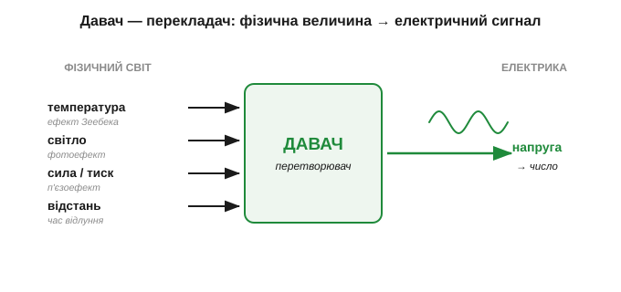
*Рис. 5.1.1.1. Давач як перекладач: на вході — фізична величина зі свого «світу» (тепло, світло, сила, відстань), на виході — електричний сигнал, який уже вміє читати решта схеми. Кожному типу величини відповідає свій фізичний ефект перетворення.*

Найважливіше, що давач визначається **не зовнішнім виглядом, а своїм перетворенням** — тим, як вхідна величина відображається у вихідний сигнал. Для термопари це «41 мкВ на кожен градус». Знати давач — означає знати цю відповідність (її ще називають **передавальною характеристикою**; докладно — у [§5.1.4](ch28-sensor-physics.md)).

Слова навколо давача варто розрізняти, бо в даташитах вони стоять поряд. **Перетворювач** (*transducer*) — найширше поняття: будь-що, що переводить енергію з одного виду в інший. **Давач** (*sensor*) — перетворювач, націлений саме на **вимір** (фізичне → електричне). **Детектор** (*detector*) зазвичай дає лише «є/нема» — спрацював поріг, а не число (кінцевий вимикач, давач полум'я). А коли той самий пристрій вмикають навпаки — електричним сигналом діяти на світ, — його звуть **виконавчим пристроєм** (до цієї двоїстості ще повернемось).

Глибша рамка, яка наводить лад, — **енергетичні домени** (*energy domains*). Природа «розраховується» кількома видами енергії: тепловою, механічною, оптичною, хімічною, магнітною — й електричною. Давач — це обмінник, що переводить будь-яку з цих «валют» в **електричну**, бо саме з нею вміє працювати решта системи. Тому кожній парі доменів відповідає свій набір фізичних ефектів: тепло → електрика (Зеебек), світло → електрика (фотоефект), механіка → електрика (п'єзо- й тензоефект). Упізнавши домен вхідної величини, майже завжди можна вгадати, який ефект ляже в основу давача, — і навпаки.

### Вимірювальний ланцюг: від величини до числа

Сирий сигнал давача майже ніколи не годиться для АЦП напряму: він буває **надто малий** (мікровольти термопари), **зашумлений** або взагалі **не у формі напруги** (зміна опору, ємності). Тому між вимірюваною величиною й осмисленим числом стоїть **ланцюг**:

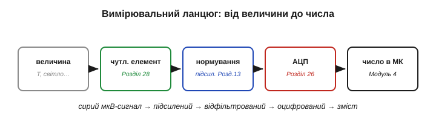
*Рис. 5.1.1.2. Повний вимірювальний ланцюг. Кожна ланка — це інструмент, уже вивчений раніше: підсилювач ([Розділ 2.8](../../block-2-components-analog/ch13-opamp-comparator/ch13-opamp-comparator.md)) піднімає мікровольти, RC-фільтр гамує шум, АЦП ([Розділ 4.8](../../block-4-mcu-esp32/ch26-adc/ch26-adc.md)) робить із напруги число. Решта модуля деталізує кожну ланку.*

Краса в тому, що тут сходиться весь попередній курс. Чутливий елемент дає крихітний сигнал — його **підсилює** операційний підсилювач ([Розділ 2.8](../../block-2-components-analog/ch13-opamp-comparator/ch13-opamp-comparator.md)). Сигнал тремтить від завад — його згладжує **фільтр** (механізм RC ми знаємо з [Розділів 2.1](../../block-2-components-analog/ch07-capacitor/ch07-capacitor.md)). Аналогову напругу в число перетворює **АЦП** ([Розділ 4.8](../../block-4-mcu-esp32/ch26-adc/ch26-adc.md)). Давач — це не одна деталь, а весь цей тракт.

> 🔧 **Навіщо це.** Тримати ланцюг у голові — означає знати, **де лагодити**. Сигнал заслабкий, тоне в кроці АЦП — проблема в підсиленні. Число «скаче» — проблема в шумі й фільтрі. Число стабільне, але «бреше» — проблема в калібруванні. Кожна біда живе у своїй ланці, і кожній присвячено окрему тему далі в модулі.

**Приклад (чому без підсилювача термопару не прочитати).** Візьмімо термопару типу K (≈ 41 мкВ/°C) і захочемо розрізняти 0.1 °C. Подивімось, що «бачить» типовий 12-бітний АЦП мікроконтролера з діапазоном 3.3 В:

```
крок АЦП (LSB) = 3.3 В / 4096 ≈ 0.806 мВ = 806 мкВ
сигнал на 0.1 °C = 41 мкВ/°C × 0.1 °C = 4.1 мкВ

4.1 мкВ  ≪  806 мкВ   → 0.1 °C тоне далеко в одному кроці АЦП (≈ у 200 разів менший)
```

Щоб 0.1 °C стало хоча б одним кроком АЦП, сигнал треба підсилити приблизно в **200 разів** (806 / 4.1 ≈ 197). Ось чому між термопарою й АЦП **завжди** стоїть підсилювач: без ланки нормування з Рис. 5.1.1.2 давач просто невидимий для мікроконтролера.

### Давач міряє не саму величину, а її електронний слід

Тонкість, яку легко проґавити: давач майже ніколи не міряє вимірювану величину **прямо**. Він міряє якийсь її **електричний наслідок** — напругу від різниці температур, опір, що змінився з нагрівом, ємність, що зросла від вологи. Терморезистор «не знає» жодних градусів — він лише має опір, який ми зчитуємо; температуру ми **домислюємо** з відомого зв'язку «опір ↔ градуси». Тобто давач робить **прямий** хід (величина → сигнал), а програма мусить зробити **обернений** (сигнал → величина), застосувавши передавальну характеристику задом наперед.

Це і є прихована половина роботи з давачем — **обернена задача** (*inverse problem*). Сам давач віддає лише число; перетворити його назад у градуси, метри чи ньютони — обов'язок коду, через формулу або довідкову таблицю. І якщо характеристика **нелінійна** (а вона зазвичай така — згадайте, як круто падає опір NTC з нагрівом), оберненням буде не множення на сталу, а ціла крива. Тому «зчитати давач» і «дізнатися величину» — два різні кроки, і другий нерідко складніший за перший. Саме на ньому тримається калібрування ([§5.1.6](ch28-sensor-physics.md)): воно якраз і будує той зворотний шлях від сирого числа до правдивої величини.

### Дві сім'ї давачів: хто живиться сам, а кого треба «питати»

Давачі діляться на дві великі сім'ї за тим, **звідки береться електрична енергія сигналу**.

**Самогенерувальні** (*self-generating*) давачі роблять сигнал **із самої вимірюваної енергії** — вони і є джерелом ЕРС або струму. Термопара (ефект Зеебека), фотодіод ([Розділ 2.5](../../block-2-components-analog/ch10-diode-pn-junction/ch10-diode-pn-junction.md)), п'єзоелемент. Їм **не потрібне зовнішнє живлення**: тепло, світло чи натиск самі «виштовхують» заряд. Платня за це — сигнал зазвичай **дуже малий** і заданий фізикою (на самому давачі його не «накрутиш»).

**Параметричні** (*modulating*), або ті, **що потребують живлення**: вимірювана величина змінює якусь **пасивну властивість** — опір R, ємність C чи індуктивність L ([Розділи 1.3](../../block-1-circuits-physics/ch03-resistance-power-heat/ch03-resistance-power-heat.md), [7](../../block-2-components-analog/ch07-capacitor/ch07-capacitor.md), [8](../../block-2-components-analog/ch08-inductor/ch08-inductor.md)). Сам по собі змінений опір «не світиться» — щоб його **прочитати**, давач треба живити відомим струмом чи напругою. Терморезистор (R залежить від T), фоторезистор, ємнісний давач, тензодавач. Платня — потрібне **стабільне опорне** живлення, а струм через елемент ще й трохи його гріє.

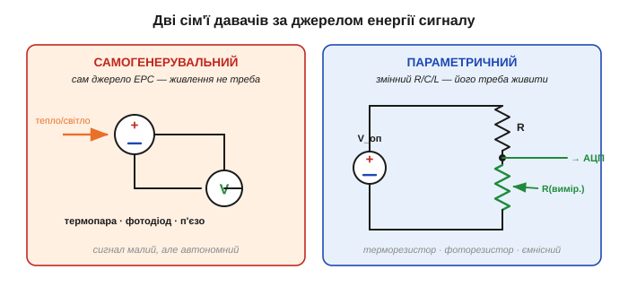
*Рис. 5.1.1.3. Дві сім'ї. Ліворуч: самогенерувальний давач сам є джерелом — вольтметр читає його ЕРС напряму. Праворуч: параметричний давач — це змінний R (чи C, L); його вмикають у дільник і **живлять** опорною напругою, щоб зміна опору стала зміною напруги.*

(Застереження про слова: у літературі ці сім'ї часто звуть «активними» й «пасивними» — але плутано, бо різні автори вкладають у ці слова протилежний зміст. Надійніший поділ — саме за тим, **чи давач сам генерує сигнал, чи потребує живлення**.)

> 🔧 **Навіщо це.** Ця приналежність визначає весь вхідний тракт. Самогенерувальний давач працює без живлення, але дає мікровольти — готуйте малошумний підсилювач. Параметричний треба забезпечити **стабільним опорним** джерелом, інакше «попливе» не давач, а ваше живлення. Перше питання до незнайомого давача: він сам джерело — чи його треба живити?

З параметричним давачем є гарний трюк, що прямо випливає з дільника. Його вихід — це **частка** опорів, R_давача / (R_верх + R_давача), помножена на опорну напругу. Якщо тією самою опорною напругою живити **і дільник, і АЦП** ([Розділ 4.8](../../block-4-mcu-esp32/ch26-adc/ch26-adc.md)), то будь-яке хитання живлення скорочується: чисельник і знаменник пливуть разом, і число на виході від нього не залежить. Такий **раціометричний** (*ratiometric*) вимір робить параметричний давач напрочуд стійким — вимога «дуже стабільне живлення» пом'якшується, щойно опорне джерело спільне для давача й АЦП.

**Приклад (як дільник перетворює ΔR на ΔV).** Терморезистор типу NTC має 10 кОм при 25 °C; поставимо його нижнім плечем дільника з фіксованим 10 кОм і живленням 3.3 В:

```
V_вих = V_оп · R_давача / (R_верх + R_давача)

при 25 °C  (R = 10 кОм):  V_вих = 3.3 · 10 / (10 + 10) = 1.65 В
нагрів до ≈ 50 °C, опір NTC падає до ≈ 4 кОм:
                          V_вих = 3.3 · 4  / (10 + 4)  ≈ 0.94 В
```

Зміна температури на 25 °C зсунула вихід майже на **0.7 В** — велику, зручну для АЦП напругу. Так параметричний давач, який «сам нічого не випромінює», стає повноцінним джерелом сигналу — коштом одного резистора й живлення. Порівняйте з термопарою з попереднього прикладу: там ті самі градуси давали близько мілівольта, тут — сім десятих вольта. Це і є практична різниця двох сімей.

### Давач і виконавчий пристрій — дві сторони однієї монети

Більшість фізичних ефектів перетворення **оборотні** — згадайте, як у історії розділу ефект Пельтьє виявився «дзеркалом» Зеебека. Та сама фізика працює в обидва боки:

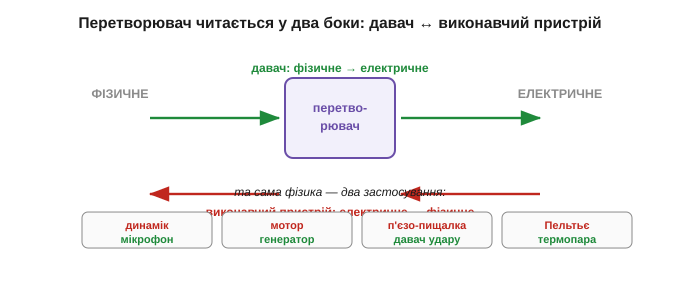
*Рис. 5.1.1.4. Перетворювач читається у два боки. «Фізичне → електричне» — це **давач**; «електричне → фізичне» — **виконавчий пристрій** (*actuator*). Динамік і мікрофон, мотор і генератор, п'єзо-пищалка й давач удару, Пельтьє і термопара — це пари «однієї монети».*

**Виконавчий пристрій** (*actuator*) — дзеркало давача: він перетворює електричний сигнал назад на фізичну дію. Динамік і мікрофон — обидва це котушка в полі магніту, лише ввімкнена «туди» чи «назад». Мотор і генератор — те саме. Тому той самий п'єзоелемент може і пищати, і відчувати постук.

> 🔧 **Навіщо це.** Звідси — економія мислення: зрозумівши один ефект, ви безкоштовно отримуєте і його обернення. А ще це підказує трюки: один п'єзоелемент можна змусити то випромінювати, то слухати — на цьому, забігаючи трохи наперед, тримається вимір відстані відлунням ([Розділ 5.2](ch29-distance-environment/ch29-distance-environment.md)).

Оборотність, утім, не означає, що той самий екземпляр однаково добрий в обидва боки. Динамік, увімкнений мікрофоном, чує кепсько, а мікрофон у ролі гучномовця ледь пищить: фізика обернення дозволяє, але конструкцію завжди оптимізують під **один** напрям — велика мембрана краще **віддає** звук, легка краще його **ловить**. Тому, зустрівши «давач і виконавчий пристрій на тому самому ефекті», тримайте в голові: спорідненість тут **фізична, а не взаємозамінність деталей**. Обрати готовий перетворювач саме під свій бік перетворення — теж частина інженерного рішення, а не дрібниця.

### Який вигляд має вихідний сигнал

Нарешті — у якій **формі** давач віддає результат. Форм кілька, і кожна диктує свій вхідний тракт:

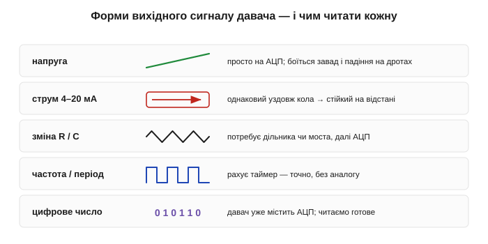
*Рис. 5.1.1.5. П'ять типових форм виходу. Напруга — найпростіша, та слабшає від завад і падіння на дротах. Струмова петля (4–20 мА) стійка на відстані (струм однаковий уздовж кола — [Розділ 1.2](../../block-1-circuits-physics/ch02-voltage-current-conduction/ch02-voltage-current-conduction.md)). Зміна R/C потребує схеми зчитування. Частота легко рахується таймером. «Цифра» — давач уже містить АЦП.*

- **Напруга** (*voltage*) — найзвичніша; прямо на АЦП. Але напруга «просідає» на опорі дротів і ловить наводки — погано для довгих ліній.
- **Струм** (*current loop*, класика — 4–20 мА): значення несе **струм**, а він однаковий уздовж усієї петлі ([Розділ 1.2](../../block-1-circuits-physics/ch02-voltage-current-conduction/ch02-voltage-current-conduction.md)), тож не боїться падіння на дротах — добре на десятки метрів.
- **Зміна опору/ємності** — типова для параметричних давачів; сама собою це ще не напруга, її треба «проявити» дільником чи мостом і вже тоді подати на АЦП.
- **Частота/період** (*frequency*): величину кодує частота імпульсів. Мікроконтролер ловить її **таймером** ([Розділ 4.6](../../block-4-mcu-esp32/ch24-timers/ch24-timers.md)) — точно й без аналогових тонкощів.
- **Уже оцифрований сигнал**: давач містить власний АЦП ([Розділ 4.8](../../block-4-mcu-esp32/ch26-adc/ch26-adc.md)) і віддає **готове число** цифровою лінією; мікроконтролеру лишається його прочитати (як саме — тема пізніших модулів про шини).

> 🔧 **Навіщо це.** Форма виходу визначає «передню» схему. Напруга → одразу АЦП. Частота → захоплення таймером. Опір → дільник чи міст, потім АЦП. Підібрати тракт під форму сигналу — пряма робота розробника, і помилка тут (наприклад, повісити високоомний давач прямо на АЦП) псує вимір ще до того, як число народилося.

### Кожна ланка щось спотворює

І головна, чесна думка, з якою треба входити в модуль. На **кожній** ланці ланцюга щось губиться або викривлюється: чутливий елемент нелінійний і «пливе» з часом, додає власний шум; підсилювач вносить зсув; АЦП **квантує** — округлює до кроку. Тому «число» — це **ніколи не сама величина**, а лише її оцінка.

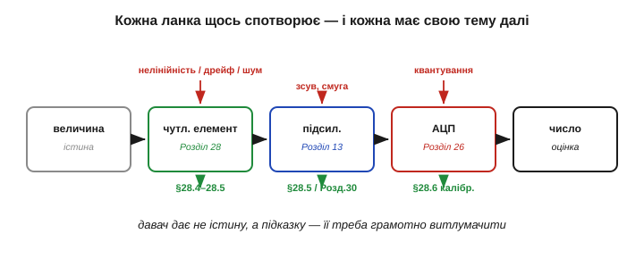
*Рис. 5.1.1.6. Той самий ланцюг, але з позначеними джерелами похибок. Чутливість і лінійність — [§5.1.4](ch28-sensor-physics.md); дрейф, гістерезис і шум — [§5.1.5](ch28-sensor-physics.md); повернення від сирого сигналу до величини — калібрування [§5.1.6](ch28-sensor-physics.md); боротьба із шумом цифрою — [Розділ 5.4](ch30-digital-filtering/ch30-digital-filtering.md).*

Це і є справжня суть фізики давачів: давач не дає вам **істину** — він дає **підказку**, яку треба грамотно витлумачити. Решта модуля — про те, як читати цю підказку чесно: спершу які бувають перетворювачі й на чому вони стоять (§5.1.2–5.1.3), потім — як описати їхню якість числами (§5.1.4–5.1.5) і як від сирого сигналу повернутися до справжньої величини (§5.1.6).

Отже, ми маємо мову: вимірювана величина, ланцюг перетворення, дві сім'ї давачів, форми сигналу й неминучі похибки. Наступний крок — розкласти давачі за **фізичним принципом**, на якому вони працюють, почавши з найпоширеніших: резистивних, ємнісних та індуктивних.

---

## 5.1.2 Класи перетворювачів: резистивні, ємнісні, індуктивні

У [§5.1.1](ch28-sensor-physics.md) ми поділили давачі на дві сім'ї за джерелом енергії. Параметрична сім'я — та, що змінює пасивну властивість і потребує живлення, — найбільша й найуживаніша в техніці. І тут на нас чекає подарунок: ці давачі побудовані на **трьох компонентах, які ми вже знаємо до гвинтика** — резисторі ([Розділ 1.3](../../block-1-circuits-physics/ch03-resistance-power-heat/ch03-resistance-power-heat.md)), конденсаторі ([Розділ 2.1](../../block-2-components-analog/ch07-capacitor/ch07-capacitor.md)) і котушці ([Розділ 2.2](../../block-2-components-analog/ch08-inductor/ch08-inductor.md)). Щоб зрозуміти всю цю родину давачів, не треба нової фізики — досить по-новому глянути на старі формули.

### Одна ідея на три родини: змінюй R, C або L

Згадаймо означальні формули трьох компонентів — і придивімось до них як до **рецептів із ручками регулювання**:

```
резистор:    R = ρ · L / A           (ρ — питомий опір, L — довжина, A — переріз)
конденсатор: C = ε · A / d           (ε — діелектрична проникність, A — площа, d — зазор)
котушка:     L = μ · N² · A / ℓ       (μ — проникність осердя, N — витки, A, ℓ — геометрія)
```

У кожній формулі є **матеріальні** члени (ρ, ε, μ) і **геометричні** (довжини, площі, зазори, витки). Тепер головна думка всього підрозділу: **будь-яка фізична величина, що штовхає хоч одну з цих «ручок», народжує давач**. Нагрів змінює ρ — маємо термодавач. Натиск зсуває пластини й змінює зазор d — маємо давач тиску. Метал поряд міняє магнітний шлях і L — маємо давач наближення. Увесь зоопарк параметричних давачів зводиться до простого питання: **яку ручку, на якому з трьох компонентів, ворушить наш фізичний світ**.

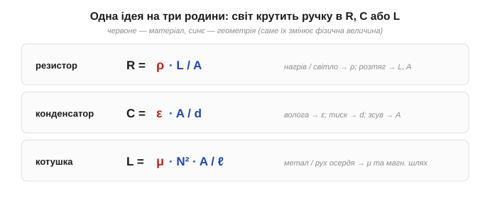
*Рис. 5.1.2.1. Єдина ідея трьох родин. У кожній формулі підсвічено члени, які може змінити фізична величина: матеріальні (ρ, ε, μ) і геометричні (L, A, d, ℓ). Давач — це компонент, в якого реальний світ «крутить» один із цих параметрів.*

Саме тому ці три родини й переважають: вони **повторно використовують** деталі, які ми вивчили, разом з усією їхньою теорією. Ця ощадливість — не лише педагогічна зручність: переважна більшість давачів у промисловості й побуті належить саме до цих трьох родин, бо вони стоять на дешевих, надійних, давно вивчених компонентах. Освоївши резистор, конденсатор і котушку, ви вже наполовину розумієте відповідні давачі — лишається з'ясувати, яка величина й яку «ручку» в них крутить. Розгляньмо кожну родину окремо.

### Резистивні: найпростіша й найпоширеніша родина

Резистивний давач змінює **опір**. Дороги до цього дві: смикати матеріал (ρ) або смикати геометрію (L, A).

**Через питомий опір ρ:**
- **температура** → **терморезистор** (*thermistor*): NTC (опір падає з нагрівом) і PTC (зростає); а також **RTD** на платині — майже лінійний і дуже стабільний еталон;
- **світло** → **фоторезистор** (*LDR, photoresistor*): світло вибиває носії, ρ падає (явище фотопровідності). *Зауважте:* давачі світла на p-n переході (фотодіод) працюють інакше й чекають на нас у [§5.1.3](ch28-sensor-physics.md);
- **газ / волога** → **хеморезистор**: молекули осідають на чутливому шарі й міняють його опір (типові давачі чадного газу, диму).

**Через геометрію L, A:**
- **деформація** → **тензодавач** (*strain gauge*): тонкий дріт-змійка, наклеєний на деталь; розтягнеш — довжина L росте, переріз A меншає, обидва піднімають R. Це фундамент давачів сили, ваги, тиску (тензоміст у «ваг-комірках»);
- **положення** → **потенціометр**: повзунок відбирає частку опору — пряме перетворення кута чи зсуву на опір (а через дільник — на напругу);
- **сила/натиск** → **резистор, чутливий до тиску** (*FSR*): більший натиск — більша площа контакту провідних зерен — менший опір.

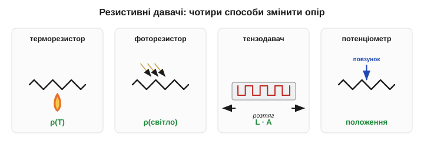
*Рис. 5.1.2.2. Чотири резистивні давачі й «ручка», яку смикає величина: ρ(T) у терморезистора, ρ(світло) у фоторезистора, геометрія L·A у тензодавача при розтягу, положення повзунка в потенціометра.*

Переваги родини — простота, дешевизна й те, що опір **видно постійним струмом**: досить дільника (а часто й одного). Платня — **самонагрів** (струм через давач гріє його сам, спотворюючи вимір температури), **дрейф** і часта **нелінійність** (опір NTC падає по крутій кривій, не по прямій).

Ці недоліки варто зрозуміти, бо вони визначають практику. **Нелінійність** NTC така сильна, що прямою її не опишеш: залежність опору від температури майже експоненційна, тож у коді її задають кривою або довідковою таблицею — це і є та обернена задача з [§5.1.1](ch28-sensor-physics.md). Платиновий RTD, навпаки, майже лінійний, за що його й цінують як еталон, хоч він дорожчий і менш чутливий. **Самонагрів** підступніший: вимірювальний струм виділяє в давачі потужність I²R ([Розділ 1.3](../../block-1-circuits-physics/ch03-resistance-power-heat/ch03-resistance-power-heat.md)), яка піднімає його власну температуру й додає до показу фальшиві градуси, — тому терморезистор живлять малим струмом. Уся родина — це компроміс «чутливість проти лінійності й стабільності».

**Приклад (який крихітний сигнал дає тензодавач).** Тензодавач характеризують **коефіцієнтом тензочутливості** (*gauge factor*, GF ≈ 2): відносна зміна опору дорівнює GF, помноженому на відносну деформацію ε. Візьмімо типову робочу деформацію 1000 мікрострейн (ε = 0.001) на давачі 350 Ом:

```
ΔR / R = GF · ε = 2 · 0.001 = 0.002 = 0.2 %
ΔR = 0.002 · 350 Ом = 0.7 Ом
```

Лише **0.7 ома** на тлі 350 — ось чому тензодавач ніколи не вмикають у простий дільник: така дрібка потоне в зсуві. Потрібна хитріша схема зчитування.

### Зчитати малу ΔR: міст Вітстона

Уявіть тензодавач у звичайному дільнику з напругою 3.3 В. Вихід стоятиме біля половини живлення (≈ 1.65 В), а корисний сигнал від 0.7 Ом — це якісь мілівольти, що тремтять **верхи на величезному сталому зсуві** в 1.65 В. Підсилити такий сигнал, не загнавши підсилювач у насичення сталою складовою, важко.

Розв'язок — **міст Вітстона** (*Wheatstone bridge*): не один дільник, а **два поруч**, увімкнені між тим самим живленням. Беремо різницю їхніх середніх точок. Коли всі чотири плечі однакові, міст **збалансований** — різниця рівно нуль, ніякого зсуву. Щойно давач змінює опір на ΔR, баланс порушується, і на виході з'являється **лише корисна різниця**, яку вже можна сміливо підсилювати.

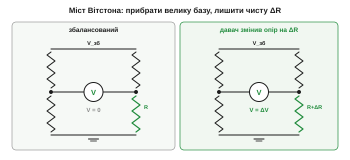
*Рис. 5.1.2.3. Чому міст кращий за дільник. Ліворуч — баланс: середні точки рівні, вихід 0, без сталого зсуву. Праворуч — давач змінив опір на ΔR: з'являється диференційна напруга, пропорційна **тільки** зміні. Її підсилюють без боротьби з постійною складовою.*

Міст дарує ще один подарунок — **придушення спільної завади**. Якщо всі плечі однаково попливли від температури навколишнього, вони зсунулись разом, баланс зберігся, і дрейф **сам скоротився**. Тому ваги, давачі тиску й RTD майже завжди читають саме мостом, а не голим дільником.

Активних плечей у мості може бути різна кількість, і це прямо впливає на сигнал. **Чвертьміст** — один давач і три сталі резистори (найпростіше). **Напівміст** — два давачі в суміжних плечах (в одній гілці-дільнику моста): скажімо, при згині балки один тензодавач розтягується, другий стискається, тож їхні протилежні за знаком зміни **додаються** у вихід, а спільний дрейф гаситься ще краще. **Повний міст** — усі чотири плечі активні: максимальна чутливість і найкраща температурна компенсація; саме так роблять промислові ваг-комірки. Правило просте: що більше активних плечей, то більший корисний сигнал з тієї самої деформації.

> 🔧 **Навіщо це.** Правило на все життя: коли треба зміряти **малу зміну на великій сталій базі** (тензо, RTD, будь-який давач із крихітною ΔR), не вмикайте його в простий дільник — беріть **міст**. Він прибирає базу до підсилювача й заодно гасить спільний дрейф. Половина мистецтва читати резистивний давач — у схемі моста й доброму інструментальному підсилювачі за ним.

### Ємнісні: вимір без дотику

Ємнісний давач змінює **ємність** C = ε·A/d, і в нього аж **три ручки**: зазор d, площа перекриття A та діелектрик ε.

- **зазор d** → наближення, зсув, **тиск** (мембрана прогинається — зазор меншає — C росте); на цьому ж принципі стоїть ємнісний MEMS-акселерометр (його гребінки — це змінний зазор; докладно — [§5.7.2](ch33-imu-mems/ch33-imu-mems.md)); сюди ж **сенсорний дотик** — палець підміняє один «електрод»;
- **площа A** → лінійне й кутове **положення**: пластини насуваються одна на одну, перекриття змінює C;
- **діелектрик ε** → **волога** (вода має ε ≈ 80; вологий шар між пластинами підіймає ємність), **рівень рідини** (заповнення міняє діелектрик між обкладками), розпізнавання матеріалу.

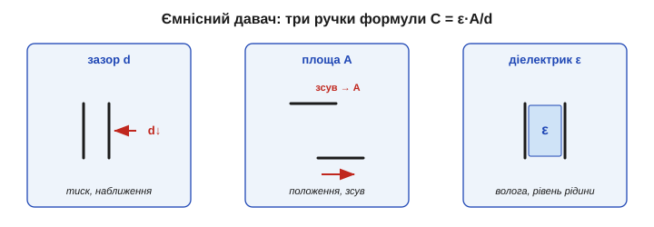
*Рис. 5.1.2.4. Три ручки ємнісного давача. Зміна зазору d (наближення, тиск), зміна площі перекриття A (положення) і зміна діелектрика ε (волога, рівень рідини) — кожна дає свій клас давачів на тій самій формулі C = ε·A/d.*

Зчитування тут принципово інше. Ємність **невидима для постійного струму** — заряджений конденсатор його просто не пропускає ([Розділ 2.1](../../block-2-components-analog/ch07-capacitor/ch07-capacitor.md)). Тому ємність читають **змінним сигналом**: міряють реактивний опір Xc = 1/(2·π·f·C) ([Розділ 2.3](../../block-2-components-analog/ch09-reactance-resonance/ch09-reactance-resonance.md)), або час заряду RC, або вмикають давач у генератор і ловлять **зсув частоти**.

Кожен спосіб має свій смак. Метод **часу заряду** простий: мікроконтролер заряджає давач через відомий резистор і таймером ([Розділ 4.6](../../block-4-mcu-esp32/ch24-timers/ch24-timers.md)) міряє, скільки часу мине до порогу, — більша ємність дає довший час. **Генераторний** спосіб чутливіший: давач задає частоту коливань, і навіть пікофарадна зміна помітно її зсуває, а частоту легко рахувати. Щоб приборкати паразитну ємність, поряд із чутливим електродом кладуть **охоронний** (*guard*): його тримають під тією самою напругою, тож між ним і робочим електродом нема різниці потенціалів — паразитні лінії поля замикаються на охорону, а не на корисний електрод. Це той самий бій за пікофаради, про який ішлося вище.

**Приклад (які мізерні ці ємності).** Дві пластини площею 1 см² із зазором 1 мм у повітрі:

```
C = ε₀ · A / d = 8.854×10⁻¹² · (1×10⁻⁴) / (1×10⁻³)
C ≈ 8.9×10⁻¹³ Ф ≈ 0.89 пФ
```

Менше пікофарада! Зменшимо зазор удвічі (натиск) — ємність подвоїться, але це досі одиниці пікофарад. А ємність вашого тіла чи кабелю — теж пікофаради. Ось чому ємнісні давачі **бояться паразитної ємності**: рука, дріт, волога поруч дають сигнал того ж порядку, що й корисний. Звідси екранування, короткі виводи й охоронні електроди (детальніше про узгодження — [§5.1.7](ch28-sensor-physics.md)).

Переваги — **безконтактність** (нема тертя й зносу), висока чутливість, мале споживання. Недоліки — крихітний сигнал у пікофарадах, страх вологи/бруду/паразитів і потреба у змінному зчитуванні.

### Індуктивні: бачити метал крізь бруд

Індуктивний давач змінює **індуктивність** L. Вона залежить від витків N, геометрії та — найголовніше для давачів — від **магнітного шляху**: осердя, зазорів, провідників поруч.

- **рухоме феромагнітне осердя** змінює L — на цьому стоїть **LVDT** (*linear variable differential transformer*), точний і витривалий давач лінійного зсуву, улюбленець промисловості;
- **вихрові струми** (*eddy currents*): метал біля котушки наводить у собі вихрові струми (пряма рідня індукції з [Розділу 2.2](../../block-2-components-analog/ch08-inductor/ch08-inductor.md)), які протидіють полю й змінюють ефективну L та добротність котушки — це **індуктивний давач наближення**, що відчуває метал без дотику;
- **змінний зазор / магнітний опір**, обертові датчики, деякі давачі струму.

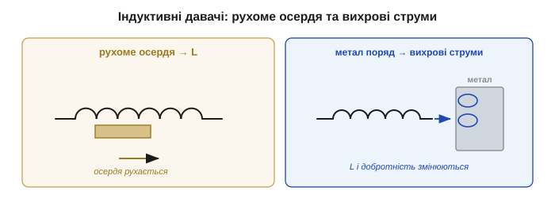
*Рис. 5.1.2.5. Дві індуктивні схеми. Ліворуч — рухоме осердя змінює зв'язок котушок (принцип LVDT): зсув стає напругою. Праворуч — метал поряд наводить вихрові струми, що «гасять» котушку: змінюються L і добротність — давач бачить метал, не торкаючись.*

Зчитують індуктивний давач знов-таки **змінним струмом**: міряють реактивний опір XL = 2·π·f·L ([Розділ 2.3](../../block-2-components-analog/ch09-reactance-resonance/ch09-reactance-resonance.md)) або стежать за частотою/добротністю генератора з цією котушкою.

Слово «differential» у назві LVDT не випадкове. Усередині дві вторинні котушки, увімкнені назустріч: коли осердя точно по центру, їхні сигнали рівні й гасяться — на виході чистий нуль; зсув в один бік підіймає одну котушку, у протилежний — другу. Тому з амплітуди та фази читаються **і величина, і напрямок** зсуву, причому без «мертвої зони» в центрі. А вихрострумовий давач корисний ще й тим, що бачить **будь-який** метал, а не лише феромагнітний: вихрові струми течуть і в міді чи алюмінії, тож такий давач відрізнить метал від пластику навіть там, де простий магніт безсилий.

Сильний бік — **витривалість**: індуктивному давачу байдуже до мастила, пилу, води чи фарби, бо нема оптики, яку можна забруднити, і часто нема контакту. Саме тому конвеєри й верстати рахують металеві деталі індуктивними давачами. Слабкі боки — реагує переважно на **метал** (вихрострумовий тип), потребує змінного живлення, габаритніший і чутливий до температури.

> 🔧 **Навіщо це.** Коли давач мусить працювати в бруді, мастилі, вологому чи запиленому середовищі — на верстаті, у двигуні, під дощем, — індуктивний тип нерідко єдиний розумний вибір: його нема чим «засліпити». Оптику заллє й заялозить, ємнісному завадить волога й бризки, а котушці на все це байдуже. Ціна витривалості — він бачить лише метал і потребує змінного збудження; та коли довкілля вороже, це чесний обмін.

### Спільний знаменник: R читають постійним, C і L — змінним

Придивившись до зчитування трьох родин, помічаємо красиву закономірність. Опір — це «справжній» (активний) опір: його виявляє **сталий** струм, тому резистивний давач читають **постійним** струмом — дільником чи мостом. А ємність і індуктивність **реактивні** ([Розділ 2.3](../../block-2-components-analog/ch09-reactance-resonance/ch09-reactance-resonance.md)): їхній вплив проявляється **лише на змінному** сигналі. Тому ємнісні й індуктивні давачі — за самою природою «змінного струму»: їх збуджують AC, міряючи реактивний опір, або стежать за частотою.

Це не дрібниця реалізації, а розвилка всього проєкту. Для резистивного давача джерелом «питання» може бути проста стала напруга, і весь тракт зводиться до дільника та АЦП — нічого не коливається. Для ємнісного чи індуктивного потрібен **змінний** збуджувач (генератор) і спосіб виміряти реактивний відгук: реактивний опір, час заряду або частоту. Тому, побачивши в специфікації слова «ємнісний» чи «індуктивний», уже наперед знаєш, що в схемі буде коливальний вузол, а не самий лише дільник, — і закладаєш на нього і місце, і час розробки.

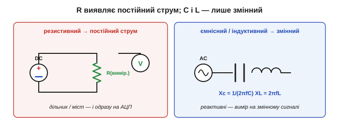
*Рис. 5.1.2.6. Спільний знаменник зчитування. Резистивний давач — постійний струм, дільник/міст. Ємнісний та індуктивний — реактивні, тож потрібен змінний сигнал: реактивний опір Xc, XL або зсув частоти генератора.*

> 🔧 **Навіщо це.** Це правило підказує «передній край» ще до вибору давача. Бачите резистивний — готуйте дільник/міст і АЦП. Бачите ємнісний чи індуктивний — потрібен змінний збуджувач або частотомір/таймер. Недарма мультиметр опір міряє напряму, а ємність та індуктивність — лише подавши власний **змінний** тест-сигнал.

### Як обрати: коротке порівняння

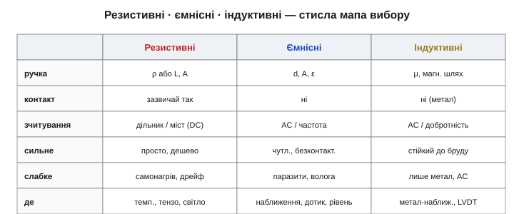
*Рис. 5.1.2.7. Три родини поряд: яку «ручку» крутять, контактні чи ні, чим зчитують, сильні й слабкі боки, типове застосування. Стисла мапа для вибору.*

Грубий орієнтир вибору: потрібно дешево, просто й контакт не заважає — **резистивний**; потрібен безконтактний, чутливий вимір у чистому середовищі — **ємнісний**; потрібно безконтактно ловити **метал** у бруді й мастилі — **індуктивний**. Усі три, проте, лишають сигнал, який ще треба нормувати й оцифрувати, — а отже, повертають нас до вимірювального ланцюга з §5.1.1.

Ці три родини сильні тим, що повторно використовують відомі пасивні компоненти. Наступний крок — давачі, що стоять на **глибшій фізиці матеріалів**: п'єзоелектриці, фотопереходах і напівпровідникових ефектах, де перетворювач часто сам генерує сигнал.

---

## 5.1.3 П'єзо-, оптичні, напівпровідникові

Резистивні, ємнісні й індуктивні давачі з [§5.1.2](ch28-sensor-physics.md) брали готові пасивні компоненти й змінювали їхню геометрію чи матеріал. Тепер — три родини, що сягають **глибшої фізики**: будови кристала, p-n переходу, поведінки носіїв у кремнії. Платою за глибину стає чудова винагорода: багато з цих давачів **самі генерують сигнал** (повертаючи нас до самогенерувальної сім'ї §5.1.1), а напівпровідникові ще й вміщують увесь вимірювальний тракт в одну мікросхему. Саме сюди належать одні з найкорисніших давачів інженера: удару й ультразвуку (п'єзо), світла й положення (оптичні), магнітного поля й точної температури (напівпровідникові).

### Спільна риса: глибша фізика, часто власний сигнал

Перш ніж занурюватись, варто побачити, що єднає ці три родини й чим вони відрізняються від попередніх. Резистивний чи ємнісний давач — **пасивний параметр**, який треба живити, щоб «прочитати». П'єзо й фотоелемент натомість **самі стають джерелом**: натиск чи світло безпосередньо народжують заряд або струм. А напівпровідникові давачі експлуатують тонкі ефекти в кристалі — від поведінки носіїв у магнітному полі до температурної залежності переходу — і часто продають уже з підсилювачем та АЦП «на борту».

Цікаво, що всі ці ефекти — **старі**. П'єзоелектрику Кюрі знайшли 1880-го, ефект Холла — 1879-го, фотоелектричні явища досліджували ще в XIX столітті. Та десятиліттями вони лишалися лабораторними дивами: сигнали були мізерні, а підсилити їх не було чим. Практичними давачами вони стали аж у XX столітті — коли з'явилися добрі п'єзокераміки, чисті напівпровідники й дешеві підсилювачі. Тобто річ не тільки у фізиці ефекту, а й у тому, чи є **чим його прочитати**, — той самий урок вимірювального ланцюга з §5.1.1.

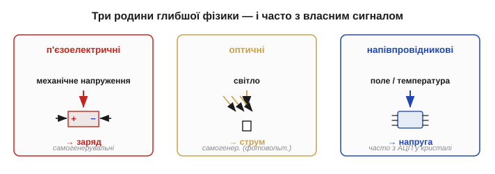
*Рис. 5.1.3.1. Огляд родини §5.1.3. П'єзо: механічне напруження → заряд. Оптичні: світло → струм (фотоперехід). Напівпровідникові: магнітне поле чи температура → напруга, часто з усім трактом у кристалі. Перші дві — переважно самогенерувальні.*

### П'єзоелектрика: натиск стає зарядом

**П'єзоелектричний ефект** (*piezoelectric effect*, від грец. *piezein* — тиснути) відкрили брати **П'єр і Жак Кюрі** (*Pierre & Jacques Curie*) ще 1880 року: деякі кристали (кварц) і кераміки (PZT — цирконат-титанат свинцю) при механічному стиску чи розтягу **самі дають напругу**.

Механізм елегантний. У кристалі без навантаження центри додатних і від'ємних зарядів збігаються, і ґратка електрично симетрична. Стиск **зміщує** ці центри один відносно одного — у кристалі виникає сумарна поляризація, а на протилежних гранях — заряд різного знака. По суті, деформація прямо перекачує заряд на електроди.

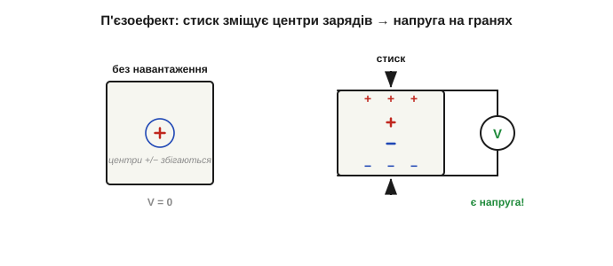
*Рис. 5.1.3.2. Механізм п'єзоефекту. Без навантаження центри «+» і «−» у комірці збігаються — граней не заряджено. Під стиском вони розходяться, ґратка поляризується, і на верхній та нижній гранях з'являється заряд протилежних знаків — готова напруга.*

Ефект **оборотний** (згадайте двоїстість із [§5.1.1](ch28-sensor-physics.md)): подайте на кристал напругу — він **деформується**. Це не дрібниця, а ціла індустрія: оборотний п'єзо — серце кварцових генераторів, ультразвукових випромінювачів, п'єзопищалок, голівок струменевих принтерів і п'єзозапальничок (різкий удар по кристалу дає тисячі вольтів — аж до іскри).

Матеріали п'єзо різняться вдачею. **Кварц** дає слабкий, зате надзвичайно стабільний ефект — тому з нього роблять еталонні резонатори годинників і тактових генераторів ([Розділ 4.6](../../block-4-mcu-esp32/ch24-timers/ch24-timers.md)). **Кераміка PZT** навпаки: ефект у рази сильніший, але менш стабільний, тож її беруть там, де цінніша чутливість або потужна віддача — давачі удару, акселерометри, ультразвукові випромінювачі, актуатори. І два напрями ефекту мають дві назви: **прямий** (деформація → заряд, режим давача) та **зворотний** (напруга → деформація, режим виконавчого пристрою) — рівно ті дві сторони монети з §5.1.1. Те, що прямий п'єзоефект можна обернути, передбачив теоретично Габрієль Ліппман, а Кюрі одразу підтвердили дослідом.

Сигнал п'єзо великий за напругою, але джерело **високоомне** (фактично крихітний заряд на ємності кристала), тож його не можна вантажити низьким опором — потрібен **зарядовий підсилювач** або високоомний буфер ([Розділ 2.8](../../block-2-components-analog/ch13-opamp-comparator/ch13-opamp-comparator.md)).

І найважливіша пастка, яку треба засвоїти раз і назавжди: **п'єзо реагує лише на ЗМІНУ**. Прикладений сталий тиск дає заряд, але той заряд **стікає** через будь-який скінченний опір (вхід підсилювача, ізоляцію), і вихід спадає до нуля. Тому п'єзодавач відчуває вібрацію, удар, динамічний тиск, звук — але **не статичне навантаження**.

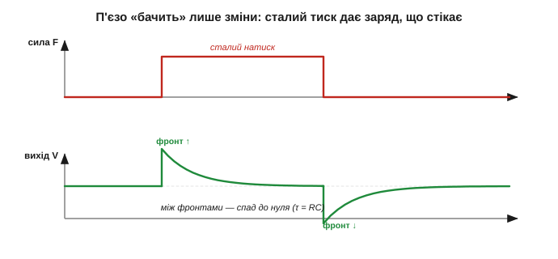
*Рис. 5.1.3.3. Чому п'єзо — давач змін. Ступінчастий натиск (угорі) дає сплеск напруги, що спадає за сталою часу витоку (внизу): заряд стікає крізь опір навантаження. Відпускання дає сплеск протилежного знака. Постійну складову п'єзо не передає — лише динаміку.*

> 🔧 **Навіщо це.** Це правило врятує від класичної помилки. Хочете зважити статичний вантаж — п'єзо не годиться (візьміть тензоміст із §5.1.2). Хочете впіймати удар, стук у двигуні, вібрацію підшипника, звукову хвилю — п'єзо ідеальний, бо саме на зміни він і відповідає. Той самий ефект, до речі, лежить в основі ультразвукових випромінювачів, з якими ми мірятимемо відстань у [Розділі 5.2](ch29-distance-environment/ch29-distance-environment.md).

**Приклад (за скільки п'єзо «забуває» сталий натиск).** Заряд стікає через вхідний опір R навантаження та власну ємність давача C — це фактично високочастотний RC-фільтр ([Розділ 2.1](../../block-2-components-analog/ch07-capacitor/ch07-capacitor.md)) зі сталою часу τ = R·C. Хай ємність кристала C = 1 нФ, а вхідний опір підсилювача R = 1 МОм:

```
τ = R · C = 10⁶ Ом · 10⁻⁹ Ф = 10⁻³ с = 1 мс
```

Лише мілісекунда — і вже через кілька τ сигнал від сталого натиску майже зник. Щоб ловити повільніші зміни, опір навантаження штучно піднімають аж до гігаомів (високоомний буфер) — або ставлять зарядовий підсилювач, у якого вхід навпаки низькоомний (віртуальна земля), а нижню межу частоти задає його власне коло зворотного зв'язку. Так чи так, п'єзо приречений бути давачем динаміки, а не статики.

### Оптичні: світло стає струмом

Давач світла на **p-n переході** — інша річ, ніж фоторезистор зі [§5.1.2](ch28-sensor-physics.md). Фоторезистор просто міняв опір; тут перехід **сам генерує струм** зі світла. Це **фотодіод** (*photodiode*), фототранзистор, фотоелемент.

Механізм прямо складено з вивченого. Фотон достатньої енергії, влучивши в збіднену область переходу, **вибиває пару електрон-дірку** (народження носіїв зі світла ми бачили ще в [§1.1](../../block-1-circuits-physics/ch01-charge-field-potential/ch01-charge-field-potential.md), а сам перехід — у [Розділі 2.5](../../block-2-components-analog/ch10-diode-pn-junction/ch10-diode-pn-junction.md)). Вбудоване поле переходу миттєво **розтягує** пару в різні боки — і в колі тече **фотострум**, пропорційний освітленості.

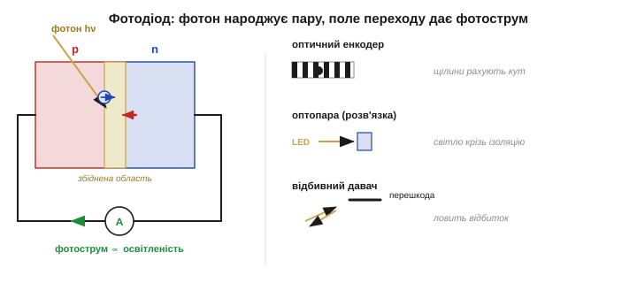
*Рис. 5.1.3.4. Фотодіод і його застосування. Фотон вибиває пару електрон-дірку в збідненій області; поле переходу розводить їх — тече фотострум. Праворуч — три типові вжитки: оптичний енкодер (щілини рахують положення), оптопара (світло переносить сигнал через гальванічну розв'язку), відбивний давач наближення.*

Фотодіод працює у двох режимах: **фотовольтаїчному** (без зміщення — сам дає напругу, це режим сонячної батареї, самогенерувальний) і **фотопровідному** (зі зворотним зміщенням — швидший і строго лінійний за струмом). На відміну від млявого LDR, фотодіод **швидкий і лінійний**, тож саме він стоїть там, де треба точність і швидкодія.

Є тонкість, спільна всім фотопереходам: фотон спрацьовує, лише коли його енергії досить, щоб перекинути носій через заборонену зону. А енергія фотона задана довжиною хвилі — тож кожен давач має власний **діапазон чутливості**: кремній добре «бачить» видиме й ближнє інфрачервоне, але сліпне до далекого ІЧ. Через це під різні задачі (видиме світло, інфрачервоний пульт, ультрафіолет) беруть давачі з різних матеріалів і зі світлофільтрами. А коли струму голого фотодіода замало, його заступає **фототранзистор** — той самий перехід, але з вбудованим підсиленням: сигнал більший ціною нижчої швидкодії.

Застосувань безліч, і всі зводяться до однієї ідеї — перетворити подію у **світловий потік**, а потік у струм. **Оптичний енкодер**: диск зі щілинами обертається між світлодіодом і фотодіодом, перериваючи промінь, — мікроконтролер рахує імпульси й знає кут та оберти (а двома доріжками зі зсувом — ще й напрямок обертання). **Відбивний давач наближення**: світлодіод світить інфрачервоним, фотодіод ловить відбите від перешкоди світло — чим ближче й світліше тіло, тим більший струм; так роблять давачі лінії, краю столу, наявності аркуша. **Оптопара**: світлодіод і фотоприймач замкнено в одному корпусі без електричного зв'язку — сигнал переходить лише світлом. **Пульсоксиметр** просвічує палець і за поглинанням світла судить про кисень у крові. Скрізь фотодіод лишається тим самим — змінюється тільки те, що несе світло.

> 🔧 **Навіщо це.** Вибір між фотодіодом і фоторезистором — це вибір швидкість+лінійність проти дешевизни. Для плавного виміру навколишнього світла згодиться й копійчаний LDR; а для енкодера, що ловить тисячі щілин за секунду, чи для зв'язку через оптопару потрібен **фотодіод/фототранзистор** — LDR просто не встигне.

Два застосування варті окремого слова. Великий фотодіод без зміщення — це **сонячний елемент**: те саме народження пар світлом, лише площу збільшено заради енергії, а не виміру. А **оптопара** розв'язує задачу, яку голим дротом не вирішити, — **гальванічну розв'язку**: світло переносить сигнал через ізоляційний проміжок, тож дві частини схеми спілкуються, не маючи спільної землі. Це захищає і від завад, і від небезпечних напруг — давач світла тут працює не для виміру світла, а як «місток» сигналу.

### Напівпровідникові: давач, вбудований у кремній

Третя родина живе **в самому кремнії**: давач формують прямо в кристалі, користуючись тонкими ефектами переходу та носіїв, і часто додають на той самий чип підсилювач і АЦП. Звідси «розумні» давачі, що віддають уже готове число (та сама ідея «вже оцифрованого» з [§5.1.1](ch28-sensor-physics.md)).

**Давач Холла** (*Hall sensor*) міряє **магнітне поле**. Крізь тонку напівпровідникову пластинку пропускають струм; якщо впоперек прикласти магнітне поле, воно **штовхає рухомі носії вбік** (та сама сила на рухомий заряд у полі), і вони збираються на одному краї — між краями виникає поперечна **напруга Холла**, пропорційна полю. Відкрив ефект **Едвін Голл** (*Edwin Hall*) 1879 року — за рік до п'єзо Кюрі.

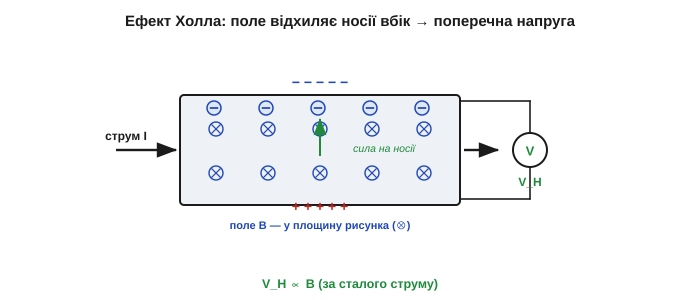
*Рис. 5.1.3.5. Давач Холла. Уздовж пластинки тече струм I; перпендикулярне поле B відхиляє носії до одного краю, де накопичується заряд. Між бічними гранями з'являється напруга Холла V_H, пропорційна B. Так магнітне поле стає напругою.*

Давачем Холла міряють магнітне поле напряму, а через нього — багато іншого: **струм безконтактно** (струм робить навколо себе поле — його й ловлять), положення й оберти (магніт на валу + Холл поряд), наявність магніту. 

**Приклад (яка мала напруга Холла).** Напруга Холла V_H = I·B/(n·q·t), де n — концентрація носіїв, q — заряд електрона, t — товщина пластинки. Для тонкого кремнієвого елемента (типово n·q·t дає чутливість близько кількох мВ на міллітеслу при робочому струмі):

```
типова чутливість ≈ 5 мВ / мТл  (при заданому струмі живлення)
поле невеликого магніту впритул ≈ 50 мТл
V_H ≈ 5 мВ/мТл · 50 мТл = 250 мВ
```

Чверть вольта від магніту — зручно; а от поле Землі (≈ 0.05 мТл) дало б лише чверть міллівольта, тож слабкі поля знову потребують підсилення. Тому давачі Холла майже завжди йдуть із вбудованим підсилювачем у тому ж корпусі.

Цей ефект Едвін Голл відкрив 1879 року ще аспірантом — за вісімнадцять років до відкриття електрона, тобто навіть не знаючи, який саме носій відхиляє поле. Сьогодні давач Холла особливо цінують за **безконтактний вимір струму**: великий струм створює навколо провідника магнітне поле, і давач Холла поряд міряє це поле, ніяк не торкаючись самого кола й не додаючи в нього опору (на відміну від шунта). Так само з магнітом на валу він стає безконтактним давачем кута чи обертів — без тертя й зносу. Безконтактність тут не дрібниця, а головна перевага.

**Напівпровідниковий давач температури.** Пряме падіння напруги на p-n переході дуже **передбачувано** спадає з нагрівом — близько −2 мВ на градус ([Розділ 2.5](../../block-2-components-analog/ch10-diode-pn-junction/ch10-diode-pn-junction.md)). Кремнієві мікросхеми використовують цю залежність (точніше — різницю напруг двох переходів, «забороненозонний» принцип), щоб робити **лінійні, відкалібровані** давачі температури.

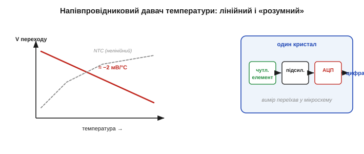
*Рис. 5.1.3.6. Напівпровідниковий давач температури. Ліворуч — пряма напруга переходу майже лінійно спадає з нагрівом (≈ −2 мВ/°C), на відміну від кривої NTC. Праворуч — «розумний» давач: чутливий елемент, підсилювач і АЦП в одному кристалі віддають готове число.*

Тут добре видно компроміси трьох температурних давачів, що пройшли крізь розділ: **термопара** (величезний діапазон, але мікровольти й опорний спай), **терморезистор** (чутливий і дешевий, але дуже нелінійний), **напівпровідниковий IC** (лінійний і відкалібрований, але обмежений приблизно −55…+150 °C, бо вище кремній не виживає). Жоден не «найкращий» — кожен під свою задачу: розпечена піч просить термопари, дешевий побутовий термостат — терморезистора, а точний електронний вузол поряд із процесором — інтегрального IC-давача, що віддає вже готові градуси. Уся історія розділу, від Зеебека до кремнію, зрештою зводиться до цього спокійного інженерного вибору «що під що».

> 🔧 **Навіщо це.** «Розумний» напівпровідниковий давач — це втілена мрія §5.1.1: увесь вимірювальний ланцюг переїхав усередину деталі, і назовні виходить чисте число. За зручність платиш вужчим діапазоном і довірою до чужого калібрування — але для більшості задач «під кімнатні умови» це найшвидший шлях від величини до даних.

Холл і термодавач — лише двоє з великої родини «давачів у кремнії». Тим самим способом роблять давачі тиску (тонка мембрана з вбудованими в кристал тензорезисторами), магнітні давачі на магнітоопорі, давачі світла, що ми вже бачили. Спільний напрям очевидний: **дедалі більше виміру переїжджає в саму мікросхему** — разом із підсиленням, оцифруванням і навіть калібруванням. Найяскравіший прояв цього — мікромеханічні (MEMS) давачі, де в кремнії вирізьблюють уже **рухомі** деталі: крихітні балки й гребінки, що згинаються від прискорення чи обертання. До них ми спеціально повернемось у [Розділі 5.7](ch33-imu-mems/ch33-imu-mems.md).

### Як вони лягають у загальну картину

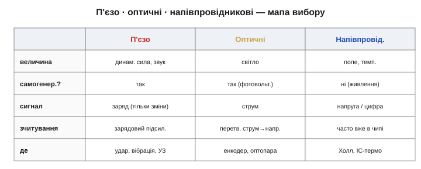
*Рис. 5.1.3.7. Три родини поряд: яку величину ловлять, чи самогенерувальні, яка форма сигналу, чим зчитувати, типове застосування. Разом із §5.1.2 це повна мапа фізичних принципів давачів.*

Грубий орієнтир: динамічна механіка (удар, вібрація, звук, ультразвук) — **п'єзо**; світло, положення крізь світло, оптична розв'язка — **оптичні**; магнітне поле, безконтактний струм, точна температура й інтеграція всього тракту — **напівпровідникові**. Разом із резистивними, ємнісними та індуктивними з §5.1.2 ці родини покривають майже все, що інженер зустріне на практиці. Варто завважити й спільну принаду цієї трійки: п'єзо та фотоелемент **не просять живлення**, а напівпровідникові натомість дарують **інтеграцію** всього тракту — тож вибір тут часто диктує не лише фізика величини, а й те, чи є в системі енергія та місце на зовнішню обв'язку.

Тепер у нас є повний зоопарк перетворювачів і розуміння, на чому кожен стоїть. Але «який давач» — лише півсправи. Друга половина — **наскільки він добрий**: як описати числами його чутливість, лінійність і межі, щоб порівнювати давачі й передбачати їхню поведінку. Саме до цієї мови якості ми переходимо далі.

---

## 5.1.4 Характеристики: чутливість, лінійність, діапазон

Ми зібрали цілий звіринець давачів (§5.1.2–5.1.3), та лишилося питання, без якого вибрати неможливо: **наскільки давач добрий?** Два терморезистори, два давачі тиску, дві термопари — чим вони відрізняються, окрім ціни? Щоб порівнювати давачі й наперед знати, як вони поведуться, інженери описують кожен **жменею чисел**. Саме ці числа й заповнюють перші сторінки будь-якого даташита. Цей підрозділ — словник тих чисел; опанувавши його, ви читатимете специфікацію давача, як читаєте етикетку.

### Передавальна характеристика: повний портрет давача

Усе про давач ховається в одній кривій — **передавальній характеристиці** (*transfer function / characteristic*): як вихідний сигнал залежить від вимірюваної величини, U = f(x). Це і є той «словник» перекладу з §5.1.1, тільки накреслений. Решта характеристик — просто властивості **цієї кривої**: де вона починається, яка крута, чи пряма, де ламається.


*Рис. 5.1.4.1. Передавальна характеристика — серце давача. По горизонталі вимірювана величина x, по вертикалі вихід U. Ідеальний давач — пряма U = U₀ + S·x: її задають два числа — зсув нуля U₀ (де крива починається) і нахил S (як круто росте).*

Ідеальна характеристика — **пряма**:

```
U = U₀ + S · x

U₀ — зсув нуля (вихід при x = 0), offset
S  — чутливість (нахил), sensitivity
```

Два числа, U₀ і S, повністю задають ідеальний давач. Реальний відхиляється від цієї прямої — і всі подальші характеристики міряють саме **як** і **наскільки** він відхиляється.

Одна вимога до характеристики важливіша навіть за лінійність — **монотонність**: щоб кожному значенню величини відповідав свій, окремий вихід. Якщо крива десь повертає назад (одному виходу відповідають дві різні величини), давач у цій точці стає **неоднозначним** — за сигналом уже не відновити, що сталося. Лінійність бажана, а монотонність майже обов'язкова: немонотонний давач не «зіпсований шумом», він принципово не дає прочитати величину однозначно. Тому навіть сильно вигнуту, але монотонну характеристику (як у NTC) спокійно терплять, а от перегин із поверненням — це вже брак.

### Чутливість: яка крута характеристика

**Чутливість** (*sensitivity*, **S**) — це нахил характеристики, приріст виходу на одиницю вхідної величини:

```
S = ΔU / Δx        (напр. мкВ/°C, мВ/кПа, мВ/g)
```

Ми вже тричі її зустрічали під іншими іменами: коефіцієнт Зеебека термопари (мкВ/°C), коефіцієнт тензочутливості GF, чутливість давача Холла (мВ/мТл). Тепер ясно, що це одне поняття — **локальна крутість** передавальної кривої.

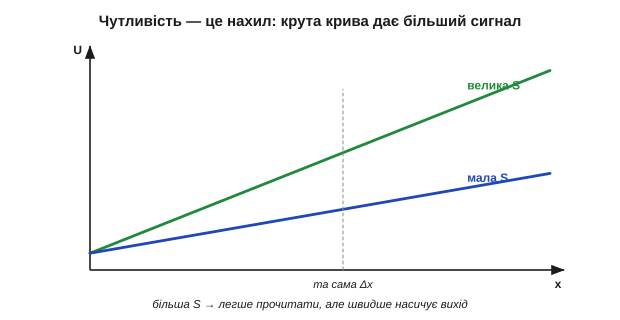
*Рис. 5.1.4.2. Чутливість — це нахил. Крутіша характеристика (більша S) дає на ту саму зміну Δx більший сигнал ΔU, тож її легше прочитати на тлі шуму й кроку АЦП. Але, як побачимо, велика S «з'їдає» діапазон.*

Більша чутливість — більший сигнал на ту саму зміну, а отже, легше боротися з шумом і кроком АЦП (згадайте, як термопарі бракувало мікровольтів у §5.1.1). Та задурно нічого: якщо вихід обмежений (скажімо, 0…3.3 В), то крутіша характеристика **швидше впирається в стелю** — велика чутливість звужує діапазон. Це перший із компромісів цього підрозділу.

Ще тонкість: на **кривій** характеристиці чутливість не одна на всіх — вона змінюється від точки до точки, бо нахил різний. Тому в нелінійного давача говорять про **локальну** чутливість у робочій точці: біля одного кінця діапазону він буває дуже чутливим, а біля іншого — майже глухим. NTC, приміром, круто реагує на холоді й мляво на жарі. Коли в даташиті стоїть одне число чутливості, це або середнє по діапазону, або нахил у якійсь типовій точці — і якщо ваша робоча зона скраю шкали, варто перевірити, яка чутливість саме там.

**Приклад (від чутливості до повної шкали).** Давач тиску з чутливістю 20 мВ/кПа і зсувом нуля 0.5 В міряє тиск 0…100 кПа. Який сигнал на виході?

```
U = U₀ + S · x
при   0 кПа:  U = 0.5 + 0.020·0   = 0.50 В
при 100 кПа:  U = 0.5 + 0.020·100 = 2.50 В
```

Вихід пробігає 0.5…2.5 В — рівно під типовий вхід АЦП. Видно й роль обох чисел: зсув 0.5 В підняв «нуль» над землею (щоб не впиратись у 0 В), а чутливість 20 мВ/кПа задала розмах. Підбір цих двох чисел під АЦП — звичайна робота при проєктуванні тракту.

### Діапазон і повна шкала: де давач ще не бреше

**Діапазон** (*range / span*) — проміжок вхідної величини, у якому давач працює: від мінімуму до максимуму. Його ширину звуть **повною шкалою** (*full-scale*, FS). Поза діапазоном характеристика втрачає сенс: нижче — давач «не відчуває», вище — **насичується**, вихід упирається в стелю й перестає рости, хоч величина зростає.

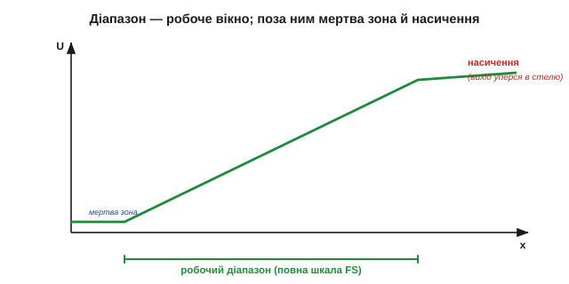
*Рис. 5.1.4.3. Діапазон — це робоче вікно. Усередині нього вихід чесно стежить за величиною; вище верхньої межі характеристика **насичується** (плато), і однаковий вихід відповідає різним великим величинам — давач більше не розрізняє. Міряти можна лише всередині діапазону.*

Звідси практичне правило вибору. Діапазон давача має **накривати** вашу величину з невеликим запасом — але не бути надмірно широким, бо тоді корисний сигнал тулиться в куточку шкали, і роздільність марнується. Давач прискорення на ±2 g і на ±16 g — різні інструменти: перший точніший у спокої, другий не насититься від удару.

Біля країв є й тонші ефекти. Знизу буває **мертва зона** (*deadband*) — невеликий проміжок, де давач ще «спить» і не відповідає (часто біля нуля механічних давачів через тертя чи люфт). Зверху — **зона перевантаження**: давач уже насичений, але ще цілий; а ще далі є межа, за якою його можна й **пошкодити** (тиск, що рве мембрану). Тому в специфікації окремо стоять «робочий діапазон» і «гранично допустимий»: працювати чесно можна лише в першому, а *виживати* давач здатен до другого. Плутати їх дорого — особливо там, де рідкісний сплеск виходить за робоче вікно.

> 🔧 **Навіщо це.** Перша перевірка придатності давача — чи накриває його діапазон вашу величину **в усіх режимах**, включно з рідкісними сплесками. Давач, що насичується на піку, у цей момент бреше найбільше — саме коли інформація найважливіша. Краще трохи ширший діапазон, ніж насичення в критичну мить; але не настільки ширший, щоб увесь робочий сигнал стиснувся в кілька кроків АЦП.

### Лінійність: наскільки крива схожа на пряму

Ідеальна характеристика пряма, реальна — трохи вигнута. **Лінійність** (*linearity*) каже, наскільки сильно крива відхиляється від прямої, а **нелінійність** міряють найбільшим відхиленням від опорної прямої — зазвичай у відсотках повної шкали (% FS).

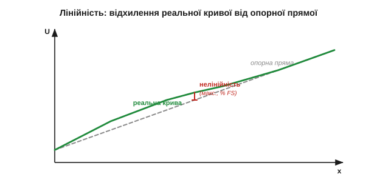
*Рис. 5.1.4.4. Лінійність. Реальна характеристика (суцільна) відхиляється від опорної прямої (штрих). Нелінійність — це найбільший зазор між ними, віднесений до повної шкали. Опорну пряму проводять або через кінці діапазону, або як найкращу за методом найменших квадратів.*

Чому це настільки важливо? Бо лінійний давач **тривіально оборотний**: якщо U = U₀ + S·x, то x = (U − U₀)/S — одне віднімання й ділення, і величина в руках. Нелінійний давач змушує зберігати цілу криву або таблицю й шукати по ній (та сама обернена задача з §5.1.1). Лінійність — це насамперед **простота переходу від сигналу назад до величини**. Тому платиновий RTD цінують за лінійність, а NTC терплять за дешевизну, миряючись із кривою.

**Приклад (що означає «±1% FS»).** Давач температури з діапазоном 0…100 °C і нелінійністю ±1% FS. Скільки це в градусах?

```
повна шкала FS = 100 °C
похибка = ±1% · 100 °C = ±1 °C
```

Тобто навіть ідеально відкалібрувавши нуль і нахил, через саму лише кривину ви можете помилятися на цілий градус десь посеред діапазону. Чи прийнятно — залежить від задачі: для кімнатного термостата байдуже, для калориметра — катастрофа.

Три деталі лінійності варто знати наперед. По-перше, опорну пряму проводять по-різному: **через кінці** діапазону (просто, але відхилення посередині виходить більшим) або як **найкращу за методом найменших квадратів** (менший максимальний зазор, чесніше число) — тож два даташити з «±1%» можуть мати на увазі різне. По-друге, нелінійність дають у відсотках **повної шкали**, а не поточного показу: ±1% FS на 100 °C — це ±1 °C і біля нуля, і біля сотні, тобто внизу шкали він відносно самого показу величезний. По-третє, кривину сьогодні часто **випрямляють у програмі** — заносять у мікроконтролер таблицю чи поліном і повертають величину точно; тоді нелінійність давача перестає бути вироком і стає просто роботою для коду.

### Точність і прецизійність — це різні речі

Два слова, які в побуті плутають, а в метрології суворо розрізняють. **Точність** (*accuracy*, вірність) — наскільки показ близький до **істинного** значення; промах тут систематичний (зміщення, bias). **Прецизійність** (*precision*, повторюваність) — наскільки **тісно** лежать повторні виміри однієї величини; промах тут випадковий (розкид).


*Рис. 5.1.4.5. Чотири мішені. Точно й прецизійно — купка в центрі. Прецизійно, але неточно — щільна купка, та збоку (систематичний зсув). Точно, але непрецизійно — розкидано навколо центру. Ні те, ні те — розкидано й збоку. Це різні біди з різними ліками.*

Розрізнення не академічне — воно прямо каже, **чим лікувати**. Прецизійний, але неточний давач (щільна купка не там) виправляється **калібруванням** ([§5.1.6](ch28-sensor-physics.md)): зміщення відоме й стале, його просто віднімають. Точний, але непрецизійний (розкид навколо правильного) лікується **усередненням і фільтрацією** ([Розділ 5.4](ch30-digital-filtering/ch30-digital-filtering.md)): багато вимірів, і середнє сходиться до істини. Сплутавши ці дві біди, ви лікуватимете не те.

> 🔧 **Навіщо це.** Коли давач «бреше», спершу спитайте: він бреше **однаково** щоразу (зсув — калібруйте) чи **щоразу по-різному** (розкид — усереднюйте)? Відповідь визначає інструмент. А ще не вірте на слово числу «точність»: часто в даташиті за нього видають саме повторюваність, бо систематику виробник пропонує прибрати вам калібруванням.

Корисно тримати в голові й **бюджет похибки** — повну похибку як суму внесків. Систематична частина (зсув нуля, похибка нахилу, нелінійність) додається майже напряму, бо тягне в один бік; випадкова (шум, розкид) — у корені з суми квадратів, бо незалежні дрібниці частково гасять одна одну. Зібравши всі внески, отримують одне число «гірше за все», яке й вирішує придатність давача. У строгій метрології розрізняють ще й слово **правильність** (*trueness*) — це саме брак систематичного зсуву, на відміну від «precision» (розкиду); разом вони й складаються в «accuracy». Жонглювати цими словами не конче, та коли даташити різних виробників розходяться в цифрах, ця термінологія рятує від плутанини.

### Роздільність: найдрібніша помітна зміна

**Роздільність** (*resolution*) — найменша зміна вхідної величини, яку давач і його тракт здатні **розрізнити**. Її задають крок АЦП ([Розділ 4.8](../../block-4-mcu-esp32/ch26-adc/ch26-adc.md)), шумовий поріг і власна зернистість давача. У вхідних одиницях роздільність зручно рахувати так:

```
роздільність (в одиницях величини) = крок АЦП (LSB) / чутливість S
```


*Рис. 5.1.4.6. Роздільність. Хоч величина змінюється гладко, оцифрований вихід стрибає сходинками завбільшки в один крок. Менший крок (більша чутливість або тонший АЦП) — дрібніші сходинки й вища роздільність.*

І головна засторога: **роздільність — це не точність**. Давач може показувати число з шістьма знаками (велика роздільність) і при цьому **систематично брехати** на десять відсотків (низька точність). Багато цифр на екрані заколисують хибною певністю. Роздільність каже лише, наскільки **дрібні** зміни видно, а не наскільки показ **правдивий** — це різні осі якості, і плутати їх небезпечно.

І ще про роздільність чесно. Те, що АЦП має 12 чи 16 біт, ще не означає, що стільки ж їх **корисні**: молодші біти топить власний шум тракту, тож говорять про **ефективну** (вільну від шуму) роздільність, яка завжди менша за номінальну. Реклама любить велике число біт, а працює — менше. Тому роздільність варто рахувати від реального шуму, а не від паспортних біт: якщо шум дорівнює чотирьом крокам, останні два біти — це просто мерехтіння, і додавати їх у розрахунок самообман. Усереднення кількох вимірів повертає частину втрачених біт, але коштом швидкодії — знову компроміс.

### І ще час: давач не встигає миттєво

Усе вище — **статичні** характеристики: вони описують усталений стан, коли величина вже не змінюється. Та реальний давач має ще й **час відгуку** (*response time*): він не стрибає до нового значення вмить. Терморезистор має теплову масу й «доходить» до нової температури секунди; механічний давач має інерцію. Якщо зчитати повільний давач надто рано, отримаєш не стару й не нову величину, а щось проміжне — і це **не шум, а запізнення**. Динамікою сигналів ми ще займемось окремо; тут важливо запам'ятати, що до чутливості й діапазону додається третій вимір — **швидкодія**, і повільний давач не стане швидким від частого опитування.

Грубо час відгуку описують **сталою часу** τ — точнісінько як в RC-колах: за час τ давач долає близько 63% шляху до нового значення, а «майже доходить» аж за 3–5 τ. Той самий терморезистор у повітрі має τ у кілька секунд, а в краплі рідини — частки секунди, бо тепло передається швидше. Звідси правило: щоб устигати за подією, давач мусить бути в кілька разів **швидшим** за неї, інакше він її згладить і занизить піки. І навпаки — надто швидкий давач у спокої лише вірніше відтворює шум. Швидкодію, як і чутливість, добирають **під задачу**, а не «чим більша, тим краща».

> 🔧 **Навіщо це.** Перш ніж вірити швидкому ряду чисел від повільного давача, спитайте про його сталу часу. Якщо подія коротша за кілька τ, давач побачить її лише частково — і жодне частіше опитування цього не виправить, бо обмежує фізика самого давача, а не АЦП. Швидкодія — така сама характеристика вибору, як діапазон, просто згадують про неї зазвичай останньою, коли вже пізно.

### Усе на одній кривій: як читати даташит

Зведімо словник докупи — усі ці числа живуть на одній і тій самій передавальній кривій.

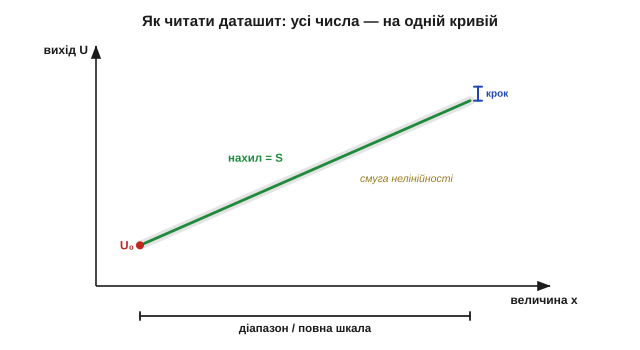
*Рис. 5.1.4.7. Як читати даташит. На одній кривій: зсув нуля U₀ (де починається), чутливість S (нахил), діапазон і повна шкала (ширина вікна), смуга нелінійності (відхилення від прямої), крок роздільності. Саме ці числа виробник і виносить на першу сторінку.*

Разом ці характеристики дають змогу **порівняти** два давачі й **передбачити** загальну похибку ще до купівлі: скласти внески нелінійності, роздільності та зсуву — і сказати, чи вкладається давач у вашу задачу. Це і є інженерне читання специфікації: не «гарний/поганий», а «достатній для цього чи ні».

**Приклад (зведення бюджету похибки).** Давач температури 0…100 °C: нелінійність ±1 °C, роздільність 0.1 °C, залишковий зсув після калібрування ±0.3 °C. Груба «найгірша» оцінка:

```
систематика (складаємо):  1.0 + 0.3        = 1.3 °C
випадкова (≈ корінь):     ≈ 0.1            = 0.1 °C
повна (гірший випадок):   ≈ 1.3 + 0.1      ≈ 1.4 °C
```

Тобто хоч екран показує десяті градуса, чесна похибка — близько ±1.4 °C, і її задає насамперед нелінійність. Видно й куди вкладати зусилля: тонший АЦП тут нічого не дасть (роздільність і так не вузьке місце), а от лінеаризація в програмі — багато. Саме так бюджет похибки перетворює жменю чисел даташита на рішення.

Проте є прикра обставина, яку ми досі мовчки оминали: усі ці числа ми вважали **сталими**. Насправді характеристика давача **повзе** — від температури, старіння, напрямку зміни — і до того ж тремтить від шуму. Тобто навіть та крива, на якій ми все міряли, не стоїть на місці. Саме цією нестабільністю — дрейфом, гістерезисом і шумом — ми й займемось далі.

---

## 5.1.5 Дрейф, гістерезис, шум

У [§5.1.4](ch28-sensor-physics.md) ми описували давач так, ніби його передавальна крива — раз і назавжди застигла лінія. Це зручна брехня. Насправді ту лінію **хитає** аж три різні біди: вона повільно **сповзає** (дрейф), **роздвоюється** залежно від того, звідки ви прийшли (гістерезис), і дрібно **тремтить** від випадкового шуму. Через них той самий давач на ту саму величину дає щоразу трохи інше число. Це і є та чесна суть, обіцяна ще в §5.1.1: давач дає не істину, а підказку — а дрейф, гістерезис і шум якраз і є те, що робить підказку розмитою. Добра новина: у кожної з трьох бід — свій механізм і, головне, **свій окремий лік**. Сплутати їх — означає лікувати не те.

### Ідеальна крива не стоїть на місці

Згадаймо ідеал §5.1.4: U = U₀ + S·x, чиста пряма. Реальність ламає її трьома різними способами, і їх корисно бачити поряд.

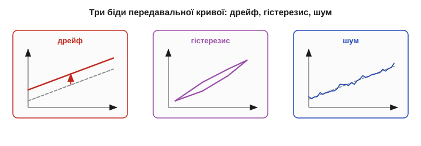
*Рис. 5.1.5.1. Як реальність псує характеристику. **Дрейф** — крива повільно сповзає вбік (зсув нуля чи нахилу). **Гістерезис** — «вгору» й «униз» ідуть різними шляхами, утворюючи петлю. **Шум** — крива розмита в тремтливу смугу. Три різні дефекти — три різні ліки.*

Ключ до всього підрозділу — **класифікувати** біду, перш ніж із нею боротися. Дрейф і гістерезис зміщують криву **закономірно** (повторювано) — це різновид систематичної похибки, тобто проблема **точності** з §5.1.4. Шум зміщує її **випадково** — це проблема **прецизійності**. А оскільки точність і прецизійність лікують по-різному (калібрування проти усереднення), то й тут перший крок — правильно назвати дефект.

Корисно розкласти ці біди й **за часом**. Шум — найшвидший: міняється від виміру до виміру, частки секунди. Дрейф — повільний: хвилини, години, а старіння — місяці й роки. Гістерезис стоїть осторонь цієї осі часу зовсім: він залежить не від того, **коли** ви міряєте, а від того, **звідки прийшли**. Ця проста картинка вже дає діагностику: якщо безлад зникає, коли усереднити кілька швидких вимірів, — то був шум; якщо лишається, але повільно повзе, — дрейф; якщо ж залежить від напрямку руху величини — гістерезис. Назва дефекту майже завжди ховається в його **часовому масштабі**.

### Дрейф: повільне сповзання нуля й нахилу

**Дрейф** (*drift*) — повільна зміна характеристики з часом, температурою, старінням чи механічним напруженням. «Повільна» тут ключове слово: дрейф міняє показ за хвилини, години, місяці — на відміну від швидкого тремтіння шуму.

Дрейфувати можуть обидва числа кривої. **Дрейф нуля** (*offset / zero drift*) — повзе U₀, уся крива зміщується паралельно вгору чи вниз. **Дрейф нахилу** (*span / sensitivity drift*) — повзе S, крива повертається. Перший додає сталу похибку до всіх показів, другий псує сильніше на краю діапазону.

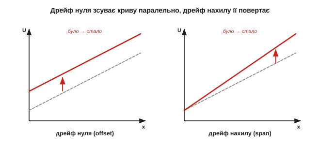
*Рис. 5.1.5.2. Два різновиди дрейфу. Дрейф нуля (ліворуч) піднімає всю криву — однаковий зсув на всій шкалі. Дрейф нахилу (праворуч) повертає її навколо нуля — похибка росте до краю діапазону. Обидва повільні й повторювані, тож їх можна виміряти й виправити.*

Найбільший винуватець дрейфу — **температура**. Майже все на світі залежить від неї, зокрема й власний нуль та підсилення давача й тракту. Цю паразитну чутливість до температури описують **температурним коефіцієнтом** (*temperature coefficient*, TC) — зазвичай у частинах на мільйон на градус (ppm/°C). Це немовби «другий, небажаний давач температури», вшитий у ваш давач величини.

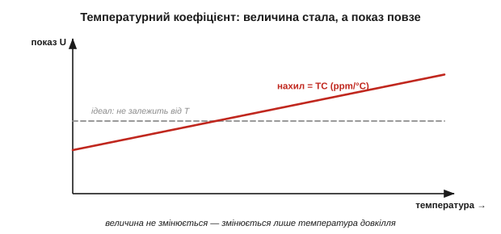
*Рис. 5.1.5.3. Температурний коефіцієнт. Величину тримають **сталою**, а змінюють лише температуру довкілля — і показ усе одно повзе. Нахил цієї небажаної залежності й є TC (ppm/°C): чистий паразит, який треба або компенсувати, або калібрувати.*

**Приклад (скільки коштує температурний дрейф).** Опорна напруга 2.5 В із TC = 50 ppm/°C живить АЦП. Кімната прогрілася на 20 °C — наскільки «попливе» опора?

```
дрейф = 2.5 В · 50×10⁻⁶ /°C · 20 °C
дрейф = 2.5 · 50 · 20 × 10⁻⁶ В = 2500 × 10⁻⁶ В = 2.5 мВ
```

2.5 мВ — це більше за три кроки 12-бітного АЦП (LSB ≈ 0.8 мВ із §5.1.1). Тобто від самого лише прогріву кімнати останні біти стають брехнею — і це ще «хороша» опора; дешева має TC у рази гірший. Окремий повільний дрейф дає й **старіння**: за місяці-роки матеріали необоротно змінюються, тож точні прилади періодично відправляють на **повірку**. До речі, дуже повільний фліккер-шум (про нього нижче) на наддовгих часах від дрейфу не відрізнити — це той самий повзучий безлад.

Окремо підступний — **дрейф розігріву** (*warm-up drift*). Найдужче давач пливе в перші хвилини після ввімкнення, поки його власне тепло (і тепло сусідніх мікросхем) не вийде на усталений рівень. Тому точні прилади просять «прогрітися» перед роботою, а в проєкті закладають паузу або перше калібрування вже теплим. Розрізняють і **коротко-** та **довготривалу** стабільність: перша про хвилини-години (розігрів, температура довкілля), друга про місяці-роки (старіння). Виробники навіть навмисно «вистарюють» (*burn-in*) давачі заздалегідь, щоб найшвидша, найгірша частина дрейфу минула ще до того, як деталь потрапить до вас.

> 🔧 **Навіщо це.** Дрейф — це чому давач треба **час від часу перекалібровувати**, а не «налаштував і забув». Три типові ліки: виміряти температуру окремим давачем і **компенсувати** (відняти відомий TC); побудувати тракт **раціометрично** (§5.1.1), щоб спільні дрейфи скоротились; періодично **переобнулювати** по відомій точці. Дрейф визначає, як часто це робити: швидкий — щохвилини, повільне старіння — раз на рік. А найдешевший лік — просто **переобнулити давач перед кожним сеансом** по відомій точці (скажімо, по нулю ваги без вантажу): дрейф нахилу це не прибере, та найчастішу його частину — дрейф нуля — зніме майже задарма.

### Гістерезис: показ залежить від того, звідки прийшли

**Гістерезис** (*hysteresis*) — підступніша річ: показ для тієї самої величини **різний** залежно від того, ви до неї зростали чи спадали. Крива «вгору» і крива «вниз» не збігаються, а утворюють **петлю**.

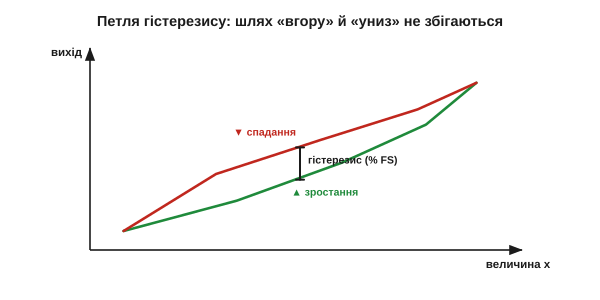
*Рис. 5.1.5.4. Гістерезис. Збільшуючи величину, йдемо нижньою гілкою; зменшуючи — верхньою. Для того самого x вихід різний — на величину гістерезису (найбільший зазор між гілками, у % FS). Це не шум: повтори дають ту саму петлю.*

Причини бувають механічні (тертя, люфт, пружна «пам'ять» матеріалу, що не одразу повертає форму), магнітні (петля B-H феромагнетика з [Розділу 2.2](../../block-2-components-analog/ch08-inductor/ch08-inductor.md)), теплові (запізнення прогріву). Спільне в них — **пам'ять про попередній стан**: давач ніби трохи «застрягає» там, де був.

Гістерезис легко сплутати з мертвою зоною (§5.1.4), та це різні речі: мертва зона — це **нечутливість** біля нуля, а гістерезис — **різні гілки** на всьому ходу. Класичний приклад — давач тиску з пружною мембраною: метал не повертає форму миттєво й точно, тож після високого тиску «нуль» виходить трохи завищений, а після низького — занижений. Те саме з феромагнітним осердям, що «пам'ятає» попереднє намагнічення (через що петлю B-H і звуть гістерезисною). Скрізь винна одна й та сама фізика — **недосконала оборотність** матеріалу, який неохоче вертається точно туди, звідки його зрушили.

Найважливіша властивість гістерезису — він **повторюваний, але залежний від шляху**. Це означає, що усередненням його **не прибрати**: скільки не міряй, петля та сама. Лікують інакше: або завжди підходити до точки **з одного боку** (тоді працюєте лише на одній гілці й похибка стала), або прийняти ширину петлі як межу й закласти її в бюджет, або змоделювати петлю програмно.

> 🔧 **Навіщо це.** Якщо давач прецизійний (повтори тісні), але показ помітно різниться, коли ви наближаєтесь до величини зверху чи знизу, — це майже напевно гістерезис, а не шум. Простий рятунок у керуванні: завжди підводьте механізм до уставки **з одного напрямку** (так роблять у точних столиках і фокусуваннях) — і гістерезис перестає вам брехати, бо ви ходите однією гілкою петлі.

### Шум: випадкове тремтіння поверх сигналу

**Шум** (*noise*) — випадкове тремтіння, що додається до кожного показу. На відміну від дрейфу й гістерезису, він **непередбачуваний** у дрібницях: щомиті інший.

Джерел кілька, і деякі фундаментальні, тобто непереборні в принципі. **Тепловий** шум (*Johnson-Nyquist*) є в **будь-якому** опорі: хаотичний рух електронів від тепла (з [Розділу 1.3](../../block-1-circuits-physics/ch03-resistance-power-heat/ch03-resistance-power-heat.md)) сам собою створює крихітну тремтливу напругу — що тепліше й що більший опір, то дужче. **Дробовий** (*shot*) шум — від дискретності заряду, що порціями долає перехід ([Розділ 2.5](../../block-2-components-analog/ch10-diode-pn-junction/ch10-diode-pn-junction.md)). **Фліккер**, або **1/f** — росте на низьких частотах і на дуже повільних часах зливається з дрейфом. **Шум квантування** — від кроку АЦП ([Розділ 4.8](../../block-4-mcu-esp32/ch26-adc/ch26-adc.md)). І нарешті — **зовнішні наводки**: гул мережі 50 Гц, перешкоди від цифри й радіо (з ними воюють екрануванням і заземленням — [§5.1.7](ch28-sensor-physics.md)).

Яке з джерел головне — залежить від ситуації, і це підказує, куди тиснути. У **високоомному** давачі (ємнісний, скляний електрод) панує тепловий шум — рятує менший опір чи вужча смуга. У **повільних**, майже сталих вимірах (температура, тиск) наперед виходять 1/f і дрейф — рятує модуляція сигналу подалі від нуля частот (хитрість, на якій стоять точні підсилювачі). А в **брудному** електромагнітному оточенні всю фізику перекриває зовнішня наводка — і тоді жодний тихий давач не зарадить без екрана й чесної землі. Тому, перш ніж міняти давач на дорожчий «малошумний», варто спитати: який шум тут насправді головний — бо проти чужого джерела дорогий давач безсилий.

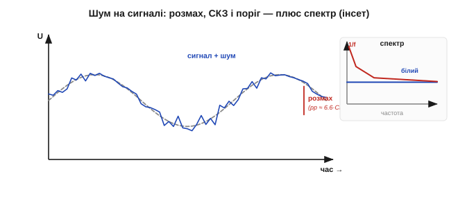
*Рис. 5.1.5.5. Шум кількісно. Чистий сигнал (штрих) тоне в тремтінні; його міряють середньоквадратичним значенням (СКЗ, RMS) або розмахом (peak-to-peak ≈ 6.6×СКЗ для гаусового). Відношення сигнал/шум (SNR) каже, наскільки сигнал «стирчить» над шумовим порогом. Інсет — спектр: рівний «білий» плюс підйом 1/f на низьких частотах.*

Шум описують середньоквадратичним значенням (СКЗ, *RMS*), розмахом (*peak-to-peak*), спектральною щільністю, а порівнюють із сигналом через **відношення сигнал/шум** (*SNR*). Саме шум ставить **поріг роздільності** з §5.1.4: дрібніші за нього зміни просто тонуть.

Звідси й поняття **шумового порога** (*noise floor*): рівень, нижче якого корисного сигналу просто не видно крізь власне тремтіння тракту. Зміряти величину, тихішу за поріг, неможливо — її затоплює шум; підняти сам сигнал (більша чутливість, §5.1.4) або опустити поріг (тихіший тракт) — два єдині виходи. І ще одне правило, що знадобиться далі: шуму впускає рівно стільки, скільки **смуги частот** ви відкрили. Що ширша смуга тракту, то більше білого шуму в нього влізе; звузити смугу до справді потрібної — уже наполовину перемогти шум. На цьому й стоятиме вся подальша фільтрація.

За спектром шум буває **білий** (рівний на всіх частотах, як тепловий) і **кольоровий** (1/f, що дужчає на низьких частотах) — і ця різниця підказує, чим його бити. Хоч окремий відлік шуму непередбачуваний, сукупно шум напрочуд **закономірний** статистично: відхилення лягають дзвоном Гауса навколо істинного значення, а ширину дзвона описують одним числом — стандартним відхиленням σ (воно ж СКЗ). Саме ця статистична правильність і робить можливим усереднення: непередбачуване поодинці стає передбачуваним гуртом. Тому шум — не просто «завада», а величина, яку міряють, закладають у бюджет похибки (§5.1.4) і свідомо тиснуть, а не безпорадно терплять.

### Боротьба: усереднення лікує шум, але не зсув

Головна зброя проти **випадкового** шуму напрочуд проста — **усереднення**. Якщо взяти N незалежних вимірів і усереднити, випадкові відхилення частково гасять одне одного, і шум спадає як **1/√N**:

```
шум(після) ≈ шум(до) / √N

N = 4   → шум удвічі менший
N = 16  → шум учетверо менший
N = 100 → шум у 10 разів менший
```

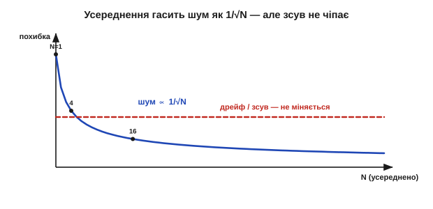
*Рис. 5.1.5.6. Усереднення проти двох бід. Випадковий шум спадає як 1/√N (крива вниз): 16 вимірів — учетверо тихіше. Але систематичний зсув (дрейф, гістерезис) — рівна лінія: усереднення його **не зменшує нітрохи**. Можна згладити показ до дзеркала й лишитися так само зміщеним.*

І ось **найважливіше застереження** всього підрозділу: усереднення (і взагалі фільтрація) лікує **тільки випадкове**. Дрейф і гістерезис — систематичні, тож скільки не усереднюй, вони лишаються на місці. Можна відполірувати шумний показ до дзеркальної гладі — і все одно стабільно брехати на величину дрейфу. Це пряме продовження думки §5.1.4: усереднення піднімає **прецизійність**, але до **точності** не додає ані крихти.

**Приклад (скільки вимірів варті чотирьох біт).** Хай шум дорівнює 8 крокам АЦП — це «з'їдає» 3 молодші біти (2³ = 8). Скільки усереднити, щоб повернути їх?

```
треба зменшити шум у 8 разів  →  √N = 8  →  N = 64
```

64 виміри усереднити — і випадковий шум упаде у 8 разів, повернувши близько трьох біт ефективної роздільності. Платня — час: 64 виміри замість одного, тобто вшестдесятчетверо повільніше. Це знову компроміс «точність проти швидкодії», і саме тому докладні способи фільтрації, що дають більше за ту саму ціну, заслуговують на цілий [Розділ 5.4](ch30-digital-filtering/ch30-digital-filtering.md).

У формули 1/√N є дрібний шрифт: виміри мають бути **незалежними**. Якщо шум корельований (той самий повільний 1/f тягне сусідні відліки в один бік) — усереднення допомагає слабше, ніж обіцяє корінь. А якщо за час набору N вимірів сама величина чи дрейф **встигли змінитися**, то ви усереднюєте вже різні речі й лише розмиваєте подію, занижуючи її піки (згадайте час відгуку з §5.1.4). Тому вікно усереднення підбирають вдумливо: достатньо широке, щоб придушити шум, але вужче за час, на якому встигають змінитися і сигнал, і дрейф. Ця делікатна рівновага — серце цифрової фільтрації, до якої ще дійдемо.

> 🔧 **Навіщо це.** Перед тим як «боротися з похибкою», назвіть її. Тремтить щоразу по-різному — **шум**: усереднюй або фільтруй. Повзе повільно в один бік — **дрейф**: калібруй чи компенсуй температуру. Різниться залежно від напрямку підходу — **гістерезис**: ходи з одного боку. Усереднити зміщений давач — означає отримати дуже **точно виміряну неправду**; це найчастіша й найприкріша помилка новачка в сенсориці.

### Зведення: три біди, три ліки

Підсумуймо словник нестабільності — він прямо доповнює характеристики §5.1.4.

| Біда | Природа | Головна причина | Як упізнати | Чим бити |
|---|---|---|---|---|
| **Дрейф** | повільний зсув | температура, старіння | показ повзе при сталій величині | калібрування, темп-компенсація, раціометрія |
| **Гістерезис** | залежність від шляху | тертя, магнетизм, пружність | різниця «вгору» vs «вниз» | підхід з одного боку, модель петлі |
| **Шум** | швидке випадкове | тепловий, дробовий, наводки | тремтить щоразу інакше | усереднення, фільтрація (Розд. 30) |

Усе разом це означає, що «сирий» показ давача — лише **початок** роботи, а не кінець. Дрейф і гістерезис кажуть, що крива не там, де ми думали; шум — що навколо неї туман. Разом із характеристиками §5.1.4 ці три біди й складають повний **бюджет невизначеності** давача: систематичну частину (нелінійність, дрейф, гістерезис) і випадкову (шум). Чесний інженер тримає в голові обидві — бо давач, бездоганний у каталозі, у теплій запиленій коробці поряд із радіопередавачем поводиться зовсім інакше, ніж на лабораторному столі. Залишається питання, яким ми завершимо фізику давачів: як, знаючи про всі ці вади, **витягти з давача правдиве число**? Відповідь — прив'язати його до відомих еталонів і побудувати зворотний шлях від сигналу до величини. Це й називається **калібрування**, і саме до нього ми переходимо.

---

## 5.1.6 Калібрування: від сирого сигналу до величини

Дотепер ми збирали майже самі лиш погані новини: давач перекладає неточно (§5.1.4), та ще й повзе й тремтить (§5.1.5). Тепер — винагорода. Калібрування — це той крок, де з усього цього безладу нарешті народжується **правдиве число**. Воно перетворює давач із шматка фізики на **прилад**, якому можна вірити. І саме тут практично розв'язується та обернена задача, яку ми лише назвали в §5.1.1: як від сигналу повернутися до величини.

### Калібрування — це побудова зворотного шляху

Згадаймо головну думку §5.1.1: давач робить **прямий** хід — величина перетворюється на сигнал, x → U. А нам потрібен **зворотний** — від сигналу до величини, U → x. Сире число з АЦП — скажімо, «615» — само собою не означає **нічого**: ні градусів, ні кілограмів, ні паскалів. Воно стане осмисленим лише тоді, коли ми знатимемо **відповідність** між сирими відліками й реальними одиницями. Калібрування — це і є вимірювання цієї відповідності: давач підносять до **відомих** входів і дивляться, що він видає, а тоді будують обернену карту «сигнал → величина».

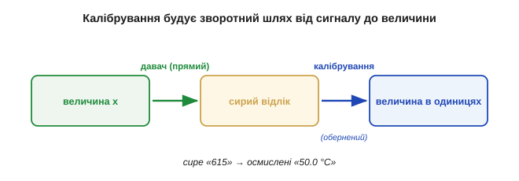
*Рис. 5.1.6.1. Калібрування будує зворотний шлях. Давач робить прямий хід (величина → сигнал); калібрування міряє його по відомих точках і прокладає назад дорогу (сигнал → величина). Без неї маємо безіменне «615», з нею — «50.0 °C».*

Іншими словами: фізика дає прямий бік перетворення, а калібрування — обернений, без якого жоден показ не має сенсу.

Варто оцінити, наскільки це глибоко. Поки давач не відкалібрований, його «615» — приватна валюта, зрозуміла лише цьому екземпляру: інший такий самий давач на ту саму температуру дасть «620» чи «600». Калібрування прив'язує приватні відліки до **спільних** одиниць — і раптом два різні прилади, два різні інженери, дві різні країни починають говорити про величину однаково. Саме калібрування робить вимір **об'єктивним і відтворюваним**, а не просто стрілкою, що кудись хитнулась. Без нього сенсорика лишилася б купою несумісних «папужок», кожна зі своєю незрозумілою шкалою. Решта підрозділу — про те, як цей обернений бік побудувати: від найпростішого до найповнішого.

### Дві точки задають пряму: нуль і нахил

Для **лінійного** давача характеристика — пряма U = U₀ + S·x із двома невідомими (§5.1.4). А пряму однозначно задають **дві точки**. Тому достатньо піднести давач до **двох відомих** величин, зміряти сирий вихід у кожній — і з цих двох пар обчислити нахил S («підсилення», *gain*) та зсув U₀ («нуль», *offset*). Далі обернення тривіальне: x = (U − U₀) / S.

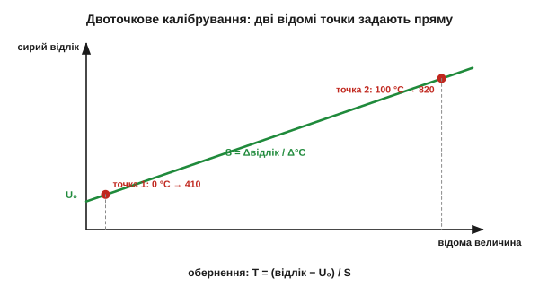
*Рис. 5.1.6.2. Двоточкове калібрування. Два відомі входи (наприклад, 0 °C і 100 °C) дають дві точки «відома величина — сирий відлік». Пряма через них задає нахил S і зсув U₀; усе інше читається з прямої. Це найуживаніший спосіб у світі давачів.*

**Приклад (двоточкове калібрування термодавача).** Давач занурили в тану́чий лід (0 °C) — АЦП показав 410 відліків; занурили в окріп (100 °C) — 820 відліків. Будуємо обернення:

```
нахил:  S = (820 − 410) / (100 − 0) = 410 / 100 = 4.1 відліка/°C
нуль:   U₀ = 410 відліків  (це показ при 0 °C)

обернення:  T = (відлік − 410) / 4.1
```

Тепер сирий показ оживає. Прийшло «615»? Тоді T = (615 − 410) / 4.1 = 205 / 4.1 = **50.0 °C**. Дві відомі точки — і безіменні відліки стали градусами. Цей прийом «нуль і нахил» (*zero & span*) — робоча конячка всієї сенсорики.

Одне практичне питання — **куди** ставити ці дві точки. Найкраще брати їх ближче до країв робочого діапазону: тоді пряма спирається на широку базу й найменше «гуляє» посередині. Якщо ж обидві точки тулляться поруч, маленька похибка в кожній сильно повертає всю пряму — як стілець на двох близько поставлених ніжках. І ще: між двома точками (і трохи за ними) пряма точна, а далеко за межами — це вже **екстраполяція**, якій вірити не варто, бо там можуть початись і нелінійність, і насичення (§5.1.4). Тому дві точки обирають так, щоб вони **охоплювали** реальний робочий проміжок, а не лежали в його куточку.

> 🔧 **Навіщо це.** Двоточкове калібрування — найкорисніший трюк у польовій сенсориці. Дві відомі точки, дві арифметичні дії — і будь-який лінійний давач говорить у ваших одиницях, без жодної лабораторії. Бережіть лише дві речі: щоб точки **охоплювали** робочий діапазон і щоб самі еталони були чесні (лід — справді 0 °C, гиря — справді відомої маси). Решту зробить формула «нуль і нахил».

### Одна точка: обнулення (tare)

Часто повзе тільки **нуль** (дрейф зсуву — найпоширеніший, §5.1.5), а нахил тримається. Тоді й калібрувати щоразу заново обидва числа не треба — досить **однієї** відомої точки, зазвичай нуля: переобнулити. Це та сама кнопка **«тара»** на кухонних вагах: ставите порожню миску, тиснете тару — ваги запам'ятовують поточний показ як новий нуль і віднімають його з усіх наступних.

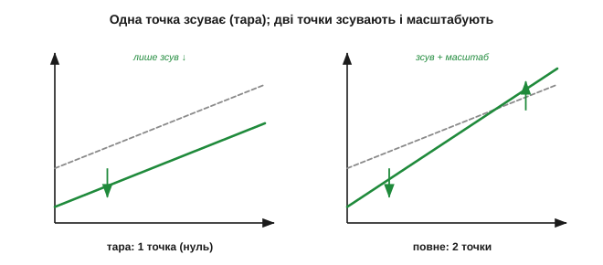
*Рис. 5.1.6.3. Одна точка проти двох. Обнулення (тара) лише **зсуває** характеристику, прибиваючи її до відомого нуля, — лікує дрейф зсуву. Двоточкове калібрування ще й **масштабує** (править нахил) — лікує і зсув, і дрейф підсилення. Тара дешева й часта; повне калібрування рідше й точніше.*

Обнулення дешеве й швидке, тож його роблять часто — перед кожним зважуванням, на старті сеансу. Воно прибирає найчастішу біду (зсув нуля), але **не чіпає** нахилу: якщо попливло підсилення, тарою його не виправити, потрібна друга точка.

У тари є й зворотний бік, про який легко забути: вона **сліпо** прибиває нуль до поточного показу. Отже, якщо в момент обнулення на давачі вже була справжня величина, ви її мовчки **зануляєте** разом зі зсувом. Тому тарувати треба свідомо й у правильну мить: ваги — порожніми, гіроскоп — нерухомим, давач газу — на чистому повітрі. Інакше тара з ліки перетворюється на джерело сталої похибки, ще й непомітної, бо «нуль» виглядає правильним.

### Багато точок: коли крива не пряма

А якщо давач **нелінійний** (§5.1.4) — як NTC із його крутою кривою? Двох точок замало: пряма через них збреше посередині. Тоді міряють вихід у **багатьох** відомих точках і будують уже не пряму, а **криву**. Обернути її можна двома способами: **таблицею відповідності** (*lookup table, LUT*) з лінійною інтерполяцією між вузлами, або **підгонкою формули** — полінома чи відомої функції (для NTC це рівняння Стейнгарта-Гарта, для термопар — стандартний поліном).

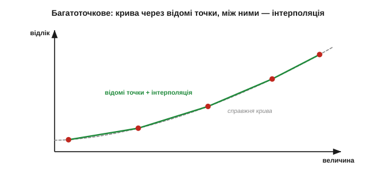
*Рис. 5.1.6.4. Багатоточкове калібрування нелінійного давача. Вихід міряють у кількох відомих точках; між ними значення беруть інтерполяцією по таблиці (LUT) або з підігнаної формули. Більше точок — точніший зворотний шлях, але й більше праці на калібрування.*

Це і є та **лінеаризація в програмі**, яку ми обіцяли ще в §5.1.4: крива давача перестає бути вироком, щойно мікроконтролер уміє по ній ходити назад. Компроміс очевидний — більше калібрувальних точок дає точніше обернення, але кожна точка коштує окремого еталонного виміру.

Між таблицею й поліномом теж є вибір зі своїм смаком. **Таблиця** проста й передбачувана: між вузлами — пряма, ніяких сюрпризів, але точок треба багато, і вони їдять пам'ять. **Поліном** компактний і гладкий, та підступний: підігнаний по кількох точках, він між ними чи за ними може **вихилятися** хвилями, особливо високого степеня. На практиці часто беруть золоту середину — **кусково-лінійну** апроксимацію: та сама таблиця, але з розумно розставленими вузлами, густіше там, де крива крутіша. Добра новина: для типових давачів виробник зазвичай уже дає або таблицю, або готову формулу, тож винаходити велосипед не доводиться — досить акуратно її застосувати.

### Еталон мусить бути кращим: простежуваність

Тут постає питання, від якого все залежить: а **відносно чого** калібрувати? Калібрування лише **переносить** точність з еталона на давач — отже, еталон мусить бути **кращим** за давач, інакше ви переносите не точність, а власну ж невизначеність. Калібрувати проти чогось гіршого — самообман.

За еталони правлять **фізичні реперні точки** (тану́чий лід 0 °C, кипіння води 100 °C, потрійна точка — природа сама тримає їх сталими), **повірені міри** (сертифікована гиря, опорна напруга) або просто **кращий прилад**. Але й ці еталони хтось калібрував — за ще кращими, аж до національних і міжнародних еталонів СІ. Цей ланцюг «хто калібрував калібрувальника» зветься **простежуваністю** (*traceability*).

Дві речі роблять цю піраміду надійною. По-перше, **природні реперні точки**: тану́чий лід і потрійна точка води — це не чиясь домовленість, а сама фізика, що тримає ці температури сталими будь-де у світі **задарма**; тому вони й слугують безкоштовними точними еталонами. (З кипінням обережніше: воно «тримає» свої 100 °C лише за нормального тиску — на висоті чи в негоду точка кипіння помітно зсувається, тож для калібрування її беруть із поправкою на тиск.) По-друге, чесний облік невизначеності: на кожному щаблі додається трохи похибки, тож унизу піраміди давач **ніколи** не точніший за суму всіх ланок над ним. Саме тому акредитовані лабораторії видають **сертифікат** із числом невизначеності — не голе «відкалібровано», а «відкалібровано з точністю стільки-то, простежувано до СІ». Без цього додатка слово «калібрований» майже порожнє.

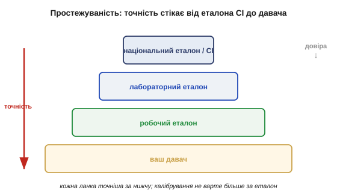
*Рис. 5.1.6.5. Простежуваність — піраміда довіри. Ваш давач калібрують за робочим еталоном, той — за лабораторним, той — за національним, аж до означень СІ. Кожна ланка точніша за попередню; точність «стікає» згори вниз. Калібрування не варте більше за свій еталон.*

> 🔧 **Навіщо це.** Калібрування ніколи не буває точнішим за свій еталон. Виставляти давач «на око» чи за таким самим дешевим приладом — означає отримати **точно виміряну неправду**. Перш ніж калібрувати, спитайте: моя опорна точка справді краща за давач? Тану́чий лід — чудовий і безкоштовний еталон 0 °C; сусідній такий самий термометр — ні.

### Де живе калібрування: завод, поле, сам давач

Калібрувати можна на різних етапах, і це теж вибір. **Заводське** калібрування: коефіцієнти зашивають у давач на виробництві — «розумні» напівпровідникові давачі (§5.1.3) тому й віддають одразу реальні одиниці, що калібрувальну криву вже вкладено в кристал. **Польове** (користувацьке): ви самі переобнуляєте чи правите нахил у роботі — тара ваг, занурення pH-метра в буферні розчини. **Самокалібрування**: давач має внутрішній еталон і періодично звіряється сам (авто-нуль).

У вибору етапу є своя ціна. **Заводське** зручне — нічого не робиш, давач одразу в одиницях, — але воно припускає, що відтоді нічого не попливло; а ми вже знаємо з §5.1.5, що пливе. **Польове** ловить свіжий дрейф і старіння, та потребує еталона під рукою (порожніх ваг, буферного розчину, реперної точки) і дисципліни його застосовувати. Тому на практиці їх часто **поєднують**: грубе заводське калібрування плюс легке польове переобнулення перед роботою. А «розумний» давач, що сам тримає коефіцієнти, лише ховає цю роботу всередину корпусу — але не скасовує її, і періодична повірка йому потрібна так само.

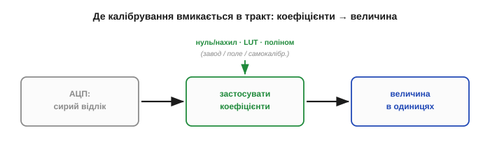
*Рис. 5.1.6.6. Де калібрування вмикається в тракт. Сирий відлік АЦП проходить крізь застосування коефіцієнтів (нуль/нахил або LUT/поліном) і виходить уже величиною в реальних одиницях. Коефіцієнти беруться із заводу, з поля або з самокалібрування — але місце їх застосування одне.*

Хоч би звідки бралися коефіцієнти, **місце** їх застосування одне: між сирим відліком і осмисленою величиною, у коді. Тому калібрування — це не лише процедура з еталонами, а й маленький шматок прошивки, що щоразу перетворює відлік на градуси.

### Що калібрування лікує, а що ні

Нарешті — межі методу, бо це зшиває весь розділ докупи. Калібрування лікує **систематичні** вади: зсув нуля, похибку нахилу, нелінійність (багатоточкове) і навіть **відомий дрейф** — якщо міряти окремо температуру й калібрувати залежність від неї (це і є температурна компенсація з §5.1.5).

**Приклад (компенсація відомого дрейфу).** Нуль давача пливе на −0.5 °C на кожні +10 °C нагріву довкілля (відомий TC). Поряд стоїть давач температури плати: він показав +35 °C проти калібрувальних +25 °C — отже, прогрів на +10 °C. Виправлення:

```
зсув від прогріву = (35 − 25)/10 · (−0.5 °C) = −0.5 °C
виправлений показ = сирий показ − (−0.5 °C) = сирий + 0.5 °C
```

Знаючи TC і вимірявши температуру окремо, систематичний дрейф просто **віднімають числом** — давач ніби й не грівся. Ось як «непереборний» дрейф §5.1.5 перетворюється на ще одну калібрувальну поправку: усе систематичне, що ви здатні **виміряти**, ви здатні й **відняти**.

Але двох речей калібрування **не може**. Воно не прибирає **випадковий шум** — бо припускає, що давач щоразу дає те саме; проти тремтіння працює усереднення й фільтрація (§5.1.5, [Розділ 5.4](ch30-digital-filtering/ch30-digital-filtering.md)). І воно не лікує **гістерезис** — бо припускає **однозначну** криву, а гістерезис дає дві гілки залежно від шляху; його приборкують, підходячи з одного боку. До того ж сама калібрувальна крива з часом **дрейфує**, тож будь-яке калібрування дійсне лише певний термін і за певних умов — звідси періодична повірка.


*Рис. 5.1.6.7. Інструмент під ваду. Зсув, нахил, нелінійність, відомий дрейф — калібрування. Випадковий шум — усереднення й фільтр. Гістерезис — підхід з одного боку. Кожен дефект має свій лік; жоден інструмент не лікує всі.*

> 🔧 **Навіщо це.** Найчастіша помилка — лікувати ваду не тим інструментом: довго фільтрувати зміщений давач (вийде точно виміряна неправда) або калібрувати шумний (крива «гулятиме» від калібрування до калібрування). Спершу назвіть ваду за §5.1.4–5.1.5, тоді беріть відповідний лік: систематику — калібруванням, випадкове — фільтром, шлях — однобічним підходом. Разом вони й роблять із давача надійний прилад.

Лишається практичне «коли». Калібрування не вічне: воно дійсне лише доти, доки давач і умови близькі до тих, у яких його робили. Тому в реальних приладах закладають цілий **розклад повірки** — від «щоразу на старті» (швидка тара) до «раз на рік у лабораторії» (повний еталонний прогін), залежно від того, як хутко цей давач пливе (§5.1.5). Добрий тон — зберігати в пам'яті **дату й умови** останнього калібрування: прилад, що «не пам'ятає», коли його востаннє звіряли, довіри не заслуговує, бо його показ може бути правильним, а може бути піврічним дрейфом — і ви не відрізните. Так калібрування з разової дії перетворюється на частину **життєвого циклу** приладу, як заміна оливи в двигуні.

Ось і вся фізика давачів у дії: давач перетворює (§5.1.1) силою певного ефекту (§5.1.2–5.1.3), має описувану характеристику (§5.1.4) з відомими вадами (§5.1.5), а калібрування прив'язує її до еталона й повертає правдиву величину. «615 відліків» нарешті стало «50.0 °C» — з чесно порахованою похибкою. І найприємніше: калібрування — це майже завжди **найдешевший** спосіб підняти точність. Не міняти давач на дорожчий, не перепроєктовувати тракт, а просто акуратно піднести наявний давач до двох-трьох відомих точок і записати коефіцієнти. Часто саме це й відрізняє аматорський вузол від приладу, якому вірять. Лишилася одна, найперша ланка, якої ми досі не торкались: а чи **дійшов** сигнал давача до входу неспотвореним? Як під'єднати давач, щоб сам вхід його не зіпсував? Це — останній підрозділ розділу.

---

## 5.1.7 Узгодження давача з входом

Уся попередня робота — характеристики, вади, калібрування — мовчки спиралася на одне припущення: що сигнал давача **дійшов** до АЦП таким, яким його віддав давач. Це припущення часто хибне. Найперша ланка вимірювального ланцюга з §5.1.1 — саме з'єднання давача з тим, хто його читає, — здатна спотворити сигнал **ще до** будь-якого калібрування, тихо й системно. Тому фізику давачів ми завершуємо темою, яка зшиває докупи пів курсу: як під'єднати давач, щоб вхід його **не зіпсував**. Тут зійдуться внутрішній опір джерела ([Розділ 1.5](../../block-1-circuits-physics/ch05-equivalent-circuits/ch05-equivalent-circuits.md)), дільник ([Розділ 1.4](../../block-1-circuits-physics/ch04-kirchhoff-circuit-analysis/ch04-kirchhoff-circuit-analysis.md)), операційний підсилювач ([Розділ 2.8](../../block-2-components-analog/ch13-opamp-comparator/ch13-opamp-comparator.md)) і вибірка АЦП ([Розділ 4.8](../../block-4-mcu-esp32/ch26-adc/ch26-adc.md)).

### Сам акт під'єднання може зіпсувати сигнал

Наївна картина: з'єднав давач з АЦП — і читай. Реальність підступніша. Давач — **не ідеальне** джерело: у нього є власний **вихідний опір** (це Тевенінів Rвн із [Розділу 1.5](../../block-1-circuits-physics/ch05-equivalent-circuits/ch05-equivalent-circuits.md)). А вхід, що читає, має скінченний **вхідний опір**. Щойно ви їх з'єднали, вони утворюють **дільник напруги** ([Розділ 1.4](../../block-1-circuits-physics/ch04-kirchhoff-circuit-analysis/ch04-kirchhoff-circuit-analysis.md)) — і виміряна напруга виходить **меншою** за справжню напругу джерела:

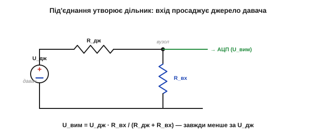
*Рис. 5.1.7.1. Навантаження входом. Давач — це джерело U_дж із власним опором R_дж; вхід має опір R_вх. Разом вони — дільник, тож АЦП бачить не U_дж, а просаджену U_вим = U_дж · R_вх/(R_дж + R_вх). Що менший R_вх відносно R_дж, то більше втрачено.*

**Приклад (як вхід краде половину сигналу).** Давач із вихідним опором 100 кОм під'єднали до входу теж 100 кОм. Скільки дійде?

```
U_вим = U_дж · R_вх / (R_дж + R_вх)
U_вим = U_дж · 100к / (100к + 100к) = U_дж · 0.5
```

**Половина** сигналу зникла — і це не шум, не дрейф, а чистий ефект під'єднання, той самий «просад під навантаженням», що ми бачили в реального джерела [§1.5.1](../../block-1-circuits-physics/ch05-equivalent-circuits/ch05-equivalent-circuits.md). Найгірше — він **системний** і непомітний: давач начебто справний, калібрування навіть приховає його в одній точці, але варто змінитися вихідному опору давача — і вся шкала попливе.

Це класична пастка початківця, і підступна вона саме тим, що **з самого показу її не видно**: число виглядає правдоподібним, просто воно занижене. Аналогія груба, але влучна: коли міряєте тиск у шині дешевим манометром, частина повітря стравлюється в сам манометр — і ви читаєте менший тиск, ніж був, причому сам акт вимірювання його й змінив. З електричним сигналом те саме: добрий вимір майже **нічого не повинен брати** в джерела. Усе подальше в цьому підрозділі — різні способи виконати цю одну заповідь.

### Правило високого вхідного опору

Звідси проста, але непорушна вимога для сигналів-напруг: **вхідний опір має бути набагато більшим за вихідний опір давача**. Подивімось, що дає «набагато»:

```
R_вх = 10 · R_дж   →  доходить 10/11 ≈ 91 %  (втрата ~9 %)
R_вх = 100 · R_дж  →  доходить 100/101 ≈ 99 % (втрата ~1 %)
```

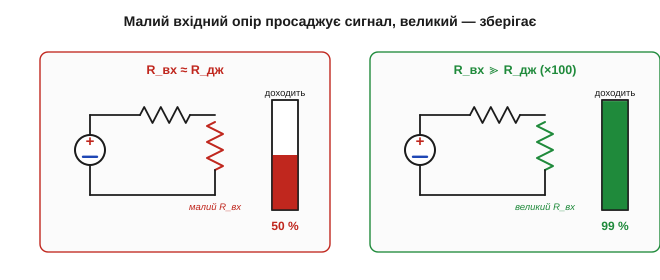
*Рис. 5.1.7.2. Правило високого входу. Ліворуч: R_вх близький до R_дж — сигнал просів удвічі. Праворуч: R_вх у сотні разів більший — джерело майже не навантажене, доходить ~99 %. Для напруги завжди хочемо «дивитися, не торкаючись».*

Особливо небезпечні **високоомні** давачі — п'єзо, ємнісні, скляний електрод pH, фотодіод: їхній вихідний опір сягає мегаомів і навіть гігаомів, тож **майже будь-який** вхід їх просаджує. Саме про них ішлося в §5.1.3, коли ми казали «потрібен високоомний буфер».

Дзеркальне зауваження: правило «високий вхід» — саме для сигналів-**напруг**. Якщо давач віддає **струм** (фотодіод, струмова петля §5.1.1), усе навпаки: від входу хочуть **низького** опору, щоб струм ішов крізь нього, а не губився, — і такий струм перетворюють на напругу окремим вузлом (трансімпедансним підсилювачем на тому ж ОП). Тож «узгодження» завжди читають під **тип** сигналу. І ще: вхід — це не лише опір, а й невелика **ємність**; для повільних сигналів вона байдужа, а для швидких чи високоомних утворює з R_дж власну RC-затримку — ще одне приховане джерело похибки, яке теж лікує буфер із низьким виходом.

> 🔧 **Навіщо це.** Перше питання до незнайомого давача напруги — **який у нього вихідний опір?** Якщо одиниці кілоом — звичайний вхід АЦП впорається. Якщо сотні кілоом чи мегаоми — пряме під'єднання вкраде сигнал, і ніяке калібрування цього не врятує; такому давачу обов'язково потрібен буфер. Це питання вирішує долю виміру ще до першого відліку.

### Буфер: повторювач напруги

Як «дивитися, не торкаючись»? Класична відповідь — **повторювач напруги** (*voltage follower*, буфер) на операційному підсилювачі з [Розділу 2.8](../../block-2-components-analog/ch13-opamp-comparator/ch13-opamp-comparator.md). У нього майже **нескінченний вхідний** опір (не навантажує давач) і майже **нульовий вихідний** (легко живить АЦП), а коефіцієнт — рівно одиниця: він просто **копіює** напругу.


*Рис. 5.1.7.3. Буфер як розв'язка. Повторювач напруги вмикають між високоомним давачем і АЦП: своїм велетенським входом він майже не торкається джерела, а своїм потужним виходом упевнено заряджає вхід АЦП. Напруга та сама, але опір «знизився» з мегаомів до одиниць ом.*

Це **головний** засіб проти навантаження. Буфер ставить між джерелом і навантаженням «підсилювач струму без підсилення напруги»: давач бачить порожнечу, АЦП — потужне низькоомне джерело. Звідси й назва — буфер розв'язує (ізолює) одне коло від іншого по опору.

Працює він за «золотими правилами» ОП із §2.8: зворотний зв'язок змушує вихід повторювати вхід, тож U_вих = U_вх при майже нульовому вхідному струмі. Та ідеального задарма не буває: буфер додає **власний** дрейф нуля, трохи шуму й має скінченну смугу — тобто сам стає ще однією ланкою тракту зі своїми вадами §5.1.4–5.1.5, які теж ідуть у бюджет похибки. А коли треба не просто скопіювати, а **відняти** два високоомні сигнали (як у мості §5.1.2), беруть спеціальний **інструментальний підсилювач** — він дає величезний вхідний опір і чисте віднімання синфазної завади заразом.

> 🔧 **Навіщо це.** Повторювач коштує копійки, а рятує цілий вимір. Правило: після **будь-якого** високоомного давача — одиничний буфер, і клопіт із навантаженням зникає. Багато «розумних» давачів (§5.1.3) тому й містять буфер усередині, що без нього їхній високоомний чутливий елемент не дотягнув би сигнал навіть до сусідньої ніжки.

### Підгонка рівня під АЦП

Не навантажити — лише півсправи. Сигнал ще має **влізти** в діапазон АЦП із доброю роздільністю (§5.1.1, §5.1.4). Замалий — підсилити (мікровольти термопари, що тонули в кроці АЦП ще у §5.1.1); завеликий — послабити дільником; зі зсувом не туди — підняти або опустити. Усе це робить той самий операційний підсилювач: задає **нахил (підсилення) і зсув**, перекидаючи діапазон давача рівно на діапазон АЦП.


*Рис. 5.1.7.4. Підгонка рівня. Власний розмах давача (вузький чи надто широкий, не з нуля) підсиленням і зсувом «розтягують» рівно на вхідний діапазон АЦП — щоб жоден біт роздільності не пропав і ніщо не вилізло за стелю.*

Це пряме продовження калібрування §5.1.6, тільки в **залізі**: там ми правили відліки числом, тут готуємо аналоговий сигнал, щоб відліки взагалі були якісними. Добре узгоджений рівень — це коли весь робочий розмах давача займає майже всю шкалу АЦП, не впираючись у краї.

Дві засторо́ги про підсилення. По-перше, підсилювати треба **рано** — якомога ближче до давача: якщо дати слабкому сигналу спершу проїхати дротом і там зловити наводку, а тоді підсилити, ви підсилите сигнал **разом** із наводкою, і відношення сигнал/шум уже не врятувати. По-друге, підсилення **не створює** інформації: розтягнувши мікровольти у вольти, ви робите їх видимими для АЦП, але закладений у самому давачі шум (§5.1.5) розтягнеться рівно так само — підсилення за межею власного шуму джерела лише марнує діапазон. Тому підсилюють **рівно** стільки, щоб корисний розмах ліг на шкалу АЦП, і ні на йоту більше.

### АЦП теж навантажує: заряд конденсатора вибірки

Є ще тонший спосіб зіпсувати вимір, і він стосується **самого** АЦП. Його вхід — не пасивний опір: усередині сидить **конденсатор вибірки-зберігання**, який щоразу перед перетворенням мусить **зарядитися** до вхідної напруги ([Розділ 4.8](../../block-4-mcu-esp32/ch26-adc/ch26-adc.md)). Якщо джерело високоомне, цей конденсатор **не встигає** дозарядитись у коротке вікно вибірки — і АЦП оцифровує недозаряджену, занижену напругу.

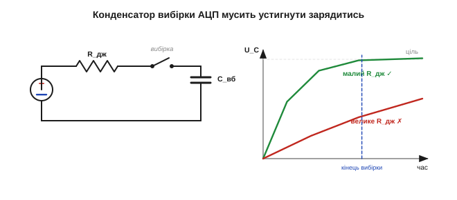
*Рис. 5.1.7.5. Чому АЦП любить низький опір. Перед відліком ключ замикає вхід на конденсатор вибірки C_вб, і той заряджається крізь опір джерела зі сталою τ = R_дж·C_вб ([Розділ 2.1](../../block-2-components-analog/ch07-capacitor/ch07-capacitor.md)). Великий R_дж — повільний заряд — недозаряд за вікно вибірки — занижений відлік.*

Ліки ті самі: **низький вихідний опір** джерела (тобто знову **буфер**), або невеликий конденсатор прямо на ніжці (він підживлює C_вб зарядом), або повільніша вибірка. Саме тому даташити АЦП (зокрема ESP32) прямо вказують максимальний допустимий опір джерела — перевищиш його, і відліки попливуть, хоч давач і тракт ідеальні.

**Приклад (чому опір джерела має бути малим).** Щоб похибка вибірки була меншою за крок, конденсатор має дозарядитися на ~n сталих часу (для 12 біт ≈ 9·τ). Якщо вікно вибірки коротке, єдиний важіль — малий R_дж:

```
τ = R_дж · C_вб        (стала заряду)
велике R_дж → велике τ → недозаряд за фіксоване вікно → похибка
мале   R_дж → малий τ → повний заряд → точний відлік
```

Тобто навіть «правильний» за рівнем сигнал АЦП оцифрує неправильно, якщо джерело надто високоомне. Буфер закриває і цю проблему одним рухом.

Ще гостріше це стає, коли один АЦП по черзі читає **кілька** входів через мультиплексор: конденсатор вибірки приходить на новий канал, ще «пам'ятаючи» заряд від попереднього, і якщо джерело високоомне, лишок чужого заряду домішується до показу — сусідні канали починають «підглядати» один в одного. Знов рятують низький опір джерела (буфер на кожен канал) або маленький конденсатор на ніжці, що швидко перебиває пам'ять вибірки. Тому в багатоканальних вимірах правило низького опору ще суворіше, ніж в одноканальних, — і недбалість тут дає найзагадковіші «плаваючі» покази, де один давач реагує на інший.

### Вхідний фільтр і захист

Корисно, що проста **RC-ланка** на вході працює одразу на три фронти. Як фільтр низьких частот вона **обрізає смугу**, гасячи високочастотний шум (§5.1.5) і завади. Вона ж служить **антиаліасним** фільтром, прибираючи частоти вище половини частоти дискретизації, які інакше «склалися» б у хибний сигнал (аліасинг із [Розділу 4.8](../../block-4-mcu-esp32/ch26-adc/ch26-adc.md)). А додавши **послідовний резистор і діоди-обмежувачі**, та сама вхідна ланка ще й **захищає** ніжку від перенапруги й сплесків (захист входу з [Розділу 4.4](../../block-4-mcu-esp32/ch22-gpio/ch22-gpio.md), діод із [Розділу 2.5](../../block-2-components-analog/ch10-diode-pn-junction/ch10-diode-pn-junction.md)) — щоб несправність давача чи статика не вбили вхід.

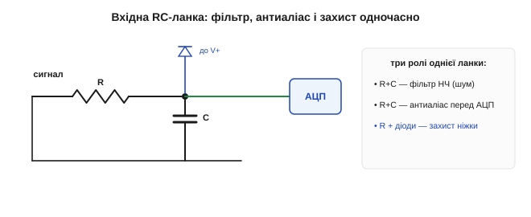
*Рис. 5.1.7.6. Скромна вхідна ланка з потрійною роллю. RC гасить шум і слугує антиаліасним фільтром перед АЦП; послідовний резистор і діоди-обмежувачі відводять перенапругу на шини живлення, рятуючи ніжку. Дешево — і відразу три користі.*

Тут важлива рівновага: занадто «важка» RC згладить і **корисний** сигнал (знов компроміс смуга/затримка з §5.1.5), а її резистор додасть до вихідного опору джерела — тож фільтр і буфер проєктують разом, а не нарізно.

Як працює захист, варто бачити чітко: послідовний резистор **обмежує струм**, а діоди-обмежувачі відводять усе, що вилізло вище живлення чи нижче землі, на відповідні шини — отже, на ніжку приходить напруга лише в безпечних межах, навіть якщо ззовні прилетіло кілька зайвих вольтів чи статичний розряд. Без цієї копійчаної ланки перша ж несправність давача або дотик зарядженою рукою (ESD з [§1.1.1](../../block-1-circuits-physics/ch01-charge-field-potential/ch01-charge-field-potential.md)) може пробити вхід **назавжди**. Номінали підбирають так, щоб резистор обмежив струм до безпечного, але разом із ємністю входу не зарізав потрібну смугу, — тобто захист, фільтр і швидкодія знов тягнуть ковдру кожен на себе.

### Чистий зв'язок: екран, земля, диференційність

І останнє — як **довести** слабкий сигнал до входу, не зібравши доро́гою всі завади світу. Високоомні низькорівневі сигнали ловлять наводки, мов антена (§5.1.5): гул мережі, цокіт цифри, радіо. Практична гігієна проста й дієва: **короткі** виводи, **екранований** кабель (екран — на землю), тримати аналогову частину **подалі** від цифрової та силової, мати один твердий **опорний** ґрунт («зіркою»), а в найважчих випадках — **диференційний** зв'язок: вести сигнал як різницю двох проводів, тоді спільна для них завада **сама скорочується** при відніманні (та сама ідея придушення синфазного, що й у мості §5.1.2).

Окремо варто назвати найкласичнішу причину гулу — **петлю по землі**. Якщо «земля» давача й «земля» приладу з'єднані **двома** різними шляхами, між ними тече паразитний струм, і на опорі проводів виникає різниця потенціалів, яка домішується до сигналу як 50-герцовий гул. Тому аналогову землю ведуть **однією точкою** («зіркою»), а не плутаною сіткою, і не змішують її з «брудною» землею силових та цифрових вузлів. Екран кабелю при цьому — окрема історія: його зазвичай заземлюють лише **з одного** кінця, щоб він відводив наводку на землю, а не сам перетворився на ту саму петлю, з якою бореться.


*Рис. 5.1.7.7. Зведений «гарний» вхідний тракт. Високоомний давач → буфер (розв'язка) → підгонка рівня → вхідна RC з захистом → АЦП; сигнал у екранованому кабелі, аналогова земля окремо, для дальніх ліній — диференційна пара. Кожен елемент закриває одну з бід цього підрозділу.*

> 🔧 **Навіщо це.** Найдешевший спосіб прибрати шум — це часто **не** дорожчий давач, а правильне розведення: коротший провід, екран, окрема земля, подалі від перетворювача живлення. Луна §5.1.5: проти чужої наводки навіть найтихіший давач безсилий, поки сигнал їде до входу відкритим проводом повз джерело завад.

### Що ми зрештою побудували

Цей непримітний «передній край» тихо вирішує, чи спрацює все, що нижче по тракту. Узгодити опори, поставити буфер, підігнати рівень, дати АЦП зарядитись, відфільтрувати, заекранувати — і чесний сигнал давача нарешті доходить до АЦП неспотвореним, а далі калібрування (§5.1.6) повертає правдиву величину. Так замикається вимірювальний ланцюг, накреслений ще на Рис. 5.1.1.2: від фізичної величини — до надійного числа в мікроконтролері.

Корисно тримати цей передній край як короткий **чек-лист**, що його проганяють для кожного давача: який у нього вихідний опір — і чи треба буфер; чи лягає його розмах на шкалу АЦП — і яке підсилення зі зсувом; чи встигне зарядитися конденсатор вибірки — і чи досить низький опір джерела; яку смугу лишити фільтром — і де поставити захист; як прокласти й заекранувати провід. Лише п'ять питань — та кожне здатне самотужки звести нанівець усю красу давача, характеристик і калібрування, якщо на нього вчасно не відповісти.

На цьому й завершується фізика давачів. Ми пройшли весь шлях: що таке давач і на яких ефектах він стоїть, як описати його якість і вади, як його відкалібрувати й як грамотно під'єднати. Тепер у нас є все, щоб узятися за **конкретні** вимірювання — і почнемо з того, без чого не обходиться жоден автономний апарат: як **виміряти відстань** до перешкоди, не торкаючись її.

> ▶️ Далі: [Розділ 5.2 — Вимірювання відстані й оточення](../ch29-distance-environment/ch29-distance-environment.md)
