# Розділ 30 — Цифрова фільтрація сигналів

Кожен давач із Розділів 28–29 віддає мікроконтролеру не чисте значення, а **тремтливий потік чисел**, у якому справжня величина схована під шумом, викидами й дрейфом. Перш ніж за цим потоком ухвалювати рішення — гальмувати, повертати, бити тривогу, — його треба **очистити**. Цей розділ — про те, як зробити це **дешево й у реальному часі** просто в коді: чому сигнал зашумлений (§30.1), і три прості фільтри — ковзне середнє (§30.2), медіанний (§30.3) та експоненційне згладжування (§30.4), — а ще про головний компроміс, що керує ними всіма (§30.5), і про те, який фільтр коли брати (§30.6).

---

## 30.1 Шум у сигналі: чому давачі «брешуть»

Якщо під'єднати будь-який давач і просто роздрукувати його відліки, побачите не рівну лінію, а **стрибанину**: число тремтить навколо справжнього значення, час від часу вистрілює дикий викид, а за хвилини непомітно сповзає вбік. Давач ніби «бреше» — і це не несправність, а норма. Ми вже знаємо чому: на кожній ланці вимірювального ланцюга (§28) додається своя порція безладу, а ціль і середовище (§29) підкидають ще. Цей підрозділ — про те, **як саме** виглядає ця брехня в цифровому потоці й чому її не можна просто проігнорувати; це мотивація й рамка для всього розділу, що навчить її приборкувати.

А чому взагалі не лишити сирий потік як є? Бо нефільтрований шум **проникає в рішення**. Регулятор, що слухає тремтливу відстань, сам почне сіпати моторами в такт шуму (про це в Розділі 34); поріг, що спрацьовує на випадковий викид, дасть фальшиву тривогу; число на екрані з шістьма цифрами шуму лише вводить в оману (§28.4). Шум — не косметична вада, а реальна завада керуванню й логіці; тому фільтрація — це не «причепуритися», а зробити давач узагалі **придатним** для рішень.

### Що ми хочемо — і що насправді отримуємо

Уявімо, що давач міряє величину, яка плавно змінюється — відстань до стіни, температуру, нахил. Ми **хочемо** ту плавну криву. А **отримуємо** хмару точок, розкиданих навколо неї:

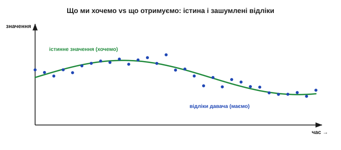
*Рис. 30.1.1. Реальність кожного давача. Зелена крива — справжнє значення, яке ми хотіли б знати; сині точки — те, що насправді віддає АЦП: ті самі значення, але з накиданим шумом. Завдання фільтра — з хмари точок відновити криву.*

Кожен окремий відлік — це **справжнє значення плюс випадкова добавка**. Іноді добавка мала, іноді більша; знак її щоразу інший. Якби нам треба було одне-єдине число «раз і назавжди», ми б усереднили багато відліків — і шум, як ми знаємо з §28.5, спав би як 1/√N. Та біда в тому, що величина **сама змінюється**, і ми хочемо стежити за нею **в реальному часі**: не «яка була температура за останню годину», а «яка вона **зараз**». Ось де починається справжня задача фільтрації.

Варто відчути різницю між двома задачами. **Лабораторна**: зміряти **сталу** величину якнайточніше — тут просто беруть тисячу відліків і усереднюють, і шум майже зникає, а час необмежений. **Реального часу**: стежити за величиною, що **живе**, віддаючи свіже число багато разів на секунду, поки апарат їде чи стабілізується. У першій задачі усереднюй скільки завгодно; у другій кожен зайвий усереднений відлік — це **затримка**, за яку доведеться платити. Увесь розділ — про другу, найважчу: очистити, **не відставши**.

І ще одне обмеження реального часу, про яке легко забути: фільтр **причинний** (*causal*) — у момент t він знає лише **минулі** й поточний відліки, а майбутніх ще нема. Маючи на руках увесь запис наперед (офлайн), можна згладжувати «симетрично», зазираючи і вперед, і назад, — і затримки нема. Та апарат живе в теперішньому: він мусить віддати очищене число **зараз**, спираючись лише на те, що вже сталося. Саме причинність і породжує затримку — щоб згладити, фільтр чекає кількох відліків, а чекання це і є відставання.

### Три способи, якими давач бреше

«Шум» — слово збірне; насправді давач спотворює показ кількома **різними** способами, і це повторення класифікації §28.5, але вже з прицілом на ліки в коді. Розрізняти їх критично, бо кожному потрібен **інший** фільтр.

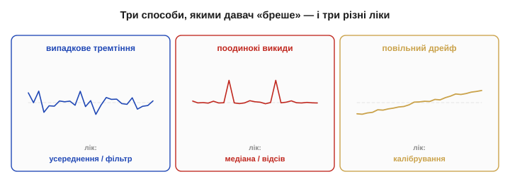
*Рис. 30.1.2. Три обличчя «брехні» давача. Випадкове **тремтіння** — дрібні швидкі коливання навколо істини (лік — усереднення). Поодинокі **викиди** — рідкі дикі значення (лік — медіана, відсів). Повільний **дрейф** — систематичне сповзання (лік — калібрування, не фільтр).*

- **Випадкове тремтіння** (*jitter*): дрібні швидкі коливання навколо правильного значення — тепловий шум, квантування АЦП, наводки. Воно **симетричне** й **усереднюване**: багато відліків, і їхнє середнє сходиться до істини. Це «класичний» шум, проти якого й працює більшість фільтрів цього розділу.
- **Поодинокі викиди** (*outliers, spikes*): рідкі, але **дикі** значення — збій передачі, привид багатопроменевості (§29.6), випадкова наводка. Один викид може бути в десятки разів більший за корисний сигнал, і **усереднення його не лікує**, а лише розмазує (§29.6). Проти викидів потрібен інший інструмент — медіана (§30.3).
- **Повільний дрейф** (*drift*): систематичне сповзання нуля чи нахилу з температурою й часом (§28.5). Це взагалі **не шум** — він не випадковий, тож жоден згладжувальний фільтр його не прибере. Дрейф лікують **калібруванням** (§28.6), і плутати його з шумом — значить лікувати не те.

Корисно уявити їх **за формою**. Тремтіння лягає симетричним «дзвоном» навколо істини (гаусів розкид §28.5), тож його середнє **і є** істина — звідси сила усереднення. Викид стоїть **осторонь** дзвона, поодинокою дикою точкою, і саме тому одне-єдине таке значення здатне зіпсувати середнє багатьох чесних — а медіану ні. Дрейф же зовсім не належить до розкиду: він повільно **тягне весь дзвін** убік, тож хоч скільки усереднюй миттєвий шум, центр усе одно поповзе. Три різні геометрії — три різні ліки, і весь фокус у тому, щоб упізнати, з якою саме маєш справу.

> 🔧 **Навіщо це.** Перше питання перед будь-яким фільтром: **яким саме способом** давач бреше? Тремтить рівномірно — усереднюй. Зрідка вистрілює — став медіану. Повільно повзе — калібруй, фільтр тут безсилий. Це той самий урок §28.5, але тепер від нього прямо залежить, **який рядок коду** ви напишете. Найгрубіша помилка — лити всі три біди в один «згладжувач» і дивуватися, чому не допомагає.

### Сигнал проти шуму: чому не можна просто згладити все

Здавалося б, рецепт простий: сильно згладжуй — і шум зникне. Та є пастка: разом із шумом фільтр гасить і **корисну зміну** самої величини. Бо «сигнал» (те, що ми хочемо, — справжня зміна) і «шум» (те, що заважає, — випадкова добавка) **співіснують в одному потоці чисел**, і відрізнити їх не завжди легко.

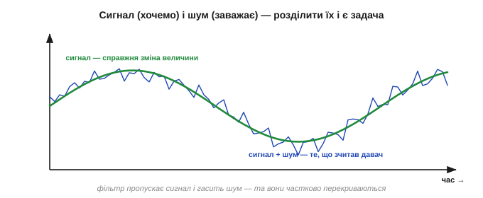
*Рис. 30.1.3. Сигнал і шум в одному потоці. Зелена крива — справжня зміна величини (сигнал, який треба зберегти); синя — те, що зчитав давач (сигнал плюс шум). Фільтр має пропустити повільну зелену зміну й погасити швидке синє тремтіння — але якщо вони схожі за швидкістю, ідеально розділити їх не вийде.*

Рятує те, що шум і сигнал зазвичай **різняться за швидкістю**: корисна величина змінюється **повільно** (температура повзе секундами, відстань — поки рухаєшся), а шум смикається **швидко** (від відліку до відліку). Тому фільтр і будують як «**пропускач повільного, гасник швидкого**»: він довіряє плавним тенденціям і відкидає різкі сіпання. Та коли сигнал і шум **однаково швидкі** (різкий рух об'єкта проти різкого викиду), фільтр не може їх розрізнити — і будь-яке згладжування неминуче зачепить трохи й корисного. Це не дефект конкретного фільтра, а принципова межа, з якої виростає головний компроміс розділу.

Цю різницю у швидкості зручно називати **частотою**: повільний сигнал — це низькі частоти, швидкий шум — високі. Тоді фільтр, що пропускає повільне й гасить швидке, — це **фільтр низьких частот**, і весь розділ, по суті, про різні способи збудувати його в коді. Сама мова частот — окрема велика тема (Розділ 31 розкладе будь-який сигнал на частоти), а тут досить інтуїції: «повільне — корисне, швидке — сміття». Вона вірна доти, доки корисна величина справді повільніша за шум; коли ж вони зливаються по швидкості, навіть найрозумніший фільтр безсилий розділити неподільне.

### Головний компроміс: згладжування проти затримки

Ось він, стрижень усього розділу. Що **сильніше** фільтр згладжує (більше відліків усереднює, повільніше реагує), то **чистіший** вихід — але то **довше** він наздоганяє справжню зміну. Слабкий фільтр спритно стежить за величиною, та лишає шум; сильний дає гладку лінію, але **відстає** від подій.

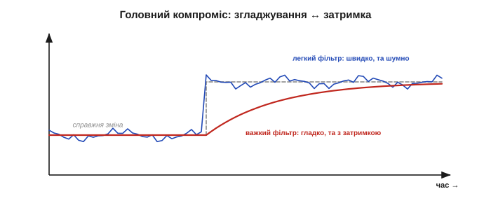
*Рис. 30.1.4. Згладжування ↔ затримка. Коли величина різко змінилась (сіра сходинка), легкий фільтр (синій) одразу стрибає за нею, але тремтить; важкий (червоний) дає гладку лінію, проте доповзає до нового значення з помітним запізненням. Безкоштовно очистити не можна — за гладкість платять швидкістю.*

Це не недолік, який можна «полагодити правильним фільтром», а **фундаментальна плата**: зменшуючи шум, ви неминуче додаєте затримку, і навпаки. Уся майстерність фільтрації — знайти на цій шкалі точку, що пасує **вашій** задачі: для повільної кімнатної температури можна згладжувати щедро (затримка байдужа), а для стабілізації, що мусить реагувати вмить, доводиться терпіти більше шуму заради швидкості. Цьому компромісу присвячено окрему тему (§30.5), бо саме він вирішує вибір фільтра.

Ціна затримки буває дорогою. Робот, що бачить перешкоду крізь важкий фільтр, дізнається про неї на частку секунди пізніше — а на швидкості це зайві сантиметри гальмівного шляху (згадайте запізнення з §29.6). Тому точку на шкалі «гладко ↔ швидко» обирають не на смак, а з двох чисел: **як швидко змінюється** справжня величина і **як швидко мусиш реагувати** на її зміну.

**Приклад (за гладкість платять затримкою).** Усереднення N відліків давить шум приблизно у √N разів, але затримує вихід десь на половину вікна:

```
N = 16:  шум ÷4,   та затримка ≈ 8 відліків
N = 4:   шум ÷2,   затримка ≈ 2 відліки
```

Хочеш удвічі тихіше — плати вчетверо довшим вікном і вчетверо більшою затримкою. Безкоштовного згладжування не буває: кожен крок до тиші — це крок до повільності.

> 🔧 **Навіщо це.** Не питайте «який фільтр найкращий» — питайте «**наскільки швидко мені треба реагувати**». Повільна величина, реакція не горить (кімнатна температура) — згладжуйте щедро. Треба ловити швидкі події (удар, різкий рух) — тримайте фільтр легким і миріться з шумом. Сила згладжування — це не «що точніше», а інженерне рішення під конкретну **динаміку** задачі.

### Чому в програмі, а не в залізі

Шум можна гасити й **до** АЦП — аналоговою RC-ланкою (Розділ 7), як ми бачили у вхідному тракті §28.7. Та коли сигнал уже **в мікроконтролері як числа**, частіше фільтрують **у програмі**, і на те є вагомі причини.

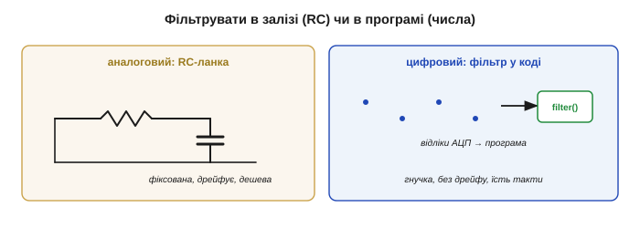
*Рис. 30.1.5. Дві площадки для фільтра. Аналогова RC-ланка перед АЦП дешева й проста, але **фіксована** (номінали не поміняєш у польоті) і сама **дрейфує**. Цифровий фільтр — кілька рядків коду над відліками: **гнучкий** (параметри міняй на льоту), **без дрейфу**, та коштує тактів процесора й пам'яті.*

Цифровий фільтр **гнучкий**: силу згладжування міняють одним числом у коді, навіть під час роботи; його легко скопіювати на десяток давачів; він **не дрейфує** від температури й старіння, бо це чиста арифметика, а не аналогові деталі. Платня — він працює лише з тим, що **вже оцифровано** (грубий шум варто прибрати аналогово ще до АЦП, поки він не зіпсував відліки), і їсть **такти** процесора та трохи пам'яті. На практиці використовують **обидва**: легка аналогова RC прибирає найвищі частоти й захищає АЦП (§28.7), а тонке розумне очищення роблять уже цифрою.

Цифра вміє й те, чого аналог не може взагалі. RC-ланка згладжує **лінійно** — вона завжди трохи усереднює сусідні значення; а **медіанний** фільтр (§30.3), що викидає поодинокий викид, не лишивши й сліду, — операція **нелінійна**, і лінійною аналоговою схемою (як-от RC-ланкою) її не зробиш. Так само легко цифрою змінити поведінку залежно від ситуації: пригальмувати згладжування під час швидкого руху й посилити в спокої. Платня за цю гнучкість — пам'ять під збережені відліки й такти на обчислення; тому на кволому МК фільтр теж добирають за **ціною** (саме тому експоненційне згладжування §30.4, найдешевше з усіх, таке популярне). І рахують у фільтрах часто **цілими** числами (fixed-point, Розділ 17), бо ділення з плаваючою комою на простому ядрі дороге.

> 🔧 **Навіщо це.** Аналоговий і цифровий фільтри не суперники, а напарники. Аналогова ланка перед АЦП — обов'язкова перша лінія (вона ще й антиаліасна, Розділ 26); цифровий фільтр — гнучке доочищення вже в коді. Грубу високочастотну завалу глуши до АЦП, а тонке згладжування й відсів викидів роби програмою, де це дешево й мінливо.

### Що попереду: скриня фільтрів

Отже, задачу розділу можна сформулювати в одному рядку: **із зашумленого потоку відліків у реальному часі відновити чисту оцінку справжньої величини** — дешево й на скромному мікроконтролері. Просте формулювання — а за ним ховається весь баланс точності, швидкості й ціни обчислень, який ми розкладатимемо тему за темою.

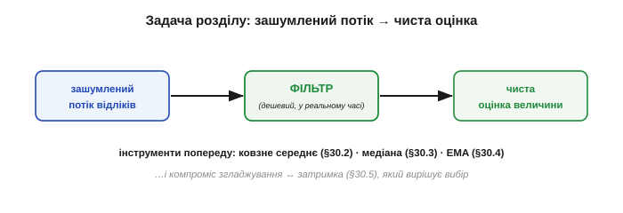
*Рис. 30.1.6. Карта розділу. Зашумлений потік відліків проходить крізь фільтр і виходить чистою оцінкою. Інструменти, що ми освоїмо: ковзне середнє (§30.2), медіана (§30.3), експоненційне згладжування (§30.4) — а керує їхнім вибором компроміс згладжування ↔ затримка (§30.5).*

Для цього в нас буде три прості, але різні за вдачею інструменти. **Ковзне середнє** (§30.2) — найпряміше усереднення останніх кількох відліків; чудове проти тремтіння. **Медіанний фільтр** (§30.3) — бере не середнє, а **середній за величиною** елемент; незамінний проти викидів. **Експоненційне згладжування** (§30.4) — найдешевше на МК, плавно «забуває» старе; зручне там, де пам'ять і такти на вагу золота. Кожен має свою сильну зону, і вибирати між ними навчимося в §30.6.

Чому аж три, а не один універсальний? Бо, як ми бачили, давач бреше по-різному, і **жоден** фільтр не добрий проти всього. Ковзне середнє чудово гладить тремтіння, але викид розмаже на сусідів; медіана вбиває викид, та слабше гладить дрібний шум; EMA найдешевша, але має свій характер затримки. Часто їх навіть **поєднують** у ланцюжок: спершу медіана прибере викиди, потім середнє чи EMA догладить решту. Тобто фільтрація — не пошук одного «найкращого», а складання **ланцюга** під конкретну суміш брехні, рівно як ми складали ланки вимірювального тракту в §28.1.

Та перш ніж брати інструмент, варто чесно засвоїти головне з §30.1: давач не бреше «зі зла» — він чесно віддає правду, замішану з шумом, викидами й дрейфом. Наша робота — не повірити сирому числу й не відкинути його, а **розумно очистити**, знаючи, з якою саме брехнею маємо справу. І пам'ятаймо межу: фільтр не **створює** правди, якої нема у відліках, — він лише розумно зважує те, що давач уже сказав. Тому навіть очищений показ лишається **оцінкою**, а не одкровенням (§29.6); фільтр робить її кращою, не ідеальною. Почнемо з найпростішого й найзрозумілішого очищувача — ковзного середнього.

---

## 30.2 Ковзне середнє

Найприродніший спосіб приборкати тремтіння кожен робить мимоволі: щоб не вірити одному смикливому показу, береш **кілька** останніх і дивишся на їхнє **середнє**. Саме це й робить **ковзне середнє** (*moving average*) — найпростіший і найуживаніший фільтр на світі. Воно тримає «вікно» з останніх N відліків, видає їхнє середнє, а з кожним новим відліком **зсуває** вікно на крок уперед. Простий до банальності — і водночас напрочуд дієвий проти випадкового шуму. Цей підрозділ розбере, чому воно працює, як зробити його **дешевим** на мікроконтролері й де в нього чесні межі.

### Ідея: усереднити останні N відліків

Хай із давача йде потік відліків x[0], x[1], x[2], … Ковзне середнє з вікном N видає на кожному кроці середнє останніх N значень:

```
y[n] = ( x[n] + x[n-1] + … + x[n-N+1] ) / N
```


*Рис. 30.2.1. Ковзне середнє. Вікно охоплює останні N відліків; їхнє середнє — це вихід. З кожним новим відліком вікно зсувається на один крок: новий входить, найстаріший випадає. Звідси й назва — середнє «ковзає» потоком.*

Чому це гасить шум, ми вже знаємо з §28.5 і §30.1: випадкова добавка симетрична навколо нуля, тож у сумі N відліків її «плюси» й «мінуси» частково гасять одне одного, і середнє лежить **ближче** до істини, ніж кожен окремий відлік. Кількісно шум спадає як **1/√N**: учетверо більше вікно — удвічі тихіше.


*Рис. 30.2.2. Результат. Синій тремтливий вхід проходить крізь ковзне середнє й виходить набагато спокійнішим (зеленим): випадкові «плюси» й «мінуси» в кожному вікні взаємно гасяться. Що ширше вікно, то гладкіший вихід.*

**Приклад (наскільки тихіше).** Вікно N = 8. Випадковий шум спаде приблизно у:

```
√N = √8 ≈ 2.83 раза
```

Тобто розмах тремтіння зменшиться майже втричі — за рахунок усього лиш зберігання восьми чисел і одного ділення. Дешево й помітно.

Варто знати, що ковзне середнє — не просто «здоровий глузд», а **оптимальний** оцінювач у точному сенсі: якщо величина стала, а шум симетричний (гаусів), то саме середнє відліків — найкраща оцінка істинного значення, яку взагалі можна побудувати з цих даних. Тобто простота тут не від бідності: для **сталого** сигналу в гаусовому шумі кращого за усереднення не існує. Уся хитрість починається тоді, коли величина **перестає** бути сталою, — і тоді усереднення стає вже компромісом, а не ідеалом, бо в одне вікно потрапляють і старі, уже неактуальні значення.

### Як зробити дешево: ковзна сума

Наївна реалізація щокроку складає всі N відліків заново — це N додавань на кожен вихід, тобто **O(N)**. На широкому вікні чи швидкому потоці це марнотратство. Хитрість проста: тримати не суму «з нуля», а **ковзну суму**. Маємо суму вікна; прийшов новий відлік — **додай** його й **відніми** той, що випадає з вікна. Одне додавання, одне віднімання, одне ділення — **O(1)** незалежно від N. Самі N відліків зберігають у **кільцевому буфері** (масив, де новий запис затирає найстаріший по колу).

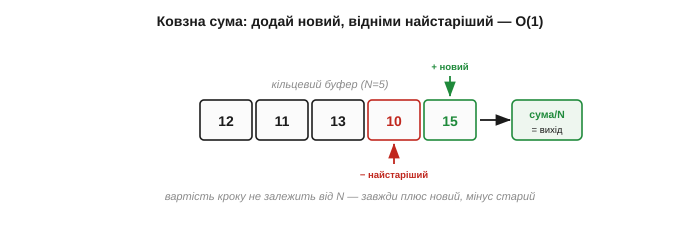
*Рис. 30.2.3. Ефективна реалізація. Замість складати все вікно заново тримають його суму: новий відлік додають, найстаріший (що випадає) віднімають. Кільцевий буфер зберігає N значень. Так вартість кроку не залежить від ширини вікна — завжди кілька дій.*

**Приклад (ковзна сума в дії).** Вікно N = 4, у буфері [10, 12, 11, 13], сума = 46. Прийшов новий відлік 15, найстаріший 10 випадає:

```
нова сума = 46 + 15 − 10 = 51
новий вихід = 51 / 4 = 12.75
```

Жодного перерахунку всього вікна — лише плюс новий, мінус старий. Саме так ковзне середнє роблять навіть на найкволіших мікроконтролерах.

Дві практичні засторо́ги. По-перше, **переповнення**: ковзна сума зберігає суму N чисел, тож вона в N разів більша за один відлік — і на широкому вікні легко вилазить за межі малого цілого типу (переповнення Розділу 17). Тому під суму беруть тип ширший за відлік. По-друге, **старт**: перші N кроків вікно ще не повне, і ділити на N зарано; або накопичують, поки буфер заповниться, або від початку ділять на **фактичну** кількість уже зібраних відліків. Знехтувати цим — отримати хибні перші покази саме тоді, коли давач щойно ввімкнули, а саме тоді їм найбільше вірять.

Сам кільцевий буфер вартий пояснення: це звичайний масив на N комірок плюс індекс, що по колу вказує на найстарішу комірку. Прийшов відлік — записуємо його **поверх** найстарішого, рухаємо індекс на крок (а дійшовши кінця масиву, повертаємо на початок). Так старіння відбувається само собою, без зсувів усього масиву. Пам'яті це коштує рівно N комірок — єдина, але неуникна ціна ковзного середнього: щоб усереднити N останніх відліків, їх треба **десь зберігати**, на відміну від наступних фільтрів, яким буфер не потрібен.

> 🔧 **Навіщо це.** Завжди реалізуйте ковзне середнє **ковзною сумою**, а не повторним складанням вікна. Інакше широке вікно (скажімо, N = 100) з'їдатиме сотню додавань на кожен відлік дарма, тоді як ковзна сума обходиться трьома діями за будь-якого N. Ціна — лише пам'ять під буфер на N значень.

### Розмір вікна: та сама плата

Скільки взяти N? Тут оживає головний компроміс §30.1, тепер у конкретних числах. **Більше** N — гладкіший вихід (шум ÷√N), але **довша затримка** й більше пам'яті. **Менше** N — спритніша реакція, та галасливіший вихід.

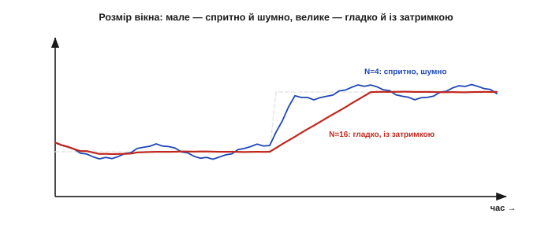
*Рис. 30.2.4. Вибір N — це вибір на шкалі §30.1. Мале вікно (N=4) спритно стежить за зміною, лишаючи помітний шум; велике (N=16) дає гладку лінію, але доповзає до нових значень повільніше й тримає в пам'яті більше відліків. Точку добирають під динаміку задачі.*

Затримка ковзного середнього легко рахується: оскільки вихід — це середина вікна, він **відстає** приблизно на пів-вікна:

```
затримка ≈ (N − 1) / 2  відліків
```

Для N = 16 це вісім відліків запізнення. Тож «удвічі тихіше» (учетверо ширше вікно) коштує «вчетверо повільніше» — рівно та плата, що ми передбачили в §30.1.

Як обрати N на практиці? Знизу його обмежує **шум**: вікно має бути досить широким, щоб згладити тремтіння до прийнятного. Зверху — **швидкодія**: затримка (N−1)/2 не повинна перевищити того, що терпить керування. Між цими межами й лежить робоче N. Окрема дрібна хитрість — брати N **степенем двійки** (8, 16, 32): тоді ділення на N перетворюється на дешевий **зсув** бітів (Розділ 17), а не на справжнє ділення, яке на простому ядрі дороге. Тому в реальному коді ковзні середні так часто мають вікно 8 чи 16, а не 10 чи 15.

Де ковзне середнє — правильний вибір за замовчуванням? Скрізь, де шум **рівномірний** і дрібний, а величина змінюється **повільніше** за вікно: згладити показ температури чи вологості, заспокоїти тремтливу напругу з АЦП, усереднити кут нахилу перед подачею в регулятор. Воно прозоре (видно, що робить), передбачуване (відома затримка) і дешеве — тому з нього й починають, а до хитріших фільтрів переходять лише тоді, коли рампа затримки чи розмазування викидів стають на заваді. «Спершу спробуй ковзне середнє» — непогане інженерне правило.

Та й у нього є стеля. Воно давить лише **випадкову** частину похибки (як √N), а **систематичну** — зсув, дрейф, нелінійність — не чіпає зовсім: усередни хоч тисячу відліків зміщеного давача, центр лишиться зміщеним (§28.5). Тому, наростивши вікно, у якийсь момент перестаєш вигравати точність: шум уже придушено до рівня систематики, і далі більший N лише додає затримки задарма. Знати цю стелю корисно, щоб не роздувати вікно понад глузд, женучись за точністю, якої усередненням уже не дістати.

### Затримка й відгук на стрибок

Найкраще побачити цю плату на **різкій зміні**. Якщо величина миттєво стрибнула на новий рівень, ковзне середнє не стрибає за нею, а **піднімається лінійно** — поки старі (нижчі) відліки по черзі випадають із вікна, а нові (вищі) заходять. Повністю «доповзе» воно лише за N кроків.


*Рис. 30.2.5. Відгук на стрибок. Вхід стрибнув миттєво (сіра сходинка), а вихід ковзного середнього піднімається **рампою** рівно за N відліків — поки вікно не заповниться новими значеннями. Чим ширше вікно, то пологіша рампа й більша затримка.*

Ця рампа — наочне обличчя затримки: фільтр не бреше про новий рівень, він просто **доходить** до нього не одразу. Для повільної величини це байдуже, для швидкої реакції — критично.

Затримка ковзного середнього має й приємну властивість: вона **однакова для всіх частот** сигналу — і повільні, і швидкі складові зсуваються в часі на ті самі ≈ N/2 відліків, не спотворюючи **форми**. Мовою фільтрів це зветься **лінійною фазою** й цінується там, де важливо не покривити сигнал, а лише трохи його затримати (докладніше — у Розділі 32). Аналогова RC-ланка цим похвалитися не може: різні частоти вона затримує по-різному, тож форму трохи спотворює.

Цікаво порівняти ковзне середнє з цим аналоговим родичем глибше. Обидва усереднюють минуле, та **по-різному**: RC «пам'ятає» всі попередні значення з вагою, що плавно спадає (експонента), а ковзне середнє пам'ятає рівно N останніх **порівну** й геть забуває все, що старіше. Через це в ковзного середнього різкий «хвіст» пам'яті (відлік або у вікні, або вже ні), а в RC — м'який. Який кращий — залежить від задачі: різкий хвіст дає ті прицільні нулі на частотах завади, м'який — плавнішу реакцію без різких країв. Цей самий вибір «різке проти плавного забування» повториться, коли порівнюватимемо фільтри в §30.6.

### Слабке місце: викид розмазується

А ось де ковзне середнє підводить — на **поодиноких викидах**. Один дикий відлік входить у суму з вагою 1/N і лишається в ній **усі N кроків**, поки не випаде з вікна. Тож замість зникнути, викид **розмазується**: гострий сплеск перетворюється на невеликий горб, що псує **N** наступних виходів.

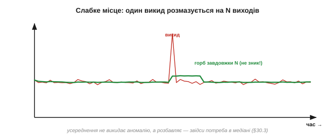
*Рис. 30.2.6. Чому ковзне середнє погане проти викидів. Один дикий відлік (червоний сплеск) не зникає, а розноситься вагою 1/N по всьому вікну — вихід отримує невеликий горб завдовжки в N кроків. Усереднення не **викидає** аномалію, а лише **розбавляє** її, псуючи цілий шмат сигналу.*

Це пряме продовження думки §30.1: усереднення лікує **тремтіння**, а проти **викидів** воно безсиле — лише розмазує брехню (як ми й бачили з привидами далекоміра у §29.6). Саме звідси й народжується потреба в зовсім іншому фільтрі — медіанному (§30.3), що викид не усереднює, а **ігнорує**.

> 🔧 **Навіщо це.** Ковзне середнє — інструмент проти **рівномірного тремтіння**, а не проти спайків. Якщо у ваших даних трапляються поодинокі дикі значення (збої зв'язку, привиди, наводки), не кидайте їх у середнє — спершу приберіть медіаною, і лише потім, за потреби, догладьте середнім. Усереднити сирий потік із викидами — отримати гладку, але зіпсовану лінію.

Масштаб шкоди легко прикинути. Хай у вікні N = 8 трапився викид удесятеро більший за норму. Він додасть до кожного з восьми виходів восьму частину свого надлишку — невеликий, але **впертий** горб, що тримається вісім відліків поспіль. Для ока це дрібниця; а для регулятора (Розділ 34) — вісім кроків хибної команди підряд, бо керування не знає, що то був збій, і чесно відпрацьовує підроблений горб. Один спайк — і ціла серія неправильних рішень: ось чому викиди небезпечніші, ніж здаються.

### Тонкощі: рівна вага й несподіваний бонус

Дві деталі завершують портрет. По-перше, ковзне середнє зважує **всі** відліки вікна **однаково**, а тоді відлік різко **випадає** з вікна цілком — таке «прямокутне» (boxcar) зважування дає трохи різкі краї відгуку. Плавніше «забування» старого ми отримаємо в експоненційному згладжуванні (§30.4).

Звідси й природна думка: а що, як зважувати відліки **не порівну** — свіжим довіряти більше, старим менше? Так виходить **зважене** ковзне середнє, плавніше за прямокутне. А якщо довести цю ідею до краю — щоб вага спадала з віком **експоненційно** й узагалі не доводилося тримати буфер, — вийде вже інший, ще дешевший фільтр, експоненційне згладжування (§30.4). Тобто звичайне ковзне середнє — лише найпростіша точка цілого сімейства «усереднень із пам'яттю», і далі ми пройдемо цим сімейством углиб.

По-друге — приємний бонус, що випливає з усереднення. Якщо у сигналі є **періодична** завада (класика — гул мережі 50 Гц), а вікно зробити завдовжки **рівно в один її період**, то за одне вікно завада робить повний цикл, її «плюси» й «мінуси» точно скорочуються — і вона зникає **повністю**, а не просто слабшає. Тобто, влучно підібравши N під частоту наводки, ковзне середнє **повністю гасить** її — дрібна, але дуже корисна на практиці хитрість (глибше — у частотному погляді Розділу 31).

Насправді таких «нулів» у ковзного середнього не один, а ціла **гребінка**: воно повністю гасить не лише основну частоту завади, а й усі її гармоніки, що вкладаються у вікно цілою кількістю періодів. Тому вікно завдовжки в один період 50 Гц прибере і 50 Гц, і 100 Гц, і 150 Гц гулу заразом. Це робить просте усереднення несподівано **прицільним** інструментом проти мережевої наводки — треба лише знати частоту дискретизації.

**Приклад (вікно під 50 Гц).** Давач опитують 1000 разів на секунду (період відліку 1 мс). Один період 50 Гц триває 20 мс, отже:

```
N = період_завади / період_відліку = 20 мс / 1 мс = 20 відліків
```

Вікно N = 20 повністю погасить 50-герцовий гул і його гармоніки.

> 🔧 **Навіщо це.** Якщо вас мучить саме мережевий гул, не нарощуйте вікно наосліп — порахуйте N під **рівно один період** завади (для 50 Гц і дискретизації 1 кГц це 20). Тоді ковзне середнє вб'є гул точно, не роздуваючи затримку понад потрібне. Це рідкісний випадок, коли розмір вікна диктує не шум, а конкретна **частота ворога**.

Підсумок: ковзне середнє — простий, дешевий (із ковзною сумою — O(1)), передбачуваний фільтр проти випадкового тремтіння, із чесною затримкою ≈ N/2 і відомою платою за гладкість. Його слабкість одна, зате принципова — воно **розмазує викиди**. Тому, коли в потоці трапляються не дрібні коливання, а рідкі дикі спайки, потрібен фільтр, що їх **відкидає**, а не усереднює. Такий фільтр — медіанний, і саме до нього ми переходимо.

---

## 30.3 Медіанний фільтр

Ковзне середнє підвело на викидах через одну рису: воно бере **середнє** вікна, а середнє чутливе до будь-якого дикого значення. Медіанний фільтр міняє цю рису одним рухом — бере не середнє, а **медіану**: середній **за величиною** елемент, коли відліки вікна вишикувати по порядку. Ця крихітна заміна перетворює фільтр із жертви викидів на їхнього вбивцю — і заразом дарує здатність, якої середнє не має взагалі: зберігати **гострі краї**. Цей підрозділ — про найкращий інструмент проти спайків.

### Ідея: середній за величиною, а не середнє

Медіана — поняття зі шкільної статистики. Візьміть значення вікна, **відсортуйте** їх за величиною й беріть **те, що посередині**. Якщо у вікні п'ять чисел, медіана — третє за порядком; половина значень менша за неї, половина більша.

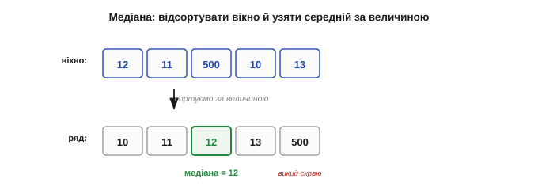
*Рис. 30.3.1. Медіана проти середнього. Відліки вікна вишиковують по величині й беруть **центральний**. На відміну від середнього, медіана не «зважує» крайні значення — їй байдуже, наскільки великий найбільший: він просто стоїть скраю ряду, а в центрі — звичайне значення.*

**Приклад (медіана ігнорує дикий викид).** Вікно з п'яти відліків: 10, 11, 12, 11 — і раптом викид 500. Порівняймо середнє й медіану:

```
відсортовано: 10, 11, 11, 12, 500
медіана = 11        (центральний елемент)
середнє = (10+11+12+11+500)/5 = 108.8
```

Середнє підстрибнуло до **108.8** — викид потягнув його за собою. А медіана лишилась **11**, наче 500 і не було. Один погляд — і ясно, котрий фільтр пережив спайк.

За цим стоїть глибока статистична властивість — **точка зламу** (*breakdown point*): яку частку даних треба зіпсувати, щоб результат «поплив» куди завгодно. У середнього вона **нульова**: достатньо **одного** як завгодно дикого значення. У медіани — аж **50%**: щоб її зрушити, треба зіпсувати **половину** вікна. Це найстійкіша до викидів оцінка центру, яка взагалі існує. Причина в тому, що середнє мінімізує суму **квадратів** відхилень (тому квадрат великого викиду його й тягне), а медіана — суму **модулів**, де викид важить лінійно, а не квадратично, і шкодить незрівнянно менше.

### Чому викид безсилий проти медіани

Секрет у тому, **де** опиняється викид після сортування. Хай яким він великий — це лише **одне** значення, і воно стає на **край** упорядкованого ряду. А медіана дивиться на **центр** — і центр не зрушить, скільки б не роздувся крайній елемент. Тому **один** викид у вікні медіана відкидає **повністю**, незалежно від його величини; навіть кілька викидів безсилі, поки їх менше за половину вікна.

Цей тип спотворення — поодинокі дикі значення серед чистих — має класичну назву **«сіль-перець»** (*salt-and-pepper*), бо на зображенні він виглядає як випадкові білі й чорні крапки. Давачам він приходить як збій передачі, привид багатопроменевості (§29.6), випадкова наводка чи бите зчитування. Спільне в нього одне: значення не «трохи не те», а **геть стороннє**, що не має з істиною нічого спільного. Саме проти такого медіана й незамінна: вона не намагається врахувати стороннє значення, як середнє, а просто його **не помічає**.

Згадаймо конкретику з §29.2: ультразвуковий далекомір зрідка кидає привид-метр серед чесних показів. Ковзне середнє розмаже цей метр на півсекунди хибної відстані; а медіана трьох викине його безслідно — серед сусідніх «1.0 м, 1.0 м, 2.0 м» центральним лишиться чесний 1.0 м. Один рядок коду — і найнебезпечніша біда далекоміра, що жене робота в стіну, знешкоджена. Тому медіану й ставлять першою ланкою майже на кожен далекомір.


*Рис. 30.3.2. Чому медіана незворушна. Хоч би яким великим був викид, після сортування він — крайній елемент ряду, а медіана бере центральний. Тому середнє спайк тягне за собою (червона стрілка), а медіана його просто не помічає: центр ряду від крайнього значення не залежить.*

Зверніть увагу: це принципово **нелінійна** операція — сортування й вибір середини не зведеш до додавань і множень, тож лінійною аналоговою схемою медіану не зробиш (згадайте §30.1). На практиці це чисто **цифровий** трюк, і в цьому його сила.

### Гострі краї лишаються гострими

Друга — і дивовижна — чеснота медіани: вона **зберігає різкі переходи**. Коли величина по-справжньому стрибнула на новий рівень, ковзне середнє розмазує цей стрибок у пологу рампу (§30.2), а медіана тримає його **гострим**. Бо щойно більшість відліків вікна перейде на новий рівень, медіана **миттєво** перестрибне туди слідом — не плавно, а різко, зберігши форму краю.

Механізм цього варто бачити чітко. Поки вікно сидить на старому рівні, медіана дорівнює старому рівню. Поки воно вже на новому — медіана дорівнює новому. А **в момент переходу**, коли вікно навпіл лежить на обох рівнях, центральний елемент **перескакує** з одного рівня на інший рівно тоді, коли більшість відліків стане новою. Тож медіана міняється не плавно, а одним стрибком, лише трохи запізнившись, — і край лишається майже таким самим різким, як був. Те, що для середнього було пологою рампою (§30.2), для медіани — майже вертикальний стрибок.

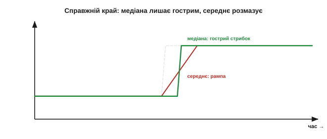
*Рис. 30.3.4. Збереження краю. На справжній різкій зміні (сіра сходинка) ковзне середнє дає пологу рампу (червоне), а медіана стрибає майже так само різко, як вхід (зелене). Медіана відрізняє **справжній** стрибок від випадкового спайка: перший вона зберігає, другий викидає.*

Це робить медіану улюбленцем там, де важливі саме **межі**: у обробці зображень вона прибирає «сіль-перець» (поодинокі биті пікселі), не розмиваючи контурів, а в сигналах зберігає чесні стрибки величини, гасячи лише фальшиві спайки. Уміння відрізнити **різку правду** від **різкої брехні** — те, чого лінійне усереднення не вміє в принципі.

### Медіана проти середнього: різні фахи

Поставивши два фільтри поряд, бачимо, що це не суперники, а **фахівці різного профілю**.

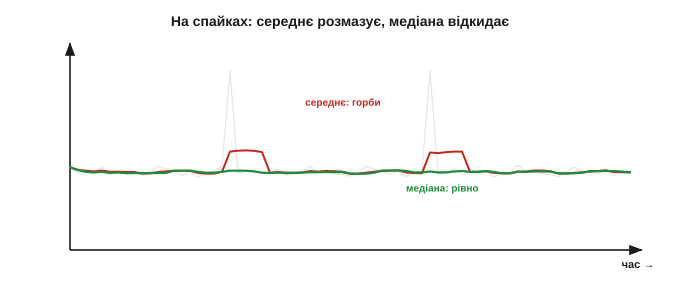
*Рис. 30.3.3. Два фахи. На сигналі з викидами й різким краєм: середнє (червоне) розмазує і спайки в горби, і край у рампу; медіана (зелене) спайки **викидає**, а край **зберігає**. Зате на дрібному рівномірному тремтінні середнє згладжує тонше, бо усереднює, а медіана лише вибирає один наявний відлік.*

- **Медіана** — фахівець проти **викидів** (імпульсного шуму, «сіль-перцю») і **охоронець країв**. Та проти дрібного рівномірного тремтіння вона слабша за середнє: медіана **вибирає** одне з наявних значень, а не **усереднює**, тож не може дати число «між» відліками й шум давить гірше.
- **Середнє** — фахівець проти **рівномірного тремтіння**: усереднюючи, воно дає плавне число й тисне гаусів шум як √N. Та воно розмазує і спайки, і справжні краї.

> 🔧 **Навіщо це.** Просте правило вибору: рідкі дикі **спайки** (збої, привиди §29.6, наводки) — **медіана**; дрібне рівномірне **тремтіння** — **середнє**. Сплутаєте — або розмажете спайк середнім, або погано згладите шум медіаною. А коли в потоці є **і те, й те** (а так буває найчастіше), їх **поєднують** — про це нижче.

Якщо сказати строго, вибір між ними — це вибір під **форму** шуму. Коли шум гаусів (рівний дзвін без диких хвостів), оптимальне саме середнє, і медіана йому програє. А коли шум **важкохвостий** — рідкі, але великі викиди (а так поводяться збої, наводки, привиди), — середнє стає ненадійним, і медіана бере гору. Реальний давач часто має **і те, й те**: дрібний гаусів шум плюс зрідка дикий спайк, — і саме тому зв'язка «медіана плюс середнє» працює так добре, адже кожна ланка б'є свій тип шуму.

### Розмір вікна й непарне N

Вікно медіани зазвичай беруть **непарним** (3, 5, 7) — щоб був однозначний центральний елемент. Скільки викидів воно витримає? Медіана переживає до **(N−1)/2** викидів у вікні: вікно 3 відкине один спайк, вікно 5 — два поспіль, вікно 7 — три.

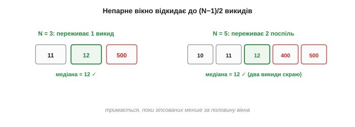
*Рис. 30.3.5. Місткість медіани за викидами. Непарне вікно дає чіткий центр. Вікно N=3 переживає один викид, N=5 — два поспіль, N=7 — три: медіана тримається, поки «зіпсованих» значень менше за половину вікна. Більше вікно — стійкіше, але повільніше й дорожче.*

**Приклад (скільки спайків поспіль витримає).** Вікно N = 5. Гранична кількість викидів, які медіана ще відкине:

```
(N − 1) / 2 = (5 − 1) / 2 = 2 викиди поспіль
```

Якщо ж спайків у вікні стане три (більшість!), медіана «здасться» й видасть уже зіпсоване значення. Тому ширину вікна добирають під очікувану «густоту» викидів: рідкі поодинокі — досить N=3, частіші пачки — потрібне ширше.

Дрібні деталі. Якщо вікно **парне**, чіткого центру немає, і за медіану беруть середнє двох центральних — але тоді знову з'являється чутливість до значень, тож для медіани природніше **непарне** N. Затримка в медіани теж є (приблизно пів-вікна, як у середнього), та проявляється інакше — не як рампа, а як **запізнення стрибка**. А найдешевший випадок — **медіана трьох** (N=3): вона прибирає поодинокі спайки буквально кількома порівняннями й майже без затримки, тому її часто ставлять навіть туди, де про фільтри особливо й не думають, — як копійчаний запобіжник від дикого числа.

### Ціна: треба сортувати

За все платять, і медіана — обчисленнями. На відміну від ковзного середнього з його ковзною сумою O(1), медіану не оновиш одним додаванням: щоб знайти центральний елемент, вікно треба щокроку **сортувати** (чи бодай частково впорядкувати) — це O(N log N) або O(N) дій. Простого «додав новий, відняв старий» тут немає.

Варто чесно пояснити, **чому** так. Сума — величина **адитивна**: додав новий доданок, відняв старий, і вона оновлена. А медіана залежить від **порядку** всіх значень, і заміна одного відліку може зрушити центр непередбачувано — простої формули оновлення немає. Існують хитрі структури даних, що тримають вікно впорядкованим і оновлюють медіану швидко, та на крихітних вікнах вони не варті заходу: дешевше щоразу впорядкувати п'ять чисел наново, ніж тримати складну структуру заради економії кількох порівнянь.

Як саме впорядкувати маленьке вікно — теж має значення. Для N=3,5,7 повноцінний алгоритм сортування зайвий: беруть **сортувальну мережу** — наперед записану послідовність порівнянь-обмінів, що впорядковує рівно стільки елементів за **фіксоване** число кроків (для трьох — лише три порівняння). Без циклів, без рекурсії, передбачувано за часом — ідеально для реального часу на МК. Є й хитріші схеми, що шукають **лише** центральний елемент, не сортуючи решту повністю; та для крихітних вікон різниця дрібна, і сортувальна мережа з кількох порівнянь — звичне рішення.

> 🔧 **Навіщо це.** Тримайте вікно медіани **малим** (3, 5, 7). Для таких розмірів сортування — це лічені порівняння, копійки навіть на кволому МК. А от медіана з вікном 50 щокроку сортуватиме півсотні чисел — задорого. Якщо проти викидів потрібне широке згладжування, не роздувайте медіану, а поставте **малу медіану перед середнім** — і кожен робитиме своє дешево.

### Поєднання: медіана, потім середнє

Звідси й найкорисніший прийом усього розділу — **зв'язка**. Спершу **мала медіана** (N=3 чи 5) **вибиває викиди**, лишаючи чистий від спайків, але ще тремтливий потік; потім **ковзне середнє** (§30.2) **догладжує** залишковий шум. Кожен фільтр робить те, що вміє найкраще, і за дешеву ціну.

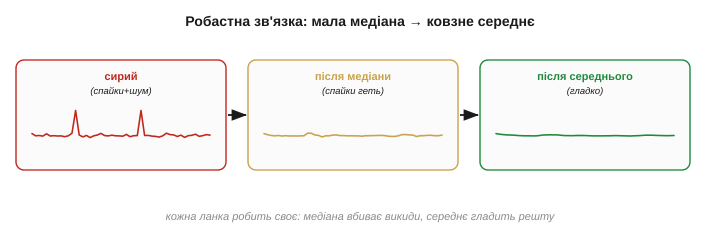
*Рис. 30.3.6. Робастний згладжувач. Сирий потік із викидами й шумом → мала медіана (вибиває спайки) → ковзне середнє (гладить решту) → чистий сигнал. Те, з чим поодинці не впорається жоден, разом дають надійний результат — той самий «ланцюг фільтрів» з §30.1 і фьюжн-логіка §29.6.*

Це той самий ланцюг фільтрів, який ми обіцяли в §30.1: фільтрація — не пошук одного «найкращого» інструмента, а складання конвеєра під конкретну суміш брехні. Медіана плюс середнє — найпоширеніша така зв'язка, бо покриває обидві найчастіші біди давача: і спайки, і тремтіння.

Порядок у зв'язці не випадковий — **спершу** медіана, **потім** середнє. Якби спочатку усереднити, кожен спайк уже **розмазався** б на сусідів (§30.2), і медіані не було б що вибивати: вона побачила б не один викид, а цілий зіпсований горб. А прибравши спайк **до** усереднення, ми подаємо в середнє вже чистий потік, де лишилося тільки дрібне тремтіння, з яким воно й має справлятися. Кожну ланку ще й налаштовують окремо: ширину медіани — під густоту викидів, ширину середнього — під рівень шуму й допустиму затримку.

Не варто, проте, вважати медіану чарівною. Проти **рівномірного** шуму вона помітно слабша за середнє (бере один наявний відлік, а не усереднює), тож сама лишає його майже стільки ж. На повільно змінному сигналі вона ще й зрідка дає легку **«сходинковість»** — затримується на одному значенні, тоді стрибає, — бо вибирає дискретні наявні відліки, а не плавне проміжне.

> 🔧 **Навіщо це.** Не ставте медіану скрізь «про всяк випадок». Якщо викидів нема, а є лише дрібне тремтіння, медіана згладить його гірше за просте середнє, та ще й додасть сходинок. Медіана — **спеціальний** інструмент під спайки: немає спайків — немає й приводу її брати.

Є й елегантна **проміжна** ідея, що поєднує обидва фахи в одному кроці, — **усічене середнє** (*trimmed mean*): відсортувати вікно, відкинути кілька найбільших і найменших значень (там сидять викиди) і усереднити **решту**. Відкинеш по одному з країв — і поодинокий спайк зникне, як у медіани, а усереднення вцілілих дасть плавність, як у середнього. Це ніби «медіана з пом'якшенням»: за один прохід і викид прибрано, і шум згладжено. Платня — те саме сортування, тож і його тримають на малих вікнах.

Найважливіше місце медіани — **на вході в керування**. Один привид, що проскочив у регулятор (Розділ 34), дає різкий поштовх мотору — небезпечний ривок на рівному місці. Мала медіана перед регулятором коштує копійки, а гарантує, що жоден поодинокий збій давача не перетвориться на команду. Тому її ставлять не для краси показу, а як **запобіжник** між брехливим давачем і виконавчим механізмом, що сліпо йому вірить.

Підсумок: медіанний фільтр — нелінійний фахівець проти викидів і охоронець гострих країв; дешевий на малих вікнах, дорогий на широких, і слабший за середнє проти дрібного шуму. Він і ковзне середнє чудово доповнюють одне одного. Тож медіану варто тримати в арсеналі завжди — як дешевий нелінійний запобіжник проти диких значень, що його жодним лінійним фільтром не заміниш. Та обидва — і медіана, і середнє — вимагають **буфера** з N відліків і кількох дій на крок. Наступний фільтр обходиться майже **без пам'яті** й одним множенням — найдешевший зі згладжувачів, експоненційне згладжування.

---

## 30.4 Експоненційне згладжування (EMA)

Ковзне середнє й медіана мусили **зберігати** ціле вікно відліків. Експоненційне згладжування (*exponential moving average*, EMA) обходиться **одним-єдиним** збереженим числом — поточною оцінкою — і одним множенням на кожен новий відлік. Це найдешевший фільтр, який існує, і саме тому він панує у вбудованих системах: де на лічені байти пам'яті й кволе ядро не влізе буфер на сотню відліків, EMA працює залюбки. Замість того щоб **пам'ятати** минуле, він тримає одну згладжену оцінку й на кожному кроці легенько **підштовхує** її до свіжого показу.

### Ідея: один крок до нового відліку

Уся суть — в одному рядку. Маємо поточну оцінку y; прийшов новий відлік x; зсуваємо оцінку **на частку α** в бік нового значення:

```
y ← y + α · (x − y)        рівнозначно:   y ← α·x + (1−α)·y

α (від 0 до 1) — коефіцієнт згладжування
```

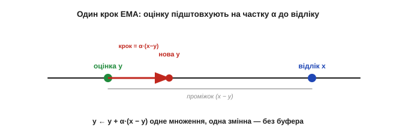
*Рис. 30.4.1. Один крок EMA. Між поточною оцінкою y та новим відліком x є проміжок (x − y); фільтр зсуває оцінку на **частку α** цього проміжку. Маленька α — обережний крок (сильне згладжування), велика — широкий (слабке). Усе сховано в одному множенні.*

**Приклад (як оцінка наздоганяє відлік).** Хай α = 0.3, поточна оцінка y = 10, а давач раптом показав x = 20. Простежмо кілька кроків (відлік лишається 20):

```
крок 1:  y = 10 + 0.3·(20 − 10) = 13.0
крок 2:  y = 13 + 0.3·(20 − 13) = 15.1
крок 3:  y = 15.1 + 0.3·(20 − 15.1) = 16.57
…        оцінка плавно повзе до 20, ніколи не стрибаючи
```

Жодного буфера, жодного сортування — лише одне множення й одне додавання на крок. Дешевше вже не буває.

Інтуїтивно EMA — це **інерція довіри**: фільтр має усталену думку про величину й на кожен новий показ трохи її коригує, тим сильніше, чим більша α. Маленька α — упертий фільтр, що вірить накопиченому й ледь зважає на свіже; велика α — довірливий, що майже повторює останній показ. Та сама логіка, до речі, лежить в основі багатьох оцінювачів, аж до фільтра Калмана (§34): стара оцінка плюс поправка на нову інформацію. EMA — найпростіший представник цієї великої ідеї «оновлюй віру потроху».

### Чому «експоненційне»: пам'ять, що згасає

Звідки назва? Розкрутімо формулу назад. Сьогоднішній відлік входить у оцінку з вагою α; вчорашній — з вагою (1−α)·α; позавчорашній — (1−α)²·α; і так далі. Вага кожного давнішого відліку **множиться на (1−α)** — тобто спадає **експоненційно** з віком. EMA пам'ятає **всю** історію, але дедалі **слабше**: недавнє важить багато, давнє — дедалі менше, аж поки не загубиться.

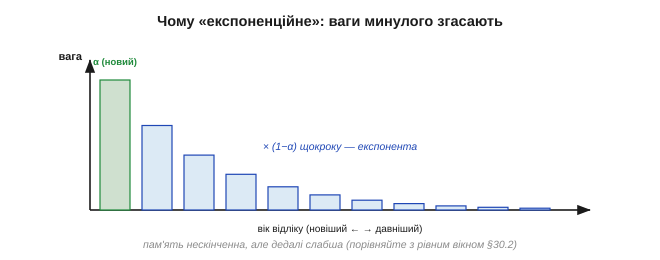
*Рис. 30.4.2. Чому «експоненційне». Найсвіжіший відлік важить α, кожен давніший — у (1−α) разів менше: ваги вишиковуються в експоненту, що згасає в минуле. На відміну від ковзного середнього (де N відліків важать порівну, а тоді різко випадають), EMA забуває старе **плавно** й пам'ятає його нескінченно довго, тільки дедалі слабше.*

Це принципова відмінність від ковзного середнього: там вікно тримало N відліків **порівну** й різко їх викидало, а EMA згладжує плавно, без різкого краю пам'яті. Звідси й м'якший характер відгуку.

Варто перевірити, що EMA — **чесне** усереднення, а не просто множення. Усі ваги (α, (1−α)α, (1−α)²α, …) у сумі дають рівно одиницю — це нескінченна геометрична прогресія, що збігається до 1. Тому за сталого входу EMA точно сходиться до нього, не зміщуючи. Коефіцієнт (1−α) при цьому часто звуть **коефіцієнтом забування** (*forgetting factor*): він каже, яку частку «старої віри» фільтр переносить у наступний крок. Що ближче (1−α) до одиниці, то довша пам'ять і сильніше згладжування.

### α — єдина ручка згладжування

Уся поведінка EMA сидить в одному числі — α. **Мала** α (скажімо, 0.05) означає крихітний крок до нового відліку: оцінка майже не зважає на окремий показ, сильно згладжує, але й **повільно** реагує (довга пам'ять). **Велика** α (0.5) — широкий крок: спритна реакція, та слабке згладжування. У краю α = 1 фільтр зникає (оцінка = відлік), α → 0 — оцінка майже застигла.

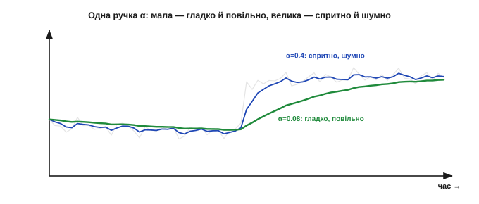
*Рис. 30.4.3. Одна ручка — увесь компроміс. Мала α (зелене) дає гладку, але загайну оцінку; велика α (синє) спритно стежить за зміною, лишаючи шум. Це той самий компроміс згладжування ↔ затримка з §30.1, тільки керований одним числом замість ширини вікна.*

Зручно перекласти α на звичну «ширину усереднення». Грубо, EMA з коефіцієнтом α поводиться як ковзне середнє з вікном:

```
N_еф ≈ 2/α − 1
```

**Приклад (α як еквівалентне вікно).** α = 0.1 згладжує приблизно як вікно:

```
N_еф ≈ 2/0.1 − 1 = 19 відліків
```

Тобто α = 0.1 ≈ усереднення ~19 відліків — але **без** буфера на 19 чисел. Ось у чому економність EMA: ефект широкого вікна за пам'ять однієї змінної.

Як обрати α на практиці? Зручно йти від звичного — **бажаної ширини усереднення** чи частоти зрізу. Хочеш згладжувати «як вікно 20» — бери α ≈ 2/(N+1) ≈ 0.1. Хочеш відрізати все швидше за певну частоту — α пов'язана з нею через ту саму формулу, що й стала часу RC (§28.7). Тобто α не доводиться вгадувати наосліп: її рахують із того, що ви й так знаєте про задачу — як швидко змінюється величина і який шум треба прибрати, — а далі підправляють на слух, дивлячись на вихід.

### Відгук на стрибок: експонента

Як EMA реагує на різку зміну? Не рампою (як ковзне середнє) і не стрибком (як медіана), а **експонентою**: оцінка спершу йде швидко, тоді дедалі повільніше наближається до нового рівня, ніколи його точно не сягаючи. За один характерний час вона долає ≈ 63% шляху, за три — ≈ 95%.

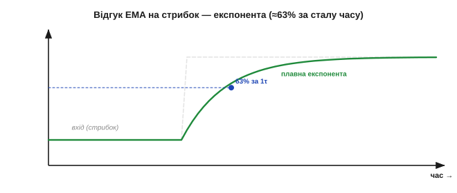
*Рис. 30.4.4. Експоненційний відгук. На вхідний стрибок EMA відповідає кривою, що швидко рушає й плавно доходить до нового рівня (≈63% за один «час сталої», ≈95% за три). Менша α — повільніша, гладкіша експонента; більша — крутіша.*

Звідси важлива практична дрібниця — **ініціалізація**. Якщо стартувати з y = 0, оцінка довго «повзтиме» від нуля до справжнього значення, видаючи на старті дурниці. Тому y ініціалізують **першим відліком**: тоді фільтр одразу стоїть біля істини й лише згладжує, а не наздоганяє її здалеку.

Швидкодію EMA зручно міряти **сталою часу** — числом кроків, за яке оцінка долає 63% стрибка. Вона приблизно дорівнює 1/α відліків: для α = 0.1 це ≈ 10 кроків, для α = 0.5 — ≈ 2. Повне ж «доходження» (до ~95%) триває близько трьох таких сталих. Це й є чесна затримка EMA — не різкий обрив, як у вікна, а плавне підтягування: фільтр ніколи не «застрягає» на старому, він безперервно повзе до нового, просто тим повільніше, чим менша α.

**Приклад (за скільки усталиться).** α = 0.2. Стала часу ≈ 1/0.2 = 5 кроків; усталення (≈95%) ≈ 3 сталих ≈ 15 кроків:

```
τ ≈ 1/α = 1/0.2 = 5 відліків
усталення ≈ 3·τ = 15 відліків
```

Тобто після різкої зміни EMA з α=0.2 дасть надійне нове число приблизно через 15 відліків — стільки коштує її згладжування.

> 🔧 **Навіщо це.** Дві дрібниці рятують EMA на старті. Ініціалізуйте оцінку **першим відліком**, а не нулем, — інакше перші миті фільтр повзтиме від нуля й брехатиме. І якщо рахуєте цілими (fixed-point), тримайте оцінку в **ширшому, дробовому** масштабі (скажімо, помноженою на 256), інакше дрібні кроки α·(x−y) округлятимуться до нуля, і фільтр «застрягне», не дійшовши до істини. Найдешевший фільтр прощає недбалість найменше.

### EMA — це цифровий RC-фільтр

Тут варто впізнати старого знайомого. Експоненційний відгук, експоненційне згасання пам'яті — це **точно** поведінка RC-ланки низьких частот із [Розділу 7](../../block-2-components-analog/ch07-capacitor/ch07-capacitor.md)! EMA — це **програмний двійник** аналогового RC-фільтра: конденсатор так само «підтягується» до вхідної напруги за експонентою, а коефіцієнт α грає роль сталої часу RC.

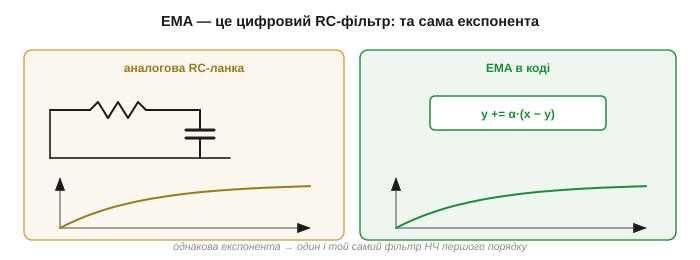
*Рис. 30.4.5. EMA = RC у коді. Аналогова RC-ланка заряджає конденсатор до входу за експонентою; EMA підтягує оцінку до відліку за тією самою експонентою. Це один і той самий фільтр низьких частот першого порядку — лише один в залізі, інший у програмі. Усе, що ви знаєте про RC (§28.7), діє і для EMA.*

Це не просто гарна аналогія, а спосіб **думати** про EMA: він фільтр низьких частот першого порядку, з тими самими властивостями, що й RC, — м'який спад, плавна затримка, нема прицільних нулів на частотах (на відміну від ковзного середнього).

Глибина цієї рідні в тому, що обидва — фільтри **першого порядку** з одним «полюсом»: їхня частотна характеристика спадає полого, на 6 децибел за октаву, без різких провалів. Тому EMA успадковує і чесноти RC (простота, плавність, стійкість), і його межі (не дуже круте відрізання). Якщо колись захочете крутіший спад, доведеться з'єднати **кілька** EMA поспіль — рівно як кілька RC-ланок дають фільтр вищого порядку (про це — у Розділі 32). Один порядок — одна ручка α, один компроміс; більше порядків — крутіше відрізання, але й складніше налаштування.

### Найдешевший на мікроконтролері

Підрахуймо ціну, бо саме вона зробила EMA королем вбудованих систем. Пам'ять — **одна** змінна (поточна оцінка), і жодного буфера. Обчислення — **одне** множення й одне додавання на крок. Порівняйте: ковзне середнє тримає N відліків і робить кілька дій, медіана щокроку сортує. EMA — поза конкуренцією: вона дає згладжування широкого вікна за ціну однієї змінної. Саме ця разюча нерівність «велика користь — мізерна ціна» й зробила її стандартним вибором для крихітних прошивок, де кожен байт пам'яті й кожен такт на рахунку.

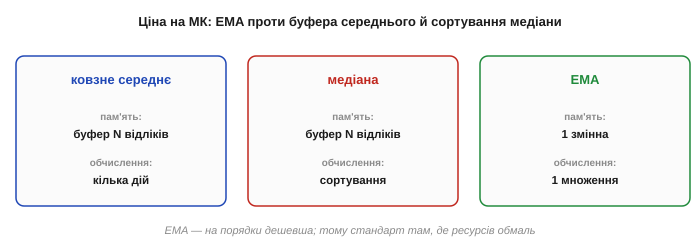
*Рис. 30.4.6. Чому EMA панує у вбудованих. Ковзне середнє тримає буфер на N відліків; медіана щокроку сортує вікно; EMA зберігає **одну** змінну й робить одне множення. За пам'яттю й тактами EMA дешевша на порядки — тому вона стандарт там, де ресурсів обмаль.*

> 🔧 **Навіщо це.** Є й трюк зробити EMA зовсім без множення. Якщо взяти α степенем половини (α = 1/2, 1/4, 1/8…), то крок `y += α·(x − y)` перетворюється на `y += (x − y) >> k` — лише **зсув** бітів (Розділ 17), найдешевша операція процесора. Тому в кволих прошивках α так часто дорівнює 1/8 чи 1/16, а не 0.1: одне віднімання, один зсув, одне додавання — і фільтр готовий, без жодного множення з плаваючою комою.

Через цю дешевизну EMA — те, що стоїть **за замовчуванням** усередині більшості «розумних» давачів і бібліотек згладжування: коли модуль віддає вже «трохи згладжений» показ, найімовірніше всередині саме EMA з якоюсь зашитою α. Знати це корисно з двох причин: по-перше, ви розумієте, **чому** показ давача трохи відстає від реальності; по-друге, якщо потрібна інша швидкодія, часто можна змінити цю α замість того, щоб будувати фільтр самому з нуля.

Цікаво зіставити затримку EMA й ковзного середнього при **однаковому** згладжуванні. Ковзне середнє з вікном N відстає рівно на (N−1)/2 — і ні на крок більше, бо найстаріший відлік різко випадає. EMA з еквівалентним згладжуванням відстає в середньому так само, але «хвіст» його пам'яті тягнеться нескінченно: найдавніші відліки ще ледь-ледь впливають. Тому на різких подіях EMA доходить трохи м'якше й довше «доганяє» останні відсотки, тоді як вікно обриває минуле начисто. Котрий кращий — знов залежить від того, що важливіше: різкий край пам'яті чи плавне забування.

### Межі й варіанти

За дешевизну є й плата. EMA — фільтр **лінійний** (а в мові фільтрів — **рекурсивний**, IIR, бо нова оцінка спирається на попередню; про це в §32.3), тож проти **викидів** він безсилий так само, як ковзне середнє: один спайк підштовхне оцінку й лишатиме слід, поки той не «згасне». Тому в потоці з викидами EMA, як і середнє, ставлять **після** медіани (§30.3). Не вміє EMA й прицільно гасити конкретну частоту завади, як це робило ковзне середнє своїми нулями, — його спад плавний і без «зубів». Ще одна тонкість: EMA **не** має лінійної фази — різні частоти він затримує по-різному, тож форму швидких сигналів трохи спотворює (як і аналогова RC). Для повільного згладжування показу це байдуже, а от у точних вимірах форми це враховують.

> 🔧 **Навіщо це.** EMA — ваш фільтр за замовчуванням, коли тиснуть пам'ять і такти. Та пам'ятайте дві його сліпі плями: він **не вбиває викиди** (постав перед ним медіану §30.3) і **не дає лінійної фази** (не бери його туди, де критична точна форма швидкого сигналу). Для більшості ж задач згладжування показу EMA — найкращий баланс ціни й користі, і саме тому він стоїть майже всюди.

Є й корисні варіанти. **Подвійне** EMA додає окрему оцінку **тренду** (куди й як швидко повзе величина), щоб не відставати від рівномірного руху. **Адаптивна** α більшає, коли фільтр помічає різку зміну, і меншає в спокої. Та основа всюди та сама — один крок до нового відліку.

Адаптивна α варта окремого слова, бо елегантно обходить головний компроміс. Ідея: стежити за **різницею** (x − y). Поки вона мала (давач спокійний), тримати α малою й сильно згладжувати; щойно різниця підскочила (величина різко змінилась) — тимчасово збільшити α, щоб спритно встигнути за подією, і знову опустити, коли вляжеться. Так фільтр сам перемикається між «гладко в спокої» і «швидко на події»: компроміс §30.5 розв'язується не вибором однієї точки, а **рухом** по шкалі залежно від ситуації. Платня — хитріший код і ризик, що великий викид фільтр сприйме за «подію» й кинеться за ним; тому адаптивну α теж прикривають медіаною.

На практиці EMA трапляється всюди: ним згладжують показ заряду акумулятора, щоб не миготів від кожного імпульсу струму; ним заспокоюють кут нахилу з акселерометра перед подачею в стабілізацію; ним усереднюють рівень сигналу в радіо. Скрізь, де треба «трохи згладити» дешево й без зайвої пам'яті, першою рукою тягнуться саме до нього — і лише коли його плавної експоненти бракує (потрібні нулі на частоті, лінійна фаза чи захист від викидів), переходять до інших фільтрів розділу.

Підсумок: EMA — найдешевший фільтр (одна змінна, одне множення чи навіть зсув), цифровий двійник RC-ланки, з плавною експоненційною пам'яттю, керований єдиним числом α. Він не б'є викидів і не має прицільних нулів, зате незрівнянний за економністю — тому й стоїть за замовчуванням майже в кожній вбудованій прошивці. Та всі три фільтри, що ми пройшли, об'єднує одне: за гладкість вони платять **затримкою**. Цей компроміс ми досі бачили мимохідь; час глянути на нього прямо — як на головне рішення всієї фільтрації.

---

## 30.5 Компроміс згладжування ↔ затримка

У кожному попередньому фільтрі ми натикалися на одне й те саме: щоб зробити вихід **чистішим**, доводилося робити його **повільнішим**. Ширше вікно середнього — тихіше, але із затримкою. Менша α в EMA — гладкіше, але загайніше. Це не випадкове незручне сусідство, а **фундаментальний закон** фільтрації: зменшити шум, не додавши затримки, **неможливо**. Цей підрозділ — про той закон прямо: чому він непорушний, як обрати точку на його шкалі під свою задачу й чим (і коли) його все-таки можна обійти. Це найважливіше рішення в усій темі, бо хибна точка робить фільтр не помічником, а шкідником.

### Закон: за гладкість платять часом

Сформулюймо чітко. **Будь-який згладжувальний фільтр зменшує шум рівно настільки, наскільки додає затримку.** Слабкий фільтр спритно стежить за величиною, лишаючи шум; сильний дає чисту лінію, але відстає від подій. Проміжного «чисто **і** миттєво» не існує — є лише точки на шкалі між цими крайнощами.

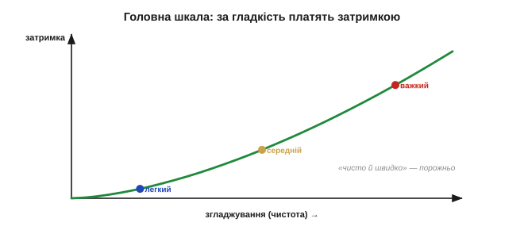
*Рис. 30.5.1. Головна шкала фільтрації. По осях — згладжування (чистота) і затримка. Кожен фільтр — точка на висхідній кривій: більше чистоти неминуче тягне більше затримки. «Безкоштовного» кута (чисто й швидко водночас) на цій кривій немає; завдання — обрати точку під свою задачу.*

Числа це підтверджують для обох наших лінійних фільтрів. Ковзне середнє: шум ÷√N, затримка (N−1)/2 — обидва ростуть із N. EMA: менша α — і тихіше, і повільніше (стала часу ≈ 1/α). Хоч би який фільтр узяли, рух до тиші — це **той самий** рух до повільності.

Цей закон не належить цифрі — він діє для **будь-якого** фільтра низьких частот, аналогового чи програмного, бо коріниться не в реалізації, а в самій ідеї «згладити». Аналогова RC-ланка з більшою сталою часу так само чистіша й повільніша; крутіший аналоговий фільтр так само більше затримує. У строгій мові це споріднено з **принципом невизначеності**: не можна водночас мати й гостру локалізацію в часі (швидку реакцію), і гостру локалізацію в частоті (чисте відрізання). Згладжування-затримка — побутове обличчя цього глибокого обмеження, і саме тому його не «полагодити» вибором розумнішого алгоритму.

Звідси й найпоширеніша оману новачка: «знайду правильний фільтр — і матиму чисто й швидко водночас». Не матимете. Кращий фільтр може дати **трохи кращу** криву компромісу (за ту саму затримку прибрати трохи більше шуму), та й він лишається **на кривій** — вибору між тишею й швидкістю не уникнути нікому. Тому грамотний інженер не шукає «фільтр без затримки», а свідомо **торгується**: скільки шуму я готовий стерпіти заради якої швидкості. Питання не «який фільтр найкращий», а «де на цій шкалі моя точка».

### Чому це непорушно: щоб бути певним, треба час

Звідки береться цей закон? З самої природи задачі. Щоб відрізнити **справжню зміну** від випадкового сіпання, фільтр мусить **подивитися на кілька відліків**: один відлік не скаже, чи це нова тенденція, чи поодинокий шум. А «подивитися на кілька» означає **зачекати**, поки вони надійдуть, — і це чекання і є затримка. Що певнішим хоче бути фільтр (більше відліків усереднити), то довше він чекає.

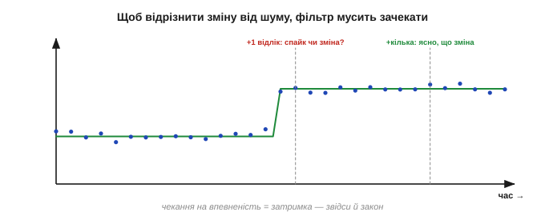
*Рис. 30.5.2. Чому затримка неминуча. Після одного нового відліку фільтр не знає, чи це початок справжньої зміни, чи випадковий викид. Лише дочекавшись кількох і побачивши, що вони тримаються нового рівня, він робить висновок — і саме це чекання на впевненість і є затримка. Чистота купується терпінням.*

Те саме мовою частот (§30.1, глибше — §31): щоб **гладко** відрізати високочастотний шум, не зачепивши низькочастотний сигнал, фільтру потрібна довга «лінійка» — багато відліків, — а довша лінійка означає більший зсув у часі. Крутий зріз і мала затримка тягнуть у різні боки. Тому закон згладжування-затримки — не вада конкретного алгоритму, а межа, вписана у фізику відокремлення сигналу від шуму.

Кількісно ця ціна жорстка. Щоб придушити випадковий шум **удвічі**, треба усереднити **вчетверо** більше відліків (бо шум спадає як √N) — а вчетверо більше відліків означає вчетверо довше чекання. Кожен крок до тиші коштує **квадратично** дорожче в часі: половина шуму — чотирикратна затримка, чверть шуму — шістнадцятикратна. Тому «ще трохи чистіше» дуже швидко стає «набагато повільніше». Саме ця квадратична ціна й робить перефільтрування таким підступним: мізерний виграш у тиші тягне за собою непропорційно великий програш у швидкості.

### Як обрати точку: між сигналом і шумом

Якщо безкоштовного кута немає, лишається **свідомо обрати** точку на кривій. Її задають **дві** межі, що тиснуть із протилежних боків.

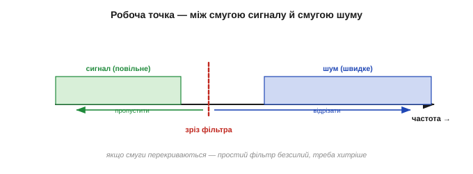
*Рис. 30.5.3. Між двох вогнів. Знизу шкалу обмежує **сигнал**: фільтр мусить устигати за справжніми змінами величини (не згладжувати повільніше, ніж вона рухається). Зверху — **шум**: фільтр має бути досить сильним, щоб придушити тремтіння до прийнятного. Робоча точка лежить у проміжку між ними.*

- **Знизу тисне сигнал.** Фільтр не має права бути **повільнішим** за саму величину: якщо температура встигає змінитися за секунду, а фільтр згладжує по десять секунд, він просто **проґавить** зміну. Тож затримка фільтра мусить бути меншою за час, на якому міняється корисний сигнал.
- **Зверху тисне шум.** Фільтр має бути досить **сильним**, щоб збити тремтіння до рівня, який терпить ваша задача (керування, поріг, показ).

Якщо ці дві межі лишають проміжок — між ними й беруть робочу точку, зазвичай ближче до тієї межі, що важливіша. А якщо вони **перетинаються** (сигнал змінюється так само швидко, як шум сіпається), простого лінійного фільтра вже **не досить**: розділити неподільне він не може, і потрібні хитріші засоби (про них наприкінці).

**Приклад (затримка проти швидкості реакції).** Робот мусить помітити перешкоду й зреагувати за 100 мс. Давач опитують кожні 5 мс. Скільки відліків можна усереднити?

```
бюджет затримки = 100 мс
затримка вікна (N−1)/2 відліків · 5 мс ≤ 100 мс
(N−1)/2 ≤ 20   →   N ≤ 41
```

Тобто вікно до ~40 відліків лишається в межах реакції; ширше — і робот дізнаватиметься про перешкоду запізно. Бюджет затримки **прямо** обмежує силу згладжування.

Корисно назвати ці дві межі їхніми іменами. Знизу — **смуга сигналу**: найвища частота, з якою величина реально змінюється (як швидко рухається робот, як різко скаче температура). Зверху — **смуга шуму**: де переважно сидить тремтіння. Якщо між ними є чистий проміжок, фільтр ставлять **у нього** — пропускати сигнал, різати шум; уся фільтрація і зводиться до пошуку цього проміжку й розміщення в ньому зрізу. А коли проміжку немає — сигнал і шум перекриваються за частотою, — простий фільтр безсилий, і це чесний знак, що пора по складніші інструменти.

**Приклад (квадратична ціна тиші).** Хочемо вдвічі тихіший вихід ковзного середнього (шум ÷√N):

```
було N=9:   шум ÷3,   затримка ≈ 4 відліки
треба ÷6:   N=36,     затримка ≈ 17.5 відліка
```

Удвічі тихіше — і затримка зросла **вчетверо** (з 4 до ~18 відліків). Ось чому до тиші женуться обережно: кожна її наступна «половинка» коштує дедалі дорожче часом.

Знизу всю цю шкалу підпирає ще одна межа — **частота вибірки** (Розділ 26): фільтр не встигне за змінами швидшими, ніж половина частоти опитування, хоч би яким легким він був. Тому, якщо сигнал швидкий, спершу дбають про **досить часте** опитування, а вже потім — про згладжування. Повільна вибірка робить будь-який фільтр заздалегідь запізнілим, бо він просто **не бачить** швидких подій — їх немає в самих відліках.

### Небезпека перефільтрування

Найгірша помилка тут — згладити **занадто**. Здається, «більше фільтра — краще», та надмірна затримка обертає фільтр на шкідника. У керуванні (Розділ 34) запізнілий сигнал змушує регулятор реагувати **на минуле**: він докручує мотор, коли поправка вже не потрібна, проскакує ціль і починає **розгойдуватися**. Лагідний на вигляд згладжувач здатен зробити стабільну систему **нестійкою**.

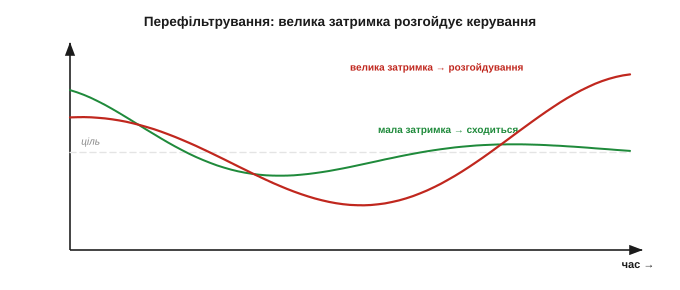
*Рис. 30.5.4. Чим небезпечне перефільтрування. Легка затримка (зелене) — контур керування плавно сходиться до цілі. Велика затримка (червоне) — регулятор реагує на застарілий показ, проскакує ціль і розгойдується, аж до нестійкості. У керуванні занадто чистий, але повільний давач гірший за трохи шумний, але свіжий.*

Механізм цієї нестійкості варто бачити. Регулятор діє за **поточною** помилкою; якщо давач показує застарілу, то й поправка приходить із запізненням — уже тоді, коли система проскочила ціль. Запізніла поправка штовхає не туди, помилка росте в інший бік, наступна поправка знову спізнюється — і коливання наростають. Інженери звуть це втратою **запасу стійкості** від фазової затримки. Тому затримку давача (разом із фільтром) завжди закладають у проєкт контуру, а не додають фільтр «потім, щоб згладило», не порахувавши, як він зрушить стійкість.

> 🔧 **Навіщо це.** У контурі керування **свіжість важливіша за чистоту**. Перш ніж нарощувати фільтр, спитайте, скільки затримки терпить ваш регулятор, — і не переступайте цю межу, навіть якщо вихід ще тремтить. Краще трохи шумний, але вчасний сигнал, ніж дзеркально гладкий, але запізнілий: перший дає легке тремтіння керма, другий — розгойдування й аварію.

### Та сама подія крізь різні фільтри

Найкраще відчути компроміс — провести **одну** подію крізь фільтри різної сили й подивитися, як разом із чистотою росте відставання.

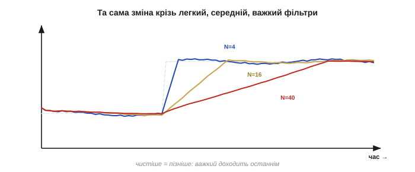
*Рис. 30.5.5. Ціна чистоти наочно. Та сама зашумлена зміна, пропущена крізь легкий, середній і важкий фільтри: що чистіший вихід, то пізніше він доходить до нового рівня. Жоден не дає водночас і гладко, і вчасно — це й є компроміс у дії, той самий для будь-якого згладжувача.*

Цифри роблять це наочним. Той самий стрибок: легкий фільтр (вікно 4) доходить до нового рівня майже одразу, лишаючи помітний шум; середній (вікно 16) — чистіше, але з відставанням у вісім відліків; важкий (вікно 64) — майже ідеально гладко, та запізнюється десь на три десятки відліків (а повністю доповзає аж за 64). Якщо подія важлива саме в перші відліки (зіткнення, удар), важкий фільтр її просто **проспить**; якщо ж величина повільна (температура), його затримка нікому не зашкодить. Та сама крива — різні задачі — різні правильні точки на ній.

Звідси й практичний метод налаштування: **нарощуйте** силу фільтра, поки вихід не стане досить чистим, і **зупиніться** там — бо кожен крок далі купує трохи тиші ціною помітнішої затримки, якої згодом може забракнути. Краща точка — найслабший фільтр, що дає прийнятну чистоту, а не найсильніший, який «про всяк випадок».

> 🔧 **Навіщо це.** Налаштовуючи фільтр, міряйте **обидва** боки — і залишковий шум, і затримку, — а не милуйтеся самою гладкістю виходу. Гладкий вихід оманливий: він не показує, що відстав. Подайте на вхід різку зміну й гляньте, за скільки фільтр її наздогнав, — це і є ваша затримка. Хороше налаштування — найслабший фільтр, що дає прийнятний шум; усе сильніше лише краде швидкість.

### Як обійти компроміс: додати інформацію

Закон згладжування-затримки непорушний для **одного лінійного** фільтра — та його можна **обійти**, якщо принести в систему **більше інформації**, ніж є в самому потоці. Ось головні лазівки.

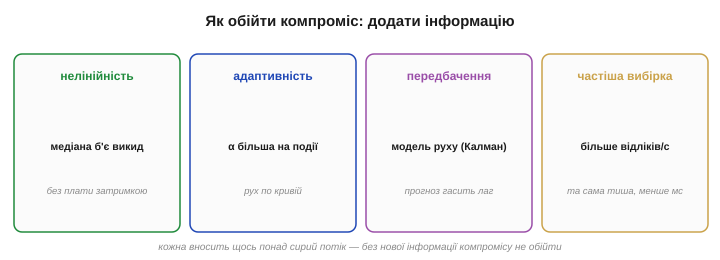
*Рис. 30.5.6. Чотири способи обіграти компроміс. Нелінійний фільтр (медіана) б'є викиди без плати затримкою за тремтіння. Адаптивність — слабшає в спокої, дужчає на події. Передбачення (модель руху, Калман) — компенсує затримку прогнозом. Частіша вибірка — те саме згладжування за менший час. Кожна додає в систему щось понад сирий потік.*

- **Нелінійність.** Медіана (§30.3) викидає спайк, **не** платячи за це затримкою для решти, — вона обходить компроміс там, де біда саме у викидах, а не в рівномірному шумі.
- **Адаптивність.** Змінна α (§30.4): сильне згладжування в спокої, слабке — на події. Фільтр **рухається** по кривій залежно від ситуації, а не сидить в одній точці.
- **Передбачення.** Якщо знати **модель** руху величини (куди й як швидко вона прямує), можна **компенсувати** затримку прогнозом — давати не «де було», а «де, найімовірніше, є зараз». Це ідея фільтра Калмана (§34): він поєднує згладжування з передбаченням і тим частково долає компроміс, бо вносить **знання** про динаміку.
- **Частіша вибірка.** Те саме згладжування (те саме N відліків) за **частішого** опитування займає менше **реального часу** — затримку в мілісекундах зменшено, хоч у відліках вона та сама. Якщо ядро встигає, це найдешевший виграш.
- **Частотна область.** Якщо сигнал і шум усе ж розділені за частотою, але близько, тонший частотний фільтр (§31–32) відріже шум крутіше за просте середнє — за ту саму затримку.

Спільне в усіх лазівок одне: вони обходять компроміс не магією, а тим, що **додають інформацію** — про форму шуму (нелінійність), про ситуацію (адаптивність), про динаміку (модель), про сигнал (частіша вибірка чи частотний аналіз). Без нової інформації один лінійний фільтр приречений сидіти на кривій «чистота проти затримки».

Варто розставити ці лазівки за **ціною**. Найдешевша — **частіша вибірка**: нічого нового вигадувати не треба, лише швидше опитувати, якщо ядро встигає; вона зменшує затримку в реальному часі майже задарма. Нелінійність (медіана) теж дешева, але б'є саме викиди. Адаптивність — трохи хитрішого коду. А **передбачення** (Калман, §34) — найпотужніше, бо вносить цілу **модель** динаміки, та водночас найдорожче й найкрихкіше: воно потребує знати, як величина рухається, і помиляється, коли модель невірна.

> 🔧 **Навіщо це.** Перш ніж будувати складний оцінювач, спитайте, чи не можна просто **опитувати частіше**: те саме згладжування за вдвічі частішої вибірки відстає вдвічі менше в реальному часі — найдешевший спосіб посунутися по кривій вигідно. І лише коли сигнал та шум справді нероздільні простим фільтром, варто братися за нелінійність, адаптивність чи передбачення — по висхідній складності й ціні.

Підсумок: згладжування й затримка — нерозлучна пара, і весь фокус фільтрації в тому, щоб свідомо обрати між ними точку під конкретну задачу: досить чисто, щоб довіряти, і досить швидко, щоб не запізнитися. Перефільтрувати небезпечніше, ніж недофільтрувати, особливо в керуванні. А коли простого вибору точки замало, компроміс обходять, додаючи інформацію — нелінійністю, адаптивністю, передбаченням, частішою вибіркою.

І ще одне, що варто винести за межі фільтрів: цей компроміс повторюватиметься скрізь, де треба **і** чисто, **і** швидко — в оцінюванні стану, у стабілізації польоту, у зв'язку. Згладжування проти затримки — лише побутовий випадок ширшого закону «точність купується часом», з яким інженер зустрічається все життя. Опанувавши його тут, на трьох простих фільтрах, ви впізнаватимете його всюди — і не дивуватиметеся, чому «зробити краще» так часто означає «зробити повільніше».

Знаючи і три фільтри, і цей закон, лишилося звести все докупи: який фільтр коли брати — остання тема розділу.

---

## 30.6 Який фільтр коли

У нас є три інструменти — ковзне середнє, медіана, EMA — і закон, що керує їхньою силою. Лишається найпрактичніше: стоячи перед реальним зашумленим потоком, **який** із них узяти? Цей закривний підрозділ — рамка рішення: спершу **діагноз**, тоді **вибір**, тоді **налаштування**. Плюс готові рецепти на типові випадки й перелік помилок, яких варто уникати. Мета — щоб, побачивши новий давач, ви не гадали навмання, а впевнено добирали фільтр під його конкретну брехню.

### Спершу діагноз, тоді фільтр

Найперша й найважливіша порада: **не хапайтеся за фільтр наосліп**. Спочатку назвіть, **яким способом** давач бреше (та сама класифікація §30.1), бо від цього прямо залежить вибір. Подивіться на сирий потік: він рівномірно тремтить? зрідка вистрілює дикими значеннями? повільно сповзає вбік?

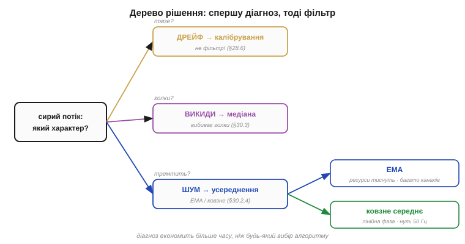
*Рис. 30.6.1. З чого починати. Спершу — діагноз: дрейф → калібрування (фільтр безсилий, §28.6); поодинокі викиди → медіана; рівномірне тремтіння → усереднення (ковзне середнє чи EMA). І лише потім — вибір конкретного усереднювача за ресурсами й вимогами до затримки.*

- **Повільний дрейф** — це **не** задача для фільтра: жоден згладжувач не прибере систематичне сповзання. Лікуйте його **калібруванням** і компенсацією (§28.6), а не фільтром.
- **Поодинокі викиди** (спайки, привиди, збої) — ставте **медіану** (§30.3): вона їх викидає, усереднення лише розмаже.
- **Рівномірне тремтіння** — беріть **усереднення**: ковзне середнє або EMA.

Цей крок діагнозу економить більше часу, ніж будь-який вибір алгоритму: половина невдач із фільтрами — це коли усереднюють викиди, фільтрують дрейф чи борються з шумом, якого нема.

Як власне діагностувати? Найпряміше — **подивитися на сирий потік** очима чи графіком, перш ніж щось фільтрувати. Рівне «волохате» тремтіння навколо лінії — це шум для усереднення; поодинокі різкі «голки», що вистрілюють із потоку, — викиди для медіани; повільний нахил усього потоку за хвилини — дрейф для калібрування. Сумніваєтесь між шумом і викидами — гляньте на **гістограму** значень: симетричний дзвін — шум, а окремі далекі «хвости» — викиди. Цей п'ятихвилинний погляд на дані рятує від годин боротьби не з тією бідою; досвідчені інженери завжди дивляться на сирий сигнал **до** того, як писати фільтр.

### Три фільтри поряд: таблиця вибору

Коли діагноз вказав на усереднення (а часто й на медіану перед ним), допомагає звести всі три фільтри в одну таблицю — за тим, що кожен **уміє** й **коштує**.

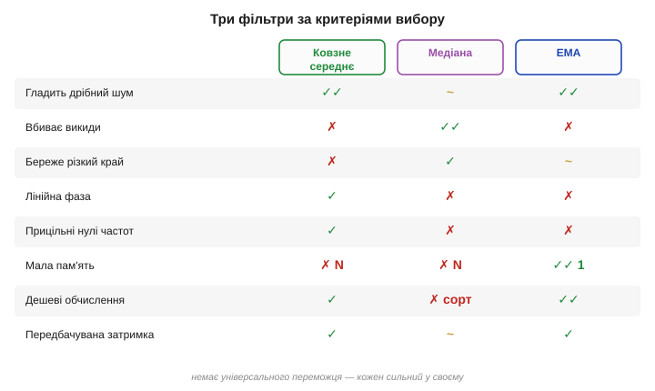
*Рис. 30.6.2. Три фільтри за критеріями. Ковзне середнє: гладить шум, лінійна фаза, прицільні нулі частот — але буфер N і розмазує викиди. Медіана: вбиває викиди й береже краї — але дорожча (сортування) і слабша проти дрібного шуму. EMA: найдешевша (одна змінна) — але без захисту від викидів і без нулів частот. Кожен сильний у своєму.*

Коротко: **ковзне середнє** беруть, коли важлива передбачувана затримка, лінійна фаза чи гасіння конкретної частоти (мережевий гул); **медіану** — проти викидів і для збереження різких країв; **EMA** — коли тиснуть пам'ять і такти й треба просто дешево згладити.

Головне, що видно з таблиці, — **немає універсального переможця**. Кожен фільтр у чомусь найкращий і в чомусь найгірший: EMA виграє ціною, але програє проти викидів; медіана виграє проти спайків, але програє ціною й проти дрібного шуму; ковзне середнє виграє передбачуваністю, але програє пам'яттю. Тому «найкращий фільтр» — питання без відповіді поза контекстом; правильне питання — «найкращий **для цієї** задачі», а таблиця лише допомагає швидко зіставити сильні й слабкі боки кожного з тим, що вам справді потрібно.

А коли діагноз — саме рівномірне тремтіння й вибір звузився до двох усереднювачів, лишається останнє питання: чи тиснуть ресурси й чи потрібна особлива форма затримки? Якщо МК і так ледь дихає або каналів-давачів десятки — беріть **EMA**: одна змінна стану на канал, кілька дій на крок. Якщо ж треба передбачувана, однаково-стала для всіх частот затримка (щоб синхронно зіставляти кілька каналів) або прицільний нуль на конкретній частоті (50 Гц мережі) — тоді **ковзне середнє**, бо лінійна фаза й керовані нулі є лише в нього. У більшості ж буденних задач EMA виграє просто дешевизною, тож за замовчуванням схиляйтесь до неї.

### Готові рецепти

Більшість реальних задач лягають у кілька шаблонів — ось перевірені часом зв'язки.

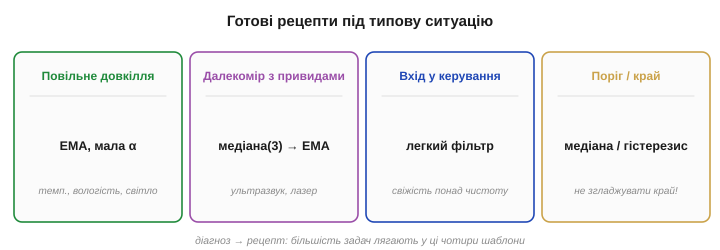
*Рис. 30.6.3. Рецепти під ситуацію. Повільний давач довкілля (температура, вологість) → EMA з малою α. Далекомір із привидами → медіана(3) проти спайків, далі EMA для гладкості. Вхід у керування (IMU) → легкий фільтр, свіжість понад чистоту. Поріг / детектор краю → медіана (береже край) або гістерезис без згладжування.*

- **Повільний давач довкілля** (температура, вологість, освітленість): величина повзе секундами, затримка байдужа — досить **EMA з малою α** (чи широкого середнього). Дешево й гладко.
- **Далекомір із викидами** (ультразвук, лазер): зрідка привид-метр серед чесних показів — **медіана(3) проти спайків**, потім **EMA** для гладкості. Класична робастна зв'язка.
- **Вхід у контур керування** (кут із IMU для стабілізації): тут **свіжість понад чистоту** — легкий фільтр (мала медіана від спайків + легка EMA), щоб не зруйнувати стійкість затримкою (§30.5).
- **Поріг чи виявлення краю**: згладжування тут шкідливе (розмиє край) — або **медіана** (береже край), або взагалі без фільтра, з **гістерезисом** (§13) проти брязкоту порога.

**Приклад (рецепт для далекоміра).** Ультразвук опитують 20 разів за секунду, зрідка дає привиди, плюс дрібний шум ±1 см. Збираємо тракт:

```
сирий → медіана(3) [вбиває привиди] → EMA, α=0.3 [гладить ±1 см]
затримка: медіана ~1 відлік + EMA τ≈3 → ≈ 0.2 с — прийнятно для об'їзду
```

Два рядки коду — і потік, придатний для рішень: без диких стрибків і без дрібного тремтіння, із чесною п'ятою секунди затримки.

**Приклад (давач довкілля).** Кімнатний термометр опитують раз на секунду, шум ±0.2 °C, реальна температура повзе градусами за хвилини. Затримка в секунди тут нікого не турбує, викидів катма — отже, без медіани, лише **EMA з малою α** (скажімо, 0.1): вона згладить дрібне тремтіння до сотих градуса, а на повільний хід температури майже не вплине. Один рядок коду, одна змінна в пам'яті — і рівний показ, що не сіпається в останній цифрі дисплея.

Два рецепти варті окремого слова. **IMU для стабілізації**: тут затримка — ворог номер один, бо вона прямо їсть запас стійкості контуру (§30.5). Тому фільтр тримають **легким** — хіба медіана(3) проти рідких збоїв шини плюс зовсім легка EMA, — а основне згладжування лишають розумнішим оцінювачам (§34), що не платять за чистоту затримкою. **Поріг чи край**: тут згладжування прямо шкодить — розмиває саме той різкий перехід, який ви ловите. Краще медіана (вона край береже) або взагалі сирий сигнал із **гістерезисом** (§13): два пороги замість одного, щоб поодинокий шум не смикав вихід туди-сюди на самій межі спрацювання.

> 🔧 **Навіщо це.** Починайте з **найпростішого**, що може спрацювати (часто це EMA чи медіана+EMA), і **перевіряйте** фільтр, а не вгадуйте: подайте на вхід штучну різку зміну (крок) і гляньте, за скільки відліків вихід її наздогнав і чи чистий він далі. До складнішого переходьте, лише коли просте довело свою недостатність на **реальних** даних. Передчасне ускладнення фільтра — теж помилка, лише протилежна перефільтруванню.

### Робастний стандарт: медіана + EMA

Якщо забути всі тонкощі й лишити **одну** пораду на випадок «не знаю, з чого почати», то це зв'язка **мала медіана + EMA**. Медіана(3) задешево вибиває поодинокі дикі значення; EMA задешево згладжує решту. Разом вони покривають **обидві** найчастіші біди давача — і спайки, і тремтіння — за мізерну пам'ять (буфер на 3 + одна змінна) і кілька дій на крок.

Чому саме медіана **трьох**, а не ширша? Бо трійка — найдешевша медіана (три значення, майже без затримки), а проти **поодиноких** викидів — а вони найчастіші — її цілком досить: вона переживає один спайк у вікні без шкоди. Ширшу медіану (5, 7) беруть, лише якщо викиди йдуть **пачками** по два-три поспіль. А коефіцієнт α в наступній EMA підбирають уже за §30.5 — під рівень залишкового шуму й допустиму затримку, починаючи з чогось на кшталт 0.2–0.3 і підправляючи на око по графіку.

І ще: ставити фільтри **каскадом** — не хитрість і не надмірність, а норма. Медіана й EMA роблять різну роботу (одна — проти викидів, друга — проти дрібного шуму), тож їхня послідовність — не дублювання, а поділ праці. Головне — не множити ланки без потреби: кожен зайвий ступінь додає і затримку, і код, тож у каскаді лишають рівно стільки, скільки **різних** бід треба прибрати, — а це зазвичай якраз дві.

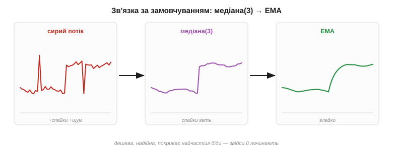
*Рис. 30.6.4. Зв'язка за замовчуванням. Сирий потік → медіана(3) (викидає спайки, береже край) → EMA (дешево гладить залишковий шум) → чистий, придатний для рішень сигнал. Дешева, надійна, покриває найчастіші випадки — звідси й починають, коли немає підстав для іншого.*

> 🔧 **Навіщо це.** Коли невідомо, з чого почати, — **медіана(3) плюс EMA**. Це найдешевша зв'язка, що захищає і від викидів, і від тремтіння; вона рідко буває гіршим вибором і майже завжди — досить добрим. Починайте з неї, а до чогось складнішого переходьте, **лише** коли вона довела, що не справляється, а не наперед.

### Чого НЕ робити

Помилки тут повторювані, тож варто знати їх в обличчя.

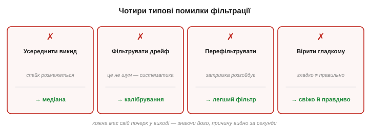
*Рис. 30.6.5. Чотири типові помилки. Усереднити викиди (треба медіана). Фільтрувати дрейф (треба калібрування). Перефільтрувати контур керування (втрата стійкості). Повірити гладкому виходу (він може бути запізнілим чи зміщеним). Кожна — пастка, у яку легко впасти «з найкращих міркувань».*

- **Усереднювати викиди.** Спайк у середньому розмазується на ціле вікно (§30.2) — проти нього медіана, не середнє.
- **Фільтрувати дрейф.** Систематичне сповзання — не шум; жоден згладжувач його не прибере, потрібне калібрування (§28.6).
- **Перефільтровувати керування.** Завелика затримка розгойдує контур (§30.5); у керуванні свіжість важливіша за чистоту.
- **Вірити гладкому виходу.** Гладка лінія оманлива: вона може бути й запізнілою, і зміщеною (фільтр не прибирає систематику). Гладко ≠ правильно.

Кожна з цих помилок має свій характерний почерк, за яким її впізнають у налагодженні. Усереднені викиди дають **повторювані горбики однакової ширини** у виході — слід кожного спайка, розмазаний на ширину вікна (§30.2). Спроба «відфільтрувати» дрейф закінчується тим, що показ усе одно повзе, лише плавніше. Перефільтрований контур керування **розгойдується** або мляво проскакує ціль. А надмірно згладжений сигнал виглядає бездоганно — аж поки не порівняти його з реальністю в момент швидкої зміни, де він ганебно **відстає**. Знаючи ці почерки наперед, причину знаходять за секунди, а не за вечір сліпого налагодження.

> 🔧 **Навіщо це.** Спокуса «згладити сильніше, щоб виглядало краще» — найчастіша пастка новачка. Гарний на екрані вихід часто означає лише велику затримку, а не точність. Завжди питайте не «наскільки гладко?», а «наскільки **свіжо й правдиво**?» — і добирайте найслабший фільтр, що дає прийнятний результат.

### Фільтр — лише одна ланка

Наостанок — місце фільтрації в загальній картині. Очищений сигнал — це **ще не** правда: фільтр прибрав випадкове, але систематику (зсув, нелінійність) усе одно знімає калібрування (§28.6), а далі число йде в рішення, у керування, у злиття з іншими давачами (§33–34). Фільтр — одна ланка тракту з §28.1, а не його кінець.

Є й тонкість про **порядок** ланок. Фільтрувати зазвичай краще **до** нелінійного калібрування, поки сигнал ще «сирий» і шкала рівномірна, — бо нелінійна крива калібрування по-різному розтягнула б шум у різних точках діапазону. А **медіану** ставлять найпершою, ще до будь-якого усереднення, щоб викид не встиг розмазатися по сусідах. Загальний потік виходить такий: сирі відліки → медіана (геть викиди) → усереднення (геть шум) → калібрування (геть систематику) → величина в рішення. І вже **очищену й відкалібровану** величину зливають із іншими давачами у фьюжні (§33–34), де кожному вірять рівно за його надійністю.

Варто й нагадати межу з §30.5: фільтр **не додає** інформації — він лише розумно розпоряджається тією, що вже є у відліках. Тому жодна, навіть найхитріша, зв'язка фільтрів не витягне сигналу, якого в даних просто немає (надто рідка вибірка, надто слабкий проти шуму давач). Коли впираєтесь у цю стелю, відповідь не в складнішому фільтрі, а в **кращих даних**: частіша вибірка, тихіший аналоговий тракт (§28.7), точніший давач чи додатковий давач для фьюжну. Фільтр — це останній штрих над добрими даними, а не порятунок для поганих.

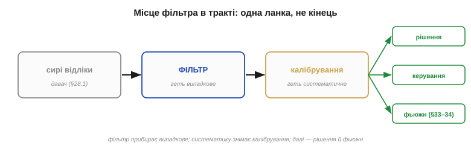
*Рис. 30.6.6. Де стоїть фільтр. Сирий потік → фільтр (прибирає випадкове) → калібрування (прибирає систематичне) → величина в рішення, керування, фьюжн. Часові фільтри цього розділу — робочі конячки; коли їх бракує (сигнал і шум перекриваються в часі), переходять у частотну область (§31–32).*

Зведімо весь розділ в одне речення: **діагностуй шум, обери найпростіший фільтр під нього, налаштуй на межі затримки, перевір на реальних даних**. Дрейф — калібруй, викиди — медіань, тремтіння — усереднюй (EMA, як тиснуть ресурси), і ніколи не забувай, що за чистоту платиш свіжістю. Це не сотня окремих рецептів, а одна послідовність думки, що працює майже завжди; решта розділу лише наповнила її конкретикою — формою фільтрів, ціною, законом затримки.

І остання думка, що відкриває наступний розділ. Три прості фільтри плюс закон затримки покривають чи не дев'ять десятих практичної фільтрації на мікроконтролері. Та всі вони — **часові**: працюють із відліками в часі. Коли ж сигнал і шум перекриваються в часі, але **розрізняються за частотою**, потрібен інший погляд — розкласти сигнал на частоти й різати в **частотній** області. Саме мова частот, до якої ми весь розділ зверталися краєм ока («повільне — корисне, швидке — сміття», «нулі на 50 Гц», «фільтр низьких частот»), і пояснює, **чому** фільтри працюють, та відкриває цілий новий клас інструментів. Вона дає те, чого часові фільтри в принципі не вміють: **розділити** два накладені в часі сигнали, якщо вони сидять на різних частотах, і **спроєктувати** фільтр точно під задану смугу — не на око, а за специфікацією. До цієї мови — до спектра й перетворення Фур'є — ми й переходимо.

> ▶️ Далі: [Розділ 31 — Спектр і перетворення Фур'є](../ch31-spectrum-fourier/ch31-spectrum-fourier.md)
