# Розділ 31 — Спектр і перетворення Фур'є

Досі ми дивилися на сигнал **у часі**: як значення давача змінюється від відліку до відліку, і чистили цей потік фільтрами (Розділ 30). Та є зовсім інший погляд на той самий сигнал — **за частотою**: з яких коливань він «зроблений». Цей погляд відповідає на питання, безсилі в часовій області: який тон ховається в шумі, де та сама завада на 50 Гц, що пропустить фільтр. Розділ — про другу мову сигналу: спершу сама ідея двох мов (§31.1), тоді зухвала теза Фур'є, що будь-який сигнал — це сума синусоїд (§31.2), що показує спектр (§31.3), як його порахувати на числах — ДПФ (§31.4) і чому це стало миттєвим — ШПФ (§31.5), пастка скінченних вимірів — вікно й витік (§31.6) і навіщо все це інженеру (§31.7).

> 📜 **Перед матеріалом — історія:** [Фур'є й суперечлива ідея, що все є сумою синусоїд](ch31-history-fourier.md). Вона показує, звідки взялася сама думка розкладати все на синусоїди, чому в неї спершу не вірили найкращі математики світу — і як гарячий брусок заліза породив інструмент, що працює нині в кожному MP3, JPEG і МРТ.

---

## 31.1 Сигнал у часі й частоті: дві мови

Під'єднайте осцилограф до мікрофона й заспівайте одну ноту. На екрані — хвиляста лінія, що біжить зліва направо: тиск повітря в кожну мить. А тепер питання: **яка це нота**? Подивившись на хвилю, ви цього прямо не скажете — доведеться міряти період лінійкою й рахувати. Сигнал містить відповідь, але **ховає** її: у часовій формі «яка частота» — не на видноті. Варто ж глянути на той самий звук **іншою мовою**, частотною, — і відповідь сама стрибне в очі одним-єдиним піком. Цей підрозділ — про те, що в кожного сигналу є **дві рівноправні мови опису**, і про те, коли яку брати. Це понятійний фундамент усього розділу: не навчившись бачити сигнал двома очима, не зрозумієш ні спектра, ні фільтрів, ні Фур'є.

### Дві мови одного сигналу

**Часова область** (*time domain*) — це те, до чого ми звикли: значення сигналу як функція **часу**. По горизонталі — час, по вертикалі — амплітуда (напруга, тиск, відстань). Так показує осцилограф, так лягають відліки АЦП у пам'ять, так ми малювали все в Розділі 30. Часова мова відповідає на питання «**що було в цю мить**» і «**як воно мінялося**».

**Частотна область** (*frequency domain*) — це опис того самого сигналу через його **складові частоти**: скільки в ньому повільних коливань, скільки швидких, скільки кожної «ноти». По горизонталі тепер не час, а **частота**, по вертикалі — наскільки сильно ця частота присутня. Така картинка зветься **спектром** (*spectrum*). Частотна мова відповідає на інше питання — «**з чого** сигнал складається».

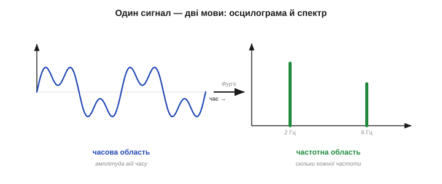
*Рис. 31.1.1. Один сигнал — два описи. Ліворуч (часова область) — хвиля, що біжить у часі: сума повільного й швидкого коливань зливається в заплутану лінію. Праворуч (частотна область) — її спектр: два чисті піки, по одному на кожну частоту-складову. Та сама інформація, але друга мова одразу каже те, що перша ховала: тут рівно два тони.*

Ключове, що це **не два різні сигнали, а один**, поданий по-різному — як те саме число «дванадцять» можна записати арабською «12», римською «XII» чи словом. Часова й частотна форми — два записи однієї суті, і між ними можна переходити туди й назад без втрат. Просто **одне питання зручніше ставити однією мовою, інше — другою**.

Варто одразу прив'язати осі до звичних одиниць. У часовій мові горизонталь — це секунди (чи мілісекунди, чи просто номер відліку), а крок між сусідніми точками задає **частота дискретизації** (про неї — у §31.4). У частотній мові горизонталь — це **герци**, цикли за секунду: ліворуч повільні коливання, праворуч швидкі. А **висота** кожної спектральної лінії каже, **скільки** цієї частоти в сигналі, — це її амплітуда, «гучність» тону. Тож читати спектр просто: положення по горизонталі — яка частота, висота — наскільки вона сильна. Низький широкий горб ліворуч означає повільну основу сигналу; гострий високий пік праворуч — швидкий тон або заваду.

### Та сама пісня — два записи

Найприродніша аналогія — музика, і вона не випадкова: саме звук історично породив цю двоїстість (згадайте струну Бернуллі з історії розділу). Заспіваний звук — це **коливання тиску повітря**, тобто хвиля в часі. Але музикант записує ту саму музику зовсім інакше — **нотами**: до, мі, соль. Нотний запис не каже, який тиск був у яку мілісекунду, — він каже, **які частоти звучать**. Партитура — це, по суті, **частотний опис** музики.


*Рис. 31.1.2. Від ноти до спектра. Угорі — чистий тон (одна синусоїда): у часі рівна хвиля, у спектрі — один пік на її частоті. Унизу — акорд із трьох нот: у часі складна, начебто хаотична хвиля, а в спектрі — три охайні піки, по одному на ноту. Спектр буквально «читає партитуру» сигналу.*

Чистий тон — одна синусоїда — це в часі рівна, нудна хвиля, а в спектрі **один-єдиний пік** на її частоті: уся енергія зосереджена на одній «ноті». Заграйте акорд із трьох нот — і часова хвиля стане заплутаною, бо три синусоїди накладаються й інтерферують у складний візерунок; а спектр лишиться простим і прозорим — **три піки**, рівно по одному на кожну ноту. Те, що в часі виглядає мішаниною, у частоті часто виявляється елементарним. У цьому й уся сила другої мови: **складність у часі ≠ складність по суті**.

Чому ж часова хвиля акорду така заплутана? Бо три синусоїди весь час **то складаються, то віднімаються**: там, де їхні гребені збігаються, сумарна хвиля підскакує, а де гребінь припадає на западину — гасне. Виходить пульсівний, на вигляд хаотичний візерунок (його повільні пульсації музиканти чують як **биття**). Жодного справжнього хаосу в ньому немає — це строга сума трьох чистих тонів; просто час показує **результат** їхнього накладення, а не самі **складові**. Частотна ж мова показує саме складові — і тому бачить просте там, де час бачить кашу. Запам'ятати це варто як головну причину переходити в частоту: вона **розплутує суму назад на доданки**.

### Що видно в одній мові й сховано в іншій

Якщо обидві мови несуть ту саму інформацію, навіщо взагалі дві? Бо те, що **очевидне** в одній, буває майже **невидиме** в іншій — і навпаки.

Часова область сильна там, де питання — «**коли**»: коли стався удар, де в записі різкий фронт, як швидко наростає перехідний процес, чи є раптовий стрибок. Усе це — локальні в часі події, і на осцилограмі вони видні відразу.

А от частотна область сильна там, де питання — «**що за тон**» і «**чи є прихована періодичність**». Уявіть давач, чий сигнал на вигляд — суцільний безлад, тремтлива каша. У часі ви нічого не вчепите. Та якщо в тій каші захована **стала періодична завада** — скажімо, наводка 50 Гц від мережі, — спектр викриє її **миттєво**: серед низького трав'яного шуму вистрелить один чіткий високий пік на 50 Гц.

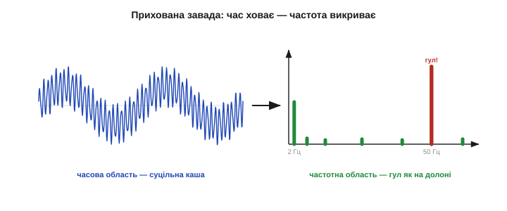
*Рис. 31.1.3. Що ховає час і викриває частота. Ліворуч — сигнал у часі: корисне повільне коливання потонуло в шумі й виглядає безладною кашею, завади не видно. Праворуч — той самий сигнал у спектрі: гострий пік на 50 Гц одразу виказує мережеву наводку, а низький горб ліворуч — корисний сигнал. Те, що час сховав, частота показала пальцем.*

Саме тому досвідчений інженер, побачивши незрозумілий шум, першим ділом **дивиться на спектр**: підозрілий пік прямо називає винуватця за його частотою — 50 Гц це мережа, кілогерци це часто перемикальний блок живлення, сотні герц це може бути вібрація двигуна. Частота — це **підпис** джерела.

> 🔧 **Навіщо це.** Коли давач «шумить», а на осцилограмі сам безлад, переведіть сигнал у спектр — і причина часто **називає себе сама**. Рівний пік на 50/60 Гц — мережева наводка (екрануй, виткни землю); рівний килим по всій осі — тепловий шум (усереднюй, §30.2); вузький пік на частоті обертання — механічна вібрація. Те, що в часі невідрізнене від каші, у частоті стає адресою джерела. Це найшвидший спосіб налагодження аналогового тракту, який тільки є.

### Дзеркало: та сама інформація, інша форма

Підкреслимо те, що легко проґавити: перехід між мовами **нічого не втрачає**. Узявши хвилю в часі, можна порахувати її спектр; узявши спектр, можна **точно відновити** ту саму хвилю. Це дзеркало, а не спрощення: обидва описи **повні** й **рівносильні**.

Це принципово відрізняє перетворення від **фільтра**. Фільтр (Розділ 30) свідомо **викидає** частину інформації — шум, викиди — і назад її вже не повернеш; це вулиця з одностороннім рухом. Перетворення Фур'є не викидає **нічого**: воно лише **перекладає** ті самі дані іншою мовою, і переклад оборотний до останнього біта. Тому спектр — це не «оброблений», а просто **інакше побачений** той самий сигнал. Усі ліки — прибрати гул, стиснути звук — застосовують **уже після** переходу, працюючи у частотній мові; саме ж перетворення чесно зберігає все, що було, щоб після обробки можна було точно повернутися в час.

Інструмент, що переводить часову мову в частотну, зветься **перетворенням Фур'є** (*Fourier transform*) — на честь героя історії цього розділу. Зворотний переклад, із частот назад у час, — **обернене перетворення Фур'є**. Як саме воно влаштоване — що сигнал розкладають на суму синусоїд і як рахують «скільки кожної», — ми розберемо в наступних темах (§31.2 — ідея, §31.4 — обчислення). Тут важлива лише сама **картина**: є дві мови й точний **словник** між ними в обидва боки.


*Рис. 31.1.4. Оборотний місток. Перетворення Фур'є переводить сигнал із часової мови в частотну; обернене перетворення повертає назад — точно, без утрати інформації. Це не спрощення сигналу, а зміна **точки зору** на нього: ті самі дані, інша вісь. Питання лиш у тому, з якого боку містка зручніше шукати відповідь.*

Звідси й практичний рецепт усього розділу: **перейди в ту мову, де твоє питання просте, дай відповідь там — і, за потреби, повернися назад**. Хочеш прибрати гул 50 Гц? У часі це важко, а в частоті — просто витри пік і перетвори назад (це і є частотна фільтрація, Розділ 32). Хочеш виміряти оберти двигуна за вібрацією? Шукай пік у спектрі. Міст працює в обидва боки, і вся майстерність — обрати правильний берег.

**Приклад (корисний сигнал під гулом).** Давач нахилу віддає повільний корисний сигнал ~2 Гц, але на нього накладена мережева наводка 50 Гц. У часі вони зливаються в тремтливу лінію, де очима «корисне» від «завади» не відділиш:

```
часова мова:   2 Гц + 50 Гц злиті разом  →  заплутана хвиля, очі безсилі
частотна мова: |                                  
   корисне →   ▉ (пік на 2 Гц)                     
   завада  →   .............▉ (пік на 50 Гц)       
висновок: дві частоти видно нарізно → ясно, що різати 50 Гц
```

Той самий сигнал, та сама інформація — але частотна мова **відразу** показала, що завада окремо від сигналу й де саме її різати. Це й є причина, чому інженери так часто дивляться на спектр: він **розплутує** те, що час сплутав.

### Крайні випадки, що будують інтуїцію

Щоб мова частот стала рідною, корисно завчити кілька **граничних пар** «час ↔ частота» — вони працюють як опорні точки.

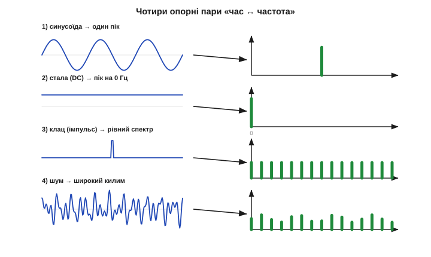
*Рис. 31.1.5. Чотири опорні пари. (1) Чиста синусоїда — один пік: уся енергія на одній частоті. (2) Стала (постійний рівень) — пік на нульовій частоті (0 Гц = «не коливається»). (3) Різкий короткий імпульс-клац — рівний спектр: клац містить геть усі частоти потроху. (4) Білий шум — широкий рівний килим: безлад у часі = усі частоти разом. Вузьке в часі — широке в частоті, і навпаки.*

- **Чиста синусоїда → один пік.** Одна частота — уся енергія в одній точці спектра. Це найпростіший можливий спектр.
- **Стала величина (постійний рівень) → пік на 0 Гц.** Якщо сигнал не коливається зовсім, уся його «енергія» сидить на **нульовій частоті**. Тому 0 Гц у спектрі — це просто **середній рівень** (постійна складова, *DC*); цікаве ж зазвичай починається праворуч від нуля.
- **Різкий клац (короткий імпульс) → рівний спектр.** Що **коротша** подія в часі, то **ширший** її спектр: ідеальний миттєвий клац містить **усі** частоти потроху. Ось чому короткий «тик» звучить так різко — у ньому намішано все.
- **Білий шум → широкий рівний килим.** Цілковитий безлад у часі — це присутність **усіх** частот одночасно й порівну; звідси й назва «білий» (як біле світло — суміш усіх кольорів).

Ці чотири пари — як таблиця множення частотної мови: завчивши їх, ви вгадуватимете форму спектра ще до будь-яких обчислень. Побачили в спектрі самотній гострий пік — десь у сигналі є чиста періодика (тон чи завада); широкий рівний килим — переважає шум; усе притиснуте до лівого краю, до нуля, — сигнал майже сталий, без швидких коливань. І навпаки: знаючи, що сигнал — повільна синусоїда з домішком клацань, ви наперед скажете, що в спектрі буде низький пік плюс рівномірний фон. Ця гра «вгадай спектр» і є та інтуїція, заради якої варто завчити опорні пари.

В усіх цих парах прозирає одна глибока закономірність: **що вужче сигнал у часі, то ширший він у частоті**, і навпаки. Нескінченно довга синусоїда — нескінченно вузький пік; миттєвий клац — нескінченно широкий килим. Ця обернена залежність — насправді той самий компроміс «локальність проти роздільності», що керував і затримкою фільтрів (§30.5); згодом він повернеться як межа роздільної здатності спектра (§31.6). Поки що досить відчути її нутром: **гострота в одній мові — це розмитість у другій**.

> 🔧 **Навіщо це.** Інструмент, що показує спектр у реальному часі, зветься **аналізатором спектра**, і його не треба купувати окремо: на мікроконтролері спектр рахує **ШПФ** (§31.5) — кілька рядків коду перетворюють масив відліків АЦП на стовпчики частот. Маючи цей погляд, ви бачите в сигналі те, чого не видно на жодній осцилограмі: тони, гул, вібрації, биття. Це як отримати друге око — і багато задач, безнадійних у часі, у частоті стають тривіальними.

### Яку мову обрати під питання

Підсумуймо практично. Перш ніж дивитися на сигнал, спитайте себе, **що саме** ви хочете дізнатися, — і це підкаже, з якого берега містка заходити.


*Рис. 31.1.6. Яка мова під яке питання. «Коли це сталося? Який різкий фронт? Як швидко наростає?» — часова область. «Які тони всередині? Чи є прихований період? Де гул-завада? Як стиснути?» — частотна. Багато задач легко розв'язати, лише ставши на правильний берег; половина успіху — впізнати, який це берег.*

- Питання про **час і події** — «коли стався удар», «який перехідний процес», «де стрибок», «як змінюється рівень» — ставте в **часовій** області.
- Питання про **вміст і періодичність** — «які частоти всередині», «чи є прихований тон», «де мережевий гул», «як стиснути звук чи зображення» — ставте в **частотній**.

Часто найсильніший хід — **поєднати обидві**: знайти винуватця в частоті, а діяти в часі; або навпаки. Саме на цій двомовності й стоїть уся цифрова обробка сигналів, і весь дальший розділ — це, по суті, опанування другої, частотної мови до рівня рідної.

> 🔧 **Навіщо це.** Перед налагодженням сигналу спитайте не «що я бачу?», а «**що я хочу дізнатися?**» — і свідомо оберіть мову. Шукаєте момент події — лишайтесь у часі; шукаєте приховану частоту чи заваду — переходьте в спектр; не певні — гляньте на обидві картинки поряд. Звичка дивитися двома мовами замість однієї відрізняє інженера, що **бачить** сигнал, від того, хто лише дивиться на лінію й гадає.

Отже, у кожного сигналу є дві рівносильні мови, а між ними — точний оборотний місток на ім'я «перетворення Фур'є». Ми вже знаємо **навіщо** він і **що** дає; час зрозуміти, на чому він стоїть. У наступній темі — сама зухвала ідея Фур'є, та, у яку не вірив Лагранж: що **будь-який** сигнал, хоч би який складний, є нічим іншим, як **сумою простих синусоїд**.

---

## 31.2 Ідея Фур'є: будь-який сигнал = сума синусоїд

Минула тема дала **картину**: у сигналу дві мови, а між ними — оборотний місток. Тепер — сама **ідея**, на якій той місток стоїть, і вона варта того, щоб сказати її якнайпростіше й найгучніше: **будь-який сигнал можна скласти із самих лише синусоїд**. Хоч би яким заплутаним був запис давача, мікрофона чи антени — це насправді **сума чистих коливань** різних частот, кожне зі своєю силою. Звучить майже неймовірно (Лагранж і не повірив, історія розділу), та саме ця теза — серце всієї цифрової обробки. Розберімо її по-інженерному: що таке «синусоїда-цеглинка», як із цеглинок збирається складне й що таке «рецепт» сигналу.

### Синусоїда — атом коливань

Чому саме синусоїди? Бо синусоїда — **найпростіше можливе коливання**, «атом» усіх хвиль. У неї немає внутрішньої структури: це одна-єдина частота, рівна й нескінченно гладка. Будь-яке інше коливання можна **розкласти** на синусоїди, а саму синусоїду — уже ні на що простіше. До того ж вона **виняткова для лінійних систем**: пропустіть синусоїду крізь фільтр, підсилювач, RC-коло — на виході знову **та сама синусоїда тієї ж частоти**, лише іншої амплітуди й зсунута в часі. Форма не міняється. Жодна інша крива не має цієї властивості — тому синусоїди й стали природною «системою координат» для сигналів.

Є й глибша причина любити синусоїди: до них тяжіє сама **природа**. Гойдалка, маятник, струна, вантаж на пружині, LC-контур, камертон — усе, що вільно коливається, робить це **синусоїдально**. Синус — «рідна» форма коливання фізичного світу, розв'язок рівнянь, що керують пружністю й інерцією. Тож, розкладаючи сигнал на синусоїди, ми розкладаємо його не на штучні абстракції, а на ті самі чисті тони, якими «говорить» сам світ. Не дивно, що така мова виявилася водночас і найзручнішою для математики, і найуніверсальнішою для техніки.

Кожна синусоїда-цеглинка повністю задається **трьома числами**:

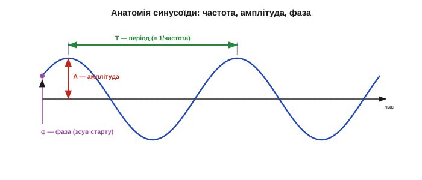
*Рис. 31.2.1. Анатомія синусоїди. Її задають рівно три числа: **частота** (як часто повторюється — скільки циклів за секунду, період T), **амплітуда** (яка заввишки — сила коливання) і **фаза** (де воно починається — зсув уліво/вправо). Змініть будь-яке з трьох — і дістанете іншу цеглинку. Із таких цеглинок Фур'є й складає геть усе.*

- **Частота** (*frequency*) — скільки повних коливань за секунду (герци); це «висота тону». По ній цеглинки й розрізняють.
- **Амплітуда** (*amplitude*) — наскільки коливання сильне, його розмах; це «гучність» цієї частоти.
- **Фаза** (*phase*) — у якій точці циклу хвиля перебуває в момент t=0, тобто наскільки вона зсунута вбік.

Запис формулою: `A·sin(2π·f·t + φ)`, де `f` — частота, `A` — амплітуда, `φ` — фаза. Уся ідея Фур'є — у тому, що з таких трійок, узятих у потрібній кількості, складається **що завгодно**.

### Гармоніки: основна частота та її кратні

Почнімо з найважливішого випадку — сигналу, що **періодично повторюється** (нота, гул двигуна, пульс). Фур'є показав: такий сигнал складається не з абияких частот, а з дуже впорядкованого набору — **основної частоти** `f₀` (період якої дорівнює періоду всього сигналу) та її **цілих кратних** `2f₀, 3f₀, 4f₀…`. Ці кратні звуть **гармоніками** (*harmonics*): друга гармоніка вдвічі швидша за основну, третя — втричі, і так далі.

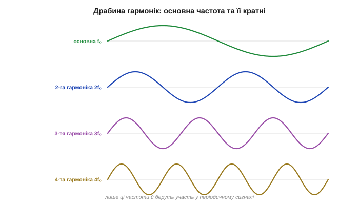
*Рис. 31.2.2. Драбина гармонік. Періодичний сигнал будують з основної частоти f₀ (найповільніше коливання, задає період) та її цілих кратних — 2f₀, 3f₀, 4f₀… Кожна наступна гармоніка вдвічі, втричі, вчетверо швидша. Лише ці частоти й беруть участь — звідси й музична назва «гармоніки».*

Це та сама драбина, що співала в струні Бернуллі (історія розділу): основний тон і його обертони. У музиці саме **набір гармонік** і їхні сили визначають **тембр** — чому скрипка й флейта на одній ноті звучать по-різному: основна частота однакова, а «приправа» з гармонік різна. Періодичний сигнал — це завжди основна частота плюс її гармоніки у власних пропорціях.

А скільки яких гармонік брати — залежить від форми. **Плавний**, близький до синуса сигнал має майже самі низькі гармоніки, а високих — кіт наплакав; **гострий**, зубчастий чи стрибкуватий — навпаки, багатий на сильні високі. Тому за самим виглядом рецепта вже видно характер хвилі: спадають гармоніки швидко — форма гладка; тягнуться високо й сильно — форма колюча. Працює це й у зворотний бік, як інженерна підказка: побачили в спектрі несподівано сильні високі гармоніки — десь у сигналі завівся різкий фронт, клац чи спотворення, якого в чистому тоні бути не мало б.

Жива ілюстрація — людський голос. Голосові зв'язки задають **основну частоту** (висоту голосу), а форма рота й горла підкреслює певні гармоніки — і саме цей візерунок ми чуємо як різні голосні: «а», «о», «і», проспівані на одній висоті, різняться лише **рецептом гармонік**. Тому за спектром голосу впізнають і звук, і навіть мовця: уся ця інформація закодована в тому, скільки якої гармоніки взято. Розпізнавання мови починається саме з цього розкладу на частоти.

### Будуємо складне з простого: синтез

Тепер — найпереконливіше. Якщо ідея правдива, то, **додаючи** гармоніки в правильних кількостях, ми мусимо вміти **зібрати** будь-яку періодичну форму. Перевірмо на пилкоподібній хвилі (рівний наростальний «зуб») — формі, здавалося б, геть несхожій на синус:

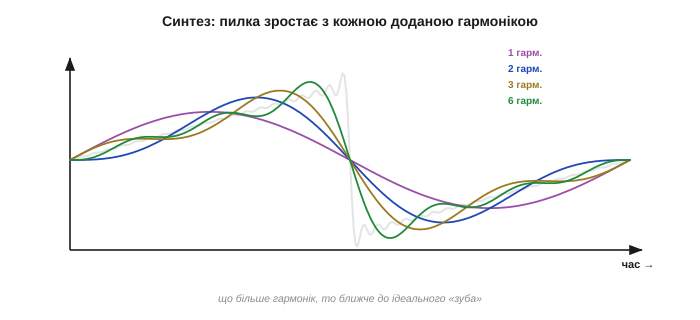
*Рис. 31.2.3. Синтез на очах. Беремо основну синусоїду — груба подоба «зуба». Додаємо другу гармоніку — точніше. Третю, шосту… — і сума щоразу ближча до ідеального пилкоподібного зуба. Дайте правильні кількості кожної гармоніки — і складеться будь-яка форма. Це не фокус, а пряма перевірка тези Фур'є.*

Одна синусоїда — лише віддалений натяк на зуб. Дві — уже краще. Шість — і око майже не відрізнить суму від ідеальної пилки. Кожна нова гармоніка домальовує дрібнішу деталь, а разом вони відтворюють і пологий схил, і різкий обрив зуба. Чому саме **дрібнішу**? Бо кожна наступна гармоніка **швидша**: висока частота встигає на тому самому проміжку зробити багато коливань, тож відповідає за тонкі риси форми, а основна задає грубий каркас. Найважче синусоїдам дається **різкий злам** чи стрибок: щоб відтворити вертикальний обрив зуба, потрібні дуже високі гармоніки, і теоретично їх нескінченно багато. Саме тому біля гострих кутів сума ніколи не лягає ідеально (згадайте викид Ґіббса з історії розділу) — гладкими цеглинками гострий кут складається лише в границі. Звідси робоче правило: **що різкіші деталі сигналу, то вищі гармоніки потрібні**. Це і є **синтез** (*synthesis*): зборка сигналу з його синусоїдальних складових. І він працює для будь-якої форми — square, трикутника, імпульсу, осцилограми голосу, — треба лиш знати **правильні кількості**.

> 🔧 **Навіщо це.** Тут і ховається сенс усієї частотної обробки. Якщо сигнал — це сума синусоїд, то **керувати** ним можна, міняючи кількість кожної: прибрати гул 50 Гц — це **занулити** саме її гармоніку в сумі; підкреслити бас — підняти низькі; стиснути звук — викинути ті частоти, яких вухо не чує. Усе це стає простим саме тому, що сигнал розкладений на незалежні цеглинки. Часова мова цього не вміла — там усе сплутано в одну лінію; частотна вміє, бо тримає складові **окремо**.

### Рецепт сигналу: скільки кожної частоти

Якщо сигнал = сума синусоїд, то він повністю заданий **списком**: яка частота, скільки її (амплітуда), із якою фазою. Цей список — і є **рецепт** сигналу, його повний опис частотною мовою. А намальований стовпчиками — це той самий **спектр** із §31.1: по горизонталі частоти-інгредієнти, по вертикалі — скільки кожного.

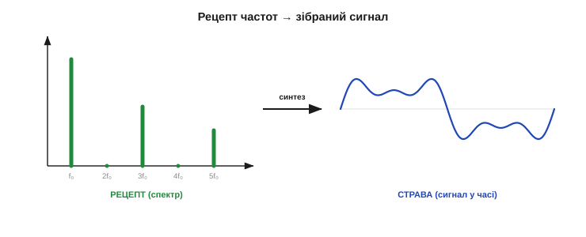
*Рис. 31.2.4. Рецепт і страва. Ліворуч — «рецепт»: стовпчики, скільки якої частоти взяти (спектр). Праворуч — «страва»: сигнал, зібраний синтезом саме з цих складових. Рецепт і страва — одне й те саме, подане двома мовами; знаючи рецепт, страву відтворюють точно, і навпаки.*

Метафора кухні тут точна. **Рецепт** (спектр) каже: стільки-то частоти `f₀`, стільки-то `2f₀`, стільки-то `5f₀`. **Страва** (часова хвиля) — це що вийде, як усе змішати. Дві форми того самого: маючи рецепт, ви точно спечете страву (синтез), а маючи страву, можете «розкуштувати» рецепт (аналіз). Саме тому спектр — повноцінний опис сигналу, а не якесь його скорочення: у рецепті записано **все**, що треба, аби відтворити оригінал до останньої рисочки.

Варто розрізнити два різновиди рецепта. У **періодичного** сигналу частоти беруться лише з драбини гармонік — тож рецепт **дискретний**, це короткий список окремих ліній (його звуть **рядом Фур'є**). А **разова**, неперіодична подія — одиничний клац, поодинокий імпульс — періоду не має, тож її рецепт уже не список, а **суцільна смуга** частот (це **перетворення Фур'є** у строгому сенсі). Інтуїція та сама — сума синусоїд, — лише для неперіодичного це сума по **неперервному** діапазону частот, а не по окремих гармоніках. Тонкощі цієї різниці нам не знадобляться; досить пам'ятати, що теза «сума синусоїд» покриває **обидва** випадки — і нескінченну ноту, і миттєвий клац.

**Приклад (рецепт прямокутної хвилі).** Зберемо наближений «меандр» (симетричний прямокутник) із кількох гармонік. Його рецепт — лише **непарні** гармоніки з вагами 1, ⅓, ⅕:

```
рецепт меандру:  f₀ · 1     (основна, повна сила)
                 3f₀ · 1/3   (третя, втричі слабша)
                 5f₀ · 1/5   (п'ята, ще слабша)
                 7f₀ · 1/7   ...
страва: сума цих синусоїд → щораз точніший прямокутник
парних гармонік (2f₀, 4f₀…) у рецепті НЕМАЄ — наслідок симетрії меандру
```

Усього кілька чисел — і повний опис форми, яку в часі довелося б задавати сотнею відліків. Рецепт часто **компактніший** за саму страву — на цьому, до речі, і стоїть стиснення (MP3, JPEG). Причому стиснення не псує сигнал навмання, а викидає **найменш потрібні** рядки рецепта — тихі частоти, нечутні гармоніки, — лишаючи ті, що несуть суть. Тому із кількох сотень коефіцієнтів можна лишити десятки, а страва на слух чи на око майже не зміниться. Сама можливість так чинити — пряме породження ідеї Фур'є: розклавши сигнал на **незалежні** частоти, ми дістали змогу зважити кожну окремо й зайві спокійно викинути.

### Фаза: де хвиля починається

Один тонкий, але важливий момент. У рецепті в кожної частоти є не лише **сила** (амплітуда), а й **фаза** — куди її зсунуто. І фаза реально впливає на **форму** часової хвилі: ті самі дві частоти, складені з різними зсувами, дадуть **різні** на вигляд осцилограми.

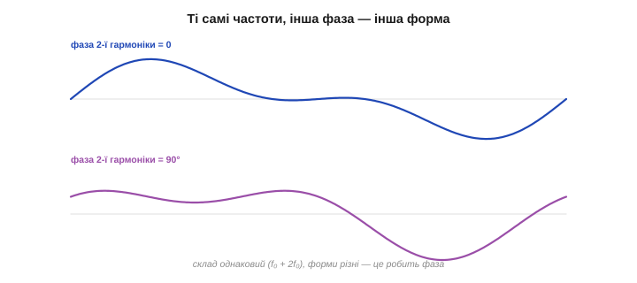
*Рис. 31.2.5. Фаза змінює форму, не змінюючи складу. Обидві хвилі зібрані з однакових двох частот (f₀ і 2f₀) і однакових амплітуд — різниться лише фаза другої гармоніки. У часі форми помітно різні, але «інгредієнти» ті самі. Тому, коли питають лише «**які** частоти всередині», на фазу часто заплющують очі; коли ж важлива точна форма — фазу слід берегти.*

Звідси практичний висновок: якщо питання — «**які тони** в сигналі», то фаза другорядна, дивляться на самі амплітуди (саме тому спектр часто малюють без фази — як у §31.1). А от якщо треба **точно відновити форму** сигналу синтезом, фазу викидати не можна — без неї страва вийде не та. Повний рецепт — це завжди **амплітуда плюс фаза** для кожної частоти.

Цікаво, що **вухо** на фазу майже не зважає: два звуки з однаковими амплітудами гармонік, але різними фазами, ми чуємо практично однаково, хоч їхні осцилограми різні. Око ж — для зображень — до фази, навпаки, дуже чутливе: саме вона несе контури предметів. Тому в стисненні звуку фазою часто **жертвують** заради компактності, а в обробці зображень її бережуть. Дрібниця, а показова: що в рецепті важливе, а чим можна знехтувати, залежить від того, **хто читатиме страву** — вухо, око чи алгоритм.

### Аналіз і синтез: туди й назад

Зведімо все в єдину пару напрямків. **Аналіз** (*analysis*) — це розкласти готовий сигнал на синусоїдальні складові, тобто **прочитати рецепт** зі страви; математично це і є **перетворення Фур'є**. **Синтез** (*synthesis*) — скласти сигнал назад із складових, **спекти страву за рецептом**; це **обернене перетворення**. Два боки однієї медалі.

Це і є той оборотний місток із §31.1, тепер названий точно: **аналіз** переводить нас на частотний берег, **синтез** повертає на часовий. І остання чесна обмовка: на практиці суму завжди **обривають** на скінченному числі гармонік — нескінченно багато їх не порахуєш. Тому реальний синтез дає не ідеал, а **наближення**: що більше гармонік лишили, то воно точніше (як ми щойно бачили з пилкою). Де проходить ця межа й чим за неї платять — окрема розмова (§31.6); поки досить знати, що скінченний рецепт відтворює сигнал **приблизно**, і керує цим усе той самий компроміс точності й вартості, що й у фільтрах.

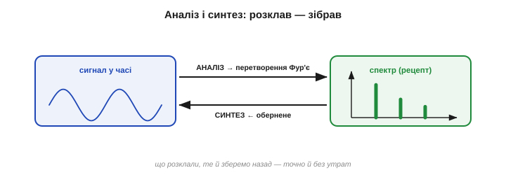
*Рис. 31.2.6. Замкнене коло. Аналіз (перетворення Фур'є) розкладає сигнал на синусоїдальні складові — дістаємо рецепт-спектр. Синтез (обернене перетворення) збирає сигнал назад із тих самих складових. Обидва боки точні й оборотні: що розклали, те й зберемо без утрат.*

Зверніть увагу: тут ми пояснили лише **що** відбувається — розклад на синусоїди й зборку назад. **Як саме** комп'ютер читає рецеп з масиву відліків АЦП — за якою формулою рахувати амплітуди кожної частоти — це окрема, суто технічна тема (§31.4, дискретне перетворення Фур'є), а як зробити це **швидко** — ще одна (§31.5). Поки що важливо міцно тримати саму ідею: **сигнал ⇄ сума синусоїд**, аналіз в один бік, синтез у другий.

> 🔧 **Навіщо це.** Гармоніки — не лише теорія, вони народжуються у вашій схемі самі. Будь-яке **спотворення** (нелінійність підсилювача, обрізання сигналу, перемикання ключа) **додає гармоніки** до чистого тону — і саме тому «брудний» підсилювач звучить різкіше, а ШІМ-сигнал повний кратних частот. Дивлячись на спектр виходу, ви прямо бачите якість тракту: чистий тон — самотній пік; спотворений — пік плюс «частокіл» гармонік. Це стандартний інженерний тест (так міряють коефіцієнт гармонік, THD).

> 🔧 **Навіщо це.** Запам'ятайте сигнал як **рецепт**, а не як лінію. Коли наступного разу побачите складну осцилограму, питайте не «що це за крива?», а «**з яких частот** вона зварена і скільки кожної?». Цей зсув погляду — від форми до складу — і є головна навичка, що її дає Фур'є. Усе подальше (спектр, фільтри, стиснення) — лише способи прочитати, змінити чи відтворити цей рецепт.

Отже, ідея в кишені: будь-який сигнал — сума синусоїд, заданих рецептом частот, амплітуд і фаз; аналіз читає рецепт, синтез готує страву. Та поки рецепт ми лише назвали. Час придивитися до нього зблизька — навчитися **читати спектр**: що означає кожен його стовпчик, де там корисне, а де завада, і що саме він каже про сигнал. Це — наступна тема.

---

## 31.3 Спектр: що він показує

Минула тема назвала спектр «рецептом» сигналу. Тепер навчимося його **читати** — бо спектр — це, без перебільшення, найкорисніша діагностична картинка в усій обробці сигналів. Один погляд на неї каже про сигнал більше, ніж година роздивляння осцилограми: який у ньому головний тон, чи є завада й де вона, наскільки він зашумлений, чи спотворений. Ця тема — практичний путівник: що означає кожна вісь, кожен пік, кожна «травинка» на спектрі й як за ними поставити діагноз. Тут ми ще **не рахуємо** спектр (це §31.4) — ми вчимося **дивитися** на готову картинку й розуміти, що вона говорить.

### Осі спектра: частота й величина

Спектр — це графік, у якого по **горизонталі — частота** (у герцах), а по **вертикалі — величина** цієї частоти, тобто скільки її в сигналі. Зліва направо частота зростає: ліворуч повільні коливання, праворуч швидкі. Висота в кожній точці каже, наскільки сильно відповідна частота присутня.

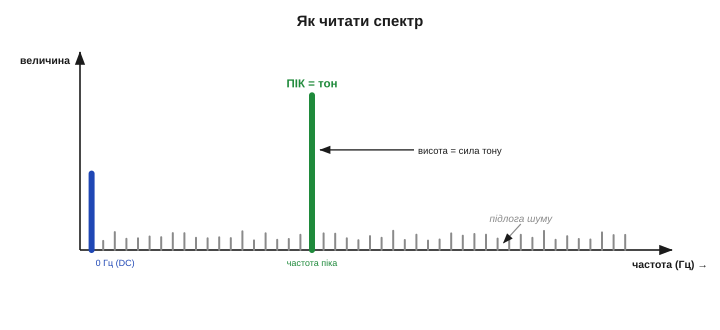
*Рис. 31.3.1. Як читати спектр. Горизонталь — частота (повільне ліворуч, швидке праворуч), вертикаль — величина (скільки цієї частоти). Виразний **пік** — присутній тон; його **положення** каже, яка це частота, **висота** — наскільки вона сильна. Окремий стовпчик на **0 Гц** — постійна складова (середній рівень). Низький суцільний «килим» унизу — **підлога шуму**.*

Три речі варто впізнавати одразу. **Пік** — вузький високий стовпчик — означає, що в сигналі є виразне коливання цієї частоти (тон). **Стовпчик на нулі** (0 Гц) — це постійна складова (*DC*), тобто середній рівень сигналу; він не коливається, тому й сидить на нульовій частоті. **Низький суцільний фон** уздовж усієї осі — підлога шуму, про яку нижче. Навчившись бачити ці три елементи, ви вже читаєте 90 % спектрів.

Ще дві дрібниці про осі. По-перше, обчислений спектр — це не гладка крива, а **ряд тісно поставлених стовпчиків**: кожен покриває вузеньку смужку частот (її звуть **бін**, *bin*), а ми читаємо їхню обвідну. Що більше стовпчиків, то дрібніше розділені сусідні частоти — але це вже питання обчислення (§31.4). По-друге, спектр зазвичай малюють **однобоким**: від 0 ліворуч до якоїсь максимальної частоти праворуч. Та права межа не випадкова — її задає те, як часто ми брали відліки (теж §31.4); поки досить знати, що праворуч спектр колись закінчується, і найшвидші видимі коливання — біля цього правого краю.

### Пік = тон: читаємо положення й висоту

Головний герой спектра — **пік**. Він кодує дві незалежні речі, і їх не можна плутати. **Положення піка по горизонталі** — це **яка** частота присутня: пік на 50 Гц і пік на 5 кГц — це геть різні «винуватці». **Висота піка** — це **наскільки сильно** ця частота звучить, її амплітуда. Тобто положення відповідає на «що це за тон», а висота — на «який він гучний».

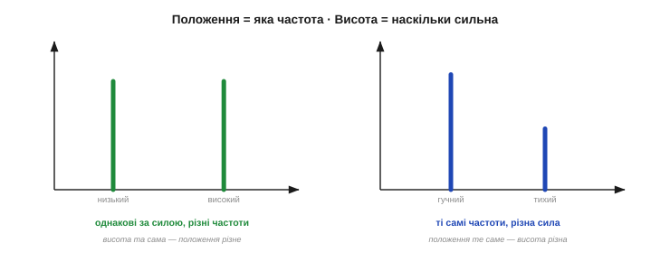
*Рис. 31.3.2. Дві осі — два питання. Ліворуч: два піки однакової висоти, але на різних частотах — два однаково гучні тони, низький і високий. Праворуч: два піки на тих самих частотах, але різної висоти — той самий склад, та один тон сильніший за другий. Положення каже «який тон», висота — «наскільки гучний»; це незалежні відповіді.*

Звідси проста навичка діагностики: побачили несподіваний пік — **подивіться на його частоту** й спитайте, що в системі коливається з такою частотою. 50 чи 60 Гц — майже напевно мережа; частота обертання двигуна чи її кратні — механічна вібрація; десятки-сотні кілогерц — імпульсний перетворювач живлення. Спектр прямо тицяє пальцем у джерело — треба лише прочитати, **де** стоїть пік.

Чесна засторога: у реального піка є **ширина**. Ідеальна нескінченна синусоїда дала б нескінченно тонку лінію, але будь-який реальний вимір скінченний у часі, тож пік трохи **розпливається** на кілька сусідніх бінів — чому саме, розберемо у §31.6. Практично це означає, що пік — невеликий горбик, а не голка, і частоту тону читають по його **вершині** (центру). Доки два тони далеко один від одного, їхні горбики окремі й чіткі; а коли близько — можуть злитися в один, і розрізнити їх стане важко. Поки що просто майте на увазі: пік має ширину, а центр горбика — це і є його частота.

### Підлога шуму й відношення сигнал/шум

Реальний спектр ніколи не буває порожнім між піками: уздовж усієї осі тягнеться низький нерівний фон — **підлога шуму** (*noise floor*). Це спектральний слід випадкового шуму (§30.1): оскільки шум містить **усі** частоти потроху (згадайте «білий шум» із §31.1), він і малюється рівномірним килимом унизу. Корисні ж тони стоять **піками над** цим килимом.

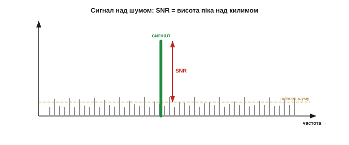
*Рис. 31.3.3. Сигнал над шумом. Низький нерівний килим — підлога шуму (усі частоти потроху). Корисний тон стримить **піком над** ним. Наскільки високо пік підноситься над килимом — це і є **відношення сигнал/шум** (SNR): що більший відрив, то чистіший сигнал. Коли пік ледь виглядає з килима, тон майже потонув у шумі.*

Відстань від вершини піка до рівня килима — це наочне **відношення сигнал/шум** (*SNR, signal-to-noise ratio*). Високий пік над низькою підлогою — чистий, упевнено виявлений тон; пік, що ледь визирає з трави, — сигнал на межі, який легко проґавити. Ось чому спектр — такий цінний детектор: навіть **слабкий** періодичний тон, цілком захований у шумі в часовій області, у спектрі **збирається в пік** і піднімається над розмазаним по всіх частотах шумом. Частота буквально витягує голку з копиці — бо голка-тон купчиться в одну точку, а копиця-шум розсіюється по всій осі.

Рівень підлоги — не константа: ним можна **керувати**. Що довший запис, то нижче осідає килим **відносно тонів**: шум розсіюється на дедалі більше бінів, а тон і далі збирається в один (ті самі міркування √N, що й у §30.2). Усереднення ж кількох спектрів килим не опускає, зате **вигладжує** його — і слабкий пік легше відрізнити від випадкового шумового горбика. Тому підлога шуму задає **межу виявлення**: усе, що нижче за неї, тоне в шумі й лишається невидимим, хоч би скільки ви вдивлялися в один-єдиний знімок. Хочете побачити слабше — подовжуйте запис (а для чистоти картинки ще й усереднюйте), а не марно збільшуйте «гучність» екрана.

Звідси й практичне питання: який пік **вважати справжнім**? Грубе правило — тон варто брати всерйоз, лише коли він **виразно** підноситься над килимом (на кілька рівнів шуму), а не ледь горбиться над ним. Одиничний горбик заввишки з траву — найімовірніше, випадковий сплеск самого шуму, а не тон. До того ж справжній тон тримається на тому самому місці від виміру до виміру, тоді як шумові горбики щоразу вистрибують на інших частотах. Тому, сумніваючись, гляньте на кілька знімків поспіль: що стоїть на місці — сигнал, що скаче — шум.

> 🔧 **Навіщо це.** Спектр виявляє тони, **слабші за шум**. У часі періодичний сигнал, тихіший за шум, не видно зовсім; а в спектрі його енергія збирається в одну вузьку лінію, тоді як шумова — розповзається по всій осі, тож пік вистромлюється над підлогою. На цьому стоять і радіо (виловити слабку несучу), і вібродіагностика (почути зародок дефекту в підшипнику), і пошук періодики деінде. Правило: **не видно тон у часі — шукай його в спектрі**.

### Лінійна шкала чи децибели

Часто в сигналі є і дуже сильні, і дуже слабкі частоти водночас — а їхні величини різняться в тисячі разів. На звичайній **лінійній** шкалі сильний пік займе всю висоту, а слабкі притиснуться до нуля й стануть невидимими. Щоб бачити і ті, і ті, вертикальну вісь роблять **логарифмічною** — у **децибелах** (*dB*).

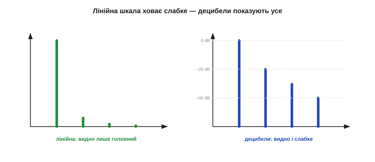
*Рис. 31.3.4. Навіщо децибели. Ліворуч (лінійна вісь) видно лише найсильніший пік, а слабші тони злилися з нулем. Праворуч (логарифмічна, у dB) той самий спектр показує і сильне, і слабке: кожні −20 dB — це вдесятеро менша амплітуда. Децибели стискають величезний діапазон у читабельну картинку, тому в звуці й радіо спектр майже завжди в dB.*

Децибел — це логарифмічна міра відношення: кожні **−20 dB** означають удесятеро меншу амплітуду, −40 dB — у сто разів, і так далі. Логарифм **стискає** гігантський діапазон у компактну картинку, де поряд видно і головний тон, і слабку гармоніку за тисячу разів тихішу. Тому в аудіо, радіо й вібродіагностиці спектр майже завжди малюють у децибелах: динамічний діапазон реальних сигналів просто не влазить у лінійну вісь. Лінійну ж шкалу лишають там, де всі складові приблизно одного порядку.

Кілька опорних чисел про децибели варто завчити, бо вони всюди. **0 dB** — рівність із опорним рівнем (децибел завжди **відносний**, тож потрібна точка відліку). **−3 dB** — половина потужності (звідси й «межа смуги» фільтра, Розділ 32). **−6 dB** — половина амплітуди. **−20 dB** — десята частина амплітуди, **−40 dB** — сота. Знаючи цю драбинку, ви прямо з картинки оцінюєте, у скільки разів завада слабша за сигнал: пік на 40 dB нижчий від головного — це амплітуда у сто разів менша, часто вже й не варта уваги.

До речі, і саме **відношення сигнал/шум** зазвичай виражають у децибелах — це просто висота піка над підлогою шуму, виміряна в dB. SNR 40 dB означає, що корисний тон у сто разів сильніший за шумовий килим (дуже чисто), а SNR 6 dB — лише вдвічі (ледь-ледь видно). Звідси й звичка інженера описувати якість сигналу одним числом у децибелах: воно відразу каже, наскільки впевнено тон стримить над шумом.

### Гребінець гармонік: підпис форми

Окремий важливий візерунок — **набір рівновіддалених піків**. Якщо сигнал періодичний, але **не** чиста синусоїда (а пилка, меандр, спотворений тон), його спектр — це не один пік, а **основна частота плюс її гармоніки** (§31.2): піки на `f₀, 2f₀, 3f₀…`, що шикуються рівною «гребінкою».

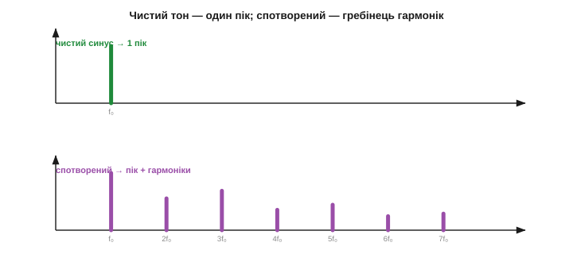
*Рис. 31.3.5. Гребінець видає форму. Угорі: чистий синусоїдальний тон — один-єдиний пік. Унизу: той самий тон, але спотворений (обрізаний, пропущений крізь нелінійність) — основний пік **плюс** рівновіддалені гармоніки 2f₀, 3f₀, … Цей «гребінець» — підпис несинусоїдальної форми: що він багатший, то сильніше спотворення.*

Цей «гребінець» — прямий **підпис форми сигналу**. Один самотній пік — чистий тон. Пік плюс рівний ряд гармонік — періодичний, але несинусоїдальний сигнал; і що вищі та сильніші гармоніки, то «гостріша» форма й то більше **спотворення**. Саме так вимірюють якість підсилювача чи генератора: подають чистий синус, дивляться на вихідний спектр — і за висотою «частоколу» гармонік рахують **коефіцієнт гармонічних спотворень** (THD). Чисто на вході, гребінець на виході — тракт спотворює.

Важливо відрізняти **гармоніки** від просто кількох тонів. Гармоніки — це піки на **цілих кратних** однієї основної частоти; рівний крок між ними виказує, що джерело **одне** (один періодичний сигнал чи одне спотворення). Якщо ж піки стоять на частотах, не пов'язаних кратністю, — це радше **кілька незалежних** джерел, що звучать водночас (скажімо, корисний тон і окрема мережева наводка). Тому, читаючи спектр, спершу спитайте: ці піки шикуються рівною гребінкою від спільної основи — чи розкидані самі по собі? Перше — одна несинусоїдальна форма; друге — суміш різних сигналів. Ця проста відмінність часто одразу каже, з однією бідою ви маєте справу чи з кількома.

### Читаємо реальний спектр

Складемо все докупи й прочитаємо реальний спектр, як інженер на лабораторному столі. Типова діагностична картинка містить одразу кілька «персонажів», і кожен про щось каже:

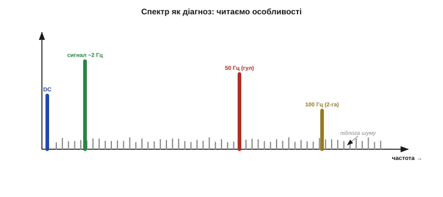
*Рис. 31.3.6. Спектр як діагноз. На одній картинці: стовпчик на 0 Гц — постійне зміщення (DC); високий пік ліворуч — корисний сигнал; гострий пік на 50 Гц — мережева наводка; менший пік на 100 Гц — її друга гармоніка; рівний килим унизу — підлога шуму. Прочитавши їх, інженер за секунди знає і що корисне, і що лікувати.*

**Приклад (читаємо за п'ять секунд).** На вході — спектр сигналу давача нахилу:

```
0 Гц          → високий стовпчик: є постійне зміщення (DC offset) — відняти при калібруванні
~2 Гц         → широкий пік: корисний сигнал нахилу (те, що нам треба)
50 Гц         → гострий пік: мережева наводка — кандидат на режекторний (notch) фільтр (Розділ 32)
100 Гц        → менший пік: 2-га гармоніка тієї ж наводки
весь діапазон → низький килим: тепловий шум, рівень задає SNR
діагноз: корисне на 2 Гц; різати 50 і 100 Гц; прибрати DC; шум прийнятний
```

За кілька секунд спектр розклав сигнал на складові й сам підказав план дій — те, що в часовій каші не вгадати й за годину. Це і є відповідь на питання «що показує спектр»: він показує **з чого зроблено сигнал** — і тим самим, що в ньому корисне, що завада, а що шум.

І чесно про межу спектра: магнітудний спектр показує, **які** частоти є, але мовчить про те, **коли** вони звучали. Розклавши цілий запис, ми дізнаємося його склад загалом — та не скажемо, чи гул на 50 Гц був увесь час, чи лише на початку. Це плата за перехід у частоту (згадайте §31.1: кожна мова щось ховає). Коли важливо й **що**, і **коли**, дивляться на сигнал короткими шматочками поспіль, дістаючи **спектрограму** — спектр, що міняється в часі. Та це вже поєднання двох мов; класичний же спектр — це портрет складу сигналу **в цілому**.

Ця сама навичка читання масштабується від звуку до вібрації й радіо: персонажі ті самі — корисний пік, чужі піки-завади, гребінець спотворень, килим шуму, — міняються лише частоти й підписи на осі. Навчившись упевнено читати один спектр, ви читаєте будь-який.

> 🔧 **Навіщо це.** Привчіть себе до одного жесту: зняли незрозумілий сигнал — **порахуйте й гляньте на спектр** (на МК це ШПФ, §31.5; на столі — будь-який аналізатор). Пробігтись по ньому — справа секунд: де головний пік (корисне), де чужі піки (завади за їхніми частотами), який рівень килима (шум), чи є гребінець (спотворення). Цей швидкий «спектральний огляд» — найефективніша звичка в обробці сигналів: він перетворює туманне «щось шумить» на конкретний список частот, з якими треба щось зробити.

> 🔧 **Навіщо це.** Дивлячись на спектр, тримайте в голові його шкалу. У **децибелах** навіть мізерна завада виглядає помітним піком — не лякайтеся, оцініть, на скільки dB вона нижча за корисне (−40 dB це вже соті частки, часто можна знехтувати). На **лінійній** же шкалі ви побачите лише найсильніше, а слабке проґавите. Тому, перш ніж робити висновки про «велику» чи «малу» заваду, гляньте, **в чому** намальована вертикальна вісь.

Отже, читати спектр ми навчилися: осі, піки, підлога, гармоніки, шкала — усе на місці. Лишилося головне практичне питання, яке досі ми обходили: а **звідки** цю картинку взяти? Як із масиву чисел-відліків АЦП, що його віддає давач, **порахувати**, скільки в сигналі кожної частоти? Відповідь — дискретне перетворення Фур'є: саме воно перетворює скінченний масив чисел-відліків на той спектр, який ми щойно навчилися читати. До нього й переходимо.

---

## 31.4 Дискретне перетворення Фур'є (ДПФ)

Досі ми говорили про спектр як про даність: ось він, читай. Тепер — найпрактичніше: **як його порахувати**. Мікроконтролер не має неперервної функції — у нього є **масив чисел**, `N` відліків АЦП, знятих через рівні проміжки. Інструмент, що перетворює цей масив на спектр, зветься **дискретним перетворенням Фур'є** (ДПФ, *Discrete Fourier Transform, DFT*). Це вже не філософія, а конкретний алгоритм, і в його основі лежить напрочуд проста й гарна ідея — **детектор частоти через множення й додавання**. Розберімо спершу її, тоді саму формулу, а тоді — три речі, що визначають усю практику: межу частот (Найквіст), роздільність і ціну обчислення.

«Дискретне» у назві — буквальне: і вхід дискретний (скінченний набір відліків замість неперервної хвилі), і вихід дискретний (скінченний набір бінів замість неперервного спектра). ДПФ — це версія Фур'є, скроєна саме під комп'ютер, що оперує числами, а не формулами. Тому вона й лягла в основу всієї цифрової обробки сигналів.

### Ідея детектора: помнож і додай

Як перевірити, чи є в сигналі частота `f`? Фур'є відповідає геніально просто: **домнож сигнал на «еталонну» синусоїду частоти f і додай усі добутки**. Якщо в сигналі ця частота **є**, він «крокує в ногу» з еталоном — там, де еталон додатний, сигнал теж переважно додатний, і добутки складаються у **велику** суму. Якщо ж цієї частоти **нема**, сигнал і еталон то збігаються, то розходяться, добутки виходять то плюс, то мінус і в сумі **гасять одне одного** майже до нуля.

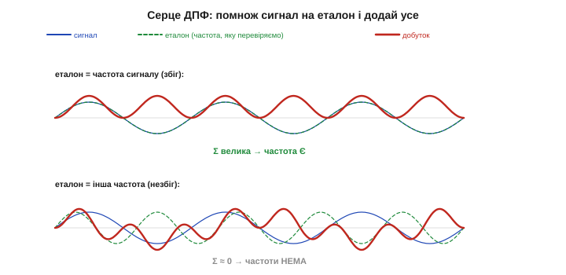
*Рис. 31.4.1. Серце ДПФ — кореляція. Угорі: сигнал помножено на еталон **тієї самої** частоти — добуток майже скрізь додатний, сума велика (частота є!). Унизу: помножено на еталон **іншої** частоти — добуток танцює навколо нуля, сума ≈ 0 (частоти нема). Так ДПФ і «питає» сигнал про кожну частоту по черзі.*

Це і є вся механіка ДПФ: воно по черзі прикладає до сигналу еталони **всіх** перевірюваних частот і для кожної рахує таку суму-«відгук». Велика сума — частота присутня (буде пік у спектрі), близька до нуля — відсутня. Сигнал ніби пропускають крізь набір **резонаторів**, кожен налаштований на свою частоту, і дивляться, котрі озвалися. Жодної магії — лише множення й додавання, які мікроконтролер обожнює.

Чому ж незбіжні частоти так чисто гасяться? Бо різні частоти на повному записі **незалежні**: додатні й від'ємні півхвилі їхнього добутку точно врівноважуються, і сума сходить нанівець. Це властивість **ортогональності** синусоїд — математична причина, чому розклад на частоти взагалі однозначний: кожна частота «відгукується» лише на свій еталон і нічого не позичає в сусідів. Саме завдяки їй ДПФ не плутає частоти між собою, а чесно розкладає сигнал на незалежні складові — той самий рецепт із §31.2, лише тепер порахований числами.

### Формула ДПФ

Запишімо цю ідею точно. Для масиву з `N` відліків `x[0], x[1], … x[N−1]` ДПФ дає `N` чисел `X[k]`, кожне з яких — «відгук» на свою частоту (§7, усе в Unicode, без LaTeX):

```
        N−1
X[k]  =  Σ   x[n] · ( cos(2π·k·n/N) − j·sin(2π·k·n/N) ),   k = 0 … N−1
        n=0
```

Лячне на вигляд, та змісту в ньому рівно стільки, скільки ми вже сказали. Косинус і синус — це **той самий еталон** частоти, узятий у двох версіях (зсунутих на чверть періоду), щоб упіймати коливання за **будь-якої** фази. Зручно рахувати їх окремо:

```
Re[k] =  Σ x[n]·cos(2π·k·n/N)     ← скільки «косинусної» частоти k
Im[k] = −Σ x[n]·sin(2π·k·n/N)     ← скільки «синусної» частоти k
|X[k]| = √(Re[k]² + Im[k]²)        ← повна сила частоти k (це і є висота піка)
```

Уявний множник `j` — лише охайний спосіб тримати косинусну й синусну частини разом (як дві координати). Для спектра, який ми читали в §31.3, важлива саме **величина** `|X[k]|` — висота стовпчика на частоті номер `k`; а кут між `Re` і `Im` дає **фазу** (§31.2). Ось і все ДПФ: для кожного `k` — помножити сигнал на два еталони, додати, узяти довжину.

По суті, це **два вкладені цикли**: зовнішній перебирає всі частоти `k`, внутрішній — усі відліки `n`, накопичуючи суму добутків. Десяток рядків коду — і ви маєте власне ДПФ, без жодної бібліотеки. Саме так його й пишуть «на пальцях», коли треба перевірити лише одну-дві конкретні частоти: тоді зовнішній цикл звужують до потрібних `k`, і виходить дешевий **вибірковий** детектор (його ще звуть алгоритмом Ґерцеля — зручним, коли шукаєш конкретний тон, як-от сигнал DTMF-кнопки). Повне ж ДПФ ганяє зовнішній цикл по **всіх** `k` поспіль — звідси й уся його вартість, про яку нижче.

### Біни: N відліків → N частот

Кожен індекс `k` у формулі — це окрема частота, окремий стовпчик спектра; його й звуть **біном** (*bin*, §31.3). Важлива симетрія: з `N` відліків у часі виходить `N` значень `X[k]` — але для звичайного (дійсного) сигналу друга половина дзеркальна першій, тож **корисних бінів лише `N/2 + 1`** — від нульового (0 Гц, постійна складова) до бін `N/2` (найвища частота).

Звідки та дзеркальність — чому половина бінів зайва? Для **дійсного** сигналу (а відліки АЦП завжди дійсні) верхня половина спектра виходить точним віддзеркаленням нижньої: бін `N−k` несе ту саму величину, що й бін `k`. Нової інформації в ній нема, тож її просто відкидають і малюють спектр від 0 до Найквіста. Якби сигнал був комплексний (таке буває в радіо з квадратурними каналами), усі `N` бінів були б різні — але для звичайного давача половини цілком досить.

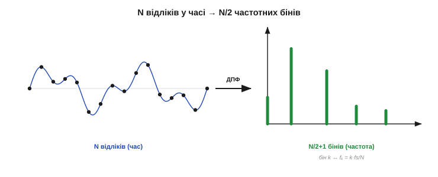
*Рис. 31.4.2. З масиву часу — у стовпчики частот. Зліва — N відліків сигналу в часі; ДПФ перетворює їх на спектр справа. Кожен бін `k` відповідає частоті `fₖ = k·fs/N`: бін 0 — це 0 Гц (DC), а останній корисний бін — найвища частота (Найквіст). N чисел увійшло — N/2+1 корисних стовпчиків вийшло.*

Якій **реальній** частоті в герцах відповідає бін `k`? Тій, що робить рівно `k` повних коливань за весь запис:

```
fₖ = k · (fs / N)        fs — частота дискретизації (відліків за секунду)
```

Тобто бін 0 — це 0 Гц, бін 1 — одне коливання на весь запис, бін 2 — два, і так далі. Щоб перевести стовпчик спектра в герци, помножте його номер на крок `fs/N`. Цей крок — наша наступна головна величина.

### Частота дискретизації й Найквіст

Усе впирається в `fs` — **частоту дискретизації** (скільки відліків за секунду бере АЦП). Вона задає **стелю** видимих частот. Інтуїція проста: щоб розпізнати коливання, треба зловити бодай **дві** його точки за період — гребінь і западину. Якщо ж на період припадає менш як два відліки, коливання «проскакує» між замірами невпізнаним.

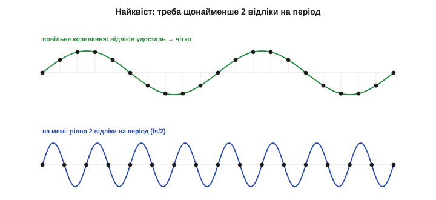
*Рис. 31.4.3. Межа Найквіста. Угорі — повільне коливання: на період припадає багато відліків, форма впевнено відновлюється. Унизу — на межі: рівно два відліки на період (Найквіст, fs/2) — це найшвидше, що ще можна розпізнати. Усе, швидше за fs/2, відліки вже не встигають упіймати правильно.*

Звідси **частота Найквіста** — половина частоти дискретизації:

```
найвища частота, яку можна виміряти = fs / 2   (Найквіст)
```

Це і є той «правий край» спектра з §31.3: вище за `fs/2` ДПФ просто **не бачить**. Тому перше правило будь-якого вимірювання спектра: брати відліки **щонайменше вдвічі частіше**, ніж найшвидше коливання, яке вас цікавить. Хочете бачити до 500 Гц — дискретизуйте не повільніше за 1000 разів на секунду.

Цей закон Найквіста стоїть за знайомими числами. Аудіо-CD дискретизують на **44 100 Гц** — саме щоб Найквіст (22 050 Гц) накрив усю смугу людського слуху (~20 кГц) із запасом. Телефонія обмежується ~8 кГц, бо для розбірливості мови досить частот до ~3.4 кГц. Щоразу та сама логіка: визнач найвищу потрібну частоту, подвой її — і ось мінімальна `fs`. Не випадкове число, а пряме застосування межі Найквіста.

> 🔧 **Навіщо це.** Обирайте `fs` принаймні вдвічі більшу за найвищу **корисну** частоту — а на практиці з запасом (×2.5–×5), бо біля самого Найквіста все спотворюється. І найважливіше: усе, що **вище** за Найквіст, треба прибрати **до** АЦП — простим аналоговим RC-фільтром (антиаліасинговим), бо інакше воно не зникне, а підступно **прикинеться** низькою частотою (про це далі). Цифра вже не врятує — фільтрувати треба перед оцифруванням.

### Роздільність: Δf = fs/N

Друге, що задає `fs` разом із числом відліків `N`, — **роздільність за частотою**, тобто крок між сусідніми бінами:

```
Δf = fs / N = 1 / T        T = N/fs — тривалість запису (секунди)
```

Що дрібніший `Δf`, то ближчі частоти спектр розрізняє. І ключове: `Δf = 1/T` залежить **лише від тривалості запису** `T`. Хочете розділити два близькі тони — **міряйте довше**: що довший запис, то тонші біни. Короткий запис дає грубі біни, у яких близькі частоти зливаються в один горб.

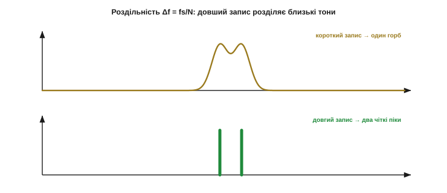
*Рис. 31.4.4. Роздільність = довжина запису. Два близькі тони. Угорі — короткий запис: біни широкі (Δf велике), тони зливаються в один горб, не розрізнити. Унизу — довгий запис: біни тонкі (Δf мале), той самий дует розпадається на два чіткі піки. Роздільність купують **часом** виміру.*

Тут визирає той самий компроміс, що й усюди в цьому модулі: **краща роздільність за частотою коштує довшого часу виміру** — а отже, гіршої «миттєвості». Не можна водночас і точно знати частоту, і точно прив'язати її до моменту: довгий запис дає тонкий спектр, але «розмазаний» у часі. Глибше про цю межу — у §31.6; поки досить правила `Δf = fs/N`.

**Приклад (порахуймо параметри).** Беремо `fs = 1000` Гц і `N = 1000` відліків:

```
тривалість запису:  T = N/fs = 1000/1000 = 1 с
роздільність:       Δf = fs/N = 1000/1000 = 1 Гц     (біни через 1 Гц)
найвища частота:    Найквіст = fs/2 = 500 Гц          (останній бін — №500)
корисних бінів:     N/2 + 1 = 501                     (від 0 до 500 Гц)
```

Тобто за одну секунду запису дістаємо спектр від 0 до 500 Гц із кроком 1 Гц. Хочете крок 0.5 Гц — міряйте 2 секунди (`N = 2000`); хочете бачити до 1 кГц — дискретизуйте вдвічі частіше (`fs = 2000`). Усе передбачувано керується двома числами, `fs` і `N`.

Практично роздільність вирішує, чи розділите ви близькі частоти. Щоб відрізнити, скажімо, 50 Гц від 51 Гц, потрібен крок `Δf ≤ 1` Гц, тобто запис не коротший за `T = 1/Δf = 1` с. А щоб розчути 50 від 50.1 Гц — уже всі десять секунд запису. Ось чому точні вимірювання частоти (настройка струни, вібродіагностика підшипника) вимагають **довгих** записів: інакше сусідні піки просто не роз'їдуться в спектрі. Коротко міряєш — грубо бачиш.

> 🔧 **Навіщо це.** Дві ручки керують спектром **незалежно**: `fs` задає **діапазон** (видно до `fs/2`), а `N` разом із `fs` — **роздільність** (`Δf = fs/N`). Треба ширший діапазон — підніми `fs`; треба тонші біни — збільш `N`, тобто міряй довше. Не плутайте їх: швидша дискретизація **не** покращує роздільності, лише розсуває стелю; а довший запис **не** піднімає стелі, лише дрібнить біни. Спершу вибери `fs` під потрібний діапазон, тоді `N` — під потрібну роздільність.

### Аліасинг: коли частота прикидається чужою

Тепер — найпідступніше. Що станеться з коливанням **швидшим** за Найквіст? Воно не зникне й не дасть чесної помилки — воно **прикинеться іншою, нижчою частотою**. Бо рідкі відліки високочастотної хвилі лягають **точно так само**, як відліки якоїсь повільної, і ДПФ їх не розрізнить. Це й є **аліасинг** (*aliasing*, «підміна»).

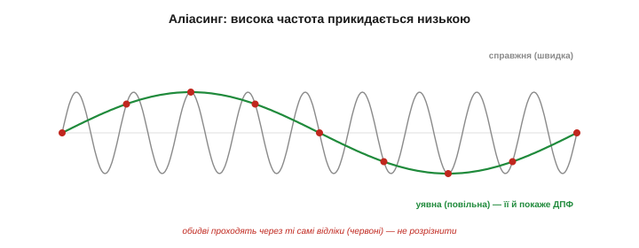
*Рис. 31.4.5. Аліасинг: самозванець. Швидка синусоїда (сіра) і повільна (зелена) проходять через **ті самі** точки-відліки (крапки). Маючи лише крапки, ДПФ не може сказати, котра була насправді, — і чесно покаже **повільну**. Так реальна висока частота «зливає» свою енергію в чужий, низькочастотний пік, спотворюючи спектр.*

Класичний приклад — «ефект колеса воза» в кіно: спиці обертаються так швидко, що між кадрами встигають перескочити, і колесо здається застиглим чи й крутиться назад. У спектрі аліасинг ще гірший: висока завада виринає **фальшивим піком** у корисному діапазоні, і за самим спектром її **не відрізнити** від справжнього сигналу. Тому її ловлять **до** оцифрування — аналоговим **антиаліасинговим фільтром** низьких частот, що зрізає все вище за Найквіст ще на вході АЦП. Це не примха, а обов'язкова ланка будь-якого чесного вимірювання спектра.

Куди ж саме «складається» зайва частота? Вона **віддзеркалюється** від Найквіста: коливання на стільки-то герц **вище** за `fs/2` виринає на стільки ж **нижче** за нього. Наприклад, при `fs = 1000` (Найквіст 500) сигнал 600 Гц прикинеться 400 Гц, а 900 Гц — 100 Гц. Тому небезпечні не лише дуже високі завади, а й ті, що **трохи** перевищили Найквіст: вони падають просто в середину корисного діапазону, де їх найважче запідозрити. Аліас не десь скраю — він може сісти впритул до вашого корисного піка.

> 🔧 **Навіщо це.** Аліасинг — улюблені граблі новачка: на спектрі стоїть пік, якого «не може бути», а це швидка завада прикинулася повільною. Ліки лише одні й лише апаратні: фільтр **перед** АЦП, що душить усе понад `fs/2`. Жоден цифровий трюк **після** оцифрування вже не розплутає самозванця від справжнього тону — інформацію втрачено в мить заміру. Правило: дискретизуй швидко **і** став антиаліасинговий фільтр.

### Ціна: N² і чому це проблема

Лишилося порахувати **вартість**. Щоб дістати всі `N` бінів, для кожного з них треба пройтися по всіх `N` відліках — тобто близько `N · N = N²` множень-додавань. Для маленького `N` це дрібниця, а для реального — біда:

```
N = 1000   → ~1 000 000 операцій на один спектр
N = 1024   → ~1 048 576       (мільйон)
подвоїли N → учетверо більше роботи  (квадратичний ріст)
```

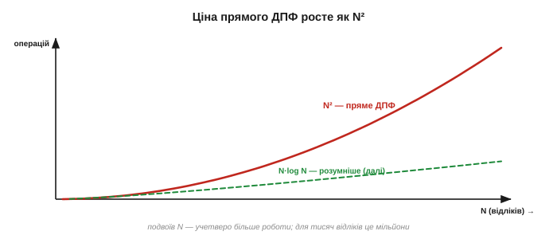
*Рис. 31.4.6. Чому «в лоб» — погано. Кількість операцій прямого ДПФ росте як N² (червона крива): подвоїш довжину — учетверо більше роботи. Для тисяч відліків це мільйони множень на кожен спектр — непідйомно в реальному часі на МК. Пунктир — у скільки разів дешевший міг би бути розумніший алгоритм.*

Квадратичний ріст — це смертний вирок для реального часу: мікроконтролер, що мусить рахувати спектр десятки разів на секунду, просто **не встигатиме**.

Прикиньмо бюджет. Нехай треба спектр `N = 1024` оновлювати 50 разів на секунду — це вже близько **50 мільйонів** множень за секунду лише на ДПФ, не рахуючи всього іншого. Для скромного мікроконтролера на десятки мегагерц це або непосильно, або з'їдає весь процесор без останку. А подвоївши `N` заради тоншої роздільності, ви **учетверо** збільшите цей рахунок. Квадрат росте нещадно — і саме він робив повне ДПФ майже непридатним для живих, вбудованих застосувань, попри всю красу ідеї. Здавалося б, ідея Фур'є гарна, та непрактична. Саме на цій стіні півтора століття й стояла прикладна спектроскопія — аж поки 1965 року не з'явився алгоритм, що рахує **те саме** ДПФ у рази й рази швидше, перетворивши `N²` на щось куди скромніше. Це — **швидке перетворення Фур'є**, і саме воно зробило все попереднє з цього розділу **миттєвим** і доступним кожному мікроконтролеру. Його ідея — і драматична історія його (пере)відкриття — наступна тема.

---

## 31.5 Швидке перетворення Фур'є (ШПФ/FFT)

Ми залишили ДПФ на сумній ноті: ідея чудова, та `N²` операцій роблять її майже непридатною — для тисячі відліків це мільйон множень на кожен спектр. І ось 1965 року з'являється алгоритм, що рахує **точно те саме** ДПФ, але в рази й рази швидше, перетворивши `N²` на скромне `N·log N`. Це **швидке перетворення Фур'є** (ШПФ, *Fast Fourier Transform, FFT*) — без перебільшення, один із найважливіших алгоритмів XX століття. Саме він зробив усе попереднє з цього розділу **миттєвим**: спектр у реальному часі, цифрове аудіо й відео, мобільний зв'язок, томографію. Розберімо, **як** він домагається такого прискорення — і чому це той самий результат, лише розумніше порахований.

Щоб оцінити вагу цього кроку: до ШПФ велике перетворення Фур'є рахували так довго, що часто його просто **не робили** — задача була теоретично зрозуміла, але практично неприступна. Після ШПФ вона стала миттєвою й буденною. Рідко буває, щоб один-єдиний алгоритм так розсунув межі можливого; тому варто розуміти не лише, що ШПФ швидке, а й **звідки** ця швидкість береться — бо та сама ідея «розділяй і володарюй» працює в безлічі інших задач.

### Та сама відповідь, менше роботи

Найперше, що треба засвоїти: **ШПФ не нове перетворення**. Воно дає **математично ті самі** числа `X[k]`, що й пряме ДПФ із §31.4, — без жодного наближення (відрізнятися можуть хіба звичайні округлення дробових чисел). Різниця **лише** в кількості арифметики: пряме ДПФ рахує кожен бін «у лоб», наново перемножуючи й додаючи все, а ШПФ помічає, що в цих обчисленнях **сила-силенна повторень** — одні й ті самі добутки синусів рахуються знову і знову. Прибравши це марнотратство, воно дістає той самий відгук за частку зусиль. ШПФ — не магія й не апроксимація, а **ощадлива бухгалтерія**: та сама відповідь, але без переробляння однієї й тієї ж роботи.

Звідки ж беруться ті повторення? Кожен доданок ДПФ містить множник `cos`/`sin` кута `2π·k·n/N`. Але багато різних пар `(k, n)` дають **той самий** кут (бо кути «обертаються по колу» й повторюються), а отже — той самий синус і косинус. Пряме ДПФ слухняно перемелює кожну пару окремо, тисячократно рахуючи одне й те саме значення. ШПФ натомість упорядковує обчислення так, щоб кожен такий добуток порахувати **раз** і **перевикористати** скрізь, де він потрібен. Уся економія `N²→N·log N` — це, по суті, прибрана надмірність, а не якась нова математика.

Практичний наслідок цієї точності великий: ШПФ можна підставляти **скрізь**, де потрібне ДПФ, не задумуючись про похибку, — результат той самий до останнього біта (з точністю до звичайних округлень дробових чисел). Тому у світі ДПФ «у лоб» практично ніколи й не рахують: щойно треба спектр — беруть ШПФ. «Повільне» пряме ДПФ лишилося хіба в підручниках як **означення**, а вся реальна робота йде через швидкий алгоритм.

### Розділяй і володарюй: парні й непарні

Серце ідеї — **«розділяй і володарюй»** (*divide and conquer*). Ключове спостереження: ДПФ із `N` точок можна **розкласти на дві ДПФ удвічі меншого розміру**. Розділимо відліки на дві групи — з **парними** індексами (`x[0], x[2], x[4], …`) і з **непарними** (`x[1], x[3], x[5], …`), по `N/2` у кожній. Виявляється, повне ДПФ виражається через ДПФ цих двох половин плюс дешеве склеювання.

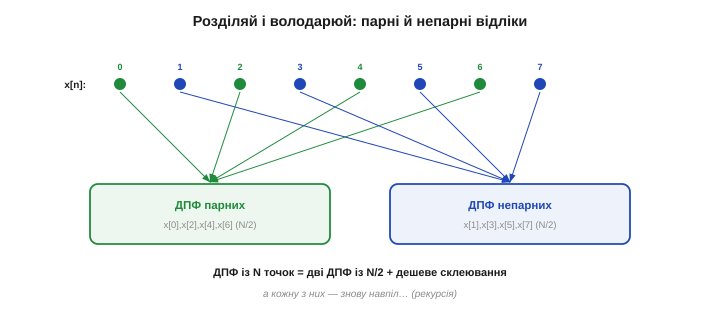
*Рис. 31.5.1. Розділяй і володарюй. Відліки розбивають на парні (зелені) й непарні (сині) — по N/2 у кожній групі. Замість одного великого ДПФ рахують **два вдвічі менші** (від парних і від непарних) і дешево їх склеюють. А кожне з цих менших ДПФ розбивають знову навпіл — і так рекурсивно, аж до тривіального розміру 1.*

А далі — та сама хитрість **рекурсивно**: кожну половину знову ділимо навпіл, ті — ще навпіл, аж поки не лишаться шматочки розміру 1 (ДПФ одного числа — це саме це число). Велика задача розсипається на безліч крихітних, і саме на цьому розсипанні й заощаджується робота. Звідси, до речі, вимога, щоб `N` був **степенем двійки** — щоб ділення навпіл завжди було рівним до самого кінця.

Чому ж саме поділ на парні й непарні дає виграш? Бо порахувавши **раз** ДПФ половинок — `E[k]` і `O[k]`, — ми використовуємо їх **двічі**: і для виходу `X[k]`, і для `X[k+N/2]` (це й робить метелик нижче). Тобто половина спектра дістається майже задарма, «у комплекті» з другою. Саме це спільне використання проміжних результатів — а не якийсь хитрий трюк із синусами — і є справжнє джерело прискорення. Розділивши задачу навпіл, ми змусили кожен шматок роботи слугувати одразу **двом** відповідям.

Рекурсія десь же мусить спинитися — і спиняється на найдрібнішому: ДПФ **одного** числа є саме це число, рахувати нема чого. Тому, поділивши масив навпіл `log₂N` разів, ми доходимо до тривіальних одиничок, а тоді збираємо відповідь назад, рівень за рівнем, метеликами. На практиці бібліотеки навіть не рекурсують «углиб»: вони розгортають усе у `log₂N` послідовних проходів по масиву — так само швидко, але без накладних витрат на виклики функцій.

### Метелик: дешеве склеювання

Лишається зрозуміти, що це за «дешеве склеювання» двох половинок. Нехай `E[k]` — ДПФ парних відліків, `O[k]` — ДПФ непарних. Тоді повний спектр збирається так (§7, Unicode):

```
X[k]      = E[k] + W·O[k]
X[k+N/2]  = E[k] − W·O[k]        W = e^(−j2π·k/N)   — «поворотний» множник (twiddle)
```

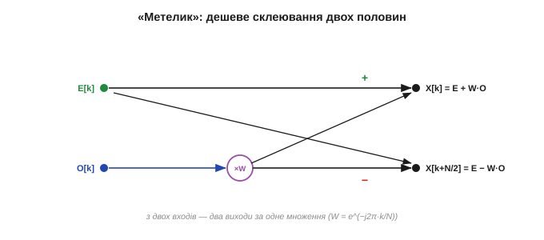
*Рис. 31.5.2. Базова операція ШПФ — «метелик». Бере одне значення з ДПФ парних (E[k]) і одне з непарних (O[k]), домножає друге на поворотний множник W — і за **одне** множення видає **два** виходи спектра: суму (X[k]) і різницю (X[k+N/2]). Перехрестя ліній і дало назву «метелик». Із таких метеликів складено все ШПФ.*

Ця крихітна операція й зветься **«метеликом»** (*butterfly*) — за схему з перехрестям ліній. Її краса в тому, що з пари входів вона дає **пару** виходів усього за **одне** множення (на `W`) і два додавання. Замість того щоб для кожного з `N` бінів перемелювати всі `N` доданків, ШПФ укладає все обчислення в мережу таких метеликів — і кожен добуток рахується **раз**, а не сотні разів. Уся економія — звідси.

Полічімо її просто. На кожному рівні ділення всі `N` значень укладаються в `N/2` метеликів — отже, лише `~N/2` множень на рівень. Рівнів `log₂N`, тож множень разом — близько `(N/2)·log₂N`, тобто порядку `N·log N`. Пряме ж ДПФ робить близько `N²` множень — по `N` на кожен із `N` бінів. Для `N = 1024` це різниця між кількома тисячами множень і цілим мільйоном: те саме ДПФ — у двісті разів менше арифметики, лише завдяки тому, що нічого не рахується двічі.

### Чому N·log N

Тепер порахуймо вартість і побачимо диво. Скільки **рівнів** ділення навпіл від `N` до 1? Рівно `log₂N` (для `N = 1024` це 10, для мільйона — близько 20). Логарифм тут — це просто «**скільки разів можна поділити навпіл**»: поділіть 1024 навпіл — 512, ще раз — 256, і так далі, рівно **десять** кроків до одиниці, бо 1024 = 2¹⁰. Ось чому `log₂N` — мала, повільна величина: навіть для мільйона точок це лише близько двадцяти. На **кожному** рівні всі `N` чисел проходять через метелики — це `~N` операцій. Перемножуємо:

```
рівнів ділення:      log₂N
роботи на рівень:    ~N  (усі N значень крізь метелики)
разом:               N · log₂N   ← замість N²
```

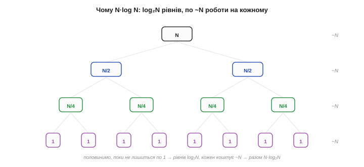
*Рис. 31.5.3. Звідки береться N·log N. Задачу половинять, поки не лишаться шматочки розміру 1, — це log₂N рівнів углиб. На кожному рівні разом обробляють усі N значень (~N операцій). Помножте кількість рівнів на роботу рівня — і дістанете N·log₂N замість квадрата.*

Замість `N²` — `N·log₂N`. Різниця здається дрібною, поки `N` малий, та з ростом `N` вона стає **прірвою**: логарифм росте мляво, а квадрат — нещадно.

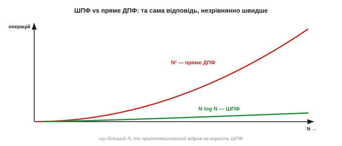
*Рис. 31.5.4. Та сама відповідь — несумірно дешевше. Крива N² (червона) злітає круто вгору; N·log N (зелена) повзе майже вздовж осі. Що більший запис, то приголомшливіший відрив на користь ШПФ — від десятків разів до десятків тисяч.*

### Виграш, що змінив усе

Перекладемо це в конкретні числа — і стане ясно, чому ШПФ називають алгоритмом, що змінив світ.

**Приклад (у скільки разів швидше).** Виграш — це приблизно `N / log₂N`:

```
N            пряме ДПФ (N²)      ШПФ (N·log₂N)      виграш ≈ N/log₂N
64           4 096              384                ~11×
1 024        1 048 576          10 240             ~100×
1 048 576    ~10¹²              ~2·10⁷             ~50 000×
```

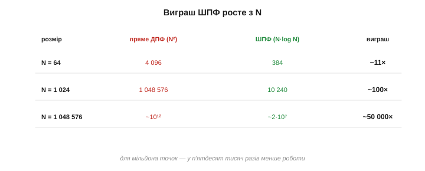
*Рис. 31.5.5. Виграш росте з N. Для тисячі точок ШПФ уже у ~сто разів ощадливіше за пряме ДПФ, а для мільйона — у ~п'ятдесят тисяч разів. Те, що «в лоб» рахувалося б годинами, ШПФ робить за мілісекунди — звідси й уся цифрова обробка реального часу.*

Сто разів для тисячі точок, п'ятдесят тисяч — для мільйона. Те, що прямим ДПФ рахувалося б годину, ШПФ робить за частку секунди. Саме цей стрибок **відчинив двері** цілим галузям: спектр у реальному часі, цифровий зв'язок, стиснення звуку й зображень, медична візуалізація — усе це стало можливим, бо перетворення Фур'є з дорогої теоретичної процедури зробилося **дешевою буденною операцією**. Ідея Фур'є чекала на цей алгоритм півтора століття, щоб нарешті по-справжньому запрацювати.

Аби відчути масштаб у людських мірках: мільйон точок прямим ДПФ — це ~10¹² операцій, тобто на процесорі в мільярд дій за секунду близько **сімнадцяти хвилин**; те саме ШПФ — ~2·10⁷ операцій, тобто **дві соті секунди**. Звідси й перелік галузей, що буквально стоять на ШПФ: Wi-Fi, 4G і 5G (їхній OFDM рахує ШПФ на кожен переданий символ), стиснення MP3 і JPEG, МРТ, радари й сонари, музичні тюнери. Недарма ШПФ внесли до списку найвпливовіших алгоритмів XX століття — мало яка ідея так змінила інженерну практику.

Уявімо це наочно, ближче до нашого заліза. Гітарний тюнер чи монітор вібрації мусить оновлювати спектр разів тридцять на секунду. Прямим ДПФ на буфері в тисячу точок це ~30 мільйонів множень за секунду — для копійчаного МК непідйомно. Тим самим ШПФ — лише ~300 тисяч: дрібниця, що лишає процесору купу часу на решту справ. Ось чому **кожен** реальний спектральний прилад — від тюнера до промислового аналізатора — усередині рахує саме ШПФ, а не ДПФ; інакше він просто не встигав би за сигналом.

### Степінь двійки — і де воно живе

На практиці варто знати кілька речей. По-перше, класичне ШПФ (*radix-2*) хоче, щоб `N` був **степенем двійки** — 256, 512, 1024…; якщо відліків інша кількість, масив **доповнюють нулями** (*zero-padding*) до найближчого степеня. По-друге, **не пишіть ШПФ самі** — для нього є вилизані бібліотеки: на ПК це `numpy.fft` чи FFTW, на мікроконтролерах — **CMSIS-DSP** (для ARM Cortex-M), `arduinoFFT` та подібні, оптимізовані під залізо. До слова, вимога «степінь двійки» — обмеження саме класичного *radix-2*; розумніші бібліотеки вміють ШПФ і для інших розмірів (мішані основи, алгоритм Блюстайна), тож на практиці ви передаєте будь-яке `N`, а підбір методу лишаєте бібліотеці. Та звичка брати степінь двійки лишається доброю: на ньому ШПФ найшвидше й найпростіше. По-третє, ШПФ настільки дешеве, що навіть **скромний мікроконтролер** легко рахує спектр десятки разів на секунду — те, про що інженери 1960-х і мріяти не могли.

Ще дві приємні дрібниці пояснюють, чому ШПФ так любить дрібне залізо. По-перше, його можна рахувати **на місці** (*in-place*): результат перезаписує вхідний масив, тож пам'яті треба лише на `N` чисел — критично для мікроконтролера з кілобайтами RAM. По-друге, через хитрий порядок метеликів виходи спершу опиняються «переплутаними» (у так званому **бітреверсному** порядку), і бібліотека наприкінці просто переставляє їх назад. Для вас це непомітно — лишень корисно знати, що ШПФ ощадливе не тільки за часом, а й за пам'яттю. І ще: для звичайного **дійсного** сигналу половина виходів дзеркальна (§31.4), тож осмислені лише перші `N/2+1` бінів — недарма бібліотеки мають окремий «дійсний» ШПФ, удвічі дешевший.

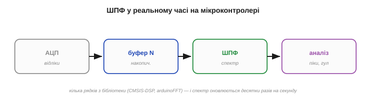
*Рис. 31.5.6. Спектр у реальному часі. АЦП наповнює буфер на N відліків → ШПФ перетворює його на спектр → аналіз шукає піки, гул, вібрації. Кілька рядків коду з готової бібліотеки — і мікроконтролер «бачить» сигнал у частоті, оновлюючи картинку десятки разів на секунду.*

> 🔧 **Навіщо це.** Беріть `N` степенем двійки (256, 512, 1024) — так лягає класичне ШПФ, а як відліків інше число, доповніть нулями. І не винаходьте велосипед: на МК підключіть **CMSIS-DSP** чи `arduinoFFT`, а не пишіть перетворення вручну — бібліотечне і швидше, і без помилок. Ваша робота — підготувати масив і прочитати спектр, а не реалізовувати метеликів.

> 🔧 **Навіщо це.** Завдяки ШПФ повноцінний **аналізатор спектра** вміщається в копійчаний мікроконтролер. Типовий конвеєр: зібрати `N` відліків з АЦП у буфер → викликати ШПФ → у вихідному масиві знайти піки (їхні частоти — `k·fs/N`, §31.4). Так на ESP32 чи STM32 роблять і визначники нот, і виявлювачі вібрації, і прості голосові тригери — усе на тому самому виклику ШПФ.

> 🔧 **Навіщо це.** Пам'ятайте: ШПФ дає **той самий** спектр, що й ДПФ, — тож усі правила §31.4 лишаються чинними. Найквіст `fs/2`, роздільність `Δf = fs/N`, небезпека аліасингу — нікуди не діваються; ШПФ лише рахує швидше, а не «краще». Зокрема, антиаліасинговий фільтр перед АЦП потрібен так само: швидкий алгоритм не виправить погано знятих даних.

Ось так одна алгоритмічна ідея перетворила красиву теорему Фур'є на робочий інструмент у кожній кишені. Що цікаво, придумали її не вперше 1965 року — слід цього алгоритму тягнеться аж до Ґаусса, ще до того, як Фур'є оприлюднив свою теорію. Ця заплутана історія втрат і перевідкриттів варта окремої розповіді.

> 📜 **Історія:** [ШПФ: Кулі, Тьюкі — і алгоритм, що мав ще Ґаусс](ch31-s5-history-fft.md). Як цей алгоритм знаходили, губили й перевідкривали впродовж півтора століття — і до чого тут холодна війна та ядерні випробування.

Лишилася остання практична засторога, яку ми досі мовчки обходили. Говорячи про спектр, ми припускали, що міряємо сигнал «увесь», від краю до краю, — та насправді і ДПФ, і ШПФ бачать лише **скінченний шматок** запису, грубо обрізаний з обох кінців рамкою фіксованої довжини. І цей раптовий обрив не минає безслідно: він **розмазує** чисті піки в горбики й породжує примарні бічні частоти, яких у сигналі не було. Швидкість ми здобули, але точність спектра впирається тепер у цю скінченність вікна. Що таке «витік спектра», звідки він береться й як його приборкати спеціальними вікнами — наступна, остання велика тема цього розділу про обчислення.

---

## 31.6 Вікно й витік спектра

ШПФ дало нам спектр швидко — але приховало одну незручну правду: воно бачить **не весь** сигнал, а лише той скінченний шматок, який ми встигли записати. І ця скінченність дається взнаки негарним ефектом: чистий тон, що мав би бути одним охайним піком, **розмазується** у горбик зі «спідницями», а часом породжує примарні частоти, яких у сигналі не було. Зветься це **витоком спектра** (*spectral leakage*), і не зрозумівши його, ви дивуватиметеся «брудним» спектрам і робитимете хибні висновки. Ця тема — про те, **звідки** береться витік і як його приборкати **вікнами**. Це остання технічна цеглинка нашого спектрального інструмента.

Чому це не теорія для галочки: без розуміння витоку ваш перший спектр на мікроконтролері майже напевно спантеличить. Ви подасте чистий тон — а побачите не гостру лінію, а розмитий горб із «вусами», і вирішите, що щось зламалося. Насправді все справне — просто ви ще не наклали вікна. Тому цю тему варто опанувати **перед** першим серйозним ШПФ, а не після годин марного налагодження неіснуючої поломки.

### Прихована умова ШПФ: запис повторюється

Почнімо з того, чого ШПФ **насправді** припускає про ваш сигнал. Узявши `N` відліків, воно мовчки вважає, що цей шматок — **один період** нескінченно-періодичного сигналу: ніби ваш запис повторюється вічно, знову і знову, встик. Тобто ШПФ дивиться не на «шматок дроту», а на «кільце», склеєне з кінця в початок.

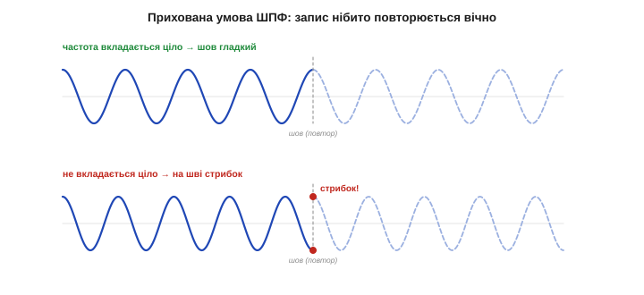
*Рис. 31.6.1. Прихована умова. ШПФ подумки склеює кінець запису з його початком і повторює вічно. Якщо частота вкладається в запис **цілим** числом періодів (угорі), шов гладкий — і все добре. Якщо ж число періодів **дробове** (унизу), на шві виникає різкий **стрибок** — якого в справжньому сигналі не було, а ШПФ його «бачить».*

І ось ключ: усе гаразд, **поки** частота сигналу вкладається в запис **цілим** числом періодів — тоді кінець плавно переходить у початок, шов непомітний. Та якщо в запис потрапило, скажімо, 8.5 періоду, кінець обірветься на півхвилі, а початок почнеться з гребеня — і на «шві» вискочить **різкий стрибок**. Цього стрибка в реальному сигналі немає; його **створює** саме обрізання. А різкий стрибок, як ми знаємо з §31.2, багатий на всі частоти — звідси й біда.

І ось що важливо: цілий збіг — це **рідкісний виняток**, а не правило. Частота реального сигналу довільна, вона майже ніколи не вкладається в запис рівно цілим числом періодів. Тож насправді витік присутній **майже завжди**, у тій чи іншій мірі; питання лише, наскільки він сильний. Саме тому вікна — не екзотика для особливих випадків, а буденна, майже обов'язкова ланка перед кожним ШПФ. Спектр без вікна — це спектр із прихованим витоком, навіть якщо око одразу його не помічає.

### Витік: чистий тон, що розмазався

Подивімося, що цей шов робить зі спектром. Якщо тон уклався ціло — спектр ідеальний: один-єдиний пік рівно на потрібній частоті. А якщо не вклався — пік **розпливається** в горбик, а обабіч нього тягнуться спадні «спідниці» (*sidelobes*), наче енергія тону **витекла** в сусідні біни.

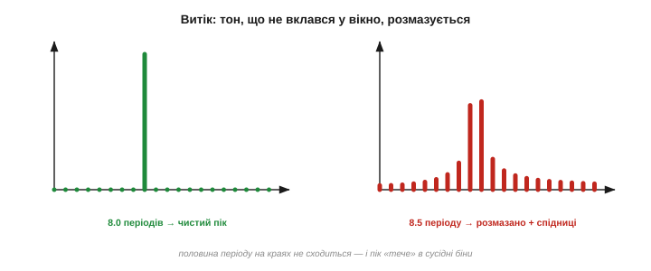
*Рис. 31.6.2. Витік наочно. Ліворуч — тон рівно у 8.0 періодів: чистий одиничний пік. Праворуч — той самий тон, але 8.5 періоду: енергія «витекла» з головного біна в сусідні, пік розмазався й оброс спідницями. Жодна частота не змінилася — лише обрізання краю розлило один пік на багато бінів.*

Найважче усвідомити, що **сигнал той самий** — чиста синусоїда однієї частоти. Це не вона стала «брудною»; це **скінченність вікна** розлила її чистий пік. Через витік дві близькі частоти можуть злитися в один горб (бо спідниці однієї накривають другу), а слабкий тон — потонути у спідницях сильного сусіда. Тому витік — не косметична дрібниця, а реальна завада точному читанню спектра.

Чому ж саме така форма — горбик зі спідницями, що повільно спадають? Бо спектр прямокутної рамки має характерний вигляд із головним горбом і **рядом бічних пелюсток**, які згасають дуже неквапно: перша з них слабша за головну лише разів у п'ять (на ~13 децибел). Кожна чиста лінія сигналу «вдягається» в цю форму, і її повільно-спадні спідниці розповзаються далеко по сусідніх бінах. Саме повільність згасання цих пелюсток і робить просте прямокутне обрізання таким «текучим».

Є й підступніший наслідок витоку — **похибка висоти**. Коли тон падає рівно між бінами, його енергія ділиться між сусідами, і **жоден** із них не показує справжньої амплітуди: пік «провисає» на кілька децибел (це звуть втратою на гребінках, *scalloping*). Тобто без вікна ви ризикуєте не лише розмазати пік, а й **недооцінити** його гучність — залежно від того, наскільки тон «не догодив» біну. Саме щоб прибрати цю залежність висоти від влучання в бін, і придумали вікно Flat-top із його навмисно пласким верхом.

### Звідки він: різкий обрив краю

Корінь усього — **різкий обрив** на краях запису. Коли ми просто «вирізали» `N` відліків, ми, по суті, помножили нескінченний сигнал на **прямокутну рамку**: одиниця всередині вікна, нуль зовні. А в цієї рамки **стрімкі вертикальні стінки** — і саме вони, як будь-який різкий стрибок (§31.2), вносять у спектр цілий частокіл частот. Перемноження сигналу на таку рамку «розмазує» кожну його чисту лінію на форму спектра самої рамки — широку, зі спідницями. Інакше кажучи, **гострі краї вікна** і є джерело витоку.

Інженери кажуть це коротко: **множення в часі — це розмазування в частоті**. Помноживши сигнал на рамку, ми ніби «відбили» весь спектр сигналу формою спектра рамки — кожну гостру лінію замінили на копію широкого, спідничкового профілю самого вікна. Тому й виходить, що чим **різкіша** рамка (прямокутна), тим довші й вищі «спідниці» її профілю, а отже, тим далі розмазується кожен пік. Зробимо рамку **плавною** — і спідниці впадуть у сотні разів, профіль стане чистішим (ціна — трохи ширший головний пік, §31.6), а з ним очиститься й кожна лінія сигналу.

Звідси й підказка до ліків: якщо винні **різкі краї**, то їх треба **згладити**. Якби сигнал плавно сходив до нуля на обох кінцях запису — стрибка на шві не було б, а отже, не було б і витоку.

### Ліки: вікно, що м'яко гасне до країв

Саме це й роблять **віконні функції** (*window functions*). Перед тим як подати `N` відліків у ШПФ, їх **домножують** на плавну дзвоноподібну криву, що дорівнює одиниці посередині й м'яко спадає до нуля на краях. Тоді обидва кінці запису акуратно «пригашені» до нуля, шов сходиться без стрибка — і витік різко спадає.

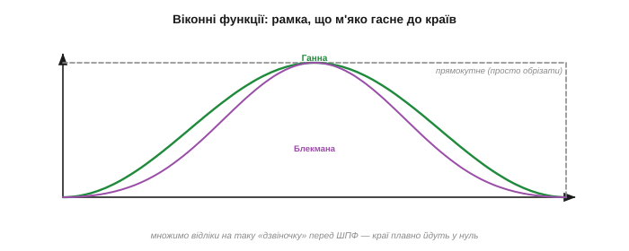
*Рис. 31.6.3. Віконні функції. Прямокутне «вікно» (сіре) — це просто обрізати, з різкими стінками. Вікно **Ганна** (зелене) — плавна дзвіночка, що гасне до нуля на краях; **Блекмана** (фіолетове) — ще плавніша. Помноживши відліки на таку криву, ми прибираємо різкий обрив — а з ним і головну причину витоку.*

Накладання вікна — це буквально поелементне множення масиву відліків на масив вагів вікна, один рядок коду перед викликом ШПФ:

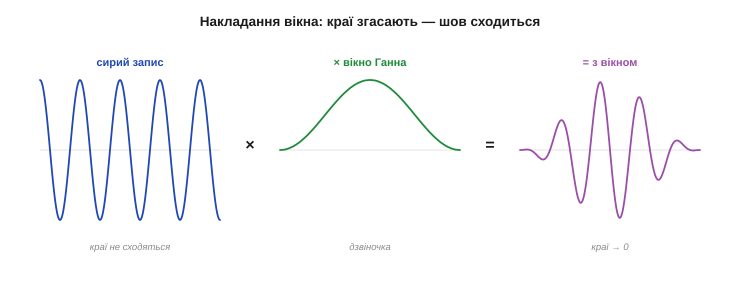
*Рис. 31.6.4. Як це працює. Сирий запис (ліворуч) має краї, що не сходяться на шві. Множимо його поелементно на вікно-дзвіночку (посередині) — і дістаємо запис (праворуч), чиї краї плавно згасли до нуля. Тепер при «склеюванні» кінця з початком стрибка немає, тож і витоку майже немає.*

Найпопулярніше вікно загального призначення зветься **вікном Ганна** (*Hann*, на честь Юліуса фон Ганна) — проста припіднята косинусоїда. Поруч живуть **Геммінга** (*Hamming*), **Блекмана** (*Blackman*) та інші, що різняться формою згасання. Усі вони роблять те саме: міняють різкий обрив на плавний.

Підкреслімо: вікно **не змінює** частот сигналу — воно лише міняє, наскільки **чисто** вони показані. Та сама синусоїда з вікном і без нього має ту саму частоту; різниця тільки в тому, розмазаний її пік чи охайний. Вікно Ганна — це проста «припіднята косинусоїда»: половина мінус половина косинуса, що плавно йде від нуля скраю до одиниці посередині. Жодної магії — звичайна гладка вага, що пригашує краї й тим прибирає штучний стрибок, який ми ж самі й створили обрізанням. До того ж рахувати вікно щоразу не треба: його `N` вагів обчислюють **раз** і зберігають таблицею, а далі лише множать — копійчана операція навіть для найслабшого мікроконтролера.

> 🔧 **Навіщо це.** Практичне правило: **майже завжди накладайте вікно перед ШПФ**, і за замовчуванням беріть **Ганна** — це поелементне множення масиву на готову криву (у CMSIS-DSP і `arduinoFFT` вона вже є). Без вікна ваш спектр буде «брудним» від витоку, а слабкі тони потонуть у спідницях сильних. Один рядок множення — і піки стають чистими. Не накладати вікно варто лише свідомо: коли тон гарантовано вкладається ціло або коли ви ловите короткий **транзієнт**.

### Компроміс: витік проти роздільності

Та вікно — не безплатне. Згладжуючи краї, воно **звужує** ефективну довжину запису, а тому **розширює** головний пік: одна частота тепер займає не один бін, а кілька. Маємо знайому оборудку: вікно **глушить витік** (опускає спідниці), але **погіршує роздільність** (розширює пік). Різні вікна — це різні точки цього компромісу.

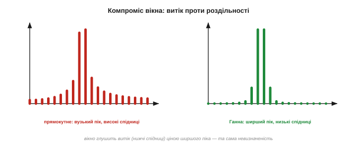
*Рис. 31.6.5. Компроміс вікна. Прямокутне (ліворуч) дає **найвужчий** головний пік, але **високі** спідниці (сильний витік). Вікно Ганна (праворуч) — **низькі** спідниці (витік приборкано), та **ширший** пік. Не можна мати водночас і гострий пік, і низькі спідниці: це та сама невизначеність, що й роздільність↔затримка (§30.5, §31.4).*

Упізнаєте? Це знову той самий **принцип невизначеності**, що керував і компромісом згладжування↔затримки (§30.5), і роздільністю спектра (§31.4): за гостроту в одному вимірі завжди платиш розмитістю в іншому. Прямокутне вікно — це «гострий пік ціною витоку», важкі вікна — «чистий спектр ціною розмитого піка». Вибір залежить від того, що вам дорожче.

Корисно знати порядок цифр. У прямокутного вікна перша спідниця лежить лише на ~13 дБ нижче піка — витік великий; у вікна Ганна вже близько −31 дБ, у Блекмана — біля −58 дБ. Тобто важче вікно опускає спідниці в десятки й сотні разів. Платою ж за це є ширший головний пік: у Ганна він приблизно вдвічі ширший за прямокутний, у Блекмана — ще ширший. Ось чому «найчистіше» вікно — не завжди «найкраще»: якщо тони близькі, ширший пік їх просто зіллє в один.

### Який вікно коли

Звідси й проста шпаргалка з вибору вікна під задачу.

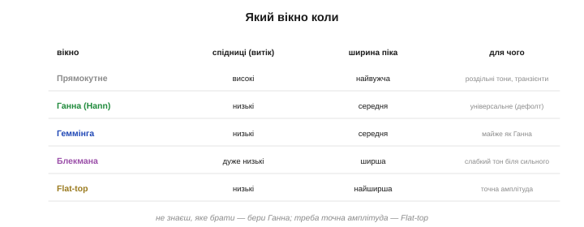
*Рис. 31.6.6. Вікно під задачу. Прямокутне — найвужчий пік, але сильний витік: для роздільних рівних тонів і транзієнтів. Ганна — золота середина, універсальне за замовчуванням. Блекмана — дуже низькі спідниці: щоб розгледіти слабкий тон біля сильного. Flat-top — найширший пік, зате точна висота: для вимірювання амплітуди.*

- **Прямокутне** (без вікна): найвужчий пік, найбільший витік. Беруть, коли тони рівні й добре роздільні, або для коротких транзієнтів.
- **Ганна** — універсальний вибір за замовчуванням: добрий баланс між витоком і роздільністю.
- **Блекмана** — дуже низькі спідниці: коли треба розгледіти **слабкий** тон поряд із сильним і не дати йому потонути у спідницях.
- **Flat-top** — найширший пік, зате найточніша **висота**: коли важливо виміряти саме **амплітуду** тону, а не його частоту.

На практиці типовий робочий цикл такий: наклав Ганна, порахував ШПФ, глянув на спектр. Якщо слабкий тон ховається у спідницях сусіда — перейшов на Блекмана; якщо треба точна висота піка — на Flat-top; якщо два тони майже злилися — навпаки, полегшив вікно ближче до прямокутного. Ще один прийом для гладшої картинки — **усереднити** кілька спектрів поспіль: випадкові спідниці шуму осідають, а стійкі піки лишаються. Та початок майже завжди один — Ганна.

І ще про показ: щоб спектр виглядав гладшим, його часто **доповнюють нулями** (§31.4) перед ШПФ — це не додає справжньої роздільності, лише густіше «промальовує» ту саму форму, роблячи горбики плавнішими на око. Корисно для гарної картинки, але пам'ятайте: нулі не створюють нової інформації, тільки інтерполюють наявну.

**Приклад (тон між бінами).** Давач дає тон 8.5 біна — рівно між двома частотними бінами. Прямим ШПФ без вікна ви побачите два майже однакові «розмиті» піки на 8 і 9 бінах та довгі спідниці навсібіч — легко прийняти за два різні тони. Наклавши вікно Ганна, дістанете **один** охайний горбик по центру (між 8 і 9) із приборканими спідницями — одразу видно, що тон один і він десь посередині. Той самий сигнал, та сама ШПФ — лише один рядок множення на вікно перетворив кашу на читабельну картинку.

> 🔧 **Навіщо це.** Якщо вам треба точно виміряти **амплітуду** тону (наскільки він гучний), беріть **Flat-top**: його широкий пласкуватий пік дає правильну висоту незалежно від того, чи вклався тон у бін. А якщо важливіше точно знайти **частоту** чи розділити близькі тони — вузький пік дають легкі вікна (прямокутне, Ганна). Спершу спитайте, що вимірюєте — амплітуду чи частоту, — і це підкаже вікно.

> 🔧 **Навіщо це.** Витік пояснює дві загадки, що лякають новачка. Перша: **ширина піка** з §31.3 — це і є витік від скінченного вікна, а не «дефект». Друга: **примарні частоти** — піки там, де нічого немає, — часто лише спідниці витоку від сильного тону, а не реальні складові. Побачили підозрілий «частокіл» навколо сильного піка — перевірте, чи це не витік: накладіть важче вікно, і якщо «примари» осіли, то винен був він.

Зведімо два уроки про скінченність докупи. Те, що ми зміряли лише **обмежений** шматок сигналу, б'є по спектру з двох боків: скінченна **тривалість** запису обмежує роздільність (`Δf = fs/N`, §31.4), а скінченне **обрізання** країв породжує витік (§31.6). Обидва — наслідки того самого: ми не маємо сигналу «назавжди», лише його уривок. Вікна борються з другою бідою, довший запис — із першою; а разом вони роблять спектр настільки чесним, наскільки дозволяє наш скінченний погляд на сигнал.

Отже, інструмент зібрано повністю: ми вміємо перейти в частотну область (§31.1–31.2), прочитати спектр (§31.3), порахувати його (§31.4) швидко (§31.5) і чисто, без витоку (§31.6). Лишилося звести все докупи й відповісти на головне практичне питання: **навіщо** інженерові-вбудовнику весь цей апарат — у яких реальних задачах частотна область рятує там, де часова безсила. Це — остання тема розділу.

---

## 31.7 Навіщо частотна область

Ми пройшли довгий шлях: дві мови сигналу (§31.1), зухвала ідея Фур'є (§31.2), читання спектра (§31.3), його обчислення (§31.4), миттєве завдяки ШПФ (§31.5) і чисте завдяки вікнам (§31.6). Інструмент зібрано. Лишилося відповісти на найпрактичніше — **навіщо** він вам у реальному пристрої. Ця тема — не нова теорія, а **карта застосувань**: п'ять класів задач, де частотна область робить просте те, що в часі майже неможливе. Саме заради них варто було вчити все попереднє.

### Що дає частотна область: розплутати змішане

Уся сила другої мови — в одному реченні: **частота розділяє те, що час змішує**. У часі всі коливання звалені в одну тремтливу лінію; у частоті кожне сидить на своєму місці, окремо від інших. Звідси й випливають усі застосування — щойно вам треба **виокремити**, **впізнати** чи **прибрати** щось за його частотою, ви переходите в спектр.

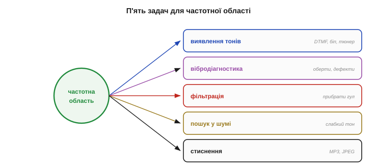
*Рис. 31.7.1. П'ять задач для частотної області. З однієї здатності «розділяти за частотою» виростає все: **виявлення тонів** (знайти сигнал за його частотою), **вібродіагностика** (почути машину за обертами), **фільтрація** (чисто прибрати гул), **пошук у шумі** (витягти слабкий тон) і **стиснення** (лишити головні частоти). Усі вони — про те саме: розплутати змішане в часі.*

Пройдімося цими п'ятьма задачами — і ви впізнаєте в них чи не половину реальних застосувань давачів.

Аналогія, що добре лягає: вухо чує акорд як єдиний звук, а нотний запис показує окремі ноти; призма розкладає біле світло на кольори, яких у ньому «не видно». Частотна область — така сама призма для сигналу: вона бере злиту в часі суміш і **розкладає** її на чисті складові, кожну окремо. А коли складові лежать нарізно, з ними легко працювати — впізнати, зміряти, прибрати. Усе подальше — лише різні способи скористатися цим розкладом.

Варто й повторити думку з §31.1: спектр — це **друге око** інженера. Багато задач, безнадійних на осцилографі, у спектрі стають очевидними, бо те, що в часі зливається в кашу, у частоті розкладається по поличках. Опанувавши цей погляд, ви не просто додали ще один інструмент, а навчилися **бачити** в сигналі те, чого раніше не помічали зовсім.

### Знайти й упізнати тон

Найпряміша задача: у сигналі є (чи нема) коливання **певної** частоти — як це виявити? У часі — ніяк надійно; у частоті — тривіально: рахуєте спектр і дивитеся, чи є пік на потрібній частоті. Класичний приклад — **тонові сигнали телефонної клавіатури** (DTMF): кожна кнопка звучить **двома** тонами водночас, і приймач упізнає цифру, побачивши в спектрі рівно цю пару піків. Конкретно: вісім частот DTMF розбито на дві групи — «рядкову» й «стовпцеву», — і кожна кнопка бере по одній з кожної (наприклад, «5» — це 770 і 1336 Гц). Приймачеві лишається перевірити, які дві з восьми частот зараз сильні, — і цифра впізнана. Жодного аналізу форми хвилі, лише вісім перевірок піків: проста й надійна схема, що є прямою заслугою частотного погляду.

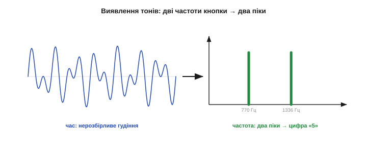
*Рис. 31.7.2. Упізнати сигнал за частотою. Натиснута кнопка телефону звучить сумішшю двох тонів — у часі це нерозбірливе гудіння. У спектрі ж проступають рівно **два піки**, і за їхніми частотами однозначно читається, яку саме цифру натиснули. Так само ловлять сигнал тривоги, свисток, заданий «біп» чи висоту ноти в тюнері.*

Цей самий прийом працює всюди, де треба **впізнати сигнал за його частотним підписом**: виявити заданий «біп» серед шуму, зловити сигнал тривоги, визначити висоту ноти в гітарному тюнері, розпізнати тон виклику. Скрізь рецепт один: ШПФ → знайти пік → його частота `k·fs/N` (§31.4) і є відповідь.

Чому виявлення в частоті таке надійне? Бо тон лишається тоном **незалежно** від дрібниць, що збивають часові методи: коли він почався, з якою фазою, наскільки гучний, скільки навколо шуму — пік у спектрі однаково стане на своє місце за частотою. Зіставляти ж форму хвилі в часі куди крихкіше: той самий тон, зсунутий по фазі чи притишений, виглядає геть інакше. Частота дивиться в **суть** коливання, а не в його миттєвий вигляд, — тому й розпізнавання за спектром таке стійке до перешкод.

> 🔧 **Навіщо це.** Готовий рецепт виявлення тону на МК: зібрати буфер відліків → накласти вікно (§31.6) → ШПФ → знайти **найвищий пік** у потрібній смузі → його частота `f = k·fs/N`. Якщо пік вищий за поріг — тон є; нема — нема. Кілька рядків, і мікроконтролер «чує» задану частоту крізь шум. Для **однієї** частоти навіть ШПФ не потрібне — досить дешевого вибіркового детектора (алгоритм Ґерцеля, §31.4).

### Почути машину: вібрація й оберти

Друга велика галузь — **вібродіагностика**. Будь-яка машина, що крутиться, вібрує, і ця вібрація — періодичний сигнал, чий спектр прямо каже про стан механізму. Основний пік стоїть на **частоті обертання**, а її гармоніки й бічні піки виказують дисбаланс, знос, дефекти підшипника чи зубів шестерні — кожна біда має **свою** характерну частоту.

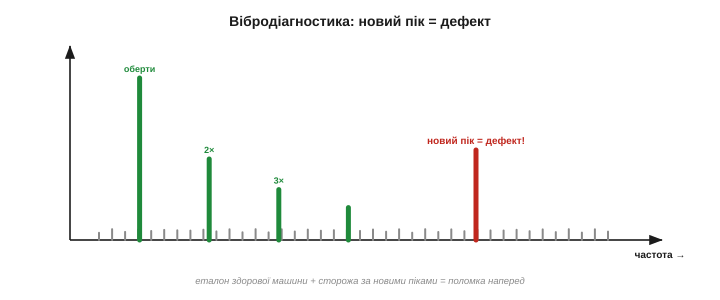
*Рис. 31.7.3. Машина «звучить» у спектрі. Здорова машина (зелене) дає пік на частоті обертання та її гармоніки. Поява **нового піка** на характерній частоті (червоне) — підпис дефекту: розбалансу, зносу, тріщини в підшипнику. Стежачи за спектром вібрації, несправність ловлять **задовго** до поломки — це й є передбачувальне обслуговування.*

У цьому вся ідея **передбачувального обслуговування**: знявши «здоровий» спектр як еталон, ви далі лише стежите, чи не виріс новий пік. Дефект підшипника проявляється в спектрі за тижні до того, як його почує вухо чи відчує рука, — і копійчаний акселерометр із ШПФ на мікроконтролері перетворюється на сторожа, що попереджає про поломку наперед.

Краса методу в тому, що кожна несправність має **свою адресу** на осі частот. Розбаланс кричить на самій частоті обертання (1× оберти); розхитаність — на її цілих гармоніках; дефект підшипника — на власних, не-цілих частотах, що рахуються з його геометрії; знос зубів шестерні — на частоті зачеплення. Тому досвідчений діагност, глянувши, **де** виріс пік, одразу називає винуватця, не розбираючи машину. На цьому стоїть ціла індустрія промислового моніторингу — і та сама фізика вкладається в дешевий давач з ШПФ.

### Чисто прибрати заваду: фільтрація в частоті

Третя задача — **фільтрація**, і тут частотна область показує себе найефектніше. Згадаймо §31.1: мережевий гул 50 Гц, що в часі нерозривно злитий із корисним сигналом. У частоті ж він — окремий гострий пік, який можна просто **витерти**: перейти в спектр, занулити бін на 50 Гц, повернутися назад — і гул зник, а решта сигналу ціла.

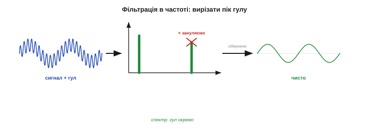
*Рис. 31.7.4. Різати там, де видно. Сигнал із гулом 50 Гц (ліворуч) → спектр, де гул — окремий пік → **зануляємо** саме його (ножиці) → обернене перетворення → чистий сигнал (праворуч). Те, що в часі нероздільне, у частоті вирізається одним рухом. Саме на цій ідеї «формування спектра» й стоять цифрові фільтри наступного розділу.*

Це і є суть **частотної фільтрації**: прибрати чи підкреслити складові за їхньою частотою, бо там вони лежать **окремо**. Так розділяють сигнал і шум, що перекриваються в часі, але різняться за частотою; так виділяють потрібну смугу; так чистять зв'язок. І саме звідси прямий міст у **Розділ 32**: цифровий фільтр — це, по суті, **«формувач спектра»**, що підсилює одні частоти й гасить інші, тільки робить це ефективно, не рахуючи щоразу повне ШПФ.

Найцінніший випадок — коли сигнал і завада **перекриваються в часі, але різняться за частотою**. У часі їх не розчепити жодним згладжувачем: вони звучать одночасно, і фільтр розмив би й корисне разом із завадою. А в частоті вони стоять нарізно, тож заваду вирізають, не торкнувшись сигналу. Так знімають м'язову наводку з електрокардіограми, мережевий гул — зі звуку, повільний дрейф основи — з оптичного сигналу. Це той клас задач, де часова область пасує, а частотна б'є точно в ціль.

### Витягти слабке з шуму

Четверта задача — **пошук слабкого сигналу в шумі**, і ми вже бачили її чудо в §31.1: періодичний тон, тихіший за шум і геть невидимий у часі, у спектрі **збирається в пік** над розмазаним по всіх частотах шумовим килимом. Частота буквально витягує голку з копиці.

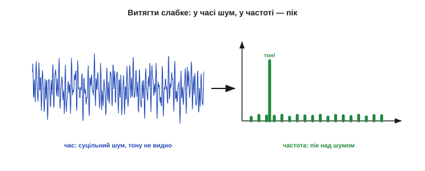
*Рис. 31.7.5. Видобути сховане. Ліворуч — сигнал у часі: суцільний шум, корисного тону не видно зовсім. Праворуч — спектр: тон зібрав свою енергію в один пік і піднявся над шумовою підлогою. Так радіо ловить слабку несучу, сонар — далеке відлуння, а пульсоксиметр — серцебиття в зашумленому сигналі.*

На цьому стоять цілі технології: радіоприймач виловлює несучу, слабшу за ефірний шум; сонар чує далеке відлуння; медичний пульсоксиметр витягує серцевий ритм із тремтливого оптичного сигналу; астрономи знаходять періодичність зорі в шумі. Скрізь та сама магія: **корисне купчиться в пік, шум розповзається** — і відношення сигнал/шум у частоті виграє там, де в часі програвало.

За цим виграшем стоїть проста механіка. Чистий тон на всьому записі коливається **злагоджено**, тож його внески від усіх відліків додаються **в лад**, і пік росте пропорційно довжині запису `N`. Шум же на кожному відліку випадковий, його внески частково гасять одне одного й накопичуються лише як `√N`. Тому що **довший** запис, то вище тон підноситься над шумом — рівно та сама `√N`-перевага, що й при усередненні (§30.2), тільки тепер вибірково для кожної частоти. Хочете витягти слабший тон — міряйте довше.

П'ята задача — **стиснення** — рідша на мікроконтролері, та варта згадки, бо вона геніально проста в частотній мові. Сигнал зазвичай має кілька **сильних** частот і безліч слабких чи нечутних; лишивши перші й відкинувши другі, дістаємо компактний опис, з якого «страва» відновлюється майже без утрат. Саме так влаштовані MP3 (звук) і JPEG (зображення): вони переходять у частоту, викидають те, чого вухо чи око не помітить, і зберігають лише суттєве. Розклад на незалежні частоти й дає змогу так чисто відділити важливе від зайвого.

Усі п'ять задач — виявлення, діагностика, фільтрація, видобування, стиснення — попри несхожість, дзеркалять одну здатність: бачити сигнал як **набір незалежних частот**. Опанувавши її, ви дивитеся на світ сигналів інакше, ніж раніше.

### Коли частота, а коли час

Та частотна область — не молоток на всі цвяхи, і зрілість інженера в тому, щоб знати її **межі**. Спектр чудовий для питань «**які** тони», «**який** період», «**де** гул» — і безсилий для питання «**коли** це сталося»: розклавши запис, він втрачає прив'язку до моменту (§31.3). Для таймінгу подій, різких транзієнтів, «коли спрацював» — лишайтеся в часі.

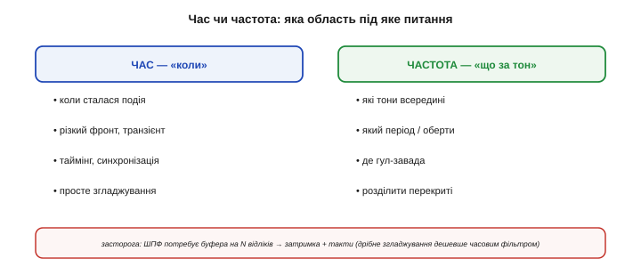
*Рис. 31.7.6. Дві області — два кола задач. ЧАС: коли сталася подія, різкий фронт, таймінг, просте згладжування. ЧАСТОТА: які тони, який період, де гул, розділити перекриті сигнали. І засторога: ШПФ потребує **буфера на N відліків**, тож вносить затримку й коштує тактів — для дрібного згладжування часовий фільтр (Розділ 30) часто дешевший.*

Є і практична ціна. ШПФ не безплатне: воно потребує **назбирати буфер** на `N` відліків, перш ніж видати спектр, — а це вже **затримка** (як у §30.5), плюс самі обчислення й пам'ять. Тому для простого згладжування дешевше взяти часовий фільтр (Розділ 30), а ШПФ берегти для задач, де треба саме **частотна** картина. Правило те саме, що в §31.1: спершу спитайте, що хочете дізнатися, — і це підкаже область.

А коли потрібні **обидві** відповіді — і які тони, і коли вони звучали, — є компроміс: рахувати короткі ШПФ над послідовними шматочками сигналу й складати їх у **спектрограму**, спектр, що міняється в часі. Так дивляться на мову, музику, змінний шум двигуна. Спектрограма — визнання, що жодна мова не повна сама по собі: іноді найрозумніше тримати очі на обох берегах одразу, платячи за це і пам'яттю, і обчисленнями.

**Приклад (висота ноти за п'ять кроків).** Гітарний тюнер має сказати, яку ноту торкнули:

```
1) зібрати N=1024 відліки з мікрофона (fs=8000 Гц)
2) накласти вікно Ганна (§31.6)
3) ШПФ → спектр (§31.5)
4) знайти найвищий пік, бін k
5) частота ноти f = k·fs/N = k·8000/1024 ≈ k·7.8 Гц
   напр. пік на k=42 → f ≈ 328 Гц → нота «мі» (E4)
```

П'ять кроків, готова бібліотека ШПФ — і копійчаний мікроконтролер визначає висоту звуку. Уся теорія розділу згорнулася в маленьку корисну програму.

І це не вузька екзотика. На звичайному ESP32 чи STM32 ентузіасти роблять і кольорові «візуалізатори» музики (смужки спектра на світлодіодах), і визначники акордів, і детектори свистка для керування, і монітори вібрації моторів — усе на тому самому виклику ШПФ із готової бібліотеки. Частотна область давно перестала бути привілеєм великих лабораторій: вона лежить у вас на столі, у копійчаному мікроконтролері.

> 🔧 **Навіщо це.** Перш ніж тягтися по ШПФ, спитайте: моє питання справді про **частоти**? Якщо так (тони, оберти, гул, прихована періодика) — частотна область безцінна. Якщо ж про **час** (коли, як швидко, наскільки гладко) — лишайтеся в часі, де дешевше й без затримки буфера. ШПФ — потужний, але не безплатний інструмент; беріть його тоді, коли питання саме частотне.

> 🔧 **Навіщо це.** Найчастіший практичний ужиток частотної області на МК — **фільтрація**: прибрати гул, виділити смугу, відокремити сигнал від шуму за частотою. Але робити це через повне ШПФ туди-назад на кожен відлік невигідно. Тому на практиці спектр **формують** інакше — спеціальними цифровими фільтрами, що дають той самий ефект дешево й у реальному часі. Саме вони — тема наступного розділу.

Отже, ми не лише навчилися бачити сигнал у частоті, а й зрозуміли, **навіщо**: щоб знаходити тони, чути машини, чистити завади, видобувати слабке з шуму. І найчастіша з цих задач — фільтрація — підводить нас до наступного кроку. Ми бачили, що в частотній області заваду можна просто «вирізати»; та робити це через повне перетворення туди-назад на кожен відлік — задорого для мікроконтролера. Розумніший шлях — **формувати спектр** прямо в часі, спеціальними цифровими фільтрами, що підсилюють одні частоти й гасять інші дешево й миттєво. До того ж частотне мислення не залишить нас і далі: воно ще знадобиться, коли ми зливатимемо дані інерціальних давачів (комплементарний фільтр у Розділі 34 — це теж розподіл за частотами) і коли налаштовуватимемо регулятори. Тож вкладене в цей розділ окупиться ще не раз. Як вони влаштовані — КІХ і БІХ, низькі, високі та смугові, — і як реалізувати їх на МК, ми й розберемо далі, де частотне мислення цього розділу нарешті почне приносити щоденні практичні плоди.

> ▶️ Далі: [Розділ 32 — Цифрові фільтри в мікроконтролері](../ch32-digital-filters-mcu/ch32-digital-filters-mcu.md)
