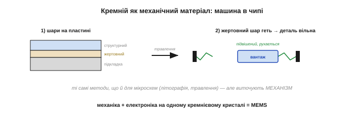
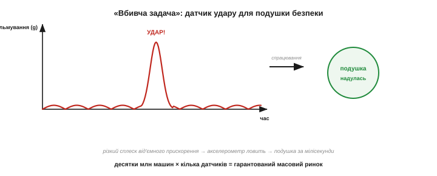
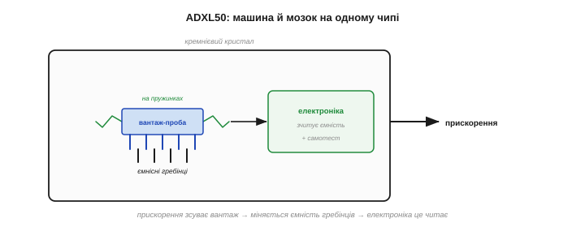
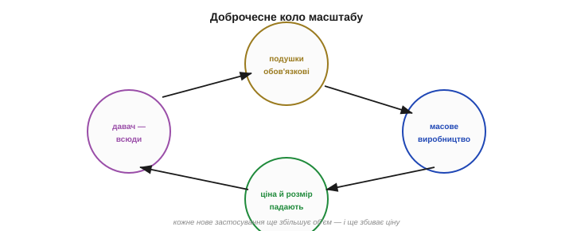
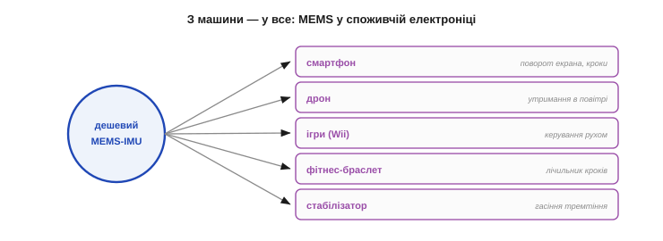
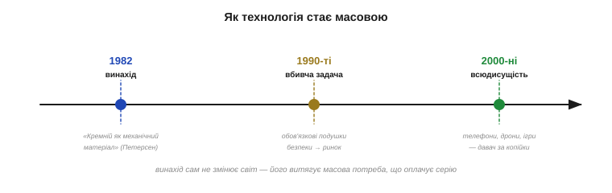

# 📜 Історія до Розділу 33 — як подушка безпеки зробила акселерометр копійчаним

> Це історична вставка до [Розділу 33 «Інерціальні давачі: MEMS»](ch33-imu-mems.md). Розділ — про крихітні кремнієві давачі руху, що сидять у вашому телефоні, дроні, ігровому пульті й фітнес-браслеті. Сьогодні акселерометр коштує копійки й менший за зернину — та було не завжди. Десятиліттями давачі прискорення лишалися громіздкими, дорогими приладами для авіації й лабораторій. Що ж зробило їх масовим товаром? Не смартфони — **подушка безпеки**. Закон, що зробив подушки обов'язковими, створив гарантований ринок на мільйони датчиків удару, а той ринок загнав MEMS у масове виробництво й обвалив ціну. Це історія «вбивчої задачі» — і урок про те, як технологія насправді стає всюдисущою.

Візьміть будь-яку плату з акселерометром — модуль за пару доларів із вашого ящика з деталями. У ньому захована **машина**: підвішений на пружинках вантажик, що зсувається від прискорення, плюс електроніка, що цей зсув читає, — усе виточене в кремнії й менше за макове зерно. Те, що така річ коштує копійки й лежить у кожній шухляді, — наслідок дивовижного збігу: технології, що дозріла в лабораторії, і автомобільної катастрофи, якій вона мала запобігти.

---

## Кремній, що навчився рухатися

Уся історія починається з простої, але зухвалої думки: **кремній — це не лише матеріал для електроніки, а й чудовий механічний матеріал**. Кремнієві пластини, з яких роблять мікросхеми, насправді міцні, пружні й майже без утоми — з них можна виточувати не тільки транзистори, а й **рухомі механічні деталі**: балки, мембрани, пружинки, вантажики.

Цю ідею сформулював і зробив програмою цілого напряму американський інженер **Курт Петерсен** (*Kurt Petersen*), що в 1970-х керував дослідницькою групою мікрообробки в IBM. 1982 року він опублікував оглядову статтю «**Кремній як механічний матеріал**» (*Silicon as a Mechanical Material*) — працю, яку вважають точкою народження цілої галузі **MEMS** (*Micro-Electro-Mechanical Systems*, мікроелектромеханічні системи). Петерсена й донині звуть «містером MEMS».

*Рис. 33.0.1. Кремній як механічний матеріал. Тими самими методами, якими роблять мікросхеми (фотолітографія, травлення), у кремнії виточують не схеми, а **рухомі** мікродеталі — балки, пружинки, вантажики. Так народжується «машина в чипі»: механізм і електроніка на одній пластині. Це й є MEMS.*

Геній ідеї — у тому, що рухомі деталі роблять **тими самими** методами, що й мікросхеми: фотолітографія, травлення, нанесення шарів. Тобто вся могутня, відточена десятиліттями індустрія виробництва чипів раптом могла штампувати ще й **механізми** — мільйонами, дешево й однаково. Лишалося знайти механізм, вартий такого масштабу.

Як це робиться технічно? Двома способами. **Об'ємна** мікрообробка витравлює форму вглиб самої пластини, лишаючи, скажімо, тонку мембрану чи балку. **Поверхнева** (саме вона дала акселерометри) нарощує структуру шарами **поверх** пластини, а тоді розчиняє «жертовний» проміжний шар — і деталь, що була приклеєна, раптом **звисає вільно**, готова рухатися. Уявіть, що ви наклеїли пружинку на стіл через шар цукру, а тоді розчинили цукор водою: пружинка лишилась, але тепер вільна. Так у кремнії й народжується підвішений вантажик.

> 🔧 **Навіщо це.** Запам'ятайте слово **MEMS** — воно стоїть у даташиті майже кожного давача руху, що ви візьмете в руки. Воно означає рівно те, що описав Петерсен: крихітну **машину**, зроблену методами мікроелектроніки. Розуміючи, що всередині вашого акселерометра справді сидить механічний вантажик на пружинках, ви куди краще відчуватимете, **чому** він шумить, дрейфує й боїться ударів (про це — весь Розділ 33).

---

## Акселерометр, що нікому не по кишені

Виміряти прискорення вміли й до MEMS — але дорого й громіздко. Класичний акселерометр був **окремим приладом**: масивний вантаж на пружині з тензодатчиками чи п'єзоелементом, точна механіка, ручне складання. Такі давачі коштували десятки, а то й сотні доларів, важили грами-десятки грамів і ставилися хіба туди, де ціна не лякала, — в авіацію, ракети, промислові випробування, наукові установки.

Найвибагливіший їх споживач — **інерціальна навігація**: системи, що без жодного зовнішнього сигналу рахують положення ракети, літака чи підводного човна, інтегруючи показ акселерометрів і гіроскопів. Там точність вирішувала все, а ціна — ні, тож давачі робили прецизійні, важкі й шалено дорогі (тисячі доларів за вузол). Це був світ оборонки й аерокосмосу — остання галузь, де хтось подумав би про давач у дитячій іграшці.

Для **масового** застосування — у кожну машину, не кажучи вже про кожен телефон — це не годилося. Уявити акселерометр у побутовому виробі за таких цін і розмірів ніхто й не брався. Технологія MEMS обіцяла розв'язок — крихітний інтегрований давач за копійки, — але обіцянка лишалася теоретичною, бо бракувало **ринку**, заради якого варто було б вкласти роки й мільйони в доведення капризної мікромеханіки до серійності. Гарна технологія без масової задачі — це, як ми вже бачили з ШПФ (історія Розділу 31), розв'язок, що чекає на свою проблему.

---

## Подушка безпеки: ринок, що все змінив

І проблема знайшлася — точніше, її створив **закон**. У 1980-х автомобільні **подушки безпеки** з дорогої екзотики ставали нормою, а тоді й обов'язком: у США ухвалили вимогу оснастити подушками **всі** нові легковики (для водія й пасажира) до 1998 модельного року. А кожна подушка безпеки потребує одного — **датчика удару**: давача, що за частку секунди впізнає аварію й дасть команду на спрацювання.

Перші датчики удару були **механічні** — на кшталт кульки в трубці, яку утримує магніт чи пружина: різке гальмування зривало кульку, і вона замикала контакт. Такі сенсори були громіздкі, ненадійні й не вміли себе перевіряти — а від давача, що тримає життя, вимагали саме надійності й **самоконтролю** (щоб машина знала: сенсор справний, спрацює). MEMS-акселерометр давав усе це в одному крихітному чипі, ще й із вбудованим самотестом, — тому й витіснив механіку майже миттєво.

*Рис. 33.0.2. «Вбивча задача» для акселерометра. При ударі автомобіль за мілісекунди гальмує з величезним від'ємним прискоренням. Акселерометр ловить цей різкий сплеск — і за частку секунди дає команду надути подушку. Мільйони машин × дві подушки = гарантований ринок на десятки мільйонів давачів щороку. Саме він і витягнув MEMS у серію.*

Порахуйте масштаб: десятки мільйонів нових машин на рік, у кожній — кілька датчиків удару. Це **гарантований ринок** на десятки мільйонів акселерометрів щороку, та ще й із залізною вимогою низької ціни (бо в машині рахують кожен долар) і високої надійності (бо від давача залежить життя). Саме такого замовлення й бракувало MEMS, щоб із лабораторної цяцьки стати індустрією. Подушка безпеки виявилася **«вбивчою задачею»** (*killer application*) — тією єдиною масовою потребою, заради якої варто було довести технологію до серії.

> 🔧 **Навіщо це.** Той копійчаний акселерометр у вашому проєкті — нащадок **автомобільного** датчика удару, спроєктованого рятувати життя. Звідси дві приємні спадщини: він **дешевий** (бо випускається мільйонами для авто) і **надійний** (бо мусив витримувати вимоги безпеки). Ви, по суті, безплатно дістаєте давач автомобільного класу за ціною іграшки — рідкісний випадок, коли сувора галузь працює на вас.

---

## ADXL50: машина й мозок на одному чипі

Першою компанією, що перетворила обіцянку на продукт, стала **Analog Devices**. 1991 року вона оголосила, а 1993-го запустила в серію **ADXL50** — перший у світі **серійний поверхнево-мікрооброблений акселерометр**, що вмістив і механіку, і електроніку на **одному** крихітному кремнієвому кристалі.

*Рис. 33.0.3. Як влаштований ADXL50. У центрі — крихітний **вантажик-проба** на кремнієвих пружинках; до нього прикріплені рухомі «гребінці», що ходять між нерухомими. Прискорення зсуває вантажик — змінюється **ємність** між гребінцями, і це зчитує електроніка тут-таки, на тому самому чипі. Уся машина — менша за макове зерно, та ще й сама себе перевіряє (вбудований самотест).*

Принцип лишився той самий, що ми розберемо в §33.2: підвішений вантажик зсувається від прискорення, а зсув міряють **ємнісно** — через гребінчасті електроди, що зближуються й розходяться. Геніальність ADXL50 — в **інтеграції**: уперше і чутливий механізм, і схема, що його читає, жили на одному кристалі, та ще й із самотестом. Коштував він близько **5 доларів** — копійки проти попередніх рішень — і саме за таку ціну подушки безпеки могли його прийняти. (Технічна деталь: датчик удару міряє величезні прискорення — десятки g, бо аварійне гальмування лютіше за будь-який звичайний рух; звичайний же побутовий акселерометр налаштований на одиниці g.) Десятиліття «технічних боїв» із фізикою, травленням і корпусуванням нарешті дали серійний продукт.

Найважчим був саме **шлюб механіки з електронікою на одному кристалі**. Зробити окремо мікромеханіку чи окремо схему вміли; а виростити їх разом, не зіпсувавши делікатний рухомий вантажик гарячими етапами виготовлення транзисторів, — задача на роки. Analog Devices розв'язала її власним процесом (його назвали iMEMS), і саме ця інтеграція дала і дешевизну (один чип замість двох), і завадостійкість (слабкий сигнал зчитується поряд, не встигнувши зашуміти). Конкуренти ще довго наздоганяли цей трюк.

---

## Ефект масштабу: ціна падає, давач їде всюди

Далі ввімкнувся **ефект масштабу** — той самий доброчесний цикл, що здешевлює будь-яку масову електроніку. Гарантований автомобільний ринок дав об'єми; об'єми відточили виробництво й розмазали витрати на розробку по мільйонах штук; ціна впала ще; а дешевий, перевірений давач раптом став цікавим **поза** автомобілем.

*Рис. 33.0.4. Доброчесне коло масштабу. Обов'язкові подушки безпеки дали гарантований ринок → масове виробництво → падіння ціни й розміру → і ось той самий копійчаний давач уже придатний не лише для авто. Що дешевший і менший він ставав, то в більше виробів його запихали — і кожне нове застосування ще збивало ціну. Так автомобільна деталь стала універсальною.*

Це ключовий момент усієї історії: **не телефон зробив акселерометр дешевим — дешевий акселерометр зробив можливими «розумні» телефони**. Спершу подушка безпеки оплатила доведення технології й масштаб, обваливши ціну й розмір; а вже потім цей готовий копійчаний давач інженери почали вставляти геть усюди. Технологію витягла **автівка**, а пожинати плоди стала вся електроніка.

Сьогодні масштаб годі й уявити: MEMS-давачів випускають **мільярдами** на рік, а ціна найпростіших впала **нижче долара**. Те, що колись було прецизійним вузлом за тисячі, тепер — копійчаний компонент, який не шкода поставити навіть у одноразовий гаджет. Доброчесне коло «об'єм → дешевизна → нові застосування → ще більший об'єм» розкрутилося на повну.

---

## Від машини до кишені: Wii та iPhone

Прорив у широкий світ стався в середині 2000-х. 2006 року Nintendo випустила приставку **Wii**, чий пульт махали в повітрі, — а ловив ці рухи саме триосьовий MEMS-акселерометр (копійчаний давач завбільшки з ґудзик). 2007-го вийшов **iPhone**, що сам перевертав зображення, коли ви крутили телефон, — знову завдяки MEMS-акселерометру. Раптом давач руху опинився **в кишені** в сотень мільйонів людей.

Кожен із цих виробів **відкрив свій світ**. Wii перевернула уявлення про ігри, ввівши керування рухом тіла. iPhone задав шаблон, за яким акселерометр (а далі й гіроскоп) став обов'язковим органом **кожного** смартфона — для повороту екрана, крокоміра, ігор, доповненої реальності. А коли давачі стали зовсім дешеві й точні, на них зросла ще одна галузь — **мультикоптери**: без швидкого IMU дрон просто не втримався б у повітрі (про це — Розділ 34). Те, що дала автівка, розквітло і в кишені, і в небі.

*Рис. 33.0.5. З машини — у все. Здешевлений подушками безпеки MEMS-давач хлинув у споживчу електроніку: ігрові пульти (Wii, 2006), смартфони (iPhone, 2007), згодом — дрони, фітнес-браслети, камери-стабілізатори. До акселерометра додали MEMS-**гіроскоп** (його ринок дала автомобільна система стабілізації) і **магнітометр** — і вийшов повний дев'ятиосьовий IMU в одному корпусі за пару доларів.*

Слідом за акселерометром у кремній перенесли **гіроскоп** (давач обертання на ефекті Коріоліса, §33.3) — і йому теж дала ринок автівка, цього разу система курсової стійкості (ESC). А далі акселерометр, гіроскоп і магнітометр зібрали в один корпус — **дев'ятиосьовий IMU**, що ви тримаєте в руках. Свою роль тут зіграли вже кілька гравців — **Analog Devices** (її чип ADXL330 стояв у самому пульті Wii), італійсько-французька **STMicroelectronics** (чий інженер **Бенедетто Вінья**, *Benedetto Vigna*, проштовхнув MEMS у масовий споживчий продукт і дав акселерометр для нунчака Wii), німецький **Bosch**, **InvenSense**. Те, що починалося як датчик удару, стало універсальним «органом чуття руху» для всієї електроніки.

Цікаво, що гіроскоп пройшов **той самий** шлях, що й акселерометр, лише з іншою «вбивчою задачею»: масовий ринок MEMS-гіроскопам дала автомобільна **система курсової стійкості** (ESC), яку теж зробили обов'язковою. Знову регуляторна вимога безпеки створила гарантований попит на мільйони давачів — і знову це обвалило ціну й розмір, відкривши гіроскоп для дронів, стедікамів і телефонів. Дві ключові деталі IMU подешевшали з тієї самої причини — заради безпеки на дорозі.

> 🔧 **Навіщо це.** Купуючи модуль IMU за два долари, ви тримаєте підсумок усього цього шляху: машину Петерсена, доведену до серії автомобільним ринком і вилизану конкуренцією виробників. Тому **не намагайтеся зробити свій акселерометр** — використовуйте готовий: за копійчаною ціною ви отримуєте десятиліття інженерії й автомобільну надійність. Розумний інженер їде на хвилі масштабу, а не воює з мікромеханікою сам.

---

## Урок: технологію робить масовою «вбивча задача»

Зведімо мораль, бо вона повторюється в техніці знову й знову. **Винайти — ще не означає зробити масовим.** Кремнієва мікромеханіка існувала з 1980-х, та лежала б нішевою цікавинкою ще довго, якби не з'явилася **масова задача**, заради якої варто було вкласти роки й мільйони в серію. Для MEMS такою «вбивчою задачею» стала подушка безпеки; вона оплатила масштаб, обвалила ціну — і вже здешевлений давач сам знайшов сотні інших застосувань.

*Рис. 33.0.6. Як технологія стає масовою. Винахід (кремнієва мікромеханіка, 1982) сам собою світу не змінив — він чекав. Його витягла **вбивча задача**: обов'язкові подушки безпеки 1990-х створили ринок, що загнав MEMS у серію й обвалив ціну. І лише тоді, здешевлений, давач хлинув усюди (телефони, дрони, ігри, 2000-ні). Винахід → ринок → всюдисущість — типовий шлях.*

Ви вже бачили цей сюжет — у ШПФ (історія Розділу 31): геніальний алгоритм Ґаусса пролежав непотрібним півтора століття, поки не з'явився комп'ютер, що дав йому масовий сенс. Тут те саме: технологія дозріла раніше, ніж світ дав їй привід масштабуватися. Винахід запалює іскру, але **вогонь розгоряється лише там, де є чому горіти** — масова потреба, що оплачує серію.

Прикладів цього закону повно. Супутникову навігацію GPS змасовив смартфон; літієві акумулятори витягли спершу ноутбуки, а тоді електромобілі; саму мікроелектроніку колись підняла космічна й військова гонка. Щоразу та сама схема: технологія тліє в ніші, аж поки якась масова задача не дає їй ринок — і тоді ціна падає, а застосування множаться лавиною. MEMS — лише особливо яскравий приклад цього всюдисущого механізму.

> 🔧 **Навіщо це.** Практичний висновок для інженера подвійний. По-перше, **ціна й доступність деталі залежать не від її складності, а від того, який масовий ринок її тягне**: те, що випускають мільйонами для авто чи телефонів, дешеве й надійне, хоч би яким хитрим було всередині, — на цьому й будуйте свої проєкти, осідлавши чужий масштаб. По-друге, шукаючи, **чому** саме ця деталь така дешева, ви часто знайдете несподівану «вбивчу задачу» з іншої галузі — і зрозумієте і її сильні боки, і її обмеження.

---

Отже, той непримітний чип у вашому проєкті — підсумок рідкісного збігу: зухвалої ідеї «кремній уміє рухатися», десятиліття інженерних боїв за серію й автомобільної катастрофи, якій він мав запобігти. Тепер, знаючи, **звідки** він узявся й **чому** такий дешевий і всюдисущий, ми готові розібрати, **як** він улаштований і працює: крихітні машини в кремнії, акселерометр, гіроскоп, магнітометр — і чому кожен із них недосконалий настільки, що працювати їм доводиться лише гуртом. Бо за копійчану ціну й мізерний розмір кожен MEMS-давач платить шумом, дрейфом і власними сліпими плямами — і саме розуміння цих вад (та способу їх обійти спільною роботою) і робить інженера здатним витиснути з дешевого чипа надійну орієнтацію. Саме до цього ми й переходимо.

> ↩️ Повернутися до розділу: [Розділ 33 — Інерціальні давачі: MEMS](ch33-imu-mems.md)
