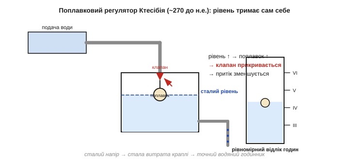
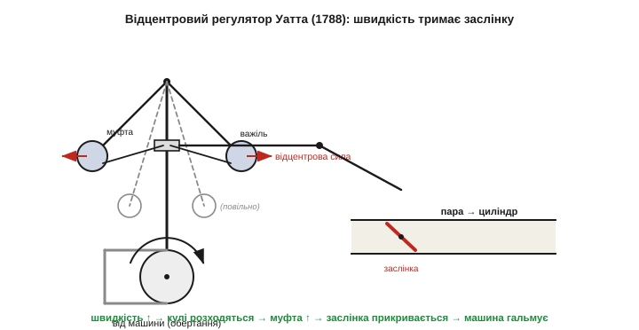
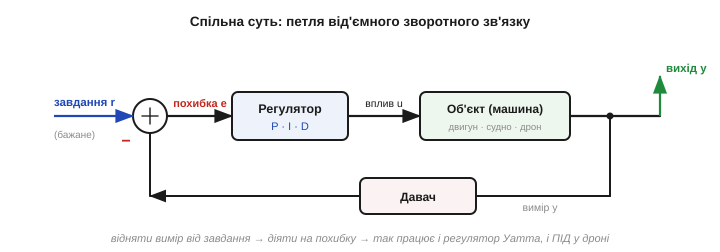
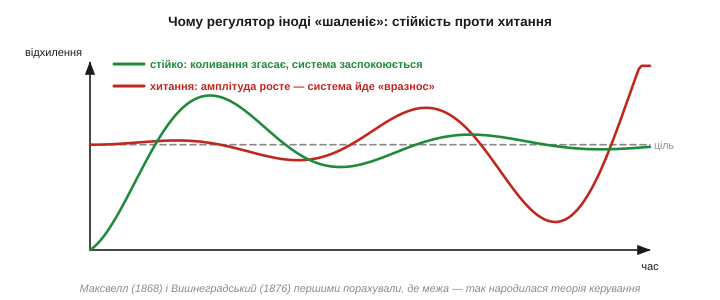
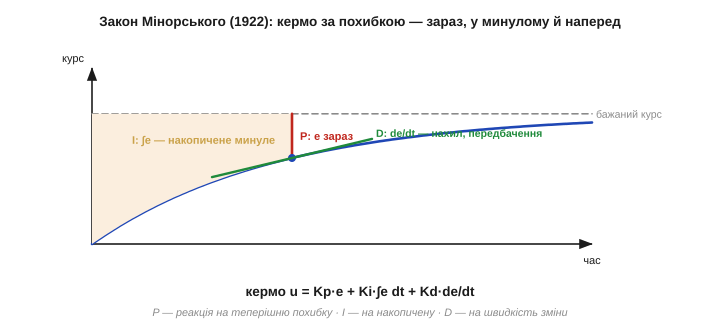
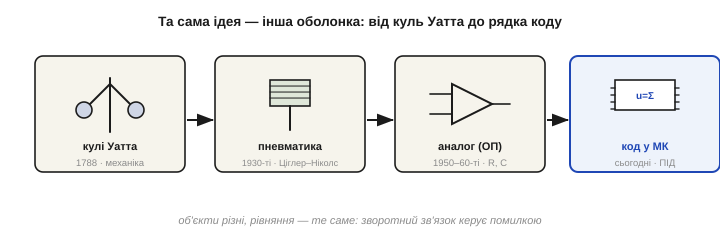

# 📜 Історія до Розділу 5.8 — від відцентрового регулятора Уатта до ПІД: як машини навчилися самі себе тримати

> Це історична вставка до [Розділу 5.8 «Орієнтація й керування зі зворотним зв'язком (ПІД)»](ch34-orientation-pid.md). Розділ — про те, як змусити апарат **тримати** заданий стан: дрон — рівень, судно — курс, піч — температуру. У серці кожного такого вміння лежить одна ідея — **зворотний зв'язок**: виміряй, наскільки ти відхилився від бажаного, і дій рівно проти цього відхилення. Ідея здається очевидною, та люди йшли до неї тисячоліттями — від поплавка у водяному годиннику до трьох рядків коду в польотному контролері. По дорозі машини спершу навчилися тримати рівновагу наосліп, потім — час від часу впадали в безумне «хитання», аж поки математики не порахували, де межа стійкості, а російський інженер-емігрант не записав закон, яким сьогодні керується майже все, що рухається саме. Це історія про те, як з'явилася ціла наука — **теорія керування**.

Озирніться довкола: термостат тримає кімнату теплою, круїз-контроль тримає швидкість, заряджання тримає напругу, а навчальний дрон з вашого ящика тримає горизонт. Усе це — нащадки однієї думки, якій понад дві тисячі років: **машина може сама виправляти власні помилки, якщо дати їй спосіб ці помилки відчути**. Простежмо, як ця думка визрівала — бо саме її ми весь Розділ 5.8 і перетворюватимемо на формулу та код.

---

## Поплавок, що сам тримав рівень: найдавніший зворотний зв'язок

Перший в історії пристрій зі **зворотним зв'язком** не керував ні двигуном, ні судном — він **вимірював час**. У III столітті до н. е. в Александрії грецький винахідник **Ктесібій** (*Ктесібій Александрійський*, *Ctesibius*), якого вважають батьком пневматики, узявся вдосконалити водяний годинник — **клепсидру**. Стара клепсидра була неточна з прикрої причини: вона міряла час за рівнем води, що витікає крізь отвір, але швидкість витікання залежить від **напору** — чим повніша посудина, тим швидше тече. У міру спорожнення годинник сповільнювався, і година зранку виходила не такою, як увечері.

Ктесібій розв'язав це геніально просто. Він поставив між баком і вимірювальною посудиною **проміжний регулятор із поплавком**, що сам тримав у ньому **сталий рівень**. Щойно рівень піднімався, поплавок спливав і **конічним клапаном прикривав** притік згори; щойно рівень падав — поплавок опускався, клапан відкривався, і вода доливалася. Рівень застигав на одній позначці, напір ставав сталим, а отже сталою ставала й **швидкість краплі**, що відмірювала час. Годинник пішов рівно — і це працювало без жодного людського нагляду, **само**.

*Рис. 5.8.0.1. Поплавковий регулятор Ктесібія (≈270 р. до н. е.) — найдавніший відомий зворотний зв'язок. Поплавок «вимірює» рівень і сам керує клапаном притоку: рівень піднявся → поплавок спливає → клапан прикривається → притік падає. Рівень тримається сталим — а з ним і напір, і швидкість краплі, що відмірює час. Жодного нагляду: машина виправляє власне відхилення сама.*

Зверніть увагу на форму цієї думки, бо вона повторюватиметься в усій історії: є **бажаний стан** (певний рівень), є **вимір** цього стану (поплавок), і є **дія**, що штовхає систему **назад** до бажаного (клапан). Це і є зворотний зв'язок — і саме тому, що дія завжди спрямована **проти** відхилення, його звуть **від'ємним**. Якби клапан, навпаки, ширше відкривався від підняття рівня, система розгойдалася б і вийшла з ладу — це був би згубний **додатний** зв'язок.

Після Ктесібія ідея надовго заснула в практичних дрібницях — поплавкові клапани в акведуках, регулятори тиску. Аж близько **1620 року** голландець на англійській службі **Корнеліс Дреббел** (*Cornelis Drebbel*) побудував, мабуть, перший **термостат**: інкубатор-піч, де нагрітий газ розширював стовпчик рідини, той тиснув на заслінку димаря — і піч сама **прикручувала** собі тягу, коли теплішала, та відкривала, коли холонула. Температура трималася сама. Знову та сама петля: виміряй стан, дій проти відхилення.

---

## Млин, що сам тримав жорна: відцентровий маятник до Уатта

Тим часом дозрівав інший, **обертовий** спосіб відчути стан машини — не рівень, а **швидкість обертання**. Якщо на вертикальну вісь, що крутиться, почепити на шарнірах два важкі тягарці, то відцентрова сила розводитиме їх тим ширше, чим швидше крутиться вісь. Виходить простий, але вірний **вимірювач обертів**: кут розходу куль каже, як швидко йде машина. Цю відцентрову, «маятникову» ідею описав ще у XVII столітті нідерландець **Хрістіан Гюйгенс** (*Christiaan Huygens*), а вітряки користувалися такими **кульовими регуляторами** ще за добру сотню років до парової машини — ними тримали сталим **зазор між жорнами**: дужче подув вітер, швидше пішли крила — кулі розійшлися — верхній камінь трохи піднявся, не даючи борошну пригоріти.

Тобто на момент, коли на сцену вийшов Джеймс Уатт, **сам прилад уже існував**. Це важливо запам'ятати: те, що часто звуть «регулятором Уатта», він **не винайшов із нуля** — він зробив дещо тонше і важливіше. Він **переніс** уже відомий млинарський механізм на нову, набагато примхливішу машину — і тим запустив цілу епоху.

---

## Уатт ставить кулі на парову машину (1788)

Парова машина другої половини XVIII століття мала кепську звичку: її швидкість **гуляла**. Навантаження на валу то падало (станок скінчив проходку), то стрибало (взявся новий різець) — і машина то розганялася до небезпечного, то застрягала. Тримати оберти вручну, крутячи паровий кран, було марудно й ненадійно. Шотландський інженер **Джеймс Уатт** (*James Watt*, 1736–1819) разом із компаньйоном **Метью Болтоном** (*Matthew Boulton*) 1788 року приладнав до своєї машини відцентровий **кульовий регулятор** — і доручив йому крутити кран **замість людини**.

Влаштовано це так. Вісь регулятора крутиться **від самої машини** (через пас і шків). Дві кулі на важелях розходяться тим ширше, чим швидша машина; важелі через тяги піднімають **муфту** на осі, а муфта через важіль-коромисло **прикриває парову заслінку**. Виходить замкнене коло: машина розігналася → кулі розійшлися → муфта піднялася → заслінка прикрилася → менше пари → машина **сповільнилася**. Впала швидкість — усе йде назад, заслінка відкривається, пари більше. Машина сама тримає оберти приблизно сталими, хоч би як стрибало навантаження.

*Рис. 5.8.0.2. Відцентровий («кульовий») регулятор Уатта, 1788. Вісь крутиться від машини; зі швидкістю кулі розходяться відцентровою силою, піднімають муфту, а та через важіль прикриває парову заслінку. Швидкість ↑ → кулі розходяться → пари менше → машина гальмує. Той самий млинарський механізм, перенесений на парову машину, став символом цілої епохи саморегулювання.*

Цей блискучий шматок латуні зробився **емблемою всієї промислової доби** — його малювали на дипломах інженерних товариств і ставили як знак того, що машина може бути «розумною». Та насправді в ньому ховалася й перша **тонка вада**, яку ми ще довго розбиратимемо в самому розділі. Регулятор Уатта діє **пропорційно**: чим більше відхилення швидкості, тим сильніше він тисне на заслінку. А в такого «суто пропорційного» закону є прикра властивість — він заспокоюється не на **точно** бажаній швидкості, а трохи збоку від неї: лишається маленький **сталий недобір** (інженери звуть його *droop*, «просідання»). Аби заслінка взагалі трималася частково прикритою, кулям треба стояти трохи розведеними — а отже, машина мусить крутитися трохи **повільніше** за ідеал. Цю ваду усуне лише пізніший винахід — **інтегральна** складова, але до неї ще ціле століття.

> 🔧 **Навіщо це.** Регулятор Уатта — це наочна, мідна, дотикова модель **усього**, що ви робитимете в Розділі 5.8. Перш ніж писати формули, потримайте в голові цю картинку: є щось, що **міряє стан** (кулі), і щось, що **діє проти відхилення** (заслінка), замкнені в кільце. Будь-який ПІД у вашому дроні — це той самий регулятор Уатта, тільки кулі замінив гіроскоп, заслінку — оберти моторів, а латунні важелі — рядки коду. І та сама вада «суто пропорційного» закону — маленький сталий недобір — у вас обов'язково вилізе, тож запам'ятайте її вже зараз.

---

## Коли регулятор шаленіє: Максвелл і Вишнеградський рахують стійкість

Що краще інженери робили парові машини — легші маховики, чутливіші регулятори, менше тертя, — то частіше регулятор замість того, щоб **тримати** швидкість, починав нею **гойдати**: розігнав → перетиснув заслінку → застряг → відпустив заслінку → знову розігнав, і так дедалі сильніше. Машина впадала в ритмічне **«хитання»** (*hunting*), а часом і йшла «вразнос». Парадокс лютив інженерів: ти робиш регулятор **точнішим** — а машина від цього втрачає спокій. Чому?

Відповіді не було, бо ніхто не вмів цю петлю **порахувати**. Зробив це 1868 року шотландський фізик **Джеймс Клерк Максвелл** (*James Clerk Maxwell*, 1831–1879) — той самий, чиї рівняння описують усю електродинаміку. У короткій, але епохальній статті «**Про регулятори**» (*On Governors*, Праці Королівського товариства) він уперше **звів регулятор до рівнянь руху**, лінеаризував їх біля робочої точки і показав: чи буде система спокійною, а чи розгойдається, залежить від **коренів характеристичного рівняння** — від того, чи **згасають** з часом малі збурення. Максвелл фактично описав **від'ємний зворотний зв'язок, стійкість і згасання** мовою математики — і тим заклав наріжний камінь **теорії керування**. (Статтю надовго забули, аж поки 1948 року **Норберт Вінер** не назвав її у своїй «Кібернетиці» першою серйозною працею про механізми зворотного зв'язку.)

*Рис. 5.8.0.3. Те, що Максвелл звів до рівнянь, — ось ця петля. Від завдання r віднімають виміряний давачем вихід; різниця — **похибка** e — годує регулятор; той діє на об'єкт (двигун, судно, дрон); вихід міряється знову й повертається на віднімання. Знак «−» на вході — то і є **від'ємний** зворотний зв'язок. Уся ця глава — про те, що поставити в коробку «Регулятор».*

Майже водночас і **незалежно** від Максвелла ту саму задачу розв'язав російський інженер **Іван Вишнеградський** (*Іван Олексійович Вишнеградський*, 1832–1895). Він подав 1876 року Паризькій академії наук працю «Про загальну теорію регуляторів», а 1877-го опублікував «Про регулятори прямого діяння», де вивів **умови стійкості** парової машини з відцентровим регулятором. Вишнеградський зробив дотепну заміну змінних, звів усе до **кубічного характеристичного рівняння** і побудував наочну **діаграму** (її й досі звуть діаграмою Вишнеградського), на якій видно області спокою й хитання. Це — справжній, документований внесок, і його варто називати точно: робота Вишнеградського стоїть **поряд** із Максвелловою біля витоків теорії автоматичного регулювання, а не в її тіні. (Згодом Вишнеградський став міністром фінансів Російської імперії — рідкісний випадок, коли теоретик керування пішов керувати державним бюджетом.)

Останній штрих доклали математики, що шукали **загальне** правило: коли всі корені рівняння «згасальні», хоч би якого воно було степеня. Англієць **Едвард Раут** (*Edward Routh*) дав таке алгебричне правило 1877 року, а німець **Адольф Гурвіц** (*Adolf Hurwitz*) — у рівноцінній формі 1895-го (звідси **критерій Рауса–Гурвіца**); інженерну ж постановку, що підштовхнула Гурвіца, сформулював і 1893 року вперше опублікував словацький інженер **Аурел Стодола** (*Aurel Stodola*). Відтепер інженер міг **наперед**, на папері, сказати, чи буде його регулятор спокійним — не доводячи реальну машину до «вразносу».

*Рис. 5.8.0.4. Дві долі одного регулятора. Зелена крива — **стійкий** відгук: коливання після збурення згасає, система заспокоюється на цілі. Червона — **хитання**: амплітуда росте, машина йде «вразнос». Максвелл (1868) і Вишнеградський (1876) першими порахували, **де** проходить межа між цими двома сценаріями — і саме на цій межі тримається все, що ви налаштовуватимете в §5.8.10.*

> 🔧 **Навіщо це.** Тут народилася найважливіша істина всього розділу: **зворотний зв'язок може не лише виправляти помилку, а й сам її роздмухувати**. Надто «сильний» чи надто «різкий» регулятор не заспокоює систему, а розгойдує. Коли ваш дрон замість того, щоб завмерти рівно, починає дрібно тремтіти й розхитуватися дедалі сильніше — це і є те саме «хитання», що мучило парові машини, і лікується воно тим самим: послабити реакцію або додати **згасання** (це ми й робитимемо складовою D). Стійкість — не дрібниця, а **головне** питання керування.

---

## Стерновий, що дав ім'я кібернетиці: Мінорський і ПІД (1922)

Усі ці регулятори були **пропорційні** — діяли лише на **теперішню** похибку. А щоб прибрати сталий недобір Уатта й водночас не розгойдати систему, потрібні ще дві складові: пам'ять про **минуле** й здогад про **майбутнє**. Хто звів усі три в один закон — і чому саме на флоті?

Зробив це **Микола Мінорський** (*Nicolas Minorsky*, 1885–1970). Тут варто бути точним щодо особи, бо його часто стисло звуть то «американським», то мало не «радянським» інженером, — а правда складніша й цікавіша. Мінорський народився 1885 року в містечку Корчева Тверської губернії, **в Російській імперії**, закінчив 1914-го Петербурзький технологічний інститут за фахом електромеханіка, служив у російському флоті, винайшов **гірометр** (покажчик кутової швидкості) й викладав гіроскопію в Миколаївській морській академії. У розпал **громадянської війни**, 1918 року, він **емігрував** до США — тікаючи від більшовиків, а не служачи їм, — і влаштувався асистентом до видатного інженера **Чарльза Штайнмеца** в дослідницькій лабораторії General Electric. Тобто свій головний винахід Мінорський зробив як **російський емігрант на американській службі**: коректно називати його **російсько-американським** інженером, і аж ніяк не приписувати його працю Радянському Союзу, від якого він утік.

А винахід народився зі **спостереження за людиною**. Мінорський дивився, як **досвідчений стерновий** тримає курс корабля, і помітив: добрий стерновий **не просто** доводить кермо пропорційно до того, наскільки ніс зараз відхилився від курсу. Він ще й **пам'ятає**, що судно вже довго зносить вітром в один бік (і завчасно тримає невелику постійну поправку), і **відчуває**, як швидко ніс іде вбік (і ловить його **перш**, ніж відхилення стане великим). Три реакції — на **теперішнє**, на **накопичене минуле** й на **передбачене майбутнє**. Мінорський записав це формулою і 1922 року опублікував у статті «Спрямована стійкість автоматично керованих тіл» (*Directional Stability of Automatically Steered Bodies*), а тоді випробував на автоматичному стерні лінкора **USS New Mexico**. Так народився **ПІД-регулятор**.

*Рис. 5.8.0.5. Закон Мінорського, побачений у поведінці стернового. Синя крива — як судно підходить до бажаного курсу. **P** — реакція на теперішню похибку e (червоний відрізок): чим більший розрив зараз, тим дужче кермо. **I** — реакція на **накопичене** відхилення (площа ∫e, золотий): прибирає сталий недобір. **D** — реакція на **швидкість** зміни de/dt (зелений нахил): гасить підхід, не даючи проскочити ціль. Сума трьох і є керма: u = Kp·e + Ki·∫e dt + Kd·de/dt.*

Є тут і красива мовна петля, що сама собою все підсумовує. Англійське *governor* («регулятор») походить від латинського *gubernator*, а те — від грецького **κυβερνήτης** (*kybernētēs*), що означає… **стерновий**, керманич судна. Від того самого грецького слова **Норберт Вінер** (*Norbert Wiener*) утворив 1948 року назву нової науки про керування й зв'язок — **кібернетика**. Тобто і слово «регулятор», і слово «кібернетика» виросли з образу **стернового** — а Мінорський, що дав керуванню його головну формулу, **буквально підглянув її в живого стернового** за штурвалом лінкора. Коло замкнулося.

> 🔧 **Навіщо це.** Формула u = Kp·e + Ki·∫e + Kd·de/dt, яку ви бачите на рис. 5.8.0.5, — це **серце всього Розділу 5.8** і, без перебільшення, найужи­ваніший алгоритм керування на планеті. Запам'ятайте її людський сенс уже зараз, бо математику ми розкладемо аж у §5.8.6–5.8.9: **P дивиться на теперішнє** (яка похибка зараз), **I — у минуле** (скільки вже накопичилося), **D — у майбутнє** (куди воно швидко йде). Якщо ви відчуєте ці три погляди як стерновий за штурвалом, решта розділу ляже вам на інтуїцію, а не на зубріння.

---

## Від куль до коду: ПІД сьогодні

Записати закон — пів справи; лишалося навчитися **підбирати** його три коефіцієнти так, щоб і недобір прибрати, і не впасти в хитання. Перший практичний рецепт дали 1942 року американські інженери **Джон Зіглер** (*John G. Ziegler*) і **Натаніель Ніколс** (*Nathaniel B. Nichols*) у компанії Taylor Instrument: їхні **правила налаштування Зіглера–Ніколса** дозволяли інженерові на заводі за кількома простими дослідами **підкрутити** регулятор без жодної теорії стійкості. Відтоді ПІД ринув у промисловість — спершу як **пневматичні** регулятори (мембрани, сопла й тиск повітря замість куль), потім як **аналогова електроніка** на операційних підсилювачах з резисторами й конденсаторами, а від 1980-х — як **код у мікроконтролері**, де інтеграл — це сума, а похідна — різниця сусідніх вимірів.

*Рис. 5.8.0.6. Одна ідея в різних оболонках. Латунні кулі Уатта (1788) → пневматичні регулятори з правилами Зіглера–Ніколса (1940-ві) → аналогові схеми на операційних підсилювачах (1950–60-ті) → ПІД у вигляді кількох рядків коду в мікроконтролері (сьогодні). Об'єкти й «залізо» щоразу інші — а рівняння те саме: дій проти похибки, пам'ятаючи минуле й передбачаючи майбутнє.*

І ось ми замкнули історію на вашому робочому столі. Той самий закон, який Мінорський підгледів у стернового, а Максвелл і Вишнеградський навчилися рахувати на стійкість, сьогодні живе **трьома рядками** у польотному контролері навчального дрона з вашого ящика. Гіроскоп каже, наскільки апарат нахилився (це — похибка e), мікроконтролер сто разів на секунду рахує u = Kp·e + Ki·∫e + Kd·de/dt і роздає поправку на оберти чотирьох моторів — і дрон **тримає горизонт** так само, як регулятор Уатта тримав оберти, а стерновий — курс.

> 🔧 **Навіщо це.** Не дайте слову «ПІД» здатися чимось екзотичним: це **найдешевший і найрозповсюдженіший** спосіб змусити апарат тримати стан, і він майже завжди — перше, що варто спробувати, перш ніж тягтися до складніших методів. Те, що та сама формула однаково керує паровою машиною, лінкором і квадрокоптером, — не випадковість, а глибока річ: **зворотний зв'язок не залежить від природи об'єкта**. Опанувавши ПІД один раз, ви керуватимете будь-чим, що має «вимір» і «вплив», — від нагрівача паяльника до стабілізації польоту, до якої ми йдемо в кінці модуля.

---

Отже, шлях від поплавка Ктесібія до коду в дроні — це історія однієї думки, що дозрівала дві тисячі років: **дай машині відчути власну помилку — і вона виправить її сама**. Ктесібій тримав рівень, Уатт — оберти, Максвелл і Вишнеградський порахували, чому регулятор то слухняний, то скажений, а Мінорський, підгледівши закон у стернового, звів керування до трьох поглядів — на теперішнє, минуле й майбутнє. Тепер, знаючи **звідки** взявся зворотний зв'язок і **чому** він іноді розгойдує замість того, щоб тримати, ми готові розібрати його як інженери: спершу — **як узагалі описати орієнтацію** апарата в просторі (кути, кватерніони, фьюжн давачів), а тоді — **як замкнути петлю** й змусити апарат тримати цю орієнтацію самому. Саме до цього — від кутів Ейлера до повного ПІД на мікроконтролері — ми й переходимо.

> ↩️ Повернутися до розділу: [Розділ 5.8 — Орієнтація й керування зі зворотним зв'язком (ПІД)](ch34-orientation-pid.md)
