# Розділ 5.8 — Орієнтація й керування зі зворотним зв'язком (ПІД)

Попередній розділ дав нам давачі руху — та сирий гіроскоп і акселерометр ще не кажуть, **як апарат повернутий**, і тим паче не вміють його **тримати**. Цей розділ — про два пов'язані вміння. Перше: **знати свою орієнтацію**. Ми навчимося називати поворот апарата числами — кутами Ейлера (§5.8.1) і зручнішими кватерніонами (§5.8.2), — а тоді зливати покази кількох недосконалих давачів у єдину надійну оцінку: комплементарним фільтром (§5.8.3) та ідеєю фільтра Калмана (§5.8.4). Друге: **тримати** бажаний стан. Тут ми розберемо саму суть зворотного зв'язку — розімкнене проти замкненого керування (§5.8.5) — і по цеглинці складемо найуживаніший регулятор світу, **ПІД**: пропорційну складову (§5.8.6), інтегральну (§5.8.7) і диференційну (§5.8.8), їхню реалізацію на мікроконтролері (§5.8.9) і, нарешті, налаштування й каскадні контури, що ведуть просто до стабілізації польоту (§5.8.10). Історія розділу вже показала, **звідки** все це взялося — від відцентрових куль Уатта до закону Мінорського; тепер зробимо те саме інженерією.

> 📜 **Перед матеріалом — історія:** [від відцентрового регулятора Уатта до ПІД](ch34-history-governor-pid.md). Вона показує, як машини понад дві тисячі років училися самі себе тримати — від поплавка у водяному годиннику до трьох рядків коду в дроні — і чому той самий закон керує паровою машиною, лінкором і квадрокоптером.

---

## 5.8.1 Орієнтація в просторі: кути Ейлера

Щоб апарат **тримав** заданий поворот, його спершу треба вміти **назвати**. Як сказати числами, що «дрон нахилений отак», а «ніс дивиться туди»? Інтуїтивного «трохи завалений ліворуч» машині замало — потрібна сувора, однозначна мова орієнтації, у якій будь-який поворот тіла задається кількома числами, а комп'ютер може ці числа порівнювати, додавати й виправляти. Найдавніша й найнаочніша така мова — **кути Ейлера**: три прості повороти, з яких складається будь-яка орієнтація. Вони ж — крен, тангаж і рискання, що їх ви чули від пілотів. Розберемо, що це таке, чому **порядок** поворотів критичний і де ця зручна мова підступно ламається.

### Орієнтація — це окремі три ступені свободи

Почнемо з того, **скільки** чисел узагалі треба, щоб повністю задати стан твердого тіла в просторі. Відповідь — **шість**. Три з них кажуть, **де** тіло перебуває, — це **переміщення** вздовж трьох осей (вперед-назад, ліворуч-праворуч, вгору-вниз). Ще три кажуть, **як воно повернуте**, — це **орієнтація**. Разом їх звуть **шістьма ступенями свободи** (*6 DOF*, *degrees of freedom*).

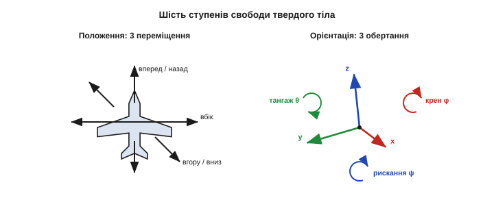
*Рис. 5.8.1.1. Тверде тіло в просторі має **6 ступенів свободи**: три **переміщення** (вздовж осей вперед/вбік/вгору-вниз) і три **обертання** (крен/тангаж/рискання). Положення й орієнтація — **незалежні**: апарат може стояти на місці й крутитися або летіти прямо, не обертаючись. Цей розділ — лише про другу трійку, про **орієнтацію**.*

Ключове усвідомлення: положення й орієнтація **незалежні** одне від одного. Квадрокоптер може висіти нерухомо в одній точці й при цьому обертатися довкола себе; може й летіти прямою, зовсім не повертаючись. Тому орієнтацію вивчають **окремо** — як власну трійку чисел, що описує лише **поворот** тіла, незалежно від того, де воно. Саме цією трійкою — і нічим іншим — займається весь цей розділ: положенням у просторі (навігацією) ми тут не цікавимося.

Чому орієнтацій саме три, не більше й не менше? Бо обертатися тверде тіло може довкола трьох незалежних осей — а будь-який, навіть найскладніший, поворот завжди розкладається на комбінацію поворотів навколо цих трьох. Це — наслідок геометрії тривимірного простору, і його строго довів ще у XVIII столітті швейцарський математик **Леонард Ейлер** (*Leonhard Euler*): будь-яку орієнтацію тіла можна отримати **трьома** послідовними поворотами навколо осей. Звідси й назва — кути Ейлера.

Варто підкреслити: ці три обертальні свободи **незалежні** одна від одної — крен можна змінювати, не чіпаючи тангажа й рискання, і навпаки. Саме тому орієнтацію не вдасться стиснути до меншого числа, ніж три: жоден із трьох кутів не виводиться з двох інших. (Якби тіло було не твердим, а гнучким, ступенів свободи стало б більше — та ми весь час говоримо про **тверде** тіло, форму якого вважаємо незмінною: дрон, літак, корабель.) Ці три числа — мінімальний і водночас повний опис того, **як** тіло повернуте: менше — недостатньо, більше — надлишок.

### Дві системи відліку: рамка тіла й рамка світу

Сказати «апарат повернутий» можна лише **відносно чогось**. Тому орієнтація завжди живе між **двома системами відліку** (рамками).

Перша — **світова** (або навігаційна) рамка: вона нерухомо прив'язана до Землі. В авіації її зазвичай беруть як **NED** — осі дивляться на **N**orth (північ), **E**ast (схід) і **D**own (вниз, до центра Землі). Це наш нерухомий «глобус», відносно якого все вимірюється.

Друга — **рамка тіла**: вона жорстко приклеєна до самого апарата й **летить разом із ним**. Її осі звичайно беруть так: **x** — уперед, крізь ніс; **y** — праворуч, уздовж правого крила; **z** — униз, крізь черево. Куди дивиться апарат — туди й дивляться осі його рамки.

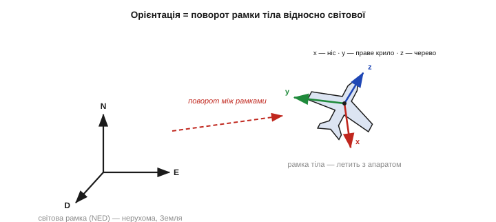
*Рис. 5.8.1.2. Орієнтація — це **поворот рамки тіла відносно світової**. Світова рамка (NED) нерухомо прив'язана до Землі: північ, схід, униз. Рамка тіла (вперед-x, праворуч-y, вниз-z) летить з апаратом і повертається разом із ним. Завдання «знати орієнтацію» — це знати, **наскільки** і **як** рамка тіла відхилена від світової.*

Тепер можна точно сказати, що таке орієнтація: це **поворот, яким рамка тіла відхилена від світової**. Якщо осі апарата збігаються зі світовими — орієнтація «нульова», апарат летить рівно на північ. Будь-яке відхилення — це поворот, і саме його ми хочемо описати трьома числами. Уся решта теми — про те, **які** це числа.

Тут одразу проступає, чому орієнтацію взагалі непросто **втримати** в коді. Гіроскоп (§5.7.3) міряє швидкість обертання **у власній рамці тіла** — скільки градусів за секунду апарат крутиться навколо своїх x, y, z. Щоб із цих швидкостей дізнатися, як апарат стоїть **у світі**, їх треба не просто додати, а правильно **перевести** між рамками — і робити це десятки чи сотні разів на секунду, бо рамка тіла щомиті вже інша. Найменша похибка в цьому переведенні нагромаджується крок за кроком, і оцінка орієнтації поволі «спливає» — звідси й уся морока з дрейфом гіроскопа, яку ми бачили в Розділі 5.7. Отже, вибір **зручної** мови орієнтації — не математична забаганка, а питання того, чи зможе мікроконтролер чесно тримати цю мову в реальному часі.

> 🔧 **Навіщо це.** Плутанина рамок — джерело половини помилок у коді орієнтації. Перш ніж писати бодай рядок, чітко випишіть собі: де у вас x, y, z тіла (куди дивляться ніс, праве крило, черево) і яка світова рамка (NED чи інша). Покази акселерометра й гіроскопа з даташита — це завжди величини **в рамці тіла**; щоб дізнатися, як апарат стоїть **у світі**, їх треба перевести через поворот. Наплутавши осі чи їхні знаки, ви отримаєте керування, що штовхає апарат **у бік** помилки, а не проти неї.

### Крен, тангаж і рискання

Три кути Ейлера в авіації мають власні наочні імена — і ви їх уже знаєте з історії стернового. Кожен — це поворот навколо однієї з осей тіла.

- **Крен** (*roll*, кут φ) — поворот навколо **поздовжньої** осі x (тієї, що крізь ніс). Це коли одне крило опускається, а друге піднімається — апарат «завалюється» набік.
- **Тангаж** (*pitch*, кут θ) — поворот навколо **поперечної** осі y (уздовж крил). Це коли ніс іде вгору або вниз — апарат «задирається» чи «клює».
- **Рискання** (*yaw*, кут ψ) — поворот навколо **вертикальної** осі z. Це коли ніс повертає ліворуч-праворуч, як машина на дорозі, не нахиляючись.

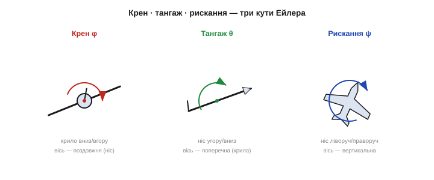
*Рис. 5.8.1.3. Три кути Ейлера. **Крен** φ — навколо поздовжньої осі (крило вниз/вгору). **Тангаж** θ — навколо поперечної (ніс угору/вниз). **Рискання** ψ — навколо вертикальної (ніс ліворуч/праворуч). Будь-яка орієнтація апарата — це певна трійка (φ, θ, ψ).*

Ці три числа (φ, θ, ψ) і є **кути Ейлера** в авіаційному варіанті (точніше — кути Тейта–Браяна, бо осі різні; але інженери частіше кажуть просто «кути Ейлера»). Будь-який поворот апарата задається такою трійкою — наочно, по-людськи, у градусах, які легко уявити. Саме тому горизонт на дисплеї дрона показують у крені й тангажі: це те, що пілот відчуває нутром.

Самі назви прийшли з раннього мореплавства й авіації. *Roll* — «перекочування» з борту на борт; *pitch* — «кивання» носом, як судно на хвилі; *yaw* — старе морське слово про «нишпорення» носом убік від курсу. Три кути разом дають повну орієнтацію, та по-різному «доступні» давачам: крен і тангаж видно з тяжіння (бо вони відхиляють вертикаль, і це ловить акселерометр), а от рискання тяжіння не змінює — поворот навколо вертикалі гравітація «не бачить», тож його доводиться брати з магнітометра (§5.7.4) або з інтегрованого гіроскопа. Ця нерівноправність кутів — крен і тангаж «легкі», рискання «важке» — ще не раз вилізе боком, коли ми зливатимемо давачі.

> 🔧 **Навіщо це.** Коли ви читаєте «attitude» (просторове положення) з польотного контролера, майже завжди це три числа — крен, тангаж, рискання. Запам'ятайте, **який із них за що відповідає**: для утримання горизонту дрону критичні саме крен і тангаж (їх стабілізує найшвидший, внутрішній контур керування), а рискання лише задає, куди дивиться ніс. Плутанина між ними — типова причина дивних поведінок: апарат тримає горизонт, але вперто «повзе» курсом, або, навпаки, чітко тримає напрям, та валиться набік.

### Чому порядок поворотів критичний

Тут починається перша підступність кутів Ейлера. Трійка (φ, θ, ψ) задає орієнтацію **лише разом із домовленістю, у якому порядку повороти застосовувати** — бо повороти в просторі **не комутують**: поміняти їх місцями — отримати **іншу** орієнтацію.

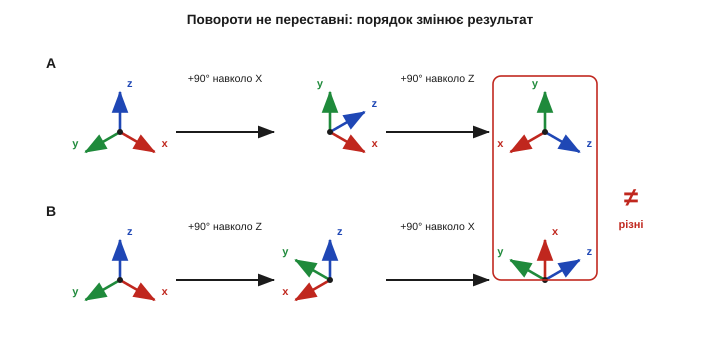
*Рис. 5.8.1.4. Повороти **не переставні**. Угорі: спершу поворот на 90° навколо X, тоді на 90° навколо Z. Унизу: ті самі повороти у **зворотному** порядку. Початковий стан однаковий, кути однакові — а **кінцева орієнтація різна** (трикутники-осі дивляться в різні боки). Тому трійка кутів Ейлера без указаного **порядку** безглузда.*

Це легко перевірити рукою: покладіть книжку на стіл обкладинкою вгору, корінцем до себе. Поверніть її на 90° «носом униз» (тангаж), а тоді на 90° навколо вертикалі (рискання) — запам'ятайте, куди дивиться обкладинка. Тепер поверніть так само, але **спочатку** рискання, **потім** тангаж — обкладинка опиниться **зовсім інакше**. Кути ті самі, порядок різний — результат різний. Тому будь-яка трійка кутів Ейлера несе сенс **лише** разом із домовленістю про послідовність осей.

В авіації стандартна послідовність — **3-2-1** (її ще звуть Z-Y-X): спершу **рискання** навколо z, тоді **тангаж** навколо нової осі y, нарешті **крен** навколо нової осі x. Саме в такому порядку три прості повороти «накручують» повну орієнтацію апарата.

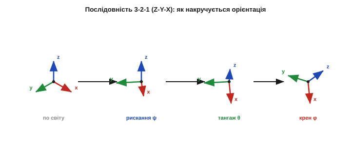
*Рис. 5.8.1.5. Стандартна авіаційна послідовність **3-2-1 (Z-Y-X)**. Стартуємо з рамки, зорієнтованої по світу; застосовуємо рискання ψ (навколо z), тоді тангаж θ (навколо вже поверненої y), нарешті крен φ (навколо вже двічі поверненої x). Кожен крок повертає трійку осей; підсумок — повна орієнтація тіла.*

Математично кожен елементарний поворот — це множення вектора на **матрицю повороту**. Три елементарні матриці (для поворотів навколо x, y, z):

```
          | 1     0       0    |              крен — навколо осі X
 Rx(φ) =  | 0   cos φ  −sin φ  |
          | 0   sin φ   cos φ  |

          |  cos θ   0   sin θ |              тангаж — навколо осі Y
 Ry(θ) =  |    0     1     0   |
          | −sin θ   0   cos θ |

          | cos ψ  −sin ψ   0  |              рискання — навколо осі Z
 Rz(ψ) =  | sin ψ   cos ψ   0  |
          |   0       0     1  |
```

А повна матриця повороту з рамки тіла у світову — це їхній **добуток** у тому самому порядку 3-2-1:

```
 R = Rz(ψ) · Ry(θ) · Rx(φ)

 Множення матриць НЕ комутує → порядок зашитий у саму формулу.
 Поміняти Rz і Rx місцями = описати іншу орієнтацію.
```

Помножити вектор у рамці тіла на R — і дістанемо той самий вектор у світовій рамці. Уся орієнтація захована в дев'яти числах цієї матриці; кути Ейлера — лише **компактний**, людяний спосіб ці дев'ять чисел задати трьома.

### Кардановий підвіс: коли рамки зроблені з металу

Звідки взялася сама ідея «трьох вкладених поворотів»? Із заліза. **Кардановий підвіс** (*gimbal*) — це механізм із трьох вкладених одне в одне кілець на взаємно перпендикулярних осях. Зовнішнє кільце крутиться навколо вертикалі (рискання), середнє — навколо горизонталі (тангаж), внутрішнє — навколо своєї осі (крен), а в самому центрі сидить те, що треба утримати: компас, гіроскоп, камера чи платформа.

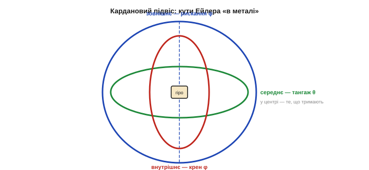
*Рис. 5.8.1.6. Кардановий підвіс (gimbal) — кути Ейлера «в металі». Три вкладені кільця на взаємно перпендикулярних осях задають рискання (зовнішнє), тангаж (середнє) і крен (внутрішнє). У центрі — те, що тримають незмінним (гіроскоп, камера). Кожне кільце — рівно один кут Ейлера; саме звідси й послідовність вкладених поворотів.*

Підвіс — не просто ілюстрація, а реальний прилад: на ньому століттями тримали корабельні компаси й гіроскопи, на ньому й досі стабілізують камери дронів. І саме він наочно показує, **чому** орієнтація розкладається на три послідовні повороти: кожне кільце повертається відносно того, у якому воно сидить, — рівно як матриці у добутку Rz·Ry·Rx. Кільце — це кут Ейлера, який можна помацати.

Підвіс — не музейна рідкість. На триосьовому кардановому підвісі трималася інерціальна платформа корабля «Аполлон»: важкий гіроскоп висів майже нерухомо у просторі, а кільця навколо нього міряли, як повертається сам корабель. І та сама вада, що про неї — далі, була там цілком реальною загрозою: екіпажу не дозволяли виводити корабель на певні «заборонені» орієнтації, щоб не заклинити платформу (астронавт Майкл Коллінз ще жартував, просячи на Різдво «четверте кільце», якого так і не додали). Сьогодні ж ви бачите підвіс щодня — у стабілізаторах камер дронів: три моторизовані кільця тримають камеру нерухомою, поки апарат гойдається на вітрі.

### Складання рамок: де кути Ейлера ламаються

А тепер — фатальна вада, заради якої існує наступна тема. Уявімо, що тангаж дійшов до **90°**: ніс дивиться прямо вгору. Тоді середнє кільце підвісу повертає внутрішнє так, що його вісь (крен) **збігається** з віссю зовнішнього кільця (рискання). Два кільця тепер крутяться навколо **однієї і тієї ж** осі — а отже, дають **той самий** рух. Один ступінь свободи **зник**: хоч крути зовнішнім кільцем, хоч внутрішнім — апарат повертається однаково, і відрізнити крен від рискання стало неможливо.

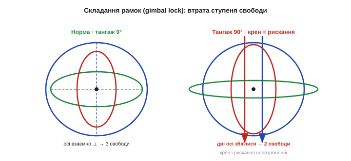
*Рис. 5.8.1.7. **Складання рамок** (gimbal lock). Ліворуч — норма (тангаж 0°): осі трьох кілець взаємно перпендикулярні, три незалежні свободи. Праворуч — тангаж 90°: вісь внутрішнього кільця (крен) **збіглася** з віссю зовнішнього (рискання). Два кільця крутяться навколо однієї осі — один ступінь свободи зник, крен і рискання стали нерозрізненні. Кути Ейлера в цій точці **вироджуються**.*

Це явище звуть **складанням рамок**, або **gimbal lock**. У математиці воно проявляється так само боляче: біля тангажа ±90° формули перерахунку кутів містять ділення, що прямує до нескінченності, рискання й крен стають невизначеними, а маленький рух апарата вимагає **шаленого** стрибка кутів. Для дрона, що робить мертву петлю, чи ракети, що йде вертикально вгору, це не абстракція, а реальна катастрофа: система орієнтації в цій точці просто **божеволіє**.

Кількісно ваду видно просто. Щоб дістати крен і рискання назад із матриці повороту, у знаменнику формул стоїть `cos θ` — а біля тангажа θ = ±90° косинус прямує до нуля, і вираз **вибухає**: маленький фізичний рух вимагає нескінченно великого стрибка кутів. Ось чому серйозні системи орієнтації — від пілотажних дронів до космічних апаратів — **усередині** ніколи не зберігають орієнтацію в кутах Ейлера. Вони рахують її в матрицях повороту або в **кватерніонах**, де виродженої точки немає взагалі, і переводять у звичні крен-тангаж-рискання лише **на самому виході** — щоб показати людині. До цього зручнішого, вільного від складання рамок опису ми й переходимо в наступній темі.

Складання рамок — не дефект конкретного коду, а **вроджена** вада самого способу описувати орієнтацію трьома послідовними кутами. Жодним перетасуванням осей його не прибрати — лише **відсунути** в інше місце. Саме тому інженери шукали принципово інший опис орієнтації, **без** цієї виродженої точки, — і знайшли його у **кватерніонах**, до яких ми перейдемо в наступній темі.

### Пастка конвенцій

Наостанок — суто практична, але дорога пастка. Кути Ейлера зручні, та **домовленості про них різняться** між галузями й бібліотеками, і це регулярно коштує людям згорілих апаратів.

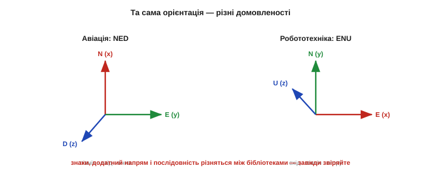
*Рис. 5.8.1.8. Та сама орієнтація, різні домовленості. Авіація бере світову рамку **NED** (північ-схід-вниз), робототехніка (ROS) — часто **ENU** (схід-північ-вгору). Через це знаки кутів, додатний напрям крену й навіть послідовність поворотів у різних бібліотеках **не збігаються**. Завжди звіряйте конвенцію давача, бібліотеки й свого коду — інакше керування піде в протилежний бік.*

Конкретно різнитися можуть: **світова рамка** (NED в авіації проти ENU в ROS-робототехніці); **який напрям крену/тангажа вважати додатним**; **послідовність** поворотів (3-2-1 проти інших із дванадцяти можливих); навіть **одиниці** (градуси чи радіани). Дві бездоганно правильні бібліотеки, з'єднані без звірки конвенцій, дадуть систему, що тлумачить «нахил праворуч» як «нахил ліворуч».

> 🔧 **Навіщо це.** Перш ніж довіряти кутам із будь-якої IMU-бібліотеки, проведіть простий тест на столі: повільно нахиліть плату в кожен бік окремо й подивіться, **який** кут і в **який** бік міняється. Так ви за хвилину з'ясуєте реальні конвенції (осі, знаки, послідовність) — замість того щоб гадати по даташиту. Цей тест рятує більше апаратів, ніж будь-яке читання документації: ви на власні очі бачите, що крен — це крен, а не перевернутий тангаж.

**Приклад (орієнтація зі спокійного акселерометра).** Плата лежить нерухомо й нахилена лише по крену. Акселерометр (Розділ 5.7) міряє вектор тяжіння в рамці тіла; з нього дістаємо крен і тангаж через `atan2`.

```
Дано (спокій, g = 9.81 м/с²):
  a = (aₓ, a_y, a_z) = (0.000, 4.905, 8.496) м/с²

Крен:    φ = atan2(a_y, a_z)
           = atan2(4.905, 8.496) = 30.0°

Тангаж:  θ = atan2(−aₓ, √(a_y² + a_z²))
           = atan2(0, √(4.905² + 8.496²))
           = atan2(0, 9.81) = 0.0°
```

Зі **спокійного** акселерометра ми відновили крен і тангаж — двома рядками. Але зверніть увагу на дві межі. По-перше, **рискання так не дістати**: тяжіння симетричне навколо вертикалі, тож поворот навколо z акселерометр не «бачить» — для рискання потрібен магнітометр (§5.7.4). По-друге, формула чесна лише в **спокої**: щойно апарат розганяється, акселерометр міряє суму тяжіння й власного прискорення, і кут «попливе». Саме тому надійну орієнтацію будують **не** з одного давача, а **зливаючи** гіроскоп з акселерометром, — і цим ми займемося, щойно опануємо зручніший за кути Ейлера опис повороту.

---

## 5.8.2 Кватерніони: чому з ними зручніше

Кути Ейлера наочні для людини, та ми щойно побачили їхню фатальну ваду — **складання рамок**, — а до неї додається ще одна: ними погано робити **плавний перехід** між орієнтаціями. Тому всередині серйозні системи орієнтації говорять іншою, менш наочною, але куди надійнішою мовою — **кватерніонами**. Слово лякає, проте за ним ховається проста й гарна ідея. Розберемося **якісно**, без занурення в алгебру: що це за чотири числа, звідки вони взялися, чому їх саме чотири й чому вони не знають ні складання рамок, ні стрибків.

### Один поворот навколо однієї осі

Почнемо з красивого факту, що його теж довів Ейлер (**теорема Ейлера про обертання**): хоч би як хитро було повернуте тверде тіло, цю орієнтацію завжди можна отримати **одним-єдиним** поворотом — на певний кут θ навколо певної **осі** n. Не трьома послідовними, як у кутах Ейлера, а одним. Уявіть глобус у будь-якому положенні: завжди знайдеться вісь, проштрикнувши вздовж якої й крутнувши на потрібний кут, ви переведете «нульове» положення точно в дане.

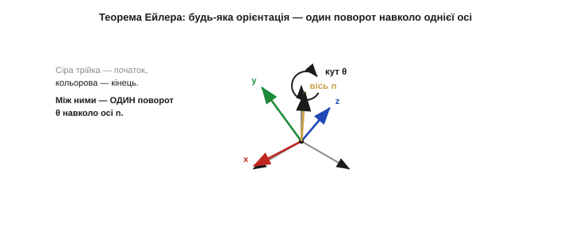
*Рис. 5.8.2.1. **Теорема Ейлера про обертання.** Сіра трійка осей — початкове положення; кольорова — кінцеве. Хоч би яке складне було кінцеве положення, його завжди можна дістати **одним** поворотом на кут θ навколо **однієї** осі n (золота). Це подання — «вісь-кут» — уже без порядку й без трьох рамок, що можуть скластися.*

Це подання звуть **«вісь-кут»** (*axis–angle*): орієнтація = (вісь n, кут θ). Воно вже без головних вад кутів Ейлера — немає ні послідовності, що її легко переплутати, ні трьох окремих рамок, що можуть збігтися. Проблема лише одна: рахувати **композицію** поворотів (повернули так, потім ще отак) прямо у форматі «вісь-кут» незручно — формули виходять громіздкі. І тут на сцену виходить геніальне пакування тієї самої осі-кута в чотири числа — **кватерніон**.

Можна думати про це й так: кватерніон — це «золота середина» між двома вже знайомими нам описами. Матриця повороту (дев'ять чисел із §5.8.1) надійна й без виродження, але громіздка: дев'ять чисел із шістьма прихованими зв'язками між ними. Кути Ейлера компактні — три числа, — але з фатальною дірою. Кватерніон бере від обох найкраще: майже такий самий компактний, як кути (чотири числа), і такий самий надійний, як матриця (без виродження). Не дивно, що саме він став робочим стандартом скрізь, де орієнтацію треба рахувати, а не лише показувати.

### Що таке кватерніон

**Кватерніон** — це набір із **чотирьох** чисел: q = (w, x, y, z). Перше, w, — «скалярна» частина; трійка (x, y, z) — «векторна». Беруть їх не абияк, а прямо з осі-кута, з однією характерною рисою — **половиною кута**:

```
 w        = cos(θ/2)
 (x,y,z)  = sin(θ/2) · n        (n — одинична вісь повороту)

 приклад: поворот на θ = 90° навколо осі z = (0,0,1)
   w = cos45° = 0.707
   (x,y,z) = sin45°·(0,0,1) = (0, 0, 0.707)
   q = (0.707, 0, 0, 0.707)
```

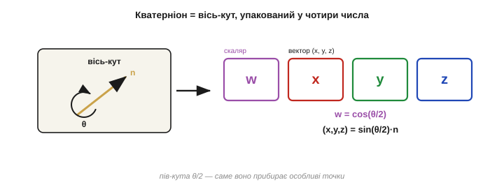
*Рис. 5.8.2.2. **Кватерніон — це компактний запис осі-кута.** Скалярна частина w = cos(θ/2), векторна (x, y, z) = sin(θ/2)·n. Чотири числа замість трьох кутів — і саме «пів-кута» θ/2 робить алгебру поворотів гладенькою, без особливих точок.*

Тобто кватерніон — це просто зручний для обчислень запис того самого «повернути на θ навколо n». Половина кута тут не примха: саме вона прибирає особливі точки й робить переходи гладенькими. Глибше в алгебру (як саме два кватерніони перемножуються) ми не лізтимемо — для практики досить інтуїції: **кватерніон = вісь і кут повороту, упаковані в чотири числа**, і з ним усі дії з орієнтацією стають надійними.

Корисна аналогія — **комплексні числа**. Згадайте: множенням на комплексне число зручно **повертати** точку на площині, у 2D. Гамільтон саме й шукав «комплексні числа для простору», щоб так само легко повертати в 3D, — і виявив, що для цього потрібна не одна «уявна» одиниця, а **три** (їх позначають i, j, k), а отже разом зі звичайним числом — **чотири** компоненти. Тому кватерніон і має одну скалярну та три «векторні» частини: це природне продовження комплексних чисел на тривимірні повороти. Якщо комплексне число — це поворот у площині, то кватерніон — поворот у просторі, записаний так само компактно.

Звідки взялася ця дивовижа — окрема яскрава історія, і вона повчально **колективна**. Зазвичай кажуть: кватерніони винайшов ірландський математик **Вільям Роуен Гамільтон** (*William Rowan Hamilton*) 16 жовтня 1843 року. Він роками шукав, як поширити комплексні числа на простір, аж раптом, ідучи з дружиною вздовж Королівського каналу в Дубліні, зрозумів, що потрібні **чотири** виміри, а не три, — і тут-таки видряпав ножем на камені моста Брум формулу `i² = j² = k² = ijk = −1`. Та правда повніша: ще **1840 року**, за три роки до Гамільтона, французький математик (і банкір, реформатор) **Олінд Родриґ** (*Olinde Rodrigues*) суто геометрично вивів правило **складання скінченних поворотів** — а це, по суті, і є множення одиничних кватерніонів, тільки без назви; його внесок десятиліттями недооцінювали. А ще раніше, **1819 року**, рівноцінні результати отримав німець **Карл Фрідріх Ґаус** (*Carl Friedrich Gauss*), але не опублікував їх, і світ дізнався про це аж 1900-го. Тож кватерніони — не осяяння одинака, а **спільне** відкриття кількох умів; Гамільтонові належить назва, символи i, j, k і остаточна алгебра.

Цікаво, що кватерніони мало не зникли зовсім. Наприкінці XIX століття в завзятій «війні» з ними перемогло простіше **векторне числення** (його розвинули Джозая Ґіббс і Олівер Гевісайд), і на десятиліття кватерніони лишилися математичною екзотикою, майже забутою інженерами. Повернуло їх до життя несподіване — **комп'ютерна графіка й аерокосмос**. 1985 року Кен Шумейк (*Ken Shoemake*) показав, як кватерніонами плавно анімувати обертання (саме той slerp, що про нього — нижче), і відтоді вони стали стандартом у графіці, іграх і робототехніці — а космічна навігація тихо користувалася ними ще з часів «Аполлона». Те, що видавалося відірваною від життя абстракцією XIX століття, виявилося рівно тим інструментом, якого через сто років потребували машини, що рухаються самі.

### Чому чотири числа, а не три

Резонне питання: орієнтація має лише **три** ступені свободи — навіщо ж **чотири** числа? Відповідь і є розгадкою всієї переваги кватерніонів. Виявляється, описати **всі** можливі орієнтації лише трьома числами **неможливо без особливої точки**: десь обов'язково виникне виродження, де опис ламається. Складання рамок у кутах Ейлера — це не недогляд, а **неминуча плата** за бажання обійтися трьома числами. А варто додати **четверте** (з однією умовою — про неї нижче), і простір орієнтацій вкривається **гладенько, без жодної дірки**.

Цю неминучість легко відчути на знайомому прикладі — **карті Землі**. Широта й довгота — це теж лише два числа на сферу, і вони чудово працюють усюди, **крім полюсів**: на самому полюсі довгота втрачає сенс (усі меридіани сходяться в точку), а крихітний крок поряд із полюсом стрибає на десятки градусів довготи. Це **той самий** виродок, що й складання рамок, тільки на вимір менше: двома числами не можна гладко вкрити сферу без особливої точки. Кути Ейлера — це, по суті, «широта й довгота» для орієнтацій, із полюсом-пасткою всередині; кватерніон же додає вимір і прибирає той полюс зовсім.

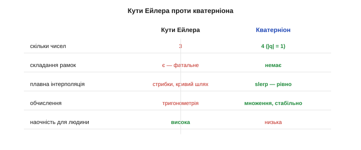
*Рис. 5.8.2.3. Чим кватерніон кращий. Кути Ейлера: 3 числа, є складання рамок, стрибки при інтерполяції, наочні для людини. Кватерніон: 4 числа (з умовою |q|=1), складання рамок **немає**, інтерполяція плавна, обчислення стабільні — ціною лише того, що людині вони неінтуїтивні.*

Отже, кватерніон «купує» головне — відсутність виродженої точки — невеликою ціною: однією зайвою координатою й однією умовою, що її легко підтримувати. Це класичний інженерний обмін: трохи надлишку заради надійності. Саме тому всі поважні польотні контролери, ігрові рушії, робото-бібліотеки й системи стабілізації камер тримають орієнтацію **всередині** в кватерніонах, а не в кутах.

### Немає складання рамок

Найголовніша практична перевага — кватерніон **не має** виродженої точки. Проведіть апарат хоч прямо через зеніт (тангаж 90°), хоч через мертву петлю — кватерніон змінюється весь час **гладенько**, без стрибків і нескінченностей. Для нього кожна орієнтація, зокрема й та фатальна для кутів Ейлера, — звичайна, нічим не особлива точка.

Уявіть пілотажний дрон, що крутить **мертву петлю**, або телефон, який ви перевертаєте екраном униз і далі через «голову». Це рухи прямо «через зеніт». Система на кутах Ейлера в цю мить смикнеться: горизонт на екрані перекинеться, рискання раптом відскочить на 180°, а стабілізація на коротку мить «осліпне». Та сама петля, описана кватерніоном, проходить **непомітно гладко** — апарат навіть не «знає», що проминув колись фатальну точку. Саме тому акробатичні дрони, ракети й розумні камери всередині рахують орієнтацію виключно в кватерніонах, лишаючи кути для вікна на екрані пілота.

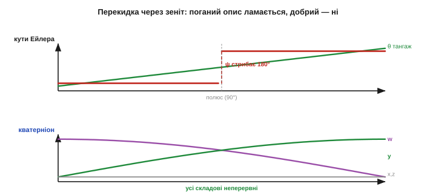
*Рис. 5.8.2.4. Та сама плавна перекидка носа через зеніт. Угорі (кути Ейлера): тангаж доходить до 90° — і рискання миттю **стрибає на 180°**, бо опис вироджується. Унизу (кватерніон): усі чотири складові міняються **неперервно**, ніякого стрибка. Фізичний рух один і той самий — ламається лише поганий опис, не добрий.*

### Плавна інтерполяція

Друга велика перевага — **плавний перехід** між двома орієнтаціями. Це треба щохвилини: камеру на підвісі плавно навести з однієї цілі на іншу, в анімації повернути модель, у польоті м'яко перейти від поточного нахилу до бажаного. З кватерніонами це робить **сферична лінійна інтерполяція** (*slerp*): вона веде орієнтацію **найкоротшою дугою**, рівномірно, без ривків і без ризику дорогою влетіти у складання рамок.

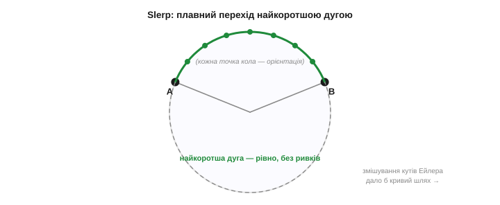
*Рис. 5.8.2.5. **Slerp** (сферична лінійна інтерполяція). Дві орієнтації A і B — як дві точки на сфері; slerp веде від A до B **найкоротшою дугою** (зелена), рівномірно за швидкістю. Спроба плавно «змішати» кути Ейлера натомість дає кривий, нерівномірний шлях (сірий), що може ще й зачепити складання рамок.*

Якщо ж лінійно «змішувати» кути Ейлера, шлях виходить кривий, швидкість стрибає, а посеред переходу можна влетіти у виродження. Тому скрізь, де орієнтацію треба плавно **вести** — у камерах, дронах, анімації, — беруть кватерніон і slerp.

> 🔧 **Навіщо це.** Практичне правило: **тримайте орієнтацію всередині в кватерніонах, а в кути Ейлера переводьте лише на «краю» — для показу людині чи для логів.** Майже всі бібліотеки IMU/AHRS уже видають кватерніон; не піддавайтеся спокусі одразу перегнати його в крен-тангаж-рискання й рахувати далі в кутах — так ви власноруч повернете собі складання рамок, від якого кватерніон вас урятував. Кути — це формат **відображення**, а не формат **обчислень**.

### Практичні дрібниці: одинична норма й подвійне покриття

Користуючись кватерніонами, треба пам'ятати дві дрібниці, що регулярно ловлять початківців.

Перша — **одинична норма**. Правильний кватерніон повороту має довжину рівно 1: √(w² + x² + y² + z²) = 1. Через накопичення обчислювальних похибок ця довжина поволі «пливе», тож після кожного кроку інтегрування кватерніон **нормують** назад до одиниці (ділять на його довжину). Операція копійчана, але без неї орієнтація з часом спотвориться.

Друга — **подвійне покриття**: кватерніони q і −q (усі знаки навпаки) описують **той самий** фізичний поворот. Це наслідок половини кута: повернути на θ чи на θ+360° — фізично те саме, а в кватерніоні дає зміну знака. Через це при інтерполяції треба стежити, щоб іти «коротшим» зі знаків, інакше камера крутнеться не туди — довгим шляхом.

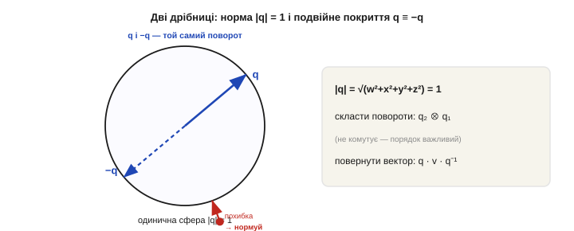
*Рис. 5.8.2.6. Дві дрібниці. **Норма:** правильний кватерніон лежить на одиничній сфері |q|=1; похибки виштовхують його назовні — треба нормувати назад (червона стрілка). **Подвійне покриття:** q і протилежний −q (антиподи) — це **той самий** поворот; при плавному переході бери той знак, що дає коротшу дугу.*

А щоб **скласти** два повороти (спершу один, тоді другий), кватерніони **перемножують** — і, як і матриці, вони при цьому **не комутують**: порядок важливий, бо порядок поворотів важливий завжди. Щоб **повернути** вектор v кватерніоном q, рахують q·v·q⁻¹. Усе це за вас зробить бібліотека — від вас лише розуміння, що відбувається.

Найчастіша дія над кватерніоном на практиці — **інтегрування гіроскопа**. Гіроскоп щокроку каже швидкість обертання навколо осей тіла; із неї будують крихітний кватерніон «доповороту» за цей крок і **домножують** ним поточну орієнтацію — так q крок за кроком стежить за тим, як апарат реально крутиться. Саме на цьому й тримається оцінка орієнтації між поправками від інших давачів. І саме тут критична нормалізація: тисячі дрібних домножень за секунду неминуче «розгойдали» б довжину q, якби її не повертали до одиниці після кожного кроку. Дешева операція ділення рятує всю орієнтацію від повільного спотворення.

### Де кватерніони живуть у вашому коді

Складімо картину докупи. Усередині системи орієнтації працює **оцінювач**, що тримає поточну орієнтацію як кватерніон q і щокроку оновлює його з гіроскопа (а виправляє — з акселерометра й магнітометра; як саме — наступні теми). Назовні цей кватерніон іде двома шляхами: у **контур керування**, що стабілізує апарат, — і, перетворений у крен-тангаж-рискання, на **дисплей чи в лог**, де його читає людина.

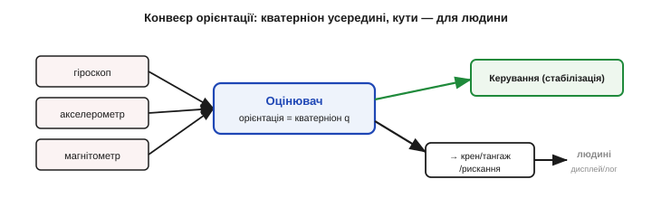
*Рис. 5.8.2.7. Типовий конвеєр орієнтації. Гіроскоп, акселерометр і магнітометр годують **оцінювач**, що тримає орієнтацію в **кватерніоні** q (без вад). Назовні q іде в керування, а для показу людині його перетворюють у звичні крен-тангаж-рискання. Усередині — надійна математика; назовні — наочні кути.*

> 🔧 **Навіщо це.** Не лякайтеся слова «кватерніон» у даташиті чи прикладі коду — у 99% випадків вам не доведеться рахувати їх руками. Достатньо знати три речі: (1) це чотири числа, що задають поворот без вад кутів Ейлера; (2) їх треба **нормувати** й стежити за знаком (q ≡ −q); (3) для людини їх наприкінці переводять у крен-тангаж-рискання. Цього розуміння вистачить, щоб правильно користуватися будь-якою бібліотекою орієнтації.

> 🔧 **Навіщо це.** Якщо вам треба **плавно** повертати щось — камеру на підвісі, віртуальну модель, ціль наведення — не інтерполюйте кути Ейлера, а беріть **slerp** по кватерніонах. Лінійне змішування кутів дає смикані, нерівномірні рухи й може зачепити складання рамок просто посеред переходу; slerp веде найкоротшою дугою рівно й безпечно. Це різниця між професійно-плавним і «сіпаним» рухом камери.

Підсумуймо. Кватерніон — це чотири числа, що кодують той самий поворот «вісь-кут», але без вад кутів Ейлера: без складання рамок, із плавною інтерполяцією й стабільними обчисленнями, ціною лише неінтуїтивності для людини й однієї умови |q|=1. Тепер у нас є **надійна мова** для орієнтації — компактна, як кути, і безвідмовна, як матриця повороту, без жодної виродженої точки на всьому діапазоні рухів. Лишилося навчитися цю орієнтацію **здобувати** з недосконалих давачів — зливаючи швидкий, але дрейфливий гіроскоп зі стабільним, але шумним акселерометром. Саме до цього злиття — комплементарного фільтра — ми й переходимо.

---

## 5.8.3 Комплементарний фільтр: злити гіроскоп і акселерометр

У Розділі 5.7 ми переконалися: ані гіроскоп, ані акселерометр **поодинці** не дають надійного кута нахилу. Гіроскоп міряє швидкість обертання — її треба інтегрувати, і дрібний зсув нуля з часом перетворюється на **дрейф**, що поволі «з'їдає» кут. Акселерометр дає кут прямо з напрямку тяжіння й **не дрейфує** — та він **шумить** і, гірше, плутає тяжіння з власним прискоренням апарата. Поодинці — двоє кульгавих. Але їхні вади **дзеркальні**, і це відкриває напрочуд просте й дешеве рішення — **комплементарний фільтр**, робочого коня всіх аматорських дронів і самобалансних роботів.

Назва звучить науково, та сам метод — чи не найпростіше, що є в усій інженерії орієнтації: одне множення й одне додавання на кожен кут, жодної важкої математики в циклі. Попри цю простоту він робить саме те, що треба, — і тому з нього варто починати знайомство зі злиттям давачів, перш ніж переходити до строгого, але важчого фільтра Калмана. Розберемо його до самих кісток: **чому** він працює, **як** його написати в один рядок і **де** він зраджує.

### Дзеркальні вади двох давачів

Уся краса в тому, що помилки двох давачів живуть у **різних частинах частотного спектра** — і саме протилежних. Проінтегрований гіроскоп **чудовий на коротких часах**: він точно ловить швидкі, різкі рухи, бо реагує миттєво й без шуму. Зате **на довгих часах** він безнадійний — дрейф накопичується й тягне кут кудись убік. Акселерометр — рівно навпаки: **на довгих часах** він бездоганний, бо завжди «знає», де низ (тяжіння нікуди не дівається), але **на коротких часах** його показ скаче від шуму й від кожного поштовху апарата.

У термінах Розділу 5.5 це звучить чітко: помилка гіроскопа зосереджена в **низьких** частотах (повільний дрейф), а помилка акселерометра — у **високих** (швидкий шум). Дві вади майже не перекриваються в спектрі — і саме тому їх можна розділити частотним фільтром, не зачепивши корисного сигналу, що сидить десь посередині. Це і є та геометрія задачі, яка взагалі робить злиття можливим: якби обидва давачі хибували в одній смузі частот, жодне розумне змішування не врятувало б.

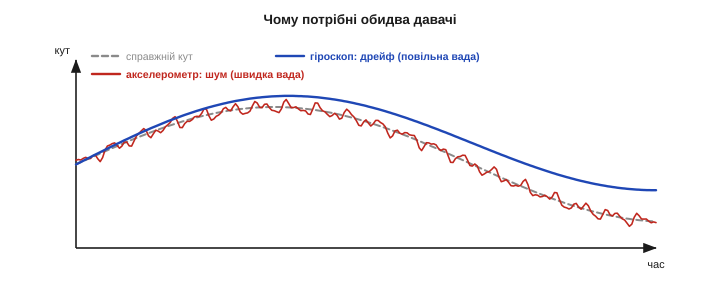
*Рис. 5.8.3.1. Чому потрібні обидва. Сіра — справжній кут. Синя (гіроскоп) тримається близько на коротких часах, але повільно **спливає** через дрейф. Червона (акселерометр) у середньому правильна, без дрейфу, та вкрита швидким **шумом**. Помилки **дзеркальні**: один поганий там, де другий добрий, — і навпаки.*

Це «дзеркало» — не випадковість, а ключ. Якщо два джерела хибують у протилежних діапазонах, то, узявши від кожного **тільки те, у чому воно сильне**, можна дістати оцінку, кращу за обидві. Гіроскоп хай відповідає за **швидкі зміни**, акселерометр — за **повільну правду**. Лишається технічно поділити сигнал за частотою — і скласти.

Перш ніж рухатися далі, варто чітко проговорити, **чому** кожен давач хибує саме так. Гіроскоп дає **швидкість**, а нам потрібен **кут**, тож його доводиться інтегрувати — підсумовувати крок за кроком; і будь-який крихітний сталий зсув нуля при цьому теж підсумовується, наростаючи в лінійний дрейф (Розділ 5.7). Акселерометр же міряє вектор сили, і в спокої цей вектор — чисте тяжіння, що завжди дивиться вниз; звідси і його кут, і незмінна в середньому правдивість. Але та сама чутливість до сили робить його жертвою кожного поштовху й вібрації мотора — звідси шум. Дві різні фізики — дві різні, дзеркальні вади.

> 🔧 **Навіщо це.** Ніколи не заводьте в контур керування **сирий** кут — ні з самого гіроскопа, ні з самого акселерометра. Перший за пів хвилини «попливе» й завалить апарат; другий тремтітиме й передасть у мотори вібрацію та хибні поштовхи. У будь-якому реальному стабілізаторі між давачами й керуванням **завжди** стоїть злиття — найчастіше саме комплементарний фільтр. Це не косметичне покращення, а **необхідна умова** того, що апарат узагалі полетить.

### Ідея: поділити за частотою

Згадаймо мову Розділів 5.5–5.6: «швидкі зміни» — це **високі** частоти, «повільна правда» — **низькі**. Тоді план стає кристально ясним. З проінтегрованого гіроскопа візьмемо лише **високочастотну** частину (швидкі рухи — там, де він сильний, а його повільний дрейф ми просто відкинемо). З акселерометра візьмемо лише **низькочастотну** частину (повільний, усереднений напрямок «униз» — там, де він сильний, а його швидкий шум ми відріжемо). І складемо.

Аналогія з двома свідками робить цю ідею відчутною. Уявіть, що про подію розповідають двоє. Перший чудово помічає **миттєві** деталі, кожен різкий рух, та має кепську довгу пам'ять і за годину вже плутає, з чого все почалося (це гіроскоп: точний у «зараз», ненадійний у «загалом»). Другий деталей моменту не ловить, відповідає повільно й плутано, зате його загальна, усереднена картина **завжди вірна** (це акселерометр). Розумний слідчий бере від першого швидкі подробиці, від другого — загальну канву, і складає правдиву історію. Комплементарний фільтр — рівно цей слідчий, тільки з давачів.

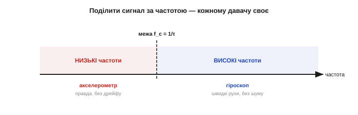
*Рис. 5.8.3.2. Стратегія злиття. Частотну вісь ділять на дві ділянки. **Низькі частоти** (повільне, усереднене) бере на себе акселерометр — він там без дрейфу. **Високі** (швидкі рухи) — гіроскоп, він там без шуму. Межу між ними задає одна стала τ; решта — скласти дві частини.*

### Два фільтри, що доповнюють одне одного

Технічно це робить пара фільтрів із Розділу 5.6: **фільтр верхніх частот** (ФВЧ) на гіроскоп і **фільтр нижніх частот** (ФНЧ) на акселерометр. І тут ховається елегантність, що дала фільтрові назву: ці два фільтри роблять **взаємодоповняльними** (компле­ментарними) так, щоб у сумі вони давали **рівно одиницю** на всіх частотах: ФВЧ(f) + ФНЧ(f) = 1.

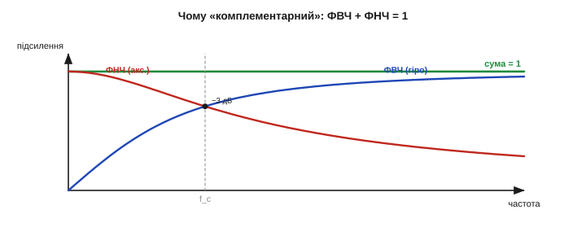
*Рис. 5.8.3.3. Чому «комплементарний». ФНЧ (червоний) пропускає низькі частоти від акселерометра; ФВЧ (синій) — високі від гіроскопа; на межі f_c кожен послаблений до −3 дБ. Складені, вони дають **рівно 1** на всіх частотах (зелена пряма): справжній сигнал проходить без спотворення, а кожен давач «звучить» лише там, де він добрий.*

Ця умова — суми **точно** одиниця — і є серцем методу. Вона гарантує, що справжній сигнал (той спільний кут, який обидва давачі намагаються виміряти) проходить крізь фільтр **без жодного спотворення** — не послаблений, не зсунутий. Спотворюються лише **помилки**: дрейф гіроскопа гаситься фільтром верхніх частот (він повільний — його зріже ФВЧ), а шум акселерометра гаситься фільтром нижніх частот (він швидкий — його зріже ФНЧ). Кожна вада потрапляє рівно під той фільтр, що її прибирає.

Зверніть увагу, як тут спрацювала вся машинерія Розділів 5.5–5.6. Ми мислимо сигнал у **частотній області**, проєктуємо два фільтри з потрібними смугами пропускання й свідомо робимо їх **дзеркальними**, щоб сума давала одиницю. Це не випадковий трюк, а інженерний дизайн: саме частотний погляд на давачі підказав і ідею злиття, і її точну форму. Без мови спектра комплементарний фільтр годі було б ні придумати, ні свідомо налаштувати — лишалося б тільки навмання крутити коефіцієнти.

### Один рядок коду

Найкраще те, що вся ця частотна краса згортається в **один рядок**, який крутиться на найдешевшому мікроконтролері. Не треба ні матриць, ні тригонометрії в циклі — лише додавання й множення:

```
 кут = α · (кут + ω · dt)  +  (1 − α) · кут_акс

   кут     — поточна оцінка нахилу (її ж і оновлюємо)
   ω       — швидкість від гіроскопа (град/с)
   dt      — період кроку (с)
   кут_акс — кут із акселерометра, atan2(a_y, a_z)   (див. §5.8.1)
   α       — коефіцієнт довіри, близький до 1 (напр. 0.98)
```

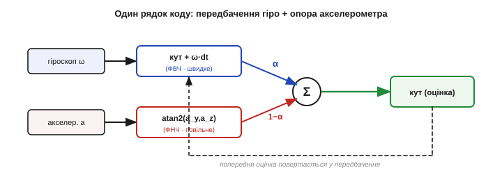
*Рис. 5.8.3.4. Як це працює покроково. Гіроскоп інтегрують (кут + ω·dt) — це **передбачення** за швидкістю; акселерометр через atan2 дає **опорний** кут. Зважена сума з вагою α на гіроскоп і (1−α) на акселерометр — і є новою оцінкою. ФВЧ та ФНЧ із попереднього рисунка тут «сховані» саме в цій одній формулі.*

Придивіться до формули — вона напрочуд прозора. Член `α·(кут + ω·dt)` бере **попередню оцінку, докручену гіроскопом** на цей крок: це швидка, миттєва реакція (висока частота). Член `(1−α)·кут_акс` **легенько підтягує** оцінку до того, що каже акселерометр: це повільна корекція, що не дає гіроскопові втекти в дрейф (низька частота). Коефіцієнт α (зазвичай 0.95–0.99) задає, кому більше вірити. А ховається за ним та сама **стала часу** τ = α·dt/(1−α): рухи, швидші за 1/τ, беруться з гіроскопа, повільніші — з акселерометра.

**Приклад (один крок фільтра).** МК працює на 100 Гц (dt = 0.01 с), α = 0.98.

```
 Стала часу:  τ = α·dt/(1−α) = 0.98·0.01 / 0.02 = 0.49 с

 Дано на кроці:
   попередній кут = 10.0°,  ω = 50°/с,  кут_акс = 12.0°

 Передбачення гіроскопом:  10.0 + 50·0.01 = 10.5°
 Зважена сума:             0.98·10.5 + 0.02·12.0
                         = 10.29 + 0.24 = 10.53°
```

Оцінка пішла переважно за гіроскопом (швидко, до 10.5°) і лише трішки підтяглася до акселерометра (12°). За багато кроків ці крихітні підтягування **не дають** гіроскопу накопичити дрейф, а сам кут лишається гладким — без акселерометрового тремтіння.

Кілька практичних дрібниць, без яких формула не запрацює. По-перше, фільтр застосовують **до кожного кута окремо**: один екземпляр на крен, другий на тангаж, і кожен бере **свою** вісь гіроскопа з правильним знаком. По-друге, `dt` має бути **справжнім** періодом між викликами — не «номінальним» із даташита, а виміряним, бо саме на нього множиться швидкість; «плаваючий» dt тихо псує масштаб інтегрування. По-третє, оцінку на старті розумно **засіяти** показом акселерометра, а не нулем, — щоб фільтр не доганяв правду перші секунди. Дрібниці — та кожна з них колись комусь коштувала години відлагодження.

> 🔧 **Навіщо це.** Перевірте **знаки й осі** на столі, перш ніж летіти. Нахиліть плату по крену — кут крену має зростати в правильний бік, а тангаж стояти; потім навпаки, по тангажу. Переплутані осі чи перевернутий знак гіроскопа дадуть фільтр, що замість стабілізації **розгойдує** апарат (бо діятиме «за» помилкою, а не проти неї). Цей тридцятисекундний тест на столі рятує апарати частіше, ніж будь-яка теорія.

### Що дає злиття

Результат вартий своєї простоти: оцінка стає **гладкою, як гіроскоп, і не дрейфує, як акселерометр** — найкраще від обох.

Саме на цьому однорядковому фільтрі десятиліттями трималася аматорська робототехніка. Самобалансні роботи на кшталт сегвея, перші покоління польотних контролерів квадрокоптерів, нахиломіри в іграшках — усе це втримувало рівновагу комплементарним фільтром, бо він **достатньо добрий** і при цьому такий дешевий, що крутиться навіть на 8-бітному мікроконтролері за копійки, не з'їдаючи ні пам'яті, ні часу. Тому правило інженера просте: перш ніж тягтися до складніших методів орієнтації, майже завжди варто спершу спробувати комплементарний фільтр — і дуже часто цього виявляється цілком досить.

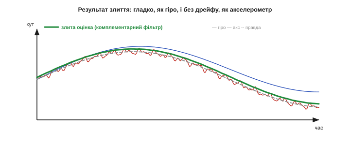
*Рис. 5.8.3.5. Підсумок злиття. На тлі дрейфливого гіроскопа (блідо-синій) і шумного акселерометра (блідо-червоний) злита оцінка (зелена) щільно тримається справжнього кута (сірий пунктир): вона гладка, без стрибків, і не спливає з часом. Один рядок коду перетворив двох кульгавих на одного зрячого.*

### Як вибрати α

Коефіцієнт α — єдине, що тут треба налаштувати, і це знайомий нам **компроміс** (Розділи 5.4 і 5.7). Велике α (ближче до 1) — більше довіри гіроскопу: оцінка дуже гладка, майже без шуму, але дрейф виправляється **повільно**, і сильний нахил акселерометр «доганяє» неохоче. Мале α — більше довіри акселерометру: дрейф давиться швидко, зате в оцінку **протікає** шум і кожен поштовх апарата.

Найкраще думати про α не як про абстрактне число, а як про **секунди**. При dt = 0.01 с (100 Гц) α = 0.98 дає τ ≈ 0.5 с, α = 0.99 — близько 1 с, α = 0.995 — майже 2 с. Стала часу τ — це грубо той час, за який акселерометр перетягнув би оцінку до правди, якби гіроскоп раптом замовк. Пів секунди — добрий баланс для дрона: достатньо швидко, щоб дрейф не встиг нашкодити, і достатньо повільно, щоб шум та короткі поштовхи згладжувалися. Звідси й типові «магічні» 0.95–0.99 — за ними просто ховається τ від чверті секунди до секунди.

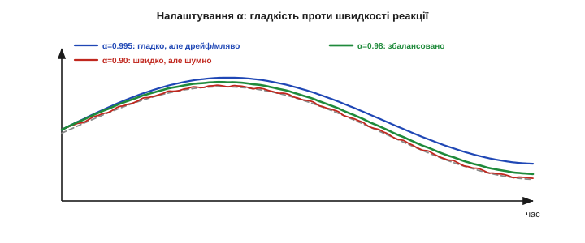
*Рис. 5.8.3.6. Налаштування α. Завелике (0.995, синє) — гладко, але оцінка ще тягне залишковий дрейф і мляво реагує. Замале (0.90, червоне) — швидко тримає правду, та в неї протікає акселерометровий шум. Збалансоване (0.98, зелене) — гладко й без дрейфу. Як і всюди в фільтрації: гладкість ↔ швидкість реакції.*

> 🔧 **Навіщо це.** Починайте з α ≈ 0.98 на частоті близько 100 Гц — це добра відправна точка для дрона чи самобалансного робота. Якщо оцінка «нервова», тремтить від моторів — підніміть α (більше згладжування); якщо вона «в'яла», запізнюється за реальним нахилом — опустіть. Думайте не про саме α, а про **сталу часу** τ = α·dt/(1−α): саме вона каже, за скільки секунд акселерометр перебиває дрейф гіроскопа. Так налаштування стає осмисленим, а не ворожінням.

### Межі: коли акселерометр бреше

У комплементарного фільтра є вроджена слабкість, і її треба знати. Уся його довіра до акселерометра тримається на припущенні, що той міряє **чисте тяжіння**. Та щойно апарат довго розганяється чи входить у тривалий віраж, акселерометр міряє **суму** тяжіння й власного прискорення — і «низ» для нього **відхиляється**. Опорний кут стає хибним, і фільтр повільно тягне оцінку за цією хибою.

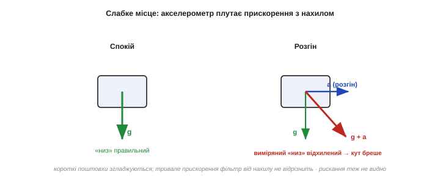
*Рис. 5.8.3.7. Слабке місце. У спокої акселерометр міряє лише тяжіння g і правильно показує «низ». Та коли апарат розганяється (вектор a), він міряє **g + a**, і вектор «низу» відхиляється — опорний кут бреше. На коротких поштовхах це згладжується, а от **тривале** прискорення комплементарний фільтр відрізнити від нахилу не вміє.*

На коротких поштовхах це не біда — їх давить фільтр нижніх частот. Проблема саме з **тривалим** прискоренням: його фільтр відрізнити від справжнього нахилу не здатний. Друге обмеження ми вже знаємо з §5.8.1: акселерометр **не бачить рискання** (тяжіння симетричне навколо вертикалі), тож курс комплементарним фільтром «гіро+акселерометр» не виправити — для нього потрібен магнітометр як третій давач (так само, через свій комплементарний канал).

З головною вадою — обманом від тривалого прискорення — на практиці борються хитро. Помітити обман нескладно: якщо **довжина** виміряного вектора помітно відрізняється від g, отже, до тяжіння домішалося власне прискорення, і акселерометру в цю мить вірити не можна. Тоді фільтр на час маневру **тимчасово зменшує** довіру до акселерометра (фактично піднімає α), спираючись майже лише на гіроскоп, а коли |a| знову повертається до g — відновлює звичну вагу. Цей простий «вимикач довіри» вже наближає комплементарний фільтр до того, що **строго й автоматично**, на кожному кроці, робить фільтр Калмана.

Звідки взялася сама ідея? Це класика **інерціальної навігації**: ще в авіаційних системах так зливали, скажімо, барометричну висоту (точну в середньому, але повільну) з висотою від акселерометра (швидкою, але дрейфливою) — той самий комплементарний поділ за частотою. А ще комплементарний фільтр — це, по суті, **спрощений, з фіксованою довірою α**, родич знаменитого **фільтра Калмана**, який обчислює оптимальну довіру **сам**, виходячи зі статистики шумів давачів. Коли постійного α замало — коли шуми міняються, а вірити давачам треба то більше, то менше, — настає час Калмана. Саме до його ідеї ми й переходимо.

---

## 5.8.4 Ідея фільтра Калмана

Комплементарний фільтр мав один наперед заданий коефіцієнт довіри α — і в цьому його межа. А що, як довіра до давачів **міняється** в часі? На старті ми ще нічого не знаємо про кут — варто більше слухати акселерометр; під час різкого маневру акселерометр бреше — варто більше вірити гіроскопу; у спокої — навпаки. Постійне α цього не вміє. **Фільтр Калмана** робить наступний крок: він **обчислює оптимальну довіру сам, на кожному кроці**, виходячи з того, наскільки він **упевнений** у власній оцінці й наскільки шумний давач. Це той самий принцип злиття, що й у комплементарного фільтра, але з адаптивною, математично **найкращою** вагою. Розберемо його ідею якісно — без матриць, на дзвоноподібних кривих імовірності. Це, мабуть, найважливіша ідея всієї прикладної оцінки стану — і водночас навдивовижу інтуїтивна, щойно подивитися на неї як на просте «зважування за певністю».

> 📜 **Перед матеріалом — історія:** [фільтр Калмана й «Аполлон»](ch34-s4-history-kalman.md). Метод винайшов угорсько-американський інженер **Рудольф Калман** (*Rudolf Kálmán*) близько 1960 року, а вже за кілька років та сама математика вела кораблі «Аполлона» до Місяця. Історія розкаже, як абстрактна теорія за лічені роки опинилася в бортовому комп'ютері космічного корабля.

### Дві оцінки, кожна зі своєю невпевненістю

В основі фільтра Калмана — проста думка: про будь-яку величину (скажімо, кут нахилу) ми зазвичай маємо **два** незалежні джерела, і **кожне неточне**. Перше — **передбачення** з моделі: ми знаємо, де кут був, і знаємо швидкість із гіроскопа, тож можемо передбачити, де він тепер. Друге — **вимір** з давача: акселерометр прямо каже кут. Жодному не можна вірити повністю: передбачення поволі дрейфує, вимір шумить. Але — і це ключ — кожне джерело має не лише значення, а й **міру невпевненості**: наскільки широко «розмазане» те, що воно стверджує.

Що означає ця «міра невпевненості»? Її зручно уявляти як **ширину дзвоноподібної кривої** довкола значення. Вузький, гострий дзвін — джерело каже «кут майже напевно отут»; широкий, розпливчастий — «десь у цих межах, точніше не скажу». Передбачення, що довго йшло без звірки з давачем, має широкий дзвін (накопичився дрейф); свіжий вимір тихого давача — вузький. Фільтр Калмана не просто зберігає число-оцінку, а **веде** цей дзвін — і значення, і його ширину — крок за кроком. Саме робота з шириною, з невпевненістю, і відрізняє Калмана від усього простішого.

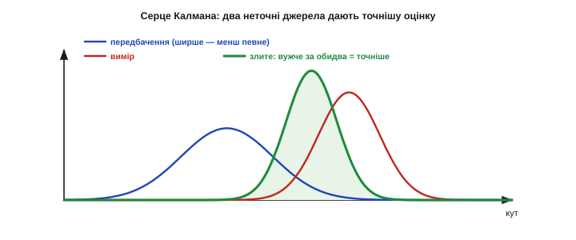
*Рис. 5.8.4.1. Серце фільтра Калмана. Передбачення (синя крива) і вимір (червона) — це не числа, а **розподіли**: значення ± невпевненість (ширина дзвона). Зливаючи їх, Калман дає нову оцінку (зелена), що **вужча за обидві** — тобто **точніша**, ніж кожне джерело окремо, — і лежить ближче до того, кому більше довіри (тут — до вужчого виміру).*

Якщо уявити кожне твердження як «дзвін» (що вужчий — то впевненіший), то злиття двох дзвонів дає **третій, ще вужчий** дзвін, що сидить між ними, ближче до впевненішого. Це не магія, а математика: дві незалежні неточні оцінки разом знають **більше**, ніж кожна окремо, — тож їхня спільна оцінка точніша за будь-яку з них. У цьому головна сила методу.

Технічно «злити два дзвони» означає взяти кожен із **вагою, оберненою до його невпевненості**: чим вужчий (певніший) дзвін, тим більша його вага. Підсумкова оцінка лягає ближче до певнішого джерела, а її невпевненість виходить **меншою за обидві** вхідні — бо два незалежні погляди разом обмежують істину тісніше, ніж кожен поодинці. Це правило — зважування за оберненою дисперсією — математично **оптимальне**: точнішої оцінки із цих двох джерел дістати взагалі неможливо.

**Приклад (злити дві оцінки одного кута).** Передбачення: 18° з невпевненістю σ = 4° (дисперсія σ² = 16). Вимір: 22° з σ = 3° (σ² = 9).

```
 Коефіцієнт:     K = σ²_перед / (σ²_перед + σ²_вим) = 16 / (16 + 9) = 0.64
 Злита оцінка:   18 + K·(22 − 18) = 18 + 0.64·4 = 20.56°
 Нова дисперсія: (1 − K)·σ²_перед = 0.36·16 = 5.76   →   σ ≈ 2.4°
```

Підсумок: 20.6° ± 2.4° — оцінка і лягла ближче до впевненішого виміру, і стала **точнішою за обидва** входи (σ = 2.4° менша і за 4°, і за 3°). А число K = 0.64 — це й є коефіцієнт Калмана, обчислений із самих лише невпевненостей, без жодного ручного підбору.

### Передбачити, тоді виправити

Працює фільтр Калмана **циклом** із двох кроків, що повторюються щомиті: **передбачення** (predict) і **оновлення** (update, або корекція).

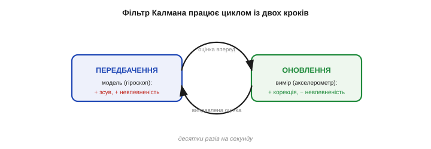
*Рис. 5.8.4.2. Два кроки по колу. **Передбачення:** модель (гіроскоп) штовхає оцінку вперед і **збільшує** невпевненість (модель недосконала, дрейф росте). **Оновлення:** надходить вимір — фільтр обчислює, кому більше вірити, підтягує оцінку до виміру й **зменшує** невпевненість. І так знову й знову, десятки разів на секунду.*

На кроці **передбачення** фільтр бере поточну оцінку й посуває її за моделлю (проінтегрував гіроскоп — і кут зрушив). Але разом зі значенням він посуває й невпевненість — і **збільшує** її: модель не ідеальна, тож що довше ми лише передбачаємо, не звіряючись із давачем, то менше впевнені (дзвін **ширшає**). На кроці **оновлення** надходить вимір — і фільтр **виправляє** передбачення, підтягуючи його до виміру; а оскільки вимір додав інформації, невпевненість **зменшується** (дзвін **вужчає**).

Знайома аналогія — навігатор у машині. Поки сигнал GPS є, він **виправляє** позицію виміром (оновлення). У тунелі GPS зникає — і навігатор **передбачає**, де ви, за останньою швидкістю й напрямом руху (модель), малюючи машину далі дорогою; та з кожною секундою без виміру його впевненість падає (коридор росте). Виїхали з тунелю — свіжий GPS миттю стягує оцінку назад і звужує коридор. Це точно цикл Калмана: передбачати між вимірами, виправлятися на вимірах — і весь час знати, наскільки ти зараз певний.

> 🔧 **Навіщо це.** Запам'ятайте поділ «передбачення ↔ оновлення» — він універсальний далеко за межами орієнтації: так зливають GPS і одометрію в роботі, радар і камеру в авто, будь-яку «модель руху» з будь-яким «давачем». Щойно у вас є **дешеве часте передбачення** (гіроскоп, лічильник обертів) і **рідший точний вимір**, що не дрейфує (акселерометр, GPS), — це задача для фільтра калманівського типу. Навчившись бачити цю пару, ви одразу знатимете, який інструмент діставати.

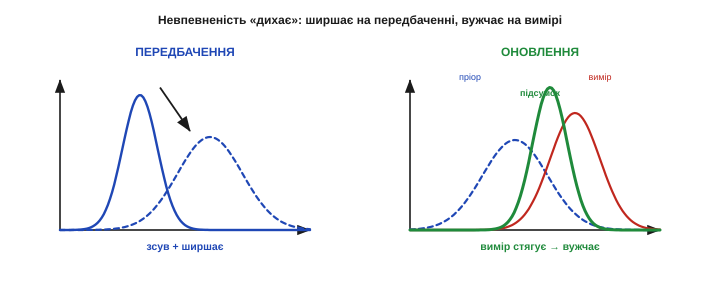
*Рис. 5.8.4.3. Невпевненість «дихає». На кроці передбачення оцінка зсувається за моделлю й **ширшає** (синій → блідий ширший дзвін). На кроці оновлення вимір (червоний) стягує її назад у **вужчий** підсумковий дзвін (зелений). Передбачення «втрачає» певність, вимір її «повертає» — і цикл тримає невпевненість обмеженою.*

### Коефіцієнт Калмана: адаптивна довіра

Як саме фільтр вирішує, кому більше вірити при злитті? Через **коефіцієнт Калмана** K — число від 0 до 1, що каже, **наскільки підтягувати** оцінку до виміру. І обчислюється воно щокроку з **відносної невпевненості** двох джерел: якщо вимір певний (давач тихий) — K близьке до 1, фільтр майже стрибає на вимір; якщо вимір непевний (давач шумить) або, навпаки, передбачення ще надійне — K близьке до 0, фільтр тримається передбачення.

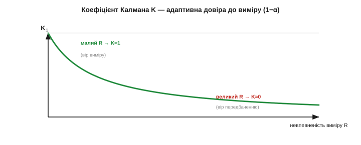
*Рис. 5.8.4.4. Коефіцієнт Калмана K — це **адаптивний коефіцієнт довіри до виміру** (адаптивне (1−α)). Коли невпевненість виміру мала (давач точний), K → 1: вір виміру. Коли вона велика (давач шумний), K → 0: вір передбаченню. Те, що в комплементарному фільтрі ми **задавали руками** одним числом α, тут фільтр **обчислює сам** і **щокроку наново**.*

Упізнаєте? K — це **той самий** коефіцієнт довіри, що й (1−α) у комплементарному фільтрі, тільки тепер його не задають раз і назавжди, а **обчислюють заново** на кожному кроці з поточних невпевненостей. Ось чому кажуть, що комплементарний фільтр — це Калман із **замороженим** коефіцієнтом: якщо невпевненості давачів сталі, K Калмана збігається до сталого значення, і два фільтри стають тотожні.

Звідки береться K, видно вже на одновимірному випадку: K = σ²_перед / (σ²_перед + σ²_вим). Якщо вимір ідеальний (σ²_вим → 0), то K → 1 — фільтр стрибає просто на вимір. Якщо вимір геть ненадійний (σ²_вим → ∞), то K → 0 — фільтр його ігнорує й тримається передбачення. Між цими крайнощами K плавно зважує два джерела за їхньою певністю. Уся «магія» Калмана в тому, що σ²_перед він теж рахує сам — нарощує на кроці передбачення, зменшує на кроці оновлення, — тож K завжди відповідає **поточній** обстановці, а не якомусь усередненому припущенню.

### Він сам себе налаштовує

Найкорисніша риса — фільтр **сам** підкручує K під обставини. На старті, коли він ще нічого не знає про кут, невпевненість велика, K високе — фільтр жадібно вбирає перші виміри. Згодом, коли оцінка устоялася, K спадає до робочого рівня. А якщо повідомити фільтру, що давач зашумів (піднявши його R), — він одразу й строго знизить до нього довіру.

Згадайте «вимикач довіри» з комплементарного фільтра — там ми вмикали його **вручну**, ловлячи моменти, коли |a| ≠ g. Калман перераховує K **безперервно й строго** — з тих невпевненостей, які йому **задано**: будь-яка зміна R чи Q одразу відбивається на K, і в межах цієї моделі зважування на кожному кроці найкраще можливе. Чесне застереження: сам собою фільтр не помітить, що давач **насправді** збрехав понад заявлений рівень шуму, — тому бойові фільтри (у PX4 чи ArduPilot) досі тримають і явні евристики на кшталт «якщо |a| ≠ g — тимчасово підняти R акселерометра». Сила Калмана в тому, що він дає цим евристикам строгу рамку: недовіру не вигадують з нуля, а акуратно вписують у ту саму арифметику невпевненостей.

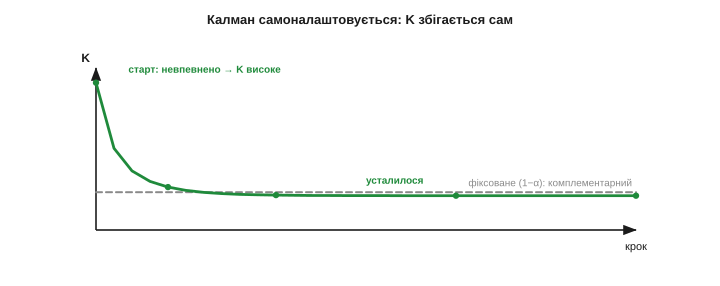
*Рис. 5.8.4.5. Самоналаштування. Коефіцієнт K (зелений) стартує високим — фільтр невпевнений і жадібно вбирає виміри, — а тоді **сам збігається** до сталого робочого значення. Комплементарний фільтр натомість тримає **фіксоване** (1−α) (сіра пряма) від самого початку, ще не знаючи обстановки. Калман адаптується; α — ні.*

> 🔧 **Навіщо це.** Практична відмінність від комплементарного фільтра — у двох речах. По-перше, Калман **не треба вручну підбирати α**: ви задаєте натомість **рівні шуму** давача й моделі (їх беруть із даташита або міряють), а оптимальну вагу фільтр виводить сам. По-друге, він видає не лише оцінку, а й **її невпевненість** — а це безцінно: система знає, коли довіряти власній орієнтації, а коли «осліпла». Якщо у вашій задачі шуми сталі й передбачувані — досить дешевого комплементарного фільтра; якщо вони міняються або потрібна оцінка надійності — час Калмана.

### Оцінка з мірою впевненості

Та найбільша перевага фільтра Калмана — не сам по собі кращий кут, а те, що він **разом із оцінкою видає її невпевненість**. Він завжди «знає», наскільки сам собі вірить.

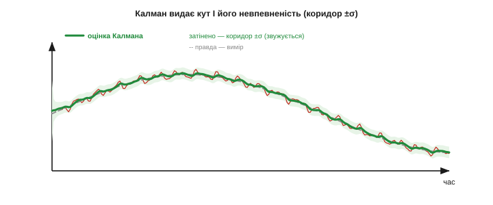
*Рис. 5.8.4.6. Калман видає кут **і** його невпевненість. Зелена — оцінка, що щільно тримається правди (сіра); затінений коридор — діапазон ±σ, у якому, на думку фільтра, лежить істина. Спершу коридор широкий (фільтр невпевнений), далі **звужується** — фільтр «набрав певності». Цього коридору комплементарний фільтр не дає взагалі.*

Це той самий «коридор довіри», яким користуються великі системи: автопілот, що бачить розширення коридору, розуміє, що орієнтація стала ненадійною (давач відмовив, пішла сильна вібрація), і може перейти в безпечний режим. Знати **наскільки** ти певний — часто важливіше, ніж сама оцінка.

> 🔧 **Навіщо це.** Не викидайте оцінку невпевненості, яку дає Калман, — вона нерідко корисніша за сам кут. За **шириною коридору** легко зробити **виявлення відмов**: якщо невпевненість різко зросла або черговий вимір вийшов далеко за свій очікуваний розкид, отже, давачу віри нема (відвалився, б'є вібрація, магнітна аномалія) — і час перейти в безпечний режим чи перемкнути джерело. Системи, що так стежать за власною певністю, падають значно рідше за ті, що сліпо вірять одному числу. Це, мабуть, найнедооціненіша перевага Калмана.

### Що це дає й куди далі

Підіб'ємо. Фільтр Калмана — це той самий принцип злиття «передбачення + вимір», що й комплементарний фільтр, але доведений до досконалості: він стежить за **невпевненістю** кожної оцінки й через неї щокроку обчислює **оптимальну** вагу K. За певних умов (лінійна модель, гаусів шум) він — **доказово найкращий** із можливих лінійних оцінювачів: ніщо не витисне з тих самих давачів точнішої оцінки.

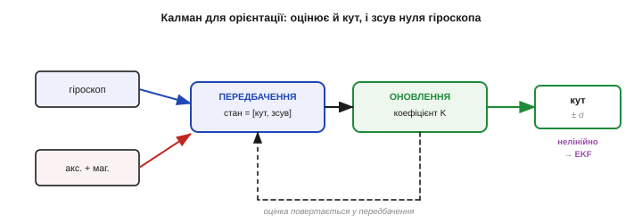
*Рис. 5.8.4.7. Калман для орієнтації. Стан фільтра — це не лише кут, а й, наприклад, **зсув нуля гіроскопа**: фільтр оцінює й сам дрейф, а тому гасить його значно краще. Передбачення йде від гіроскопа, корекція — від акселерометра й магнітометра. На виході — кут **і** його певність. Бо орієнтація нелінійна, на практиці беруть **розширений** фільтр Калмана (EKF).*

Дві практичні примітки. Перша: до **стану** фільтра зазвичай додають не лише кут, а й **зсув нуля гіроскопа** — тоді фільтр оцінює сам дрейф і давить його куди краще за будь-який комплементарний. Друга: позаяк орієнтація — річ **нелінійна** (повороти не додаються як числа), у дронах і AHRS застосовують **розширений фільтр Калмана** (*EKF, Extended Kalman Filter*) — той самий принцип, пристосований до нелінійних задач. Саме EKF крутиться всередині більшості польотних контролерів, видаючи той надійний кватерніон орієнтації, з якого ми почали розділ.

За все це треба платити, і ціну варто назвати чесно. Фільтр Калмана потребує **моделі** системи й **чисел шуму**: Q — наскільки брехлива модель, R — наскільки шумний давач; їх доводиться оцінювати чи підбирати, і кепські Q, R дадуть кепський фільтр. Він важчий за один рядок комплементарного — це матриці, обернення, більше коду й обчислень (хоча сучасний мікроконтролер тягне його легко). А ще він строго оптимальний лише в теорії — для лінійних задач із гаусовим шумом; реальність нелінійна, тож на практиці беруть наближення (той-таки EKF, а подеколи «несцентований» UKF). Тому правило інженера просте: не ускладнюйте без потреби — Калман доречний там, де його переваги справді потрібні, а не сам по собі.

Де ви зустрінете фільтр Калмана на практиці? Майже скрізь, де щось рухається й має знати, **де** воно: у польотних контролерах дронів (PX4, ArduPilot, Betaflight), у модулях орієнтації AHRS, у GPS-приймачах, автомобільних системах допомоги водієві, кроковому підрахунку телефонів. Здебільшого він захований у бібліотеці, тож писати його з нуля вам навряд чи доведеться. Але тепер, **розуміючи** ідею «передбачення плюс вимір, зважені за певністю», ви свідомо задасте йому рівні шуму й правильно витлумачите його вихід, замість тицяти коефіцієнти навмання. А головне — ви відрізните задачу, де вистачить копійчаного комплементарного фільтра, від тієї, де справді потрібен Калман: це вміння економить і код, і години відлагодження.

Отже, ми пройшли весь шлях «знати свою орієнтацію»: від кутів Ейлера й кватерніонів — через комплементарний фільтр — до ідеї Калмана. Тепер апарат **знає**, як він повернутий, і наскільки цьому можна вірити — від наочних кутів для людини до надійного кватерніона всередині й оцінки власної певності на додачу. Лишилося друге, головне вміння розділу — **тримати** бажану орієнтацію: замкнути зворотний зв'язок і змусити апарат самого виправляти своє відхилення. Саме до цього — до замкненого керування зі зворотним зв'язком — ми й переходимо в наступній темі.

---

## 5.8.5 Зворотний зв'язок: розімкнене проти замкненого керування

Тепер апарат **знає** свою орієнтацію. Лишилося навчити його цю орієнтацію **тримати** — самому повертатися до бажаного стану, хоч би що його збивало. І тут є рівно два способи керувати будь-якою машиною — від нагрівача до дрона. Перший — **наказати й не дивитися** на результат. Другий — **дивитися на результат і виправлятися**. Уся різниця між ними — в одному: чи зважає машина на **помилку**. Цей крихітний на вигляд вибір визначає, чи працюватиме ваш апарат у реальному, непередбачуваному світі.

### Розімкнене керування: діяти за планом

**Розімкнене** (*open-loop*) керування діє за наперед заданим планом, **не перевіряючи** наслідків. Ви наказуєте виконавчому органу «зроби отак» — і сподіваєтесь, що вийде як треба.

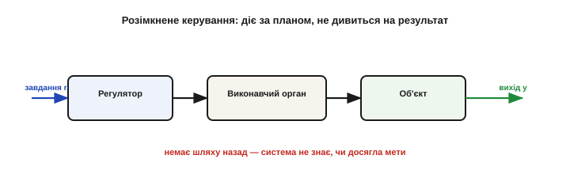
*Рис. 5.8.5.1. Розімкнене керування. Завдання → регулятор → виконавчий орган → об'єкт → вихід, і **жодного шляху назад**. Система виконує план, але ніколи не дізнається, чи досягла мети: вона **не дивиться** на свій результат.*

Приклади довкола: мікрохвильовка гріє рівно 30 секунд, байдуже, нагрілася їжа чи ні; кроковому двигуну посилають «на 90°», вірячи, що він туди дійшов; ви наливаєте воду «на три секунди». Поки світ **передбачуваний** і ніщо не заважає, цього досить — і це дешево: не треба ні давача, ні мудрого керування. Розімкнене керування — простий і чесний робочий кінь там, де збурень нема або вони дрібні.

І таких місць більше, ніж здається. 3D-принтер веде голівку кроковими двигунами розімкнено, бо механіка точна й передбачувана; світлофор перемикається за таймером; пральна машина крутить програму, не питаючи, чи чистий одяг. Спільне в них одне: середовище **відкаліброване й стабільне**, тож план надійно дає результат. Розімкнене керування — це ставка на передбачуваність: воно працює чудово, поки світ поводиться так, як ми думали, і провалюється рівно тоді, коли ні.

Та щойно втручається **непередбачене**, розімкнене керування безпорадне. Кроковий двигун під навантаженням може «пропустити» крок — і опиниться не на 90°, а команда цього **не знатиме**. Мікрохвильовка не помітить, що їжа була крижана. Розімкнена система не має способу дізнатися, що пішло не так, бо вона **взагалі не дивиться** на результат. Вона виконує план, а не досягає мети — і це її докорінна вада.

### Замкнене керування: дивитися на результат

**Замкнене** (*closed-loop*) керування робить те, чого бракує розімкненому: **міряє** фактичний результат, **порівнює** з бажаним і діє, щоб **скоротити різницю**. Це і є **зворотний зв'язок**.

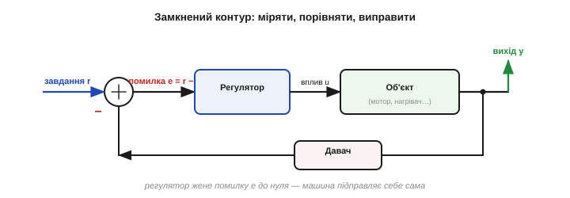
*Рис. 5.8.5.2. Анатомія замкненого контуру. **Завдання** r мінус виміряний **вихід** y дає **помилку** e. Регулятор перетворює e на **вплив** u, виконавчий орган діє на **об'єкт**, давач міряє новий вихід — і коло замикається. Знак на вузлі віднімання — «−»: вплив іде **проти** помилки (від'ємний зворотний зв'язок).*

Розберемо складові — вони ті самі в будь-якому контурі. Є **завдання** (*setpoint*, r) — чого ми хочемо: бажаний кут, швидкість, температура. Є **давач**, що міряє фактичний **вихід** y. Їхня різниця — **помилка** e = r − y — каже, наскільки й у який бік ми схибили. **Регулятор** перетворює помилку на **керівний вплив** u, а **виконавчий орган** (мотор, нагрівач) діє ним на **об'єкт** (*plant*). Вихід міняється, давач його знову міряє — і коло замикається. Машина безперервно **підправляє себе**, женучи помилку до нуля.

Важливо, що цей цикл крутиться **безперервно й часто** — десятки чи сотні разів на секунду. Регулятор не діє раз і назавжди: він щомиті заново міряє вихід, рахує свіжу помилку й коригує вплив. По суті, регулятор — це просто **правило**, що перетворює помилку e на вплив u, виконуване знову й знову. Уся хитрість — у тому, **яким** має бути це правило; самої ідеї «міряти й виправляти» для надійного керування ще замало.

Знак тут критичний: вплив завжди спрямований **проти** помилки — це **від'ємний** зворотний зв'язок. Виходить менше, ніж треба, — додати; більше — зменшити. Якби зв'язок був **додатний** (регулятор підсилював би помилку, а не гасив), система розганяла б відхилення й миттю йшла «вразнос». Уся стабільна техніка тримається саме на **від'ємному** зворотному зв'язку.

Замкнені контури оточують нас: термостат тримає температуру, круїз-контроль — швидкість, автопілот — курс, зарядка — напругу, а наш дрон — кут нахилу. У кожному є та сама п'ятірка: завдання, давач, помилка, регулятор, об'єкт. Опанувавши її раз, ви впізнаватимете контур керування будь-де — і будуватимете власні за тим самим шаблоном, хоч би чим керували.

### Помилка — серце керування

Усе замкнене керування крутиться навколо одного числа — **помилки** e = r − y. Вона — і паливо, і компас регулятора: каже, **наскільки** діяти й у **який** бік.

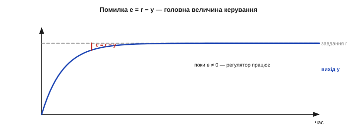
*Рис. 5.8.5.3. Помилка в часі. Сіра пунктирна — завдання r; синя — фактичний вихід y, що до нього підходить; затінений проміжок між ними — **помилка** e = r − y. Регулятор працює, поки e ≠ 0, і «заспокоюється», коли вихід дотягується до завдання.*

Поки помилка не нуль — регулятор працює, штовхаючи вихід до завдання. Помилка нуль — регулятор «заспокоюється». Уся решта розділу (П, І, Д) — це, по суті, **різні способи перетворити помилку на дію**: пропорційно до неї самої, до її накопиченої суми чи до швидкості її зміни. Тож запам'ятайте e = r − y як головну величину всього, що буде далі: усі три складові ПІД — лише різні відповіді на питання «що зробити з цією помилкою».

Кілька слів про саму помилку. Вона має **розмірність** тієї величини, якою керуємо: для температури — у градусах, для швидкості — у км/год, для орієнтації — у градусах кута. І вона **знакова**: e = r − y додатна, коли виходу бракує до завдання, і від'ємна, коли його забагато, — саме знак каже регулятору, у який бік діяти. Для нашого дрона помилка крену — це просто «бажаний кут мінус виміряний», а виміряний дає фільтр із §5.8.3: додатна помилка — нахилити в один бік, від'ємна — у протилежний. Уся орієнтаційна частина розділу зійшлася саме тут: вихід давачів став помилкою, з якою тепер працюватиме регулятор.

> 🔧 **Навіщо це.** Першим у будь-якому контурі керування визначте **помилку й її знак**: що таке r, що таке y, і в який бік діє регулятор. Переплутаний знак перетворює рятівний від'ємний зв'язок на згубний додатний — і апарат замість того, щоб триматися, **сам себе розганяє** в аварію. Це та сама пастка зі знаком осей, що й у фільтрах (§5.8.3), і ловиться вона тим самим тридцятисекундним тестом: відхиліть вихід рукою й перевірте, що регулятор штовхає його **назад**, а не далі.

### Чому розімкнене ламається: збурення

Чому ж замкнене керування варте зайвого давача й мороки? Через **збурення** (*disturbances*) — усе непередбачене, що збиває вихід: вітер, ухил, зміна навантаження, розряд батареї, виробничий допуск деталі. Розімкнена система їх **не бачить** і тому пропускає; замкнена — **реагує**, бо дивиться на фактичний результат.

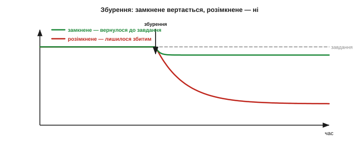
*Рис. 5.8.5.4. Придушення збурення. До моменту збурення обидві системи тримають завдання. Зненацька — навантаження (стрілка). Розімкнена (червона) просіла й **так і лишилася** збитою: вона не знає, що схибила. Замкнена (зелена) просіла, **помітила** помилку й **вернула** вихід до завдання. У цьому вся цінність зворотного зв'язку.*

**Приклад (круїз-контроль на пагорбі).** Машина тримає 100 км/год.

```
Розімкнене: газ виставлено на 30 % — рівно стільки треба на рівному.
  Починається підйом (збурення) → швидкість падає до 85 і ТАК І ЛИШАЄТЬСЯ.
  Система не знає, що схибила: газ як був 30 %, так і лишився.

Замкнене:  давач міряє 85 → помилка  e = 100 − 85 = +15 км/год.
  Регулятор додає газу, аж поки швидкість не вернеться до 100 → e → 0.
```

Розімкнене керування виконало план (30 % газу) — і провалило мету (100 км/год). Замкнене проґавило б план, зате досягло мети. У реальному світі, повному збурень і неточностей, важить саме друге — тому майже все, що має надійно **тримати** стан, будують замкненим.

Збурення — не єдина біда розімкненого керування; друга — **похибка моделі**. Навіть без вітру й пагорбів реальна машина ніколи не точно така, як план: двигун трохи слабший за паспорт, деталь — на межі допуску, давач трохи розкалібрувався, акумулятор просів. Розімкнена система всі ці дрібні розбіжності **накопичує**, бо ні з чим звіритися. Замкнена ж їх просто **поглинає**: яка б не була справжня машина, регулятор однаково жене вихід до завдання за фактичним виміром. Тому зворотний зв'язок прощає і збурення, і неточність власної моделі — а це величезна перевага, адже ідеально точної моделі не буває ніколи.

> 🔧 **Навіщо це.** Питайте себе про кожну функцію апарата: **наскільки передбачуване середовище?** Якщо збурень практично нема (рух у точному механізмі, дозування на стенді) — розімкнене керування дешевше й простіше, не ускладнюйте. Якщо ж діють вітер, нахили, змінне навантаження чи розкид деталей (а політ, балансування, тримання курсу — це саме вони) — замкнений контур **обов'язковий**, і витрати на давач окупляться сповна. Вибір «розімкнене чи замкнене» — перше архітектурне рішення в будь-якому керуванні.

### Приклад з кермом

Найнаочніша модель — кермувати авто. **Розімкнено**: виставте кермо під фіксованим кутом і заплющте очі — найменший ухил дороги чи порив вітру поведе машину вбік, і ви з'їдете в кювет, бо не виправляєтесь. **Замкнено**: ви дивитеся на дорогу, бачите відхилення (помилку) і **підкручуєте** кермо проти нього — і тримаєтеся смуги, попри вибоїни й вітер. Водій — це **регулятор у контурі зворотного зв'язку**: очі — давач, кермо — виконавчий орган, смуга — завдання.

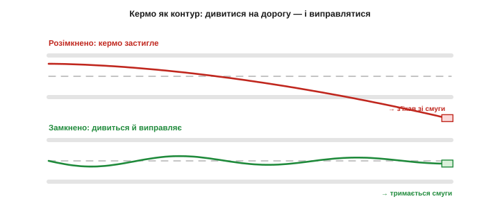
*Рис. 5.8.5.5. Кермо як контур. Угорі (розімкнено): кермо застигле — найменше збурення зводить машину зі смуги, і вона не вертається. Унизу (замкнено): водій бачить відхилення й виправляє його, тож машина тримається смуги, лише трохи коливаючись довкола центру. Та сама дорога, та сама машина — різниця тільки в тому, чи дивляться на результат.*

Не випадково саме з кермування (грецьке *kybernētēs* — стерновий, згадайте історію розділу) виросли і слово «кібернетика», і вся теорія керування. Жива природа теж уся на зворотному зв'язку: тіло тримає температуру, рівень цукру, рівновагу — це **гомеостаз**, той самий замкнений контур, тільки біологічний. Зворотний зв'язок — не інженерний трюк, а загальний принцип, яким і машини, і організми тримають себе в потрібному стані.

Аналогія з водієм має й повчальний бік: людина-регулятор недосконала. У неї є **затримка** реакції й межі швидкодії — і саме тому відвернена увага (телефон, утома) фактично **розмикає** контур: на ті секунди, поки ви не дивитеся на дорогу, керування стає розімкненим — і машина починає з'їжджати. Аварія від неуважності — це буквально розірваний контур зворотного зв'язку. Та сама затримка, до речі, обмежує й технічні регулятори: контур, що реагує запізно, легше розгойдати, — до цього ми ще повернемося.

### Ціна зворотного зв'язку

Зворотний зв'язок не безкоштовний. По-перше, потрібен **давач** — без виміру немає помилки, немає й замкненого керування (саме тому пів модуля ми вчилися давачі читати й чистити). По-друге — і це найважливіше — замкнений контур можна **зробити нестабільним**. Якщо регулятор реагує надто різко, він перестрілює ціль, тоді перестрілює назад, дедалі сильніше — і система йде «вразнос». Це те саме **хитання**, що мучило парові машини й що його порахували Максвелл і Вишнеградський (історія розділу).

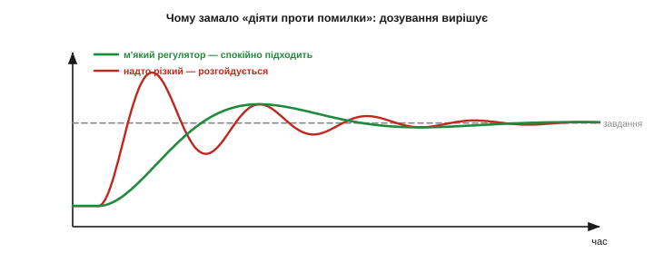
*Рис. 5.8.5.6. Чому замало «діяти проти помилки». М'який регулятор (зелений) спокійно підходить до завдання. Надто різкий (червоний) перестрілює, вертається, знову перестрілює — і **розгойдується**. Між «мляво» і «вразнос» лежить золота середина — і знайти її означає **спроєктувати** регулятор.*

Ось чому замало просто «діяти проти помилки» — треба діяти **правильно дозовано**. Занадто мляво — система повзе до цілі вічність; занадто різко — розгойдується аж до аварії. Знайти золоту середину й означає **спроєктувати регулятор**. Як саме перетворювати помилку на дію, щоб вийшло і швидко, і стійко, — про це вся решта розділу: пропорційна (§5.8.6), інтегральна (§5.8.7) і диференційна (§5.8.8) складові, з яких складають **ПІД**.

Є й третя плата за зворотний зв'язок, про яку легко забути: контур **підсилює шум давача**. Регулятор діє на те, що **бачить**, тож тремтіння виміру (а воно є завжди, Розділ 5.7) перетікає в смикання виконавчого органу — мотори «нервують», гріються, зношуються. Тому реальний контур — це завжди компроміс трьох сил: швидкість реакції, стійкість і чутливість до шуму. Додайте сюди ще **затримку** в петлі (давач, обчислення й виконавчий орган реагують не миттєво) — і стане ясно, чому керування доводиться **проєктувати**, а не просто «увімкнути зворотний зв'язок».

> 🔧 **Навіщо це.** Не женіться за «найсильнішим» регулятором. Три сили тягнуть у різні боки: підкрутити реакцію — швидше виправляє збурення, але ближче до розгойдування й голосніше передає шум у мотори. Тому, будуючи контур, дбайте не лише про коефіцієнти регулятора, а й про **частоту циклу** (що швидший і рівномірніший контур, то легше зробити його стійким) і про **чистоту виміру** (фільтри з Розділів 5.4–5.6 тут не розкіш, а частина системи керування). Гарний регулятор — це баланс, а не максимум.

Наостанок — звідки сам термін. Слово «зворотний зв'язок» (*feedback*) прийшло в інженерію з несподіваного боку — з **підсилювачів**. 2 серпня 1927 року молодий інженер Bell Labs **Гарольд Блек** (*Harold Black*), пливучи поромом через Гудзон на роботу, у спалаху осяяння винайшов **підсилювач зі зворотним зв'язком**: він навмисне завертав частину виходу назад на вхід **із протилежним знаком** — і це приборкувало спотворення (зворотний зв'язок дозволяв зменшити їх хоч у сто тисяч разів — ціною частини підсилення). Ідею Блек тут-таки нашкрябав на чистій сторінці ранкової газети, бо не мав під рукою паперу. Його від'ємний зворотний зв'язок зробив можливим далекий телефонний зв'язок — і дав усій теорії керування її головне поняття. А ще раніше той самий принцип уже крутив кулі регулятора Уатта; просто Блек зробив із нього точне інженерне поняття, з яким воно й живе досі.

Відтоді зворотний зв'язок став спільною мовою всієї техніки: те, що тримає звук у підсилювачі чистим, оберти парової машини — сталими, а дрон — рівним, описують **однаково**, одним контуром. Опанувавши його раз, ви впізнаєте його скрізь. Нам лишилося навчитися головного — **правильно дозувати** реакцію регулятора на помилку, щоб вийшло і швидко, і стійко. Із найпростішого дозування — пропорційного, прямо за величиною помилки — і почнемо наступну тему.

---

## 5.8.6 Пропорційний регулятор (P): сила за помилкою

Ми знаємо: регулятор має перетворювати помилку e на вплив u. Найпростіше й найприродніше правило — діяти **пропорційно** помилці: що більше схибив, то сильніше виправляй. Це **пропорційний регулятор**, літера **P** у «ПІД». Він уже сам по собі вміє тримати систему — і вже сам по собі має характерну ваду, заради якої знадобляться наступні дві літери. Розберемо і силу, і слабкість P.

Варто одразу сказати: пропорційна складова — **головна** в більшості регуляторів. Саме вона робить основну роботу — швидко й сильно реагує на відхилення, — а інтегральна й диференційна лише **доточують** її, прибираючи дрібні, але дратівливі вади. Чимало реальних контурів узагалі обходяться **самим P** (або P із крихтою D). Тому зрозуміти пропорційну складову до кінця — найважливіше; решта ляже на неї як уточнення. До того ж P історично перший: саме «дій сильніше, що далі від цілі» першим спадає на думку, коли хочеш щось утримати.

### Правило: дія пропорційна помилці

Уся суть пропорційного регулятора — в одному рядку:

```
 u = Kp · e            (e = r − y — помилка)

 велика помилка  →  велика дія
 мала помилка    →  м'яка дія
 нульова помилка →  дії нема
```


*Рис. 5.8.6.1. Пропорційний закон u = Kp·e. Вплив — пряма лінія через нуль із нахилом Kp: що далі вихід від завдання (більша помилка), то сильніша дія; на самій цілі (e = 0) дія зникає. Знак автоматично правильний: помилка в один бік — дія в той самий, що повертає до завдання.*

Число **Kp** — **пропорційний коефіцієнт** (підсилення). Він задає «жорсткість» регулятора: скільки впливу припадає на одиницю помилки. Більший Kp — сильніша, різкіша реакція; менший — м'якша, повільніша. Уся поведінка P-регулятора визначається цим одним числом — і вибір Kp і є його налаштуванням.

Найважливіша риса пропорційного регулятора — він **миттєвий і без пам'яті**. Його дія залежить **тільки** від помилки **зараз**: ні від того, якою вона була секунду тому, ні від того, як довго вона тривала. Свіже відхилення на 5° і відхилення на ті самі 5°, що держиться вже хвилину, P відпрацює **однаково**. Ця простота — і сила (нема чого нагромаджувати, реакція негайна), і корінь головної вади: не маючи пам'яті про **минуле**, P не здатний помітити, що «недотягує» вже довго, — і тому не виправляє сталого зсуву. Запам'ятайте цю безпам'ятність: саме її компенсуватиме інтегральна складова.

Зверніть увагу й на **розмірність** Kp: він переводить помилку у вплив, тож має одиниці «вплив на одиницю помилки» — наприклад, «одиниць тяги на градус крену». Знак виходить правильним автоматично й симетрично в обидва боки: відхилення вгору дає дію вниз, відхилення вниз — дію вгору. У процесному керуванні те саме Kp часто задають «навиворіт» — як **смугу пропорційності** (*proportional band*): на скільки відсотків має змінитися помилка, щоб вплив пройшов увесь свій діапазон. Велика смуга = малий Kp, вузька смуга = великий Kp; це лише інша мова про те саме число.

### Як пружина

Найкраща інтуїція для P — **пружина**. Розтягніть пружину сильно — вона тягне сильно; трохи — тягне трохи; відпустіть у спокої — не тягне зовсім. Пропорційний регулятор робить те саме з помилкою: що далі система від цілі, то дужче він її «притягує» назад, як пружина притягує вантаж до положення спокою.

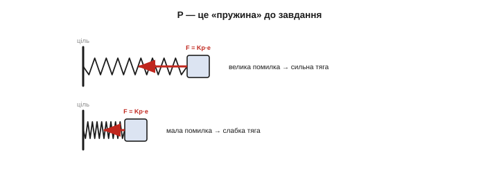
*Рис. 5.8.6.2. P — це «пружина» до завдання. Сила, з якою регулятор повертає вихід до цілі, пропорційна відхиленню (помилці) — точно як сила пружини пропорційна її розтягу. Kp — це «жорсткість» цієї віртуальної пружини: більший Kp — тугіша пружина, що смикає сильніше.*

Та сама картинка працює і з кермом: що далі ви з'їхали від центру смуги, то крутіше підвертаєте кермо назад. Пропорційне керування — це найприродніший спосіб, яким діє й людина, і пружина: **реакція за величиною відхилення**.

Аналогія з пружиною підказує і ваду. Пружина теж **не має пам'яті**: у своєму положенні спокою вона не тягне зовсім, хоч би скільки там стояла. Повісьте на неї вантаж — вона розтягнеться рівно настільки, щоб її сила зрівноважила вагу, і застигне в **новому** положенні, **нижчому** за вільне. Точно так само поводиться P під навантаженням: щоб дати потрібну для утримання силу, він мусить лишитися трохи «розтягнутим» — трохи відхиленим від цілі. Те, що для пружини є просядання під вантажем, для регулятора є **сталий зсув** — і це та сама фізика, а не випадковість.

Корисно протиставити P найгрубішому регулятору — **дворежимному** (*bang-bang*, «увімк-вимк»), як-от у простого термостата: холодно — нагрівач на повну, тепло — вимкнено. Він теж замкнений, але діє **стрибком**, тож величина весь час «пилкою» гуляє довкола завдання, а виконавчий орган клацає туди-сюди. Пропорційний регулятор натомість **дозує** дію плавно — що ближче до цілі, то м'якше — і тому тримає вихід рівніше, без різких перемикань і зайвого зносу. Саме тому термостат у холодильнику чутно клацає, а добре налаштований регулятор обертів двигуна тримає швидкість гладко й нечутно. Плавність — головна перевага P над грубим «увімк-вимк».

### Коефіцієнт Kp: швидше проти стійкіше

Чому не поставити Kp якомога більшим, щоб виправляти помилку миттєво? Бо тут знову той самий компроміс, що ми бачили в кінці §5.8.5. **Малий Kp** — регулятор м'який: підходить до цілі повільно, ліниво. **Великий Kp** — різкий: швидко кидається до цілі, але **перестрілює**, вертається, знову перестрілює — і при завеликому Kp розгойдується.

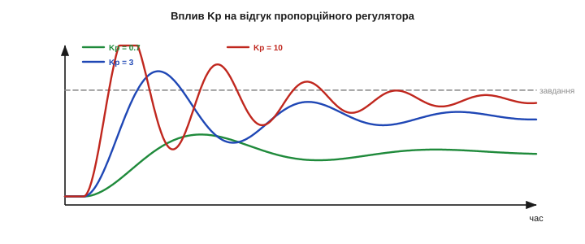
*Рис. 5.8.6.3. Як Kp змінює відгук (обчислено для об'єкта з інерцією). Малий Kp (зелений) — повільно повзе до завдання й зупиняється помітно нижче. Середній (синій) — добрий баланс. Великий (червоний) — стрімко кидається, перестрілює й довго розгойдується. Швидкість і стійкість тягнуть Kp у різні боки.*

Отже, Kp не можна ні занизити, ні завищити: десь посередині лежить добрий баланс — швидко, але без розгойдування.

Як його шукати на практиці? Найпоширеніший рецепт для P: вимкніть поки що інтегральну й диференційну складові (I = D = 0), почніть із **малого** Kp і поступово **піднімайте** його, спостерігаючи за апаратом. Спершу реакція пришвидшуватиметься; у певний момент система почне ледь помітно **коливатися** на сталій амплітуді — це «гранична» жорсткість. Трохи відступіть назад (приблизно вдвічі) — і матимете швидкий, але ще стійкий P. Цей прийом «підняти до межі коливань і відступити» — основа багатьох методик налаштування (зокрема Зіглера–Ніколса, до якої ми дійдемо в §5.8.10).

> 🔧 **Навіщо це.** Налаштовуйте ПІД **по черзі**, починаючи з чистого P. Спокуса крутити всі три коефіцієнти одразу майже завжди закінчується хаосом — ви не розумієте, що на що впливає. Спершу самим Kp досягніть швидкої, ледь-ледь недорозгойданої реакції (I і D у нулі); аж потім додавайте решту — диференційну складову проти коливань та інтегральну проти зсуву (порядок і причини — у §5.8.10). Один коефіцієнт за раз — і ви бачитимете дію кожного окремо, а не гадатимете. Та хоч би як влучно ви обрали Kp, лишиться ще одна, тонша вада, якої самим лиш Kp **не прибрати**.

### Вроджена вада: сталий зсув

Придивіться до рис. 5.8.6.3 ще раз: **жодна** крива не сіла точно на завдання — усі застигли трохи **нижче**. Це не випадковість і не погане налаштування, а **вроджена** вада пропорційного регулятора — **сталий зсув** (*steady-state error*, або «просідання», *droop*).


*Рис. 5.8.6.4. Сталий зсув пропорційного регулятора. Вихід застигає не на завданні, а трохи нижче — на відстані e_ss. Більший Kp (синій) лишає менший зсув, ніж малий (зелений), — але **жоден** скінченний Kp не зводить його до нуля. P-регулятор за самою своєю природою «недотягує».*

Звідки він береться? З простого, але невблаганного факту. Щоб **утримувати** систему в заданому стані проти сталого опору — ваги, тертя, втрат тепла, перекосу, — потрібен **ненульовий** вплив u₀. А P-регулятор дає вплив **лише з помилки**: u = Kp·e. Виходить замкнене коло: щоб мати ненульовий вплив, потрібна ненульова помилка. Тож регулятор **навмисне** тримає маленьку постійну помилку — рівно таку, щоб вона породжувала потрібний для утримання вплив.

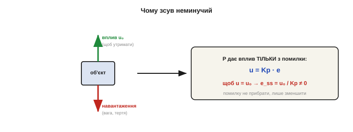
*Рис. 5.8.6.5. Чому зсув неминучий. Щоб тримати об'єкт проти сталого навантаження (вага, тертя, втрати), потрібен ненульовий вплив u₀. Але P дає вплив тільки з помилки: u = Kp·e. Отже, щоб був вплив u₀, мусить лишатися помилка e_ss = u₀/Kp. Прибрати її пропорційним регулятором **неможливо** — лише зменшити, піднявши Kp.*

Кількісно зсув дорівнює `e_ss = u₀/Kp`: чим більший Kp, тим менший зсув, — але оскільки Kp не можна піднімати безмежно (розгойдається), якийсь зсув **завжди** лишається.

**Приклад (пропорційне керування креном дрона).** Нехай Kp = 4 (одиниці тяги на градус).

```
 Виміряно крен +10°, ціль 0°  →  e = 0 − 10 = −10°
 Дія: u = Kp·e = 4·(−10) = −40   →  нахилити назад.
 Що ближче крен до нуля, то слабша дія — апарат м'яко вирівнюється.

 Сталий зсув: щоб тримати рівень проти перекосу, треба u₀ = 8.
   e_ss = u₀/Kp = 8/4 = 2°   →  дрон зависає на 2° від рівня.
   Піднімемо Kp до 16 → e_ss = 8/16 = 0.5°, але ближче до розгойдування.
```

Дрон тримається — але не рівно, а з невеликим постійним нахилом. Збільшення Kp цей нахил зменшує, та водночас підштовхує апарат до коливань. Класична пастка: зсув і стійкість тягнуть Kp у протилежні боки, і пропорційним регулятором обидві проблеми одразу не розв'язати.

Зверніть увагу, від чого залежить величина зсуву: від **навантаження** й від Kp. Що більший потрібний для утримання вплив u₀ (важчий вантаж, сильніше тертя, крутіший пагорб), то більший зсув при тому самому Kp. Якщо ж навантаження мізерне — об'єкт і сам охоче лишається де треба, — зсув буде крихітним, ледь помітним. Тому той самий P-регулятор може здаватися бездоганним на стенді без навантаження й помітно «недотягувати» в реальній роботі. Для нашого дрона роль такого сталого навантаження грає, скажімо, трохи зміщений центр ваги (батарея не точно по центру): P утримає апарат, але — з невеликим постійним нахилом у бік перекосу, і що важчий перекіс, то більший нахил.

І ще одне про Kp, що рятує від плутанини: це число **не універсальне**. Його «правильне» значення залежить від усього вашого контуру — від сили моторів, маси апарата, одиниць, у яких ви міряєте помилку й видаєте вплив, навіть від частоти циклу. Kp = 4, чудовий для одного дрона, може бути надто млявим або згубно різким для іншого. Тому коефіцієнти ПІД ніколи не переносять наосліп із чужого проєкту — їх **налаштовують під конкретний апарат**, а чуже значення годиться хіба що як груба відправна точка. Запам'ятайте це як осторогу проти копіювання коефіцієнтів із форумів: те, що ідеально літало в когось, у вас може й перекинути апарат.

> 🔧 **Навіщо це.** Якщо ваш P-регульований апарат стабільно «недотягує» — тримається трохи нижче завдання, з постійним однаковим зсувом, — **не кидайтеся** лікувати це безкінечним підкручуванням Kp. Сталий зсув — не помилка налаштування, а **вроджена** риса пропорційного керування; великий Kp лише зменшить його ціною коливань. Правильні ліки — інша складова (інтегральна, §5.8.7), а не більший Kp. Розпізнати «це сталий зсув P, а не поганий Kp» — половина успіху в налаштуванні.

### Чому не просто збільшити Kp

Спокуса «підняти Kp і забути про зсув» розбивається не лише об розгойдування. Великий Kp ще й **підсилює шум**: регулятор діє на помилку, а помилка несе тремтіння давача (Розділ 5.7), тож що більший Kp, то сильніше це тремтіння перетікає в смикання моторів. До того ж виконавчий орган **не безмежний**: при великій помилці u = Kp·e може вискочити за межі того, що мотор узагалі здатен дати (**насичення**), — і далі рости Kp вже немає куди. Тож Kp обмежений з усіх боків: стійкістю, шумом і насиченням.

На насиченні варто спинитися окремо, бо воно підступне. Коли вплив упирається в стелю (мотор уже на повних обертах, кермо вивернуте до упору), регулятор **більше нічого не може зробити**, хоч би яку велику помилку показував давач, — і на цей час контур фактично **розмикається**: апарат летить «як вийде», поки помилка не спаде. Тому проєктувати Kp, мовби виконавчий орган здатен на будь-яку дію, — небезпечно: у реальності він має межу, і добрий регулятор поводиться розумно, навіть коли в неї впирається. (Своя, навіть гірша, біда від насичення спіткає й інтегральну складову — це сумнозвісний *windup*, про який у §5.8.7.)

> 🔧 **Навіщо це.** Перевіряйте регулятор не лише на дрібних відхиленнях, а й на **великих**. Саме там вплив u = Kp·e вискакує в **насичення** виконавчого органу — і поведінка стає геть іншою, ніж підказує лінійна формула. Якщо апарат добре тримається біля цілі, але дивно поводиться після сильного поштовху чи різкої зміни завдання, перша підозра — насичення моторів. Знати межу свого виконавчого органу так само важливо, як і вибрати Kp.

### Що далі: автоматичний «скидач»

Сталий зсув — стара знайома проблема. Ще регулятор Уатта (історія розділу) тримав оберти трохи нижче бажаних — і це було те саме «просідання». У ранніх промислових регуляторах оператор прибирав зсув **вручну**: підкручував окремий гвинт-«скидач» (*reset*), додаючи постійну поправку, аж поки вихід не сідав точно на завдання.

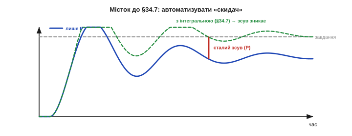
*Рис. 5.8.6.6. Місток до наступної теми. Пропорційний регулятор швидко й стійко підводить вихід до завдання, але лишає **сталий зсув**. Прибрати його «руками» щоразу — марудно; тож цей «скидач» **автоматизували** — і так народилася **інтегральна** складова (§5.8.7), що сама накопичує поправку, доки зсув не зникне.*

А потім інженери зробили очевидне: **автоматизували** цей скидач. Хай регулятор сам потроху додає поправку, доки лишається помилка, — і сам її прибере, коли вихід дотягнеться до завдання. Так народилася **інтегральна** складова, до якої ми переходимо. Пропорційна частина дає швидку, пружну реакцію на помилку **тут і тепер**; лишилося навчити регулятор пам'ятати **накопичену** помилку — і сталий зсув зникне сам.

Підсумуймо. Пропорційний регулятор — кістяк усього ПІД: проста, миттєва, «пружна» реакція на поточну помилку, керована одним числом Kp. Він дає основну силу, що тримає систему біля цілі, і його самого часто майже досить. Та через свою **безпам'ятність** він лишає **сталий зсув**, а нарощувати Kp без міри не дають коливання, шум і насичення. Бракує двох речей: пам'яті про **минулу** помилку (щоб прибрати зсув) і чуття до **майбутньої** (щоб погасити коливання). Перше дає інтегральна складова, друге — диференційна. До першого — інтеграла — переходимо просто зараз. Адже сталий зсув — не дрібниця: для дрона це постійний нахил, для нагрівача — вічно недогріта кімната, для круїз-контролю — хронічний недобір швидкості на підйомі. Прибрати цей зсув і покликана наступна складова.

---

## 5.8.7 Інтегральна складова (I): прибрати сталий зсув

Пропорційний регулятор лишав сталий зсув через свою **безпам'ятність**: він бачить тільки помилку **зараз** і не помічає, що «недотягує» вже довго. Ліки очевидні — дати регуляторові **пам'ять**: хай він накопичує помилку в часі й, поки вона лишається, додає дедалі більше впливу, аж доки не зажене її точно в нуль. Це **інтегральна** складова, літера **I** у «ПІД» — та сама, що автоматизує ручний «скидач» із кінця §5.8.6.

Якщо пропорційну складову уявляти як пружину, то інтегральну — як **наполегливість**. Вона не сильна вмить, зате **невтомна**: щомиті додає по краплі впливу, поки лишається бодай натяк на помилку. Уявіть, як наповнюєте склянку точно до риски: ви доливаєте й доливаєте, потроху, аж доки рівень не стане **рівно** на лінії, — і тоді спиняєтесь. Інтеграл робить те саме з помилкою: ллє вплив, доки вона не зникне зовсім. Це терпіння там, де пропорційній складовій бракує самої лише сили.

### Накопичувати помилку

Інтегральна складова дивиться не на миттєву помилку, а на її **накопичену суму** в часі — математично це **інтеграл** помилки, ∫e dt. Згадайте з геометрії: інтеграл — це **площа під кривою**. Тож I весь час підсумовує «площу» помилки: поки помилка є, площа росте; що довша й більша помилка, то швидше росте.

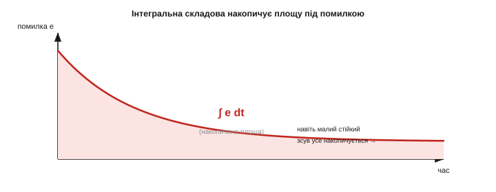
*Рис. 5.8.7.1. Що накопичує інтеграл. Червона — помилка в часі; затінена ділянка — її накопичена «площа» ∫e dt. Поки помилка не нуль, площа **росте**; навіть крихітна, але стійка помилка з часом накопичується у велику суму. Саме цю суму інтегральна складова й перетворює на додатковий вплив.*

У цьому головна сила I: він **терплячий**. Хоч якою малою була б стала помилка, дай їй час — і накопичена сума стане досить великою, щоб її здолати. Там, де пропорційний регулятор «махнув рукою» на крихітний залишковий зсув, інтегральний **продовжує тиснути**, бо пам'ятає: ми недотягуємо вже довго.

Технічно інтеграл — це просто **поточна сума**: щокроку до накопичувача додають свіжу помилку, помножену на крок часу. Велика помилка наповнює його швидко, мала — повільно, але **неухильно**. Тому інтеграл розрізняє те, чого не бачить пропорційна складова: довга вперта маленька помилка (наш сталий зсув) накопичується в чималу суму — і саме її інтеграл зрештою долає.

Наочно це видно на круїз-контролі з §5.8.5. На пагорбі пропорційний регулятор додав газу за помилкою швидкості, але — пам'ятаєте — застиг трохи нижче 100, бо для підйому потрібен постійний надлишок газу. Інтегральна складова цей надлишок **намацає сама**: поки швидкість трохи нижча за 100, інтеграл повільно піднімає газ, аж доки спідометр не покаже рівно сто; на спуску — навпаки, поволі прибере. Так круїз-контроль тримає **точну** швидкість на будь-якому профілі дороги, а не лише на рівному.

Варто відчути й **темп** інтеграла: він — найповільніша з трьох складових. Пропорційна реагує миттєво, інтегральна ж розгойдується поволі: їй треба час, щоб накопичити суму, і так само час, щоб її «розрядити». Через це I має найдовшу пам'ять у регуляторі — і це водночас дар (помічає стійкий зсув, який усі проґавили) і небезпека (повільно відпускає, тож легко переганяє ціль за інерцією). Тримати цей повільний темп у голові — половина успіху в приборканні інтеграла.

### Інтеграл прибирає зсув

Додавши інтегральну складову до пропорційної, дістаємо вже дволітерний регулятор:

```
 u = Kp·e + Ki·∫e dt

   Kp·e      — пропорційна частина: реакція на помилку ЗАРАЗ
   Ki·∫e dt  — інтегральна частина: реакція на НАКОПИЧЕНУ помилку
   Ki        — інтегральний коефіцієнт (вага накопичення)
```

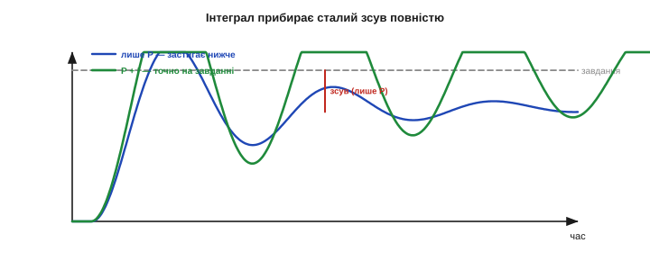
*Рис. 5.8.7.2. Інтеграл прибирає зсув. Лише P (синій) застигає нижче завдання — лишається сталий зсув. P+I (зелений) спершу теж недотягує, але інтегральна складова **накопичує** цей залишок і потроху додає впливу, доки вихід не сяде **точно** на завдання. Помилка йде в нуль — назавжди.*

Чому зсув зникає **повністю**? Бо інтеграл застигає лише тоді, коли його перестають годувати — тобто коли помилка стає **рівно нуль**. Поки лишається бодай крихітна помилка, сума все росте, вплив усе більшає — і так доти, доки помилку не виб'ють у нуль. Інтегральна складова за самою своєю природою не заспокоїться на «майже досягли»: вона тисне, аж поки не досягне точно.

**Приклад (як інтеграл з'їдає зсув).** Згадаймо дрон із §5.8.6: Kp = 4, лишився сталий зсув e = 2°, бо для утримання рівня бракувало впливу u₀ = 8. Додамо інтеграл, Ki = 2, крок dt:

```
 Накопичувач:  I += e·dt;   u = Kp·e + Ki·I

 Поки тримається зсув, інтеграл росте — і сумарний вплив
 Kp·e + Ki·I стає БІЛЬШИМ за u₀: дрон рушає до горизонту.
 Помилка тане, з нею тане і внесок P (Kp·e → 0),
 а інтегральний внесок натомість росте й перебирає тягар:
 у новій рівновазі e = 0, і ВЕСЬ потрібний вплив u₀ = 8
 тримає сам інтеграл, застигнувши на I = u₀/Ki = 8/2 = 4.
```

Зверніть увагу на красу механізму: інтеграл **сам** намацав те значення впливу (u₀ = 8), яке P-регулятор міг забезпечити лише ціною помилки. Тепер вплив є, а помилки нема — і це саме те, чого пропорційному регулятору бракувало.

Тут варто наголосити на математичній **певності** цього механізму. Інтеграл росте доти, доки його «годують» ненульовою помилкою; єдиний стан, у якому він застигає, — це e = 0. Отже, поки система взагалі здатна досягти завдання, P+I-регулятор **гарантовано** зведе сталу помилку до нуля — не приблизно, а точно. Пропорційний регулятор «мириться» з невеликим зсувом; інтегральний на нього принципово не згоден. У цьому й полягає його єдине, але дуже цінне завдання — і робить він його бездоганно.

Та сама властивість робить інтеграл чудовим **борцем зі сталими збуреннями**. Постійний вітер, що відхиляє дрон; перекіс центру ваги; тертя, що гальмує вісь, — усе це для регулятора виглядає як стала помилка, і інтеграл прибирає її так само невблаганно, як і внутрішній зсув. Він не питає, **звідки** взялася стійка помилка, — просто накопичує проти неї поправку, доки вона не зникне. Тому P+I добре тримає завдання не лише на гладкому стенді, а й у реальних умовах, де завжди щось потроху збиває апарат убік.

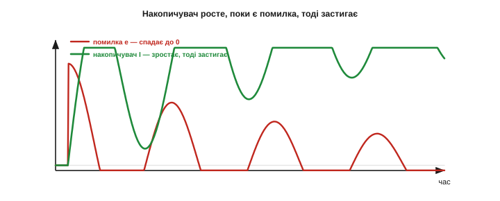
*Рис. 5.8.7.3. Робота інтеграла в часі. Поки помилка (червона) додатна, накопичувач (зелений) **зростає**, нарощуючи вплив; щойно помилка добігає нуля — інтеграл **застигає** на тому рівні, що дає точно потрібний для утримання вплив. Інтеграл «запам'ятовує» необхідне зміщення й тримає його сам.*

### Коефіцієнт Ki: швидше проти стійкіше

Інтегральна складова не безкоштовна — у неї свій компроміс, керований коефіцієнтом **Ki**. Малий Ki — зсув прибирається **повільно**: інтеграл ліниво накопичується, і вихід довго підповзає до завдання. Великий Ki — зсув прибирається швидко, але інтеграл стає «нетерплячим»: він **переповнюється**, переганяє ціль, і система **перестрілює** та коливається.

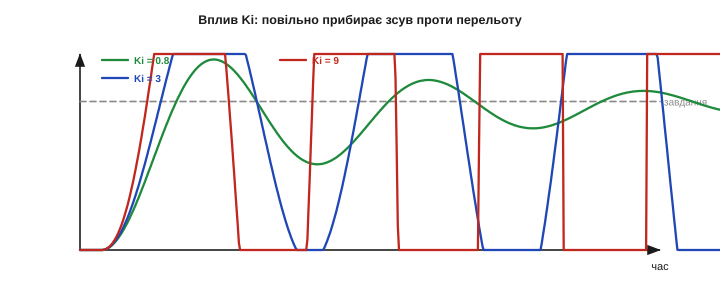
*Рис. 5.8.7.4. Вплив Ki. Малий (зелений) — зсув зникає повільно й м'яко. Добрий (синій) — швидко й без зайвого. Завеликий (червоний) — інтеграл переповнюється, вихід перестрілює завдання й розгойдується. Інтегральна складова взагалі **схильна додавати коливань**, бо діє із запізненням — на минуле, а не на теперішнє.*

Чому I взагалі **погіршує** стійкість? Бо він діє з **запізненням**: реагує не на теперішню помилку, а на **накопичену минулу**, тож завжди трохи «відстає» від подій. Це запізнення (фазове відставання) і підштовхує контур до коливань.

Звідси практичне застереження: **надлишок інтеграла підступніший, ніж надлишок пропорційності**. Завеликий Kp дає різке, але чесне коливання, яке видно одразу. Завеликий Ki діє віроломніше: система спершу здається стабільною, а тоді розгойдується повільними, наростаючими хвилями, які важче зв'язати з причиною. Тому інтегральну складову нарощують **обережніше** за пропорційну, і за найменших ознак повільного гойдання першим підозрюють саме завеликий Ki. У процесному керуванні силу інтеграла часто задають **оберненою** мірою — **часом інтегрування** (*reset time*, Ti): грубо, за скільки секунд інтеграл сам набирає стільки ж впливу, скільки дає пропорційна частина. Малий Ti = сильний інтеграл, великий Ti = слабкий.

Поєднання пропорційної й інтегральної складових — **ПІ-регулятор** — це, без перебільшення, найпоширеніший регулятор у промисловості: він і швидко реагує (P), і точно виходить на завдання (I), а коливань уникає, якщо не перебирати з Ki. Безліч контурів температури, тиску, витрати, швидкості працюють саме як ПІ, без жодної диференційної складової. Тож, опанувавши P та I, ви вже володієте робочим інструментом для більшості задач керування.

Назва «інтегральна» — інженерна; історично цю складову звали **«скидачем»** або **«автоматичним скиданням»** (*automatic reset*), бо вона сама «скидала» залишковий зсув пропорційного регулятора. У ранніх пневматичних регуляторах це робив окремий міх, що поволі підмінював опорний сигнал, доки помилка не зникне, — той самий гвинт-«скидач» із §5.8.6, тільки автоматичний. А ще раніше ту саму інтегральну дію Мінорський заклав у свій закон стернування корабля (історія розділу) — щоб судно не йшло вічно з невеликим, але стійким відхиленням від курсу.

> 🔧 **Навіщо це.** Додавайте інтегральну складову **обережно й після** того, як налаштували P. Її завдання вузьке — **прибрати сталий зсув**, а не прискорити реакцію. Починайте з малого Ki й піднімайте, доки зсув не зникатиме за прийнятний час; щойно з'являються повільні коливання чи затяжний переліт — Ki завеликий, відступіть. Пам'ятайте головне: P бореться з помилкою **зараз**, I — зі **сталою** помилкою; не намагайтеся інтегралом робити роботу пропорційної складової.

### Накопичувальне насичення (windup)

А тепер — найпідступніша вада інтеграла, яку **конче** треба знати: **накопичувальне насичення**, або **windup** («накручування»). Виникає вона щоразу, коли виконавчий орган упирається в свою межу (**насичення**, §5.8.6).

Уявіть: завдання різко змінилося або апарат довго не може його досягти (мотор уже на повних обертах, а ціль ще далеко). Помилка велика й **тривала** — а отже, інтеграл увесь цей час **накручується**, росте й росте до величезного значення. Біда в тому, що виконавчий орган уже **й так на максимумі** — більший інтеграл нічого не додає до руху, лише роздуває внутрішнє число регулятора. А коли апарат нарешті дотягується до завдання, цей **роздутий** інтеграл нікуди не дівся: він далі щосили жене вихід **за** ціль — аж поки повільно не «розкрутиться» назад. Наслідок — величезний **переліт** і довге гойдання там, де мало бути плавне приземлення на завдання.

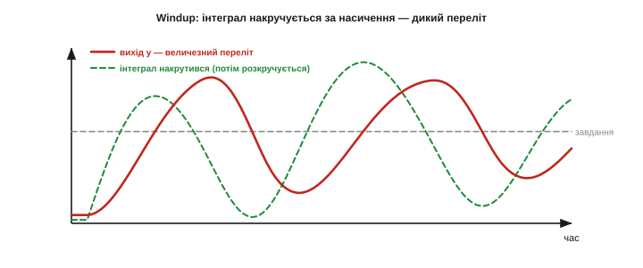
*Рис. 5.8.7.5. Накопичувальне насичення (windup). Поки виконавчий орган у насиченні (не може дати потрібного впливу), помилка тримається, а інтеграл **накручується** до величезного значення (затінено). Коли вихід нарешті досягає завдання, роздутий інтеграл жене його далеко **за** ціль — і апарат довго гойдається, поки інтеграл «розкручується». Класична причина дикого перельоту.*

Канонічний приклад — дрон, що стоїть на землі з увімкненим контуром висоти: висота нижча за завдання, мотори впираються в межу, інтеграл накручується хвилинами — і в мить зльоту апарат вистрілює вгору, далеко переганяючи задану висоту.

Корінь біди — у тому, що **наївний** інтеграл живе у власному світі чисел і не знає про межі реального заліза. Він чесно накопичує «борг» впливу, якого вимагає помилка, — навіть коли цей борг уже неможливо виплатити, бо мотор на максимумі. Накопичений борг доводиться потім «віддавати» перельотом. Тому будь-який інтегральний регулятор на **реальному** (а отже, обмеженому) виконавчому органі без захисту рано чи пізно дасть windup — це не рідкісна патологія, а пряма й неминуча властивість наївної реалізації.

> 🔧 **Навіщо це.** Випробовуйте контур із **великими** завданнями й тривалим насиченням — саме там вилазить windup, а на дрібних відхиленнях він непомітний. Найдешевший і найнадійніший захист — **затиснути інтеграл** розумними межами (такими, щоб сам інтеграл не міг вимагати більше за повний хід виконавчого органу). І візьміть за звичку **обнуляти інтеграл** у момент «увімкнення» контуру — зброєння, зльоту: інакше накопичений за простою борг вистрелить апарат у першу ж секунду роботи.

### Як приборкати інтеграл: антивіндап

На щастя, windup лікують — прийомами під спільною назвою **антивіндап** (*anti-windup*). Ідея проста: **не давати інтегралу накручуватися, коли виконавчий орган і так у насиченні**. Раз більший вплив усе одно нічого не змінить — нема сенсу його «вимагати».


*Рис. 5.8.7.6. Антивіндап рятує. Без захисту (червоний) — роздутий за насичення інтеграл дає величезний переліт. З антивіндапом (зелений) — накручування спинене, тож на завдання вихід виходить **чисто**, майже без перельоту. Та сама система, та сама ціль — різниця лише в тому, чи дозволили інтегралу «накрутитися».*

Найпростіші способи: **припиняти інтегрування**, поки виконавчий орган у насиченні (умовне інтегрування); **обмежувати** сам інтеграл згори й знизу (затиск, *clamping*); або відмотувати накопичене назад на величину «зайвого» впливу (зворотний перерахунок). Трьох прийомів зазвичай досить. **Умовне інтегрування**: щойно вплив уперся в межу — просто **перестати** додавати до накопичувача, поки не вийдемо з насичення. **Затиск** (*clamping*): тримати сам інтеграл у заданих межах, не даючи йому роздуватися. **Зворотний перерахунок**: відмотувати накопичене рівно на стільки, на скільки вплив «зрізала» межа. Усі троє роблять те саме — не дають інтегралу вимагати неможливого, тож коли система виходить із насичення, накопичувач уже не роздутий і перельоту нема.

Деталі реалізації на мікроконтролері — у §5.8.9; поки головне засвоїти **симптом і причину**: дикий переліт після довгої великої помилки — це майже завжди windup, і лікується він антивіндапом, а не зменшенням Ki.

> 🔧 **Навіщо це.** Якщо ваш апарат поводиться добре за малих відхилень, але після **великого** збурення чи різкої зміни завдання дає дикий **переліт** і довго заспокоюється — підозрюйте **windup**, а не погані коефіцієнти. Будь-який інтегральний регулятор на реальному (а отже, обмеженому) виконавчому органі **обов'язково** має мати антивіндап — це не вдосконалення, а необхідність. Найдешевший варіант — просто **затиснути** інтеграл у розумних межах; уже він рятує від найгірших перельотів.

Підсумок: інтегральна складова дала регуляторові **пам'ять про минуле** й тим прибрала сталий зсув — те, чого пропорційна не вміла. Ціна — схильність до коливань (бо I діє із запізненням) і небезпека windup (яку знімає антивіндап). Лишилася третя, остання складова. P реагує на помилку **тепер**, I — на **накопичену** (минуле); бракує чуття до **майбутнього** — до того, **куди** й **як швидко** помилка змінюється. Саме його, а заразом і ліки від коливань, дасть диференційна складова, до якої переходимо.

Утім, перш ніж переходити, варто оцінити, як далеко ми вже зайшли: P+I вже вміє і швидко реагувати, і точно триматися завдання попри збурення — для багатьох апаратів цього цілком досить. Диференційна складова — не обов'язкова основа, а **відточування**: вона зробить рух плавнішим і дозволить безпечно підняти Kp. Саме її — чуття до швидкості зміни помилки, що гасить коливання наперед, — ми й додамо останньою цеглинкою, і тоді в наших руках буде повний регулятор ПІД.

---

## 5.8.8 Диференційна складова (D): погасити коливання

Пропорційна й інтегральна складові вже вміють і швидко реагувати, і точно триматися завдання. Та обидві мають спільну ваду: вони штовхають **за** помилкою — і тому схильні **перестрілювати** ціль та розгойдуватися (а інтеграл, із його запізненням, ще й погіршує це). Бракує складової, що дивилася б **наперед** — помічала б, що система **занадто стрімко** мчить до цілі, і завчасно її **притримувала**. Це **диференційна** складова, літера **D** у «ПІД», — гальмо й передбачувач регулятора.

Якщо P — це сила, а I — наполегливість, то D — **передбачливість**. Вона єдина з трьох дивиться не в теперішнє чи минуле, а в **майбутнє**: за поточною швидкістю зміни вгадує, де помилка буде за мить, і діє вже проти **того**, що ще не настало. Ця завбачливість і робить регулятор плавним: замість сліпо гнатися за помилкою, він пригальмовує заздалегідь — мов досвідчений водій, що знімає ногу з газу перед поворотом, не чекаючи, поки той опиниться під колесами.

### Реагувати на швидкість зміни

Якщо P дивиться на саму помилку, а I — на її накопичену суму, то D дивиться на **швидкість зміни** помилки — математично на її **похідну** de/dt. Похідна — це **нахил** кривої помилки: наскільки швидко й у який бік помилка міняється просто зараз.

```
 u_D = Kd · de/dt

   de/dt — швидкість зміни помилки (нахил кривої)
   Kd    — диференційний коефіцієнт
```

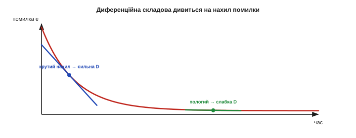
*Рис. 5.8.8.1. На що дивиться D. Не на саму помилку (її висоту), а на її **нахил** — як швидко вона міняється. Помилка стрімко падає (крутий нахил) — D дає сильну протидію; помилка майже не міняється (пологий нахил) — D майже мовчить. Так регулятор відчуває не лише «де ми», а й «куди й як швидко рухаємось».*

Сенс простий: якщо помилка **швидко зменшується**, система стрімко мчить до цілі — і, найпевніше, **проскочить** її за інерцією. D це передбачає й заздалегідь **тисне в протилежний бік**, гальмуючи підхід. А якщо помилка стрімко **росте** (щось різко збиває систему), D миттєво додає сили проти цього — швидше, ніж устигне відреагувати навіть пропорційна складова.

У цьому й унікальність D: вона реагує **раніше** за решту. Пропорційна складова мовчить, поки помилка мала, хай навіть система мчить до неї стрімголов; інтегральна взагалі тягнеться позаду. А диференційна вже за самим **рухом** — за тим, що помилка швидко міняється, — здіймає тривогу й діє. Тому D особливо цінна проти **раптових** збурень: щойно щось різко штовхнуло систему, помилка стрімко росте, нахил великий — і D відповідає негайно, не чекаючи, поки відхилення стане великим. Вона ловить біду в зародку.

### Як гальмо й демпфер

Найкраща інтуїція для D — **гальмування перед зупинкою**. Під'їжджаючи до світлофора, ви не тримаєте газ до останнього, а заздалегідь **відпускаєте** його й гальмуєте тим сильніше, чим швидше наближаєтесь, — щоб зупинитися плавно, а не проскочити перехрестя. D робить рівно це: що швидше система підлітає до цілі, то дужче воно її притримує.

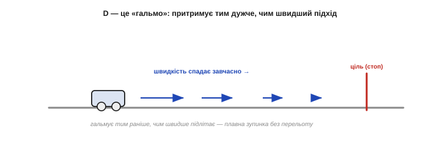
*Рис. 5.8.8.2. D — це «гальмо» й «демпфер». Як водій відпускає газ і гальмує тим раніше, чим швидше підлітає до зупинки, так і диференційна складова протидіє швидкому наближенню до цілі — і система плавно «припарковується» на завданні, замість проскочити його й розгойдатися. Фізично D діє як **демпфер** (амортизатор), що гасить коливання.*

Фізично D еквівалентний **демпферу** — амортизатору, як у підвісці авто: він протидіє швидкому рухові й тим гасить коливання. Саме тому додавання D **заспокоює** систему, прибираючи переліт і розгойдування, що їх лишали P та I.

Аналогія з підвіскою тут точна до букви. Авто без амортизаторів, на самих лиш пружинах, після кожної вибоїни довго **гойдається** вгору-вниз — це система з P (пружина), але без D. Додайте амортизатори (демпфери) — і кузов після поштовху плавно осідає без розгойдування. Диференційна складова — це **електронний амортизатор** вашого контуру: вона забирає енергію з коливань і гасить їх, лишаючи рух гладким. Без неї сильний регулятор «пружинить», з нею — «осідає»: та сама пружина, та сама дорога — різниця лише в наявності демпфера.

### Повний ПІД: гасимо коливання

Додавши всі три складові, дістаємо повний **ПІД-регулятор**:

```
 u = Kp·e  +  Ki·∫e dt  +  Kd·de/dt
       │          │             │
   теперішнє    минуле       майбутнє
   (де ми)   (як довго)   (куди йдемо)
```

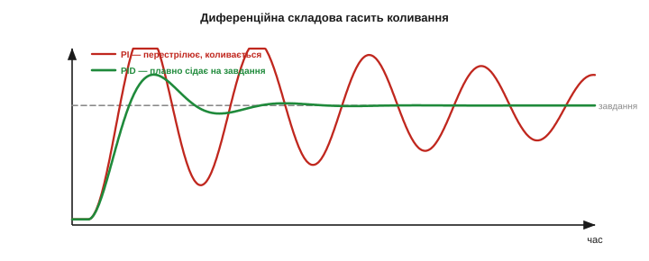
*Рис. 5.8.8.3. Що дає D. Той самий контур без диференційної складової (PI, червоний) перестрілює завдання й довго розгойдується. З диференційною (повний PID, зелений) підхід **загальмований**: вихід плавно й чисто сідає на завдання, майже без перельоту. D погасив коливання, нічого не зіпсувавши в точності.*

Три складові тепер чудово доповнюють одна одну, кожна за своїм «часом»: P реагує на **теперішню** помилку, I — на **минулу** (накопичену), D — на **майбутню** (передбачену за швидкістю). Разом вони дають швидкий, точний і стійкий регулятор — той самий закон, що його Мінорський підгледів у стернового (історія розділу).

Не дивно, що саме ПІД став **найуживанішим алгоритмом керування на планеті** — від промислових печей до жорстких дисків і ракет. Його сила — у простоті й повноті: трьома числами (Kp, Ki, Kd) ви охоплюєте всі три виміри помилки — теперішній, минулий і майбутній, — і цього вистачає для приголомшливої більшості задач. Стерновий Мінорського відчував те саме нутром: тримав кермо за поточним зносом (P), за тривалим (I) і за швидкістю повороту носа (D) — а Мінорський лише записав це формулою.

Цікаво, що D — повна протилежність I за «часовим» характером. Інтеграл діє із **запізненням** (фазове відставання) — і тому розхитує; диференціал діє з **випередженням** (фазове випередження) — і тому заспокоює. У цьому сенсі вони врівноважують одне одного: I додає системі інерції, D її забирає. Добре налаштований ПІД — це баланс цих двох протилежних характерів навколо швидкої, але нейтральної пропорційної складової.

> 🔧 **Навіщо це.** Додавайте D **обережно** й тримайте його **скромним**. Це найделікатніша з трьох складових: трохи замало — нема ефекту, трохи забагато — підсилений шум і власні високочастотні коливання. Спершу налаштуйте P, тоді обережно піднімайте Kd, доки не зникне переліт, а I додавайте наостанок — проти сталого зсуву (чому порядок саме такий — у §5.8.10). Якщо ваша система й без D тримається пристойно — можливо, він вам і не потрібен: безліч надійних контурів живуть як ПІ.

Є й приємний бонус: оскільки D гасить коливання, з ним можна **безпечно підняти Kp**. Без D великий Kp розгойдував систему; з D те саме підсилення дає швидку реакцію, а демпфер не дає їй перерости в коливання. Тож D не лише прибирає переліт, а й **розв'язує руки** пропорційній складовій.

Варто запам'ятати й те, чого D **не** робить. У сталому режимі, коли помилка завмерла (хай навіть ненульова), її похідна дорівнює нулю — тож D у цей момент **мовчить**. Він не прибирає сталого зсуву (це робота I) і не дає основної сили (це робота P); він діє **лише поки щось змінюється** — гальмує надто стрімкі рухи й гасить коливання. Тому D завжди працює **в парі**: сам по собі він навіть не втримав би систему біля цілі. Його роль — облагородити роботу P та I, а не підмінити їх; це відточування, а не основа.

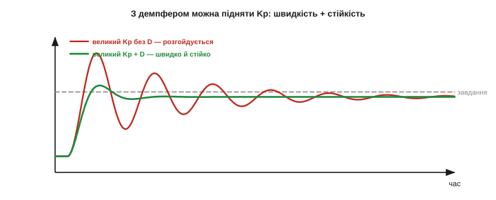
*Рис. 5.8.8.4. D розв'язує руки пропорційній складовій. Великий Kp без демпфера (червоний) дає швидкий, але розгойданий відгук. Той самий великий Kp із диференційною складовою (зелений) — так само швидкий, але стійкий: D гасить коливання, які інакше зробив би сильний P. Швидкість і стійкість, що раніше виключали одна одну, тепер уживаються.*

### Вада: чутливість до шуму

За все добре доводиться платити — і плата за D **серйозна**: він **жахливо чутливий до шуму**. Причина в самій природі похідної: диференціювання **підсилює** швидкі, дрібні коливання. Адже шум — це саме швидкі стрибки сигналу, а похідна міряє швидкість зміни: навіть крихітне тремтіння давача (Розділ 5.7), поділене на малесенький крок часу, дає **величезну** миттєву «швидкість».

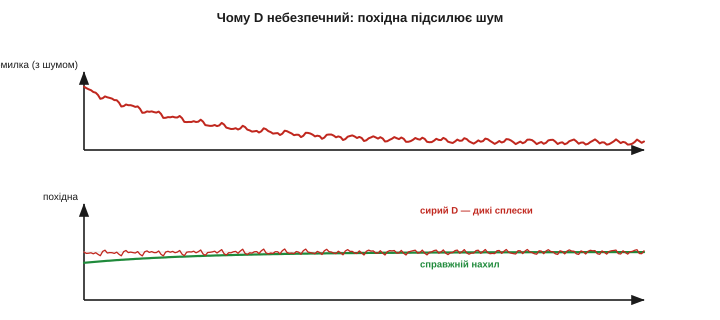
*Рис. 5.8.8.5. Чому D небезпечний. Угорі — майже чистий сигнал помилки з ледь помітним шумом. Унизу — його **похідна**: дрібне тремтіння перетворилося на дикі сплески, що геть ховають корисний нахил. Диференціювання підсилює високі частоти, тож сирий D-член передає в мотори не керування, а шум — вони деренчать, гріються й зношуються.*

На практиці це означає: сирий, нефільтрований D-член змусить виконавчий орган **деренчати** — смикатися від кожного шумового стрибка. Мотори гудуть, гріються, марно витрачають заряд. Саме через цю чутливість D — найважча для налаштування складова, і її нерідко лишають маленькою або й зовсім нульовою (звідси поширеність суто **ПІ**-регуляторів, §5.8.7).

Глибша причина — у мові частот (Розділ 5.5). Диференціювання — це фільтр **верхніх** частот: що вища частота, то дужче воно її підсилює. Корисний сигнал (повільна зміна помилки) сидить у низьких частотах, а шум — у високих; тож сирий D підкручує гучність саме там, де живе шум, і притишує там, де живе користь. Виходить найгірше можливе для давача: підсилити його найбруднішу частину. Ось чому D без фільтра на реальному, зашумленому вимірі майже завжди шкодить більше, ніж помагає.

І шкода тут не лише акустична. Деренчання — це сотні зайвих різких команд щосекунди: вони ганяють струм туди-сюди, гріють обмотки й драйвери, висаджують батарею й передчасно зношують механіку. Тобто непрофесійний D не просто **звучить** погано — він реально **псує** апарат. Тим важливіше подати на диференційну складову якомога чистіший сигнал.

> 🔧 **Навіщо це.** Якщо після ввімкнення диференційної складової мотори почали **деренчати** чи свистіти, а апарат — дрібно тремтіти, винна не сама ідея D, а **шум**, який вона підсилила. Не вимикайте D одразу — спершу **почистіть вимір** (фільтри з Розділів 5.4–5.6) і **профільтруйте сам D-член**. Диференційна складова дає чудове демпфування, та лише на **чистому** сигналі; на брудному вона приносить більше шкоди, ніж користі. Чистий вимір — передумова працездатного D.

### Похідний поштовх і ліки

Є й окрема дрібна біда — **похідний поштовх** (*derivative kick*). Коли ви **різко змінюєте завдання** r (наприклад, задаєте новий курс стрибком), помилка e = r − y теж стрибає — а її похідна de/dt у цю мить дає величезний сплеск, і регулятор смикає виконавчий орган різким поштовхом, хоча сам апарат ще нікуди не зрушив.

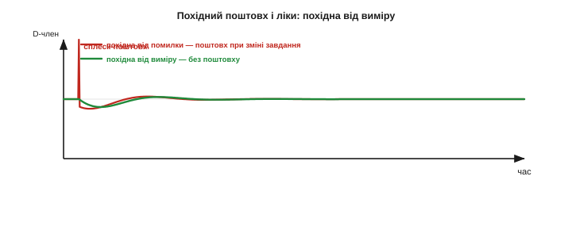
*Рис. 5.8.8.6. Похідний поштовх і ліки. Якщо D рахувати від помилки (червоний), різка зміна завдання дає величезний сплеск-поштовх. Якщо ж рахувати похідну від самого **виміру** (−dy/dt, зелений), стрибок завдання поштовху не дає — адже вихід міняється плавно, — а демпфувальна дія лишається тією самою. Це майже безкоштовне покращення.*

Ліки елегантне: рахувати похідну не від помилки, а від самого **виміру** — брати −dy/dt замість de/dt. Оскільки вихід y змінюється плавно (на відміну від стрибка завдання), поштовх зникає, а корисне демпфування лишається. Цей прийом — «**похідна від виміру**» (*derivative on measurement*) — стандарт у добрих реалізаціях ПІД. Друге обов'язкове доповнення — **фільтр** на D-член (зазвичай простий ФНЧ), щоб приборкати шумові сплески.

А для нашого дрона є особливо приємна звістка. Згадайте: гіроскоп (§5.7.3) міряє **кутову швидкість** — а це і є похідна кута! Тож для керування орієнтацією D-член часто беруть **прямо з гіроскопа**, замість того щоб диференціювати оцінений кут. Це разюче краще: гіроскоп дає швидкість обертання чисто й безпосередньо, без підсилення шуму, на яке хворіє чисельне диференціювання. Природа подарувала нам готовий, апаратний D-член — гріх ним не скористатися.

Підсумуймо практику щодо D. На багатьох системах його взагалі лишають нулем — і чудово живуть із надійним ПІ; там же, де він потрібен (швидкі, схильні до перельоту контури — як стабілізація польоту), його **обов'язково** беруть «причесаним»: похідну від виміру, з фільтром, а для орієнтації — прямо з гіроскопа. Сире `Kd·de/dt` на зашумленому сигналі — типова помилка початківця, що змушує мотори деренчати; усі поважні реалізації ПІД від неї давно відмовилися.

**Приклад (диференційна складова в дії).** Kd = 0.5, крок dt = 0.01 с.

```
 Дискретна похідна:  de = e − e_попередній;  u_D = Kd · de/dt

 Корисна дія (гальмування):
   помилка стрімко спадає 10° → 8° за крок → de = −2°, de/dt = −200°/с
   u_D = 0.5·(−200) = −100  → сильно гальмує стрімкий підхід.

 Шкідлива дія (шум):
   помилка сіпнулася на +0.3° за один крок → de/dt = +30°/с
   u_D = 0.5·30 = +15 — різкий стрибок впливу «з нічого»!
   Саме тому D-член фільтрують або беруть від гіроскопа.
```

Один і той самий механізм — реакція на швидкість — дає і безцінне гальмування корисного руху, і згубне підсилення шуму. Уся майстерність роботи з D у тому, щоб узяти перше, не впустивши другого.

У реальних польотних контролерах (як-от популярні прошивки дронів) ви побачите все це винесеним в окремі налаштування: «D term» поряд із P та I, повзунки **фільтрів** D і вибір «**D on gyro**» (похідна від гіроскопа). Тепер ви розумієте, **навіщо** кожне з них: фільтри приборкують шумові сплески, «D on gyro» бере похідну з апаратного давача швидкості замість чисельного диференціювання, а сам Kd дозовано додає демпфування. Те, що в інтерфейсі виглядає набором загадкових повзунків, — це рівно ті складові й ті ліки до них, які ми щойно розібрали з перших принципів.

> 🔧 **Навіщо це.** Для керування орієнтацією **беріть D прямо з гіроскопа**, а не диференціюйте кут. Гіроскоп — це фізичний «вимірювач похідної»: він дає кутову швидкість чисто й миттєво, без шумових сплесків, що неминучі при чисельному диференціюванні. Це не лише прибирає головну ваду D, а й знімає похідний поштовх (бо швидкість апарата не стрибає від зміни завдання). Якщо у вашій задачі є давач самої **швидкості** потрібної величини — майже завжди краще взяти D з нього.

Отже, диференційна складова дала регуляторові **передбачення**: реагуючи на швидкість зміни помилки, вона гасить коливання й дозволяє підняти швидкодію — ціною чутливості до шуму, яку знімають фільтр, «похідна від виміру» та (для орієнтації) гіроскоп. Тепер у нас є **повний ПІД** — три складові, що покривають теперішнє, минуле й майбутнє помилки. Лишилося навчитися втілити його в **коді** реального мікроконтролера: з дискретним часом, цілими числами, антивіндапом і фільтром D. Саме до цього — практичної реалізації — ми й переходимо. Адже між гарною формулою на папері й працездатним кодом — ще ціла прірва дрібниць: дискретний час замість неперервного, цілі числа замість дробів, антивіндап, фільтр похідної, обмеження виходу. Зібрати все це в надійний ПІД, що крутиться сто разів на секунду на копійчаному мікроконтролері, — і є тема наступної частини розділу. А коли цей код запрацює, лишиться найцікавіше — навчитися **налаштовувати** три коефіцієнти під конкретний апарат і поєднувати кілька контурів у каскади, чим розділ і завершиться (§5.8.10). Та спершу акуратно перенесемо неперервні формули ПІД у дискретний світ мікроконтролера — з усіма його підводними каменями.

---

## 5.8.9 Дискретний ПІД на мікроконтролері

Формули ПІД, які ми вивели, — **неперервні**: інтеграл і похідна означені для безперервного часу. Мікроконтролер же працює **тактами**: прокидається кожні Δt секунд, читає давачі, рахує, видає вплив — і засинає до наступного такту. Щоб ПІД ожив у коді, його треба перекласти на цю дискретну мову — а заразом додати кілька **захистів**, без яких підручникова формула в реальному залізі поводиться кепсько або й небезпечно. Ця тема — про те, як зробити ПІД, що справді працює на копійчаному чипі.

Розрив між формулою й кодом більший, ніж здається. У підручнику ПІД — три гарні члени; у працездатній прошивці навколо них стоїть удвічі більше рядків «обв'язки»: вимірювання часу, захист від насичення, фільтри, обмеження виходу, скидання стану. Саме ця непоказна обв'язка й відрізняє регулятор, що **літає**, від того, що красиво виглядає на папері, а в залізі смикається чи перекидає апарат. Тож опануймо не лише переклад формул, а й усю потрібну довкола них обв'язку — бо вона тут не менш важлива за самі коефіцієнти.

### Від інтеграла й похідної — до суми й різниці

Переклад напрочуд прямий. Інтеграл — це площа, тобто сума тонких прямокутників; на кожному такті ми додаємо один прямокутник `e·Δt` до накопичувача. Похідна — це нахил, тобто різниця двох сусідніх вимірів, поділена на крок часу.

```
 неперервне   →   дискретне (крок Δt)

 ∫e dt        →   integral += e · Δt          (сума прямокутників)
 de/dt        →   (e − e_попередній) / Δt     (різниця сусідніх відліків)
```

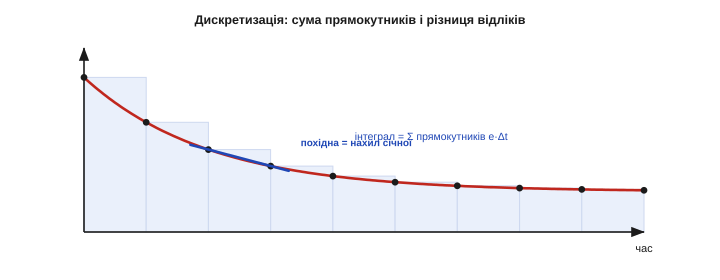
*Рис. 5.8.9.1. Неперервне стає дискретним. МК бачить помилку не як гладку криву, а як **відліки** через Δt. Інтеграл перетворюється на **суму** прямокутників `e·Δt` (затінено), похідна — на **різницю** двох сусідніх відліків, поділену на Δt (нахил січної). Що менший Δt, то точніше дискретне наближення повторює неперервний оригінал.*

Уся неперервна математика ПІД зводиться до двох простих дій над числами: **накопичувати** суму й **віднімати** сусідні відліки. Ні інтегралів, ні похідних у коді нема — лише додавання, віднімання й множення, що їх легко виконує найдешевший мікроконтролер.

Варто усвідомити, що дискретні версії — це **наближення** неперервних, і точність наближення залежить від Δt. Сума прямокутників лише приблизно дорівнює справжній площі під кривою (це найпростіша, «прямокутна» квадратура — по суті метод Ейлера); різниця двох відліків лише приблизно дорівнює миттєвому нахилу. За малого Δt похибка наближення мізерна, і нею нехтують; за великого — наближення грубшає, і саме звідси частина проблем рідкої дискретизації, про які трохи далі. Тобто Δt впливає не лише на швидкість реакції, а й на саму **точність** математики ПІД.

### Один такт регулятора

Складімо це в код. Ось кістяк **надійного** дискретного ПІД — не голий підручниковий, а вже із захистами, які ми зараз розберемо:

```
// викликається РІВНОМІРНО кожні Δt (найкраще — з таймера)
e = setpoint − measurement;                       // помилка
integral += e * dt;                               // I: накопичуємо
integral = clamp(integral, I_min, I_max);         // антивіндап (§5.8.7)
deriv = (measurement_prev − measurement) / dt;    // D від виміру (§5.8.8)
deriv_f += (deriv − deriv_f) * dt / (dt + τ);     // ФНЧ на похідну
u = Kp*e + Ki*integral + Kd*deriv_f;              // сума трьох складових
u = clamp(u, u_min, u_max);                        // межі виконавчого органу
measurement_prev = measurement;                    // запам'ятати для наступного такту
output(u);                                          // видати вплив
```

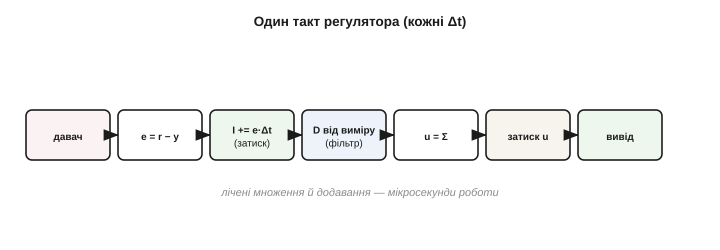
*Рис. 5.8.9.2. Що відбувається за один такт. Прочитати давач → порахувати помилку e → накопичити інтеграл (із затиском) → узяти похідну від виміру (із фільтром) → скласти три складові → обмежити вихід межами мотора → видати вплив і запам'ятати вимір. Дев'ять рядків, що крутяться сто разів на секунду, — і є серце стабілізації.*

Зверніть увагу: обчислень тут — лічені множення й додавання, тож сам ПІД виконується за **мікросекунди**. Уся складність не в арифметиці, а в **захистах** довкола неї та в **рівномірності** викликів. Саме їх і розберемо.

Зверніть увагу на дві технічні тонкощі коду. По-перше, **порядок** дій важить: спершу оновлюємо інтеграл і **одразу** його затискаємо, лише потім складаємо вплив — інакше роздутий інтеграл устигне просочитися у вихід. По-друге, частина змінних — `integral`, `measurement_prev`, `deriv_f` — мусить **жити між викликами** (це **стан** регулятора), а не створюватися наново щотакту; у коді їх роблять статичними чи полями структури. Забути про збереження стану — типова помилка початківця, від якої інтеграл і похідна просто не працюють, бо щоразу починають з нуля.

### Період і частота дискретизації

Найперше питання — **як часто** викликати регулятор. Період Δt (і обернена до нього частота 1/Δt) має бути достатньо **малим**, щоб регулятор устигав за динамікою об'єкта. Груба засада: дискретизуйте **багато разів швидше** (умовно у 10–20 разів), ніж найшвидші рухи, які треба ловити. Для стабілізації дрона це сотні разів на секунду (типово 0.5–8 кГц у польотних контролерах), для повільної печі — кілька разів на секунду досить.

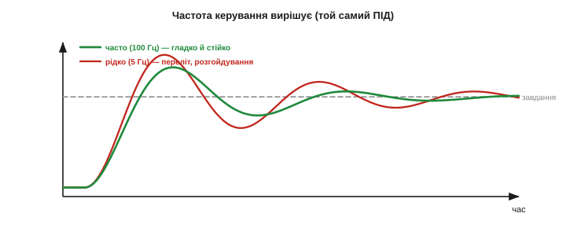
*Рис. 5.8.9.3. Чому частота важлива (обчислено: той самий ПІД, різна частота керування). Часта дискретизація (зелений) тримає вихід гладко й стійко. Рідка (червоний) — регулятор бачить світ «уривками», реагує запізно, дає переліт і розгойдування, а на зовсім малій частоті взагалі втрачає стійкість. Замало тактів — і навіть бездоганно налаштований ПІД не врятує.*

Чому замала частота **руйнує** керування? Бо між тактами регулятор **сліпий**: вплив тримається сталим, а об'єкт тим часом живе своїм життям. Що рідші такти, то більше регулятор «відстає» від подій — а відставання, як ми знаємо (§5.8.5), штовхає контур до коливань і втрати стійкості. Тому перше, що варто перевірити в «капризному» контурі, — чи досить **швидко** він тактує.

Скільки саме — підказує природа об'єкта. Орієнтир: частота керування має бути в кілька десятків разів вищою за найшвидші коливання, які контур має приборкувати. Дрон зі своїми спритними рухами тактує сотні-тисячі разів на секунду; круїз-контроль авто — десятки; піч чи акваріум — одиниці. Брати частоту «із запасом» дешево (ПІД копійчаний за обчисленнями), тож радше тактуйте **частіше**, ніж ризикуйте занизити; стеля тут одна — бюджет такту, про який нижче.

### Сталий крок — і чому це критично

Менш очевидна, але дуже підступна вимога: Δt має бути не лише малим, а й **сталим**. Адже інтеграл множить помилку на Δt, а похідна ділить на Δt — тож якщо крок «плаває» від такту до такту (то 5, то 8 мс), обидві складові рахуються з **хибним** масштабом, і регулятор поводиться непередбачувано.

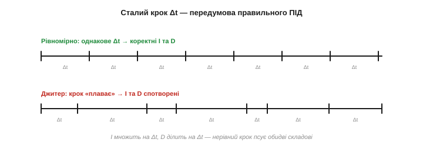
*Рис. 5.8.9.4. Сталий крок — передумова правильного ПІД. Угорі — рівномірні такти через однакове Δt: інтеграл і похідна рахуються коректно. Унизу — «плаваючі» такти (джитер): то густо, то рідко. Оскільки I множить на Δt, а D ділить на Δt, нерівний крок спотворює обидві складові — регулятор «нервує» без видимої причини.*

Тому ПІД майже завжди запускають **з апаратного таймера** (переривання через рівні проміжки), а не «коли дійдуть руки» в головному циклі. Якщо ж рівномірність гарантувати не вдається, рятує другий прийом — **міряти справжній** Δt щоразу (за таймером-лічильником) і підставляти його фактичне значення у формули, а не номінальне з даташита.

Між підходами є чітка ієрархія надійності. Найкраще — **апаратний таймер**, що викликає регулятор через точно рівні проміжки незалежно від решти програми. Якщо таймера бракує, прийнятно **міряти** фактичний Δt лічильником і підставляти його у формули — тоді навіть нерівні виклики дадуть правильні I та D. А найгірше — припускати сталий **номінальний** Δt, тимчасом як виклики «плавають»: саме так народжуються найзагадковіші збої ПІД, що їх годі пояснити коефіцієнтами, бо причина — не в них, а в зіпсованому масштабі часу.

> 🔧 **Навіщо це.** Запускайте контур керування **за таймером**, а не в довільному місці головного циклу. У головному циклі повно непередбачуваного — обмін по радіо, запис на карту, інша робота, — і період «плаватиме», тихо псуючи інтеграл та похідну. Рівномірний такт від таймера (або, як мінімум, чесно виміряний фактичний Δt) — це фундамент, без якого жодні гарні коефіцієнти не дадуть стабільного ПІД. Першими підозрюйте саме нерівний такт, коли добре налаштований регулятор раптом «нервує».

### Захисти, без яких ПІД не злетить

Тепер про ті самі захисти з кістяка коду. Підручникова формула `u = Kp·e + Ki·∫e + Kd·de/dt` у реальному залізі **гола** й вразлива; щоб вона працювала, на неї нашаровують чотири обов'язкові доповнення.

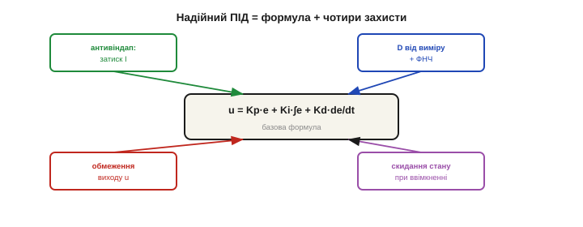
*Рис. 5.8.9.5. Чотири захисти надійного ПІД. На базову суму трьох складових нашаровують: **антивіндап** (затиск інтеграла, §5.8.7), **похідну від виміру з фільтром** (§5.8.8), **обмеження виходу** межами виконавчого органу й **скидання стану** при ввімкненні. Без них формула «літає» лише на папері; із ними — у реальному апараті.*

- **Антивіндап** (§5.8.7): затискати інтеграл (чи припиняти його накопичення) у насиченні — інакше дикий переліт.
- **Похідна від виміру + фільтр** (§5.8.8): брати −Δ(measurement)/Δt замість Δe/Δt (нема поштовху від зміни завдання) і згладжувати ФНЧ (нема шумових сплесків).
- **Обмеження виходу**: затискати u у фізичні межі мотора чи серво — регулятор не повинен «вимагати» неможливого.
- **Скидання стану при ввімкненні**: обнуляти інтеграл (а часто й похідну) у момент зброєння/зльоту — інакше накопичений за простою «борг» вистрелить апарат (теж різновид windup).

Окремо варто згадати **плавне ввімкнення** (*bumpless transfer*): коли контур перемикають у роботу, бажано, щоб вихід не стрибнув, — для цього стан регулятора підбирають так, щоб перший вплив збігся з поточним. Це робить вмикання непомітним, без ривка.

Кожен із цих захистів — латка на конкретну, добре відому аварію. Нема антивіндапу — дикий переліт після насичення (§5.8.7). Похідна від помилки замість виміру — ривок виконавчого органу при кожній зміні завдання (§5.8.8). Нема фільтра D — деренчання моторів від шуму. Нема обмеження виходу — регулятор «вимагає» від мотора неможливого й непередбачувано поводиться на межі. Не скинули стан при ввімкненні — стрибок у першу ж секунду. Тобто це не «прикраси», а відповіді на п'ять конкретних способів, якими голий ПІД ламається в реальному житті, — і досвідчений інженер закладає їх **наперед**, не чекаючи, поки кожен дасться взнаки.

### Бюджет реального часу

Регулятор живе в **жорсткому часі**: уся робота одного такту — прочитати давачі, злити їх (фільтр чи Калман), порахувати ПІД і видати вплив — мусить **вкластися** в період Δt, ще й із запасом. ПІД тут найдешевший (мікросекунди), та решта такту теж важить.

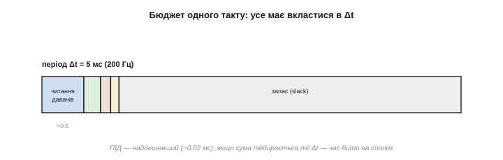
*Рис. 5.8.9.6. Бюджет одного такту Δt. У період (скажімо, 5 мс на 200 Гц) мусять уміститися читання давачів, злиття (фільтр/Калман), сам ПІД і вивід на виконавчий орган — і лишитися **запас**. Якщо робота не влазить у такт, регулятор почне «захлинатися», пропускати такти й втрачати ту саму рівномірність, що ми боронили. Це той самий бюджет реального часу, що й у Розділі 5.6.*

**Приклад (бюджет такту на 200 Гц).** Δt = 1/200 = 5 мс.

```
 читання IMU по I²C    ~ 0.5 мс
 злиття (фільтр)       ~ 0.2 мс
 ПІД (×3 осі)          ~ 0.02 мс
 вивід на мотори       ~ 0.1 мс
 ─────────────────────────────
 разом                 ~ 0.8 мс   →  запас ≈ 4.2 мс  ✓
```

Запас великий — отже, можна або підняти частоту, або додати обчислень (складніший фьюжн). Якби ж сума підбиралася під 5 мс, час було б бити на сполох: бракне запасу — і за першого ж стрибка навантаження такт «попливе».

Що ж робити, якщо робота не влазить у такт? Варіантів кілька: знизити частоту (більший Δt), спростити найдорожчий етап (зазвичай це фьюжн або повільний давач), винести довгі операції — запис на карту, радіо — у нижчий пріоритет **поза** контуром керування, або перейти на швидший чип. Головне правило — **контур керування має бути найвищим пріоритетом**: усе інше зачекає, а такт ПІД — ні. У системах з операційкою реального часу так і роблять: стабілізація — найвищий пріоритет, решта — нижчий.

> 🔧 **Навіщо це.** Тримайте контур керування **найвищим пріоритетом** і стежте за **запасом** часу в такті. Виміряйте, скільки реально триває один такт (читання + фьюжн + ПІД + вивід), і переконайтеся, що це помітно менше за Δt. Якщо запасу майже нема — рано чи пізно за стрибка навантаження такт «попливе», і апарат втратить стабільність у найгірший момент. Запас часу — така ж частина надійності, як антивіндап чи фільтр; без нього все інше марно.

### Цілі числа чи float

Останнє рішення — у чому рахувати. Сучасні 32-бітні мікроконтролери здебільшого мають апаратну **рухому кому** (FPU), тож ПІД пишуть просто на `float` — швидко й без мороки. На дешевих 8-бітних чипах без FPU рухома кома повільна, і тоді переходять на **цілочисельну** (фіксовану) арифметику — згадайте формат Q та обережність із масштабом і насиченням із Розділу 5.6. Головне — пам'ятати про **діапазон**: інтеграл, що довго накопичується, може **переповнити** ціле, тож його (як і всі проміжні величини) тримають у достатньо широкому типі й затискають межами.

Як зрозуміти, чи потрібна фіксована кома? Орієнтуйтесь на чип. Є FPU (більшість сучасних 32-бітних ARM Cortex-M4/M7, ESP32) — пишіть на `float` і не морочтеся; нема FPU (8-бітні AVR, найдешевші M0) і потрібна висока частота — рахуйте в цілих. Найпідступніша пастка цілочисельного ПІД — саме **переповнення інтеграла**: він єдиний накопичується необмежено, тож його тримають у широкому типі (32 чи 64 біти) і обов'язково затискають антивіндапом, який тут рятує одразу від двох бід — і від накопичувального насичення, і від арифметичного переповнення.

Існує й інша форма запису — **інкрементна** (швидкісна): замість самого впливу u регулятор рахує його **приріст** Δu за такт і додає до попереднього виходу. Вона зручна, коли виконавчий орган сам «інтегрує» (наприклад, кроковий двигун), і має приємний побічний ефект — природну стійкість до windup. Підручникову, **позиційну** форму (що рахує u цілком) ми й використовували; інкрементна — корисна альтернатива, варта знати про її існування.

Для більшості задач — і точно для стабілізації орієнтації, до якої ми йдемо, — позиційного ПІД із чотирма захистами цілком досить, і саме його варто опанувати першим. Інкрементну форму тримайте в пам'яті як інструмент для особливих випадків — інтегрувальні виконавчі органи, перемикання режимів без ривка, — а не як щоденний вибір. Не множте сутностей: надійний позиційний ПІД покриває переважну більшість того, що вам колись доведеться стабілізувати.

> 🔧 **Навіщо це.** Не пишіть «голий» ПІД із підручника — одразу закладайте **всі чотири захисти** (антивіндап, D від виміру + фільтр, обмеження виходу, скидання стану) і **рівномірний такт**. Саме брак цих дрібниць, а не формула, — найчастіша причина, чому «правильний» ПІД поводиться дивно: дикий переліт (нема антивіндапу), деренчання моторів (нема фільтра D), ривок при зміні завдання (похідна від помилки), стрибок при ввімкненні (не скинули інтеграл). Робочий ПІД — це формула **плюс** ця обв'язка.

Отже, у нас є дискретний ПІД, готовий крутитися на реальному мікроконтролері: переклад інтеграла й похідної на суму й різницю, рівномірний такт, чотири захисти й бюджет реального часу. Залишилося останнє й найпрактичніше — **навчитися добирати** три коефіцієнти під конкретний апарат і поєднувати кілька контурів у каскади, щоб дійти аж до стабілізації польоту. Саме цим — налаштуванням і каскадами — розділ і завершується. А налаштувати ПІД — окреме мистецтво: ті самі три числа можуть і впевнено підняти апарат у повітря, і кинути його об землю, тож братися до них варто з методом, а не навмання.

---

## 5.8.10 Налаштування й каскадні контури

У нас є робочий дискретний ПІД. Лишилися дві останні, найпрактичніші речі: **навчитися добирати** три коефіцієнти під конкретний апарат — і **структурувати** кілька регуляторів у каскад, як це роблять справжні польотні контролери. Цим розділ і завершиться, дійшовши аж до того, як стабілізується політ дрона.

Це той момент, коли вся теорія зустрічається з реальним апаратом. Можна досконало знати формули P, I та D — і все одно не підняти дрон, якщо не вмієш добрати три числа під **його** мотори, масу й давачі. І навпаки: досвідчений інженер часто налаштовує ПІД майже без розрахунків, на самих спостереженнях за поведінкою. Тож ця тема — менше про математику й більше про **ремесло**: як перетворити робочий код на апарат, що впевнено тримається в повітрі.

### Читати відгук: що каже крива

Налаштування починається з уміння **читати** відгук системи на стрибок завдання. У цій кривій зашифровано все, що треба знати, який коефіцієнт крутити.


*Рис. 5.8.10.1. Що читати у відгуку на стрибок завдання. **Час наростання** — як швидко вихід дістався цілі (замалий Kp — повільно). **Переліт** — наскільки проскочив (завеликий Kp чи замалий Kd). **Час встановлення** — коли заспокоївся в межах ±5 %. **Сталий зсув** — застиг нижче завдання (бракує I). Кожна риса кривої вказує на свою складову.*

Чотири головні риси: **час наростання** (швидкодія — за неї відповідає Kp), **переліт** (надмірна різкість — Kp завеликий або Kd замалий), **час встановлення** (як довго гойдається — демпфування Kd) і **сталий зсув** (недотягування — бракує Ki). Навчившись пов'язувати симптом із коефіцієнтом, ви перетворюєте налаштування з ворожіння на діагностику.

Щоб ці риси побачити, систему треба **спровокувати**: дати стрибок завдання (раптом задати новий кут) або поштовх (легенько штовхнути апарат) і дивитися, як він повертається. У відповіді на таке збурення характер регулятора — як на долоні: млявий повзе назад поволі, надто різкий стрибає туди-сюди, добре налаштований швидко й чисто повертається на місце. Тому серйозне налаштування завжди супроводжують **логуванням**: записують криву відгуку, щоб **бачити**, що насправді робить апарат, а не здогадуватися навпомацки.

### Налаштування вручну

Найнадійніший ручний метод — додавати складові **по черзі**, у правильному порядку (ми вже накидали його в §5.8.6).

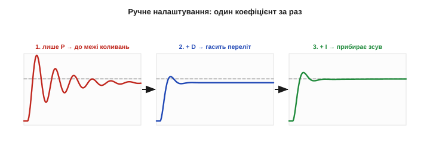
*Рис. 5.8.10.2. Ручне налаштування крок за кроком. (1) Лише **P**: піднімайте Kp, доки система не почне ледь коливатися, тоді відступіть приблизно вдвічі. (2) Додайте **D**: він гасить переліт — і дозволяє підняти Kp ще, для швидкості. (3) Додайте **I**: він прибирає сталий зсув. Один коефіцієнт за раз — і видно дію кожного.*

Порядок не випадковий: P дає основну силу, D її приборкує (даючи запас підняти P), а I наприкінці прибирає те, чого не може жоден із них, — сталий зсув. Робити це навпаки чи все одразу — певний шлях до хаосу, де незрозуміло, що на що впливає.

Кілька порад із практики. Міняйте коефіцієнт **відчутними** кроками (скажімо, в півтора раза вгору чи вниз), а не на крихту, — інакше різниці не побачите. Після кожної зміни давайте те саме збурення, щоб порівнювати однакове. І будьте **терплячі**: добре налаштування — це кілька десятків таких циклів, а не одне геніальне вгадування.

І про безпеку: перші проби робіть **обережно**. Дрон — зі знятими пропелерами або міцно закріплений; промисловий привід — на холостому ходу. Завищений Kp чи Kd легко кидає апарат у різке гойдання, тож першу перевірку — «чи в той бік діє регулятор і чи не розгойдується» — варто робити там, де помилка нічого не зламає й нікого не травмує. Лише переконавшись, що контур поводиться розумно, переходять до справжнього польоту.

### Метод Зіглера–Ніколса

Є й напівформальний рецепт — класичний метод **Зіглера–Ніколса** (*Ziegler–Nichols*, 1942), що дає коефіцієнти за двома легко вимірюваними числами. Спершу, лишивши тільки P, піднімають Kp до **граничної жорсткості** Ku, за якої система входить у стійкі, незгасні коливання; заразом міряють їхній **період** Tu.

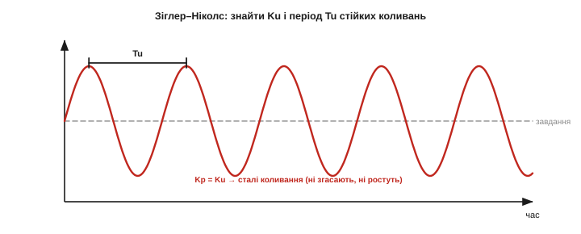
*Рис. 5.8.10.3. Метод Зіглера–Ніколса. Піднімаємо Kp до граничного Ku, за якого коливання стають **сталими** (ні згасають, ні ростуть), і міряємо їхній період Tu. Тоді коефіцієнти ПІД беруть за готовими формулами від Ku й Tu. Це швидка **відправна точка** — щоправда, агресивна (розрахована на загасання коливань із відношенням сусідніх амплітуд ¼, тож переліт виходить чималий), яку потім підкручують вручну.*

За Ku й Tu коефіцієнти рахують за табличними формулами:

```
 Класичний ПІД за Зіглером–Ніколсом:
   Kp = 0.6 · Ku
   Ki = 1.2 · Ku / Tu          (інтегральний час Ti = 0.5·Tu)
   Kd = 0.075 · Ku · Tu        (диференційний час Td = 0.125·Tu)
```

**Приклад (Зіглер–Ніколс).** Знайдено Ku = 8 і Tu = 0.5 с.

```
 Kp = 0.6·8           = 4.8
 Ki = 1.2·8/0.5       = 19.2
 Kd = 0.075·8·0.5     = 0.3
 → агресивна відправна точка; далі трохи зменшують Kp і донастроюють.
```

Метод цінний як **швидкий старт**, але його налаштування зумисне різке (розраховане на чвертьамплітудне загасання коливань, із чималим перельотом), тож його завжди беруть лише за відправну точку, а не за остаточну істину.

Є й важливе застереження безпеки. Метод вимагає **довести систему до коливань** — а для багатьох апаратів це небезпечно чи руйнівно: ви ж не ганятимете реальний літак чи важкий промисловий привід на самій межі стійкості, ризикуючи аварією. Тому на таких об'єктах Зіглера–Ніколса застосовують обачно — на безпечному стенді чи моделі, а не «наживо». Сам метод народився 1942 року (Джон Зіглер і Натаніель Ніколс, стаття «Оптимальні налаштування автоматичних регуляторів») і дав інженерам перший широко вживаний простий, повторюваний рецепт там, де доти панувало саме лиш відчуття.

### Симптом → ліки

На практиці ж найчастіше налаштовують **за поведінкою**: дивляться на симптом і крутять відповідний коефіцієнт. Ось коротка шпаргалка, що зводить усе вивчене докупи.

Одне застереження до неї: складові **не цілком незалежні**. Піднявши Kp, ви часто посилюєте й переліт (тоді треба підняти Kd), а сильніший Kd може зажадати чистішого виміру. Тому реальне налаштування — не разовий прохід по таблиці, а кілька **ітерацій**: підкрутили одне — перевірили, чи не зіпсувалося інше — підкрутили знову. Гарний кінцевий набір коефіцієнтів завжди є компромісом, у якому всі три числа узгоджені між собою.

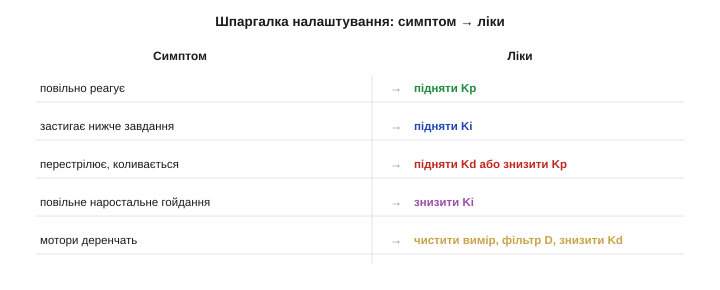
*Рис. 5.8.10.4. Симптом → ліки. Повільно реагує — підняти Kp. Застигає нижче завдання — підняти Ki. Перестрілює й коливається — підняти Kd або знизити Kp. Повільне наростальне гойдання — знизити Ki. Мотори деренчать — почистити вимір, знизити Kd або профільтрувати D. Ця таблиця — практичний підсумок усього розділу про ПІД.*

> 🔧 **Навіщо це.** Налаштовуйте **спостерігаючи**, а не теоретизуючи. Дайте системі стрибок завдання чи поштовх і дивіться на відгук: повільно — додайте Kp; недотягує — додайте Ki; перестрілює й дзвенить — додайте Kd (або зменшіть Kp); деренчить — чистіть вимір і фільтруйте D. Міняйте **один** коефіцієнт за раз і дивіться, що сталося. Кілька таких циклів дають кращий результат, ніж години розрахунків, бо реальний апарат завжди трохи інший, ніж будь-яка модель.

Існують і **автоналаштувальники** (*auto-tune*): прошивка сама дає апарату пробні збурення, міряє відгук і вираховує коефіцієнти. Для багатьох систем це чудовий старт. Та навіть із автотюном розуміти, **що** означає кожен коефіцієнт, конче треба: автоматика дає лише відправну точку, а доводити апарат до ідеалу й розгадувати його примхи однаково доводиться людині. Тому ми й розбирали ПІД із перших принципів, а не як чорну скриньку з трьома повзунками.

### Каскадні контури

Тепер — як із цих регуляторів будують **складні** системи керування. Рідко все вішають на один ПІД; натомість контури **вкладають** один в одний — це **каскадне** керування. Зовнішній, повільніший контур не керує мотором прямо, а **задає завдання** внутрішньому, швидшому.

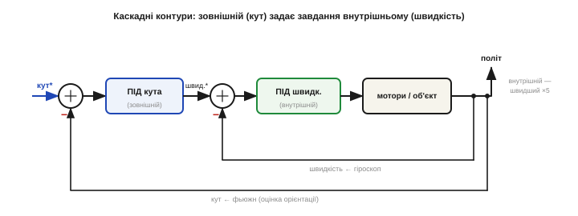
*Рис. 5.8.10.5. Каскадні контури на прикладі польоту. **Зовнішній** контур (кута) порівнює бажаний нахил із виміряним і видає не вплив на мотори, а **бажану кутову швидкість**. Її підхоплює **внутрішній** контур (швидкості), що вже й керує моторами. Внутрішній мусить бути значно **швидшим** за зовнішній — тоді для зовнішнього він виглядає майже миттєвим і слухняним.*

Навіщо так складно? Бо це дає величезні переваги. Внутрішній швидкий контур **миттєво гасить** збурення (порив вітру) і ховає примхи об'єкта, тож зовнішній контур «бачить» уже **простий, слухняний** об'єкт, який легко налаштувати. Кожен контур стає простішим окремо, ніж один спільний ПІД на все.

Є й практичний наслідок для надійності: якщо зовнішній контур (скажімо, утримання положення за GPS) дасть збій чи відмовить його давач, внутрішній контур швидкості й далі тримає апарат керованим — він просто перестане отримувати нові завдання, але не впаде. Каскад природно розшаровує систему на рівні відповідальності, де нижній, найшвидший рівень — найпростіший і найнадійніший. Це теж причина, чому критичні системи будують саме так: серце тримається на простому й швидкому, а складне й повільне лише надбудовується згори й може будь-коли відпасти без катастрофи. Залізне правило каскаду: внутрішній контур має бути помітно (умовно у 5 разів) **швидшим** за зовнішній, інакше вони почнуть заважати один одному.

Саме так улаштовані польотні режими дрона. У **режимі швидкості** (acro, для трюків) працює лише внутрішній контур: ручка задає бажану кутову швидкість, апарат слухняно її тримає, але самого горизонту «не знає». У **режимі кута** (self-level, для новачків) згори вмикається зовнішній контур: ручка задає **кут**, а він уже обчислює потрібну швидкість для внутрішнього. Те саме «зсередини назовні» діє й у налаштуванні: спершу до пуття доводять внутрішній контур швидкості, і лише на готовому, слухняному внутрішньому надбудовують зовнішній контур кута.

> 🔧 **Навіщо це.** Якщо одним ПІД ніяк не виходить і швидко, і стійко — подумайте про **каскад**. Розбийте задачу на швидкий внутрішній контур (керує безпосередньою величиною — швидкістю, струмом) і повільний зовнішній (керує тим, що вас справді цікавить, — кутом, положенням). Налаштовуйте їх **зсередини назовні**: спершу внутрішній, тоді — поверх готового внутрішнього — зовнішній. Так роблять і польотні контролери, і промислові приводи: один контур рідко тягне все.

### Місток: стабілізація польоту

Складімо тепер **усе** докупи — і побачимо, як тримається в повітрі квадрокоптер. Це капітель усього розділу, де сходяться обидві його половини: «знати орієнтацію» і «тримати» її.


*Рис. 5.8.10.6. Як стабілізується політ — увесь розділ на одній схемі. Гіроскоп і акселерометр (MEMS, Розділ 5.7) → **фьюжн** (комплементарний фільтр чи Калман, §5.8.3–5.8.4) дає надійну орієнтацію → зовнішній **ПІД кута** видає бажані кутові швидкості → внутрішній **ПІД швидкості** (вимір швидкості — прямо з гіроскопа!) рахує поправки → **мікшер** розподіляє їх на чотири мотори → апарат тримає горизонт. Замкнене коло — сто разів на секунду.*

Прослідкуймо коло. Гіроскоп і акселерометр (крихітні MEMS із Розділу 5.7) дають сирий рух; **фьюжн** (§5.8.3–5.8.4) зливає їх у надійну оцінку орієнтації — кватерніон чи кути. Зовнішній **ПІД кута** порівнює бажаний нахил із цією оцінкою й видає **бажані кутові швидкості**. Внутрішній **ПІД швидкості** порівнює їх із показом гіроскопа (та сама ідея «швидкість без диференціювання», що рятувала нас у §5.8.8) і рахує поправки. **Мікшер** перетворює поправки по крену, тангажу й рисканню на команди чотирьом моторам. Апарат повертається — давачі це бачать — коло замикається. Усе, що ми вивчали цілий розділ, працює тут **разом**, сто разів на секунду.

Один елемент варто пояснити окремо — **мікшер** (мотор-мікс). Поправки виходять окремо по крену, тангажу й рисканню, а керувати треба чотирма моторами — тож мікшер їх **комбінує**: щоб нахилити по крену, він додає тяги моторам одного боку й знімає з протилежного; по тангажу — переду чи заду; по рисканню — грає на різниці обертів діагоналей (бо сусідні пропелери крутяться в різні боки). Кожен мотор дістає суму всіх трьох поправок плюс загальну тягу газу. Проста арифметика — а саме вона й перетворює абстрактні «поправки ПІД» на конкретні оберти, що тримають апарат у повітрі.

Це і є відповідь на питання, з якого розділ починався: **як апарат тримає сам себе**. Не магія, а зворотний зв'язок — той самий, що крутив кулі Уатта й вів «Аполлон» до Місяця, тільки тепер у вигляді кількох ПІД у каскаді на копійчаному чипі.

І це не навчальне спрощення, а буквально те, що роблять справжні польотні прошивки — ArduPilot, PX4, Betaflight. Усередині кожної — той самий ланцюг: фьюжн орієнтації (часто EKF), каскад ПІД «кут → швидкість», мотор-мікс і захисти, що ми розбирали. Відкривши їхні налаштування, ви впізнаєте кожен повзунок: P, I, D для крену, тангажа й рискання, фільтри, межі. Тепер це для вас не магічні числа, а складові, зміст яких ви розумієте з перших принципів — і знаєте, що крутити й чому.

> 🔧 **Навіщо це.** Коли наступного разу побачите, як дрон завмер у повітрі попри вітер, ви знатимете **всю** машинерію за цим: MEMS-давачі, фьюжн, оцінку орієнтації, каскад ПІД, мікшер моторів — і чому кожна ланка саме така. Це знання — не лише про дрони: той самий ланцюг «виміряй → оціни → порівняй із бажаним → подій проти помилки» лежить в основі будь-якої системи, що тримає себе сама, від 3D-принтера до супутника. Опанувавши його раз, ви впізнаєте й збудуєте його будь-де.

Цим ми завершуємо і розділ, і весь модуль про давачі, сигнали й керування. Ми пройшли довгий шлях: від фізики давача (Розділ 5.1) — через вимірювання, фільтрацію й спектр (Розділи 5.2–5.6) — до інерціальних MEMS (Розділ 5.7) і, нарешті, до того, як із недосконалих давачів **здобути** орієнтацію й **утримати** її зворотним зв'язком (Розділ 5.8). Тепер апарат відчуває світ і керує собою в ньому.

Озирніться, скільки всього зійшлося в цьому останньому розділі. Щоб дрон просто завис рівно, разом працюють: фізика MEMS-вантажика на пружинках, математика кватерніонів, статистика фільтра Калмана, частотний погляд на шум, дискретна арифметика мікроконтролера й теорія зворотного зв'язку, вирощувана від Уатта до Мінорського. Жодна з цих частин **окремо** не втримала б апарат; тримає його саме їхня **спільна** робота. У цьому і краса інженерії систем: ціле вміє те, чого не вміє жодна з частин — і пройшовши весь цей модуль, ви тепер бачите ціле.

Лишилося навчити апарат **спілкуватися** — обмінюватися даними з іншими пристроями, із землею, з пілотом. Та апарат, що ідеально тримає себе, поки що **самотній**: він не вміє ні прийняти команду від пілота, ні розповісти про свій стан, ні почути сусідній модуль. А реальний пристрій — це завжди розмова: давач шепоче по шині мікроконтролеру, контролер віддає накази моторам, радіо несе телеметрію на землю. Без спільної мови всі ці розумні частини лишаються глухими одна до одної. Саме до зв'язку — дротового й радіо — і переходить наступний модуль, де ми навчимо наші пристрої говорити між собою.

> ▶️ Далі: [Розділ 6.1 — UART і протоколи поверх нього](../../block-6-comms-radio/ch35-uart/ch35-uart.md)
