# Розділ 5.6 — Цифрові фільтри в мікроконтролері

Розділ 5.4 дав нам прості часові фільтри — ковзне середнє, медіану, EMA, — а Розділ 5.5 навчив дивитися на сигнал у частоті й побачив, що заваду там можна просто «вирізати». Цей розділ зводить обидві лінії докупи: **цифровий фільтр** — це річ, що **формує спектр** сигналу (підсилює одні частоти, гасить інші), але робить це дешево й у реальному часі, **без** повного перетворення Фур'є. Спершу — сама ідея фільтра як формувача спектра й поняття частотної характеристики (§5.6.1). Тоді два великі сімейства: **КІХ** (FIR) зі скінченною пам'яттю (§5.6.2) і **БІХ** (IIR) зі зворотним зв'язком (§5.6.3). Далі — типи смуг: низько-, високочастотні та смугові (§5.6.4), практична реалізація на МК із цілою арифметикою й швидкодією (§5.6.5) і підсумок — який клас фільтра коли брати (§5.6.6).

---

## 5.6.1 Фільтр як «формувач спектра»

У минулому розділі ми побачили звабливу картину: щоб прибрати гул 50 Гц, досить перейти в частотну область, занулити відповідний пік і повернутися назад. Гарно — але **дорого**: повне ШПФ туди-назад на кожен відлік мікроконтролер не потягне. На щастя, той самий результат — **підсилити одні частоти й приглушити інші** — можна дістати куди дешевше, прямо в часі, кількома множеннями-додаваннями на кожен відлік. Річ, що це робить, і зветься **цифровим фільтром**. Ця тема — про головну ідею, що об'єднує всі фільтри: будь-який із них, хоч би як був влаштований усередині, у частотному погляді робить одне — **формує спектр** за своєю **частотною характеристикою**. Зрозумівши це, ви бачитимете будь-який фільтр наскрізь.

Варто одразу пояснити, чому не робити все через ШПФ, як спокушав Розділ 5.5. По-перше, **ціна**: перетворення туди-назад на кожен відлік — гори арифметики, тоді як фільтр коштує лише кількох множень. По-друге, **затримка**: ШПФ мусить спершу назбирати буфер на `N` відліків (§5.5.7), а фільтр віддає очищений відлік **щойно** прийшов новий, без накопичення. Тому для безперервного, потокового очищення сигналу в реальному часі фільтр майже завжди кращий за ШПФ — він дешевий, миттєвий і не вимагає буфера.

### Фільтр через призму частот

Поглянемо на фільтр з боку частот. Сигнал — це сума синусоїд (§5.5.2). Фільтр діє на кожну з них **окремо**: одну пропускає майже без змін, другу — приглушує вдвічі, третю — гасить майже до нуля. Тобто фільтр **множить** кожну частотну складову на свій коефіцієнт — і саме набір цих коефіцієнтів, від нуля до Найквіста, повністю описує, що фільтр робить.

Чому ж одна-єдина крива описує **все**? Бо фільтр **лінійний**: він діє на суму сигналів так само, як на кожен окремо, а тоді складає результати (принцип суперпозиції). Тому досить знати, що фільтр робить із **кожною** окремою синусоїдою, — а будь-який сигнал є їхньою сумою (§5.5.2). Розклали вхід на частоти, кожну помножили на її коефіцієнт, склали назад — ось і весь фільтр. Саме лінійність дарує нам право описувати фільтр однією характеристикою замість безлічі окремих випадків.

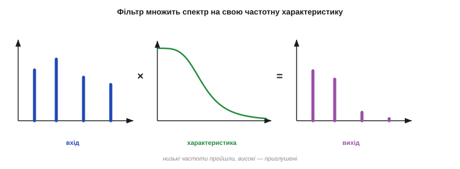
*Рис. 5.6.1.1. Фільтр як формувач спектра. Спектр вхідного сигналу (ліворуч) множиться на **частотну характеристику** фільтра (посередині) — і виходить спектр на виході (праворуч): низькі частоти пройшли, високі — приглушені. Уся дія фільтра — це поточкове множення спектра на цю криву. Решта (КІХ, БІХ, коефіцієнти) — лише способи реалізувати потрібну криву дешево в часі.*

Ось чому частотна характеристика — це **паспорт** фільтра: знаючи її, ви знаєте про фільтр усе, що важить для сигналу. Два геть різні всередині фільтри з однаковою характеристикою діятимуть на сигнал **однаково**. Тому проєктування фільтра завжди починається з питання «**яку форму** характеристики я хочу» — а вже потім із того, як її втілити.

Чесно кажучи, повна характеристика має й **другий** бік — **фазовий**: фільтр не лише міняє силу кожної частоти, а й трохи зсуває її в часі (затримує). Здебільшого нас цікавить саме амплітудний бік — «що пропускаю, що гашу», — тож далі під «характеристикою» матимемо на увазі його. Та про фазу варто пам'ятати: вона і є джерело тієї **затримки**, що фільтр вносить (§5.4.5). Деякі фільтри (КІХ) уміють зсувати всі частоти рівно — це «лінійна фаза», що не спотворює форму сигналу; інші (БІХ) — ні. До цієї відмінності ми ще повернемось (§5.6.6).

### Частотна характеристика: паспорт фільтра

Розгляньмо цей паспорт зблизька. Частотна характеристика (точніше — її **амплітудна** частина, *magnitude response*) — це графік **підсилення** фільтра залежно від частоти: по горизонталі частота (від 0 до Найквіста, §5.5.4), по вертикалі — у скільки разів фільтр множить цю частоту. Підсилення 1 — частота проходить незмінно; 0 — гаситься повністю; 0.5 — слабшає вдвічі.

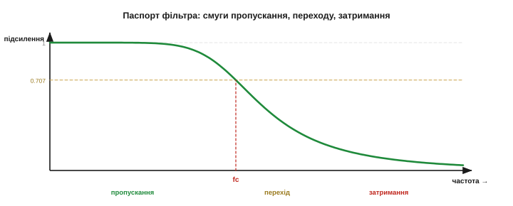
*Рис. 5.6.1.2. Паспорт фільтра-ФНЧ. **Смуга пропускання** (passband) — частоти, що проходять (підсилення ≈ 1); **смуга затримання** (stopband) — що гасяться (≈ 0); між ними — **смуга переходу**. Частота, де підсилення падає до 0.707 (−3 дБ, половина потужності), зветься **частотою зрізу** (fc) — умовна межа «пропускаю / гашу».*

Ключові слова, що ви бачитимете всюди: **смуга пропускання** (де фільтр пропускає), **смуга затримання** (де гасить), **смуга переходу** між ними й **частота зрізу** `fc` — умовна межа, де підсилення падає до 0.707 (тобто −3 дБ, половина потужності, §5.5.3). Фільтр на нашому малюнку пропускає низькі частоти й гасить високі — це **низькочастотний фільтр** (ФНЧ); бувають і інші форми (високочастотні, смугові), та про них окремо (§5.6.4). Сама ж мова — пропускання, затримання, зріз — однакова для всіх.

Часто характеристику малюють не в разах, а в **децибелах** (§5.5.3) — і не дарма: затримання цікаве саме своєю глибиною, а вона величезна. Підсилення 0.01 (гасіння в сто разів) — це −40 дБ, 0.001 — −60 дБ; на лінійній шкалі всі вони злилися б із нулем, а в децибелах видно, **наскільки** добре фільтр давить заваду. Тому «затримання −40 дБ» — звична мова специфікації: вона каже, що в смузі затримання сигнал слабшає принаймні в сто разів. Читаючи характеристику, завжди дивіться, в чому намальована її вертикаль — у разах чи децибелах.

### Ми вже будували фільтри: ковзне середнє

Найприємніше відкриття: ви вже **робили** формувачі спектра, навіть не називаючи їх так. Згадайте **ковзне середнє** з §5.4.2 — воно згладжувало шум, пропускаючи повільні зміни й приглушуючи швидкі. Це ж буквально опис **низькочастотного фільтра**! І в нього є цілком конкретна частотна характеристика — з тими самими «нулями», що ми помітили ще в §5.4.2.

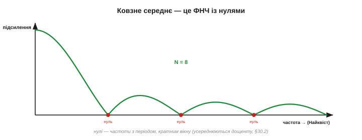
*Рис. 5.6.1.3. Ковзне середнє очима частот. Його характеристика — низькочастотна: на 0 Гц підсилення 1 (повільне проходить), далі спадає, і на певних частотах падає рівно в **нуль** (ті самі нулі з §5.4.2 — частоти, що вкладаються у вікно цілим числом періодів, усереднюються дощенту). Між нулями стирчать невеликі «горбики» — недосконале, але дешеве й чесне ФНЧ.*

Тобто ще в Розділі 5.4, усереднюючи відліки, ви несвідомо проєктували ФНЧ — лише дивилися на нього в часі, а не в частоті. Нулі характеристики — це частоти, що рівно вкладаються у вікно цілим числом періодів і тому усереднюються в нуль (§5.4.2). А між нулями лишаються невеликі «бічні горбики» — тому ковзне середнє й не ідеальне ФНЧ: воно непогано гасить, але «пропускає» дещо у тих горбиках. Зате коштує копійки.

А ще ці нулі — не лише вада, а й **інструмент**. Оскільки ковзне середнє по `N` відліків гасить дощенту частоту з періодом рівно `N` відліків (і її кратні), його можна навмисне налаштувати на конкретну заваду. Класичний прийом: усереднювати рівно по **одному періоду мережі** (скажімо, 20 відліків за 1000 Гц для 50 Гц) — і нуль характеристики сяде точно на 50 Гц, прибравши мережевий гул майже задарма. Так найдешевший фільтр перетворюється на прицільний знищувач **відомої** частоти — варто лише підібрати довжину вікна під її період.

### EMA — м'який ФНЧ

Так само й **EMA** (§5.4.4) — це низькочастотний фільтр, тільки **гладший**. Його характеристика спадає плавно, без нулів і горбиків, а коефіцієнт α керує **частотою зрізу**: велика α — зріз високо (фільтр слабкий, пропускає більше), мала α — зріз низько (фільтр сильний, гасить більше).

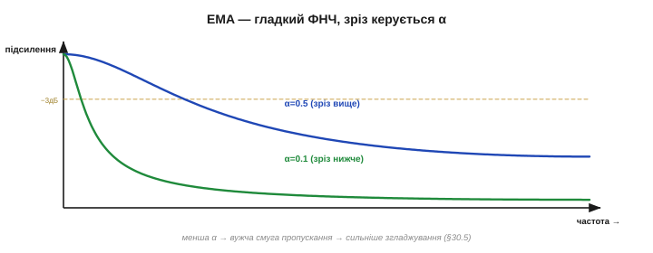
*Рис. 5.6.1.4. EMA очима частот. Гладка низькочастотна крива без нулів: на 0 Гц підсилення 1, далі плавно спадає. Менша α зсуває зріз нижче (сильніше згладжування, вужча смуга пропускання), більша α — вище (слабше згладжування). Той самий компроміс згладжування↔затримка з §5.4.5 — тепер видно як ширину смуги пропускання.*

Помітьте, як акуратно сходяться обидва погляди. У часі (§5.4.5) ми казали: мала α — сильніше згладжування, але більша затримка. У частоті це звучить так: мала α — вужча смуга пропускання (зріз нижче), тож гаситься більше частот. Це **той самий** фільтр, описаний двома мовами розділу 5.5 — і саме тому ми спершу й вивчили частоту: щоб тепер розуміти фільтри **по-справжньому**, а не як магічні формули згладжування.

Не випадково характеристика EMA повторює форму аналогового **RC-фільтра** низьких частот (§5.4.4) — на низьких частотах вони збігаються майже точно, і лише поблизу частоти Найквіста цифрова копія неминуче відхиляється: цифрова EMA — це програмна копія резистора з конденсатором, а коефіцієнт α відповідає сталій часу RC-кола. Тому все, що ви знаєте про RC-згладжування з аналогової електроніки, прямо переноситься на EMA — і навпаки. Один і той самий низькочастотний фільтр живе і в залізі (опір та ємність), і в коді (одна змінна стану) — лише мова реалізації різна.

> 🔧 **Навіщо це.** Звикайте думати про **будь-який** фільтр через його частотну характеристику — «що пропускає, що гасить». Ковзне середнє й EMA — це ФНЧ: пропускають повільне (корисний сигнал), гасять швидке (шум). Щойно ви бачите фільтр як форму на осі частот, ви одразу розумієте, **що** він зробить із вашим сигналом, і можете свідомо обрати зріз — а не крутити α наосліп, дивлячись лише на часовий графік.

### Ідеал і реальність

Якби фільтри були ідеальні, характеристика була б «цеглиною»: рівно 1 до частоти зрізу й рівно 0 одразу за нею — гострий обрив. На жаль, **такого не буває**. Реальна характеристика спадає **поступово**, має скінченну за шириною смугу переходу, а часто й невеликі коливання (**пульсації**) у смузі пропускання та не до кінця нульове затримання.

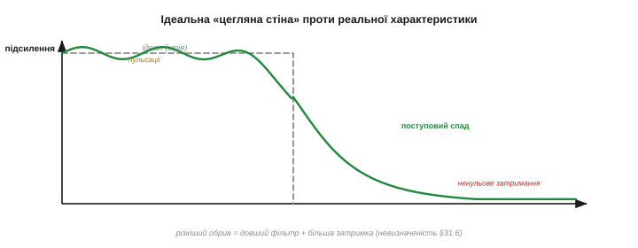
*Рис. 5.6.1.5. Мрія й дійсність. Ідеальний ФНЧ (пунктир) — «цегляна стіна»: 1 до зрізу, 0 після, миттєвий обрив. Реальний (суцільна) — спадає **поступово** через смугу переходу, може мати пульсації в смузі пропускання й не зовсім нульове затримання. Чим різкіший обрив хочемо, тим «дорожчий» фільтр (більше коефіцієнтів, §5.6.2). Ідеал недосяжний — його лише наближають.*

Чому ідеал недосяжний? З тієї самої причини, що й усюди в цьому модулі: **різкий обрив у частоті вимагає нескінченної протяжності в часі** (принцип невизначеності, §5.5.6). Гострий зріз коштує **довшого** фільтра (більше коефіцієнтів, більше пам'яті й тактів) і **більшої затримки**. Тому реальне проєктування — це завжди торг: наскільки різкий обрив вам **справді** потрібен і скільки ви готові за нього заплатити ресурсами.

На щастя, торгуватися вручну не доведеться. Зазвичай ви задаєте **специфікацію** — де закінчується смуга пропускання, де починається затримання, яка допустима пульсація й глибина гасіння, — а готовий інструмент (на ПК це функції проєктування фільтрів, у бібліотеках МК — заздалегідь пораховані набори) видає коефіцієнти, що цю специфікацію задовольняють. Ваша справа — чесно сформулювати вимоги в **частотних** термінах; нудну математику підбору коефіцієнтів бере на себе процедура. Тому розуміти **форму** характеристики важливіше, ніж уміти рахувати коефіцієнти руками.

Два слова про **пульсації**: невелике брижання характеристики в смузі пропускання означає, що різні корисні частоти проходять трохи неоднаково — зазвичай терпимо, якщо брижі дрібні. Інженер задає, наскільки великі брижі допустимі, — і це теж частина специфікації, поряд із різкістю переходу та глибиною затримання.

### Задум фільтра: задати форму — і реалізувати в часі

Зведімо все в єдину картину — як народжується фільтр. Спершу ви **задаєте бажану характеристику**: що пропускати, що гасити, де зріз, наскільки різкий перехід. Тоді спеціальна процедура (її ми розберемо в §5.6.2–5.6.3) перетворює цю криву на набір **коефіцієнтів**. А далі фільтр працює в часі найдешевшим способом — **зважена сума відліків**: кілька множень і додавань на кожен новий відлік, і жодного ШПФ.


*Рис. 5.6.1.6. Як народжується фільтр. (1) Задаємо **бажану форму** характеристики (що пропускати/гасити). (2) Процедура проєктування перетворює її на **коефіцієнти**. (3) У роботі фільтр — лише **зважена сума** недавніх відліків (кілька множень-додавань на відлік), дешева й миттєва. Так частотний задум стає копійчаною часовою операцією.*

У цьому вся краса цифрових фільтрів: **мислимо в частоті, рахуємо в часі**. Бажаний результат формулюємо мовою спектра («пропусти до 10 Гц, зріж усе вище»), а виконуємо кількома арифметичними діями на потоці чисел — те, що мікроконтролер робить легко й мільйони разів на секунду. Усі наступні теми — лише різні способи дістати потрібні коефіцієнти й розрахувати цю суму.

Способів цих два, і вони задають усю структуру розділу. **КІХ** (FIR, §5.6.2) рахує вихід як зважену суму лише **вхідних** відліків — скінченна пам'ять, проста й передбачувана. **БІХ** (IIR, §5.6.3) додає до суми ще й **попередні виходи** — зворотний зв'язок, що робить фільтр куди ефективнішим (та сама крутість за менше коефіцієнтів), але й хитрішим у поводженні. Обидва дають частотну характеристику; різниця — у ціні, гостроті й підступах. Саме їх ми й розберемо далі по черзі.

**Приклад (зріз ковзного середнього).** Який ФНЧ дає усереднення по `N = 10` відліків при `fs = 1000` Гц? Перший нуль характеристики стоїть там, де в вікно вкладається один період:

```
перший нуль:   f₀ = fs / N = 1000 / 10 = 100 Гц
частота зрізу (−3 дБ) ≈ 0.44 · f₀ ≈ 44 Гц   (приблизно для ковзного середнього)
тобто: усереднення по 10 ≈ ФНЧ зі зрізом ~44 Гц і нулем на 100 Гц
```

Тобто навіть найпростіше усереднення має точну частотну адресу: хочете зрізати вище — беріть коротше вікно (більший `N` опускає зріз). Часова й частотна мови дають той самий фільтр — і тепер ви вмієте перекладати між ними.

> 🔧 **Навіщо це.** Проєктування фільтра завжди починайте **з частоти**, а не з коду: яку смугу пропустити (де корисний сигнал) і яку зрізати (де шум, гул, завада). Намалюйте бажану характеристику в голові — і лише тоді добирайте фільтр, що її дає. Це рятує від типової помилки «накрутив згладжування на око» — коли фільтр або ріже корисне, або пропускає заваду, бо його зріз ніхто свідомо не ставив.

> 🔧 **Навіщо це.** Не чекайте від фільтра «цегляної стіни». Завжди закладайте **смугу переходу** між тим, що пропускаєте, і тим, що гасите: корисний сигнал має сидіти **впевнено** в смузі пропускання, а завада — **впевнено** в смузі затримання, з добрим запасом між ними. Якщо вони близько, знадобиться різкий (а отже, довгий і повільний) фільтр; рознесіть їх — і впораєтесь дешевим.

Отже, фільтр — це формувач спектра, заданий своєю частотною характеристикою, а реалізований дешевою зваженою сумою в часі. Ми навіть упізнали в наших старих знайомих із Розділу 5.4 — ковзному середньому та EMA — два низькочастотні фільтри. Лишилося розібрати, **як саме** з бажаної характеристики дістають коефіцієнти й рахують ту суму. Почнемо з найпрозорішого сімейства — фільтрів зі **скінченною пам'яттю**, де вихід є просто зваженою сумою кількох останніх відліків. Це **КІХ-фільтри** (FIR) — найпрозоріший і найпередбачуваніший клас, з якого й варто починати знайомство з цифровою фільтрацією. Саме вони — наступна тема.

---

## 5.6.2 КІХ-фільтр (FIR): скінченна пам'ять

Найпрозоріший спосіб втілити «зважену суму» з §5.6.1 — це **КІХ-фільтр** (*Finite Impulse Response, FIR*, «скінченна імпульсна характеристика»). Його ідея настільки проста, що вкладається в один рядок: вихід — це **зважена сума кількох останніх вхідних відліків**. Жодного зворотного зв'язку, жодних хитрощів — лише запам'ятай останні `N` чисел, помнож кожне на свою вагу й додай. Саме така прозорість, разом із двома чудовими властивостями (лінійна фаза й безумовна стійкість), робить КІХ улюбленим робочим конем цифрової фільтрації. Розберімо його структуру, зрозуміємо, звідки назва, і побачимо, як його полічити на мікроконтролері.

Забігаючи наперед: саме КІХ стоїть там, де форма й передбачуваність важать найбільше — у звуковій техніці, у системах зв'язку, у вимірювальних приладах. Щоразу, коли треба відфільтрувати, **не спотворивши** сигналу, першим згадують КІХ. Тож це не академічна вправа, а робочий інструмент, який ви напевно зустрінете на практиці.

### Зважена сума кількох відліків

Формула КІХ-фільтра — пряме втілення зваженої суми:

```
y[n] = b₀·x[n] + b₁·x[n−1] + b₂·x[n−2] + … + b_M·x[n−M]
            M
     =      Σ   bₖ · x[n−k]
           k=0
```

Тут `x[n]` — поточний відлік, `x[n−1]` — попередній, і так далі вглиб на `M` кроків; `bₖ` — **коефіцієнти** (їх ще звуть **відводами**, *taps*). Щоб дістати новий вихід `y[n]`, фільтр бере `M+1` останніх входів, кожен множить на свою вагу й усе складає. От і все — ні ділень, ні зворотних зв'язків, лише множення й додавання.

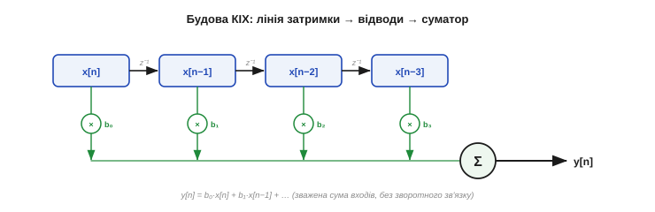
*Рис. 5.6.2.1. Будова КІХ-фільтра. Угорі — **лінія затримки**: відліки зсуваються по комірках x[n] → x[n−1] → x[n−2]… Кожна комірка домножується на свій коефіцієнт bₖ (відвід), а всі добутки йдуть у **суматор**, що й видає y[n]. Жодного зв'язку від виходу назад — лише вхідні відліки. Це і є вся обчислювальна схема.*

Ви вже бачили окремий випадок цієї формули — **ковзне середнє** (§5.4.2): це КІХ, у якого **всі** коефіцієнти однакові й дорівнюють `1/N`. Усереднення по 4 — це КІХ із відводами `(¼, ¼, ¼, ¼)`. А варто зробити коефіцієнти **різними** — і дістанемо фільтр з іншою, кращою характеристикою. Уся майстерність КІХ — у доборі цих ваг.

Корисно уявити коефіцієнти як **трафарет**, що ковзає вздовж сигналу. У кожній позиції фільтр накладає трафарет на останні `M+1` відліків, перемножує їх із вагами й підсумовує — і так крок за кроком уздовж усього потоку. Ця операція «ковзного зваженого підсумовування» в математиці зветься [згорткою](book:math/convolution) (*convolution*): вихід КІХ — це згортка вхідного сигналу з набором його коефіцієнтів. Назва страшна, та суть проста — той самий трафарет ваг, протягнутий по всьому сигналу. Звідси й інтуїція: **форма трафарета** (ваг) і визначає, що фільтр підкреслить, а що згладить.

### Чому «скінченна імпульсна»

Звідки химерна назва? Подаймо на вхід фільтра **одиничний імпульс** — один-єдиний ненульовий відлік: `x = (1, 0, 0, 0, …)`. Що буде на виході? Підставмо у формулу: спершу вихід дорівнює `b₀`, наступного кроку — `b₁`, тоді `b₂`… аж до `b_M`, а далі — **нуль назавжди**, бо одиничка вже «виповзла» з лінії затримки.

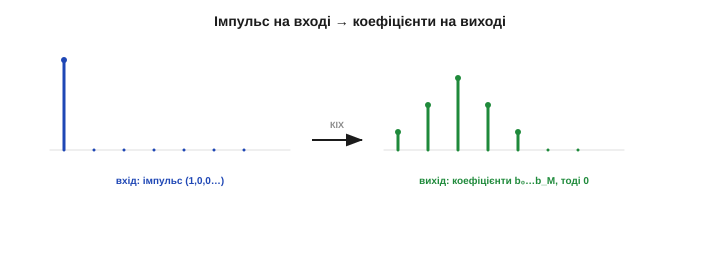
*Рис. 5.6.2.2. Звідки назва. Подаємо одиничний імпульс (ліворуч) — і на виході (праворуч) одне за одним з'являються самі **коефіцієнти** b₀, b₁, …, b_M, після чого — нуль. Реакція на імпульс **скінченна** в часі (рівно M+1 відліків) — звідси й «скінченна імпульсна характеристика». А заразом видно: коефіцієнти фільтра **і є** його імпульсна характеристика.*

Ось і відповідь: реакція КІХ на імпульс **скінченна** — триває рівно `M+1` відліків і обривається. Звідси й назва. І заразом відкривається гарний факт: **імпульсна характеристика КІХ — це і є його коефіцієнти**, виписані по черзі. А ще звідси — **скінченна пам'ять**: будь-який вхідний відлік впливає на вихід рівно `M+1` кроків, а тоді забувається назавжди. Викид, що потрапив у фільтр, зіпсує щонайбільше `M+1` виходів — і безслідно зникне.

Ця скінченна пам'ять має приємний практичний бік. По-перше, КІХ **не має минулого, що тягнеться вічно**: усе, що сталося давніше за `M+1` відліків тому, фільтра більше не обходить, тож він швидко «забуває» старі збурення й перехідні процеси. По-друге, його поведінку легко **передбачити й перевірити**: подав імпульс — побачив рівно коефіцієнти; подав сходинку — побачив, як вона за `M+1` кроків плавно встановиться. Жодної прихованої динаміки, жодних сюрпризів — уся «душа» фільтра на видноті, рівно в `M+1` числах.

### Коефіцієнти — це і є фільтр

Раз імпульсна характеристика дорівнює коефіцієнтам, то й уся поведінка фільтра захована в них. Хочете інший фільтр — міняйте ваги. Рівні ваги (ковзне середнє) дають грубувате ФНЧ із нулями (§5.6.1); а якщо надати вагам **плавної, дзвоноподібної** форми (більші посередині, менші скраю — фактично накласти вікно, §5.5.6), характеристика стає куди чистішою.

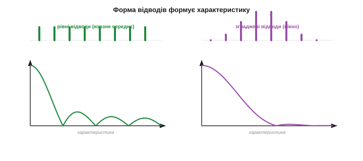
*Рис. 5.6.2.3. Форма відводів формує характеристику. Ліворуч — рівні коефіцієнти (ковзне середнє): груба характеристика з помітними бічними «горбиками». Праворуч — згладжені, дзвоноподібні коефіцієнти: ті самі затрати, та характеристика гладша, із нижчими горбиками. Підбираючи **форму** ваг, ми ліпимо потрібну криву — у цьому й суть проєктування КІХ.*

Саме тому проєктування КІХ зводиться до **обчислення правильних ваг** під бажану характеристику (§5.6.1). Для типових фільтрів ці набори давно пораховані й лежать у бібліотеках; вам лишається підставити готові коефіцієнти. Та головне розуміти: **коефіцієнти — це фільтр**, і нічого, крім них, у КІХ немає.

А звідки беруться «правильні» ваги для, скажімо, гострого ФНЧ? Ідеальний фільтр-«цеглина» (§5.6.1) має нескінченно довгу імпульсну характеристику особливої форми — **sinc** (`sin(x)/x`). Реальний КІХ її **обрізає** до `M+1` відводів — а різкий обрив, як ми знаємо з §5.5.6, породжує брижі (явище Ґіббса). Тому обрізаний sinc ще й **згладжують вікном** (Ганна, Блекмана) — точнісінько як у спектрі. Так і народжуються коефіцієнти типового КІХ: ідеальний sinc, обрізаний і завіконений. Знов та сама ідея вікон, тепер у часовій ролі — приємно бачити, як знання розділу 5.5 прямо працює тут.

### Лінійна фаза: дар КІХ

Тепер — головна перевага КІХ, заради якої його часто й обирають. Якщо коефіцієнти зробити **симетричними** (дзеркальними: `b₀ = b_M`, `b₁ = b_{M−1}` і так далі), фільтр набуває **лінійної фази**: він затримує **всі** частоти на **однакову** кількість відліків — рівно `M/2`. А однакова затримка для всіх частот означає, що форма сигналу **не спотворюється** — лише зсувається в часі.

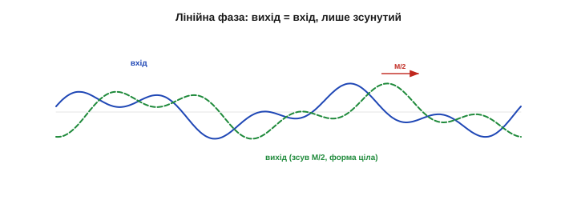
*Рис. 5.6.2.4. Лінійна фаза — форма не псується. Симетричні коефіцієнти затримують усі частоти на одну й ту саму величину (M/2 відліків). Тому складний сигнал (у межах смуги пропускання) на виході — це точна копія входу, лише зсунута в часі: жодна частота не «обігнала» іншої, форма ціла. Для КІХ це дається задарма (треба лише симетрія ваг); інші фільтри так не вміють.*

Це велика річ. Згадайте §5.5.2: різні частоти, зсунуті по-різному, дають **іншу** форму хвилі. Звичайний фільтр зсуває частоти неоднаково й тому **спотворює** форму — а лінійно-фазовий КІХ зберігає її ідеально. Там, де форма сигналу важлива (ЕКГ, осцилограми, звук), це вирішальна перевага. І дається вона КІХ майже задарма — самою лише симетрією коефіцієнтів.

Та за лінійну фазу теж платять — **затримкою**. Стала затримка `M/2` відліків нікуди не дівається: гострий лінійно-фазовий КІХ на сто відводів зсуває сигнал на п'ятдесят відліків, а це у контурі керування може коштувати стійкості (§5.4.5). Тобто КІХ не спотворює форму, але **запізнює** її — і що різкіший фільтр, то більше. Для показу й аналізу це дрібниця; для швидкого зворотного зв'язку — ні, і там часто беруть коротший фільтр або зовсім інший клас.

### Завжди стійкий

Друга безцінна властивість КІХ — **безумовна стійкість**. Вихід КІХ — це скінченна сума обмежених входів, помножених на сталі ваги; така сума **ніколи не може вибухнути**. Хоч би які коефіцієнти ви взяли, хоч би що подали на вхід, фільтр лишиться сумирним: жодного самозбудження, жодного нескінченного наростання. Це робить КІХ **безпечним** за замовчуванням — важлива риса, коли від фільтра залежить керування чи безпека.

Це різко відрізняє КІХ від його наступника. БІХ-фільтр (§5.6.3) живиться **власним виходом**, а отже, за невдалих коефіцієнтів здатний піти в розгін і «вибухнути» — нескінченно наростити вихід із дрібної похибки. КІХ такого не вміє в принципі: нема зворотного зв'язку — нема й чому розганятися. Тому в системах, де ціна збою висока, інженери часто свідомо жертвують ефективністю заради цієї **гарантованої** безпеки КІХ.

> 🔧 **Навіщо це.** Дві властивості роблять КІХ улюбленцем там, де **надійність** понад усе: він **завжди стійкий** (не вибухне за жодних коефіцієнтів) і може мати **лінійну фазу** (не спотворює форму). Тому, коли вам потрібен передбачуваний, безпечний фільтр, що не псує сигнал, — беріть КІХ і не думайте про стабільність зовсім. Платою буде більше обчислень за ту саму гостроту (про це нижче й у §5.6.6).

### Реалізація: буфер + множення-додавання

Як це працює в коді? Потрібні дві речі: **буфер** на `M+1` останніх відліків і цикл **множення-накопичення** (*MAC, multiply-accumulate*). З кожним новим відліком ви кладете його в буфер (витискаючи найстаріший), а тоді пробігаєте по всіх відводах, домножуючи й додаючи.

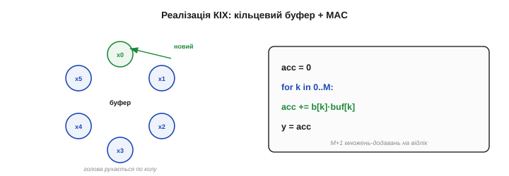
*Рис. 5.6.2.5. Як рахувати КІХ на МК. **Кільцевий буфер** зберігає M+1 останніх відліків (новий витискає найстаріший по колу, без зсуву масиву). Далі — цикл **MAC**: суму обнуляють і додають до неї bₖ·x[n−k] по всіх відводах. Вартість — M+1 множень-додавань на кожен вихідний відлік. Це рівно те, що апаратний MAC мікроконтролера робить найшвидше.*

Вартість КІХ проста й передбачувана: **`M+1` множень-додавань на кожен відлік**. Сучасні мікроконтролери (особливо з апаратним MAC чи DSP-розширеннями, як-от CMSIS-DSP) виконують такий цикл блискавично, тож КІХ на кілька десятків відводів — буденність навіть для дешевого чипа.

Тонкість реалізації — у **кільцевому буфері**. Замість того щоб щоразу зсувати весь масив (дорого), новий відлік просто перезаписує найстарішу комірку, а індекс «голови» рухається по колу (за модулем розміру). Так додавання відліку коштує однієї операції незалежно від довжини фільтра. А самі множення на МК часто роблять не з дробовими, а з **цілими** числами (fixed-point) — швидше й без плаваючої коми; до цього важливого прийому ми ще дійдемо (§5.6.5).

Скільки відводів треба на практиці? Залежить від задачі: простому згладжувачу досить 5–20, а гострому смуговому фільтру для звуку — від десятків до сотень. Орієнтир такий: грубий фільтр — одиниці-десятки відводів, точний — сотні. На щастя, навіть сотня множень-додавань на відлік для сучасного МК на десятки мегагерц — це частки відсотка завантаження, тож КІХ помірної довжини майже ніколи не стає вузьким місцем. Дорогим КІХ робить хіба погоня за дуже гострим зрізом — тоді й починають придивлятися до БІХ.

**Приклад (КІХ на пальцях).** Простий 3-відвідний згладжувач із вагами `(0.25, 0.5, 0.25)` і вхідним потоком `…, 4, 8, 6, …`:

```
коефіцієнти:  b = (0.25, 0.5, 0.25)
відліки:      x[n]=6,  x[n−1]=8,  x[n−2]=4
y[n] = 0.25·6 + 0.5·8 + 0.25·4 = 1.5 + 4.0 + 1.0 = 6.5
(перевірка імпульсу: вхід 1,0,0… → вихід 0.25, 0.5, 0.25, 0 — це й є коефіцієнти)
```

Три множення, два додавання — і готовий згладжений відлік. Помітьте, що ваги `(0.25, 0.5, 0.25)` симетричні, тож цей фільтр ще й лінійно-фазовий: він трохи розмиє шум, зсунувши сигнал рівно на один відлік, не спотворивши форми.

Цей приклад добре показує головну рису КІХ — **повну прозорість**. Усе, що фільтр зробить, записано в кількох коефіцієнтах: жодної прихованої пам'яті, жодної динаміки поза тими `M+1` вагами. Тому КІХ легко проєктувати, перевіряти й налагоджувати — ви буквально бачите його роботу в наборі чисел. Саме за цю чесність — «що в коефіцієнтах, те й на виході» — інженери й люблять КІХ, навіть коли він дорожчий за хитріші альтернативи.

Одна засторога наперед: підсумовуючи `M+1` доданків, стежте, щоб сума не **переповнила** розрядність змінної — на МК це реальна пастка цілої арифметики. Але це вже питання реалізації, до якого повернемось у §5.6.5; концептуально ж КІХ лишається найпростішим і найбезпечнішим фільтром, який тільки буває.

### Ціна гостроти: більше відводів

За все треба платити, і КІХ платить **кількістю відводів**. Що різкіший потрібен зріз характеристики (вужча смуга переходу, §5.6.1), то **більше** коефіцієнтів доведеться взяти — а отже, більше пам'яті, більше множень на відлік і більша затримка (`M/2`).

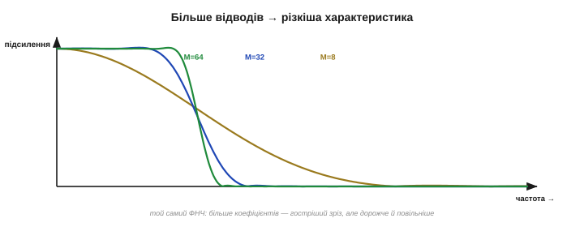
*Рис. 5.6.2.6. Гострота коштує відводів. Той самий ФНЧ із різним числом коефіцієнтів: мало відводів (M=8) — пологий, розмитий перехід; більше (M=32, M=64) — дедалі різкіший обрив, ближчий до ідеалу. Та кожне подвоєння відводів — це вдвічі більше обчислень і вдвічі більша затримка. Гострий КІХ буває «важким».*

Це й є головна вада КІХ: щоб дістати по-справжньому крутий зріз, потрібні десятки, а то й сотні відводів — і фільтр стає дорогим за обчисленнями та повільним за затримкою. Саме тут на сцену виходить інша конструкція, що тієї самої гостроти досягає **жменькою** коефіцієнтів завдяки зворотному зв'язку, — БІХ-фільтр. Але за свою ефективність він бере хитрістю й ризиком нестабільності — і це вже наступна тема.

> 🔧 **Навіщо це.** Прикидайте вартість КІХ заздалегідь: вона дорівнює числу відводів. Фільтр на 20 відводів при `fs = 10` кГц — це 200 тисяч множень-додавань за секунду, дрібниця для МК; а ось гострий фільтр на 500 відводів — уже 5 мільйонів, та ще й затримка в 250 відліків. Тому беріть **рівно стільки** відводів, скільки треба для потрібної гостроти, не більше: зайва крутість зрізу оплачується тактами й затримкою.

Щоб відчути контраст: гострий ФНЧ, якому КІХ потребує **сотні** відводів, БІХ-фільтр (наступна тема) дає лише **кількома** коефіцієнтами — у десятки разів дешевше. Саме ця разюча економія й змушує миритися з підступами зворотного зв'язку. КІХ простий і безпечний, але «важкий» на гострих задачах; БІХ — навпаки. Цей вибір між простотою-безпекою та ефективністю червоною ниткою пройде через увесь розділ, а підсумок підіб'ємо в §5.6.6.

> 🔧 **Навіщо це.** Для лінійної фази робіть коефіцієнти **симетричними** — і перевіряйте це в готових наборах. Симетрія не лише зберігає форму сигналу, а й удвічі економить множення (бо `bₖ = b_{M−k}`, дзеркальні відліки можна додати **до** множення). Багато бібліотечних КІХ саме симетричні; якщо ваш — ні, спитайте себе, чи справді вам байдужа форма сигналу.

Отже, КІХ — це чесна зважена сума недавніх входів: прозорий, завжди стійкий, здатний не спотворювати форму, але тим дорожчий, чим різкіший. Його коефіцієнти — це і є фільтр, вони ж — його імпульсна характеристика. Коли цієї простоти бракує — коли потрібен гострий зріз за копійчані ресурси, — інженери додають **зворотний зв'язок** і дістають зовсім іншого звіра: БІХ-фільтр, ефективніший, але куди підступніший. До нього й переходимо.

---

## 5.6.3 БІХ-фільтр (IIR): зворотний зв'язок

КІХ був чесний і безпечний, але платив за гострий зріз сотнями відводів. **БІХ-фільтр** (*Infinite Impulse Response, IIR*, «нескінченна імпульсна характеристика») домагається тієї самої крутості **жменькою** коефіцієнтів — завдяки одному потужному прийому: **зворотному зв'язку**. Він годує фільтр не лише вхідними відліками, а й його **власними попередніми виходами**. Це робить БІХ напрочуд ефективним — і водночас підступним: зворотний зв'язок здатний як творити різкі фільтри за копійки, так і **вибухнути**, рознісши вихід у нескінченність. Розберімо, як він влаштований, чому такий ощадливий і де ховається небезпека.

Варто наголосити одразу: КІХ і БІХ — не суперники, а **доповнення**. Це два способи дістати ту саму частотну характеристику (§5.6.1), з протилежними сильними й слабкими боками: КІХ простий, безпечний, із лінійною фазою, але дорогий; БІХ ефективний і гострий, але норовистий і фазу спотворює. Зрілий інженер тримає в руках **обидва** й бере той, що пасує задачі, — а §5.6.6 дасть чітку шпаргалку вибору.

### Зворотний зв'язок: вихід годує сам себе

Формула БІХ схожа на КІХ, але має **другу половину** — доданки з минулими **виходами**:

```
y[n] = b₀·x[n] + b₁·x[n−1] + …   −   a₁·y[n−1] − a₂·y[n−2] − …
        └──── пряма гілка (входи) ────┘   └─ зворотна гілка (виходи) ─┘
```

Коефіцієнти `bₖ` множать входи (як у КІХ), а нові коефіцієнти `aₖ` множать **попередні виходи** `y[n−1], y[n−2], …` — це і є зворотний зв'язок. Вихід фільтра частково складається з **самого себе**, узятого крок-два тому.

Зверніть увагу на симетрію з КІХ. У КІХ були **лише** коефіцієнти `bₖ` на входах; БІХ додає до них коефіцієнти `aₖ` на виходах. Якщо всі `aₖ` дорівнюють нулю, зворотна гілка зникає — і БІХ вироджується назад у КІХ. Тобто КІХ — це **окремий випадок** БІХ без зворотного зв'язку. Саме нові коефіцієнти `aₖ` (вони й породжують полюси, про які нижче) дають БІХ усю його силу та весь його норов.

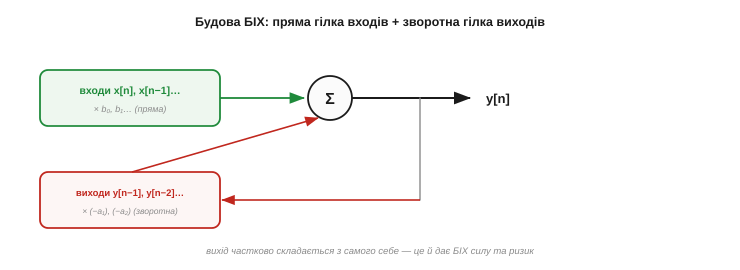
*Рис. 5.6.3.1. Будова БІХ-фільтра. Ліва, **пряма** гілка — зважена сума входів (як КІХ). Права, **зворотна** гілка повертає попередні **виходи** y[n−1], y[n−2]… назад у суматор. Саме ця петля від виходу до входу відрізняє БІХ і дає йому силу — і ризик. Кількох коефіцієнтів aₖ вистачає, щоб створити довготривалу, гостру характеристику.*

Ви вже знаєте найпростіший БІХ — це **EMA** (§5.4.4): `y[n] = α·x[n] + (1−α)·y[n−1]`. Бачите зворотний зв'язок? Новий вихід — це частинка нового входу плюс **частинка старого виходу**. Один коефіцієнт `(1−α)` на петлі — і фільтр має пам'ять, що тягнеться далеко назад, хоча зберігає лише **одне** число. У цьому вся магія БІХ у мініатюрі.

Інтуїтивно зворотний зв'язок — це **луна**. Подайте короткий звук у порожню залу: він відлунюватиме дедалі тихіше ще довго після того, як замовкло джерело. Так само вихід БІХ «відлунює» сам себе — одне число, повернуте в петлю, ще довго підтримує реакцію. Саме тому кільком коефіцієнтам вистачає сили створити **довгу** пам'ять: вони не зберігають довгу історію, а **перевикористовують** власний відгук, як зала перевикористовує звук. Ця луна — і двигун ефективності БІХ, і джерело його норову.

### Чому «нескінченна імпульсна»

Подаймо, як і для КІХ, одиничний імпульс — і подивімося на вихід EMA. Перший відлік дасть `α`, наступний — `α(1−α)`, тоді `α(1−α)²`, і так далі: вихід **спадає, але ніколи не доходить до нуля точно** — він згасає вічно.

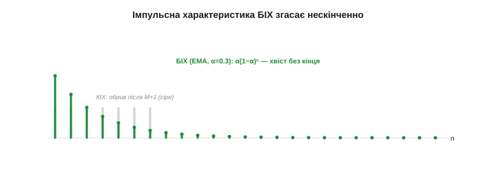
*Рис. 5.6.3.2. Звідки назва. Реакція БІХ на імпульс (тут EMA, α=0.3) — спадна геометрична послідовність α(1−α)ⁿ, що **згасає, та не обривається**: завжди лишається крихітний «хвіст». На відміну від КІХ, чия реакція точно нульова після M+1 кроків (сіре, для порівняння), у БІХ вона **нескінченна** — звідси й назва. Зворотний зв'язок дає пам'ять без меж.*

Ось і пояснення назви: завдяки зворотному зв'язку реакція на імпульс **нескінченна** — хвіст тягнеться без кінця, дедалі тонший. Це **протилежність** КІХ, що забував усе за `M+1` кроків. БІХ має **нескінченну пам'ять**, зашиту в петлі: давній вхід досі ледь-ледь відлунює у виході. Звідси і його сила (довга пам'ять з кількох чисел), і його клопіт (старі помилки не зникають безслідно).

Це має й зворотний бік. Викид чи перехідний процес, що потрапив у КІХ, зникав за `M+1` кроків; у БІХ він **відлунює** довго, поступово згасаючи, — фільтр ніби «дзвенить» після різкої події. Тому БІХ гірше переносить поодинокі викиди (їх краще прибрати медіаною **до** БІХ, §5.4.3) і довше «заспокоюється» після стрибка. Нескінченна пам'ять — це не лише сила: інколи хочеться, щоб фільтр **забував** швидко, а БІХ цього не вміє.

### Ефективність: гострий зріз кількома коефіцієнтами

Тепер — головна вигода. Раз зворотний зв'язок створює **довготривалу** реакцію з кількох коефіцієнтів, то й **гострий** фільтр виходить дешево: там, де КІХ потребує сотні відводів, БІХ обходиться **одиницями**.

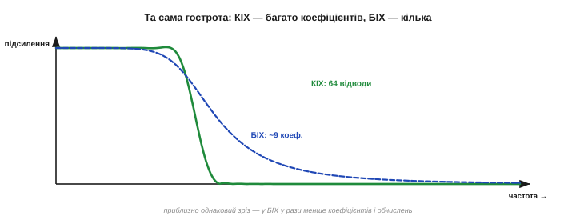
*Рис. 5.6.3.3. Чому БІХ ефективний. Обидві криві — приблизно однаково гострий ФНЧ. Але КІХ (зелене) набирає таку крутість 64 коефіцієнтами, а БІХ (синє) — лише п'ятьма. Зворотний зв'язок «переробляє» вихід, тож кожен коефіцієнт працює за десятьох. Для гострих фільтрів на скромному МК це вирішальна економія пам'яті й тактів.*

Економія разюча: типовий БІХ 4–8 порядку дає таку саму крутість зрізу, що й КІХ на 50–200 відводів. Менше коефіцієнтів — менше множень на відлік, менше пам'яті, менша затримка. Саме тому, коли треба **гострий** фільтр у тісних ресурсах (а на мікроконтролері так буває часто), інженери тягнуться по БІХ. Він — чемпіон ефективності серед цифрових фільтрів.

Щоб відчути масштаб у числах: гострий ріжучий фільтр на 50 Гц, якому КІХ потребує під двісті відводів, БІХ дає одним-двома біквадами — п'ять-десять коефіцієнтів проти двохсот. На відлік це різниця між двомастами множеннями й десятьма. Для потокового очищення на чипі з обмеженим бюджетом тактів така економія часто й вирішує, чи влізе фільтр у реальний час узагалі.

Технічно секрет у тому, що зворотний зв'язок додає фільтру **полюси** — гострі внутрішні резонанси, яких сама лише пряма гілка (як у КІХ) дати не може. Один полюс створює пік або крутий спад, на який КІХ витратив би десятки відводів. Полюси потужні — але саме вони ж і є джерелом нестабільності: сила й ризик БІХ — це дві сторони тих самих полюсів.

> 🔧 **Навіщо це.** Беріть БІХ, коли потрібен **гострий зріз за малі ресурси**: він дає крутість КІХ на сотні відводів усього кількома коефіцієнтами, тож майже не вантажить процесор і пам'ять. Класичний випадок — вузький смуговий чи ріжучий фільтр на дешевому чипі (наприклад, вирізати 50 Гц гостро). Там, де КІХ був би «важким», БІХ упорається граючись — але пам'ятайте про його два підступи нижче.

### Підступ: зворотний зв'язок може вибухнути

За ефективність БІХ бере **ризиком нестабільності**. Зворотний зв'язок — палиця на два кінці: якщо вихід підживлює сам себе **забагато**, він почне не згасати, а **наростати** — і за кілька кроків злетить у нескінченність (чи в переповнення розрядності). КІХ такого не вміє в принципі; БІХ — цілком.

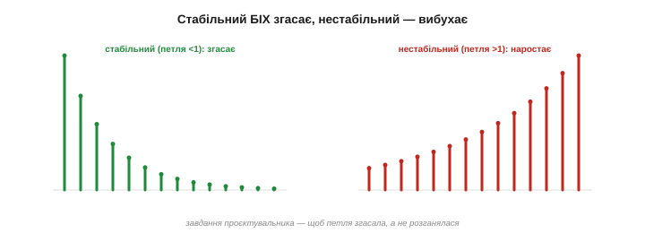
*Рис. 5.6.3.4. Дволезова петля. Той самий БІХ із різними коефіцієнтами зворотного зв'язку. **Стабільний** (зелене): реакція згасає, фільтр сумирний. **Нестабільний** (червоне): зворотний зв'язок завеликий, вихід наростає з кожним кроком і за мить «вибухає». Завдання проєктувальника — гарантувати, що петля **згасає**, а не розганяється.*

Математично стабільність означає, що внутрішні «полюси» фільтра лежать у безпечній зоні; на практиці це забезпечує **правильне проєктування** коефіцієнтів. Та є й окрема пастка для МК: коли коефіцієнти округлюють до **цілих** (fixed-point, §5.6.5), невелика похибка здатна **зрушити** ледь стабільний фільтр за межу — і він піде в розгін. Тому БІХ високого порядку ніколи не рахують «у лоб» однією довгою формулою.

Глибше пояснення — у тих самих **полюсах**: фільтр стабільний, **лише** поки всі вони лежать усередині так званого одиничного кола. Полюс рівно на колі — фільтр на межі (вічне незгасне коливання), за колом — розгін у нескінченність. Деталі цієї геометрії нам тут не потрібні; важливий практичний висновок: стабільність БІХ — **не дарована**, її треба забезпечити проєктуванням і **перевірити** на залізі. Найпростіший тест — подати імпульс і пересвідчитися, що вихід згасає, а не наростає чи дзвенить без кінця.

### Біквад — цеглинка БІХ

Замість одного великого БІХ його **розбивають на ланки другого порядку** — **біквади** (*biquad*). Біквад — це найменший корисний БІХ: три прямі гілки (поточний вхід і два затримані) й дві зворотні — разом п'ять коефіцієнтів.

```
y[n] = b₀·x[n] + b₁·x[n−1] + b₂·x[n−2]  −  a₁·y[n−1] − a₂·y[n−2]
```

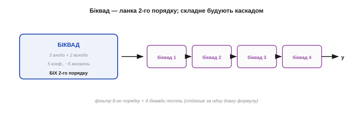
*Рис. 5.6.3.5. Біквад і каскад. Біквад — БІХ 2-го порядку (2 входи + 2 виходи назад, 5 коефіцієнтів, ~5 множень). Складніший фільтр будують **каскадом** біквадів: вихід одного йде на вхід наступного. Так фільтр 8-го порядку — це чотири біквади поспіль. Розбиття на біквади набагато **стійкіше** до округлення коефіцієнтів, ніж одна довга формула.*

Чому саме біквади? Бо каскад коротких ланок куди **стійкіший** до похибок округлення, ніж одна формула високого порядку: у короткій ланці полюси «не розповзаються» від дрібних змін коефіцієнтів. Тому реальні БІХ на МК — це майже завжди **ланцюжок біквадів** (саме так їх і подають CMSIS-DSP та інші бібліотеки), кожен по п'ять коефіцієнтів і п'ять множень. Гострий фільтр 8-го порядку — це чотири дешеві біквади поспіль.

Коефіцієнти біквадів — п'ять чисел на ланку — ви ніколи не рахуєте руками: їх видає інструмент проєктування за вашою специфікацією (тип, порядок, частота зрізу), а в бібліотеках МК часто лежать уже готові набори під типові випадки. Ваша справа — правильно поставити задачу й акуратно перенести коефіцієнти в код, не переплутавши знаки `aₖ`: різні бібліотеки беруть їх із плюсом чи мінусом, і це звична причина «дивної» поведінки щойно перенесеного фільтра.

> 🔧 **Навіщо це.** Реалізуйте БІХ **тільки** каскадом біквадів, ніколи — однією довгою формулою високого порядку: біквади на порядок стійкіші до округлення коефіцієнтів і до накопичення похибок цілої арифметики. Беріть готові біквад-структури з бібліотеки (CMSIS-DSP `biquad_cascade`), а коефіцієнти рахуйте інструментом проєктування. І завжди **перевіряйте** готовий фільтр на реальному залізі: чи не «дзвенить», чи не розгойдується — нестабільність у fixed-point любить ховатися.

### Ціна ефективності: нелінійна фаза

Друга плата за ефективність — **нелінійна фаза**. Зворотний зв'язок затримує різні частоти на **різну** величину, тож БІХ **спотворює форму** сигналу (на відміну від лінійно-фазового КІХ, §5.6.2). Гострий фронт після БІХ розпливеться несиметрично, осцилограма зміниться.

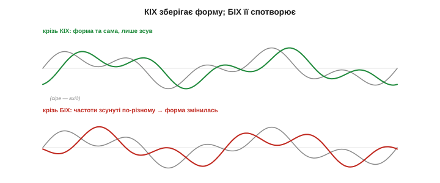
*Рис. 5.6.3.6. Плата за петлю — спотворена форма. Той самий сигнал крізь лінійно-фазовий КІХ (угорі) виходить **тією самою формою**, лише зсунутий. Крізь БІХ (унизу) — **зміненим**: різні частоти затрималися по-різному, тож хвиля «перекособочилась». Для показу спектра це байдуже, а для форми сигналу (ЕКГ, фронти) — суттєвий мінус БІХ.*

Тому правило: якщо **форма** сигналу важлива (вимірювання фронтів, ЕКГ, точне відтворення хвилі) — БІХ небажаний, беріть лінійно-фазовий КІХ. Якщо ж важить лише **частотний** вміст (прибрати гул, виділити смугу, а форма байдужа) — БІХ ідеальний: дешевий і гострий. Цей вибір ми зведемо докупи в §5.6.6.

Наскільки це важить — залежить від задачі. Якщо ви далі дивитеся на **спектр** чи приймаєте рішення за рівнем сигналу, спотворення форми вас не обходить зовсім, і БІХ — найкращий вибір. Якщо ж сигнал ітиме людині на очі (осцилограма, ЕКГ) чи в алгоритм, що вимірює саме **форму** (ширину імпульсу, час фронту), нелінійна фаза БІХ усе зіпсує. Тому питання «чи важлива форма» — головне у виборі між КІХ і БІХ.

> 🔧 **Навіщо це.** Не ставте БІХ там, де важлива **форма** сигналу — він її спотворює нелінійною фазою. Для ЕКГ, вимірювання фронтів, точного відтворення хвилі беріть лінійно-фазовий КІХ, навіть якщо він дорожчий. БІХ лишайте для задач, де важить лише частотний вміст (прибрати гул, виділити смугу): там його дешевизна й гострота безцінні, а спотворена форма нікого не турбує.

Варто згадати й коріння БІХ: його характеристики — це цифрові копії класичних **аналогових** фільтрів (Баттерворта, Чебишева тощо). Коли інструмент рахує вам коефіцієнти «БІХ-фільтра Баттерворта 4-го порядку», він, по суті, переносить у код перевірену десятиліттями аналогову схему з котушок і конденсаторів. Тому БІХ — ще й місток до всієї спадщини аналогової фільтрації.

А назви цих прототипів варто запам'ятати, бо ви оберете один із них в інструменті проєктування: **Баттерворт** — гранично рівна смуга пропускання, м'який перехід (універсальний дефолт); **Чебишев** — гостріший перехід ціною брижів у смузі; **еліптичний** — найгостріший зріз, але брижі з обох боків. Що гостріший потрібен фільтр, то «агресивніший» прототип беруть — і то сильніші його побічні ефекти. Це той самий торг гострота-проти-чистоти, тепер у виборі сімейства БІХ.

На практиці більшість готових фільтрів, що ви зустрінете на МК, — саме БІХ-біквади: ріжучий фільтр мережі, низькочастотний згладжувач для IMU, смуговий для виявлення тону. Причина все та сама — ефективність: біквад дає потрібну гостроту за п'ять множень на відлік, і чип ледь це помічає. Тому вміти читати й переносити біквад-коефіцієнти — навичка, що знадобиться чи не в кожному реальному проєкті з давачами.

**Приклад (EMA як БІХ).** Простежмо зворотний зв'язок EMA з `α = 0.5` на імпульсі `x = 1, 0, 0, 0…`:

```
y[n] = 0.5·x[n] + 0.5·y[n−1]
y[0] = 0.5·1 + 0.5·0    = 0.5
y[1] = 0.5·0 + 0.5·0.5  = 0.25
y[2] = 0.5·0 + 0.5·0.25 = 0.125
y[3] = 0.5·0 + 0.5·0.125= 0.0625   … і так до нескінченності, удвічі меншаючи
```

Одне множення на петлі — і вихід має нескінченний спадний хвіст із єдиної збереженої змінної. Це БІХ у найчистішому вигляді: мінімум пам'яті, нескінченна реакція, зворотний зв'язок як двигун.

Цей хвіст ховає й тонку рису БІХ: вихід **асимптотично** наближається до правильного значення, та, строго кажучи, **ніколи** його не досягає — завжди лишається зникомо малий залишок. На практиці він давно тоне в шумі й розрядності, тож це не біда; але концептуально варто пам'ятати, що БІХ «доходить до місця» не за скінченне число кроків, як КІХ, а лише в границі. Нескінченна пам'ять — нескінченне (хай і мізерне) відлуння.

Отже, БІХ виторговує ефективність зворотним зв'язком: гострий зріз кількома коефіцієнтами, нескінченна пам'ять із однієї-двох змінних — ціною ризику нестабільності й спотворення форми. Тепер у нас є **обидва** інструменти, КІХ і БІХ, і однакова мова частотної характеристики для них. Час застосувати її до **конкретних форм** характеристик — навчитися робити не лише низькочастотні, а й високочастотні та смугові фільтри. Адже досі ми все ілюстрували на ФНЧ — та характеристика може мати будь-яку форму: пропускати високе, вирізати вузьку смугу чи, навпаки, лишати тільки її. Форму задають ті самі коефіцієнти (`bₖ`, `aₖ`), лише інакше пораховані під потрібну криву. Як саме — у наступній темі.

---

## 5.6.4 Смугові фільтри: НЧ, ВЧ, смуговий

Досі ми все ілюстрували на одній формі — низькочастотній. Та частотна характеристика (§5.6.1) може мати **будь-яку** форму, і їх реалізує той самий апарат — КІХ (§5.6.2) чи БІХ (§5.6.3), різниця лише в коефіцієнтах. На практиці потрібні **чотири** канонічні форми, і знати, котра під яку задачу, — це половина вміння фільтрувати. Ця тема — про них: **низькочастотний** (НЧ), **високочастотний** (ВЧ), **смуговий** і **режекторний** фільтри; що кожен робить, навіщо він і як усі вони пов'язані між собою.

### Чотири форми характеристики

Усі чотири типи описуються тією самою мовою смуг (§5.6.1) — різниться лише **де** в них пропускання, а де затримання:


*Рис. 5.6.4.1. Чотири канонічні форми. **НЧ** (ФНЧ): пропускає низькі частоти, гасить високі. **ВЧ** (ФВЧ): навпаки — гасить низькі, пропускає високі. **Смуговий**: пропускає лише вузьку смугу посередині, решту гасить. **Режекторний** (notch): дзеркало смугового — гасить вузьку смугу, решту пропускає. Усі — той самий апарат, лише з різними коефіцієнтами.*

- **Низькочастотний** (ФНЧ, *low-pass*): пропускає **повільне**, гасить швидке.
- **Високочастотний** (ФВЧ, *high-pass*): пропускає **швидке**, гасить повільне й постійне.
- **Смуговий** (*band-pass*): пропускає лише одну **смугу** частот посередині.
- **Режекторний** (*band-stop / notch*): гасить лише одну вузьку смугу, решту пропускає.

Пройдімося ними по черзі — і одразу побачимо, яку роботу кожен робить найкраще.

Зверніть увагу: тип фільтра — це просто **де сидить смуга пропускання** на осі частот. Зсуньте її вліво — дістанете ФНЧ, вправо — ФВЧ, затисніть у вузьке вікно посередині — смуговий, виверніть навиворіт — режекторний. Жодного нового апарату для цього не треба: усі чотири рахуються тими самими зваженими сумами (КІХ) чи рекурсіями (БІХ), лише з іншими коефіцієнтами. Тому, вибравши тип, ви не міняєте **спосіб** обчислення — тільки числа, що визначають форму.

### НЧ (ФНЧ): пропустити повільне

З низькочастотним ми вже добре знайомі (увесь Розділ 5.4, §5.6.1): він **згладжує**, пропускаючи повільний корисний сигнал і прибираючи швидкий шум. Це **робочий кінь** усієї фільтрації й найчастіший вибір за замовчуванням.


*Рис. 5.6.4.2. Низькочастотний у дії. Сирий сигнал (блідий) тремтить від швидкого шуму; після ФНЧ (зелений) лишається лише плавна повільна основа. Характеристика праворуч: пропускання на низьких частотах, спад до нуля на високих. Це згладжування, антиаліасинг (§5.5.4) і прибирання високочастотного шуму — найходовіша задача фільтра.*

Окрім згладжування, ФНЧ виконує критичну роль **антиаліасингового** фільтра (§5.5.4): зрізає частоти вище Найквіста **до** оцифрування, щоб вони не «прикинулися» низькими. Тож ФНЧ — це і щоденний згладжувач, і обов'язковий вартовий на вході АЦП.

Головне рішення для ФНЧ — **де поставити зріз**. Він має лягти **між** найвищою корисною частотою сигналу й найнижчою частотою шуму: усе корисне лишити в смузі пропускання, увесь шум — у затриманні. Якщо вони далеко одне від одного — фільтр легкий і пологий; якщо близько — потрібен гострий (а отже, дорожчий чи запізніліший, §5.6.3). І не забувайте про знайомий компроміс §5.4.5: нижчий зріз сильніше згладжує, але й більше запізнює. Зріз ФНЧ — це завжди торг між чистотою й свіжістю.

Антиаліасинговий ФНЧ заслуговує окремого слова, бо його часто плутають. Його ставлять **аналоговим**, **до** АЦП (простим RC чи активним), а не цифровим після, — бо аліас, що вже потрапив у відліки, цифрою не прибрати (§5.5.4). Цифровий же ФНЧ працює **після** оцифрування й чистить уже коректно зняті дані. Тож у тракті часто аж два ФНЧ: аналоговий-вартовий перед АЦП і цифровий-згладжувач після. Плутати їхні ролі — поширена помилка новачка.

Зріз — не єдиний параметр ФНЧ; важить і **глибина затримання**: наскільки сильно фільтр давить те, що за зрізом. −20 дБ (удесятеро) досить для грубого згладжування, а −60 дБ (у тисячу разів) потрібно, коли завада сильна, а корисне слабке. Глибше затримання — знову вищий порядок, той самий торг. Тому повна специфікація ФНЧ — це не одне число «зріз», а пара: **де** зрізати й **наскільки глибоко** давити за зрізом.

### ВЧ (ФВЧ): прибрати постійне й дрейф

Високочастотний — **дзеркало** низькочастотного: він пропускає **швидкі** зміни й гасить **повільні**, аж до нульової частоти (постійної складової). Його головна робота — прибирати **дрейф нуля**, **постійне зміщення** (DC) і повільне «сповзання основи».

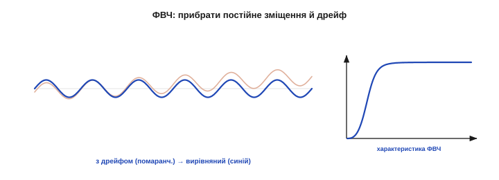
*Рис. 5.6.4.3. Високочастотний у дії. Сигнал їде на повільно зростаючій основі-дрейфі (помаранчевий); ФВЧ прибирає цей повільний хід і повертає сигнал на нуль (синій), лишивши швидкі коливання. Характеристика праворуч: гасіння на низьких частотах (нуль на 0 Гц), пропускання на високих. Так знімають дрейф давача й постійне зміщення.*

Згадайте §5.4.1: **дрейф** — це не шум, і ФНЧ його не бере. А от ФВЧ — бере: він гасить усе повільне, зокрема й повзучу основу. Тому ФВЧ — це інструмент проти **дрейфу** й **DC-зміщення**: він лишає тільки змінну частину сигналу. (Те саме в аналоговій техніці роблять «розв'язувальним конденсатором» — *AC-coupling*.)

Та у ФВЧ є важлива розплата: прибравши постійну складову, він **викидає й абсолютний рівень** сигналу. Після ФВЧ ви бачите лише **зміни**, а не саме значення: не «температура 23°», а «температура коливнулась». Це чудово, коли потрібна саме змінна частина (вібрація, звук, пульсація), і згубно, коли потрібен абсолютний показ (та сама температура). Тому ФВЧ ставлять свідомо — лише там, де постійна складова справді **завада** (дрейф, зміщення), а не корисна інформація.

### Смуговий: лишити одну смугу

Смуговий фільтр пропускає лише **одну смугу** частот, гасячи все і нижче, і вище. Його робота — **виокремити** частоту чи діапазон, що нас цікавить, відкинувши решту: витягти конкретний тон, виділити радіоканал, лишити лише потрібну гармоніку.


*Рис. 5.6.4.4. Смуговий фільтр. Пропускає лише смугу навколо центральної частоти f₀, гасячи все поза нею. Ширину смуги (BW) на рівні −3 дБ задає **добротність** Q = f₀/BW: висока Q — вузька, гостра смуга (хірургічно виділяє тон, але «дзвенить»); низька Q — широка, м'яка. Так ізолюють тон у DTMF, виділяють діагностичну смугу ЕКГ, ловлять радіоканал.*

Смуговий — це, по суті, ФВЧ і ФНЧ, поставлені один за одним: ФВЧ відрізає все нижче смуги, ФНЧ — усе вище. Його гострота описується новим параметром — **добротністю** `Q = f₀/BW`, де `f₀` — центральна частота, `BW` — ширина смуги пропускання. Велике `Q` — вузька, гостра смуга (виділяє одну частоту майже хірургічно); мале `Q` — широка, м'яка.

Прикладів смугового — безліч. Телефонний приймач DTMF — це **вісім** вузьких смугових фільтрів, по одному на кожну частоту кнопки (§5.5.7). В обробці ЕКГ смуговий лишає діапазон ~10–40 Гц, де живе серцевий комплекс QRS, відкидаючи і дрейф унизу, і м'язовий шум угорі. Радіоприймач смуговим виділяє один канал з усього ефіру. А наукові прилади «лок-ін» вузьким смуговим витягують сигнал на точно відомій частоті з-під товстого шуму. Скрізь ідея одна: **лишити свою смугу, відкинути все інше**.

### Режекторний (notch): вирізати одну смугу

Режекторний — **дзеркало** смугового: він **гасить** одну вузьку смугу, пропускаючи все інше. Його класичне застосування одне й безцінне: **прицільно вбити мережевий гул** 50 (чи 60) Гц, не зачепивши решту сигналу.

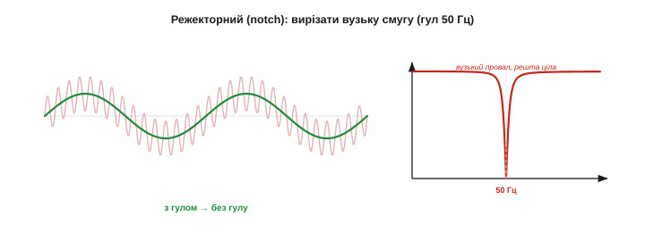
*Рис. 5.6.4.5. Режекторний (notch) фільтр. Сигнал із мережевим гулом 50 Гц (блідий) → після notch (зелений) гул зник, корисне ціле. Характеристика праворуч: вузький **провал** точно на 50 Гц, решта частот проходить незмінно. Це найточніший спосіб прибрати відому вузьку заваду, не торкнувшись сусідніх частот.*

Саме notch — найчистіший спосіб прибрати **відому вузьку** заваду. Широкий ФНЧ чи ФВЧ зачепив би й корисні частоти поряд із гулом; а вузький провал notch вирізає **рівно** 50 Гц, лишивши і 45, і 55 Гц недоторканими. Як і в смугового, гострота провалу задається добротністю `Q`: висока `Q` — вузький, хірургічний провал.

Дві практичні замітки про мережевий гул. По-перше, частота його **різна за регіонами**: 50 Гц у Європі (і в нас), 60 Гц у США — і фільтр треба ставити саме на свою. По-друге, notch — не єдиний спосіб: можна усереднювати рівно по **одному періоду** мережі (§5.6.1) — нуль ковзного середнього сяде на 50 Гц задарма, — або взяти адаптивний фільтр, що сам підлаштовується під плавання мережевої частоти. Та класичний notch-біквад лишається найпростішим і найгострішим рішенням для фіксованих 50/60 Гц.

Зведімо параметри докупи. ФНЧ і ФВЧ задаються **однією** частотою — зрізом `fc` (де закінчується пропускання). Смуговий і режекторний — **трьома**: центром `f₀`, шириною `BW` і похідною від них добротністю `Q = f₀/BW`. Плюс для будь-якого типу — **порядок** (гострота) і **сімейство** (КІХ чи БІХ). Назвавши ці кілька чисел, ви повністю задаєте фільтр; решту — коефіцієнти — порахує інструмент проєктування.

Ще тонкість про мережевий гул: він рідко буває чистою синусоїдою на 50 Гц — часто тягне за собою **гармоніки** на 100, 150, 250 Гц (§5.5.3). Один notch на 50 Гц прибере основну, але не їх. Тому в чутливих приладах (та сама ЕКГ) ставлять **гребінку** notch-фільтрів — по одному на кожну сильну гармоніку. Перевіряйте спектр виходу: якщо після notch лишилися піки на кратних частотах, гул ще не переможено остаточно.

### Як вони пов'язані

Найприємніше, що всі чотири типи — **родичі**, виведені з одного. Опанувавши низькочастотний, ви фактично маєте їх усі:


*Рис. 5.6.4.6. Усе з ФНЧ. **ФВЧ = 1 − ФНЧ** (що ФНЧ пропустив, ФВЧ гасить, і навпаки). **Смуговий = ФВЧ, тоді ФНЧ** (відрізати знизу й зверху). **Режекторний = 1 − смуговий** (дзеркало смугового). Тож фундаментальна форма одна — низькочастотна, — а решта три виводяться з неї простими операціями.*

Ця спорідненість і практична, і красива. **ФВЧ** дістають, віднявши вихід ФНЧ від сигналу (що згладжувач прибрав — те й є «швидка» частина). **Смуговий** — це ФВЧ і ФНЧ поспіль. **Режекторний** — сигнал мінус смуговий. Тому, по суті, треба зрозуміти лише **один** фільтр — низькочастотний, — а решта три виростають із нього. І кожен із чотирьох можна зробити як КІХ, так і БІХ — тип характеристики живе в **коефіцієнтах**, а сімейство (КІХ/БІХ) — це вже спосіб їх порахувати.

Саме тому в усій теорії фільтрів **низькочастотний прототип** вважають фундаментальним: інструменти проєктування внутрішньо рахують ФНЧ, а тоді **перетворюють** його на потрібний тип частотним зсувом чи інверсією. Для вас це означає приємну річ: зрозумівши один тип по-справжньому (а ми його розуміємо — це Розділ 5.4 плюс §5.6.1–5.6.3), ви розумієте **всі**. Чотири форми — не чотири різні предмети, а один, показаний з чотирьох боків, — і це робить опанування фільтрів напрочуд економним: вивчив одне, маєш усі чотири.

І ще спільне для всіх типів: **гострота** будь-якого з них коштує того самого. Різкіший зріз ФНЧ, крутіші краї смугового, вужчий провал notch — усе це вимагає вищого **порядку** фільтра (більше коефіцієнтів КІХ чи біквадів БІХ), а отже, більше обчислень і затримки. Той самий торг гострота-проти-ресурсів, що ми бачили в §5.6.2–5.6.3, діє однаково для кожної з чотирьох форм. Тому надмірної гостроти уникають скрізь, не лише у ФНЧ.

Цими чотирма список не вичерпується — є ще, наприклад, **поличкові** фільтри (підняти чи опустити цілу смугу, як регулятор тембру) і **всепропускні** (міняють лише фазу, не чіпаючи амплітуд). Та для очищення сигналів давачів саме ці чотири — НЧ, ВЧ, смуговий, режекторний — і є робочі конячки, що покривають чи не все. Решту згадаєте тоді, коли справді знадобляться, — а в дев'яти випадках із десяти вистачить котрогось із цих чотирьох.

> 🔧 **Навіщо це.** Добирайте **тип** під задачу, перш ніж думати про коефіцієнти: швидкий шум на повільному сигналі — **ФНЧ**; дрейф нуля чи постійне зміщення — **ФВЧ**; виділити конкретний тон — **смуговий**; прибити відому вузьку заваду (50 Гц) — **режекторний**. Назвіть, **що** пропустити й **що** зрізати на осі частот, — і тип визначиться сам. Це перше й найважливіше рішення; усе інше (КІХ/БІХ, порядок) — деталі.

> 🔧 **Навіщо це.** Для смугового й режекторного **добротність Q** — головна ручка: `Q = f₀/BW`. Висока Q дає вузький, гострий фільтр (хірургічно бере чи ріже одну частоту), та платить **дзвоном** і довгим встановленням (як гострий БІХ, §5.6.3). Для прибирання гулу 50 Гц беріть Q високу (вузький провал, щоб не чіпати сусіднє); для виділення ширшої смуги — нижчу. Не женіться за надвузькістю без потреби: занадто гострий notch довго «дзвенить» після кожного збурення.

**Приклад (notch на 50 Гц).** Спроєктуймо параметри режекторного фільтра проти мережевого гулу за `fs = 1000` Гц:

```
ціль:         прибрати гул 50 Гц, лишити решту
центр:        f₀ = 50 Гц    (у частках Найквіста: 50/500 = 0.1)
ширина:       BW = 4 Гц     (вузько — щоб не зачепити корисне поряд)
добротність:  Q = f₀/BW = 50/4 ≈ 12.5   (висока → гострий провал)
тип/сімейство: режекторний, найкраще БІХ-біквад (§5.6.3) — гостро за 5 коеф.
```

Кілька чисел — і готова специфікація, яку інструмент проєктування перетворить на коефіцієнти біквада. Помітьте, як усе сходиться: тип (notch) обрали за задачею, гостроту (Q) — за вимогою не чіпати сусіднє, сімейство (БІХ) — за потребою гостроти при малих ресурсах (§5.6.3).

> 🔧 **Навіщо це.** Найчастіша пара на практиці — **ФНЧ проти шуму + ФВЧ/notch проти дрейфу й гулу**. Дуже типовий тракт давача: спершу режекторний на 50 Гц (вбити мережу), тоді ФНЧ (згладити решту шуму), а як є дрейф — ще й ФВЧ (зняти повзучу основу). Кожен фільтр б'є по **своїй** заваді за її місцем на осі частот — і разом вони чистять сигнал куди краще, ніж один «універсальний» згладжувач.

**Приклад тракту.** Скажімо, давач деформації ([тензоміст](book:components/loadcell-hx711)) для зважування: сигнал слабкий, на ньому мережевий гул, дрейф нуля від температури й дрібний шум. Чесний цифровий тракт виходить такий: спершу **notch 50 Гц** (вбити мережу), тоді **ФНЧ** (згладити шум до плавного показу). А ось повільний температурний дрейф нуля фільтром тут не знімеш: сама вага — теж «нульова частота», тож ФВЧ викинув би її разом із дрейфом (та сама пастка, про яку йшлося вище). Проти дрейфу працює **тарування** — періодичне переобнулення за порожньою шалькою — і температурна компенсація (§5.1.6). Два фільтри плюс тарування, кожен проти своєї біди, — і слабкий сигнал стає придатним для точного зважування.

Отже, у нас є повний набір форм — НЧ, ВЧ, смуговий, режекторний — і розуміння, що всі вони виводяться з низькочастотного й робляться як КІХ, так і БІХ. Ми знаємо, **який** фільтр і **якої** форми брати під задачу. Лишилося найприземленіше, але критичне для мікроконтролера питання: як порахувати фільтр **швидко й надійно** на залізі, що часто не має навіть плаваючої коми, — про цілу арифметику, переповнення й швидкодію. Адже навіть бездоганно спроєктований фільтр зіпсується, якщо невдало порахувати його цілими числами на дешевому чипі. Це наступна тема.

---

## 5.6.5 Реалізація на МК: fixed-point і швидкодія

Фільтр, бездоганний на папері, ще треба **порахувати на залізі** — часто дешевому, без апаратної підтримки дробових чисел і з лічильником тактів на вагу золота. Між «характеристикою на графіку» й «фільтром, що встигає в реальному часі» лежить ціла інженерна тема: **ціла арифметика з фіксованою комою** (*fixed-point*), переповнення, насичення й бюджет тактів. Знехтуєш нею — і чудовий фільтр або повзтиме, або раптом видасть дикий стрибок. Розберімо, як рахувати фільтр **швидко й надійно** на мікроконтролері.

Ця тема — місток між красивою теорією й суворою практикою. Усе попереднє (КІХ, БІХ, характеристики) було про **що** рахувати; тепер — про **як** це лягає в реальний процесор із його скінченними бітами й тактами. Саме тут гине багато «правильних» фільтрів: на папері все добре, а на чипі — або повзе, або зривається в сміття. Тож ці прийоми — не дрібні оптимізації, а різниця між фільтром, що працює, і фільтром, що лише виглядає правильним.

### Чому ціла арифметика

Багато недорогих мікроконтролерів **не мають апаратного блока дробових чисел** (FPU). На таких чипах кожна операція з комою (*float*) не виконується нативно, а **емулюється** довгою підпрограмою — десятки, а то й сотні тактів на одне множення. Ціле ж множення процесор робить **за такт-два**. Тож на фільтрі, де множень тисячі за секунду, різниця колосальна.

Це не екзотика, а буденність нижнього сегмента. Класичний Arduino Uno на 8-бітному AVR не має FPU зовсім; багато дешевих 32-бітних чипів (Cortex-M0/M0+) — теж. На таких float не заборонений, але кожна операція з ним коштує в десятки разів дорожче за цілу, і фільтр на float легко з'їсть увесь процесорний час. Тому fixed-point — стандартний прийом саме там, де чип найдешевший, а ресурсів найменше.

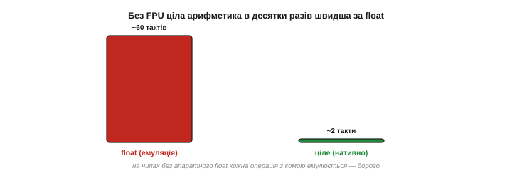
*Рис. 5.6.5.1. Чому цілі числа. На чипі без FPU одна операція з комою (float) емулюється програмно — десятки тактів; ціла операція виконується нативно за такт-два. Для фільтра з тисячами множень на секунду це різниця між «встигає» і «захлинається». Звідси й прийом: рахувати дробові коефіцієнти **цілими** числами.*

Вихід — **представити дроби цілими числами**, домовившись про спільний масштаб. Це і є арифметика з **фіксованою комою**: кома не «плаває», а стоїть на заздалегідь узгодженому місці, а всі числа зберігаються як звичайні цілі.

### Формат із фіксованою комою (Q-формат)

Найпоширеніша домовленість — **Q-формат**. Ідея проста: множимо дробове число на сталий масштаб (степінь двійки) і зберігаємо результат як ціле. У форматі **Q15** масштаб — `2¹⁵ = 32768`, тож дріб із діапазону [−1, 1) кодують 16-бітним цілим:

```
дріб 0.5   →  Q15:  round(0.5 · 32768)  = 16384
дріб 0.25  →  Q15:  round(0.25 · 32768) =  8192
```


*Рис. 5.6.5.2. Формат Q15. Дріб множать на 2¹⁵ і зберігають як ціле (0.5 → 16384). При множенні двох Q15-чисел масштаб подвоюється — виходить Q30, тож результат **зсувають праворуч на 15** назад у Q15. Кома «зашита» в масштабі: ви рахуєте цілими, а домовленість про множник 2¹⁵ робить їх дробами.*

Тонкість — у множенні. Перемноживши два Q15-числа, ви дістаєте **подвійний** масштаб — формат **Q30**; щоб повернутись у Q15, результат **зсувають праворуч на 15** біт (`>> 15`). Цей зсув — і є «повернення коми на місце». Бібліотеки DSP (CMSIS-DSP) працюють саме у Q15 і Q31, і всі їхні фільтри побудовані на цьому прийомі.

Який Q брати — це торг між **діапазоном** і **точністю**. Що більше біт віддано під дробову частину (як у Q15 — усі 15), то точніший дріб, але вужчий діапазон цілих. Q15 ідеально лягає в 16-бітні відліки давачів (діапазон [−1, 1)), а Q31 — у 32-бітні, де треба більше точності (гострі БІХ). Головне — **узгодити** масштаб у всьому тракті: переплутаєш Q15 і Q7 десь у формулі — і коефіцієнти «поїдуть» у сотні разів (2⁸ = 256).

Дрібниця, що теж важить: повертаючи Q30 у Q15 зсувом, можна або просто **відкинути** молодші біти (швидше), або **округлити** (точніше — додавши половину молодшого розряду перед зсувом). Для більшості фільтрів різниця мізерна, та в довгих БІХ систематичне відкидання накопичує невелике зміщення — тоді округлення доречне.

До слова, від'ємні коефіцієнти й відліки в Q-форматі обробляються самі собою — звичайним цілим зі знаком (доповняльний код): жодних окремих дій для мінусів не треба, арифметика та сама. Це робить fixed-point фільтри короткими в коді, хоча й вимогливими до уважності з розрядністю.

### Ширший акумулятор

Перша пастка цілої арифметики — **переповнення суми**. Фільтр складає багато добутків (§5.6.2), і ця сума росте: навіть якщо кожен доданок уміщається в 16 біт, їхня сума з десятків відводів — ні. Тому **акумулятор** (змінну, де копиться сума) беруть **значно ширшим** за відліки.

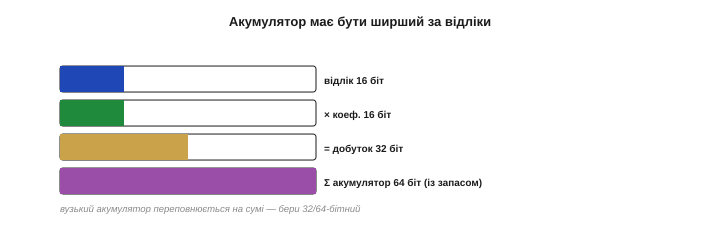
*Рис. 5.6.5.3. Запас розрядності. Відлік 16 біт, помножений на коефіцієнт 16 біт, дає вже 32-бітний добуток; а їхня сума з багатьох відводів потребує ще більше — 32 або й 64 біт. Тому проміжну суму коплять у **широкому** акумуляторі, а в 16 біт повертають лише наприкінці. Вузький акумулятор тихо переповниться на середині суми — і фільтр видасть сміття.*

Правило: проміжну суму тримають у **32- або 64-бітному** акумуляторі, а назад у вузький тип (16 біт) повертають **лише наприкінці**, після зсуву. Якщо ж копити суму в тій самій вузькій змінній, що й відліки, вона переповниться десь посередині — і фільтр тихо видасть сміття.

Прикинемо запас на числах. 16-бітний відлік, помножений на 16-бітний коефіцієнт, дає до 32 біт; а сума, скажімо, 64 таких добутків додає ще ~6 біт — разом близько 38. Тому 32-бітного акумулятора для довгого фільтра вже **замало**, а 64-бітного — з головою. Саме тому DSP-функції коплять суму у 64-бітному регістрі, навіть працюючи з 16-бітними даними: зайвий запас тут безпечніший за ощадливість.

### Переповнення й насичення

А що **робити**, коли результат усе ж не влазить у діапазон? Наївна ціла арифметика просто **«загортає»** число: трохи більше за максимум — і воно стрибає до мінімуму (бо старші біти відкидаються). Для сигналу це **катастрофа**: на місці легкого перевищення вискакує дикий стрибок з краю в край.

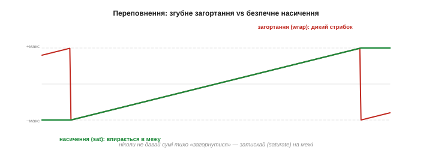
*Рис. 5.6.5.4. Загортання vs насичення. Коли значення виходить за межу, наївне **загортання** (червоне) перекидає його з +макс на −макс — жахливий стрибок посеред сигналу. Правильна поведінка — **насичення** (зелене): значення впирається в межу й лишається там. Завжди затискайте (*saturate*), а не дозволяйте тихо «загорнутися».*

Правильна поведінка — **насичення** (*saturation*): якщо результат перевищив межу, його **затискають** на максимумі (чи мінімумі), а не загортають. Гірше мати трохи «зрізану» вершину, ніж дикий викид. Багато DSP-інструкцій уміють насичувати апаратно; де ні — додають явну перевірку меж. Ніколи не лишайте суму на ласку тихого загортання.

Переповнення чигає не лише на виході. Найнебезпечніше воно у **зворотному зв'язку БІХ** (§5.6.3): там вихід вертається у вхід, тож одне «загорнуте» значення підживлює наступне — і фільтр може зірватися в стійке паразитне коливання. Тому в БІХ насичують **проміжні** результати кожного біквада, а не лише фінальний. КІХ у цьому сенсі знову спокійніший: без петлі переповнення лишається локальним і не накопичується.

### Квантування коефіцієнтів

Друга пастка тонша. Округлюючи коефіцієнти фільтра до цілих (квантуючи їх), ви трохи **міняєте сам фільтр**: характеристика зсувається від ідеальної. Для м'яких фільтрів це дрібниця, а от для гострих — помітно.


*Рис. 5.6.5.5. Похибка коефіцієнтів. Ідеальна характеристика (зелена) і та сама після грубого округлення коефіцієнтів (червона): затримання «спливло» вгору, перехід поплив. Для КІХ це лише трохи гірше гасіння; а для БІХ округлення зсуває полюси й може **штовхнути ледь стабільний фільтр за межу** в розгін (§5.6.3) — тому БІХ і рахують каскадом біквадів.*

Для **КІХ** наслідок м'який — трохи гірше затримання. А от для **БІХ** квантування коефіцієнтів зсуває полюси й може **дестабілізувати** ледь стабільний фільтр (§5.6.3) — саме тому БІХ рахують **каскадом біквадів**: у коротких ланках полюси менш чутливі до округлення. Звідси й практичне правило: давайте коефіцієнтам **достатньо біт** (Q15 зазвичай досить, для гострих БІХ — Q31) і **перевіряйте** фільтр уже з квантованими коефіцієнтами, а не лише ідеальними.

Є й підступніший ефект квантування в БІХ — **граничні цикли** (*limit cycles*): через округлення в петлі зворотного зв'язку вихід може застрягти в крихітному незгасному коливанні навіть на нульовому вході, наче фільтр тихенько «бринить». Це не нестабільність-вибух, а дрібний паразитний шум, та для точних вимірювань і він зайвий. Лікують його достатньою розрядністю й обережним округленням — ще один доказ, що БІХ у fixed-point вимагає більшої уваги, ніж КІХ.

> 🔧 **Навіщо це.** Дві захисні звички рятують від 90 % бід цілої арифметики. По-перше, **широкий акумулятор**: копіть суму у 32/64-бітній змінній, у вузьку повертайте лише наприкінці. По-друге, **насичення замість загортання**: на виході й у проміжках затискайте значення на межі, а не дозволяйте їм «перекидатися». Обидві дрібниці коштують кількох рядків, а рятують від раптових диких стрибків, які потім годинами шукаєш.

### Бюджет реального часу

Третій вимір — **час**. Фільтр мусить порахуватися **до приходу наступного відліку**: усі його множення-додавання плюс решта роботи мають укластися в **період відліку** `T = 1/fs`. Перевищив — і фільтр «захлинається», губить відліки.


*Рис. 5.6.5.6. Бюджет на відлік. За кожен період T = 1/fs процесор має встигнути всі MAC-и фільтра (зелене) **плюс** усю іншу роботу. Якщо фільтр з'їдає більшу частину T — запасу на решту нема, і система на межі. Не влазить — знижуйте fs, беріть легший фільтр (менше відводів/нижчий порядок) чи апаратний MAC/SIMD (CMSIS-DSP).*

Тому вартість фільтра прикидають **наперед** у тактах: число MAC-ів на відлік × частота відліків. Якщо тісно — є три виходи: знизити `fs` (якщо дозволяє Найквіст, §5.5.4), узяти **легший** фільтр (менше відводів КІХ або нижчий порядок БІХ — БІХ тут і виграє, §5.6.3), або задіяти **апаратне** прискорення: інструкцію MAC, SIMD, готові оптимізовані функції CMSIS-DSP, що рахують фільтр у рази швидше за наївний цикл.

І не вгадуйте вартість на око — **зміряйте** її. У більшості МК є лічильник тактів (cycle counter), яким можна обгорнути виклик фільтра й побачити реальну ціну в тактах. Пам'ятайте також, що фільтр — **не єдиний** їдець процесорного часу: поряд працюють АЦП, зв'язок, контур керування. Тому закладайте фільтру лише **частину** періоду відліку, лишаючи запас на решту, — інакше система працюватиме на самій межі й зірветься від найменшого додаткового навантаження.

А що буде, як фільтр **не вкладеться** в період? Нічого доброго: процесор не встигне обробити відлік до приходу наступного, відліки почнуть **губитися** чи опрацьовуватися нерівномірно, і в сигнал прокрадеться тремтіння (*jitter*), а то й аліасинг від пропусків. Тому бюджет тактів — не формальність: перевищення тихо руйнує саму якість фільтрації, заради якої все й затівалося. Краще одразу взяти легший фільтр, ніж потім ловити плаваючі збої.

**Приклад (Q15-множення на пальцях).** Один крок MAC: відлік `0.5`, коефіцієнт `0.25`:

```
відлік x = 0.5  → Q15: 16384
коеф.  b = 0.25 → Q15:  8192
добуток (у 32-біт акумуляторі): 16384 · 8192 = 134 217 728   (це Q30)
повертаємо в Q15:  134 217 728 >> 15 = 4096
перевірка: 4096 / 32768 = 0.125 = 0.5 · 0.25  ✓
```

Жодного дробового числа — самі цілі множення й зсув, які процесор робить миттєво. Помножене на десятки відводів, це і є весь фільтр у fixed-point.

Помітьте ще, що коефіцієнти фільтра теж треба заздалегідь перевести в Q-формат — **раз**, при ініціалізації, — і зберігати вже цілими. Тоді в гарячому циклі лишаються самі цілі множення й зсуви, без жодного дробу. Саме так влаштовані бібліотечні fixed-point фільтри: таблиця цілих коефіцієнтів плюс короткий MAC-цикл зі зсувом наприкінці.

Звідси й типовий робочий процес: фільтр **проєктують і перевіряють** на ПК у звичайних дробових числах (там зручно й точно), а тоді **переносять** на чип, конвертувавши коефіцієнти у Q-формат і додавши широкий акумулятор та насичення. На потужному чипі другий крок не потрібен — `float` лишається як є; на дешевому без нього не обійтися. Так чи так, спершу домагаються правильної характеристики, а вже потім приганяють її під арифметику конкретного заліза.

### Коли можна просто float

І нарешті — хороша новина. Усі ці клопоти з Q-форматом потрібні **лише** на чипах **без** FPU. Сучасні потужніші мікроконтролери (ARM Cortex-M4F, M7, ESP32 та інші) **мають** апаратний float — і на них найрозумніше просто **писати фільтр у звичайних дробових числах**: код простіший, переповнення майже не загрожує, а швидкості й так вистачає. Fixed-point лишають для **найдешевших** чипів (8-бітні AVR, прості Cortex-M0), де float емулюється й тому неприйнятно повільний.

Тенденція, до речі, на боці простоти: FPU дешевшає й трапляється в дедалі скромніших чипах, тож потреба в ручному fixed-point поволі відступає. Та вона не зникне зовсім, поки існують найдешевші 8- і 16-бітні контролери в масових виробах. Тому вміти і просте `float`, і ціле Q15 корисно: перше — для комфорту на потужному залізі, друге — для виживання на копійчаному.

> 🔧 **Навіщо це.** Перше питання реалізації: **чи має ваш чип FPU?** Якщо так (Cortex-M4F/M7, ESP32) — пишіть фільтр у `float`, не ускладнюйте собі життя fixed-point: на залізі з FPU це і просто, і безпечно, і швидко. Якщо ні (AVR, M0) — переходьте на ціле Q15/Q31, але тоді пильнуйте акумулятор і насичення. Не оптимізуйте передчасно: fixed-point ускладнює код, тож беріться за нього лише там, де float справді не тягне.

> 🔧 **Навіщо це.** Не пишіть DSP-цикли самі — беріть **CMSIS-DSP** (чи аналог для вашого чипа). Її функції (`arm_fir_q15`, `arm_biquad_cascade_df1_q15`, їхні `_f32`-версії) уже мають і правильний широкий акумулятор, і насичення, і використання апаратного MAC/SIMD — тобто роблять усе з цієї теми правильно й швидко. Ваша робота — підготувати коефіцієнти й буфер та викликати готову функцію, а не воювати з розрядністю вручну.

Отже, від характеристики на графіку до фільтра, що крутиться в реальному часі, лежить шлях через цілу арифметику, ширший акумулятор, насичення й бюджет тактів — або, на щасливому чипі з FPU, через просте `float` і готову бібліотеку. Тепер у нас є все: ми знаємо два сімейства фільтрів (КІХ, БІХ), усі форми характеристик і те, як їх рахувати на залізі. Лишилося звести вибір докупи — дати чітку відповідь на головне практичне питання: **КІХ чи БІХ, і коли що**. Адже всі знання цього розділу — два сімейства фільтрів, чотири форми характеристик і прийоми реалізації — сходяться зрештою в одному щоденному рішенні: який саме фільтр узяти під конкретну задачу на конкретному залізі. Це — остання тема розділу.

---

## 5.6.6 КІХ vs БІХ: коли що

У нас тепер два сімейства фільтрів — **КІХ** (§5.6.2) і **БІХ** (§5.6.3), — обидва вміють будь-яку форму характеристики (§5.6.4) й обидва реалізовні на МК (§5.6.5). Лишилося найпрактичніше питання, що постає в кожному реальному проєкті: **який із двох узяти**? Ця тема — короткий, але чіткий путівник вибору. Він зведеться до двох вирішальних питань, а решта — це готові рецепти. Опанувавши цю розвилку, ви добиратимете фільтр упевнено, а не навмання.

### Двобій критеріями

Зведімо обидва сімейства в одну таблицю — за критеріями, що справді важать на практиці:


*Рис. 5.6.6.1. КІХ vs БІХ. **КІХ**: завжди стійкий, може мати лінійну фазу (не псує форму), простий і передбачуваний, стійкий у fixed-point — але дорогий для гострих фільтрів (багато відводів, більша затримка). **БІХ**: гострий за кілька коефіцієнтів, дешевий за обчисленнями, пам'яттю й затримкою, копіює аналогові фільтри — але може бути нестабільним, спотворює форму (нелінійна фаза), вимагає обережності (біквади, fixed-point). Кожен сильний там, де другий слабкий.*

Бачите дзеркальність? Усе, у чому сильний КІХ, — слабке місце БІХ, і навпаки. Це не випадковість, а наслідок їхньої природи: відсутність зворотного зв'язку дає КІХ безпеку й лінійну фазу ціною ефективності; наявність його дає БІХ ефективність ціною безпеки й чистоти фази. Тому вибір — це завжди розмін **однієї пари переваг на іншу**.

Це й є головний урок: **безплатного фільтра не буває**. Не можна мати водночас і граничну ефективність, і лінійну фазу, і безумовну стабільність — ці чесноти розкидані між двома сімействами, і взявши одне, ви відмовляєтесь від переваг другого. Тому правильне питання не «який фільтр кращий» (кращого нема), а «**чим я готовий пожертвувати** заради того, що мені потрібніше». Відповівши на нього, ви й оберете сімейство.

Варто й підкреслити, що обидва — **лінійні** фільтри й говорять однією мовою частотної характеристики (§5.6.1): будь-яку форму — НЧ, ВЧ, смугову, notch — можна зробити і так, і так. Тобто вибір між КІХ і БІХ — це не вибір, **що** фільтр уміє (уміють однакове), а вибір, **як** він це робить: чесною скінченною сумою чи хитрою рекурсією. Тому й критерії порівняння — не про можливості, а про ціну й побічні ефекти реалізації.

І ще: КІХ та БІХ — **не взаємовиключні** в одному тракті. Цілком звична практика — поєднувати їх: скажімо, гострий БІХ-notch на 50 Гц, тоді лінійно-фазовий КІХ для згладжування, а перед ними — нелінійна медіана проти викидів. Вибір «КІХ чи БІХ» постає **для кожної ланки окремо**, а не для всього тракту разом. Тому не шукайте «один фільтр на все» — будуйте ланцюжок, де кожна ланка найкраща саме для своєї ролі.

### Сила й слабкість КІХ

Підсумуймо КІХ. Його **сильні** боки: **безумовна стійкість** (не вибухне за жодних коефіцієнтів), здатність до **лінійної фази** (не спотворює форму сигналу), **простота й передбачуваність** (коефіцієнти = імпульсна характеристика, жодної прихованої динаміки) і **стійкість у цілій арифметиці** (без петлі похибки не накопичуються). Його **слабке** місце одне, але вагоме: для **гострого** зрізу потрібні десятки-сотні відводів — а отже, більше обчислень, пам'яті й **затримки** (`M/2`).

Тобто КІХ — це вибір на користь **надійності й чистоти** ціною ресурсів. Беруть його там, де форма сигналу свята, де стабільність критична або де гострота не потрібна, а простота й передбачуваність цінніші за економію тактів.

Є й тонша перевага КІХ — **гнучкість проєктування**. Оскільки його коефіцієнти прямо задають імпульсну (а отже, і частотну) характеристику, КІХ можна спроєктувати під **будь-яку**, навіть найхимернішу бажану форму, якої аналоговий прототип і не має. Там, де потрібна нестандартна чи ідеально рівна характеристика, КІХ дає свободу, недосяжну для БІХ із його обмеженим набором полюсів. Це ще одна причина любити КІХ там, де ресурси не тиснуть.

### Сила й слабкість БІХ

БІХ — дзеркало. Його **сильні** боки: **ефективність** (гострий фільтр за кілька коефіцієнтів), а з неї — **низькі** обчислення, пам'ять і затримка, плюс прямий **зв'язок з аналоговими** прототипами (Баттерворт тощо). Його **слабкі** боки: **ризик нестабільності** (зворотний зв'язок може розігнатися), **нелінійна фаза** (спотворює форму сигналу) і загальна **вибагливість** (треба каскад біквадів, обережність із fixed-point, перевірка стабільності).

Тобто БІХ — це вибір на користь **ефективності й гостроти** ціною надійності й чистоти. Беруть його там, де треба крутий фільтр у **тісних** ресурсах, де форма сигналу байдужа (важить лише частотний вміст), або де відтворюють відому аналогову схему.

Окрема ніша БІХ — **завжди ввімкнені** потокові фільтри, де кожен такт на рахунку: висока частота відліків, живлення від батареї, десятки каналів одночасно. Там навіть невелика перевага БІХ у обчисленнях на відлік, помножена на мільйони відліків, обертається відчутною економією енергії й тепла. Тому в масових, енергоощадних виробах (носимі давачі, аудіокодеки) БІХ часто стає вибором за замовчуванням — рівно з протилежних міркувань, ніж КІХ у безпеко-критичних системах.

### Головна розвилка: форма чи ресурси

Уся ця таблиця зводиться до **двох** питань, які й вирішують вибір у 90 % випадків:


*Рис. 5.6.6.2. Два питання вирішують усе. **1) Чи важлива форма сигналу (фаза)?** Так (ЕКГ, фронти, точна хвиля) → **КІХ** (лінійна фаза). **2) Чи потрібен гострий фільтр за тісних ресурсів?** Так (крутий зріз на дешевому чипі) → **БІХ** (ефективність). Якщо критична безпека/стабільність — теж КІХ. Якщо ж задача проста — згодиться будь-хто (найдешевше EMA).*

- **Чи важлива форма сигналу?** Якщо так (ЕКГ, вимірювання фронтів, точне відтворення хвилі) — **КІХ** із його лінійною фазою. Спотворення форми від БІХ тут неприйнятне.
- **Чи потрібен гострий фільтр за тісних ресурсів?** Якщо так (крутий зріз на копійчаному чипі) — **БІХ** із його ефективністю. Сотні відводів КІХ туди просто не влізуть.
- **Чи критична стабільність/безпека?** Якщо так — знову **КІХ**: він не вибухне за визначенням, тоді як БІХ треба ще довести стабільним.

Іноді додається й третє питання — про **затримку**. Лінійно-фазовий КІХ затримує сигнал на `M/2` відліків, і для гострого фільтра ця затримка чимала; у швидкому контурі керування вона здатна підірвати стійкість (§5.4.5). Тоді парадоксально виграє БІХ: низький порядок дає **меншу** затримку, хай і ціною нелінійної фази. Тобто в дуже швидких петлях керування вибір може схилитися до БІХ саме через його меншу затримку — ще одна грань тієї самої розвилки.

Якщо ж жодне з питань не «гостре» — задача проста, ресурсів удосталь, форма байдужа, — підійде **будь-який**, і тоді беруть найдешевше й найпростіше.

> 🔧 **Навіщо це.** Звузіть вибір до двох питань. **Форма важлива?** → КІХ (лінійна фаза не спотворює хвилю). **Потрібен гострий фільтр, а ресурсів обмаль?** → БІХ (крутість за кілька коефіцієнтів). Перше питання головніше: якщо форму псувати не можна, БІХ відпадає одразу, хоч би яким він був дешевим. А якщо обидва питання «ні» — не мудруйте, беріть найпростіше (часто EMA).

### Готові рецепти

Перекладемо розвилку на типові задачі давачів:


*Рис. 5.6.6.3. Рецепти вибору. **ЕКГ, форма хвилі, фронти** → КІХ (лінійна фаза). **Гострий notch 50 Гц на дешевому чипі** → БІХ-біквад (гостро за копійки). **Просте згладжування шуму** → EMA (це БІХ, найдешевший). **Безпечний фільтр у контурі керування** → КІХ (гарантована стабільність). **Копія аналогового фільтра** → БІХ (Баттерворт). Задача підказує сімейство майже сама.*

- **ЕКГ, форма сигналу, виміри фронтів** → **КІХ** (бережемо форму).
- **Гострий notch 50 Гц на дешевому чипі** → **БІХ-біквад** (гострота за копійки).
- **Просте згладжування шуму** → **EMA** (це найдешевший БІХ; або ковзне середнє — найпростіший КІХ).
- **Фільтр у контурі керування, де важлива безпека** → **КІХ** (гарантована стабільність) або легкий БІХ із перевіреною стійкістю.
- **Відтворити відомий аналоговий фільтр** → **БІХ** (прямий нащадок Баттерворта тощо).

Два рецепти варті окремого слова. **ЕКГ**: тут КІХ майже безальтернативний, бо діагноз ставлять за **формою** комплексу QRS, а БІХ її спотворив би — лікар побачив би хибну картину. **Контур керування**: тут зазвичай беруть **легкий** фільтр (мала затримка важливіша за гостроту), і часто це низькопорядковий БІХ або зовсім проста EMA — аби не вбити стійкість зайвим запізненням. Той самий тип задачі — фільтрація — а сімейства протилежні, бо протилежні пріоритети.

### Ви вже знаєте обидва

Найприємніше: ви користувалися **обома** сімействами ще до того, як дізналися ці назви. Згадайте Розділ 5.4: **ковзне середнє** — це найпростіший **КІХ** (рівні відводи, скінченна пам'ять, лінійна фаза), а **EMA** — найпростіший **БІХ** (зворотний зв'язок, нескінченна пам'ять, один коефіцієнт).

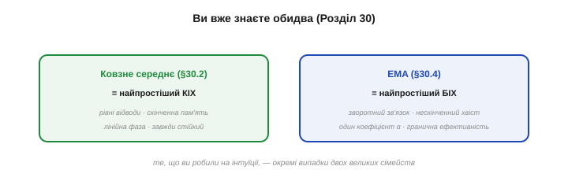
*Рис. 5.6.6.4. Старі знайомі. **Ковзне середнє** (§5.4.2) — це КІХ у найпростішому вигляді: скінченна пам'ять, рівні відводи, лінійна фаза, завжди стійкий. **EMA** (§5.4.4) — це БІХ у найпростішому вигляді: зворотний зв'язок, нескінченний хвіст, один коефіцієнт α, гранична ефективність. Те, що ви вже робили на інтуїції в Розділі 5.4, — окремі випадки двох великих сімейств цього розділу.*

Це не випадковий збіг, а підтвердження, що теорія лягає на практику: ще в Розділі 5.4 ви, обираючи між ковзним середнім і EMA, насправді вже розв'язували те саме питання «КІХ чи БІХ» — простота й передбачуваність проти ефективності й малої пам'яті. Тепер ви робите цей вибір **свідомо** й для будь-якої форми, а не лише для згладжування.

Одне уточнення про межі цього вибору. І КІХ, і БІХ — **лінійні** фільтри; а медіанний фільтр із §5.4.3 — **не** належить до жодного сімейства, бо він нелінійний (сортує, а не зважено сумує). Тому проти викидів він і працює там, де лінійні безсилі. Тримайте це в голові: «КІХ чи БІХ» — питання для **лінійної** фільтрації, а проти спайків діє окремий, нелінійний інструмент. Часто їх і поєднують: медіана проти викидів, тоді лінійний фільтр проти шуму.

> 🔧 **Навіщо це.** Найдешевший вибір за замовчуванням для **простого згладжування** — **EMA**: один коефіцієнт, одна змінна, мінімум обчислень. Якщо ж згладжування має не псувати форму чи бути гарантовано стійким — берете **ковзне середнє** (чи довший КІХ). Тобто навіть на рівні Розділу 5.4 ви маєте обидва сімейства під рукою: EMA, коли важить дешевизна, ковзне середнє, коли важить чесність форми.

### Стандарт за замовчуванням

І остання порада на випадок справжнього сумніву. Якщо задача не диктує вибору однозначно, а ресурси дозволяють, — **схиляйтеся до КІХ**. Його безумовна стабільність і лінійна фаза означають, що він **рідко** буває поганим рішенням: у найгіршому разі ви заплатите трохи більше тактів, але не отримаєте ні розгону, ні спотвореної форми, ні годин налагодження нестабільності. БІХ беріть тоді, коли його ефективність справді **потрібна** — коли гострий фільтр інакше не влазить.

Це правило не примха, а **галузева** практика: у відповідальних системах (медтехніка, авіоніка, промислове керування) КІХ часто стандарт саме через гарантовану стабільність і чесну форму — там зайвий процесор дешевший за ризик розгону. БІХ натомість панує в масовій споживчій електроніці, де тиснуть ціна й енергія. Тобто вибір сімейства нерідко диктує не лише конкретна задача, а й **галузь** із її пріоритетами — безпека чи ощадливість.


*Рис. 5.6.6.5. Терези вибору. На одній шальці — КІХ: безумовна стабільність і лінійна фаза (не псує форму), та дорожчий для гострих фільтрів. На другій — БІХ: ефективність і гострота за копійки, та з ризиком нестабільності й спотворенням фази. Безплатного фільтра нема: схиляючи терези в один бік, ви відмовляєтесь від переваг другого. Питання лише, що вам потрібніше.*

**Приклад (виберіть сімейство).** Три сценарії, три рішення:

```
1) монітор серцебиття (ЕКГ): форма QRS свята  → КІХ (лінійна фаза)
2) гострий зріз 50 Гц на 8-біт AVR, форма байдужа → БІХ-біквад (ефективність)
3) згладити шум кнопки-потенціометра, не критично → EMA (найдешевше)
```

У кожному рішення випливає з тих самих двох питань: важить форма → КІХ; тисне ресурс за гострого фільтра → БІХ; нічого не критично → найпростіше. Жодного гадання — лише послідовна логіка.

Зверніть увагу: у жодному зі сценаріїв ми не питали «який фільтр модніший» чи «який я краще знаю» — лише «що диктує **задача**». Саме так і має народжуватися вибір: від вимог до сигналу, а не від звички. Сформулюйте, що важить — форма, ресурси, безпека, затримка, — і сімейство визначиться майже само.

> 🔧 **Навіщо це.** Коли сумніваєтесь і можете собі дозволити — **беріть КІХ**. Він безпечний (не вибухне), чесний до форми (лінійна фаза) і передбачуваний; найгірше, чим ви ризикуєте, — зайві такти. БІХ свідомо обирайте лише тоді, коли його гострота-за-копійки справді необхідна, бо за неї доводиться платити пильністю до стабільності й спотворенням фази. «КІХ за замовчуванням, БІХ за потребою» — добре робоче правило.

Отже, вибір зведено до двох питань — про форму й про ресурси, — і ви вмієте на них відповідати. На цьому **тема фільтрів закрита, і закрита цілісно**: Розділ 5.4 дав прості часові фільтри, Розділ 5.5 — частотний погляд, що пояснює **чому** вони працюють, а Розділ 5.6 — повноцінний інструментарій проєктування: два сімейства, чотири форми, реалізація на залізі. Тепер у вашому арсеналі є все, щоб очистити **будь-який** сигнал давача.

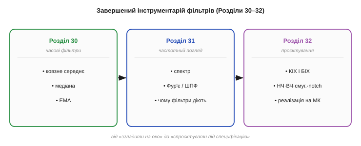
*Рис. 5.6.6.6. Завершений інструментарій. **Розділ 5.4** — прості часові фільтри (ковзне середнє, медіана, EMA). **Розділ 5.5** — частотний погляд, що пояснює їхню дію. **Розділ 5.6** — повноцінне проєктування: два сімейства (КІХ, БІХ), чотири форми (НЧ, ВЧ, смуговий, notch), реалізація на залізі. Разом — усе, щоб очистити будь-який сигнал давача свідомо й під специфікацію.*

Озирніться на пройдений шлях фільтрації. У Розділі 5.4 ви на інтуїції приборкували шум трьома простими прийомами; у Розділі 5.5 зрозуміли **мову частот**, що пояснює їхню дію; а тут, у Розділі 5.6, дістали повний інженерний інструментарій — проєктувати фільтр будь-якої форми обома способами й рахувати його на залізі. Від «згладити на око» до «спроєктувати під специфікацію» — це і є шлях від аматора до інженера в обробці сигналів, і саме його ви щойно пройшли від початку до кінця.

А далі ми цей арсенал **застосуємо**. Наступний розділ — про інерціальні давачі (акселерометр, гіроскоп), чиї сигнали особливо зашумлені й примхливі, а тому без фільтрації й розумного злиття непридатні. Саме там — і в темі орієнтації та ПІД (Розділ 5.8) — фільтри з цього розділу запрацюють на повну: комплементарний фільтр, що ми скоро зустрінемо, виявиться буквально низько- й високочастотним фільтрами, поставленими разом. Так усе, що ви вивчили в цьому модулі — ФНЧ і ФВЧ, компроміс затримки, частотне розділення сигналів, — зійдеться в одному елегантному прийомі злиття: гіроскоп пропустимо крізь ФВЧ, акселерометр — крізь ФНЧ, і складемо їх у чесну оцінку кута. Але це попереду — спершу познайомимося із самими давачами, крихітними машинами, виточеними в кремнії.

> ▶️ Далі: [Розділ 5.7 — Інерціальні давачі: MEMS](../imu-mems/imu-mems.md)
