# Розділ 5.2 — Вимірювання відстані й оточення

Найперше питання будь-якого автономного апарата — **«як далеко?»**. Як далеко стіна, підлога, перешкода попереду, поверхня рідини в баку. Робот, що їде, чи дрон, що летить, не може прикласти лінійку — відстань треба знати **без дотику**, неперервно й на ходу. Цей розділ — про те, як перетворити «відстань до речі» на електричний сигнал: спершу загальна мапа способів (§5.2.1), потім два головні — час польоту звуку (§5.2.2) і світла (§5.2.3), тріангуляція (§5.2.4), фізика відбиття (§5.2.5), неминучі похибки (§5.2.6) і коротко — решта давачів оточення (§5.2.7).

> 📜 **Перед матеріалом — історія:** [як навчилися «бачити» відлунням, від кажанів до сонара](hist-sonar.md). Вона показує, звідки взялася сама ідея «пошли імпульс — дочекайся відлуння», чому за нею стоїть п'єзоефект із §5.1.3 і як кажан, Спалланцані й Ланжевен причетні до давача у вашій руці.

---

## 5.2.1 Як виміряти відстань без дотику

Прикласти лінійку можна до того, що **не рухається й до чого дотягнешся**. Та автономному апарату потрібна відстань до того, чого торкатися **не можна або нема як**: до стіни, повз яку він їде, до підлоги під ним, до перешкоди, що насувається, до пального в баку. Тут лінійка безсила — потрібен спосіб міряти **дистанційно**. Історія розділу вже показала, що природа розв'язала це відлунням; тепер перетворимо її підказку на інженерію. Цей підрозділ — **мапа**: які взагалі бувають способи перетворити відстань на сигнал і які компроміси вирішують, котрий обрати.

Перелік задач, де без цього не обійтися, довгий: об'їхати перешкоду, втримати висоту над землею, зупинитися перед стіною, зміряти рівень пального чи води в баку, помітити руку перед дисплеєм, скласти карту кімнати. Усі вони мають спільне: ціль або **рухається**, або **далеко**, або її **не можна торкати** — тож контактний вимір (лінійка, штангенциркуль, кінцевий вимикач) безсилий, а потрібен **неперервний, швидкий і дистанційний**. Саме цей клас задач і породив усі давачі розділу, а з ними — окреме інженерне мистецтво «бачити, не торкаючись».

### Сама ідея: щось між вами й ціллю

Як виміряти проміжок, не торкаючись його кінця? Хитрість одна на всі способи: пустити в цей проміжок **щось**, чия поведінка залежить від відстані, — і прочитати ту поведінку. Цим «чимось» буває або **хвиля**, що долітає до цілі й вертається (звук, світло, радіо), або сама **геометрія** променя, що під різним кутом дивиться на близьке й далеке. Виміряти час подорожі хвилі чи кут її повернення — і відстань у руках.

Якщо узагальнити, то відстань треба змусити **відбитися** на чомусь, що ми вже вміємо міряти: на **часі** подорожі, на **куті** повернення, на **яскравості** відлуння — або ще на **фазі** неперервної хвилі (наскільки вона «зсунулась», поки літала туди-й-назад). Останній спосіб тонкий і дуже точний, але складніший, тож у цьому розділі він лишиться згадкою; три перші — основа всього далі. Звідси й три родини методів, на яких тримається весь розділ.

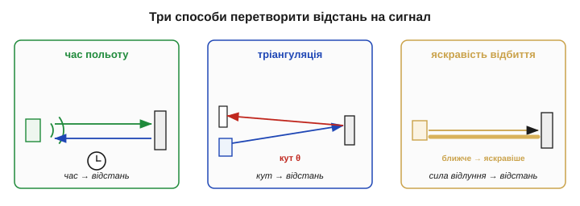
*Рис. 5.2.1.1. Три принципи безконтактного виміру. **Час польоту**: засікти час подорожі хвилі туди-й-назад. **Тріангуляція**: виміряти кут, під яким повертається відбитий промінь. **Яскравість відбиття**: ближче й світліше — сильніший відгук. Кожен має свої сильні й слабкі боки.*

Майже всі ці способи **активні**: давач сам шле зондувальний сигнал (пінг, промінь) і слухає відповідь — тому він не залежить від того, чи освітлена ціль, і працює навіть у пітьмі. Та буває й **пасивний** вимір відстані: пара рознесених камер дивиться на ту саму сцену й за зсувом зображень — тією ж тріангуляцією, лише на природному світлі — оцінює дальність. Так працює стереозір, зокрема й наш власний, двома очима. У цьому розділі зосередимось на активних давачах як простіших і надійніших для апарата, а до пасивного зору повернемось у Модулі про машинне бачення.

### Час польоту: рахуємо подорож хвилі

Перший і найпрямший спосіб ми вже знаємо з історії: **час польоту** (*time of flight*, ToF). Шлеш короткий імпульс хвилі, він летить до цілі, відбивається й повертається; засікши повний час t і знаючи швидкість v, дістаєш відстань за формулою сонара:

```
d = v · t / 2        (двійка — бо хвиля долає шлях туди й назад)
```

Уся складність тут — у **точності засічки часу**, а її диктує **швидкість** хвилі. І саме вона розводить два головні способи ToF на різні полюси.

ToF буває ще й двох ґатунків. **Імпульсний** — як ми щойно описали: коротка «пінг»-посилка й засічка моменту відлуння; простий і прямий. **Неперервнохвильовий** — шлють сталу хвилю й міряють не час, а **фазовий зсув** її відлуння (той самий «фазовий» спосіб, що ми відклали): електроніка тут простіша за наносекундний таймер, тож так часто роблять компактні лазерні далекоміри. Обидва дають ту саму відстань — різниться лише, що саме засікають: момент чи фазу.

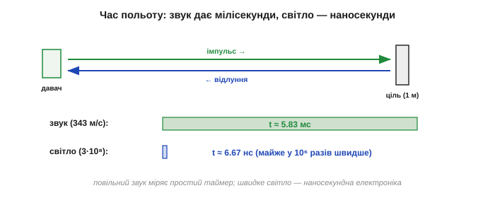
*Рис. 5.2.1.2. Чому звук і світло — різні інструменти. До цілі за 1 м звук вертається за ≈ 5.8 мс, а світло — за ≈ 6.7 нс, тобто майже в мільйон разів швидше. Повільний звук легко зміряти простим таймером; швидке світло вимагає наносекундної електроніки, зате не боїться вітру.*

**Приклад (звук проти світла на одному метрі).** Порахуймо повний час подорожі туди-й-назад до цілі за 1 метр для звуку (v ≈ 343 м/с) і для світла (v ≈ 3×10⁸ м/с):

```
звук:   t = 2·d / v = 2·1 / 343        ≈ 5.83 × 10⁻³ с = 5.83 мс
світло: t = 2·d / v = 2·1 / 3×10⁸      ≈ 6.67 × 10⁻⁹ с = 6.67 нс
```

Різниця — майже **мільйон разів**. Ось чому звуковий далекомір рахує час звичайним таймером ([Розділ 4.6](../../block-4-mcu-esp32/timers/timers.md)) і коштує копійки, а світловий мусить ловити наносекунди й коштує дорожче. Повільний звук легко зміряти, але він і оновлюється повільно, і залежить від повітря; швидке світло важко зміряти, зате воно точне й байдуже до вітру. Цей розкол і робить §5.2.2 (звук) та §5.2.3 (світло) окремими темами.

Є й глибший наслідок швидкості. Точність ToF упирається в те, **наскільки дрібно** ви вмієте міряти час: похибка в часі прямо стає похибкою у відстані, помноженою на v/2. Для звуку це поблажливо — мікросекунда таймера дає лише частку міліметра; для світла та сама мікросекунда — це аж 150 метрів, тож світловий ToF вимагає годинника в тисячі разів точнішого. А двійка в формулі грає на нас лише наполовину: подвоєний шлях дає вдвічі більше часу на вимір (це добре), але й вимагає не забути поділити навпіл (а спіткнутися легко — забув двійку, і вся шкала вдвічі брехлива).

> 🔧 **Навіщо це.** Звідси проста перевірка справності будь-якого ToF-далекоміра: піднесіть ціль на **відому** відстань і гляньте, чи сходиться показ. Удвічі більший — майже напевно забута двійка; стала добавка — зсув нуля (затримка електроніки); розкид навколо правильного — шум засічки часу. Кожна з трьох бід має свій почерк, а §5.1.4–5.1.6 уже навчили, чим її лікувати: систематику калібрують, розкид усереднюють.

### Тріангуляція: відстань із кута, а не з часу

Якщо засікати наносекунди не хочеться, є зовсім інший шлях — **тріангуляція** (*triangulation*). Випромінювач шле вузький промінь, той відбивається від цілі й потрапляє на приймач, **зсунутий убік** на відому відстань (базу). Хитрість у тому, що **кут**, під яким відбитий промінь приходить на приймач, залежить від дистанції: близька ціль дає крутий кут, далека — пологий. Вимірявши, **куди саме** на лінійці-приймачі впала пляма, з простої геометрії трикутника дістають відстань — жодного точного часу не треба.

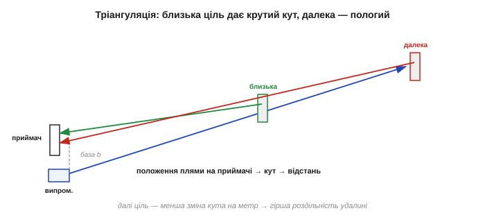
*Рис. 5.2.1.3. Геометрія тріангуляції. Промінь від випромінювача відбивається й падає на приймач, зсунутий на базу b. Близька ціль (суцільний промінь) повертається під крутим кутом і б'є в один край приймача, далека (штрих) — під пологим, в інший. Положення плями → кут → відстань.*

За це не треба платити швидкою електронікою, тож тріангуляція дешева на **близьких** дистанціях. Розплата — **роздільність падає з відстанню**: що далі ціль, то менше змінюється кут на кожен метр, і врешті далекі цілі стають нерозрізненними. Тому тріангуляційні давачі — це «бачу зблизька добре, далеко — кепсько», тоді як ToF тримає роздільність рівніше по всьому діапазону.

Керує тут **база** — зсув між випромінювачем і приймачем. Ширша база дає більший розмах кута, а отже, кращу роздільність удалині — але й робить давач габаритнішим, тож конструктор шукає рівновагу. Сам кут читають не транспортиром, а **позиційно-чутливим** приймачем: відбита пляма світла падає на лінійку фотоелементів, і її координата прямо кодує кут (а отже, відстань). Через це тріангуляція — улюблений принцип дешевих ІЧ-давачів наближення на коротку руку, де ні наносекунд, ні складної оптики не треба, а вистачає світлодіода, лінзи й смужки фотоприймача.

**Приклад (як кут стає відстанню).** Хай база b (зсув приймача від випромінювача) фіксована, а лінза проєктує відбиту пляму на лінійку фотоелементів на відстані f. За геометрією подібних трикутників відстань **обернено пропорційна** зсуву плями x на приймачі:

```
d ≈ b · f / x
ближча ціль → більший зсув x → менша d
дальша ціль → менший зсув x → більша d
```

Видно й слабке місце: коли ціль далеко, x стає крихітним, і кожен мікрон шуму чи зсуву на приймачі обертається на метри похибки. Тому тріангуляцію й полюбляють зблизька, де x велике й певне, а вдалині віддають перевагу часу польоту.

Третій принцип із мапи — найгрубіший: не час і не кут, а проста **яскравість** відлуння. Ближча (чи світліша) ціль вертає сильніший відбиток — зміряти його легко, схема копійчана. Та «яскравість» залежить не лише від відстані, а й від кольору та нахилу цілі, тож такий давач радше каже «близько / далеко», ніж дає чесні метри. Його місце — груба перешкода чи край столу, де точність не потрібна, а ціна вирішує; докладніше — у [§5.2.5](distance-environment.md).

### Що несе інформацію: звук, світло, радіо

Хвилю-носія теж обирають, і вибір міняє все.

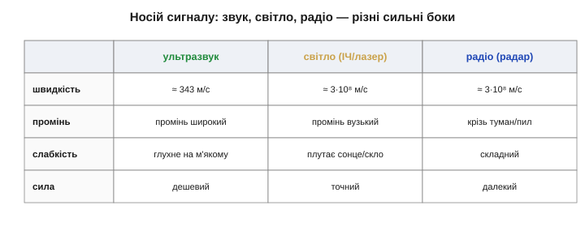
*Рис. 5.2.1.4. Три носії порівняно. Ультразвук — повільний, дешевий, з широким променем (ловить багато, та погано вказує напрямок). Світло (ІЧ/лазер) — швидке, з вузьким променем (точний напрямок), але чутливе до поверхні й засвітки. Радіо (радар) — летить зі швидкістю світла, б'є найдальше, бачить крізь туман, але складне.*

- **Звук (ультразвук):** повільний (343 м/с), тож легко зміряти час; промінь широкий — добре «накриває» простір, але кепсько вказує точний напрямок; дуже дешевий; залежить від температури повітря, вітру й глухне на м'яких цілях.
- **Світло (ІЧ, лазер):** швидке, тож точне й байдуже до руху повітря; промінь вузький — гострий напрямок і тонкі деталі; але його плутають яскраве сонце, темні чи дзеркальні поверхні, прозоре скло.
- **Радіо (радар):** летить, як і світло, зі швидкістю світла, але б'є найдальше і проходить крізь туман, пил, дощ; та складне й дороге — його фізику лишаємо Модулю про радіо, тут досить знати, що це той самий принцип відлуння, лише хвиля значно довша.

Кожен носій має й власні дрібні підступи. Ультразвук іде звичайно на десятках кілогерц (типово ≈ 40 кГц — досить високо, щоб людина не чула, і досить низько, щоб не згасав надто швидко), а його промінь — широкий **конус**, тож давач радше відповідає «щось є в цьому секторі», ніж «точно прямо переді мною». Швидкість звуку ще й помітно залежить від **температури** повітря: холодним ранком і спекотним полуднем той самий час відлуння означає різну відстань — і це вже вбудована похибка ([§5.2.6](distance-environment.md)). Світло натомість дає тонкий промінь і гострий напрямок, але потужний лазер змушує думати про **безпеку очей**, а будь-яке оптичне рішення плутає яскраве сонце, що саме сипле тим самим світлом.

> 🔧 **Навіщо це.** Носія обирають **за середовищем і ціллю**, а не «що точніше». У запиленому цеху ультразвук бачить там, де оптика осліпла; для точного наведення на яскравому сонці краще лазер; крізь туман — лише радар. Перше питання далекоміра — не «яка точність?», а «у чому я працюю і що ловлю?».

### Ворог будь-якого далекоміра: ціль, що не відбиває

Усі ці способи спільні в одному: хвиля мусить **повернутися**. А отже, давач безсилий проти цілі, яка її **не відбиває назад**. Це головна, найчастіша й найпідступніша причина, чому далекомір «бреше».

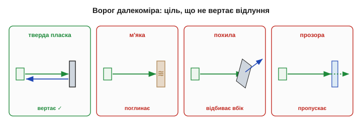
*Рис. 5.2.1.5. Чому ціль вирішує все. Тверда пласка поверхня, перпендикулярна променю, чесно вертає відлуння (ліворуч). М'яка (поролон, тканина) його **поглинає**; похила — **відбиває вбік**, повз приймач; прозора (скло для ІЧ) — **пропускає** наскрізь. У всіх трьох випадках відлуння не повертається, і давач «не бачить» цілі.*

Звідси неприємні сюрпризи: давач, що чудово міряє до стіни, не бачить кота (м'яка шерсть глушить ультразвук), вікна (скло прозоре для ІЧ) чи косо поставленого щита (відбиває промінь убік). Це не несправність, а фізика відбиття — їй ми присвятимо [§5.2.5](distance-environment.md), а похибкам, що звідси ростуть, — [§5.2.6](distance-environment.md).

Є й зворотний бік: якщо ціль **можна підготувати**, проблема зникає. Спеціальна поверхня — **ретрорефлектор** (як котяче око чи дорожній знак) — вертає промінь точно туди, звідки він прийшов, під майже будь-яким кутом; із такою «кооперативною» ціллю далекомір працює надійно й здалека, тому промислові лазерні давачі часто йдуть у парі з наклеєним на ціль відбивачем. А коли ціль **некооперативна** (звичайна стіна, людина, ящик), давачу лишається той слабкий відбиток, що випадково повернувся, — і він мусить сам вирішити, котре з відлунь «справжнє». Зазвичай беруть **перше досить сильне**, відсікаючи слабкі шуми порогом, — але саме тут і ховаються хибні покази, коли давач ухопиться не за ту поверхню.

> 🔧 **Навіщо це.** Далекомір міряє не «відстань до об'єкта», а час чи кут **першого сильного відлуння**, яке до нього повернулося. Тому, ставлячи давач, завжди питайте: моя ціль **відбиває** цей носій? Поролон для ультразвуку, скло для ІЧ, дзеркало під кутом — невидимі, хоч і стоять впритул. Половина невдач із далекомірами — це не давач, а ціль.

### Як обрати: коротке порівняння

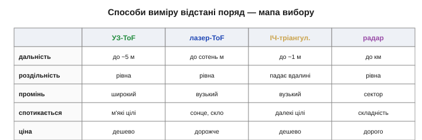
*Рис. 5.2.1.6. Чотири способи поряд: типова дальність, як тримається роздільність, ширина променя, на чому спотикаються, ціна. Стисла мапа для вибору — деталі кожного далі в розділі.*

Грубий орієнтир: дешево й невибагливо в приміщенні — **ультразвук**; точно й вузько на середніх дистанціях — **лазерний ToF**; зовсім зблизька й дешево — **ІЧ-тріангуляція**; далеко й крізь негоду — **радар**. Жоден не «найкращий»: кожен виграє у своєму середовищі й на своїй цілі, і саме ці компроміси розкладемо в наступних темах.

Підсумовуючи мапу, у далекоміра чотири головні осі вибору: **дальність** (сантиметри, метри чи кілометри), **роздільність** (і як вона тримається з відстанню), **ширина променя** (вузький точно наводить, широкий радше «накриває» сектор) і **сумісність із ціллю** (що та ціль відбиває). Додайте ціну й частоту оновлення — і дістанете повний профіль давача. Жоден стовпчик не «головний»: важить лише, чи лягає профіль на вашу конкретну задачу, — рівно як читання даташита з §5.1.4.

І ще думка наперед: ці способи не так конкурують, як **доповнюють** одне одного. Серйозні апарати рідко покладаються на єдиний далекомір — вони **поєднують** кілька: ультразвук для близьких широких перешкод, лазер для точного далекого наведення, — щоб слабкість одного прикрив інший там, де він сліпий. Як грамотно зливати покази різних давачів в одну картину, побачимо аж у темах про фьюжн (§5.7–5.8); тут досить запам'ятати, що «найкращий далекомір» — це часто **не один** давач, а вдало дібраний ансамбль.

Почнемо з найстаршого, найдешевшого й найзрозумілішого способу — того самого, яким Ланжевен ловив субмарини: вимір відстані за **часом польоту звуку**.

---

## 5.2.2 Час польоту (ToF): звук

Це сонар Ланжевена, зменшений до однієї ніжки мікроконтролера й перенесений із води в повітря. [Ультразвуковий далекомір](book:components/ultrasonic-rangefinder) **пищить** коротким імпульсом, **слухає** його відлуння й **рахує час** — рівно як кажан із історії. За цю простоту й дешевизну ультразвук і люблять: він бачить у пітьмі, в пилюці, крізь дим, не залежить від кольору цілі — і вимірює час так повільно, що з ним упорається найпростіший таймер. Цей підрозділ перетворює принцип §5.2.1 і формулу історії на робочий давач, який ви під'єднаєте до двох виводів.

### Цикл вимірювання: пінг, відлуння, час

Один вимір — це короткий цикл із трьох дій. Перетворювач випромінює **короткий пакет** ультразвуку (звичайно близько восьми коливань на ≈ 40 кГц); пакет летить до цілі, відбивається й повертається; той самий (або сусідній) перетворювач **чує** відлуння; електроніка засікає повний час t від випромінення до прийому. Далі — формула сонара з історії:

```
d = v · t / 2          v ≈ 343 м/с (швидкість звуку в повітрі при 20 °C)
```

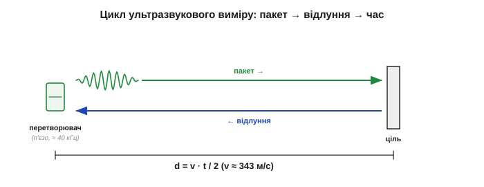
*Рис. 5.2.2.1. Один цикл далекоміра. Перетворювач шле короткий пакет ультразвуку (≈ 40 кГц); відлуння від цілі повертається через час t; відстань рахують як d = v·t/2. Двійка — бо звук долає шлях туди й назад, як у Ланжевена, тільки в повітрі.*

**Приклад (від часу відлуння до сантиметрів).** Перетворювач почув відлуння через 5.83 мс. Яка відстань до цілі?

```
d = v · t / 2 = 343 · 0.00583 / 2 ≈ 1.0 м
```

Зручне практичне правило випливає з того, що звук долає 2 см (туди-й-назад на 1 см цілі) приблизно за 58 мкс:

```
відстань [см] ≈ час відлуння [мкс] / 58
```

Тобто 580 мкс — це 10 см, 5800 мкс — метр. Один поділ — і час став відстанню; саме так його й рахують у мікроконтролері.

Варто розуміти й що саме давач «чує». Пакет із кількох коливань потрібен, щоб у відлунні було за що вхопитися: одне коливання загубилося б у шумі, а пакет дає чіткий **сплеск** енергії на 40 кГц. Приймач стежить за обвідною цього сплеску й засікає мить, коли вона перевищить **поріг**, — це й вважають моментом приходу відлуння. Звідси, до речі, тонка похибка: дуже слабке відлуння перетне поріг трохи **пізніше**, ніж сильне, і давач його злегка «віддалить» — одна з причин, чому далекі й м'які цілі читаються з невеликим систематичним запізненням.

### Інтерфейс trigger/echo: як це бачить мікроконтролер

Типовий ультразвуковий далекомір спілкується з мікроконтролером двома лініями. На вхід **trigger** мікроконтролер подає короткий імпульс — це команда «пни». Давач сам формує пакет ультразвуку, а потім піднімає лінію **echo** у високий стан **рівно на той час**, поки звук летить туди-й-назад. Мікроконтролеру лишається зміряти **тривалість** цього імпульсу — і поділити на 58, щоб дістати сантиметри.

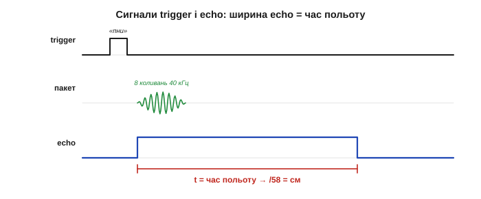
*Рис. 5.2.2.2. Що бачить мікроконтролер. Короткий імпульс на trigger запускає пакет; лінія echo тримається у високому стані стільки, скільки триває політ звуку туди-й-назад. Виміряти цю ширину — і є вся робота: таймер (Розділ 4.6) ловить фронт і спад, різниця → час → відстань.*

Ключове тут — **як** міряти ширину імпульсу. Найгрубіше — крутитися в циклі й рахувати, але це блокує процесор на всі мілісекунди польоту. Правильно — доручити це **таймеру** з режимом захоплення ([Розділ 4.6](../../block-4-mcu-esp32/timers/timers.md)): він апаратно запам'ятовує момент фронту й спаду echo, а процесор тим часом вільний. Це той самий неблокуючий підхід, що ми обстоювали у таймерах.

Дві практичні дрібниці рятують від типових бід. По-перше, **рівень echo**: багато модулів живляться від 5 В і віддають на echo п'ять вольтів, а вхід сучасного мікроконтролера терпить лише 3.3 — тож між ними ставлять дільник чи зсувач рівня (з [§5.1.7](../sensor-physics/sensor-physics.md) і [Розділу 4.4](../../block-4-mcu-esp32/gpio/gpio.md)), інакше ризикуєте спалити ніжку. По-друге, **поведінка без відлуння**: якщо ціль не відповіла, лінія echo не висить вічно — давач сам опускає її по тайм-ауту, і це треба тлумачити як «нічого в межах діапазону», а не як нульову відстань. Сплутати «далеко» з «нуль» — класична помилка, що жене робота просто в невидиму перешкоду.

> 🔧 **Навіщо це.** Міряйте echo **апаратним** захопленням чи перериванням по фронту, а не блокуючим очікуванням. Інакше на кожен вимір процесор «застигає» на 10–20 мс, і робот, що в цей час нічого більше не робить, просто в'їде в перешкоду, поки чекає відповіді про неї. Неблокуючий цикл пінгів — основа чуйного апарата.

### Звук на 40 кГц: чому саме ультразвук

Чому пакет саме **ультразвуковий**, а не звичайний чутний звук? Причин три. По-перше, **40 кГц людина не чує**, тож давач не дратує писком ні людей, ні тварин. По-друге, висока частота — це коротка **довжина хвилі** (≈ 8.6 мм на 40 кГц), а коротша хвиля краще збирається у вузький промінь і дозволяє розрізняти дрібніше. По-третє, у звичному звуковому діапазоні повно сторонніх шумів (голоси, мотори, кроки), а на 40 кГц майже тихо — менше завад. Сам перетворювач — п'єзокерамічна пластина (§5.1.3, сонар Ланжевена), яка резонує саме на своїх 40 кГц: на цій частоті вона і дзвенить голосно, і чує чутливо.

Чому ж не взяти ще вищу частоту заради ще вужчого променя? Бо повітря **поглинає** ультразвук тим сильніше, чим вища частота: на 40 кГц давач дістає кілька метрів, а на 200 кГц згас би вже за десятки сантиметрів. Сорок кілогерц — компроміс між гостротою (вища частота краще) і дальністю (нижча частота далі бере). Та сама пластина ще й має вузький **резонанс**: поза своїми 40 кГц вона й випромінює кволо, і чує погано, — тож частота давача не вибір користувача, а властивість кристала, як висота ноти в камертона.

### Промінь — це конус: широко бачить, погано вказує

Тут ховається перша велика особливість. Ультразвуковий промінь — **не олівець, а конус** із розкривом зазвичай 15–30°. Це водночас і сила, і слабкість. Сила — давач «накриває» цілий сектор і помічає перешкоду, навіть якщо вона не точно по осі. Слабкість — **погана бічна роздільність**: давач знає, що «щось є за метр у цьому конусі», але не каже, **де саме** в ньому; дві близькі речі зливаються в одну, а відповідає завжди **найближча** — бо її відлуння повертається першим і найсильнішим.

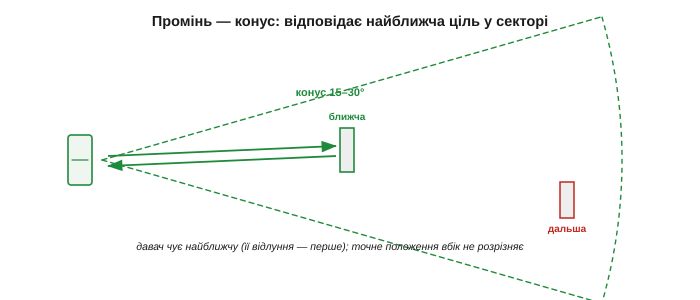
*Рис. 5.2.2.3. Конус променя. Ультразвук розходиться конусом 15–30°, тож накриває сектор, а не точку. У межах конуса давач чує **найближчу** ціль (її відлуння приходить першим); точне положення вбік від осі він не розрізняє. Добре для «чи вільно попереду», погано для «де саме край».*

> 🔧 **Навіщо це.** Ультразвук — давач питання «чи вільний шлях?», а не «де точно межа?». Для об'їзду перешкод і втримання дистанції до стіни він чудовий; для точного вимірювання положення вузької цілі беріть вужчий промінь — лазер (§5.2.3). Пам'ятайте про конус і тоді, коли ставите кілька давачів поруч: їхні сектори перекриватимуться.

Ширина конуса не випадкова: вона залежить від **розміру** пластини відносно довжини хвилі — більша пластина дає вужчий промінь, як більше дзеркало дає тонший зайчик. Тому компактні давачі завжди ширококонусні. У променя є й **бічні пелюстки** — слабші «вушка» збоку від головного конуса, якими давач зрідка ловить геть не те, що перед ним. А для побудови карти кімнати широкий конус має прикрий наслідок: він **розмазує** обриси, бо ту саму відстань повертає для всього сектора, і гострий кут стіни виходить заокругленим. Тому ультразвукова карта завжди трохи «розпливчаста», і чекати від неї чітких ліній не варто.

### Сліпа зона й межі дальності

Друга особливість — пряма спадщина того, що **голос і вухо в перетворювача одна деталь** (з історії). Одразу після пакета пластина ще **дзвенить** за інерцією сотні мікросекунд, і поки вона дзвенить — вона **глуха** до відлуння. Тому близькі цілі, чиє відлуння повертається надто швидко, давач **не чує**: у нього є **сліпа зона** (*dead zone*) — мінімальна відстань у кілька сантиметрів, ближче за яку він безпорадний.

З іншого боку — **максимальна** дальність. Відлуння слабшає з відстанню (звук розходиться конусом і гасне в повітрі), тож із якоїсь дистанції воно тоне в шумі. Давачу задають **тайм-аут**: не почув відлуння за відведений час — вважає, що попереду вільно (або повертає «поза діапазоном»). Між сліпою зоною та тайм-аутом і лежить **робоче вікно** далекоміра.

Числа дають відчуття масштабу: типова сліпа зона — близько 2 см, максимум — кілька метрів. І «просто почекати менше» сліпу зону не прибере: вона задана **фізикою дзвону** пластини, а не налаштуванням коду. Скоротити її можна або жорсткішим **демпфуванням** кристала (швидше відзвенить, але й тихіше крикне — менша дальність), або переходом на два окремі перетворювачі, де приймач узагалі не чує власного передавача. Це знов той самий компроміс, що супроводжує нас весь модуль: виграш в одному — програш в іншому.

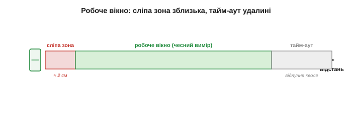
*Рис. 5.2.2.4. Робоче вікно далекоміра. Ближче за сліпу зону (перетворювач ще дзвенить — глухий) вимір неможливий; далі за максимум відлуння надто кволе, спрацьовує тайм-аут. Чесно міряти можна лише в проміжку між ними.*

### Один перетворювач чи два

Сліпу зону задає саме **суміщення** голосу й вуха. Тому далекоміри бувають двох виконань. **Однопере­творювачні** (один кристал і шле, і слухає) — дешеві й компактні, але з більшою сліпою зоною: пластині треба час, щоб відзвеніти й перемкнутися з передачі на прийом. **Двоперетворювачні** (окремий випромінювач і окремий приймач) — приймач не глухне від власного дзвону передавача, тож сліпа зона менша й близькі цілі видніші; плата — дві деталі й невеликий геометричний зсув між ними.

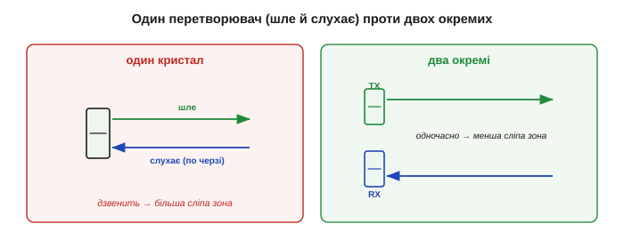
*Рис. 5.2.2.5. Один кристал проти двох. Зліва: один перетворювач по черзі передає й приймає — дешево, але після передачі дзвенить і має більшу сліпу зону. Справа: окремі передавач і приймач працюють одночасно — менша сліпа зона, краще зблизька, але дві деталі.*

Є й третій, програмний хід для одного перетворювача — **підсилення, що росте з часом** (часове автоматичне регулювання підсилення). Одразу після пакета, поки пластина дзвенить, приймач тримають малочутливим (щоб не злякатися власного дзвону), а далі чутливість плавно піднімають, ловлячи дедалі слабші далекі відлуння. Так один кристал частково обходить і сліпу зону зблизька, і спад відлуння вдалині — ціною хитрішої електроніки. Саме так і влаштовані «розумні» однокристальні далекоміри, що віддають уже готову відстань цифровою лінією, сховавши всю цю кухню всередині.

### Швидкість звуку «пливе» з температурою

А ось похибка, про яку легко забути, бо вона невидима. Швидкість звуку в повітрі **залежить від температури** — приблизно лінійно:

```
v ≈ 331 + 0.6 · T        (м/с, T у °C)
0 °C → 331 м/с ;  20 °C → 343 м/с ;  40 °C → 355 м/с
```

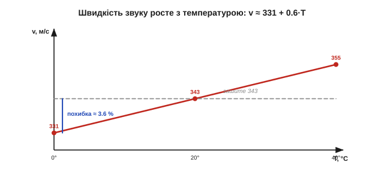
*Рис. 5.2.2.6. Швидкість звуку проти температури. v ≈ 331 + 0.6·T росте майже на 0.17 % на градус. Якщо в коді «зашите» 343 м/с, то холодним ранком чи спекотним полуднем та сама засічка часу дасть систематично завищену або занижену відстань.*

**Приклад (скільки коштує забута температура).** Код вважає v = 343 м/с (для 20 °C), а працюємо за 0 °C, де насправді v = 331 м/с. Відносна похибка відстані:

```
похибка = (343 − 331) / 331 ≈ 0.036 = 3.6 %
на цілі 4 м це ≈ 14 см
```

Чотирнадцять сантиметрів на рівному місці — і це лише від прохолоди. Лік прямий: зміряти температуру окремим давачем і **підставити правильне v** у формулу. Це і є та температурна компенсація з §5.1.5 — тільки тут компенсують не дрейф самого давача, а дрейф **середовища**, через яке йде хвиля. Багато готових модулів тому й містять давач температури поруч.

Дрібнішою, але того ж штибу, є й поправка на **вологість** — вона теж трохи зсуває швидкість звуку, хоч і значно слабше за температуру (а от атмосферний тиск за тієї самої температури на швидкість звуку практично не впливає). А найхитріший спосіб обійтися зовсім без термометра — **самокалібрування**: час від часу пінгувати ціль на **відомій** відстані (скажімо, край власного корпуса) і з її відлуння обчислювати поточне v напряму. Тоді давач сам ловить і температуру, і вологість, і будь-який дрейф середовища одним числом — пряме застосування ідеї калібрування §5.1.6 до звуку.

### Швидкість оновлення й завади

Наостанок — два практичні обмеження. По-перше, **темп оновлення**: новий пінг не можна послати, поки не повернулось попереднє відлуння (або не сплив його тайм-аут). Якщо максимальна дальність 4 м, повний цикл туди-й-назад — близько 23 мс, тож частіше ніж ≈ 40 разів на секунду давач міряти не встигне. Хочеш швидше — зменшуй дальність.

По-друге, **завади відлуння**. Кілька ультразвукових давачів поруч **чують пінги один одного** й видають хибні цілі (перехресні завади); промінь може **кілька разів відбитися** (від підлоги, стін) і повернутися пізнім «привидом»; м'яка чи коса ціль не дасть відлуння зовсім (§5.2.1). Звідси прийоми: пінгувати давачі **по черзі**, відсівати слабкі й запізнілі відлуння, брати лише **перше досить сильне** й згладжувати ряд вимірів фільтром ([Розділ 5.4](../digital-filtering/digital-filtering.md)).

Перехресні завади мають і елегантніший лік, ніж проста черговість: кожному давачу дають **власний «підпис»** пінга — унікальну послідовність чи частотну розгортку (той самий чирп кажана з історії), — і приймач зараховує лише відлуння зі своїм підписом, ігноруючи чужі. А темп оновлення варто тримати в голові, плануючи рух: якщо давач дає 40 вимірів на секунду, то між ними апарат, що мчить, устигне проїхати помітний шмат — тож швидкому роботу або зменшують дальність заради частіших пінгів, або просто не довіряють єдиному застарілому виміру, поки не прийде свіжий.

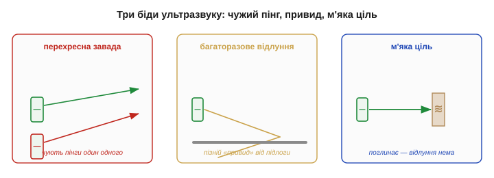
*Рис. 5.2.2.7. Три типові біди. Сусідній давач підкидає чужий пінг (перехресна завада); промінь відбивається кілька разів і дає пізній «привид»; м'яка ціль поглинає звук і зникає для давача. Ліки — черговість пінгів, логіка першого відлуння й фільтрація.*

> 🔧 **Навіщо це.** Ультразвук рідко бреше «трохи» — він або правий, або дає дикий викид (привид, чужий пінг, проґавлена м'яка ціль). Тому сирий потік ультразвукових вимірів майже завжди пропускають крізь **медіанний** фільтр, що вбиває поодинокі викиди, перш ніж довіряти числу (саме його розберемо в §5.4.3). Один пінг — підказка; надійний показ — це кілька пінгів, очищених від сміття.

Підсумок: ультразвуковий ToF — дешевий, витривалий, бачить у темряві й пилюці, ідеальний для виявлення перешкод — ціною широкого конуса, сліпої зони, температурного дрейфу й безсилля перед м'якими та косими цілями. Це сонар Ланжевена, що вліз у долоню. Саме тому ультразвук — звичний вибір для паркувальних давачів, вимірювання рівня в баках, простих мобільних роботів і кожного апарата, якому досить знати «чи близько щось», а не «що саме й де з точністю до міліметра». Коли ж потрібні вузький промінь і висока точність, той самий принцип часу польоту застосовують до хвилі, у мільйон разів швидшої, — до **світла**.

---

## 5.2.3 Час польоту: світло/лазер

Замінімо звук на світло — і принцип той самий, а характер давача змінюється до невпізнання. Світло летить майже в **мільйон разів** швидше за звук, тож світловий далекомір вузький, точний, швидкий і байдужий до вітру й температури повітря. Плата — час польоту стає таким коротким, що зміряти його стає **головною інженерною проблемою**. Саме на цьому принципі стоять [лазерні далекоміри](book:components/laser-tof) й LiDAR, що малюють тривимірні карти для автономних машин. Цей підрозділ — про те, як приборкати наносекунди й чим за це доводиться платити.

### Та сама формула — мільйон разів швидше

Формула не змінилась, лише швидкість:

```
d = c · t / 2          c ≈ 3 × 10⁸ м/с (швидкість світла)
```

Уся різниця — в **часі**. Подивімось, що це означає на практиці:

```
ціль 1 м:   t = 2·1 / (3×10⁸)     ≈ 6.67 нс
ціль 1 см:  t = 2·0.01 / (3×10⁸)  ≈ 67 пс  (пікосекунд!)
```

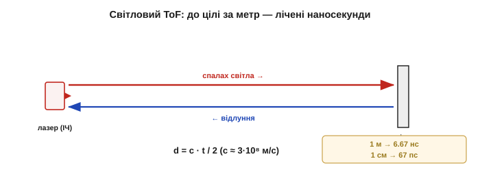
*Рис. 5.2.3.1. Світловий час польоту. Та сама d = c·t/2, але до цілі за 1 м світло вертається за 6.67 нс, а кожен сантиметр — це лише 67 пікосекунд. Простий таймер тут безсилий: щоб різнити сантиметри, потрібен годинник із пікосекундною роздільністю.*

**Приклад (чому це так важко).** Щоб розрізняти сантиметри світловим ToF, треба міряти час із роздільністю близько 67 пс. Звичайний таймер мікроконтролера цокає десятками наносекунд — у тисячу разів грубіше. Тому світлові далекоміри несуть **спеціальну** надшвидку електроніку (час-цифровий перетворювач), а не звичайний лічильник із [Розділу 4.6](../../block-4-mcu-esp32/timers/timers.md). Ось чому лазерний далекомір дорожчий за ультразвуковий, хоч формула однакова.

Варто оцінити, наскільки ці пікосекунди малі. За 67 пс світло долає лише два сантиметри, тож електроніка мусить розрізняти події, рознесені в часі тонше, ніж блимне найшвидший транзистор. Роблять це **час-цифровим перетворювачем** (*TDC*) — вузлом, що міряє інтервали з роздільністю в одиниці пікосекунд, користуючись затримками самих логічних вентилів як «лінійкою часу». До слова, сама **скінченність** швидкості світла довго здавалася неймовірною: ще у XVII столітті данець Оле Ремер уперше довів, що світло летить не миттєво, спостерігаючи запізнення затемнень супутників Юпітера. Те, що колись ледве вдалося виміряти астрономічно, тепер ловить дешевий чип у далекомірі.

Але винагорода щедра. Світло летить **вузьким** променем (точний напрямок, гостра роздільність), **далеко**, **швидко** оновлюється — і, на відміну від звуку, його швидкість майже **не залежить** від температури, вітру чи вологості повітря. Той повітряний дрейф, що псував ультразвук (§5.2.2), світла майже не торкається.

### Дві дороги: прямий час чи фаза

Приборкати наносекунди можна двома різними способами — рівно тими, що ми назвали у §5.2.1.

**Прямий (імпульсний) ToF** — як в ультразвуку: шлють дуже короткий **спалах** світла й засікають мить приходу відлуння надшвидким годинником. Це шлях **далеких** далекомірів і LiDAR — він бере сотні метрів, але вимагає найскладнішої пікосекундної електроніки.

**Непрямий (фазовий) ToF** — хитріший обхід: світло не імпульсами, а **неперервно**, з модульованою (мерехтливою) яскравістю на відомій частоті; вертається воно з тим самим мерехтінням, але **зсунутим за фазою** — бо поки літало, мерехтіння «відстало». Цей фазовий зсув і кодує відстань, а зміряти фазу набагато легше, ніж пікосекунди. Тому фазовий спосіб панує в **компактних** далекомірах ближньої й середньої дії.

У кожної дороги — своя плата. Прямий спосіб мусить втиснути багато енергії в коротесенький спалах, щоб з далекої цілі повернулося бодай кілька фотонів; найчутливіші далекоміри тому **рахують поодинокі фотони** й накопичують гістограму їхніх моментів приходу за тисячі спалахів, аж поки справжній пік не випливе з шуму (те саме усереднення §5.1.5, лише над фотонами). Фазовий же спосіб світить **неперервно**, тож витрачає більше середньої потужності й гірше бере дуже далеко, зате його електроніка проста й дешева. Звідси й поділ праці: прямий — для дальніх LiDAR, фазовий — для кишенькових далекомірів.


*Рис. 5.2.3.2. Дві дороги світлового ToF. Прямий: короткий спалах і засічка моменту приходу пікосекундним годинником — далеко, але складно. Непрямий: неперервне мерехтливе світло, а відстань читають із фазового зсуву відлуння — простіше, ближче.*

### Фазовий спосіб і пастка неоднозначності

Розгляньмо фазовий спосіб уважніше, бо саме він у дешевих модулях. Світло мерехтить на частоті f; відлуння приходить із фазовим зсувом φ, пропорційним часу польоту, а отже, відстані:

```
d = c · φ / (4 · π · f)
```

Та фаза має підступ: вона «крутиться по колу» й після повного оберту (2π) **починається спочатку**. Тому відстані, що відповідають φ і φ+2π, нерозрізненні — фаза **«заплутується»** (*wrap*), і вимір стає неоднозначним. Найбільша відстань, яку фаза ще читає однозначно, — це коли вона саме добігає 2π:

```
неоднозначна дальність = c / (2 · f)
```

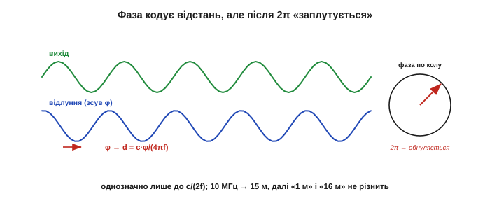
*Рис. 5.2.3.3. Фаза й неоднозначність. Відлуння повертається зсунутим за фазою на φ — це й дає відстань. Та коли політ довшає, φ доходить 2π і обнуляється: далі давач не відрізнить «далеко» від «дуже далеко». Однозначно він міряє лише до c/(2f).*

**Приклад (де фаза «заплутується»).** Модуляція на f = 10 МГц. Доки вимір однозначний?

```
неоднозначна дальність = c / (2·f) = 3×10⁸ / (2·10⁷) = 15 м
```

За 15 метрів давач уже не скаже, чи ціль за 16 м, чи за 1 м. Тут видно компроміс: **вища** частота модуляції дає кращу роздільність, але **меншу** однозначну дальність. Тому точні фазові далекоміри міряють одразу на **кількох** частотах — груба низька знімає неоднозначність, тонка висока дає роздільність.

Це той самий прийом, що й годинник зі стрілками: годинна стрілка груба, але однозначна на пів доби, а секундна точна, та сама собою не каже, котра година — лише разом вони дають і діапазон, і точність. Так само багаточастотний фазовий далекомір поєднує «грубу» й «тонку» модуляцію, щоб мати водночас і велику однозначну дальність, і дрібну роздільність; саме тому в його даташиті стоять відразу кілька частот, а не одна.

### Джерело й приймач: світлодіод, лазер, фотодіод

Світло теж буває різне. **Світлодіод** — дешевий, але світить розсіяно й недалеко; **лазерний діод** — дає тонкий зібраний промінь, б'є далеко й точно, та змушує думати про безпеку очей. Майже завжди світло **інфрачервоне**: людині невидиме й менше плутається з ним денне сонце. Ловить відлуння **фотодіод** (§5.1.3); а коли відлуння кволе й швидке, беруть чутливіші прилади — лавинний фотодіод (із внутрішнім підсиленням) чи навіть лічильник окремих фотонів, що засікає кожен квант світла з пікосекундною точністю.

Дрібниці тут не дрібні. Інфрачервону довжину хвилі часто беруть близько 940 нм не випадково: саме там у сонячному спектрі є **провал** (атмосфера поглинає цю смугу), тож денна засвітка слабша й давачу легше почути власне світло на тлі сонця. Лазерні діоди для далекомірів нерідко роблять **поверхнево-випромінювальними** (VCSEL) — компактними й дешевими у виробництві. А лавинний фотодіод чутливіший за звичайний тому, що один народжений фотоном носій лавиною вибиває в кристалі багато інших — це внутрішнє підсилення прямо в переході, споріднене з пробоєм, що ми бачили в діода §5.1.3.

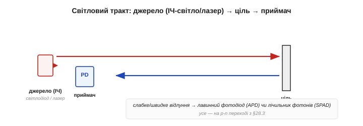
*Рис. 5.2.3.4. Світловий тракт ToF. Джерело — інфрачервоний світлодіод (дешево, розсіяно) або лазерний діод (вузько, далеко); приймач — фотодіод, а для слабких швидких відлунь — лавинний фотодіод чи лічильник фотонів. Усе на знайомому p-n переході з §5.1.3.*

> 🔧 **Навіщо це.** Лазер вимагає поваги: інфрачервоний промінь **невидимий**, тож око не встигає замружитись, а потужний лазерний далекомір здатен пошкодити сітківку. Тому такі прилади мають класи безпеки за потужністю, і навіть «безпечний» клас не варто світити в очі. Невидимість тут не перевага, а додаткова небезпека — на відміну від ультразвуку, який щонайбільше неприємний.

### Вузький промінь — і ціна чутливості до поверхні

За точність світло править свою ціну. Щоб виміряти відстань, до приймача має повернутися **достатньо фотонів**, — а скільки їх повернеться, залежить від **поверхні** цілі. Біла чи дзеркально-зворотна ціль вертає багато світла — далекомір бере її здалека; **чорна** поглинає майже все — дальність падає в рази або вимір зривається зовсім; **дзеркало** під кутом відбиває промінь убік, повз приймач; **прозоре** скло світло просто пропускає. Тому дальність світлового давача завжди вказують **для певної відбивності** (скажімо, 90 % білого), а на темній цілі вона буде значно меншою.

За цим стоїть невблаганна арифметика фотонів. Світло, відбите від звичайної матової поверхні, розсіюється навсібіч, тож до приймача вертається лише крихітна частка, яка ще й спадає приблизно як **1/d²** з відстанню. Подвоїли дистанцію — учетверо менше світла; а темна поверхня з'їла ще й більшу частку того, що мало повернутися. Тому дальність світлового ToF обмежена не годинником, а **бюджетом фотонів**: точно засікти час давач устиг би й до кілометра, та назад просто нічого не прилітає. Дзеркальна (блискуча) ціль поводиться ще підступніше за матову — вона відбиває все в один бік, тож або сліпить приймач прямим відблиском, або не дає нічого зовсім.

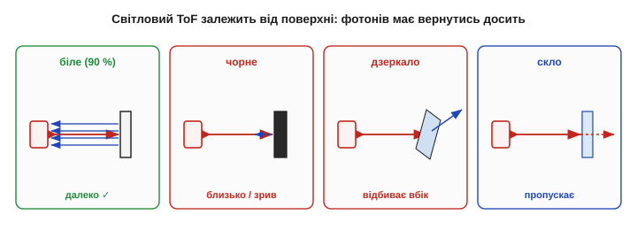
*Рис. 5.2.3.5. Чому поверхня вирішує дальність. Світле тіло вертає багато фотонів — давач бачить далеко; чорне поглинає — дальність мала; дзеркало під кутом і прозоре скло відлуння до приймача не повертають зовсім. Дальність у даташиті — завжди для заданої відбивності.*

Окремий ворог — **денне світло**. Яскраве сонце саме сипле інфрачервоним, заливаючи приймач сторонніми фотонами, у яких тоне кволе відлуння. Рятують вузький **світлофільтр** (пропускає лише довжину хвилі давача), **модуляція** (приймач упізнає лише власне мерехтливе світло, а рівне сонячне ігнорує) і короткі потужні спалахи. Це пряме застосування боротьби з шумом і смугою з §5.1.5.

> 🔧 **Навіщо це.** Якщо в даташиті лазерного далекоміра написано «до 4 м», читайте дрібний шрифт: 4 м — це до **білої** стіни в **тіні**. Чорна тканина на сонці може дати 0.5 м або «немає цілі». Світловий ToF блискучий на світлих поверхнях у приміщенні й примхливий на темних під сонцем — закладайте це в розрахунок, а не дізнавайтеся в польоті.

### Світло не залежить від повітря — великий виграш

А ось де світло однозначно переважає звук. Швидкість світла в повітрі майже не залежить ні від температури, ні від вологості, ні від вітру (показник заломлення повітря ≈ 1.0003, мало не як у вакуумі). Тому світловий ToF **не потребує** температурної компенсації середовища, яка мучила ультразвук (§5.2.2): холодний ранок чи спекотний полудень — той самий точний результат. Дрейфує тут лише ціль і заважає лише засвітка; саме повітря на шляху променя — чесне.

Чесне, поки воно **чисте**. Тут варто бути точним: світло незалежне від температури й вологості повітря — так, але не від **завислих частинок**. Туман, дощ, пил, дим **розсіюють** і поглинають світло, тож у негоду світловий далекомір сліпне там, де ультразвук, а надто радар, ще бачать. Сильне марево над гарячим асфальтом ще й трохи **викривлює** промінь. Тож «байдужий до повітря» означає байдужий до його температури й вологості — але не до того, що в повітрі **літає**.

> 🔧 **Навіщо це.** Правило вибору середовища просте: чисте повітря, світла ціль, потрібна точність — світло; пил, туман, дим, темна чи м'яка ціль — звук (а на великій дальності в негоду — радар). Лазерний далекомір, поставлений на запилений склад чи в туман, даватиме провали саме тоді, коли потрібен найбільше. Носій сигналу добирають під найгірші очікувані умови, а не під лабораторні.

### Від точки до карти: сканування й LiDAR

Один світловий далекомір дає **одну** відстань в одному напрямку. Та якщо промінь швидко **повертати** й вимірювати в кожному напрямку, з тисяч точок складається ціла **карта** глибини — хмара точок. Це і є **LiDAR** (*Light Detection And Ranging*) — світловий брат радара.


*Рис. 5.2.3.6. Від точки до карти. Поодинокий ToF-вимір дає одну відстань; обертаючи промінь (дзеркалом, що крутиться, мікродзеркалом MEMS або підсвічуючи всю сцену спалахом), давач набирає тисячі точок і будує тривимірну карту оточення — основу зору автономних машин.*

Сканувати можна по-різному: дзеркалом, що обертається, крихітним мікродзеркалом (MEMS), або зовсім без рухомих частин — освітити всю сцену одним спалахом і зчитати відстань кожним пікселем матриці-приймача. Так далекомір із «однієї цятки» виростає в очі робота, що бачать форму світу, а не лише «щось попереду».

Саме така хмара точок — фундамент сучасної навігації: за нею апарат будує карту, впізнає стіни й двері, об'їжджає перешкоди й визначає власне положення (це зватиметься SLAM — одночасні картографування й локалізація). Сканувальний LiDAR із дзеркалом дає дальню, щільну картину, але має рухому частину, що зношується; **спалаховий** (flash), без рухомих частин, надійніший і дешевший, та бере ближче й грубіше. Вибір між ними — той самий компроміс «дальність і щільність проти простоти», що тягнеться крізь увесь розділ.

Між поодиноким далекоміром і повним LiDAR є й популярна середина — крихітний **однопроменевий** ToF-модуль завбільшки з ніготь, що віддає одну відстань цифровою лінією. Усю пікосекундну кухню (джерело, лічильник фотонів, годинник, обчислення) виробник заховав у кристал, і назовні виходить готове число в міліметрах — точно та сама ідея «розумного давача» з §5.1.3. Такий модуль дає мобільному роботові точне «скільки до стіни прямо переді мною» дешево й без рухомих частин, хоч і лише в одному напрямку. Це найпрямший спадкоємець усього цього підрозділу, що влізе на кінчик пальця.

### Звук проти світла: коли що

Зведімо два способи часу польоту, що пройшли крізь §5.2.2 і §5.2.3, — вони доповнюють одне одного майже в усьому.

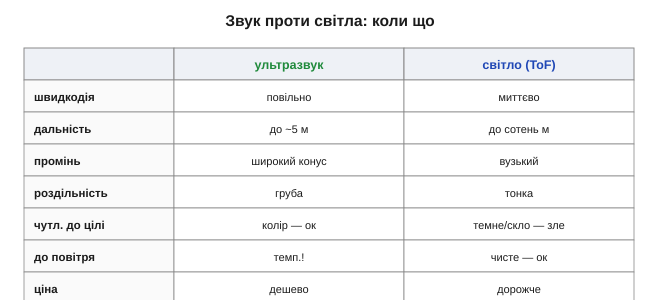
*Рис. 5.2.3.7. Звук проти світла. Ультразвук — дешевий, широкий, прощає колір, але повільний, короткий і боїться м'якого та температури повітря. Світло — точне, вузьке, далеке, швидке й байдуже до повітря, але дорожче, чутливе до поверхні й засвітки. Це не суперники, а взаємодоповнення.*

Грубий поділ праці: **ультразвук** — дешево й надійно намацати близьку широку перешкоду будь-якого кольору; **світло** — точно й далеко зміряти відстань до конкретної цілі чи побудувати карту, якщо ціль світла й сонце не б'є в лоб. Серйозний апарат часто несе обидва — і там, де сліпне один, бачить інший.

Корисно тримати в голові й **за чим саме** вони доповнюються. Світло перемагає в **точності, напрямку й дальності** на світлих цілях у чистому повітрі; звук — у **ціні, прощенні кольору й роботі в пилюці** на близьких широких перешкодах. Жоден не покриває всього: чорна тканина невидима для лазера, скло — для світла (зате ультразвук від нього відбивається чудово), туман глушить світло, а м'яке поглинає звук. Тому «бачити надійно» майже завжди означає **поєднати** різні фізики, а не шукати один ідеальний давач, — думка, до якої ми ще не раз повернемось. Обидва, проте, борються з тією самою бідою — **виміром часу**. А наступний спосіб обходить її зовсім: він дістає відстань не з часу, а з **кута**.

---

## 5.2.4 Тріангуляція

Обидва способи часу польоту воювали з годинником: ультразвук мучив температурний дрейф, а світло — пікосекунди. Тріангуляція цю війну **оминає**. Вона дістає відстань не з часу подорожі хвилі, а з **геометрії** — з кута, під яким відбитий промінь повертається до давача. Жодного точного часу, жодної надшвидкої електроніки: усе вирішує проста шкільна теорема про подібні трикутники. За це тріангуляцію й люблять у дешевих короткобійних далекомірах — тих маленьких інфрачервоних «очах», що їх ставлять роботам, щоб не з'їжджали зі столу й не тицялись у стіну. Плата за дешевизну — нелінійний вихід і коротка дальність, і саме ці дві риси визначають, де такий давач доречний.

### Відстань із трикутника, а не з годинника

Ідея напрочуд давня — нею землеміри тисячі років міряли недосяжне, а наші два ока щомиті оцінюють, як далеко чашка на столі. Давач робить те саме в мініатюрі. Він випромінює вузький промінь (зазвичай інфрачервоний); промінь долітає до цілі, відбивається, і **лінза** збирає відбиту пляму на крихітний приймач, **зсунутий убік** від випромінювача на відому відстань — **базу**. Уся суть у тому, що **положення** плями на приймачі залежить від **кута** повернення променя, а кут — від **відстані**: близька ціль відбиває промінь під крутим кутом, і пляма лягає в один край приймача; далека — під пологим, і пляма зсувається в інший. Поміряти, **куди** впала пляма, — і відстань відома, без жодного годинника.

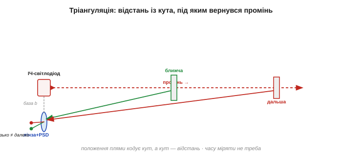
*Рис. 5.2.4.1. Принцип тріангуляції. Промінь від випромінювача відбивається від цілі, і лінза фокусує пляму на приймач, зсунутий на базу b. Близька ціль (зелений промінь) повертається круто й лягає в один край приймача, далека (червоний) — полого, в інший. Положення плями кодує кут, а кут — відстань. Часу міряти не треба.*

Це той самий принцип, яким працює і **стереозір** двох очей, і землемірна зйомка: знаючи довжину бази й вимірявши кут, обчислюють недосяжну сторону трикутника. Стара ідея — а вмістилася в чип завбільшки з квасолину.

Варто на мить оцінити, яка це давня хитрість. Землеміри ще в античності міряли ширину річки, не перепливаючи її: ставали у двох точках відомої бази, брали на ціль два кути — і відстань падала з трикутника. Тим самим прийомом астрономи зміряли відстані до **зір**: за півроку Земля переходить на протилежний бік орбіти (величезна база), і близька зоря трохи зсувається на тлі далеких — цей **паралакс** і дає відстань до неї. Тріангуляційний далекомір — той самий трикутник, тільки база скоротилася з діаметра земної орбіти до двох сантиметрів між світлодіодом і приймачем.

### Геометрія: подібні трикутники

Перетворімо картинку на формулу. Промінь, лінза й приймач утворюють два **подібні** трикутники — великий (давач–ціль) і малий (усередині давача, від лінзи до плями). З їхньої подібності прямо випливає зв'язок відстані d зі зсувом плями x:

```
d = f · b / x

b — база (зсув приймача від випромінювача)
f — відстань від лінзи до приймача
x — зсув плями на приймачі від «нуля»
```

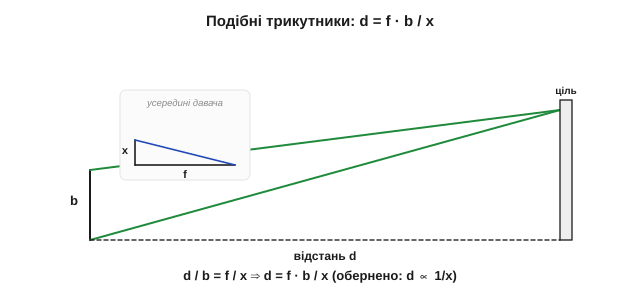
*Рис. 5.2.4.2. Чому d = f·b/x. Великий трикутник (база b, відстань d) подібний до малого всередині давача (фокус f, зсув плями x). З подібності d/b = f/x, звідки d = f·b/x. Відстань **обернено** пропорційна зсуву плями — і це визначає весь характер давача.*

**Приклад (як пляма стає відстанню).** Хай база b = 2 см, фокус f = 4 см. Якщо пляма зсунулась на x = 1 мм, ціль на відстані:

```
d = f · b / x = 40 мм · 20 мм / 1 мм = 800 мм = 0.8 м
```

А якщо ціль ближча й пляма зсунулась удвічі сильніше, x = 2 мм, то d = 40·20/2 = 400 мм = 0.4 м. Видно ключове: **удвічі ближча ціль дала вдвічі більший зсув**. Відстань і зсув плями пов'язані **обернено**, d ∝ 1/x, — і саме звідси ростуть усі сильні й слабкі риси тріангуляції.

Дві умови ховаються у простоті цієї формули. По-перше, «нуль» зсуву x — це не справжній нуль, а положення плями для **нескінченно** далекої цілі (паралельний промінь); від нього й відлічують x, тож точне калібрування цього нуля тут особливо важливе. По-друге, формула чиста, лише поки промінь, база й вісь приймача лежать в одній площині; перекоси складання й аберації лінзи додають свої дрібні поправки, які виробник ховає у заводську калібрувальну криву. Тому навіть «проста» тріангуляція в точному виконанні спирається на ретельне калібрування — геометрія лише задає форму кривої, а числа дає повірка.

### Анатомія інфрачервоного далекоміра

У залізі цей принцип — три скромні деталі. **Випромінювач**: інфрачервоний світлодіод, чиє світло **мерехтить** на відомій частоті, щоб давач упізнавав власний промінь і не плутав його з рівним денним світлом. **Лінза**: збирає відбиту пляму й проєктує її на приймач. **Приймач**: або **позиційно-чутливий** фотоприймач (PSD) — особливий фотодіод, що віддає не «скільки світла», а «**де** саме воно впало» одним аналоговим сигналом, — або лінійка з багатьох фотоелементів, де номер засвіченого й дає положення.

Як PSD дізнається координату плями — гарний трюк. Це довгий фотодіод із двома виводами по краях: світло, що впало ближче до одного краю, дає більший струм у той вивід; **відношення** двох струмів і кодує положення плями — безперервно, без жодних пікселів. А щоб відсіяти денне світло, давач застосовує **синхронне детектування**: світлодіод мерехтить, і приймач зараховує лише ту частину сигналу, що мерехтить **у такт** із ним, ігноруючи рівне сонячне тло. Це той самий хід «модулюй сигнал подалі від нуля частот», яким у §5.1.5 били повільний шум, — тут він б'є засвітку.

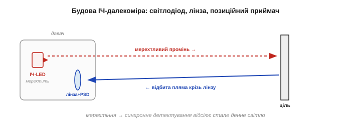
*Рис. 5.2.4.3. Три деталі тріангуляційного давача. Інфрачервоний світлодіод шле мерехтливий промінь; лінза фокусує відбиту пляму на позиційно-чутливий приймач (PSD), який повідомляє координату плями. Мерехтіння дозволяє відсіяти стале денне світло — лише власний блимливий промінь рахується.*

> 🔧 **Навіщо це.** Запам'ятайте, що такий давач віддає **не відстань, а положення плями** (зазвичай як напругу). Перетворити цю напругу на чесні сантиметри — ваша задача, і вона нетривіальна, бо зв'язок різко нелінійний (нижче побачимо чому). Сире число з тріангуляційного давача без калібрування майже нічого не означає — це класичний приклад оберненої задачі з §5.1.1.

### Вихід нелінійний — і коло нуля неоднозначний

Оскільки d ∝ 1/x, передавальна характеристика тріангуляції — це **гіпербола**, а не пряма. Близькі цілі розкидають пляму широко (великий x), далекі тиснуться в крихітний діапазон x під самим «нулем». Тому сирий вихід (напруга з PSD) **різко нелінійний** щодо відстані, і без лінеаризації по таблиці чи кривій (§5.1.4, §5.1.6) користуватися ним не можна.

Але є гірша пастка — **немонотонність коло нуля**. Дуже близька ціль штовхає пляму аж на край приймача (чи й за нього), і характеристика там **повертає назад**: вихідна напруга, що росла з наближенням, починає **падати**. Через це той самий вихід відповідає **двом різним** відстаням — далекій і дуже близькій, — і нижче від певної мінімальної дистанції давач **бреше**, показуючи «далеко» там, де ціль майже впритул.

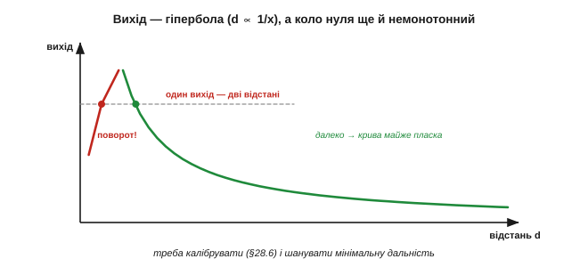
*Рис. 5.2.4.4. Чому тріангуляцію треба калібрувати — і боятися зблизька. Вихід проти відстані — гіпербола (d ∝ 1/x), різко нелінійна. А коло нуля крива **повертає**: одному виходу відповідають дві відстані, тож ближче за мінімум давач плутає «дуже близько» з «далеко».*

> 🔧 **Навіщо це.** Це пряме втілення засторо́ги про монотонність із §5.1.4. Для уникання зіткнень немонотонність **небезпечна**: підкотившись упритул, робот раптом «бачить», що попереду вільно, і врізається. Тому в тріангуляційного давача свято шанують **мінімальну дальність** — ближче за неї його показу вірити не можна — і обов'язково лінеаризують криву калібруванням. Дешевизна тут оплачується дисципліною.

На практиці гіперболу приборкують двома шляхами. Або заносять у мікроконтролер **таблицю** «напруга → відстань», знявши її калібруванням по кількох відомих дистанціях (§5.1.6), і інтерполюють між вузлами. Або користуються тим, що сама величина **1/d** виходить майже **лінійною** за зсувом плями: якщо потрібна не відстань як така, а, скажімо, утримання сталого проміжку до стіни, зручніше керувати прямо по 1/d і зовсім не випрямляти криву. Що обрати — залежить від того, що робити з числом далі; але «взяти напругу як сантиметри» не годиться ніколи — це найперша помилка з таким давачем.

### Роздільність падає з відстанню

Та сама обернена залежність d ∝ 1/x несе ще один наслідок, дзеркальний до часу польоту. Однакові кроки **відстані** вдалині тиснуться у дедалі **менші** кроки **плями**: близька ціль рухає пляму щедро, далека — ледь-ледь. Тож роздільність тріангуляції **гарна зблизька й кепська вдалині** — рівно навпаки до ToF, що тримає роздільність по всьому діапазону.

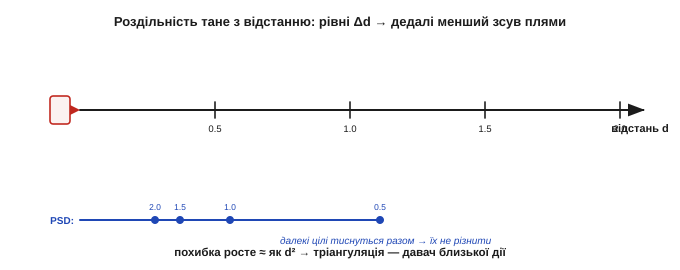
*Рис. 5.2.4.5. Роздільність тане з відстанню. Біля давача рівні кроки Δd зсувають пляму помітно (великі Δx), а далеко — на крихту, що тоне в шумі приймача. Звідси похибка, що росте приблизно як d²: тріангуляція — давач близької дії.*

**Приклад (як похибка росте з квадратом відстані).** Похибку відстані можна оцінити так:

```
Δd ≈ (d² / (f·b)) · Δx
```

Хай Δx (найдрібніший помітний зсув плями) = 0.05 мм, f·b = 800 мм². На 0.4 м (400 мм): Δd ≈ 160000/800 · 0.05 = 10 мм. На 1.5 м (1500 мм): Δd ≈ 2250000/800 · 0.05 ≈ 140 мм. Та сама дрібка зсуву плями обернулася сантиметром зблизька й **чотирнадцятьма** сантиметрами вдалині. Ось чому тріангуляційні далекоміри роблять короткими: за метр-півтора їхня точність уже не варта того.

> 🔧 **Навіщо це.** Підбираючи тріангуляційний давач, дивіться не на «максимальну» дальність, а на те, де ще **прийнятна роздільність**: біля верхньої межі вона вже така груба, що число майже марне. Тримати дистанцію в півметра — чудово; стежити за ціллю на двох метрах — беріть ToF. Тріангуляція — інструмент **близької** руки, і працювати з нею слід у її сильній зоні, а не на краю паспортного діапазону, де паспорт лестить.

### Що вміє і чого ні

Підсумуймо вдачу методу. **Сильні боки**: дешевизна (ні годинника, ні пікосекунд), **швидке оновлення** (пляма видна одразу — не треба, як ультразвуку, чекати повернення відлуння, тож десятки вимірів на секунду даються легко), робота в темряві (давач несе власне світло), і — приємний бонус — менша чутливість до **кольору** цілі, ніж у світлового ToF: тріангуляції досить, щоб пляма була **видна**, а не щоб полічити час кожного фотона, тож темнувата ціль зблизька ще читається. **Слабкі боки**: коротка дальність (десятки сантиметрів — півтора метра), нелінійний і немонотонний вихід, роздільність, що тане вдалині, і та сама залежність від відбиття — дзеркало, прозоре скло чи різко скошена поверхня відведуть пляму вбік або розмиють її, і вимір зірветься. Текстура й нахил цілі теж зсувають пляму, додаючи похибки.

Цю чутливість до поверхні варто пояснити докладніше. Матова (розсіювальна) ціль вертає круглу чітку пляму, яку легко зловити, — найкращий випадок. Блискуча чи дзеркальна відбиває промінь **дзеркально**, і пляма або летить повз приймач (вимір зривається), або стрибає від найменшого нахилу цілі. Скошена поверхня зміщує пляму вбік, удаючи іншу відстань; груба текстура розмиває її, послаблюючи сигнал. До того ж дуже **яскраве сонце** здатне пересилити навіть мерехтливий промінь, засліпивши приймач. Тому тріангуляція найкраще почувається на звичайних матових поверхнях у приміщенні, а не на склі, металі чи воді під сонцем.

### Родичі: стереозір і структуроване світло

Тріангуляція — велика родина, і два її родичі варті згадки. **Стереозір** — це **пасивна** тріангуляція: дві камери дивляться на ту саму сцену, і зсув (паралакс) об'єкта між двома зображеннями дає його відстань — тією ж геометрією трикутника, лише на природному світлі, без власного променя. Так бачать глибину наші очі. **Структуроване світло** — навпаки, активний хитрий варіант: на сцену проєктують відомий візерунок (смуги чи сітку точок), і за тим, **як він спотворюється** на рельєфі, обчислюють глибину кожної точки. Так працюють дешеві камери глибини.

У стереозору є свій компроміс бази, дзеркальний до ІЧ-далекоміра: ширше рознести камери — краще видно далеку глибину, але важче «зіставити», де та сама точка на двох кадрах. А структуроване світло буває різним — від простих смуг, що згинаються на рельєфі, до густої сітки **десятків тисяч інфрачервоних точок**, яку перша масова камера глибини кидала на кімнату й читала викривлення кожної. І стерео, і структуроване світло дають уже не одну відстань, а цілу **карту глибини** сцени — те, чого поодинокий далекомір не вміє, бо бачить лише вздовж однієї лінії.

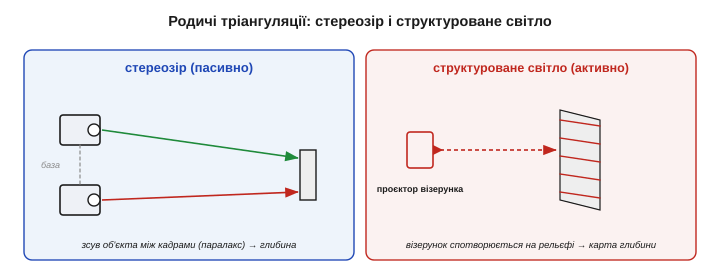
*Рис. 5.2.4.6. Тріангуляція ширша за один давач. Стереозір — дві камери й паралакс на природному світлі (пасивно). Структуроване світло — проєктований візерунок, що спотворюється на рельєфі (активно). В основі обох — той самий трикутник, що й у простого ІЧ-далекоміра.*

До цих двох ми ще повернемось у Модулі про машинне бачення; тут вони важливі тим, що показують: **тріангуляція — не один давач, а ціла стратегія** діставати глибину з геометрії, від квасолини-далекоміра до тривимірних камер.

Поставивши тріангуляцію поряд із часом польоту, бачимо чисте дзеркало двох філософій. ToF питає «**скільки часу** летіла хвиля» — і тому лінійний, тримає роздільність по всьому діапазону, бере далеко, але мусить мати точний годинник і тому дорожчий. Тріангуляція питає «**під яким кутом** вернувся промінь» — і тому безгодинникова, дешева, чудова зблизька, та нелінійна, немонотонна коло нуля й сліпне вдалині. Навіть роздільність у них тане в **протилежні** боки: у тріангуляції вона краща зблизька й гірша далеко, у ToF — рівна скрізь. Тому між ними обирають передусім за **дальністю** й **бюджетом**: до метра й задешево — тріангуляція; далі, точно й рівно — час польоту. Третього способу обходити дотик у далекомірах майже не буває: або час, або кут.

Отже, тріангуляція — дешевий, безгодинниковий спосіб на близьку руку: чудовий, поки ціль недалеко й ви чесно відкалібрували його гіперболу та шануєте мінімальну дальність. ToF тримає лінійність і дальність, але потребує часу; тріангуляція жертвує і тим, і тим заради простоти. Та всі три способи — і обидва ToF, і тріангуляція — стоять на одній мовчазній умові: що хвиля чи промінь **повернеться**. Чи повернеться вона — і скільки її повернеться — вирішує фізика **відбиття й поглинання**, до якої ми переходимо.

---

## 5.2.5 Відбиття й поглинання: IR-перешкода, вплив освітленості

Усі способи попередніх тем мовчки спиралися на одну умову: що зондувальна хвиля чи промінь **повернеться** до давача. Та повертається вона не завжди. Цей підрозділ — про фізику, яка це вирішує: про відбиття, поглинання й пропускання, через які той самий далекомір блискуче бачить стіну й сліпне на склі, котові чи чорній тканині. А заразом — про найпростіший давач усього розділу, інфрачервоний відбивач «є перешкода / нема», і про його заклятого ворога — стороннє світло. Зрозумівши цю тему, ви наперед знатимете, де будь-який далекомір збреше, ще до того, як його ввімкнете.

### Чотири долі зондувального променя

Коли зондувальний промінь (звук чи світло) досягає поверхні, з ним може статися чотири різні речі — і лише одна годує давач. Він може **відбитися назад** (частина енергії вертається до приймача — це й потрібно); **поглинутися** (енергія перетворюється на тепло в матеріалі — назад нічого); **пройти наскрізь** (прозора ціль пропускає промінь далі); або **відбитися вбік** (гладка поверхня під кутом шле промінь геть, повз приймач). Реальна ціль робить усе потроху — питання лише в тому, **скільки** повернулося саме до давача.

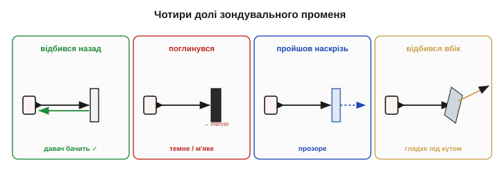
*Рис. 5.2.5.1. Що стається із зондувальним променем. Відбився назад — давач бачить; поглинувся (темне, м'яке) — енергія втрачена; пройшов наскрізь (прозоре) — ціль невидима; відбився вбік (гладке під кутом) — промінь полетів повз приймач. Лише перший випадок дає вимір.*

Уся подальша тема — це розбір, **від чого** залежить, котра з чотирьох доль переважить: від гладкості поверхні, її матеріалу, кольору на потрібній довжині хвилі й кута нахилу.

За цим стоїть проста бухгалтерія енергії: усе, що прилетіло, **дорівнює** сумі відбитого, поглинутого й пропущеного — інших шляхів нема. Та для давача важлива не загальна частка відбитого, а лише та крихта, що вернулася **саме в його приймач**, у його малесенький тілесний кут. Тому навіть добре відбивна, але розсіювальна ціль шле назад лічені відсотки — решта розлітається в інші боки. А далекомір ще й мусить почути цю крихту на тлі шуму, тож «відбилося» й «давач побачив» — далеко не одне й те саме.

### Дзеркальне проти розсіяного відбиття

Найважливіше розрізнення — **як** саме поверхня відбиває. **Дзеркальне** (*specular*) відбиття дає гладка поверхня: промінь відбивається в один бік за правилом «кут падіння дорівнює куту відбивання». Якщо цей бік випадково дивиться назад на давач — буде яскравий зайчик; якщо ціль бодай трохи нахилена — увесь промінь летить **повз**, і давач не бачить нічого. **Розсіяне** (*diffuse*, ламбертове) відбиття дає шорстка матова поверхня: вона розкидає світло **навсібіч**, тож частина **завжди** вертається до давача, під яким би кутом ціль не стояла. Це найдружніший до давачів випадок. Є й третій, особливий — **зворотне** (*retro*) відбиття: спеціальні поверхні (кутові призми, «котяче око», дорожні знаки) вертають промінь точно туди, звідки він прийшов, за будь-якого кута.

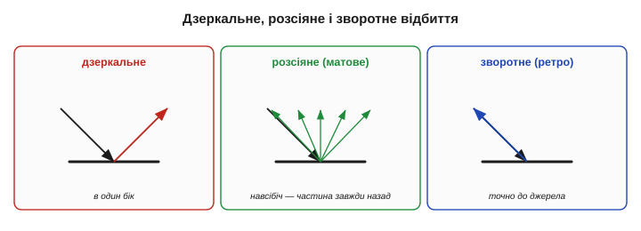
*Рис. 5.2.5.2. Три типи відбиття. Дзеркальне (гладке) — в один бік: або яскравий зайчик, або повний промах. Розсіяне (матове) — навсібіч, тож частина завжди вертається: найкраще для давачів. Зворотне (ретрорефлектор) — точно назад до джерела за будь-якого кута: ідеальна «кооперативна» ціль.*

> 🔧 **Навіщо це.** Давач любить **матові розсіювальні** поверхні й боїться дзеркал та полірованого металу. Гладка похила поверхня — найпідступніша: вона не поглинає й не пропускає, а просто відбиває промінь убік, і давач упевнено рапортує «нічого попереду», хоч стіна за півметра. Якщо ціль під вашим контролем — наклейте ретрорефлектор, і проблема зникне; якщо ні — закладайте, що блискуче й похиле буде невидимим.

Чисте дзеркало й чиста матовість — це крайнощі; реальні поверхні десь **між** ними. Глянсова фарба, лакована деревина, пластик дають і дзеркальний відблиск, і слабке розсіяння водночас: під «правильним» кутом — сліпучий зайчик, трохи повернув — лишається кволий розсіяний відгук. Для розсіяної складової діє правило косинуса: яскравість назад спадає, коли поверхня відхиляється від перпендикуляра до променя. Тому навіть матова стіна, поставлена **дуже косо**, повертає помітно менше, і далекомір бачить її гірше, ніж ту саму стіну в лоб, — а під надто гострим кутом може й зовсім проґавити.

### Поглинання й пропускання: коли ціль «зникає»

Дві інші долі променя роблять ціль **невидимою**. **Поглинання**: темні, чорні поверхні «з'їдають» світло й інфрачервоне, м'які пористі матеріали — звук; енергія йде в тепло, назад вертається крихта або нічого, і дальність падає в рази чи вимір зривається. **Пропускання**: прозора ціль пускає промінь наскрізь — скло для інфрачервоного, тонка плівка для ультразвуку — і давач «дивиться крізь неї», міряючи відстань до чогось **за** нею. Звідси класичні «привиди»: робот в'їжджає у скляні двері, бо для його ІЧ-давача їх просто немає, або проґавлює чорну сумку на підлозі, бо вона поглинула весь промінь.

Прозорі цілі підкидають і хитрішу пастку — **подвійне** відлуння. Тонке скло більшу частину променя пропускає, але дрібку **таки** відбиває від своєї поверхні; виходить слабкий ранній відгук від скла **і** сильніший пізній — від того, що за ним. Далекомір, налаштований брати «перше досить сильне» відлуння, легко вхопить не те: то «бачить» скло, то дивиться крізь нього — залежно від порога й кута. Тому прозорі й напівпрозорі перешкоди не просто невидимі, а ще й **непостійно** видимі, що для керування гірше за чесне «нічого».

### Колір для ока — не колір для давача

І найпідступніше непорозуміння: **відбивність для давача — не те саме, що колір для ока**. Інфрачервоне світло поводиться на матеріалах інакше за видиме, тож річ, **чорна на око**, може чудово відбивати ІЧ (багато чорних пластиків і фарб «світлі» в інфрачервоному), а біла на вигляд — навпаки, ІЧ поглинати. Тому міркування «вона чорна, давач її не побачить» **ненадійне**: судити треба на **тій довжині хвилі**, якою працює давач, а не на око.

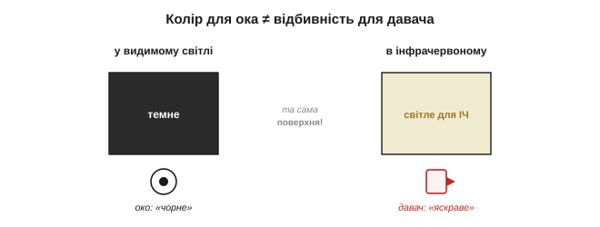
*Рис. 5.2.5.3. Колір ока ≠ відбивність давача. Та сама поверхня, темна у видимому світлі, буває яскравою в інфрачервоному (і навпаки). Тому передбачати, побачить її ІЧ-давач чи ні, можна лише дослідом на робочій довжині хвилі, а не за виглядом.*

Звідси проста, але незамінна порада: перш ніж покладатися на ІЧ-давач із новою ціллю, **перевірте її дослідом** — піднесіть і гляньте на сире число. Багато гірких сюрпризів (чорний матовий пластик, що чудово відбиває ІЧ, або «біла» поверхня, що його глитає) виявляються за секунди такої перевірки — і за години марних здогадів, якщо її пропустити. Камера телефону, до речі, часто бачить ближнє ІЧ як бліде фіолетове світіння, тож нею можна навіть **побачити очима**, чи світить ваш невидимий світлодіод і куди він дивиться.

### Найпростіший давач: інфрачервоний відбивач

З цієї фізики виростає найдешевший давач усього розділу — **ІЧ-відбивач** наявності. Це інфрачервоний світлодіод і фотоприймач **поряд**, дивляться в один бік. Світлодіод світить; якщо попереду близька й відбивна перешкода, частина світла вертається на фотоприймач — і той каже «щось є». Це вимір не відстані, а **наявності/близькості** за **яскравістю** відбитого (той самий грубий принцип яскравості з §5.2.1): чим ближче й світліша ціль, тим сильніший відгук.

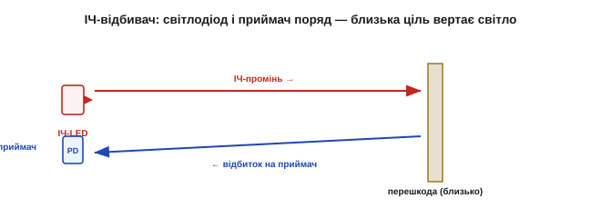
*Рис. 5.2.5.4. Інфрачервоний відбивач наявності. Світлодіод і фотоприймач поряд; близька відбивна перешкода вертає частину світла — давач спрацьовує. Дешево й крихітно, але це «є/нема», а не відстань: яскравість плутає близьке темне з далеким світлим.*

Такий давач копійчаний і всюдисущий — у роботах-лінієводах, давачах краю столу, простих об'їзниках перешкод. Та його корінна вада прямо випливає з яскравості: він **плутає відстань із відбивністю**. Близька чорна перешкода й далека біла стіна можуть дати **однаковий** відгук, тож надійно сказати «як далеко» він не може — лише «щось близько є». Це давач присутності, а не далекомір, і користуватися ним треба саме так.

Виходів у нього два. **Цифровий**: компаратор порівнює відбиток із порогом і дає чисте «є/нема» — зручно для спрацювань (край, лінія). **Аналоговий**: сирий рівень відбитого, який читають АЦП як грубу «близькість» — більший сигнал, ближче. Сама геометрія «світлодіод і приймач поряд» теж обмежує дальність: щоб відбиток потрапив у приймач під боком, ціль має бути **близько** (сантиметри-десятки) — здалеку розсіяний промінь майже не вертається в його вузеньке поле зору. Тому ІЧ-відбивач — інструмент **упритул**, і це не недолік, а його чесна ніша.

### Заклятий ворог: стороннє світло

У всіх оптичних давачів спільний ворог — **стороннє інфрачервоне світло**. Сонце й лампи розжарювання **самі** сиплють ближнім інфрачервоним, заливаючи фотоприймач чужими фотонами: давач «бачить перешкоду» там, де її нема, або взагалі засліплюється. Боротьба з цим — пряме застосування того, що ми вже знаємо про шум (§5.1.5) і синхронне детектування (§5.2.4):

- **Модуляція + синхронне детектування**: світлодіод не світить рівно, а **мерехтить** на відомій частоті; приймач зараховує лише ту частину сигналу, що мерехтить **у такт**, а рівне сонячне тло відкидає.
- **Світлофільтр**: пропускає лише вузьку смугу довжин хвиль навколо світлодіодової, гасячи решту.
- **Віднімання тла**: зміряти приймачем з вимкненим світлодіодом (саме тло), тоді з увімкненим (тло + сигнал) і **відняти** — лишиться чистий сигнал.

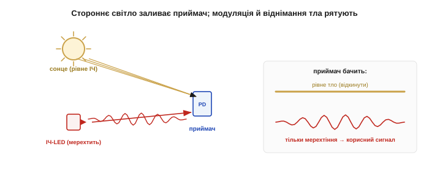
*Рис. 5.2.5.5. Боротьба зі стороннім світлом. Рівне сонячне ІЧ-тло топить корисний сигнал. Мерехтливий світлодіод і синхронний приймач бачать лише власне «блимання»; віднімання виміру з вимкненим світлодіодом прибирає тло остаточно.*

**Приклад (віднімання тла).** Приймач з вимкненим світлодіодом показав 700 (це сонячне тло), а з увімкненим — 760. Чистий корисний сигнал:

```
сигнал = (тло + відбиток) − тло = 760 − 700 = 60
```

Шістдесят одиниць — це і є відбите **власне** світло, очищене від сонця. Без віднімання давач бачив би 760 і вирішив би, що перешкода близько, хоч насправді то світило сонце. Два виміри замість одного — і фантомна перешкода зникає.

> 🔧 **Навіщо це.** Ніколи не вірте сирому ІЧ-давачу за денного світла. Модуляція, фільтр і віднімання тла — не «покращення для точності», а **умова працездатності** надворі: без них перший же сонячний промінь зробить давач некерованим. Це той самий бій із шумом і смугою, що в §5.1.5, тільки шум тут — саме сонце.

Варто оцінити масштаб цього ворога: сонце сипле інфрачервоним так щедро, що його потік на приймачі буває **в рази більший** за власний світлодіод давача. Тому навіть модуляція має межу: якщо тло засвітило приймач **до насичення**, виділяти з нього кволе мерехтіння вже нема з чого — насичений приймач не бачить нічого понад стелю. Звідси й світлофільтр, і козирок-бленда, і вибір довжини хвилі в сонячному «провалі» (§5.2.3): усе, щоб сонця на приймач потрапляло якомога менше **до** того, як почнеться розумне віднімання тла.

### Звук теж відбивається — за акустичним опором

У звуку та сама історія, лише інша фізика. Ультразвук відбивається там, де різко змінюється **акустичний опір** середовища. Тверда щільна поверхня (стіна, метал, скло) має акустичний опір, що сильно відрізняється від повітря, — тож відбиває звук добре. М'яка пориста (поролон, тканина, штори) ближча за опором до повітря й **поглинає** звук, як темне поглинає світло. Тому «м'яка ціль», невидима для ультразвуку (§5.2.2), — це акустичний двійник «чорної цілі», невидимої для світла: різні явища, та сама роль.

Числа акустичного опору пояснюють і дивовижу медичного УЗД. Опір м'яких тканин тіла близький до опору води, тож на межах усередині тіла відбивається лише частка звуку — саме та, що малює зображення органів. Зате межа повітря–тіло — це **величезний** стрибок опору, на якому звук відбивається майже повністю; тому між давачем і шкірою мажуть гель — щоб **прибрати** прошарок повітря, інакше ультразвук просто не зайшов би в тіло. У повітряному далекомірі та сама фізика працює навпаки: він **користається** великим стрибком опору на твердій стіні, щоб дістати сильне відлуння, — і програє там, де опір цілі надто близький до повітряного.

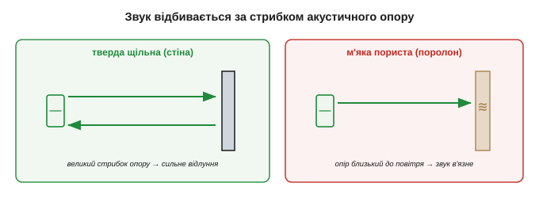
*Рис. 5.2.5.6. Акустичний двійник відбивності. Тверда щільна поверхня різко відрізняється акустичним опором від повітря — добре відбиває звук; м'яка пориста близька до повітря — поглинає його. «М'яке» для звуку — те саме, що «чорне» для світла.*

### Застосування: лінія, край, прірва

Найгарніше те, що з цієї фізики виростають дешеві й надійні **давачі контрасту**. **Лінієвод**: чорна лінія на світлій підлозі **поглинає** ІЧ, а підлога **відбиває**, тож робот тримається лінії, ведучи її за провалом відбиття під відповідним давачем. **Давач краю (прірви)**: ІЧ-відбивач дивиться **вниз**; є підлога — є відбиток, нема підлоги (край столу, сходинка) — **нема відбитку**, і робот спиняється перед прірвою. **Близькість**: є відбиток — щось поряд.

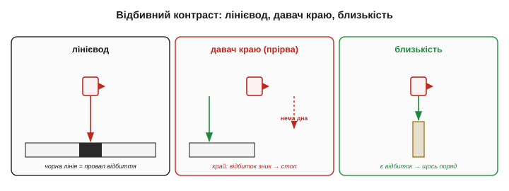
*Рис. 5.2.5.7. Відбивний контраст у ділі. Лінієвод бачить чорну лінію як провал відбиття на світлій підлозі; давач краю — прірву як зникнення відбитку вниз; давач близькості — перешкоду як появу відбитку. Усі троє читають не відстань, а **різницю** у відбивності.*

> 🔧 **Навіщо це.** Ці давачі надійні саме тому, що читають **контраст**, а не абсолют: важлива не точна яскравість, а різниця «лінія проти підлоги» чи «підлога проти прірви». Тому їх легко **відкалібрувати під конкретну поверхню** — заміряти «світле» й «темне» на старті й узяти поріг посередині (пряма тара з §5.1.6). Змінилося покриття — переобнулив, і працює далі.

Той самий відбивний принцип годує ще двох робочих конячок. **Оптичний енкодер** читає чорно-білі (чи прорізані) смуги диска, що крутиться: відбиток то є, то нема — і за частотою імпульсів давач знає швидкість та кут (з §5.1.3). А **лінійка** з кількох ІЧ-відбивачів поперек траси робить лінієвода розумнішим: вона бачить не лише «лінія під мною / нема», а й **куди** лінія зсунулась, дозволяючи плавно тримати курс, а не сіпатись із боку в бік. Дешевий контраст відбиття, помножений на кілька давачів, дає напрочуд багато.

Отже, уся далекометрія стоїть на відбитті: знай відбивність своєї цілі **на робочій довжині хвилі**, бійся дзеркал, скла, чорного й м'якого, а зі стороннім світлом воюй модуляцією. Запам'ятавши лише ці чотири долі променя й кілька винятків, ви наперед передбачите більшість «дивних» провалів далекоміра, ще не вмикаючи його. Тепер, знаючи і способи виміру, і фізику повернення, ми готові скласти повний перелік того, **як саме** показ відстані може збрехати, — від м'яких цілей до температури й багатопроменевості. Цей «бюджет похибок» далекоміра — наступна тема.

---

## 5.2.6 Похибки вимірювання відстані

Дотепер слабкі місця кожного способу ми зустрічали врозкид: тут — м'яка ціль, там — температура, деінде — привид. Час зібрати їх докупи й навести лад, бо саме так інженер і думає про давач: не «чи точний він», а «**як саме** він збреше і що з цим робити». Цей підрозділ — повний [бюджет похибок](book:math/error-budget) далекоміра, складений за тією самою дисципліною, що ми виробили в §5.1.4–5.1.6: класифікуй похибку (систематична, випадкова, грубий викид), а тоді бери відповідний лік (калібрування, фільтр, відсів). Засвоївши цю карту, ви читатимете показ далекоміра не як істину, а як **гіпотезу** з відомою мірою довіри.

### Карта похибок: звідки беруться брехливі числа

Усе різноманіття похибок відстані зводиться до шести родин за **джерелом**. **Ціль** — її відбивність, колір, м'якість, прозорість (§5.2.5). **Геометрія** — кут нахилу цілі, ширина променя, межі дальності. **Середовище** — температура повітря для звуку, туман і пил для світла. **Засвітка й завади** — сонце, чужі ультразвукові пінги, електромагнітні наводки. **Багатопроменевість** — відлуння, що прийшло манівцями. **Електроніка** — роздільність годинника, поріг детектування, нелінійність. Перш ніж лагодити, варто впізнати, з якої з шести родин ваша біда.

Користь такої карти не теоретична: **не можна полагодити те, чого не назвав**. Той самий «стрибок показу» може бути привидом (багатопроменевість), пропуском (м'яка ціль), наводкою (засвітка) чи просто шумом — і кожному з цих чотирьох потрібен **інший** лік. Гірше того, похибки люблять **складатися**: тепла кімната зсуває швидкість звуку, темна ціль додає прогулянку порога, а кут підкидає бічний відблиск — і три дрібні системні зсуви разом дають показ, у якому вже годі впізнати причину. Тому досвідчений діагност іде **по родинах**, відсікаючи їх одну за одною, а не хапається за «загальний фільтр».

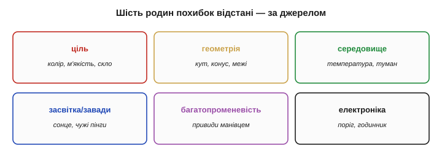
*Рис. 5.2.6.1. Звідки беруться брехливі відстані. Шість джерел: ціль, геометрія, середовище, засвітка/завади, багатопроменевість, електроніка. Кожне дає свій почерк похибки й вимагає свого ліку — тож діагностику завжди починають із питання «з якої це родини».*

### Ціль і кут: найчастіша причина

Найбільше брехні дає не давач, а **ціль** і **кут**, під яким вона стоїть. Фізику цього ми вже розклали в §5.2.5: м'яке й чорне поглинає, гладке й похиле відбиває вбік, прозоре пропускає. До цього додається підступ **геометрії променя**. Ультразвуковий конус відповідає завжди **найближчою** ціллю — тож маленький предмет збоку, що випадково ближче, **затуляє** стіну за ним, і давач рапортує близьку відстань до дрібнички, наче за нею порожньо. А скошена поверхня відводить промінь убік, і давач або не бачить нічого, або ловить слабкий бічний відблиск, читаючи хибну дистанцію.

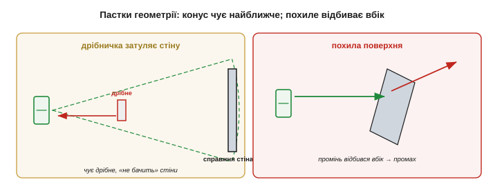
*Рис. 5.2.6.2. Пастки геометрії. Ліворуч: дрібний предмет ближче за стіну затуляє її — конус чує найближче, і давач «не бачить» головної перешкоди. Праворуч: похила поверхня відбиває промінь убік, повз приймач, тож стіна стає невидимою або дає хибне число.*

> 🔧 **Навіщо це.** Коли далекомір «бреше», перша підозра — **не давач, а ціль і кут**. Перевірте: чи не м'яка вона, чи не похила, чи нема дрібнички перед головною перешкодою. Дев'ять із десяти «дивних» показів — це фізика цілі, а не несправність; міняти давач, не розібравшись із ціллю, — марно витрачати гроші.

Два особливі випадки геометрії варто знати окремо. **Внутрішній кут** двох стін (чи кут коробки) діє як ретрорефлектор — вертає звук чи світло дуже сильно, тож давач упевнено «бачить» близьку ціль там, де лише порожній кут. І протилежне — **повний пропуск** (*dropout*): м'яка, кутова чи надто далека ціль не дає **жодного** відлуння, і давач повертає «нічого» або максимум діапазону. Найнебезпечніше тут — витлумачити пропуск як «вільно»: для уникання зіткнень «не бачу» мусить означати «обережно», а не «їдь сміливо». Браку відповіді бійтеся більше, ніж хибної відповіді.

### Багатопроменевість: привиди й фантоми

Окрема й підступна родина — **багатопроменевість** (*multipath*). Промінь не зобов'язаний летіти до цілі й назад прямо: він може відбитися від підлоги, стіни чи кута, пройти **довший** манівець — і повернутися пізніше, ніж летів би навпростець. Давач же міряє **час** (чи фазу), тож довший шлях він тлумачить як **більшу** відстань: виникає **привид** — показ, якому в напрямку променя не відповідає жодна реальна ціль. А внутрішній кут (дві стіни під 90°) працює як ретрорефлектор і дає навпаки **сильний** обманний відгук.


*Рис. 5.2.6.3. Привид від багатопроменевості. Прямий шлях до цілі короткий, але промінь відбився від підлоги й вернувся довшим манівцем; давач, міряючи час, вважає цей довший шлях більшою відстанню — і «бачить» ціль там, де її нема.*

**Приклад (чому привид завжди дальший).** Пряма відстань до цілі — 1.0 м (час відповідає 2.0 м шляху туди-й-назад). Та промінь пішов через підлогу, і його шлях туди-й-назад вийшов 2.6 м. Давач порахує:

```
прямий:  d = 2.0 / 2 = 1.0 м
манівець: d = 2.6 / 2 = 1.3 м   ← привид, дальший за справжню ціль
```

Привид **ніколи не буває ближчим** за справжню ціль — манівець завжди довший за пряму. Це й підказка для відсіву: підозріло **дальші** за очікуване, нестабільні покази в захаращеному просторі — найімовірніше, відлуння манівцем.

Розпізнати привид допомагає **сталість**: справжня ціль дає схожий показ із пінга в пінг, а привид часто **скаче** й залежить від найменшого повороту давача, бо манівець крихкий. Найдужче багатопроменевість лютує в тісних, захаращених, відбивних просторах — коридорах, кутках, металевих цехах, — а на відкритому майданчику її майже нема. Тому ті самі ультразвукові давачі, бездоганні в полі, починають «бачити неіснуюче» в кімнаті з твердими стінами; це не несправність, а **геометрія простору**, і боротися з нею треба не заміною давача, а розумом у коді.

> 🔧 **Навіщо це.** У приміщенні з твердими стінами першими підозрюйте **привиди**, а не несправність. Підказки: показ дальший за очікуване, скаче від руху давача, зникає на відкритому місці. Лік — медіана плюс перевірка на здоровий глузд; а в зовсім відбивному просторі — звузити промінь або додати давач іншої фізики. Проти геометрії кімнати один ультразвук безсилий.

### Поріг і слабке відлуння: «прогулянка» нуля

Є й тонша, суто електронна похибка, що нишком чіпляє навіть час польоту. Момент приходу відлуння давач засікає, коли його **обвідна** перетинає **поріг**. Але слабке відлуння (від далекої, темної чи м'якої цілі) наростає **повільніше** за сильне — і перетинає той самий поріг **пізніше**. Тож слабша ціль читається систематично **дальшою**, ніж є, хоч відстань до неї та сама. Це зветься **«прогулянкою» порога** (*timing walk*), і через неї **яскравість** відбитого підмішується у вимір **відстані** — саме там, де ми гадали, що час геометрично чистий.

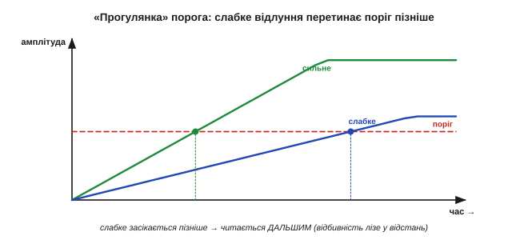
*Рис. 5.2.6.4. «Прогулянка» порога. Сильне й слабке відлуння приходять одночасно, але слабке наростає повільніше й перетинає поріг пізніше — давач засікає його як дальше. Так відбивність цілі прокрадається в показ відстані; лікують це компенсацією за амплітудою.*

Лікують це хитрішим детектуванням (за сталою часткою амплітуди, а не за фіксованим порогом) або поправкою на виміряну силу сигналу. Для нас головне — знати, що навіть «геометрично чистий» ToF трохи залежить від того, **як яскраво** ціль відбила: ще одна причина не довіряти сирому числу беззастережно.

Масштаб цієї похибки — від міліметрів до кількох сантиметрів, залежно від того, наскільки кволе відлуння, — і вона **системна**: темна ціль завжди читається трохи дальшою, а світла — точніше. Підступ у тому, що вона **сплітає** дві начебто незалежні величини: помилившись щодо кольору цілі, ви помилитесь і щодо її відстані. Саме тому точні лазерні далекоміри окремо міряють силу відлуння й вносять за нею поправку, перетворюючи прикру залежність на ще один **відомий і скомпенсований** доданок бюджету похибки — бо все систематичне, що ви здатні виміряти, ви здатні й відняти (§5.1.6).

### Середовище й засвітка — коротко

Решту дві родини ми вже знаємо в обличчя. **Середовище**: швидкість звуку пливе з температурою повітря (§5.2.2), а світло сліпне в тумані, пилу й димі (§5.2.3). **Засвітка й завади**: сонце топить оптичні давачі (§5.2.5), чужі ультразвукові пінги дають перехресні цілі (§5.2.2), а сильні електромагнітні поля наводять шум на тонкі сигнали (§5.1.5/§5.1.7). Усі вони системні або зовнішні, і лік до них той самий, що в названих темах: компенсувати відоме, екранувати й модулювати — проти стороннього.

До цих шести родин варто додати сьому, про яку легко забути, — **запізнення**. Будь-який показ відстані стосується **минулого**: давачу потрібен час на пінг і відлуння, фільтру — на згладжування, шині — на передачу. Поки число дійде до керування, апарат уже зрушив, а ціль, може, теж. Для нерухомого виміру це байдуже, а для робота, що мчить, «правдива, але застаріла» відстань не менш небезпечна за хибну: він гальмує перед тим місцем, де перешкода **була**, а не де вона є. Тому в динаміці важить не лише точність числа, а й його **свіжість** (згадайте час відгуку з §5.1.4), і повільний, хоч і точний, далекомір здатен підвести саме на швидкості.

### Систематичне, випадкове, грубий викид

Тепер головне — **класифікувати**, бо від класу залежить лік. Усі похибки відстані лягають у три кошики з §5.1.4–5.1.5. **Систематичні** (повторювані): температурний зсув швидкості звуку, «прогулянка» порога, нелінійність тріангуляції — їх **калібрують і компенсують**. **Випадкові** (тремтіння): шум приймача, дрібні коливання показу — їх **усереднюють чи фільтрують**. І окремо — **грубі викиди**: привиди, пропуск м'якої цілі, поодинокі дикі стрибки — їх не згладжують, а **відсівають**.


*Рис. 5.2.6.5. Класифікуй, тоді лікуй. Систематичне (зсув, прогулянка, нелінійність) — калібрування й компенсація. Випадкове (шум) — усереднення й фільтр. Грубий викид (привид, пропуск) — відсів. Сплутати клас — лікувати не те: усереднити привид означає лише розмазати брехню.*

> 🔧 **Навіщо це.** Це той самий урок §5.1.5, перенесений на відстань: спершу **назви** клас похибки, тоді бери інструмент. Усереднити показ із привидами — отримати точно виміряну неправду; калібрувати шумний — гнатися за тінню. Найгрубіша помилка — лити всі похибки в один «фільтр» і сподіватися на диво.

Розгляньмо, як це б'є на практиці. Хай далекомір зрідка кидає привид — стрибок на метр раз на двадцять вимірів. Якщо лікувати це **усередненням**, кожен привид підтягне середнє на п'ять сантиметрів убік і **розмаже** брехню на сусідні чесні покази — стало гірше, ніж було. А **медіана** того самого ряду викине привид зовсім, бо одне дике значення серед багатьох не зрушить середини. Той самий потік даних, два інструменти — і протилежний результат: ось чому назвати клас похибки важливіше, ніж шукати «найкращий» фільтр узагалі.

### Скриня ліків: медіана, розумні межі, фьюжн, довіра

Звідси випливає набір прийомів, що роблять далекомір надійним. Найкорисніший проти викидів — **медіанний фільтр**: він викидає поодинокі дикі значення, не розмазуючи їх по сусідах, як зробило б усереднення (докладно — у [§5.4.3](../digital-filtering/digital-filtering.md)). Далі — **розумні межі** (перевірка на здоровий глузд): відкидати фізично неможливі стрибки — якщо ціль «перестрибнула» на три метри за десять мілісекунд, це не ціль телепортувалася, а давач збрехав. Третє — **довіра за силою сигналу**: багато давачів повідомляють, наскільки сильним було відлуння; кволий сигнал — низька довіра, і такий показ або ігнорують, або позначають як ненадійний. І нарешті — **фьюжн**: поєднати кілька давачів різної фізики (ультразвук + оптика), щоб сліпе місце одного прикрив інший (до цього дійдемо в §5.7–5.8).

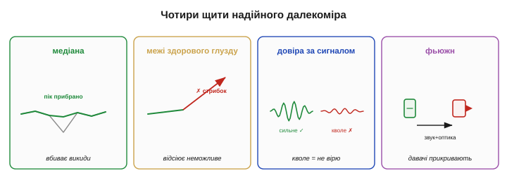
*Рис. 5.2.6.6. Чотири щити надійного далекоміра. Медіана вбиває поодинокі викиди; перевірка на здоровий глузд відсіює неможливі стрибки; оцінка сили сигналу дає довіру до кожного показу; фьюжн різних давачів прикриває сліпі плями. Разом вони з ненадійного потоку роблять надійне знання.*

**Приклад (перевірка на здоровий глузд).** Робот, що їде 1 м/с, читає відстань кожні 20 мс. Між двома сусідніми показами ціль фізично не може зсунутися більше, ніж на:

```
Δd_макс = швидкість · крок_часу = 1 м/с · 0.02 с = 0.02 м = 2 см
```

Тож стрибок показу на 50 см за один крок — точно **викид** (привид чи пропуск), а не реальний рух: його сміливо відкидають і беруть попереднє значення. Проста межа, виведена з фізики руху, ловить більшість грубих брехень ще до будь-якого фільтра.

Кожен із чотирьох щитів має тонкощі. У **медіани** добирають довжину вікна: коротке (3–5 відліків) вбиває поодинокі викиди майже без затримки, довше — давить і пачки, але робить давач млявішим. **Перевірку на здоровий глузд** можна підсилити справжньою **моделлю руху**: знаючи, куди й як швидко апарат рухається, передбачаєш очікувану відстань і відкидаєш усе, що від неї надто далеко (це вже сусідить із фільтром Калмана з §5.8). А **фьюжн** найкраще робити **зважено за довірою** — давати кожному давачу голос пропорційно до сили його сигналу: тоді той, що зараз сліпне, сам стишується, а певніший бере гору. Так чотири прості прийоми складаються в напрочуд стійкий до брехні тракт.

### Зведення: похибка → причина → лік


*Рис. 5.2.6.7. Підсумок розділу в одній таблиці: типова похибка відстані, її фізична причина й чим її бити. Це робоча шпаргалка для діагностики далекоміра в полі.*

Глибша думка під усім цим — та сама, що пронизує Розділ 5.1: **одинокий показ далекоміра — це гіпотеза, а не факт**. Він каже «найімовірніше, ціль отам», і ймовірність ця залежить від цілі, кута, середовища й щастя з багатопроменевістю. Перетворити потік таких гіпотез на надійне знання про світ — і є справжня робота сенсорики, а не просто «зчитати число з ніжки».

У строгих системах цю думку доводять до кінця: давачу приписують **модель** — не саме лиш число, а й оцінку, наскільки йому зараз можна вірити (ширшу за невизначеністю, коли сигнал кволий чи геометрія погана). Тоді кожен показ входить у рішення апарата зі своєю **вагою**, і система природно більше слухає того давача, хто зараз бачить ясно, і менше — засліпленого. Це прямий місток до оцінювання стану й сенсорного фьюжну, якими завершиться весь модуль; тут досить запам'ятати, що зріла робота з далекоміром починається не з довіри до числа, а з чесної оцінки **міри** цієї довіри.

Надійна далекометрія тримається не на ідеальному давачі (його не буває), а на тому, що ви **знаєте його режими відмови** й заздалегідь від них захистились. Відстань — лише одна з величин оточення, яку треба чути апарату. Розділ завершимо коротким оглядом інших звичних давачів довкілля — руху, температури й вологості, газу, — кожен зі своєю фізикою й своїми пастками.

---

## 5.2.7 Інші давачі оточення: рух, температура/вологість, газ

Відстань — найважча, але не єдина величина оточення, яку апарат хоче чути. Часто треба ще знати: чи є поряд **жива істота** (рух), яка **температура** й **вологість**, чи нема в повітрі небезпечного **газу**. Цей завершальний підрозділ — побіжний огляд таких давачів. Мета не в тому, щоб розписати кожен (на це є цілі книжки), а показати головне: усі вони **вкладаються в ту саму рамку** Розділу 5.1. Кожен — перетворювач певного класу, з характеристиками, дрейфом, потребою калібрування й нормування. Пройшовши Розділ 5.1, ви вже маєте інструмент, щоб зрозуміти будь-який із них; цей підрозділ лише показує цей інструмент у дії на кількох нових прикладах.

Чому варто оглянути їх разом, а не вчити кожен окремо? Бо інакше сенсорика здається нескінченним списком незв'язаних деталей, кожна зі своїм даташитом і своїми примхами. Насправді за цим списком стоїть жменя повторюваних ідей: перетворення певного класу, характеристика з §5.1.4, неминучий дрейф, потреба калібрування й чистого тракту. Побачивши, як ці самі ідеї проступають у геть різних давачах — теплового руху, вологи, газу, — ви перестаєте боятися незнайомого давача й починаєте впізнавати в ньому **старого знайомого в новому корпусі**.

### Рух без дотику: пасивний інфрачервоний (PIR)

Найпоширеніший давач присутності — **PIR** (*Passive InfraRed*, пасивний інфрачервоний). Кожне тепле тіло **само випромінює** інфрачервоне; PIR це випромінювання **слухає**. Слово «пасивний» тут ключове: на відміну від активного ІЧ-далекоміра (§5.2.5), який сам світить і ловить відбиток, PIR нічого не випромінює — лише сприймає чуже тепло.

Серце давача — **піроелектричний** елемент. І ось гарний місток: піроелектрика — це теплова рідня п'єзоелектрики з §5.1.3. Як п'єзо дає заряд від **зміни напруження**, так піро дає заряд від **зміни температури**. А отже, він **самогенерувальний** і, що важливіше, **відповідає лише на зміну**: рівний потік тепла він «забуває», як п'єзо забуває сталий натиск. Над елементом ставлять **лінзу Френеля**, що ділить поле зору на багато вузьких **зон**. Коли тепле тіло рухається, воно по черзі вмикає то одну зону, то іншу — елемент то нагрівається, то холоне, і дає змінний сигнал. Нерухоме тіло освітлює зону **рівно** — і сигнал згасає.

Кілька деталей роблять PIR практичним. Усередині не один, а **два** піроелементи, ввімкнені **назустріч**: рівномірна зміна (потеплішало в кімнаті, сонце зайшло за хмару) діє на обидва однаково й **скорочується**, а рух тіла повз них дає різницю — той самий диференційний хід, що в мості §5.1.2, лише проти теплового дрейфу. Лінза Френеля задає **візерунок** зон і дальність — звичайно кілька метрів конусом; помінявши лінзу, міняють і форму поля зору. Назовні модуль віддає вже готовий **цифровий** імпульс «є рух» із настроюваними чутливістю й часом утримання, а не сирий заряд, — усю тонку аналогову кухню він ховає всередині, як «розумний» давач із §5.1.3. І, як усі піроелектричні, він потребує **прогріву** після ввімкнення — десятків секунд, а то й хвилини, — поки власні теплові перехідні процеси не вщухнуть (у цей час можливі хибні спрацювання).

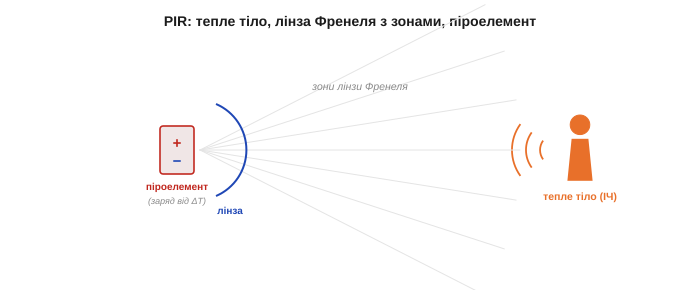
*Рис. 5.2.7.1. Як працює PIR. Тепле тіло випромінює ІЧ; лінза Френеля ділить поле зору на смуги-зони. Рухаючись, тіло перетинає зони, поперемінно нагріваючи піроелемент, — і той дає змінний сигнал. Піроелемент — теплова рідня п'єзо (§5.1.3): заряд від зміни температури.*

Звідси найважливіша риса PIR: він бачить **рух** теплого тіла, а не його **присутність**. Людина, що завмерла, для PIR поступово **зникає** — заряд стікає, як у п'єзо, і давач «забуває» нерухоме тепло.

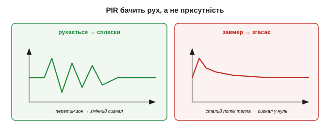
*Рис. 5.2.7.2. PIR — давач зміни. Тіло, що рухається, дає сплески сигналу (перетин зон); тіло, що завмерло, поступово згасає до нуля, бо піроелемент відповідає лише на зміну теплового потоку — точно як п'єзо лише на зміну сили. «Стою нерухомо» = «зник для PIR».*

> 🔧 **Навіщо це.** PIR відповідає на питання «чи **ворухнулося** щось тепле?», а не «чи є тут хтось?». Тому світло від PIR гасне, коли ви сидите тихо, — давач вас «загубив». Для присутності нерухомої людини потрібна інша фізика (наприклад, активний давач). Хибно спрацьовує PIR і від сонця у вікні, гарячої батареї, кота — усього теплого, що рухається чи мерехтить.

Більшість хибних спрацювань PIR прибирається **розташуванням**: не направляти на вікна, батареї, кватирки й шляхи протягів, де ворушиться тепле повітря, не ставити проти прямого сонця. Допомагають козирок проти бічної засвітки, довший **час утримання** (щоб поодинокий сплеск не вважався подією) і вимога **кількох** спрацювань поспіль — та сама боротьба з викидами, що в §5.2.6, лише для теплового давача.

Коли ж потрібна саме **присутність**, а не рух, PIR доповнюють іншою фізикою: мікрохвильовий давач сам опромінює простір (активний, бачить крізь тонкі перешкоди) — прості доплерівські модулі реагують лише на рух, а сучасні FMCW-радари помічають і завмерлу людину за мікрорухами дихання; ультразвуковий чи оптичний — як у попередніх темах; а камера з обробкою — найгнучкіше, але найдорожче. Часто ставлять **пару** (PIR + мікрохвильовий) і вважають людину присутньою, лише коли спрацювали обидва, — менше хибних тривог. Це знов той самий фьюжн різних фізик, що рятував нас із далекоміром.

### Температура й вологість

Температурні давачі ми вже знаємо в обличчя — термопара, терморезистор, напівпровідниковий IC (Розділ 5.1). Як давач **оточення** найчастіше беруть саме інтегральний: дешевий, лінійний, віддає готову цифру.

Дрібниця, але важлива: «температура оточення» й «температура давача» — не одне й те саме. Будь-який давач міряє **власну** температуру й лише сподівається, що вона дорівнює навколишній; а власне тепло сусідніх мікросхем, сонце на корпусі чи теплий потік від плати легко зсувають її на градуси. Тому точний вимір температури повітря — це не «поставив давач», а подбати, щоб він був у **тепловій рівновазі** саме з повітрям: на продуві, подалі від гарячого, з часом на усталення (згадайте час відгуку §5.1.4). Навіть найпростіший на вигляд давач має свою дисципліну розташування.

**Вологість** же часто міряють **ємнісно** — і це знов §5.1.2. Між обкладками крихітного конденсатора кладуть полімер, що **вбирає водяну пару**; вода має велику діелектричну проникність, тож що вологіше, то більша ємність. Міряють так **відносну вологість** (RH) — відсоток від максимально можливого за цієї температури. А оскільки «максимально можливе» залежить від температури, давачі вологості майже завжди йдуть **у парі** з термометром, і чип рахує RH, знаючи обидві величини.


*Рис. 5.2.7.3. Ємнісний давач вологості. Полімер між обкладками вбирає водяну пару; вода (велика ε) піднімає ємність — більша вологість, більша C. Це пряме застосування ємнісного принципу §5.1.2, лише «ручку» ε крутить волога повітря.*

**Приклад (чому вологість міряють разом із температурою).** У повітрі з певною кількістю водяної пари відносна вологість залежить від температури: тепле повітря «вміщає» більше пари, тож та сама абсолютна волога дає нижчу RH у теплі й вищу в холоді.

```
та сама абсолютна волога:
   при 30 °C → RH ≈ 26 %   (тепле вміщає багато — далеко до межі)
   при 10 °C → RH ≈ 90 %   (холодне майже насичене тією ж вологою)
```

Тому показ «вологість 60 %» без температури неповний — і саме тому ці дві величини нерозлучні в одному корпусі. Ємнісний давач ще й **повільний** (парі треба продифундувати в полімер) і помітно **дрейфує**, тож потребує періодичного калібрування (§5.1.6).

Варто розрізняти три «вологості». **Абсолютна** — скільки води в кубометрі повітря; **відносна** (RH) — відсоток від насичення за цієї температури; **точка роси** — температура, до якої треба охолодити повітря, щоб волога почала конденсуватись. Давач міряє RH, а решту чип рахує, знаючи температуру. Звідси й підступ монтажу: якщо давач вологості сам трохи гріється (від сусідніх мікросхем чи власної електроніки), він **занижує** RH, бо «бачить» тепліше за реальне повітря, — тому його ставлять подалі від джерел тепла й на продув, інакше похибка вбудована в саме розташування, як і в термометра.

### Газові давачі: три різні фізики

Газ — найважче, бо тут ми ловимо **молекули**. Поширені три зовсім різні підходи. **Метал-оксидний** (MOX): тонка плівка оксиду металу, **підігріта** нагрівачем; коли молекули газу осідають на ній, її **опір змінюється** — це підігрітий хеморезистор (§5.1.2). Дешевий, чутливий, але неселективний, дрейфує й їсть енергію на нагрів. **Електрохімічний**: крихітний паливний елемент, де газ вступає в реакцію й дає **струм**, пропорційний концентрації; селективніший і малоспоживний, та з часом виснажується. **NDIR** (недисперсійний інфрачервоний): потрібний газ **поглинає** свою характерну довжину хвилі ІЧ — просвічуємо пробу інфрачервоним і міряємо поглинання (пряма рідня фізики §5.2.5!); селективний і стабільний, тому ним міряють, наприклад, CO₂.

Кожна фізика має свою плату. Метал-оксидному потрібен **нагрівач** — і не лише енергія на нього: плівка виходить на робочу чутливість аж після прогріву (від хвилин до годин після тривалого простою), а її «нуль» повільно **повзе** з тижнями, тож баланс час від часу переобнуляють на свіжому повітрі. Виробники навіть радять «**вистарити**» (*burn-in*) такий давач кілька діб перед точними вимірами — рівно як вистарюють давачі проти раннього дрейфу (§5.1.5). Електрохімічний натомість майже не їсть енергії й добре селективний, але має **термін життя**: реагенти виснажуються за роки, і він тихо «вмирає», далі показуючи правдоподібні, але хибні числа. NDIR — найстабільніший і найселективніший (поглинання строго на «своїй» хвилі важко сплутати), та й найдорожчий, бо в ньому ціла мініатюрна оптика. Тому вибір газового давача — завжди торг між **ціною, селективністю, споживанням і довговічністю**, і «найкращого» серед них немає.

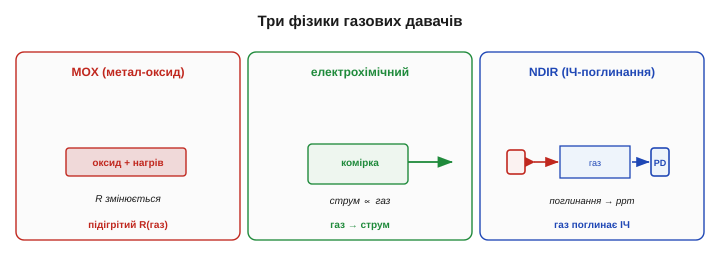
*Рис. 5.2.7.4. Три способи відчути газ. MOX — підігрітий оксид змінює опір від адсорбції (резистивний, §5.1.2). Електрохімічний — газ дає струм у мініатюрному паливному елементі (самогенерувальний). NDIR — газ поглинає свою смугу ІЧ, і ми міряємо поглинання (оптичний, рідня §5.2.5). Різні класи — та сама рамка §5.1.*

### Підступ газових давачів: вибірковість

Найбільша біда дешевих газових давачів — **вибірковість** (*selectivity*). Метал-оксидний відгукується на **багато** газів одразу, тож не каже, **який саме** перед ним: «давач чадного газу» може так само реагувати на спирт, водень чи пару від готування — це **перехресна чутливість**, через яку трапляються фальшиві тривоги. Додайте сюди довгий **прогрів**, повзучий **нуль** (баланс треба час від часу переобнуляти на чистому повітрі) і вплив температури з вологістю — і стає ясно, чому дешевий газовий давач радше «нюхач», ніж вимірювач.

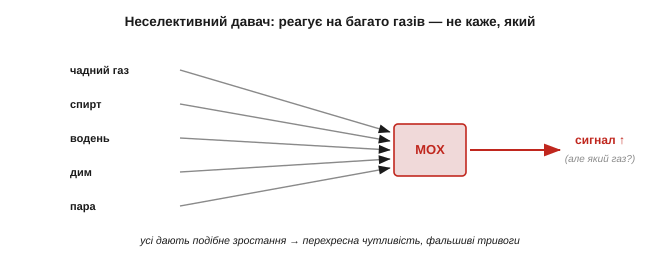
*Рис. 5.2.7.5. Чому дешевий газовий давач — «нюхач». Метал-оксидний реагує на цілий букет газів подібним зростанням сигналу, тож відрізнити чадний газ від спирту чи диму він не може. Для справжнього «скільки чого» потрібні селективні (електрохімічний, NDIR) і калібрування.*

> 🔧 **Навіщо це.** Дешевий газовий давач чесно каже лише «у повітрі **щось змінилося**», а не «стільки-то ppm газу X». Для сигналізації «щось не так — провітри» цього досить; для виміру конкретного газу беріть селективний тип і калібруйте його по відомій суміші. Сплутати «нюхач» із «газоаналізатором» — небезпечна для безпеки помилка.

Парадоксально, але з неселективності можна зробити **силу**. Якщо взяти **кілька** різних неселективних давачів, кожен по-своєму реагує на ту саму суміш — і за **візерунком** їхніх відгуків розумний алгоритм здатен упізнати, який саме газ (чи запах) перед ним. Це «**електронний ніс**»: жоден давач сам не вибірковий, та гурт із них плюс розпізнавання образів дає те, чого поодинці не вийде. Ту саму ідею — багато грубих давачів плюс розумне об'єднання — ми вже бачили у фьюжні §5.2.6 і ще зустрінемо в темах про оцінювання стану.

### Усе вкладається в одну рамку

І головний підсумок не лише підрозділу, а й усього погляду на давачі. Кожен щойно названий давач — це **перетворювач певного класу** з §5.1: піроелектричний (самогенерувальний), ємнісний (вологість), резистивний (MOX), оптично-поглинальний (NDIR), електрохімічний (струмовий). А отже, до кожного застосовні ті самі питання: яка в нього **передавальна характеристика** й чутливість (§5.1.4), як він **дрейфує** й шумить (§5.1.5), як його **калібрувати** (§5.1.6) і як грамотно **під'єднати** (§5.1.7).

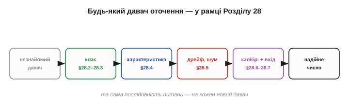
*Рис. 5.2.7.6. Одна рамка на всіх. Який би незнайомий давач не трапився — рух, волога, газ, тиск, — його розкладають за тими самими питаннями Розділу 5.1: клас перетворювача → характеристика → дрейф і шум → калібрування → узгодження з входом. Нової теорії на кожен давач не треба.*

Поза цим оглядом лишилося ще чимало давачів оточення, та всі вони лягають у ту саму рамку. **Барометр** міряє тиск повітря мікромеханічною мембраною — і ним же оцінюють висоту (до цього дійдемо в розділах про MEMS і польотні давачі). **Давач світла** ми вже знаємо — фоторезистор чи фотодіод (§5.1.2–5.1.3). Дощ, дим, наближення руки, нахил, магнітне поле — усе це знов резистивні, ємнісні, оптичні чи напівпровідникові перетворювачі під новою назвою. Жоден не вимагає окремої теорії.

Помітна й спільна тенденція: майже всі ці давачі сьогодні продають **готовими цифровими модулями**, що віддають уже відкаліброване число — градуси, відсотки RH, ppm — однією цифровою лінією. Виробник сховав усередину і чутливий елемент, і підсилювач, і АЦП, і заводське калібрування, — рівно ту «розумну» інтеграцію з §5.1.3. Це звільняє від аналогової метушні, та не звільняє від **розуміння**: дрейф, час відгуку, перехресні чутливості й хибні спрацювання нікуди не діваються — просто тепер вони сховані за чистим числом, і знати про них треба так само, щоб не повірити йому сліпо.

> 🔧 **Навіщо це.** Зустрівши незнайомий давач, не лякайтеся — **класифікуйте** його (§5.1.2–5.1.3), знайдіть його передавальну характеристику (§5.1.4), очікуйте його дрейф (§5.1.5), сплануйте калібрування та передній край (§5.1.6–5.1.7). Уся фізика давачів — це не сотня окремих рецептів, а **одна** рамка, у яку лягає кожен новий давач. У цьому й сила Розділу 5.1: він навчив не давачів, а **способу думати** про будь-який із них.

Так Розділ 5.2 перетворив абстрактний інструментарій Розділу 5.1 на конкретні прилади: відстань — відлунням і кутом, присутність — рухом тепла, а ще теплоту, вологу й вміст повітря. Кожен — перетворювач із чесними межами, прочитаний за дисципліною Розділу 5.1. Та всі вони, від далекоміра до газового нюхача, видають сигнал **зашумлений** і **тремтливий**. Зробити з цього брудного потоку чисте, придатне для рішень число — окреме мистецтво, і саме до нього, до **цифрової фільтрації**, ми переходимо.

> ▶️ Далі: [Розділ 5.4 — Цифрова фільтрація сигналів](../digital-filtering/digital-filtering.md)
