# Розділ 5.7 — Інерціальні давачі: MEMS

Попередні розділи навчили нас **чистити** сигнал давача (фільтри, спектр). Тепер — про самі давачі особливого, надзвичайно важливого класу: **інерціальні**, що відчувають **рух** — прискорення й обертання, — а з ними й магнітні, що відчувають напрямок. Майже всі вони сьогодні зроблені як **MEMS** — крихітні машини в кремнії (історія розділу розповіла, як подушка безпеки зробила їх копійчаними; магнітометр, як побачимо, — виняток без рухомої механіки). Спершу розберемо саму технологію: що таке MEMS і як механізм розміром із порошинку взагалі працює (§5.7.1). Тоді — три головні давачі: акселерометр, що міряє прискорення (§5.7.2), гіроскоп — обертання (§5.7.3) і магнітометр — сторони світу (§5.7.4). Далі — чому кожен із них **сам по собі недосконалий**: шум, зсув нуля, дрейф (§5.7.5). І нарешті — головний висновок, що веде в наступний розділ: чому ці давачі мусять працювати **гуртом**, доповнюючи вади одне одного (§5.7.6).

> 📜 **Перед матеріалом — історія:** [як подушка безпеки зробила акселерометр копійчаним](hist-mems-airbag.md). Вона показує, звідки взялися дешеві давачі руху у вашому проєкті, чому в них автомобільна надійність за іграшкову ціну й чому «винайти» технологію — ще не означає зробити її масовою.

---

## 5.7.1 MEMS: машини розміром із порошинку

Історія розповіла, **чому** MEMS-давачі всюди; тепер розберемо, **що** вони таке й **як** працюють. Адже всередині того копійчаного чипа справді захована **машина** — підвішений вантажик, пружинки, рухомі гребінці, — тільки розміром із порошинку, виточена в кремнії тими самими методами, що й мікросхеми. Зрозуміти цю крихітну механіку критично важливо: саме з неї випливає **все** подальше — і як давач міряє рух (§5.7.2–5.7.4), і чому він шумить та дрейфує (§5.7.5). Ця тема — фундамент усього розділу: знайомство з MEMS як із реальним, хай і мікроскопічним, механізмом.

### Машина розміром із порошинку

Перше, що треба усвідомити: MEMS — це **справжня механіка**, лише неймовірно маленька. Її деталі — балки, пружини, вантажі — мають розміри в **мікрометри**, тобто тисячні частки міліметра. Рухомий шар акселерометра в десятки разів тонший за **людську волосину**, а вся структура — менша за макове зернятко.

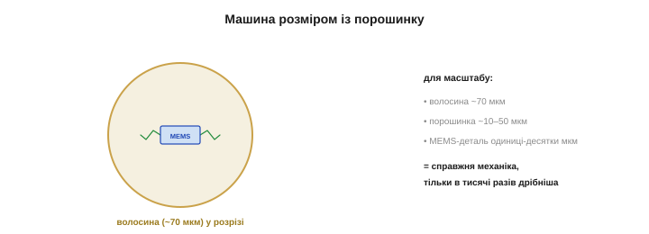
*Рис. 5.7.1.1. Наскільки воно мале. Рухомі деталі MEMS-давача — мікрометрового масштабу: товщина рухомого шару — лічені мікрометри, у десятки разів тонша за людську волосину (~70 мкм), а вся структура — менша за макове зернятко. Це не метафора «маленький», а буквальна машина — з вантажем, пружинами й рухомими частинами, — тільки в тисячі разів дрібніша за все, що ви звикли бачити механічним.*

Ця крихітність — не лише дивина, а й джерело і сили, і слабкості MEMS. **Сила**: таку машину можна штампувати мільйонами на одній пластині, тож вона копійчана. **Слабкість**: що менша деталь, то слабші сигнали вона дає й то сильніше їх псує тепловий шум — звідси й вічна боротьба MEMS-давачів із шумом (§5.7.5). Маленьке — дешево, але й тихо.

Варто на мить спинитися на самій можливості такої механіки. Те, що ми вміємо виточувати рухомі деталі в мікрометри завбільшки, — побічний дар напівпровідникової революції: та сама фотолітографія, що малює мільярди транзисторів із нанометровою точністю, легко вирізає й механічні балки в кремнії. MEMS, по суті, **позичив** усю інфраструктуру виробництва мікросхем — і саме тому народився дешевим і точним, не потребуючи будувати власну індустрію з нуля.

А чому саме мала маса означає шум? Бо на крихітний вантаж тиснуть не лише корисні сили, а й безладні удари молекул газу довкола — **тепловий** (броунівський) рух. Що менша маса, то відчутніше ці удари її совають, додаючи до показу випадкове тремтіння. Це не дефект конкретного чипа, а фундаментальна фізика: мікроскопічна механіка **неминуче** чує тепловий шум, і єдина рада — усереднювати його обробкою (Розділ 5.4). Дешевизна крихітності оплачується цим вічним шумовим фоном.

### Як виточують механізм у кремнії

Як же зробити рухому деталь у твердій кремнієвій пластині? Прийомом, що зветься **поверхневою мікрообробкою** (*surface micromachining*). Ідея — у **жертовному шарі**: на пластину наносять проміжний шар (наприклад, оксид), згори — структурний шар (полікремній), якому надають форми вантажа з пружинками, а тоді **розчиняють** проміжний шар. Структура, що трималася на ньому, раптом **звисає вільно** — і може рухатися.

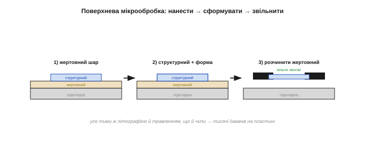
*Рис. 5.7.1.2. Як народжується рухома деталь. (1) На підкладку наносять **жертовний** шар. (2) Згори — **структурний** шар, якому травленням надають форми (вантаж, пружини). (3) Жертовний шар **розчиняють** — і структура, що була приклеєна, звисає вільно над підкладкою, готова рухатися. Усе — тими ж літографією й травленням, що й мікросхеми, тож одразу мільйонами на пластині.*

Найважливіше тут — **пакетність**: усе робиться тими самими фотолітографією й травленням, що й чипи, тож на одній кремнієвій пластині одночасно постають **тисячі** однакових давачів. Звідси і дешевизна, і повторюваність: кожен давач — точна копія сусіда. А ще поряд із механікою на тому самому кристалі вирощують і **електроніку**, що читатиме її рух (саме це й була родзинка ADXL50 з історії). Машина й мозок народжуються разом, на одній пластині.

Така тонка механіка дається непросто. Головний ворог — **злипання** (*stiction*): щойно звільнена структура така легка, а сили на мікромасштабі (поверхневий натяг, статика) такі відносно великі, що вантаж може просто **прилипнути** до підкладки й не відліпитися. Боротьба зі злипанням, із залишковими напругами в шарах, із точністю зазорів — і є ті «технічні бої», що згадувала історія. MEMS-виробництво — це не просто «зробити менше», а опанувати фізику, яка на такому масштабі поводиться інакше, ніж ми звикли.

### Серце MEMS: вантаж на пружинках

Хоч би який давач руху ви взяли, у його серці — той самий елемент: **інерційна маса** (*proof mass*, «вантаж-проба») на **пружинках**. Це крихітний шматочок кремнію, підвішений на тонких кремнієвих балках-пружинах так, що може трохи зсуватися. Уся фізика проста й знайома: за **другим законом Ньютона** сила зсуває масу, а пружинки опираються — отже, **зсув маси пропорційний прикладеній силі** (а сила — прискоренню).

Слово **інерціальний** тут ключове: давач відчуває рух **зсередини**, спираючись лише на **інерцію** власного вантажа, без жодного зовнішнього орієнтира — ні супутника, ні маяка, ні погляду назовні. Це і дар (працює будь-де, навіть під землею чи в космосі), і прокляття (без зовнішньої прив'язки похибки **накопичуються**, §5.7.5–5.7.6). Уся інерціальна навігація — від ракети до телефону — стоїть на цьому простому вантажику, що чує рух власною масою.

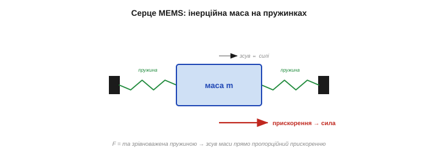
*Рис. 5.7.1.3. Серце будь-якого MEMS-давача руху. Інерційна маса (вантаж) висить на кремнієвих пружинках. Прискорення штовхає масу, пружинки опираються — і маса зсувається рівно настільки, наскільки сильне прискорення (F = ma, зрівноважене пружиною). Виміряй цей мікрозсув — і знатимеш прискорення. Усе інше (акселерометр, гіроскоп) — варіації цього вантажа на пружинках.*

Запам'ятайте цю картину — **вантаж на пружинках** — як головний образ розділу. Акселерометр (§5.7.2) міряє, як прискорення зсуває цю масу прямо; гіроскоп (§5.7.3) — як обертання зсуває її вбік через ефект Коріоліса. Різні давачі — той самий підвішений вантажик, тільки збуджений по-різному.

У цього вантажа на пружинках є й своя **динаміка**, важлива на практиці. Як будь-яка система маса-пружина, він має власну **частоту резонансу**: на ній він гойдається найохочіше, тож зовнішні коливання поблизу неї спотворять показ. Щоб приборкати дзвін на резонансі, порожнину з вантажем заповнюють газом під тиском — він **демпфує** коливання (як олива в амортизаторі). Цей баланс жорсткості, маси й демпфування й задає **смугу частот**, у якій давач чесно міряє, — і вона скінченна, як усе в цьому модулі.

Лишається питання: як виміряти зсув **настільки** малий?

### Як читають мікрозсув: ємнісні гребінці

Зсув маси — це нанометри, мільярдні частки метра. Прямо його не побачиш — але можна виміряти **ємнісно**. До рухомої маси прикріплюють «гребінець» із багатьох тонких пальців, що заходять між нерухомими пальцями, як зчеплені зубці двох гребінок. Кожна пара сусідніх пальців — це маленький **конденсатор**, чия ємність залежить від відстані між ними. Зсунулась маса — змінилися зазори — змінилася **ємність**, і це вже легко зчитати електронікою.

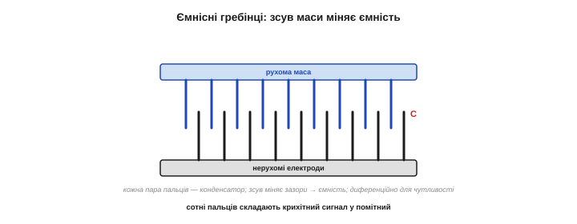
*Рис. 5.7.1.4. Як міряють нанометровий зсув. До рухомої маси кріплять «гребінець» рухомих пальців, що входять між нерухомими. Кожна пара пальців — крихітний конденсатор. Зсув маси зближує пальці з одного боку й віддаляє з другого — ємність з одного боку росте, з другого падає. Цю **різницю** (диференційне вимірювання) електроніка читає дуже чутливо, перетворюючи нанометри зсуву на напругу.*

Чому **багато** пальців і чому **диференційно**? Бо сигнал крихітний, і його треба підсилити всіма способами. Сотні паралельних пальців складають свої ємності в більшу, помітнішу; а **диференційна** схема (ємність росте з одного боку, падає з другого) подвоює сигнал і гасить спільні завади й температурний дрейф. Так нанометровий механічний зсув перетворюється на електричний сигнал, який уже можна оцифрувати й фільтрувати (Розділи 5.4–5.6).

Як саме електроніка «бачить» ємність? Вона подає на гребінці змінну напругу й міряє, скільки заряду на них поміщається, — а заряд за сталої напруги прямо пропорційний ємності. Зміна ємності на **фемтофаради** (тисячні частки пікофарада!) дає мізерну зміну заряду, тож схема має бути надчутливою — і саме тому її садять **поряд** із гребінцями, на тому самому чипі, щоб слабкий сигнал не встиг зашуміти на довгих доріжках. Це знову та сама родзинка інтеграції, що дала перевагу ADXL50.

> 🔧 **Навіщо це.** Тримайте в голові, що ваш акселерометр — **механічний** прилад, а не чиста електроніка. Звідси практичні наслідки: він боїться **сильних ударів** (тонкі пружинки можна зламати — даташити вказують межу удару, часто тисячі g); він має власну **механічну** частоту резонансу (різкі поштовхи на ній спотворять показ); і він чутливий до **монтажу** (механічна напруга від паяння чи згину плати «тисне» на давач і дає похибку). Поводьтеся з ним як із крихітним механізмом, бо він ним і є.

### Одна платформа — багато давачів

Найкрасивіше в MEMS — що **той самий** набір прийомів (вантаж на пружинках + ємнісне зчитування + електроніка на чипі) породжує **цілу родину** давачів. Змінюючи форму маси та спосіб її збудження, на одній технології роблять усе сімейство.

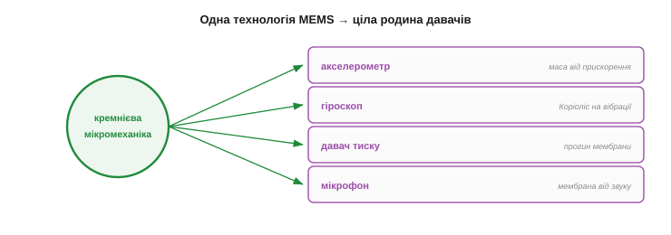
*Рис. 5.7.1.5. Одна платформа — багато органів чуття. Та сама мікромеханіка дає: **акселерометр** (маса зсувається від прискорення), **гіроскоп** (вібрівна маса відхиляється від обертання, ефект Коріоліса), **давач тиску** (прогин мембрани), **мікрофон** (звукові коливання мембрани) і ще багато. Один технологічний фундамент — десятки різних давачів, і всі копійчані з тих самих міркувань масштабу.*

Акселерометр, гіроскоп, давач тиску, MEMS-мікрофон, навіть мікродзеркала проєкторів — усе це нащадки тієї самої кремнієвої мікромеханіки. Для нас важливі перші три «органи руху»: **акселерометр** (§5.7.2), **гіроскоп** (§5.7.3) і споріднений із ними **магнітометр** (§5.7.4), що разом і складають **IMU** (*Inertial Measurement Unit*, інерціальний вимірювальний блок) — той самий чип у вашому дроні чи телефоні.

Тенденція тут — дедалі тісніша **інтеграція**. Спершу акселерометр і гіроскоп жили окремо; тоді їх поєднали в один корпус — **шестиосьовий** IMU (3 осі прискорення + 3 осі обертання); додали магнітометр — вийшов **дев'ятиосьовий**. А в новіших чипах поряд садять ще й маленький процесор, що **сам** зливає давачі (про фьюжн — §5.7.6) і віддає вже готову орієнтацію. Тобто межа між «давачем» і «обчислювачем» розмивається — і вам дедалі частіше дають не сирі осі, а вже опрацьований результат.

Одна обмовка: магнітометр (§5.7.4), хоч і живе в тому самому корпусі IMU, насправді **не** MEMS-механіка — він міряє магнітне поле зовсім іншим принципом (часто ефектом Холла чи магнітоопором). Його просто зручно поселили поряд; а мікромеханіка вантажа на пружинках — це про акселерометр і гіроскоп.

На рівні коду спілкування з IMU просте й однакове для всіх: чип під'єднують шиною **I²C** чи **SPI**, а осі читають із його **регістрів** — кілька байтів на кожну вісь. Там само налаштовують **діапазон** (наприклад, акселерометр на ±2 чи ±16 g) і частоту видачі. Тобто фізика всередині складна, а інтерфейс назовні — банальний обмін байтами; уся хитрість лишається в тому, як ці сирі числа **осмислити** (наступні теми).

### Сила й межі MEMS

Підсумуймо, чим MEMS гарні й чим обмежені, — бо саме з цих меж виросте вся друга половина розділу. **Сильні** боки очевидні: крихітні розміри, копійчана ціна (пакетне виробництво), інтеграція з електронікою, низьке енергоспоживання. **Слабкі** боки — зворотний бік крихітності.

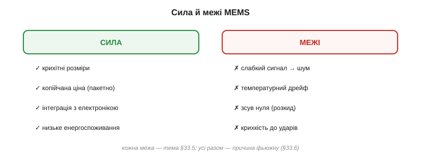
*Рис. 5.7.1.6. Дві сторони мікромеханіки. **Сила**: малі, копійчані, інтегровані, маловитратні — звідси їхня всюдисущість. **Межі**: крихітна маса дає **слабкий сигнал** (отже, шум); механіка чутлива до **температури** (розширення міняє пружини); виробничий розкид дає **зсув нуля** в кожного давача свій; і фізична **крихкість** до ударів. Кожна з цих вад — тема §5.7.5; кожна ж і пояснює, чому давачам потрібен фьюжн (§5.7.6).*

- **Слабкий сигнал → шум.** Крихітна маса дає крихітну силу й нанометрові зсуви; на тлі теплового шуму це робить MEMS принципово «шумними» (§5.7.5).
- **Чутливість до температури.** Кремній розширюється від нагріву, міняючи жорсткість пружин і зазори, — звідси температурний дрейф показів.
- **Зсув нуля.** Виробничий розкид означає, що кожен давач має свій невеликий зсув («нуль не на нулі»), який треба калібрувати (§5.1.6).
- **Крихкість.** Тонка механіка боїться сильних ударів.

Саме ці чотири межі й роблять необхідними і фільтрацію (Розділи 5.4–5.6), і калібрування (§5.1.6), і — головне — **фьюжн** (§5.7.6): жоден MEMS-давач сам по собі не дає надійної картини, тож їх доводиться зливати докупи, щоб сильні боки одного прикривали вади іншого.

Для вашого проєкту ці межі означають конкретне. Сирий показ MEMS **тремтить** (шум), **повзе** з нагрівом (температурний дрейф) і **зміщений** від нуля (виробничий розкид) — і все це **нормально**, а не ознака браку. Завдання інженера — не дивуватися цьому, а **передбачити**: відфільтрувати тремтіння, відкалібрувати зсув, компенсувати чи прийняти дрейф і злити давачі. MEMS дає сировину, з якої гарну величину ще треба зробити, — і весь цей розділ та модуль саме про те, як її зробити.

> 🔧 **Навіщо це.** Не чекайте від MEMS-давача лабораторної точності — він копійчаний саме тому, що крихітний, а крихітний — значить шумний і дрейфливий. Реалістичні очікування рятують від розчарування: сирий показ акселерометра чи гіроскопа **завжди** треба фільтрувати, калібрувати й поєднувати з іншими давачами. Той, хто бере сирий вихід MEMS «як є», незмінно отримує тремтливу, повзучу й ненадійну величину — і дарма звинувачує «поганий давач».

**Приклад (масштаб чисел).** Щоб відчути, з чим маємо справу:

```
розмір рухомої структури:  ~ десятки-сотні мкм   (товщина шару — лічені мкм)
маса вантажа-проби:        ~ мікрограми          (мільйонні частки грама)
зсув від 1 g прискорення:  ~ нанометри           (мільярдні частки метра)
зміна ємності:             ~ фемтофаради         (тисячні частки пікофарада)
```

Нанометри зсуву й фемтофаради ємності — ось чому MEMS-давач це водночас і диво інженерії, і вічна боротьба зі шумом: корисний сигнал тут мізерний за будь-якими мірками, і лише розумна електроніка та обробка роблять його придатним.

> 🔧 **Навіщо це.** Один чип IMU містить **кілька** давачів (акселерометр + гіроскоп, часто + магнітометр) — це не випадковість, а задум: окремо кожен ненадійний, а разом вони доповнюють одне одного (§5.7.6). Тому, обираючи давач, дивіться не лише на акселерометр, а на **весь** набір у корпусі й на те, як виробник пропонує їх поєднувати; готові [IMU-плати](book:components/imu-board) вміщають потрібний набір одразу: MPU-6050 — акселерометр + гіроскоп (6 осей, без магнітометра), ICM-20948 чи LSM9DS1 — повні 9 осей.

Отже, MEMS — це реальна, хоч і мікроскопічна, машина: вантаж на пружинках, чий нанометровий зсув читають ємнісними гребінцями, а поряд на чипі сидить електроніка. Ця проста серцевина породжує цілу родину давачів і несе в собі і всю їхню силу (дешевизна, всюдисущість), і всі їхні вади (шум, дрейф, крихкість). Тепер, маючи цю картину, розберемо перший і найважливіший із них — **акселерометр**: як той самий вантаж на пружинках перетворює прискорення — а заразом, що особливо цікаво, і незмінну силу тяжіння — на сигнал, придатний і щоб виявити рух, і щоб визначити, де «низ». Це наступна тема.

---

## 5.7.2 Акселерометр: міряти прискорення

Акселерометр — найважливіший і найпростіший за ідеєю інерціальний давач: це той самий вантаж на пружинках (§5.7.1), збуджений **лінійним прискоренням**. Прискорення зсуває масу, ємнісні гребінці читають зсув — ось і весь прилад. Та в нього є одна знаменита дивина, об яку спотикається кожен новачок: акселерометр **міряє й гравітацію**, тож у спокої показує не нуль, а **1g**. Зрозумівши цю одну річ, ви опануєте акселерометр по-справжньому — і побачите, що він уміє (визначати нахил і рух) і чого не вміє (знати, де ви). Розберімо все по черзі.

Варто наперед налаштуватися на головний парадокс цього давача: він зветься «акселерометром», тобто «вимірювачем прискорення», але насправді міряє дещо тонше — **силу, з якою його утримують проти вільного падіння**. Звідси й уся його дивна, але напрочуд корисна поведінка. Тримаймо цю думку в голові — і все стане на місця.

### Прискорення зсуває масу

Принцип прямий. Коли корпус давача прискорюється, інерція **лишає масу позаду**: вона зсувається відносно корпусу в бік, протилежний прискоренню, рівно настільки, наскільки воно сильне. Цей зсув читають ємнісно (§5.7.1) — і дістають число, пропорційне прискоренню.

Дві речі задає тут **жорсткість пружин**. М'якша пружина дає більший зсув на те саме прискорення — отже, **чутливіший** давач, та з вужчим діапазоном (масу легше «вибити» за межі) і нижчою власною частотою. Жорсткіша — навпаки: грубіша, зате витриваліша й швидша. Тому акселерометр на ±2g (чутливий, для нахилу) і на ±16g (грубий, для ударів) — це, по суті, та сама механіка з різною жорсткістю підвісу. Вибір діапазону — це вибір цього компромісу.

Іще нюанс будови. Більшість дешевих MEMS-акселерометрів — **розімкнені**: маса просто зсувається, а зсув міряють. Точніші ж роблять **замкненими** (force-feedback): електроніка прикладає до маси силу, що **утримує** її на місці, і міряє цю силу — так лінійніше й стабільніше, але дорожче. Для аматорського рівня цей нюанс не критичний, та корисно знати, що дорожчий давач часто означає саме замкнену схему.

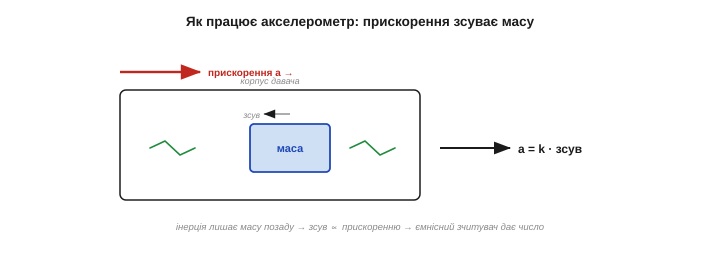
*Рис. 5.7.2.1. Як працює акселерометр. Корпус прискорюється праворуч — інерція лишає підвішену масу позаду (вона зсувається ліворуч відносно корпусу). Зсув пропорційний прискоренню (пружина зрівноважує силу інерції), і ємнісні гребінці перетворюють його на електричний сигнал. Що сильніше прискорення — то більший зсув — то більше число на виході.*

Просто? Так — поки не згадати, що **сила тяжіння теж є силою**, а отже, теж тисне на масу. І саме звідси починається найважливіше.

### Дивина гравітації: спокій = 1g

Ось ключ до розуміння акселерометра: він міряє **не те** прискорення, яке ви очікуєте. Здавалося б, нерухомий давач на столі мав би показувати **нуль** — він же не рухається. Та насправді він показує **1g, спрямоване вгору**. Чому?

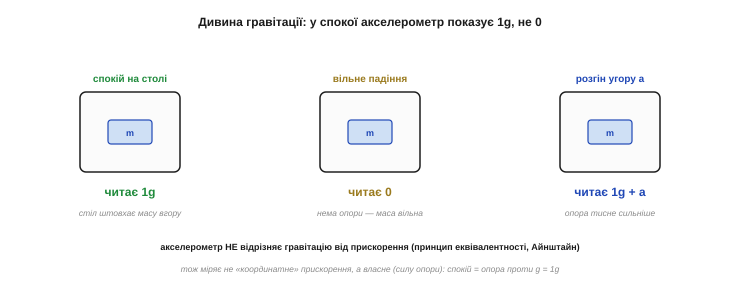
*Рис. 5.7.2.2. Дивина, об яку всі спотикаються. **Спокій на столі**: стіл штовхає масу вгору, опираючись гравітації, — давач читає 1g вгору. **Вільне падіння**: опори нема, маса й корпус падають разом — давач читає 0. **Розгін угору**: опора тисне ще сильніше — більш як 1g. Акселерометр не відрізняє гравітацію від прискорення (принцип еквівалентності Айнштайна), тож міряє не «координатне» прискорення, а **власне** — силу опори.*

Річ у тім, що акселерометр міряє **власне прискорення** (*proper acceleration*, специфічну силу) — те, з яким **опора діє на масу**, а не те, як давач рухається в просторі. На столі гравітація тягне масу вниз, а пружинки (через стіл) штовхають її вгору, утримуючи на місці, — і давач читає саме цей **поштовх угору**, тобто 1g. У вільному ж падінні опори немає: маса й корпус падають разом, пружинки розслаблені — і давач читає **нуль** (хоча прискорення падіння якраз 1g!).

Глибша причина — **принцип еквівалентності** Айнштайна: акселерометр **фізично не може** відрізнити гравітацію від прискорення. Стояти на Землі й розганятися в космосі з 1g — для нього одне й те саме. Це не вада, а фундамент; і саме він дає акселерометру його головну корисну здатність.

Допомагає думати ліфтами й космосом. У ліфті, що рвучко рушає вгору, ви на мить «важчаєте» — і акселерометр теж покаже більш як 1g, не відрізнивши розгін від додаткової гравітації. У вільному ж падінні (чи на орбіті, що є тим самим падінням навколо Землі) усе невагоме — і давач чесно покаже **нуль**, бо опори, яку він міряє, немає. Космонавти «плавають» не тому, що там нема гравітації, а тому, що падають разом зі станцією, — і акселерометр на борту це підтвердить нулем.

> 🔧 **Навіщо це.** Запам'ятайте раз і назавжди: **нерухомий акселерометр показує 1g, а не 0**. Довжина його вектора в спокої — рівно 1g, і вказує цей виміряний вектор **угору** — це реакція опори («низ» — це мінус виміряний вектор). Тому перша перевірка справності давача — покласти його рівно й переконатися, що по вертикальній осі ~1g (≈9.8 м/с²), а по горизонтальних ~0. Хто чекає нуля «бо ж не рухається» — даремно шукатиме неіснуючу несправність.

Та сама стала 1g — ще й безкоштовний **еталон** для калібрування (§5.1.6). Гравітація завжди рівно 1g, тож, повертаючи давач різними боками до вертикалі, ви отримуєте відомі опорні точки (+1g, −1g, 0) на кожній осі — і за ними виправляєте і масштаб, і зсув нуля кожної осі. Природа дала акселерометру вбудований калібрувальний сигнал, яким гріх не скористатися.

### Перше застосування: де «низ» (нахил)

Та сама дивина гравітації — це й перша суперсила акселерометра. Бо якщо в спокої він **завжди** відчуває сталий вектор 1g уздовж вертикалі (реакцію опори, спрямовану від центру Землі), то за тим, **як цей вектор розкладається** на три осі давача, можна дізнатися, **як давач нахилений**.

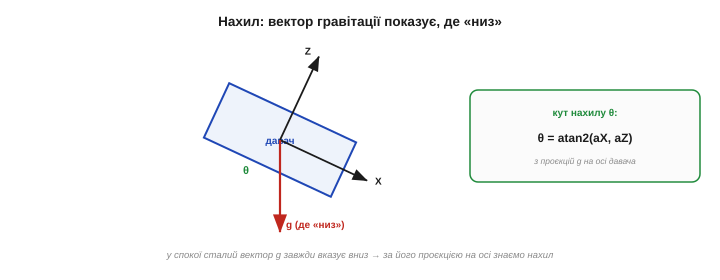
*Рис. 5.7.2.3. Акселерометр як рівень. У спокої вектор g завжди вказує вниз. Коли давач нахиляють, цей сталий вектор по-різному проєктується на його осі: на похилу вісь припадає більша частка, на вертикальнішу — менша. За цими проєкціями (через `atan2`) і рахують кути нахилу — крен і тангаж. Так копійчаний акселерометр стає електронним рівнем.*

Нахил рахують просто: кут між віссю давача й вертикаллю дістають із проєкцій гравітації через арктангенс:

```
кут нахилу (тангаж):  θ = atan2(aX, aZ)
            (крен):   φ = atan2(aY, aZ)
де aX, aY, aZ — покази трьох осей у спокої (проєкції g)
```

Саме так працює автоповорот екрана в телефоні, рівень-застосунок, визначення орієнтації корпусу робота в спокої. Копійчаний акселерометр — це ще й електронний **рівень**, що завжди знає, де «низ».

Та в нахилу за гравітацією є принципова сліпа пляма: **поворот навколо вертикалі** (азимут, курс — *yaw*). Якщо обертати давач навколо тієї самої осі, уздовж якої тягне g, вектор гравітації **не змінюється** — усі три проєкції лишаються ті самі. Тобто акселерометр бачить крен і тангаж, але **не бачить**, куди ви повернені відносно сторін світу. Цю діру закриває окремий давач — магнітометр (§5.7.4), що відчуває поле Землі.

Зате нахил за акселерометром має безцінну рису — він **абсолютний і не дрейфує**. Гравітація — вічний, незмінний орієнтир, тож «де низ» давач знає **завжди** правильно, без накопичення похибки з часом. Це його головна перевага над гіроскопом (§5.7.3), що дрейфує. Слабкість акселерометра — чутливість до руху; сила — відсутність дрейфу. У гіроскопа все навпаки. Уже відчуваєте, чому їх захочеться **поєднати** (§5.7.6)? Сильний бік одного якраз закриває слабкий бік другого.

### Друге застосування: рух і вібрація

Друга роль акселерометра — ловити **рух**: динамічне прискорення від поштовхів, ударів, кроків, вібрації. Тут уже працює не стала гравітація, а її **зміни** в часі: крок ноги, стук по корпусу, тряска машини — усе це сплески прискорення поверх постійної 1g.

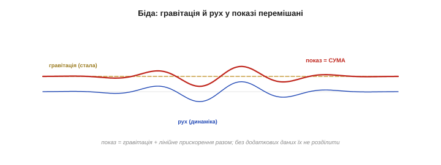
*Рис. 5.7.2.4. Рух поверх гравітації. Що насправді читає давач — це **сума** сталої гравітації (золота лінія) і динамічного прискорення від руху (синя). Червона крива — їхня суміш, той самий сигнал на виході. На цьому стоять крокоміри, детектори падіння, виявлення ударів і вібродіагностика (Розділ 5.5). Але гравітація й рух тут **злиті** — і це наступна біда.*

Так працюють крокоміри (рахують поштовхи кроків), детектори падіння й ударів, аналіз вібрації (спектр прискорення, §5.5.7). Акселерометр чудово відчуває, що щось **рухається** чи **трясеться**.

Крокомір — добрий приклад того, як це використовують. Він рахує **довжину** вектора прискорення (щоб не залежати від орієнтації телефона в кишені) і шукає в ній **періодичні піки** — кожен крок дає характерний поштовх. Трохи згладжування (ФНЧ проти тремтіння) і поріг проти дрібних коливань — і копійчаний давач рахує кроки. Жодної складної фізики: лише пік прискорення на кожен удар ноги об землю.

### Біда: гравітація й рух перемішані

А тепер — головна складність, що пояснює половину наступного розділу. Акселерометр віддає **одну** величину — суму **гравітації** і **лінійного прискорення** руху. І розділити їх із одного давача **неможливо**: він фізично не розрізняє, де гравітація, а де розгін (принцип еквівалентності знову).

Це б'є по обох застосуваннях. Для **нахилу** перешкода — рух: щойно давач починає трястися чи прискорюватись, до сталої g домішується динаміка, і «де низ» уже не вгадати (рівень бреше, поки ви ним махаєте). Для **руху** перешкода — гравітація: вона сидить у показі постійним зміщенням, яке треба якось відняти. А найгірше — **позицію** (де я в просторі) акселерометр дати **не може**: щоб із прискорення дістати положення, його треба двічі проінтегрувати, а будь-яка похибка тоді **накопичується квадратично** й за секунди перетворює оцінку на безглуздя.

Щоб відчути, наскільки це швидко: стале зміщення лише в 0.01g (типова дрібниця для дешевого давача) за подвійного інтегрування дає хибне «переміщення», що росте як ½·a·t² — близько 0.05 м за першу секунду, 0.5 м за три, 5 м за десять. Помилка не просто накопичується, а **прискорюється**. Тому інерціальне числення положення лишається царством дорогих прецизійних давачів і коротких інтервалів — а копійчаний MEMS на нього не здатний у принципі.

Саме тому для **положення** беруть зовсім інші засоби — GPS, далекоміри, камери, — а акселерометр у навігації лише **доповнює** їх на коротких проміжках між оновленнями. Інерціальне числення добре згладжує прогалини між «стрибками» GPS, але саме по собі завжди «спливає», тож без зовнішньої прив'язки довго не протримається.

> 🔧 **Навіщо це.** Дві залізні застороги. Перша: **нахил за акселерометром вірний лише в спокої** — під час руху чи вібрації показ «де низ» спотворюється динамічним прискоренням, тож або фільтруйте повільно (ФНЧ, бо гравітація стала, а рух швидкий — §5.6.4), або зливайте з гіроскопом (§5.7.6). Друга: **ніколи не інтегруйте акселерометр до положення** — подвійне інтегрування шуму й зсуву дрейфує так швидко, що за секунди оцінка стає марною. Акселерометр каже «куди тягне» й «що трясеться», а не «де я».

### Три осі, діапазон, одиниці

На практиці акселерометр **триосьовий**: міряє прискорення по X, Y і Z окремо, даючи **вектор** із трьох чисел. Його довжина й напрямок несуть усю інформацію: у спокої довжина = 1g, а напрямок задає вертикаль (виміряний вектор дивиться вгору, «низ» — це його мінус).

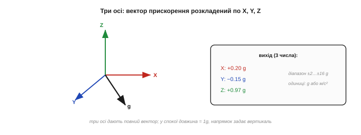
*Рис. 5.7.2.5. Три осі — повний вектор. Давач розкладає прискорення на три взаємно-перпендикулярні осі (X, Y, Z) і віддає три числа. Разом вони — вектор: його довжина в спокої дорівнює 1g, а напрямок задає вертикаль («низ» — це мінус виміряного вектора). Діапазон обирають під задачу (±2g для нахилу, ±16g для ударів), а одиниці — частки g або м/с² (1g ≈ 9.8 м/с²).*

Дві практичні величини. **Діапазон** — наскільки сильне прискорення давач ще міряє, не зашкалюючи: ±2g вистачить для нахилу й спокійного руху, а для ловлі ударів беруть ±8…±16g. **Чутливість** і **одиниці** — сирий вихід (відліки АЦП) переводять у частки g чи в м/с² (нагадаю, 1g ≈ 9.8 м/с²) за паспортним коефіцієнтом давача.

Сирий вихід акселерометра завжди **тремтить** — і це нормально (§5.7.1, §5.7.5): тепловий шум механіки нікуди не дівся. Тому між давачем і рішенням майже завжди стоїть **фільтр** (Розділи 5.4–5.6): легке ФНЧ проти тремтіння, медіана проти поодиноких викидів. Скільки фільтрувати — компроміс §5.4.5: сильніше згладиш — чистіше, але повільніше реагує. Сирий показ акселерометра «як є» придатний хіба для грубих рішень; для точних його спершу чистять.

І ще про осі: акселерометр міряє у **власній** системі координат (осі X, Y, Z прив'язані до корпусу давача, а не до світу). Тому, коли апарат повертається, та сама гравітація «перетікає» з осі на вісь — і саме це перетікання й несе інформацію про нахил. Щоб дістати орієнтацію відносно **світу** (де справжній низ, де північ), покази тіла треба перерахувати — а це вже задача орієнтації (Розділ 5.8). Поки що досить запам'ятати: давач говорить мовою власного тіла, а не світу, і переклад між ними — окрема робота.

**Приклад (нахил і перевірка 1g).** Давач лежить нерухомо, нахилений на бік:

```
читаємо осі:        aX = 0.50 g,  aZ = 0.87 g,  aY ≈ 0
довжина вектора:    √(0.50² + 0.87²) ≈ 1.00 g   ✓  (у спокої завжди ~1g — давач справний)
кут нахилу:         θ = atan2(aX, aZ) = atan2(0.50, 0.87) ≈ 30°
висновок: давач нахилений на 30° від горизонталі; рух відсутній (довжина рівно 1g)
```

Зверніть увагу на хитрий прийом перевірки: якщо **довжина** вектора прискорення помітно відрізняється від 1g — значить, до гравітації домішався рух, і «нахилу» зараз вірити не можна. Сама природа давача підказує, коли його показ чесний.

> 🔧 **Навіщо це.** Корисний практичний тест: рахуйте **довжину** вектора прискорення `√(aX²+aY²+aZ²)`. У спокої вона ~1g — і тоді нахилу можна вірити. Помітно більша чи менша за 1g — давач зараз рухається (є динамічне прискорення), і визначати «де низ» цієї миті не варто. Ця проста перевірка відсіює хибні виміри нахилу під час руху — без жодного додаткового давача.

Зведімо, що акселерометр уміє, а що ні, — бо саме з його **обмежень** і виросте потреба в інших давачах:

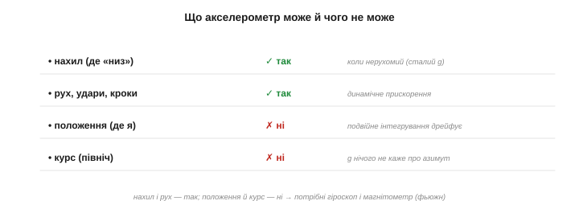
*Рис. 5.7.2.6. Підсумок можливостей. **Може**: визначити нахил (де «низ») — у спокої; відчути рух, удари, кроки, вібрацію. **Не може**: дати положення (подвійне інтегрування дрейфує) і курс/азимут (гравітація про нього мовчить). Перші — його сила; другі — пряма причина додати гіроскоп (§5.7.3) і магнітометр (§5.7.4) та злити їх докупи (§5.7.6).*

Отже, акселерометр — це вантаж на пружинках, що чує і гравітацію, і рух **разом**: звідси його сила (знати нахил у спокої, ловити рух і вібрацію) і його межа (не розділити їх без сторонньої допомоги, не дати положення). Особливо болить нахил під час руху: коли апарат трясеться чи прискорюється, гравітаційний орієнтир тоне в динаміці. Потрібен давач, що міряв би обертання **незалежно** від гравітації й лінійного прискорення, — і він є. Це **гіроскоп**: він відчуває, як швидко апарат повертається, і саме він прикриває головну сліпу пляму акселерометра. А далі (§5.7.6 і Розділ 5.8) ми побачимо, як ці два давачі-антиподи — точний у спокої, але «засліплений» рухом акселерометр і байдужий до гравітації, та дрейфливий гіроскоп — складаються в одну надійну оцінку орієнтації, де кожен закриває слабкість іншого. До гіроскопа й переходимо.

---

## 5.7.3 Гіроскоп: міряти обертання

Акселерометр сліпне там, де апарат **обертається** і де треба знати **курс** (yaw). Цю діру закриває **гіроскоп** — давач, що міряє обертання й нечутливий ні до гравітації, ні до лінійного руху. Та в нього своя дивина, дзеркальна до акселерометрової: гіроскоп міряє не **кут**, а **швидкість** його зміни, тож, щоб дістати сам кут, показ доводиться інтегрувати — а це породжує **дрейф**. Зрозумівши цю одну рису, ви побачите, чому гіроскоп і акселерометр — ідеальна пара, де вади одного гасить інший. Розберімо: що гіроскоп міряє, як він це робить (ефект Коріоліса) і де його межа.

Налаштуйтеся знову на парадокс, дзеркальний до акселерометрового. Акселерометр давав абсолютну величину (нахил), але плутав гравітацію з рухом; гіроскоп дає чисту, незалежну від гравітації величину, але — лише **темп** зміни, а не саму величину. Один знає «де», та зляканий рухом; другий знає «як швидко змінюється», та не знає «де». Кожен сильний рівно там, де другий слабкий, — і вся краса IMU в тому, як їх поєднати.

### Що міряє гіроскоп: швидкість обертання

Найперше й найважливіше: гіроскоп віддає **кутову швидкість** — наскільки **швидко** апарат повертається, у градусах за секунду (°/с), — а **не** кут повороту. Стоїть нерухомо — на виході нуль; крутиться зі швидкістю 120 °/с — на виході 120; зупинився — знову нуль. Сам **кут** гіроскоп не знає; він каже лише «**як швидко** ти зараз обертаєшся».


*Рис. 5.7.3.1. Гіроскоп міряє темп, не положення. Поки апарат обертається, давач показує **швидкість** цього обертання (наприклад, +120 °/с); щойно зупинився — нуль, хоча повернувся він уже на якийсь кут. Гіроскоп каже, **як швидко** ви крутитесь, а не **на скільки** повернулись. Щоб дізнатися сам кут, швидкість доведеться накопичити в часі — про це далі.*

Це принципово інша величина, ніж в акселерометра. Акселерометр давав щось **абсолютне** (вектор гравітації → нахил «тут і зараз»); гіроскоп дає **темп зміни** (швидкість). І саме з цієї різниці випливають усі їхні сили й слабкості.

Слово «гіроскоп» старше за MEMS. Класичний гіроскоп — це важке колесо, що швидко **обертається** й завдяки збереженню моменту імпульсу опирається зміні своєї осі; такі прилади понад століття тримали курс кораблів, літаків і ракет. MEMS-гіроскоп працює зовсім інакше — через Коріоліса на вібрації, без жодного колеса, — але робить те саме: відчуває обертання. Стара назва лишилася, а механізм усередині став крихітним і копійчаним (історія розділу).

До речі, «швидкість, а не кут» — часто навіть **зручніше**, ніж здається. Для стабілізації апарата контуру керування потрібна саме **кутова швидкість**: щоб гасити розгойдування, регулятор протидіє темпу повороту (це диференційна складова ПІД, §5.8.8). Тож гіроскоп нерідко використовують **прямо**, без інтегрування до кута, — і тоді його дрейф узагалі не страшний, бо ми нічого не накопичуємо. Дрейф кусає лише тоді, коли зі швидкості роблять кут, — а для самого лише гасіння розгойдувань кут і не потрібен, досить миттєвої швидкості.

### Як це робить: ефект Коріоліса

Як крихітна кремнієва машина відчуває обертання? Через **ефект Коріоліса**. Усередині гіроскопа є маса, яку постійно **розгойдують** (змушують вібрувати вздовж однієї осі). Коли давач починає **обертатися**, на цю рухому масу діє додаткова, **бічна** сила — сила Коріоліса, — що штовхає її **поперек** її коливань. І головне: ця бічна сила (а отже, і поперечне відхилення маси) **прямо пропорційна швидкості обертання**. Виміряй це відхилення ємнісно (§5.7.1) — і знатимеш кутову швидкість.

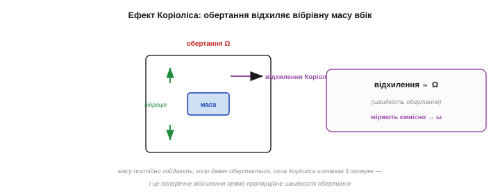
*Рис. 5.7.3.2. Серце MEMS-гіроскопа. Масу постійно гойдають уздовж однієї осі (зелена вібрація). Коли давач обертається (Ω), на рухому масу діє сила Коріоліса, що штовхає її **поперек** коливань (фіолетове відхилення). Це поперечне відхилення прямо пропорційне швидкості обертання — і саме його зчитують ємнісні гребінці, перетворюючи на ω. Той самий вантаж на пружинках, тільки тепер його збуджує обертання, а не прискорення.*

Силу названо на честь французького інженера й математика **Гаспара-Ґюстава де Коріоліса** (*Gaspard-Gustave de Coriolis*, 1792–1843), що 1835 року описав «додаткові сили», які діють на тіла в системі відліку, що **обертається** (саме ім'я силі дали вже пізніші автори). Ту саму силу ви знаєте з географії — це вона закручує циклони й відхиляє вітри на планеті, що крутиться. У гіроскопі її лише зменшили до мікромасштабу: вібрівна маса замість вітру, кремнієва порожнина замість Землі.

Інженерно гіроскоп складніший за акселерометр. По-перше, масу треба **постійно й точно гойдати** — це окрема система приводу, що їсть енергію (тому гіроскоп зазвичай **ненажерливіший** за акселерометр). По-друге, сигнал Коріоліса **ще менший** за акселерометровий зсув, тож гіроскоп зазвичай і **шумніший**. Усе це — плата за здатність чути обертання: дешево, та не задарма. Звідси й практична порада берегти живлення, вимикаючи гіроскоп, коли динаміка не потрібна.

Форми вібрівної структури бувають різні — камертонні (дві маси, що гойдаються назустріч), кільцеві, дискові, — та принцип один: щось коливається, а обертання відхиляє це коливання вбік. Деталі важливі інженерам давача; вам же досить пам'ятати картину: **гойдана маса + обертання → бічне відхилення → ω**. Решта — варіації на цю тему, відточені заради меншого шуму й дрейфу.

### Інтуїція Коріоліса: гойдалка-карусель

Щоб відчути Коріоліса нутром, уявіть **карусель**, що обертається. Ви стоїте в центрі й кидаєте м'яч **прямо** товаришеві на краю. Поки м'яч летить, карусель встигає повернутися — і м'яч, що летів «прямо», з вашого погляду **закручується** вбік, ніби його штовхнула невидима сила. Ця уявна сила й є сила Коріоліса: вона з'являється не від чогось реального, а від того, що ви дивитеся з системи, яка **обертається**.


*Рис. 5.7.3.3. Звідки береться сила Коріоліса. На нерухомій землі м'яч летить прямо. Та на каруселі, що обертається, той самий прямий політ здається **викривленим** (синя крива) — бо платформа крутиться під ним. Гіроскоп — це «карусель» із вібрівною масою всередині: коли корпус обертається, рух маси теж «закручується», і за силою цього закручування давач і визначає швидкість обертання.*

Гіроскоп — це, по суті, така сама карусель, лише з вібрівною масою замість м'яча: коли корпус обертається, коливання маси «закручуються» силою Коріоліса, і за величиною цього закручування давач читає, **як швидко** його обертають.

Той самий ефект керує погодою цілої планети. Земля — велика карусель, тож вітри й океанські течії на ній **закручуються** силою Коріоліса: циклони в північній півкулі крутяться проти годинникової стрілки, у південній — навпаки. А маятник Фуко, що повільно повертає площину гойдання, — це теж Коріоліс, видимий оком. Ваш копійчаний гіроскоп відчуває рівно ту саму силу, тільки від обертання власного корпусу, а не Землі.

### Сила: незалежність від гравітації

Тепер — чому гіроскоп безцінний саме там, де акселерометр безсилий. Він міряє **чисте обертання**, і його абсолютно **не обходять** ні гравітація, ні лінійне прискорення: трясіть його, рухайте, перевертайте — він реагує **лише** на власне обертання. Це пряма протилежність акселерометрові, що плутав гравітацію з рухом.

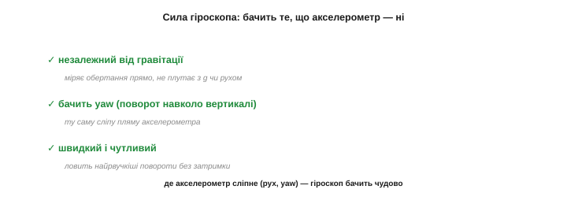
*Рис. 5.7.3.4. Що гіроскоп бачить, а акселерометр — ні. **Незалежний від гравітації**: міряє обертання прямо, не плутаючи його з g чи лінійним рухом. **Бачить yaw**: відчуває поворот навколо вертикалі — ту саму сліпу пляму акселерометра (§5.7.2). **Швидкий**: ловить найрвучкіші повороти без затримки. Там, де акселерометр сліпне (рух, yaw), гіроскоп бачить чудово.*

Звідси дві ключові переваги. По-перше, гіроскоп **точний під час руху** — саме тоді, коли акселерометр бреше; для швидкої, динамічної орієнтації (дрон у польоті, стабілізація камери) він незамінний. По-друге, він **бачить yaw** — поворот навколо вертикалі, якого акселерометр не відчуває зовсім. Гіроскоп — давач для **динаміки** там, де акселерометр — давач для **спокою**.

Як і акселерометр, гіроскоп **триосьовий**: міряє швидкість обертання навколо X, Y і Z окремо — крен, тангаж і рискання (*roll/pitch/yaw rate*). Три числа разом дають повний **вектор кутової швидкості**: куди і як швидко апарат повертається в просторі. Діапазон обирають під задачу (наприклад, ±250 °/с для плавних рухів, ±2000 °/с для рвучких, як у квадрокоптера), а одиниці — градуси за секунду.

Сирий вихід гіроскопа, як і акселерометра, — це відліки АЦП, які за паспортним коефіцієнтом переводять у °/с, і які теж **тремтять** від шуму (§5.7.5), тож потребують фільтрації. Та головна його вада — не миттєвий шум (його згладиш), а саме **повільний дрейф**, проти якого фільтр безсилий: усереднюй скільки завгодно, а сповзання нуля лишиться. Дрейф — окрема біда, що вимагає окремих ліків (фьюжн).

### Слабкість: інтегрування й дрейф

Та за все треба платити, і гіроскоп платить **дрейфом**. Згадайте: він дає **швидкість**, а нам зазвичай потрібен **кут**. Щоб із швидкості дістати кут, її **інтегрують** — накопичують у часі:

```
кут(t) = ∫ ω dt  ≈  Σ ω · Δt     (накопичуємо швидкість крок за кроком)
```

І ось де пастка: якщо в показі швидкості є навіть дрібний сталий **зсув нуля** (а він завжди є — давач «думає», що ледь крутиться, хоча нерухомий), то під час інтегрування цей зсув **накопичується без кінця**, і оцінка кута повільно «спливає» геть від правди.


*Рис. 5.7.3.5. Дрейф — головна вада гіроскопа. Давач лежить нерухомо, справжній кут — нуль (зелена лінія). Та через крихітний зсув нуля гіроскоп «думає», що ледь обертається, — і інтеграл цього зсуву дає оцінку кута, що неухильно росте (червона): хибний кут = зсув · час. За хвилини нерухомий гіроскоп може «накрутити» десятки градусів неіснуючого повороту. Кут від гіроскопа точний **накоротко**, але довго йому вірити не можна.*

Це **дзеркало** проблеми акселерометра. Там подвійне інтегрування прискорення давало катастрофічний дрейф **положення**; тут одне інтегрування швидкості дає повільніший, але невпинний дрейф **кута**. Гіроскоп чудовий на коротких інтервалах (секунди), та що довше ви на нього покладаєтесь, то далі «спливає» його оцінка.

Наскільки швидко спливає — залежить від **стабільності зсуву** конкретного давача. У дешевих MEMS зсув «гуляє» помітно (звідси дрейф у градуси за хвилини), у дорогих — на порядки менший. Та найпідступніше те, що зсув **повзе з температурою**: щойно давач нагрівся, його «нуль» поїхав, і навіть ретельне калібрування на старті не рятує надовго. Тому з дрейфом не борються поодинці гіроскопом — його неминуче доводиться **підправляти ззовні** (акселерометром, §5.7.6).

Звідси й практика **прогріву**: точні системи дають гіроскопу кілька хвилин «вийти на режим» (стабілізуватися за температурою), перш ніж довіряти його показу. Для аматорського ж рівня досить пам'ятати, що холодний, щойно ввімкнений гіроскоп дрейфує помітно сильніше, ніж прогрітий, — тож первинне калібрування зсуву варто робити вже теплим.

> 🔧 **Навіщо це.** Запам'ятайте: гіроскоп дає **швидкість**, а не кут. Хочете кут — інтегруйте (`кут += ω·Δt` щокроку), але **очікуйте дрейф**: оцінка точна на секунди, а далі неухильно повзе. Тому ніколи не покладайтеся на «голий» інтегрований гіроскоп для тривалого утримання кута — за хвилини він збреше на десятки градусів. Це не несправність, а сама природа інтегрування зсуву.

### Дзеркало акселерометра

Зіставмо обидва давачі — і побачимо, чому вони створені одне для одного. Їхні сили й слабкості **дзеркальні**:

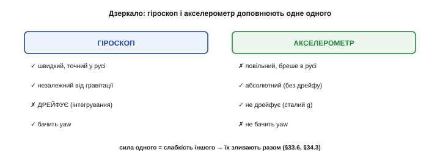
*Рис. 5.7.3.6. Ідеальна пара антиподів. **Гіроскоп**: швидкий і точний у русі, незалежний від гравітації, бачить yaw — але **дрейфує** (інтегрування зсуву). **Акселерометр**: повільний і «бреше» в русі, зате **абсолютний і не дрейфує** (сталий g — вічний орієнтир). Сила одного — точно слабкість іншого. Тому їх **зливають**: швидкий гіроскоп дає миттєву динаміку, а сталий акселерометр час від часу «підправляє» його дрейф.*

Гіроскоп **точний у русі, але дрейфує** з часом; акселерометр **дрейфу не має, але бреше в русі**. Що як узяти **краще від обох** — швидку, чисту динаміку гіроскопа на коротких інтервалах **і** абсолютну, бездрейфову прив'язку акселерометра на довгих? Саме це й роблять, **зливаючи** їх докупи (§5.7.6, §5.8.3): гіроскоп веде кут миттєво й гладко, а акселерометр повільно тягне його назад до істинного «низу», не даючи спливти. Два недосконалі давачі дають разом одну надійну оцінку.

Механізм цього злиття гарний у своїй простоті, і ви його впізнаєте — це фільтри Розділу 5.6. Швидку, динамічну частину беруть від **гіроскопа** (ніби пропустивши його крізь **високочастотний** фільтр — він добрий накоротко), а повільну, опорну — від **акселерометра** (крізь **низькочастотний** — він добрий надовго). Складені разом, вони покривають усі частоти: гіроскоп тримає кут від миті до секунд, акселерометр — від секунд і далі. Це і є **комплементарний фільтр** (§5.8.3), і саме тому ми спершу так ретельно вчили фільтри.

Результат злиття вражає простотою наслідку: маючи два **посередні** копійчані давачі, ви отримуєте оцінку орієнтації, гідну приладу в рази дорожчого. Гіроскоп дає **гладкість і швидкість**, акселерометр — **довготривалу правду**; разом — і те, і те. Саме тому жоден серйозний проєкт із орієнтацією не бере один давач: сила тут не в окремому чипі, а в **поєднанні**, і це поєднання — головна тема наступного розділу.

**Приклад (інтегрування й дрейф).** Спершу корисний випадок, тоді шкідливий:

```
гіроскоп дає ω = 30 °/с протягом 2 с:
   кут = ω · t = 30 · 2 = 60°          (інтеграл швидкості — правильний кут)
дрейф від зсуву нуля 1 °/с (давач нерухомий, а «думає», що крутиться):
   хибний кут = 1 °/с · 60 с = 60°     за одну хвилину неіснуючого повороту!
висновок: кут від гіроскопа точний накоротко, але неухильно «спливає» від зсуву
```

Шістдесят градусів брехні за хвилину з мізерного зсуву в 1 °/с — ось чому гіроскоп **сам по собі** не може довго тримати орієнтацію, і чому йому конче потрібен напарник-акселерометр.

> 🔧 **Навіщо це.** Перед роботою **виміряйте й відніміть зсув нуля** гіроскопа: потримайте апарат **нерухомо** кілька секунд, усередніть показ кожної осі — це і є зсув, який далі віднімають від кожного відліку. Простий крок, а він **різко** сповільнює дрейф (бо найбільша частина зсуву — стала й калібрується). Тільки пам'ятайте: зсув ще й **повзе** з температурою, тож повністю його не прибрати — лишок усе одно доведеться гасити акселерометром (§5.7.6).

> 🔧 **Навіщо це.** Думайте про гіроскоп і акселерометр як про **пару**, а не поодинці. Голий гіроскоп дрейфує, голий акселерометр сліпне в русі — а разом вони дають точну орієнтацію в будь-яких умовах. Тому в проєктах із орієнтацією завжди беріть **обидва** (а ще краще — готовий 6-осьовий IMU) і одразу плануйте їх **злити** (комплементарний фільтр чи Калман, Розділ 5.8), а не покладайтеся на жоден сам по собі.

Отже, гіроскоп — це вібрівна маса, що силою Коріоліса відчуває обертання й віддає його **швидкість**: звідси його сила (незалежність від гравітації, чутливість до руху й yaw) і його межа (дрейф від інтегрування зсуву). Разом з акселерометром вони покривають **нахил і обертання** в усіх режимах. Лишається третя сліпа пляма обох: **абсолютний курс** — куди апарат повернений відносно сторін світу. Бо ні акселерометр, ні гіроскоп самі цього не скажуть: гравітація однакова на всі азимути (вона лише про «низ»), а гіроскоп лише **рахує зміни** кута від невідомого початку, та ще й дрейфує. Потрібен зовнішній, абсолютний орієнтир **напрямку** — і він є. Її закриває останній давач IMU — **магнітометр**, що відчуває магнітне поле Землі, як стрілка компаса. До нього й переходимо.

---

## 5.7.4 Магнітометр: відчути сторони світу

Третій давач IMU закриває останню сліпу пляму: **абсолютний курс** — куди апарат повернений відносно сторін світу. Магнітометр робить це, як компас: відчуває **магнітне поле Землі** й за його напрямком визначає, де північ. Це безцінно — бо дає **бездрейфову** прив'язку yaw, якої ні акселерометр, ні гіроскоп не мають. Та магнітометр — **найхитріший** із трьох: його легко обдурити будь-яким залізом чи магнітом поряд, і без калібрування він майже завжди бреше. Розберімо, що він міряє, як дає курс і чому з ним стільки клопоту.

Налаштуйтеся: магнітометр — давач-парадокс. Він дає найцінніше для орієнтації — **абсолютний** напрямок, незалежний від часу й руху, — і водночас він найненадійніший, бо міряє мізерне поле, яке заглушає будь-яка залізяка. Тому на нього не можна ні махнути рукою (без нього нема курсу), ні сліпо довіряти (без калібрування він бреше). Уся робота з магнітометром — це балансування між його унікальною користю й його примхливістю.

### Що міряє магнітометр: вектор поля

Магнітометр міряє **магнітне поле** — його напрямок і силу, по трьох осях, як вектор. На Землі панує **геомагнітне** поле (те, що крутить стрілку компаса), тож, відчувши його напрямок, давач і визначає курс. Важлива деталь із §5.7.1: магнітометр — **не** MEMS-механіка; усередині немає вантажа на пружинках. Поле він міряє електрично — найчастіше **ефектом Холла** (напруга поперек провідника зі струмом у полі) чи **магнітоопором** (опір матеріалу залежить від поля). Його просто оселили в тому самому корпусі IMU поряд із механічними побратимами.

Сам компас — найдавніший із наших давачів орієнтації: магнітну стрілку (намагнічений «магнітний камінь») для навігації застосовували ще тисячу років тому. Електричний же спосіб відчути поле дав **ефект Холла**, відкритий американцем **Едвіном Холлом** (*Edwin Hall*) ще 1879 року: у провіднику зі струмом, поміщеному в магнітне поле, з'являється поперечна напруга, пропорційна полю. Сучасний MEMS-сусід — магнітометр — це, по суті, той самий тисячолітній компас, зведений до кремнієвого чипа.

Варто оцінити вагу цього давача в історії: саме компас уможливив **далеку морську навігацію** — плавання поза видимістю берега й зірок, відкриття континентів, глобальну торгівлю. Тисячу років мореплавці довіряли життя магнітній стрілці. Тепер той самий принцип у кремнієвому чипі веде ваш дрон чи телефон — пряма, неперервна лінія від компаса давніх мореплавців до IMU у вашій руці.

Сила геомагнітного поля — лише десятки мікротесла, у сотні разів слабша за поле звичайного побутового магніту. Звідси й уся вразливість: давач намагається почути слабкий «шепіт» Землі, а будь-який магніт поряд «перекрикує» його. Тримати це в голові корисно: магнітометр — це чутливе вухо, націлене на дуже тихий, але всюдисущий сигнал.


*Рис. 5.7.4.1. Магнітометр як електронний компас. Давач відчуває напрямок магнітного поля Землі по трьох осях. За цим напрямком визначають **курс** (азимут) — куди ви повернені відносно півночі. На відміну від акселерометра (що знає лише «низ») і гіроскопа (що лише рахує зміни), магнітометр дає **абсолютну** прив'язку до сторін світу — і саме її бракувало для повної орієнтації.*

### Поле Землі: нахилене на північ

Одна тонкість, що псує життя новачкам: поле Землі спрямоване **не** строго на північ уздовж поверхні. Воно ще й **«занурюється» в землю** під кутом (це звуть **нахилом**, *inclination* або *dip*): біля екватора майже горизонтальне, а ближче до полюсів — дедалі крутіше вниз, аж до прямовисного. Для **курсу** потрібна лише **горизонтальна** складова поля — та, що лежить уздовж поверхні й вказує на магнітну північ.

Саме поле породжує розплавлене ядро Землі (геодинамо), і воно **не ідеальне**: магнітні полюси не збігаються з географічними й повільно **блукають** (магнітна північ за останнє століття зсунулася більш ніж на тисячу кілометрів), а сила поля різниться від місця до місця. Тому й курс за компасом — лише наближення до справжнього, що вимагає поправок (схилення) і час від часу — оновлення даних про поле.

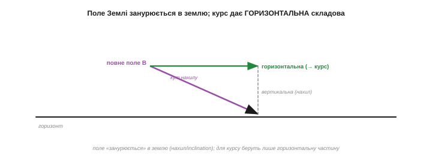
*Рис. 5.7.4.2. Поле, що дивиться в землю. Геомагнітне поле — не горизонтальне: воно «занурюється» під кутом нахилу (стрімкіше до полюсів). Для визначення курсу беруть лише його **горизонтальну** складову (зелена), що вказує на магнітну північ; вертикальна (сіра) для курсу зайва. Тому магнітометр сам по собі дає курс правильно лише коли давач **вирівняний** — інакше частина «вертикального» поля затече в горизонтальні осі й збреше.*

### Курс із горизонтальних складових

Сам курс рахують просто — як кут горизонтального поля через арктангенс:

```
магнітний курс:  ψ = atan2(mY, mX)
де mX, mY — горизонтальні складові поля по осях давача
```

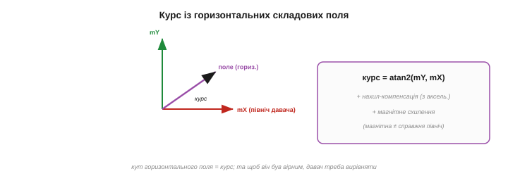
*Рис. 5.7.4.3. Звідки береться курс. Дивлячись згори, горизонтальне поле вказує під певним кутом до осей давача — це й є курс, який рахують через `atan2(mY, mX)`. Та два «але»: давач має бути **вирівняний** (бо нахил поля інакше «протече» в осі — потрібна нахил-компенсація з акселерометра), і магнітна північ — **не** справжня (різниця зветься магнітним схиленням і залежить від місця).*

Два важливі застереження. По-перше, формула вірна лише коли давач **горизонтальний**; якщо він нахилений, частина «зануреного» поля затікає в горизонтальні осі й курс пливе — тому на практиці роблять **нахил-компенсацію**, повертаючи вектор поля в горизонт за даними **акселерометра** (ось перший приклад, де давачі вже працюють разом!). По-друге, магнітна північ не збігається зі справжньою (географічною) — їх розділяє **магнітне схилення** (*declination*), що різниться від місця до місця й яке треба додати, щоб дістати справжній курс.

Нахил-компенсація — не дрібниця, а необхідність. Без неї простий нахил давача **сам по собі** змінює показ курсу, навіть якщо ви не поверталися: частина крутого «зануреного» поля затікає в горизонтальні осі й підмішується до курсу. Тому ручний компас завжди тримають **рівно**; а в електронному цю рівність забезпечує акселерометр, що каже, де «низ», — і за ним поле повертають у горизонт перед обчисленням курсу. Ось перший наочний доказ, що курс надійний лише в **зв'язці** двох давачів.

І ще про схилення: воно не лише різне за місцем, а й **повільно міняється з часом** (бо полюси блукають), тож авіаційні й морські карти періодично оновлюють. Для побутового проєкту це несуттєво, але знати варто: «магнітна північ» — рухома ціль, а не вічна константа.

### Сила: абсолютний курс без дрейфу

Попри весь клопіт, магнітометр дає те, чого більше ніхто в IMU не вміє: **абсолютний курс, що не дрейфує**. Поле Землі — сталий зовнішній орієнтир, тож «де північ» давач знає **завжди**, без накопичення похибки. Це робить його ідеальним напарником гіроскопа саме по **yaw**: гіроскоп дає швидкі зміни курсу, але дрейфує, а магнітометр повільно, але **надійно** тягне курс назад до істинної півночі.

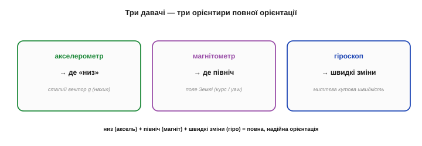
*Рис. 5.7.4.4. Трійця, що дає повну орієнтацію. **Акселерометр** → де «низ» (нахил, зі сталого g). **Магнітометр** → де північ (курс, із поля Землі). **Гіроскоп** → швидкі зміни (миттєва кутова швидкість). Кожен дає свій абсолютний чи динамічний орієнтир; разом — повна, надійна орієнтація в просторі. Магнітометр — саме той, хто прив'язує курс до сторін світу.*

Тепер картина повна: акселерометр дає «низ», магнітометр — «північ», гіроскоп — швидку динаміку. Два абсолютні орієнтири (низ і північ) задають орієнтацію без дрейфу, а гіроскоп робить її гладкою й швидкою. Це і є три стовпи орієнтації, які наступний розділ навчить зливати в одне.

Зверніть увагу на красиву **надмірність**: два абсолютні орієнтири — гравітація (вниз) і магнітне поле (на північ) — разом **повністю** задають орієнтацію тіла в просторі, бо це два різні незмінні напрямки. Гіроскоп тут навіть не обов'язковий для самої орієнтації — він лише робить її **швидкою й гладкою** між абсолютними «прив'язками». Систему, що так зводить три давачі в орієнтацію, звуть **AHRS** (*Attitude and Heading Reference System*) — і саме її будує Розділ 5.8.

Звідси й назва **дев'ятиосьовий IMU**: три осі прискорення + три осі обертання + три осі магнітного поля. Дев'ять чисел із одного копійчаного корпусу — рівно стільки, скільки треба, щоб повністю визначити й орієнтацію, і її зміни. Кожна трійка закриває свою грань задачі, а разом вони дають апарату повне «чуття» свого положення в просторі.

Чому саме **двох** абсолютних векторів досить для повної орієнтації? Бо гравітація задає два кути (нахил — крен і тангаж), залишаючи невизначеним лише поворот навколо вертикалі; а магнітне поле, не паралельне гравітації, якраз і закриває цей останній, третій кут — курс. Два різні незмінні напрямки повністю «приколюють» тіло в просторі. Якби в нас був лише один із них, одна вісь обертання так і лишалася б невідомою.

### Біда: будь-яке залізо бреше

А тепер — головна причина, чому магнітометр найважчий із трьох. Поле Землі **дуже слабке**, тож будь-яке **залізо** чи **магніт** поряд легко його перекручує. Динамік зі своїм магнітом, сталевий гвинт, доріжка зі струмом, моторчик, навіть батарея — усе це **спотворює** поле в місці давача, і компас починає брехати.

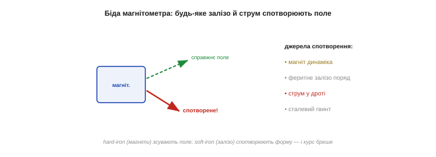
*Рис. 5.7.4.5. Найвразливіший давач. Слабке поле Землі легко перекручує будь-яке залізо чи магніт поряд. **Hard-iron** спотворення — від постійних магнітів (динаміки, мотори): вони **зсувають** поле, наче додають свій сталий вектор. **Soft-iron** — від феромагнітного заліза (гвинти, корпус): воно **викривлює** форму поля. Плюс струми в дротах. Через усе це сирий магнітометр майже завжди дає хибний курс.*

Спотворення бувають двох видів. **Hard-iron** (від постійних магнітів) **зсуває** поле — додає сталий власний вектор, тож компас постійно «дивиться вбік». **Soft-iron** (від звичайного заліза, що саме намагнічується полем Землі) **викривлює** форму поля по-різному в різних напрямках. Разом вони роблять сирий показ магнітометра практично непридатним без виправлення.

Окремо підступні **рухомі** й **змінні** джерела. Мотори дрона під час польоту створюють поле, що **міняється** зі швидкістю обертання, а струми в силових дротах — зі споживанням; таке спотворення **не сталеве**, тож калібруванням його не прибрати. Тому магнітометр у дроні часто виносять на щоглу **подалі** від моторів і акумулятора. Сталі завади (корпус, гвинти) калібрують; змінні (мотори, струми) — лише уникають рознесенням у просторі.

Корисний самодіагноз: **довжина** вектора поля під час обертання давача має лишатися **сталою** — адже сила поля Землі в одному місці незмінна, хоч би як ви крутили компас. Якщо ж під час обертання довжина «гуляє» — це певна ознака спотворення (hard-iron, soft-iron чи зовнішнє джерело). Та сама перевірка довжиною, що рятувала акселерометр (§5.7.2), працює й тут: стала довжина — поле чисте, мінлива — є завада.

До речі, магнітометру й не треба бути швидким: курс міняється повільно, тож його показ, як і гравітацію акселерометра, можна сильно **фільтрувати** (ФНЧ) проти шуму без шкоди для динаміки. Швидку ж зміну поворотів усе одно дає гіроскоп. Тож роль магнітометра у злитті — повільний, але **абсолютний** орієнтир курсу: для yaw він те саме, що акселерометр для нахилу.

### Калібрування: вісімка

На щастя, спотворення (принаймні від речей, **закріплених разом** із давачем на платі) **сталі** — тож їх можна **відкалібрувати**. Прийом знаменитий: покрутити пристрій **«вісімкою»** на всі боки. Якби поля не спотворювали, кінчик вектора поля під час обертання малював би ідеальну **сферу** з центром у нулі. Спотворення зміщують її центр (hard-iron) і роблять овальною (soft-iron). Зібравши точки під час «вісімки», знаходять цей зсув і викривлення — і далі **виправляють** кожен показ, повертаючи сферу на місце.

Математично це — підгонка **еліпсоїда** під хмару зібраних точок: знайти його центр (це hard-iron зсув, який віднімають) і його розтяг по осях (це soft-iron масштаб, на який ділять), щоб обернути еліпсоїд назад на центровану сферу. Звучить складно, та робиться раз і автоматично; багато сучасних IMU-чипів навіть мають **вбудоване** автокалібрування, що поступово підправляє поле під час звичайної роботи.

Калібрування — не «раз і назавжди». Переставили давач, додали металеву деталь, змінили компоновку — і спотворення стало іншим, тож калібруйте **наново**. Допомагає й те, що магнітне середовище злегка пливе з температурою. Тому надійні системи або перекалібровують періодично, або покладаються на автокалібрування під час роботи.

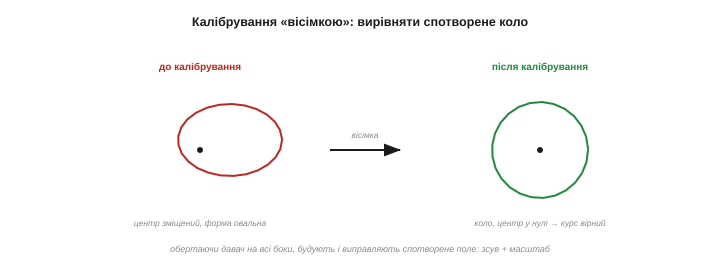
*Рис. 5.7.4.6. Як калібрують компас. До калібрування точки поля під час обертання лягають у зміщений овал (червоне) — наслідок hard- і soft-iron спотворень. Покрутивши давач «вісімкою» на всі боки, збирають ці точки, знаходять **зсув** (hard-iron) і **масштаб/перекіс** (soft-iron) — і виправляють кожен наступний показ, повертаючи овал у центроване **коло** (зелене). Лише тоді курс стає вірним.*

> 🔧 **Навіщо це.** Магнітометр — **найвразливіший** давач IMU: тримайте його якнайдалі від магнітів, моторів, силових дротів і феромагнітних деталей, а ще краще — рознесіть із ними на платі. Усе металеве, що рухається **відносно** давача (а не закріплене з ним), спотворить курс непередбачувано, і калібрування тут не поможе. Перше питання при «брехливому компасі»: що залізне чи струмове є поряд?

> 🔧 **Навіщо це.** Завжди **калібруйте** магнітометр на місці — «вісімкою» після того, як він **уже встановлений** у корпус (бо корпус, гвинти й сусідні деталі теж спотворюють поле, і калібрувати треба разом із ними). Без калібрування курс легко бреше на десятки градусів. І пам'ятайте: переставили давач чи додали металеву деталь — калібруйте **наново**.

**Приклад (курс зі схиленням).** Давач вирівняний, читаємо горизонтальне поле:

```
горизонтальні складові:  mX = 0.80,  mY = 0.60   (умовні одиниці, після калібрування)
магнітний курс:          ψ = atan2(0.60, 0.80) ≈ 37°  (від магнітної півночі)
магнітне схилення в місці: +6°   (магнітна північ ≠ справжня)
справжній курс:          ≈ 37° + 6° = 43°  від географічної півночі
(і це лише коли давач вирівняний; інакше потрібна нахил-компенсація з акселерометра)
```

Зверніть увагу, скільки умов: калібрування, вирівнювання, схилення — і лише тоді курс правдивий. Магнітометр дає безцінну річ (абсолютний азимут), але вимагає за неї найбільше уваги.

> 🔧 **Навіщо це.** Для **справжнього** курсу не забудьте магнітне схилення вашого регіону (його беруть із карт чи онлайн-моделей поля Землі за координатами). Магнітна й географічна північ можуть розходитися на одиниці-десятки градусів залежно від місця. Якщо вам потрібен лише **відносний** курс (зміна напрямку), схилення можна знехтувати; а для навігації за справжньою північчю — обов'язково врахуйте.

Попри весь цей клопіт — завади, калібрування, схилення, компенсацію нахилу — магнітометр лишається **незамінним**: без нього курс неминуче спливе разом із дрейфом гіроскопа, і апарат за хвилини «забуде», куди він повернений. Тож з його примхами миряться заради однієї, але критичної здатності — **пам'ятати про північ**, хоч би скільки минуло часу.

Отже, магнітометр доповнює пару акселерометр-гіроскоп третім, останнім орієнтиром — **абсолютною північчю**, — ціною найбільшої вразливості до завад і потреби в калібруванні. Тепер у нас є всі три давачі IMU, і вимальовується спільна, важлива тема: **жоден із них не ідеальний**. Акселерометр шумить і плутає рух із гравітацією; гіроскоп дрейфує; магнітометр піддається завадам. Перш ніж зливати їх докупи (а саме до цього все йде), варто чесно роздивитися їхні **вади** — шум, зсув нуля, дрейф — і зрозуміти, чому кожен давач сам по собі недостатній. Бо саме з ясного розуміння, що кожен давач уміє, а де неминуче бреше, і виростає головна ідея модуля: злити їх так, щоб сильні боки одного гасили вади іншого. Це наступна тема.

---

## 5.7.5 Шум, зсув нуля, дрейф

Ми познайомилися з усіма трьома давачами IMU й у кожного бачили вади. Час їх **систематизувати**, бо за різноманіттям проблем стоять лише **три** фундаментальні види похибки, що їх має **будь-який** давач: **шум**, **зсув нуля** і **дрейф**. Це повторення класифікації §5.1.5, але тепер прицільно для інерціальних давачів — і з головним практичним висновком: **кожному виду похибки потрібні свої ліки**, а останній із них, дрейф, узагалі не лікується поодинці й саме тому **робить фьюжн неминучим** (§5.7.6). Розрізняти ці три — ключ до приборкання MEMS.

Хоч ми й говоримо про IMU, ця трійця — **універсальна**: шум, зсув і дрейф має геть **будь-який** давач, від термометра до фотодіода (§5.1.5). Тому, опанувавши їх тут, ви матимете рамку для **кожного** давача, що зустрінете. MEMS просто демонструє всі три особливо яскраво — бо крихітний і дешевий, а отже, найбільш недосконалий. Те, що в дорогому прецизійному приладі ледь помітне, у копійчаному чипі видно неозброєним оком.

Тепер видно й те, навіщо ми так ретельно вчили фільтрацію (Розділи 5.4–5.6) **перед** давачами: половина роботи з MEMS — це не зчитати показ, а **очистити** його від цих трьох похибок. Сирий вихід давача майже ніколи не використовують напряму; між ним і рішенням завжди стоїть обробка. Знання фільтрів — не окрема тема, а **передумова** роботи з реальними давачами.

### Три види похибки

Сирий показ давача — це **не** чиста правда, а правда, спотворена трьома накладеними помилками: швидким **шумом**, сталим **зсувом** і повільним **дрейфом**.

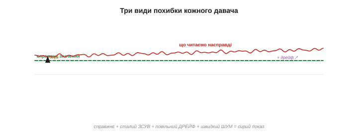
*Рис. 5.7.5.1. Із чого складається похибка. Сирий показ давача (червоне) — це справжнє значення (зелене) плюс **сталий зсув** (постійне зміщення вгору), плюс **повільний дрейф** (зміщення, що сповзає з часом), плюс **швидкий шум** (дрібне тремтіння). Три різні помилки з трьома різними характерами — і, як побачимо, з трьома різними ліками. Розкласти показ на ці складові — перший крок до чистої величини.*

Розрізняти їх критично, бо вони **зовсім різні за природою**: шум випадковий і швидкий, зсув сталий, дрейф повільний і непередбачуваний. Сплутати їх — значить лікувати не те. Пройдімося кожним.

Побачити ці три в реалі просто: залиште давач **нерухомим** і запишіть його вихід кілька хвилин. Дрібне швидке тремтіння навколо лінії — це **шум**. Те, що лінія йде не по нулю, а зміщена, — **зсув**. А те, що ця лінія повільно **сповзає** за хвилини, — **дрейф**. Один п'ятихвилинний запис нерухомого давача наочно показує всі три біди — і це найперше, що варто зробити з новим IMU, перш ніж йому довіряти.

### Шум: випадкове тремтіння

**Шум** — це дрібне швидке тремтіння показу навколо правди: тепловий (броунівський) рух механіки (§5.7.1), наводки, квантування АЦП. Він **випадковий**, **симетричний** і **нуль-середній**: іноді більше, іноді менше, але в середньому **нуль**, тож правди він не зсуває — лише розмазує навколо неї.

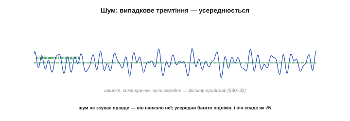
*Рис. 5.7.5.2. Шум — і як його прибрати. Дрібне, швидке, симетричне тремтіння навколо справжнього (середнього) значення. Оскільки в середньому воно **нуль**, його прибирають **усередненням** — фільтрацією (Розділи 5.4–5.6): що більше відліків усереднити, то менший шум (спадає у √N разів). Шум — найлегша з трьох бід, бо проти нього є прямий і надійний інструмент.*

Через випадковість шуму проти нього є прямий лік — **фільтрація** (усереднення, §5.4.2; гладке ФНЧ, §5.6.4): усередни багато відліків, і тремтіння спаде як 1/√N. Шум — найдобріша з трьох бід, бо з ним ми вже вміємо боротися.

У даташиті шум задають **щільністю** — скільки його на одиницю смуги (наприклад, мкg/√Гц для акселерометра, °/с/√Гц для гіроскопа). З неї видно головний компроміс: що **ширша** смуга (швидший давач), то **більше** шуму пролазить; звузиш смугу фільтром — менше шуму, але повільніша реакція (§5.4.5). Тому «скільки фільтрувати» — це завжди торг між тишею й свіжістю, і він прямо випливає зі шумової щільності конкретного давача.

### Зсув нуля: стале зміщення

**Зсув нуля** (*bias, offset*) — це **постійне** зміщення показу від правди. Гіроскоп, що лежить нерухомо, «думає», що ледь крутиться (ω ≠ 0); акселерометр показує не рівно 1g; магнітометр має hard-iron зсув. Це не випадковість, а **стала** добавка, однакова від відліку до відліку.

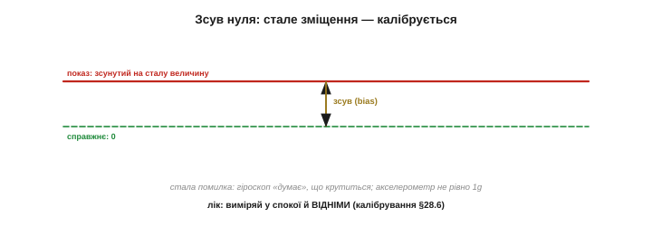
*Рис. 5.7.5.3. Зсув нуля — і як його прибрати. Сталий зсув показу від справжнього нуля: давач у спокої показує не нуль, а якесь стале число. Оскільки зсув **сталий**, його прибирають **калібруванням** (§5.1.6): виміряй показ у спокої (це і є зсув) і **віднімай** його від кожного наступного відліку. Один раз зміряв — і далі віднімаєш.*

Оскільки зсув сталий, його лік — **калібрування** (§5.1.6): зміряй показ давача у спокої (це і є зсув) і **віднімай** його надалі. Для гіроскопа це той самий «зсув нуля в спокої» з §5.7.3; для акселерометра — корекція по 1g; для магнітометра — hard-iron центрування «вісімкою» (§5.7.4). Зсув — теж піддатлива біда, поки він **справді** сталий.

Поряд із простим зсувом є й інші **сталі** похибки, що теж калібруються: **похибка масштабу** (давач показує, скажімо, 0.98 від справжнього — множник трохи не той) і **перехресна чутливість** (рух по одній осі трохи відгукується на сусідній, бо осі не ідеально перпендикулярні). Усі вони сталі, тож, як і зсув, вимірюються й виправляються раз. Повне калібрування давача — це не лише відняти зсув, а й підправити масштаб та розв'язати осі.

На практиці зсув часто прибирають **обнуленням на старті** (*tare*): під час увімкнення, поки апарат завідомо нерухомий, кілька секунд усереднюють показ і запам'ятовують його як «нуль». Так роблять ваги, нівеліри, контролери дронів. Це той самий принцип калібрування зсуву, тільки автоматичний і щоразу свіжий — що особливо доречно, бо зсув же повзе між запусками.

### Дрейф: коли зсув сам повзе

А ось і найпідступніша похибка. **Дрейф** — це коли сам **зсув не стоїть на місці**, а повільно **повзе** з часом і температурою. Сьогодні гіроскоп має зсув 0.5 °/с, через хвилину нагрівся — і вже 0.7, а ще через годину — інший. Дрейф — **не швидкий шум із нульовим середнім** (тож фільтр його не бере — усереднюй скільки хочеш, а повільне сповзання лишиться) і **не сталий** (тож калібрування на старті не рятує — зсув же змінився).

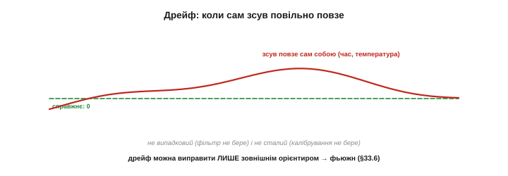
*Рис. 5.7.5.4. Дрейф — найпідступніша похибка. Сам зсув повільно сповзає (з часом, температурою), тож він і не випадковий (фільтр безсилий — нема чого усереднювати в нуль), і не сталий (калібрування на старті застаріває). Це «вислизаюча» помилка, яку **неможливо** прибрати самим давачем. Єдині ліки — час від часу звіряти показ із **зовнішнім** незмінним орієнтиром, тобто зливати з іншим давачем (§5.7.6).*

Через це дрейф **неможливо** прибрати ні фільтрацією, ні разовим калібруванням — бо він не має ні випадковості шуму, ні сталості зсуву. Єдиний спосіб його приборкати — час від часу **звіряти** показ давача з якимось **зовнішнім, незмінним** орієнтиром і підправляти. А це вже й є **фьюжн** (§5.7.6) — і саме дрейф робить його не розкішшю, а необхідністю.

Головний винуватець дрейфу — **температура**. Кремній розширюється від нагріву, міняючи жорсткість пружин і зазори гребінців (§5.7.1), а з ними — і зсув, і масштаб. Тому давач, відкалібрований холодним, прогрівшись, поїде; а в дрона, що то злітає, то висить, температура (а з нею й дрейф) гуляє постійно. Кращі чипи мають **вбудовану температурну компенсацію** (міряють свою температуру й підправляють показ), та повністю дрейф не прибирає й вона.

Є в дрейфу й чисто випадкова частка — повільне **блукання** зсуву, що його не пояснити навіть температурою (його звуть нестабільністю зсуву, *bias instability*). На відміну від швидкого шуму, це блукання дуже повільне, тож фільтр його не зачепить, а передбачити наперед — не вийде. Саме ця непередбачувана повзучість і робить дрейф принципово невиправним зсередини давача: нема ні закономірності, щоб скомпенсувати, ні випадковості, щоб усереднити.

> 🔧 **Навіщо це.** Перш ніж боротися з похибкою, **назвіть її тип** — бо ліки геть різні. Тремтить навколо середнього — це **шум**, фільтруй (§5.4–5.6). Стоїть на сталому зміщенні — це **зсув**, калібруй і віднімай (§5.1.6). Повільно сповзає сам собою — це **дрейф**, і його **не подужати** ні фільтром, ні калібруванням: лише зовнішнім орієнтиром (фьюжн). Найгрубіша помилка новачка — лити проти дрейфу фільтр (марно) або проти шуму калібрування (теж марно).

### Кожному давачу — своя біда

Хоча всі три похибки є в кожного давача, у кожного **переважає своя** — і саме вона визначає його характер.

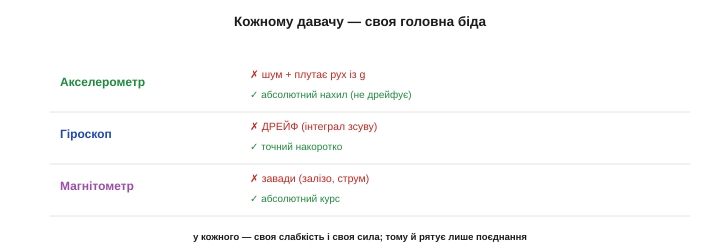
*Рис. 5.7.5.5. Головна біда кожного. **Акселерометр**: шум і плутання руху з гравітацією — зате нахил **абсолютний**, без довготривалого дрейфу. **Гіроскоп**: інтегрування зсуву дає згубний **ДРЕЙФ** кута — зате точний накоротко. **Магнітометр**: **завади** від заліза й струму — зате курс абсолютний. У кожного — своя слабкість і своя сила, дзеркальні до сусідів.*

- **Акселерометр**: головно **шум** і плутання руху з гравітацією (§5.7.2). Та його нахил **абсолютний** — у нього нема накопиченого дрейфу, бо гравітація — вічний орієнтир.
- **Гіроскоп**: головно **дрейф** — інтеграл навіть дрібного зсуву невпинно «спливає» (§5.7.3). Зате накоротко він найточніший і найшвидший.
- **Магнітометр**: головно **завади** (зовнішнє спотворення поля, §5.7.4). Зате його курс **абсолютний**, як і нахил акселерометра.

Помітьте дзеркальність: у акселерометра й магнітометра головна сила — **абсолютність** (нема дрейфу), а слабкість — чутливість до завад/руху; у гіроскопа навпаки — сила в точності накоротко, слабкість у **дрейфі**. Ця дзеркальність — не випадковість, а **ключ**: вона і робить можливим злиття.

Інженери навіть мають окрему міру, що показує, як похибка давача росте з часом інтегрування (її звуть варіацією Аллана): накоротко переважає шум, що з усередненням спадає, а надовго бере гору дрейф, що з часом лише зростає. Між ними є «солодка точка» — оптимальний час усереднення, де сумарна похибка найменша. Глибше воно нам не знадобиться; важлива сама картина: **накоротко давачу можна вірити, надовго — ні**, а межа між «коротко» й «надовго» — це і є його дрейф.

Один нюанс про дзеркальність: «абсолютність» акселерометра й магнітометра не означає, що вони ідеальні — їхня **миттєва** похибка (шум, рух, завади) може бути велика. Просто вона не **накопичується**: усереднена за часом, вона лишається обмеженою, тоді як дрейф гіроскопа росте без меж. Обмежена-але-шумна правда проти гладкої-але-спливаючої — ось точна суть пари.

### Кожній похибці — свої ліки

Зведімо все в карту «похибка → лік», бо вона веде прямо до наступної теми.

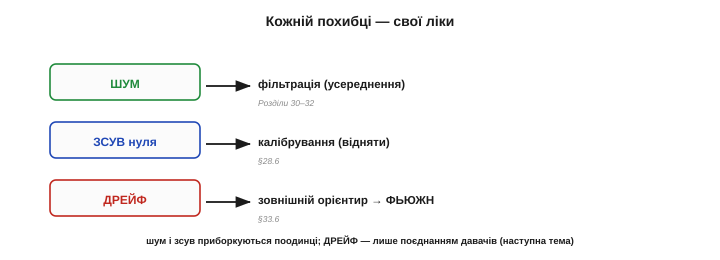
*Рис. 5.7.5.6. Три похибки — три ліки. **Шум** → фільтрація (усереднення, Розділи 5.4–5.6). **Зсув** → калібрування (зміряти й відняти, §5.1.6). **Дрейф** → зовнішній орієнтир, тобто **фьюжн** (§5.7.6). Перші два приборкуються давачем **наодинці**; третій — **ні**, і саме тому давачі доводиться поєднувати. Карта похибок прямо вказує, чому наступна тема неминуча.*

- **Шум** → **фільтрація** (Розділи 5.4–5.6): усереднюй випадкове.
- **Зсув** → **калібрування** (§5.1.6): зміряй сталу добавку й віднімай.
- **Дрейф** → **фьюжн** (§5.7.6): звіряй із зовнішнім незмінним орієнтиром.

За цим стоїть глибша істина: **зі джерела, що саме спливає, неможливо «витягнути» абсолютну правду власними силами** — її просто нема звідки взяти. Гіроскоп не знає, де він був на початку й куди поїхав його нуль; усе, що в нього є, — зміни, які він же й накопичує разом із похибкою. Щоб дізнатися абсолютне, потрібен абсолютний **зовнішній** свідок. Дрейф — це, по суті, втрата абсолютної прив'язки, і повернути її може лише той, у кого вона є (акселерометр, магнітометр).

Ось висновок усієї теми: шум і зсув давач долає **сам** — фільтром і калібруванням. А дрейф — **ні**: ні усереднення, ні разова поправка його не беруть. Його приборкує лише **інший давач**, що дрейфу не має й може раз у раз підправляти першого. Саме тому жоден MEMS-давач сам по собі не дає надійної тривалої оцінки — і саме тому далі ми їх **зливаємо**.

Усі ці характеристики — шумова щільність, стабільність зсуву, температурний коефіцієнт — виробник чесно вказує в **даташиті**. Навчившись їх читати, ви ще до паяння знатимете, чого чекати від давача: наскільки він тихий, наскільки дрейфливий, як реагує на тепло. Дорожчий давач — це майже завжди менші ці три числа. Тому вибір IMU під задачу — це, по суті, вибір прийнятного рівня шуму й дрейфу за вашу ціну.

**Приклад (нерухомий гіроскоп).** Покладімо гіроскоп на стіл (справжня ω = 0) і розкладімо його показ:

```
ω(t) = справжнє(0) + зсув + дрейф(t) + шум(t)
     ≈   0   +   0.5 °/с   +   повільне сповзання   +   ±0.1 °/с тремтіння
ліки по черзі:
   шум   → усереднити (ФНЧ): тремтіння ±0.1 спадає               ✓ сам давач
   зсув  → відняти 0.5 °/с (калібрування в спокої)               ✓ сам давач
   дрейф → лишається! повзе далі — прибере ЛИШЕ акселерометр     → фьюжн (§5.7.6)
```

Два з трьох ми приборкали наодинці; третій — дрейф — лишився непереможеним і чекає на напарника. Ось чому самого гіроскопа замало для тривалого утримання кута.

Зверніть увагу на красу майбутнього розв'язку. Дрейф гіроскопа повільний — отже, він живе на **низьких** частотах. А акселерометр на низьких частотах якраз надійний (стала гравітація). Тож досить узяти **низькочастотну** правду від акселерометра й **високочастотну** свіжість від гіроскопа — і дрейф зникає сам собою, бо його частоти перекриває чесний акселерометр. Це не випадковий трюк, а пряме застосування фільтрів Розділу 5.6 до пари давачів — і саме його ми побачимо в §5.8.3.

> 🔧 **Навіщо це.** Калібруйте **зсув** на старті (давач у спокої, усередни показ, відніми надалі) — це безкоштовно прибирає велику частину похибки гіроскопа й акселерометра. Але **не сподівайтеся**, що цього досить: зсув **повзе**, тож разове калібрування застаріває, і лишок (дрейф) усе одно доведеться гасити фьюжном. Калібрування — необхідний перший крок, та не останній.

> 🔧 **Навіщо це.** Не плутайте **шум** і **дрейф** на вигляд: обидва «псують» сигнал, але шум — швидкий і симетричний (фільтрується), а дрейф — повільне однобоке сповзання (не фільтрується). Якщо ваш кут із гіроскопа повільно «їде» в один бік — це дрейф, і сильніший фільтр його **не** зупинить, лише додасть затримки. Діагноз тут той самий, що в §5.4.1: спершу зрозумій, **яка** саме біда, тоді бери відповідний інструмент.

Отже, у кожного давача — три похибки (шум, зсув, дрейф), і кожній — свій лік (фільтр, калібрування, фьюжн). Перші дві ми долаємо тим, що вже вміємо. А третя, дрейф, лишає нас із єдиним виходом — **поєднати** давачі так, щоб бездрейфовий орієнтир одного раз у раз підправляв повзучий показ іншого. Чому фьюжн необхідний і як саме давачі доповнюють одне одного — підсумкова тема цього розділу, що відкриває двері до орієнтації й керування (Розділ 5.8). До неї — до фьюжну, що з трьох недосконалих давачів робить одну надійну оцінку, — ми й переходимо.

---

## 5.7.6 Чому потрібен фьюжн

Ми дійшли до висновку, що збирає весь розділ докупи: **жоден** давач IMU сам по собі не дає надійної орієнтації. Акселерометр шумить і плутає рух із гравітацією, гіроскоп невпинно дрейфує, магнітометр піддається завадам. Та є рятівна обставина: їхні вади **дзеркальні**, тож, **поєднавши** давачі, можна дістати оцінку, кращу за будь-який із них окремо. Це й зветься **фьюжном** (сенсорним злиттям). Ця тема — про те, **чому** він необхідний і **як** давачі доповнюють одне одного; вона закриває Розділ 5.7 і відчиняє двері в Розділ 5.8, де фьюжн перетвориться на робочі алгоритми.

Варто одразу сказати ширше: **фьюжн** — не вузький прийом для IMU, а одна з найважливіших ідей усієї інженерії давачів. Будь-де, де є кілька недосконалих джерел тієї самої величини, їх вигідно **поєднати**, щоб дістати краще за кожне окремо: GPS зливають з IMU (супутник дає абсолютну позицію рідко й грубо, IMU — швидко й гладко між оновленнями), камеру з IMU (візуальна одометрія), кілька термометрів чи мікрофонів. Опанувавши фьюжн тут, на IMU, ви матимете рамку, що працює всюди.

Ця тема — кульмінація розділу: усе попереднє (як влаштовані давачі, що міряють, чому помиляються) вело сюди — до розуміння, що **поодинці вони безпорадні, а разом потужні**. Фьюжн — не додаткова опція, а спосіб узагалі зробити дешеві MEMS придатними для серйозної орієнтації. Без нього три копійчані чипи лишилися б трьома джерелами сміття; з ним стають надійним органом чуття.

### Похибки доповнюють одне одного

Згадаймо головне з §5.7.5, бо саме на цьому стоїть усе. Гіроскоп **швидкий, гладкий і точний накоротко**, але **дрейфує** надовго. Акселерометр і магнітометр — навпаки: **абсолютні й бездрейфові** (гравітація й поле Землі — вічні орієнтири), але **шумлять** і брешуть під час руху чи завад. Сила одного — точно слабкість іншого.


*Рис. 5.7.6.1. Ідеальна пара антиподів. **Гіроскоп**: швидкий, гладкий, точний накоротко — але дрейфує (добрий на **високих** частотах). **Акселерометр/магнітометр**: абсолютні, без дрейфу — але шумні й чутливі до руху/завад (добрі на **низьких** частотах). Сила одного — слабкість іншого, тож разом вони покривають усі режими. Саме ця дзеркальність і робить злиття можливим.*

Ця дзеркальність — не випадковість, а **подарунок**: якби обидва давачі мали **однакові** вади, поєднання нічого б не дало. А оскільки вади **протилежні**, то там, де один сліпне, другий бачить — і навпаки.

Кожен абсолютний орієнтир лікує **свою** грань дрейфу. Акселерометр прибиває дрейф **нахилу** (крен і тангаж), бо знає «низ». Та про **курс** (yaw) гравітація мовчить (§5.7.2), тож дрейф yaw акселерометр **не** виправить — його закриває **магнітометр**, що знає «північ». Тому повний фьюжн потребує **всіх трьох**: гіроскоп веде динаміку, акселерометр тримає нахил, магнітометр — курс. Прибери магнітометр — і yaw поволі попливе, навіть якщо крен і тангаж тримаються міцно.

Тепер видно, навіщо §5.7.5 так ретельно розкладав похибки кожного давача: не задля каталогу вад, а щоб виявити саме цю **дзеркальність**. Бо весь фьюжн стоїть на ній: якби давачі помилялися однаково, складати їх не було б сенсу. Розуміння **протилежності** їхніх вад — і є та підстава, на якій будується злиття. Класифікація похибок із минулої теми була не самоціллю, а підготовкою до цієї.

### Ідея фьюжну: довіряй кожному в його силі

Звідси й сама ідея злиття, проста й елегантна: **довіряй кожному давачу там, де він сильний**. Швидкі, миттєві зміни орієнтації бери від **гіроскопа** (він тут точний і гладкий), а повільну, **абсолютну** правду — від акселерометра й магнітометра (вони знають справжні «низ» і «північ»). Тоді гіроскоп веде кут миттєво й гладко, а акселерометр з магнітометром раз у раз **підправляють** його, не даючи дрейфу спливти.

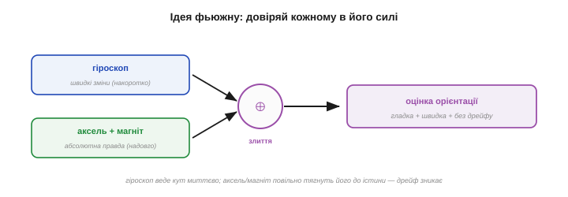
*Рис. 5.7.6.2. Як зливають. Швидкі зміни беруть від гіроскопа (точний накоротко), абсолютну прив'язку — від акселерометра й магнітометра (правда надовго). Злиття (⊕) видає оцінку орієнтації, що поєднує **гладкість і швидкість** гіроскопа з **бездрейфовою істиною** акселерометра. Кожному давачу довіряють рівно в тому, у чому він сильний.*

Результат — оцінка орієнтації, що **гладка й швидка** (як гіроскоп) **і водночас не дрейфує** (як акселерометр). Жоден давач окремо такого не дає; дає лише їхнє поєднання — і це, по суті, саме визначення сенсорного злиття: ціле, що перевершує кожну зі своїх частин окремо.

Тонкість у тому, **наскільки** довіряти кожному, і добрий фьюжн робить це **за обставинами**. Коли апарат нерухомий, акселерометру можна вірити більше (його показ — чиста гравітація); коли він трясеться чи рвучко прискорюється, довіру до акселерометра **знижують** (бо в ньому тепер багато руху) і більше покладаються на гіроскоп. Просте злиття бере сталі ваги, розумніше — підлаштовує їх під ситуацію. Але навіть найпростіша стала вага вже творить диво проти самотнього давача.

### Це частотний поділ

А тепер — найкрасивіше, де сходяться весь модуль. Розділ цього «довіряй кожному в його силі» — це насправді **поділ за частотою**, рівно той, що ми вивчили в Розділах 5.5–5.6. Дрейф гіроскопа — повільний, тобто **низькочастотний**; його шум і затримка — на високих частотах він якраз гарний. Шум акселерометра — швидкий, **високочастотний**; на низьких він якраз правдивий (стала гравітація).

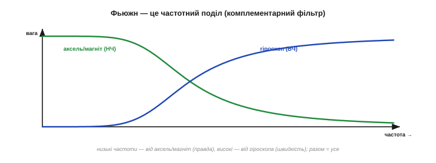
*Рис. 5.7.6.3. Злиття як комплементарний фільтр. Низькі частоти (повільна правда) беруть від акселерометра/магнітометра — наче крізь **низькочастотний** фільтр. Високі (швидка динаміка) — від гіроскопа, наче крізь **високочастотний**. Дві ваги в сумі дають одиницю на всіх частотах, тож разом давачі покривають увесь діапазон без дірок. Це і є **комплементарний фільтр** (§5.8.3) — пряме застосування Розділу 5.6 до пари давачів.*

Тож фьюжн у найпростішому вигляді — це **комплементарний фільтр**: пропусти гіроскоп крізь **високочастотний** фільтр (узяти лише швидке, відкинути дрейф), акселерометр — крізь **низькочастотний** (узяти лише повільну правду, відкинути шум), і **склади**. Дві ваги в сумі дають одиницю, тож разом вони покривають **усі** частоти. Ось чому ми так ретельно вчили фільтри: вони — мова, якою описують злиття.

Одне число керує цим поділом — **коефіцієнт довіри** (у комплементарному фільтрі його ховає та сама α, що в EMA, §5.4.4). Він задає **частоту переходу** між «вірити гіроскопу» й «вірити акселерометру»: вище за неї панує гіроскоп, нижче — акселерометр. Зрушиш межу вище — фільтр швидший і гладкіший, але повільніше виправляє дрейф; нижче — навпаки. Це той самий компроміс свіжості-проти-стабільності (§5.4.5), тепер у налаштуванні злиття.

І найприємніше — це **копійчано**: комплементарний фільтр коштує рівно стільки ж, скільки EMA (§5.4.4), бо це вона і є, тільки застосована до двох входів. Тож надійна орієнтація дається не дорогим давачем чи важким алгоритмом, а розумним злиттям дешевих — кілька множень на крок.

Чому злиття не спотворює самого сигналу? Бо ваги двох гілок у сумі дають **рівно одиницю** на кожній частоті: що низькочастотний фільтр пропустив, високочастотний доповнив, і навпаки. Тож **справжня** орієнтація проходить крізь злиття **незмінною** — фільтри ділять між собою лише похибки (дрейф іде в один бік, шум — в інший), а корисний сигнал лишається цілим. У цьому й елегантність комплементарної пари: вона прибирає вади, не чіпаючи правди.

### Фьюжн у дії

Подивімося, що це дає в часі. Поодинці гіроскоп повільно спливає геть від істини, акселерометр тремтить навколо неї — обидва погані. А їхнє злиття **тримається правди**: гладко, як гіроскоп, і без дрейфу, як акселерометр.

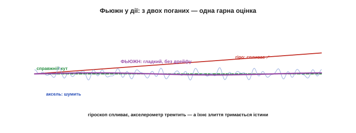
*Рис. 5.7.6.4. Злиття на ділі. Гіроскоп (червоне) гладкий, та невпинно **спливає**. Акселерометр (блакитне) тримається середнього, та сильно **тремтить**. А фьюжн (фіолетове) поєднує найкраще: він і гладкий (як гіроскоп), і прив'язаний до істини (як акселерометр). Дві недосконалі оцінки дають одну, кращу за обидві, — у цьому вся суть.*

**Приклад (найпростіший фьюжн кута).** Комплементарний фільтр в одному рядку:

```
кут ← 0.98 · (кут + гіро·Δt)  +  0.02 · кут_з_акселерометра
      └─ 98% гіроскопу: гладко й швидко ─┘   └─ 2% акселерометру ─┘
що відбувається: гіроскоп веде кут миттєво (інтегрує швидкість),
а ті 2% акселерометра щокроку трохи тягнуть оцінку до справжнього «низу»
→ гладкий, швидкий І бездрейфовий кут із двох недосконалих давачів
(докладно — у §5.8.3)
```

Магія в тих 2%: вони замалі, щоб впустити шум акселерометра, але достатні, щоб за багато кроків **не дати** дрейфу гіроскопа накопичитись. Гіроскоп дає 98% гладкості, акселерометр — 2% правди, і разом виходить майже ідеальний кут одним множенням-додаванням на крок.

Комплементарний фільтр — найпростіший фьюжн; є й розумніший — **фільтр Калмана** (§5.8.4). Він робить те саме поєднання «швидкого, але дрейфливого» з «повільним, але правдивим», та підбирає ваги **оптимально**, виходячи з відомих рівнів шуму кожного давача, ще й веде оцінку власної **невпевненості**. За це платять складністю; для багатьох же задач простого комплементарного фільтра цілком досить. Та обидва — про одне: розумно зважити недосконалі покази в одну добру оцінку.

За всім цим стоїть глибока ідея **оцінювання**: правду здобувають не з одного ідеального виміру (його не буває), а **зважено поєднуючи** багато недосконалих. Кожен вимір — голос зі своєю довірою; мудрий висновок зважує голоси за їхньою надійністю. Фьюжн давачів — окремий випадок цього способу думати, що пронизує всю науку про вимірювання: не шукай досконалого приладу, а розумно склади недосконалі.

### Бонуси: надмірність і стійкість

Окрім головного — приборкання дрейфу, — злиття дарує ще два бонуси. По-перше, **менше шуму**: кілька **незалежних** джерел тієї самої величини, усереднені, дають чистіший результат (та сама √N-перевага §5.4.2). По-друге, **стійкість**: якщо один давач тимчасово збоїть (магнітометр потрапив у заваду, акселерометр — у різкий удар), інші **підхоплять** оцінку, і система не «осліпне».

Це не теорія: на цьому стоїть безпека реальних апаратів. Дрон, чий магнітометр на мить «осліп» біля лінії електропередач, утримує курс гіроскопом, поки завада не мине. Окуляри доповненої реальності, чий акселерометр смикнувся від удару, ведуть голову гіроскопом ту частку секунди. Скрізь надмірність давачів рятує систему від поодинокого збою — і це окрема, безцінна причина зливати, навіть якби точності одного давача й вистачало.

А зменшення шуму від незалежних джерел — це окремий, давно відомий ефект «**мудрості натовпу**»: усереднення багатьох незалежних оцінок тієї самої величини дає точніший результат, ніж кожна окремо, бо їхні випадкові помилки частково гасять одна одну. Те, що рятувало нас усередненням у Розділі 5.4, тут працює **через** давачі: кілька незалежних поглядів на ту саму орієнтацію, зважені разом, дають чистішу оцінку, ніж будь-який один.

Підсумок-несподіванка: усе це — точність, гладкість, бездрейфовість, стійкість — дається **майже задарма**. Жодного дорогого давача, жодного важкого обчислення: три копійчані чипи в одному корпусі плюс кілька множень-додавань злиття на крок. Інженерна мудрість тут не в грошах, а в **ідеї** поєднати недосконале розумно. Це, можливо, найкращий урок усього модуля: добрий результат частіше здобувають головою, ніж гаманцем.


*Рис. 5.7.6.5. Два бонуси злиття. **Менше шуму**: незалежні джерела, усереднені, дають чистіший результат. **Більше стійкості**: якщо один давач збоїть (удар, магнітна завада), інші тримають оцінку, і система переживає відмову. Тому кілька давачів — це не лише точніше, а й **надійніше**, ніж один.*

> 🔧 **Навіщо це.** Залізне правило роботи з IMU: **ніколи не покладайтеся на один давач** для орієнтації — завжди зливайте. Голий гіроскоп спливе, голий акселерометр затремтить і збреше в русі, голий магнітометр обдурить завада. Лише їхнє поєднання дає кут, якому можна вірити і миттєво, і годинами. Якщо ваша орієнтація «їде» чи «стрибає» — найімовірніше, ви довіряєте одному давачу там, де потрібен фьюжн.

### Що дає фьюжн — і місток у Розділ 5.8

Зведімо все. Із трьох недосконалих, копійчаних давачів фьюжн робить оцінку орієнтації, що **швидка, бездрейфова й стійка** одночасно — жодної з цих рис ні гіроскоп, ні акселерометр, ні магнітометр сам по собі не дає. Ціле виходить **більше за суму частин**. Саме заради цього IMU й зводить три давачі в один корпус (§5.7.1): не щоб мати три окремі прилади, а щоб **злити** їх в одне надійне чуття орієнтації.

Систему, що зводить інерціальні давачі в орієнтацію, інженери звуть **AHRS** (*Attitude and Heading Reference System*) — «система відліку положення й курсу». Вона — серце кожного апарата, що мусить знати, як він повернений: дрона (щоб триматися в повітрі), робота (щоб балансувати), окулярів VR (щоб стежити за головою), стабілізатора камери (щоб гасити тремтіння). Усюди один і той самий ланцюг: сирі давачі → фьюжн → орієнтація → дія. Розділ 5.8 побудує цей ланцюг повністю.

І на цьому модуль про давачі й сигнали майже завершиться. Ми пройшли весь шлях: від фізики перетворювачів (Розділ 5.1) і вимірювання відстані (5.2), через очищення сигналу (фільтри 5.4, спектр 5.5, проєктування фільтрів 5.6), до інерціальних давачів (5.7) — і ось зводимо все в орієнтацію та керування (5.8). Фьюжн — місток, що з'єднує «відчути» з «діяти», а Розділ 5.8 пройде ним до кінця.

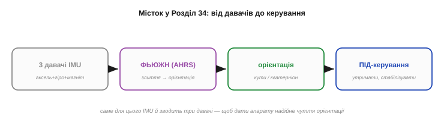
*Рис. 5.7.6.6. Куди це веде. Три давачі IMU → **фьюжн** (AHRS) → оцінка орієнтації (кути чи кватерніон) → **ПІД-керування**, що цю орієнтацію утримує. Розділ 5.7 дав давачі та причину їх зливати; Розділ 5.8 побудує самі алгоритми злиття (комплементарний фільтр, Калман) і керування. Орієнтація — місток між «відчути» і «втримати».*

> 🔧 **Навіщо це.** Перед злиттям не забудьте **підготувати** кожен давач: відкалібрувати зсуви (§5.1.6, §5.7.5), прибрати hard/soft-iron магнітометра (§5.7.4), за потреби легко відфільтрувати шум (§5.4–5.6). Фьюжн — не чарівна паличка, що виправить будь-яке сміття: він зливає **підготовлені** покази, а не сирі. Гарне злиття починається з гарних входів.

> 🔧 **Навіщо це.** Готові IMU й бібліотеки часто вже **роблять фьюжн за вас** (вбудований DMP у MPU-серії, бібліотеки Madgwick/Mahony віддають готову орієнтацію). Тому, перш ніж писати злиття вручну, погляньте, чи не дає ваш чип чи бібліотека вже готовий кут — це заощадить багато роботи. А розуміти, **що** там усередині (комплементарний фільтр, Розділ 5.8), усе одно варто, щоб довіряти результату осмислено.

Отже, Розділ 5.7 завершено: ми знаємо, **як** влаштовані інерціальні давачі (крихітні машини в кремнії), **що** кожен міряє (прискорення, обертання, поле), **чому** кожен недосконалий (шум, зсув, дрейф) — і **чому** їх рятує лише поєднання. Лишилося зробити останній крок: перетворити три потоки чисел на **орієнтацію** в просторі й навчити апарат цю орієнтацію **утримувати**. Це — задача злиття й керування, серце наступного, фінального розділу модуля: комплементарний фільтр і Калман для орієнтації, ПІД-регулятор для керування. Там кілька простих формул, що спираються на всю математику цього модуля, навчать апарат **сам тримати рівновагу**, — і абстрактні досі фільтри й давачі обернуться на живий, стабільний політ чи балансування. Туди й переходимо.

> ▶️ Далі: [Розділ 5.8 — Орієнтація й керування зі зворотним зв'язком (ПІД)](../orientation-pid/orientation-pid.md)