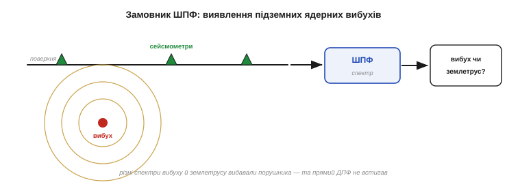
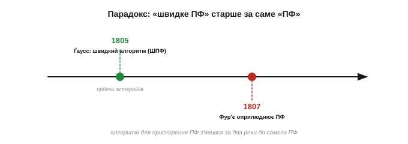
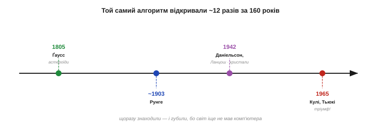
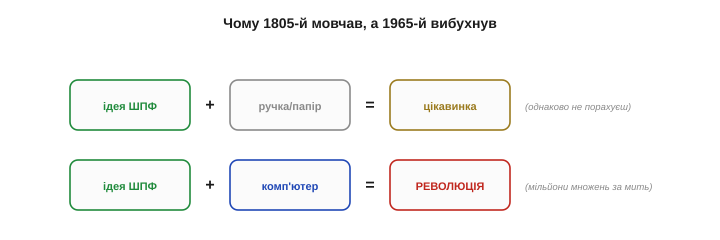
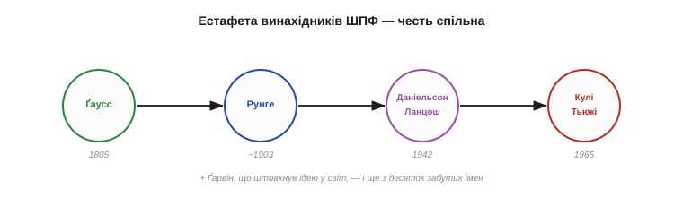

# 📜 Історія до §5.5.5 — ШПФ: алгоритм, що його винаходили дванадцять разів

> Це історична вставка до [§5.5.5 «Швидке перетворення Фур'є»](spectrum-fourier.md#315-швидке-перетворення-фурє-шпффft). У самій темі ми побачили, **як** ШПФ перетворює `N²` на `N·log N` і чому це змінило техніку. Та сама історія цього алгоритму — детективна: його **не** винайшли 1965 року. Його знаходили й губили близько **дванадцяти разів** за сто шістдесят років — а вперше це зробив Ґаусс ще 1805-го, **за два роки до того**, як Фур'є оприлюднив саме перетворення. А його остаточне, переможне перевідкриття народилося з холодної війни — з полювання на радянські ядерні вибухи. Це історія про те, що навіть найгеніальніша ідея чекає **свого часу** — і про те, що винаходи майже ніколи не належать одному.

Квітень 1965 року. У журналі *Mathematics of Computation* виходить стаття на якихось чотири сторінки: «Алгоритм машинного обчислення комплексних рядів Фур'є». Автори — **Джеймс Кулі** (*James W. Cooley*) з дослідного центру IBM і **Джон Тьюкі** (*John W. Tukey*), статистик із Принстона. Ці чотири сторінки запускають цифрову революцію: уже за кілька років перетворення Фур'є з дорогої теоретичної процедури стає буденною операцією, і на ній виростають цифрове аудіо, зв'язок, томографія, уся обробка сигналів. Та найдивовижніше в цій історії — те, що Кулі й Тьюкі **не були першими**. І навіть близько.

Перш ніж розкрити цей детектив, варто відчути, яким струсом стали ті чотири сторінки. До 1965-го «спектральний аналіз» був розкішшю — повільною, дорогою, доступною хіба великим лабораторіям. За кілька років після статті Кулі-Тьюкі він став **доступним кожному**, хто мав комп'ютер; народилася ціла інженерна дисципліна — **цифрова обробка сигналів** (*DSP*). Стаття стала однією з найцитованіших у всій прикладній математиці, а IEEE згодом відзначив її як **віху**. Рідко коли чотири сторінки розгортаються в цілу галузь.

---

## Винайдений у пошуках радянської бомби

Почнімо з того, **навіщо** ШПФ знадобилося 1965 року, — бо мотив був аж ніяк не академічний. Стояв розпал холодної війни, і США відчайдушно шукали спосіб **виявляти підземні ядерні випробування** в Радянському Союзі, не маючи туди доступу. Ідея була така: розставити навколо СРСР **сейсмометри** й ловити коливання землі від далеких вибухів. Але щоб відрізнити вибух від звичайного землетрусу, сейсмічний сигнал треба було розкласти на частоти — а це перетворення Фур'є, яке для довгих записів рахувалося **нестерпно довго**.

Саме на засіданні Наукового консультативного комітету при президентові **Кеннеді** (PSAC), де обговорювали цю проблему виявлення, **Джон Тьюкі** й накидав на папері ідею швидкого алгоритму. Серед присутніх був фізик **Річард Ґарвін** (*Richard Garwin*) з IBM — людина рідкісного діапазону (він свого часу спроєктував першу водневу бомбу, а тут переймався **контролем** над озброєнням). Ґарвін миттєво збагнув вагу Тьюкієвого начерку: якщо перетворення Фур'є зробити швидким, сейсмометри навколо СРСР зможуть **у реальному часі** відсіювати вибухи — а отже, можна буде перевіряти договір про заборону випробувань.

Чому ж саме Фур'є мав тут зарадити? Бо вибух і землетрус «звучать» **по-різному**: енергія підземного ядерного удару розподілена за частотами інакше, ніж у природного поштовху, і саме спектр виказує цю різницю. Та сейсмічні записи довгі, а станцій багато — рахувати їхні спектри прямим ДПФ означало безнадійно відставати від подій. На тлі переговорів про обмеження випробувань (1963 року вже діяв частковий договір про заборону) це була не абстракція, а питання національної безпеки: швидке Фур'є обіцяло **майже реальний час** там, де його бракувало найгостріше.

*Рис. 5.5.5·H.1. Холодна війна як замовник. Підземний ядерний вибух породжує сейсмічні хвилі; сейсмометри довкола СРСР їх ловлять, але щоб відрізнити вибух від землетрусу, запис треба розкласти на частоти. Повільне ДПФ цього не встигало — і саме потреба у виявленні підштовхнула Ґарвіна, Тьюкі й Кулі до швидкого алгоритму.*

Ґарвін і став рушієм. Він розшукав в IBM програміста **Джеймса Кулі** й доручив йому втілити ідею в код — щоправда, за переказами, **не розкривши справжньої мети**: він прикрив делікатну тему ядерного шпигунства безневинною задачею (нібито про періодичність орієнтацій спінів у кристалі гелію-3), щоб не привертати уваги. Кулі, гадаючи, що розв'язує цілком мирну обчислювальну задачку, написав програму — і так на світ з'явилося те, що ми тепер звемо алгоритмом Кулі-Тьюкі. Інструмент, що сьогодні грає вам музику в навушниках, народився як знаряддя стеження за чужими бомбами.

> 🔧 **Навіщо це.** Коли ви викликаєте `arduinoFFT` чи CMSIS-DSP на своєму мікроконтролері, ви запускаєте алгоритм, відшліфований заради виявлення ядерних вибухів. Це не просто курйоз: він пояснює, **чому** ШПФ так одержиме на швидкості реального часу. Його з самого початку проєктували не для лабораторних розрахунків на дозвіллі, а для безперервного потокового аналізу сигналів «тут і зараз» — рівно те, що потрібно й вашому давачу.

---

## Ґаусс уже мав його — за два роки до Фур'є

А тепер — головний поворот сюжету. Алгоритм, який Кулі й Тьюкі подарували світу 1965 року, **уже існував** — у шухляді найбільшого математика всіх часів, понад півтора століття.

**Карл Фрідріх Ґаусс** (*Carl Friedrich Gauss*, 1777–1855), німецький геній, ще близько **1805 року** розв'язував суто астрономічну задачу: як за кількома спостереженнями **відновити орбіту** новознайдених астероїдів — **Паллади** й **Юнони**. Йому треба було підібрати тригонометричний ряд, що проходить через виміряні точки, — тобто, по суті, порахувати коефіцієнти Фур'є. І щоб не тонути в обчисленнях, Ґаусс винайшов **той самий** прийом «розділяй і володарюй»: розбив задачу на менші, як це згодом зроблять Кулі й Тьюкі.

Варто пам'ятати, **хто** це був. За кілька років до того, 1801-го, юний Ґаусс уже прославився на всю Європу, обчисливши орбіту першого астероїда — Церери — і передбачивши, де його шукати в небі. Він був неперевершеним «обчислювачем», та водночас і щиро **не любив** марудну ручну арифметику — тож раз у раз винаходив прийоми, щоб її скоротити. Його трюк для астероїдів був саме таким скороченням: не з любові до абстрактної теорії, а з цілком приземленого бажання менше водити пером. У цьому Ґаусс і Кулі-Тьюкі — однодумці через століття: усі троє прагнули того самого — щоб машина (чи рука) робила якомога менше зайвого.

*Рис. 5.5.5·H.2. Парадокс пріоритету. Ґаусс винайшов швидкий алгоритм близько 1805 року — щоб інтерполювати орбіти астероїдів Паллади й Юнони. Це на **два роки раніше**, ніж Фур'є оприлюднив саме перетворення (мемуар 1807-го, §історія розділу). Виходить, «швидке перетворення Фур'є» з'явилося ще до того, як Фур'є оприлюднив «перетворення Фур'є», — і носить чуже ім'я.*

Усвідомте всю іронію: **швидке перетворення Фур'є старше за саме перетворення Фур'є**. Ґаусс мав свій алгоритм 1805 року, а Фур'є прочитав свій славетний мемуар про теплоту лише в грудні 1807-го (історія до цього розділу). Тобто «ШПФ» існувало ще до того, як світ дізнався про «ПФ», — і тепер цей алгоритм носить ім'я не Ґаусса, а двох американців XX століття.

Чому ж Ґаусса забули? Бо він свій метод **не опублікував**. Запис лишився в його паперах, написаний архаїчною новолатиною, і вийшов друком аж **посмертно**, у зібранні творів (*Werke*) 1866 року, — похований серед сотень інших нотаток і не помічений ніким, кому він міг би стати в пригоді. Найкорисніший обчислювальний алгоритм століття пролежав непрочитаним у повному зібранні класика.

> 🔧 **Навіщо це.** Урок не лише історичний. Ідея, не доведена до **людей і практики**, однаково що не існує: Ґауссів алгоритм був абсолютно правильний — і абсолютно марний сто шістдесят років, бо лежав у шухляді. Винахід стає винаходом не в мить осяяння, а коли його **оприлюднено, утілено й комусь потрібно**. Те саме стосується вашого коду: рішення, про яке ніхто не знає і яким ніхто не користується, нічим не краще за ненаписане.

---

## Алгоритм-привид: знаходили й губили

Ґаусс був перший, але не останній, хто наштовхнувся на цей прийом і не зчинив галасу. Упродовж усього XX століття ШПФ виринало знову й знову — як привид, що його щоразу бачать і щоразу забувають.

Близько **1903 року** до схожих ідей дійшов німецький математик **Карл Рунге** (*Carl Runge*, той самий, що з методу Рунге-Кутта). А **1942 року** американський фізик **Ґордон Даніельсон** (*Gordon Danielson*) і угорський математик **Корнеліус Ланцош** (*Cornelius Lanczos*, єврей-емігрант, колишній асистент Айнштайна) опублікували свій варіант — щоб пришвидшити обробку даних **рентгенівської кристалографії**. Їхня праця прямо спиралася на Рунге. І знову: метод був, працював, друкувався — але його сприймали як вузький трюк для конкретної задачі, а не як універсальний інструмент, що варто кричати на весь світ.

У цьому й була причина, чому привид щоразу зникав. Кожен, хто натрапляв на трюк, бачив його крізь **свою вузьку задачу** — Ґаусс крізь астероїди, Ланцош крізь кристалографію — і не усвідомлював, що тримає **загальний** метод, придатний геть для всього. Не було ні спільної мови, ні масової потреби, ні — головне — машини, заради якої варто було б наголошувати на швидкості. Тож відкриття щоразу лишалося приміткою до чужої статті, а не самостійною подією. Щоб привид нарешті втілився, бракувало не розуму, а **контексту**.

*Рис. 5.5.5·H.3. Шлях привида. Ґаусс (1805) → Рунге (~1903) → Даніельсон і Ланцош (1942, кристалографія) → … → Кулі й Тьюкі (1965). За підрахунками істориків, той самий по суті алгоритм незалежно знаходили близько **дванадцяти разів** — і щоразу він тонув як вузька технічна деталь, поки 1965-го не збіглися всі умови для тріумфу.*

Коли пізніше історики (зокрема **Гайдеман**, **Джонсон** і **Беррус** у праці 1984 року «Ґаусс і історія швидкого перетворення Фур'є») розплутали цей клубок, виявилося, що той самий по суті алгоритм незалежно винаходили **близько дванадцяти разів** — від Ґаусса до 1965-го. Дванадцять разів геніальна ідея зринала на поверхню — і дванадцять разів ішла під воду, бо світ ще не був готовий її підхопити. Кулі й Тьюкі стали тими, на кому ця низка нарешті урвалася, — і не лише через талант.

---

## Чому саме 1965, а не 1805

Постає неминуче питання: якщо алгоритм знали півтора століття, **чому** він вистрелив саме 1965 року? Відповідь — в одному слові: **комп'ютер**.

До появи обчислювальних машин швидкий алгоритм Фур'є був лише дрібною зручністю. Рахуючи **вручну**, ви все одно не подужаєте ні тисячі, ні мільйона точок — ні за `N²` дій, ні за `N·log N`; обидва числа однаково за межею людської витривалості. Економія операцій нічого не вартувала, бо саму роботу однаково ніхто не робив. Тому Ґауссів трюк і лишався цікавинкою: він прискорював те, чого все одно не рахували.

*Рис. 5.5.5·H.4. Чому 1805-й мовчав, а 1965-й вибухнув. Ідея + ручка = цікавинка (однаково нічого не порахуєш). Ідея + комп'ютер = революція. Алгоритм був готовий від часів Ґаусса, але потрібен був партнер — машина, здатна зробити мільйони множень, — щоб економія `N²→N·log N` обернулася з абстракції на щоденну надсилу.*

А от із комп'ютером усе перевернулося. Раптом перетворення Фур'є **справді** рахували — і саме тут різниця між `N²` і `N·log N` стала різницею між «годинами машинного часу» і «секундами», між «неможливо» і «буденно». 1965 року обчислювальні машини вже були достатньо поширені, щоб мільйони інженерів **щодня** впиралися в повільність ДПФ, — і алгоритм Кулі-Тьюкі впав на цей ґрунт, як іскра в порох. Те, що в Ґаусса було розв'язком неіснуючої проблеми, у 1965-му стало розв'язком проблеми **всіх**.

Далі все покотилося лавиною. Програму Кулі швидко підхопили, алгоритм заходився обростати варіантами й оптимізаціями, і вже за кілька років жоден серйозний обчислювальний пакет не обходився без ШПФ. Те, що Ґаусс зробив одного разу для двох астероїдів, тепер робили мільярди разів на день — у радарах, сонарах, томографах, телефонах. Один і той самий ланцюжок множень-додавань, винайдений у тиші кабінету 1805 року, став биттям пульсу цілого цифрового світу.

> 🔧 **Навіщо це.** Звідси прямий урок інженерові-вбудовнику: **цінність алгоритму залежить від заліза свого часу**. Те, що вчора було академічною дрібницею, сьогодні може стати ключем — і навпаки. Обираючи, як рахувати на мікроконтролері, питайте не «який алгоритм найгарніший», а «що найкраще лягає на **це** залізо з його пам'яттю й тактами». ШПФ перемогло не тому, що було розумне (воно було розумне й за Ґаусса), а тому, що нарешті зустріло **відповідну машину**.

---

## Урок: винаходи — колективні

Історія ШПФ — майже ідеальна притча про те, як насправді працює винахідництво, і варто проговорити її мораль прямо.

По-перше, **великі ідеї рідко належать одній людині**. За «алгоритмом Кулі-Тьюкі» стоїть ціла естафета — Ґаусс, Рунге, Даніельсон, Ланцош і ще з десяток забутих імен, кожне з яких тримало в руках ту саму перлину. Назва закріпилася за останніми, але честь — спільна. По-друге, **винахід — це не лише ідея, а й її час**: та сама думка може бути марною в 1805-му й революційною в 1965-му, бо змінився не розум, а світ навколо (з'явився комп'ютер і масова потреба). По-третє, **опублікувати й утілити — це частина винаходу**, не менш важлива за саме осяяння: Ґаусс мав ідею, але світу її дали Кулі й Тьюкі, бо саме вони її надрукували, запрограмували й донесли.

Це явище навіть має назву — **множинне відкриття**: коли час дозріває, та сама ідея незалежно зринає в кількох головах одразу (так числення майже одночасно винайшли Ньютон і Ляйбніц, а теорію еволюції — Дарвін і Воллес). ШПФ — хрестоматійний приклад: дюжина незалежних відкриттів за півтора століття. Це не применшує генія Кулі й Тьюкі, а навпаки — показує, що історія вже дозріла, і хтось мусив стати тим, хто доведе справу до кінця, ставши в потрібному місці в потрібний час.

*Рис. 5.5.5·H.5. Естафета, а не самотній геній. Той самий алгоритм передавали з рук у руки крізь півтора століття: Ґаусс, Рунге, Даніельсон і Ланцош, нарешті Кулі й Тьюкі — а поруч Ґарвін, що штовхнув ідею у світ. «Швидке перетворення Фур'є» — підпис не одного автора, а цілого ланцюга; так створюється насправді більшість техніки.*

Є тут і дрібний, але промовистий штрих про самого Тьюкі: цей чоловік, окрім ШПФ, подарував нам слова, якими ми користуємось щодня, — саме він увів термін **«біт»** (*bit*, від *binary digit*) і одним із перших ужив слово **«software»**. Людина, що назвала біт, доклала рук і до алгоритму, без якого цифровий світ біта не запрацював би. Гарне нагадування, що за сухими абревіатурами наших даташитів стоять живі люди з власними долями.

> 🔧 **Навіщо це.** Практичний висновок для вашої роботи подвійний. **Не винаходьте велосипед наосліп** — те, з чим ви воюєте, майже напевно вже хтось розв'язав (як ШПФ, що його знаходили дванадцять разів); шукайте перш ніж писати. І водночас **публікуйте й діліться** тим, що зробили: Ґауссів урок — що рішення в шухляді не існує. У світі відкритого коду це особливо живе: ваша оприлюднена бібліотека для давача може стати чиїмось Кулі-Тьюкі.

---

Отже, наступного разу, викликаючи ШПФ одним рядком коду, згадайте весь цей ланцюг: німецького генія, що рахував орбіти астероїдів; угорського емігранта з рентгенівськими знімками; холодну війну й полювання на бомби; і двох американців, що нарешті опинилися в потрібному місці в потрібний час — коли поруч уже стояв комп'ютер. Алгоритм у вашому мікроконтролері — це спадок усіх них разом.

> ↩️ Повернутися до теми: [§5.5.5 — Швидке перетворення Фур'є (ШПФ/FFT)](spectrum-fourier.md#315-швидке-перетворення-фурє-шпффft)
