# Розділ 35 — UART і протоколи поверх нього

Досі ми будували **окремий** обчислювач: ядро, що виконує інструкції, периферію, що міряє світ, керування, що крутить мотор. Але жодна реальна система не складається з одного чіпа, який усе вміє сам. Політний контролер питає в давача відстань, надсилає телеметрію на землю, слухає команди з пульта; мікроконтролер читає гіроскоп, віддає дані радіомодулю, приймає налаштування з комп'ютера. Усе це — **обмін байтами між чіпами**. І щойно постає питання «як перекинути байт із однієї мікросхеми в іншу по дроту», ми входимо у світ **протоколів зв'язку** — тему цього модуля.

Почнемо з найпростішого, найстарішого й найуніверсальнішого з них — **асинхронного послідовного порту**, який у світі мікроконтролерів майже завжди реалізує апаратний блок на ім'я **UART** (*Universal Asynchronous Receiver/Transmitter* — універсальний асинхронний приймач-передавач). Це той самий «Serial», який ти бачиш у `Serial.begin()` і в моніторі порту. Він простий настільки, що часто стає першим, чим оживає нова плата, і водночас він — фундамент, на якому будують і налагодження, і телеметрію, і зв'язок із GPS- та радіомодулями. Цей розділ збирає його від першопричин: чому передаємо послідовно й асинхронно (ця тема), з чого складається кадр, що таке baud і розсинхрон, які бувають рівні сигналу, навіщо буфери, і як поверх «сирих» байтів побудувати надійний пакет із власним протоколом.

> 📜 **Перед матеріалом — історія:** [Бодо, телеграф і народження асинхронної передачі](ch35-history-baudot.md). Вона показує, *звідки* взявся старт-стоп-кадр, чому ми передаємо асинхронно й чому одиницю швидкості названо «baud» на честь людини.

---

## 35.1 Чому послідовно й чому асинхронно

Уся ця тема — про два рішення, які роблять за вас, щойно ви відкриваєте послідовний порт, і які пояснюють геть усе подальше. Уявіть найпростіше завдання: перекинути один **байт** — вісім біт — з мікросхеми A в мікросхему B по дротах. Здавалося б, дрібниця. Та вже тут доводиться відповісти на два глибокі питання. **Перше:** вісім біт надіслати **усі разом** (кожен своїм дротом) чи **один за одним** (усі по одному дроту, але в часі)? **Друге:** як приймач дізнається, **коли саме** дивитися на лінію, щоб упіймати кожен біт? UART дає на ці питання конкретні відповіді — «послідовно» й «асинхронно», — і обидві варто зрозуміти до кісток, бо з них випливає і кількість дротів, і поняття baud, і навіть класичні помилки новачка.

### Паралельно чи послідовно: дроти проти часу

Байт — це вісім біт. Найочевидніший спосіб перекинути його швидко — дати кожному біту **свій дріт** і виставити всі вісім рівнів одночасно. Це **паралельна** передача (*parallel*): за один такт переходить цілий байт. Саме так працювали ранні комп'ютерні шини, старі принтерні порти й досі працюють внутрішні шини пам'яті — там, де дроти короткі, а швидкість критична.

Альтернатива — пустити всі вісім біт **одним** дротом, **один за одним** у часі: спершу перший біт, потім другий, і так усі вісім. Це **послідовна** передача (*serial*): один провідник, але вісім часових інтервалів на байт.

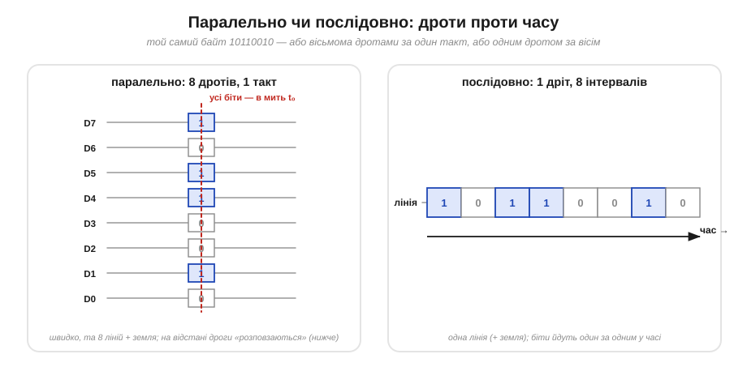
*Рис. 35.1.1. Той самий байт двома способами. Ліворуч (паралельно): вісім ліній D0…D7 несуть свої біти **одночасно**, приймач знімає весь байт у мить t₀ — швидко, але це 8 ліній плюс земля. Праворуч (послідовно): одна лінія, по якій біти йдуть **по черзі** в часі — дротів менше, ціна — час.*

На перший погляд паралель — очевидний переможець: цілий байт за такт проти восьми тактів. Та в реальному пристрої вирішують не лише такти. По-перше, **дроти коштують**. Кожна паралельна лінія — це окремий **вивід** (*pin*) на корпусі мікросхеми, а виводи — найдефіцитніший ресурс мікроконтролера ([Розділ 22](../../block-4-mcu-esp32/ch22-gpio/ch22-gpio.md)). Восьмибітна паралельна шина з'їдає вісім ніжок лише на дані, та ще керувальні лінії й землю — десяток виводів на один периферійний пристрій. Послідовна лінія обходиться **однією** лінією даних на напрямок плюс спільна земля.

> 🔧 **Навіщо це.** Це питання «бюджету ніжок». У типового мікроконтролера лише кілька десятків придатних виводів, і витратити десять із них на один давач — розкіш, якої ніхто не дозволить. Саме послідовні лінії дають змогу маленькому чіпу спілкуватися з десятком периферій: кожна забирає одну-дві ніжки, а не порт цілком. Коли проєктуєш плату, ти майже завжди обираєш послідовний інтерфейс не тому, що він «гарніший», а тому, що **ніжок банально не вистачає** на паралельний.

**Приклад (скільки дротів насправді).** Порахуймо, у що обходиться перекинути байти між мікроконтролером і периферійним чіпом:

```
паралельна 8-бітна шина : 8 даних + 1 строб + 1 земля        = 10 дротів
синхронна послідовна    : 1 дані + 1 такт + 1 земля           = 3 дроти
асинхронна (UART)        : 1 TX + 1 RX + 1 земля               = 3 дроти (і одразу двобічна!)
```

Різниця в три з гаком рази — і це лише для **одного** периферійного пристрою. Якщо їх кілька, паралельна шина або множить дроти, або змушує городити складне розділення спільної шини; послідовні ж лінії дешево масштабуються. Уже звідси видно, чому світ малих систем — послідовний.

### Чому паралель програє навіть у швидкості: перекіс

Можна було б подумати, що паралель — це «дорого, зате швидко», і там, де швидкість важливіша за дроти, перемагає вона. Дивовижно, але **ні**: на високих швидкостях і відстанях паралель програє послідовній лінії не лише ціною, а й **самою швидкістю**. Винний у цьому ефект на ім'я **перекіс** (*skew*).

Річ у тім, що вісім паралельних дротів ніколи не бувають абсолютно однакові: вони трохи різної довжини, з трохи різною ємністю й опором, тож сигнал по кожному біжить із трохи різною затримкою. Поки біт «довгий» (тобто інтервал на один біт набагато більший за розкид цих затримок), це не біда — усі біти встигають усталитися задовго до моменту вибірки. Але що вищий темп, то **коротший** інтервал на біт — і коли він стає сумірним із розкидом затримок, біти одного «стовпчика» починають прибувати **врізнобій**.

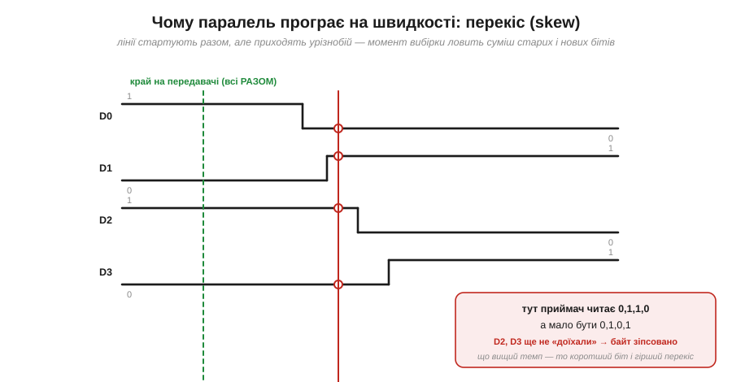
*Рис. 35.1.2. На передавачі всі біти міняються одночасно (зелена лінія). Та на приймачі їхні фронти «розповзаються» через різні затримки ліній (skew). У момент вибірки (червона лінія) D0 і D1 уже перемкнулися на нові значення, а D2 і D3 — ще ні: приймач читає **суміш** старого й нового байта і отримує сміття. Що вищий темп — то коротший біт і тим згубніший перекіс.*

Ось чому паралельну шину неможливо без кінця прискорювати: рано чи пізно інтервал на біт впирається в перекіс ліній, і далі — лише помилки. А **одна** послідовна лінія цієї біди не має взагалі: міжлінійного перекосу немає, бо лінія одна, тож її можна тактувати незрівнянно вище. Саме тому майже всі сучасні швидкі інтерфейси — USB, SATA, PCIe, Ethernet — попри інтуїцію «паралель = швидше», зроблені **послідовними**. Додайте сюди ще й **перехресні завади** (*crosstalk*) між тісними паралельними доріжками — і стане ясно, чому індустрія масово пішла в серіал.

> 🔧 **Навіщо це.** Запам'ятай цей контрінтуїтивний факт: **на відстані послідовне — швидше**. Він рятує від типової помилки «зроблю паралельно, щоб було швидко». Для зв'язку між платами, по кабелю, на будь-якій помітній швидкості правильна відповідь майже завжди — послідовна лінія. Паралель лишилася тільки там, де дуже коротко й дуже синхронно (всередині чіпа чи між сусідніми чіпами пам'яті).

### Дві відповіді на питання «де біт»: такт чи домовленість

Отже, передаємо послідовно: біти біжать одним дротом один за одним. Та одразу постає друге, тонше питання. Приймач бачить на лінії напругу, що то піднімається, то падає. Як йому зрозуміти, **де закінчується один біт і починається наступний** — коли саме знімати відлік? Якщо «дивитися» не в ті моменти, можна порахувати один біт двічі або проґавити інший. На це є **дві** принципово різні відповіді, і вибір між ними — друге велике рішення UART.

**Відповідь перша — синхронна.** Пустити поряд із даними **окремий дріт такту** (*clock*). Передавач не лише виставляє біт на лінії даних, а й «цокає» тактом: ось фронт — дивись зараз. Приймач знімає відлік строго по фронту такту й ніколи не помиляється з моментом.

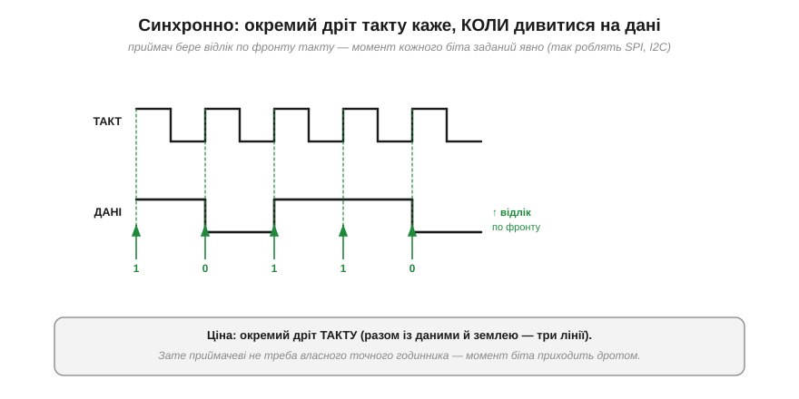
*Рис. 35.1.3. Синхронна передача: лінія ТАКТ цокає, лінія ДАНІ несе біти, і приймач бере відлік по кожному фронту такту (зелені стрілки). Момент кожного біта заданий **явно**, дротом — приймачеві не треба власного точного годинника. Ціна — зайва лінія: дані + такт + земля. Так працюють синхронні шини, що на них чекають у наступних розділах.*

Це надійно й просто до краси: працює на будь-якій швидкості, її можна навіть зупинити посеред байта — приймач просто чекає наступного цокання. Ціна — **зайвий дріт** (такт), а на відстані ще й повертається той самий перекіс, але вже між даними й тактом.

**Відповідь друга — асинхронна.** Не тягти дроту такту взагалі. Натомість обидві сторони **наперед домовляються про швидкість** — скільки біт за секунду (той самий **baud** з історії). Лінія в спокої тримається у «1»; коли треба надіслати знак, передавач кидає її в «0» на один біт — це **старт-біт**, сигнал «увага, знак почався». Упіймавши цей перепад, приймач запускає **власний** відлік часу й сам, за своїм годинником, знімає кожен наступний біт через домовлений інтервал; завершує знак **стоп-біт**. І так — наново перед **кожним** знаком.

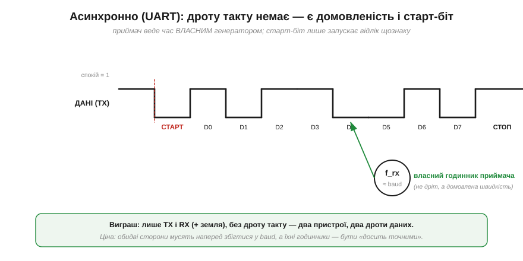
*Рис. 35.1.4. Асинхронна передача (UART): лінія даних — одна, дроту такту немає. Старт-біт (перепад 1→0) лише **запускає** відлік; далі приймач веде час власним генератором f_rx, налаштованим приблизно на ту саму швидкість, що й передавач. Синхронізація відбувається наново щознаку — рівно та сама ідея старт-стоп із телетайпа.*

Це і є вибір UART: **асинхронна послідовна** лінія. Виграш величезний — лише дві лінії даних (TX і RX) плюс земля, жодного дроту такту. Ціна теж конкретна: обидві сторони мусять мати **власний досить точний годинник** і **наперед збігтися у швидкості**. Не збіглися — приймач відлічуватиме біти не в тому темпі, відліки «попливуть», і замість тексту полізе сміття.

> 🔧 **Навіщо це.** Ось чому `Serial.begin(9600)` ти пишеш на **обох** кінцях лінії й чому найперша підозра, коли в моніторі замість слів крякозябри, — **різний baud**. UART не передає свого такту дротом; він покладається на те, що твій годинник і годинник співрозмовника однаково розуміють, що таке «9600 біт за секунду». Це й робить його таким дешевим (два дроти) і водночас таким вимогливим до попередньої домовленості.

### Як приймач знаходить біти без дроту такту

Лишилося пояснити механізм, який робить асинхронність надійною: як саме приймач, не маючи дроту такту, влучає точно в кожен біт? Секрет — у **передискретизації** (*oversampling*). Внутрішній тактовий генератор приймача біжить набагато швидше за швидкість передачі — типово в **16 разів**. Тобто на кожен біт припадає близько шістнадцяти внутрішніх «тиків».

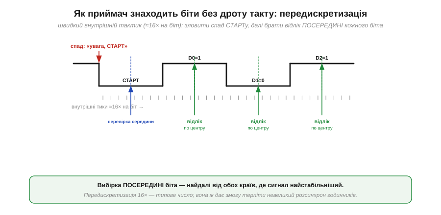
*Рис. 35.1.5. Приймач стежить за лінією на швидкості ≈16× baud. Зловивши **спад** (старт-біт), він відлічує ≈8 тиків до **середини** старту й перевіряє, що там і досі «0» (так відсіюються короткі завади). Далі він знімає відлік кожні 16 тиків — тобто **посередині** кожного біта. Середина — найдалі від обох країв, де сигнал уже точно усталився.*

Логіка така. Поки лінія в спокої («1»), приймач чекає. Щойно з'являється спад до «0» — це, можливо, старт-біт. Приймач відлічує половину біта (≈8 тиків із 16) і дивиться: якщо посередині все ще «0» — старт справжній (а якби це була коротка завада, лінія вже повернулася б у «1», і хибний старт відкидається). Переконавшись, приймач далі знімає відлік **через кожні 16 тиків** — і щоразу влучає точно в **середину** чергового біта. Чому посередині? Бо краї біта — місце переходів, де сигнал ще хитається; а середина найстабільніша й найдалі від сусідів. Ця ж передискретизація дає змогу терпіти невеликий розсинхрон годинників: навіть якщо твій годинник трохи «бреше», відлік усе одно лишається в межах правильного біта.

> 🔧 **Навіщо це.** Вибірка посередині біта плюс передискретизація — це причина, чому UART так стійко працює, попри те, що годинники двох пристроїв ніколи не ідентичні, а на лінії трапляються короткі викиди. Наскільки саме можуть розійтися годинники, поки відлік не «з'їде» у сусідній біт, — це питання **допуску на розсинхрон**, яке ми порахуємо кількісно далі в цьому розділі. Поки досить розуміти **механізм**: старт ловить початок, середина біта дає стабільний відлік.

### Як це виглядає на столі: TX, RX і спільна земля

Перекладімо все це на дроти між двома реальними пристроями. У кожного є вивід **TX** (*transmit* — передавач, **вихід**) і вивід **RX** (*receive* — приймач, **вхід**). Очевидне, але вкрай важливе правило: вихід одного має йти на вхід іншого. Тобто **TX першого — на RX другого**, а **TX другого — на RX першого**. З'єднання йде **навхрест** (*crossover*).

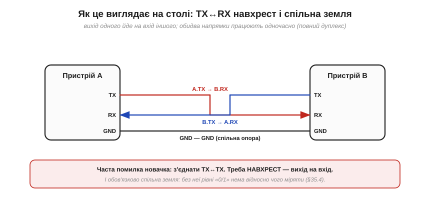
*Рис. 35.1.6. Два пристрої з'єднують навхрест: A.TX → B.RX і B.TX → A.RX. Оскільки лінії розділені, обидва напрямки працюють **одночасно** — це повний дуплекс (*full duplex*). Третя обов'язкова лінія — спільна **земля**: рівні «0» і «1» — це напруги, а напругу нема як виміряти без спільної опорної точки.*

Окремі лінії на кожен напрямок дають приємний бонус: пристрої можуть говорити **одночасно** в обидва боки, не чекаючи одне на одного, — це **повний дуплекс** (*full duplex*). А ще зверніть увагу на третій дріт — **спільну землю** (*GND*). Без неї нічого не працюватиме, і ось чому: «0» і «1» у цифровій лінії — це рівні **напруги** ([Розділ 14](../../block-3-digital-processor/ch14-logic-levels/ch14-logic-levels.md)), а напруга завжди вимірюється **відносно** чогось. Якщо в двох пристроїв нема спільної опорної точки, приймач просто не має відносно чого судити, де «високо», а де «низько».

> 🔧 **Навіщо це.** Найчастіша помилка новачка — з'єднати **TX із TX**: обидва пристрої тоді кричать у вихід один одному, і нічого не чують. Друга за частотою біда — **забути спільну землю**, особливо коли пристрої живляться від різних джерел: лінія начебто з'єднана, а в моніторі хаос. Запам'ятай мінімальний послідовний кабель: **TX, RX, GND** — три дроти, TX і RX навхрест, земля спільна. Це врятує не одну годину налагодження.

### Карта світу послідовних ліній

Відступімо на крок і складемо все докупи. Ми зробили два незалежні вибори: **послідовно** (а не паралельно) і **асинхронно** (а не синхронно). Ці дві осі задають просту карту, на якій UART займає своє місце — і видно, де живуть його сусіди.

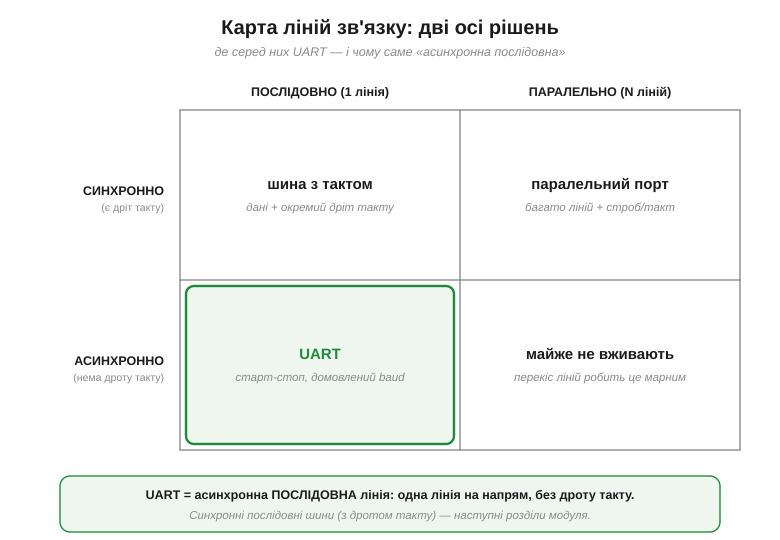
*Рис. 35.1.7. Дві осі рішень. По горизонталі — скільки ліній даних (одна чи багато); по вертикалі — чи є окремий дріт такту. UART сидить у клітині «асинхронна послідовна»: одна лінія на напрям, без дроту такту, синхронізація старт-стопом. Синхронні послідовні шини (з дротом такту) — у сусідній клітині; паралель із тактом лишилася для коротких швидких шин; а асинхронна паралель майже не вживається, бо перекіс ліній робить її марною.*

Ця карта — дороговказ на весь модуль. UART, який ми зараз розбираємо, — це **асинхронна послідовна** лінія: гранично дешева за дротами, зате вимоглива до попередньої домовленості про швидкість. У наступних розділах ми перейдемо в сусідню клітину — до **синхронних** послідовних шин, де повертається дріт такту, але натомість зникає потреба тримати точні годинники й домовлятися про baud. У кожного підходу — своя ціна й своя сфера, і знати цю карту означає правильно обирати інтерфейс під задачу.

А тепер, коли зрозуміло, **чому** UART послідовний і асинхронний, час розібрати, **з чого саме** складається той кадр, який біжить лінією: де там старт-біт, скільки біт даних, навіщо біт парності й що таке стоп-біт. До цього — у наступній темі.

---

## 35.2 Кадр UART: старт, дані, парність, стоп

У попередній темі ми з'ясували головне: UART — асинхронна послідовна лінія, де приймач не має дроту такту й синхронізується **старт-стопом** наново перед кожним знаком. Тепер розберімо цей знак — **кадр** (*frame*) — по кісточках. Кадр UART — це і є той **контракт**, який обидві сторони мусять розуміти однаково: де початок, скільки біт даних, у якому вони порядку, чи є контроль помилок, де кінець. Помилитися бодай в одному пункті — і лінія, формально з'єднана, передаватиме саме сміття. Тож пройдімо кадр від спокою до спокою.

### Анатомія кадру: від спокою до спокою

Поки нічого не передається, лінія простоює у стані **«1»** — це **спокій** (*idle*), він же historично **мітка** (*mark*). Сам кадр завжди має ту саму будову: один **старт-біт** (*start bit*, рівень «0»), далі **біти даних** (5–9, типово 8), далі **необов'язковий біт парності** (*parity*), і нарешті щонайменше один **стоп-біт** (*stop bit*, рівень «1»). Після стопа лінія знову у спокої — готова до наступного кадру.


*Рис. 35.2.1. Один кадр для байта 0xB5 у форматі 8-біт даних, парна парність, 1 стоп. Спокій («1») → СТАРТ («0») → вісім біт даних (молодший D0 першим) → біт парності P → СТОП («1») → знову спокій. Перепад «1→0» на початку — це і є старт, який будить приймач.*

Чому спокій — саме «1», а не «0»? Це спадок телеграфу (мітка = є струм), і він напрочуд зручний: оскільки лінія у спокої завжди висока, **будь-який** старт-біт виглядає як **перепад униз** — чіткий фронт, який легко зловити (саме його шукає механізм передискретизації з §35.1). Якби спокій був «0», приймач не відрізнив би початок кадру від простою. Один кадр несе рівно **один знак** — зазвичай один байт.

### Молодший біт першим: LSB-first

Тонкість, яка плутає чи не кожного, хто вперше дивиться на лінію осцилографом: UART передає біти даних **молодшим уперед** (*LSB first* — least significant bit first). Тобто першим у лінію йде **D0** (наймолодший біт байта), а останнім — D7 (найстарший).

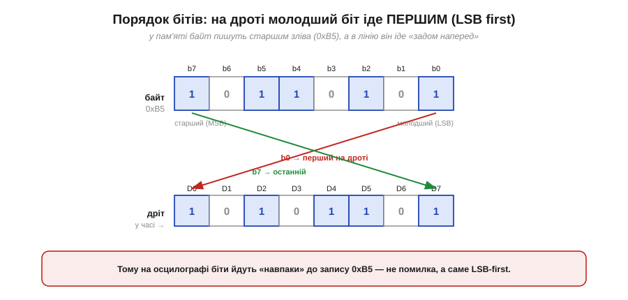
*Рис. 35.2.2. У пам'яті байт 0xB5 пишуть старшим бітом ліворуч (1011 0101). Але в лінію він іде «задом наперед»: спершу b0, потім b1, … аж до b7. Тому послідовність на дроті (D0…D7) — дзеркальна до запису байта.*

Через це послідовність бітів на екрані логічного аналізатора виглядає **навпаки** до того, як ти звик писати байт (старший зліва). Це не помилка приладу й не збій — це саме **LSB-first**. Коли декодуєш захоплений сигнал руками, читай біти в **порядку прибуття** (D0, D1, …), а тоді перевертай, щоб дістати число; або довірся аналізатору, який зробить це сам.

> 🔧 **Навіщо це.** Переплутати порядок бітів — класична причина «майже правильних» даних: замість 0x41 читаєш 0x82, і нічого не сходиться. Тому, налаштовуючи декодер протоколу в логічному аналізаторі, завжди перевіряй, що він стоїть на **LSB-first** (для UART це майже завжди так). А якщо декодуєш вручну — пам'ятай, що перший біт на дроті наймолодший.

### Скільки біт даних і запис «8N1»

Кількість біт даних у кадрі — налаштовна: від 5 до 9, але на практиці майже завжди **8** (рівно байт). Сім біт використовують для чистого 7-бітного ASCII-тексту, п'ять-шість — хіба що для сумісності зі старою технікою. Усі три параметри кадру — біти даних, парність, стоп-біти — прийнято стискати в короткий код на кшталт **«8N1»**.

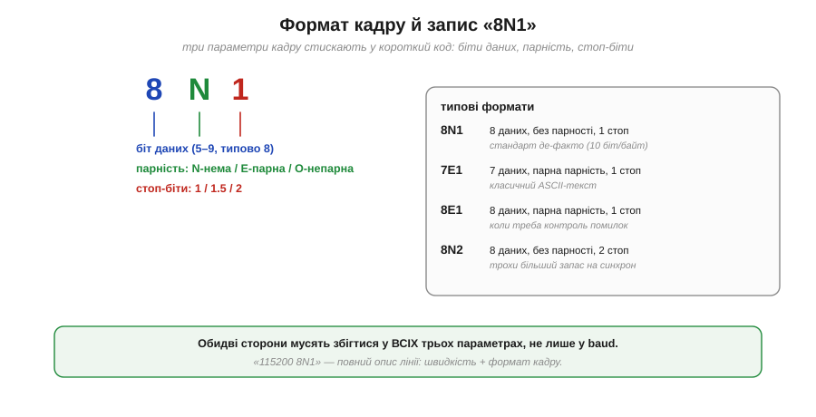
*Рис. 35.2.3. «8N1» читається так: **8** біт даних, парність **N** (none — немає), **1** стоп-біт. Поряд — інші типові формати: 7E1 для ASCII, 8E1 коли потрібен контроль помилок, 8N2 для трохи більшого запасу. Запис «115200 8N1» повністю описує лінію: швидкість плюс формат кадру.*

Найважливіше тут — усвідомити: збігтися сторонам треба не лише у **baud**, а в **усіх** параметрах кадру одразу. Якщо один пристрій шле 8N1, а інший налаштований на 7E1, вони не порозуміються, навіть якщо швидкість однакова: приймач шукатиме біт парності там, де його нема, і битиме «помилку кадру». Тому повний опис послідовної лінії — це завжди «швидкість + формат», як-от «115200 8N1».

### Біт парності: найдешевший контроль помилок

Необов'язковий **біт парності** — це найдешевший із можливих контролів помилок: лише один додатковий біт на кадр. Він буває **парний** (*even*) або **непарний** (*odd*). Правило просте: біт добирають так, щоб **загальна** кількість одиниць (у даних разом із бітом парності) стала парною (для even) або непарною (для odd).

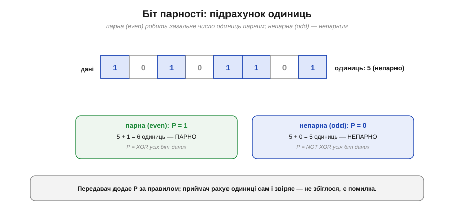
*Рис. 35.2.4. У даних 0xB5 — п'ять одиниць (непарно). Для **парної** парності беремо P = 1, щоб разом вийшло 6 одиниць (парно); для **непарної** — P = 0, щоб лишилося 5 (непарно). Технічно P для even — це просто XOR усіх біт даних.*

Працює це так: передавач рахує одиниці й виставляє P за правилом, а приймач **самостійно** перераховує одиниці у прийнятих даних і звіряє зі здобутим P. Не збіглося — отже, біт десь перевернувся в дорозі, і приймач піднімає прапорець **помилки парності**.

### Що парність ловить, а що ні

У парності є принципова межа, яку треба чітко розуміти, щоб на неї не покладатися надміру. Вона надійно виявляє **будь-яке непарне** число перевернутих біт (один, три, п'ять…), але **повністю пропускає парне** (два, чотири…).


*Рис. 35.2.5. Без помилок парність сходиться. Перевернувся **один** біт — число одиниць змінило парність, звірка не сходиться, помилку **виявлено**. Перевернулися **два** біти — парність повернулася до початкової, звірка знову сходиться, і помилку **пропущено**. Один біт парності не бачить парного числа збоїв.*

Отже, парність — це слабкий контроль: вона **виявляє** одиничний збій, але не **виправляє** його, та й двобітну помилку проґавить. Через це її часто взагалі вимикають (**N**), а восьмий біт віддають під дані — звідси й панування «8N1». Для справжньої ж цілісності повідомлення покладаються не на парність окремого байта, а на **контрольну суму чи CRC** над цілим пакетом — до цього ми ще дійдемо в цьому розділі.

> 🔧 **Навіщо це.** Сприймай парність як дешевий «детектор диму» на кожен байт, а не як гарантію. Якщо лінія коротка й чиста (плата-плата), її сміливо вимикають заради простоти й швидкості. Якщо ж дані критичні або лінія шумна, надійніше лишити 8N1 для швидкості, але **загорнути дані у власний пакет із CRC** — це впіймає і те, що парність пропускає.

### Стоп-біт і кадри підряд

**Стоп-біт** — це рівень «1» тривалістю щонайменше в один біт у самому кінці кадру. Його роль — **гарантувати**, що лінія повернулася у спокій, перш ніж почнеться наступний кадр. Без нього два знаки підряд могли б злитися, і приймач не побачив би перепаду старту.

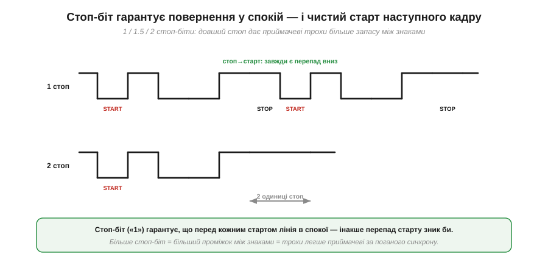
*Рис. 35.2.6. Угорі — два кадри підряд з одним стоп-бітом: між стопом одного й стартом наступного завжди є перепад «1→0», тож кожен старт видно. Унизу — той самий кадр із двома стоп-бітами: довший проміжок «1» дає приймачеві трохи більший запас між знаками.*

Стоп-біт буває завдовжки **1**, **1.5** або **2** одиниці. Один — стандарт; два (чи півтора, у старій техніці) дають довший проміжок між знаками, а отже трохи більший запас, коли годинники сторін не зовсім збігаються. Суть незмінна: стоп повертає лінію у спокій, і завдяки цьому початок **кожного** наступного кадру — це знову чіткий перепад униз.

### Скільки це коштує: накладні витрати кадру

Підрахуймо ціну надійності. У форматі 8N1 на **8** корисних біт даних припадає ще **2** службові — старт і стоп, разом **10 біт** на кожен байт. Тобто корисними з лінії є лише 80% часу.

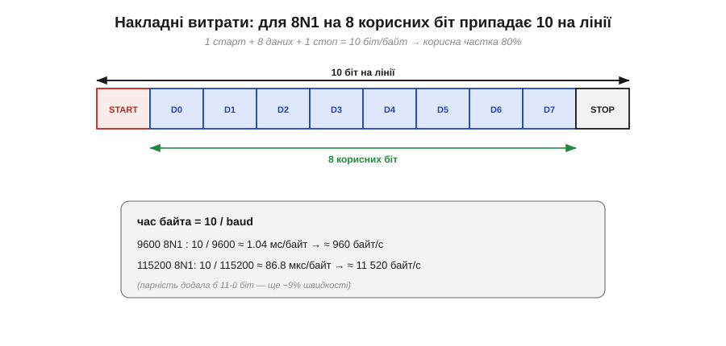
*Рис. 35.2.7. Для 8N1 кадр — це 10 біт на лінії на 8 біт даних (корисна частка 80%). Звідси час одного байта = 10 / baud, а пропускна здатність — обернена до нього. Біт парності додав би 11-й біт і відняв би ще ≈9% швидкості.*

**Приклад (реальна пропускна здатність лінії).** Порахуймо, скільки байтів за секунду тягне лінія у двох поширених режимах:

```
час байта (8N1) = 10 біт / baud

9600 8N1   : 10 / 9600   ≈ 1.042 мс/байт  →  1 / 0.001042 ≈ 960 байт/с
115200 8N1 : 10 / 115200 ≈ 86.8 мкс/байт  →  1 / 0.0000868 ≈ 11 520 байт/с
```

Зверніть увагу: «9600 бод» — це **не** 9600 байт/с, а лише близько 960, бо кожен байт тягне за собою ще два службові біти. Плутати ці два числа — часта помилка в оцінках.

> 🔧 **Навіщо це.** Ця проста формула дає змогу заздалегідь сказати, чи **влізе** потік у лінію. Скажімо, давач віддає 50 вимірів за секунду по 6 байт — це 300 байт/с, і навіть скромні 9600 8N1 (960 байт/с) мають потрійний запас. А от відеокадр чи щільний лог на сотні кілобайт за секунду по UART уже не пройде — там потрібні мегабодні швидкості або зовсім інша шина. Рахунок «байт = 10 біт» рятує від нездійсненних очікувань ще на етапі вибору інтерфейсу.

Отже, кадр ми розібрали повністю — від старт-біта до стопа, з даними LSB-first, парністю й накладними витратами. Але вся ця конструкція трималася на одній мовчазній умові: приймач веде час **власним** годинником і лише приблизно тієї самої частоти, що передавач. Наскільки «приблизно» можна — перш ніж відлік «з'їде» в сусідній біт і кадр розсиплеться? Це питання **допуску на розсинхрон**, і до його кількісної відповіді переходимо далі.

---

## 35.3 Швидкість (baud) і розсинхрон

У §35.1 ми сказали: годинники сторін мають бути «досить точні». У §35.2 — що приймач відлічує біти власним генератором від старт-біта. Тепер настав час перетворити це розпливчасте «досить точні» на **число**. Виявиться, що в асинхронної передачі є цілком конкретний, легко обчислюваний **допуск на розбіжність такту** — і знання цього числа врятує від найзагадковіших збоїв UART, коли «начебто все під'єднано, а лінія несе сміття». Заодно стане ясно, чому на платах трапляються кварци з безглуздими на вигляд частотами на кшталт 14.7456 МГц.

### Звідки береться baud: дільник частоти

Спершу — як апаратура взагалі отримує потрібну швидкість. У мікроконтролера є тактова частота периферії (скажімо, 16 МГц), а UART-блок усередині містить **генератор швидкості** (*baud-rate generator*) — звичайний дільник. Він ділить тактову частоту на ціле число **DIV**, а потім ще на коефіцієнт **передискретизації** (з §35.1, типово 16), і дістає бітову швидкість.


*Рис. 35.3.1. baud = f_periph / (16 × DIV). Периферійну частоту ділять на ціле DIV і на передискретизацію. Оскільки DIV — **ціле**, бажану швидкість майже ніколи не дістати точно: реальний baud трохи відрізняється від цілі, і ця похибка з'їдає частину допуску ще до того, як підключено другий пристрій.*

Ось де народжується перша похибка. DIV мусить бути цілим, а формула рідко дає рівне число, тож його **округлюють** — і реальна швидкість трохи відхиляється від бажаної. Стандартні швидкості (1200, 2400, 4800, 9600, 19200, 38400, 57600, 115200…) тому й «дивні», що історично добиралися зручними для поширених тактових частот; кожна наступна приблизно вдвічі більша за попередню.

**Приклад (похибка baud від округлення).** Порахуймо реальну швидкість для цілі 9600 при тактовій 16 МГц:

```
DIV = 16 000 000 / (16 × 9600) = 104.17  →  округлюємо до 104
реальний baud = 16 000 000 / (16 × 104) = 9615 бод
похибка = (9615 − 9600) / 9600 ≈ +0.16%
```

Для 9600 похибка крихітна — лиш 0.16%. Та сама арифметика на високій швидкості дасть зовсім інший результат, і саме він стане джерелом проблем (побачимо нижче).

### Похибка не зникає: вона накопичується

Тепер головне розуміння всієї теми. Приймач синхронізується з передавачем **лише раз** — на спаді старт-біта. Після цього він відлічує кожен біт **власним** годинником, не маючи більше жодної прив'язки до передавача аж до наступного старту. А це означає, що навіть крихітна різниця в частоті годинників **накопичується** з кожним бітом.

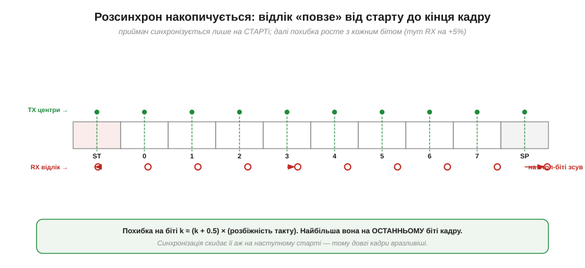
*Рис. 35.3.2. Зелені — ідеальні точки відліку (центри бітів передавача). Червоні — точки, у яких бере відлік приймач зі злегка швидшим годинником. На старті вони збігаються, але далі червоні «повзуть» убік, і зсув росте з кожним бітом. На стоп-біті (k≈9.5) він найбільший: при розбіжності 5% це вже ≈ 0.475 біта.*

Кількісно: зсув відліку на біті номер k дорівнює приблизно **(k + 0.5) × (відносна розбіжність такту)**, виміряний у частках біта. На старті (k=0) зсув мізерний; на останньому біті кадру він **максимальний**. Саме тому асинхронна передача працює лише **короткими кадрами**: за десяток біт похибка не встигає накопичитися до фатальної, а перед наступним знаком старт-біт усе скидає в нуль. Якби кадр був завдовжки в сотні біт, навіть дрібний розсинхрон зрештою зіпсував би його кінець.

### Бюджет допуску: пів-біта на останньому відліку

Скільки ж зсуву можна стерпіти? Приймач влучає в біт правильно, доки точка відліку лишається в межах цього біта — тобто поки зсув від центру менший за **половину біта**. Щойно зсув перевищить ±0.5 біта, відлік «провалюється» в сусідній біт, і дані спотворюються.

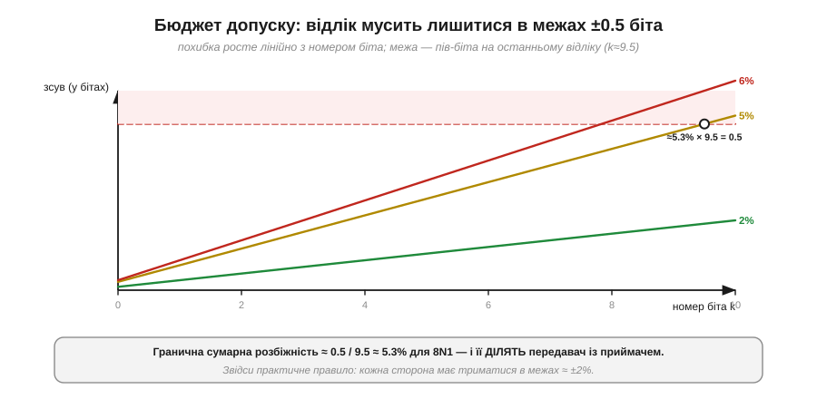
*Рис. 35.3.3. Зсув росте лінійно з номером біта (прямі для розбіжності 2%, 5%, 6%). Горизонтальна межа — 0.5 біта. Для формату 8N1 останній відлік (стоп-біт) припадає на k ≈ 9.5, тож гранична сумарна розбіжність — там, де пряма перетинає 0.5: приблизно 0.5 / 9.5 ≈ 5.3%.*

Звідси проста й точна оцінка. Для формату 8N1 останній значущий відлік (стоп-біт) припадає приблизно на 9.5 бітових інтервалів від точки синхронізації. Щоб зсув там лишився в межах 0.5 біта, сумарна розбіжність має бути меншою за:

```
гранична розбіжність ≈ 0.5 біта / 9.5 біта ≈ 5.3%
```

Але цей бюджет — **сумарний**: його ділять між собою **обидві** сторони (похибка baud передавача плюс похибка baud приймача), та ще й з'їдає частину зерно передискретизації (16× дає точність уставлення ≈ 1/16 біта). Тому на практиці керуються правилом: **кожна** сторона має триматися в межах приблизно **±2%**, і тоді сумарно лишається безпечний запас.

> 🔧 **Навіщо це.** Запам'ятай число **±2% на сторону, ~5% сумарно** — це і є та межа «досить точних» годинників. Воно пояснює, чому два пристрої з гарними кварцами легко спілкуються навіть на 115200, а два з неточними годинниками — ні. І воно ж підказує перший крок налагодження: якщо лінія несе сміття або сипле **помилками кадру** (*framing error* — коли стоп-біт прочитано як «0»), підозрюй не дроти, а **розбіжність baud**.

### Три випадки: безпечно, на межі, збій

Прикладімо цю межу до конкретних чисел і подивімося, де відлік стоп-біта влучає в біт, а де вже промахується.


*Рис. 35.3.4. Клітина стоп-біта з центром і краями. При розбіжності 2% зсув на стоп-біті — лише 0.19 біта (глибоко в біті, безпечно). При 5% — 0.475 біта (на самій межі). При 6% — 0.57 біта: відлік уже вийшов за край, стоп-біт прочитано неправильно, приймач підіймає помилку кадру.*

**Приклад (де проходить межа).** Порахуймо зсув на стоп-біті (k = 9.5) для трьох розбіжностей:

```
зсув = 9.5 × розбіжність  (у частках біта)

2% : 9.5 × 0.02 = 0.19 біта   →  безпечно (« 0.5)
5% : 9.5 × 0.05 = 0.475 біта  →  на самій межі (ризиковано)
6% : 9.5 × 0.06 = 0.57 біта   →  ПРОМАХ (> 0.5) — помилка кадру
```

Видно, як вузька грань: різниця між «надійно» і «зовсім не працює» — лише кілька відсотків. Ось чому до точності годинників в асинхронній лінії ставляться так серйозно.

### Чому існують «дивні» кварци

Тепер повернімося до похибки baud від округлення дільника — і побачимо, чому вона диктує **вибір кварцу**. Згадаймо: при 16 МГц ціль 9600 дала лише +0.16% похибки. А тепер та сама тактова, але висока швидкість.

**Приклад (16 МГц на 115200 — погана пара).** Порахуймо реальну швидкість:

```
DIV = 16 000 000 / (16 × 115200) = 8.68  →  округлюємо до 9
реальний baud = 16 000 000 / (16 × 9) = 111 111 бод
похибка = (111 111 − 115 200) / 115 200 ≈ −3.5%
```

Уже **−3.5%** лише з одного боку! Це з'їдає майже весь сумарний бюджет ще до того, як ми глянули на другий пристрій. Саме тому «16 МГц на 115200» — відомо проблемна пара. А розв'язок — узяти тактову, **кратну** бодовим швидкостям.

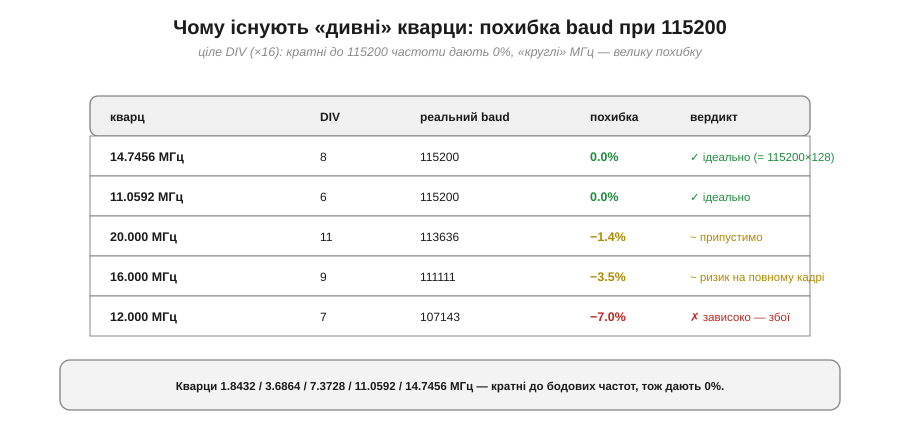
*Рис. 35.3.5. Кварци 14.7456 і 11.0592 МГц дають точно 115200 (нульова похибка), бо вони кратні бодовим частотам. «Круглі» 16 і 12 МГц дають −3.5% і −7% — на межі або за нею. Ось чому на платах із послідовним зв'язком трапляються «дивні» кварци на кшталт 14.7456 МГц: вони — не примха, а добір під точний baud.*

Число 14.7456 МГц виглядає безглуздо, аж поки не помітиш: 14 745 600 = 115 200 × 128. Така частота ділиться на будь-яку стандартну бодову швидкість **націло**, тож похибка baud — нуль. Уся родина «телекомунікаційних» кварців (1.8432, 3.6864, 7.3728, 11.0592, 14.7456, 22.1184 МГц) — це кратні до бодових частот, дібрані саме заради цього.

> 🔧 **Навіщо це.** Побачивши на чужій платі кварц на 11.0592 чи 14.7456 МГц, ти одразу знаєш: ця плата серйозно працює з UART на високих швидкостях. І навпаки — якщо мікроконтролер тактується від «круглих» 16 чи 8 МГц, не дивуйся, що на 115200 зв'язок капризує: похибка baud уже близька до межі. Багато сучасних чипів (зокрема ESP32) обходять це **дробовим** дільником, який добирає швидкість точніше за ціле DIV, — але стара добра порада «візьми правильний кварц» досі жива.

### Що ще звужує допуск: кадр і джерело такту

Насамкінець — два чинники, які з'їдають бюджет допуску, і про які варто пам'ятати. Перший — **довжина кадру**. Що далі від старту останній відлік, то менший допуск: довший кадр накопичує більше зсуву.


*Рис. 35.3.6. Ліворуч: короткий кадр терпить більший розсинхрон (5N1 — аж 7.7%, а 8N2 — лише 4.8%, бо стоп далі від старту). Праворуч: точність джерела такту. Кварц тримає ±0.005%, а внутрішній RC-генератор — цілих ±1…2% із температурою, тобто сам здатний з'їсти майже весь бюджет.*

Другий, важливіший, чинник — **джерело такту**. Кварцовий резонатор тримає частоту з точністю ±0.005% (±50 ppm) — на тлі нашого 2%-бюджету це ніщо. А от дешевий **внутрішній RC-генератор** мікроконтролера «гуляє» на ±1…2%, та ще й залежно від температури й напруги. Якщо обидва пристрої тактуються від внутрішніх RC, їхні похибки можуть скластися й вилізти за межу — і саме тому два таких пристрої нерідко «не бачать» одне одного на 115200, тоді як із кварцами зв'язок іде без проблем.

> 🔧 **Навіщо це.** Сумарний бюджет ≈5% ділиться між **чотирма** їдцями: похибка baud передавача, похибка baud приймача, дрейф годинника (особливо RC від температури) і зерно передискретизації. Практичні висновки прості: для надійного високошвидкісного UART бери кварц (або калібрований внутрішній генератор), не задирай швидкість понад потрібну, а якщо зв'язок капризує — спершу **знизь baud** (на 9600 допуск величезний, бо й похибки дрібні) і лише потім шукай інше. Часто саме крок «115200 → 9600» оживляє вперту лінію.

Ми розібралися, **як швидко** й **наскільки синхронно** біжать біти. Але досі ми мовчки вважали, що «1» і «0» — це просто якісь рівні напруги. А які саме? Виявиться, що тут ховається ціла родина несумісних стандартів — від звичних 3.3 В на ніжці мікроконтролера до інвертованих ±12 В старого комп'ютерного порту, — і переплутати їх означає в кращому разі нічого не побачити, а в гіршому — спалити вхід. Цим рівням сигналу присвячено наступну тему.

---

## 35.4 Рівні сигналу: TTL vs RS-232

Досі ми говорили про «1» і «0» так, ніби це чисті логічні стани. Та по дроту біжить не логіка, а **напруга**, і тут постає питання, яке щороку коштує новачкам спалених входів: **якою саме напругою** позначають мітку й пропуск? Відповідь не одна. Та сама послідовна лінія може жити у щонайменше трьох несумісних «діалектах» рівнів — і знати їх відмінності так само важливо, як розуміти кадр. Бо кадр у двох пристроїв може збігатися ідеально, а от якщо в одного «1» — це +3.3 В, а в іншого −12 В, вони не лише не порозуміються, а ще й можуть пошкодити одне одного.

### TTL-рівні: «1» прив'язана до живлення

Найпростіший і найпоширеніший у світі мікроконтролерів діалект — **логічні**, або **TTL-рівні** (*TTL / logic-level*). Це звичайний цифровий сигнал, такий самий, як на будь-якій ніжці ([Розділ 14](../../block-3-digital-processor/ch14-logic-levels/ch14-logic-levels.md)): однополярний і **неінвертований**. Мітка «1» — це напруга живлення VCC, пропуск «0» — нуль (земля).


*Рис. 35.4.1. UART прямо на ніжці мікроконтролера: лінія у спокої тримається на VCC («1»), а старт-біт тягне її до 0 В. Високий рівень — це або 3.3 В, або 5 В залежно від живлення чипа. Саме звідси, з прив'язки «1» до напруги живлення, виростає вся подальша несумісність.*

Ключове, що варто закарбувати: у TTL рівень «1» — це **напруга живлення конкретного чипа**. А чипи живляться по-різному: класичні 5 В у старих платах і 3.3 В у більшості сучасних (зокрема ESP32). Звідси й перша пастка.

### 3.3 В проти 5 В: де ховається небезпека

Здавалося б, 3.3 і 5 В близькі — невже не з'єднати напряму? Іноді можна, іноді — ні, і плутанина тут небезпечна.

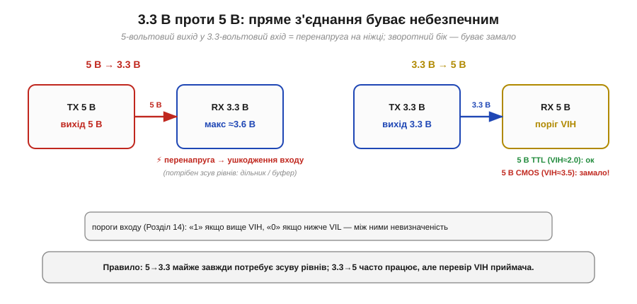
*Рис. 35.4.2. Ліворуч: 5-вольтовий вихід у 3.3-вольтовий вхід — **перенапруга**: на ніжці з'являється 5 В, тоді як її максимум близько 3.6 В, і вхід можна пошкодити. Праворуч: 3.3-вольтовий вихід у 5-вольтовий вхід — часто **працює** (для 5 В TTL поріг VIH ≈ 2.0 В, і 3.3 В його впевнено перекриває), але для деяких 5 В CMOS-входів із порогом VIH ≈ 3.5 В цього вже **замало**.*

Розберімо обидва напрямки. **5 В → 3.3 В** небезпечний: вихід виставляє повні 5 В, а 3.3-вольтовий вхід зазвичай не терпить більше за ≈VCC + 0.3 В (тобто ≈3.6 В). Зайві вольти течуть через захисні діоди входу й помалу (а то й одразу) вбивають ніжку. Тут **обов'язковий** зсув рівнів — щонайпростіше резистивним дільником, краще — спеціальним буфером. **3.3 В → 5 В** м'якший: 5-вольтовий вхід найчастіше вважає 3.3 В надійною «1», бо його поріг спрацювання нижчий. Але це не гарантія — у CMOS-входу поріг може бути високим, і тоді 3.3 В не дотягнуть.

> 🔧 **Навіщо це.** Перш ніж з'єднати TX однієї плати з RX іншої, **звір напруги живлення**. Якщо одна на 5 В, а друга на 3.3 В, не кидай дроти навмання: 5→3.3 проганяй через зсув рівнів, а для 3.3→5 зазирни в даташит приймача, чи 3.3 В вистачає для його VIH. Найдорожча помилка — подати 5 В на 3.3-вольтовий вхід «бо начебто близько»: ніжка цього може не пробачити.

### RS-232: біполярно й інвертовано

А тепер — зовсім інший діалект, успадкований від старих комп'ютерних портів: **RS-232**. Це не «трохи інша напруга», а принципово інший світ, несумісний із TTL одразу за трьома ознаками.

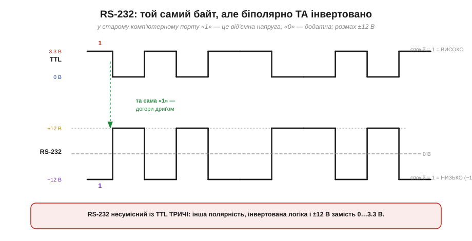
*Рис. 35.4.3. Угорі — звичний TTL (спокій високий, 3.3 В). Унизу — той самий байт у RS-232: логіку **інвертовано** (мітка «1» — це від'ємна напруга), сигнал **біполярний** (гойдається в обидва боки від нуля), а розмах — аж **±12 В**. Лінія у спокої тут лежить унизу, на −12 В.*

По-перше, **інверсія**: у RS-232 мітка «1» — це **від'ємна** напруга (−5…−15 В на виході драйвера, типово −12 В), а пропуск «0» — **додатна** (+5…+15 В, типово +12 В). По-друге, **біполярність**: сигнал гойдається в обидва боки від нуля, а не від 0 до VCC. По-третє, **величина**: ±12 В замість скромних 0…3.3 В. Лінія у спокої лежить на −12 В (бо спокій — це мітка «1»). Через усі три відмінності RS-232 і TTL **не можна** з'єднувати напряму: мало того що вони зрозуміють біти навпаки, так ще й ±12 В миттєво спалять 3.3-вольтову ніжку.

### Навіщо такий розмах: завадостійкість

Чому ж старий стандарт обрав такі великі й незручні напруги? Заради **завадостійкості** на довгих кабелях. Великий розмах і широка «мертва зона» між рівнями означають величезний запас: навіть якщо кабель просадить сигнал на кілька вольтів, а зверху наведеться шум, приймач усе одно впевнено відрізнить «1» від «0».

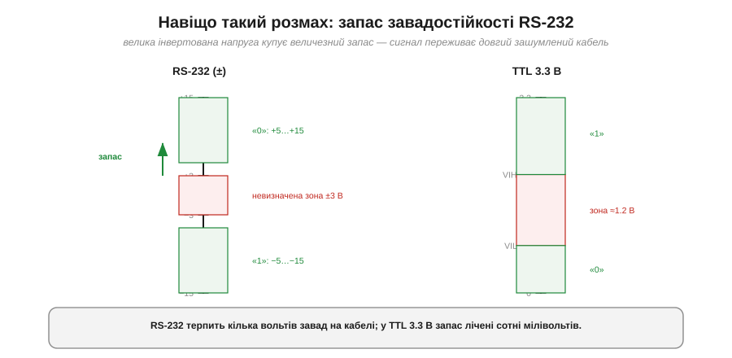
*Рис. 35.4.4. RS-232 (ліворуч): передавач видає ±(5…15) В, а приймач уважає «1» все, що нижче −3 В, і «0» — усе, що вище +3 В. Між ними широка невизначена зона ±3 В, але до неї ще багато вольтів запасу. TTL 3.3 В (праворуч): пороги VIH ≈ 2.0 і VIL ≈ 0.8 В, тож запас — лічені сотні мілівольтів.*

**Приклад (порівняймо запас).** Прикиньмо «відстань до помилки» в обох діалектах:

```
RS-232: передавач «1» ≈ −12 В, поріг приймача −3 В
        запас ≈ |−12 − (−3)| = 9 В шуму можна стерпіти

TTL 3.3: вихід «0» ≈ 0.4 В, поріг VIL ≈ 0.8 В
        запас ≈ 0.8 − 0.4 = 0.4 В — у двадцять із гаком разів менший
```

Ось чому RS-232 десятиліттями возив дані надійними метрами кабелю, а TTL призначений для коротких доріжок на платі: його крихітний запас не переживе ні довгого дроту, ні сильної завади.

### Місток між світами: конвертер рівнів

Якщо TTL і RS-232 несумісні, а зв'язати їх треба, між ними ставлять **конвертер рівнів**. Класика жанру — мікросхема **MAX232**: вона перетворює рівні в обидва боки й заодно інвертує логіку.


*Рис. 35.4.5. MAX232 стоїть між TTL-боком (МК, 3.3/5 В, неінвертовано) і RS-232-боком (±12 В, інвертовано) і перекладає сигнали в обидва напрямки. Найхитріше — він сам **накачує** потрібні ±10 В з єдиного 5-вольтового живлення за допомогою вбудованих зарядних помп на кількох конденсаторах.*

Найдотепніше в MAX232 — те, що для від'ємної й підвищеної напруги йому **не потрібне** окреме живлення: він робить ±10 В із звичайних 5 В за допомогою **зарядних помп** (*charge pumps*) — схем, що перекидають заряд між конденсаторами, нарощуючи напругу. Тому для роботи йому досить кількох зовнішніх конденсаторів і однієї шини 5 В.

> 🔧 **Навіщо це.** **Ніколи** не з'єднуй ±12 В RS-232 напряму з ніжкою мікроконтролера — це гарантований спалений вхід. Якщо тобі трапився пристрій із «справжнім» RS-232 (старі GPS-приймачі, промислові давачі, модеми, лабораторні прилади), став між ним і МК конвертер на кшталт MAX232. І навпаки: побачивши на платі MAX232 з гронами конденсаторів навколо, ти одразу знаєш — тут є справжній RS-232-порт, а не TTL.

### Сучасна реальність: USB-to-serial

Та де сьогодні взяти той RS-232? У сучасних комп'ютерів його давно немає — натомість усе йде через **USB**. Коли ти під'єднуєш плату кабелем до комп'ютера й відкриваєш «COM-порт», насправді працює **міст USB↔UART** — окрема мікросхема, що з одного боку розмовляє по USB, а з іншого видає звичайний TTL-UART.


*Рис. 35.4.6. Ланцюг сучасного «послідовного порту»: ПК бачить віртуальний COM-порт, кабель несе USB, чип-міст (CP2102, CH340 чи FT232) перетворює USB на TTL-UART 3.3 В, і вже він іде на ніжки RX/TX мікроконтролера. «COM-порт» у системі — віртуальний, а до МК доходить звичайний логічний рівень.*

Саме тому на платах поряд із роз'ємом USB майже завжди сидить така мікросхема-міст — її ти й бачиш як «програматор» чи «Serial». Імена CP2102, CH340, FT232 — це різні виробники таких мостів; усі вони роблять одне: ховають USB і віддають мікроконтролеру простий TTL-UART, найчастіше на 3.3 В.

> 🔧 **Навіщо це.** Коли «Serial» працює через USB-кабель — між комп'ютером і МК стоїть чип-міст, і на боці мікроконтролера це звичайний 3.3 В TTL, а не RS-232. Тому для зв'язку двох плат між собою RS-232-конвертер зазвичай **не потрібен** — обидві говорять TTL, і їх з'єднують напряму (звіривши лише 3.3/5 В). А якщо драйвер моста (CP210x, CH340) не став сам — це найперша причина, чому «плата не з'являється як COM-порт».

### Що з чим з'єднується: матриця й типові помилки

Зведімо все в просте правило «що з чим можна напряму».


*Рис. 35.4.7. TTL↔TTL однакової напруги — напряму (навхрест, зі спільною землею). TTL 5↔3.3 — через зсув рівнів. TTL↔RS-232 — лише через конвертер (інакше спалиш вхід). RS-232↔RS-232 — напряму. А внизу — три класичні помилки дротів і рівнів, які дають «лінія є, а зв'язку нема».*

Три найчастіші причини, чому щойно зібрана лінія мовчить, варто перевіряти **першими**: переплутані **TX↔TX** замість навхрест (з §35.1), забута **спільна земля** і **неузгоджені рівні** чи інверсія. Жодна з них не видна оком — лінія начебто з'єднана, — але будь-яка вбиває зв'язок.

> 🔧 **Навіщо це.** Це твій чек-лист налагодження «німої» лінії: (1) TX і RX навхрест? (2) земля спільна? (3) рівні збігаються (обидва TTL тієї самої напруги, або стоїть конвертер)? (4) baud і формат однакові (з §35.2–35.3)? Пройдешся цими чотирма пунктами — і впіймаєш чи не всі типові біди фізичного рівня UART.

Тепер фізичний бік лінії ми знаємо повністю: і рівні, і їхню несумісність, і як їх мостити. Але лишилося питання з боку **програми**: байти прибувають у свій час, незалежно від того, чи готовий процесор їх забрати саме зараз. Що буде, якщо новий байт прийшов, а попередній ще не прочитано? Тут на сцену виходять **буфери** й **керування потоком** — тема наступного підрозділу.

---

## 35.5 Буфери (FIFO) і керування потоком

В асинхронній лінії передавач — повний господар часу: він шле байт, коли захоче, і нікого не питає, чи готовий приймач. А приймач — звичайний процесор, який і без того зайнятий: щось рахує, моргає світлодіодом, чекає інший давач. І ось у цьому розриві — байти приходять за розкладом передавача, а забирає їх процесор за своїм — ховається ціла родина підступних збоїв і два механізми боротьби з ними: **буфери**, що згладжують неузгодженість у часі, і **керування потоком**, що дозволяє приймачеві сказати «зачекай».

### Проблема: байт прийшов, а його нема кому забрати

Уявімо найнаївнішу схему: у приймача є один-єдиний регістр, куди UART кладе щойно прийнятий байт, а процесор має його звідти забрати. Поки процесор устигає прочитати кожен байт до приходу наступного — усе гаразд. Та варто йому на мить відволіктися на довшу операцію — і станеться біда.


*Рис. 35.5.1. Процесор прочитав B0 і застряг у довгій операції. Тим часом приходить B1, а за ним B2 — і B2 лягає в той самий єдиний регістр, **затираючи** ще не прочитаний B1. Байт B1 втрачено назавжди. Це **переповнення приймача** (*overrun*).*

Це **переповнення** (*overrun*) — втрата байта через те, що його не встигли забрати. Воно тихе й підступне: жодного «дзвінка», просто в потоці зникає байт, і повідомлення розсипається. Корінь проблеми — фундаментальна риса асинхронності: передавач не знає й не зважає на те, чим зараз зайнятий приймач. Отже, потрібен спосіб **притримати** прибулі байти, поки процесор до них дійде.

### Апаратний FIFO: черга в периферії

Перший рівень захисту вбудований у саму периферію UART — це невелика **черга** на кшталт «перший прийшов — перший вийшов» (*FIFO, first-in-first-out*). Замість одного регістра приймач має чергу з кількох комірок: нові байти стають у її хвіст, а процесор забирає їх із голови — і вже не мусить ловити кожен байт «у момент».


*Рис. 35.5.2. Прийняті байти шикуються в RX-FIFO, а процесор забирає їх із іншого кінця — можна навіть кількома за раз. Глибина FIFO невелика: типово 16 байт (як у класичного UART 16550), у потужніших чипах на кшталт ESP32 — до 128. Це дає процесору «фору», але й вона скінченна.*

FIFO дає дорогоцінну **фору**: процесор може на мить відволіктися — байти зачекають у черзі, а не зникнуть. Та глибина її невелика (історичні 16 байт, у ESP32 — 128), тож якщо процесор затримається надовго, переповниться і вона — і знову почнуться втрати. FIFO згладжує **короткі** сплески, але не рятує від тривалої зайнятості.

### Два рівні: FIFO плюс кільцевий буфер

Тому драйвери надбудовують над апаратним FIFO другий, набагато більший буфер — уже в оперативній пам'яті. Працює це у зв'язці з **перериваннями** ([Розділ 23](../../block-4-mcu-esp32/ch23-interrupts/ch23-interrupts.md)): коли в FIFO накопичуються байти, периферія викликає переривання, і короткий обробник (ISR) швидко перекладає байти з малого апаратного FIFO у великий програмний буфер. Застосунок же читає вже з цього буфера, коли йому зручно.

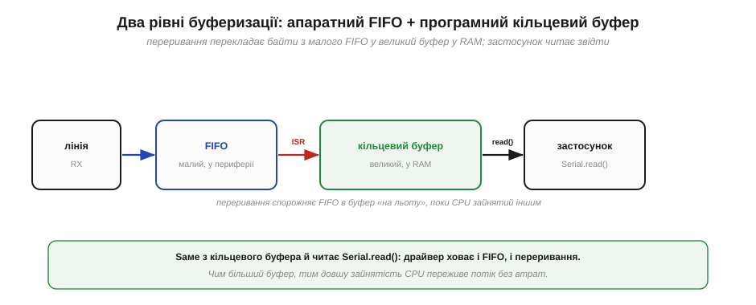
*Рис. 35.5.3. Ланцюг: лінія → апаратний FIFO (малий, у периферії) → переривання перекладає байти → кільцевий буфер (великий, у RAM) → Serial.read() у застосунку. Саме з програмного буфера й читає твій код; драйвер ховає від нього і FIFO, і переривання.*

Ось чому `Serial.read()` майже ніколи не «ловить момент»: він просто дістає байт із великого програмного буфера, який тихо наповнюється у фоні через переривання. Чим більший цей буфер, тим довшу зайнятість процесора потік переживе без втрат.

### Як влаштований кільцевий буфер

Той програмний буфер майже завжди — **кільцевий** (*ring / circular buffer*). Ідея елегантна: беремо звичайний масив, але вважаємо, що після останньої комірки йде знову перша — пам'ять використовується «по колу». Двома покажчиками стежимо за станом: **head** (куди переривання **пише** наступний байт) і **tail** (звідки застосунок **читає**).


*Рис. 35.5.4. Переривання пише в head і просуває його вперед; застосунок читає з tail і просуває його слідом. Між tail і head — непрочитані байти. Коли head доганяє tail — буфер **порожній** (нема що читати); коли head, обійшовши коло, ось-ось наздожене tail — буфер **повний**.*

Поки head попереду tail — між ними лежать непрочитані байти. Коли застосунок усе вичитав, tail доганяє head — буфер порожній. А якщо застосунок лінується, head, обійшовши коло, ось-ось наздожене tail ззаду — буфер **повний**, і класти нікуди. Що робити в цю мить — або викинути новий байт, або затерти найстаріший, — але хай там як, це знову **втрата даних**. Тобто навіть великий буфер лише **відсуває** межу, за якою процесор «не справляється», але не скасовує її.

**Приклад (наскільки великий буфер потрібен).** Припустимо, лінія працює на 115200 8N1 (з §35.2 це ≈ 11520 байт/с, або один байт за 86.8 мкс), а процесор раз у раз застрягає на 10 мс — скажімо, записуючи щось у flash. Скільки байтів прилетить за цей час?

```
байтів за час блокування = 0.010 с / 0.0000868 с ≈ 115 байт
```

Отже, щоб пережити навіть одну таку 10-мілісекундну затримку без втрат, потрібен буфер **щонайменше на 115 байт**. Якщо затримки довші або потік щільніший — буфера вже не вистачить, і доведеться брати інший інструмент: **зупиняти передавача**.

> 🔧 **Навіщо це.** Звідси випливає головна практична заповідь роботи з UART: **не блокуй надовго цикл, що читає лінію**. Довгий `delay()`, повільний запис у flash, важкий друк — усе це наповнює буфер, і якщо потік активний, дані почнуть зникати (це той самий мотив «delay() — зло» з [§24.5](../../block-4-mcu-esp32/ch24-timers/ch24-timers.md)). Якщо переповнення таки трапляються, у тебе три виходи: **збільшити буфер**, **читати частіше** (не блокувати) або **увімкнути керування потоком** — про нього далі.

### Коли буфера замало: апаратне керування потоком RTS/CTS

Буфер — пасивний захист: він терпить, доки може. **Керування потоком** (*flow control*) — активний: воно дає приймачеві спосіб **наказати** передавачеві зробити паузу, перш ніж буфер лусне. Класичний апаратний варіант — лінії **RTS** (*Request To Send*) і **CTS** (*Clear To Send*), дві додаткові до TX/RX.

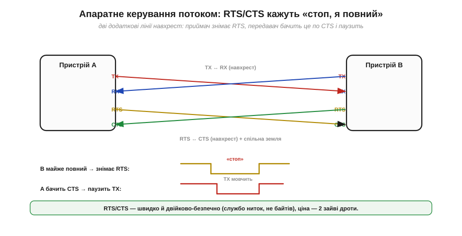
*Рис. 35.5.5. RTS і CTS з'єднують навхрест (A.RTS → B.CTS і навпаки), як і TX/RX. Коли буфер приймача B майже повний, B знімає свій сигнал RTS; передавач A бачить це на вході CTS і **припиняє** слати, поки дозвіл не повернеться. Швидко й двійково-безпечно — ціна лише дві зайві лінії.*

Механіка проста й надійна. Кожен приймач керує своєю лінією RTS: «можна слати» / «зачекай». Ця лінія йде на вхід CTS передавача. Щойно буфер приймача підходить до краю, він знімає дозвіл — і передавач, побачивши це на CTS, **затихає** в межах байта-двох, аж поки приймач не розвантажиться й не дозволить знову. Усе це робить апаратура, без участі програми, тому реакція майже миттєва. Великий плюс: керування йде **окремими дротами**, тож не заважає даним — можна передавати будь-які байти, зокрема двійкові.

### Без зайвих дротів: XON/XOFF

Якщо двох зайвих дротів немає (а часто лінія — це лише TX/RX/GND), застосовують **програмне** керування потоком — **XON/XOFF**. Тут «стоп» і «можна» передаються не окремими лініями, а **спеціальними байтами** у зворотному напрямку: **XOFF** (код 0x13) означає «пауза», **XON** (0x11) — «продовжуй».

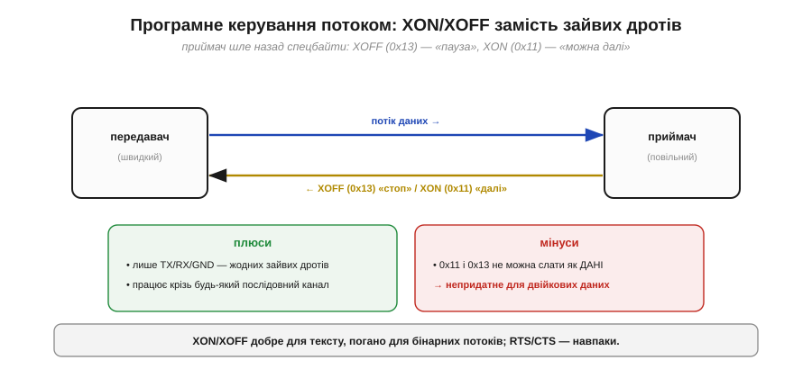
*Рис. 35.5.6. Приймач, підходячи до переповнення, шле передавачеві назад байт XOFF (0x13); той робить паузу. Розвантажившись, приймач шле XON (0x11), і передача відновлюється. Плюс — жодних зайвих дротів. Мінус фатальний для двійкових даних: байти 0x11 і 0x13 тепер **не можна** передавати як звичайні дані.*

Перевага очевидна — нуль додаткових дротів, працює крізь будь-який послідовний канал. Але є й вада, яка перекреслює його для багатьох задач: коди 0x11 і 0x13 тепер **зарезервовані** під керування, тож їх не можна слати як корисні дані. Для тексту (де таких байтів не буває) це чудово, а для **двійкового** потоку — неприйнятно: випадковий байт 0x13 у даних приймач сприйме як «стоп». Тому правило таке: XON/XOFF — для тексту, RTS/CTS — для двійкових даних.

### Зупиняти заздалегідь: водяний знак

Наостанок — тонкість, без якої керування потоком не працює. Сигнал «стоп» не діє миттєво: поки він дійде до передавача, а той відреагує, кілька байтів уже **в дорозі** й однаково прибудуть. Тому подавати «стоп» треба **не тоді, коли буфер повний, а раніше** — лишивши зверху запас на ці байти.

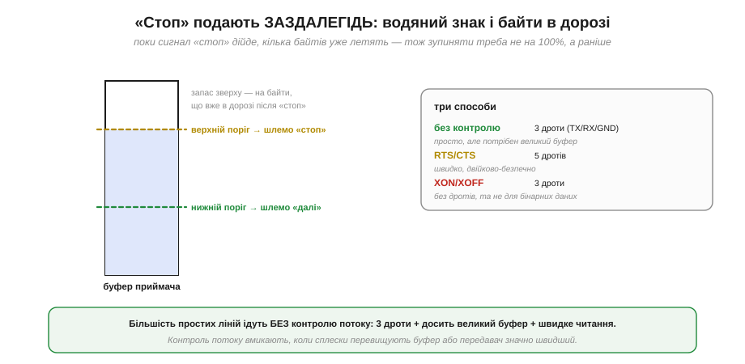
*Рис. 35.5.7. Приймач шле «стоп» на **верхньому порозі** (*high watermark*, скажімо, 75% заповнення), а не на 100% — щоб лишився запас на байти, які вже летять. «Можна далі» подають на **нижньому порозі**, коли буфер достатньо розвантажився. Праворуч — три підходи: без контролю (3 дроти), RTS/CTS (5 дротів), XON/XOFF (3 дроти).*

Звідси два пороги — **верхній** (подати «стоп») і **нижній** (подати «далі»): такий гістерезис не дає сигналам смикатися щобайта. А загальна картина проста: більшість простих ліній обходяться **зовсім без** керування потоком — три дроти, досить великий буфер і дисципліна «не блокувати». Керування вмикають лише тоді, коли сплески справді переростають буфер або передавач помітно швидший за приймача.

> 🔧 **Навіщо це.** Практичний порядок дій, коли лінія «губить» дані: спершу переконайся, що **не блокуєш** цикл читання; далі **збільш буфер** під найгірший сплеск (порахуй його, як у прикладі вище); і лише якщо потік справді заливає приймача — вмикай **керування потоком** (RTS/CTS для двійкових даних, XON/XOFF — для тексту). А якщо керування таки потрібне, не забудь про запас на «байти в дорозі»: зупиняй заздалегідь.

Отже, ми навчилися надійно **доставляти** окремі байти — не втрачати їх ні на фізичному рівні, ні через зайнятість процесора. Але потік байтів сам по собі ще не повідомлення: де воно починається, де закінчується, чи не побилося в дорозі? Сирий UART цього не знає — він возить байти, а не змісти. Щоб із байтів зібрати надійне **повідомлення**, поверх UART будують власний **пакет** із заголовком, довжиною й контрольною сумою. Цим — проєктуванням пакета — і займемося далі.

---

## 35.6 Проєктування пакета: заголовок, довжина, CRC

UART дає нам надійну «трубу» для байтів — і на цьому його обов'язки закінчуються. Він не знає, де в потоці починається одне повідомлення й закінчується інше, не знає, чи всі байти прибули цілими. Уся ця **структура** — справа рівня вище, який ми будуємо самі: **протокол пакета**. Хороша новина — будувати його просто, і та сама нехитра конструкція (позначка старту, довжина, контрольна сума) лежить в основі практично всіх реальних послідовних протоколів, від простих саморобних до телеметрії дронів. Розберімо її по цеглинці.

### Сирий потік не має меж

Почнімо з проблеми. Уявімо, що приймач отримав низку байтів. Де тут повідомлення?

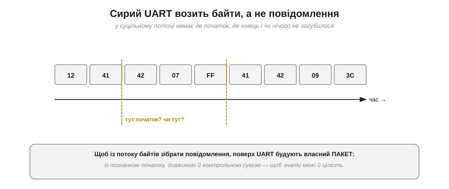
*Рис. 35.6.1. Суцільний потік байтів сам по собі не каже, де початок повідомлення, де кінець і чи нічого не загубилося. Той самий набір байтів можна «нарізати» на повідомлення кількома способами — і всі вони для UART однаково правомірні.*

Сам по собі потік **неоднозначний**: однакові байти можна згрупувати по-різному, і UART не підкаже, який поділ правильний. Гірше: якщо один байт загубився (overrun із §35.5) чи спотворився, усе подальше «з'їде». Тому над сирим потоком ми накладаємо **рамку** — структуру, що чітко каже: ось тут пакет починається, стільки в ньому даних, ось так перевірити, що він цілий.

### Анатомія пакета

Класична, перевірена десятиліттями структура пакета складається з чотирьох частин: **позначки старту**, **довжини**, **корисних даних** і **контрольної суми**.

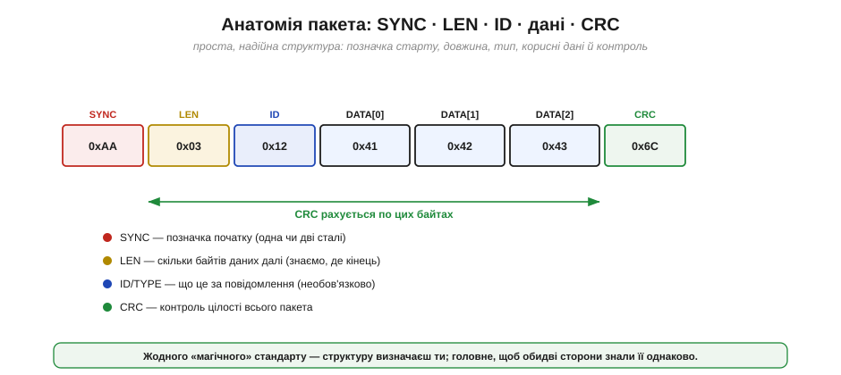
*Рис. 35.6.2. Типовий пакет: **SYNC** (стала позначка початку), **LEN** (скільки байтів даних далі), необов'язковий **ID/TYPE** (що це за повідомлення), самі **дані** і **CRC** (контроль цілості). CRC рахують по всьому, крім SYNC, — від довжини до останнього байта даних.*

Розгляньмо кожне поле й **навіщо** воно. **SYNC** — одна чи дві сталі (наприклад, 0xAA) на самому початку: за ними приймач упізнає, що пакет почався. **LEN** — поле довжини: каже, скільки байтів даних іде далі, тож приймач **знає, де пакет закінчиться**. Часто додають **ID** або **TYPE** — байт-тип повідомлення (це команда? телеметрія? підтвердження?). Далі — власне **дані** (*payload*). І наприкінці — **CRC**, контрольна сума, за якою приймач переконається, що пакет дійшов неушкодженим. Жодного «обов'язкового стандарту» тут немає — структуру визначаєш ти сам; важливо лише, щоб **обидві сторони** розуміли її однаково.

### Дві стратегії меж: роздільник чи довжина

Як саме позначити, **де пакет закінчується**? Є два підходи, і вибір між ними принциповий.


*Рис. 35.6.3. Ліворуч-угорі: **роздільник** — спеціальний байт (як `\n` у тексті) позначає кінець. Просто, але якщо такий байт трапиться **в даних**, приймач хибно «закриє» пакет. Ліворуч-унизу: **поле довжини** — приймач читає рівно LEN байтів, і вміст йому байдужий; жодних колізій.*

Перший спосіб — **роздільник** (*delimiter*): домовляємося, що повідомлення закінчується певним байтом, як рядок тексту закінчується символом нового рядка `\n` (0x0A). Це зручно для **тексту** — рядок дорівнює повідомленню. Але для **двійкових** даних тут пастка: якщо роздільник (0x0A) випадково трапиться **всередині** даних, приймач помилково вирішить, що пакет скінчився. Щоб цього уникнути, такі байти доводиться **екранувати** (*byte stuffing*) — заміняти спеціальною послідовністю, а на прийомі повертати назад (поширений елегантний метод — COBS). Другий спосіб — **поле довжини** (*length prefix*): приймач читає рівно стільки байтів даних, скільки сказано в LEN, і **вміст йому цілком байдужий** — будь-який байт у даних є просто даними. Колізій немає взагалі. Тому для двійкових даних довжина зручніша; а найнадійніше — **поєднати**: SYNC позначає старт, LEN — кінець, і вміст байтів узагалі не впливає на рамку.

> 🔧 **Навіщо це.** Якщо передаєш **текст** (команди, лог) — простий роздільник `\n` чудовий, і парсити легко. Якщо передаєш **двійкові** дані (сирі покази давачів, координати, будь-які байти 0…255) — бери **поле довжини**, інакше рано чи пізно якийсь байт даних збігатиметься з роздільником і ламатиме зв'язок у найгірший момент. Це одна з найпідступніших помилок саморобних протоколів: усе працює, поки в даних випадково не з'явиться «магічний» байт.

### SYNC-байт і самовідновлення

Окремо варто оцінити, наскільки важливий **SYNC**. Він потрібен не лише для першого пакета — він дає приймачеві змогу **відновитися** після будь-якого збою чи якщо той під'єднався до лінії посеред потоку.

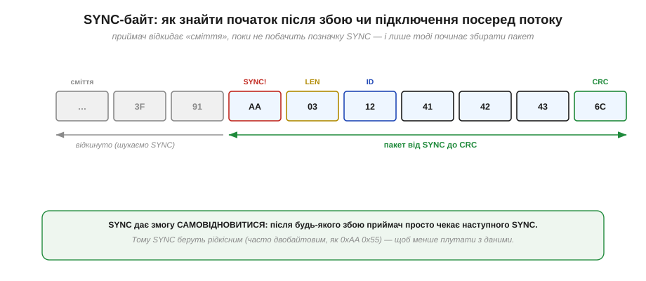
*Рис. 35.6.4. Приймач, що під'єднався посеред потоку (або щойно пережив помилку), бачить спершу «сміття». Він **відкидає** всі байти, поки не натрапить на позначку SYNC (0xAA) — і лише відтоді починає збирати пакет: довжину, дані, CRC. Так система сама знаходить межу й відновлюється.*

Логіка проста й могутня: хай що сталося — приймач завжди може просто **чекати наступного SYNC** і з нього почати збирати пакет наново. Це робить протокол **самовідновним**: одна зіпсована посилка не валить зв'язок назавжди, наступний SYNC усе виправляє. Щоб SYNC рідше плутався з випадковими даними, його часто роблять **двобайтовим** (наприклад, 0xAA 0x55) — таку пару даремно зустріти набагато важче, ніж один байт.

### Контроль цілості: чому не проста сума

Лишилося найцікавіше — **CRC**. Навіщо він, якщо можна просто скласти (чи скласти за XOR) усі байти й переслати цю суму? Бо проста сума **слабка**: вона сліпа до цілого класу помилок.


*Рис. 35.6.5. Два пакети: у другому переставлено перший і третій байти. XOR-сума **однакова** (0x40 в обох) — вона не помічає перестановки. А CRC різний (0x52 проти 0x8A) — він залежить від порядку й позиції бітів, тож перестановку ловить.*

Проблема простої суми в тому, що вона **не зважає на порядок**: переставив байти місцями — сума та сама. Так само вона часто «не помічає» помилок, які компенсують одна одну. CRC (*cyclic redundancy check*, циклічний надлишковий код) позбавлений цієї вади, бо влаштований принципово інакше: він залежить і від значень, і від **позицій** бітів. Тому CRC ловить усе те, що пропускають і парність (§35.2), і проста сума: будь-яку одиничну й подвійну помилку, будь-яке непарне їх число, усі **пакетні** збої (поспіль зіпсовані біти) завдовжки до розрядності CRC і переважну більшість решти. За ту саму ціну в кілька байтів CRC дає незрівнянно сильніший захист.

### Як працює CRC

Звідки в CRC така сила? Ідея гарна: дані розглядають як одне велике двійкове число й **ділять** його (за особливою арифметикою «за модулем 2», де віднімання — це XOR) на наперед домовлений **генераторний поліном**. **Остача** від ділення і є CRC.

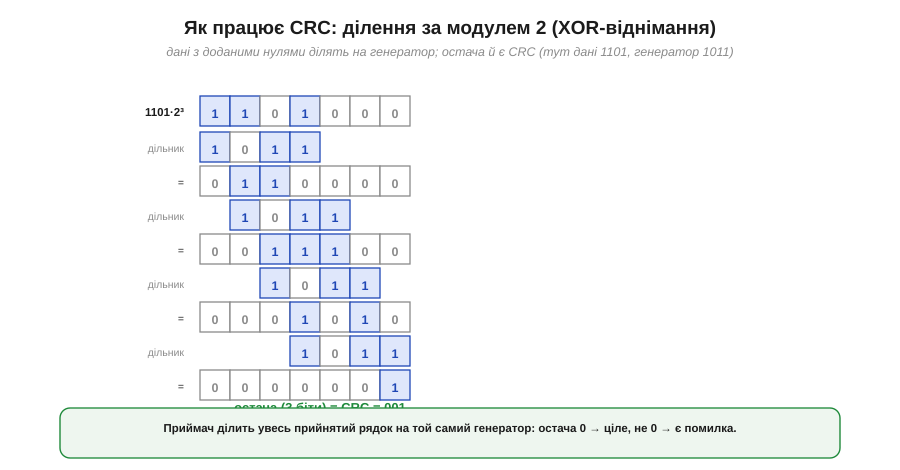
*Рис. 35.6.6. Дані 1101 з доданими трьома нулями ділять на генератор 1011 (поліном x³+x+1), послідовно віднімаючи (XOR) дільник. Остача — три біти **001** — і є CRC. Передають дані разом із нею: 1101 001.*

**Приклад (порахуймо CRC уручну).** Візьмімо дані 1101 і генератор 1011 (поліном x³+x+1, що дає 3-бітний CRC). Допишемо до даних три нулі й ділитимемо за модулем 2 (XOR):

```
1101000          ← дані 1101 з трьома нулями
1011             ← віднімаємо (XOR) генератор
-------
0110000          ← зсуваємось до наступної одиниці й повторюємо
 1011
-------
0011100
  1011
-------
0001010
   1011
-------
0000001          ← остача = 001 (3 біти) = CRC

передаємо: 1101 001
```

На прийомі приймач ділить **увесь** отриманий рядок (1101001) на той самий генератор. Якщо пакет цілий, остача буде **рівно нуль**; якщо хоч щось спотворилося — остача ненульова, і пакет відкидають. У реальному коді так уручну, звісно, не рахують: 8- чи 16-бітний CRC обчислюють миттєво за готовою таблицею, тож на мікроконтролері він майже безкоштовний. Найпоширеніші — **CRC-8** і **CRC-16** із кількома усталеними генераторними поліномами.

### Збирання й перевірка на прийомі

Складімо все докупи — як приймач збирає й перевіряє пакет.


*Рис. 35.6.7. Послідовність прийому: чекати SYNC → прочитати LEN → зібрати LEN байтів даних → прочитати CRC → перерахувати CRC і звірити. Якщо сходиться — пакет іде в роботу; якщо ні — його тихо відкидають і знову чекають SYNC.*

Уся краса в останньому кроці: рішення «вірити чи ні» приймають **лише після** перевірки CRC цілого пакета. Побитий пакет не калічить систему — його просто відкидають, а наступний SYNC дає шанс почати спочатку. Це і є та надійність, заради якої ми будували пакет: навіть на зашумленій лінії в роботу потраплять **тільки** неушкоджені повідомлення.

> 🔧 **Навіщо це.** Ось мінімальний рецепт власного надійного протоколу поверх UART: **[SYNC][LEN][дані][CRC]**. SYNC дає самовідновлення, LEN — однозначні межі для будь-яких даних, CRC — упевненість у цілості. Додай за потреби ID-тип і номер послідовності (щоб ловити загублені чи здвоєні пакети) — і матимеш структуру, на якій тримаються справжні протоколи телеметрії й керування. Не намагайся «зекономити» на CRC заради простоти: саме він відрізняє іграшковий обмін від такого, якому можна довірити апарат.

Ми спроєктували пакет — знаємо, що і в якому порядку має приймач прочитати. Але є остання, суто практична перешкода: байти прибувають **по одному й коли завгодно**, а не цілим пакетом нараз. Якщо на кожному кроці зупиняти програму й чекати наступного байта, мікроконтролер не встигатиме робити нічого іншого. Тому збирати пакет треба **не блокуючи** — по байту, зберігаючи стан між викликами. Як це зробити елегантним скінченним автоматом — тема останньої теми розділу.

---

## 35.7 Розбір потоку автоматом без блокування

Ось ми й біля останньої цеглини. Пакет спроєктовано (§35.6), байти надійно прибувають у буфер (§35.5) — лишилося **зібрати** з них повідомлення в живій програмі, яка ще й мусить робити сто інших справ: крутити ПІД-регулятор, оновлювати дисплей, слати телеметрію. Наївний підхід — «дочекатися байта, тоді наступного» — тут згубний. Правильний інструмент — **скінченний автомат** (*finite state machine*, FSM), який обробляє по одному байту за раз, **пам'ятає**, де зупинився, і ніколи не змушує програму чекати. Це не лише про UART: той самий патерн — серце будь-якого неблокуючого розбору потоку.

### Чому не можна «стояти й чекати»

Спокуслива на вигляд конструкція «чекай, поки прийде байт, тоді бери» насправді — пастка. Поки програма крутиться в циклі очікування, мікроконтролер **не робить більше нічого**: не реагує на давачі, не оновлює керування, не обслуговує інші лінії.


*Рис. 35.7.1. Угорі: блокуючий `while(!available());` застрягає в очікуванні — усі інші задачі стоять, поки не прийде байт. Унизу: неблокуючий підхід — `if(available()) feed(read());` — обробляє той байт, що вже є, і одразу віддає керування циклу; між байтами спокійно працює решта програми.*

Різниця принципова. Блокуючий код **присвоює собі** процесор, доки лінія не зволить надіслати байт; а лінія повільна (згадаймо з §35.2: на 9600 байт іде ≈1 мс — для процесора це вічність). Неблокуючий код працює навпаки: він **ніколи не чекає**, а лише реагує на те, що вже прийшло, і миттєво повертає керування. Уся хитрість у тому, як обробити **частину** пакета й коректно продовжити з наступним байтом — і саме це робить автомат.

### Скінченний автомат прийому

Ідея автомата: розбити прийом на кілька **станів**, і в кожен момент пам'ятати, у якому ми зараз. Кожен прийнятий байт просуває автомат рівно на один крок — і це все, що робить виклик; далі керування повертається.

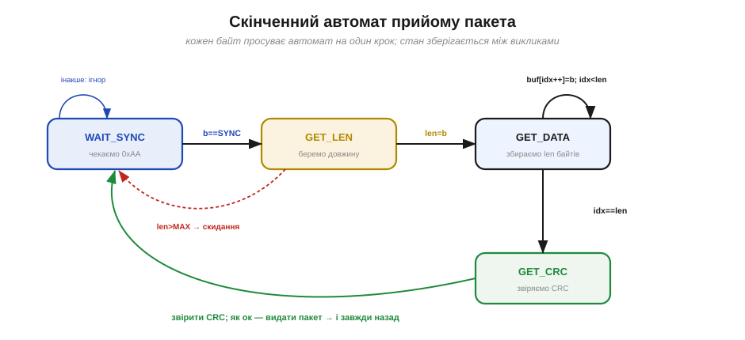
*Рис. 35.7.2. Чотири стани: **WAIT_SYNC** (відкидаємо все, поки не побачимо SYNC), **GET_LEN** (запам'ятовуємо довжину), **GET_DATA** (збираємо рівно len байтів, лишаючись у цьому стані), **GET_CRC** (звіряємо CRC й повертаємось до WAIT_SYNC). Підписи на стрілках — умови переходів; пунктирна — захисний скид, якщо len завелика.*

Прочитаймо діаграму як історію одного пакета. Спершу автомат у **WAIT_SYNC** — ігнорує всі байти, поки не натрапить на SYNC; це і є самовідновлення з §35.6. Побачив SYNC — переходить у **GET_LEN**, де наступний байт стає довжиною. Далі **GET_DATA**: автомат лишається в цьому стані й накопичує байти, аж поки їх не набереться рівно `len` — тоді переходить у **GET_CRC**. Там приймає контрольний байт, звіряє — і **в будь-якому разі** повертається в WAIT_SYNC, готовий до наступного пакета (видавши повідомлення, якщо CRC зійшовся).

### Стан, що живе між викликами

Що ж робить цей автомат неблокуючим? Те, що його «пам'ять» — кілька змінних — **переживає** між викликами `feed()`. Виклик не тримає процесор; він лише оновлює ці змінні й виходить, а наступний байт продовжить з того самого місця.

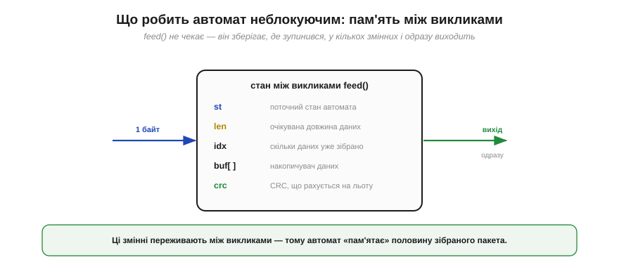
*Рис. 35.7.3. Між викликами feed() зберігаються: `st` (поточний стан), `len` (очікувана довжина), `idx` (скільки даних уже зібрано), `buf[]` (накопичувач) і `crc` (що рахується на льоту). Саме ця жменька змінних дає автоматові змогу «пам'ятати» половину зібраного пакета, нічого не блокуючи.*

### Трасування: байт за байтом

Найкраще автомат розкривається на трасуванні. Проженімо крізь нього приклад пакета з §35.6 — `AA 03 41 42 43 <CRC>`.

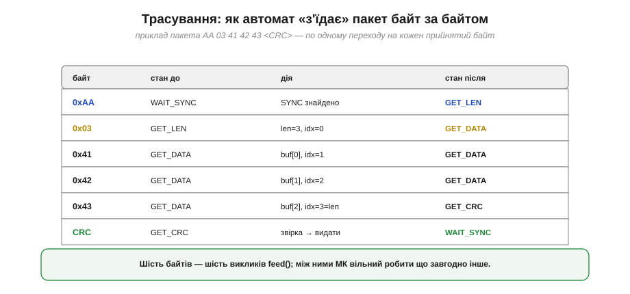
*Рис. 35.7.4. Шість прийнятих байтів — шість переходів. SYNC переводить у GET_LEN; довжина 3 — у GET_DATA; три байти даних накопичуються (на третьому idx досягає len); контрольний байт звіряється, пакет видається, автомат вертається у WAIT_SYNC. Між цими шістьма викликами мікроконтролер вільний робити будь-що інше.*

А ось як цей автомат виглядає в коді — компактна функція, яку викликають на кожен прийнятий байт:

```
enum { WAIT_SYNC, GET_LEN, GET_DATA, GET_CRC } st = WAIT_SYNC;
uint8_t buf[MAXLEN], idx, len, crc;

void feed(uint8_t b) {
  switch (st) {
    case WAIT_SYNC:
      if (b == SYNC) st = GET_LEN;            // інакше просто ігноруємо
      break;
    case GET_LEN:
      if (b > MAXLEN) { st = WAIT_SYNC; break; }   // захист від переповнення
      len = b; idx = 0; crc = crc_init(b);
      st = GET_DATA;
      break;
    case GET_DATA:
      buf[idx++] = b;
      crc = crc_update(crc, b);               // CRC рахуємо на льоту
      if (idx == len) st = GET_CRC;
      break;
    case GET_CRC:
      if (b == crc) handle_packet(buf, len);  // цілий пакет — у роботу
      st = WAIT_SYNC;                          // у будь-якому разі — наново
      break;
  }
}
```

Зверніть увагу, який він короткий і як точно повторює діаграму: один `switch` за станом, жодних циклів очікування, кожна гілка робить крихітну роботу й виходить. Це і є канонічний вигляд неблокуючого розбору.

### CRC на льоту

У коді ви вже помітили `crc_update` всередині GET_DATA — це **інкрементний** CRC. Замість збирати весь пакет і аж тоді рахувати контрольну суму, ми домішуємо кожен байт у поточний CRC одразу, щойно він прийшов.


*Рис. 35.7.5. CRC ініціалізують на довжині, потім на кожному байті даних оновлюють. Коли приходить контрольний байт, відповідь уже готова — лишається тільки порівняти. Не треба ні зберігати весь пакет заради підрахунку, ні витрачати окремий час наприкінці.*

Це ощадливо подвійно: економить **пам'ять** (не треба тримати весь пакет лише щоб порахувати CRC) і **час** (підрахунок іде паралельно з прийомом). Той самий прийом працює й на передачі: нарощуємо CRC, доки формуємо пакет байт за байтом.

### Три запобіжники надійного автомата

Автомат із діаграми вже непоганий, але в суворому світі йому потрібні три **запобіжники**, без яких один збій здатен «повісити» прийом.


*Рис. 35.7.6. **Межа довжини**: якщо len більша за буфер — скидання (інакше побитий чи зловмисний LEN переповнить пам'ять). **Таймаут**: якщо застрягли посеред пакета надовго — скидання (загублений байт інакше заморозив би збирання назавжди). **CRC не зійшовся**: відкинути й чекати SYNC — у роботу йдуть лише цілі пакети.*

Перший — **перевірка межі** довжини (вона вже є в коді: `if (b > MAXLEN)`): без неї спотворений байт довжини змусив би автомат читати, скажімо, 250 байт у 32-байтовий буфер — класичне переповнення. Другий — **таймаут**: якщо посеред пакета байти раптом перестали надходити (один загубився при overrun), автомат застрягне в GET_DATA назавжди; тому варто скидати його в WAIT_SYNC, якщо новий байт не прийшов протягом розумного часу. Третій — **ресинхронізація за CRC**: побитий пакет просто відкидаємо й чекаємо наступного SYNC. Усі три зводяться до одного: хай що піде не так, автомат завжди має дорогу назад у WAIT_SYNC.

> 🔧 **Навіщо це.** Ці запобіжники — різниця між демонстрацією «працює на столі» й кодом, якому можна довірити реальний зв'язок. Перевірка довжини рятує від переповнення буфера (а отже, від хаотичних збоїв і вразливостей); таймаут — від «вічного зависання» на одному загубленому байті; ресинхрон за CRC — від того, щоб побитий пакет колись потрапив у керування. Пишеш розбір протоколу — закладай усі три одразу, а не «потім».

### Місце в головному циклі

Лишилося побачити, як автомат живе в реальній програмі. Його `feed()` просто викликають у головному циклі поряд з усіма іншими задачами — і завдяки неблокуючості він нікому не заважає.

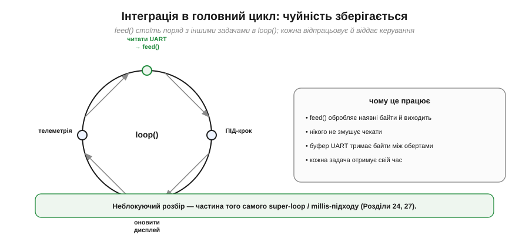
*Рис. 35.7.7. У `loop()` по черзі відпрацьовують усі задачі: читання UART із викликом feed(), крок ПІД, оновлення дисплея, телеметрія. Кожна робить трохи й віддає керування. Буфер UART (§35.5) тримає байти між обертами циклу, тож жоден не губиться, навіть якщо до feed() черга дійшла не миттєво.*

Це той самий **неблокуючий** стиль, який ми зустрічали як патерн `millis()` замість `delay()` ([§24.5](../../block-4-mcu-esp32/ch24-timers/ch24-timers.md)) і як super-loop проти блокувань ([Розділ 27](../../block-4-mcu-esp32/ch27-execution-rtos/ch27-execution-rtos.md)). Розбір UART-потоку — лише ще один його приклад: робити маленький крок на кожному оберті циклу й ніколи нікого не змушувати чекати. За потреби `feed()` можна викликати навіть із переривання UART ([Розділ 23](../../block-4-mcu-esp32/ch23-interrupts/ch23-interrupts.md)) — тоді пакети збиратимуться зовсім «у фоні».

> 🔧 **Навіщо це.** Запам'ятай цей патерн як універсальний: **стан у кількох змінних + крок на байт + жодного очікування**. Він годиться не лише для UART, а для будь-якого розбору потоку — від рядків команд до бінарних протоколів на інших шинах. Опанувавши його тут, ти зможеш надійно «слухати» будь-яке джерело даних, не жертвуючи чуйністю решти програми.

---

Підсумуймо весь Розділ 35. Ми пройшли UART від самого низу до самого верху: чому передаємо **послідовно й асинхронно** (§35.1), як улаштований **кадр** старт-дані-парність-стоп (§35.2), що таке **baud** і який **допуск** на розсинхрон (§35.3), якими бувають **рівні сигналу** й чому їх не можна плутати (§35.4), як **буфери** й керування потоком рятують від втрат (§35.5), як спроєктувати надійний **пакет** із CRC (§35.6) і як зібрати його неблокуючим **автоматом** (§35.7). Тепер послідовний порт для тебе — не магічний «Serial», а зрозумілий механізм, який можна свідомо налаштувати, налагодити й добудувати власним протоколом.

UART був найпростішою з шин — асинхронною, без спільного такту, для зв'язку «точка-точка». Наступний крок — шина, де такт **повертається** окремим дротом, зате на двох дротах уживаються **багато** пристроїв одразу. Як на двох лініях улаштувати адресацію, старт-стоп і підтвердження — у наступному розділі.

> ▶️ Далі: [Розділ 36 — Шина I2C](../ch36-i2c/ch36-i2c.md)
