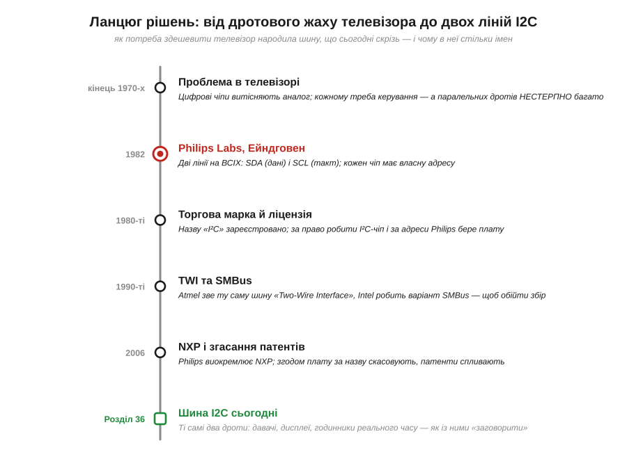
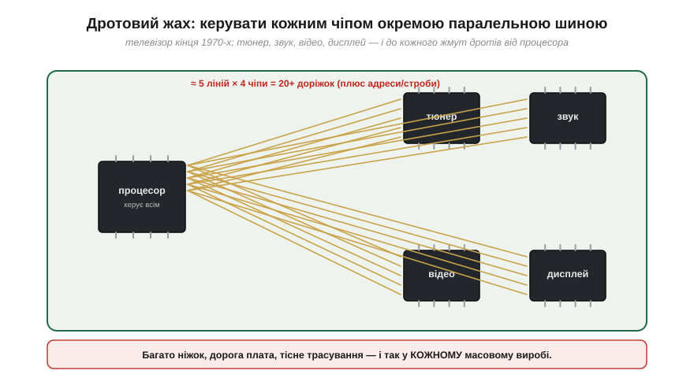
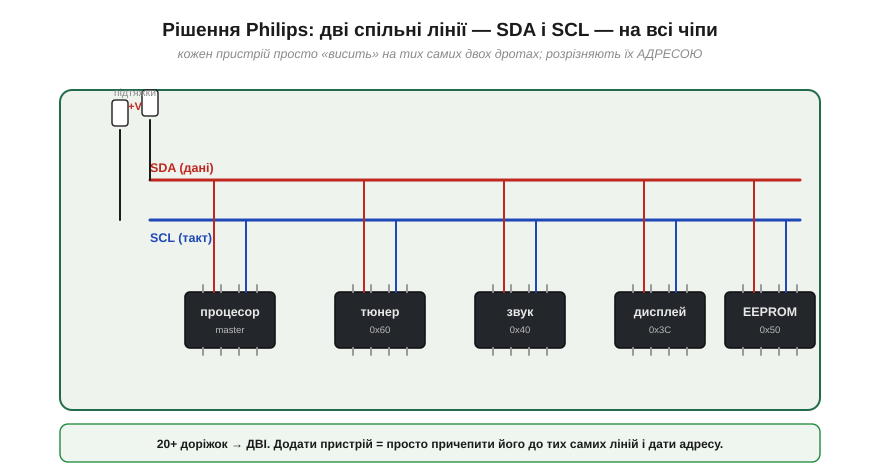
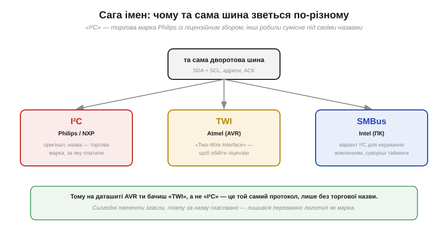
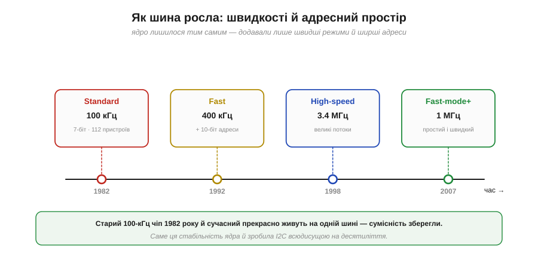

📜 *Історична вставка до [Розділу 6.2 — Шина I2C](ch36-i2c.md).*

# Історія: I2C — як Philips зв'язала чіпи телевізора двома дротами

Відкривши даташит майже будь-якого давача — гіроскопа, барометра, годинника реального часу, — ти натрапиш на два знайомі контакти: **SDA** і **SCL**. Дві лінії, на яких тримається півсвіту дрібної електроніки. Та якщо взяти даташит мікроконтролера Atmel (того, що в класичному Arduino), той самий протокол раптом зватиметься інакше — **TWI**. А в комп'ютері знайдеться його родич на ім'я **SMBus**. Три назви — а шина одна. Чому?

Відповідь — це історія не стільки про електроніку, скільки про **гроші**. Шину придумали не для давачів і не для мікроконтролерів-аматорів: її придумала телевізійна компанія, щоб **здешевити** свої телевізори. А три імені — слід багаторічної суперечки про те, кому належить назва й хто має за неї платити. Розплутати цей вузол варто, бо він пояснює і **чому** шина влаштована саме так (два дроти, адреси, підтяжки), і **чому** в чужих даташитах вона ховається під різними іменами.

*Рис. 6.2.0.1. Дорога I2C: наприкінці 1970-х цифрові чіпи в телевізорі потонули в дротах; 1982 року Philips Labs дала їм дві спільні лінії з адресами; назву зробили торговою маркою з ліцензійним збором — і конкуренти відповіли своїми «TWI» та «SMBus»; а коли патенти згасли, шина лишилася всюди.*

---

## Телевізор, що тонув у дротах

Щоб зрозуміти I2C, треба перенестися в кінець 1970-х — у розпал тихої революції всередині побутової техніки. Аналогові схеми, де все робили котушки, конденсатори й змінні резистори, стрімко витісняли **цифрові мікросхеми**. Телевізор, який раніше налаштовували коліщатками, тепер мав усередині процесор і купу спеціалізованих чіпів: окремий — на тюнер (вибір каналу), окремий — на обробку звуку, ще один — на відео, ще — на екранне меню.

І тут постала прозаїчна, але дорога проблема. Усіма цими чіпами мав **керувати** центральний процесор: казати тюнерові частоту, звуковому чіпу — гучність, відеочіпу — яскравість і контраст. А як передати команду чіпу? Класичний спосіб — **паралельна** шина (з [§6.1.1](../ch35-uart/ch35-uart.md) ми знаємо, що це багато дротів одночасно): кілька ліній даних, лінія-строб, лінія вибору. І так — **до кожного** чіпа.

*Рис. 6.2.0.2. Телевізор кінця 1970-х: процесор має керувати тюнером, звуком, відео, дисплеєм — і до кожного тягнеться жмут паралельних ліній. Чотири чіпи по п'ять ліній — це вже понад двадцять доріжок плюс адреси й строби. А кожна доріжка — це ніжка на корпусі, місце на платі й гроші.*

Помножмо це на масштаб. Телевізор — **масовий** виріб: мільйони штук. Кожна зайва ніжка на корпусі мікросхеми, кожна зайва доріжка на платі — це частки цента, помножені на мільйони, тобто цілком реальні гроші. Тісне трасування ускладнювало плату, велике число виводів робило корпуси дорожчими. Для компанії, що живе з масового виробництва, «забагато дротів» — це не естетична незручність, а пряма загроза прибутку. Philips, один із найбільших у світі виробників побутової електроніки, гостро потребував способу **зв'язати чіпи якнайдешевше**.

> 🔧 **Навіщо це.** Запам'ятай цю мотивацію — вона пояснює весь характер I2C. Шину проєктували під гасло «**мінімум дротів за помірної швидкості**», а не «якнайшвидше за будь-яку ціну». Тому й сьогодні I2C — це повільнувата, зате гранично економна шина на дві лінії: ідеальна, щоб причепити до мікроконтролера десяток дрібних давачів, і непридатна, щоб гнати відеопотік. Її компроміси — прямий спадок телевізора, який тонув у дротах.

---

## Два дроти на всіх: ідея Philips, 1982

Розв'язок знайшла дослідницька група **Philips Labs** в **Ейндговені** (*Eindhoven*, Нідерланди) — і 1982 року світ побачив **I²C** (*Inter-Integrated Circuit* — «міжмікросхемна» шина, звідси «I-квадрат-C», або просто I2C/IIC). Ідея була зухвало проста: а що, як дати **всім** чіпам не власні шини, а **дві спільні лінії**, до яких підключаються геть усі?

*Рис. 6.2.0.3. Замість жмутів до кожного чіпа — дві лінії на всіх: **SDA** (*Serial Data*, дані) і **SCL** (*Serial Clock*, такт). Кожен пристрій просто «висить» на тих самих двох дротах, а розрізняють їх **адресою**. Додати чіп — означає причепити його до ліній і дати йому номер; жодних нових доріжок.*

Дві лінії: **SDA** (*Serial Data* — послідовні дані) і **SCL** (*Serial Clock* — такт). На відміну від UART із попереднього розділу, тут такт **є** — окремою лінією; це робить шину **синхронною** (приймач знає момент кожного біта без вгадування швидкості). Але головна новація — не такт, а **спільність**: усі пристрої сидять на тих самих двох лініях, наче абоненти на одній телефонній лінії. А щоб вони не плуталися, кожному дали **адресу** — і коли процесор хоче поговорити з конкретним чіпом, він спершу називає його адресу, і відгукується лише той.

Економія була разюча. Двадцять із гаком доріжок зсихалися до **двох**. Додати в телевізор новий чіп тепер означало не перепроєктовувати плату, а просто причепити його до наявних SDA/SCL і призначити вільну адресу. Перші I2C-чіпи й з'явилися саме там, де народилися, — у телевізорах Philips, керуючи звуком і відео.

---

## Розумні дрібниці: відкритий колектор і адреси

За простотою «двох дротів на всіх» ховається кілька винахідливих рішень, без яких ідея не працювала б, — і саме їх ми детально розбиратимемо в самому розділі. Та варто бодай назвати їх тут, щоб відчути красу задуму.

Перше питання: якщо на спільній лінії висить десяток пристроїв, що буде, коли двоє одночасно спробують виставити різні рівні — один «1», інший «0»? У звичайних виходів це **коротке замикання** (з §6.1.4 ми пам'ятаємо, що «1» — це напруга живлення, «0» — земля; з'єднати їх навпростець не можна). Philips розв'язала це красиво: лінії зробили з **відкритим колектором** (*open-drain / open-collector*) і спільними **підтяжками** (*pull-up*). Кожен пристрій уміє лише **притягувати** лінію до нуля або **відпускати** її; угору ж її тягне спільний резистор. Тоді «хто завгодно тягне вниз» автоматично перемагає, конфлікту немає, а на лінії природно виходить логічне «І» (цей механізм ми вже стрічали навколо польових ключів у [Розділі 4.4](../../block-4-mcu-esp32/ch22-gpio/ch22-gpio.md)).

Друге питання — **адресація**. Philips відвела під адресу пристрою **7 біт**, що давало 2⁷ = 128 комбінацій, з яких кілька зарезервували, лишивши близько **112** придатних адрес на шину. Кожен чіп діставав свою адресу (часто частково зашиту виробником, частково задану ніжками), і транзакція завжди починалася з того, що процесор «гукав» потрібну адресу.

> 🔧 **Навіщо це.** Ці два рішення — відкритий колектор із підтяжками й 7-бітна адреса — і є та основа, на якій тримається весь Розділ 6.2. Запам'ятавши, **навіщо** вони з'явилися (щоб багато пристроїв мирно ділили дві лінії без коротких замикань і без плутанини), ти легко зрозумієш і чому I2C **повільніша** за лінії з активним виходом, і звідки беруться «магічні» числа на кшталт 0x3C чи 0x68 в адресах давачів.

---

## Сага імен: I²C, TWI і SMBus

А тепер — та сама історія про гроші, що пояснює три імені однієї шини. I2C виявилася настільки вдалою, що її захотіли робити **всі** виробники чіпів, не лише Philips. І тут Philips зробила хід, природний для власника винаходу: **назву «I²C» зареєстрували як торгову марку**, а на саму технологію наклали **ліцензійні умови**. Щоб випускати мікросхему, яка офіційно «розмовляє I²C», виробник мав укласти угоду з Philips і платити; навіть **адреси** на шині свого часу роздавали не безкоштовно.

Конкурентам це, м'яко кажучи, не подобалося. Платити суперникові за право робити сумісні чіпи ніхто не хотів — тож інженери знайшли обхід, гідний поваги. Сам **протокол** запатентувати — одне, а ось **назву** можна просто не вживати. І виробники почали випускати **електрично сумісні** шини під власними іменами.

*Рис. 6.2.0.4. Та сама дворотова шина під трьома іменами. **I²C** — оригінал Philips/NXP, назва-торгова-марка з ліцензією. **TWI** (*Two-Wire Interface*) — як її назвав Atmel у своїх AVR, щоб обійти ліцензійну назву. **SMBus** — варіант Intel для керування живленням у ПК зі суворішими таймінгами. Електрично вони сумісні; різні лише назви й дрібні нюанси.*

Так з'явилися два знаменитих «псевдоніми». **Atmel** (виробник мікроконтролерів AVR, на яких виросло перше Arduino) назвав свою реалізацію нейтрально — **TWI** (*Two-Wire Interface*, «двопровідний інтерфейс»): і функціонально це I2C, і платити за чужу торгову марку не треба. Саме тому, відкривши даташит класичного AVR, ти не знайдеш слова «I²C» — там скрізь «TWI», хоч це той самий протокол до останнього біта. **Intel** пішла трохи далі й зробила **SMBus** (*System Management Bus*) — варіант I2C для керування живленням і моніторингу всередині комп'ютера, з трохи суворішими вимогами до таймінгів і кількома додатковими правилами.

> 🔧 **Навіщо це.** Це найпрактичніший висновок усієї історії. Коли в чужому даташиті ти бачиш **TWI** — знай, що це **I2C**, і сміливо під'єднуй такий чіп до I2C-ліній. Побачив **SMBus** — це теж майже I2C, лише будь уважний до таймінгів і дрібних відмінностей. Не дай трьом назвам себе обдурити: під ними одна й та сама шина SDA/SCL. Ця обізнаність економить години розгубленого гортання документації.

З роками гострота суперечки спала. Близько **2006 року** Philips виокремила свій напівпровідниковий підрозділ в окрему компанію **NXP**, яка й донині веде специфікацію I2C. Тоді ж ліцензійну плату за **назву** скасували (а ще раніше — і за адреси), а **патенти** на саму технологію зрештою згасли. Сьогодні від усієї тієї історії лишився переважно **логотип** як торгова марка — а робити I2C-сумісні чіпи може будь-хто й безкоштовно. Та звичка писати «TWI» в даташитах пережила причину, що її породила.

---

## Як шина росла

Попри всі суперечки, технічно I2C розвивалася напрочуд ощадливо: її **ядро** не чіпали, додаючи лише швидші режими й ширші адреси. Завдяки цьому старий чіп 1982 року й сучасний прекрасно вживаються на одній шині.

*Рис. 6.2.0.5. Від оригінальних 100 кГц і 7-бітних адрес (112 пристроїв) шина доросла до 400 кГц (Fast), згодом отримала 10-бітні адреси, режим High-speed на 3.4 МГц і простий швидкий Fast-mode Plus на 1 МГц. Ядро незмінне — тому сумісність зберігається через десятиліття.*

Початкова версія 1982 року працювала на **100 кГц** — за мірками шин повільно, зате надійно й дешево. Згодом додали режим **Fast** на 400 кГц, потім — **10-бітну** адресацію (бо 112 адрес почало бракувати в складних системах), а для великих потоків — **High-speed** на 3.4 МГц. Окремо з'явився зручний **Fast-mode Plus** на 1 МГц. Та хоч би яку швидкість обрали, базовий протокол — старт, адреса, дані, підтвердження, стоп — лишився тим самим, що й у телевізорі 1982 року. Саме ця **стабільність ядра** й зробила I2C всюдисущою: вклавшись у неї раз, виробники чіпів десятиліттями не мусили нічого переучувати.

---

## Що лишилось сьогодні

Шина, народжена, щоб здешевити телевізор, давно переросла свою колиску. Сьогодні I2C — це **універсальна мова дрібної периферії**: майже кожен давач (акселерометр, гіроскоп, барометр, давач світла), кожен маленький дисплей, годинник реального часу, мікросхема пам'яті EEPROM спілкуються з мікроконтролером саме нею. Дві лінії, кілька пристроїв, прості підтяжки — і ціла плата периферії оживає мінімумом дротів. Та сама економність, що рятувала телевізор, тепер рятує місце на платі дрона чи робота.

Але важливіша за факти — **логіка**, яку ця історія в собі несе і яку ми розкриватимемо в Розділі 6.2:

- **Два дроти на всіх** — це відповідь на питання «як зв'язати багато чіпів якнайдешевше»; звідси і спільні лінії, і адреси.
- **Відкритий колектор із підтяжками** — це те, що дає змогу багатьом пристроям мирно ділити лінію без коротких замикань.
- **Адреса** — це те, як на спільній лінії знайти потрібного співрозмовника.
- А **три імені** (I²C / TWI / SMBus) — нагадування, що за технічними рішеннями завжди стоять ще й люди, патенти й гроші.

Тепер, тримаючи в голові телевізор, що тонув у дротах, перейдімо від «звідки» до «як це працює»: розберімо двопровідну шину по лініях — SDA і SCL, відкритий колектор, адреси, старт-стоп і підтвердження.

▶️ Далі: [Розділ 6.2 — Шина I2C](ch36-i2c.md)
