# Розділ 6.2 — Шина I2C

У попередньому розділі ми опанували UART — найпростішу послідовну лінію, асинхронну й «точка-точка»: два пристрої, два дроти, без спільного такту. Та щойно система розростається, цей підхід упирається в стіну. Уявімо мікроконтролер, до якого треба під'єднати гіроскоп, барометр, давач світла, маленький дисплей і годинник реального часу — півдесятка чіпів. Тягти до кожного окрему пару UART-ліній (та ще й мати стільки UART-блоків) — це знову той самий «дротовий жах», з якого колись починалася історія I2C. Потрібна **шина**: спосіб повісити **багато** пристроїв на **спільні** лінії й звертатися до кожного окремо.

Саме це й дає **I2C** (*Inter-Integrated Circuit*) — двопровідна синхронна шина, придумана Philips, щоб зв'язати чіпи телевізора мінімумом дротів. Цей розділ розбирає її від першопринципів: дві лінії й багато пристроїв (ця тема), відкритий колектор і підтяжки, адресація, сигнали старт-стоп і підтвердження, транзакції читання-запису, розтягування такту й арбітраж, і нарешті — як по регістровій карті «заговорити» з реальним давачем. На відміну від UART, тут такт **повертається** окремою лінією — і це міняє все.

> 📜 **Перед матеріалом — історія:** [I2C — як Philips зв'язала чіпи телевізора двома дротами](ch36-history-i2c.md). Вона показує, *чому* шина дводротова, звідки взялися адреси й підтяжки і чому в даташитах вона ховається під іменами «TWI» та «SMBus».

---

## 6.2.1 Двопровідна шина: лінія даних і лінія такту

Почнімо з найзагальнішого погляду: що таке I2C як **шина** й чим вона принципово відрізняється від UART. Дві ідеї роблять її особливою. Перша — **спільність**: усі пристрої сидять на тих самих двох лініях, як абоненти на одній телефонній лінії. Друга — **синхронність**: одна з ліній несе **такт**, тож приймачеві не треба вгадувати швидкість. Із цих двох ідей випливає геть усе подальше — і адреси, і відкритий колектор, і навіть характерні обмеження шини. Розберімо їх по черзі.

### Дві лінії, багато пристроїв

I2C має рівно дві сигнальні лінії (плюс, звісно, спільну землю). Перша — **SDA** (*Serial Data*) — несе дані. Друга — **SCL** (*Serial Clock*) — несе такт. І на цих двох лініях висять **усі** пристрої шини.

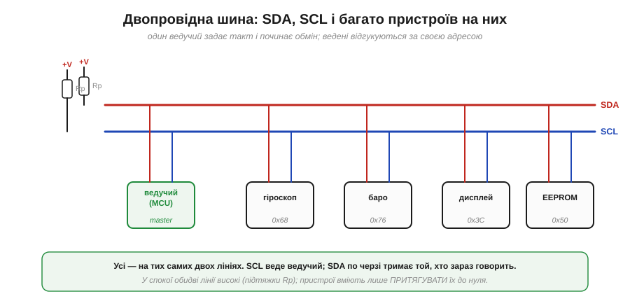
*Рис. 6.2.1.1. Усі пристрої під'єднані до тих самих двох ліній SDA і SCL. Один із них — **ведучий** (зазвичай мікроконтролер) — задає такт і починає обмін; решта — **ведені** (давачі, дисплей, пам'ять), кожен зі своєю адресою. Угорі — резистори-підтяжки, що тримають лінії високими у спокої.*

Це фундаментальна відмінність від UART. Там кожен зв'язок «точка-точка» вимагав власної пари ліній; тут **одна пара** обслуговує цілий гурт пристроїв. Додати новий чіп — означає не тягти нові дроти, а просто причепити його до наявних SDA/SCL і дати йому вільну адресу. Звідси й уся економність I2C: десяток давачів на платі дрона можуть ділити дві лінії замість двадцяти.

Зверніть увагу на одну деталь, до якої ми повернемося в §6.2.2: у спокої обидві лінії тримаються **високими** завдяки резисторам-підтяжкам (*pull-up*), а пристрої вміють лише **притягувати** їх до нуля, але не штовхати вгору. Поки що досить запам'ятати: спокій на шині — це «1» на обох лініях.

### Такт повертається: синхронна шина

Друга визначальна риса I2C — він **синхронний**. Згадаймо з [§6.1.1](../ch35-uart/ch35-uart.md): там ми розрізнили два способи сказати приймачеві, де кожен біт. UART обрав **асинхронний** — без дроту такту, але з обов'язковою попередньою домовленістю про baud. I2C обирає протилежне: **окрему лінію такту** SCL.

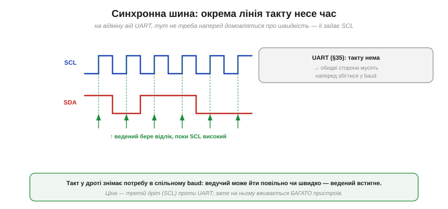
*Рис. 6.2.1.2. Лінія SCL цокає, лінія SDA несе біти, і ведений бере відлік, поки SCL високий. Час задано **явно**, дротом — тож, на відміну від UART, наперед домовлятися про швидкість не треба: ведучий може йти повільніше чи швидше, а ведений усе одно встигне.*

Наслідок гарний і практичний: оскільки такт приходить дротом, **не треба домовлятися про baud**. Ведучий може тактувати швидко або повільно, навіть нерівномірно — ведений просто йде за тактом і не «попливе», як це сталося б в асинхронній лінії за розсинхрону (з §6.1.3). Ціна — третій провідник (SCL) проти двох у UART. Та ця ціна окупається сторицею: на тих самих лініях уживається **багато** пристроїв, а не лише двоє.

### Головне правило: дані дійсні, поки SCL високий

Якщо запам'ятати з усього I2C лише одне — нехай це буде правило про зв'язок SDA і SCL. Воно таке: **дані на SDA мусять бути стабільними, поки SCL високий**, а змінювати SDA дозволено **тільки тоді, коли SCL низький**.

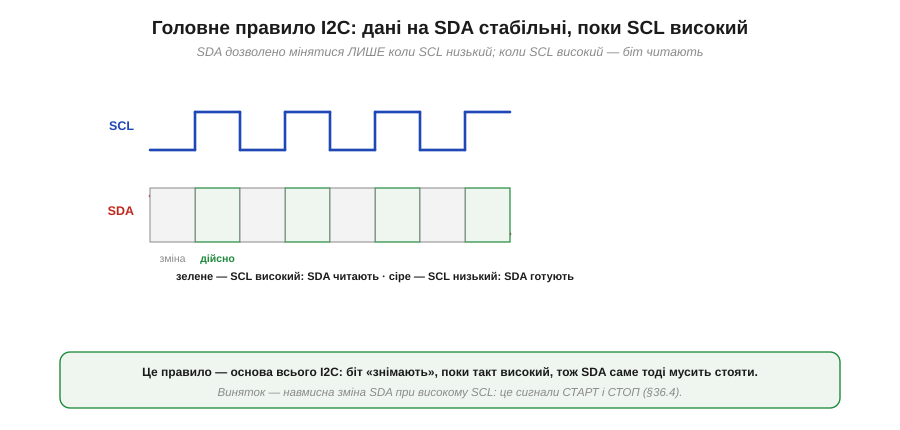
*Рис. 6.2.1.3. Зелені вікна (SCL високий) — біт «знімають», тож SDA саме тоді мусить стояти незмінним. Сірі вікна (SCL низький) — час готувати наступний біт, SDA вільно міняється. Усе спілкування I2C підпорядковане цьому ритму.*

Логіка проста: високий рівень SCL — це сигнал «дивись на SDA зараз», тож у цю мить дані мають бути усталені. А поки SCL низький — пауза, у яку той, хто говорить, виставляє наступний біт. Подивімося на один біт зблизька, щоб відчути цей ритм.

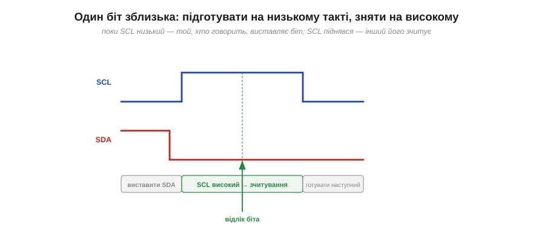
*Рис. 6.2.1.4. Поки SCL низький, передавач виставляє біт на SDA. SCL піднявся — приймач зчитує (SDA весь цей час тримається). SCL знову опустився — час готувати наступний біт. Так, такт за тактом, і повзе кожен байт.*

Це правило має один важливий **виняток**, який варто згадати наперед, щоб не сплутати: SDA таки міняють при високому SCL — але **навмисно**, і саме ці «заборонені» зміни слугують особливими сигналами **СТАРТ** і **СТОП**, що позначають початок і кінець обміну. Їх ми детально розберемо в §6.2.4; поки досить знати, що зміна SDA на високому такті — не помилка, а спеціальний знак.

### Хто веде: ведучий і ведений

На спільній шині хтось має бути за головного — інакше пристрої заговорять разом. У I2C ролі чіткі: **ведучий** (*master*, у сучасній специфікації — *controller*) і **ведений** (*slave* / *target*).

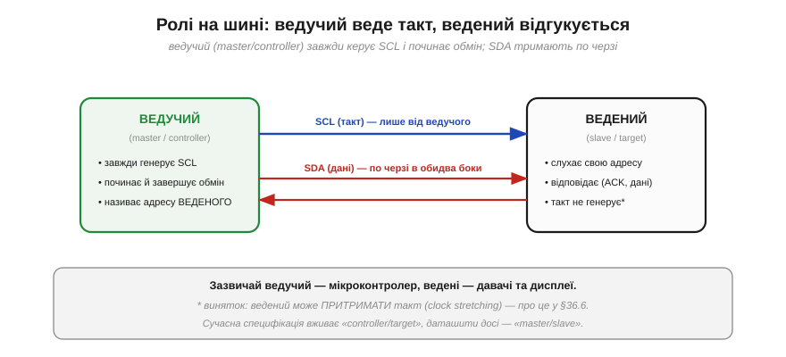
*Рис. 6.2.1.5. Ведучий завжди генерує SCL, починає й завершує обмін і називає адресу потрібного веденого. Ведений слухає свою адресу й відповідає (підтвердженням і даними), але такту сам не генерує. Зазвичай ведучий — мікроконтролер, ведені — давачі та дисплеї.*

Розподіл влади такий: **SCL генерує тільки ведучий** — він задає темп усій шині. **Обмін завжди починає ведучий**: він посилає сигнал старту й називає адресу того веденого, з яким хоче поговорити. Ведений лише **відгукується** — упізнає свою адресу, підтверджує прийом і, коли його просять, віддає дані по SDA. Лінію даних, отже, тримають **по черзі**: коли ведучий пише — він керує SDA, коли ведений відповідає — SDA на якийсь час переходить до нього. (Є й тонкощі: ведений може на мить **притримати** такт, а ведучих буває кілька — це теми §6.2.6.) Зауважте й термінологію: сучасний стандарт уживає «controller/target», але переважна більшість даташитів досі каже «master/slave», тож знати треба обидві пари назв.

### Одна лінія даних: напівдуплекс

З того, що дані йдуть **однією** лінією SDA, випливає ще одна риса: I2C — **напівдуплексний** (*half-duplex*). Тобто в кожну мить SDA належить лише одному — говорить або ведучий, або ведений, але не обидва водночас.

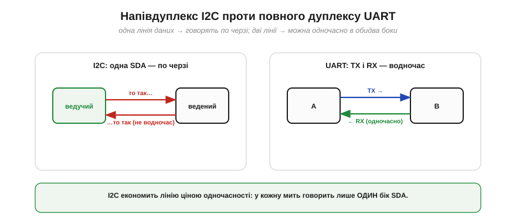
*Рис. 6.2.1.6. У I2C одна лінія SDA, тож сторони говорять **по черзі** (напівдуплекс). У UART були дві окремі лінії TX і RX, тож обидва напрямки працювали **одночасно** (повний дуплекс). I2C економить лінію — ціною одночасності.*

Це знову компроміс «менше дротів — менше можливостей». UART зі своїми окремими TX і RX міг слати й приймати водночас (повний дуплекс із §6.1.1). I2C на одній SDA так не вміє: спершу ведучий каже, тоді ведений відповідає. Для звертання до давачів це майже ніколи не проблема — обмін там по черзі за своєю природою, — зате економія ліній відчутна.

### I2C проти UART

Зведімо все докупи. I2C і UART — це **дві різні відповіді** на питання «як зв'язати чіпи», і кожна виграє у своєму.

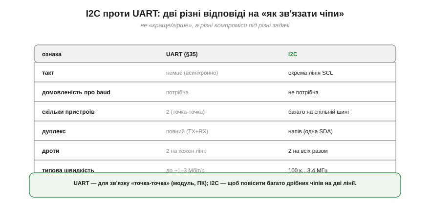
*Рис. 6.2.1.7. UART: асинхронний, без такту, «точка-точка», повний дуплекс, дві лінії на кожен зв'язок. I2C: синхронний, з лінією такту, багато пристроїв на спільній шині, напівдуплекс, дві лінії на всіх. Не «краще/гірше» — різні компроміси.*

Коротко: **UART** незамінний для зв'язку «точка-точка» — з комп'ютером, GPS-модулем, радіомодемом, де двоє пристроїв обмінюються потоком. **I2C** створений, щоб повісити **багато** дрібних чіпів на дві лінії й звертатися до кожного окремо — давачі, дисплеї, пам'ять на одній платі.

**Приклад (як швидко повзе байт по I2C).** Прикиньмо час одного біта й байта на двох поширених швидкостях:

```
біт = 1 / f_SCL

100 кГц (Standard): біт = 1/100000 = 10 мкс;  байт+ACK (9 біт) = 90 мкс
400 кГц (Fast)    : біт = 1/400000 = 2.5 мкс; байт+ACK (9 біт) = 22.5 мкс
```

Тобто на стандартних 100 кГц передати байт із підтвердженням — близько 90 мкс. Звучить повільно проти мегабодного UART, але для давача, який віддає кілька байтів десятки разів на секунду, цього з головою; а коли треба швидше, є режим 400 кГц і вищі. Детальніше за таймінг цілих транзакцій — у §6.2.5.

> 🔧 **Навіщо це.** Вибір між UART та I2C — одне з перших проєктних рішень. Якщо треба зв'язати плату з **одним** зовнішнім пристроєм (модулем, ПК) — бери UART. Якщо треба підключити **кілька дрібних** чіпів (давачі, дисплей, пам'ять) на одній платі — бери I2C: він зекономить і ніжки, і доріжки. А якщо в проєкті вже є I2C-шина, новий сумісний давач часто чіпляють просто паралельно до наявних SDA/SCL — без жодного нового дроту.

Ми побачили I2C згори: дві лінії, багато пристроїв, такт від ведучого, дані по черзі. Та лишилося відкрите фундаментальне питання: **як саме** багато пристроїв можуть ділити одну лінію, не закорочуючи одне одного, коли один хоче «1», а інший «0»? Відповідь — у дотепному електричному рішенні під назвою **відкритий колектор** із підтяжками. Саме воно робить спільну шину фізично можливою, і йому присвячена наступна тема.

---

## 6.2.2 Відкритий колектор і підтяжки

Спільна шина — гарна ідея, але вона ховає електричну пастку. Якщо до однієї лінії під'єднати десяток пристроїв, що буде, коли двоє одночасно захочуть виставити різні рівні: один — «1», інший — «0»? У звичайних виходів це означає катастрофу. Розв'язок, який знайшла Philips, — настільки простий і красивий, що ліг в основу не лише I2C, а й багатьох інших спільних ліній. Розберімо його — бо без нього шина просто не працювала б, а заразом він пояснить характерний вигляд I2C-сигналів і навіть вибір резисторів на платі.

### Чому не можна зводити звичайні виходи

Згадаймо з [§6.1.4](../ch35-uart/ch35-uart.md), як улаштований звичайний цифровий вихід: «1» — це коли він з'єднує лінію з живленням (VCC), «0» — із землею (GND). Такий вихід зветься **двотактним** (*push-pull*): він активно тягне лінію і вгору, і вниз. А тепер з'єднаймо два таких виходи однією лінією — і хай один жене «1», а інший «0».


*Рис. 6.2.2.1. Один вихід тягне лінію до VCC, інший — до GND. Між ними утворюється пряме коло від живлення до землі, і крізь обидва тече великий наскрізний струм — **коротке замикання**. Виходи перегріваються й можуть згоріти. Тому два двотактні виходи на одній лінії несумісні.*

Це **конфлікт шини** (*bus contention*): живлення через перший вихід з'єднується із землею через другий, утворюючи майже коротке замикання, і крізь обидва тече величезний струм. У кращому разі лінія опиняється в невизначеному стані «десь між», у гіршому — виходи вигоряють. Висновок очевидний: щоб багато пристроїв ділили лінію, їхні виходи **не мають права** активно тягти її вгору. Вони повинні вміти лише щось одне.

### Відкритий колектор: тільки вниз або відпустити

Саме це й робить **відкритий колектор** (*open-collector*, для польових транзисторів — *open-drain*, відкритий стік). Такий вихід уміє рівно дві речі: **притягнути** лінію до нуля або **відпустити** її — лишити «висіти в повітрі» (стан високого імпедансу, *high-Z*). Штовхати вгору він не вміє взагалі.

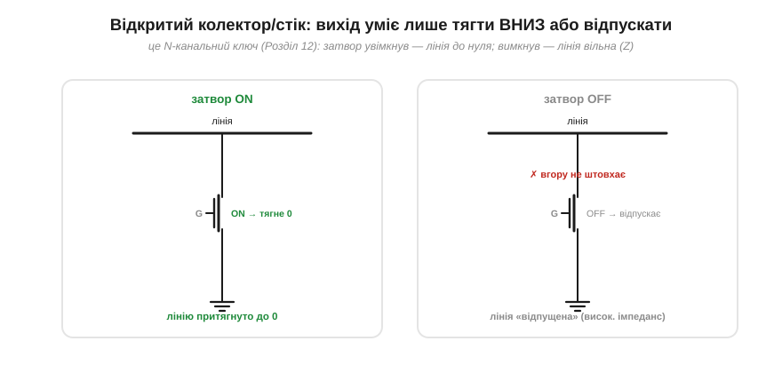
*Рис. 6.2.2.2. Усередині — N-канальний MOSFET (з [Розділу 2.7](../../block-2-components-analog/ch12-mosfet/ch12-mosfet.md)): затвор увімкнено — транзистор з'єднує лінію із землею, тягнучи її до «0»; затвор вимкнено — стік «висить у повітрі» (високий імпеданс), і лінія вільна. Активного шляху вгору немає в принципі.*

Фізично це просто один **N-канальний MOSFET**: його стік під'єднаний до лінії, витік — до землі, а затвором керує логіка пристрою. Подати на затвор сигнал — транзистор відкривається й садить лінію на нуль; зняти — транзистор закривається, і лінія від нього **від'єднана** (саме так працює режим open-drain на ніжках мікроконтролера з [§4.4](../../block-4-mcu-esp32/ch22-gpio/ch22-gpio.md)). Тепер два, десять, сто таких виходів можна сміливо з'єднувати: конфлікту не буде, бо ніхто не тягне вгору — а отже, нема чому замикатися. Але якщо ніхто не тягне вгору, **хто** ж робить лінію високою?

### Підтяжка й монтажне «І»

Відповідь — **підтяжний резистор** (*pull-up*, Rp): один резистор від лінії до живлення. Він **слабко** тягне лінію вгору, до «1». Коли всі відкриті стоки відпущені, ніхто лінію не тримає, і підтяжка спокійно піднімає її до VCC. А щойно бодай один пристрій притягує лінію вниз — він легко перемагає кволу підтяжку, і лінія стає «0».

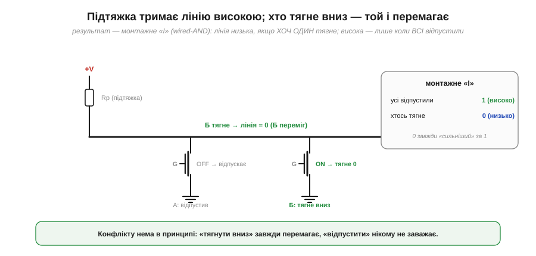
*Рис. 6.2.2.3. Підтяжка Rp тримає лінію у «1», поки всі відкриті стоки відпущені. Щойно один пристрій (Б) притягує лінію вниз, вона стає «0» — і це не конфлікт, бо ніхто не тягне проти. Виходить логічне «І»: лінія висока, лише коли ВСІ відпустили.*

Це дає елегантну логіку, відому як **монтажне «І»** (*wired-AND*): рівень лінії дорівнює «І» всіх виходів. Лінія висока (**1**) тільки тоді, коли **всі** пристрої її відпустили; досить **одному** притягнути вниз — і вся лінія стає **0**. «Нуль» на цій шині завжди «сильніший» за «одиницю»: тягнути вниз перемагає, відпускати нікому не заважає. Конфлікту немає **в принципі** — і саме це робить спільну шину можливою.

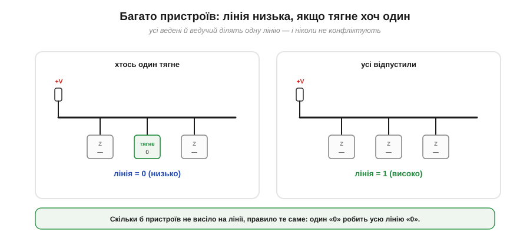
*Рис. 6.2.2.4. Той самий закон масштабується на скільки завгодно пристроїв: якщо хоч один притягує лінію — вона «0»; високою («1») вона стає, лише коли всі до одного відпустили. Додавання пристроїв нічого не ламає.*

### Підпис на осцилографі: швидкий спад, повільний підйом

У відкритого колектора є наслідок, який одразу впізнаєш на осцилографі. Униз лінію тягне **активно** — транзистор робить це швидко й різко. А вгору її тягне лише **пасивна** підтяжка, і робить це **повільно**: адже резистор має зарядити всю **ємність шини** (доріжки, входи пристроїв), а це класичне RC-заряджання (з нашого знайомства з RC-колами).


*Рис. 6.2.2.5. Спад — активний і різкий (транзистор садить лінію на нуль). Підйом — пасивний і заокруглений: підтяжка Rp заряджає ємність шини Cшини за сталою часу τ = Rp·Cшини. Ця асиметрія — фірмовий вигляд I2C-сигналу, і саме повільний підйом обмежує максимальну швидкість.*

Ось чому в I2C є стеля швидкості: підйом лінії триває певний час, і поки вона не дотягнеться до «1», біт читати не можна. Велика ємність шини (довгі доріжки, багато пристроїв) або велика Rp роблять підйом надто повільним — і доводиться знижувати частоту SCL. Саме тому специфікація обмежує ємність шини (близько 400 пФ) і вимагає узгоджувати Rp зі швидкістю.

**Приклад (наскільки повільний підйом).** Візьмімо типову підтяжку Rp = 4.7 кОм і ємність шини Cшини = 100 пФ:

```
τ = Rp × Cшини = 4700 Ом × 100·10⁻¹² Ф = 470 нс

на 100 кГц біт = 10 мкс → підйом 470 нс ≈ 5% біта (легко встигає)
на 400 кГц біт = 2.5 мкс → той самий підйом ≈ 19% біта (вже тіснувато)
```

На стандартних 100 кГц повільний підйом непомітний; а от на 400 кГц він з'їдає чималу частку біта, і часто доводиться брати **меншу** Rp, щоб прискорити заряд.

### Як добирати підтяжку

Звідси й мистецтво вибору Rp — це **компроміс**. Велика Rp означає повільний підйом (довге τ), зате малий струм, коли лінію притягнуто. Мала Rp дає швидкий підйом, але великий струм, який мусить «проковтнути» транзистор, тягнучи лінію вниз.


*Рис. 6.2.2.6. Велика Rp — підйом повільний; мала Rp — швидкий, але струм стоку росте. Типові значення: 4.7 кОм для 100 кГц, 2.2 кОм для 400 кГц, ще менше для 1 МГц. Струм притягання I = VCC/Rp не має перевищувати те, що витримує вихід (для I2C — близько 3 мА).*

**Приклад (струм притягання).** Порахуймо, скільки тече крізь притягнутий до нуля вихід за різних Rp та VCC = 3.3 В:

```
I = VCC / Rp

Rp = 4.7 кОм → I = 3.3 / 4700 ≈ 0.70 мА   (комфортно)
Rp = 1.0 кОм → I = 3.3 / 1000 ≈ 3.3 мА    (близько межі стоку ≈3 мА)
```

Тобто Rp не можна робити надто малою: вихід має витримати струм притягання. Стандартний компроміс — близько **4.7 кОм** для 100 кГц і **2.2 кОм** для 400 кГц, а точне значення підбирають під реальну ємність шини.

> 🔧 **Навіщо це.** Підтяжки на SDA і SCL — **обов'язкові**: без них лінії ніколи не піднімуться до «1», і шина просто не запрацює. Класична помилка новачка — забути їх або поставити по дві (на платі давача й на платі контролера водночас), отримавши надто малий сумарний опір. Якщо I2C «мовчить» або сигнали виглядають кволими й заокругленими на осцилографі — перша підозра саме на підтяжки: є вони, якого номіналу, і чи не задвоєні.

### Навіщо все це: трюки I2C

Може здатися, що відкритий колектор — це лише спосіб уникнути коротких замикань. Та насправді він — **серце** кількох ключових механізмів I2C, які ми ще розбиратимемо. Усі вони працюють за одним принципом: «притягнути вниз перемагає».

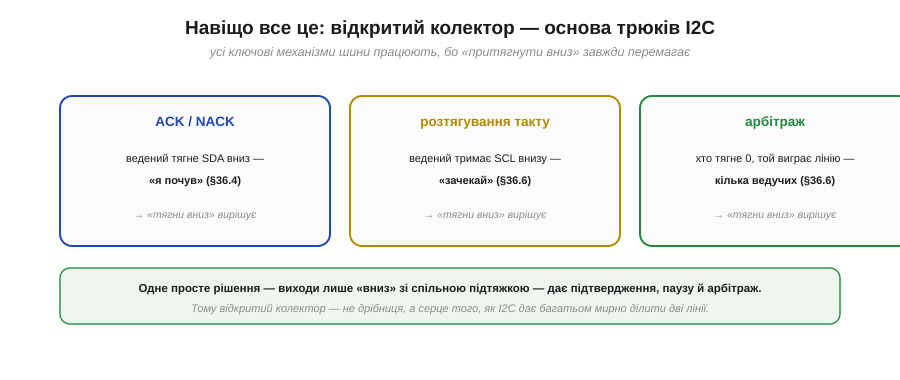
*Рис. 6.2.2.7. Завдяки тому, що «0» завжди сильніший за «1», ведений може **підтвердити** прийом, притягнувши SDA вниз (ACK, §6.2.4); ведений може **притримати** такт, тримаючи SCL внизу («зачекай», §6.2.6); кілька ведучих можуть **поділити** лінію без зіткнення (арбітраж, §6.2.6). Усе це — наслідки одного простого рішення.*

Підтвердження (ACK), розтягування такту, арбітраж кількох ведучих — кожен із цих трюків зводиться до того, що пристрій притягує лінію вниз, і це завжди «чується» поверх відпущеної лінії. Одне-єдине рішення — виходи лише «вниз» зі спільною підтяжкою — дає всю гнучкість, на якій тримається протокол. Тому відкритий колектор варто розуміти не як технічну дрібницю, а як фундамент, що дозволяє багатьом пристроям мирно ділити дві лінії.

Тепер ми знаємо, **як** влаштована фізика шини: дві лінії, відкритий колектор, підтяжки, монтажне «І». Але фізика лише переносить нулі й одиниці — вона ще не каже, **кому** з десятка пристроїв на лінії призначено повідомлення. Як ведучий звертається саме до потрібного веденого й чому кожен чіп має свій номер — про адресацію в наступній темі.

---

## 6.2.3 Адресація: багато пристроїв на двох дротах

На спільній лінії висить десяток пристроїв, і всі вони «чують» одне й те саме. Як ведучому поговорити саме з потрібним — з гіроскопом, а не з барометром? Відповідь, закладена в I2C від народження: кожному веденому дають **адресу**, а обмін завжди починається з того, що ведучий цю адресу **називає**. Це проста ідея з кількома практичними тонкощами, одна з яких — найвідоміша пастка всього I2C, на якій спотикається чи не кожен новачок. Розберімо все по черзі.

### Перший байт: 7 біт адреси плюс напрямок

Щойно ведучий почав обмін, перше, що він посилає, — це **байт адреси**. Влаштований він так: **сім** старших біт несуть адресу веденого, а **восьмий** (наймолодший) — це окремий **біт напрямку R/W**.


*Рис. 6.2.3.1. Перший байт після старту: біти A6…A0 — це 7-бітна адреса веденого (тут 0x68), а останній біт **R/W** каже напрямок: 0 — ведучий писатиме, 1 — читатиме. Сім біт дають 2⁷ = 128 можливих адрес, з яких кілька зарезервовано, тож придатних — близько 112.*

Чому саме **7** біт? Це початковий вибір Philips (з історії розділу): 128 адрес видавалося з головою для плати телевізора, а вкласти адресу в один байт разом із бітом напрямку — зручно й ощадливо. Біт **R/W** (*Read/Write*) тут не випадковий «довісок»: він одразу, ще на адресному байті, каже всім, у який бік підуть наступні дані — від ведучого до веденого (запис, 0) чи назад (читання, 1).

### Адресу чують усі, відгукується один

Як працює вибір на спільній лінії? Ведучий виставляє адресний байт — і його бачать **усі** ведені одразу. Але кожен порівнює почуту адресу зі **своєю** — і реагує лише той, у кого збіглося.

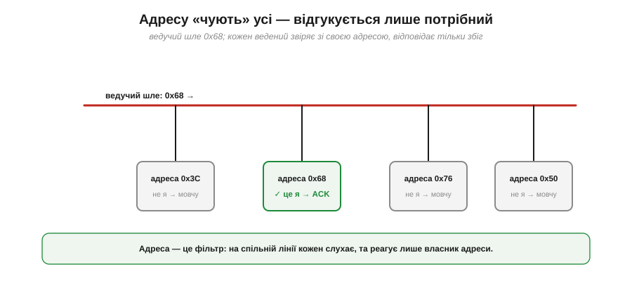
*Рис. 6.2.3.2. Ведучий шле 0x68. Кожен ведений звіряє цю адресу зі своєю: давач 0x68 упізнає себе й відповідає (підтвердженням ACK), а 0x3C, 0x76, 0x50 розуміють, що це не до них, і мовчать. Адреса працює як фільтр на спільній лінії.*

Це і є суть адресації: на спільній шині адреса слугує **фільтром**. Усі слухають, але озивається лише власник адреси — він «підтверджує» прийом, притягнувши лінію вниз (саме той трюк відкритого колектора з §6.2.2; детально про ACK — у §6.2.4). Решта пасивно чекає кінця чужого обміну.

### Біт R/W: один чіп, два напрямки

Повернімося до восьмого біта. Адреса вибирає, **з ким** говорити; біт R/W задає, **у який бік** підуть дані.


*Рис. 6.2.3.3. Той самий ведений 0x68: з R/W = 0 ведучий **пише** в нього (дані йдуть від ведучого), з R/W = 1 — **читає** з нього (дані йдуть назад). Адреса незмінна, міняється лише напрямок наступного обміну.*

На практиці майже кожна транзакція з давачем поєднує обидва: спершу ведучий **пише** (каже, який регістр його цікавить), потім **читає** (забирає звідти дані). Тому біт R/W — не екзотика, а щоденний інструмент, і скоро (§6.2.5) ми побачимо, як із цих «запис-потім-читання» складаються реальні звертання до чіпів.

### Класична пастка: 0x68 чи 0xD0?

А тепер — найвідоміша плутанина I2C, через яку згаяно безліч годин. Подивімося, що насправді летить лінією, коли адреса 0x68, а R/W = 0. Адресні біти займають позиції з 7-ї до 1-ї, R/W — найнижчу. Тобто **повний байт** на лінії — це адреса, **зсунута ліворуч на один біт**, плюс R/W.


*Рис. 6.2.3.4. Та сама адреса у двох записах. «Чиста» **7-бітна** адреса = 0x68. А **8-бітний** байт на лінії — це 0x68, зсунута ліворуч на 1, із бітом R/W унизу: 0xD0 для запису й 0xD1 для читання. Це ОДНА адреса, лише по-різному записана.*

**Приклад (звідки беруться 0xD0 і 0xD1).** Порахуймо обидва записи для давача з 7-бітною адресою 0x68:

```
7-біт адреса        = 0x68 = 110 1000

байт запису (R/W=0) = (0x68 << 1) | 0 = 1101 0000 = 0xD0
байт читання (R/W=1)= (0x68 << 1) | 1 = 1101 0001 = 0xD1
```

Ось де пастка: один даташит напише «адреса пристрою — **0x68**» (7-бітна), інший — «адреса запису **0xD0**, читання **0xD1**» (8-бітні), а бібліотека (як-от `Wire` в Arduino) очікує від тебе **7-бітну** 0x68 і сама додає R/W. Якщо ж передати їй 8-бітну 0xD0, вона зсуне її ще раз — і звернеться до зовсім іншої адреси, а пристрій «не знайдеться». Тому, побачивши адресу, завжди питай себе: це **7-бітна** чи вже з бітом R/W?

> 🔧 **Навіщо це.** Це найчастіша причина «не бачу давача на шині». Запам'ятай: бібліотеки Arduino/`Wire` хочуть **7-бітну** адресу (0x68). Якщо в даташиті число парне й удвічі більше за очікуване (0xD0) — це 8-бітна форма, поділи її на 2, щоб дістати 7-бітну. Сумнів — запусти I2C-сканер (нижче) і подивись, на якій 7-бітній адресі реально відгукується чіп.

### Кілька однакових чіпів: ніжки адреси

Адреса чіпа здебільшого **частково зашита** виробником: кожен тип давача має свою «базову» адресу. Але що, як треба поставити на шину **два однакові** давачі — наприклад, два однакові гіроскопи? Їхні фіксовані адреси збіглися б, і обидва відповідали б разом — конфлікт. Тому виробники лишають кілька **молодших** біт адреси налаштовними — через **ніжки** (часто звуться A0, A1, A2).

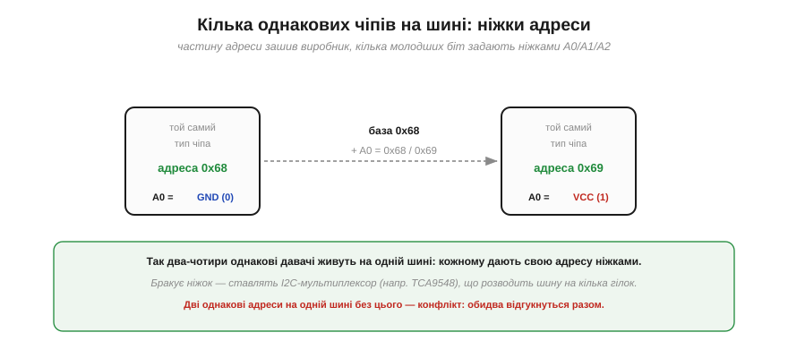
*Рис. 6.2.3.5. Два однакові давачі з базою 0x68: під'єднавши ніжку A0 до землі, дістаємо 0x68, а до живлення — 0x69. Тепер вони мають різні адреси й мирно живуть на одній шині. Бракує комбінацій ніжок — ставлять I2C-мультиплексор, що розводить шину на окремі гілки.*

Так на одну шину вдається посадити кілька однакових чіпів: кожному ніжками A0/A1/A2 задають свою адресу. Якщо ніжок-варіантів не вистачає (а буває потрібно багато однакових давачів), на допомогу приходить **I2C-мультиплексор** (наприклад, TCA9548) — мікросхема, що розводить одну шину на кілька окремих гілок, по одній на групу однакових пристроїв. Та головне правило незмінне: **дві однакові адреси на одній шині — це конфлікт**, і його треба усунути ще на етапі проєктування.

### Карта адрес і зарезервовані

Не всі 128 комбінацій 7-бітної адреси вільні: частину Philips зарезервувала під службові потреби.


*Рис. 6.2.3.6. Простір адрес 0x00…0x7F. Червоні клітини (0x00–0x07 і 0x78–0x7F) — зарезервовані (зокрема 0x00 — «загальний виклик» усім одразу, та діапазон під 10-бітну адресацію). Сині — приклади реальних давачів. Зарезервовано 16 адрес, тож придатних лишається 112.*

**Приклад (звідки «112»).** Порахуймо вільні адреси:

```
усього 7-бітних адрес = 2⁷ = 128
зарезервовано: 0x00…0x07 (8) + 0x78…0x7F (8) = 16
придатних = 128 − 16 = 112
```

Цих 112 адрес з головою для будь-якої плати. А якщо колись забракло б і їх — у стандарті є **10-бітна** адресація (вона користується спеціальним зарезервованим префіксом 11110xx), що дає тисячі адрес; щоправда, у дрібних системах її майже не вживають.

### I2C-сканер

Насамкінець — найкорисніший практичний інструмент усієї теми. Оскільки ведений **підтверджує** свою адресу, можна просто **перебрати** всі адреси підряд і подивитися, хто озветься. Це й робить **I2C-сканер**.


*Рис. 6.2.3.7. Сканер по черзі «гукає» кожну адресу від 0x08 до 0x77: старт, адреса, біт запису. Прийшов ACK — пристрій на цій адресі є; NACK — нікого нема. Нічого в чіп не записуючи (лише перевіряючи відгук), сканер за частку секунди складає список усіх пристроїв на шині.*

Логіка проста: для кожної адреси ведучий шле старт і адресний байт — і дивиться на відповідь. ACK означає «тут хтось є», NACK — «порожньо». Жодних даних у пристрій не пишуть, тож сканування безпечне. Результат — список адрес, на яких реально сидять пристрої.

> 🔧 **Навіщо це.** I2C-сканер — перше, що варто запустити, коли підключив новий давач або коли шина «мовчить». Він одразу відповідає на два питання: чи пристрій **взагалі живий** на шині (відгукується?) і на якій **7-бітній адресі** він сидить (а отже, чи правильну адресу ти даєш бібліотеці). Якщо сканер не бачить нічого — біда не в адресі, а нижче: підтяжки, живлення, дроти (згадай чек-лист із §6.1.4 у версії для I2C). Якщо бачить пристрій на несподіваній адресі — ти щойно розв'язав плутанину 7-біт/8-біт.

Ми навчилися адресувати потрібний пристрій. Та поки що ми оминали найдрібніші, але вирішальні деталі: як саме ведучий **позначає** початок і кінець обміну й як ведений **підтверджує** кожен прийнятий байт. Ці чотири сигнали — старт, стоп, ACK і NACK — і є «розділові знаки» мови I2C. Їм присвячена наступна тема.

---

## 6.2.4 Старт, стоп, ACK/NACK

Якщо байти адреси й даних — це «слова» I2C, то старт, стоп, ACK і NACK — його **розділові знаки**. Вони не несуть даних, зате задають структуру: де обмін починається, де закінчується і чи дійшов кожен байт. Без них потік байтів був би суцільним і неоднозначним (як ми бачили з UART у §6.1.6). Краса I2C в тому, що всі ці знаки втілені дотепно й мінімальними засобами — самими лініями SDA і SCL. Розберімо їх по черзі.

### СТАРТ і СТОП: знаки початку й кінця

Будь-який обмін на I2C обрамлений двома особливими сигналами. **СТАРТ** (*START*, позначають **S**) — це коли ведучий тягне **SDA вниз** у момент, коли **SCL високий**. **СТОП** (*STOP*, **P**) — навпаки: SDA **піднімається** при високому SCL.

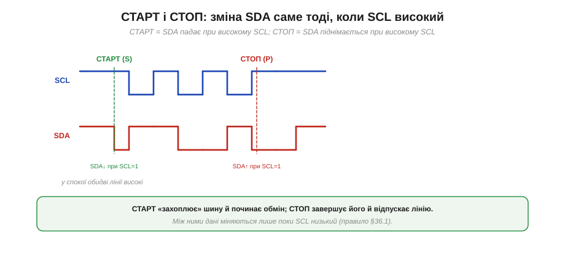
*Рис. 6.2.4.1. У спокої обидві лінії високі. СТАРТ — SDA падає, поки SCL ще високий: це «захоплює» шину й починає обмін. Далі йдуть такти з даними (SDA міняється лише при низькому SCL). СТОП — SDA піднімається при високому SCL: обмін завершено, лінія вільна.*

СТАРТ «захоплює» шину: побачивши його, усі ведені нашорошуються й чекають адреси. СТОП відпускає шину назад у спокій, сигналізуючи: обмін скінчено, можна починати новий. Усе, що між ними, — це один цілісний обмін.

### Чому їх не сплутати з даними

Чому СТАРТ і СТОП роблять саме зміною SDA при високому SCL? Згадаймо головне правило з §6.2.1: під час передачі даних SDA дозволено міняти **лише** коли SCL низький. Отже, зміна SDA при **високому** SCL — це щось **заборонене** для даних, а тому **унікальне**. Саме на цьому й зіграли творці I2C.


*Рис. 6.2.4.2. Звичайний біт даних міняє SDA, поки SCL низький (ліворуч) — це дозволено. СТАРТ і СТОП навмисно роблять заборонене — міняють SDA при високому SCL (праворуч). Саме тому їх неможливо сплутати зі звичайними бітами: жоден легальний біт даних так не поводиться.*

Це гарний інженерний хід: замість вигадувати окрему лінію чи особливий код для «розділових знаків», узяли єдиний стан, який ніколи не трапляється в даних, — і зробили його сигналом. Дешево, надійно, однозначно.

### Дев'ятий такт: ACK і NACK

Тепер про підтвердження. Після кожного **байта** (восьми біт) на I2C іде ще **один**, дев'ятий такт — спеціально для **підтвердження**. На цьому такті той, хто щойно **прийняв** байт, відповідає: тягне **SDA вниз** — це **ACK** (*acknowledge*, «прийняв, давай далі»); або лишає SDA високим — це **NACK** (*not acknowledge*, «ні / досить»).


*Рис. 6.2.4.3. Після 8 біт даних передавач відпускає SDA, і на 9-му такті приймач дає відповідь: притягнув лінію вниз — ACK (0), лишив високою — NACK (1). Тож кожен байт на I2C — це насправді 9 тактів: 8 даних плюс 1 підтвердження.*

Зверніть увагу, як це спирається на відкритий колектор (§6.2.2): ACK — це знову «притягнути вниз перемагає». Передавач перед дев'ятим тактом **відпускає** SDA, і якщо приймач хоче підтвердити — він садить лінію на нуль; якщо ж ніхто не тягне, підтяжка лишає лінію високою, і це читається як NACK. Тому **кожен** байт коштує не 8, а **9** тактів — про це варто пам'ятати, рахуючи час транзакції.

### Хто підтверджує: запис проти читання

Важлива тонкість: ACK дає **той, хто прийняв** байт, а хто це — залежить від напрямку (біта R/W із §6.2.3).


*Рис. 6.2.4.4. При **записі** (ведучий пише) приймач — це ведений, тож він ACK-ає кожен прийнятий байт. При **читанні** (ведучий читає) приймач — це ведучий: він ACK-ає кожен байт, щоб попросити наступний, а **NACK-ом** на останньому каже «досить» — і слідом дає СТОП.*

Отже, при записі ведений підтверджує, що приймає; а при читанні ведучий керує потоком: поки він ACK-ає, ведений шле наступний байт, а щойно ведучий дав NACK — ведений розуміє, що це був останній, і відпускає SDA. Так ведучий завжди лишається господарем обміну, навіть коли дані течуть до нього.

### Повна транзакція

Складімо все докупи. Найпростіший обмін — запис одного байта — виглядає так:


*Рис. 6.2.4.5. СТАРТ → адресний байт (адреса + W) → ведений ACK → байт даних → ведений ACK → СТОП. Кожен обмін загорнутий між S і P, а кожен байт ведений квитує знаком A. Читання має ту саму форму, лише з R замість W і даними у зворотний бік.*

Прочитаймо цю стрічку як речення: «(старт) звертаюся до пристрою 0x68, писатиму (ACK — він озвався) ось такий байт (ACK — прийняв) (стоп)». Уся мова I2C зводиться до таких речень: між СТАРТ і СТОП — послідовність байтів, кожен із підтвердженням. А складніші обміни будують із цих самих цеглинок.

### Повторний старт: змінити напрям, не відпускаючи шину

Є ще один важливий знак — **повторний СТАРТ** (*repeated START*, **Sr**). Це звичайний СТАРТ, виданий **без** попереднього СТОПу — посеред транзакції. Навіщо? Щоб **змінити напрям** обміну, не відпускаючи шину.


*Рис. 6.2.4.6. Щоб прочитати регістр, ведучий спершу **пише** його номер (адр+W, № регістра), а тоді дає **Sr** і **читає** (адр+R, дані). Між фазами немає СТОПу — лише Sr. Тому шина ні на мить не звільняється, і ніхто інший не може вклинитися: «запис-потім-читання» лишається неподільним.*

Це класичний прийом для звертання до регістрів давача: ведучий пише, **який** регістр його цікавить, а потім, не відпускаючи лінію, повторним стартом перемикається на читання й забирає звідти дані. Якби між фазами стояв звичайний СТОП, шина б на мить звільнилася — і інший ведучий (чи навіть той самий, але збитий з пантелику) міг би вклинитися. Повторний старт робить усю операцію **атомарною**. Детально, як із цього будують доступ до регістрів, — у §6.2.5.

### NACK як діагностика

Насамкінець — практично найцінніше. NACK — це не лише «кінець читання»; залежно від того, **де** він стався, він несе цілком конкретну інформацію про стан шини.


*Рис. 6.2.4.7. NACK **після адреси** означає, що на шині нема пристрою з такою адресою (саме на цьому стоїть I2C-сканер із §6.2.3). NACK **після байта при записі** — ведений не може прийняти (зайнятий чи помилка). NACK **від ведучого при читанні** — нормальне «це був останній байт». Місце NACK-а підказує, що сталося.*

> 🔧 **Навіщо це.** Реакція на ACK/NACK — основа надійного драйвера. Бібліотеки повертають цей результат: наприклад, `Wire.endTransmission()` в Arduino віддає код, де 0 — успіх (усе підтверджено), а ненульове — різні види NACK (адреса не озвалась, дані не прийнято). Звикни **перевіряти** цей код, а не сліпо вважати, що запис удався: саме він першим скаже, що давач від'єднався, завис чи його взагалі нема за вказаною адресою. «Тихий» I2C-драйвер, який ігнорує NACK, рано чи пізно «з'їсть» помилку й видасть сміття за дані.

Ми зібрали всю «граматику» I2C: старт, адресу, дані, підтвердження, повторний старт, стоп. Тепер час скласти з цих знаків справжні **речення** — побачити, як виглядають у часі типові операції: записати в давач налаштування, прочитати з нього вимір, дістатися конкретного регістра. Цим — повними транзакціями читання й запису — і займемося далі.

---

## 6.2.5 Транзакція в часі: запис і читання

Дотепер ми говорили про I2C абстрактно — байти, адреси, підтвердження. Та коли під'єднуєш реальний давач, виникає конкретне питання: що саме йому **слати**, щоб він прокинувся й віддав вимір? Відповідь майже завжди та сама, бо майже всі I2C-чіпи влаштовані однаково — як набір **регістрів**. Опанувавши цей один патерн «доступу до регістрів», ти зможеш «заговорити» практично з будь-яким давачем, дисплеєм чи мікросхемою пам'яті. Розберімо його ґрунтовно.

### Чіп зсередини: набір регістрів

Усередині I2C-пристрій — це не загадкова «чорна скринька», а впорядкований набір **регістрів** (*registers*): пронумерованих комірок, кожна зі своїм призначенням. Одні регістри — для **налаштувань** (увімкнути давач, задати діапазон, фільтр), інші — для **даних** (виміри), ще інші — для **стану** (чи готовий новий вимір).

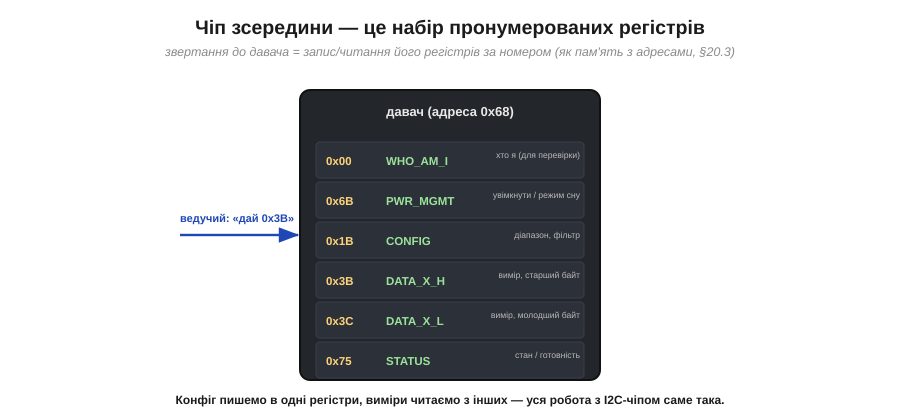
*Рис. 6.2.5.1. Типовий давач має десятки регістрів: WHO_AM_I (перевірити, що це справді він), PWR_MGMT (увімкнути / режим сну), CONFIG (діапазон, фільтр), DATA_* (самі виміри), STATUS (готовність). Доступ — за номером регістра, точно як до комірок пам'яті з адресами (§4.1.3).*

Це той самий принцип **memory-mapped IO**, який ми зустрічали в [§4.1.3](../../block-4-mcu-esp32/ch20-mcu-esp32/ch20-mcu-esp32.md): «торкнутися» периферії — означає прочитати або записати комірку за номером. Тільки тут комірки лежать не в адресному просторі процесора, а **всередині чужого чіпа**, і дотягуєшся до них по двох дротах I2C. Тож уся робота з давачем зводиться до двох дій: **записати** потрібні значення в регістри-налаштування й **прочитати** виміри з регістрів-даних.

### Запис у регістр

Почнімо із запису — він простіший. Після адреси з бітом W ведучий шле **перший** байт, який чіп трактує особливо: це **номер регістра**, у який писатимемо. Усі наступні байти — це дані, що туди лягають.


*Рис. 6.2.5.2. СТАРТ → адреса 0x68 + W → ACK → номер регістра 0x6B → ACK → дані 0x01 → ACK → СТОП. Читається як «записати 0x01 у регістр 0x6B пристрою 0x68». Так, наприклад, давач виводять зі сну, увімкнувши його регістр живлення.*

Логіка проста: «у пристрої 0x68, у регістр 0x6B, поклади 0x01». Якщо слати кілька байтів даних поспіль, більшість чіпів кладе їх у **сусідні** регістри (внутрішній покажчик сам зростає на 1 — про це нижче). Так одним обміном налаштовують одразу кілька регістрів.

### Читання з регістра: дві фази

А ось читання має тонкість, через яку спотикаються новачки. Не можна просто «попросити дані» — спершу треба **сказати чіпу, який регістр** тебе цікавить. Тому читання з регістра — це **дві фази**.

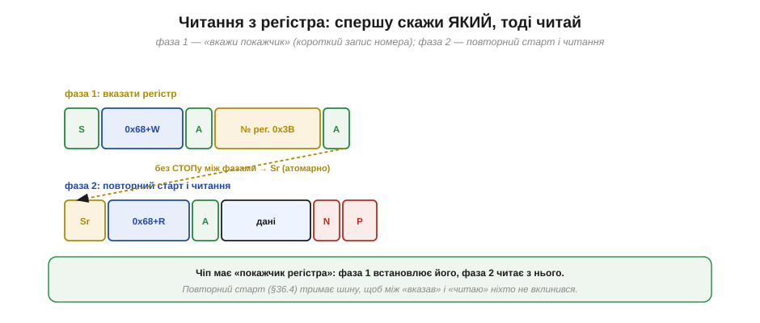
*Рис. 6.2.5.3. Фаза 1 — короткий **запис**: старт, адреса+W, номер регістра 0x3B (це лише встановлює внутрішній «покажчик регістра», даних не пишемо). Фаза 2 — **повторний старт** (Sr), адреса+R, і тепер читаємо дані з того регістра. Між фазами немає СТОПу — лише Sr, тож операція неподільна.*

Розгорнімо логіку. Чіп має внутрішній **покажчик регістра**. Фаза 1 — це фактично «холостий» запис: ведучий пише лише **номер** регістра, встановлюючи покажчик, але самих даних не дає. Потім — **повторний старт** (Sr із §6.2.4), зміна напрямку на читання (адреса+R), і чіп віддає байт(и) з того регістра, на який вказує покажчик. Чому Sr, а не СТОП+СТАРТ? Бо СТОП на мить звільнив би шину, і між «вказав регістр» і «читаю» міг би вклинитися інший ведучий, збивши покажчик. Повторний старт робить «вказав-і-прочитав» **атомарним** — це найважливіша причина, чому Sr узагалі існує.

### Пакетне читання: авто-інкремент

Згаданий покажчик регістра дає чудову економію. Більшість чіпів **автоматично збільшують** його на 1 після кожного прочитаного байта. Тож, указавши регістр **один раз**, можна читати багато байтів поспіль — і вони підуть із послідовних регістрів.

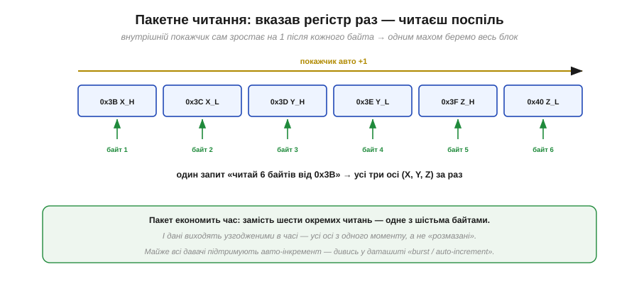
*Рис. 6.2.5.4. Указавши покажчик на 0x3B і попросивши 6 байтів, дістаємо весь блок: старший і молодший байти осей X, Y, Z (регістри 0x3B…0x40). Покажчик сам зростає на 1 після кожного байта. Одне читання замість шести.*

Це **пакетне** (*burst*) читання, і воно цінне подвійно. По-перше, **швидкість**: один обмін на шість байтів замість шести окремих обмінів (кожен зі своїм стартом, адресою, повторним стартом). По-друге, і це часто важливіше, — **узгодженість у часі**: усі шість байтів (три осі) знято фактично з одного моменту, а не «розмазано» по черзі з паузами між окремими читаннями. Тому, читаючи багатовісний давач, завжди бери **весь блок одним пакетом** — шукай у даташиті слова «burst» чи «auto-increment».

### Багатобайтове значення

Часто один вимір не вміщається в байт. 16-бітне значення давач кладе у **два** регістри — старший байт і молодший. Прочитавши обидва, їх треба **зібрати** в одне число.

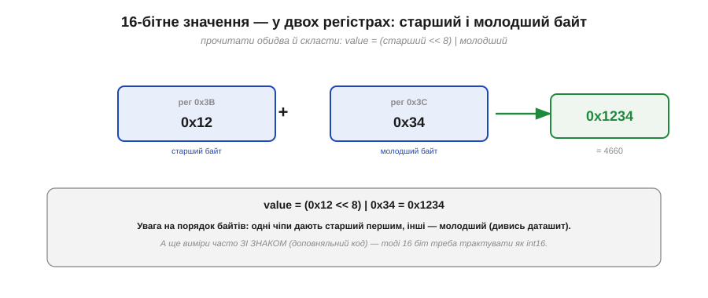
*Рис. 6.2.5.5. Регістр 0x3B містить старший байт 0x12, регістр 0x3C — молодший 0x34. Зібране значення: (0x12 << 8) | 0x34 = 0x1234. Увага на порядок байтів (одні чіпи дають старший першим, інші молодший) і на знак (виміри часто у доповняльному коді).*

**Приклад (зібрати два байти в одне число).** Нехай зчитали старший байт 0x12 і молодший 0x34:

```
value = (старший << 8) | молодший
value = (0x12 << 8) | 0x34
value = 0x1200 | 0x34
value = 0x1234 = 4660
```

Тут чигають дві пастки. Перша — **порядок байтів**: різні чіпи віддають або старший байт першим, або молодший, і це треба звірити з даташитом (інакше дістанеш 0x3412 замість 0x1234). Друга — **знак**: виміри (прискорення, кутова швидкість) часто бувають **від'ємними**, тож 16 біт трактують як знакове число у доповняльному коді (з [§3.4](../../block-3-digital-processor/ch17-number-representation/ch17-number-representation.md)) — як `int16`, а не `uint16`.

### У коді: ідіома Wire

Як це виглядає в реальному коді? У світі Arduino за I2C відповідає бібліотека `Wire`, і доступ до регістра записують усталеною ідіомою. Ключ до неї — параметр `false` у `endTransmission`.

```
// прочитати 2 байти з регістра 0x3B пристрою 0x68
Wire.beginTransmission(0x68);   // СТАРТ + адреса + W
Wire.write(0x3B);               // номер регістра (встановити покажчик)
Wire.endTransmission(false);    // false → НЕ СТОП, а повторний старт (Sr)!
Wire.requestFrom(0x68, 2);      // Sr + адреса + R, читаємо 2 байти
uint8_t hi = Wire.read();       // 1-й байт (Wire сам дає ACK)
uint8_t lo = Wire.read();       // 2-й байт (Wire дає NACK) + СТОП
int16_t value = (int16_t)((hi << 8) | lo);
```

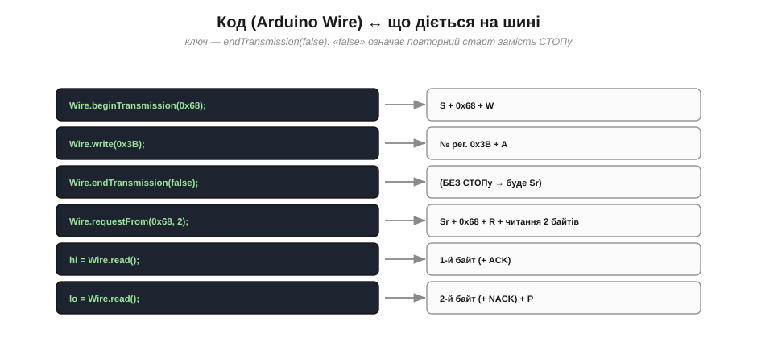
*Рис. 6.2.5.6. Кожен рядок коду відповідає фазі на шині: beginTransmission → старт+адреса+W, write → номер регістра, endTransmission(**false**) → не СТОП, а повторний старт, requestFrom → Sr+адреса+R і читання. Те саме «false» і є той повторний старт, без якого читання регістра не працює.*

> 🔧 **Навіщо це.** Запам'ятай роль `endTransmission(false)`: **false** означає «не відпускай шину, буде повторний старт». Якщо помилково написати `true` (або просто `endTransmission()`), між «вказав регістр» і «читаю» вставиться СТОП — і багато чіпів після цього втратять покажчик і віддадуть не те. «Читаю не той регістр» або «завжди той самий байт» — класичний симптом саме цієї помилки. Тому шаблон «beginTransmission → write(reg) → endTransmission(false) → requestFrom» варто завчити як єдине ціле.

### Скільки це триває

Насамкінець прикиньмо час. Згадаймо: кожен байт — це **9** тактів (8 + ACK, §6.2.4), плюс старти й адреси теж їдять такти.

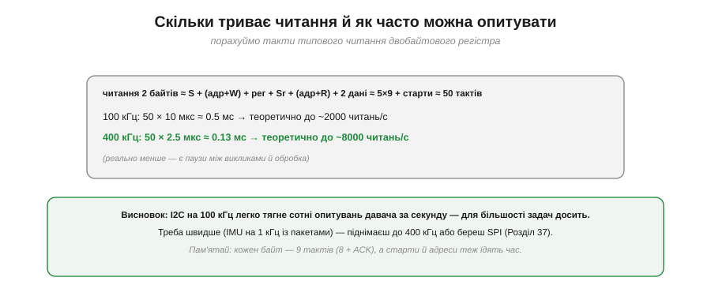
*Рис. 6.2.5.7. Читання двобайтового регістра — це приблизно старт + (адреса+W) + регістр + повторний старт + (адреса+R) + 2 байти даних ≈ 50 тактів. На 100 кГц це ≈ 0.5 мс, на 400 кГц ≈ 0.13 мс — тобто сотні-тисячі читань за секунду.*

**Приклад (як часто можна опитувати).** Порахуймо для читання 2-байтового виміру:

```
тактів ≈ 50  (5 байтів × 9 + старти/адреси)

100 кГц: 50 × 10 мкс  ≈ 0.50 мс/читання → до ~2000 читань/с (теоретично)
400 кГц: 50 × 2.5 мкс ≈ 0.13 мс/читання → до ~8000 читань/с (теоретично)
```

На практиці виходить менше (є паузи між викликами й обробка), але висновок ясний: навіть скромні 100 кГц легко тягнуть **сотні** опитувань давача за секунду — для переважної більшості задач цього з головою. Якщо ж треба швидше (інерціальний давач на 1 кГц із пакетами), піднімають частоту до 400 кГц або беруть зовсім іншу, швидшу шину — SPI з наступного розділу.

Ми навчилися повноцінно спілкуватися з веденими: писати в регістри, читати поодинці й пакетами, збирати багатобайтові значення. Та ми весь час мовчки вважали, що ведений **встигає** за тактом ведучого і що ведучий на шині **один**. А якщо ведений не встигає підготувати дані? А якщо ведучих **кілька** і вони заговорять водночас? На ці два питання I2C має дві дотепні відповіді — **розтягування такту** й **арбітраж**, — і їм присвячена наступна тема.

---

## 6.2.6 Розтягування такту й арбітраж

Дві ситуації, які ми досі оминали, у реальному житті трапляються — і I2C розв'язує їх обидві напрочуд елегантно, причому **тим самим** механізмом відкритого колектора (§6.2.2), на якому тримається вся шина. Перша: ведений **не встигає** за тактом ведучого. Друга: на шині **кілька** ведучих, і вони можуть заговорити одночасно. Розберімо обидві — а заразом ще раз переконаємося, яким могутнім виявилося просте рішення «тягнути вниз перемагає».

### Розтягування такту: ведений каже «зачекай»

Уявімо повільний ведений: щоб віддати вимір, йому треба спершу його **порахувати** (зробити аналого-цифрове перетворення, обробити). А ведучий уже цокає тактом, вимагаючи даних. Як веденому сказати «стривай, я ще не готовий»? У нього є лише дві лінії — і він користується SCL. Ведений просто **тримає SCL низьким** довше, ніж хотів би ведучий.

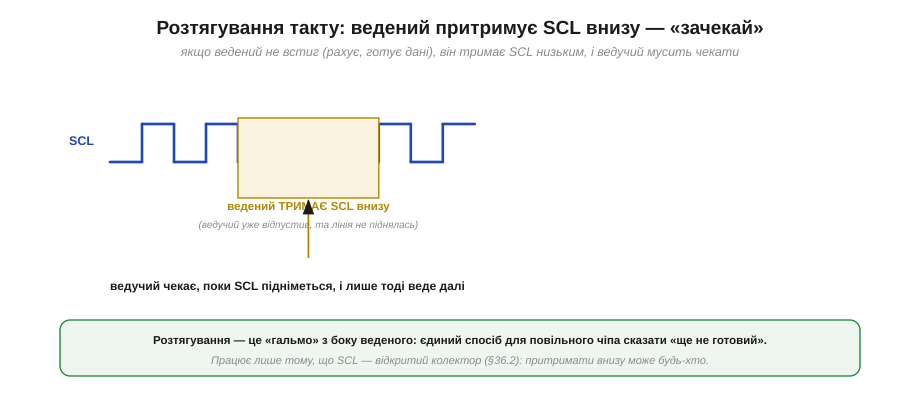
*Рис. 6.2.6.1. Ведучий уже відпустив SCL, щоб підняти його у «1» і дати наступний такт, — але лінія не піднялась: ведений тримає її внизу. Ведучий мусить чекати. Щойно ведений відпускає SCL, лінія підіймається, і обмін триває. Це **розтягування такту** (*clock stretching*).*

Працює це лише завдяки відкритому колектору: SCL — спільна лінія з монтажним «І», тож **будь-хто** може притримати її внизу, і ведучий нічого з цим не вдіє, поки ведений не відпустить. По суті це **єдиний** спосіб для веденого вповільнити ведучого — таке собі «гальмо» знизу. Багато давачів ним користуються, коли їм потрібен час на внутрішню роботу.

### Чому працює й де пастка

Розтягування тримається на одній умові з боку ведучого: він мусить **дивитися на реальний SCL**, а не просто «цокати» за внутрішнім таймером. Відпустив лінію в «1» — перевір, чи вона **справді** піднялась; ні — значить, хтось тримає, треба чекати.

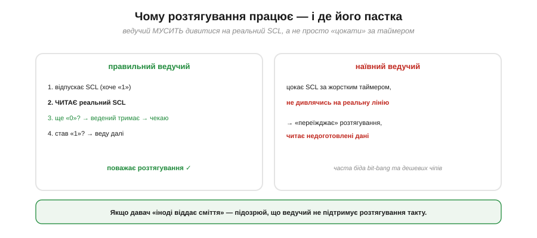
*Рис. 6.2.6.2. Правильний ведучий, відпустивши SCL, читає реальний рівень лінії й чекає, поки вона підніметься. Наївний ведучий цокає за жорстким таймером, не дивлячись на лінію, — і «переїжджає» розтягування, зчитуючи недоготовлені дані. Це часта вада програмних (bit-bang) реалізацій і дешевих контролерів.*

Ось де ховається підступна біда. Не всі ведучі поважають розтягування: програмні («bit-bang») реалізації або контролери з жорсткими таймінгами можуть **ігнорувати** притриманий SCL і йти далі за розкладом — а тоді зчитують сміття. Бувають і ведені з кривим розтягуванням. Тому це класичне джерело «іноді працює, іноді ні».

> 🔧 **Навіщо це.** Якщо давач **зрідка** віддає сміття або обмін «підвисає», одна з перших підозр — **розтягування такту**: чи підтримує його твій ведучий? Апаратні I2C-блоки мікроконтролерів зазвичай так, програмні — не завжди. У документації шукай «clock stretching»; якщо ведений його активно використовує, а ведучий не підтримує, — або міняй ведучого на апаратний, або шукай у давача режим без розтягування.

### Кілька ведучих і вільна шина

Тепер друге питання — **кілька ведучих**. I2C дозволяє мати на шині більш ніж один ведучий: наприклад, два мікроконтролери, що ділять спільні давачі, або хост і співпроцесор.

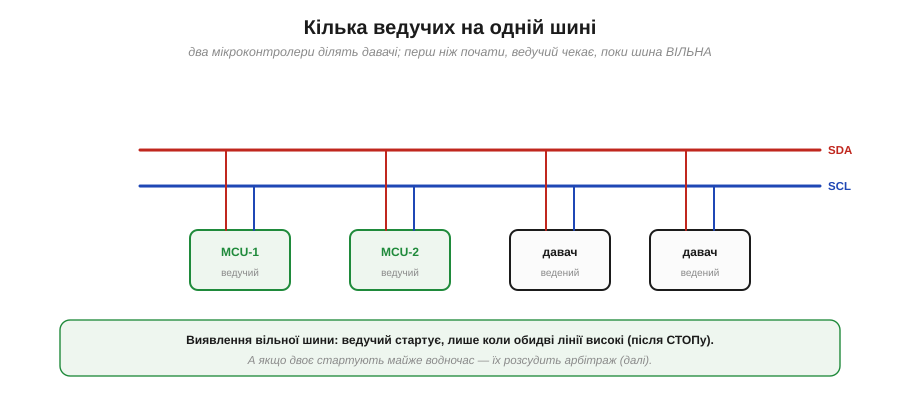
*Рис. 6.2.6.3. Два мікроконтролери-ведучі й кілька ведених на спільних лініях. Перш ніж почати обмін, ведучий перевіряє, що шина **вільна** — обидві лінії високі (тобто хтось щойно дав СТОП). Так двоє не наступають одне одному, якщо не стартують одночасно.*

Перший запобіжник проти зіткнення — **виявлення вільної шини**: ведучий не починає, поки бачить чужий обмін (лінії «зайняті»), а чекає СТОПу й стану спокою. Але що, як двоє **майже одночасно** вирішили почати? Ось тут і вмикається найкрасивіший механізм I2C.

### Арбітраж: хто жене «0», той виграє

Якщо два ведучі стартували разом, вони починають **арбітраж** — змагання за шину, що йде **біт за бітом** прямо на лінії SDA. І вирішує його все те саме правило відкритого колектора: «тягнути вниз перемагає».

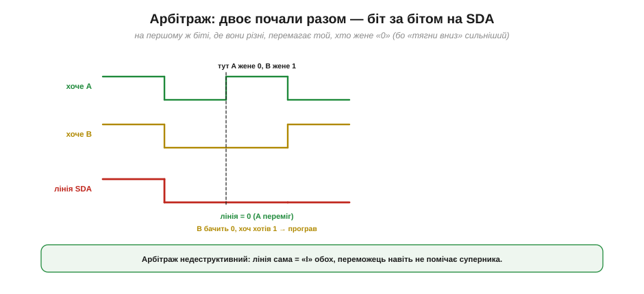
*Рис. 6.2.6.4. Обидва ведучі женуть свої біти на SDA одночасно. Поки біти однакові — нічого не видно. На першому ж біті, де вони різні (тут третій), один жене «1» (відпускає лінію), інший «0» (тягне вниз) — і лінія стає «0» (монтажне «І»). Той, хто жене «0», переміг.*

Механізм такий: кожен ведучий, женучи свій біт, **одночасно читає** реальний стан SDA. Поки обидва женуть однакове — лінія саме таке й показує, ніхто нічого не помічає. Та на першому біті, де вони розійшлися, один жене «1» (відпускає), а інший «0» (тягне) — і лінія, за монтажним «І», стає **0**. Той, хто хотів «1», бачить на лінії «0» — і розуміє, що програв.

### Як переможений розуміє програш

Подивімося на цей момент зблизька — він і є серцем арбітражу.


*Рис. 6.2.6.5. Ведучий B жене «1» (відпускає SDA), та читає на лінії «0» — розбіжність! Це означає «я програв»: B негайно замовкає й відступає (стане веденим або повторить пізніше). Ведучий A жене «0» і читає «0» — усе, як хотів; він **навіть не помітив** суперника й веде своє повідомлення далі.*

Найкрасивіше тут — **недеструктивність**. Переможений (B) тихо відступає, щойно виявив розбіжність, а повідомлення переможця (A) проходить **цілим**, без жодного зіпсованого байта — A навіть не дізнається, що поряд хтось був. Жодних колізій, повторів, зіпсованих даних: один проходить, інший чемно чекає наступної нагоди. І все це — знову лише завдяки тому, що «0» на спільній лінії сильніший за «1».

### Синхронізація такту

Лишилася одна деталь: щоб двоє чесно порівнювали біти, вони мають **бачити однакові такти**. І це теж улаштовується саме собою через монтажне «І» — тепер уже на лінії SCL.

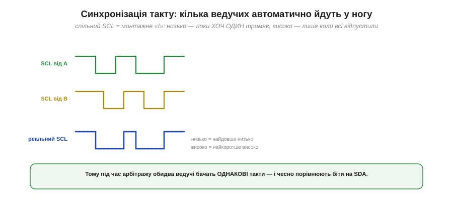
*Рис. 6.2.6.6. Спільний SCL — це «І» тактів обох ведучих: лінія низька, поки хоч один тримає її внизу, і висока, лише коли всі відпустили. Тому низький період виходить «найдовший із низьких», високий — «найкоротший із високих», і обидва ведучі автоматично йдуть у ногу — а отже, порівнюють біти SDA в одні й ті самі моменти.*

Так такти кількох ведучих злипаються в один спільний ритм без жодного спеціального узгодження — просто з фізики відкритого колектора. Це й робить арбітраж справедливим: обидва учасники крокують синхронно.

### Що з цього треба насправді

Насамкінець — тверезий практичний підсумок, щоб не переоцінити складність.


*Рис. 6.2.6.7. Переважна більшість систем — з **одним** ведучим (один мікроконтролер керує всіма давачами); там арбітраж не потрібен зовсім, а от **розтягування такту** трапляється часто, бо ним користуються давачі. Кілька ведучих (два МК на спільних давачах, хост + співпроцесор) — рідкісний випадок, де вже потрібні арбітраж і виявлення вільної шини.*

> 🔧 **Навіщо це.** Розстав пріоритети правильно. **Розтягування такту** стосується тебе майже завжди: переконайся, що твій ведучий його підтримує, інакше частина давачів капризуватиме. **Арбітраж** же на практиці потрібен рідко — лише коли на шині справді кілька ведучих; у звичайному проєкті «один МК + купа давачів» про нього можна не думати. Та знати, що він є й працює недеструктивно, корисно: побачивши на платі два процесори на спільній I2C, ти вже не здивуєшся, що вони не заважають одне одному.

На цьому ми пройшли механіку I2C повністю — від двох ліній і відкритого колектора до адрес, розділових знаків, транзакцій, розтягування й арбітражу. Лишилося звести все це в єдине практичне вміння: узяти **реальний** незнайомий давач, відкрити його даташит і за регістровою картою «заговорити» з ним — увімкнути, налаштувати, прочитати вимір. Саме цим — від теорії до живого чіпа — і завершимо розділ.

---

## 6.2.7 Типова регістрова карта давача

Уся попередня механіка — старти, адреси, регістри, підтвердження — варта чогось лише тоді, коли з її допомогою вдається **оживити реальний чіп**. І тут чудова новина: хоч давачів тисячі, «розмовляють» вони майже однаково, і ключ до кожного — його **регістрова карта** в даташиті. Опанувавши один універсальний підхід, ти зможеш узяти **будь-який** незнайомий I2C-пристрій і за пів години змусити його працювати — не покладаючись на готову бібліотеку, а розуміючи, що відбувається. Зберімо все докупи.

### Регістрова карта: інструкція до чіпа

Перше, що шукаєш у даташиті, — **регістрова карта** (*register map*): таблиця всіх регістрів чіпа. Вона і є інструкція, як із ним говорити.

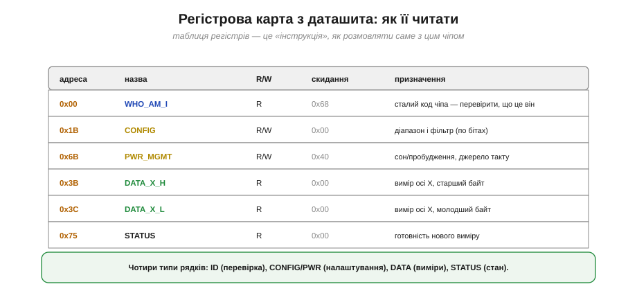
*Рис. 6.2.7.1. Типова карта: для кожного регістра — адреса, назва, доступ (R/W), значення після скидання й призначення. Рядки бувають чотирьох типів: **ID** (сталий код для перевірки), **CONFIG/PWR** (налаштування), **DATA** (виміри) і **STATUS** (стан). Прочитати карту — означає знати, що куди писати й звідки що читати.*

Навчися бачити в карті ці **чотири типи** рядків — і будь-який чіп стане зрозумілим. **ID-регістр** (часто WHO_AM_I) — сталий код, щоб переконатися, що це справді той чіп. **Регістри налаштувань** (CONFIG, PWR_MGMT) — куди пишеш, щоб увімкнути давач і задати режим. **Регістри даних** (DATA_*) — звідки читаєш виміри. **Регістр стану** (STATUS) — звідки дізнаєшся, чи готовий новий вимір. Усе, що далі, — це робота з цими чотирма групами.

### Біти всередині регістра

Часто один регістр налаштувань пакує **кілька** параметрів — кожен у своїх бітах. Це **бітові поля** (*bit fields*).


*Рис. 6.2.7.2. Байт CONFIG, де біт 7 — команда скидання (RST), біти 4:3 — діапазон (RNG), біти 2:0 — фільтр (FLT). Три налаштування в одному регістрі. Щоб змінити одне поле, не зачепивши інших, роблять «читай-зміни-запиши».*

Тут ховається важлива пастка: якщо просто **записати** весь байт заради одного поля, ти випадково **перезатреш** інші. Тому поля міняють обережно — про це нижче. А поки запам'ятай: один регістр ≠ одне налаштування; дивись на **біти**.

### Універсальний рецепт оживлення

Ось послідовність, що працює майже для кожного I2C-давача:

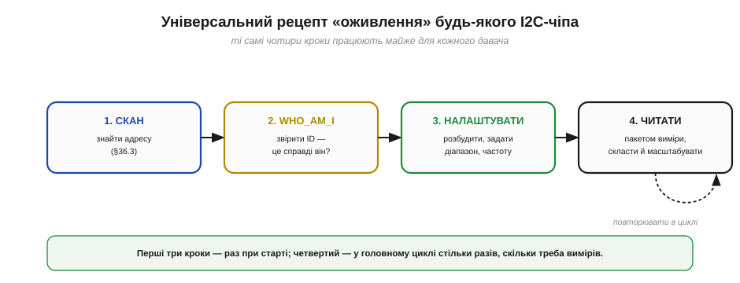
*Рис. 6.2.7.3. Чотири кроки: (1) **скан** — знайти адресу; (2) **WHO_AM_I** — звірити ID, що це справді той чіп; (3) **налаштувати** — розбудити, задати діапазон і частоту; (4) **читати** — пакетом виміри, скласти й масштабувати. Перші три — раз при старті, четвертий — у головному циклі стільки разів, скільки треба.*

Цей рецепт — серце всієї теми. Кроки 1–3 виконують **один раз** при старті (знайшов, перевірив, налаштував), а крок 4 крутиться в головному циклі. Розгляньмо два ключові кроки уважніше.

### WHO_AM_I: перша перевірка

Найрозумніше, що можна зробити перед будь-яким налаштуванням, — прочитати **ID-регістр** і звірити з очікуваним значенням.

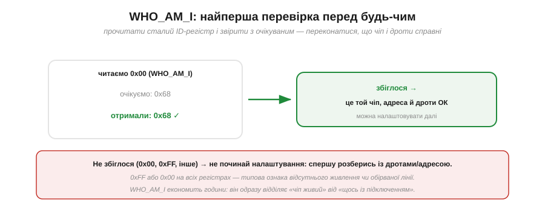
*Рис. 6.2.7.4. Читаємо WHO_AM_I, очікуємо сталий код (тут 0x68), отримали 0x68 → збіглося: це той чіп, адреса й дроти справні, можна налаштовувати. Якщо ж отримали 0x00, 0xFF чи інше — не починай налаштування, спершу розберись із підключенням.*

> 🔧 **Навіщо це.** WHO_AM_I економить **години** налагодження. Він одразу відділяє два зовсім різні класи проблем: «чіп живий і відповідає» (ID збігся — далі шукай помилки в логіці) від «щось із підключенням» (ID не той — підтяжки, живлення, адреса, дроти). Значення 0xFF на всіх регістрах зазвичай означає обірвану лінію (підтяжка тримає «1»), а 0x00 — часто відсутнє живлення. Завжди став цю перевірку **першою**: вона за один обмін каже, чи варто рухатися далі.

### Читай-зміни-запиши

Тепер про обережну зміну бітового поля. Щоб поставити, скажімо, діапазон RNG = 10, не зіпсувавши біти фільтра, застосовують прийом **читай-зміни-запиши** (*read-modify-write*).


*Рис. 6.2.7.5. Прочитали поточний байт (0x1A); замаскували старі біти діапазону (4:3) і вставили нове значення 10; записали назад (0x12). Біти фільтра й решта лишилися недоторканими.*

**Приклад (змінити лише поле RNG).** Хай регістр CONFIG зараз містить 0x1A, а ми хочемо виставити поле діапазону (біти 4:3) у значення 0b10, не чіпаючи решти:

```
reg = 0x1A                       // прочитали:        0001 1010
reg = reg & ~0x18                // обнулили біти 4:3: 0000 0010   (~0x18 = 1110 0111)
reg = reg | (0b10 << 3)          // вставили 10:       0001 0010 = 0x12
// записати 0x12 назад у регістр CONFIG
```

Якби ми просто записали `0b10 << 3` (тобто 0x10) у весь регістр, то випадково обнулили б біти фільтра. «Читай-зміни-запиши» — стандартний і безпечний спосіб міняти **одне** поле в регістрі.

### Сирий відлік → фізична величина

Останній крок — перетворити «голі» числа давача у фізичні величини. Чіп віддає сирі відліки (*raw counts*); даташит каже **чутливість** (*sensitivity*), щоб перевести їх у g, °/с, °C тощо.

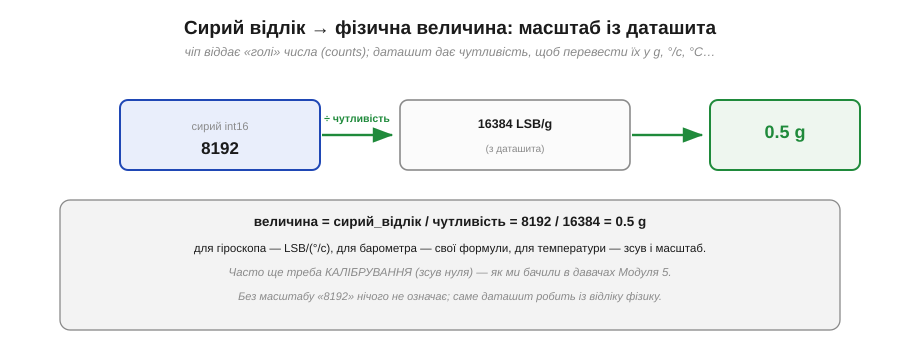
*Рис. 6.2.7.6. Сирий int16 (8192), поділений на чутливість із даташита (16384 LSB/g), дає фізичну величину (0.5 g). Без масштабу «8192» нічого не означає — саме даташит робить із відліку фізику.*

**Приклад (відлік у прискорення).** Нехай давач прискорення віддав сирий відлік 8192, а в даташиті чутливість для обраного діапазону — 16384 LSB/g:

```
величина = сирий_відлік / чутливість
величина = 8192 / 16384
величина = 0.5 g
```

Для гіроскопа масштаб буде в LSB/(°/с), для барометра — своя формула, для температури — зсув і коефіцієнт. А ще пам'ятай, що виміри часто потребують **калібрування** (прибрати зсув нуля) — точно як ми робили з давачами в Модулі 5: сирий відлік → масштаб → калібрування → справжня величина.

### Усе разом: оживлення в коді

Зберімо рецепт у код. Ось як виглядає типове «оживлення» давача — від перевірки до читання, усе на знайомій ідіомі `Wire`:

```
// 1. Перевірка: чи це той чіп?
uint8_t id = readReg(ADDR, REG_WHO_AM_I);
if (id != EXPECTED_ID) { /* біда з дротами/адресою — не йти далі */ }

// 2. Налаштування (виконати раз при старті):
writeReg(ADDR, REG_PWR_MGMT, 0x00);          // вийти зі сну
uint8_t c = readReg(ADDR, REG_CONFIG);       // читай-зміни-запиши:
writeReg(ADDR, REG_CONFIG, (c & ~0x18) | (RANGE << 3));   // задати діапазон

// 3. Читання вимірів (у головному циклі):
uint8_t buf[6];
readRegs(ADDR, REG_DATA_X_H, buf, 6);        // пакетом: X, Y, Z (§6.2.5)
int16_t x = (int16_t)((buf[0] << 8) | buf[1]);
float ax = x / SENSITIVITY;                  // сирий відлік → g
```

Зверніть увагу, як кожен рядок спирається на пройдене: `readReg`/`writeReg` усередині — це той самий шаблон «запис номера регістра, повторний старт, читання» (§6.2.5); перевірка ID — це WHO_AM_I; конфіг — це читай-зміни-запиши; пакетне читання — авто-інкремент. Уся складність схована за чотирма кроками рецепта.

### Універсальне вміння

І ось головний підсумок не лише теми, а й усього розділу.

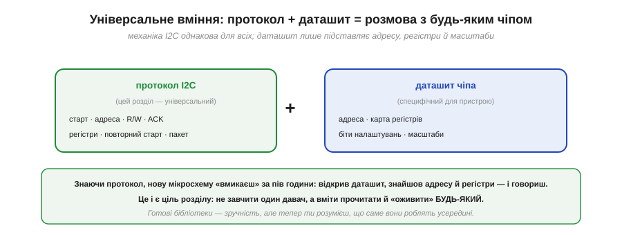
*Рис. 6.2.7.7. Розмова з будь-яким чіпом = **протокол I2C** (універсальний, цей розділ) + **даташит** (специфічний для пристрою: адреса, карта регістрів, біти, масштаби). Знаючи протокол, нову мікросхему «вмикаєш» за пів години: відкрив даташит, знайшов адресу й регістри — і говориш.*

> 🔧 **Навіщо це.** У цьому й ціль розділу: не завчити один конкретний давач, а навчитися «оживляти» **будь-який**. Готові бібліотеки — зручність, і ними варто користуватися; але тепер ти розумієш, що саме вони роблять усередині, і зможеш полагодити їх, коли щось піде не так, чи написати драйвер для чіпа, на який бібліотеки ще немає. Протокол ти знаєш — лишається відкрити даташит і прочитати таблицю.

---

Підсумуймо Розділ 6.2. Ми пройшли I2C від самих основ: **дві лінії** SDA/SCL і багато пристроїв на них (§6.2.1), **відкритий колектор** із підтяжками, що робить спільну шину можливою (§6.2.2), **адресацію** з 7-бітними адресами й сумнозвісною пасткою 7-біт/8-біт (§6.2.3), **розділові знаки** старт-стоп-ACK (§6.2.4), **транзакції** доступу до регістрів (§6.2.5), **розтягування такту й арбітраж** (§6.2.6) і, нарешті, практичне вміння «заговорити» з реальним чіпом за його регістровою картою (§6.2.7). Тепер I2C для тебе — не загадковий «давач на двох дротах», а прозорий протокол, який можна свідомо налаштувати й налагодити.

I2C був дотепним компромісом: дві лінії, багато пристроїв, помірна швидкість — ціною спільної шини, адрес і повільного відкритого колектора. Але іноді потрібна **швидкість** і не шкода кількох зайвих ліній. Тоді беруть іншу синхронну шину — **SPI**: повнодуплексну, без адрес і підтяжок, із роздільними лініями даних в обидва боки. Чому вона швидша, як влаштована й коли її обирати замість I2C — у наступному розділі.

> ▶️ Далі: [Розділ 6.3 — Шина SPI](../ch37-spi/ch37-spi.md)