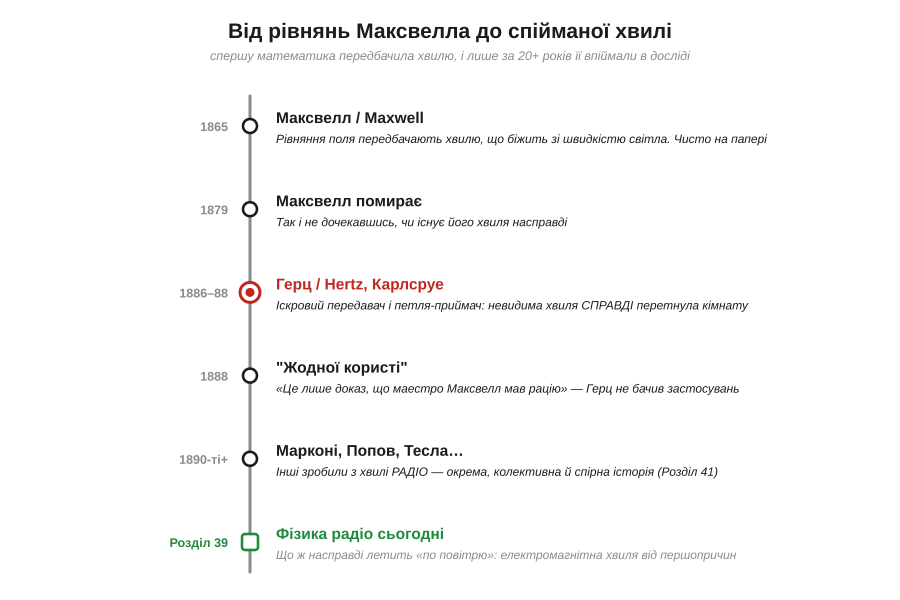
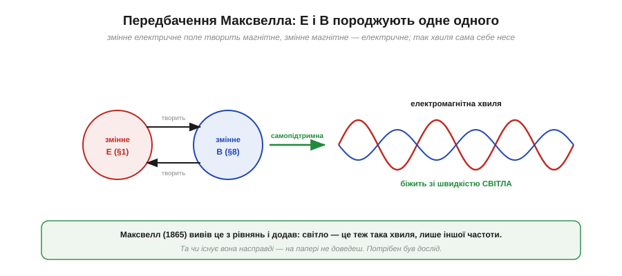
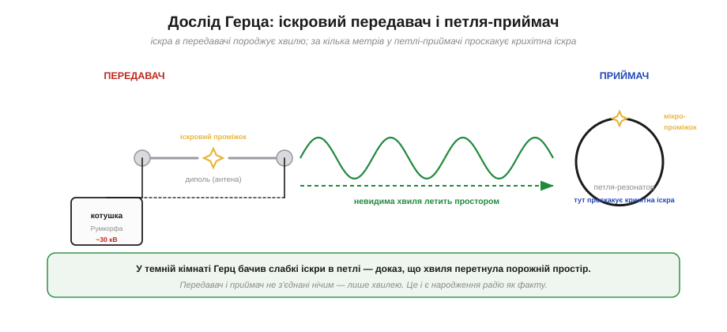
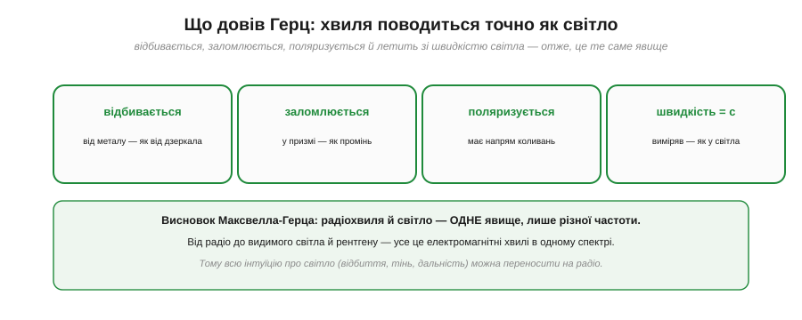
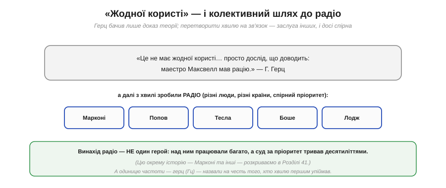

📜 *Історична вставка до [Розділу 6.6 — Радіо: фізика електромагнітних хвиль](ch39-radio-em-waves.md).*

# Історія: Герц ловить хвилю — як підтвердили передбачення Максвелла

Одиниця частоти, яку ти бачиш скрізь — мегагерци процесора, гігагерци Wi-Fi, — зветься **герц** на честь людини, яка першою **впіймала** електромагнітну хвилю в досліді. Та сама людина, спіймавши її, знизала плечима й сказала, що це «не має жодної користі». Він помилявся щодо користі настільки, наскільки взагалі можна помилятися: на тій «непотрібній» хвилі тепер тримається весь бездротовий світ, який ми щойно вивчали в Розділі 6.5.

Ця історія варта розповіді не лише через іронію. Вона показує дві глибокі речі. По-перше — як працює фізика: спершу хвилю **передбачили** суто математично, на папері, і лише за двадцять із гаком років змогли довести, що вона існує насправді. По-друге — що за «само собою зрозумілим» радіо стоїть драматичний шлях від чистої теорії до спійманої іскри, а далі — до зв'язку, який робили вже зовсім інші люди в запеклій суперечці за пріоритет. Тримаючи це в голові, легше зрозуміти, **що ж насправді летить «по повітрю»**, коли твій ESP32 виходить у Wi-Fi.

*Рис. 6.6.0.1. Дорога завдовжки в життя: 1865-го Максвелл вивів хвилю з рівнянь; 1879-го помер, не дочекавшись її підтвердження; 1886–88 Герц упіймав її в досліді; назвав «непотрібною»; а вже інші — Марконі, Попов, Тесла й далі — за десятиліття зробили з неї радіо.*

---

## Хвиля на папері: передбачення Максвелла

Усе почалося не з досліду, а з **математики**. Шотландський фізик **Джеймс Клерк Максвелл** (*James Clerk Maxwell*) у праці 1865 року звів усю електрику й магнетизм до кількох рівнянь — і, граючись із ними, помітив дещо приголомшливе. З рівнянь випливало, що **змінне** електричне поле породжує магнітне, а **змінне** магнітне — електричне. А отже, ці двоє можуть підхоплювати одне одного й бігти простором самі собою, **без жодного дроту чи середовища**.

*Рис. 6.6.0.2. Змінне електричне поле E (з [Розділу 1.1](../../block-1-circuits-physics/ch01-charge-field-potential/ch01-charge-field-potential.md)) творить магнітне B (з [Розділу 2.2](../../block-2-components-analog/ch08-inductor/ch08-inductor.md)), а змінне B творить E. Підхоплюючи одне одного, вони утворюють самопідтримну **електромагнітну хвилю** — і Максвелл порахував, що вона біжить зі швидкістю світла.*

Ми вже маємо обидві половинки цієї картини з попередніх розділів: електричне поле народжується від заряду ([§1.1.3](../../block-1-circuits-physics/ch01-charge-field-potential/ch01-charge-field-potential.md)), а змінне магнітне поле наводить електричне (індукція, [Розділ 2.2](../../block-2-components-analog/ch08-inductor/ch08-inductor.md)). Геній Максвелла був у тому, щоб додати **симетричну** половину — що й змінне **електричне** поле теж творить магнітне — і побачити, що разом вони замикаються в самопідтримну хвилю.

А найбільше вразило ось що: коли Максвелл порахував **швидкість** цієї хвилі зі своїх рівнянь, вийшла… **швидкість світла**. Звідси він зробив сміливий висновок: **світло — це теж електромагнітна хвиля**, лише дуже високої частоти. Видиме світло, тепло, а отже й (як виявиться) радіо — усе це **одне явище** в різних частинах спектра.

> 🔧 **Навіщо це.** Запам'ятай головне: радіохвиля — не якась окрема «штука», а **те саме**, що світло, лише іншої частоти. Тому всю інтуїцію про світло можна сміливо переносити на радіо: воно теж відбивається (від металу — як від дзеркала), кидає «тінь» (за стіною слабшає), слабшає з відстанню. Ця єдність — фундамент усього Розділу 6.6 і причина, чому фізика антен і поширення працює саме так.

---

## Двадцять років сумніву

Передбачення на папері — це ще не факт. Рівняння можуть бути красивими, а хвилі може й не бути; історія науки повна елегантних теорій, що виявилися хибними. Ідея, що невидимі хвилі **самі по собі** летять крізь порожній простір, без жодного дроту чи відомого середовища, багатьом сучасникам здавалася майже містичною. Сам Максвелл **не дожив** до підтвердження — він помер 1879 року, так і не дізнавшись, чи існує його хвиля насправді.

Понад двадцять років теорія Максвелла лишалася блискучою, але **недоведеною**. Бракувало того, що в науці важить найбільше: **експерименту**, який покаже хвилю наочно. І ось тут на сцену виходить молодий німецький фізик.

---

## Герц ловить невидиме

**Генріх Герц** (*Heinrich Hertz*), працюючи в Політехніці німецького міста **Карлсруе**, у 1886–1888 роках поставив серію дослідів, які увійшли в історію. Він не просто хотів «перевірити Максвелла» — він спорудив прилад, що **створював** і **ловив** електромагнітні хвилі.

*Рис. 6.6.0.3. **Передавач**: котушка Румкорфа дає ~30 кіловольтів, між кінцями диполя проскакує **іскра**, і коливний струм випромінює хвилю. **Приймач**: проста дротяна петля з мікроскопічним проміжком за кілька метрів. Коли хвиля долітала, у проміжку петлі проскакувала **крихітна іскра** — без жодного дроту між приладами.*

Принцип геніально простий. **Передавач** Герца — це **диполь** (два стрижні зі сферами на кінцях) із вузьким **іскровим проміжком** посередині. Потужна **котушка Румкорфа** (*Ruhmkorff coil*) нагнітала туди десятки кіловольтів, між кінцями проскакувала іскра, і цей різкий стрибок струму змушував заряди в диполі швидко **коливатися** — а коливний заряд, за Максвеллом, випромінює електромагнітну хвилю.

**Приймач** був ще простіший — звичайна дротяна **петля** (резонатор) із мікроскопічним проміжком між кінцями, поставлена за кілька метрів від передавача. Жодного дроту між ними. І коли передавач іскрив, у проміжку петлі-приймача проскакувала **малесенька іскорка**. Герц спостерігав її в **затемненій кімнаті**, бо вона була дуже слабка. Ця крихітна іскра й була доказом: щось невидиме перетнуло порожній простір від передавача до приймача — **електромагнітна хвиля Максвелла**.

> 🔧 **Навіщо це.** Придивись до приладу Герца — це **прадід** будь-якого радіопередавача й антени. Диполь, що випромінює (антена), коливний контур, що настроюється на частоту (резонанс), приймальна петля — усе це ми зустрінемо як сучасні антени в [Розділі 6.8](../ch41-antennas/ch41-antennas.md). Та сама фізика, що дала кволу іскру в темній кімнаті Карлсруе, тепер несе твій Wi-Fi. Розпізнавати в сучасному залізі ці прадавні принципи — частина глибокого розуміння радіо.

---

## Це справді світло

Герц не зупинився на самому факті «хвиля є». Він **виміряв** її властивості — і всі вони збіглися зі світлом до подробиць.

*Рис. 6.6.0.4. Герц показав, що його хвилі **відбиваються** від металу (як від дзеркала), **заломлюються** (як промінь у призмі), **поляризуються** (мають напрям коливань) і летять зі **швидкістю світла**. Усе як у світла — отже, це те саме явище, лише іншої частоти.*

Він спрямовував хвилі на металевий лист — і вони **відбивалися**, як світло від дзеркала. Пропускав крізь велику призму зі смоли — і вони **заломлювалися**, як промінь. Показав, що в них є **поляризація** — напрям коливань. І, найголовніше, виміряв їхню **швидкість** — і дістав швидкість світла. Кожна властивість світла знайшлася й у радіохвилі. Це остаточно довело: **радіохвиля й світло — одне явище**, що тягнеться єдиним спектром від радіо через тепло й видиме світло аж до рентгену. Передбачення Максвелла справдилося повністю.

---

## «Жодної користі» — і колективне народження радіо

А тепер — знаменита іронія. Коли Герца питали, яка **користь** від його відкриття, він, людина скромна й суто академічна, відповідав приблизно так: «Це не має жодної користі… просто дослід, що доводить: маестро Максвелл мав рацію». Він бачив у своїх хвилях лише підтвердження теорії, а не зародок технології.

*Рис. 6.6.0.5. Сам Герц вважав хвилі непотрібними поза доказом теорії. Перетворити їх на **зв'язок** — заслуга вже інших людей, у різних країнах, у запеклій суперечці за пріоритет: Марконі, Попов, Тесла, Боше, Лодж та інші.*

І ось тут варто бути особливо чесними, бо «винахід радіо» — це **не історія одного героя**, хоч її часто так і подають. Над перетворенням хвилі Герца на практичний зв'язок у 1890-х працювали багато людей у різних країнах, і пріоритет досі лишається **спірним**:

- **Олівер Лодж** (*Oliver Lodge*, Британія) і **Джагадіш Чандра Боше** (*Jagadish Chandra Bose*, Бенгалія/Індія) удосконалили приймачі (когерер) і показали передачу сигналів.
- **Олександр Попов** (*Alexander Popov*, Російська імперія) 1895 року продемонстрував радіоприймач; у багатьох країнах його вважають піонером радіо.
- **Гульєльмо Марконі** (*Guglielmo Marconi*, Італія) звів напрацювання попередників у працюючу систему й комерціалізував її — саме його ім'я найгучніше асоціюють із радіо.
- **Нікола Тесла** (*Nikola Tesla*, серб із тодішньої Австрійської імперії, згодом у США) запатентував ключові принципи раніше за Марконі. 1943 року Верховний суд США визнав чинність патентів Тесли, по суті відкинувши частину претензій Марконі.

Тобто навіть «хто винайшов радіо» не має простої відповіді: це праця **багатьох рук**, а судова тяжба за пріоритет тривала десятиліттями. Цю окрему, детальну історію — Марконі через Атлантику й інші — ми розкриваємо в [Розділі 6.8](../ch41-antennas/ch41-antennas.md). А одиницю частоти, **герц**, цілком справедливо назвали саме на честь того, хто хвилю першим **упіймав**, — навіть якщо сам він не вірив у її майбутнє.

> 🔧 **Навіщо це.** Звідси два корисні уроки. Перший — інженерний: відкриття часто **випереджає** застосування на десятиліття; «непотрібна» фундаментальна наука згодом стає основою цілих індустрій. Другий — про чесність: за гучними «винайшов X» майже завжди стоїть **колективна** робота й суперечки, як і з радіо чи транзистором. Не вір спрощеним «один геній зробив усе» — копай, хто що насправді зробив.

---

## Що з цього лишилось

Сьогодні від тієї історії лишилося найголовніше — **розуміння**, що радіо — це не магія, а фізика електромагнітних хвиль, передбачена Максвеллом і спіймана Герцем. І лишилося ім'я: щоразу, ставлячи `WiFi.begin()` чи дивлячись на «2.4 ГГц», ти вживаєш одиницю, названу на честь людини з темної лабораторії в Карлсруе.

Але важливіше за факти — **думки**, які ця історія несе у Розділ 6.6:

- **Радіохвиля = світло іншої частоти.** Уся інтуїція про світло (відбиття, тінь, дальність) переноситься на радіо — це наш головний інструмент мислення далі.
- **Хвиля самопідтримна:** змінне E творить B, змінне B творить E, і разом вони біжать простором зі швидкістю світла — без дроту й без середовища.
- **Частота визначає все:** від неї залежить і довжина хвилі, і розмір антени, і дальність, і проникність — це ми й розбиратимемо в розділі.

Тепер, знаючи, **звідки** взялося поняття електромагнітної хвилі й **як** довели її існування, перейдімо від історії до самої фізики: розберімо, що таке електромагнітна хвиля від першопричин — електрика й магнетизм у русі.

▶️ Далі: [Розділ 6.6 — Радіо: фізика електромагнітних хвиль](ch39-radio-em-waves.md)
