# Розділ 6.8 — Антени й лінії передачі

Крізь увесь Модуль 6 ми вживали одне слово як **чарівне закляття**, не пояснюючи його: **антена**. Ми писали «+2 дБі», «λ/4», «рознесені антени», «велика заземлена антена Марконі» — і щоразу мали на увазі якийсь шматок металу, що перетворює електрику на радіохвилю. Час нарешті відкрити цю скриньку. Бо антена — це не дріт навмання, а точно налаштований **перетворювач** між двома світами: струмом у провіднику й хвилею у вільному просторі.

Гарна новина: фундамент у нас уже є. У [Розділі 6.6](../ch39-radio-em-waves/ch39-radio-em-waves.md) ми з'ясували головне — **прискорений заряд випромінює хвилю**. Антена просто ставить цей факт на службу: у ній ми навмисне **трясемо заряди** змінним струмом, щоб вони випромінювали. А історія Марконі (перед розділом) показала практичний бік: уся дальність радіо народилася саме від **антени** — великої, високої, заземленої. Цей розділ будує антену від першопринципів: як вона перетворює струм на хвилю (ця тема), чому її довжина має бути узгоджена з частотою, що таке підсилення й діаграма спрямованості, як працює поляризація, навіщо «лінії передачі» з їхніми 50 омами, що таке відбиття й КСХ, і на що дивитися у ВЧ-частині чужої плати.

> 📜 **Перед матеріалом — історія:** [Марконі через Атлантику (1901) — як радіо стало далеким](ch41-history-marconi.md). Вона показує, що дальність радіо прийшла насамперед від **антени**, і водночас чесно розплутує міф «хто винайшов радіо»: це праця багатьох — Герца, Лоджа, Бозе, Попова, Тесли, Брауна — а не одного генія.

---

## 6.8.1 Антена: перетворити струм у хвилю

Поставмо найперше, найфундаментальніше питання: **що взагалі робить** антена і чому звичайний шматок дроту раптом починає випромінювати радіохвилю? Відповідь напрочуд глибока й елегантна, і вона прямо випливає з фізики Розділу 6.6. Антена — це пристрій, який перетворює **ведену** електромагнітну енергію (струм, що біжить по дроту) на **вільну** (хвилю, що летить простором) — і навпаки. Розберімо, як саме.

### Антена — це навмисно «розкрите» коло

Почнімо з парадокса. У звичайному електричному колі струм тече — а радіо немає. Лампа світить, мотор крутиться, але в простір нічого не випромінюється (на щастя, бо інакше будь-який пристрій «світив» би ефір). Чому ж антена випромінює?

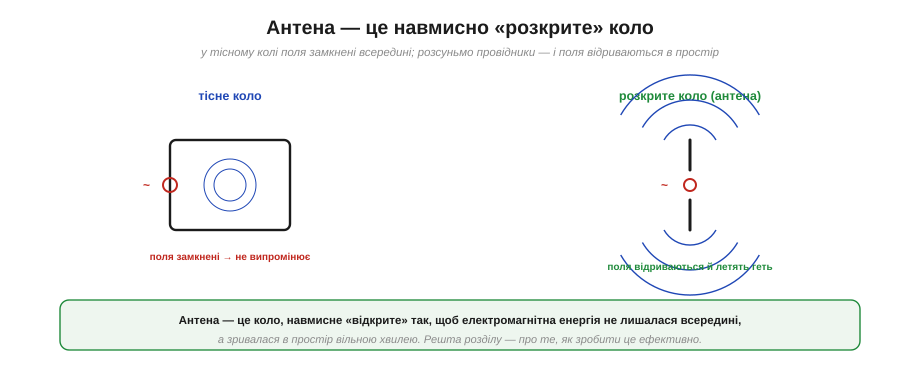
*Рис. 6.8.1.1. У тісному колі (ліворуч) електромагнітні поля «замкнені» поряд із провідниками й нікуди не діваються. А якщо провідники **розсунути** (праворуч), поля вже не мають куди замкнутися — вони відриваються від дроту й летять у простір вільною хвилею. Антена — це коло, навмисне розкрите так, щоб енергія тікала назовні.*

Секрет — у **геометрії**. У компактному колі (наприклад, у тісній петлі чи парі близьких дротів) поля двох сусідніх провідників майже **гасять** одне одного, і вся енергія лишається замкненою поряд. Але варто **розсунути** провідники, «розкрити» коло — і поля більше не компенсуються; вони відриваються від дроту й зриваються в простір. Грубо кажучи, **антена — це коло, навмисне відкрите так, щоб «протікати» енергією в простір**. Звичайне коло старанно тримає енергію всередині; антена — навпаки, старанно її випускає. Уся решта розділу — про те, як зробити це «протікання» якнайефективнішим.

### Трясемо заряди — народжується хвиля

Тепер придивімося, що відбувається в самому дроті антени. Згадаймо ключовий факт із §6.6.1: хвилю породжує **прискорений** заряд.

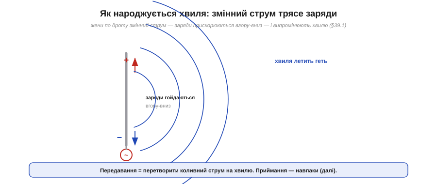
*Рис. 6.8.1.2. Передавач жене по антені **змінний** струм — і заряди в дроті гойдаються вгору-вниз, тобто весь час прискорюються (міняють напрям руху). А прискорений заряд, як ми знаємо з §6.6.1, випромінює електромагнітну хвилю, що відривається й летить геть.*

Механізм простий до краси. Передавач подає на антену **змінний** струм — мільйони чи мільярди разів на секунду він жене заряди то вгору, то вниз по дроту. А «гойдатися туди-сюди» означає **постійно прискорюватися** — заряд щоразу гальмує, спиняється й розганяється у зворотний бік. Саме це, як ми вивели в §6.6.1, і змушує заряд **випромінювати**: навколо нього народжується збурення полів, яке відривається й летить простором як хвиля. Тобто **передавання — це перетворення коливного струму на хвилю**, і вся «магія» антени зводиться до старого знайомого: трясеш заряди — родиться хвиля. Що сильніше й узгодженіше трясеш, то потужніша хвиля.

### Розподіл струму: півхвильовий диполь

Найкласичніша й найважливіша антена — **диполь** (*dipole*): два прямі провідники («плечі»), що живляться від передавача посередині. Подивімося, як по ньому розподіляється струм, — це багато що пояснює.

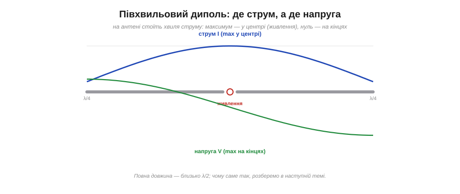
*Рис. 6.8.1.3. На півхвильовому диполі стоїть **хвиля струму**: він максимальний у центрі (де живлення) і спадає до нуля на кінцях плечей (зарядам нікуди далі бігти). Напруга — навпаки: нуль у центрі, максимум на кінцях. Повна довжина антени — близько λ/2.*

Поглянь на розподіл. **Струм** найбільший **у центрі**, біля точки живлення, і плавно спадає до **нуля на кінцях** — логічно, бо з кінця дроту зарядам уже нікуди текти. А **напруга** поводиться дзеркально: у центрі нуль, на кінцях — максимум. Тобто на антені стоїть справжня **стояча хвиля** струму й напруги, як у резонаторі. І ось важлива деталь, до якої ми ще повернемося: повна довжина такого диполя — приблизно **половина довжини хвилі** (λ/2), а кожне плече — чверть (λ/4). Чому саме стільки — це питання **резонансу**, і йому присвячено наступну тему; поки що просто запам'ятай цей зв'язок «довжина антени ↔ довжина хвилі».

### Антена як перетворювач

Корисно подивитися на антену як на **перетворювач** (*transducer*) — пристрій, що переводить енергію з однієї форми в іншу. Цей погляд робить її суть очевидною.

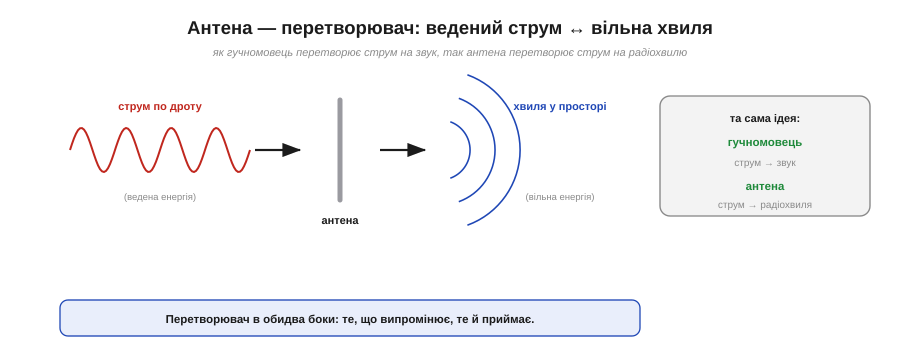
*Рис. 6.8.1.4. Антена стоїть на межі двох світів: з одного боку — **ведена** енергія (струм, замкнений у дроті), з іншого — **вільна** (хвиля у відкритому просторі). Антена перекладає одне в інше. Точно так само гучномовець перекладає електричний струм у звук.*

Аналогія з **гучномовцем** тут майже досконала. Гучномовець бере електричний сигнал (струм у котушці) і перетворює його на звукову хвилю в повітрі. Антена робить те саме, тільки на іншому «кінці» спектра: бере струм у дроті й перетворює на електромагнітну хвилю в просторі. В обох випадках це **перетворювач між веденою й вільною формою** хвилі. І, як і гучномовець (що, до речі, може працювати й мікрофоном), антена діє **в обидва боки** — про що зараз.

### Опір випромінювання: куди дівається потужність

Виникає природне питання: якщо передавач «віддає» в антену потужність, а вона кудись зникає (летить у простір), то як це виглядає **з боку передавача**? Відповідь — через гарне поняття **опору випромінювання**.

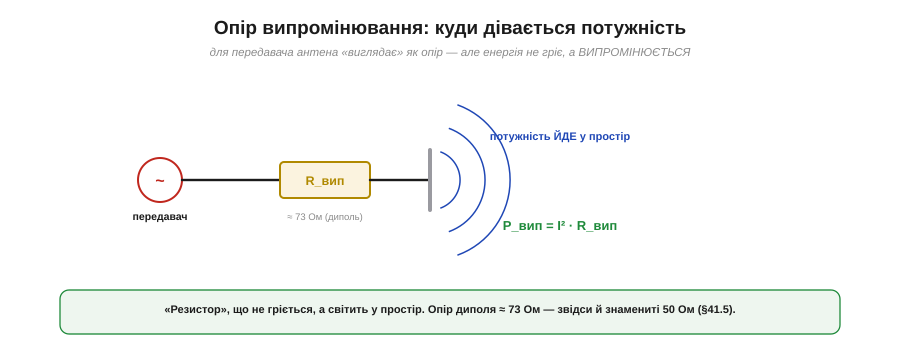
*Рис. 6.8.1.5. Для передавача антена «виглядає» як звичайний опір R_вип, що споживає потужність P = I²·R. Але — на відміну від резистора — ця потужність не перетворюється на тепло, а **випромінюється** у простір. Для півхвильового диполя R_вип ≈ 73 Ом.*

Ось у чому суть. Передавач «бачить» антену як **навантаження**, що споживає потужність, — тобто як певний **опір**. Його так і називають — **опір випромінювання** (*radiation resistance*), R_вип. Потужність, яку він «з'їдає», рахується звичною формулою P = I²·R_вип. Але вся хитрість у тому, що цей «резистор» **не гріється**: енергія йде не в тепло, а **в простір**, вільною хвилею. Це резистор, який світить.

**Приклад (потужність випромінювання диполя).** Для класичного півхвильового диполя опір випромінювання — близько **73 Ом**. Нехай по ньому тече струм 0.5 А:

```
P_вип = I² · R_вип = (0.5)² × 73 = 0.25 × 73 ≈ 18 Вт
```

Ці вісімнадцять ватів **залишають** антену хвилею. І запам'ятай число **73 Ом** — воно не випадкове: саме близькість опору антени до зручних значень дала нам знамениті **50 Ом** кабелів і роз'ємів, про які буде окрема, дуже практична розмова (§6.8.5).

### Взаємність: одна антена на два боки

Ми весь час говорили про **передавання**. А як же приймання? Відповідь чудова своєю простотою: **та сама антена** приймає точнісінько так само, як передає.

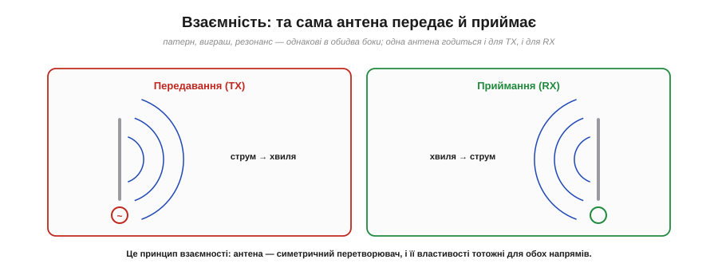
*Рис. 6.8.1.6. Передавання: струм трясе заряди — народжується хвиля. Приймання: хвиля з простору трясе заряди вже в **цій** антені — і наводить у ній струм. Процес дзеркальний, тож усі властивості антени (патерн, виграш, резонанс) однакові для обох напрямів — це принцип взаємності.*

Це називають **взаємністю** (*reciprocity*) — і це не випадковість, а глибока властивість. При прийманні все відбувається **навпаки**: хвиля, що прилетіла з простору, трясе заряди вже в приймальній антені — і наводить у ній слабкий струм, який ми підсилюємо. А оскільки фізика тут дзеркальна, то й **усі характеристики антени тотожні** для передавання й приймання: яка в неї діаграма спрямованості на передачу, така й на прийом; який виграш, така й чутливість; на якій частоті резонує — на тій однаково добре і шле, і ловить. Практичний висновок безцінний: **тобі потрібна лише одна антена** і для TX, і для RX, і досить вивчити її властивості один раз.

### Ближнє й дальнє поле

Останній штрих — невелике, але важливе уточнення про те, що саме «летить» від антени. Поле навколо неї неоднорідне.

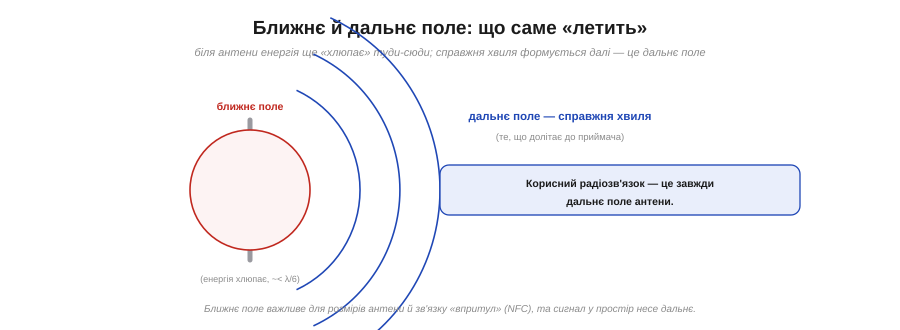
*Рис. 6.8.1.7. Зовсім близько до антени — **ближнє поле**: там енергія здебільшого «хлюпає» туди-сюди між антеною та простором, не відриваючись. Далі формується **дальнє поле** — справжня біжуча хвиля, що й долітає до приймача. Корисний радіозв'язок — це завжди дальнє поле.*

Безпосередньо біля антени живе **ближнє поле** (*near field*): тут енергія значною мірою **коливається туди-сюди** між антеною й простором, запасаючись і повертаючись, а не відлітаючи геть. І лише трохи далі формується **дальнє поле** (*far field*) — та сама самостійна біжуча хвиля з §6.6.1, що відірвалася й мчить до приймача. Для звичайного радіозв'язку важливе саме **дальнє** поле: воно несе сигнал на відстань. (Ближнє поле теж не безкорисне — на ньому працює, наприклад, зв'язок «впритул» NFC у безконтактних картках, — але туди ми зараз не йдемо.)

Отже, ми зрозуміли **що** робить антена: трясе заряди й перетворює струм на хвилю (і навпаки). Та лишилося ключове кількісне питання, яке ми двічі відклали: **якого розміру** має бути антена? Чому диполь — саме λ/2, а штир — λ/4? Чому антена для 2.4 ГГц — кілька сантиметрів, а для довгих хвиль — десятки метрів? Це питання **резонансу** — того самого явища, що ми вже зустрічали в коливальних контурах, — і саме з нього почнемо наступну тему.

---

## 6.8.2 Резонанс і довжина: чверть хвилі, диполь

У минулій темі ми побачили, що на антені стоїть **хвиля струму**, а повна довжина диполя — близько λ/2. Тепер з'ясуймо, **чому саме так**, — і це, мабуть, найпрактичніша річ у всьому розділі. Бо відповідь на питання «якої довжини робити антену» визначає геть усе: чи добиватиме твій передавач, чи влізе антена в корпус, чи не «глухий» твій приймач. А в основі лежить явище, яке ми вже добре знаємо з [Розділу 2.3](../../block-2-components-analog/ch09-rlc-resonance/ch09-rlc-resonance.md) — **резонанс**.

### Антена резонує, як струна

Найкраща інтуїція для антени — це **музичний інструмент**. Гітарна струна чи орга́нна труба звучать не на будь-якій частоті, а лише на **своїй**, резонансній, — тій, де хвиля рівно «вкладається» в довжину струни чи труби.

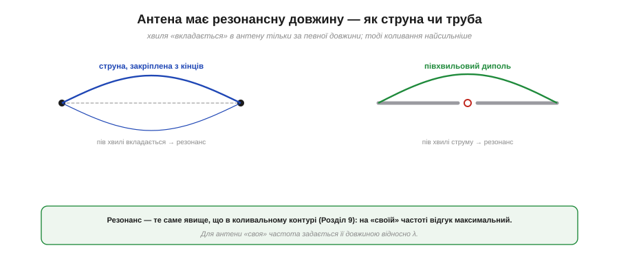
*Рис. 6.8.2.1. Струна, закріплена з кінців, найсильніше коливається, коли в неї вкладається ціле число півхвиль. Так само й антена: коли її довжина узгоджена з λ, хвиля струму «вкладається» ідеально — і антена резонує, віддаючи максимум енергії в простір. Це той самий резонанс, що в коливальному контурі (Розділ 2.3).*

Антена поводиться точнісінько так. Шматок дроту має **розподілену** ємність та індуктивність — і на певній частоті вони складаються в **резонанс**, як LC-контур із Розділу 2.3, тільки «розмазаний» уздовж дроту. На цій резонансній частоті відгук антени **максимальний**: хвиля струму ідеально вкладається в її довжину, заряди гойдаються найрозмашистіше, випромінювання найсильніше. А резонансна частота задається **довжиною антени відносно λ**. Тому питання «яка довжина» — це насправді питання «де резонанс».

### Півхвильовий диполь: реактивність зникає

Розгляньмо найважливіший випадок — **півхвильовий диполь**, повна довжина якого ≈ λ/2. Чому ця довжина особлива?


*Рис. 6.8.2.2. Коли довжина диполя ≈ λ/2, його розподілені ємність та індуктивність **гасять одна одну** — реактивність обертається на нуль. Передавач «бачить» уже не примхливе реактивне навантаження, а чистий **опір** ≈ 73 Ом, у який легко й ефективно віддавати потужність.*

Уся краса резонансу — у тому, що на ньому **реактивність зникає**. Поза резонансом антена «впирається»: вона виглядає для передавача або ємнісною, або індуктивною (має реактивний опір X ≠ 0), і віддати в неї потужність важко. А на резонансній довжині λ/2 ємнісна й індуктивна частини **точно компенсуються** — і передавач бачить **чистий активний опір**, той самий **опір випромінювання ≈ 73 Ом** із §6.8.1. У таке навантаження потужність ллється легко й майже без втрат. Ось чому λ/2 — «магічна» довжина диполя: на ній антена і резонує, і зручно живиться.

### Чвертьхвильовий штир: земля добудовує половину

Диполь чудовий, але має ваду — він довгий (цілих λ/2) і йому потрібні **два** плеча. Часто зручніше мати **один** короткий штир. І тут є геніальний хід — **чвертьхвильовий монополь** (штир λ/4) над **землею**.

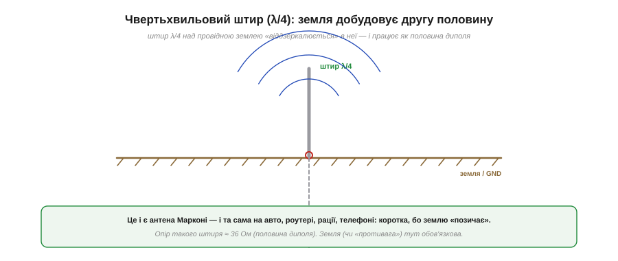
*Рис. 6.8.2.3. Вертикальний штир завдовжки лише λ/4 над провідною поверхнею «віддзеркалюється» в ній: земля створює **уявне зображення** другої чверті хвилі. Разом штир і його відображення працюють як повний півхвильовий диполь — але металу вдвічі менше.*

Хитрість — у **дзеркалі**. Провідна земля (чи металева «противага») відбиває поле штиря так, ніби під землею є його **дзеркальна копія**. Реальний штир λ/4 плюс уявне відображення λ/4 разом складають **повний диполь λ/2** — але фізично ти ставиш **удвічі коротшу** антену, бо другу половину «позичаєш» у землі. Це і є **антена Марконі** з історії розділу — і та сама, що стоїть на **автомобілі, роутері, рації, телефоні**: коротка вертикальна паличка над металевим корпусом-землею. Опір такого штиря — близько **36 Ом** (половина від 73). Важливо лише пам'ятати: штирю **обов'язково потрібна земля** чи противага — без неї «дзеркала» немає, і він працює погано.

### Розмір антени напряму залежить від частоти

Тепер найпрактичніше — числа. Раз довжина антени прив'язана до λ, а λ = c/f (§6.6.2), то **розмір антени прямо диктується частотою**.

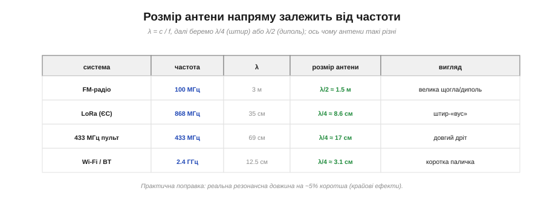
*Рис. 6.8.2.4. Та сама арифметика для різних систем: рахуємо λ = c/f, тоді λ/4 (штир) або λ/2 (диполь). FM на 100 МГц вимагає півтораметрового диполя, а Wi-Fi на 2.4 ГГц — лише трисантиметрової палички. Ось чому антени такі різні на вигляд.*

**Приклад (антена під свою частоту).** Порахуймо λ/4 для кількох знайомих систем (λ = c/f, c ≈ 3×10⁸ м/с):

```
FM 100 МГц : λ = 3 м      → λ/2 ≈ 1.5 м    (велика щогла)
433 МГц    : λ = 69 см    → λ/4 ≈ 17 см    (довгий «вус»)
Wi-Fi 2.4 ГГц: λ = 12.5 см → λ/4 ≈ 3.1 см  (коротка паличка)
```

Тепер зрозуміло, чому FM-антена на даху — велика, а Wi-Fi у телефоні — крихітна: усе диктує частота. Маленька практична поправка: реальна резонансна довжина виходить приблизно на **5% коротшою** за теоретичну (через крайові ефекти на кінцях дроту). Тому в довідниках для розрахунку штиря часто беруть не точне λ/4, а трохи менше — але для розуміння принципу нам досить «приблизно λ/4».

### Не та довжина — і антена «глухне»

А що, як зробити антену **неправильної** довжини? Тоді вона перестає резонувати — і це одразу б'є по ефективності.

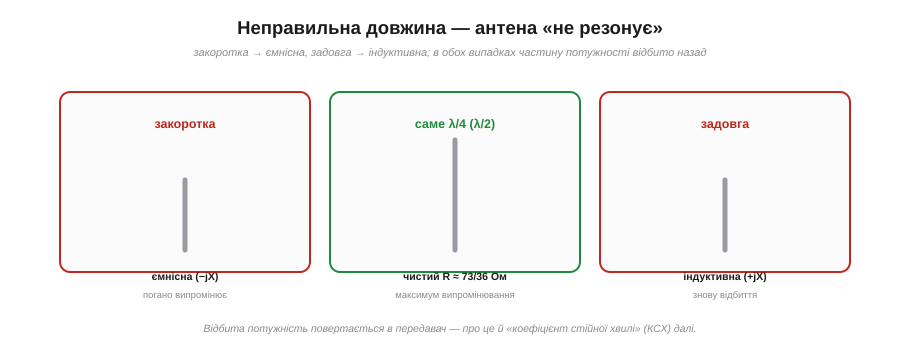
*Рис. 6.8.2.5. Закоротка антена стає **ємнісною**, задовга — **індуктивною**; в обох випадках з'являється реактивність, передавачу важко віддати потужність, і частину її **відбиває** назад. Лише на «своїй» довжині (λ/4 чи λ/2) опір чисто активний — і випромінювання максимальне.*

Поза резонансом антена знову набуває **реактивності**: закоротка поводиться як ємність, задовга — як індуктивність. Передавач уже не може віддати в неї всю потужність — частина енергії **відбивається назад** у кабель, замість того щоб полетіти в простір. Антена «глухне»: і випромінює слабше, і приймає гірше (взаємність, §6.8.1). Ця відбита потужність — окрема важлива тема: її міряють **коефіцієнтом стійної хвилі** (КСХ), і ми розберемо її в §6.8.6. Поки що запам'ятай практичне: **антена не тієї довжини — це майже завжди втрачені децибели бюджету** (§6.7.6).

### Коли λ/4 не влазить: електрично короткі антени

Буває, що повноцінну λ/4 **нема куди подіти**: на низькій частоті вона завелика, а пристрій крихітний (телефон, IoT-давач, брелок). Що робити? Тут інженери йдуть на компроміс — **електрично короткі** антени.

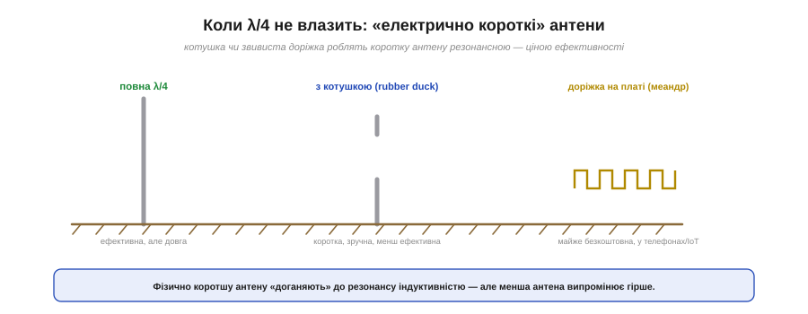
*Рис. 6.8.2.6. Фізично коротку антену «доганяють» до резонансу додатковою індуктивністю — котушкою біля основи (так зроблено в «гумовій качечці» роутера) або звивистою доріжкою-меандром на платі (телефони, IoT). Антена стає компактною — але платить за це **ефективністю**.*

Ідея проста: якщо антена закоротка й тому ємнісна, додамо їй **індуктивності**, щоб повернути в резонанс. На практиці це **котушка** біля основи — саме так влаштована знайома **«гумова качечка»** (*rubber duck*) на роутерах і раціях: усередині короткого гумового корпусу схована котушка, що робить його електрично рівним λ/4. Або **звивиста доріжка-меандр** прямо на платі — майже безкоштовна антена в кожному телефоні й IoT-пристрої. Розплата за компактність — **гірша ефективність**: маленька антена принципово випромінює слабше за повнорозмірну. Це чесний обмін «розмір ↔ ефективність», який варто усвідомлювати.

> 🔧 **Навіщо це.** Тепер у тебе є готове правило для будь-якого радіопроєкту. Перше: **порахуй λ/4** для своєї частоти (λ = c/f, поділи на 4) — це орієнтир розміру антени. Друге: якщо стільки **влазить** — чудово, зроби прямий штир чи диполь, він буде ефективний. Третє: якщо **не влазить** — бери готову «качечку» або PCB-антену, але знай, що втратиш частину дальності. І ніколи не чіпляй «який-небудь» шматок дроту навмання: антена не тієї довжини зведе нанівець навіть найкращий передавач. Розмір антени — це не дрібниця, а половина успіху радіолінії.

### Реальні антени — це все та сама λ/4 чи λ/2

Наостанок зведімо різноманіття антен до спільного знаменника.

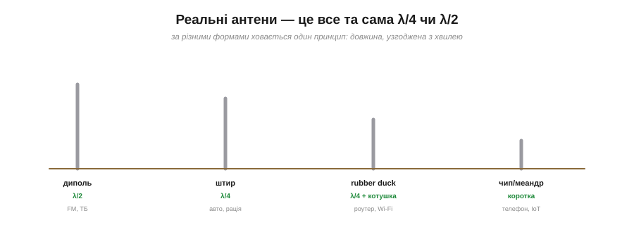
*Рис. 6.8.2.7. За різними формами — один принцип. Диполь (λ/2) у FM і ТБ; штир (λ/4) на авто й рації; «гумова качечка» (λ/4 з котушкою) на роутері; крихітна чип- чи меандр-антена (електрично коротка) у телефоні та IoT. Усе це — варіації на тему «довжина, узгоджена з хвилею».*

Хоч антени бувають геть різні на вигляд — від півтораметрового телевізійного диполя до міліметрової кераміки в телефоні, — за всіма ними стоїть **одна й та сама ідея резонансу**: довжина, узгоджена з довжиною хвилі. Диполь — λ/2, штир — λ/4, «качечка» — електрично доведена до λ/4 котушкою, чип-антена — мудро згорнута коротка. Побачивши будь-яку антену, тепер можна одразу прикинути: на яку приблизно частоту вона налаштована й чому має саме такий розмір.

Ми навчилися робити антену **резонансною** — щоб вона ефективно випромінювала. Та лишилося питання **куди** саме вона випромінює. Адже диполь світить не однаково навсібіч, а тарілка взагалі б'є вузьким променем. Чому одні антени всебічні, а інші — гостроспрямовані, що таке «підсилення» антени й до чого тут «діаграма спрямованості»? Це наступна тема.

---

## 6.8.3 Підсилення й діаграма спрямованості

Дотепер ми мовчки припускали, що антена випромінює **навсібіч однаково**. Це не так — і саме на цьому стоїть одна з найпотужніших можливостей радіоінженера. Жодна реальна антена не світить рівно в усі боки: вона завжди десь сильніша, десь слабша. А якщо навмисне **сконцентрувати** випромінювання у потрібний бік — можна різко збільшити дальність, не додавши ні вата потужності. Це й називають **підсиленням** антени, а карту «куди світить» — **діаграмою спрямованості**. Розберімо обидва поняття — і навчимося обирати між всебічною та спрямованою антеною.

### Куди світить антена: діаграма спрямованості

Почнімо з самого поняття. **Діаграма спрямованості** (*radiation pattern*) — це наче «карта яскравості» антени: вона показує, у яких напрямках антена випромінює сильно, а в яких — майже нічого.

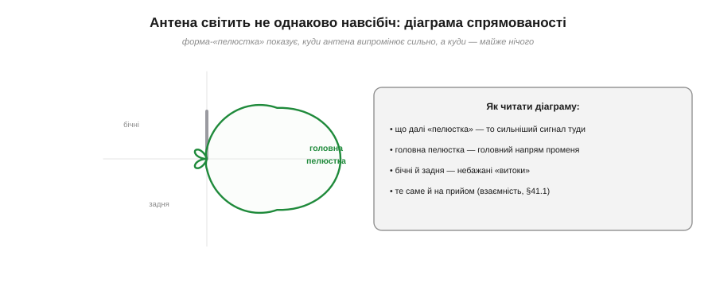
*Рис. 6.8.3.1. Діаграму малюють як «пелюстки»: чим далі контур від антени в якомусь напрямі, то сильніший туди сигнал. **Головна пелюстка** — основний промінь; **бічні** й **задня** — небажані «витоки» енергії не туди. За взаємністю (§6.8.1) ця сама карта діє й на прийом: де антена добре шле, там добре й чує.*

Читати її просто: дивишся, у який бік «пелюстка» витягнута найдалі, — туди й найсильніший сигнал. У спрямованої антени є виразна **головна пелюстка** (головний промінь) і дрібніші **бічні** та **задня** — паразитні напрями, куди трохи енергії все ж тікає. А завдяки взаємності (§6.8.1) ця діаграма однакова для передавання й приймання: антена найкраще **чує** з того ж напряму, у який найкраще **шле**. Тобто діаграма спрямованості — це повний «портрет» того, як антена взаємодіє з простором.

### Еталон і реальність: ізотропна антена та диполь

Щоб **виміряти** спрямованість числом, потрібен еталон. Ним служить уявна **ізотропна антена** (*isotropic*) — ідеальна точка, що світить абсолютно рівно навсібіч, ідеальною кулею.

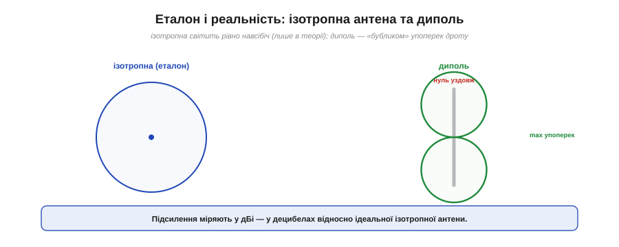
*Рис. 6.8.3.2. Ізотропна антена (ліворуч) — рівна куля випромінювання; вона існує лише в теорії, але служить **еталоном** (0 дБі). Реальний диполь (праворуч) світить «бубликом»: максимум — упоперек дроту, а **точно вздовж** дроту — нуль. Його підсилення — 2.15 дБі.*

Ізотропної антени насправді не існує — це математична зручність, **нульова точка відліку**. Саме від неї міряють підсилення: одиниця **дБі** (*dBi*) означає «децибели відносно ізотропної». Реальний **диполь** уже має форму: він випромінює «бубликом» (тором) — найсильніше **впоперек** дроту, а точно **вздовж** осі дроту в нього **нуль** (туди він не світить зовсім). У горизонтальній площині такий вертикальний диполь всебічний, а його підсилення відносно ізотропної — **2.15 дБі**. Це вже наш практичний еталон «звичайної» антени.

### Підсилення — це концентрація, а не зайва енергія

Тут чигає головна пастка розуміння. Слово «підсилення» наводить на думку, ніби антена якось **додає** потужності. Це **не так** — і важливо засвоїти чому.

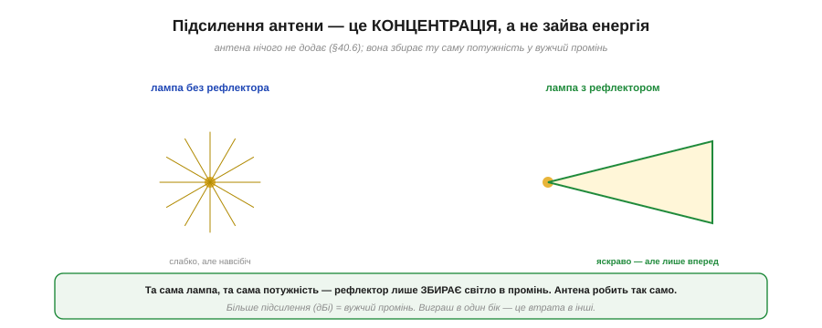
*Рис. 6.8.3.3. Лампа без рефлектора світить слабко, зате навсібіч. Той самий ліхтарик з **рефлектором** не став потужнішим — він лише **зібрав** те саме світло у промінь, який тепер яскравий, але вузький. Антена робить точнісінько те саме з радіохвилею: підсилення — це перерозподіл, а не додавання.*

Згадай EIRP із §6.7.6: антена **пасивна**, вона не виробляє енергії. Її «підсилення» — це чиста **концентрація**. Найкраща аналогія — **ліхтарик**: гола лампочка світить слабко в усі боки, а постав за нею рефлектор — і той самий вогник дає яскравий промінь уперед. Лампа не стала потужнішою — світло просто **зібрали** в один бік, забравши його з інших. Антена з підсиленням +12 дБі робить те саме з радіохвилею: у головному напрямі сигнал такий, ніби передавач у 16 разів потужніший, — але **ціною** того, що в бічні й задні напрями вона світить майже нічого. Виграш в один бік — це завжди втрата в інші; загальна потужність незмінна.

### Всебічна чи спрямована: головний вибір

Звідси випливає головне практичне рішення у виборі антени — між **всебічною** і **спрямованою**.

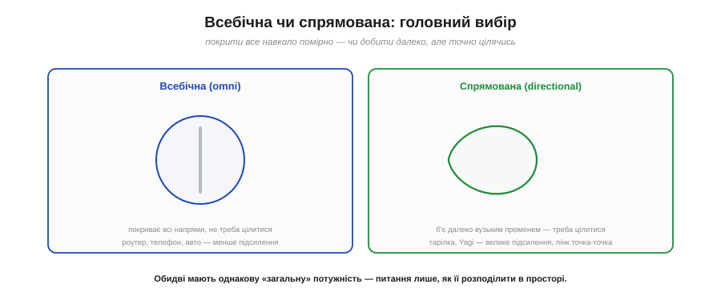
*Рис. 6.8.3.4. Всебічна (omni) антена покриває всі напрями помірно й не потребує наведення — добра для роутера, телефона, авто, але має мале підсилення. Спрямована (тарілка, Yagi) б'є далеко вузьким променем і дає велике підсилення — але її треба **точно навести** на кореспондента.*

Вибір — це компроміс. **Всебічна** (*omnidirectional*) антена — вертикальний штир чи диполь — покриває всі напрями навколо однаково (її «бублик»), тож працює, хоч як її поверни, і хоч де стоїть кореспондент. Це ідеал для **рухомого** й **багатоадресного** зв'язку: роутер, що роздає Wi-Fi на всю квартиру, телефон у кишені, рація в русі. Плата — **мале підсилення**, отже, менша дальність. **Спрямована** (*directional*) — тарілка, Yagi, панель — навпаки: концентрує все у вузький промінь, дає **велике підсилення** й величезну дальність, але вимагає **точного наведення** на партнера. Це ідеал для **стаціонарних** ліній «точка-точка»: радіорелейка між вежами, супутникова тарілка, дальній лінк між будівлями. Питання завжди одне: тобі треба покрити **все навколо** — чи добити **далеко в один бік**?

### Ширина променя: гострий промінь б'є далі

Підсилення й **ширина променя** (*beamwidth*) пов'язані жорстко: одне без іншого не буває.

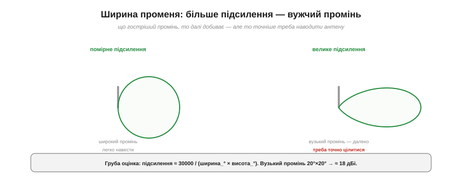
*Рис. 6.8.3.5. Помірне підсилення дає широкий промінь — легко навести, але дальність скромна. Велике підсилення дає вузький, гострий промінь — він добиває далеко, зате антену доводиться наводити дуже точно, бо «мимо» означає втрату зв'язку.*

Логіка проста: та сама потужність, зібрана у **вужчий** конус, дає в ньому сильніший сигнал — отже, більше підсилення завжди означає **гостріший промінь**. Це й корисно, і небезпечно: гострий промінь б'є далеко, але «промазати» повз кореспондента стає легко.

**Приклад (оцінка підсилення з ширини променя).** Існує груба, але корисна формула, що зв'язує підсилення з кутовими розмірами головної пелюстки (у градусах):

```
підсилення ≈ 30000 / (ширина° × висота°)
промінь 20° × 20° → 30000 / 400 ≈ 75 разів ≈ 18.7 дБі
промінь 6° × 6°   → 30000 / 36 ≈ 833 рази ≈ 29 дБі
```

Бачиш закономірність: щоб подвоїти підсилення, треба звузити промінь — а вузький промінь складніше націлити. Супутникова тарілка з її 30+ дБі має промінь у кілька градусів, і саме тому її так ретельно наводять на супутник.

### Підсилення працює на обидва боки

І ще одна радісна звістка з принципу взаємності (§6.8.1): підсилення антени допомагає **і на передачі, і на прийомі** — а отже, у лінії «точка-точка» воно рахується **двічі**.

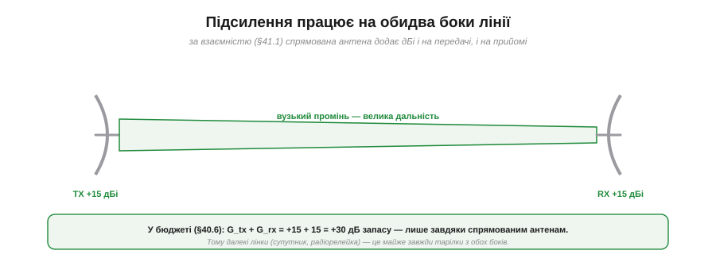
*Рис. 6.8.3.6. Спрямована антена на передавачі концентрує сигнал у промінь (+дБі), а така сама на приймачі краще «вловлює» саме з того напряму (ще +дБі). У бюджеті лінії (§6.7.6) обидва підсилення додаються: дві тарілки по +15 дБі дають +30 дБ запасу.*

Згадай бюджет радіолінії (§6.7.6): там підсилення антен **G_tx** і **G_rx** входили окремими «плюсами». Тепер ясно чому: спрямована антена на передавачі **посилає** сигнал у промінь, а така сама на приймачі краще **чує** з того ж напряму — і обидва виграші додаються. **Приклад:** дві тарілки по +15 дБі дають разом **+30 дБ** до бюджету — лише завдяки формі діаграми, без жодного зайвого вата! Саме тому всі далекі лінії — супутникові, радіорелейні, міжконтинентальні — це майже завжди **тарілки з обох боків**.

> 🔧 **Навіщо це.** Ось практичне правило вибору антени для будь-якого проєкту. Якщо твій пристрій **рухається** або має зв'язуватися з різних боків (дрон, що кружляє; роутер на всю кімнату; рація в русі) — бери **всебічну** антену й не мороч голову з наведенням. Якщо ж лінія **стаціонарна** й треба **дальність** (міст між двома будинками, прийом далекої станції, зв'язок із віддаленою базою) — бери **спрямовану** й точно наведи її; кожні +6 дБі підсилення подвоюють потужність у промені, тобто відчутно додають дальності (§6.6.6). А наведення — це серйозно: тарілку з вузьким променем «мимо» на кілька градусів — і зв'язку немає зовсім.

### Галерея: від всебічних до гостроспрямованих

Зведімо типи антен у єдиний ряд за підсиленням — щоб бачити весь спектр вибору.

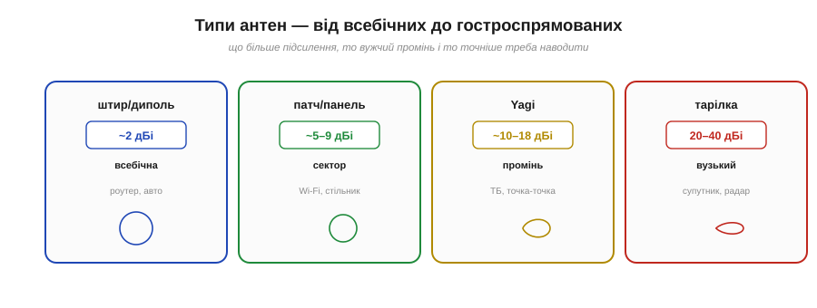
*Рис. 6.8.3.7. Штир чи диполь (~2 дБі) — всебічні, для роутера й авто. Патч-панель (~5–9 дБі) — секторні, для Wi-Fi і стільникових веж. Yagi (~10–18 дБі) — промінь, для ТБ й ліній точка-точка. Тарілка (20–40 дБі) — дуже вузький промінь, для супутників і радарів. Що більше підсилення — то гостріший промінь.*

Тепер увесь арсенал перед очима. **Штир/диполь** (~2 дБі) — всебічні, ставлять туди, де напрям невідомий. **Патч** і **панель** (~5–9 дБі) — покривають сектор, типові для Wi-Fi-точок і стільникових веж (звідси «сектори» на вишках). **Yagi** (~10–18 дБі) — та сама «риб'яча кістка» старих телевізійних антен, дає виразний промінь для ліній точка-точка. А **параболічна тарілка** (20–40 дБі) — чемпіон підсилення з гострющим променем, для супутникового зв'язку й радарів. Побачивши антену, тепер можна одразу прикинути і її підсилення, і ширину променя, і для чого вона.

Ми знаємо вже багато: антена перетворює струм на хвилю (§6.8.1), має резонансну довжину (§6.8.2) і свою діаграму спрямованості (ця тема). Але є ще одна, прихована властивість, від якої залежить, чи «почують» дві антени одна одну взагалі: **орієнтація** коливань хвилі в просторі. Якщо передавальна антена вертикальна, а приймальна — горизонтальна, сигнал може майже зникнути, навіть коли все інше ідеальне. Це **поляризація антени** — наступна тема.

---

## 6.8.4 Поляризація антени

Є прихована властивість антен, через яку два ідеально налаштовані, потужні, точно наведені пристрої можуть **не почути** одне одного зовсім. Звучить дивно — усе ж збігається: частота резонансна, антени спрямовані одна на одну, бюджет із запасом. А зв'язку немає. Винна — **поляризація**: орієнтація коливань хвилі в просторі. Якщо вона в передавача й приймача **не збігається**, сигнал тоне. Цю пастку треба знати в обличчя — і вміти її уникати.

### Орієнтація антени задає поляризацію

Згадаймо з §6.6.3: **поляризація** хвилі — це напрям, у якому коливається її електричне поле E. Так от, **орієнтація антени напряму задає поляризацію** випромінюваної хвилі.


*Рис. 6.8.4.1. Поле E коливається **вздовж дроту** антени. Вертикальна антена (ліворуч) випромінює хвилю з вертикальним полем E — **вертикальну** поляризацію. Горизонтальна (праворуч) — горизонтальну. Куди спрямований провід, така й поляризація.*

Логіка проста й випливає прямо з §6.8.1: заряди гойдаються **вздовж дроту**, тож і поле E, яке вони породжують, коливається в тому ж напрямку. Поставив антену **вертикально** — отримав хвилю з **вертикально** коливним полем (вертикальна поляризація). Поклав антену **горизонтально** — поле коливається горизонтально. Антена — це буквально «дороговказ» для поля E хвилі. І саме тому орієнтація антени — не дрібниця: вона визначає, як хвиля «повернута» в просторі.

### Передавач і приймач мусять збігатися

А тепер головне практичне: приймальна антена найкраще ловить хвилю, поляризація якої **збігається** з її власною орієнтацією.


*Рис. 6.8.4.2. Обидві антени вертикальні — повний сигнал. Обидві горизонтальні — теж повний. Але якщо одна вертикальна, а інша горизонтальна (**схрещені під 90°**) — приймач майже нічого не чує, хоч усе інше ідеальне. Поляризації мусять бути узгоджені.*

Правило таке. Якщо передавальна й приймальна антени орієнтовані **однаково** (обидві вертикальні або обидві горизонтальні), хвиля «лягає» на приймальну антену ідеально — повний сигнал. Але якщо вони **схрещені під прямим кутом** (одна вертикальна, інша горизонтальна), хвиля з вертикальним полем майже не наводить струму в горизонтальному дроті — сигнал **майже зникає**. Це називають **неузгодженням поляризації** (*polarization mismatch*), і воно здатне «вбити» лінію навіть із величезним запасом бюджету. Класична помилка-новачка: антени стоять правильно, потужність є, а зв'язку нема — бо хтось поклав один штир набік.

### Втрати від кута: закон cos²θ

Між «ідеально збігаються» і «схрещені під 90°» — ціла шкала. Втрати залежать від **кута θ** між поляризаціями за простим законом.


*Рис. 6.8.4.3. Частка потужності, що проходить, дорівнює cos²θ, де θ — кут між поляризаціями. За 0° проходить усе; за 45° — половина (−3 дБ); за 90° — теоретично нуль, а на практиці −20…−30 дБ, тобто фактично мертвий зв'язок.*

**Приклад (втрати неузгодження).** Частка потужності, що передається, — це cos²θ; переведімо в децибели:

```
θ = 0°  : cos²0  = 1.00   →   0 дБ   (ідеально)
θ = 30° : cos²30 = 0.75   →  −1.2 дБ (дрібниця)
θ = 45° : cos²45 = 0.50   →  −3 дБ   (половина)
θ = 60° : cos²60 = 0.25   →  −6 дБ
θ = 90° : cos²90 = 0      →  −∞      (мертво)
```

До ~30° неузгодження майже не шкодить (менше децибела), а от після 45° втрати ростуть лавиною. На практиці навіть «ідеально схрещені» 90° дають не математичний нуль, а близько **−20…−30 дБ** (через дрібні недосконалості) — але це однаково означає, що зв'язку фактично **немає**. Висновок простий: **узгоджуй поляризацію**, особливо в далеких лінках, де кожен децибел на рахунку.

### Чому ж телефон працює під будь-яким нахилом?

Тут уважний читач спіткнеться: якщо неузгодження таке згубне, чому телефон ловить Wi-Fi, **хоч як його повернути** — вертикально, набік, плазом? Адже антена в ньому крихітна й нахиляється разом із корпусом.

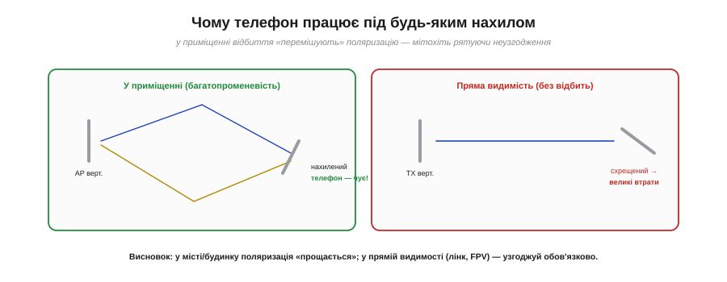
*Рис. 6.8.4.4. У приміщенні сигнал доходить **багатьма шляхами** (§6.7.7), і кожне відбиття трохи **повертає** поляризацію. Тож до нахиленого телефона долітає суміш усіх орієнтацій — і він чує. А от у чистій прямій видимості (далекий лінк, FPV) відбиттів нема — і неузгодження б'є на повну.*

Рятує **багатопроменевість** (§6.7.7). У кімнаті чи місті сигнал приходить не прямо, а через купу **відбить** від стін, меблів, будівель, — і кожне відбиття трохи **повертає** площину поляризації. У підсумку до приймача долітає **суміш** усіх можливих орієнтацій, і антена за будь-якого нахилу впіймає хоч якусь складову. Тобто відбиття мимоволі **«розмазують» поляризацію** й прощають неузгодження. Але — увага — це працює лише там, де є відбиття. У **прямій видимості** без перешкод (дальній лінк між вежами, FPV-відео з дрона у відкритому небі) суміші немає, і неузгодження поляризації знову стає вбивчим. Тому: у місті/будинку про поляризацію часто можна не думати, а у відкритих лінках — **узгоджуй обов'язково**.

### Колова поляризація: поле, що обертається

Є й елегантний спосіб **взагалі позбутися** проблеми орієнтації — **колова поляризація** (*circular polarization*).


*Рис. 6.8.4.5. Якщо скласти дві схрещені хвилі зі зсувом фази 90°, сумарний вектор поля E не коливається в одній площині, а **обертається** — описує гвинт уздовж напрямку руху, роблячи повний оберт за одну довжину хвилі. Залежно від напряму обертання це права (RHCP) або ліва (LHCP) колова поляризація.*

Звичайна (лінійна) поляризація — це коли поле E коливається в **одній** площині. А якщо взяти **дві** схрещені антени й живити їх зі зсувом фази 90° (або скрутити антену в **спіраль** — helix), сумарний вектор E почне **обертатися**, описуючи в просторі **гвинт**. За один період хвилі він робить повний оберт. Напрям обертання дає два різновиди: **права** (*right-hand*, RHCP) і **ліва** (*left-hand*, LHCP) колова поляризація. Хвиля більше не «прив'язана» до однієї площини — і це міняє все.

### Навіщо колова: байдужа до орієнтації

Чому колова поляризація така корисна? Бо вона знімає головний біль неузгодження.


*Рис. 6.8.4.6. Колова антена ловить лінійну під **будь-яким** кутом — завжди приблизно −3 дБ, без глибокого провалу. Відбиття **перевертає «руку»** (RHCP↔LHCP), тож антена відкидає віддзеркалені копії — плюс проти багатопроменевості. Тому колову беруть для GPS і супутників, де орієнтація постійно «гуляє».*

Переваг одразу три. **Перше — байдужість до орієнтації:** колова антена приймає лінійну хвилю однаково (≈ −3 дБ) під будь-яким кутом — без глибоких нулів. Половину потужності втрачаєш завжди, зате **ніколи не провалюєшся в нуль**. **Друге — відсікання відбить:** відбиття від поверхні **перевертає** напрям обертання (права стає лівою), а антена налаштована лише на «свою» руку — тож віддзеркалені копії вона **відкидає**, що допомагає проти багатопроменевості (§6.7.7). **Третє — повторне використання:** RHCP і LHCP взаємно «глухі», тож на одній частоті можна вести **дві** незалежні лінії з протилежними руками. Саме тому **GPS** працює на коловій (RHCP): супутники високо, постійно змінюють кут відносно тебе, і лінійна поляризація давала б нескінченні провали, а колова — ні.

> 🔧 **Навіщо це.** Запам'ятай одну річ, яка економить години марних мук: **якщо зв'язку немає, а все начебто правильно — перевір поляризацію.** Для **нерухомих** лінків «точка-точка» став обидві антени **однаково** (зазвичай вертикально) — це безкоштовні децибели. Для **рухомого** чи **обертового** — наприклад, FPV-камери на дроні, що раз у раз перекидається в маневрі, — бери **колову** антену (характерні «конюшинки» й «пагоди» на FPV — це саме вона), інакше відео «провалюватиметься» щоразу, як дрон ляже на крило. А для GPS-модуля колова RHCP-антена вже вбудована й розрахована — не став її «бочком». Поляризація — невидима, але цілком реальна половина успіху антенної лінії.

### Поляризація на практиці

Зведімо все в коротке правило вибору.


*Рис. 6.8.4.7. Фіксований лінк точка-точка — лінійна, узгоджена (обидві вертикальні чи горизонтальні). Міський/кімнатний зв'язок — лінійна, бо відбиття все одно перемішають. GPS і супутники — колова RHCP. FPV-дрон, що крутиться, — колова, щоб не «провалюватися» в маневрі.*

Отже, на практиці все зводиться до кількох випадків. **Нерухомий лінк** — узгоджена **лінійна** поляризація, і це найпростіший спосіб виграти децибели задарма. **Місто чи приміщення** — теж лінійна, бо багатопроменевість усе одно «перемішає». **GPS і супутники** — **колова** (RHCP), щоб орієнтація не мала значення. **Дрон, що маневрує** (FPV-відео) — теж **колова**, щоб зв'язок не зникав у віражах. Невидимий параметр, про який легко забути, — але саме він часто відрізняє лінк, що працює, від лінка, що мовчить.

Тепер ми вміємо багато: зробити антену резонансною, спрямованою й узгодженою за поляризацією. Та між передавачем і антеною є ще одна ланка, яку ми досі мовчки ігнорували, — **кабель**, що їх з'єднує. Здавалося б, дріт як дріт. Але на радіочастотах звичайний шматок дроту поводиться геть несподівано: він має власний «хвильовий опір», і якщо його не узгодити, частина дорогоцінного сигналу **відіб'ється** назад, так і не дійшовши до антени. Чому кабель має «опір» 50 Ом, що це взагалі означає й до чого тут хвилі — це тема **ліній передачі**, до якої переходимо.

---

## 6.8.5 Лінії передачі й хвильовий опір: чому 50 Ом

Ось, мабуть, найнесподіваніша річ у всій радіотехніці для новачка: на високих частотах **звичайний дріт перестає бути звичайним дротом**. Те, що в цифровій схемі було простим з'єднанням («тут сигнал, веди його туди»), на радіочастоті раптом набуває власного «опору» в 50 Ом, починає **відбивати** сигнал назад і вимагає спеціального проєктування. Зрозуміти, чому так, — означає зрозуміти **лінії передачі**, і це знання відрізняє того, хто змусить радіо працювати, від того, хто роками дивуватиметься, «чому не добиває».

### На радіочастотах дріт — це не просто з'єднання

Почнімо з суті дива. У звичайній (низькочастотній) схемі ми мовчки вважаємо, що в усьому дроті напруга **однакова** — він просто з'єднує точку А з точкою Б. І це правда, поки дріт **набагато коротший** за довжину хвилі сигналу.

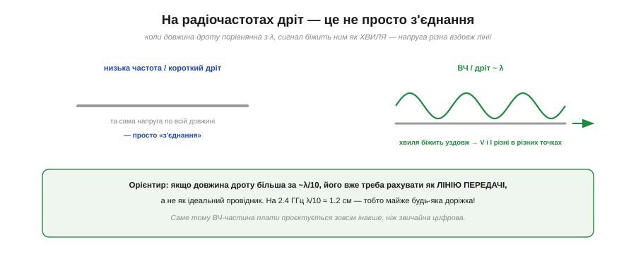
*Рис. 6.8.5.1. Низька частота / короткий дріт: напруга однакова по всій довжині — це просто «з'єднання». Радіочастота / дріт ~ λ: сигнал біжить дротом як **хвиля**, тож напруга й струм у різних точках різні. Орієнтир: якщо дріт довший за ~λ/10, його вже треба рахувати як **лінію передачі**.*

А тепер уяви, що частота така висока, що довжина хвилі **порівнянна з довжиною дроту**. Тоді, поки сигнал добігає до дальнього кінця, на ближньому він уже встиг кілька разів змінитися — і вздовж дроту встановлюється справжня **хвиля** напруги й струму: у різних точках різні значення. Дріт перестає бути «точкою з однаковим потенціалом» і стає **лінією передачі** (*transmission line*) — середовищем, яким сигнал біжить хвилею. Практичний орієнтир: щойно довжина провідника перевищує приблизно **λ/10**, його треба рахувати як лінію.

**Приклад (коли доріжка стає лінією).** Порахуймо λ/10 для Wi-Fi на 2.4 ГГц (λ = 12.5 см із §6.8.2):

```
λ/10 = 12.5 см / 10 ≈ 1.2 см
```

Лише **сантиметр з гаком**! Тобто майже **будь-яка** доріжка у ВЧ-частині плати вже є лінією передачі. Ось чому радіочастотний кутик плати проєктують зовсім інакше, ніж звичайну цифрову частину, — там кожна доріжка поводиться як хвилевід.

### Лінія передачі — це завжди два провідники

Важлива деталь: лінія передачі — це **завжди пара** провідників, прямий і зворотний, між якими й «їде» електромагнітне поле.

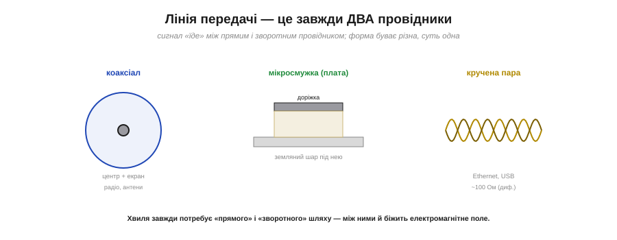
*Рис. 6.8.5.2. Форми різні, суть одна. **Коаксіал** — центральний провідник усередині екрана (радіо, антени). **Мікросмужка** — доріжка над суцільним земляним шаром плати. **Кручена пара** — два звиті дроти (Ethernet, USB). Скрізь — два провідники, між якими біжить хвиля.*

Сигнал не може бігти «одним дротом у нікуди» — йому потрібен **зворотний шлях**. Тому будь-яка лінія передачі — це два провідники: **коаксіальний кабель** (центральна жила всередині екрана-обплетення — класика радіо й антен), **мікросмужка** на платі (доріжка над суцільним **земляним шаром**), **кручена пара** (два звиті дроти — Ethernet, USB). Форма різна, але принцип однаковий: електромагнітна хвиля біжить **між** двома провідниками, у просторі поміж ними. Земляний шар під ВЧ-доріжкою — не «маса для галочки», а **повноцінна половина** лінії; без нього доріжка працювати не буде.

### Хвильовий опір Z₀: не резистор, а «характер» лінії

Тепер — головне нове поняття. У кожної лінії передачі є **хвильовий опір** Z₀ (*characteristic impedance*). І його легко неправильно зрозуміти, тож розберімо уважно.

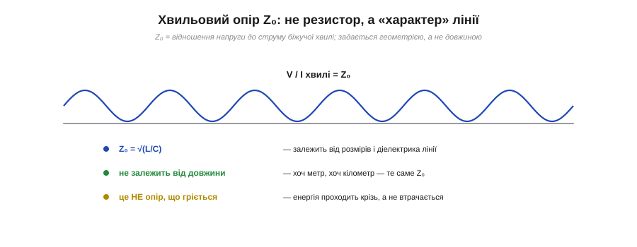
*Рис. 6.8.5.3. Z₀ — це відношення напруги до струму **біжучої хвилею** в лінії. Він задається геометрією лінії (Z₀ = √(L/C) — з розподілених індуктивності й ємності), не залежить від довжини й **не є опором, що гріється**: енергія проходить крізь лінію, а не втрачається в ній.*

Хвильовий опір — це **відношення напруги до струму** хвилі, що біжить лінією: Z₀ = V/I. Кілька важливих рис. По-перше, він задається **геометрією** лінії — розмірами провідників, відстанню між ними, діелектриком; формально Z₀ = √(L/C), де L і C — розподілені вздовж лінії індуктивність та ємність. По-друге — і це збиває з пантелику — він **не залежить від довжини**: хоч метровий кабель, хоч кілометровий, Z₀ той самий. По-третє, найважливіше: **це не звичайний опір**, що перетворює енергію на тепло (як резистор із Розділу 1.2). Z₀ — це характеристика **проходження** хвилі; енергія крізь узгоджену лінію **проходить наскрізь**, а не губиться. Це радше «природний темп», з яким лінія пропускає хвилю, ніж перешкода їй.

### Навіщо все це: узгодження проти відбиття

А тепер — заради чого вся ця морока. Хвильовий опір критичний через одне явище: **відбиття**.

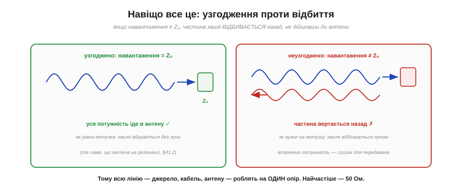
*Рис. 6.8.5.4. Якщо навантаження (антена) має опір рівно Z₀ — **узгоджено**: уся хвиля переходить у навантаження, як хвиля в рівну мотузку вбирається без луни. Якщо ж навантаження ≠ Z₀ — **неузгоджено**: частина хвилі **відбивається** назад, як від вузла на мотузці. Відбита потужність — це втрата й загроза передавачу.*

Ось механізм. Хвиля біжить лінією й добігає до **навантаження** — кінцевої антени. Якщо опір антени дорівнює Z₀ лінії, хвиля **повністю** переходить в антену — усе чудово, це **узгодження** (*matching*). Але якщо опір антени **не дорівнює** Z₀, частина хвилі **відбивається** й біжить **назад** до передавача. Чудова аналогія — **хвиля на мотузці**: якщо дальній кінець закріплено «правильно» (узгоджено), хвиля плавно вбирається без відлуння; а якщо там вузол чи вільний кінець — хвиля **відбивається** назад луною. Відбита потужність — подвійна біда: вона і **не дійшла** до антени (втрата дальності), і **повернулася** в передавач, де може його перегрівати чи псувати. Зверни увагу: це **той самий** механізм відбиття, що й за неправильної довжини антени (§6.8.2), тільки тепер причина — неузгоджений **кабель**. Звідси золоте правило: **уся лінія — джерело, кабель, антена — має бути на один опір**.

### Чому саме 50 Ом

І ось ми біля знаменитого числа. Чому стандарт радіотехніки — саме **50 Ом**? Відповідь не магічна, а інженерна: це **компроміс**.

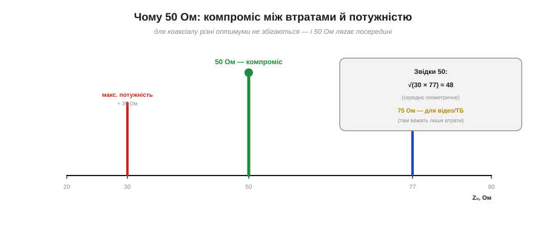
*Рис. 6.8.5.5. Для повітряного коаксіалу різні оптимуми лежать у різних місцях: найменші втрати — близько 77 Ом, найбільша потужність — близько 30 Ом. 50 Ом сідає між ними (≈ середнє геометричне √(30×77) ≈ 48), даючи і добру потужність, і прийнятні втрати. А 75 Ом — окремий стандарт для відео, де важать лише втрати.*

**Приклад (звідки взялося 50).** Для коаксіального кабеля різні параметри оптимізуються за **різного** Z₀:

```
найменші втрати сигналу  : Z₀ ≈ 77 Ом
найбільша потужність      : Z₀ ≈ 30 Ом
компроміс (середнє геом.) : √(30 × 77) ≈ 48 ≈ 50 Ом
```

Тобто **50 Ом** — це золота середина між «передавати з найменшими втратами» (77 Ом) і «витримувати найбільшу потужність» (30 Ом). Воно дає і пристойно низькі втрати, і добру потужність — універсальний вибір, що й став стандартом для радіо, антен, ВЧ-приладів. А для **відео й телебачення** прийняли **75 Ом** — бо там потужність мала (лише приймають сигнал), зате критичні саме низькі втрати, ближче до оптимуму 77 Ом. Жодної містики — чистий компроміс фізики й практики.

### Стандартні лінії — і де вони

Корисно знати «рідні» опори різних видів зв'язку, бо їх треба дотримуватися.

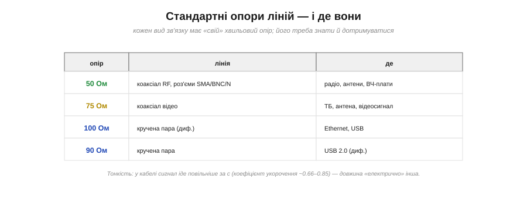
*Рис. 6.8.5.6. 50 Ом — коаксіал RF і роз'єми SMA/BNC/N (радіо, антени, ВЧ-плати). 75 Ом — відеокоаксіал (ТБ, антена). 100 Ом — кручена пара (Ethernet, USB). Тонкість: у кабелі сигнал біжить повільніше за c (коефіцієнт укорочення ~0.66–0.85), тож «електрична» довжина кабелю інша за фізичну.*

Запам'ятай головні: **50 Ом** — увесь радіочастотний світ (коаксіали, роз'єми SMA, BNC, N, ВЧ-доріжки); **75 Ом** — відео й ТБ; **100 Ом** (диференційно) — кручена пара в Ethernet і USB. І ще одна практична тонкість: у кабелі з діелектриком сигнал біжить **повільніше** за швидкість світла — типово в 0.66–0.85 раза (так званий **коефіцієнт укорочення**, *velocity factor*). Тому «електрична» довжина кабелю (у частках λ) **коротша** за фізичну — це важливо, коли довжина кабелю має значення (фазування антен, кратні λ/4 відрізки).

> 🔧 **Навіщо це.** Практичний висновок простий і залізний: **уся радіочастотна траса має бути на один опір — і це майже завжди 50 Ом.** Купуєш кабель — бери 50 Ω; роз'єми — SMA на 50 Ω; антена — на 50 Ω; ВЧ-доріжку на платі — проєктуй на 50 Ω. Якщо хоч одна ланка випадає (вставив «звичайний» дріт, узяв 75-омний кабель від телевізора, розвів доріжку «як вийде») — виникне неузгодження, частина сигналу відіб'ється, і ти втратиш децибели бюджету (§6.7.6), а потужний передавач можеш і спалити відбитою хвилею. ВЧ не прощає «який-небудь дріт»: тут навіть з'єднання — точно розрахована лінія.

### На платі: ВЧ-доріжка теж лінія на 50 Ом

Наостанок — як це виглядає на реальній друкованій платі, бо саме там ти, найімовірніше, зустрінеш лінії передачі вживу.

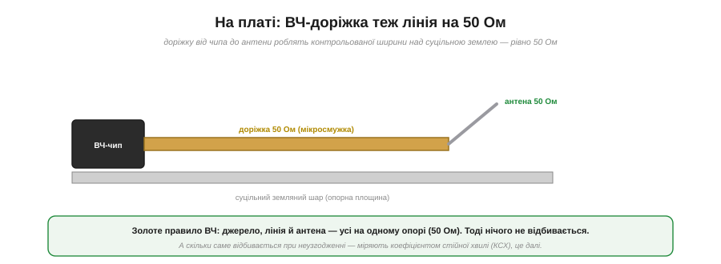
*Рис. 6.8.5.7. Доріжку від радіочастотного чипа до антени роблять **контрольованої ширини** над суцільним земляним шаром — так, щоб її хвильовий опір був рівно 50 Ом. Тоді джерело, лінія й антена узгоджені, і вся потужність доходить до антени без відбить.*

На платі ВЧ-сигнал від радіочипа (наприклад, того самого ESP32) до антени веде **мікросмужка** — доріжка точно розрахованої **ширини** над суцільним **земляним шаром**. Її геометрію підбирають так, щоб Z₀ вийшов рівно 50 Ом. Тоді чип (50 Ом), доріжка (50 Ом) і антена (50 Ом) **узгоджені** — і вся потужність доходить куди треба, без відбить. Саме тому в даташитах модулів так наполягають: «розведіть антенну доріжку як 50-омну мікросмужку, покладіть суцільну землю під нею». Тепер ти знаєш, що це не примха, а умова того, щоб радіо взагалі працювало.

Ми зрозуміли, **чому** буває відбиття — через неузгодження. Та лишилося навчитися його **міряти**: наскільки сильно лінія неузгоджена, скільки саме потужності відбивається назад і чи не загрожує це передавачу. Для цього є проста й дуже практична величина — **коефіцієнт стійної хвилі** (КСХ, англійською SWR). Що це таке, як його читати й чому неузгодженість шкідлива — наступна тема.

---

## 6.8.6 Відбиття й КСХ

У минулій темі ми з'ясували: якщо лінія й антена не узгоджені за опором, частина хвилі **відбивається** назад. Тепер навчимося це **вимірювати** числом і зрозуміємо, чим саме неузгодження загрожує. Головна величина тут — **КСХ** (коефіцієнт стійної хвилі; англійською *SWR*, standing wave ratio), і це, мабуть, найпрактичніший параметр антени, який ти бачитимеш на кожному антенному аналізаторі й у кожному даташиті. Навчитися його читати — означає вміти на місці сказати, працює антена добре чи її треба лагодити.

### Коефіцієнт відбиття: скільки хвилі вертається

Почнімо з первинної величини — **коефіцієнта відбиття** Γ (грецька «гамма»). Він прямо каже, **яка частка** хвилі відбивається від навантаження.

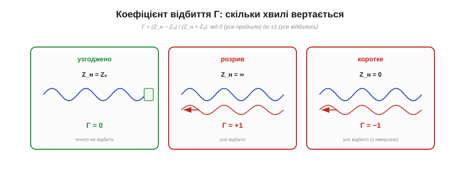
*Рис. 6.8.6.1. Γ = (Z_н − Z₀)/(Z_н + Z₀), де Z_н — опір навантаження. Узгоджено (Z_н = Z₀): Γ = 0, нічого не відбивається. Розрив (Z_н = ∞): Γ = +1, відбивається все. Коротке (Z_н = 0): Γ = −1, теж усе, але з інверсією. Модуль |Γ| змінюється від 0 (ідеал) до 1 (повне відбиття).*

Формула проста: Γ = (Z_н − Z₀)/(Z_н + Z₀), де Z_н — опір навантаження (антени), Z₀ — хвильовий опір лінії (§6.8.5). Розгляньмо крайнощі. Якщо опір антени **точно дорівнює** Z₀ — чисельник нуль, **Γ = 0**, відбиття немає, усе ідеально. Якщо на кінці **розрив** (нескінченний опір) — **Γ = +1**, уся хвиля відбивається. Якщо **коротке замикання** (нульовий опір) — **Γ = −1**, теж повне відбиття, тільки з перевертанням фази. Тобто **|Γ|** (модуль) пробігає від **0** (досконале узгодження) до **1** (повне відбиття). Це наш базовий «лічильник» неузгодження.

### Звідки «стояча хвиля»

Тепер — звідки в назві слова «стояча хвиля». Коли відбита хвиля біжить назад і **накладається** на пряму, що біжить уперед, вони складаються в особливий візерунок.


*Рис. 6.8.6.2. Пряма й відбита хвилі, складаючись, дають **стоячу хвилю**: візерунок із нерухомих **пучностей** (де напруга максимальна, V_max) і **вузлів** (де мінімальна, V_min). Що сильніше відбиття, то глибша «брижа» — то більша різниця між пучністю й вузлом.*

Дві хвилі, що біжать назустріч, інтерферують так, що вздовж лінії встановлюється **нерухомий** візерунок: у одних точках напруга завжди максимальна (**пучності**, V_max), в інших — завжди мінімальна (**вузли**, V_min). Цей візерунок не біжить, а «стоїть» — звідси й **стояча хвиля**. Ключове: що **більше** відбиття (більший |Γ|), то **глибша** ця брижа — то сильніше різняться V_max і V_min. А якщо відбиття немає зовсім (узгоджено), брижі теж немає: напруга вздовж лінії рівна. Отже, **глибина брижі — це міра неузгодження**. Її й вимірюють.

### КСХ: одне число про узгодження

**КСХ** — це і є відношення «глибини брижі»: наскільки пучність більша за вузол.

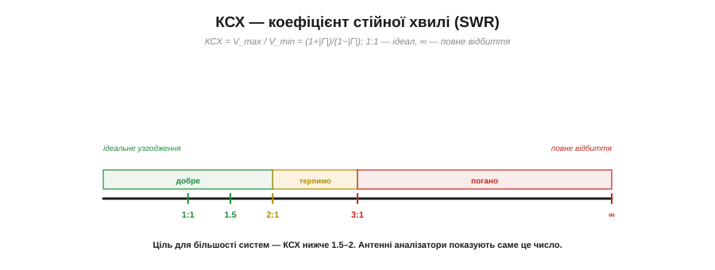
*Рис. 6.8.6.3. КСХ = V_max/V_min = (1+|Γ|)/(1−|Γ|). Шкала: 1:1 — досконале узгодження (брижі немає); 1.5–2:1 — добре/прийнятно; 3:1 і вище — погано; ∞ — повне відбиття (розрив або коротке). Ціль більшості систем — нижче 1.5–2.*

Формально **КСХ = V_max/V_min = (1+|Γ|)/(1−|Γ|)**. Це одне зручне число. **КСХ = 1:1** — пучність дорівнює вузлу, брижі немає, **досконале узгодження**. **КСХ = 2:1** — пучність удвічі вища за вузол, є помітне відбиття. **КСХ = ∞** — вузол нульовий (повне відбиття: розрив чи коротке). Чим **ближче до 1:1**, то краще. Практична ціль для більшості радіосистем — тримати КСХ **нижче 1.5 або 2**. Саме це число й показує антенний аналізатор, коли ти налаштовуєш антену: крутиш довжину — дивишся, як КСХ повзе до 1.

### Що означає число КСХ насправді

Перекладімо абстрактний КСХ у конкретику: скільки потужності втрачається й чи це страшно.


*Рис. 6.8.6.4. Переклад КСХ у відбиту потужність і втрати: 1.5:1 — 4% відбито (−0.18 дБ, відмінно); 2:1 — 11% (−0.5 дБ, прийнятно); 3:1 — 25% (−1.25 дБ, погано); 5:1 — 44% (дуже погано). Важлива тонкість: сама втрата на відбитті часто менша, ніж лякає назва.*

**Приклад (читаємо КСХ 2:1).** Порахуймо, що ховається за «двійкою». Спершу коефіцієнт відбиття: |Γ| = (КСХ−1)/(КСХ+1) = 1/3 ≈ 0.33. Відбита **потужність** — це |Γ|²:

```
|Γ|  = (2−1)/(2+1) = 0.33
відбито потужності = |Γ|² = 0.11  →  11%
дійшло до антени   = 89%   →  втрата ≈ −0.5 дБ
```

Зверни увагу на **несподіванку**: КСХ 2:1 звучить тривожно, а реальна втрата потужності — лише **пів децибела**! Навіть КСХ 3:1 з'їдає всього ~1.25 дБ. Тобто **сама по собі** втрата на відбитті за помірного КСХ — дрібниця в бюджеті (§6.7.6). Чому ж тоді всі так бояться високого КСХ? Бо головна біда — **не** у втраченій потужності.

### Чим насправді небезпечне неузгодження

Ось чесна й важлива розв'язка: справжня шкода неузгодження — не стільки у втраченій дальності, скільки в **загрозі передавачу**.

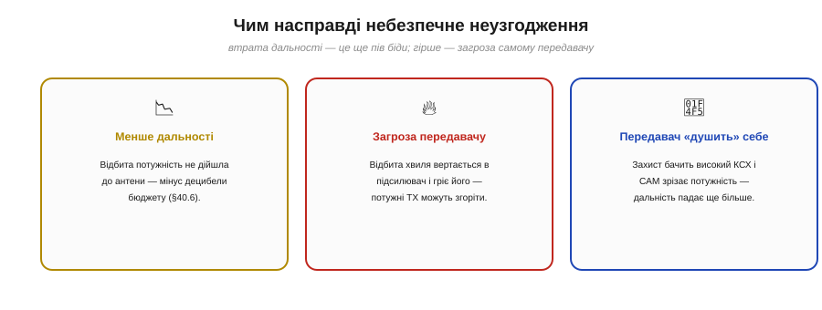
*Рис. 6.8.6.5. Три біди. Перша — менше дальності (відбита потужність не дійшла), але за помірного КСХ це дрібниця. Друга, головна — відбита хвиля **вертається в підсилювач** і гріє його; потужний передавач може згоріти. Третя — захист бачить високий КСХ і **сам** зрізає потужність, тож дальність падає ще дужче.*

Розкладімо по совісті. **Перше — втрата дальності:** так, частина потужності не дійшла до антени, але, як ми щойно порахували, за КСХ до 2 це лише пів децибела — не страшно. **Друге, найважливіше — загроза передавачу:** відбита хвиля **повертається** в підсилювач потужності й розсіюється **в ньому**, перегріваючи його. Для **потужних** передавачів високий КСХ — пряма дорога до згоряння вихідного каскаду. **Третє — самозахист:** саме тому в багатьох передавачах стоїть захист, який, побачивши високий КСХ, **сам зрізає** вихідну потужність (foldback) — і дальність падає вже не на пів децибела, а драматично. Тож правильний акцент: за помірного КСХ хвилюйся не так за втрачені децибели, як за **здоров'я передавача** й за те, що він може «придушити» себе сам.

### Як виміряти узгодження

На щастя, КСХ легко **виміряти** — і це роблять простими приладами.

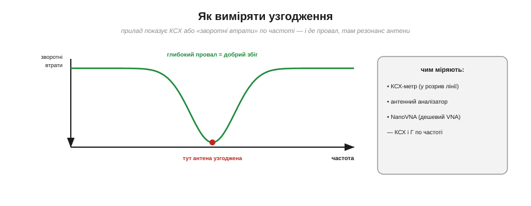
*Рис. 6.8.6.6. Прилад показує КСХ (або «зворотні втрати») залежно від частоти. Де на графіку **глибокий провал** — там антена найкраще узгоджена, тобто резонує. Інструменти: КСХ-метр (вмикають у розрив лінії), антенний аналізатор і дешевий **NanoVNA**, що малює Γ і КСХ по всьому діапазону.*

Найпростіший прилад — **КСХ-метр**: вмикаєш його в розрив між передавачем і антеною, і він показує поточний КСХ. Зручніший — **антенний аналізатор** або дешевий **NanoVNA** (векторний аналізатор за ціну вечері), що малює КСХ чи «зворотні втрати» (*return loss*) **по всьому діапазону** частот. На такому графіку шукають **глибокий провал**: там, де зворотні втрати найбільші (КСХ найближчий до 1), антена **резонує** й найкраще узгоджена. Підлаштовуючи антену, ти «заганяєш» цей провал точно на свою робочу частоту. Це найпряміший спосіб налаштувати антену — не наосліп, а **бачачи** результат.

> 🔧 **Навіщо це.** Якщо ти будуєш радіопристрій із власною антеною, **виміряй КСХ** — це найшвидший спосіб перевірити, чи вона взагалі працює. Дешевий NanoVNA показує провал зворотних втрат; якщо провал стоїть на твоїй частоті й КСХ там нижче ~1.5–2 — антена налаштована, можна паяти далі. Якщо провал «з'їхав» убік або КСХ високий — антена не на ту довжину чи погано узгоджена, і її треба лагодити (далі). І пам'ятай головне: навіть якщо втрата на відбитті здається малою, **захисти передавач** — не ганяй потужний TX на велике неузгодження чи взагалі без антени (це КСХ = ∞!), бо спалиш вихідний каскад.

### Як полагодити неузгодження

І нарешті — що робити, якщо КСХ високий.

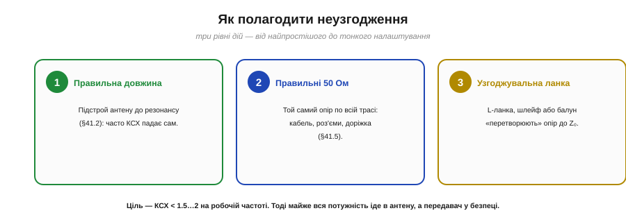
*Рис. 6.8.6.7. Три рівні дій. (1) **Правильна довжина** — підстрой антену до резонансу (§6.8.2), часто цього досить. (2) **Правильні 50 Ом** — один опір по всій трасі: кабель, роз'єми, доріжка (§6.8.5). (3) **Узгоджувальна ланка** — L-ланка, шлейф чи балун «перетворюють» опір антени до Z₀.*

Дій у три кроки, від простого до тонкого. **Перше — довжина:** найчастіша причина високого КСХ — антена не на резонансній довжині; підстрой її до λ/4 чи λ/2 (§6.8.2), і КСХ часто падає сам собою. **Друге — траса 50 Ом:** переконайся, що **вся** лінія на одному опорі — кабель, роз'єми, доріжка (§6.8.5); один «не той» кабель псує все. **Третє — узгоджувальна ланка** (*matching network*): якщо опір антени принципово не 50 Ом (як часто буває в компактних і PCB-антен), між нею й лінією ставлять невелику схему — **L-ланку** з котушки й конденсатора, **шлейф** (*stub*) або **балун** — яка математично «перетворює» опір антени до потрібних 50 Ом. Ціль усіх трьох — загнати КСХ нижче **1.5–2** на робочій частоті; тоді майже вся потужність іде в антену, а передавач у безпеці.

Ми пройшли всю фізику антен: як вони перетворюють струм на хвилю, чому мають резонансну довжину, як спрямовують і поляризують сигнал, навіщо 50 Ом і що таке КСХ. Лишилося звести це в **практичну навичку**: коли тобі до рук потрапляє чужа плата з радіо — модуль ESP32, приймач, передавач, — на що в її **ВЧ-частині** дивитися, що там можна впізнати й де типові помилки? Це остання тема розділу — **читання ВЧ-частини плати**, місток від теорії до реального заліза.

---

## 6.8.7 На що дивитись у ВЧ-частині чужої плати

Уся теорія цього розділу набуває справжньої цінності тоді, коли ти береш до рук **реальну плату** з радіо — модуль ESP32, приймач, RC-апаратуру, давач — і **розумієш**, що там до чого. Радіочастотна частина має впізнаваний «почерк»: ті самі блоки, ті самі деталі, ті самі типові помилки, хоч би хто плату робив. Навчитися читати цей почерк — означає за хвилину сказати, чи спроєктовано радіо грамотно, де антена, чому вона погано працює і чи можна щось виправити. Це остання, найпрактичніша тема розділу — і вона спирається на навичку **читання схем** із [Розділу 1.6](../../block-1-circuits-physics/ch06-schematics/ch06-schematics.md).

### ВЧ-тракт: один і той самий ланцюг

Перше, що варто закарбувати: майже **в кожному** радіомодулі ВЧ-сигнал проходить **той самий ланцюг** блоків. Упізнаєш його — упізнаєш будь-яку плату.

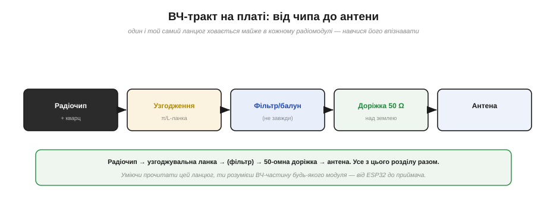
*Рис. 6.8.7.1. Стандартний ланцюг: **радіочип** (з кварцом поряд) → **узгоджувальна π/L-ланка** → інколи **фільтр/балун** → **50-омна доріжка** → **антена**. Це буквально всі теми розділу, вишикувані в ряд на платі.*

Розклад завжди приблизно однаковий. **Радіочип** (трансивер — ESP32, nRF24, CC1101 тощо) із обов'язковим **кварцом** поряд, що задає точну частоту. Далі — **узгоджувальна ланка** (§6.8.6), маленький кущик деталей. Інколи — **фільтр** (давить гармоніки) або **балун**. Потім — **50-омна доріжка** (§6.8.5), що веде до **антени**. Знаючи цей ланцюг, ти орієнтуєшся в будь-якому модулі: очима проходиш від чипа до краю плати й «читаєш» кожну ланку. Усе, що ми вивчали нарізно, тут лежить разом, як намисто.

### Три типи антен, які ти побачиш

Найперше, що варто впізнати на платі, — **яка там антена**. Варіантів практично три.


*Рис. 6.8.7.2. **Доріжка на платі** (PCB-антена) — звивистий «меандр» або «літера F» (IFA): дешево й вбудовано. **Чип-антена** — маленький білий/сірий керамічний прямокутник на краю. **Роз'єм** (U.FL або SMA) — для зовнішньої антени; кабель до неї вже 50-омний.*

Розпізнати легко. **PCB-антена** — це характерна **звивиста доріжка** (меандр) або Г-подібна «літера F» (*inverted-F*, IFA) прямо на краю плати; найдешевший варіант, що ми бачили в §6.8.2. **Чип-антена** — крихітний **керамічний** прямокутник (зазвичай білий чи сірий) на краю, схожий на велику деталь; компактна, трохи дорожча. **Роз'єм** — мініатюрний **U.FL** (для тонкого коаксіалу) або більший **SMA** (під накрутну антену) — означає, що пристрій працює із **зовнішньою** антеною, а сам кабель до неї вже 50-омний (§6.8.5). Часто на платі є **і** PCB-антена, **і** місце під U.FL — з перемичкою, якою обирають, котру задіяти.

### Загадковий «кущик» біля антени

Між чипом і антеною майже завжди тулиться **кущик** із двох-трьох крихітних деталей. Новачка він спантеличує — а це і є **узгоджувальна ланка**.


*Рис. 6.8.7.3. Типова **π-ланка**: shunt-конденсатор → послідовна котушка → shunt-конденсатор. Ці 2–3 деталі «перетворюють» опір антени до 50 Ом, заганяючи КСХ до 1 (§6.8.6). Часто бачиш три посадкові місця, але впаяні не всі — зайві позначені «DNP» (не встановлювати).*

Це та сама **узгоджувальна ланка** з §6.8.6: маленька схема з котушок (L) і конденсаторів (C), що математично зводить опір антени до потрібних 50 Ом. Найтиповіша форма — **π-ланка** (shunt-C, series-L, shunt-C). Корисно знати дві речі. По-перше, ці деталі **крихітні** (типорозмір 0402 чи навіть 0201) і їх легко проґавити — але саме від них залежить узгодження. По-друге, виробники часто розводять **три** посадкові місця «про запас», а впаюють лише потрібні; невстановлені позначають **DNP** (*do not populate*). Тож якщо бачиш порожні майданчики в кущику — це не брак, а нормальна гнучкість конструкції.

### Головне правило: під антеною — порожньо

Якщо запам'ятати з цієї теми **лише одне** — хай це буде воно. PCB-антена **не випромінює**, якщо під нею є мідь чи земля.


*Рис. 6.8.7.4. Земляний полігон має бути **скрізь, де треба** (опора для мікросмужки), але **під антеною й навколо неї — чиста «заборонена зона»** (keep-out): жодної міді, жодної землі, жодних доріжок. Антену завжди виносять **на край** плати. Земля під PCB-антеною — найчастіша й найгірша помилка.*

Чому так? Земля під антеною **закорочує** її поле й «з'їдає» випромінювання — антена глухне. Тому навколо PCB-антени завжди лишають **заборонену зону** (*keep-out*): прямокутник, де немає **нічого** — ні землі, ні доріжок, ні компонентів. І саму антену завжди виносять **на край** плати, подалі від металу. Це правило №1 ВЧ-розведення, і саме його найчастіше порушують новачки: розливають суцільну землю «для надійності» по всій платі — і вбивають антену. Побачив мідь під меандром антени — майже напевно знайшов причину поганого зв'язку.

### Як ця ж сама частина виглядає на схемі

А тепер пов'яжімо плату зі **схемою** — навичкою з Розділу 1.6. Ті самі блоки на схемі мають упізнавані символи.

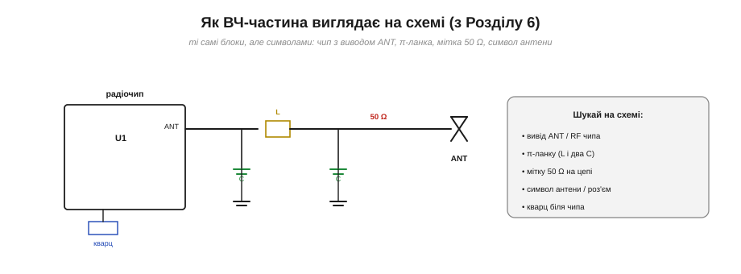
*Рис. 6.8.7.5. На схемі шукай: вивід **ANT** (або RF) радіочипа; **кварц** біля чипа; **π-ланку** із символів котушки й двох конденсаторів на землю; мітку **50 Ω** на ВЧ-колі; і символ **антени** (або роз'єм U.FL/SMA) на кінці.*

Читаючи схему радіомодуля (Розділ 1.6), веди оком той самий ланцюг. Знайди **радіочип** і його вивід **ANT** чи **RF**; поряд — **кварц** (символ із двох рисок). Від виводу ANT іде ВЧ-коло, часто з міткою **«50 Ω»**, а на ньому — **π-ланка**: послідовна котушка (L) і два конденсатори (C) на землю. Закінчується все символом **антени** (трикутник/«вусики») або **роз'ємом**. Уміючи зіставити схему з платою, ти розумієш ВЧ-вузол повністю: де сигнал, як його узгоджують, куди він іде. Це і є практичне злиття Розділу 1.6 (схеми) з цим розділом (антени).

### Червоні прапорці

Корисно мати в голові список **тривожних ознак** — побачив таке, і одразу ясно: радіо тут зроблено абияк.


*Рис. 6.8.7.6. Шість найчастіших гріхів: земля під PCB-антеною; довга звивиста доріжка до антени (з вигинами й перехідними); антена впритул до металу чи батареї; відсутність суцільної землі під мікросмужкою; «чужий» кабель замість 50-омного; антена, затиснута в центрі плати між компонентами.*

Перебери їх по пам'яті, коли тримаєш плату. **Земля під антеною** — головний гріх (щойно розібрали). **Довга, звивиста доріжка** до антени з вигинами й перехідними отворами — кожен злам і vias псує 50-омну лінію (§6.8.5). **Антена біля металу чи батареї** — метал розладнує її й глушить. **Немає суцільної землі** під мікросмужкою — лінія передачі без опори не тримає 50 Ом. **«Чужий» кабель** (75-омний від ТБ або просто «дріт») замість 50-омного коаксіалу — гарантоване неузгодження. **Антена в центрі** плати, затиснута компонентами, замість виносу на край. Кожен прапорець — це втрачені децибели або зовсім непрацездатне радіо.

> 🔧 **Навіщо це.** Ця навичка — твій «рентген» для будь-якого радіопристрою, свого чи чужого. Коли модуль погано зв'язується, не кидайся міняти чип — спершу **подивись на антену**: який тип, чи вільно під нею, чи коротка й пряма доріжка, чи на місці узгоджувальний кущик, чи суцільна земля під мікросмужкою. Дев'ять разів із десяти проблема саме тут, а не в «слабкому передавачі». А якщо проєктуєш сам — тримай напохваті чеклист (нижче), винось антену на край, лишай keep-out і веди 50-омну доріжку коротко й прямо. Це найдешевший спосіб не зіпсувати радіо ще до того, як воно ввімкнулося.

### Чеклист огляду за хвилину

Зведімо весь розділ в одну практичну перевірку.


*Рис. 6.8.7.7. Вісім пунктів: радіочип і кварц поряд; тип антени (PCB/чип/роз'єм); коротка пряма 50-омна доріжка; узгоджувальна π/L-ланка; порожня заборонена зона під антеною; суцільна земля під мікросмужкою; екран-кришка над ВЧ-вузлом; чисте живлення чипа (ферит + конденсатори).*

Пройдися цими вісьмома пунктами — і ти оглянув ВЧ-частину професійно. Знайди **радіочип і кварц**; визнач **тип антени**; перевір, що **доріжка** до неї коротка, пряма й 50-омна; знайди **узгоджувальну ланку**; переконайся, що під антеною **порожньо** (keep-out); що під мікросмужкою **суцільна земля**; пошукай **екран-кришку** над ВЧ-вузлом (металева коробочка, що захищає від завад); і перевір **чисте живлення** чипа (ферит + конденсатори, бо радіо чутливе до шуму по живленню). Вісім поглядів — і повна картина.

---

Підсумуймо Розділ 6.8. Ми відкрили «чорну скриньку» антени й розклали її повністю: як вона **перетворює струм на хвилю** (§6.8.1); чому має **резонансну довжину** λ/4 чи λ/2 (§6.8.2); як **спрямовує** випромінювання й що таке підсилення (§6.8.3); чому критична **поляризація** (§6.8.4); як влаштовані **лінії передачі** й звідки 50 Ом (§6.8.5); що таке **КСХ** і чому неузгодження шкодить (§6.8.6); і нарешті — як **читати ВЧ-частину** реальної плати (§6.8.7). Тепер антена для тебе — не загадковий шматок металу, а зрозумілий, розрахований перетворювач, у якому видно кожну деталь.

На цьому фізика радіо завершена. Ми пройшли довгий шлях: від електромагнітної хвилі (Розділ 6.6) через модуляцію й бюджет лінії (Розділ 6.7) до антен (Розділ 6.8). Лишився останній крок — **застосувати** все це в реальній системі. Як радіо керує дроном і шле телеметрію назад? Що таке RC-канали, air/ground-модулі, і чому затримка тут критична? Як влаштований **MAVLink** — мова, якою «розмовляють» автопілоти, — і як читати його потік та слати команди з власного коду? Це тема фінального розділу Модуля 6 — **радіозв'язок системи: керування, телеметрія, MAVLink**, де вся фізика радіо нарешті стає робочим інструментом.

> ▶️ Далі: [Розділ 6.9 — Радіозв'язок системи: керування, телеметрія, MAVLink](../ch42-telemetry-mavlink/ch42-telemetry-mavlink.md)
