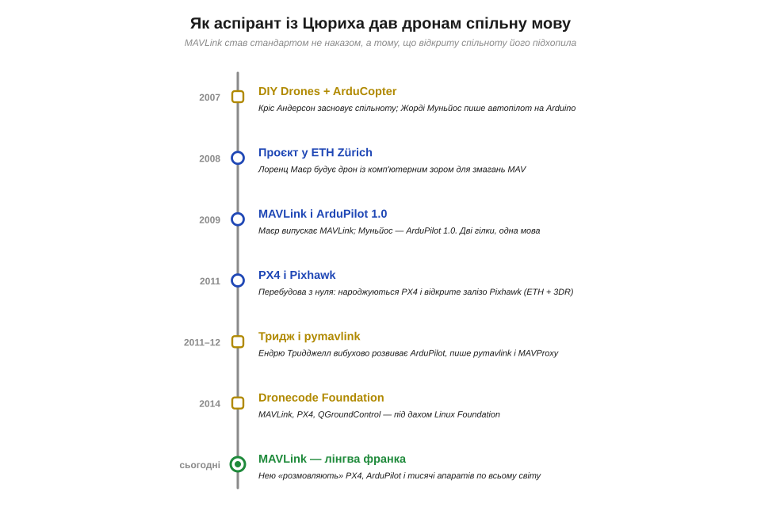
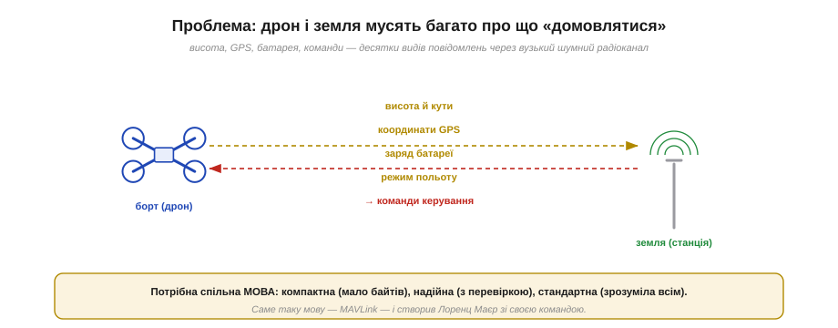
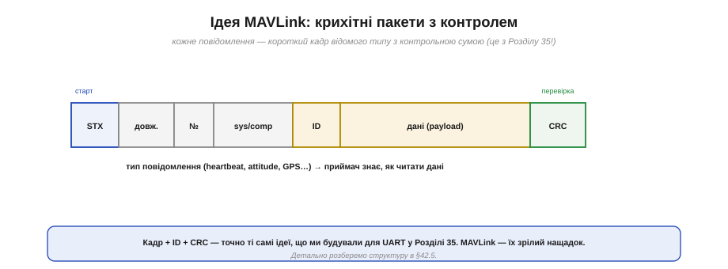
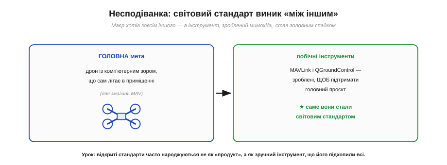
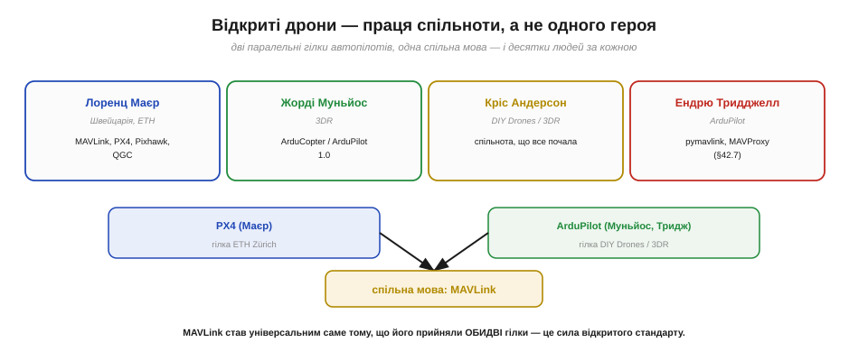
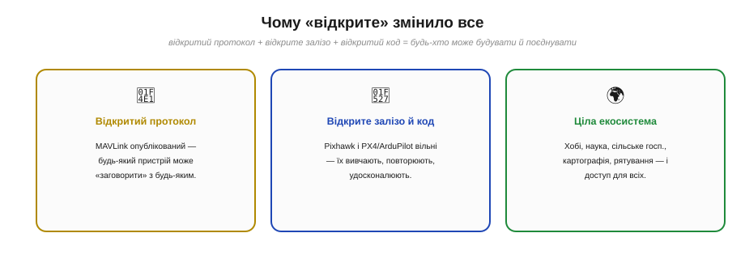
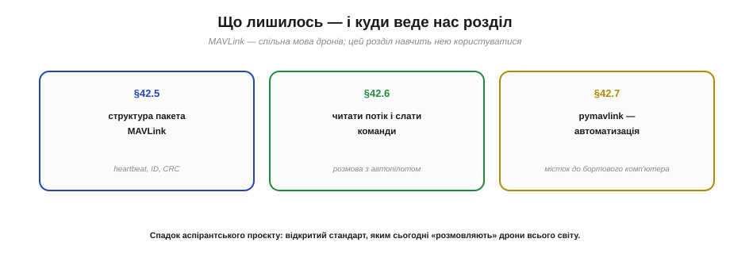

📜 *Історична вставка до [Розділу 42 — Радіозв'язок системи: керування, телеметрія, MAVLink](ch42-telemetry-mavlink.md).*

# Історія: MAVLink і відкриті дрони — як аспірант із Цюриха задав стандарт

Сьогодні майже кожен дрон у світі — від саморобного квадрокоптера до професійного картографічного апарата — «розмовляє» однією мовою. Коли наземна станція показує висоту, заряд батареї й координати дрона, а ти надсилаєш йому команду «лети туди» — усе це йде протоколом **MAVLink**. І народився цей всесвітній стандарт не в лабораторії корпорації й не за наказом комітету, а як **побічний інструмент** студентського проєкту швейцарського аспіранта **Лоренца Маєра** (*Lorenz Meier*) у Цюрихському ETH. Він хотів зробити дрон, що сам літає, — а заодно мимохідь дав усім дронам спільну мову.

Ця історія завершує наш модуль, і вона варта розповіді з двох причин. **Перша — пряма:** MAVLink і є головна тема цього розділу, тож знати, звідки він узявся, — найкращий вступ до того, як ним користуватися. **Друга — глибша:** це взірцевий приклад **колективного, відкритого** винаходу. За «дронною революцією» стоїть не один геній, а ціла **спільнота** — швейцарські, американські, мексиканські, австралійські інженери, дві паралельні гілки автопілотів і тисячі ентузіастів. Розплутати, хто що зробив, і побачити, **як** відкритий стандарт завойовує світ, — корисний урок наостанок.

*Рис. 42.0.1. Дві гілки, одна мова: 2007 — Кріс Андерсон засновує спільноту DIY Drones, Жорді Муньйос пише автопілот на Arduino; 2008 — Лоренц Маєр у ETH Zürich будує дрон із комп'ютерним зором; 2009 — Маєр випускає MAVLink, Муньйос — ArduPilot 1.0; 2011 — народжуються PX4 і відкрите залізо Pixhawk; 2011–12 — Ендрю Тридджелл пише pymavlink і MAVProxy; 2014 — Dronecode Foundation; сьогодні MAVLink — спільна мова дронів усього світу.*

---

## Проблема: дрону й землі треба багато про що домовлятися

Щоб зрозуміти, навіщо взагалі знадобився MAVLink, уявімо задачу. Дрон у польоті й наземна станція мусять **постійно обмінюватися** купою різнорідних відомостей: дрон шле вниз свою висоту, кути нахилу, координати GPS, заряд батареї, режим польоту, попередження; земля шле вгору команди — «зміни курс», «лети на точку», «повертайся додому». І все це — через **вузький, шумний** радіоканал (ми знаємо з Розділу 40, який він примхливий).

*Рис. 42.0.2. Десятки різних повідомлень — висота, GPS, батарея, режим, команди — мусять долати вузький і шумний радіоканал між бортом і землею. Потрібна спільна **мова**: компактна (мало байтів), надійна (з перевіркою) і стандартна (зрозуміла будь-якому пристрою).*

Потрібна, отже, **мова** з трьома властивостями. **Компактна** — бо радіоканал вузький, кожен байт на рахунку. **Надійна** — бо канал шумний, треба ловити спотворені повідомлення (згадай CRC із Розділу 35). І **стандартна** — щоб дрон одного виробника розумів станцію іншого, а не виходило «вавилонське стовпотворіння». Саме таку мову й створив Маєр зі своєю командою, назвавши її **MAVLink** (*Micro Air Vehicle Link* — «зв'язок мікроповітряного апарата»).

## Ідея MAVLink: крихітні пакети з контролем

Як виглядає ця мова зсередини? Її ідея проста й нам уже знайома.

*Рис. 42.0.3. Кожне повідомлення MAVLink — короткий **кадр**: стартовий байт, довжина, лічильник, адреси відправника, **ID типу** повідомлення, корисні дані (payload) і **контрольна сума** (CRC). За ID приймач знає, як читати дані; за CRC — чи не зіпсувалися вони дорогою.*

Якщо тобі здається, що це щось знайоме, — ти маєш рацію. Це **точно ті самі ідеї**, які ми власноруч будували для UART у [Розділі 35](../ch35-uart/ch35-uart.md): кадр зі стартовим маркером, поле довжини, **ідентифікатор** повідомлення, корисні дані й **контрольна сума** для перевірки. MAVLink — це зрілий, стандартизований нащадок тих самих принципів: кожне повідомлення — короткий пакет відомого **типу** (heartbeat — «я живий», attitude — кути, GPS — координати, і сотні інших), а CRC ловить спотворення від радіошуму. Детально структуру пакета ми розберемо в §42.5 — але вже зараз видно, що нічого магічного тут немає, лише акуратне застосування знайомого.

## Несподіванка: світовий стандарт «між іншим»

А тепер — найцікавіший поворот. MAVLink **не був** метою проєкту. Це вийшло майже випадково.

*Рис. 42.0.4. Головною метою Маєра був дрон із **комп'ютерним зором**, що сам літає в приміщенні (для змагань мікроапаратів). А MAVLink і наземна станція QGroundControl були зроблені **побічно** — щоб обслуговувати цю головну роботу. І саме ці «допоміжні» інструменти стали світовим стандартом.*

Лоренц Маєр прийшов у ETH Zürich не «винаходити протокол». Його захопила інша, амбітніша мрія: зробити дрон, який **сам бачить** простір камерою й автономно літає в приміщенні, оминаючи перешкоди, — для європейських змагань мікроповітряних апаратів. Щоб цю головну роботу взагалі можна було робити — налагоджувати, бачити дані в польоті, — команда **мимохідь** написала кілька допоміжних інструментів: протокол **MAVLink** для передачі телеметрії й наземну програму **QGroundControl**. Сам Маєр згодом казав, що ці речі зробили «**by accident**», між іншим. І ось іронія історії: головна, складна мета (зір і автономність) лишилася науковою роботою, а **побічні** інструменти — MAVLink і QGroundControl — розлетілися світом і стали **стандартом** для всіх. Це важливий урок про те, як народжуються відкриті стандарти: часто не як гучний «продукт», а як зручний інструмент, що його тихо підхопили всі.

## Праця спільноти, а не одного героя

І тут — найважливіша частина для чесності. Хоч MAVLink створив Маєр, **«відкриті дрони» — це праця спільноти**, і зводити її до одного імені було б несправедливо й неправдиво.

*Рис. 42.0.5. Дві паралельні гілки автопілотів і люди за ними: **Лоренц Маєр** (Швейцарія, ETH) — MAVLink, PX4, Pixhawk, QGroundControl; **Жорді Муньйос** — ArduCopter/ArduPilot; **Кріс Андерсон** — спільнота DIY Drones, що все почала; **Ендрю Тридджелл** — pymavlink і MAVProxy. MAVLink став універсальним, бо його прийняли **обидві** гілки.*

Розкладімо чесно — як ми робили з радіо й транзистором. Власне **MAVLink, PX4** (відкрите польотне ПЗ) і **Pixhawk** (відкрите залізо) — це гілка **Лоренца Маєра** з ETH Zürich. Але паралельно й незалежно росла друга, не менш важлива гілка — **ArduPilot**. Її коріння — у спільноті **DIY Drones**, яку 2007 року заснував журналіст **Кріс Андерсон** (*Chris Anderson*); там мексикансько-американський інженер **Жорді Муньйос** (*Jordi Muñoz*) виклав свій автопілот на Arduino, з якого виріс **ArduPilot** (а згодом Андерсон і Муньйос заснували компанію **3D Robotics**). Вибухово розвинув ArduPilot австралієць **Ендрю Тридджелл** (*Andrew «Tridge» Tridgell*) — той самий, що подарував світові Samba й rsync; саме він написав **pymavlink** і **MAVProxy** — інструменти, якими ми скористаємося в §42.7. Дві гілки, **PX4** і **ArduPilot**, лишалися окремими — але **обидві** прийняли **MAVLink** як спільну мову. Саме тому він і став універсальним.

> 🔧 **Навіщо це.** Тут — головна думка всієї історії, та й усього нашого підходу до техніки. MAVLink переміг **не тому**, що хтось один був геніальний, а тому, що він **відкритий** і його **прийняла спільнота**. Це сила відкритого стандарту: коли протокол опубліковано вільно, конкурентні проєкти (PX4 і ArduPilot) можуть говорити **однією мовою**, не зливаючись в один, — і виграють усі. Зверни увагу й на інтернаціональність: швейцарець, мексиканець, американець, австралієць, тисячі анонімних дописувачів. За кожною «простою» технологією зв'язку, яку ми вивчали — від Bluetooth до MAVLink, — стоїть **колективна**, відкрита праця, а не самотній винахідник. Це не применшення Маєра, чий внесок величезний, — це **точніша** й чесніша картина того, як з'являються стандарти.

## Чому «відкрите» змінило все

Варто на мить зупинитися на тому, **чому** відкритість виявилася такою потужною.

*Рис. 42.0.6. Відкритий **протокол** (MAVLink) — будь-який пристрій може заговорити з будь-яким. Відкрите **залізо й код** (Pixhawk, PX4, ArduPilot) — їх можна вивчати, повторювати, удосконалювати. Разом це породило цілу **екосистему**: хобі, наука, сільське господарство, картографія, рятувальні роботи — і доступ для всіх, а не лише для великих корпорацій.*

Відкритість зняла бар'єри на кожному рівні. **Відкритий протокол** означав, що дрон, давач, камера, наземна станція від різних авторів просто **розуміють одне одного**. **Відкрите залізо й код** дали змогу будь-кому — студентові, стартапу, фермеру — взяти готову основу, вивчити її, повторити й допиляти під себе, не починаючи з нуля й не питаючи дозволу. З цього виросла ціла **екосистема**: аерофотозйомка й картографія, моніторинг полів і лісів, доставка, наукові дослідження, пошуково-рятувальні роботи. Технологія, яка ще недавно належала військовим і великим корпораціям, стала **доступною всім**. Варто чесно додати й те, що ця ж відкритість має **подвійне** обличчя: ті самі вільні автопілоти та MAVLink сьогодні рухають апарати найрізноманітнішого, зокрема й воєнного, призначення — у тому числі в Україні. Відкритий інструмент потужний саме тим, що ним може скористатися кожен, — і це накладає на інженера відповідальність розуміти, що він будує.

## Що з цього лишилось

*Рис. 42.0.7. Спадок проєкту — у трьох темах попереду: §42.5 — структура пакета MAVLink (heartbeat, ID, CRC); §42.6 — як читати потік і слати команди автопілоту; §42.7 — pymavlink, місток від наземної станції до власного коду й бортового комп'ютера.*

Підсумуймо — і перекиньмо місток у розділ. **По-перше, про техніку:** MAVLink сьогодні — це **лінгва франка** дронів, спільна мова, якою «розмовляють» автопілоти PX4 і ArduPilot, наземні станції, давачі й бортові комп'ютери по всьому світу. Саме її ми тепер вивчимо зсередини: структуру пакета (§42.5), як читати потік і надсилати команди (§42.6) і як автоматизувати все це з власного коду через **pymavlink** (§42.7). **По-друге, про спосіб мислення:** перед нами — жива ілюстрація того, що велике в техніці робиться **відкрито й спільно**. Аспірантський проєкт, зроблений «між іншим», став світовим стандартом не завдяки патентам і монополії, а завдяки відкритості й спільноті. Гарний фінальний акорд для всього модуля про зв'язок: техніка з'єднує не лише пристрої, а й людей, що її творять.

Тепер, тримаючи в голові і MAVLink як спільну мову, і колективний, відкритий дух, що його породив, перейдімо від «звідки це взялося» до «як це працює»: розберімо, як радіо керує системою — каналами, телеметрією, MAVLink.

▶️ Далі: [Розділ 42 — Радіозв'язок системи: керування, телеметрія, MAVLink](ch42-telemetry-mavlink.md)
