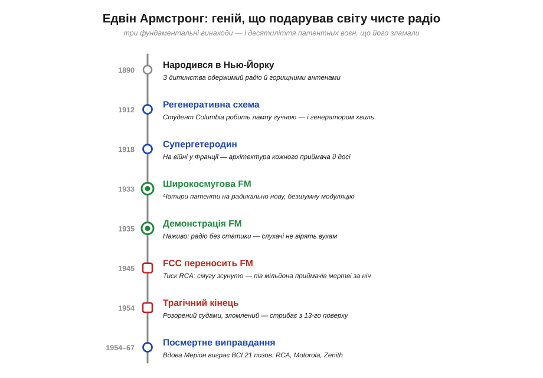
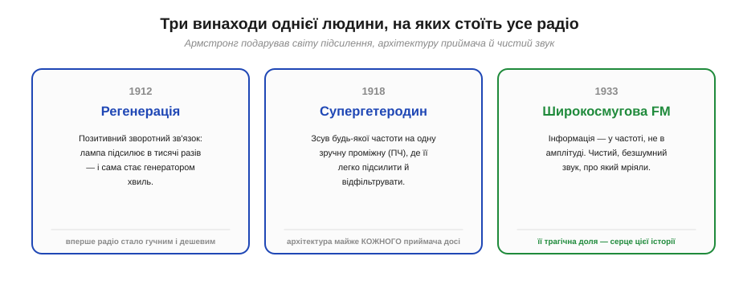
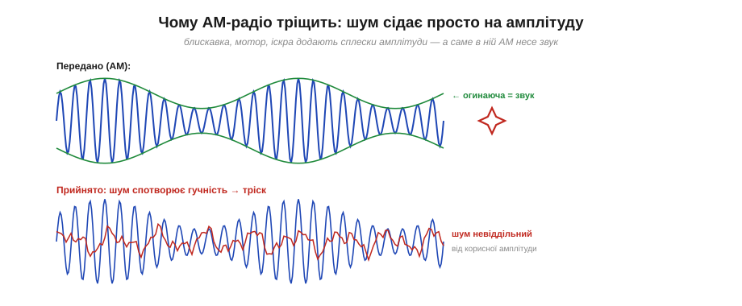
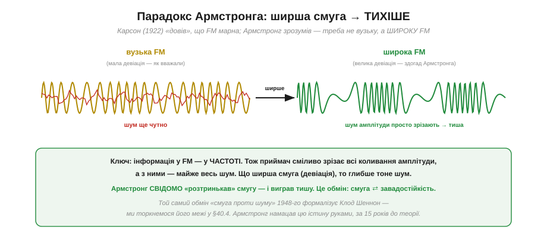
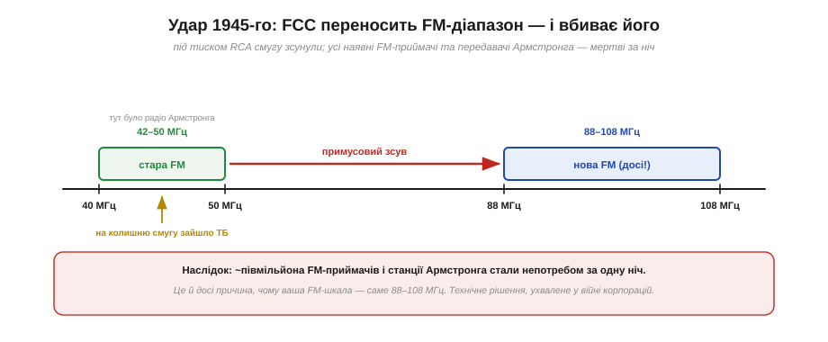
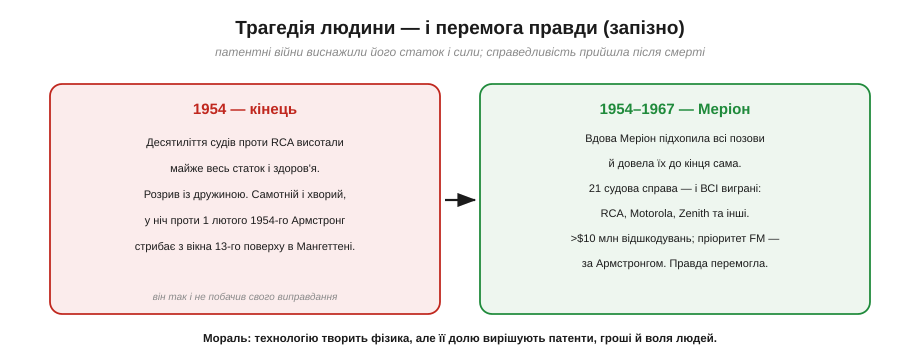

📜 *Історична вставка до [Розділу 6.7 — Радіо: модуляція й бюджет лінії](modulation-link-budget.md).*

# Історія: Едвін Армстронг і FM — геній і трагедія патентних війн

Увімкни FM-радіо в машині. Чистий, повний звук без тріску й шипіння; коли проїжджаєш під лінією електропередач, музика не захлинається статикою. Цей звук — не випадковість і не «природна властивість радіо». Це винахід **однієї людини**, яка билася за нього майже все життя, віддала на цю битву свій статок і здоров'я — і програла особисто, хоча її ідея перемогла назавжди. Звали цю людину **Едвін Говард Армстронг** (*Edwin Howard Armstrong*, 1890–1954), американський інженер-радіотехнік, і він подарував світу не лише FM, а ще два винаходи, без яких не працює жоден сучасний приймач.

Ця історія варта окремої розповіді з двох причин, і обидві важливі для всього розділу. **Перша:** вона показує, що за «безособовими» технічними термінами — *модуляція*, *FM*, *супергетеродин* — стоять живі люди, осяяння й помилки. Один талановитий інженер справді **може** змінити те, як звучить світ. **Друга, гірша:** доля технології вирішується не лише фізикою. Кращий винахід **не перемагає автоматично** — над ним стоять патенти, корпорації, регулятори й гроші. Армстронг винайшов незрівнянно чистіше радіо — і саме тому могутня компанія роками гнобила цей винахід, бо він загрожував її імперії. Тримай цю подвійну думку в голові: те, що ми вивчаємо у Розділі 6.7, — і блискуча фізика, і поле людської боротьби.

*Рис. 6.7.0.1. Життя в подіях: 1912 — регенерація; 1918 — супергетеродин; 1933 — патенти на широкосмугову FM; 1935 — приголомшлива демонстрація; 1945 — FCC під тиском RCA переносить FM-діапазон і нищить наявні приймачі; 1954 — зламаний судами винахідник іде з життя; 1954–1967 — його вдова Меріон виграє всі 21 позов і відновлює справедливість посмертно.*

---

## Три дарунки винахідника

Перш ніж дійти до FM, варто усвідомити масштаб цієї людини. Армстронг — не «автор однієї ідеї». Ще **до** FM він зробив два винаходи, на яких і досі стоїть усе радіо.

*Рис. 6.7.0.2. Регенерація (1912) вперше зробила радіо гучним і дешевим; супергетеродин (1918) — архітектура майже кожного приймача донині; широкосмугова FM (1933) — чистий безшумний звук. Три фундаменти, і всі троє — від однієї людини.*

Перший дарунок — **регенеративна схема** (*regenerative circuit*), яку 21-річний студент Колумбійського університету придумав 1912 року. Ідея — **позитивний зворотний зв'язок**: частину підсиленого лампою сигналу повертають назад на її вхід **у фазі**, і та підсилює сама себе в тисячі разів. Слабенький писк далекої станції раптом ставав чутним на весь дім. А якщо зворотний зв'язок зробити сильнішим — лампа починала **сама генерувати** коливання, тобто ставала передавачем. Одна схема дала і надчутливий приймач, і джерело хвиль; це був стрибок, що зробив радіо масовим.

Другий — **супергетеродин** (*superheterodyne*), 1918 року, який Армстронг розробив на війні у Франції. Проблема: підсилювати й фільтрувати сигнал на високій частоті важко. Рішення геніально просте — **перенести** будь-яку прийняту частоту на одну фіксовану, зручну **проміжну частоту** (*intermediate frequency*, ПЧ), і вже там, на ній одній, робити всю важку роботу підсилення й фільтрації. Майже **кожен** приймач, який ти тримав у руках — радіо, телевізор, рація, телефон, — досі побудований за цією схемою. Уяви масштаб: архітектура, придумана сто років тому, працює в мільярдах пристроїв.

> 🔧 **Навіщо це.** Ці два винаходи — не просто «передісторія». Вони пояснюють, **чому** Армстронг мав і гроші, і вагу в галузі, коли взявся за FM. Продавши патент на супергетеродин компанії RCA, він став її **найбільшим приватним акціонером** і близьким приятелем майбутнього президента RCA Девіда Сарнова. Тобто FM-війна, яку ми зараз розповімо, — це сварка двох колишніх союзників, де у винахідника спершу були сильні карти. І все одно він програв — ось що робить історію такою повчальною.

---

## Ворог на ім'я статика

Щоб зрозуміти, навіщо взагалі знадобилася FM, треба згадати головну ваду тодішнього радіо — **статику**, той самий тріск і шипіння. Усе радіо до Армстронга було **амплітудно-модульованим** (*amplitude modulation*, AM): звук «садили» на хвилю, змінюючи її **амплітуду** (гучність). Тихий звук — слабка хвиля, гучний — сильна.

*Рис. 6.7.0.3. У AM корисний звук — це **огинаюча** (зміна амплітуди несучої). Але блискавка, іскра мотора, щіткова машина додають у ефір власні **сплески амплітуди** — і приймач не може відрізнити їх від корисного сигналу. Шум невіддільний від того самого параметра, у якому захована музика.*

У чому біда? Майже всякий природний і технічний шум — блискавка, іскри в моторі, перешкоди від електромережі — це теж **сплески амплітуди**. А раз AM несе корисний звук **саме в амплітуді**, приймач не має жодного способу відрізнити «гучніше через музику» від «гучніше через блискавку». Шум потрапляє точно в той канал, де живе сигнал. Інженери 1920-х вважали статику **неминучою платою** за радіо — з нею просто змирилися, як із погодою.

Армстронг відмовився миритися. Він поставив питання інакше: а що, як ховати інформацію **не в амплітуді**? Тоді можна буде амплітуду — разом з усім шумом, що в ній сидить, — просто **викинути**.

---

## Парадокс: ширша смуга — тихіше

Альтернатива амплітуді напрошувалась — **частотна модуляція** (*frequency modulation*, FM): тримати амплітуду сталою, а звук «садити» на **частоту**, трохи зсуваючи її вгору-вниз. Гучніший звук — більший зсув частоти. Сама ідея FM була відома й до Армстронга. Проблема була в тому, що авторитети вважали її **марною**.

Ще 1922 року видатний інженер **Джон Карсон** (*John R. Carson*) з AT&T опублікував суворий математичний аналіз і дійшов висновку: FM не дає жодної переваги. І в певному сенсі він мав рацію — **вузькосмугова** FM (з маленьким зсувом частоти) справді займає приблизно ту саму смугу, що й AM, і шумить не краще. Висновок «FM не працює» здавався доведеним теоремою, і галузь про неї забула на десять років.

*Рис. 6.7.0.4. Осяяння Армстронга було **контрінтуїтивним**: не вузька FM, а навмисне **широка** — з великим зсувом частоти (девіацією). Оскільки інформація захована в частоті, приймач сміливо **зрізає** всі коливання амплітуди, а з ними — майже весь шум. І що ширша смуга, то глибше тоне статика. Він свідомо «розтринькав» смугу — і виграв тишу.*

Осяяння Армстронга (близько 1933 року) було саме тим, чого не побачив Карсон. Якщо вузька FM марна — то треба йти не у вузьку, а в **широку**: навмисне зробити зсув частоти **великим**, набагато ширшим за AM. Тоді приймач, який стежить лише за частотою, може **повністю проігнорувати** амплітуду: пропустити сигнал через обмежувач, що зрізає всі амплітудні сплески (а в них — увесь шум статики), і дивитися тільки на те, як «гуляє» частота. Результат був приголомшливий: чим **ширшу** смугу віддавали під FM, тим **тихіше** ставало в ефірі. Армстронг ніби «змарнував» дорогий ресурс — смугу частот, — а натомість купив майже цілковиту тишу.

> 🔧 **Навіщо це.** Тут схована глибока істина, до якої ми ще повернемося в цьому розділі. Армстронг **руками** намацав фундаментальний **обмін: смуга частот ⇄ завадостійкість**. Можна жертвувати шириною смуги заради чистоти сигналу — і навпаки. За 15 років, 1948-го, **Клод Шеннон** (*Claude Shannon*) формалізує цей обмін у математичній теорії інформації, і ми торкнемося його знаменитої межі у **§6.7.4**. Армстронг же дійшов до суті інженерною інтуїцією, усупереч «теоремі» авторитету, — нагадування, що іноді сміливий експеримент випереджає теорію.

---

## Демонстрація, в яку не вірили

1935 року Армстронг винайняв вежу й влаштував публічну демонстрацію перед інженерами. Те, що вони почули, суперечило їхньому досвіду. Він пускав в ефір FM-сигнал, і з гучномовця лунав **абсолютно чистий** звук — переливання склянки з водою чути було так, наче джерело стоїть у тій самій кімнаті; шурхіт паперу, голос диктора — усе без натяку на тріск. Один зі свідків згадував, що ніколи не чув, аби радіо звучало настільки реально. Армстронг навіть демонстрував FM під час грози — там, де AM захлинулося б тріском, FM грало чисто.

Це був тріумф інженерії. Здавалося, шлях відкрито: трохи часу — і весь світ перейде на чисте радіо. Але саме тут історія з наукової перетворюється на людську драму. Бо чим кращою була FM, тим **небезпечнішою** вона ставала для тих, хто заробляв на старому AM.

---

## Війна за FM

Головним союзником, а потім головним ворогом Армстронга був **Девід Сарнов** (*David Sarnoff*), президент **RCA** — найбільшої радіоімперії Америки. Колись вони приятелювали; Сарнов навіть давав Армстронгові лабораторію в RCA для дослідів над FM. Але потім Сарнов усе зрозумів — і це його злякало. Уся імперія RCA стояла на **AM**: на продажі AM-приймачів, на мережі AM-станцій, на патентах. Понад те, RCA вкладала мільйони в нову золоту жилу — **телебачення**. А FM загрожувала зробити весь цей AM-бізнес **застарілим**. Сарнов вирішив не пускати FM.

*Рис. 6.7.0.5. Найжорстокіший удар: 1945 року під тиском RCA регулятор FCC **переніс** FM-діапазон із 42–50 МГц на 88–108 МГц, а звільнену смугу віддав під телебачення. Усі наявні FM-приймачі (близько півмільйона) і передавачі Армстронга миттю стали непотребом — їхнє радіо більше не ловило нічого.*

Кульмінація настала 1945 року. RCA тиснула на регулятора — Федеральну комісію зв'язку (*FCC*), — і та ухвалила фатальне рішення: **перенести** весь FM-діапазон зі звичних 42–50 МГц на нинішні 88–108 МГц, а звільнену нижню смугу віддати телебаченню (тобто, серед іншого, самій RCA). Технічно це подавали як упорядкування ефіру. Наслідок же був нищівним: **усе**, що Армстронг і ентузіасти FM збудували за десять років, — близько півмільйона приймачів у людей і всі діючі станції — за одну ніч перетворилося на металобрухт. Старі приймачі більше не ловили нічого; усе треба було будувати з нуля, на новому місці. До того ж RCA користувалася FM у звуку своїх телевізорів, але платити Армстронгові роялті відмовлялася, втягуючи його в нескінченні суди.

> 🔧 **Навіщо це.** Ось чому твоя FM-шкала сьогодні — саме **88–108 МГц**. Це не закон фізики й не оптимальний інженерний вибір — це слід **корпоративної війни** 1945 року, що закарбувався в кожному приймачі планети. Дуже корисний урок на весь розділ: коли ми говоритимемо про діапазони, канали й регуляторні «дозволені смуги», пам'ятай — їхні межі часто визначені не лише фізикою, а й історією, політикою та грошима. Стандарт — це домовленість людей, і її варто читати критично.

---

## Чесно про авторство

Спокусливо розповісти цю історію як казку про самотнього генія проти лиходіїв. Але правда чесніша й цікавіша: як і більшість винаходів, радіо — справа **колективна**, і частина заслуг Армстронга **оспорювалася** в судах. Розділімо доведене, спірне й чуже — це правильна звичка мислення.

*Рис. 6.7.0.6. Три різні випадки. Широкосмугова FM — безперечна заслуга Армстронга (хоч саму концепцію FM і смугу описав раніше Карсон). Регенерація — юридично **спірна**: Верховний суд 1934-го присудив пріоритет де Форесту, хоч інженери й досі вважають це помилкою. Супергетеродин Армстронг створив не на самоті — над перетворенням частоти працювали паралельно й інші.*

Розкладімо по совісті. **Широкосмугова FM** — це чітко й безперечно винахід Армстронга: саму ідею модулювати частоту знали й до нього, а Карсон ще 1922-го описав, яку смугу займе FM, — але саме Армстронг зробив її **робочою** й довів, що широка смуга дає тишу. **Регенерація** — найболючіший вузол: багаторічний патентний спір із **Лі де Форестом** (*Lee de Forest*) дійшов до Верховного суду США, і 1934 року суд присудив пріоритет де Форесту. Більшість істориків техніки й інженерів вважають це **помилкою суду**, який не розібрався в технічних деталях; промовистий факт — коли інженерна спільнота (IRE) вручила Армстронгові медаль за регенерацію, він після програшу спробував її повернути, але колеги відмовилися її забирати, підтвердивши: для **інженерів** автор — він. До того ж схожу схему незалежно знайшов **Александер Майснер** (*Alexander Meißner*) у Німеччині. А **супергетеродин** Армстронг створив не у вакуумі — над перетворенням частоти паралельно працювали інші (зокрема **Люсьєн Леві** у Франції); заслуга Армстронга — практична, працездатна архітектура.

> 🔧 **Навіщо це.** Це не применшення Армстронга, а **чесність**. Зручні гасла «FM винайшов один геній» чи «суд завжди правий» — обидва хибні. Правда в тому, що великий винахідник стояв на плечах попередників, дещо з його заслуг оскаржувалося, а правосуддя буває несправедливим до техніки. Знати справжній, складніший розклад авторства — частина зрілого розуміння того, як народжуються технології.

---

## Трагедія і виправдання

Кінець цієї історії — водночас найтемніший і найсвітліший.

*Рис. 6.7.0.7. Десятиліття судів проти RCA висотали статок і сили Армстронга; 1954 року, хворий і самотній, він обірвав власне життя. Та його вдова **Меріон** підхопила всі позови й довела їх до кінця: 21 справа — і всі виграні (RCA, Motorola, Zenith), понад $10 млн відшкодувань. Пріоритет FM лишився за Армстронгом — справедливість прийшла, хоч і посмертно.*

Багаторічна війна виснажила Армстронга. Судові витрати поглинули майже весь його статок, здоров'я підупало, стосунки з дружиною дали тріщину. У ніч проти **1 лютого 1954 року**, зламаний і самотній, він **обірвав власне життя**, стрибнувши з вікна свого помешкання на 13-му поверсі в Мангеттені. Геній, що подарував світові чистий звук, помер, так і не побачивши перемоги.

Але історія не закінчилася на цьому — і саме фінал робить її незабутньою. Удова Армстронга, **Меріон** (*Marion Armstrong*), відмовилася здатися. Вона **підхопила** всі чоловікові патентні позови й вела їх роками, сама, проти найбільших корпорацій Америки. Підсумок вражає: **21 судова справа — і всі до одної виграні**, серед відповідачів RCA, Motorola, Zenith; понад **$10 мільйонів** відшкодувань і, головне, остаточне визнання, що **пріоритет FM належить Армстронгові**. Справедливість таки настала — запізно для людини, але вчасно для історії.

---

## Що з цього лишилось

Сьогодні спадок Армстронга — всюди, де є радіо. **FM-мовлення**, чистий звук **телевізора**, рації, перші покоління мобільного зв'язку, навіть авіаційні й службові канали — усе це користається його ідеєю «ховати інформацію в частоті». Супергетеродин і досі живе в кожному приймачі, зокрема й у радіо-чіпах ESP32, що ми вивчаємо. А самих модуляцій — і амплітудної (AM), і частотної (FM), і їхніх сучасних цифрових нащадків — присвячено весь цей розділ.

Та найважливіше — **дві думки**, які ця історія несе у Розділ 6.7:

- **Модуляція — це вибір, а не дрібниця.** Куди «посадити» інформацію — в амплітуду, частоту чи фазу — визначає, наскільки стійким до шуму буде зв'язок. Армстронг довів це ціною життя: FM перемогла AM саме завдяки розумній модуляції. Це фундамент усього, що ми зараз вивчатимемо (§6.7.1–6.7.3).
- **За все платять смугою.** Чистота й надійність купуються шириною смуги — це той самий обмін, що його намацав Армстронг і формалізував Шеннон (§6.7.4). Інженерія зв'язку — це постійне зважування: смуга, потужність, швидкість, завадостійкість.

Тримаючи в голові і блискучу фізику FM, і людську ціну, яку за неї заплатили, перейдімо від «історії модуляції» до її «механіки»: розберімо, **навіщо** взагалі потрібна модуляція й **як** саме інформацію садять на несучу хвилю.

▶️ Далі: [Розділ 6.7 — Радіо: модуляція й бюджет лінії](modulation-link-budget.md)
