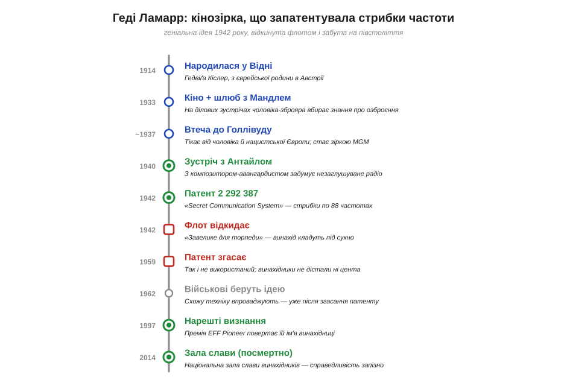
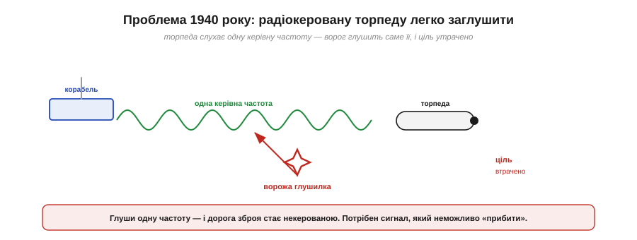
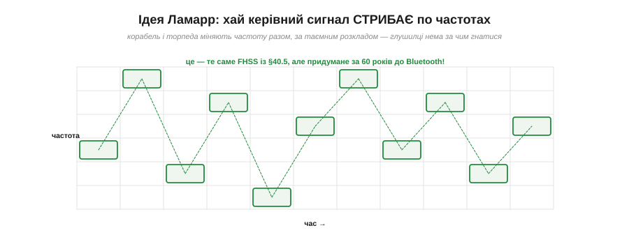
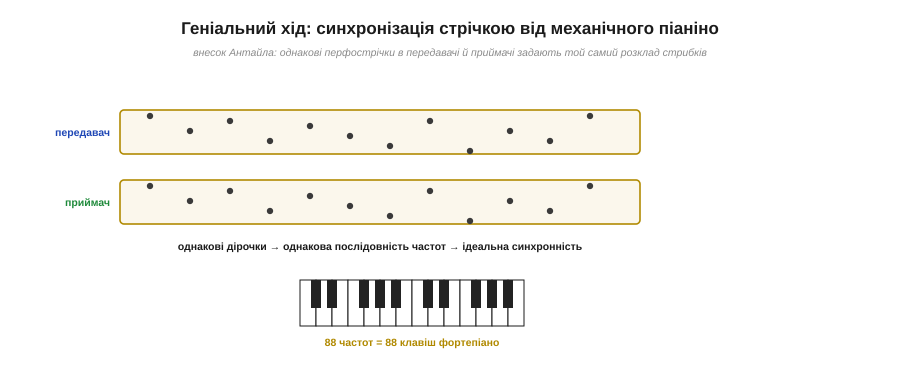
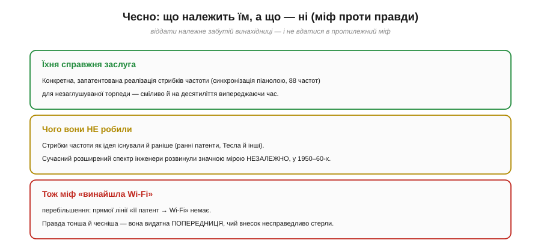
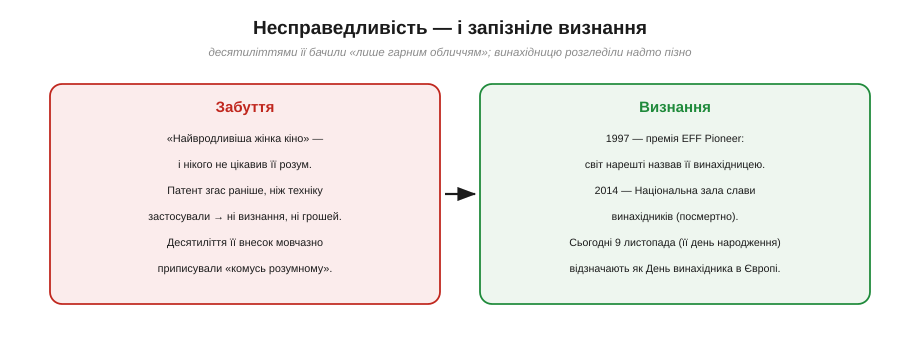
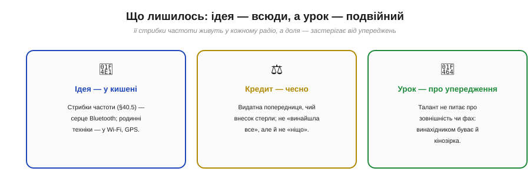

📜 *Історична вставка до теми 6.7.5 «Завадостійкість і розширений спектр» ([Розділ 6.7](modulation-link-budget.md)).*

# Історія: Геді Ламарр — акторка, що винайшла стрибки частоти

У 1940-х роках її називали «найвродливішою жінкою у світі». Її обличчя збирало повні зали кінотеатрів, а студія MGM продавала її як ідеальну голлівудську красуню — і нікого не цікавило, що в неї в голові. А в голові в **Геді Ламарр** (*Hedy Lamarr*) визрівала ідея, яку ти щойно вивчив у §6.7.5: змусити радіосигнал **стрибати** з частоти на частоту за таємним розкладом, щоб його неможливо було ні заглушити, ні підслухати. Разом із композитором Джорджем Антайлом вона запатентувала цю ідею 1942 року — за десятиліття до того, як інженери збудували перші робочі системи, і за пів століття до Bluetooth. А потім світ забув про це майже на п'ятдесят років.

Ця історія варта окремої розповіді з двох причин, і обидві лягають у серце нашого курсу. **Перша:** винахідники приходять звідусіль. Не лише з лабораторій і політехнік — інколи з кіноекрана. Талант не питає про зовнішність, стать чи професію, і той, кого вважають «лише гарним обличчям», може випередити інженерів. **Друга, складніша:** ця історія — урок про те, як **стирають** чужий внесок і як його чесно повертати. Бо тут є дві небезпеки: і несправедливо забути справжню винахідницю, і — навпаки — роздути легенду до неправди («Геді Ламарр винайшла Wi-Fi»). Правда тонша й цікавіша за обидві крайнощі, і ми спробуємо викласти її точно.

*Рис. 6.7.0.8. Шлях ідеї: 1914 — народження у Відні; на ділових зустрічах першого чоловіка-зброяра майбутня винахідниця вбирає знання про озброєння; втеча до Голлівуду; 1940 — зустріч з Антайлом і задум; 1942 — патент на стрибки по 88 частотах; флот відкидає його; 1959 — патент згасає невикористаним; визнання приходить аж 1997-го (премія EFF) і 2014-го (Зала слави, посмертно).*

---

## Дівчина, що слухала про зброю

Спочатку — хто вона. Геді Ламарр народилася 1914 року у Відні як **Гедвіґа Єва Марія Кіслер** (*Hedwig Kiesler*), у **єврейській родині**. Тут варто бути точним щодо її ідентичності: вона була **австрійкою єврейського походження**, і саме це згодом змусить її тікати — і від особистої неволі, і від нацистської загрози, що насувалася на Європу.

Замолоду вона стала актрисою, а 1933 року вийшла заміж за **Фрідріха Мандля** (*Friedrich Mandl*) — одного з найбагатших австрійських **виробників зброї**, що торгував із фашистськими режимами. Шлюб був золотою кліткою: ревнивий чоловік тримав її при собі, зокрема й на ділових зустрічах, де обговорювали **системи озброєння** — торпеди, керування, військову радіотехніку. Мандль не здогадувався, що його «прикраса» **слухає й запам'ятовує**. Саме там, за вечерями зі зброярами та військовими, Геді ввібрала технічні знання, які згодом дадуть несподіваний плід.

1937 року вона **втекла** — за легендою, переодягнувшись служницею, — спершу до Парижа й Лондона, а далі до США, де її помітив голова MGM і зробив зіркою на ім'я Геді Ламарр. Але світська слава не заглушила в ній бажання **щось вигадувати**: винахідництво було її справжньою пристрастю, про яку публіка й гадки не мала.

---

## Проблема: торпеду надто легко заглушити

Коли почалася Друга світова, Ламарр захотіла допомогти новій батьківщині й союзникам — не обличчям на агітках, а **головою**. Вона взялася за конкретну військову проблему, яку розуміла з вечерь у Мандля: **радіокеровані торпеди**.

*Рис. 6.7.0.9. Торпеду наводять по радіо на одній керівній частоті. Але ворог може **заглушити** саме цю частоту потужною завадою — і дорога зброя стає некерованою, ціль утрачено. Потрібен керівний сигнал, який неможливо «прибити» глушінням.*

Суть біди тобі вже знайома з §6.7.5. Якщо торпеда слухає **одну** керівну частоту, то ворогові досить «забити» саме її гучною завадою — і зв'язок із торпедою обірветься. Одна частота — одна вразлива точка. Питання, яке поставила Ламарр, було точнісінько те саме, що ми обговорювали як завадостійкість: **як зробити керівний сигнал таким, щоб його не можна було заглушити?**

---

## Ідея: хай сигнал стрибає

Відповідь, до якої вона додумалася, — це **стрибки частоти** власною персоною.

*Рис. 6.7.0.10. Замість однієї частоти — корабель і торпеда **разом** перестрибують по багатьох частотах за таємним, наперед узгодженим розкладом. Глушилка не знає розкладу й не встигає за стрибками. Це буквально FHSS із §6.7.5 — придумане за десятиліття до Bluetooth.*

Придивися до рисунка — і впізнаєш ту саму сітку «частота × час», що й у §6.7.5. Ідея Ламарр: хай **і передавач на кораблі, і приймач у торпеді міняють частоту синхронно**, за однаковим таємним розкладом. Поки ворог намацає, де зараз сигнал, той уже перескочив далі. Глушити «все підряд» неможливо — потужності не вистачить; а вгадати розклад без ключа — теж. Це і є **стрибки частоти** (FHSS), фундамент завадостійкості, який ми вивчали. Лишалося одне технічне питання: **як** змусити два апарати, за кілометри один від одного, стрибати абсолютно синхронно? Тут і з'явився другий герой історії.

---

## Рояль усередині радіо: внесок Антайла

Розв'язати задачу синхронізації допоміг друг Ламарр — **Джордж Антайл** (*George Antheil*), американський композитор-авангардист. І його внесок — не формальність: саме він приніс **механізм**.

*Рис. 6.7.0.11. Антайл прославився твором «Ballet Mécanique», де грали синхронізовані **механічні піаніно** (піаноли). Звідти й рішення: однакові **перфоровані стрічки** в передавачі та приймачі задають той самий розклад стрибків — як нотний валик керує клавішами. А частот узяли **88** — рівно стільки, скільки клавіш у фортепіано.*

Антайл був відомий твором «**Ballet Mécanique**», у якому одночасно грали кілька **механічних піаніно** — тих, що самі натискають клавіші за **перфорованою паперовою стрічкою** (нотним валиком). І він збагнув: якщо вставити **однакові** перфострічки в передавач і приймач, то дірочки на папері **синхронно** перемикатимуть частоту в обох — точно як валик синхронно тисне клавіші. Звідси й магічне число: вони взяли **88 частот**, рівно за кількістю клавіш фортепіано. Радіо, що співає по нотах, — поетична й водночас цілком робоча інженерна ідея.

---

## 1942: патент — і одразу в шухляду

11 серпня 1942 року Ламарр (під шлюбним ім'ям **Hedy Kiesler Markey**) і Антайл отримали **патент США № 2 292 387** під назвою «**Secret Communication System**» («Таємна система зв'язку»). На папері все працювало. А далі сталося найприкріше.

Вони передали ідею **військовому флоту США** — і там її **відхилили**. Аргумент: механізм із піанольною стрічкою завеликий, щоб уміститися в торпеду. Винахід поклали під сукно. Патент тихо діяв до **1959 року** й **згас невикористаним**. А вже **близько 1962-го** — за іронією, невдовзі після згасання — військові почали впроваджувати **схожу** техніку в реальних системах. Тобто винахідники не дістали за свою ідею **ні визнання, ні цента**: на момент, коли світ нарешті дозрів, їхній патент уже не діяв.

---

## Чесно про авторство

А тепер — найважливіша частина, заради якої й варто розповідати цю історію акуратно. Навколо Геді Ламарр наросло чимало легенд, і наша справа — відокремити **доведене** від **перебільшеного**.

*Рис. 6.7.0.12. Їхня справжня заслуга — конкретна, запатентована реалізація стрибків частоти (синхронізація піанолою, 88 частот), сміливо випереджаюча час. Чого вони НЕ робили: стрибки як ідея існували й раніше, а сучасний розширений спектр інженери розвинули значною мірою незалежно в 1950–60-х. Тож гасло «винайшла Wi-Fi» — перебільшення; правда чесніша: вона видатна **попередниця**, чий внесок несправедливо стерли.*

Розкладімо по совісті — рівно так, як ми це робили з радіо й Bluetooth у попередніх розділах. **Що справді їхнє:** конкретна, дотепна, **запатентована** реалізація стрибків частоти — з піанольною синхронізацією й 88 частотами, — задумана для незаглушуваної торпеди й на десятиліття випереджаюча свій час. Це безперечний, реальний винахід. **Чого вони не робили:** не вони *вперше* придумали стрибки частоти — сама ідея існувала й раніше, у ранніх патентах початку XX століття (її пов'язують з іменами Тесли та інших винахідників і навіть військових). І ще важливіше: **сучасний** розширений спектр у Wi-Fi, Bluetooth і GPS інженери розвинули значною мірою **незалежно**, у 1950–60-х, без прямого використання їхнього патенту. Тому популярне гасло «**Геді Ламарр винайшла Wi-Fi**» — це **перебільшення**: прямої причинної лінії «її патент → твій роутер» немає.

> 🔧 **Навіщо це.** Тут — тонка, але принципова рівновага, яку варто навчитися тримати. З одного боку, **несправедливо** забувати реальну винахідницю лише тому, що вона була красунею й жінкою, — її внесок справжній і його десятиліттями мовчазно стирали. З іншого боку, **виправляти** цю несправедливість роздуванням міфу — теж хибно: правда не потребує прикрас. Чесна відповідь — обидві половини разом: Геді Ламарр і Джордж Антайл були **видатними попередниками** розширеного спектра, чий конкретний внесок реальний, патент справжній, а доля несправедлива; але вони не «винайшли все сучасне радіо одноосібно». Уміти тримати таку подвійну, неспрощену правду — ознака зрілого розуміння історії техніки.

---

## Забуття — і запізніле визнання

Чому ж її так довго не помічали? Відповідь незатишна: через **упередження**.

*Рис. 6.7.0.13. Десятиліттями Ламарр бачили «лише найвродливішою жінкою кіно» — її розум нікого не цікавив, а внесок мовчки приписували «комусь розумному». Визнання прийшло пізно: 1997 року — премія EFF Pioneer, що повернула їй ім'я винахідниці; 2014-го — посмертний вступ до Національної зали слави винахідників.*

Геді Ламарр потрапила в подвійну пастку: її **краса** працювала проти неї. «Найвродливіша жінка світу» — і публіці, і пресі здавалося немислимим, що така жінка може бути ще й інженеркою. Її технічний внесок десятиліттями просто **не брали до уваги**, а часом мовчки приписували «якомусь розумному чоловікові». Грошей вона не отримала — патент згас раніше, ніж ідею застосували. Визнання прийшло аж наприкінці життя: **1997 року** — престижна премія **EFF Pioneer Award**, що нарешті назвала її винахідницею; а **2014-го**, уже посмертно, її ввели до **Національної зали слави винахідників** США. Сьогодні в німецькомовних країнах **9 листопада** — день народження Ламарр — відзначають як **День винахідника**.

---

## Що з цього лишилось

*Рис. 6.7.0.14. Ідея стрибків частоти (§6.7.5) живе в кожному Bluetooth-навушнику, а родинні техніки розширеного спектра — у Wi-Fi і GPS. Кредит варто віддавати чесно: видатна попередниця, не «винахідниця всього». А головний урок — про упередження: винахідником буває хоч кінозірка.*

Підсумуймо, що ця історія залишає нам у руках і в голові. **По-перше — техніка:** стрибки частоти, які Ламарр і Антайл запатентували 1942 року, — це той самий принцип FHSS, що його ти вивчив у §6.7.5 і яким щодня користується твій Bluetooth. Їхня інтуїція виявилася правильною; вони лише **випередили** час і технологію, що могла б її втілити. **По-друге — чесність кредиту:** правильно і повернути забутій винахідниці належне, і не вдатися в протилежну легенду; правда — посередині, і вона гідна сама собою. **По-третє — урок про упередження:** найкоштовніша ідея може прийти від того, від кого її не чекають. Якщо світ мало не проґавив винахід через те, що його авторка була вродливою акторкою, — це сором світу, а не авторки.

Тепер, тримаючи в пам'яті і піанольну стрічку, що синхронізувала частоти, і несправедливо забуту винахідницю, повернімося до інженерії — і складімо всі «плюси» й «мінуси» радіолінії в децибелах, щоб порахувати наперед, чи дотягнеться зв'язок. Це — **бюджет радіолінії**.

▶️ Далі: [Розділ 6.7 — Радіо: модуляція й бюджет лінії](modulation-link-budget.md)
