# Розділ 6.7 — Радіо: модуляція й бюджет лінії

У [Розділі 6.6](../radio-em-waves/radio-em-waves.md) ми розібрали саму **хвилю**: що таке електромагнітне коливання, як пов'язані частота й довжина, чому сигнал згасає з відстанню. Але чиста радіохвиля — це лише рівномірне «гудіння» однієї частоти, несуча. Вона нічого не повідомляє. Залишилося головне практичне питання: як **посадити** на цю хвилю корисне — голос, музику, біти телеметрії дрона? І як, знаючи всі потужності, підсилення й втрати, **порахувати наперед**, чи дотягнеться зв'язок на потрібну відстань?

Цей розділ — про дві великі речі. Перша — **модуляція** (*modulation*): мистецтво змінювати несучу так, щоб вона несла інформацію, і робити це стійко до шуму. Ми пройдемо від найпростішої амплітудної модуляції до цифрових FSK/PSK, торкнемося межі Шеннона й розширеного спектра. Друга — **бюджет радіолінії** (*link budget*): чесна бухгалтерія всіх «плюсів» і «мінусів» у децибелах, що дає відповідь «працюватиме чи ні». А завершимо багатопроменевістю й завмиранням — тим, чому реальний сигнал «дихає». Усе спираємося на фізику Розділу 6.6 і на децибели з §6.6.5.

> 📜 **Перед матеріалом — історія:** [Едвін Армстронг і FM — геній і трагедія патентних війн](hist-armstrong.md). Вона показує, *чому* модуляція — це не дрібниця, а вибір, від якого залежить усе: як один інженер винайшов чистий FM-звук, як могутня корпорація душила цей винахід, і як він намацав руками той самий обмін «смуга проти шуму», що його згодом формалізує Шеннон (§6.7.4).

---

## 6.7.1 Навіщо модуляція: посадити інформацію на несучу

Почнімо з питання, яке здається наївним, але веде в самісіньку суть радіо. Ось у нас є мікрофон: він перетворює голос на електричний сигнал — слабкий струм, що коливається в такт зі звуком, на частотах приблизно 300–3400 Гц. І ось у нас є антена. Чому не можна просто подати цей звуковий сигнал на антену й випромінити його «як є»? Навіщо вся ця морока з несучою хвилею та її «псуванням»? Відповідь складається з двох залізних причин — і обидві варто прочути до кісток, бо на них тримається весь радіозв'язок.

### Проблема перша: антена завбільшки з місто

Перша причина — суто фізична, і вона про **розмір антени**. Згадаймо з §6.6.4: щоб ефективно випромінювати хвилю, антена має бути **порівнянна з довжиною хвилі** — на практиці порядку **чверті хвилі** (λ/4). А довжину хвилі ми рахуємо за формулою з §6.6.2: λ = c / f. Що нижча частота — то довша хвиля — то більша потрібна антена. І для звукових частот числа виходять нищівні.

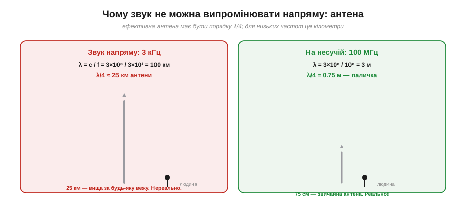
*Рис. 6.7.1.1. Ліворуч: щоб напряму випромінити звук 3 кГц, довжина хвилі — 100 км, а антена (λ/4) — близько 25 км заввишки. Це вища за будь-яку вежу на Землі — нездійсненно. Праворуч: піднявши сигнал на несучу 100 МГц, маємо λ = 3 м і антену 0.75 м — звичайну паличку.*

**Приклад (антена для звуку проти антени для несучої).** Порахуймо λ/4 для двох випадків за c ≈ 3×10⁸ м/с:

```
звук 3 кГц :  λ = 3×10⁸ / 3×10³  = 100 000 м = 100 км →  λ/4 ≈ 25 км
FM 100 МГц :  λ = 3×10⁸ / 1×10⁸  = 3 м            →  λ/4 = 0.75 м
Wi-Fi 2.4 ГГц: λ = 3×10⁸ / 2.4×10⁹ = 0.125 м        →  λ/4 ≈ 3 см
```

Відчуй контраст. Антена для прямого випромінювання голосу мусила б бути **25 кілометрів** заввишки — вища за всі хмари. А варто «перенести» той самий голос на несучу 100 МГц — і вистачає **тридцятисантиметрової** палички; на 2.4 ГГц антена взагалі ховається всередині телефона. Ось перший, цілком приземлений сенс модуляції: вона дає змогу передавати **низькочастотну** інформацію за допомогою **високочастотної** хвилі, для якої антена має розумний розмір.

### Проблема друга: усі в одній кімнаті кричать разом

Друга причина — про **спільний ефір**. Припустімо навіть, що антена не проблема. Уяви, що всі радіостанції міста почали випромінювати свій звук напряму. Голос — це завжди приблизно ті самі 0.3–3.4 кГц. Тобто **всі** сигнали лежали б в одній і тій самій вузькій смузі низьких частот, накладаючись один на одного. Приймач не мав би жодного способу їх розрізнити — суцільна каша, як коли в одній кімнаті всі говорять водночас.

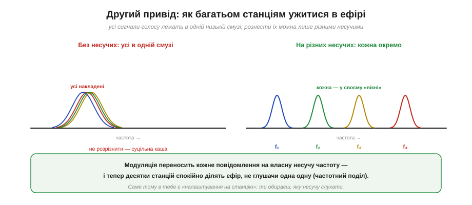
*Рис. 6.7.1.2. Ліворуч: без несучих усі голосові сигнали лежать в одній низькій смузі й безнадійно накладаються. Праворуч: модуляція переносить кожну станцію на власну несучу f₁, f₂, f₃… — і тепер вони мирно ділять ефір, кожна у своєму «вікні» частот. Це і є частотний поділ.*

Модуляція розв'язує це елегантно: кожній станції дають **свою несучу частоту**. Одна сідає на 100.1 МГц, інша — на 100.5, третя — на 101.3. Тепер їхні сигнали рознесені по шкалі частот і не заважають одне одному, а ти, **налаштовуючись на станцію**, просто кажеш приймачеві, яку саме несучу слухати. Цей принцип називають **частотним поділом** (*frequency-division*), і саме він дає десяткам станцій, сотням каналів Wi-Fi і мільярдам телефонів ужитися в одному ефірі. Без модуляції спільний ефір був би неможливий у принципі.

> 🔧 **Навіщо це.** Дві ці причини — антена й спільний ефір — пояснюють **усе** радіо навколо тебе. Чому FM-діапазон — десятки мегагерц, а не кілогерци? Бо інакше антена була б кілометрова. Чому в роутера є «канали», а в рації — «частоти»? Бо це різні несучі, рознесені, щоб не глушити одне одного. Коли в наступних розділах ми говоритимемо про діапазони, канали й налаштування, пам'ятай першооснову: модуляція існує, щоб **підняти** низькочастотну інформацію на зручну високу несучу — заради реальної антени й заради спільного ефіру.

### Несуча — це «вантажівка» для інформації

Тепер придивімося до самої несучої. **Несуча** (*carrier*) — це чиста синусоїда високої частоти: стала амплітуда, стала частота, нічого не змінюється. І саме тому вона, сама собою, **не несе жодної інформації**.

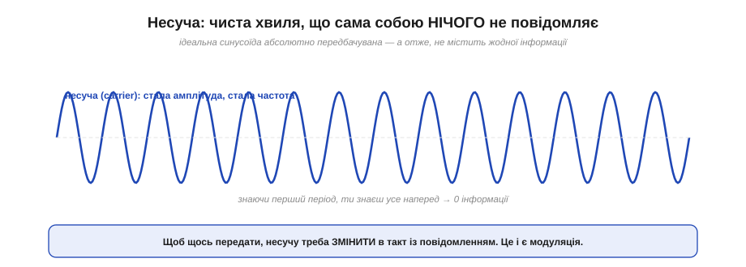
*Рис. 6.7.1.3. Ідеальна несуча абсолютно передбачувана: знаючи лише перший період, ти точно знаєш усю хвилю на мільярд періодів уперед. А цілковито передбачуване повідомлення не містить інформації. Щоб щось передати, несучу треба змінювати в такт із повідомленням.*

Тут схована напрочуд глибока думка. Інформація — це завжди **несподіванка**, зміна, відхилення від передбачуваного. Ідеальна синусоїда несподіванок не має: вона нудна й передбачувана до кінця часів, тож повідомляє рівно нуль. Щоб несуча щось переказала, ми мусимо її **зіпсувати** — внести в неї керовані зміни, що повторюють форму нашого повідомлення. Несуча тут грає роль **вантажівки**: сама по собі порожня, вона довозить корисний вантаж (голос, біти) туди, куди той самотужки не дістався б — через увесь ефір, попри проблему антени й проблему спільної смуги.

### Три ручки несучої

А що саме в несучій можна змінювати? Тут — уся краса й уся простота. Будь-яку синусоїду повністю описують **рівно три** параметри:

```
y(t) = A · sin(2π·f·t + φ)
         ▲          ▲    ▲
    амплітуда   частота  фаза
```

Більше нема чого крутити — лише ці три «ручки». А отже, є рівно **три способи** садити інформацію на несучу, тобто три родини модуляції.

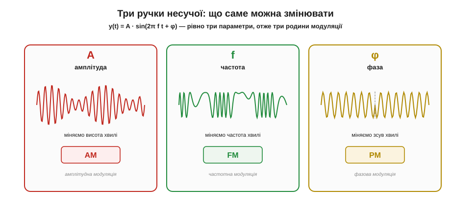
*Рис. 6.7.1.4. Міняємо амплітуду A — виходить амплітудна модуляція (**AM**); міняємо частоту f — частотна (**FM**); міняємо фазу φ — фазова (**PM**). Три параметри синусоїди — три родини модуляції. Усе інше в радіозв'язку — варіації й комбінації цих трьох.*

Розберімо по ручках. **Амплітуда A** — це «висота» хвилі; змінюючи її в такт із голосом, дістаємо **амплітудну модуляцію** (*amplitude modulation*, AM) — найстарішу й найпростішу. **Частота f** — як часто хвиля коливається; гойдаючи її, дістаємо **частотну модуляцію** (*frequency modulation*, FM) — ту саму, за яку бився Армстронг. **Фаза φ** — зсув хвилі в часі; її зміни дають **фазову модуляцію** (*phase modulation*, PM), особливо важливу в цифровому зв'язку. Уся неосяжна різноманітність сучасних радіосистем — від простого AM-передавача до Wi-Fi і 5G — будується з цих трьох цеглинок та їхніх комбінацій. У §6.7.2 ми детально розберемо AM і FM, у §6.7.3 — цифрові варіанти.

### Повний шлях: модулятор і демодулятор

Складемо тепер усю картину докупи — як інформація проходить шлях від передавача до приймача.

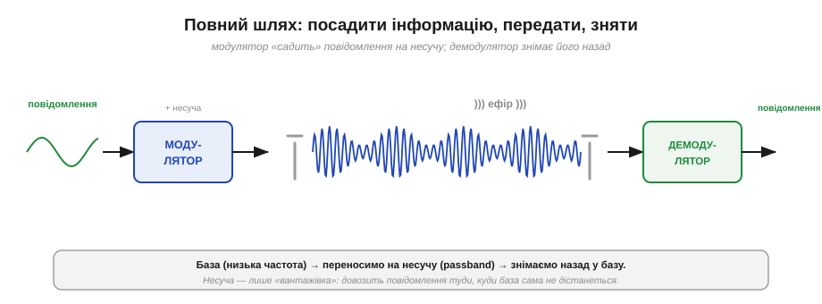
*Рис. 6.7.1.5. Повідомлення (низькочастотна «база») заходить у **модулятор**, який садить його на несучу; передавальна антена випромінює модульовану хвилю; приймальна ловить її; **демодулятор** знімає інформацію назад, відновлюючи вихідне повідомлення. Несуча — лише транспорт.*

Ланцюг простий і симетричний. На передавальному боці **модулятор** (*modulator*) бере наше повідомлення й несучу і змішує їх — змінює одну з трьох ручок несучої в такт із повідомленням. Готова модульована хвиля йде в антену й летить ефіром. На приймальному боці **демодулятор** (*demodulator*, або детектор) робить **зворотну** операцію: дивиться, як саме «гуляє» прийнята несуча, і відновлює з цього вихідне повідомлення. Терміни-синоніми, що часто трапляються: модуляцію іноді звуть *накладанням*, демодуляцію — *детектуванням*. Суть незмінна: посадили інформацію на несучу — передали — зняли назад.

### Що відбувається у спектрі

Є ще один спосіб подивитися на модуляцію — крізь призму **спектра**, тобто розкладу сигналу за частотами. Цей погляд особливо корисний, бо одразу пояснює і частотний поділ, і поняття смуги.

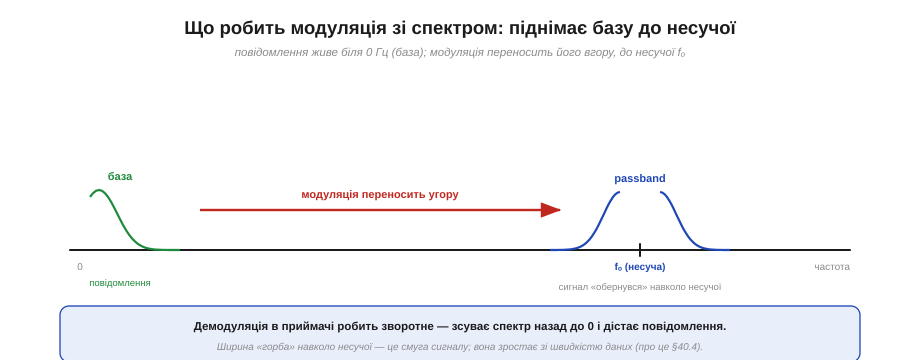
*Рис. 6.7.1.6. Повідомлення живе біля нуля частот — це **база** (*baseband*). Модуляція переносить його вгору, «обертаючи» навколо несучої fₒ: тепер сигнал займає вузьку смугу довкола fₒ — це **passband**. Демодуляція робить зворотне — зсуває спектр назад до нуля й дістає повідомлення.*

Думай про це так. Вихідне повідомлення — голос, дані — займає смугу частот біля **нуля**; це називають **базою** або *baseband*. Модуляція **переносить** цю смугу вгору й розташовує її довкола несучої частоти fₒ — сигнал стає **смуговим** (*passband*), тобто сидить у вузькому «вікні» навколо fₒ. Саме тому різні станції на різних несучих не перетинаються: їхні «вікна» стоять у різних місцях шкали. А приймач, демодулюючи, зсуває обране вікно назад до нуля й читає повідомлення. І ще одне важливе спостереження, до якого ми повернемося в §6.7.4: **ширина** цього вікна — це **смуга** сигналу, і вона тим більша, чим швидше ми передаємо дані. Смуга — не безкоштовна, і за неї ще буде окрема, дуже принципова розмова.

### Підсумок: навіщо модуляція

Зведімо все докупи. Модуляція — не примха інженерів, а необхідність із трьох переплетених причин.


*Рис. 6.7.1.7. Модуляція потрібна, щоб (1) антена була реального розміру — висока несуча дає коротку хвилю; (2) багато станцій ділили ефір — кожній своя несуча; (3) сигнал ішов потрібним середовищем — несучу обирають під діапазон і його властивості (§6.6.4). Низькочастотне повідомлення саме по собі радіо не зробить.*

Отже, тримаймо в голові три відповіді на питання «навіщо взагалі модуляція». **По-перше — антена:** перенісши інформацію на високу несучу, ми отримуємо хвилю, для якої антена має реальний розмір. **По-друге — спільний ефір:** даючи кожній станції свою несучу, ми вкладаємо десятки сигналів в один ефір без взаємних завад. **По-третє — узгодження із середовищем:** обираючи несучу в потрібному діапазоні, ми керуємо дальністю, проникністю крізь стіни й розміром системи — рівно тими компромісами, що ми вивчили в §6.6.4. Усе це — від однієї простої дії: взяти нудну, але «дальнобійну» несучу й керовано **зіпсувати** її в такт із повідомленням.

Лишилося розібратися з **як саме** псувати. Ми вже знаємо, що ручок три — амплітуда, частота й фаза. Почнімо з двох найстаріших і найнаочніших способів, на яких побудовано все аналогове мовлення й навколо яких розгорнулася драма з історії цього розділу: **амплітудна** й **частотна** модуляція, AM і FM.

---

## 6.7.2 Амплітудна й частотна модуляція (AM/FM)

У §6.7.1 ми з'ясували, що несучу можна крутити за трьома ручками. Тепер беремо дві з них — амплітуду й частоту — і розбираємо до дна. Це не випадкові приклади: на AM стоїть усе перше століття радіомовлення, а FM — це та сама модуляція, за чисту якість якої Армстронг заплатив життям (історія розділу). Зрозумівши ці дві, ти зрозумієш **принцип** будь-якої модуляції, бо решта — лише варіації на ту саму тему.

### AM: гойдаємо амплітуду в такт зі звуком

Найпростіша й найстаріша ідея — **амплітудна модуляція** (*amplitude modulation*, AM): тримати частоту несучої сталою, а її **амплітуду** (гучність хвилі) змінювати в такт із повідомленням. Голосніший звук — більша амплітуда несучої, тихіший — менша. Математично це записують так:

```
s(t) = A · [1 + μ·m(t)] · sin(2π·fₒ·t)
       └───── огинаюча ─────┘   └─ несуча ─┘
```

де m(t) — нормоване повідомлення (від −1 до +1), fₒ — частота несучої, а μ — **глибина модуляції** (про неї за мить). Уся хитрість у тому, що множник `[1 + μ·m(t)]` стає **огинаючою** (*envelope*) — обвідною лінією, що окреслює форму хвилі зверху й знизу.


*Рис. 6.7.2.1. Беремо повільне повідомлення m(t) і швидку несучу; на виході — несуча, чия амплітуда «дихає» в такт із повідомленням. Огинаюча AM-сигналу точно повторює форму звуку. Саме тому приймач AM украй простий: діод відсікає половину хвилі, конденсатор згладжує — і на виході одразу огинаюча, тобто звук.*

Найприємніше в AM — **простота приймача**. Щоб дістати звук назад, не треба нічого складного: діод пропускає лише верхні півхвилі, конденсатор їх згладжує — і на виході з'являється та сама огинаюча, тобто вихідне повідомлення. Цей **детектор огинаючої** (*envelope detector*) — буквально кілька копійчаних деталей. Ось чому за часів, коли кожна лампа була на вагу золота, переможцем стало саме AM: дешевий масовий приймач.

### Скільки можна гойдати: глибина модуляції

Ключовий параметр AM — **глибина** (або **індекс**) **модуляції** μ: наскільки сильно ми розгойдуємо амплітуду. Її визначають з огинаючої:

```
μ = (A_max − A_min) / (A_max + A_min)
```


*Рис. 6.7.2.2. μ = 0.5 — недомодуляція: огинаюча не доходить до нуля, сигнал слабкий, потужність витрачено марно. μ = 1.0 — повна модуляція: огинаюча торкається нуля, максимум корисного сигналу без спотворень. μ = 1.5 — перемодуляція: огинаюча намагається «провалитися» нижче нуля, хвиля спотворюється, звук хрипить.*

**Приклад (читаємо глибину з осцилограми).** Нехай на екрані осцилографа максимальний розмах огинаючої A_max = 10 поділок, мінімальний A_min = 2:

```
μ = (10 − 2) / (10 + 2) = 8 / 12 ≈ 0.67  →  67% модуляції
```

Правило просте: тримай **μ ≤ 1**. За μ < 1 ти недовикористовуєш передавач (як на лівій панелі), за μ = 1 — вичавлюєш максимум, а от за μ > 1 настає **перемодуляція**: огинаюча «провалюється» за нуль, несуча на мить ніби обертає фазу, і звук спотворюється хрипом. Тому в реальних AM-передавачах стоїть обмежувач, що не дає перейти цю межу.

### Спектр AM: уся інформація — у бічних смугах

Тепер найважливіше для розуміння — як AM виглядає **у спектрі** (за частотами). Виявляється, проста модуляція однією синусоїдою-тоном fₘ породжує **три** спектральні лінії.


*Рис. 6.7.2.3. Тон fₘ, що модулює несучу fₒ, дає лінію на самій fₒ і дві **бічні смуги** (*sidebands*) на fₒ−fₘ та fₒ+fₘ. Уся корисна інформація захована саме в бічних смугах; повна смуга сигналу — 2·fₘ (удвічі більша за найвищу звукову частоту).*

**Приклад (смуга AM-каналу).** Несуча 1000 кГц, найвищий звуковий тон 5 кГц:

```
лінії спектра : 995 кГц | 1000 кГц | 1005 кГц
смуга B = 2·fₘ = 2 × 5 кГц = 10 кГц
```

Саме тому канали AM-мовлення стоять із кроком близько 10 кГц. Але тут криється й вада AM: придивись, де сидить **потужність**. Сама несуча (центральна, найвища лінія) забирає **більшу частину** потужності передавача — а інформації в ній **нуль**! Корисний сигнал — лише у двох бічних смугах. Виходить, AM безбожно марнує енергію на передавання «порожньої» несучої. Інженери це давно зрозуміли й винайшли економніші варіанти — як-от **односмугову модуляцію** (*single-sideband*, SSB), де передають лише одну бічну смугу без несучої; SSB набагато ефективніша й тому панує в далекому радіозв'язку та аматорському ефірі.

> 🔧 **Навіщо це.** Попри марнотратність і вразливість до шуму, AM **дотепер жива** — і не випадково. Її приймач найпростіший і найдешевший; сигнал добре йде на довгих і середніх хвилях на величезні відстані; а головне — **авіація** й досі вживає AM на діапазоні ~118–137 МГц. Чому? Через так званий **ефект захоплення** в FM (про нього нижче): якщо два літаки заговорять водночас на AM, диспетчер почує **обидва** (накладені) і зрозуміє, що є конфлікт. На FM сильніший сигнал повністю заглушив би слабший — і другий пілот зник би безслідно. Іноді «гірша» технологія безпечніша. Це гарний урок: вибір модуляції визначають не лише чистота й ефективність, а й вимоги застосування.

### FM: гойдаємо частоту

Тепер друга ручка — і друга, складніша, але набагато тихіша модуляція. У **частотній модуляції** (*frequency modulation*, FM) амплітуда несучої лишається **сталою**, а в такт із повідомленням гойдається її **миттєва частота**: голосніший звук — сильніший відхил частоти вгору-вниз.

```
миттєва частота:  f(t) = fₒ + Δf·m(t)
```

де **Δf** — **девіація** (*deviation*), тобто на скільки максимум відхиляється частота від несучої fₒ. Це той самий параметр, навколо якого крутиться вся ідея Армстронга.

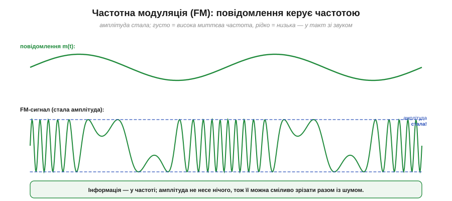
*Рис. 6.7.2.4. Там, де повідомлення велике, хвиля «густішає» (висока миттєва частота); де мале — «рідшає» (низька). А от амплітуда — стала від краю до краю: вона у FM не несе нічого. Саме тому приймач може сміливо зрізати будь-які коливання амплітуди.*

Ось де ховається перевага, яку відкрив Армстронг. Раз інформація в FM сидить **у частоті**, а **не** в амплітуді, то приймач має повне право амплітуду просто **викинути** — пропустити сигнал через **обмежувач** (*limiter*), що зрізає його до сталої «висоти». А разом з амплітудою зникає й майже весь шум, бо шум — це переважно сплески амплітуди.

### AM проти FM під одним і тим самим шумом

Порівняймо долю двох модуляцій, коли на них однаково сипле статика.


*Рис. 6.7.2.5. Зверху: шум додає сплески амплітуди — а AM саме в амплітуді несе звук, тож тріск стає чутним. Знизу: FM пропускають через обмежувач, який зрізає всі амплітудні коливання (і шум разом із ними); частота лишається недоторканою — і звук виходить чистим.*

Це і є технічне серце історії розділу. AM беззахисне перед статикою, бо не вміє відрізнити «гучніше через музику» від «гучніше через блискавку». FM же викидає амплітуду цілком — і шум іде разом із нею. Понад те: що **ширше** ми дозволяємо частоті гойдатися (більша девіація Δf), то глибше тоне шум відносно сигналу. Звідси й парадокс Армстронга: **ширша смуга → тихіше**.

Є й цікавий побічний ефект FM — **захоплення** (*capture effect*): якщо на одній частоті є два FM-сигнали, приймач «чіпляється» за **сильніший** і повністю ігнорує слабший — без каші, але й без другого голосу. Для музичного радіо це чудово (чуєш найближчу станцію чисто), а для авіації, як ми бачили, — навпаки небезпечно.

### Ціна тиші — смуга: правило Карсона

За чистоту FM платить дорого — **шириною смуги**. Скільки саме смуги займає FM-сигнал, оцінюють простим **правилом Карсона** (*Carson's rule*) — того самого Карсона, що в історії розділу «довів» марність FM:

```
B ≈ 2·(Δf + fₘ)
```

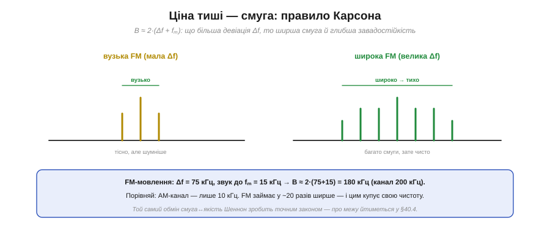
*Рис. 6.7.2.6. Мала девіація Δf — вузький спектр, тісно, але шумніше. Велика Δf — спектр широкий, смуги багато, зате чисто. FM свідомо «розтринькує» смугу заради завадостійкості — це і є виграш Армстронга.*

**Приклад (смуга FM-мовлення).** Стандарт радіомовлення: максимальна девіація Δf = 75 кГц, найвищий звуковий тон fₘ = 15 кГц:

```
B ≈ 2 × (75 + 15) кГц = 180 кГц   →  канал відводять 200 кГц
```

Порівняй це з 10-кілогерцовим каналом AM: FM-станція займає у **~20 разів** ширшу смугу! Ось ціна високоякісного, безшумного звуку. Це той самий фундаментальний **обмін «смуга ↔ завадостійкість»**, що його Армстронг намацав інженерною інтуїцією, а Клод Шеннон згодом перетворить на точний закон — до його знаменитої межі ми дійдемо в §6.7.4.

### AM проти FM: коли що

Зберімо все в одну чесну таблицю. Немає «кращої» модуляції — є компроміс.


*Рис. 6.7.2.7. AM: вузька смуга, простий приймач — але вразливе до шуму й марнує потужність на несучу. FM: стійке до завад, сталий рівень (вигідний для підсилювача) — але широка смуга й складніший приймач. Кожне виграє у своїй ніші.*

Підсумуймо інженерну суть. **AM** обирають там, де цінні простота, дешевизна й вузька смуга, а з шумом готові змиритися: AM-мовлення на середніх хвилях, авіація, далекий КХ-зв'язок (часто у вигляді SSB). **FM** — там, де головне чистота й вірність звуку, а смуги не шкода: FM-радіо, рації, звуковий супровід аналогового телебачення, перші покоління мобільного зв'язку. Додатковий, неочевидний плюс FM — **сталий рівень** сигналу: підсилювач передавача може працювати в найекономнішому режимі «на повну», не боячись спотворити амплітуду (бо вона й так стала). Це робить FM-передавачі енергетично вигідними — важлива деталь для автономних пристроїв.

Обидві ці модуляції — **аналогові**: вони беруть неперервний звук і неперервно ж крутять ручку несучої. Але світ навколо нас давно став **цифровим**: телеметрія дрона, Wi-Fi, Bluetooth (Розділ 6.5) передають не звук, а **біти** — нулі та одиниці. Як модулювати несучу дискретними символами? Тут ті самі три ручки оживають по-новому — як **цифрові** FSK і PSK. До них і переходимо.

---

## 6.7.3 Цифрова модуляція: FSK, PSK

Уся попередня тема була про **аналогове** радіо — неперервний звук плавно крутить ручку несучої. Але майже все, що ми робимо в цьому курсі, — **цифрове**: ESP32 шле байти телеметрії, Wi-Fi — пакети, Bluetooth — кадри. Передавати треба не голос, а **біти**: послідовність нулів та одиниць. Гарна новина: жодної нової фізики не потрібно. Ті самі три ручки несучої — амплітуда, частота, фаза — лишаються, тільки тепер ми крутимо їх **дискретно**, перемикаючи між кількома чіткими станами. Англійською таке перемикання називають *keying* («набивання», як на телеграфному ключі), і звідси три базові цифрові модуляції.

### Три ручки стають дискретними

Візьмемо потік бітів і подивимося, як кожна з трьох ручок перетворює його на радіосигнал.

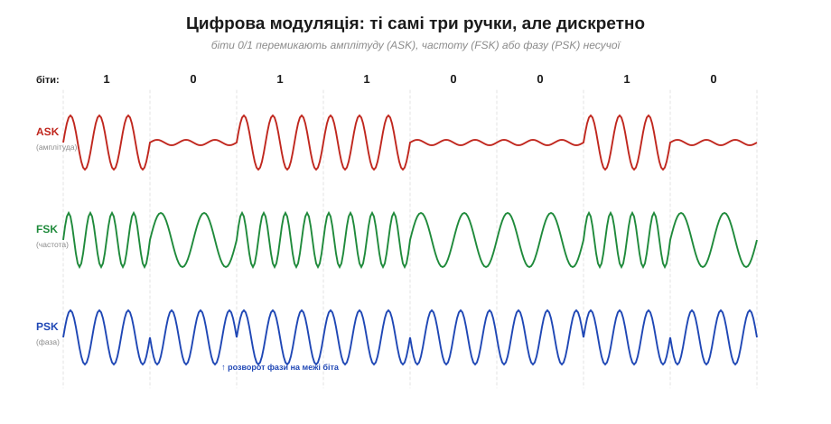
*Рис. 6.7.3.1. Один і той самий потік бітів, три способи. **ASK** (*amplitude-shift keying*) вмикає/вимикає амплітуду: 1 — несуча є, 0 — її майже нема. **FSK** (*frequency-shift keying*) дає двом бітам дві різні частоти: 1 — густіша хвиля, 0 — рідша. **PSK** (*phase-shift keying*) лишає амплітуду й частоту сталими, а на межі біта **розвертає фазу** на 180°.*

Розберімо їх. **ASK** — найпростіша: 1 — несуча увімкнена, 0 — вимкнена (крайній випадок так і звуть *on-off keying*, OOK). Так працюють найдешевші пульти на 433 МГц та інфрачервоні пульти телевізора. Проста, але вразлива — бо несе інформацію в амплітуді, з усіма бідами AM. **FSK** — це цифрова рідня FM: одна частота для 0, інша для 1. Успадковує стійкість FM до шуму, лишаючись простою; на ній стоять і старі телефонні модеми, і пейджери, і — у згладженому варіанті GFSK — сам **Bluetooth**. **PSK** — найхитріша й найважливіша для швидких ліній: інформацію кодує **фаза** несучої. Найпростіший варіант, **BPSK** (*binary PSK*), має лише два стани фази — 0° і 180°, тобто 1 біт на стан. Здавалося б, не густо — але саме PSK відкриває двері до справжнього ущільнення.

### Символ і біт — це не одне й те саме

Дійшли до ключової ідеї всього цифрового зв'язку. Досі один стан несучої кодував один біт. Але що, як зробити станів **більше**? Несуча, яку тримають незмінною протягом одного такту, називається **символом** (*symbol*). І якщо різних символів багато, кожен може нести **кілька** бітів одразу.


*Рис. 6.7.3.2. Якщо несуча має M розрізнюваних станів, то один символ кодує log₂M бітів. BPSK (2 стани) — 1 біт; QPSK (4) — 2 біти; 8-PSK (8) — 3; 16-QAM (16) — 4; 256-QAM (256) — аж 8 бітів на один символ. Подвоїти кількість станів — це додати рівно один біт на символ.*

**Приклад (скільки бітів несе символ).** Формула проста — біт на символ дорівнює log₂ від кількості станів M:

```
BPSK   : M = 2   → log₂2   = 1 біт/символ
QPSK   : M = 4   → log₂4   = 2 біти/символ
16-QAM : M = 16  → log₂16  = 4 біти/символ
256-QAM: M = 256 → log₂256 = 8 бітів/символ
```

Ось у чому магія: **QPSK передає вдвічі більше даних, ніж BPSK, у тій самій смузі й за той самий час** — просто тому, що має 4 стани замість 2. Здавалося б, безкоштовний обід: нарощуй кількість станів — і качай скільки завгодно. Але дарма — за все треба платити, і платять тут **запасом на шум**.

### Сузір'я: карта станів несучої

Щоб побачити стани символів наочно, інженери малюють **сузір'я** (*constellation diagram*) — карту, де кожен можливий стан несучої позначено точкою на площині. Дві координати цієї площини — **I** (синфазна складова) та **Q** (квадратурна) — разом задають і амплітуду (відстань точки від центру), і фазу (кут) несучої; це той самий [фазорний](book:math/phasors) запис коливання, тільки тепер на ньому позначено дискретні стани.

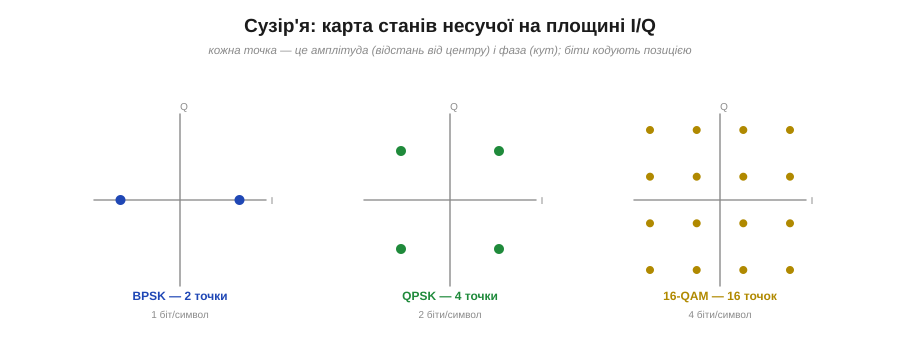
*Рис. 6.7.3.3. BPSK — дві точки на одній осі (1 біт). QPSK — чотири точки квадратом (2 біти): чотири різні фази однакової амплітуди. 16-QAM — сітка 4×4 з 16 точок (4 біти): тут кодують і фазу, **і** амплітуду одночасно. Що більше точок — то більше бітів на символ.*

Коли станів стає багато, самої лише фази вже не вистачає — точки на колі надто тісняться. Тоді комбінують **дві ручки разом**: і фазу, і амплітуду. Така змішана модуляція зветься **QAM** (*quadrature amplitude modulation*, квадратурна амплітудна модуляція), і саме вона — робоча конячка сучасного швидкісного зв'язку: 16-QAM, 64-QAM, 256-QAM працюють у Wi-Fi, LTE, кабельних модемах і цифровому ТБ. Сузір'я 256-QAM — це щільна сітка 16×16 точок, кожна з яких несе цілих 8 бітів.

### Чому не можна ущільнювати нескінченно

Якщо більше точок — це більше даних, чому б не зробити мільйон точок і не качати терабіти? Відповідь — **шум**, і сузір'я показує її напрочуд наочно.

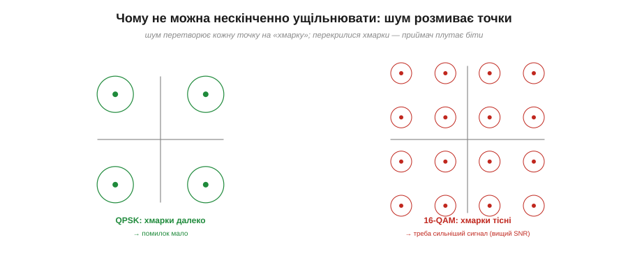
*Рис. 6.7.3.4. Шум зміщує кожен прийнятий символ — ідеальна точка перетворюється на «хмарку» розкиду. Поки хмарки далеко одна від одної (QPSK), приймач упевнено розрізняє стани. Але натисни 16 точок у той самий квадрат — хмарки зближуються, починають перекриватися, і приймач плутає сусідні символи: це бітові помилки.*

Ось плата за швидкість. Кожна реальна, прийнята антеною точка трохи зміщена шумом — вона лягає не точно на місце, а десь поряд, у «хмарці» розкиду. Поки сусідні точки сузір'я стоять **далеко**, хмарки не перетинаються, і приймач безпомилково вгадує, який символ надіслано. Але що **тісніше** напхано точок, то ближче хмарки — і за певного рівня шуму вони зливаються, а приймач починає помилятися. Висновок залізний: **ущільнення сузір'я вимагає чистішого сигналу** — вищого відношення сигнал/шум (*signal-to-noise ratio*, SNR). 256-QAM можливе лише близько до передавача й у чистому ефірі; здалеку чи крізь стіни доводиться вертатися до простих, рідких сузір'їв.

### Бод проти біт за секунду

Тут варто розчистити поширену плутанину — між **символьною** і **бітовою** швидкістю. Згадаймо термін **бод** (*baud*) з [Розділу 6.1](../uart/uart.md): це число **символів** за секунду, тобто як часто ми міняємо стан несучої. А **бітова швидкість** (біт/с) — це скільки **бітів** за секунду реально проходить. І це різні речі!


*Рис. 6.7.3.5. Бітова швидкість = символьна швидкість (бод) × (біт на символ). За тих самих 1 Мбод: BPSK дає 1 Мбіт/с, QPSK — 2 Мбіт/с, 16-QAM — 4 Мбіт/с. Та сама смуга, та сама швидкість зміни символів — а пропускна здатність різна, бо різна «вантажність» символу.*

**Приклад (з бода в біти).** Хай символьна швидкість 1 Мбод (мільйон символів за секунду):

```
бітова швидкість = бод × log₂M
BPSK  : 1 Мбод × 1 = 1 Мбіт/с
QPSK  : 1 Мбод × 2 = 2 Мбіт/с
16-QAM: 1 Мбод × 4 = 4 Мбіт/с
```

Це розвіює стару плутанину «бод = біт/с», яку ми зауважили ще в Розділі 6.1: вони збігаються **лише** для двійкових схем (1 біт/символ), а в усіх сучасних — біт/с у рази більший за бод. Символьна швидкість визначає, скільки **смуги** треба (про це §6.7.4); а біт/с ми вже піднімаємо понад це, напихаючи більше бітів у кожен символ.

### Головний компроміс — і як його обходять

Складімо все докупи. Маємо два важелі швидкості: крутити символи **частіше** (більший бод — більша смуга) або робити кожен символ **вантажнішим** (більше точок у сузір'ї — вищий потрібний SNR). Обидва впираються в межу.

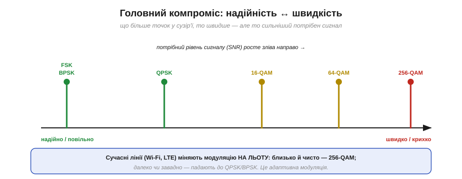
*Рис. 6.7.3.6. Зліва направо росте швидкість — і водночас крихкість: FSK і BPSK найнадійніші, але повільні; 256-QAM найшвидше, але живе лише за відмінного сигналу. Сучасні системи не обирають щось одне назавжди, а міняють модуляцію **на льоту** залежно від якості каналу.*

> 🔧 **Навіщо це.** Звідси — одна з найрозумніших ідей сучасного зв'язку: **адаптивна модуляція**. Wi-Fi-роутер чи стільниковий модем **не** використовують одну фіксовану схему. Сидиш поруч із роутером, сигнал відмінний — він перемикається на щільне 256-QAM і качає на повну. Відійшов у дальню кімнату, сигнал ослаб — він плавно **знижує** модуляцію до 64-QAM, 16-QAM, аж до надійного QPSK, жертвуючи швидкістю заради того, щоб зв'язок узагалі не впав. Ось чому що далі від роутера, то повільніший Wi-Fi: він не «слабшає» сам собою — він **свідомо** обирає повільнішу, але стійкішу модуляцію. Знаючи це, ти інакше дивишся на смужки сигналу: вони — про вибір сузір'я.

### Що насправді вживають наші радіо

Усі ці абстракції — не теорія заради теорії, а саме те, що працює всередині знайомих чіпів із [Розділу 6.5](../wifi-bluetooth/wifi-bluetooth.md).

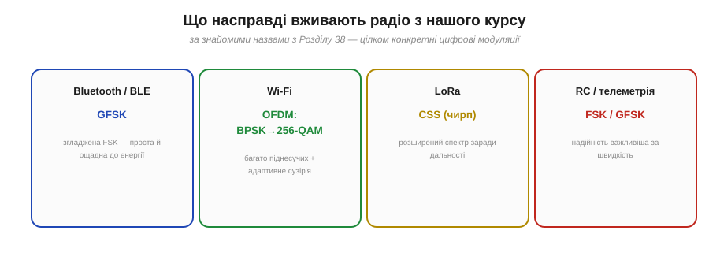
*Рис. 6.7.3.7. **Bluetooth / BLE** — GFSK (згладжена FSK): проста й ощадна до енергії. **Wi-Fi** — OFDM (багато піднесучих) з адаптивним сузір'ям від BPSK до 256-QAM. **LoRa** — CSS (чирп, розширений спектр) заради дальності. **RC-керування й телеметрія дрона** — FSK/GFSK, де надійність важливіша за швидкість.*

Тепер за знайомими назвами проступає конкретика. **Bluetooth і BLE** користуються **GFSK** — це FSK, у якій перемикання частоти згладжене (щоб не «бризкати» в сусідні канали), проста й енергоощадна. **Wi-Fi** — найскладніший: він ділить канал на безліч вузьких **піднесучих** (схема OFDM) і на кожній крутить адаптивне сузір'я аж до 256-QAM. **LoRa**, що творить диво дальності для IoT, застосовує особливу модуляцію на **чирпах** (CSS) — це різновид розширеного спектра, до якого ми дійдемо в §6.7.5. А **RC-лінк** і **телеметрія** дрона (Розділ 6.9) тримаються FSK/GFSK або [LoRa](book:components/lora-module) — там, де надійність дорожча за гігабіти.

Ми весь час упиралися в одну й ту саму стіну: **смуга** й **шум** обмежують, скільки даних можна пропхати. FM Армстронга міняла смугу на тишу; цифрові сузір'я міняють SNR на біти. За всім цим стоїть **єдиний фундаментальний закон**, що пов'язує смугу, шум і максимально можливу швидкість, — і його справді існує. Його 1948 року вивів Клод Шеннон, і саме до цієї межі — теоретичної стелі будь-якого зв'язку — ми тепер і підійдемо.

---

## 6.7.4 Смуга й швидкість (натяк на межу Шеннона)

Уся попередня розмова — про FM, про сузір'я, про адаптивну модуляцію — крутилася навколо одного питання: **скільки** даних можна пропхати через канал? І щоразу ми впиралися в дві стіни: **смугу** й **шум**. Виявляється, ці дві стіни — не випадкові перешкоди, які колись хитрий інженер обійде. Вони — прояв **фундаментального закону природи**, такого ж непорушного, як закон збереження енергії. Цей закон 1948 року вивів **Клод Шеннон** (*Claude Shannon*), і він каже точно, яка **максимальна** швидкість можлива в каналі з даною смугою й даним шумом. Не «приблизно», не «за нинішніх технологій» — а **назавжди**.

> ⚠️ Це тема-«натяк»: ми не виводитимемо формулу й не занурюватимемося в математику теорії інформації. Мета — відчути **зміст** межі Шеннона й те, як вона пояснює все, що ми вже бачили. Це той випадок, коли одна проста формула раптом висвітлює цілий розділ.

### Формула, що ставить стелю

Ось вона — одна з найважливіших формул у всій техніці зв'язку:


*Рис. 6.7.4.1. C = B · log₂(1 + S/N). Тут C — максимальна швидкість без помилок (біт/с), B — смуга каналу (Гц), S/N — відношення сигнал/шум (у **разах**, не в децибелах). Нижче за C зв'язок без помилок можливий; вище — неможливий за жодних хитрощів.*

Прочитаймо її по-людськи. Зліва — **C**, *capacity*, пропускна здатність: гранична швидкість у бітах за секунду, яку канал узагалі здатен пропустити **без помилок**. Справа — два множники. **B** — смуга каналу в герцах (та сама, що ми рахували для AM і FM). І **S/N** — відношення потужності сигналу до потужності шуму, **в разах** (увага: не в децибелах!). Логарифм за основою 2 перетворює це на біти. Уся глибина — в тому, **як саме** C залежить від цих двох важелів. Бо залежить вона дуже по-різному.

### Два важелі — і вони нерівноцінні

Подивись на формулу уважно: B стоїть **множником** попереду, а S/N — **усередині логарифма**. Це означає, що два способи наростити швидкість працюють зовсім не однаково.

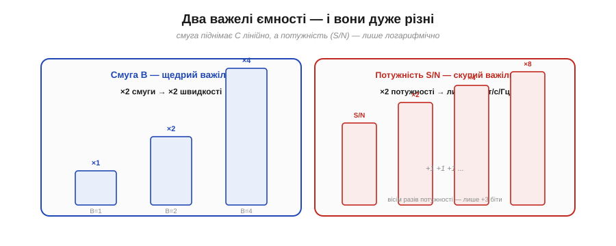
*Рис. 6.7.4.2. Смуга B — щедрий важіль: подвоїв смугу — подвоїв швидкість (лінійна залежність). Потужність (S/N) — скупий важіль: щоб додати лише один біт/с на кожен герц смуги, треба **подвоїти** потужність; а ще один біт — знову подвоїти, і так далі.*

**Смуга** входить лінійно: удвічі ширша смуга — удвічі більша ємність, утричі — утричі. Чесний, щедрий обмін. А от **потужність** захована в логарифмі, і логарифм — скнара. Щоб додати фіксовану кількість бітів, потужність треба не додавати, а **множити**. Звідси проста й глибока істина: **розширювати смугу — ефективніше, ніж нарощувати потужність**. Можна качати енергію в передавач хоч до посиніння — а виграш у швидкості зростатиме лише крихітними логарифмічними кроками.

### Чому потужність дає так мало

Придивімося до цього логарифма уважніше — він пояснює багато дивних на перший погляд речей у радіо.

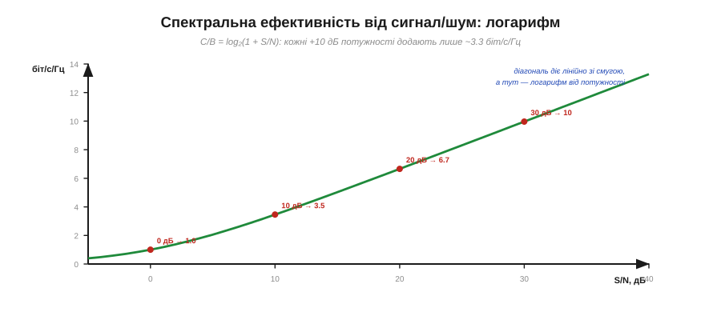
*Рис. 6.7.4.3. Крива C/B = log₂(1 + S/N) — **спектральна ефективність** (біт/с на кожен герц). Вона росте з потужністю, але дедалі повільніше: кожні додаткові +10 дБ сигналу дають лише близько +3.3 біт/с/Гц. Перші децибели цінні, дальші — майже марні.*

**Приклад (як дорого коштує кожен біт).** Порахуймо спектральну ефективність C/B = log₂(1 + S/N) для кількох рівнів сигналу:

```
S/N =  0 дБ (×1)    : log₂(1+1)    = 1.0  біт/с/Гц
S/N = 10 дБ (×10)   : log₂(1+10)   ≈ 3.5  біт/с/Гц
S/N = 20 дБ (×100)  : log₂(1+100)  ≈ 6.7  біт/с/Гц
S/N = 30 дБ (×1000) : log₂(1+1000) ≈ 10.0 біт/с/Гц
```

Бачиш закономірність? Стрибок із 0 до 10 дБ (удесятеро більше потужності!) додав 2.5 біта; наступні +10 дБ (ще вдесятеро) — лише 3.2. А загальне правило для сильного сигналу таке: **+3 дБ потужності (удвічі) додають лише ~1 біт/с/Гц**. Ось чому в радіо не «вирішують проблему потужністю»: після певної межі це дорого й майже безрезультатно. Згадай §6.6.5 — там ми бачили, як швидко тануть децибели; тепер ясно, що й купувати ними біти виходить дедалі дорожче.

### Стіна можливого

Найважливіше у формулі Шеннона — слово **межа**. C — це не «типове значення» й не «рекорд». Це **абсолютна стіна**.


*Рис. 6.7.4.4. Ліворуч від межі (нижчі швидкості) — зона **можливого**: існує таке кодування, що дає зв'язок майже без помилок навіть у шумі. Праворуч (вище за C) — зона **неможливого**: жодна модуляція, жодне кодування, жодна геніальність не дадуть надійного зв'язку. Підійти до стіни можна скільки завгодно близько — перетнути не можна.*

І тут — найкрасивіше й найнесподіваніше у відкритті Шеннона. Він довів **дві** речі одразу. По-перше, що вище за C надійний зв'язок **неможливий** — хоч що роби. Але по-друге — і це його справжній тріумф — що **до самої межі** C можна підійти **скільки завгодно близько**, зробивши зв'язок майже без помилок навіть у сильному шумі, якщо застосувати достатньо розумне **кодування**. До Шеннона інженери вірили, що шум неминуче псує частину повідомлень і з цим нічого не вдієш. Шеннон показав: ні — поки ти **під** межею, помилки можна загнати як завгодно близько до нуля. Уся сучасна **завадостійка** передача (від QR-кодів до 5G і зв'язку з марсоходами) виросла з цієї обіцянки.

### Класичний приклад: чому модем застряг на 33.6k

Абстракція ожива́є на конкретному числі. Найвідоміший приклад — **дозвонний модем** (*dial-up modem*), яким користувалися для виходу в інтернет через телефонну лінію.


*Рис. 6.7.4.5. Телефонна лінія: смуга ≈ 3100 Гц, сигнал/шум ≈ 30 дБ (×1000). Підставляємо у Шеннона: C ≈ 3100 · log₂(1001) ≈ 31 000 біт/с. Ось чому дозвонні модеми вперлися саме в ~33.6 кбіт/с — це фізична стеля самої лінії, а не вада техніки.*

**Приклад (межа телефонної лінії).** Телефонна лінія пропускає смугу близько 3.1 кГц, а типове відношення сигнал/шум на ній — близько 30 дБ, тобто ×1000:

```
C = B · log₂(1 + S/N)
C = 3100 · log₂(1 + 1000)
C = 3100 · 9.97 ≈ 30 900 біт/с  ≈  31 кбіт/с
```

І ось вона, розгадка історичної загадки: дозвонні модеми **десятиліттями** вдосконалювали — а вони вперто застрягали біля **33.6 кбіт/с**. Не тому, що інженери були недолугі, а тому, що це **межа Шеннона** для телефонної лінії. Підійти до неї ближче можна, перейти — ні. А славнозвісні «56k»-модеми? Вони не побили закон Шеннона — вони **змінили умову задачі**: зробили один бік лінії (з боку провайдера) повністю цифровим, прибравши один етап перетворення й піднявши тим ефективний S/N. Інакше кажучи, не перестрибнули стіну, а **відсунули** її, змінивши канал. Закон лишився непорушним.

### Один закон під усім розділом

Тепер можна повернутися назад і побачити весь розділ новими очима.


*Рис. 6.7.4.6. Усі модуляції — це різні стратегії торгівлі в межах Шеннона. FM Армстронга міняє **смугу** на запас від шуму. QAM-сузір'я міняють **S/N** на біти за символ. Розширений спектр (далі, §6.7.5) міняє смугу на стійкість і скритність. Різні угоди — один і той самий «обмінний курс», що його задає Шеннон.*

> 🔧 **Навіщо це.** Межа Шеннона — це компас для будь-якого радіоінженера. Вона **не каже**, *як* побудувати лінію (це робота модуляції й кодування), зате каже, *скільки* в принципі можливо — і тим рятує від гонитви за неможливим. Не качається потрібна швидкість? Формула одразу показує, де важіль: розширити смугу (щедро, лінійно) чи підняти S/N (скупо, логарифмічно — більша антена, ближче, менше завад). Саме так міркують, проєктуючи Wi-Fi, стільниковий зв'язок, супутникові лінії й телеметрію дрона. А ще вона тверезить: коли реклама обіцяє «безмежну швидкість», ти знаєш — межа є, і вона має ім'я.

### Людина за межею

Цю стелю варто пов'язати з людиною, бо за нею стоїть один з найбільших умів XX століття.


*Рис. 6.7.4.7. Клод Шеннон (1916–2001) у статті «A Mathematical Theory of Communication» (1948, Bell Labs) заснував **теорію інформації**, ввів у науку **біт** як одиницю інформації й довів межу C. Чесно про попередників: Гаррі Найквіст (1924) і Ралф Гартлі (1928) із тих самих Bell Labs заклали підвалини — тому теорему й звуть «Шеннон–Гартлі».*

**Клод Шеннон** — американський математик та інженер із Bell Labs, якого по праву називають батьком **теорії інформації**. Його стаття 1948 року зробила те, що до неї здавалося неможливим: перетворила розпливчасте поняття «інформація» на **точну, вимірювану величину**. Саме звідти в науку ввійшов **біт** як одиниця інформації — та сама, якою ми міряємо все цифрове. Як завжди в історії техніки, Шеннон стояв на плечах попередників: **Гаррі Найквіст** (*Harry Nyquist*, 1924) і **Ралф Гартлі** (*Ralph Hartley*, 1928), теж із Bell Labs, заклали підвалини — і тому повну назву теореми пишуть як «**Шеннон–Гартлі**». Але саме синтез 1948 року, що дав точну, остаточну межу й довів досяжність майже-безпомилкового зв'язку, належить Шеннону. Це чесний розклад: наука колективна, але буває й момент генія, що зводить усе в одне.

Отже, ми маємо стелю. Найприродніший спосіб піднятися до неї, як підказує формула, — **розширити смугу**. Але широка смуга дає не лише швидкість: якщо «розмазати» сигнал по дуже широкій смузі особливим чином, він стає на диво **стійким до завад** і навіть **непомітним** для чужого вуха. Цю контрінтуїтивну ідею — **розширений спектр** і **стрибки частоти** — винайшли несподівані люди за несподіваних обставин (про це — історія до наступної теми). До неї і переходимо.

---

## 6.7.5 Завадостійкість і розширений спектр

Дотепер ми ставилися до смуги ощадливо: займай рівно стільки, скільки треба для твоїх даних, не більше. Це здоровий глузд — спектр дорогий, його ділять усі. А тепер — ідея, що цьому здоровому глузду суперечить: візьмемо вузький сигнал і **навмисне** розмажемо його по смузі в десятки й сотні разів ширшій, ніж потрібно. Звучить як марнотратство. Але ця «марнотратна» хитрість — **розширений спектр** (*spread spectrum*) — дарує одразу три коштовні властивості: стійкість до завад, скритність і можливість багатьом говорити в одній смузі. Вона лежить в основі Bluetooth, Wi-Fi, GPS і LoRa — тобто майже всього бездротового, що ти тримав у руках.

> 📜 **До цієї теми — історія:** [Геді Ламарр — акторка, що винайшла стрибки частоти](hist-hedy-lamarr.md). Голлівудська зірка й композитор-авангардист запатентували стрибки частоти ще 1942 року — за десятиліття до того, як інженери змогли їх утілити. Історія показує і саму ідею «вживу», і чесний бік авторства: як справжній внесок несправедливо забувають — і як його повертати, не впадаючи в протилежний міф.

### Дивна ідея: розмазати сигнал якнайтонше

Почнімо з суті — що означає «розширити спектр» і навіщо.

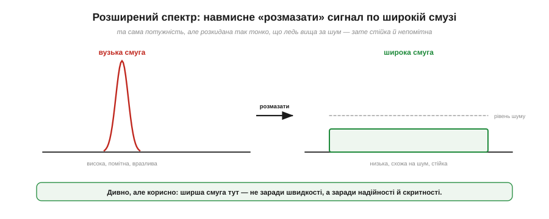
*Рис. 6.7.5.1. Зліва: звичайний вузький сигнал — висока, помітна купка потужності на одній частоті. Справа: та сама потужність, але розмазана по широченній смузі — низька, плоска, ледь вища за рівень шуму. Тут ширша смуга береться не заради швидкості (як у Шеннона), а заради **надійності й непомітності**.*

Ключ — у **густині потужності**. Коли ту саму енергію розмазують по дуже широкій смузі, на кожен окремий герц припадає **крихта** потужності — сигнал стає низьким і пласким, ледь помітним над шумом. На перший погляд це безглуздо: ми ж наче псуємо власний сигнал, топлячи його в шумі. Та насправді приймач, який **знає секрет** розмазування, легко збере сигнал назад, а от усе чуже — завади, глушилки, підслуховувачі — на цьому спіткнеться. Є два головні способи так «розмазати»: **стрибати** частотою або **множити** на швидкий код. Розберімо обидва.

### Стрибки частоти: FHSS

Перший спосіб — найнаочніший. Замість того щоб сидіти на одній частоті, передавач **перестрибує** з каналу на канал за певним розкладом, а приймач стрибає **синхронно** з ним. Це **стрибки частоти** (*frequency-hopping spread spectrum*, FHSS).

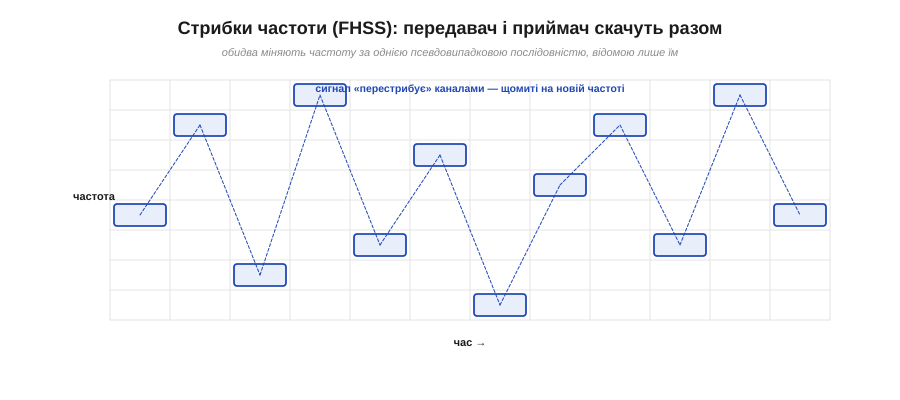
*Рис. 6.7.5.2. На сітці «частота × час» сигнал щомиті опиняється на новій частоті, рухаючись за **псевдовипадковою** послідовністю. Її знають лише передавач і приймач, тож вони весь час «зустрічаються» на одному каналі. Для стороннього спостерігача стрибки виглядають як хаотичне мерехтіння по всій смузі.*

Послідовність стрибків **псевдовипадкова**: вона виглядає випадковою, але насправді породжена відомим обом сторонам алгоритмом — тому передавач і приймач завжди опиняються на одній частоті в один час. Стороннє вухо, що не знає послідовності, чує лише короткі уривки то тут, то там по всій широкій смузі — зібрати з них повідомлення неможливо. А найцінніше — як FHSS поводиться з **завадами**.

### Чому стрибки б'ють заваду

Уяви, що частина смуги зайнята — там сидить чужий передавач, завада чи навіть навмисна глушилка. Для звичайного радіо на тій частоті це смерть. Для стрибучого — лише подряпина.

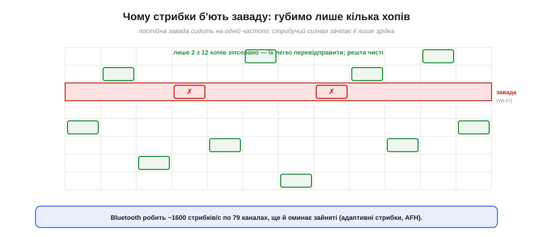
*Рис. 6.7.5.3. Завада (скажімо, Wi-Fi) постійно сидить на одному каналі — це червона смуга. Стрибучий сигнал залітає на неї лише зрідка: з дванадцяти стрибків зіпсовано хіба два. Їх легко перевідправити, а решта десять проходять чисто. Постійна вузька завада безсила проти того, хто весь час тікає.*

Логіка проста й красива: завада нерухома, а ти весь час тікаєш. Вона псує лише ті нечисленні стрибки, що випадково потрапили на її частоту, — а їх легко виявити (за контрольною сумою з Розділу 6.1) і **перевідправити**. **Приклад:** саме так працює **Bluetooth** — він робить близько **1600 стрибків за секунду** по **79** каналах (Classic) і ще й застосовує **адаптивні** стрибки (*adaptive frequency hopping*, AFH): помічає, які канали зайняті Wi-Fi, і навмисне їх оминає. Ось чому Bluetooth-навушники й Wi-Fi-роутер уживаються в одній кімнаті на тому самому діапазоні 2.4 ГГц, майже не заважаючи одне одному.

### Пряма послідовність: DSSS

Другий спосіб розмазування хитріший і не такий наочний, зате потужніший — **пряма послідовність** (*direct-sequence spread spectrum*, DSSS). Тут частоту не міняють; натомість **кожен біт даних множать на швидку псевдовипадкову послідовність** коротких імпульсів — **чипів** (*chips*).

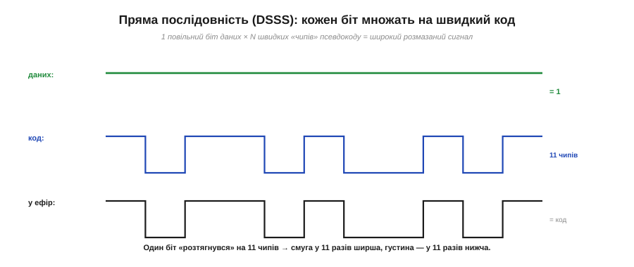
*Рис. 6.7.5.4. Один повільний біт даних (тут +1) множиться на швидкий код із N чипів (тут 11). На виході — послідовність чипів, що міняється у N разів частіше за дані. Швидші переходи означають ширший спектр: смуга розтягується в N разів, а густина потужності падає в N разів.*

Суть у тому, що швидке «дрібнення» біта на чипи **розширює** його спектр: чим коротші імпульси, тим ширша смуга (це зворотний бік зв'язку «швидше = ширше» з §6.7.4). Один біт «розтягується» на 11 чипів — і займає в 11 разів ширшу смугу, ставши в 11 разів нижчим. Та сама послідовність чипів (її звуть **розширювальним кодом**) відома приймачеві — і саме вона творить головне диво.

### Диво розгортання: виграш обробки

Ось кульмінація. На приймальному боці прийнятий сигнал **знову множать на той самий код** — і відбувається щось майже чарівне.

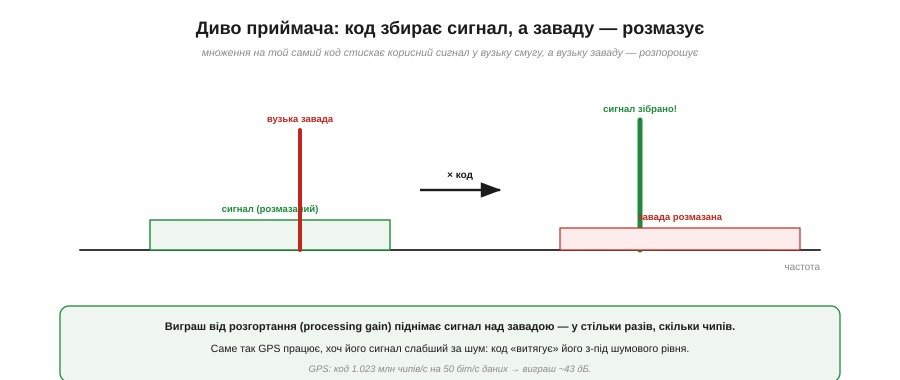
*Рис. 6.7.5.5. Множення на «свій» код **стискає** розмазаний корисний сигнал назад у вузьку високу купку — він підіймається над шумом. А будь-яку вузьку **заваду** той самий код, навпаки, **розмазує** широко й низько. Корисне зростає, чуже тоне: відношення сигнал/шум стрибає вгору.*

Це називають **виграшем обробки** (*processing gain*): код одночасно **збирає** свій сигнал докупи й **розпорошує** все чуже. Виграш дорівнює кількості чипів — у скільки разів розтягнули, у стільки ж піднявся сигнал над завадою.

**Приклад (як GPS чує сигнал з-під шуму).** Найдивовижніший наслідок — сигнал можна впевнено приймати, навіть коли він **слабший за шум**. Саме так працює [GPS](book:components/gnss-module): сигнал супутника біля Землі настільки кволий, що тоне під рівнем теплового шуму, — і все одно приймач його витягує:

```
код GPS  : ~1 023 000 чипів/с
дані     : 50 біт/с
виграш ≈ 10·log₁₀(1 023 000 / 50) ≈ 10·log₁₀(20 460) ≈ 43 дБ
```

Сорок три децибели виграшу (згадай §6.6.5 — це більш ніж у 20 000 разів!) піднімають похований у шумі сигнал високо над ним. Без розширеного спектра GPS був би просто неможливий. (Для порівняння: старий Wi-Fi 802.11b брав 11-чиповий код Баркера — виграш ~10.4 дБ.)

### Три дарунки за одну ціну

Підсумуймо, що ми купуємо за «змарновану» широку смугу.


*Рис. 6.7.5.6. Перше — **стійкість до завад**: вузька завада чи глушилка псує лише частину сигналу. Друге — **скритність** (*low probability of intercept*): без коду сигнал не відрізнити від шуму, його важко виявити й майже неможливо підслухати. Третє — **множинний доступ**: багато пар із різними кодами говорять в одній смузі, не плутаючись (це CDMA — основа стільникового зв'язку 2G/3G).*

> 🔧 **Навіщо це.** Зверни увагу, що ця ідея — **знову** про обмін у дусі Шеннона (§6.7.4), тільки тепер ми міняємо смугу не на швидкість, а на **надійність і скритність**. Платимо широкою смугою — отримуємо зв'язок, що проходить крізь завади, ховається в шумі й пускає багатьох в один канал. Не дивно, що **народилася** ця ідея у **військових**: радіо, яке неможливо заглушити чи запеленгувати, — мрія будь-якої армії. А вже потім вона спустилася в цивільне життя й оселилася в кожній кишені. І винайшли її, як ми ось-ось побачимо, абсолютно несподівані люди.

### Хто цим користується (а ти й не знав)

Наостанок — де ця «екзотика» працює насправді. Виявляється, всюди.


*Рис. 6.7.5.7. **Bluetooth** — FHSS (1600 стрибків/с). **Wi-Fi** (ранній 802.11b) — DSSS із кодом Баркера. **GPS** — DSSS, що витягує сигнал з-під шуму. **LoRa** — CSS на чирпах, заради дальності в кілометри. «Військова» технологія давно живе в кишені кожного.*

Тепер мозаїка склалася. **Bluetooth** стрибає частотою (FHSS), **Wi-Fi** першого покоління розмазував код (DSSS), **GPS** без розширеного спектра був би неможливий узагалі, а **LoRa** (згадана в §6.7.3) застосовує родинну техніку — **чирпи** (*chirp spread spectrum*, CSS), де частота плавно «їде» вгору-вниз, даючи дальність на кілометри за мізерної потужності. Те, що колись винаходили для незаглушуваного військового зв'язку, тепер з'єднує твій телефон із навушниками й показує дорогу на мапі.

І ось що найдивовижніше в цій історії: ключову ідею стрибків частоти запатентувала 1942 року **голлівудська кінозірка** — разом із композитором-авангардистом. Звучить як вигадка, але це чистісінька правда, і вона варта окремої розповіді (історія до цієї теми). А ми, маючи в руках уже **весь арсенал** модуляцій — від AM до розширеного спектра, — готові до головного інженерного питання всього розділу: як, склавши **всі** підсилення й втрати в децибелах, **порахувати наперед**, чи працюватиме радіолінія. Це — **бюджет радіолінії**.

---

## 6.7.6 Бюджет радіолінії

Дійшли до найпрактичнішої теми всього розділу — і, можливо, всього курсу радіо. Усе, що ми вивчили — потужність і децибели (§6.6.5), загасання у просторі (§6.6.6), модуляцію та її чутливість до шуму (§6.7.2–6.7.4), — нарешті складається в **один інструмент**, що відповідає на головне інженерне питання: «**Чи працюватиме цей зв'язок на потрібній відстані?**» Інструмент називається **бюджет радіолінії** (*link budget*), і це не складна теорія, а проста, майже бухгалтерська **арифметика додавання й віднімання децибел**. Опанувавши її, ти зможеш ще до паяння прикинути, добиватиме твій дрон на кілометр чи заглухне за сусіднім будинком.

### Уся лінія — як рахунок у децибелах

Ідея бюджету геніально проста. Сигнал виходить із передавача з певною потужністю, дорогою щось **додає** (підсилення антен), а щось **віднімає** (втрати в просторі, стінах, кабелі). На вході приймача лишається якась решта — і питання лише в тому, **чи вистачить** цієї решти, щоб приймач її розчув.

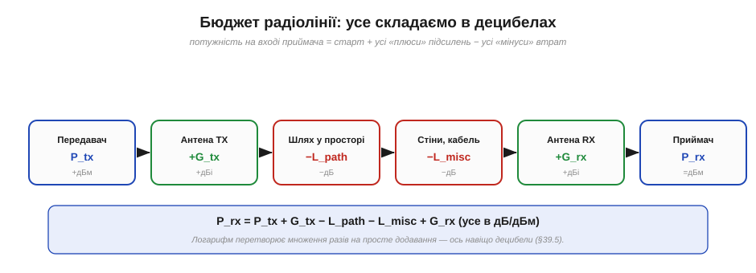
*Рис. 6.7.6.1. Сигнал проходить ланцюг: потужність передавача **+** підсилення його антени **−** втрати у просторі **−** інші втрати (стіни, кабель) **+** підсилення антени приймача **=** потужність на вході приймача. Кожна ланка — окреме явище з попередніх тем, а все разом — простий рядок додавань і віднімань.*

Запишімо це одним рядком — головною формулою теми:

```
P_rx = P_tx + G_tx − L_path − L_misc + G_rx
```

де P_rx — потужність на вході приймача (дБм), P_tx — потужність передавача (дБм), G_tx і G_rx — підсилення антен (дБі), L_path — втрати у просторі (дБ), L_misc — усі інші втрати (дБ). І ось чому це так зручно: завдяки **децибелам** (§6.6.5) усі множення перетворилися на **додавання**. Замість того щоб перемножувати разові коефіцієнти підсилень і втрат, ми просто складаємо стовпчик «плюсів» і «мінусів» — як рахунок витрат і прибутків. Саме заради цієї простоти інженери й перейшли на логарифмічну шкалу.

### З чого складається рахунок

Розберімо кожен доданок — і побачимо, що це старі знайомі з попередніх тем.


*Рис. 6.7.6.2. Шість величин бюджету: потужність передавача P_tx, підсилення антен G_tx і G_rx, втрати у просторі L_path (§6.6.6), інші втрати L_misc, і поріг приймача — чутливість S_rx. Поряд — типові значення для реальних радіо: BLE, Wi-Fi, LoRa.*

Пройдімося по складниках. **P_tx** — потужність передавача в дБм: від скромних +4 дБм у BLE до +20 дБм (100 мВт) у Wi-Fi. **G_tx, G_rx** — підсилення антен у дБі: всебічний штир дає близько +2, спрямована тарілка — до +20 і більше. **L_path** — ті самі втрати у вільному просторі з §6.6.6, найбільший пожирач: близько 60 дБ уже на 10 метрах для 2.4 ГГц. **L_misc** — усе інше, що з'їдає сигнал: стіни, кабель, роз'єми, дощ, людське тіло біля антени — від кількох до десятків децибел. І нарешті ключовий поріг — **S_rx**, **чутливість приймача** (*sensitivity*): найслабша потужність, яку він іще здатен розшифрувати. Це від'ємне число в дБм, і що воно **нижче**, то кращий приймач.

### EIRP: антена концентрує, а не додає

Маленька, але важлива тонкість про підсилення антени. Коли ми пишемо «+12 дБі», легко подумати, ніби антена якимось чудом **додає** енергії. Це не так — енергію дає лише передавач.

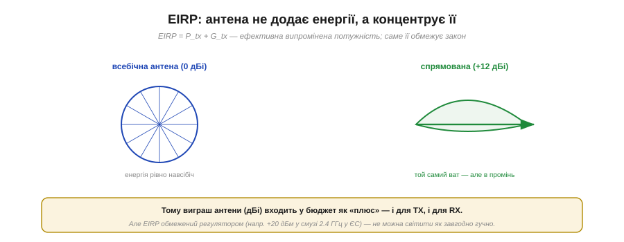
*Рис. 6.7.6.3. Всебічна антена розкидає потужність рівно навсібіч (0 дБі). Спрямована бере той самий ват і **концентрує** його у вузький промінь — у цьому напрямку сигнал сильніший, ніби потужність зросла. Суму P_tx + G_tx звуть EIRP — ефективна випромінена потужність; саме її обмежує регулятор.*

Антена не виробляє енергію, а **перерозподіляє** її: спрямована «забирає» потужність із боків і кидає її вперед, тож **у потрібному напрямку** сигнал такий, ніби передавач став потужнішим. Тому виграш антени й входить у бюджет як «плюс». Суму **P_tx + G_tx** називають **EIRP** (*equivalent isotropic radiated power*) — і саме її, а не «голу» потужність, обмежує закон: наприклад, у смузі 2.4 ГГц у Європі EIRP не може перевищувати близько +20 дБм. Не можна світити в ефір як завгодно гучно — спектр спільний.

### Рахуємо приклад: водоспад децибел

Тепер — найкорисніше: порахуймо реальний бюджет від початку до кінця. Найнаочніше це показати **водоспадом** — як рівень сигналу падає й підіймається крок за кроком.

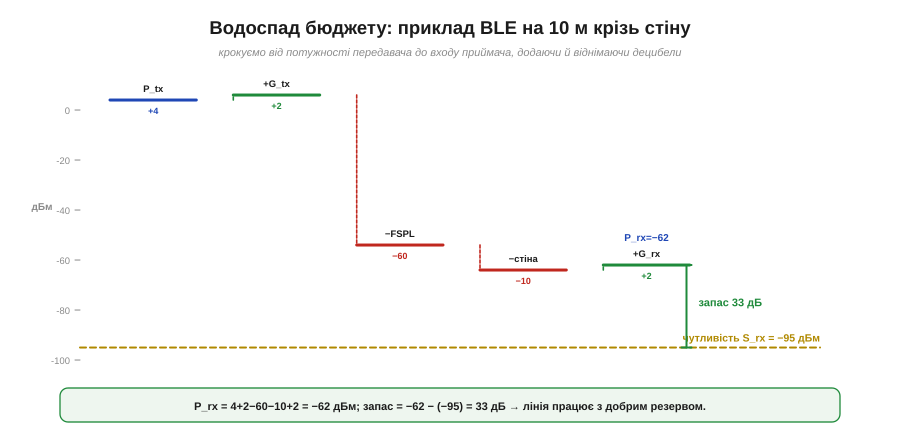
*Рис. 6.7.6.4. Крокуємо від +4 дБм передавача: +2 дБі антени, −60 дБ простору, −10 дБ стіни, +2 дБі антени приймача — і опиняємося на −62 дБм. Поріг чутливості −95 дБм лежить нижче, тож між сигналом і порогом — **запас 33 дБ**. Лінія працює з добрим резервом.*

**Приклад (повний бюджет BLE-лінії).** Маячок BLE передає на 10 метрів крізь одну стіну. Складаємо стовпчик:

```
P_tx   = +4 дБм      (передавач BLE)
G_tx   = +2 дБі      (антена-штир)
L_path = −60 дБ      (вільний простір, 10 м, 2.4 ГГц — з §6.6.6)
L_misc = −10 дБ      (одна стіна + дрібні втрати)
G_rx   = +2 дБі      (антена приймача)
─────────────────────────────
P_rx   = 4 + 2 − 60 − 10 + 2 = −62 дБм
```

Тепер головне порівняння. Чутливість BLE-приймача — близько **−95 дБм**. Наш сигнал прийшов на −62 дБм, тобто **набагато гучніше** за поріг:

```
запас лінії = P_rx − S_rx = −62 − (−95) = 33 дБ
```

**33 децибели запасу** — це чудово (понад тисячократний резерв за потужністю!). Лінія не просто працює — вона має величезний запас на негоди. Якби ж P_rx опинився **нижче** −95 дБм, запас став би від'ємним, і зв'язку не було б — хоч що роби.

### Чутливість залежить від модуляції

Звідки береться та чутливість S_rx і чому в LoRa вона −137 дБм, а в швидкого Wi-Fi лише −70? Відповідь прямо повертає нас до §6.7.3 і §6.7.4: **чутливість визначає модуляція**.

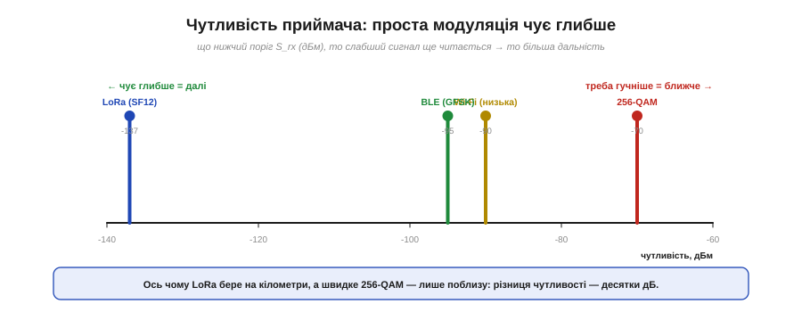
*Рис. 6.7.6.5. Що простіша й повільніша модуляція, то глибший («нижчий») поріг чутливості — то слабший сигнал ще читається. LoRa (SF12) чує аж до −137 дБм; BLE (GFSK) — до −95; швидке 256-QAM потребує вже −70. Різниця в десятки децибел напряму перетворюється на різницю в дальності.*

Згадай сузір'я з §6.7.3: щільне 256-QAM вимагає високого сигнал/шум (його «хмарки» тісні), тож і поріг чутливості високий — сигнал має бути гучним. А проста, повільна модуляція — FSK, BPSK, LoRa-чирпи — розрізняється навіть із-під шуму, тож її поріг **набагато нижчий**. Ось чому в бюджеті **повільніше = далі**: знизивши швидкість і спростивши модуляцію, ти опускаєш S_rx на десятки децибел — а кожні зайві децибели чутливості напряму додаються до запасу лінії, тобто до дальності. Це той самий обмін Шеннона (§6.7.4), тепер видимий у рядку бюджету.

### Запас на завмирання: не рахуй упритул

Здавалося б, досить, щоб запас був хоч трохи більший за нуль. Але це небезпечна помилка.


*Рис. 6.7.6.6. Над порогом чутливості завжди лишають **запас на завмирання** (*fade margin*) — зазвичай 10–20 дБ. Реальний сигнал не сталий: він «дихає» через рух, відбиття, дощ, перешкоди. Якщо проєктувати з нульовим запасом, зв'язок рватиметься від кожної хмари чи кроку вбік.*

Річ у тім, що реальний прийнятий сигнал **не стоїть на місці** — він постійно коливається на одиниці й десятки децибел через рух, відбиття від стін, погоду, людей, що проходять між антенами. Це **завмирання** (*fading*), і йому присвячено наступну тему. Тому грамотний інженер ніколи не проєктує «впритул»: він закладає **запас на завмирання** (*fade margin*) — зазвичай **10–20 дБ** понад поріг. Наш BLE-приклад із його 33 дБ цей резерв має з лишком; а от лінія із запасом 2 дБ формально «працює», але на ділі рватиметься щоразу, коли сигнал просяде.

> 🔧 **Навіщо це.** Бюджет радіолінії — це твій **калькулятор дальності ще до збирання пристрою**. Перш ніж замовляти модуль, антену чи лізти на дах, склади стовпчик: яка потужність передавача, яка чутливість приймача, скільки з'їсть відстань (§6.6.6), скільки — стіни. Якщо запас виходить більший за 10–20 дБ — лінія надійна. Якщо близький до нуля чи від'ємний — формула одразу підказує, де додати: підняти потужність (дорого, є межа EIRP), узяти спрямованішу антену (+дБі), знизити частоту, чи **спростити модуляцію** заради кращої чутливості (далекобійно, як LoRa). Це і є інженерне мислення про радіо: не «спробуймо й побачимо», а «порахуймо й передбачмо».

### Три лінії — три бюджети

Наостанок порівняймо, як той самий рахунок пояснює зовсім різні дальності знайомих систем.

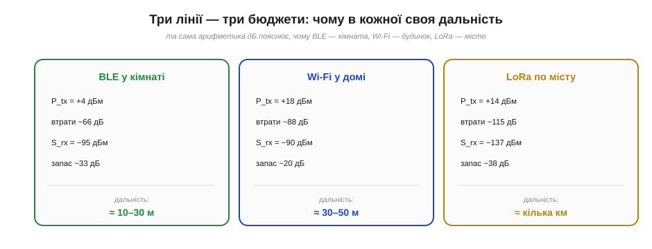
*Рис. 6.7.6.7. BLE: скромна потужність і чутливість −95 дБм → десятки метрів (кімната). Wi-Fi: більша потужність, але й вищий поріг → будинок. LoRa: помірна потужність, зате надзвичайна чутливість −137 дБм → кілометри. Різну дальність задає не магія, а арифметика бюджету.*

Поглянь, як елегантно одна формула все пояснює. **BLE** має скромну потужність і чутливість −95 дБм — звідси кімнатна дальність. **Wi-Fi** додає потужності, але його швидкі модуляції мають вищий (гірший) поріг, тож виграш іде радше в швидкість, ніж у відстань, — дальність у межах будинку. А **LoRa** бере не потужністю, а **винятковою чутливістю** −137 дБм: жертвуючи швидкістю заради простої завадостійкої модуляції, вона опускає поріг на десятки децибел — і дістає на кілометри. Те, що в побуті здається різними «силами сигналу», у бюджеті виявляється просто різними числами в одному стовпчику.

Ми навчилися рахувати лінію так, ніби сигнал іде **рівно** й передбачувано. Але я вже двічі прохопився про те, що насправді він «дихає»: то підсилюється, то завмирає, інколи — до повної втрати зв'язку на частку секунди. Чому? Бо в реальному світі хвиля приходить до приймача **не одним шляхом**, а багатьма — відбиваючись від стін, землі, машин — і ці копії складаються то в лад, то в протифазу. Це **багатопроменевість** і **завмирання** — остання тема нашого розділу, що пояснює, чому реальне радіо ніколи не буває таким спокійним, як наш рівний бюджет.

---

## 6.7.7 Багатопроменевість і завмирання

Бюджет лінії (§6.7.6) намалював нам спокійну картину: сигнал виходить, рівно слабшає з відстанню, приходить — і якщо запас додатний, усе працює. Але хто користувався Wi-Fi чи дивився, як стрибає рівень сигналу телефона, знає: реальність куди примхливіша. Сигнал **дихає** — то злітає, то провалюється; ступив крок убік — і зв'язок ожив або помер. Причина — у красивому й важливому явищі, яким ми завершимо фізику радіо: **багатопроменевість** (*multipath*) і породжене нею **завмирання** (*fading*). Зрозумівши його, ти збагнеш і навіщо потрібен був запас із §6.7.6, і навіщо дві антени на роутері, і як сучасний Wi-Fi обернув цю біду собі на користь.

### Хвиля приходить багатьма шляхами

Уся справа в тому, що радіохвиля, на відміну від променя в нашій уяві, доходить до приймача **не одним** шляхом.


*Рис. 6.7.7.1. До приймача приходять кілька копій однієї хвилі: пряма (найкоротша) і відбиті — від стелі, підлоги, стін, меблів, сусідніх будівель. Кожна копія долає **різну** відстань, тож приходить із різною затримкою й, головне, з різною **фазою**.*

У відкритому полі ще сяк-так буває «один промінь», але в кімнаті, на вулиці міста, у лісі хвиля **відбивається** від усього — стін, підлоги, металу, машин — точно як світло від дзеркал (згадай §6.6.3, поширення хвиль). Тому в приймальну антену прилітає не одна хвиля, а **жменя копій** тієї самої, кожна своїм маршрутом. А раз маршрути різної довжини, то й приходять копії **не одночасно** й, що найважливіше, з різними фазами. Далі вони складаються — і ось тут починається найцікавіше.

### Копії складаються — вирішує фаза

Що буде, коли кілька копій однієї хвилі зійдуться на антені? Вони **додаються** — але результат залежить від їхньої взаємної **фази**, і він буває діаметрально протилежним.


*Рис. 6.7.7.2. Якщо копії приходять **у фазі** (гребінь до гребеня), вони підсилюють одна одну — сигнал міцнішає (дві рівні копії дають +6 дБ). Якщо **у протифазі** (гребінь до западини) — гасять одна одну, аж до майже повного нуля. Те саме явище, що й інтерференція хвиль на воді.*

**Приклад (як близько пік до провалу).** Фаза залежить від різниці пройдених шляхів, виміряної в довжинах хвилі. Зсув на **пів хвилі** обертає підсилення на знищення. А яка це відстань на практиці? Згадаймо λ = c/f (§6.6.2) для 2.4 ГГц:

```
λ      = 3×10⁸ / 2.4×10⁹ = 0.125 м = 12.5 см
λ / 2  = 6.25 см
```

Тобто **лише 6 сантиметрів** різниці ходу — і ти переходиш від яскравого піка до глибокого провалу! Дві рівні копії у фазі дають удвічі більшу амплітуду — це вчетверо більша потужність, тобто **+6 дБ**; ті самі копії в протифазі — майже **нуль**, «мертву зону». Ось чому радіо таке примхливе: усе вирішують сантиметри.

### Завмирання у просторі: піки й мертві зони поруч

Наслідок інтерференції копій — у тому, що сила сигналу **залежить від положення** приймача, і то надзвичайно різко.

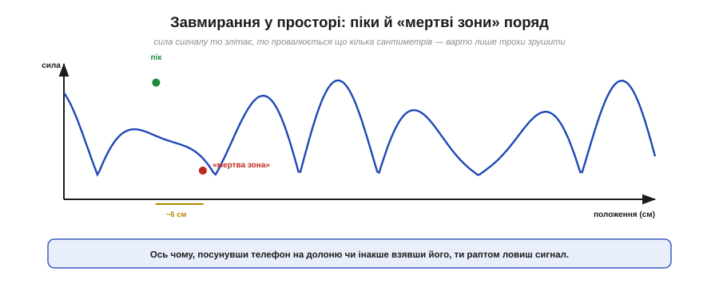
*Рис. 6.7.7.3. Якщо рухати приймач, сила сигналу не спадає плавно, а **мерехтить**: яскраві піки чергуються з глибокими «мертвими зонами» що кілька сантиметрів. Між сусіднім піком і нулем — близько λ/2 (на 2.4 ГГц ~6 см).*

Простір довкола передавача — це не рівне поле, що тихо слабшає з відстанню, а строката **карта** з пагорбами-піками й ямами-провалами, розкиданими що кілька сантиметрів. У піку зв'язок чудовий, у сусідній ямі — нема зовсім. Ось чому, коли телефон «не ловить», часом досить **посунути** його на долоню, повернути чи переступити крок — і зв'язок повертається: ти просто вийшов із мертвої зони. Те саме з роутером удома: пересунув на півметра — і кутова кімната ожила.

### Завмирання в часі: сигнал дихає

Якщо завмирання залежить від положення, то варто чомусь у кімнаті **рухатися** — і картина «попливе» вже **в часі**.


*Рис. 6.7.7.4. Коли рухається передавач, приймач або будь-що між ними (люди, машини, двері), малюнок інтерференції безперервно змінюється — і рівень прийнятого сигналу стрибає в часі. Інколи глибокий провал на мить кидає його **під поріг** чутливості — пакет губиться.*

Світ навколо радіо рідко стоїть на місці: ходять люди, їдуть авто, ти сам рухаєш телефон. Кожен рух пересуває «карту» завмирань — і рівень сигналу починає **коливатися в часі**, інколи на десятки децибел. Здебільшого це непомітно, але час від часу глибокий провал кидає сигнал **нижче порогу чутливості** (§6.7.6) — і пакет на ту мить губиться. Ось де нарешті проясняється сенс **запасу на завмирання** з минулої теми: ті 10–20 дБ резерву існують саме для того, щоб звичайний провал **не** дотягувався до порогу й зв'язок переживав «дихання» сигналу без обривів.

### Луна розмиває символи

У багатопроменевості є й окрема, підступніша вада, що шкодить саме **швидким** цифровим лініям, — **міжсимвольна інтерференція**.


*Рис. 6.7.7.5. Затримані копії (луна) приходять із запізненням і «наповзають» на наступні символи, розмиваючи їх. На повільному потоці це дрібниця, а на швидкому луна від попереднього символу спотворює наступний — приймач плутає біти.*

Згадай, що відбиті копії приходять **із затримкою**. Якщо символи (§6.7.3) йдуть повільно, запізніла луна встигає згаснути до наступного символу — байдуже. Та коли символи летять **швидко**, луна від попереднього ще звучить, коли вже почався наступний, — і вони **накладаються**, плутаючи приймач. Це **міжсимвольна інтерференція** (*intersymbol interference*, ISI). Розкид затримок між копіями (*delay spread*) тим самим ставить **стелю швидкості**: хочеш швидше — мусиш якось упоратися з луною. Це ще одна, окрема від Шеннона (§6.7.4), причина, чому дальність і швидкість так важко поєднати.

### Арсенал проти завмирань

На щастя, з багатопроменевістю інженери навчилися давати раду — і то кількома взаємодоповняльними способами.


*Рис. 6.7.7.6. Чотири головні прийоми: **рознесені антени** (одна в провалі — друга ні); **OFDM** (багато вузьких піднесучих, кожна завмирає рівно й легко вирівнюється); **розширений спектр** (§6.7.5 — не всі частоти завмирають разом); **завадостійке кодування з повтором** (§6.1, §6.5), що латає поодинокі втрати.*

Кожен прийом б'є по слабкому місці завмирань. **Рознесення** (*diversity*): постав дві антени за кілька сантиметрів — якщо одна потрапила в мертву зону, інша майже напевно ні (бо провали — що 6 см); приймач бере кращу. **OFDM** (*orthogonal frequency-division multiplexing*): розбий швидкий потік на безліч **повільних** вузьких піднесучих — кожна бачить рівне («пласке») завмирання, яке легко вирівняти, а повільні символи не страждають від ISI; на цьому стоять Wi-Fi і LTE. **Розширений спектр** (§6.7.5): стрибки й коди розкидають сигнал так, що не всі частоти провалюються одночасно. І нарешті **кодування з перевідправленням** (§6.1, §6.5): втрачені під час провалу біти відновлюють надлишковим кодом або просто просять надіслати ще раз.

> 🔧 **Навіщо це.** Тепер у тебе складається повна, чесна картина реального радіоканалу — без ілюзій «рівного променя». Коли твій пристрій час від часу «гойдає» зв'язок, ти знаєш: це не обов'язково слабка антена чи поломка — це **завмирання**, нормальна фізика багатопроменевості. І знаєш, що з цим робити: закласти запас (§6.7.6), поставити рознесені антени, не гнатися за максимальною швидкістю там, де важлива надійність, увімкнути перевідправлення. А головне — більше не дивуватися, чому «два кроки вбік» інколи лагодять зв'язок краще за будь-яке налаштування.

### Несподіваний фінал: ворог стає другом

І наостанок — найкрасивіший поворот усієї історії. Багатопроменевість десятиліттями вважали **ворогом** зв'язку. А сучасні системи навчилися робити з неї… **джерело швидкості**.

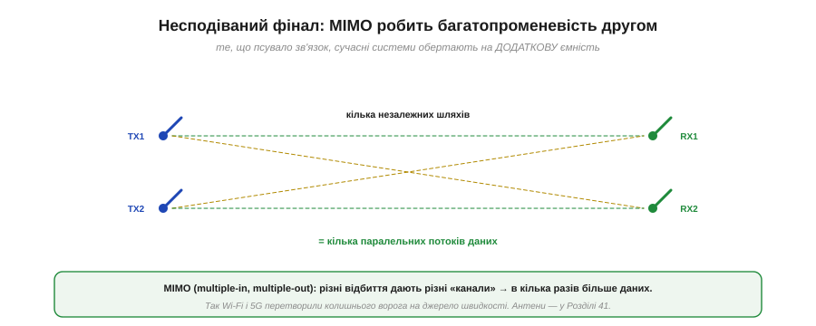
*Рис. 6.7.7.7. MIMO ставить кілька антен на обох кінцях. Різні відбиті шляхи між ними утворюють кілька **незалежних** каналів — і по них одночасно женуть кілька **різних** потоків даних. Те, що псувало один сигнал, тепер у кілька разів **збільшує** ємність.*

Ідея зветься **MIMO** (*multiple-input multiple-output*) і звучить як парадокс. Постав кілька антен на передавачі й кілька на приймачі. Багатопроменевість робить шлях від кожної TX-антени до кожної RX-антени **трохи іншим** — і ці відмінності дають змогу математично **розділити** кілька потоків даних, що летять **одночасно на одній частоті**. Чим **багатша** багатопроменевість, тим краще MIMO розрізняє потоки — отже, колишній ворог став **другом**, що множить швидкість. Саме MIMO дало сучасному Wi-Fi і 5G їхні високі швидкості. Гарний урок інженерної винахідливості: явище, з яким півстоліття боролися, зрештою обернули на перевагу.

---

Підсумуймо Розділ 6.7 — і всю фізику радіо. Ми почали з простого питання «як посадити інформацію на несучу» (§6.7.1) і пройшли крізь **аналогові** AM та FM (§6.7.2), **цифрові** FSK і PSK із їхніми сузір'ями (§6.7.3), уперлися в **межу Шеннона** — стелю будь-якого каналу (§6.7.4), відкрили хитрий **розширений спектр** (§6.7.5), навчилися **рахувати бюджет лінії** наперед (§6.7.6) і нарешті зрозуміли, чому реальний сигнал **дихає** через багатопроменевість (§6.7.7). Тепер радіо — від хвилі (Розділ 6.6) до робочої лінії зв'язку — для тебе не магія, а зрозуміла, прорахована інженерія.

Та крізь увесь розділ червоною ниткою проходило одне слово, яке ми вперто лишали «чорною скринькою»: **антена**. Ми казали «+2 дБі», «рознесені антени», «λ/4» — але **як** шматок дроту перетворює струм на хвилю? Чому його довжина має бути узгоджена з частотою? Чому одні антени світять навсібіч, а інші — вузьким променем? І до чого тут славнозвісні «50 Ом»? Це — фізика **антен і ліній передачі**, і саме з неї почнемо наступний розділ.

> ▶️ Далі: [Розділ 6.8 — Антени й лінії передачі](../antennas/antennas.md)
