# Розділ 6.6 — Радіо: фізика електромагнітних хвиль

У попередньому розділі ми користувалися радіо як **готовою чорною скринькою**: викликали `WiFi.begin()`, надсилали пакети по Bluetooth, не питаючи, що ж насправді летить «по повітрю». Тепер час відкрити цю скриньку. Бо щоб по-справжньому розуміти антени, дальність, частоти й те, чому сигнал слабшає за стіною, треба спуститися до самої фізики — до **електромагнітної хвилі**.

І тут на нас чекає приємна несподіванка: усі цеглинки в нас уже є. Електричне поле ми вивчили в [Розділі 1.1](../../block-1-circuits-physics/charge-field-potential/charge-field-potential.md), магнітне й індукцію — у [Розділі 2.2](../../block-2-components-analog/inductor/inductor.md). Лишилося з'єднати їх у русі — і вийде хвиля, та сама, що її передбачив Максвелл і впіймав Герц. Цей розділ будує радіо від першопричин: що таке електромагнітна хвиля (ця тема), як пов'язані частота й довжина хвилі, як хвиля поширюється й поляризується, чому різні діапазони поводяться по-різному, навіщо децибели й чому сигнал згасає у просторі. Жодних формул заради краси — лише те, що потрібно, щоб свідомо працювати з радіо.

> 📜 **Перед матеріалом — історія:** [Герц ловить хвилю — як підтвердили передбачення Максвелла](hist-hertz.md). Вона показує, *звідки* взялося поняття електромагнітної хвилі, як її спершу вивели на папері, а потім спіймали в досліді, і чому радіохвиля — це те саме, що світло.

---

## 6.6.1 Електромагнітна хвиля: електрика й магнетизм у русі

Найперше питання — найфундаментальніше: **що таке** електромагнітна хвиля? Відповідь напрочуд елегантна, і вона з'єднує дві речі, які ми досі вивчали окремо. Електричне поле живе навколо заряду; магнітне — навколо струму. Поодинці вони статичні. Але варто змусити їх **змінюватися** — і вони підхоплюють одне одного й починають бігти простором самі собою. Це і є хвиля. Розберімо її по частинах.

### Будова хвилі: E ⊥ B ⊥ напрямок

Електромагнітна хвиля — це **два поля, що коливаються разом**: електричне (E) і магнітне (B). І найважливіша її геометрична риса: усі три напрямки — коливань E, коливань B і самого руху хвилі — взаємно **перпендикулярні**.


*Рис. 6.6.1.1. Електричне поле E коливається в одній площині (тут вертикально), магнітне B — у перпендикулярній (упоперек), а сама хвиля біжить уперед — і ці три напрямки взаємно під прямим кутом. Це **поперечна** хвиля, що у вакуумі мчить зі швидкістю світла c ≈ 3×10⁸ м/с.*

Уяви це так: E хитається вгору-вниз, B — вліво-вправо, а вся ця конструкція летить від тебе вперед. Обидва поля коливаються **в такт** (синхронно) і обидва — **поперек** напрямку руху. Запам'ятати цю трійцю перпендикулярів важливо: на ній тримається й поняття поляризації (§6.6.3), і робота антени (§6.8). А найголовніше число тут — **швидкість**: у порожнечі ця хвиля завжди мчить рівно зі швидкістю світла.

**Приклад (як швидко долітає радіо).** Порахуймо час польоту хвилі за c ≈ 3×10⁸ м/с:

```
через кімнату (10 м) : 10 / 3×10⁸ ≈ 33 наносекунди
до Місяця (384 000 км): 384×10⁶ / 3×10⁸ ≈ 1.28 секунди
```

На Землі радіосигнал долітає практично **миттєво** (наносекунди) — ось чому затримка бездротового зв'язку (§6.5) йде від ретраїв і обробки, а не від самого польоту хвилі. А от до Місяця вже понад секунду — звідси й помітна затримка в космічному зв'язку.

### Народжує хвилю прискорений заряд

Звідки береться хвиля? Її породжує **заряд** — але не будь-який, а саме **прискорений**, тобто такий, що міняє свою швидкість (найчастіше — коливається).

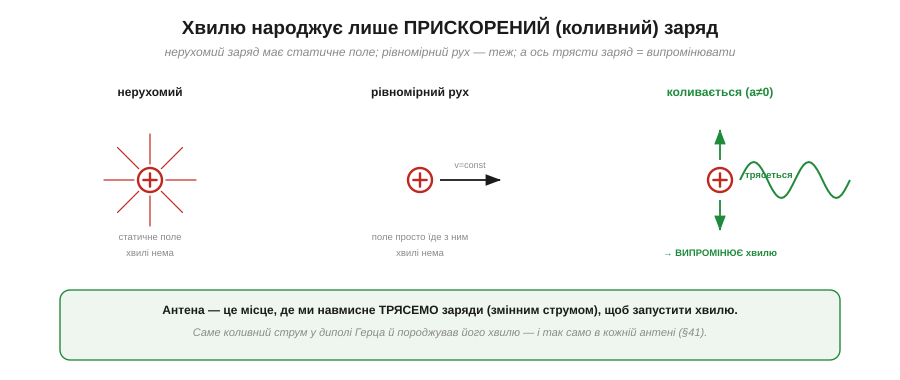
*Рис. 6.6.1.2. Нерухомий заряд має лише статичне поле — хвилі немає. Заряд, що рухається рівномірно, тягне поле за собою — хвилі теж немає. А ось коли заряд **трясеться** (прискорюється, коливається), він «струшує» зі свого поля хвилю, що відривається й летить геть.*

Це ключ до всього радіо. Нерухомий заряд оточений сталим електричним полем (з §1.1.3) — і нічого не випромінює. Заряд, що пливе з постійною швидкістю, додає до цього стале магнітне поле, але хвилі однаково немає. І лише **прискорений** заряд — той, що різко змінює швидкість чи коливається туди-сюди — створює **збурення** полів, яке відривається й біжить простором як хвиля. Саме коливний заряд у диполі Герца (з історії розділу) й породжував його хвилю.

> 🔧 **Навіщо це.** Ось чому **антена** — це по суті дріт, у якому ми навмисне **трясемо заряди** змінним струмом. Жени по дроту струм, що міняється мільярди разів на секунду, — і заряди в ньому прискорюються туди-сюди, випромінюючи радіохвилю. Це і є передавання: перетворити коливний струм на хвилю. А приймання — навпаки: хвиля, долетівши до приймальної антени, трясе заряди вже в **ній**, наводячи слабкий струм, який ми підсилюємо. Уся радіотехніка — це гра з прискореними зарядами.

### Чому хвиля не згасає: E і B підхоплюють одне одного

Хвиля, що відірвалася від заряду, далі живе **власним життям** — і не потребує більше ні заряду, ні дроту, ні середовища. Чому вона не згасає одразу? Бо E і B **підживлюють одне одного** на ходу.

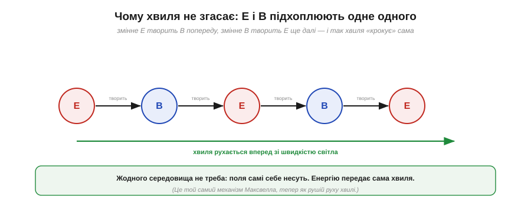
*Рис. 6.6.1.3. Змінне електричне поле творить магнітне трохи попереду; те, змінюючись, творить електричне ще далі; і так далі — поля «крокують» уперед, передаючи естафету. Хвиля сама себе несе зі швидкістю світла, не потребуючи жодного середовища.*

Це той самий механізм Максвелла з історії розділу, тільки тепер дивимося на нього як на **рушій руху**. Змінне E наводить B (це індукція, знайома з Розділу 2.2), а змінне B наводить E (симетрична половина, яку додав Максвелл). Кожне поле, згасаючи в одному місці, **відроджує** інше трохи далі — і так збурення котиться вперед, нескінченно передаючи естафету між двома полями. Енергію несе сама хвиля; жодного «дроту» їй не треба.

### Поперечна, а не поздовжня

Корисно порівняти ЕМ-хвилю з найзнайомішою хвилею — **звуком**, — бо вони влаштовані принципово по-різному.


*Рис. 6.6.1.4. ЕМ-хвиля **поперечна**: поля коливаються впоперек напрямку руху. Звук — **поздовжня** хвиля: повітря стискається й розріджується вздовж напрямку руху. Звук — це коливання речовини, тож йому потрібне середовище; ЕМ-хвилі — ні.*

У звуці коливається **речовина** (повітря) — і коливається **вздовж** руху: летять зони стиску й розрідження. Тому без речовини звуку немає: у вакуумі тиша. ЕМ-хвиля інакша: у ній коливаються **поля**, і коливаються **впоперек** руху. А поля можуть існувати й у порожнечі. Звідси й знаменитий факт: **у космосі немає звуку, але є світло й радіо**.

### Без середовища, крізь порожнечу

Зупинімося на цьому окремо, бо саме це історично здавалося найнеймовірнішим: ЕМ-хвиля летить **крізь порожній простір**, без жодного середовища.

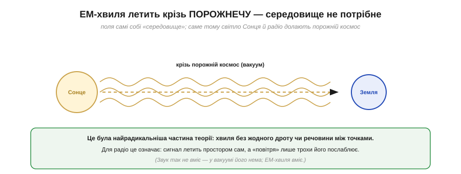
*Рис. 6.6.1.5. Світло й тепло Сонця долають мільйони кілометрів **порожнього космосу** й гріють Землю. Жодної речовини між ними немає — і хвилі вона не потрібна: поля самі собі «середовище».*

Для радіо це має пряме практичне значення: сигнал летить простором **сам**, і йому не потрібен ні дріт, ні повітря. Повітря, стіни, дощ лише трохи **послаблюють** хвилю (про це §6.6.6), але не вони її несуть. Це й відрізняє радіо від звуку чи дротового зв'язку: канал — це сам простір, заповнений полями, а не якась матеріальна «труба».

### Несе енергію

Раз хвиля існує сама собою й щось «доставляє», вона має нести **енергію** — і справді несе.


*Рис. 6.6.1.6. Передавач віддає енергію в хвилю; та летить простором і приносить **крихітну** її частку до приймача (більшість розходиться навсібіч — §6.6.6). Цього досить: приймач підсилює слабкий сигнал. По суті радіо — це передавання енергії без дроту.*

Енергію несуть **самі поля** — пам'ятаймо з §1.1.3, що поле реальне й містить енергію. Передавальна антена «закачує» енергію в хвилю, хвиля розносить її простором, а приймальна антена вловлює **мізерну** частку (бо хвиля розпливається навсібіч, і до приймача долітають лічені фемтовати). Та цього достатньо: чутливий приймач підсилить навіть такий кволий сигнал. Те саме Сонце гріє Землю енергією, принесеною світловими хвилями через порожнечу, — точнісінько та сама фізика, лише на іншій частоті.

### Антена: керовано трясемо заряди

Зведімо всю фізику теми в одну практичну точку — в **антену**.

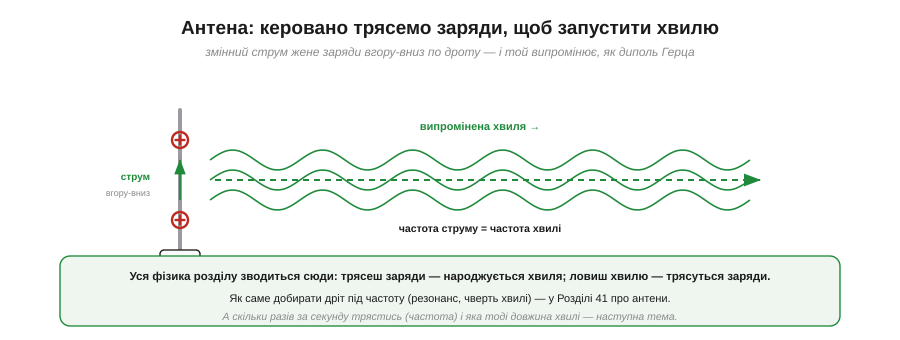
*Рис. 6.6.1.7. Змінний струм жене заряди вгору-вниз по дроту-антені; прискорені заряди випромінюють хвилю, як диполь Герца. Частота струму дорівнює частоті хвилі. Передавання — це трясти заряди й народжувати хвилю; приймання — навпаки: хвиля трясе заряди в антені.*

Уся фізика розділу сходиться сюди: **трясеш заряди — народжується хвиля; ловиш хвилю — трясуться заряди**. Передавальна антена — це місце, де ми навмисне женемо коливний струм, щоб запустити хвилю в простір. Приймальна — місце, де хвиля, що долетіла, наводить слабкий струм. Частота, з якою трясуться заряди, дорівнює частоті випроміненої хвилі — і саме частота, як побачимо, визначає геть усе: і довжину хвилі, і розмір антени, і дальність.

> 🔧 **Навіщо це.** Тепер «антена» — не магічна паличка, а зрозумілий пристрій: дріт, у якому коливний струм трясе заряди й народжує хвилю. Це пояснює, чому антена має бути **провідником** (щоб заряди вільно бігали) і чому її розмір пов'язаний із частотою (про резонанс і чверть хвилі — §6.8). А ще це підказує, чому будь-який провідник зі змінним струмом **трохи випромінює** — звідси й паразитні завади від швидких цифрових ліній, і потреба екранувати чутливі вузли.

Ми зрозуміли, **що** таке електромагнітна хвиля: два поперечні поля, народжені тремтливим зарядом, що самі себе несуть крізь порожнечу зі швидкістю світла. Та ми весь час казали «частота» — і вже бачили, що вона тут головна. Скільки разів за секунду трясуться заряди, яка тоді **довжина** хвилі, і як ці дві величини пов'язані зі швидкістю світла однією простою формулою — про це наступна тема.

---

## 6.6.2 Частота й довжина хвилі (c = λ·f)

Уся практична робота з радіо крутиться навколо **частоти**: 2.4 ГГц, 5 ГГц, 868 МГц, 433 МГц. Та частота тісно пов'язана з другою величиною — **довжиною хвилі**, — і саме їхня пара визначає геть усе: розмір антени, дальність, проникність крізь стіни. Зв'язує їх одна-єдина проста формула, з якої випливає дивовижно багато наслідків. Розберімо її — і навчімося за однією частотою миттєво «бачити» решту.

### Дві мірки однієї хвилі

Почнімо з того, що частота й довжина хвилі — це **дві мірки** одного й того самого явища, тільки з різних боків. **Частота** (*frequency*, f, у герцах) каже, скільки разів за секунду поле хитається — це погляд **у часі**. **Довжина хвилі** (*wavelength*, λ, у метрах) каже, яку відстань займає одне коливання в просторі — це погляд **у просторі**.

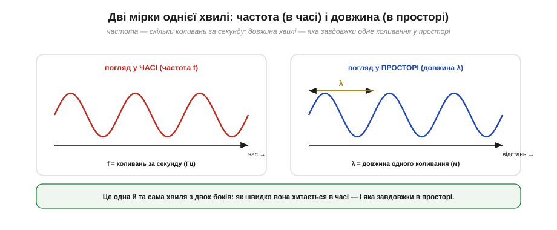
*Рис. 6.6.2.1. Ліворуч — погляд **у часі**: стоїмо в одній точці й рахуємо, скільки коливань пройде за секунду; це частота f (Гц). Праворуч — погляд **у просторі**: «фотографуємо» хвилю й міряємо довжину одного коливання; це довжина хвилі λ (м). Одна хвиля — дві мірки.*

Уяви хвилі на воді. Сидиш на пірсі й рахуєш, скільки гребенів проходить повз за секунду — це **частота**. А якщо глянути на воду згори й поміряти відстань між сусідніми гребенями — це **довжина хвилі**. Те саме з радіо: f — як швидко хитається в часі, λ — який «крок» хвилі у просторі. І ці дві мірки не незалежні — їх пов'язує швидкість.

### Зв'язок: c = λ·f

Логіка проста. За одне коливання хвиля проходить рівно одну довжину λ. Якщо за секунду таких коливань f, то за секунду хвиля долає λ·f метрів — а це і є її **швидкість**. Для електромагнітної хвилі швидкість — це швидкість світла c. Звідси фундаментальна формула:

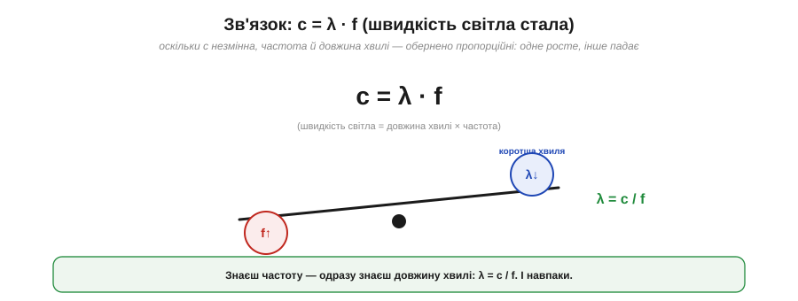
*Рис. 6.6.2.2. c = λ · f: швидкість світла = довжина хвилі × частота. Оскільки c — **стала** (≈3×10⁸ м/с), частота й довжина хвилі обернено пропорційні: підняв частоту — вкоротив хвилю, і навпаки. Тому, знаючи одне, одразу знаєш інше: λ = c / f.*

```
c = λ · f          (швидкість світла = довжина хвилі × частота)
λ = c / f          (звідси довжина хвилі)
c ≈ 3 × 10⁸ м/с    (стала для вакууму)
```

Найважливіший наслідок — у тому, що **c стала**. Раз добуток λ·f завжди дорівнює одному й тому самому числу, то λ і f **обернено пропорційні**: що вища частота, то коротша хвиля. Це не випадковість, а жорсткий закон, з якого випливає вся подальша практика.

### λ = c/f для поширених діапазонів

Підставмо реальні частоти й відчуймо масштаб.


*Рис. 6.6.2.3. AM-радіо (~1 МГц) → хвиля ≈300 м. FM (~100 МГц) → ≈3 м. Wi-Fi і Bluetooth (2.4 ГГц) → ≈12.5 см. Wi-Fi 5 ГГц → ≈6 см. Що вища частота, то коротша хвиля — від сотень метрів до сантиметрів.*

**Приклад (порахуймо довжини хвиль).** Застосуймо λ = c/f:

```
Wi-Fi 2.4 ГГц : λ = 3×10⁸ / 2.4×10⁹  = 0.125 м = 12.5 см
FM 100 МГц    : λ = 3×10⁸ / 100×10⁶  = 3 м
AM 1 МГц      : λ = 3×10⁸ / 1×10⁶    = 300 м
```

Відчуй контраст: AM-радіо на 1 МГц має хвилю завдовжки з **футбольне поле** (300 м), а Wi-Fi на 2.4 ГГц — лише з **долоню** (12.5 см). Частота вища у 2400 разів — і хвиля рівно у 2400 разів коротша. Саме цей величезний розкид довжин хвиль і пояснює, чому різні діапазони так по-різному поводяться.

### Висока проти низької частоти

Наочно різницю видно, якщо покласти хвилі різної частоти на той самий відрізок простору.

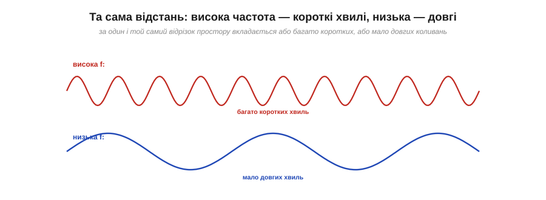
*Рис. 6.6.2.4. На однаковій відстані висока частота вкладає **багато коротких** хвиль, а низька — **мало довгих**. Це пряме відображення оберненої пропорції: більше коливань за секунду означає менший «крок» кожного.*

Це інтуїтивна картинка того самого закону: висока частота — густо посаджені короткі хвильки, низька — рідкі довгі. Запам'ятавши її, легко тримати в голові: «гігагерци — це сантиметри, мегагерци — це метри». А практичне значення цього розкиду найяскравіше видно на **антені**.

### Розмір антени йде за довжиною хвилі

Ось де довжина хвилі стає відчутною на дотик: **розмір антени** прямо пов'язаний із λ. Антену зазвичай роблять часткою довжини хвилі — найчастіше **чверть** хвилі (про причину — резонанс — у Розділі 6.8).

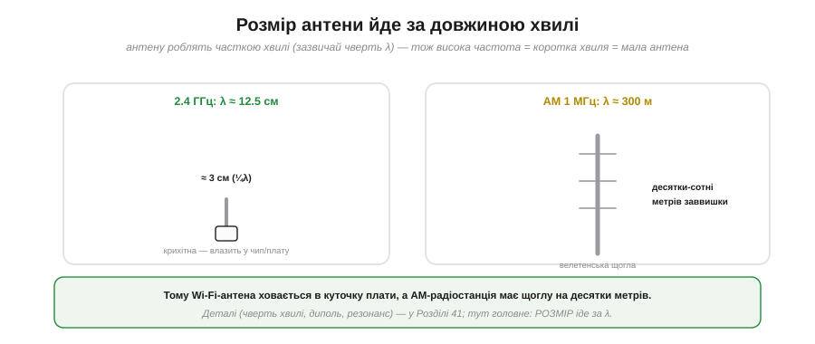
*Рис. 6.6.2.5. Для 2.4 ГГц (λ≈12.5 см) чвертьхвильова антена — лише ≈3 см: крихітна, влазить у куточок плати. Для AM (λ≈300 м) — це десятки чи сотні метрів: велетенська щогла. Розмір антени йде просто за довжиною хвилі.*

Тепер зрозуміло одне з найпомітніших явищ радіо. Wi-Fi-антена — це маленька доріжка чи чіп на платі (бо чверть від 12.5 см — лише сантиметри). А радіостанція AM-діапазону потребує **щогли на десятки метрів** (бо чверть від 300 м — це 75 метрів). Той самий закон c = λ·f, що дав крихітну Wi-Fi-антену, змушує AM будувати велетенські вежі.

> 🔧 **Навіщо це.** Це пояснює, чому маленькі бездротові пристрої працюють на **високих** частотах (2.4/5 ГГц): тільки там антена достатньо мала, щоб уміститися в гаджет. На низьких частотах антена була б завеликою. І навпаки: якщо бачиш пристрій із довгим «вусом»-антеною, він майже напевно працює на **нижчій** частоті (наприклад, 433 чи 868 МГц), де хвиля довша. Розмір антени — це візуальна підказка про частоту, і навпаки.

### Усе це — один спектр

Зробімо крок назад і побачимо повну картину. Радіохвилі — лише частина величезного **електромагнітного спектра**, де всі хвилі — одне явище, упорядковане за частотою.

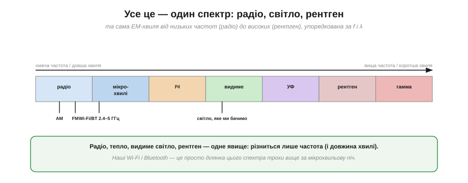
*Рис. 6.6.2.6. Електромагнітний спектр від низьких частот до високих: радіо → мікрохвилі → інфрачервоне → видиме світло → ультрафіолет → рентген → гамма. Усе це **та сама** ЕМ-хвиля, лише різної частоти й довжини. Наші Wi-Fi і Bluetooth (2.4–5 ГГц) — у мікрохвильовій ділянці, трохи вище за діапазон мікрохвильової печі.*

Це і є велике об'єднання Максвелла-Герца з історії розділу: радіо, тепло від обігрівача, видиме світло, рентген у лікарні — **одне явище**, що різниться лише частотою. Wi-Fi сидить у мікрохвильовій ділянці спектра (звідси й слово «мікрохвилі»), видиме світло — у тисячі разів вище за частотою, рентген — ще вище. Уся інтуїція про світло (відбиття, тіні, проникність) законно переноситься на радіо саме тому, що це сусіди по одному спектру.

### Практика: частота → λ → антена

Зведімо все в найкорисніший практичний навик.


*Рис. 6.6.2.7. Одне число — частота — за двома кроками дає і довжину хвилі (λ = c/f), і приблизний розмір антени (≈¼λ). «2.4 ГГц» → λ≈12.5 см → антена ≈3 см. Швидка оцінка «на серветці».*

> 🔧 **Навіщо це.** Завчи цей ланцюжок: **частота → довжина хвилі → розмір антени**. Побачив у даташиті «868 МГц» — миттєво прикинь: λ = 3×10⁸/868×10⁶ ≈ 35 см, отже антена (чверть хвилі) ≈9 см. «433 МГц» → λ≈70 см → антена ≈17 см. Це не лише задовольняє цікавість: за частотою ти одразу знаєш, **якого розміру** антену шукати в чужому пристрої, чи влізе вона в твій корпус, і чому конкретний модуль має саме такий «вус». Одне число — і вся геометрія радіо стає зрозумілою.

Ми пов'язали частоту, довжину хвилі й розмір антени однією формулою. Та хвиля не лише має довжину — вона ще й **поширюється** в просторі певним чином і має **напрям** коливань. Чому сигнал за рогом слабшає, але не зникає? Чому антени приймача й передавача треба орієнтувати однаково? Це питання **поширення** й **поляризації** — тема наступного підрозділу.

---

## 6.6.3 Поширення й поляризація

Між передавачем і приймачем — реальний світ зі стінами, металом, кутами й рухомими людьми. Як хвиля долає всі ці перешкоди й **доходить** до приймача — це **поширення**. А в який бік вона «хитається» — це **поляризація**. Обидва поняття мають прямі практичні наслідки: вони пояснюють, чому Wi-Fi працює за рогом, але гірше; чому в одному місці кімнати сигнал є, а на крок убік пропадає; і чому, повернувши антену, можна або підсилити, або вбити зв'язок. Розберімо обидва.

### Як хвиля доходить: кілька шляхів одразу

Перше, що треба зрозуміти: хвиля рідко доходить **одним** шляхом. Зазвичай вона досягає приймача **кількома** способами водночас.

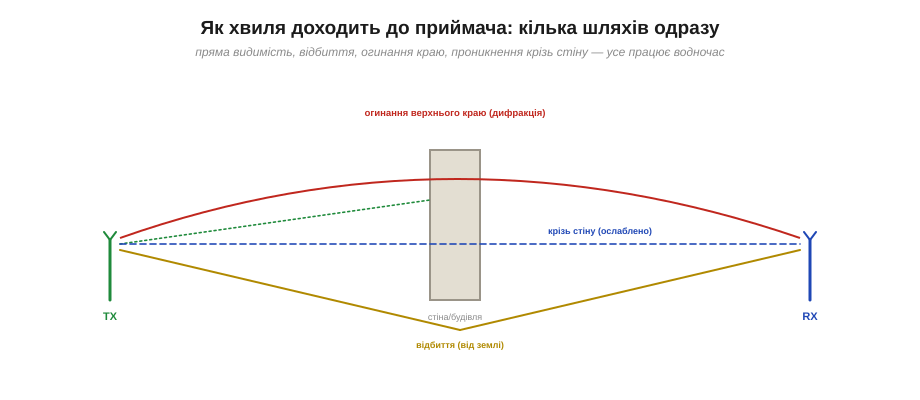
*Рис. 6.6.3.1. Хвиля від TX доходить до RX одразу кількома шляхами: **прямою видимістю** (якщо шлях вільний), **відбиттям** (від землі, стін, металу), **огинанням** краю перешкоди (дифракція) і навіть **крізь стіну** (ослаблена). Усі ці механізми працюють одночасно.*

Бо радіохвиля — це світло іншої частоти (з §6.6.1), і поводиться вона так само, як світло в кімнаті: щось іде прямо, щось відбивається від стін, щось загинається за край, щось проходить крізь напівпрозорі перешкоди. Розгляньмо кожен механізм окремо — і побачимо, що з них випливає для зв'язку.

### Відбиття

Найзнайоміший механізм — **відбиття**. Хвиля відскакує від провідних поверхонь (метал, мокра стіна) точнісінько як світло від дзеркала.


*Рис. 6.6.3.2. Кут падіння дорівнює куту відбиття — те саме правило, що для променя світла. Метал відбиває радіо особливо сильно.*

Звідси два наслідки. По-перше, за суцільною **металевою** перешкодою виникає «радіотінь» — метал майже не пропускає хвилю, а відбиває. По-друге, відбиття створює **додаткові шляхи** до приймача (хвиля прийшла і прямо, і відбившись від стіни) — а кілька шляхів, як побачимо, можуть як допомагати, так і шкодити.

### Дифракція: огинання краю

Якби хвилі тільки йшли прямо й відбивалися, за кожним рогом була б повна «темрява». Та насправді сигнал заходить і за ріг — завдяки **дифракції**, здатності хвилі **загинатися** за край перешкоди.


*Рис. 6.6.3.3. Дійшовши до краю перешкоди, хвиля частково **загинається** в зону тіні за ним. Тому за рогом будинку зв'язок є, хоч і слабший. Що довша хвиля (нижча частота), то сильніше вона огинає перешкоди.*

Ось чому, зайшовши за ріг будівлі, ти не втрачаєш Wi-Fi миттєво — хвиля частково огинає кут. І тут уперше проявляється важлива залежність від частоти: **довші хвилі (нижчі частоти) огинають перешкоди краще**. Хвиля завдовжки в метри легко загинається за двері й стіни; хвиля завдовжки в сантиметри — гірше. Це одна з причин, чому низькочастотне радіо «дістає» туди, куди високочастотне не дотягується.

### Проникнення крізь стіни

Частина хвилі не огинає й не відбивається, а **проходить наскрізь** — крізь стіни, двері, меблі, — щоправда, **ослаблюючись**.

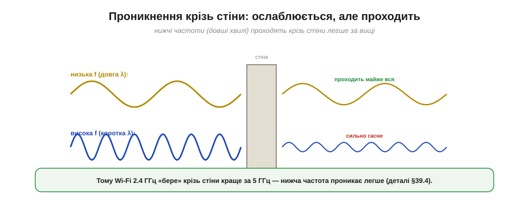
*Рис. 6.6.3.4. Хвиля проходить крізь стіну, втрачаючи частину сили. І знову вирішує частота: **нижчі частоти (довші хвилі) проникають легше**, вищі — сильніше гаснуть у матеріалі.*

Це пояснює щоденний досвід: Wi-Fi із сусідньої кімнати слабший, але є. І знову та сама закономірність, що з дифракцією: **нижча частота проходить крізь стіни краще**. Саме тому Wi-Fi на 2.4 ГГц «бере» крізь стіни помітно краще за 5 ГГц — детальніше цей компроміс частот ми розберемо в §6.6.4. А разом дифракція й проникнення дають головний практичний висновок: перешкода **послаблює** сигнал, але рідко **повністю** його блокує (хіба що суцільний метал).

### Багатопроменевість і завмирання

Тепер повернімося до того, що хвиля доходить **кількома** шляхами. Ці шляхи мають **різну довжину**, тож хвилі ними долітають із трохи різним запізненням — і на приймачі **складаються**.

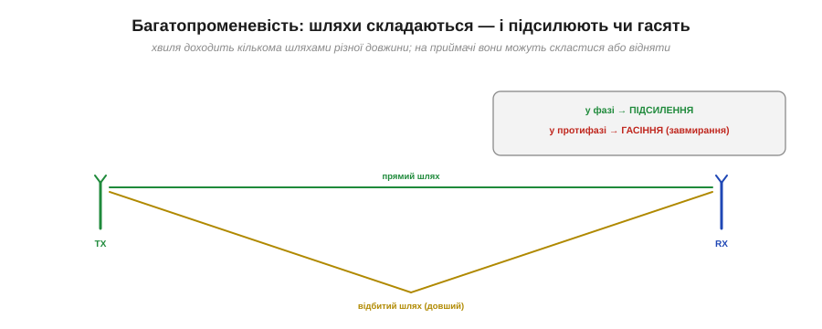
*Рис. 6.6.3.5. Пряма хвиля й відбита долітають до RX різними шляхами (відбита — довшим). На приймачі вони додаються: якщо прийшли **у фазі** — підсилюють одна одну, якщо **в протифазі** — гасять (аж до глибокого провалу — завмирання).*

Це **багатопроменевість** (*multipath*), і наслідок її двоїстий. Якщо шляхи приходять «у ногу» (у фазі) — хвилі **підсилюють** одна одну. Якщо «навпаки» (у протифазі) — **гасять**, аж до майже повного зникнення сигналу. Звідси знайоме явище: сигнал є, ступив крок убік — і пропав, бо в новій точці шляхи склалися в протифазу. Це зветься **завмиранням** (*fading*); детальніше про багатопроменевість і боротьбу з нею — у §6.7.7. Поки запам'ятай: радіо в приміщенні — це завжди сума багатьох шляхів, і вона нестабільна.

### Поляризація: у який бік коливається поле

Друга велика тема — **поляризація**. Згадаймо з §6.6.1, що в хвилі електричне поле E коливається **поперек** руху. Але «поперек» — це ще не одна-єдина площина: E може хитатися вертикально, горизонтально чи навіть обертатися. Це й називають поляризацією.

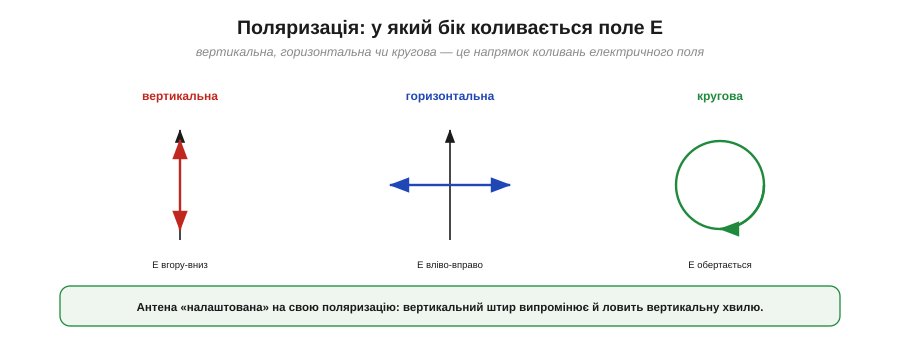
*Рис. 6.6.3.6. **Вертикальна** поляризація — E коливається вгору-вниз. **Горизонтальна** — вліво-вправо. **Кругова** — E обертається по колу. Це напрямок коливань електричного поля хвилі.*

Поляризацію задає **антена**: вертикальний штир випромінює (і ловить) вертикально поляризовану хвилю, горизонтальний — горизонтальну. Це не дрібниця, а величина, яку треба узгоджувати між передавачем і приймачем — інакше зв'язок різко слабшає.

### Узгодження поляризації

Ось чому поляризація важлива на практиці: антени передавача й приймача мають **збігатися** поляризацією.

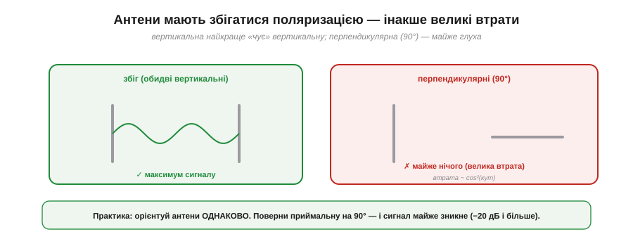
*Рис. 6.6.3.7. Дві вертикальні антени — максимум сигналу. А якщо приймальну повернути на 90° (перпендикулярно) — вона майже «глуха» до вертикальної хвилі: втрата сягає −20 дБ і більше. Утрата приблизно пропорційна cos²(кут між поляризаціями).*

Логіка проста: вертикальна антена найкраще «чує» вертикально поляризовану хвилю, бо саме вздовж неї хитається поле E, наводячи струм. Поверни приймальну антену на 90° — і поле хвилі коливається **впоперек** неї, майже не наводячи струму: сигнал падає катастрофічно (на 20 децибел і більше — про децибели в §6.6.5). Проміжний кут θ дає втрату приблизно як cos²θ: за 45° втрачається половина потужності.

> 🔧 **Навіщо це.** Звідси кілька щоденних порад. **Орієнтуй антени однаково**: якщо передавач має вертикальну антену, тримай і приймальну вертикально — інакше втратиш сигнал «з нічого». Класична помилка — покласти пристрій із вертикальним «вусом» горизонтально й дивуватися, чому зв'язок просів. Якщо ж зв'язок нестабільний, **трохи поруш геометрію** — переміст пристрій на кілька сантиметрів чи поверни антену: ти зміниш і багатопроменеву картину (вийдеш із провалу завмирання), і поляризаційний збіг. А кругова поляризація (її люблять у дронах і [GPS](book:components/gnss-module)) корисна саме тим, що менше залежить від орієнтації — обертове поле «зачепить» антену за будь-якого кута.

Ми побачили, як хвиля поширюється й чому орієнтація антен важлива. Водночас раз у раз спливала залежність від **частоти**: низькі частоти краще огинають і проникають, високі гірше. Ця залежність настільки важлива, що з неї виростає весь поділ радіо на **діапазони** — і вибір, на якій частоті працювати. Чому одні частоти беруть далеко й крізь стіни, а інші дають швидкість ціною дальності — про це наступна тема.

---

## 6.6.4 Діапазони: чому різні частоти поводяться по-різному

Це, мабуть, найпрактичніша тема всього розділу. Фізично всі радіохвилі однакові — це та сама електромагнітна хвиля. Та варто змінити **частоту**, і змінюється геть усе: як далеко сигнал бере, чи проходить крізь стіни, якого розміру потрібна антена і скільки даних можна передати. Зрозуміти цей **компроміс частоти** — означає вміти обрати правильний діапазон під задачу, а не діяти навмання. Зберімо всі залежності, що вже спливали в попередніх темах, в одну струнку картину.

### Головний компроміс частоти

Уся суть — в одному компромісі, який жорстко зв'язує чотири властивості.


*Рис. 6.6.4.1. Та сама хвиля, але рухаючись від низьких частот до високих, ти одночасно: втрачаєш **дальність** і **проникність крізь стіни**, зате виграєш **малу антену** і **високу швидкість даних**. Немає «найкращої» частоти — є компроміс «далеко й крізь усе» ПРОТИ «швидко й компактно».*

Запам'ятай цю четвірку: **дальність, проникність, розмір антени, швидкість**. Низька частота дає перші дві ціною останніх двох; висока — навпаки. І це не випадкова інженерна примха, а прямий наслідок фізики, яку ми вже знаємо: довша хвиля краще огинає й проникає (§6.6.3), але потребує більшої антени (§6.6.2). Розгляньмо кожен бік компромісу.

### Дальність і проникність

Низькі частоти **дострілюють далі** й **проходять крізь перешкоди** краще. Це прямий висновок із §6.6.3: довгі хвилі сильніше дифрагують (огинають кути) і легше проникають крізь стіни.


*Рис. 6.6.4.2. Низька частота дає широке «розпливчасте» покриття: хвиля огинає перешкоди й проходить крізь стіни. Висока частота працює майже як ліхтарик — лише по прямій видимості, а за перешкодою лишає чітку тінь.*

Звідси разючі практичні відмінності. Технологія [**LoRa**](book:components/lora-module) на 433 чи 868 МГц «дострілює» на **кілометри** крізь міську забудову — саме тому її люблять для далеких давачів. А Wi-Fi на 5 ГГц ледь пробивається крізь сусідню стіну. Та сама потужність, та сама антена — але нижча частота фізично «бере» далі й крізь більше. Чому ж тоді взагалі використовують високі частоти? Через **дані**.

### Швидкість даних

Високі частоти дають **більше швидкості** — і ось чому. Швидкість залежить від **ширини смуги** (скільки спектра займає сигнал), а на високих частотах смуги фізично **більше**.

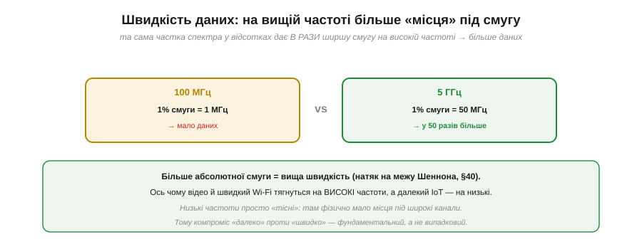
*Рис. 6.6.4.3. Одна й та сама частка спектра у відсотках дає різну абсолютну смугу: 1% від 100 МГц — це лише 1 МГц, а 1% від 5 ГГц — аж 50 МГц. На високій частоті фізично більше місця під широкі канали — отже, більше даних.*

**Приклад (чому високо = швидше).** Порівняймо доступну смугу:

```
1% спектра біля 100 МГц  = 1 МГц   → вузький канал, мало даних
1% спектра біля 5 ГГц    = 50 МГц  → широкий канал, у 50 разів більше
```

Низькі частоти просто **тісні**: там фізично мало місця під широкі канали, тож і швидкість обмежена. Високі частоти **просторі** — там можна виділити широкі смуги під швидкі потоки (фундаментальний зв'язок смуги й швидкості — межа Шеннона — у §6.7.4). Ось чому відео й швидкий Wi-Fi тягнуться вгору за частотою, а далекий IoT — униз. Компроміс «далеко проти швидко» — не випадковість, а фізика.

### Розмір антени

Третій бік компромісу ми вже виводили в §6.6.2, але повторімо — бо він дуже наочний.

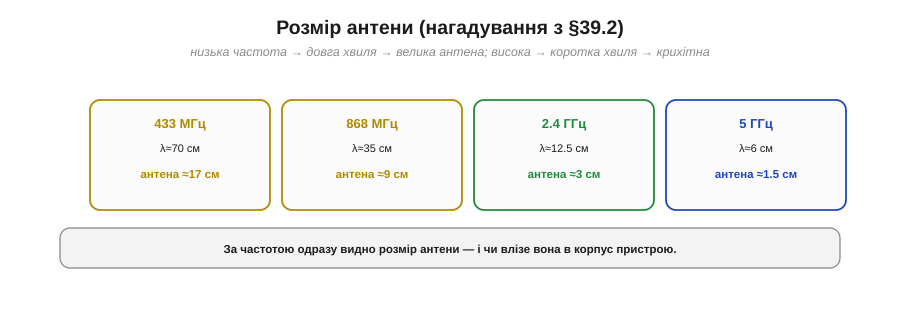
*Рис. 6.6.4.4. 433 МГц → антена ≈17 см; 868 МГц → ≈9 см; 2.4 ГГц → ≈3 см; 5 ГГц → ≈1.5 см. Що вища частота, то менша антена — і тим легше сховати її в компактний пристрій.*

Це теж тисне в бік високих частот для **малих** пристроїв: на 5 ГГц антена менша за сантиметр і ховається в чіпі, а на 433 МГц це вже сантиметрів сімнадцять — помітний «вус». Тому крихітні носимі гаджети майже завжди працюють на високих частотах: інакше антена просто не вмістилася б.

### Карта діапазонів

Зведімо все в карту реальних діапазонів — від низів спектра до верхів.


*Рис. 6.6.4.5. Знизу вгору: **AM/MF** (~1 МГц) — величезна дальність, крихта даних (радіомовлення). **HF/КХ** (3–30 МГц) — відбивається від іоносфери, тож дістає глобально. **VHF/UHF** (FM, ТБ, рації) — помірно. **433/868 МГц** — далеко й крізь стіни, мало даних (LoRa). **2.4 ГГц** — помірна дальність і дані (Wi-Fi, BT). **5 ГГц** — багато даних, мала дальність. **мм-хвилі** (24–60 ГГц) — величезні дані лише в межах кімнати (5G, радари).*

Прочитай цю карту як **єдину закономірність**: рухаючись угору за частотою, скрізь та сама історія — менше дальності, більше даних, менша антена. AM-радіо на низах дістає за горизонт, але везе лише звук; мм-хвилі на верхах гонять гігабіти, та ледь долають кімнату. Наші Wi-Fi і Bluetooth (2.4–5 ГГц) сидять посередині — розумний компроміс дальності, швидкості й розміру для домашніх пристроїв. А цікавий виняток — **HF**: ці хвилі **відбиваються від іоносфери** Землі, мов від дзеркала, і тому дістають через півпланети, попри помірну частоту.

### Обирай частоту за потребою

Звідси — простий алгоритм вибору. Не питай «яку частоту взяти», а спершу визнач **потребу** — і частота випливе сама.

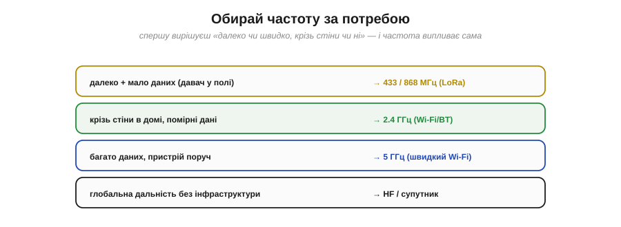
*Рис. 6.6.4.6. Далеко + мало даних (давач у полі) → 433/868 МГц (LoRa). Крізь стіни в домі з помірними даними → 2.4 ГГц (Wi-Fi/BT). Багато даних, пристрій поруч → 5 ГГц. Глобальна дальність без інфраструктури → HF чи супутник.*

> 🔧 **Навіщо це.** Це готовий чек-лист проєктування бездротового пристрою. Потрібен **далекий** давач на полі чи в лісі, що шле кілька байтів на годину? — бери **433/868 МГц** (LoRa): дальність кілометри, антена терпима, даних і не треба. Пристрій у **домі**, крізь стіни, з помірним обміном? — **2.4 ГГц** (Wi-Fi/BT): універсальний компроміс. Треба гнати **багато даних** на пристрій **поруч** (відео, швидка передача)? — **5 ГГц**. Не намагайся «вичавити дальність» із 5 ГГц чи «швидкість» із 433 МГц — фізика не дозволить. Обирай діапазон під головну потребу, і він даватиме своє найкраще.

### Єдиний континуум

Зведімо всю тему в одну вісь.


*Рис. 6.6.4.7. Усе радіо — це рух по одній осі частоти. Лівий край (низька f): далеко, повільно, велика антена, крізь стіни. Правий край (висока f): близько, швидко, крихітна антена, лише пряма видимість. Кожен крок угору міняє всі чотири властивості разом.*

> 🔧 **Навіщо це.** Завчи цю вісь як єдину «лінійку радіо» — і про **будь-яку** незнайому частоту ти одразу знатимеш її характер. Побачив «169 МГц» — це низько: далеко, крізь стіни, велика антена, повільно. «24 ГГц» — це високо: близько, пряма видимість, мікроскопічна антена, дуже швидко. Тобі не треба пам'ятати кожен діапазон окремо — досить розуміти **один компроміс**, і вся карта радіо стає передбачуваною.

Ми зрозуміли, як частота визначає характер сигналу. Та раз у раз ми казали «сигнал слабшає», «втрата −20 дБ», «менше потужності» — оперуючи якимись **децибелами**, не пояснивши їх. Чому потужність радіо міряють у логарифмічній шкалі, що таке dB і dBm, і чому це насправді зручно — про це наступна тема, без якої не зрозуміти ні бюджету радіолінії, ні чутливості приймача.

---

## 6.6.5 Потужність і децибели

Тут ми зробимо коротку, але необхідну зупинку на **математичному інструменті**, без якого радіо не обговорюють: на **децибелах**. Спершу вони здаються зайвим ускладненням — навіщо якісь логарифми, коли є звичайні вати? Та виявиться, що для радіо децибели — не ускладнення, а **спрощення**: вони перетворюють незручні числа з десятком нулів на охайні величини, а складне множення підсилень і втрат — на просте додавання. Опанувавши їх тут, ти легко читатимеш будь-яку радіоспецифікацію й рахуватимеш бюджет лінії.

### Чому логарифм: величезний діапазон

Проблема, яку розв'язують децибели, — у **масштабі**. Потужності в радіо різняться неймовірно: передавач випромінює близько вата, а чутливий приймач ловить сигнали в **піковати** — мільйонні частки мільйонної частки вата.


*Рис. 6.6.5.1. Від потужності передавача (≈1 Вт) до чутливості приймача (≈10⁻¹³ Вт) — розмах близько **13 порядків**, тобто у десять трильйонів разів. Записувати такі числа лінійно (0.000000000001 Вт) незручно й помилконебезпечно. Логарифм стискає цей розмах у зручні величини.*

Уяви, що треба весь час оперувати числами від 1 до 0.0000000000001. Лінійна шкала тут безпорадна: на ній і передавач, і приймач злилися б у двох точках на різних кінцях нескінченної лінії. **Логарифм** же стискає кожні «×10» в однаковий крок — і весь цей шалений діапазон уміщається в зручні двозначні числа. Це та сама ідея, що й логарифмічна шкала гучності звуку: вухо теж сприймає величезний діапазон, і його зручно міряти логарифмом. У радіо цю логарифмічну одиницю звуть **децибелом**.

### Децибел = логарифмічне відношення

Головне, що треба засвоїти про децибел: це **відношення**, а не абсолютна величина. Він каже, у скільки разів одна потужність більша за іншу — але в логарифмічній шкалі.


*Рис. 6.6.5.2. dB = 10·log₁₀(P₂/P₁). Орієнтири, які варто завчити: +3 dB ≈ ×2 (удвічі більше), +10 dB = ×10, +20 dB = ×100; 0 dB = ×1 (без зміни); −3 dB ≈ ÷2, −10 dB = ÷10. Знаючи їх, переведеш будь-яке відношення.*

```
dB = 10 · log₁₀(P₂ / P₁)

орієнтири:
  0 dB  = × 1      +3 dB ≈ × 2      +10 dB = × 10
                   −3 dB ≈ ÷ 2      −10 dB = ÷ 10
```

Запам'ятай ці кілька орієнтирів — і децибели перестануть бути загадкою. **+3 дБ — це приблизно вдвічі більше потужності**, +10 дБ — рівно в десять разів, +20 дБ — у сто. Знак мінус — навпаки: −3 дБ удвічі менше, −10 дБ удесятеро. Зверни увагу: дБ сам по собі нічого не каже про **абсолютну** потужність — лише про **відношення**. «Антена дає +6 дБ» означає «у чотири рази більше, ніж було», а не якесь конкретне число ват.

### Множення стає додаванням

А тепер — головна **зручність**, заради якої радіотехніка взагалі полюбила децибели. У логарифмі множення перетворюється на **додавання**.


*Рис. 6.6.5.3. У разах довелося б множити: ×10 (підсилювач) · ÷2 (кабель) · ×4 (антена) = ×20. У децибелах ті самі ланки просто **додаються**: +10 dB − 3 dB + 6 dB = +13 dB. І +13 dB — це якраз ×20. Додавати в умі набагато простіше, ніж множити.*

Ось у чому магія. Радіолінія — це **ланцюг** підсилень і втрат: підсилювач множить потужність, кабель ділить, антена множить, відстань ділить. У разах їх довелося б **перемножувати** — морока. А в децибелах підсилення — це просто **плюс**, втрати — **мінус**, і весь ланцюг зводиться до **суми**: +10 − 3 + 6 = +13 дБ. Жодного множення — звичайне додавання, яке легко зробити в умі. Саме тому весь **бюджет радіолінії** (про нього §6.7.6) рахують у децибелах: це проста арифметика «плюсів і мінусів».

### dBm: абсолютна потужність

Децибел — це відношення, але часто треба назвати **абсолютну** потужність. Для цього беруть дБ **відносно конкретної точки відліку** — 1 мілівата — і позначають **dBm** (маленька «m» = «відносно 1 мВт»).


*Рис. 6.6.5.4. 0 dBm = 1 мВт (точка відліку). Далі та сама шкала: +10 dBm = 10 мВт, +20 dBm = 100 мВт, +30 dBm = 1 Вт. У мінус: −30 dBm = 1 мкВт, −60 dBm = 1 нВт, −90 dBm = 1 пВт (приблизно чутливість приймача).*

Тепер числа стають зрозумілими. Передавач Wi-Fi на **+20 dBm** — це 100 мВт. Потужний передавач на **+30 dBm** — цілий ват. А чутливість приймача **−90 dBm** означає, що він розрізняє сигнал потужністю лише 1 піковат. Уся та страшна лінійна «трильйонократність» із першого рисунка тепер укладається в охайний діапазон приблизно від +30 до −110 dBm. Зверни увагу: **від'ємні** dBm — це потужності **менші** за 1 мВт, тобто слабкі сигнали; чим «глибше в мінус», тим слабший.

### Правило трійок і десяток

Щоб переводити дБ у рази **в умі**, досить двох цеглинок: **+3 ≈ ×2** і **+10 = ×10**. З них складається будь-яке відношення.

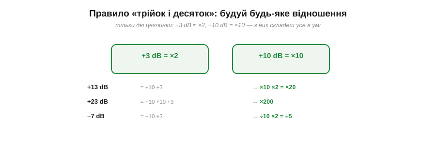
*Рис. 6.6.5.5. Дві цеглинки: +3 dB = ×2, +10 dB = ×10. Складаючи їх: +13 dB = +10 +3 = ×10 ×2 = ×20; +23 dB = +10 +10 +3 = ×200; −7 dB = −10 +3 = ÷10 ×2 = ÷5.*

**Приклад (переклад у думці).** Скільки разів це?

```
+13 dB = +10 +3   →  ×10 × 2   = × 20
+23 dB = +10+10+3 →  ×10×10×2  = × 200
−7 dB  = −10 +3   →  ÷10 × 2   = ÷ 5  (тобто ×0.2)
```

Розклавши дБ на десятки й трійки, ти миттєво прикинеш відношення без жодного калькулятора. Це неоціненно для оцінок «на серветці»: побачив «+16 дБ» — це +10+3+3 = ×10×2×2 = ×40. Кілька хвилин практики — і переклад дБ↔рази стає автоматичним.

### Децибели скрізь

Раз дБ — це відношення, ним зручно міряти **все**, що в радіо є відношенням, а таких величин більшість.


*Рис. 6.6.5.6. **Підсилення** (+дБ): підсилювач додає потужності. **Втрати** (−дБ): кабель, стіна, відстань віднімають. **SNR** (дБ): відношення сигналу до шуму. **Виграш антени** (dBi): наскільки антена спрямованіша за ідеальну всебічну. Усе це — відношення, тож усе зручно в дБ.*

Підсилення підсилювача, втрати в кабелі чи на відстані, відношення сигналу до шуму (SNR), **виграш антени** (його позначають dBi — дБ відносно ідеальної всебічної антени, §6.8) — усе це відношення, і всі вони говорять однією мовою децибел. Завдяки цьому **весь** шлях сигналу — від передавача через кабель, антену, простір, ще антену й кабель до приймача — описують єдиною шкалою й просто **складають**. Це й робить дБ незамінним інструментом радіоінженера.

### Практика: читаємо радіоспецифікацію

Зведімо все в найкорисніший навик — читання реальної специфікації.


*Рис. 6.6.5.7. Передавач «+20 dBm» (=100 мВт) і чутливість приймача «−95 dBm». Їхня **різниця** — запас на всі втрати по дорозі: +20 − (−95) = **115 дБ**. Стільки децибел можна «втратити» (на відстань, стіни, кабель), поки зв'язок ще живий.*

**Приклад (запас лінії).** Передавач +20 dBm, чутливість приймача −95 dBm:

```
запас на втрати = потужність TX − чутливість RX
                = (+20) − (−95)
                = 115 дБ
```

Ці 115 дБ — і є той «бюджет», який можна розтринькати на втрати по дорозі (відстань, стіни, неузгодженість антен), і поки сумарні втрати менші за нього, зв'язок працює. Тільки-но втрати перевищать запас — приймач уже не «чує» сигнал.

> 🔧 **Навіщо це.** Уміти читати dBm і дБ — обов'язкова навичка радіопроєкту. У будь-якому даташиті радіомодуля шукай два числа: **потужність передавача** (у dBm — скільки випромінює) і **чутливість приймача** (у dBm — найслабший сигнал, який він ще розбирає). Їхня різниця — твій **бюджет** у децибелах. Більше потужності TX чи кращу (глибше в мінус) чутливість RX — більший бюджет — більша дальність. Усе подальше проєктування радіо зводиться до арифметики цих децибел; саме її ми складемо в повний бюджет лінії у §6.7.6.

Озброївшись децибелами, ми готові кількісно говорити про головну біду радіо — те, що сигнал неминуче **слабшає** з відстанню. Чому навіть у чистому просторі, без жодних стін, потужність падає, і то дуже швидко? Скільки децибел «з'їдає» сама лише відстань? Це питання **загасання у просторі** — фінальна тема нашої фізики радіо.

---

## 6.6.6 Загасання у просторі

Остання — і найпрактичніша — тема нашої фізики радіо: чому сигнал **слабшає**. Здавалося б, хвиля летить простором сама, без втрат енергії (§6.6.1) — то чому ж далекий приймач чує її слабше? Відповідь дивовижна: справа не в поглинанні, а в **геометрії**. Навіть у цілковитій порожнечі, без жодної стіни чи молекули повітря, потужність неминуче падає — і то за дуже жорстким законом, який ми вже зустрічали аж у Розділі 1.1. Зрозуміти його — означає зрозуміти, чому дальність радіо обмежена й що з цим робити.

### Куля, що розпливається

Уяви, що передавач випромінює хвилю **навсібіч** — рівномірно в усі боки. Енергія розходиться, наче надувається світна куля. Загальна потужність на кулі лишається тією самою, але куля **росте** — і та сама енергія розмазується по дедалі більшій поверхні.

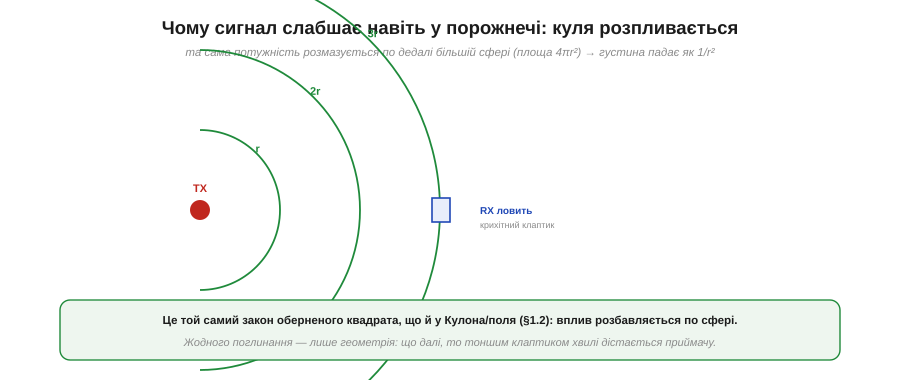
*Рис. 6.6.6.1. Передавач випромінює потужність навсібіч; вона розмазується по сфері, площа якої росте як 4πr². Приймач за відстані r ловить лише **крихітний клаптик** цієї сфери. Що далі — то тоншим клаптиком хвилі дістається приймачу. Жодного поглинання — лише геометрія.*

Ось у чому суть: приймальна антена «зачерпує» лише **маленьку площадку** з усієї велетенської сфери. Площа сфери — 4πr², тож удвічі далі — учетверо більша сфера — і той самий клаптик антени ловить учетверо меншу частку загальної потужності. Енергія нікуди не зникла (поглинання немає!), вона просто **розбавилася** по більшій поверхні. І це — точнісінько той самий **закон оберненого квадрата**, що керував силою Кулона й полем у §1.1.2–1.1.3: будь-що, що випромінюється з точки навсібіч, розбавляється як 1/r².

### Закон оберненого квадрата

Сформулюймо це числом. Густина потужності падає як **1/r²** — і це дає просте правило в децибелах.


*Рис. 6.6.6.2. Удвічі далі → площа сфери вчетверо більша → потужності вчетверо менше. А ÷4 потужності — це рівно −6 дБ. Утричі далі — ще −3.5 дБ. Кожне подвоєння відстані «з'їдає» 6 дБ.*

**Приклад (скільки дБ з'їдає відстань).** Застосуймо 1/r² і переклад у дБ (з §6.6.5):

```
×2 відстані → ÷4 потужності  → −6 дБ
×4 відстані → ÷16            → −12 дБ
×10 відстані → ÷100          → −20 дБ
```

Запам'ятай головне правило: **кожне подвоєння відстані коштує 6 дБ**, а кожне десятикратне віддалення — 20 дБ. Це не поглинання й не перешкоди — це чиста геометрія порожнечі, від якої нікуди не дітися. Реальний світ лише **додає** втрат зверху.

### Частота теж збільшує втрати

Є тонкість, що часто дивує: втрати у вільному просторі залежать не лише від відстані, а й від **частоти**. Вища частота — більші втрати (за тих самих антен). Чому?


*Рис. 6.6.6.3. Приймальна антена «зачерпує» з хвилі ефективну площу, пропорційну λ². Коротша хвиля (вища частота) → менший «зачерп» → менше впійманої потужності. Тому втрати у вільному просторі ростуть і з відстанню, і з частотою: FSPL = (4π·d / λ)².*

Річ у тім, що **ефективна площа** приймальної антени (скільки хвилі вона «вловлює») пропорційна λ². На вищій частоті хвиля коротша, λ² менше, антена зачерпує менший клаптик — отже, ловить менше потужності. Тому повна формула втрат у вільному просторі (*free-space path loss*, FSPL) містить **обидва** чинники: FSPL = (4π·d/λ)² — росте і з відстанню d, і з частотою (бо λ = c/f). Це ще одна, окрема від §6.6.4, причина, чому 5 ГГц «бере» ближче за 2.4 ГГц навіть у чистому полі без жодних стін.

### Числа: втрати на 2.4 ГГц

Підставмо реальні числа, щоб відчути масштаб втрат.


*Рис. 6.6.6.4. На 2.4 ГГц у чистому полі: 1 м → ≈40 дБ, 10 м → ≈60 дБ, 100 м → ≈80 дБ, 1 км → ≈100 дБ. Кожне ×10 відстані додає ≈20 дБ. Навіть без перешкод відстань з'їдає десятки децибел.*

**Приклад (втрати на типовій дистанції).** Прикиньмо FSPL на 2.4 ГГц:

```
1 м   → ≈ 40 дБ
10 м  → ≈ 60 дБ   (+20 за ×10)
100 м → ≈ 80 дБ   (+20 за ще ×10)
```

Згадай із §6.6.5 наш запас у 115 дБ. Уже на 100 метрах **у чистому полі** відстань з'їдає 80 з них — більшу частину! І це без жодної стіни. Ось чому навіть потужне радіо має скінченну дальність: обернений квадрат невблаганний, і потужність падає лавиною.

### Поза порожнечею

Усе сказане — це **базові** втрати ідеальної порожнечі. Реальний світ накладає зверху ще й **додаткові**.


*Рис. 6.6.6.5. На неминуче розпливання (1/r²) накладаються: **стіни** (від кількох до десятків дБ кожна), **дощ і листя** (поглинають, надто на 2.4 ГГц і вище), **тіло чи метал поруч** (затуляють і відбивають). Усі ці втрати — поверх геометричної бази.*

Тобто повні втрати — це **сума**: неминуче геометричне розпливання плюс усе, що трапилося на шляху (стіни, дощ, листя, людське тіло поряд з антеною). Бетонна стіна може забрати десяток-другий децибел, мокре листя на 2.4 ГГц — теж відчутно, а рука, що затулила антену телефона, легко «з'їдає» кілька децибел. Геометрія — це підлога втрат, нижче якої не буває; реальний світ лише додає.

### Загасання домінує в бюджеті

Чому ця тема така важлива? Бо саме загасання у просторі — **найбільший** окремий доданок у балансі радіолінії.


*Рис. 6.6.6.6. Із запасу ~115 дБ (§6.6.5) сама лише відстань (розпливання) забирає левову частку — десятки децибел; стіни й завмирання беруть ще; на запас надійності лишається мало. Тому дальність обмежена, а приймачі мусять бути чутливими.*

Звідси два глибокі практичні висновки. Перший: **дальність обмежена** саме тому, що відстань поглинає більшість бюджету — на решту (стіни, надійність) лишається мало. Другий: **чутливість приймача критична** — що глибший «мінус» у dBm він здатен почути, то більший запас на втрати, то далі дістає зв'язок. Повний підрахунок усіх «плюсів і мінусів» лінії — **бюджет радіолінії** — ми складемо в §6.7.6; а загасання у просторі буде в ньому найбільшим від'ємним числом.

### Як подолати загасання

Раз дальність — це арифметика децибел, то й розширити її можна лише **піднявши бюджет**: додавши «плюсів» або прибравши «мінусів».


*Рис. 6.6.6.7. Чотири важелі: **більше потужності TX** (+дБ, але обмежено законом і енергією); **кращі антени** (+dBi з обох боків — спрямованість); **нижча частота** (менше FSPL і краща проникність, ціна — менше даних); **нижча швидкість** (краща чутливість RX — повільніше, зате далі).*

> 🔧 **Навіщо це.** Це повний набір важелів для будь-якого радіопроєкту, де бракує дальності. Можна **підняти потужність** передавача (але закон обмежує, та й батарея сідає). Можна взяти **кращі антени** з обох боків — спрямована антена «фокусує» потужність і додає dBi. Можна **знизити частоту** — менше втрат у просторі й краща проникність (ціна — менше даних і більша антена). А найцікавіший важіль — **знизити швидкість**: повільніший сигнал приймач розбирає з глибшого мінуса, тобто чутливість зростає. Саме на цьому стоїть LoRa: жертвуючи швидкістю, вона дістає на кілометри. «Повільніше = далі» — фундаментальний обмін, який варто пам'ятати щоразу, коли зв'язку «не вистачає трохи».

---

Підсумуймо Розділ 6.6. Ми відкрили «чорну скриньку» радіо й розклали його фізику: що таке **електромагнітна хвиля** — два поперечні поля, народжені тремтливим зарядом (§6.6.1); як пов'язані **частота й довжина хвилі** через c = λ·f (§6.6.2); як хвиля **поширюється** й чому важлива **поляризація** (§6.6.3); чому різні **діапазони** дають компроміс дальності, швидкості й розміру антени (§6.6.4); навіщо **децибели** (§6.6.5) і чому сигнал неминуче **загасає** з відстанню (§6.6.6). Тепер «радіо по повітрю» — не магія, а зрозуміла фізика, якою можна свідомо оперувати.

Та лишилося велике питання, якого ми весь розділ свідомо не торкалися. Сама по собі радіохвиля — це лише чисте коливання однієї частоти, «несуча». Як **посадити** на неї інформацію — голос, дані, біти? Як одна станція не глушить іншу на сусідній частоті? І як, склавши всі децибели потужностей, виграшів і втрат, **порахувати наперед**, чи працюватиме лінія на потрібній відстані? Це питання **модуляції** й **бюджету радіолінії** — і їм присвячено наступний розділ.

> ▶️ Далі: [Розділ 6.7 — Радіо: модуляція й бюджет лінії](../modulation-link-budget/modulation-link-budget.md)