# Розділ 6.3 — Шина SPI

I2C із попереднього розділу був майстром економії: дві лінії, багато пристроїв, адреси — усе заради мінімуму дротів. Та за цю ощадливість довелося платити **швидкістю**: відкритий колектор із повільним RC-підйомом і службові біти на кожен байт (адреса, підтвердження, старт-стоп) тримають I2C на скромних сотнях кілогерц. А що, як швидкість важливіша за дроти — треба гнати потік із дисплея, швидкого АЦП чи флеш-пам'яті? Тоді беруть іншу синхронну шину, з протилежним компромісом: **SPI**.

**SPI** (*Serial Peripheral Interface*, розроблена Motorola в 1980-х) жертвує кількома зайвими лініями заради **швидкості** й **повного дуплексу**. Вона теж синхронна (має лінію такту), теж ведучий-ведений — але влаштована геть інакше: окремі лінії даних в обидва боки, двотактні виходи замість відкритого колектора, вибір пристрою окремою ніжкою замість адреси, і протокол, обчищений до самих даних. Цей розділ розбирає її: загальна ідея (ця тема), чотири лінії докладно, чотири режими CPOL/CPHA з їхньою сумнозвісною пасткою, вибір кристала й кілька пристроїв, швидкість і відстань, і нарешті — коли обирати SPI, а коли I2C.

---

## 6.3.1 SPI: швидка повнодуплексна шина

Щоб відчути SPI, найкраще зрозуміти його **головну ідею** — вона напрочуд елегантна й одразу пояснює і повний дуплекс, і швидкість. Але почнімо з загального вигляду: які лінії, хто ким керує, і чим це відрізняється від I2C.

### Чотири лінії й ролі

SPI у класичному вигляді має **чотири** лінії, у кожної — чітка роль.

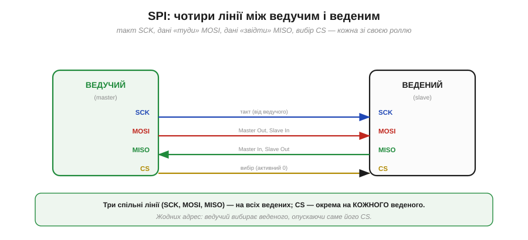
*Рис. 6.3.1.1. **SCK** — такт (його завжди генерує ведучий). **MOSI** (*Master Out, Slave In*) — дані від ведучого до веденого. **MISO** (*Master In, Slave Out*) — дані від веденого до ведучого. **CS** (*Chip Select*, активний нулем) — вибір веденого. Три перші лінії спільні для всіх ведених, а CS — окрема на кожного.*

Зверніть увагу на **дві окремі** лінії даних: MOSI «туди» і MISO «звідти». Це вже натякає на повний дуплекс — на відміну від єдиної SDA в I2C. Такт SCK, як і в I2C, генерує ведучий — він господар часу. А ось замість адрес тут **CS**: щоб обрати веденого, ведучий опускає саме його лінію CS у нуль. Поки що тримаймо ці чотири імені в голові (детально — у §6.3.2) і перейдімо до суті.

### Серце SPI: кільце зсувних регістрів

Ось ідея, з якої виростає весь SPI. Уявімо у ведучому й у веденому по одному **зсувному регістру** (з [§3.3.5](../../block-3-digital-processor/flip-flops-registers/flip-flops-registers.md)) — по 8 біт. З'єднаймо їх **у кільце**: вихід ведучого (MOSI) йде у вхід веденого, а вихід веденого (MISO) повертається у вхід ведучого. І хай SCK зсуває **обидва** регістри одночасно.

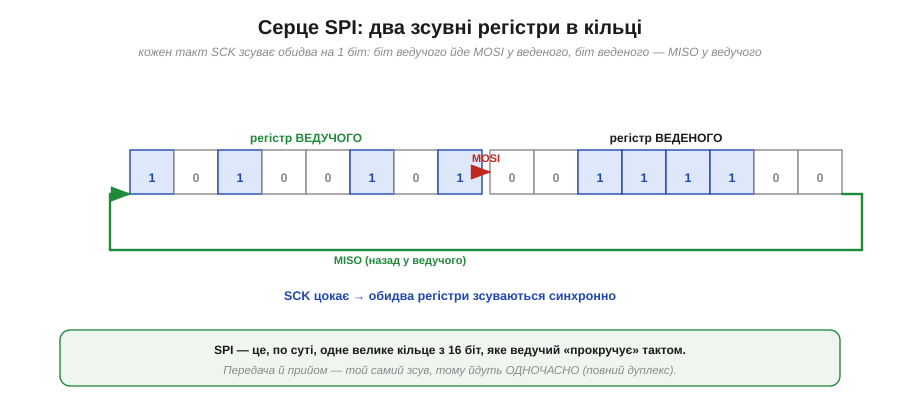
*Рис. 6.3.1.2. Регістри ведучого й веденого з'єднані в кільце: MOSI несе біт із ведучого у веденого, MISO — біт із веденого назад у ведучого. Кожен такт SCK зсуває обидва на один біт. По суті це одне велике 16-бітне кільце, яке ведучий «прокручує» тактом.*

Це і є вся механіка SPI: **одне кільце, яке прокручують тактом**. На кожному такті SCK один біт виходить з ведучого по MOSI й заходить у веденого, і **водночас** один біт виходить із веденого по MISO й заходить у ведучого. Передача й прийом — це **той самий зсув**, тому вони нероздільні й відбуваються одночасно. Звідси й повний дуплекс — не як окрема функція, а як **наслідок самої будови**.

### Обмін байтом: повний дуплекс

Подивімося, що станеться за 8 тактів — повний байт.

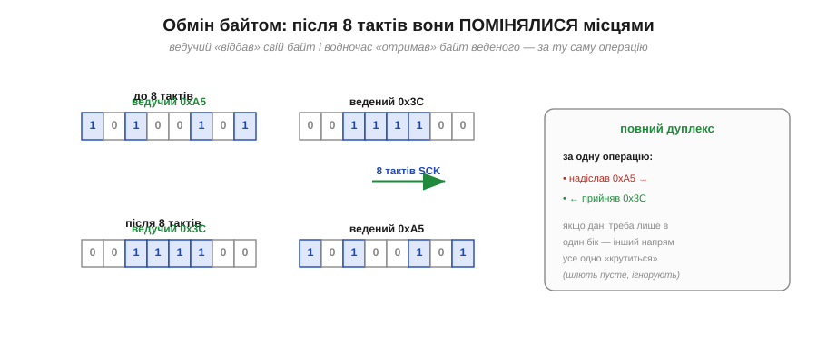
*Рис. 6.3.1.3. До обміну: у ведучого 0xA5, у веденого 0x3C. Після 8 тактів SCK регістри прокрутилися повністю — і байти **помінялися місцями**: тепер у ведучого 0x3C, у веденого 0xA5. За одну операцію ведучий і надіслав свій байт, і прийняв байт веденого.*

Ось характерна риса SPI, яку варто прийняти одразу: обмін **завжди двобічний**. Коли ведучий «надсилає» байт, він тим самим зсувом **отримує** байт від веденого; коли «читає» — мусить щось висунути по MOSI, щоб прокрутити кільце. Тому навіть якщо тобі потрібен лише один напрямок (скажімо, тільки писати в дисплей), інший усе одно «крутиться»: у бік, який не цікавить, шлють пусті байти (часто 0x00 чи 0xFF) і просто ігнорують те, що прийшло назад.

> 🔧 **Навіщо це.** Звідси випливає головна особливість програмування SPI: **`transfer(x)` одночасно і пише, і читає**. Функція обміну приймає байт для надсилання й **повертає** байт, що прийшов у відповідь. Щоб лише прочитати — посилаєш «пусте» (dummy) і береш відповідь; щоб лише записати — посилаєш дані й відкидаєш повернене. Звикнути до цього «завжди обмін» — половина успіху в роботі зі SPI.

### Без адрес: вибір лінією CS

Якщо в I2C ведучий гукав веденого **адресою** по спільній лінії, то SPI робить інакше: у кожного веденого — **своя** лінія CS, і ведучий просто опускає потрібну.

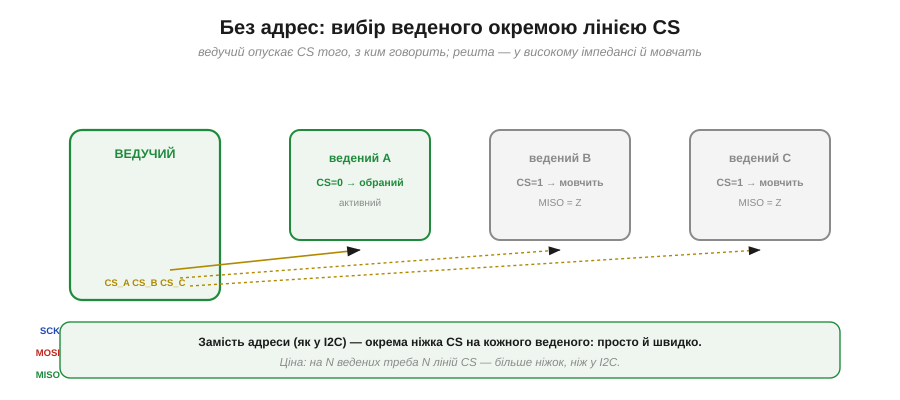
*Рис. 6.3.1.4. Три ведені ділять спільні SCK/MOSI/MISO, але кожен має окрему CS. Ведучий опускає CS того, з ким говорить (тут A) — і лише той активний; решта бачать CS = 1, мовчать і відпускають MISO у високий імпеданс, щоб не заважати. Жодних адрес.*

Це проста й швидка схема вибору: жодного адресного байта, жодного звіряння — просто «обрав ніжкою». Поки CS веденого високий, той повністю **ігнорує** SCK і MOSI й тримає свій вихід MISO у високому імпедансі (відключеним), щоб не заважати обраному. Ціна очевидна: на **N** ведених треба **N** ліній CS, тобто більше ніжок мікроконтролера, ніж у I2C з його двома дротами на всіх. Це фундаментальний компроміс SPI — детальніше про вибір кристала й кілька пристроїв у §6.3.4.

### Чому швидкий: двотактні виходи

Тепер — чому SPI **швидкий**. Дві причини, і перша електрична. На відміну від I2C з його відкритим колектором, SPI використовує звичайні **двотактні** (*push-pull*) виходи: вони активно женуть лінію і вгору, і вниз.

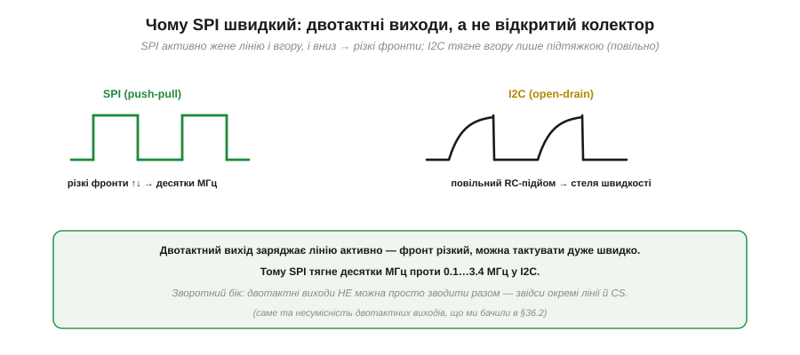
*Рис. 6.3.1.5. SPI активно заряджає лінію в обидва боки — фронти різкі, тож можна тактувати дуже швидко (десятки МГц). I2C тягне вгору лише підтяжкою, і повільний RC-підйом ставить стелю швидкості (§6.2.2). Саме тому SPI випереджає I2C на порядок і більше.*

Згадаймо з §6.2.2: у I2C лінію вгору тягне **пасивна** підтяжка, і повільний RC-підйом обмежує частоту сотнями кілогерц. SPI натомість жене лінію **активно** в обидва боки, фронти виходять різкі, і шину можна тактувати на десятках мегагерц. Але є й зворотний бік тієї самої медалі: двотактні виходи, як ми пам'ятаємо, **не можна** просто зводити разом — два таких на одній лінії закоротять одне одного. Саме тому SPI й **не може** обійтися спільною лінією з адресами, як I2C, і змушений мати окремі лінії та CS. Швидкість і «більше дротів» тут — дві сторони одного рішення.

### Мінімум церемоній

Друга причина швидкості — **протокол**. У I2C кожен корисний байт обвішаний службовими: старт, адреса, підтвердження після кожного байта, стоп. SPI прибирає майже все це.

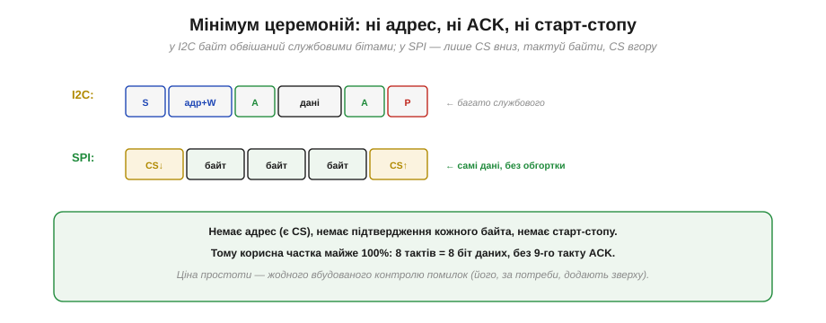
*Рис. 6.3.1.6. У I2C байт оточений службовими елементами (S, адреса, ACK, P). У SPI — лише опустив CS, протактував потрібні байти, підняв CS. Немає ні адрес (є CS), ні підтвердження кожного байта, ні старт-стопу. Тому 8 тактів = 8 біт даних, без 9-го такту ACK.*

Це робить SPI не лише швидким за тактом, а й **ефективним**: корисна частка близька до 100%, бо немає 9-го такту підтвердження (як у I2C), немає адресних і службових байтів на кожну транзакцію. Але та сама простота має ціну: у SPI **немає вбудованого контролю помилок** — ні ACK, ні навіть стандартного формату пакета. Кожен виробник вигадує власний формат команд, а надійність (контрольні суми тощо), якщо потрібна, додають **зверху**, як ми робили для UART у §6.1.6.

### Характер SPI

Зведімо все докупи — портрет SPI одним поглядом.

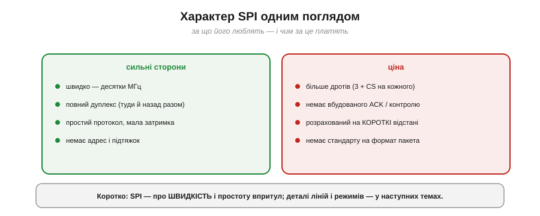
*Рис. 6.3.1.7. Сильні сторони: швидкість (десятки МГц), повний дуплекс, простий протокол із малою затримкою, без адрес і підтяжок. Ціна: більше дротів (3 + CS на кожного), немає вбудованого контролю помилок, розрахований на короткі відстані, немає стандарту на формат пакета.*

> 🔧 **Навіщо це.** Тримай цей портрет у голові, обираючи шину. SPI беруть там, де потрібна **швидкість** і пристрій близько на платі: дисплеї, швидкі АЦП/ЦАП, флеш- і SD-пам'ять, деякі радіомодулі. Там, де важливіша **економія ніжок** і пристроїв багато, а швидкість другорядна (дрібні давачі), виграє I2C. Дуже часто на одній платі мирно живуть **обидві** шини: повільні давачі на I2C, швидкий дисплей чи пам'ять — на SPI. Уміти обрати правильну під задачу — і є мета цього розділу.

Ми побачили SPI згори: кільце зсувних регістрів, повний дуплекс, вибір через CS, швидкі двотактні лінії, мінімальний протокол. Тепер розгляньмо кожну з чотирьох ліній **детально** — хто що жене, коли MISO відключається, навіщо саме така роль у CS — щоб від загальної картини перейти до точного розуміння сигналів. Цим — лініями MOSI, MISO, SCK, CS — і займемося далі.

---

## 6.3.2 Лінії: MOSI, MISO, SCK, CS

Чотири лінії SPI ми вже назвали; тепер придивімося до кожної впритул. Головне питання для кожної — **хто** її жене і **коли**. З відповіді на нього випливе і те, як багато ведених уживаються на спільних лініях, і навіщо CS — окрема ніжка, і навіть звідки беруться найчастіші помилки. Особливу увагу приділимо одному дотепному прийому — **високому імпедансу** на MISO, без якого спільна шина не працювала б.

### Хто жене кожну лінію й коли

Зведімо ролі чотирьох ліній у чітку таблицю.

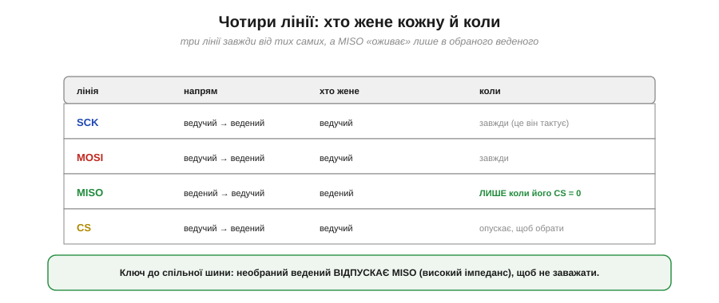
*Рис. 6.3.2.1. **SCK** і **MOSI** завжди жене ведучий. **CS** теж жене ведучий (опускає, щоб обрати). А ось **MISO** жене **ведений** — і то лише тоді, коли його CS опущено. Необраний ведений MISO не торкається.*

Три лінії прості: SCK, MOSI і CS завжди йдуть **від ведучого** — він господар такту, даних «туди» й вибору. Уся хитрість — у **MISO**. Її жене ведений, і це створює потенційну проблему: якщо на спільному MISO висить кілька ведених, що буде, коли непотрібні теж спробують його тримати? Адже виходи двотактні (§6.3.1), і два таких на одній лінії закоротять одне одного. Розв'язок — у тому, **коли** ведений жене MISO.

### Спільний MISO без конфлікту: високий імпеданс

Ось ключова деталь усієї теми. Ведений жене MISO **тільки** тоді, коли його обрано (CS = 0). А поки CS високий, ведений **відпускає** MISO — переводить свій вихід у **високий імпеданс** (*high-Z*), наче фізично від'єднує його від лінії.

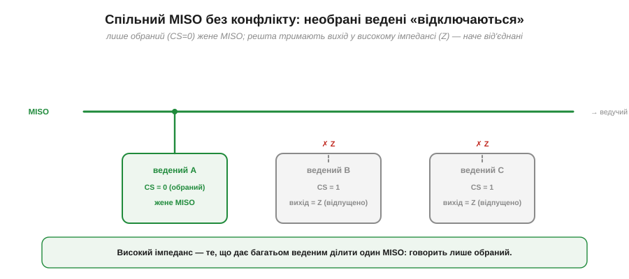
*Рис. 6.3.2.2. Лише обраний ведений A (CS = 0) жене MISO; ведені B і C тримають свій вихід у високому імпедансі (Z) — наче від'єднані від лінії. Тому кілька ведених мирно ділять один MISO: у кожну мить його жене рівно один — обраний.*

Високий імпеданс ми вже зустрічали — це третій стан виходу (з §6.1.4 та GPIO §4.4): не «1» і не «0», а «відключено», коли вихід ні тягне, ні штовхає, і лінія для нього наче не існує. Саме він рятує SPI: хоч виходи й двотактні (а отже, несумісні, якщо їх просто звести), необрані ведені **не беруть участі** — їхній MISO у Z, — тож конфлікту немає. Говорить завжди рівно один, обраний пристрій.

> 🔧 **Навіщо це.** Звідси практичне: якщо на спільному MISO «висить» ведений, який **не вміє** відпускати вихід у Z (трапляється в дешевих чи саморобних пристроях), він заважатиме всім іншим — два ведені змагатимуться за лінію. Перевіряй у даташиті, що ведений переводить MISO у високий імпеданс за CS = 1. А якщо такий «невихований» пристрій усе ж потрібен — його MISO відділяють буфером із третім станом. Дивний симптом «два SPI-давачі працюють поодинці, але не разом» — майже завжди саме про це.

### CS обрамляє обмін

Тепер про CS уважніше. Він не просто «вмикач» — він **обрамляє** всю транзакцію: ведучий опускає CS на початку обміну й піднімає в кінці.

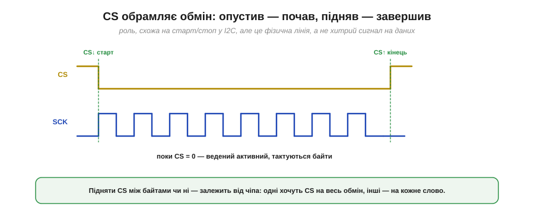
*Рис. 6.3.2.3. Поки CS = 0, ведений активний: він тактується SCK, читає MOSI й жене MISO. CS↓ позначає початок обміну, CS↑ — кінець. Роль, схожа на старт/стоп у I2C, — але це проста фізична лінія, а не хитрий сигнал на даних.*

Порівняйте з I2C: там початок і кінець позначали особливими змінами SDA при високому SCL (§6.2.4); тут усе простіше — окрема лінія, опустив-підняв. Це знову той самий розмін: SPI витрачає **ще одну ніжку** (CS), зате уникає будь-яких хитрощів із даними. Чи піднімати CS між окремими байтами одного обміну, чи тримати опущеним на весь — залежить від конкретного чіпа (про це нижче).

### Повна картина в часі

Зберімо всі чотири лінії на одній часовій діаграмі — так SPI видно «наживо».


*Рис. 6.3.2.4. Ведучий опускає CS, видає 8 тактів SCK; на кожному такті він жене черговий біт по MOSI, а ведений — по MISO; обидва біти знімають по фронту SCK. Вісім тактів — і байт пройшов в обидва боки. Який саме фронт (передній чи задній) — питання режиму (§6.3.3).*

Ця діаграма — суть SPI в часі: вибрав (CS↓), протактував вісім фронтів, на кожному обмінявся бітом туди й назад, відпустив (CS↑). Зверніть увагу, що MOSI і MISO «оновлюються» в одному ритмі з SCK — і саме момент, **коли** знімати біт (по якому фронту такту), визначає режим, до якого ми перейдемо в §6.3.3.

### Зоопарк назв

Практична засторога: одні й ті самі лінії в різних даташитах звуться **по-різному**, і це збиває з пантелику.


*Рис. 6.3.2.5. MOSI трапляється як COPI, SDO (на ведучому) або SDI/DIN (на веденому); MISO — як CIPO, SDO (на веденому) або SDI (на ведучому); CS — як SS, nCS, NSS. Дивись не на букви, а на **роль**: хто жене, у який бік ідуть дані.*

Розберімо головну пастку. Сучасні даташити часто вживають інклюзивні назви **COPI** (*Controller Out, Peripheral In* — те саме MOSI) і **CIPO** (те саме MISO). А на самому чіпі-веденому лінії підписані з **його** погляду: **SDO** (*Serial Data Out*) — це його **вихід**, тобто MISO, а **SDI** — його вхід, тобто MOSI. Тому, з'єднуючи ведучого з веденим, не зводь однакові назви — зводь **за напрямком**: вихід ведучого (MOSI) на вхід веденого (SDI), вихід веденого (SDO) на вхід ведучого (MISO). Інакше отримаєш ту саму помилку «вихід на вихід», що й TX-TX у UART (§6.1.1).

### CS робить більше, ніж вибір

Лінію CS легко недооцінити як простий «вмикач», та в багатьох чіпів вона несе додатковий зміст — її **фронти** щось означають.


*Рис. 6.3.2.6. У різних чіпів CS↓ позначає початок нової команди (вона має вкластися, поки CS = 0); CS↑ між словами скидає внутрішній лічильник чи автомат; а деякі АЦП вимагають CS-імпульс на КОЖЕН вимір (як засувку результату). Тобто важливі саме фронти CS, а не лише його рівень.*

Через це не можна просто тримати CS «завжди опущеним про запас»: для багатьох чіпів CS↑ між словами — це сигнал «команда скінчилась, скинь стан». Деякі АЦП взагалі засувають кожен результат фронтом CS. Тому робота з CS — за даташитом: тримати опущеним на весь обмін чи смикати на кожне слово.

> 🔧 **Навіщо це.** Неправильна робота з CS — другий за частотою глюк SPI (після неправильного режиму з §6.3.3). Симптоми: чіп віддає сміття, «застряє» після першої команди або зчитує зсунуті дані. Перша перевірка: чи смикаєш CS саме так, як вимагає даташит, — один імпульс на весь обмін чи на кожне слово, і чи піднімаєш його між транзакціями.

### Економний варіант: три дроти

Насамкінець — корисно знати, що буває й **3-дротовий** SPI. У ньому MOSI і MISO зливають в **одну** двонапрямлену лінію даних (часто звану SDIO або SDA): пристрій то жене її, то слухає — по черзі.


*Рис. 6.3.2.7. Звичайний 4-дротовий SPI має окремі MOSI й MISO (повний дуплекс). 3-дротовий зливає їх в одну двонапрямлену лінію SDIO — економить ніжку, але дані йдуть лише по черзі (напівдуплекс). Зустрічається в багатьох дисплеях і дрібних чіпах.*

Це той самий компроміс «менше дротів ↔ менше одночасності», що й між I2C та SPI: 3-дротовий варіант економить ніжку там, де повний дуплекс не потрібен (а часто й не потрібен — команда, потім відповідь ідуть по черзі). Багато дисплеїв і дрібних мікросхем працюють саме так.

Ми розклали всі чотири лінії по ролях і навіть побачили їх разом на діаграмі. Але одну річ ми щоразу відкладали: **по якому саме фронту** SCK знімають біт і коли його виставляють? Виявляється, тут можливі **чотири** комбінації — і якщо ведучий із веденим розуміють її по-різному, обмін перетворюється на сміття, хоч дроти й з'єднані правильно. Ці чотири режими (CPOL/CPHA) — найвідоміша пастка SPI, і їм присвячена наступна тема.

---

## 6.3.3 Режими CPOL/CPHA

Якщо SPI колись «не запрацював, хоч усе з'єднано правильно», майже напевно винні **режими**. SPI лишає на вибір дві дрібні, на перший погляд, речі: у якому стані тримати такт у спокої і по якому його фронту знімати біт. Дві двійкові опції дають **чотири** комбінації — і якщо ведучий із веденим обрали різні, приймач знімає дані не в той момент, перетворюючи їх на нісенітницю. Розберімося в цих двох параметрах і навчімося безпомилково обирати правильний режим.

### CPOL: рівень спокою такту

Перший параметр — **CPOL** (*Clock Polarity*, полярність такту). Він задає лише одне: який рівень має SCK, коли нічого не передається.


*Рис. 6.3.3.1. CPOL = 0 — у спокої такт **низький**, і кожен такт починається наростанням. CPOL = 1 — у спокої такт **високий**, і кожен такт починається спаданням. CPOL лише «перевертає» всю діаграму такту згори вниз.*

Сам по собі CPOL нешкідливий: він тільки визначає рівень спокою й, відповідно, який фізичний фронт (наростання чи спадання) вважати «переднім». Важливо одне — щоб ведучий і ведений однаково домовилися. А ось **коли** саме знімати біт, задає другий параметр.

### CPHA: на якому фронті вибірка

Другий параметр — **CPHA** (*Clock Phase*, фаза такту). Він каже, на якому з двох фронтів кожного такту приймач **знімає** біт.

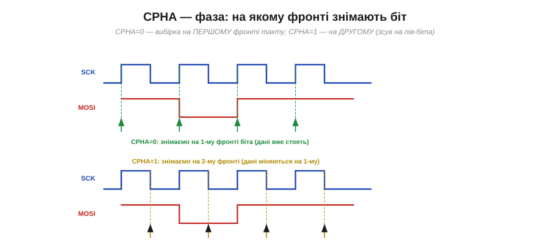
*Рис. 6.3.3.2. CPHA = 0 — біт знімають на **першому** фронті такту (дані виставлені заздалегідь і вже стоять). CPHA = 1 — біт знімають на **другому** фронті (на першому дані якраз міняються). Різниця — зсув на пів біта в тому, коли виставляють і коли читають дані.*

Сенс CPHA — у домовленості «виставити, потім зняти». За **CPHA = 0** дані мусять стояти на лінії ще до першого фронту (їх виставляють заздалегідь, часто в момент CS↓ або на попередньому спаді), а знімають на цьому першому фронті. За **CPHA = 1** усе зсунуто на пів такту: перший фронт **виставляє** новий біт, а знімають його аж на другому фронті. Головне — обидві сторони повинні однаково розуміти, на якому фронті дані вже дійсні.

### Чотири режими

CPOL і CPHA — кожен по два значення, разом чотири комбінації, які прийнято нумерувати **режимами 0–3**.

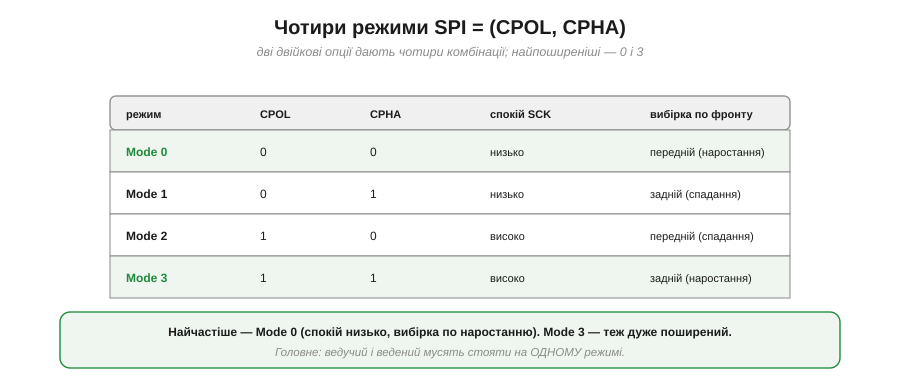
*Рис. 6.3.3.3. Mode 0 = (0,0): спокій низько, вибірка по наростанню. Mode 1 = (0,1): спокій низько, вибірка по спаданню. Mode 2 = (1,0): спокій високо, вибірка по спаданню. Mode 3 = (1,1): спокій високо, вибірка по наростанню. Найпоширеніші — 0 і 3.*

Запам'ятовувати всі чотири напам'ять не треба — досить розуміти, що це просто (CPOL, CPHA). На практиці абсолютна більшість чіпів працює в **Mode 0** (спокій низько, вибірка по наростанню) або **Mode 3** (спокій високо, вибірка по наростанню). Головне правило незмінне: **ведучий і ведений мусять стояти на одному режимі**.

### Mode 0 докладно

Розгляньмо найпоширеніший режим у деталях, щоб відчути ритм.


*Рис. 6.3.3.4. У Mode 0 такт у спокої низький; дані на лінії стають дійсними ще до фронту (їх виставляють на попередньому спаді або при CS↓), а знімають рівно на **наростанні** SCK. Шість фронтів — шість знятих біт.*

Логіка проста й симетрична: на спаді такту той, хто говорить, **готує** наступний біт; на наростанні приймач його **знімає**. Кожен фронт наростання влучає рівно в середину стабільного біта — точно як ми хотіли. Це й робить Mode 0 «типовим за замовчуванням».

### Типова пастка: різні режими → сміття

А тепер — власне пастка, заради якої й існує ця тема. Що буде, якщо ведучий шле в Mode 0, а ведений налаштований на Mode 1?


*Рис. 6.3.3.5. Ведучий виставляє дані для зняття на **наростанні** (Mode 0, зелені стрілки — чіткі біти). Та ведений у Mode 1 знімає на **спаданні** (червоні стрілки) — і часто потрапляє якраз на **перехід** даних, де рівень невизначений. Результат — зсунуті чи хибні біти, хоч дроти з'єднані бездоганно.*

Ось чому це таке підступне: фізично все правильно — MOSI, MISO, SCK, CS з'єднані як треба, осцилограф показує гарні сигнали, — а дані виходять сміттям. Приймач просто **дивиться не в той момент**: знімає біт тоді, коли лінія ще перемикається, або зсувається на пів біта. Класичний симптом — «то працює, то ні», стабільне сміття або зчитування, схоже на правду, але зміщене.

> 🔧 **Навіщо це.** Коли SPI віддає нісенітницю, а дроти точно правильні, **перша підозра — режим**. Звір CPOL і CPHA, які хоче ведений (з даташита), з тими, що виставив ведучий. Це найчастіша помилка SPI, дорожча навіть за плутанину з CS (§6.3.2). Добра новина: помилитися можна лише чотирма способами, і всі вони швидко перевіряються (нижче).

### Як визначити режим із даташита

Звідки взяти правильний режим? З **часової діаграми** в даташиті веденого. Її читають двома поглядами.

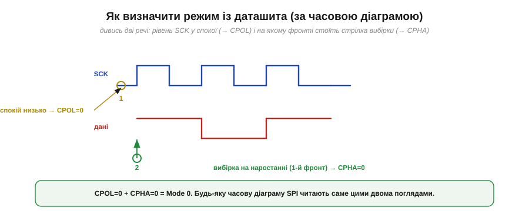
*Рис. 6.3.3.6. Погляд перший: який рівень SCK у спокої? Низький → CPOL = 0. Погляд другий: на якому фронті стоїть стрілка вибірки даних? На наростанні (першому) → CPHA = 0. Разом: CPOL = 0, CPHA = 0 = Mode 0.*

Алгоритм простий і працює для будь-якої SPI-діаграми: (1) подивися на **рівень спокою** SCK — це CPOL; (2) знайди, на якому **фронті** діаграма показує зняття/дійсність даних — це CPHA. Дві відповіді складаються в номер режиму. Якщо ж даташит прямо пише «SPI Mode 0» — ще краще, не доведеться навіть дивитися на діаграму.

### Задати режим у коді — і порада з налагодження

Нарешті — як виставити режим у програмі. У світі Arduino його задають разом зі швидкістю й порядком біт:

```
// швидкість 8 МГц, старший біт першим, режим 0
SPISettings cfg(8000000, MSBFIRST, SPI_MODE0);
SPI.beginTransaction(cfg);
uint8_t r = SPI.transfer(0x9F);   // обмін (і пише, і читає — §6.3.1)
SPI.endTransaction();
```


*Рис. 6.3.3.7. Режим виставляють разом зі швидкістю й порядком біт: SPI_MODE0…SPI_MODE3 відповідають парам (CPOL, CPHA). Порада: якщо SPI віддає сміття й немає часу читати даташит — режимів лише чотири, тож просто перебери MODE0…MODE3 і знайди робочий.*

> 🔧 **Навіщо це.** Тримай у голові короткий чек-лист «німого» SPI: (1) **режим** — CPOL/CPHA звірені з даташитом? (2) **порядок біт** — MSB чи LSB першим (теж налаштування)? (3) **CS** — смикаєш правильно (§6.3.2)? (4) **швидкість** — не зависока для цього веденого (§6.3.5)? Перші два — найчастіші. І найшвидший спосіб, коли дані схожі на сміття: оскільки режимів лише чотири, **перебери** SPI_MODE0…MODE3 — за чотири спроби знайдеш робочий, а тоді вже звіриш із даташитом, чому саме він.

Ми розібралися з найпідступнішою частиною SPI — режимами. Тепер повернімося до лінії CS, яку поки розглядали лише як «вибір одного веденого». А що, коли ведених **кілька**? Як організувати багато пристроїв на спільних SCK/MOSI/MISO, скільки треба ліній CS, і які є хитріші схеми, коли ніжок бракує (як-от з'єднання «ланцюжком»)? Цим — вибором кристала й кількома пристроями — і займемося далі.

---

## 6.3.4 Вибір кристала (CS) і кілька пристроїв

Уся принада SPI — у швидкості, але платить він **ніжками**, і найвиразніше це видно, коли ведених стає багато. Як посадити на одну SPI-шину п'ять давачів, дисплей і пам'ять? Скільки знадобиться ліній? І що робити, коли ніжок мікроконтролера на всі CS бракує? У цій темі — топологія багатьох пристроїв, головне правило вибору й кілька хитрощів, що рятують ніжки.

### Зіркова топологія: окремий CS на кожного

Стандартний спосіб під'єднати кілька ведених — **зірка**: три лінії SCK, MOSI, MISO роблять **спільними** для всіх, а лінію вибору CS дають **кожному свою**.


*Рис. 6.3.4.1. SCK, MOSI, MISO ідуть до всіх ведених паралельно — це спільна шина. А CS у кожного власна (CS0, CS1, CS2), і всі вони йдуть від ведучого. Щоб поговорити з потрібним, ведучий опускає рівно його CS; решта тим часом «сплять» і не торкаються MISO.*

Логіка проста: дані й такт спільні, а **вибір** — індивідуальний. Ведучий опускає CS того, з ким хоче говорити, обмінюється байтами й піднімає CS назад. Звідси й формула ніжок: на **N** ведених треба **3 + N** ліній — три спільні плюс по одній CS на кожного. Це фундаментальна риса SPI, з якої випливає і його головне правило, і його головна вада.

### Лише одна CS активна водночас

Головне правило зіркової шини: у кожну мить **рівно одна** CS може бути опущена. Чому не дві? Згадаймо §6.3.2: обраний ведений **жене** MISO. Якщо опустити дві CS, **двоє** ведених женуть MISO одночасно — а це знову той самий конфлікт двотактних виходів, що ми бачили в §6.2.2.


*Рис. 6.3.4.2. Ліворуч: опущена одна CS — MISO жене рівно один ведений, решта у високому імпедансі, усе гаразд. Праворуч: опущено дві CS — двоє ведених женуть MISO разом, виникає конфлікт, і дані псуються. Тому ведучий тримає всі CS високими й опускає тільки одну.*

Тому стандартна дисципліна така: **усі CS за замовчуванням високі**, і лише на час обміну ведучий опускає рівно одну. Опустити дві — гарантований конфлікт на MISO й зіпсовані дані. Це проста, але критична умова коректної роботи багатьох пристроїв на спільній шині.

### Ціна в ніжках проти I2C

Тепер про зворотний бік зірки. Формула «3 + N» означає, що з кожним новим веденим SPI **з'їдає ще одну ніжку**. Порівняймо з I2C, де додавання пристрою не коштує жодного дроту.

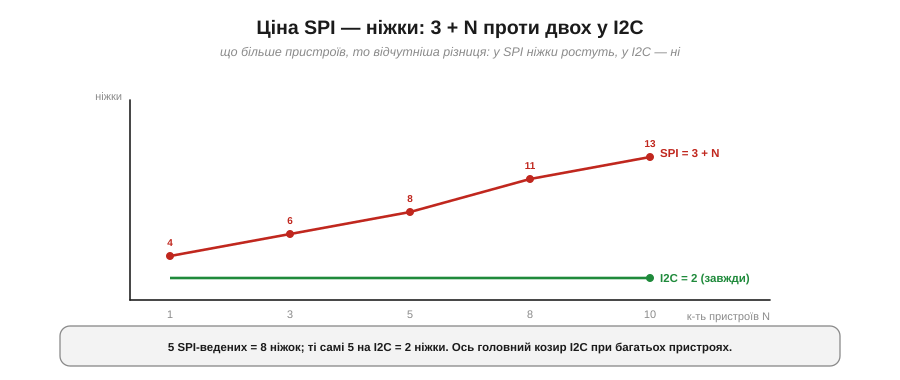
*Рис. 6.3.4.3. У SPI кількість ніжок росте як 3 + N: один ведений — 4 ніжки, п'ять — 8, десять — 13. У I2C завжди 2, скільки б пристроїв не висіло на шині. Що більше пристроїв, то відчутніший програш SPI у ніжках.*

**Приклад (ніжки на п'ять пристроїв).** Порахуймо для п'яти ведених:

```
SPI: 3 спільні + 5 CS = 8 ніжок
I2C: 2 (SDA + SCL), скільки б пристроїв не було
```

Ось головний козир I2C за багатьох пристроїв: два дроти на всіх проти восьми. Тому дрібні численні давачі частіше вішають на I2C, а SPI лишають для кількох **швидких** пристроїв. Та коли ніжок усе ж бракує, у SPI є хитрощі, що рятують ситуацію.

### Ланцюжок: daisy-chain

Перша хитрість — **ланцюжкове** з'єднання (*daisy-chain*). Замість зірки ведених з'єднують **послідовно**: MOSI ведучого йде у перший ведений, його вихід — у другий, і так далі, а MISO останнього повертається до ведучого. І всі вони ділять **один** CS і один SCK.

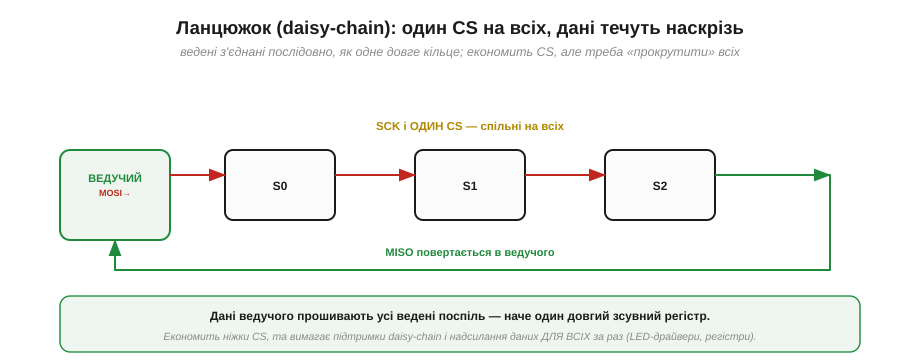
*Рис. 6.3.4.4. Ведені з'єднані в ланцюг: дані ведучого «прошивають» їх один за одним, наче один довгий зсувний регістр. SCK і єдина CS — спільні. Економить CS-ніжки, але вимагає підтримки daisy-chain і надсилання даних одразу для ВСІХ ведених у ланцюзі.*

Ідея спирається прямо на «кільце зсувних регістрів» із §6.3.1, тільки кілець тепер кілька, з'єднаних у довгий ланцюг. На кожен такт дані зсуваються крізь **усіх** ведених поспіль. Це економить CS (одна на весь ланцюг), але має ціну: пристрій має **підтримувати** такий режим (не всі вміють), а ведучому щоразу доводиться висувати дані **для всіх** ланок одразу. Daisy-chain поширений у драйверів світлодіодів і каскадів зсувних регістрів, де однотипних пристроїв багато, а керують ними спільно.

### Дешифратор розширює CS

Друга хитрість — **дешифратор** (*decoder / demultiplexer*). Якщо потрібно багато окремих CS, але ніжок обмаль, ставлять дешифратор, що з кількох ліній робить багато.


*Рис. 6.3.4.5. Дешифратор «3-у-8» перетворює 3 лінії вибору на 8 окремих CS (активна завжди одна). Замість 8 ніжок CS витрачаємо 3 — торгуємо трохи логіки за купу зекономлених ніжок.*

**Приклад (економія ніжок дешифратором).** Для восьми ведених:

```
напряму:      3 спільні + 8 CS         = 11 ніжок
з 3→8 дешифратором: 3 спільні + 3 лінії = 6 ніжок
```

Дешифратор перетворює N ліній на 2ᴺ виходів, тож трьома ніжками можна керувати вісьмома CS. Ціна — додаткова мікросхема й те, що «не вибрати нікого» простим способом уже не вийде (потрібен ще дозвільний вхід). Та коли ведених багато, а ніжок мало, це елегантний вихід.

### Налаштування на кожного й патерн транзакції

Важлива практична деталь: різні ведені на одній шині можуть хотіти **різні** налаштування — свій режим (§6.3.3) і свою швидкість. Тому налаштування задають **на кожну транзакцію**, обрамляючи її своєю CS.


*Рис. 6.3.4.6. Дисплей може хотіти 20 МГц і Mode 0, а АЦП — 1 МГц і Mode 3. Перед обміном опускають CS потрібного веденого, відкривають транзакцію з ЙОГО налаштуваннями, обмінюються, закривають транзакцію й піднімають CS.*

```
// у кожного веденого — свої параметри
SPISettings disp(20000000, MSBFIRST, SPI_MODE0);   // дисплей: швидко
SPISettings adc (1000000,  MSBFIRST, SPI_MODE3);   // АЦП: повільніше

digitalWrite(CS_ADC, LOW);          // обрали саме АЦП
SPI.beginTransaction(adc);          // його швидкість і режим
v = SPI.transfer16(0x0000);         // обмін (пише й читає)
SPI.endTransaction();
digitalWrite(CS_ADC, HIGH);         // відпустили
```

Цей **патерн** — «опусти CS → beginTransaction зі своїми налаштуваннями → обмін → endTransaction → підніми CS» — і є стандартний спосіб працювати з кількома різними веденими на одній шині, не плутаючи їхні режими й швидкості.

### Пастки з CS

Насамкінець — найчастіші помилки, і майже всі вони про CS.


*Рис. 6.3.4.7. **Плаваюча CS**: ніжку лишили «у повітрі» — ведений ловить хибний вибір (тримай CS визначеною, високою). **Дві опущені CS**: конфлікт на MISO (опускай рівно одну). **CS не піднято** між обмінами: наступна команда «злипається» з попередньою (піднімай CS після кожного обміну).*

> 🔧 **Навіщо це.** Золоте правило роботи з CS: **усі лінії CS за замовчуванням високі**, опускаєш **рівно одну** на час обміну й **одразу піднімаєш** після. Звідси три перевірки, коли SPI-пристрій поводиться дивно: чи не лишилася якась CS «плаваючою» (без чіткого рівня при старті), чи не опущено випадково дві, і чи піднімаєш CS між транзакціями. Разом із перевіркою режиму (§6.3.3) це покриває переважну більшість «непрацюючих» SPI-шин.

Ми знаємо, як вибрати потрібного веденого й посадити багатьох на одну шину. Лишилося розібратися з тим, що робить SPI **швидким**, — і де межа цієї швидкості. Чому SPI тягне десятки мегагерц, тоді як I2C ледь дотягує до одиниць? І чому водночас SPI годиться лише для **коротких** відстаней — у межах плати, а не через кабель? Про швидкість і відстань — у наступній темі.

---

## 6.3.5 Швидкість і відстань

SPI має репутацію «швидкої» шини — і заслужену. Але та сама будова, що дає швидкість, ставить і жорстку межу на **відстань**: SPI чудовий між сусідніми чіпами на платі й геть непридатний через метровий кабель. Зрозуміти **обидва** боки цієї медалі — і чому вони нерозлучні — практично важливо: це підказує, де SPI на місці, а де треба зовсім інша шина.

### Чотири причини швидкості

Швидкість SPI — не одна хитрість, а **чотири** рішення, що складаються разом.

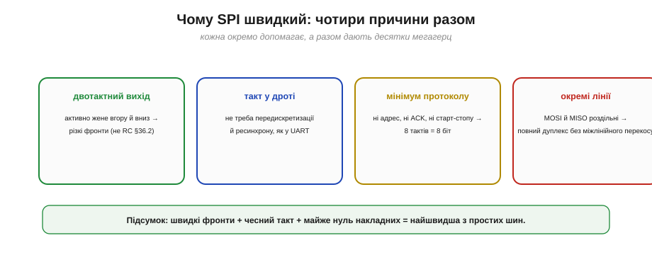
*Рис. 6.3.5.1. **Двотактний вихід** дає різкі фронти (не повільний RC-підйом, як у відкритого колектора §6.2.2). **Такт у дроті** позбавляє передискретизації й ресинхрону, потрібних в асинхронному UART. **Мінімум протоколу** — ні адрес, ні ACK, ні старт-стопу — 8 тактів несуть рівно 8 біт. **Окремі лінії** MOSI/MISO дають повний дуплекс без міжлінійного перекосу.*

Кожна причина окремо вже знайома: різкі фронти (на противагу RC-підйому I2C з §6.2.2), чесний такт замість вгадування швидкості (на противагу UART), нуль накладних біт, роздільні лінії даних. Разом вони й роблять SPI найшвидшою з простих шин — десятки мегагерц проти одиниць у I2C.

### Діапазон швидкостей

Глянемо на числа в порівнянні.


*Рис. 6.3.5.2. Приблизні типові межі (лог-шкала): UART — до сотень кілобіт за секунду (часом до кількох Мбіт/с), I2C — від 100 кГц до 3.4 МГц, SPI — від одиниць до десятків мегагерц (а спеціалізовані — й понад 50 МГц). SPI випереджає на цілий порядок.*

Максимальну частоту SPI задає або периферія мікроконтролера (дільник SCK від тактової), або **сам ведений**: у його даташиті завжди є гранична частота SCK (скажімо, 10 чи 50 МГц), вище якої він уже не встигає. Але — і це головне в темі — цю високу частоту ще треба «довезти» до веденого непошкодженою. А ось тут і починаються обмеження на відстань.

### Чому близько: перекіс такт-дані

Перша й найважливіша причина «короткої дистанції» — **перекіс** між тактом і даними. Це той самий ефект, що вбивав паралельні шини (§6.1.1), тільки тепер між лінією SCK і лінією даних.

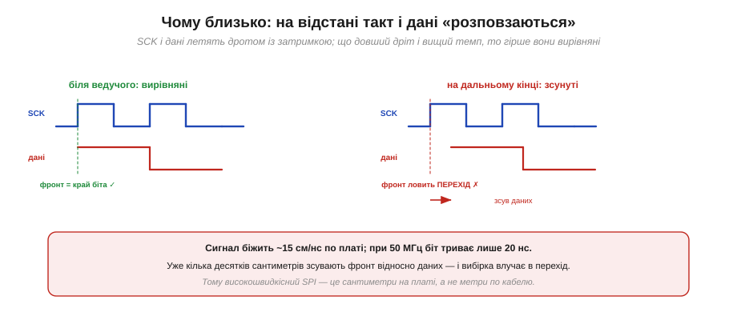
*Рис. 6.3.5.3. Біля ведучого фронт SCK і край біта вирівняні. Та поки вони летять дротом, кожен набирає затримку — і на дальньому кінці фронт SCK уже зсунутий відносно даних. За високого темпу цей зсув перевищує частку біта, і вибірка влучає в **перехід** даних, де рівень невизначений.*

**Приклад (де межа).** Прикиньмо, наскільки далеко можна гнати швидкий SPI:

```
сигнал біжить по платі ≈ 15 см/нс
при 50 МГц біт триває 1/50 МГц = 20 нс

10 см доріжки → затримка ≈ 0.7 нс (3.5% біта) — байдуже
1 м кабелю   → затримка ≈ 7 нс  (35% біта)   — уже критично
```

На сантиметрах плати затримка мізерна, і 50 МГц «їдуть» легко. Та вже на метрі кабелю зсув з'їдає третину біта — а з урахуванням зворотного шляху MISO (нижче) і поготів стає фатальним. Тому високошвидкісний SPI живе на **сантиметрах**, а не метрах.

### Ємнісне навантаження

Друга причина — **ємність**. Кожна доріжка й кожен під'єднаний пристрій додають паразитну ємність, яку двотактний вихід мусить заряджати на кожному фронті. Велика ємність — повільніший фронт.

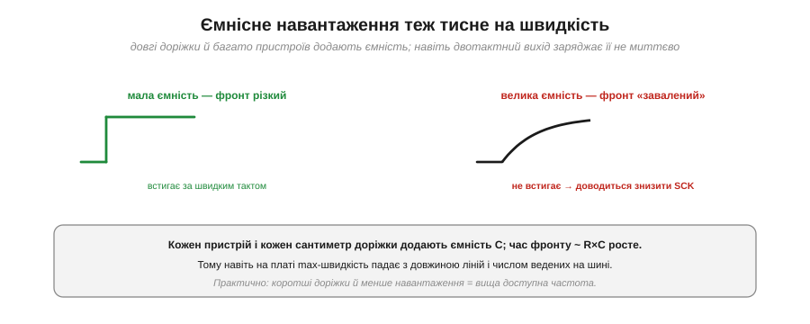
*Рис. 6.3.5.4. За малої ємності фронт різкий і встигає за швидким тактом. За великої (довгі доріжки, багато ведених) фронт «завалюється» — заряд ємності через опір виходу триває довше (час ~ R·C), і доводиться знижувати SCK.*

Це знову RC, тільки тепер не на пасивній підтяжці, а на опорі самого двотактного виходу й сумарній ємності лінії. Звідси практичне: що **довші** доріжки й що **більше** ведених на шині, то нижча доступна максимальна частота — навіть у межах плати. Коротші лінії й менше навантаження — вища швидкість.

### Затримка туди-назад на MISO

Третя, ще жорсткіша межа стосується саме **MISO**. Ведучий видає фронт SCK, але відповідь по MISO мусить **повернутися** назад, перш ніж він її зніме.


*Рис. 6.3.5.5. Фронт SCK летить до веденого (затримка t); ведений жене MISO, і та летить назад (ще t). Разом ≈ 2t, перш ніж ведучий зможе коректно зняти MISO. На високій частоті 2t стає сумірним із бітом — і MISO не встигає усталитися до моменту вибірки.*

Це **подвійна** затримка: туди такт, назад дані. Тому навіть якщо ведений сам по собі швидкий, на довгій лінії ведучий мусить чекати на MISO зайвий час — і це окрема, ще суворіша межа на «швидко + далеко», ніж простий перекіс. Саме через неї у високошвидкісного SPI бувають особливі режими таймінгу, коли ведучий навмисне знімає MISO на пів такту пізніше.

### Однополюсність і відбиття

Четверта причина — електрична природа сигналів. SPI **однополюсний** (*single-ended*): кожна лінія міряється відносно спільної землі, і нічим не «гаситься». На короткій доріжці це чудово, та на довгому неузгодженому дроті з'являються **відбиття** (дзвін) і легко наводяться **завади**.


*Рис. 6.3.5.6. Ліворуч: однополюсний сигнал SPI на довгому дроті «дзвенить» (відбиття від кінця) і ловить завади, які нема чим гасити. Праворуч: диференційна лінія несе дві протифазні копії, і завада, однакова на обох, гаситься різницею — тому такі шини тримають метри.*

Це принципова відмінність від **диференційних** шин (RS-485, CAN, LVDS), де сигнал несуть дві протифазні лінії, а приймач дивиться на їхню **різницю**: будь-яка завада, що наводиться однаково на обидві, у різниці зникає. SPI цього не вміє — він однополюсний і неузгоджений, тож його доля — коротка чиста доріжка, а не довгий зашумлений кабель.

### Карта «швидкість × відстань»

Зведімо все в одну картину.


*Рис. 6.3.5.7. SPI займає кут «швидко + близько» (сантиметри плати, десятки МГц). I2C — «повільніше, теж близько». А для **метрів** і завадного середовища беруть диференційні шини (RS-485, CAN, LVDS). Швидко й далеко водночас простими однополюсними засобами не виходить.*

> 🔧 **Навіщо це.** Запам'ятай SPI як **жителя плати**: він блискучий між сусідніми чіпами — дисплеєм, пам'яттю, швидким АЦП — на сантиметрах доріжок і десятках мегагерц. Та щойно треба тягти сигнал **через кабель** чи на **метри**, SPI — хибний вибір: знижуй швидкість (і тоді навіщо SPI?) або бери диференційну шину, призначену для дистанції. Практичне правило: SPI не виходить за межі однієї плати. Якщо в проєкті бачиш SPI-давач на довгому шлейфі — це привід насторожитися й перевірити, чи не сиплються дані.

Ми розклали SPI повністю: ідея, лінії, режими, кілька пристроїв, швидкість і відстань. Тепер можна зробити те, заради чого все це було, — поставити SPI й I2C поряд і чітко сказати, **коли що обирати**. Скільки ніжок, яка швидкість, яка відстань, чи потрібен дуплекс, скільки пристроїв — кожен критерій схиляє шальку в той чи інший бік. Цим практичним порівнянням — SPI проти I2C — і завершимо розділ.

---

## 6.3.6 SPI vs I2C: коли що

Тепер, коли ми знаємо обидві синхронні шини зсередини, настав час головного практичного питання: **яку обрати** під конкретну задачу? Відповідь рідко однозначна, бо SPI й I2C — це два протилежні компроміси, і «кращий» залежить від того, що для проєкту важливіше: ніжки, швидкість, простота додавання пристроїв чи вбудований контроль. Розкладімо вибір по критеріях — і виведемо прості правила.

### По кожному критерію

Найкраще почати з прямого зіставлення.

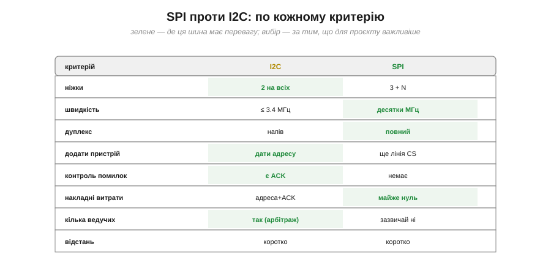
*Рис. 6.3.6.1. I2C виграє за ніжками (2 на всіх проти 3 + N), легкістю додати пристрій (адреса, не дріт), вбудованим контролем (ACK) і підтримкою кількох ведучих. SPI виграє за швидкістю (десятки МГц проти 3.4), повним дуплексом і майже нульовими накладними. За відстанню обидві — лише «близько».*

Прочитаймо таблицю як набір **протиставлень**. I2C — це **економія**: два дроти на скільки завгодно пристроїв, новий чіп додається адресою без жодного нового дроту, кожен байт квитується (ACK), а на шині може бути навіть кілька ведучих. SPI — це **швидкість і простота передачі**: десятки мегагерц, повний дуплекс, майже нуль службових біт — але ціною ніжки на кожен пристрій і відсутності будь-якого вбудованого контролю помилок. Жодна не «краща» взагалі; кожна виграє у своєму.

### Коротке дерево рішень

Ці критерії складаються у просте дерево, що здебільшого вирішує все за три питання.

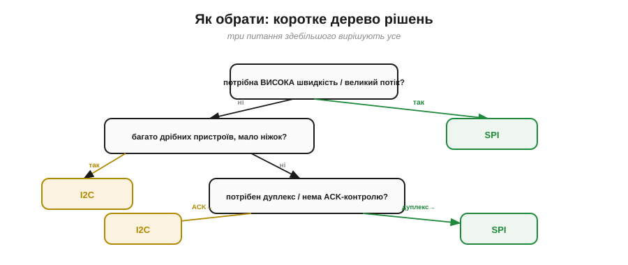
*Рис. 6.3.6.2. Потрібна висока швидкість чи великий потік? → SPI. Ні, але багато дрібних пристроїв і мало ніжок? → I2C. Потрібен повний дуплекс? → SPI; важливий вбудований ACK-контроль? → I2C. Три питання — і вибір майже завжди зроблено.*

На практиці перше питання — про **швидкість** — найвагоміше: якщо треба гнати кольоровий дисплей чи читати файли з картки, відповідь одразу SPI, і далі можна не йти. Якщо швидкість не критична, вирішує **число пристроїв і ніжок**: багато дрібних давачів — I2C. А тонкі випадки (потрібен дуплекс чи, навпаки, ACK-контроль) розводять решту.

### Що вішають на кожну шину

Звичай склався доволі чіткий, і його корисно знати як орієнтир.


*Рис. 6.3.6.3. На **I2C** зазвичай — дрібні давачі (IMU, барометр, давач світла), годинник реального часу, невелика EEPROM, малий OLED: усе, де важить економія ніжок, а швидкість другорядна. На **SPI** — кольоровий TFT-дисплей, SD-картка, флеш-пам'ять, швидкий АЦП, деякі радіомодулі: усе, де потрібен великий потік на сантиметрах плати.*

Це не закон, а саме звичай: формально малий дисплей можна зробити і по I2C, і по SPI. Та логіка стійка — **повільне й дрібне тяжіє до I2C, швидке й об'ємне до SPI**, — і коли береш новий компонент, ця інтуїція одразу підказує, на яку шину його чекати.

### Часто — обидві разом

Найважливіше усвідомлення: вибір «SPI **чи** I2C» часто хибний. На реальній платі їх ставлять **обидві** — кожну під свої пристрої.


*Рис. 6.3.6.4. Типова плата: повільні давачі (IMU, баро, RTC) висять на I2C, забираючи лише дві ніжки; а швидкий TFT-дисплей і SD-картка — на SPI зі своїми CS. Один мікроконтролер тримає обидві шини, і кожна робить те, у чому сильна.*

Це норма, а не виняток: I2C економить ніжки на гроні дрібних давачів, а SPI паралельно везе швидкий потік на дисплей і картку. Мікроконтролер має апаратні блоки і для тієї, і для тієї шини, тож тримати обидві — звична практика. Тому правильніше питати не «яку шину взяти на плату», а «**яку шину — для кожного пристрою**».

### Три дротові шини модуля

Відступімо ще на крок і складемо докупи **всі три** дротові шини, які ми пройшли в цьому модулі.


*Рис. 6.3.6.5. **UART** — точка-точка, асинхронно, для зв'язку з модулем, ПК, GPS чи радіомодемом. **I2C** — багато дрібних пристроїв на двох дротах, з адресами. **SPI** — кілька швидких пристроїв на платі, з окремими лініями й CS. Не конкуренти, а інструменти під різні задачі.*

Тепер картина дротового зв'язку повна. **UART** (§6.1) — коли треба з'єднати **два** пристрої потоком, часто на якусь відстань (модуль, комп'ютер, GPS). **I2C** (§6.2) — коли треба повісити **багато дрібних** чіпів на мінімум дротів. **SPI** (§6.3) — коли треба **швидко** обмінятися з кількома пристроями на платі. Маючи в руках усі три, ти обираєш не «єдино правильну» шину, а **доречну** під кожен зв'язок у системі.

### Бюджет ніжок на прикладі

Закріпимо вибір конкретним розрахунком — типовим для реального проєкту.

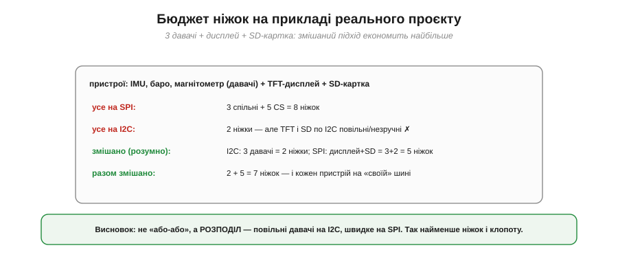
*Рис. 6.3.6.6. Проєкт: три давачі (IMU, баро, магнітометр) + TFT-дисплей + SD-картка. Усе на SPI — 8 ніжок. Усе на I2C — 2 ніжки, але дисплей і картка по I2C повільні й незручні. Розумний розподіл — давачі на I2C, дисплей і картка на SPI — дає 7 ніжок, і кожен пристрій на «своїй» шині.*

**Приклад (порахуймо ніжки).** Розкладімо проєкт із п'яти пристроїв:

```
усе на SPI : 3 спільні + 5 CS = 8 ніжок
усе на I2C : 2 ніжки — але TFT і SD по I2C повільні/незручні

змішано (розумно):
  I2C: 3 давачі           = 2 ніжки
  SPI: дисплей + SD (2 CS) = 3 + 2 = 5 ніжок
  разом                   = 7 ніжок
```

Виграє **розподіл**: давачі, яким байдужа швидкість, тиснуться на I2C за дві ніжки, а швидкі дисплей і картка отримують SPI. Не «або-або», а «кожному — своє».

### Підсумкові «за замовчуванням»

Зведімо все у прості правила-замовчування.


*Рис. 6.3.6.7. Дрібний давач, мало ніжок → I2C. Швидкий дисплей / SD / флеш → SPI. Зв'язок із модулем, ПК, GPS, радіо → UART. І давачі, і дисплей на платі → I2C + SPI разом. А метри або кабель із завадами → ні те, ні те: диференційна шина.*

> 🔧 **Навіщо це.** Тримай ці замовчування в голові — вони покривають майже всі рішення. Та головне вміння — не завчити правило, а **зважити критерії**: скільки ніжок маєш, яка швидкість і відстань потрібні, чи треба дуплекс, скільки пристроїв. Часто відповідь — «обидві шини», і це нормально. А коли задача виходить за межі плати (метри, кабель, завади), згадай: ні I2C, ні SPI туди не йдуть — там царина диференційних шин і, зрештою, радіо, до якого ми скоро дійдемо.

---

Підсумуймо Розділ 6.3. Ми пройшли SPI від ідеї до практики: **кільце зсувних регістрів** і повний дуплекс (§6.3.1), чотири лінії з їхніми ролями й трюком високого імпедансу (§6.3.2), чотири **режими** CPOL/CPHA з їхньою пасткою (§6.3.3), вибір кристала й **кілька пристроїв** (§6.3.4), **швидкість і відстань** (§6.3.5) і, нарешті, вибір між SPI та I2C (§6.3.6). Разом із UART та I2C це завершує **дротовий** бік зв'язку: тепер ти знаєш три головні шини, якими чіпи говорять одне з одним на платі й між платами, і вмієш обрати доречну.

Та всі вони — **дротові**: вимагають фізичного з'єднання. А сучасний пристрій дедалі частіше має спілкуватися **без дротів** — із телефоном, мережею, іншим апаратом за кілька метрів чи кілометрів. Як чіп передає байти **по повітрю**? Перший крок у цей світ — готові радіомодулі **Wi-Fi і Bluetooth**, вбудовані прямо в мікроконтролер: вони ховають усю складність радіо за звичним програмним інтерфейсом. З них — найближчих і найпрактичніших — і почнемо знайомство з бездротовим зв'язком.

> ▶️ Далі: [Розділ 6.5 — Бездротовий зв'язок на чіпі: Wi-Fi і Bluetooth](../wifi-bluetooth/wifi-bluetooth.md)