# Розділ 6.9 — Радіозв'язок системи: керування, телеметрія, MAVLink

Ось ми й дійшли до фіналу Модуля 6 — і до моменту, коли вся фізика радіо нарешті **стає системою**. Ми пройшли довгий шлях: від електромагнітної хвилі (Розділ 6.6) через модуляцію й бюджет лінії (Розділ 6.7) до антен (Розділ 6.8). Тепер настав час **застосувати** все це — побачити, як радіо керує реальним апаратом, скажімо, дроном, і як той шле дані назад. Це і є **радіозв'язок системи**: не абстрактний сигнал, а жива розмова між машиною й людиною.

Цей розділ — найбільш «прикладний» у модулі, і він поєднує все попереднє з конкретним інструментом — **MAVLink**, спільною мовою дронів (з історії розділу). Ми розберемо: які взагалі бувають радіолінії в системі й чим вони різняться (ця тема); як влаштований **RC-лінк** керування; як іде потік **телеметрії**; чому **затримка й надійність** тут критичні; як побудовано **пакет MAVLink** (heartbeat, ID, CRC); як **читати потік і слати команди**; і нарешті — як автоматизувати все це з власного коду через **pymavlink**, перекинувши місток до бортового комп'ютера. Це вершина модуля: тут радіо з явища природи перетворюється на інструмент у твоїх руках.

> 📜 **Перед матеріалом — історія:** [MAVLink і відкриті дрони — як аспірант із Цюриха задав стандарт](hist-mavlink.md). Вона показує, звідки взялася спільна мова дронів: її «між іншим» створив Лоренц Маєр у ETH Zürich, а світовим стандартом вона стала завдяки відкритій спільноті — PX4, ArduPilot, Муньйос, Андерсон, Тридджелл. Гарний приклад того, що велике в техніці робиться колективно й відкрито.

---

## 6.9.1 Канали керування й телеметрії (дві ролі)

Почнімо з картини цілого. Коли кажуть «дрон на радіокеруванні», легко уявити **одну** радіолінію — мовляв, пульт зв'язується з апаратом, і все. Насправді в реальній системі працює **кілька** радіоліній з **різними ролями**, і плутати їх — типова помилка новачка. Розкласти ці ролі по поличках — найкращий вступ до всього розділу, бо далі ми розбиратимемо кожну окремо.

### Дві (а часто три) радіолінії

Подивімося на повну картину радіозв'язку типового апарата.

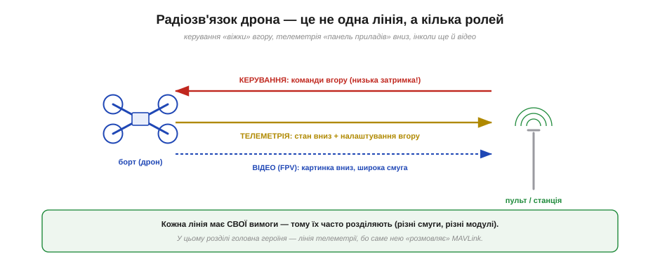
*Рис. 6.9.1.1. Угору йде **керування** — команди пілота чи автопілота (потребує низької затримки). Униз — **телеметрія**: стан апарата (висота, GPS, батарея), плюс налаштування йдуть угору. Часто є й третя лінія — **відео** (FPV) для картинки з камери. Кожна лінія має свої вимоги, тому їх зазвичай розділяють.*

Ролей, по суті, дві головні (плюс одна допоміжна). **Керування** (*control*) — команди йдуть **угору**, від пілота до апарата: куди летіти, який режим. **Телеметрія** (*telemetry*) — дані йдуть переважно **вниз**, від апарата до землі: висота, координати, заряд, попередження (а налаштування й команди — угору). І часто є третя — **відео** (FPV): картинка з бортової камери вниз. Кожна з цих ліній — наче окрема розмова з власними правилами, і саме тому їх зазвичай **розділяють**. Головна героїня нашого розділу — лінія **телеметрії**, бо саме нею «розмовляє» MAVLink; але спершу розберімо всі три, щоб не плутати.

### Лінія керування: «віжки» апарата

Перша роль — **керування**. Це найкритичніша лінія, бо від неї залежить, чи слухається апарат узагалі.


*Рис. 6.9.1.2. Лінія керування несе команди — положення стіків пульта (розкладені на «канали») чи команди автопілота. Вимоги: **низька затримка** (запізнена команда = аварія), **висока надійність** (втрата = безпечний режим), **мало даних** (лише положення стіків і режим). Якщо ця лінія падає — спрацьовує failsafe.*

Думай про лінію керування як про **віжки**. Вона несе **мало** даних — по суті, лише положення стіків пульта (розкладені на окремі **канали**: газ, крен, тангаж, нишпорення, перемикачі режимів) або команди автопілота. Але ці крихти даних мусять долітати **блискавично** й **безвідмовно**: запізнена на півсекунди команда «вирівнятися» — і апарат уже впав; загублена команда — і він не послухався. Тому головні вимоги тут — **мінімальна затримка** (десятки мілісекунд) і **максимальна надійність**, навіть ціною низької швидкості даних. І ще: лінія керування **«священна»** — якщо вона зникає (вийшов за межу дальності, заглушили, сіла батарея пульта), вмикається **failsafe**: апарат сам повертається додому (RTL) чи сідає. Цю лінію детально розберемо в §6.9.2.

### Лінія телеметрії: «панель приладів» і розмова

Друга роль — **телеметрія**. Це вже не «віжки», а радше **панель приладів** плюс двостороння розмова.

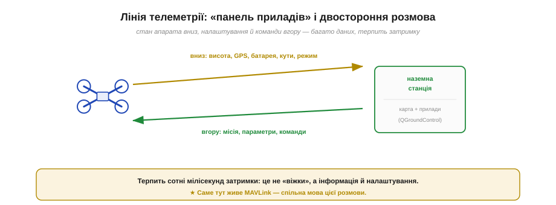
*Рис. 6.9.1.3. Униз ідуть дані стану: висота, кути, GPS, заряд батареї, режим польоту. Угору — налаштування, завантаження місії, окремі команди. Це двостороння розмова з багатьма даними, що терпить сотні мілісекунд затримки. Саме тут живе **MAVLink** — спільна мова цієї розмови (часто через QGroundControl).*

Лінія телеметрії несе **багато** різнорідних даних, але вже **не в реальному часі керування**. Униз тече **стан** апарата — висота, кути нахилу, координати GPS, заряд батареї, режим, попередження; це наповнює «панель приладів» наземної станції (карту, індикатори). Угору йдуть **налаштування** — завантаження маршруту-місії, зміна параметрів, окремі команди. Ключова відмінність від керування: телеметрія **терпить затримку** в сотні мілісекунд, бо це інформація й конфігурація, а не миттєві «віжки». Загубився пакет телеметрії — нічого страшного, прийде наступний. І саме на цій лінії живе **MAVLink** — стандартна мова, якою борт і станція (наприклад, QGroundControl) ведуть цю розмову. Їй присвячено §6.9.3 і весь подальший розділ.

### Третя лінія: відео (FPV)

Часто до цих двох додається третя — **відео**.


*Рис. 6.9.1.4. Відеолінія шле **одну** річ — картинку з бортової камери вниз, на екран чи окуляри пілота. Це **найширша смуга** з усіх, тому відео майже завжди дають **окремий діапазон** (часто 5.8 ГГц), щоб воно не «забивало» вузькі, але критичні лінії керування й телеметрії.*

Відеолінія (*FPV — first-person view*) має одну задачу — передати **картинку** з бортової камери вниз, пілотові на екран чи в окуляри. Вона **одностороння** й **найненажерливіша до смуги** (відео — це багато даних щосекунди). Саме тому її майже завжди виносять в **окремий діапазон** — найчастіше 5.8 ГГц, — щоб широкий відеопотік не заважав вузьким, але життєво важливим лініям керування й телеметрії. До речі, згадай **колову поляризацію** з §6.8.4 — її застосовують саме для FPV-відео, щоб картинка не пропадала, коли апарат перекидається в маневрах. Відео — поза головною темою нашого розділу, але знати про цю третю роль корисно.

### Навіщо розділяти ролі

Чому ж не звести все в одну лінію — простіше було б? Бо вимоги ролей **майже протилежні**.


*Рис. 6.9.1.5. Три причини. **Різні вимоги:** керуванню потрібна затримка, телеметрії — обсяг даних, відео — смуга; один канал усе не потягне оптимально. **Різні діапазони:** керування на 2.4/900/433 МГц, телеметрія на 433/915, відео на 5.8 ГГц — не глушать одне одного. **Безпека:** критичну лінію керування ізолюють, щоб збій відео чи телеметрії її не зачепив.*

Причин розділяти три. **Перша — несумісні вимоги:** одна лінія не може бути водночас і наднизьколатентною (керування), і ємною за даними (телеметрія), і широкосмуговою (відео); компроміс задовольнив би всіх погано. **Друга — різні діапазони:** розвівши ролі по різних частотах (керування часто 2.4 ГГц чи 868/915/433 МГц, телеметрія — 433/915 МГц, відео — 5.8 ГГц), ми уникаємо взаємних завад, та ще й обираємо для кожної оптимальний діапазон за дальністю й проникністю (§6.6.4). **Третя — безпека:** ізолювавши критичну лінію керування, ми гарантуємо, що збій у відео чи телеметрії її **не зачепить** — апарат лишиться керованим. Розділення ролей — це не ускладнення, а інженерна мудрість.

### Три ролі — три набори вимог

Зведімо відмінності в одну таблицю — щоб контраст став очевидним.

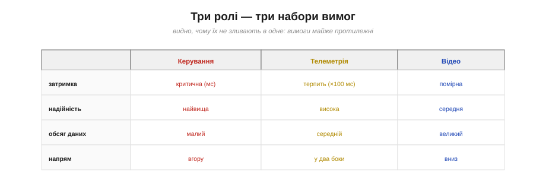
*Рис. 6.9.1.6. Керування: затримка критична, надійність найвища, даних мало, напрям — угору. Телеметрія: затримку терпить, даних середньо, у два боки. Відео: затримка помірна, даних багато, вниз. Вимоги настільки різні, що зливати їх в одне — неоптимально.*

Поглянь на таблицю — і причина розділення стає наочною. По **затримці** керування на іншому полюсі від телеметрії (мілісекунди проти сотень мілісекунд). По **обсягу даних** усе навпаки: керування — крихти, відео — потоки. **Напрям** теж різний: керування переважно вгору, відео вниз, телеметрія — у два боки. Ці протилежні профілі й пояснюють, чому в серйозній системі радіоліній **кілька**, а не одна. А заодно це підказує, **на що звертати увагу**, проєктуючи зв'язок: для керування борися за затримку й надійність (§6.9.4), для телеметрії — за обсяг і двосторонність, для відео — за смугу.

### Сучасний поворот: ролі зливаються в лінку, але не в суті

Чесності заради додамо: сучасні технології частково **зливають** лінії — і це варто знати, щоб не заплутатися.

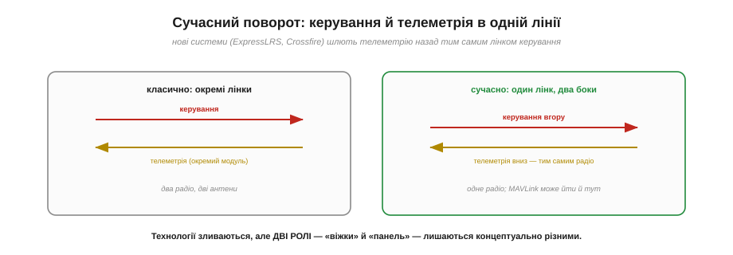
*Рис. 6.9.1.7. Класично керування й телеметрія йшли **окремими** радіомодулями. Сучасні системи (ExpressLRS, TBS Crossfire) шлють телеметрію назад **тим самим** лінком керування — одне радіо, двосторонній обмін. Технології зливаються, але дві **ролі** — «віжки» й «панель приладів» — лишаються концептуально різними.*

Раніше керування й телеметрія майже завжди були **окремими** радіомодулями з окремими антенами. Нові ж системи радіокерування (як-от **ExpressLRS** чи **TBS Crossfire**) уміють слати телеметрію назад **тим самим** лінком, що несе керування, — одне радіо, двосторонній обмін, ще й MAVLink може йти прямо там. Це зручно й економить вагу. Але важливо не сплутати **технологію** з **роллю**: навіть коли керування й телеметрія фізично йдуть одним радіо, це досі **дві різні розмови** з різними вимогами — миттєві «віжки» й неспішна «панель приладів». Поділ на ролі — концептуальний, і він лишається, хоч би скільки ліній фізично було.

Отже, ми розклали радіозв'язок системи на ролі: керування, телеметрія, відео. Тепер занурмося в кожну — почнімо з тієї, що тримає апарат у покорі, **лінії керування**: як пульт перетворює рух стіків на канали, як відбувається **прив'язка** (binding) пульта до приймача, і які протоколи приймача (PPM, SBUS, ELRS) за цим стоять. Це наступна тема.

---

## 6.9.2 RC-лінк: канали, прив'язка, протоколи приймача

Розберімо лінію керування — той самий **RC-лінк** (*radio control*), що несе твою волю до апарата. Здавалося б, що тут складного: рухаєш стік — дрон реагує. Але між стіком і мотором лежить цілий ланцюг перетворень, прив'язок і протоколів, і знати його корисно: саме тут криються і налаштування, і типові поломки, і вибір апаратури. Пройдімо цей шлях від руки пілота до польотного контролера.

### Як рух стіків стає «каналами»

Усе починається з **каналів**. Кожна окрема «команда» пілота — це окремий канал.


*Рис. 6.9.2.1. Кожна вісь стіка перетворюється на число — це **канал** (зазвичай від 1000 до 2000 мкс, центр 1500). Чотири основні: газ, крен, тангаж, нишпорення; плюс допоміжні (перемикачі режимів, підвіс). Передавач пакує всі канали в один кадр і шле в ефір; приймач розпаковує й віддає польотному контролеру.*

Механіка така. Кожна вісь кожного стіка сидить на потенціометрі, що дає **число**. За традицією це число виражають у мікросекундах — від **1000** (стік в одному краю) до **2000** (в іншому), з **1500** посередині (нейтраль). Кожне таке число — окремий **канал**. Чотири основні канали — це **газ** (throttle), **крен** (roll), **тангаж** (pitch) і **нишпорення** (yaw); до них додають **допоміжні** (aux) — перемикачі режимів польоту, керування підвісом камери, скидання вантажу тощо. Сучасні пульти мають 8, 16 і більше каналів. Передавач **пакує всі канали в один кадр** і безперервно шле його в ефір; приймач на борту **розпаковує** кадр назад у канали й передає їх польотному контролеру. Числа 1000–2000 мкс — спадок старого доброго PWM-керування сервомашинками (з ранніх модулів курсу), і вони живуть досі як «спільна валюта» каналів.

### Повний ланцюг: від стіка до мотора

Складімо весь шлях команди в одну картину.


*Рис. 6.9.2.2. Пульт (TX) перетворює стіки на канали й кадр; **радіолінк** несе його стрибками по діапазону; приймач (RX) розпаковує канали; польотний контролер (FC) змішує їх і керує моторами. Між RX і FC — окремий «протокол приймача» (SBUS/CRSF). А пульт із приймачем пов'язує одноразова **прив'язка**.*

Ланцюг чіткий: **пульт (TX)** → **радіолінк** → **приймач (RX)** → **польотний контролер (FC)** → мотори. Зверни увагу на дві точки стику, яким присвячено решту теми. Перша — **радіолінк** між пультом і приймачем: він іде по ефіру, зазвичай зі **стрибками частоти** (§6.7.5), і вимагає **прив'язки**. Друга — з'єднання **приймач→контролер**: воно вже дротове, всередині апарата, і йде окремим **протоколом приймача** (PWM, PPM, SBUS, CRSF). Розберімо обидві.

### Прив'язка: щоб пульт і приймач упізнавали одне одного

Як приймач знає, що слухати **саме твій** пульт, а не сусідський? Через **прив'язку** (*binding*).

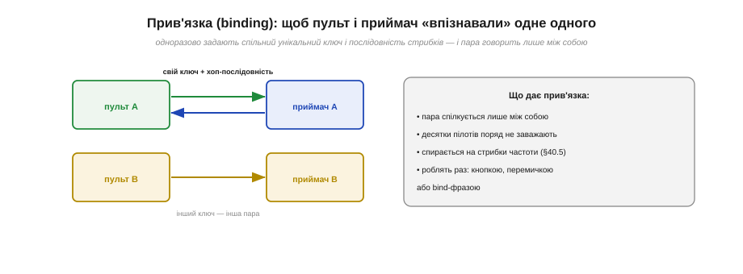
*Рис. 6.9.2.3. Під час прив'язки пульт і приймач одноразово домовляються про спільний **унікальний ключ** і **послідовність стрибків** частоти. Відтоді пара говорить лише між собою; інша пара поряд має інший ключ — і вони не заважають одне одному. Це й дає змогу десяткам пілотів літати поруч.*

Прив'язка — це одноразова процедура, у якій пульт і приймач домовляються про **спільний секрет**: унікальний ідентифікатор пари й **послідовність стрибків** по частотах. Спираючись на спред-спектр (§6.7.5), кожна прив'язана пара стрибає за **своїм** псевдовипадковим розкладом — тож приймач реагує лише на «свій» пульт, а сусідські сигнали для нього шум. Саме завдяки прив'язці **десятки пілотів** можуть літати поруч на тому самому діапазоні, не перехоплюючи керування один в одного. Роблять прив'язку раз — кнопкою на приймачі, перемичкою-bind-plug або введенням bind-фрази, — і далі вона тримається. Це пряме, життєве застосування стрибків частоти, які ми вивчали як абстракцію.

### Старі протоколи приймача: PWM і PPM

Тепер друга точка стику — як приймач віддає канали контролеру. Історично перші способи — **PWM** і **PPM**.


*Рис. 6.9.2.4. **PWM**: окремий дріт на **кожен** канал, кожен — імпульс 1000–2000 мкс (як сервокерування). Багато дротів. **PPM** (CPPM): усі канали йдуть **один за одним по одному дроту** як послідовність імпульсів (до ~8 каналів). Обидва аналогові за духом і застарілі.*

**PWM** — найстаріший: **окремий дріт** на кожен канал, і по кожному йде імпульс 1000–2000 мкс (точно як керування сервомашинкою). Просто, але дротів — стільки ж, скільки каналів; для 8 каналів це 8 проводів. **PPM** (*pulse-position modulation*, інколи CPPM) розумніший: усі канали шлють **один за одним по одному дроту** як серію імпульсів-кадр, тож вистачає **одного** дроту на ~8 каналів. Обидва протоколи — аналогові за духом, повільні й вразливі до завад; сьогодні їх витіснили **цифрові**.

### Сучасні цифрові протоколи: SBUS і CRSF

Сучасні приймачі віддають канали **цифровим серійним потоком** — і тут ти впізнаєш старого знайомого.


*Рис. 6.9.2.5. **SBUS** (Futaba): інвертований UART на 100 000 бод, до 16 каналів в одному кадрі — де-факто стандарт приймачів, односторонній. **CRSF** (Crossfire/ELRS): швидкий UART на 420 000 бод, що несе канали **вниз** і телеметрію **вгору**, з наднизькою затримкою. Це той самий послідовний зв'язок із Розділу 6.1.*

І SBUS, і CRSF — це **послідовний UART** з [Розділу 6.1](../uart/uart.md), застосований до керування. **SBUS** (від Futaba) — інвертований UART на **100 000 бод**, що пакує до **16 каналів** в один компактний кадр; він став **де-факто стандартом** приймачів, хоча й односторонній (тільки канали вниз). **CRSF** (*Crossfire protocol*, який вживають TBS Crossfire та ELRS) — швидший, на **420 000 бод**, і, головне, **двосторонній**: несе канали керування вниз **і** телеметрію вгору, ще й з наднизькою затримкою. Тобто все, що ми будували для UART власноруч у Розділі 6.1 — кадри, біти, швидкість, перевірки, — тут працює «по-дорослому» на службі керування дроном. Приємно бачити, як базові цеглинки складаються в реальну техніку.

### Сучасні RC-системи: чим лінкують сьогодні

Кілька слів про самі **радіосистеми** керування — бо їх вибирають під задачу.


*Рис. 6.9.2.6. **ExpressLRS (ELRS)** — відкрита система на LoRa: наднизька затримка й велика дальність. **TBS Crossfire/Tracer** — фірмова, на CRSF, далекобійна й надійна. **FrSky / Spektrum / Futaba** — класичні масові 2.4 ГГц із власними протоколами. Головний компроміс: 900 МГц бере далі (§6.6.4), 2.4 ГГц дає більше даних.*

Найцікавіше сьогодні — **ExpressLRS (ELRS)**: відкрита система (знову відкритий код, як і MAVLink!) на основі **LoRa** (§6.7.3, §6.7.5), що дає наднизьку затримку й величезну дальність за копійки. Поряд — фірмова **TBS Crossfire/Tracer** на CRSF, теж далекобійна й надійна. І класичні масові системи — **FrSky, Spektrum, Futaba** — переважно на 2.4 ГГц зі своїми протоколами. Головний компроміс у виборі діапазону вже знайомий із §6.6.4: **900 МГц** (868/915) бере **далі** й краще крізь перешкоди, а **2.4 ГГц** дає **більше** каналів і даних, зате меншу дальність. Обирай під задачу: дальнобійний політ — 900 МГц/ELRS; ближній спритний — 2.4 ГГц.

> 🔧 **Навіщо це.** Коли налаштовуєш чи лагодиш керування, тримай у голові весь ланцюг — і шукай проблему по ланках. Дрон не реагує? Перевір **прив'язку** (чи пов'язані пульт і приймач — світлодіод приймача підкаже). Реагує дивно? Глянь **протокол приймача** й порт контролера (SBUS треба інвертований UART, CRSF — свій порт і швидкість). Бракує **дальності**? Це або діапазон (перейди на 900 МГц/ELRS), або антена приймача (згадай увесь Розділ 6.8 — поляризація, розміщення, keep-out). А головне — налаштуй **failsafe**, бо без нього втрата сигналу = падіння. Розуміючи ланцюг «стік → канали → радіолінк → приймач → протокол → контролер», ти діагностуєш керування свідомо, а не навмання.

### Що робить приймач, коли сигнал зник: failsafe

І найважливіше для безпеки — **failsafe**. Лінія керування «священна» (§6.9.1), тож на **втрату сигналу** має бути заздалегідь заданий план.

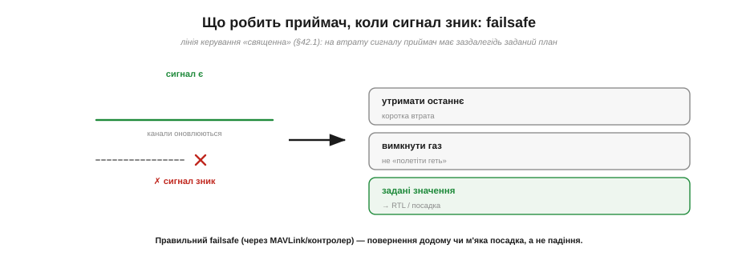
*Рис. 6.9.2.7. Коли сигнал зникає (вийшов за межу, заглушили, сіла батарея пульта), приймач не має «зависати» з останньою командою назавжди. Варіанти: коротко **утримати останнє**; **прибрати газ**, щоб апарат не полетів геть; або віддати **задані failsafe-значення**, за якими контролер виконує **повернення додому (RTL) чи м'яку посадку**.*

Без failsafe сценарій страшний: сигнал зник, а приймач далі шле контролеру **останню** команду — і апарат летить геть, поки не впаде чи не зникне. Тому грамотний приймач на втрату сигналу робить **заздалегідь налаштоване**: або коротко **утримує** останні значення (на випадок короткого провалу, §6.7.7), або **прибирає газ**, щоб дрон не помчав удалечінь, або — найкраще — віддає **спеціальні failsafe-значення**, за якими польотний контролер запускає **повернення додому (RTL)** чи контрольовану **посадку**. Цей механізм ми вже зустрічали як ідею в §6.5.7; тут він стає життєво конкретним. Правило просте й незмінне: **завжди налаштовуй failsafe** перед польотом — це різниця між «дрон сам повернувся» і «дрон загубився».

Ми розібрали лінію керування — як воля пілота стає рухом апарата. Тепер обернімо напрям: як апарат **розповідає про себе** назад? Що тече в потоці **телеметрії**, як влаштовані air/ground-модулі, що їх з'єднують, і чому ця розмова двостороння? Це наступна тема — і саме там почнеться наша зустріч із MAVLink уживу.

---

## 6.9.3 Телеметрія: двосторонній потік (air/ground модулі)

Тепер обернімо напрям розмови. Лінія керування (§6.9.2) несла **нашу волю** до апарата; лінія **телеметрії** несе **його відповідь** назад — і не лише назад, а в обидва боки. Це та сама лінія, де нарешті оживе MAVLink. Розберімо, з чого вона зроблена фізично, що нею тече і чому це справжня **двостороння розмова**, а не просто «дрон щось мовить у простір».

### Телеметрія — це пара модулів

Перше, що варто засвоїти: лінія телеметрії — це не один пристрій, а **пара** радіомодулів.


*Рис. 6.9.3.1. Один модуль («**air**») сидить на борту, під'єднаний до польотного контролера; другий («**ground**») — на землі, під'єднаний до ноутбука чи станції. Між ними — радіолінк на 433 / 868 / 915 МГц. Разом ця пара утворює прозорий «бездротовий провід».*

Один модуль — **бортовий** (*air*) — стоїть на апараті й з'єднаний дротом із телеметрійним портом польотного контролера. Другий — **наземний** (*ground*) — лежить біля оператора, під'єднаний до ноутбука (зазвичай по USB). Між собою ці два модулі говорять по радіо — типово на 433, 868 чи 915 МГц. Ключова ідея: **пара модулів разом працює як один бездротовий «провід»**. І щоб зрозуміти, наскільки це елегантно, треба усвідомити, що вони роблять із даними.

### Прозорий серійний міст

Магія телеметрійної пари в тому, що вона — **прозорий серійний міст**: для контролера й станції вона виглядає як звичайний дріт.

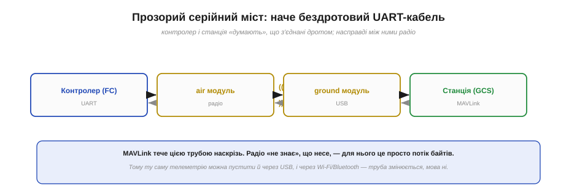
*Рис. 6.9.3.2. Контролер віддає байти на свій UART → бортовий модуль шле їх по радіо → наземний модуль приймає → віддає по USB у станцію. Байти, що ввійшли з одного кінця, виходять з іншого. Контролер і станція «думають», що з'єднані дротом, — насправді між ними радіо.*

Згадай UART із [Розділу 6.1](../uart/uart.md): два пристрої обмінюються байтами по серійній лінії. Телеметрійна пара робить рівно це, тільки **бездротово**: байти, які контролер віддає на свій телеметрійний UART, бортовий модуль шле по радіо, наземний приймає й віддає по USB у програму на ноутбуці — і навпаки. Жодна сторона **не знає**, що між ними радіо: для них це просто **серійний кабель**, що випадково став довгим і невидимим. А **MAVLink** тече цією трубою **наскрізь** — радіомодулям байдуже, що саме вони несуть, для них це потік байтів. Звідси чудовий наслідок: **ту саму** телеметрію можна пустити будь-якою «трубою» — радіо, USB-кабелем, Wi-Fi, Bluetooth — і мова (MAVLink) не зміниться. Розділення «труба» / «мова» — одна з найкорисніших ідей розділу.

### Що тече вниз: потік MAVLink

А що ж саме тече цією трубою? **Потік повідомлень MAVLink**, кожне свого типу й зі своєю частотою.

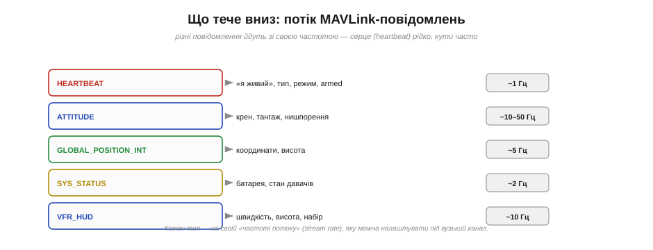
*Рис. 6.9.3.3. Різні повідомлення йдуть зі своєю частотою «потоку»: HEARTBEAT («я живий», тип, режим) ~1 Гц; ATTITUDE (кути) ~10–50 Гц; GLOBAL_POSITION_INT (координати) ~5 Гц; SYS_STATUS (батарея, давачі) ~2 Гц; VFR_HUD (швидкість, висота) ~10 Гц. Кожен тип — на своїй частоті потоку, яку можна налаштувати.*

Униз безперервно тече набір **типізованих** повідомлень. Найважливіше — **HEARTBEAT** («серцебиття»), що йде раз на секунду й каже «я живий», повідомляючи тип апарата, режим польоту й чи він *armed*. Поряд течуть **ATTITUDE** (кути нахилу, часто), **GLOBAL_POSITION_INT** (координати й висота), **SYS_STATUS** (заряд батареї, стан давачів), **VFR_HUD** (швидкість, висота, вертикальна швидкість) і ще десятки інших. Важлива деталь: кожне повідомлення йде зі **своєю частотою потоку** (*stream rate*) — кути потрібні часто (десятки разів на секунду), а серцебиття раз на секунду досить. Ці частоти **налаштовують**, бо канал вузький: на типових 57600 бод не можна качати все підряд на повній частоті, доводиться **розставляти пріоритети**. Структуру самих повідомлень детально розберемо в §6.9.5; поки що важливо відчути, що телеметрія — це **потік маленьких типізованих звітів**.

### Це розмова, а не мовлення

Найважливіше для розуміння: телеметрія йде **в обидва боки**. Це не дрон «віщає» в простір, а **діалог**.


*Рис. 6.9.3.4. Униз тече стан апарата (телеметрія). Угору — команди, читання й запис параметрів, завантаження місії, навіть RC-override. Та сама лінія несе обидва напрями: апарат звітує, людина (чи код) керує й налаштовує. Саме двосторонність робить телеметрію місцем для MAVLink.*

Униз, як ми бачили, тече **стан** апарата. А вгору, тією **самою** лінією, йдуть **команди** й **запити**: «зміни режим», «лети на цю точку», «прочитай параметр», «запиши новий параметр», «завантаж ось цю місію з десяти точок», ба навіть RC-override (підміна каналів керування). Тобто це повноцінна **розмова запитів і відповідей**: станція може **спитати** дрон («який у тебе максимальний кут нахилу?») і дрон **відповість**. Саме ця двосторонність і робить телеметрійну лінію природним домом для **MAVLink** — мови, спроєктованої для запитів, відповідей, команд і підтверджень. Лінія керування була монологом «віжок»; телеметрія — діалог.

### Класика заліза: SiK-радіо

Кілька слів про найпоширеніше **залізо** телеметрії — щоб ти впізнав його вживу.


*Рис. 6.9.3.5. Найвідоміший варіант — **SiK-радіо**: дві однакові маленькі платки з антенами, відкрита прошивка SiK, діапазон 433/868/915 МГц, стрибки частоти (FHSS, §6.7.5), потужність ~100 мВт, дальність — кілометри. Серійна швидкість зазвичай 57600 бод. Потужніший родич — **RFD900** — бере на десятки кілометрів.*

Класика — це **SiK-радіо** (відоме як «3DR Radio»): дві **однакові** дешеві платки з антенами на чипах Silicon Labs, з **відкритою** прошивкою SiK (знову відкритий код!). Вони працюють на 433/868/915 МГц, стрибають частотою (FHSS, §6.7.5 — щоб не глушитися), дають близько 100 мВт і дальність у кілька кілометрів; серійна швидкість типово **57600 бод**. Для далеких місій беруть потужніший **RFD900**, що дотягує на десятки кілометрів. Підключення просте до краси: бортову платку — у телеметрійний UART контролера, наземну — у USB ноутбука, і MAVLink одразу «полетів». Жодного програмування радіо — воно прозоре (§вище).

### Як іще довезти MAVLink

SiK-радіо — не єдиний шлях. Оскільки труба й мова розділені, MAVLink можна довезти **по-різному**.


*Рис. 6.9.3.6. Варіанти «труби»: **телеметрійне радіо** (SiK/RFD900) — класика на кілометри; **USB-кабель** — для налагодження поряд; **Wi-Fi / Bluetooth** через ESP32-міст (MAVLink по TCP/UDP, §6.5); **спільно з RC** — CRSF-телеметрія (ELRS), один лінк на все. А окремий випадок — бортовий комп'ютер просто поряд із контролером (§6.9.7).*

Перелічімо «труби». **Телеметрійне радіо** — щойно розглянута класика. **USB-кабель** — найпростіше для роботи на столі чи стенді (контролер прямо в ноутбук). **Wi-Fi або Bluetooth** через міст на ESP32 — і тоді MAVLink тече по **TCP/UDP** (згадай Розділ 6.5!), а станцією може бути телефон. **Спільно з RC-лінком** — сучасні ELRS/Crossfire несуть CRSF-телеметрію тим самим радіо, що й керування (§6.9.2), тобто один лінк на все. І нарешті особливий випадок — **бортовий комп'ютер** просто **поряд** із контролером, з'єднаний коротким UART **без жодного радіо**; це місток до автоматизації, якому присвячено §6.9.7. Мова всюди одна — MAVLink; різниться лише доставка.

> 🔧 **Навіщо це.** Розділення «труба / мова» — практично безцінне. Якщо MAVLink не доходить до станції, **діагностуй пошарово**: спершу труба (чи з'єднані модулі, чи світяться, чи та швидкість UART, чи той COM-порт), потім мова (чи йде HEARTBEAT). Налагоджуєш на столі — бери USB; полетів далеко — телеметрійне радіо; хочеш зі смартфона — ESP32 + Wi-Fi. І пам'ятай про **вузькість** каналу: на 57600 бод не можна вимагати всю телеметрію на 50 Гц — поставиш надто високі stream rate, і канал захлинеться, повідомлення почнуть губитися. Налаштовуй частоти потоку розумно: критичне — частіше, фонове — рідше. Це інженерне мислення про вузький радіоканал, яке ми будували весь модуль.

### Людський кінець: наземна станція

І останнє — **хто** на землі читає всю цю телеметрію. Програма-**наземна станція** (*ground control station*, GCS).

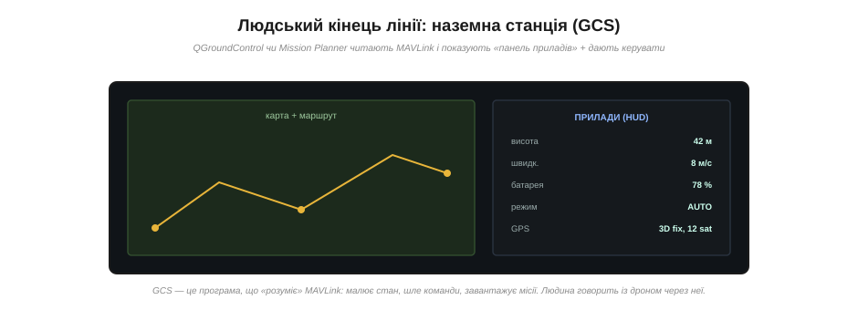
*Рис. 6.9.3.7. **QGroundControl** чи **Mission Planner** читають потік MAVLink і показують «панель приладів»: карту з маршрутом, висоту, швидкість, заряд, режим, стан GPS. Звідти ж оператор шле команди й завантажує місії. Людина «розмовляє» з дроном через цю програму.*

На землі MAVLink приймає програма — **наземна станція**: найвідоміші **QGroundControl** (від тієї самої команди PX4 з історії розділу) і **Mission Planner** (зі світу ArduPilot). Вона **розуміє** MAVLink: розкладає потік повідомлень у наочну «панель приладів» — карту з маршрутом і поточним положенням, висоту, швидкість, заряд, режим, кількість супутників GPS, попередження. І звідти ж оператор діє у зворотний бік: міняє режим, ставить точки маршруту, завантажує місію, читає й пише параметри. GCS — це **людський кінець** телеметрійної лінії, перекладач між мовою машини (MAVLink) і очима людини. У §6.9.6 ми, по суті, зробимо те, що робить GCS, тільки **своїм кодом**.

Ми побачили телеметрійну лінію цілком: пара модулів, прозорий міст, двосторонній потік MAVLink, наземна станція. Та лишилося важливе питання, спільне і для керування, і для телеметрії: **наскільки швидко й надійно** все це працює? Чому затримка в цій системі — питання життя і смерті апарата, що таке «втрата лінка» і як її пережити? Це тема **затримки й надійності**, до якої переходимо.

---

## 6.9.4 Затримка й надійність (чому критично)

Дві властивості радіолінії вирішують, **літатиме** апарат чи впаде: **затримка** (як швидко команда доходить до дії) і **надійність** (яка частка повідомлень доходить узагалі). Для звичайного зв'язку — чату, телеметрії на стіл — ці речі бажані. Для **керування апаратом у польоті** вони стають **критичними**, бо дрон — це система зі зворотним зв'язком, де запізнення чи втрата сигналу миттєво обертаються аварією. Розберімо обидві — і чому інженер зв'язку мусить ставитися до них смертельно серйозно.

### Звідки береться затримка

**Затримка** (*latency*) — це повний час від причини до наслідку: від руху стіка до руху мотора (або від показу давача до значка на екрані). І складається вона з **усього ланцюга**.


*Рис. 6.9.4.1. Час додається на кожній ланці: зчитати стік → закодувати кадр → радіо (тривалість кадру + стрибки + перевідправлення) → розкодувати → цикл польотного контролера → реакція мотора. Сума — десятки-сотні мілісекунд. Найзмінніша ланка — радіо: що гірший канал, то більше ретраїв, то більша затримка.*

Кожна ланка додає свою частку: зчитування й кодування на пульті, **політ кадру по радіо** (тривалість самого кадру + стрибки частоти + можливі перевідправлення), декодування на приймачі, цикл польотного контролера, інерція мотора. Найпідступніша ланка — **радіо**, бо вона **змінна**: у чистому ефірі кадр пролітає швидко, а на межі дальності чи в завадах починаються перевідправлення, і затримка **стрибає**. Для відчуття масштабу: FPV-керування хоче **менше ~30 мс** «від камери до екрана», а понад ~100 мс літати вже важко — апарат «не слухається» вчасно.

### Чому затримка небезпечна: запізнення в контурі

Чому ж кілька зайвих мілісекунд такі страшні? Бо керування апаратом — це **петля зворотного зв'язку**, а затримка в петлі **розхитує** систему.

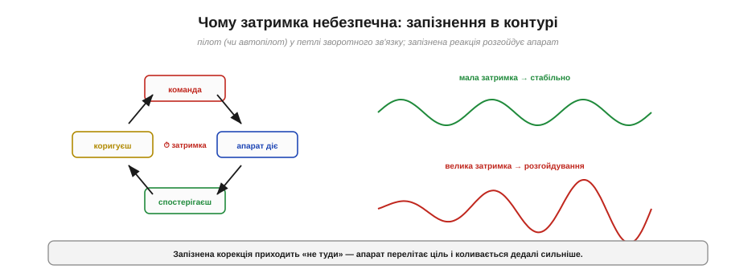
*Рис. 6.9.4.2. Пілот (чи автопілот) у петлі: дав команду → апарат зреагував → спостерігаєш результат → коригуєш. Якщо затримка мала, петля стабільна. Якщо велика — корекція приходить **запізно**, апарат перелітає ціль, ти коригуєш у відповідь — і коливання **наростають** замість згасати.*

Уяви, що ведеш апарат: даєш команду, бачиш результат, коригуєш. Це класична **петля** «дія → спостереження → корекція». Поки затримка мала, петля **стабільна**: корекції влучні, апарат слухняний. Але варто затримці зрости — і твоя корекція приходить **запізно**, коли апарат уже перелетів ціль; ти реагуєш на застаріле, перелітаєш у інший бік, знову коригуєш — і замість заспокоюватися система **розгойдується** дедалі сильніше. Це фундаментальна властивість усіх контурів зі зворотним зв'язком (її ми зустрічали в керуванні): **затримка з'їдає запас стійкості**. Ось чому в керуванні апаратом затримка — не зручність, а **безпека**.

### Надійність: пакети неминуче губляться

Друга біда — **надійність**. Радіо, як ми твердо засвоїли (§6.5.1, §6.7.7), **ненадійне** за природою: пакети губляться й спотворюються.

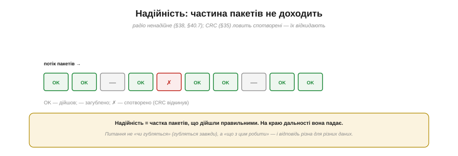
*Рис. 6.9.4.3. У потоці пакетів частина доходить (OK), частина губиться зовсім (—), частина приходить спотвореною — і її відкидає контрольна сума CRC (§6.1). Надійність — це частка пакетів, що дійшли правильними; на краю дальності вона падає. Питання не «чи губляться» (губляться завжди), а «що з цим робити».*

Згадай §6.7.7: багатопроменевість і завмирання раз у раз «топлять» окремі пакети, а ті, що приходять зіпсованими, відкидає **CRC** (§6.1) — краще викинути спотворене, ніж послухатися хибної команди. Тому **надійність** — це не «так/ні», а **частка** пакетів, що дійшли правильними, і вона тим менша, чим далі й гірший канал. Ключове усвідомлення: **втрати неминучі**, тож правильне питання — не «як їх позбутися» (не вийде), а «**що робити**, коли пакет загубився». І відповідь — різна для різних даних.

### Дві стратегії проти втрат

Тут — серце інженерного рішення. Для **різних** типів даних застосовують **протилежні** стратегії.


*Рис. 6.9.4.4. **Керування й потік телеметрії**: НЕ перевідправляти — шлемо безперервно й часто, загубився кадр — береться наступний (перевідправлення прийшло б уже запізно); втратив зовсім → failsafe. **Команди, параметри, місія**: підтвердження + повтор — надіслав → чекаю ACK → нема → шлю ще раз; затримка тут не страшна.*

Перша стратегія — для **керування** й безперервного **потоку телеметрії**: **не перевідправляти**. Сенс у тім, що дані йдуть **часто** (десятки разів на секунду), тож загублений кадр не біда — за мить прийде свіжіший. А перевідправляти **немає сенсу**, бо повторна копія застарілої команди прийшла б **запізно** й лише плутала б. Загубилося все — спрацьовує **failsafe**. Друга стратегія — для **команд, параметрів, завантаження місії**: тут навпаки, **підтвердження й повтор**. Надіслав команду — чекаєш **ACK** (підтвердження); не прийшло — **надсилаєш ще раз**, поки не дійде. MAVLink так і влаштований: рядові повідомлення (`ATTITUDE`, `GPS`) течуть «вистрелив і забув», а команди (`COMMAND_LONG` → `COMMAND_ACK`) і місія підтверджуються пункт за пунктом. Затримка тут не страшна — головне, щоб команда **точно** дійшла.

### Компроміс: надійність ціною затримки

Чому не зробити **все** надійним через перевідправлення? Бо надійність і затримка — у **компромісі**.

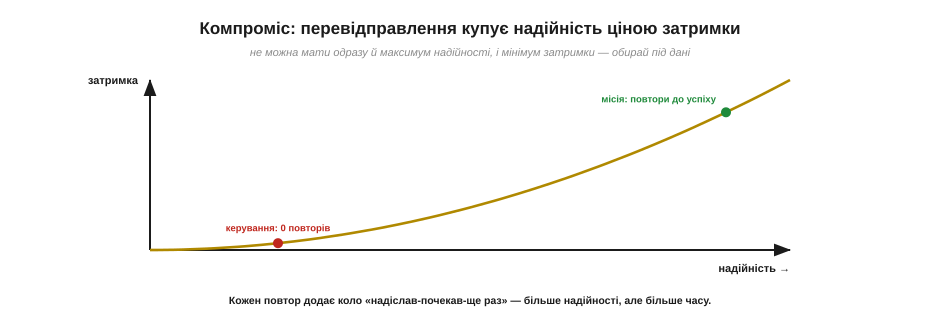
*Рис. 6.9.4.5. Кожне перевідправлення додає коло «надіслав-почекав-ще раз» — більше надійності, але більше часу. Тому керування сідає в лівий кут (нуль повторів, мінімум затримки), а завантаження місії — у правий (повтори до успіху, затримка не важить). Одночасно максимум того й того — неможливо.*

Це знайомий нам інженерний обмін (як §6.7.4): **перевідправлення купує надійність, але платить затримкою**. Кожен повтор — це ще одне коло «надіслав → почекав підтвердження → не дійшло → ще раз», а кола додають час. Тому **не можна** мати одночасно і максимум надійності, і мінімум затримки — доводиться **обирати під дані**. Керування сідає в один кут (жодних повторів, найменша затримка, втрату гасить failsafe), а місія й параметри — в інший (повторюй, доки не дійде, час не критичний). Розуміння цього компромісу — ознака зрілого проєктувальника протоколів.

### Край дальності псує і те, й те

І ще одне важливе: **дальність** б'є по **обох** властивостях одразу.

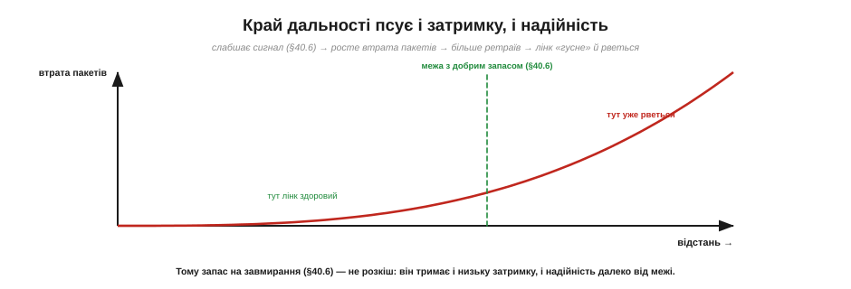
*Рис. 6.9.4.6. Що далі апарат, то слабший сигнал (§6.7.6) → то більша частка втрачених пакетів → то більше перевідправлень → лінк водночас і «гусне» (росте затримка), і рветься (падає надійність). Запас на завмирання (§6.7.6) тримає лінк здоровим, доки не підходиш до межі.*

На краю дальності сигнал слабне (бюджет лінії, §6.7.6), SNR падає — і частка втрачених пакетів **росте**. А це б'є по обох фронтах одразу: більше втрат → більше перевідправлень (де вони є) → **росте затримка**; і водночас **падає надійність**. Лінк ніби «гусне» й починає рватися саме там, де ти найдалі від дому. Ось чому **запас на завмирання** з §6.7.6 — не теоретична розкіш: ті 10–20 дБ резерву тримають і низьку затримку, і високу надійність, доки апарат не наблизиться до самої межі. Бюджет лінії й тут виявляється практичним інструментом.

> 🔧 **Навіщо це.** Проєктуючи чи налаштовуючи систему, розводь дані за **вимогами до часу**. Що мусить діяти **миттєво** (керування, стабілізація) — те шли часто, **без** перевідправлень і обов'язково з **failsafe** на втрату. Що мусить **точно дійти**, але час терпить (зміна параметра, завантаження маршруту) — те шли з **підтвердженням і повтором**. Хочеш більшої дальності без втрати якості — закладай **запас бюджету** (§6.7.6), бери нижчий діапазон (§6.6.4) чи кращі антени (Розділ 6.8). І завжди питай себе про **дедлайн** кожного повідомлення: коли воно стає **запізнілим настільки, що вже шкідливе**? Це питання — суть проєктування систем реального часу.

### Коли лінк вважати втраченим

Останнє — як система **розуміє**, що зв'язок зник, і що тоді робить.

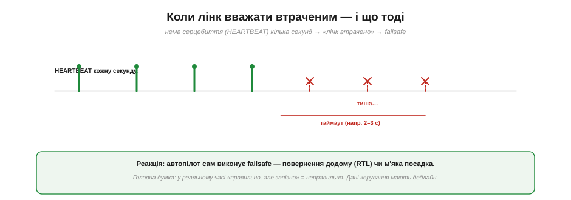
*Рис. 6.9.4.7. Поки йде **HEARTBEAT** (раз на секунду), лінк живий. Якщо серцебиття нема кілька секунд (таймаут, напр. 2–3 с) — лінк вважають **втраченим**, і автопілот сам виконує failsafe: повернення додому (RTL) чи м'яку посадку. Головна думка: у реальному часі «правильно, але запізно» = неправильно.*

Згадай **HEARTBEAT** із §6.9.3 — те саме «серцебиття» раз на секунду. Воно й служить **детектором життя** лінка: поки воно надходить, зв'язок є; щойно його **нема кілька секунд** (заданий таймаут, типово 2–3 с), система оголошує **«лінк втрачено»** — і автопілот **сам** виконує заздалегідь налаштований **failsafe** (RTL чи посадку, §6.9.2). Так замикається тема надійності: ми не лише ловимо окремі втрати, а й маємо чітке означення «зв'язку більше немає» та безпечну реакцію на нього. І головний урок усієї теми: у системах **реального часу** правильність — це **правильно й вчасно**; команда, що спізнилася, — це хибна команда. Дані керування живуть із **дедлайном**.

Тепер ми розуміємо радіозв'язок системи **як інженери**: ролі ліній, керування, телеметрію, затримку й надійність. Час нарешті зазирнути всередину самої **мови** — MAVLink. З чого складається його пакет, що таке heartbeat як повідомлення, як влаштовані ID типів і чому кожен кадр має CRC? Розберімо **структуру пакета MAVLink** — серце всього протоколу.

---

## 6.9.5 MAVLink: структура пакета (heartbeat; повідомлення; ID; CRC)

Дійшли до серця розділу — самої **мови** MAVLink. І тут на тебе чекає приємна несподіванка: жодної нової складної ідеї немає. MAVLink — це **зрілий, відшліфований нащадок** того самого пакета, який ми власноруч проєктували для UART у [Розділі 6.1](../uart/uart.md): старт, довжина, дані, контрольна сума. Розібравши його структуру, ти не лише зрозумієш, як «розмовляють» дрони, а й побачиш, як базові цеглинки курсу складаються в реальний світовий стандарт.

### Кадр MAVLink: з чого складається пакет

Подивімося на повний кадр MAVLink (версії 1 — простішої й наочнішої для початку).

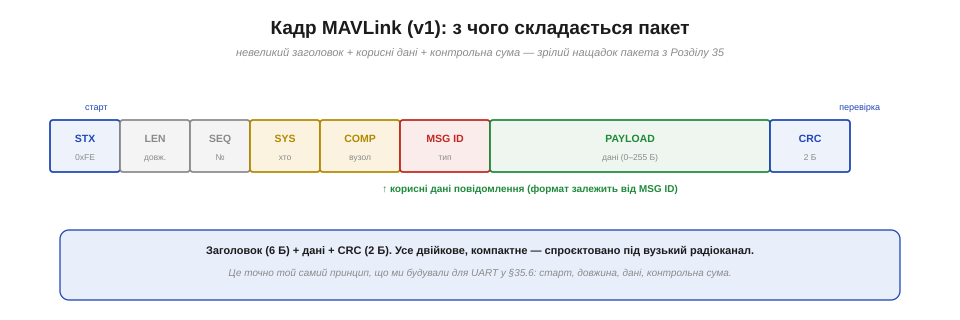
*Рис. 6.9.5.1. Пакет: **STX** (стартовий байт 0xFE) → **LEN** (довжина даних) → **SEQ** (лічильник) → **SYS** (який апарат) → **COMP** (який вузол) → **MSG ID** (тип повідомлення) → **PAYLOAD** (самі дані, 0–255 байтів) → **CRC** (2 байти контрольної суми). Заголовок 6 байтів + дані + CRC.*

Структура чітка й компактна. Усе починається з **стартового байта STX** (0xFE у v1) — маркера «тут починається пакет». Далі — короткий **заголовок** із 6 байтів: довжина даних, лічильник, адреси й тип. Потім — **корисні дані** (payload) до 255 байтів, формат яких залежить від типу повідомлення. І наприкінці — **CRC**, двобайтова контрольна сума. Усе **двійкове** й щільне — жодного зайвого тексту, бо пакет спроєктовано під **вузький радіоканал** (§6.9.3, §6.9.4). Упізнаєш схему? Це буквально те, що ми будували в §6.1.6: старт-маркер, поле довжини, корисне навантаження, контрольна сума. MAVLink — це той самий принцип, доведений до стандарту.

### Що робить кожне поле

Розберімо ролі полів заголовка — кожне має свій сенс.

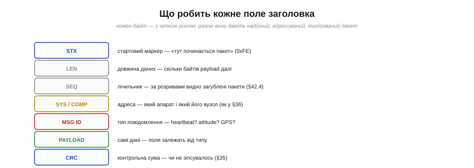
*Рис. 6.9.5.2. **STX** — «тут пакет». **LEN** — скільки даних далі. **SEQ** — лічильник: за розривами видно загублені пакети (§6.9.4). **SYS/COMP** — адреса: який апарат і який його вузол. **MSG ID** — тип повідомлення. **PAYLOAD** — самі дані. **CRC** — перевірка цілісності.*

Пройдімося. **STX** — стартовий маркер, із якого парсер ловить початок (як у нашому FSM із §6.1.7). **LEN** — довжина payload, щоб приймач знав, скільки байтів читати. **SEQ** — лічильник, що зростає з кожним пакетом: за **пропусками** в нумерації приймач помічає **загублені** пакети (згадай §6.9.4 — помічає, але не перепитує для потокових даних). **SYS** і **COMP** — **адреса** відправника (про неї окремо нижче). **MSG ID** — найважливіше: **тип** повідомлення (heartbeat? attitude? gps?), за яким приймач знає, **як читати** payload. **PAYLOAD** — самі дані. **CRC** — контрольна сума, що ловить спотворення (§6.1). Сім полів — і кожне на своєму місці.

### Найголовніше повідомлення: HEARTBEAT

Серед сотень типів є одне особливе, з якого варто почати, — **HEARTBEAT** (повідомлення з **ID 0**).


*Рис. 6.9.5.3. HEARTBEAT — «серцебиття», що йде ~1 раз на секунду. Його payload несе: **type** (тип апарата — квадрокоптер, літак…), **autopilot** (PX4/ArduPilot…), **base_mode/custom_mode** (режим польоту), **system_status** (стан, чи armed), **mavlink_version**. Кожна MAVLink-система мусить його слати.*

**HEARTBEAT** — це обов'язкове «я живий», яке **кожна** MAVLink-система шле раз на секунду. Його дані прості, але важливі: який це **тип** апарата (квадрокоптер, літак, ровер…), який **автопілот** (PX4, ArduPilot…), у якому **режимі** він зараз, чи **армований**, яка версія протоколу. Завдяки HEARTBEAT наземна станція **виявляє** апарат (з'явилося серцебиття → є новий апарат на лінії), бачить його тип і режим, і — як ми знаємо з §6.9.4 — **ловить втрату лінка** (серцебиття зникло → лінк мертвий → failsafe). Це наче пульс пацієнта: поки б'ється — живий, зник — тривога. З розбору саме HEARTBEAT зазвичай і починають знайомство з MAVLink.

### Звідки беруться типи: визначення в XML

А звідки взагалі береться ця сотня типів повідомлень із їхніми полями? Вони **описані** в спеціальних файлах — і це робить MAVLink насправді **схемою**, а не просто форматом.

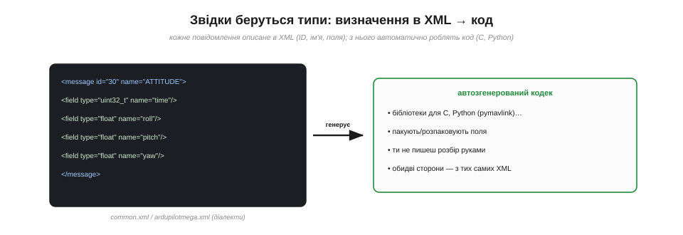
*Рис. 6.9.5.4. Кожне повідомлення описане в **XML**: його ID, ім'я й типізовані поля (наприклад, ATTITUDE = ID 30 з полями roll, pitch, yaw типу float). З цих XML **автоматично генерують** код для C, Python (pymavlink) та інших мов — кодеки, що пакують і розпаковують поля. Обидві сторони працюють із тих самих визначень.*

Кожне повідомлення MAVLink **формально описане** в XML-файлі: його числовий **ID**, людська **назва** й перелік **полів** із типами (наприклад, повідомлення `ATTITUDE` має ID 30 і поля `roll`, `pitch`, `yaw` типу float). Ці описи групують у **діалекти** (*dialects*) — `common.xml` (спільні для всіх), `ardupilotmega.xml` (специфічні для ArduPilot) тощо. А далі — найрозумніше: з XML **автоматично генерують** готовий код для багатьох мов — C для прошивок, **Python** (бібліотека **pymavlink**, §6.9.7) для скриптів. Тобто ти **не пишеш розбір пакетів руками** — кодек уже згенеровано, і він гарантовано однаковий на всіх кінцях, бо зроблений із тих самих XML. MAVLink — це, по суті, **спільна схема + автоматичні перекладачі**.

### CRC, що ловить ще й неузгодженість версій

Тепер найдотепніша інженерна деталь — **CRC_EXTRA**. Контрольна сума MAVLink перевіряє не лише цілість, а й **сумісність**.

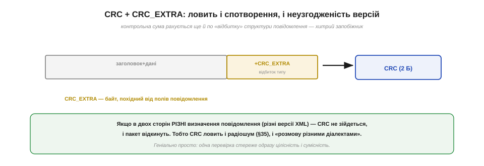
*Рис. 6.9.5.5. CRC рахується не лише по заголовку й даних, а й по **CRC_EXTRA** — байту-«відбитку», похідному від структури полів цього повідомлення. Тож якщо у двох сторін різні визначення повідомлення (різні версії XML), CRC **не зійдеться** — і пакет відкинуть. Одна перевірка стереже і цілісність (§6.1), і сумісність.*

Звичайний CRC (§6.1) ловить **спотворення** від радіошуму. Але творці MAVLink додали хитрість: у контрольну суму домішують ще й **CRC_EXTRA** — байт, обчислений із **структури полів** самого повідомлення (його імен і типів). Наслідок геніальний: якщо передавач і приймач мають **різні визначення** повідомлення №30 (скажімо, хтось оновив XML, додавши поле, а хтось ні), то їхні CRC_EXTRA **різні** — і CRC **не зійдеться**, пакет відкинуть. Тобто одна-єдина перевірка ловить **одразу дві** біди: і пошкодження в ефірі, і «розмову різними діалектами» (несумісні версії). Просто й елегантно — типова ознака доброго інженерного рішення.

### Адресація: хто кому

Поля **SYS** і **COMP** заслуговують окремого слова — це **адресація**, що дає багатьом учасникам ужитися на одній лінії.


*Рис. 6.9.5.6. **SYS** (system ID) — який апарат (дрон №1, №2…); **COMP** (component ID) — який його вузол (автопілот, підвіс камери, сама камера, бортовий комп'ютер). Так на одній лінії вживаються кілька апаратів і пристроїв, і кожне повідомлення знає, від кого воно. Точно як адреси на шині I2C (§6.2).*

Кожне повідомлення несе **адресу відправника**: **SYS** (*system ID*) каже, **який апарат** його надіслав (дрон №1, дрон №2 — у рої їх багато), а **COMP** (*component ID*) — **який вузол** усередині апарата (автопілот, підвіс камери, сама камера, бортовий комп'ютер). Завдяки цьому на **одній** радіолінії можуть співіснувати кілька апаратів і багато пристроїв, і кожне повідомлення чітко знає, **від кого** воно й (за потреби) **кому** призначене. Це точнісінько та сама ідея **адресації на спільній шині**, що ми вивчали для I2C у [Розділі 6.2](../i2c/i2c.md): багато учасників, один канал, кожному — своя адреса. Базові поняття курсу вкотре спрацьовують у дорослій техніці.

> 🔧 **Навіщо це.** Розуміння структури пакета — це твій ключ до **читання й налагодження** MAVLink. Бачиш у логах чи аналізаторі байт **0xFE** (чи 0xFD для v2) — це початок пакета; далі за **MSG ID** упізнаєш тип, за **SYS/COMP** — від кого. Якщо станція «не бачить» апарата — перевір, чи йде **HEARTBEAT** (немає його — немає й виявлення). Якщо пакети **відкидаються** — можливо, не зійшовся **CRC**: або шум у каналі, або **несумісні версії** визначень (CRC_EXTRA!). А коли писатимеш власний код (§6.9.7), ти не парситимеш байти руками — візьмеш **pymavlink**, згенерований із тих самих XML, і працюватимеш одразу з полями `msg.roll`, `msg.lat`. Знати структуру «під капотом» однаково корисно — щоб розуміти, що відбувається, коли щось іде не так.

### MAVLink v1 і v2

Наостанок коротко — про дві версії, бо їх зустрінеш обидві.

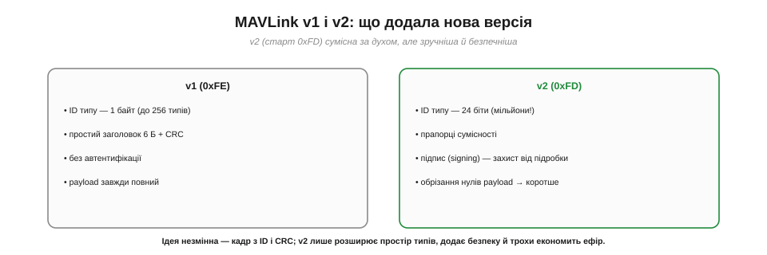
*Рис. 6.9.5.7. **v1** (старт 0xFE): ID типу — 1 байт (до 256 типів), простий заголовок, без автентифікації. **v2** (старт 0xFD): ID типу — 24 біти (мільйони типів!), прапорці сумісності, **підпис** (signing — захист від підробки команд), обрізання нульових хвостів payload (коротше в ефірі). Ідея незмінна, можливості — ширші.*

Сучасний стандарт — **v2** (стартовий байт **0xFD**). Порівняно з **v1** (0xFE) він додав три корисні речі. **Більший простір типів:** ID повідомлення став 24-бітним (мільйони типів замість 256) — є куди рости. **Безпека:** з'явився **підпис** (*signing*) — криптографічна перевірка, що команду надіслав справді той, хто має право (захист від підробки й перехоплення керування). **Економія:** нульові хвости payload **обрізають**, тож пакет коротшає — менше байтів в ефірі. Але **суть незмінна**: той самий кадр зі стартом, ID, даними й CRC; v2 лише розширює можливості. Тому, зрозумівши v1, ти розумієш і v2.

Ми розклали мову MAVLink на атоми: кадр, поля, HEARTBEAT, ID, CRC, адреси. Та доки це лише теорія «як влаштовано». Найцікавіше — **зробити це руками**: під'єднатися до апарата, **прочитати** його потік телеметрії й **надіслати** йому команду, побачивши, як він послухається. Як практично читати потік MAVLink і слати команди — наступна тема.

---

## 6.9.6 Читання потоку й надсилання команд

Тепер — найцікавіше: **поговорити** з апаратом самому. Усе, що ми вивчили, нарешті стає **діалогом**: ми під'єднуємося до борту, **читаємо** його потік телеметрії й **шлемо** йому команди, дивлячись, як він кориться. По суті, ми робитимемо те саме, що наземна станція (§6.9.3), тільки **свідомо** й, далі, **своїм кодом**. Розгляньмо обидва боки розмови — приймання й передавання, — а наприкінці поговоримо про **безпеку**, бо команди тут рухають реальний апарат.

> ⚠️ Код у цій темі наведено **для розуміння** (у стилі бібліотеки pymavlink, §6.9.7) — щоб побачити логіку розмови, а не як готовий рецепт для запуску. **Не виконуй** його на реальному апараті, не прочитавши розділ про безпеку нижче.

### Підключитися й читати потік

Перший бік розмови — **слухати**. Ми відкриваємо лінк (серійний порт, USB чи мережу) і починаємо **приймати** потік байтів; парсер MAVLink збирає з них готові повідомлення.


*Рис. 6.9.6.1. Потік байтів заходить у парсер MAVLink, який збирає кадри й віддає вже **розкладені** повідомлення з полями (msg.roll, msg.lat). Першим ділом — дочекатися HEARTBEAT (підтвердити, що апарат на лінії), а далі в циклі брати потрібні повідомлення й реагувати.*

Логіка завжди однакова. Спершу — **дочекатися серцебиття**: поки не прийшов HEARTBEAT (§6.9.5), ми навіть не знаємо адреси апарата. Потім — у циклі **брати повідомлення** потрібного типу й працювати з їхніми **полями**:

```
master.wait_heartbeat()                  # 1) дочекатися апарата (узяти його SYS/COMP)
msg = master.recv_match(type='ATTITUDE') # 2) узяти повідомлення про кути
print(msg.roll, msg.pitch, msg.yaw)      # 3) працювати з готовими полями
```

Зверни увагу: ми **не парсимо байти руками** — парсер уже зібрав кадр, перевірив CRC (§6.9.5) і віддав об'єкт із полями. Усе, що ми колись будували в §6.1.7 (автомат розбору потоку), тут уже зроблено за нас. Цикл приймання — це **подієвий** цикл: «прийшло повідомлення → відреагуй».

### Спершу попроси: апарат не шле все підряд

Важлива практична деталь: апарат **за замовчуванням не транслює все** — інакше вузький канал (§6.9.3) захлинувся б. Потрібні повідомлення треба **замовити**.

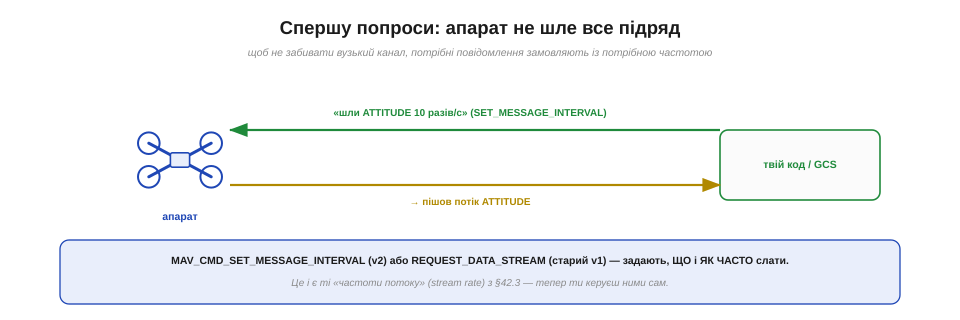
*Рис. 6.9.6.2. Щоб отримати, скажімо, ATTITUDE десять разів на секунду, спершу шлемо запит **SET_MESSAGE_INTERVAL** (v2) або REQUEST_DATA_STREAM (старий v1) — «шли мені оце з такою частотою». Апарат починає потік. Це і є ті «частоти потоку» з §6.9.3 — тепер ти керуєш ними сам.*

Якщо потрібного повідомлення «немає», найімовірніше, його просто ніхто **не замовив**. Запит робиться командою: у MAVLink v2 — **`MAV_CMD_SET_MESSAGE_INTERVAL`** (вкажи ID повідомлення й бажаний інтервал), у старому v1 — `REQUEST_DATA_STREAM`. По суті, ти задаєш ті самі **stream rates** з §6.9.3, але вже з власного коду: критичне — частіше, фонове — рідше, щоб не перевантажити канал. Замовив — пішов потік; читаєш його в циклі приймання (вище).

### Надсилання команди — і обов'язковий ACK

Другий бік розмови — **говорити**. Ми шлемо апарату **команду** й — за правилом надійності з §6.9.4 — **чекаємо підтвердження**.


*Рис. 6.9.6.3. Команду шлють повідомленням **COMMAND_LONG**: ID команди (наприклад, ARM_DISARM) і до семи параметрів. Апарат виконує й відповідає **COMMAND_ACK** із результатом (ACCEPTED / DENIED / FAILED). Завжди перевіряй ACK — інакше не знатимеш, чи команда взагалі дійшла й спрацювала.*

Узагальнена команда — це повідомлення **`COMMAND_LONG`** (чи `COMMAND_INT` для координат): у ньому **ID команди** (з набору `MAV_CMD_…`) і до **семи параметрів**. Наприклад, **озброїти** апарат (увімкнути мотори):

```
master.mav.command_long_send(sys, comp,
    MAV_CMD_COMPONENT_ARM_DISARM, 0,   # ID команди, confirmation
    1, 0,0,0,0,0,0)                    # param1 = 1 → armed
ack = master.recv_match(type='COMMAND_ACK', blocking=True)
# ack.result == MAV_RESULT_ACCEPTED ?
```

Найважливіше — **дочекатися `COMMAND_ACK`** і перевірити `result`: **ACCEPTED** (виконано), **DENIED** (відмовлено — наприклад, апарат не готовий), **FAILED**. Це і є та сама стратегія «команда з підтвердженням» із §6.9.4: не вистрелив-і-забув, а надіслав-і-переконався. Якщо ACK не прийшов — повтори (§6.9.4).

### Кілька найужитковіших команд

Більшість дій з апаратом — це `COMMAND_LONG` з різними ID. Ось ключові.


*Рис. 6.9.6.4. **ARM/DISARM** (`COMPONENT_ARM_DISARM`) — увімкнути/вимкнути мотори. **Режим** (`DO_SET_MODE`/`SET_MODE`) — AUTO, LOITER, RTL… **Зліт** (`NAV_TAKEOFF`) — піднятися на висоту. **Додому** (`NAV_RETURN_TO_LAUNCH`) — повернутися й сісти. Усе це — команди з ACK; і кожна РЕАЛЬНО рухає апарат.*

Запам'ятай чотири основні. **`MAV_CMD_COMPONENT_ARM_DISARM`** — озброїти/роззброїти (param1 = 1/0); озброєння розкручує мотори, тож це найвідповідальніша команда. **`MAV_CMD_DO_SET_MODE`** (або повідомлення `SET_MODE`) — змінити **режим** польоту (стабілізація, утримання, авто-місія, повернення). **`MAV_CMD_NAV_TAKEOFF`** — автоматичний **зліт** на задану висоту. **`MAV_CMD_NAV_RETURN_TO_LAUNCH`** — **повернення додому** (той самий RTL, що й у failsafe, §6.9.2). Усе це — звичайні команди з підтвердженням; з них складають будь-який автоматичний сценарій. І наголос: **кожна реально рухає апарат** — тож спершу симулятор чи стенд (нижче).

### Читання й запис параметрів

Окремий, дуже корисний клас розмови — **параметри**: сотні налаштувань апарата (швидкості, ліміти, коефіцієнти), які теж читаються й пишуться по MAVLink.


*Рис. 6.9.6.5. **Прочитати**: `PARAM_REQUEST_READ` (один за іменем) чи `PARAM_REQUEST_LIST` (усі) → апарат відповідає `PARAM_VALUE` зі значенням. **Записати**: `PARAM_SET` (ім'я + нове значення) → апарат підтверджує, надіславши `PARAM_VALUE` уже з новим значенням. Саме так GCS і налаштовує апарат.*

Щоб **прочитати** параметр, шлеш `PARAM_REQUEST_READ` з його іменем (наприклад, `WPNAV_SPEED` — швидкість на маршруті), і апарат відповідає `PARAM_VALUE` зі значенням; `PARAM_REQUEST_LIST` витягує **всі** параметри одразу. Щоб **записати** — шлеш `PARAM_SET` (ім'я + нове значення), а апарат **підтверджує** запис, надіславши назад `PARAM_VALUE` уже з оновленим значенням (знову принцип «з підтвердженням»). Саме цей механізм стоїть за екранами налаштувань у QGroundControl і Mission Planner — і саме його ти можеш викликати з власного коду.

### Завантаження місії: рукостискання

І найскладніша розмова — **завантаження маршруту** (місії з точок). Тут важлива **надійність**, тож іде акуратне «рукостискання».

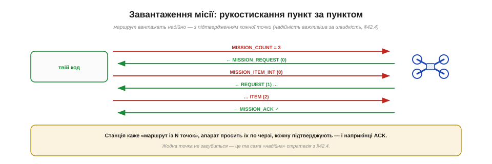
*Рис. 6.9.6.6. Станція каже `MISSION_COUNT = N` («буде N точок»). Апарат просить їх **по черзі** (`MISSION_REQUEST` 0, 1, 2…), станція шле кожну (`MISSION_ITEM_INT`), і наприкінці апарат підтверджує `MISSION_ACK`. Жодна точка не загубиться — це «надійна» стратегія з §6.9.4 у дії.*

Маршрут не можна «вистрелити й забути» — загублена точка означала б політ не туди. Тому місію вантажать **рукостисканням**: станція повідомляє `MISSION_COUNT` (скільки буде точок), апарат **просить** їх одну за одною (`MISSION_REQUEST_INT` з номером), станція надсилає кожну (`MISSION_ITEM_INT` — координати, висота, тип дії), і наприкінці апарат шле `MISSION_ACK` — «усе прийнято». Кожна точка **підтверджена**; це знову та сама надійна стратегія з §6.9.4, тільки розгорнута в повноцінний діалог. Так само місію можна **прочитати** назад із апарата.

> 🔧 **Навіщо це.** Тепер ти бачиш повну розмову з апаратом: **слухати** (дочекатися heartbeat, замовити й читати потрібні повідомлення) і **говорити** (слати команди й параметри, обов'язково перевіряючи ACK). Це фундамент будь-якої автоматизації: моніторинг телеметрії, автозапуск місій, реакція на події (сів заряд → повертайся), власні наземні панелі. Два правила на все життя: **читаючи** — спершу замов потрібне з розумною частотою; **командуючи** — завжди чекай і перевіряй підтвердження. А третє правило — найважливіше — про безпеку.

### Спершу — безпечно: симулятор і зняті гвинти

Останнє й найсерйозніше. Кожна надіслана команда **реально рухає апарат** — а отже, помилка в коді може коштувати аварії чи травми. Тому вчитися треба там, де помилка **безпечна**.


*Рис. 6.9.6.7. **SITL** (*software-in-the-loop*) — віртуальний апарат: і PX4, і ArduPilot мають симулятор, яким твій код керує **без жодного заліза** й ризику; усе MAVLink-спілкування справжнє, а «дрон» — у комп'ютері. Потім — **стенд зі знятими гвинтами**: мотори крутяться, але апарат нікуди не злетить. І лише після цього — обережний політ на безпечному місці.*

Правильний шлях — **трирівневий**. Спершу **SITL** (*software-in-the-loop*): і PX4, і ArduPilot мають **симулятор**, де «апарат» живе всередині комп'ютера; твій код спілкується з ним справжнім MAVLink, але збити нічого не можна — ідеально, щоб налагодити логіку. Потім — **стенд зі знятими пропелерами**: на реальній платі ти бачиш, що мотори реагують правильно, але апарат фізично **не злетить**. І лише **після** цих двох кроків — обережний політ на відкритому, безпечному майданчику, далеко від людей. Це не формальність, а **етика й безпека** інженера: код, що керує літальним апаратом, заслуговує на ту саму обережність, що й будь-яка серйозна техніка. Спочатку — симулятор; гвинти — востаннє.

Ми навчилися вести розмову з апаратом руками — читати потік і слати команди. Та робили ми це поки що ніби «з пульта» — сидячи за наземною станцією. А що, як винести цей розум **на сам апарат** — щоб бортовий комп'ютер сам, без землі, читав MAVLink і керував польотом за власною програмою? Це останній крок розділу — **автоматизація через pymavlink** і місток до бортового комп'ютера, де радіозв'язок системи замикається на справжню автономність.

---

## 6.9.7 Автоматизація: pymavlink (місток до бортового комп'ютера)

Фінальна тема — і фінальний крок усього модуля. Досі ми «розмовляли» з апаратом ніби з пульта, через наземну станцію. Тепер винесімо цей розум **на сам апарат**: хай маленький комп'ютер на борту читає MAVLink і керує польотом **за власною програмою**, без участі землі. Інструмент для цього — **pymavlink**, а архітектура — **бортовий комп'ютер** поряд із польотним контролером. Тут радіозв'язок системи замикається на справжню **автономність** — і, як ми побачимо, повертається до того, з чого все починалося в історії розділу.

### pymavlink: MAVLink у Python

Усе, що ми робили в §6.9.6, спиралося на одну бібліотеку — **pymavlink**. Час назвати її прямо.


*Рис. 6.9.7.1. pymavlink дає з'єднання (serial/udp/tcp), розбір і пакування всіх повідомлень усіх діалектів — згенеровані з тих самих XML (§6.9.5). Кілька рядків — і ти вже читаєш потік апарата. Цю бібліотеку, до речі, написав Ендрю Тридджелл (історія розділу) — і на ній стоїть MAVProxy.*

**pymavlink** — це **стандартна** реалізація MAVLink для Python: вона вміє відкрити з'єднання (серійне, UDP, TCP — згадай §6.5), приймати й розбирати кадри, пакувати команди, і знає **всі** діалекти, бо згенерована з тих самих XML (§6.9.5). Уся розмова з апаратом — буквально кілька рядків:

```
from pymavlink import mavutil
m = mavutil.mavlink_connection('udp:127.0.0.1:14550')
m.wait_heartbeat()                       # апарат на лінії
while True:
    msg = m.recv_match(blocking=True)    # читай потік
    # …реагуй, шли команди, веди власну логіку…
```

Це той самий API, що ми бачили в §6.9.6. І показово, що написав pymavlink саме **Ендрю Тридджелл** із історії розділу — той, хто розвинув ArduPilot; на pymavlink стоїть і його **MAVProxy**. Колективна, відкрита праця знову працює на нас. Та головне попереду: **той самий код** може бігти не лише на ноутбуці, а й — найцікавіше — **на самому апараті**.

### Бортовий комп'ютер: розум прямо на борту

Ось ключова ідея фіналу — **бортовий комп'ютер** (*companion computer*).

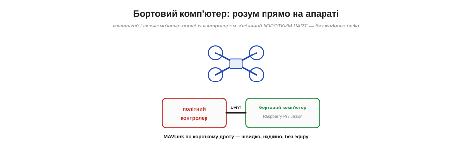
*Рис. 6.9.7.2. Маленький Linux-комп'ютер (Raspberry Pi, NVIDIA Jetson…) ставлять **на сам апарат**, поряд із польотним контролером, і з'єднують **коротким UART** — без жодного радіо. На ньому біжить твій pymavlink-код. MAVLink тут летить дротом — швидко, надійно, без ефіру.*

Замість того щоб «думати» на землі й слати команди по ненадійному радіо, ми ставимо **маленький Linux-комп'ютер** (Raspberry Pi, NVIDIA Jetson тощо) прямо **на апарат** — поряд із польотним контролером — і з'єднуємо їх **коротким дротом UART**. Тепер MAVLink тече не через ефір, а по **сантиметровому проводу** — без втрат, без затримки радіо, без failsafe-страхів (§6.9.4). На цьому комп'ютері біжить твій **pymavlink-код**, що читає телеметрію й шле команди контролеру **локально**. Апарат отримує **власний розум на борту**, незалежний від зв'язку з землею. Це і є місток від «дистанційного керування» до **автономності**.

### Поділ праці: політ окремо, розум окремо

Виникає природне питання: навіщо **два** комп'ютери — контролер і бортовий? Бо в них **різні** ролі, і поєднувати їх було б помилкою.

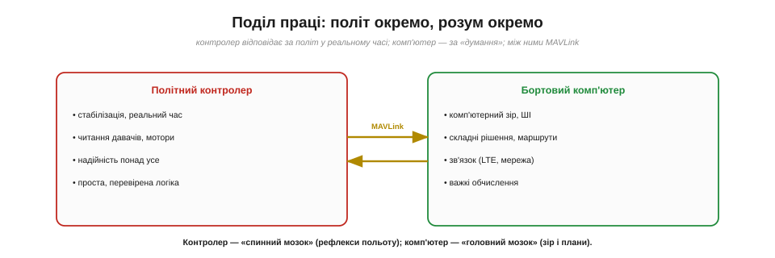
*Рис. 6.9.7.3. **Політний контролер** відповідає за політ у реальному часі: стабілізацію, давачі, мотори, надійність — проста, перевірена логіка. **Бортовий комп'ютер** — за «думання»: комп'ютерний зір, ШІ, складні рішення, важкі обчислення, зв'язок. Між ними — MAVLink. Контролер — «спинний мозок» (рефлекси), комп'ютер — «головний мозок» (плани).*

Поділ глибокий і правильний. **Польотний контролер** — це «спинний мозок»: він тримає апарат у повітрі **в реальному часі**, читає давачі, крутить мотори, і його логіка має бути **простою, перевіреною, надійною понад усе** (згадай §6.9.1 — політ «священний»). **Бортовий комп'ютер** — це «головний мозок»: він робить **важке й складне** — комп'ютерний зір, машинне навчання, прокладання маршрутів, зв'язок через LTE, — те, що контролеру не під силу й не можна довіряти (бо складне = ненадійне). Вони **розмовляють MAVLink** через дріт: комп'ютер «радить» (шле команди), контролер **виконує**, не перестаючи стабілізувати політ. Якщо «розумний» комп'ютер зависне — контролер просто продовжить тримати апарат і виконає failsafe. Розумний, безпечний поділ.

### Повне коло: мрія Маєра здійснюється

І ось тут історія розділу замикається в **досконале коло** — варто на мить зупинитися й це відчути.


*Рис. 6.9.7.4. 2008-го мета Лоренца Маєра була — дрон, що **сам бачить** і літає (комп'ютерний зір), а MAVLink він зробив лише побічним інструментом. Сьогодні бортовий комп'ютер із pymavlink і зором дає **ту саму автономність**, якої він прагнув. Іронія долі: «побічний» MAVLink став містком, що уможливив початкову мрію.*

Згадай історію (📜): Лоренц Маєр у ETH Zürich мріяв про дрон **із комп'ютерним зором**, що сам літає в приміщенні, — а MAVLink створив **між іншим**, як допоміжний інструмент. І ось, через роки, коло замкнулося: **бортовий комп'ютер** із камерою, машинним зором і **pymavlink** дає апарату саме ту **автономність**, заради якої все й починалося. «Побічний» інструмент — MAVLink — виявився тим самим **містком**, що уможливив початкову мрію. Це не лише гарна історія: це урок про те, як у техніці допоміжне часом стає головним, а наполеглива робота над «нудною» інфраструктурою врешті відкриває двері до амбітної мети.

### Що можна автоматизувати

Що ж конкретно дає розум на борту? Будь-який сценарій «читай → вирішуй → командуй», тепер **без людини**.

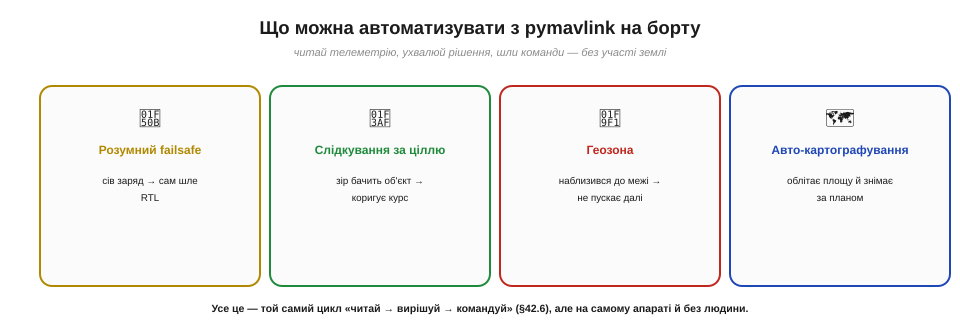
*Рис. 6.9.7.5. **Розумний failsafe** (сів заряд → сам шле RTL). **Слідкування за ціллю** (зір бачить об'єкт → коригує курс). **Геозона** (наблизився до межі → не пускає далі). **Авто-картографування** (облітає площу за планом і знімає). Усе це — той самий цикл «читай → вирішуй → командуй» (§6.9.6), але на самому апараті.*

Можливості широкі. **Розумний failsafe**: код стежить за зарядом і сам шле RTL, коли пора. **Слідкування за ціллю**: камера + зір розпізнають об'єкт, а pymavlink коригує курс, щоб його утримувати. **Геозона**: бортовий розум не пускає апарат за дозволену межу. **Авто-картографування**: облетіти площу за планом, роблячи знімки. Усе це — той самий простий цикл «читай телеметрію → ухвали рішення → надішли команду» з §6.9.6, тільки **замкнений на самому апараті**, без затримок і ризиків радіоканалу. Так дрон із дистанційно керованого стає **по-справжньому автономним**.

> 🔧 **Навіщо це.** Ось і повна картина радіозв'язку системи — від руху стіка до автономного рішення на борту. Практичний підсумок: **прости́й, надійний контролер** хай робить політ; **складний розум** винеси на бортовий комп'ютер і говори з контролером **через pymavlink по короткому UART**. Налагоджуй у симуляторі (§6.9.6), переходь на залізо обережно. А коли захочеш більшого — над pymavlink уже збудовано цілу екосистему, що веде до справжньої робототехніки.

### Куди далі: екосистема й місток у Модуль 7

pymavlink — не стеля, а **фундамент**. Над ним зведено інструменти на будь-який смак.


*Рис. 6.9.7.6. **MAVProxy** — командний GCS на pymavlink (знову Тридджелл). **DroneKit / MAVSDK** — вищі рівні API для зручнішої автоматизації. **MAVROS** — міст MAVLink ↔ **ROS**, що відчиняє двері у велику робототехніку. Усе це стоїть на тому самому MAVLink, що ми розібрали.*

Над MAVLink виросла ціла екосистема. **MAVProxy** — командна наземна станція й проксі (теж Тридджелл). **DroneKit** і **MAVSDK** — бібліотеки вищого рівня, що ховають дрібниці заради зручнішої автоматизації. А **MAVROS** — це **міст** між MAVLink і **ROS** (*Robot Operating System*), який вводить апарат у велику екосистему робототехніки з її готовими блоками сприйняття, планування й керування. Усе це стоїть на **тому самому MAVLink**, який ми щойно розібрали до байтів, — тож тепер ці потужні інструменти для тебе не магія, а зрозуміла надбудова. І саме сюди веде **наступний модуль курсу**.

---

Підсумуймо Розділ 6.9. Ми пройшли радіозв'язок **як систему**: розклали його на ролі (керування, телеметрія, відео); розібрали RC-лінк із каналами, прив'язкою й failsafe; побачили телеметрію як двосторонній потік через air/ground-модулі; зрозуміли, чому затримка й надійність критичні; розклали мову **MAVLink** на кадр, ID і CRC; навчилися читати потік і слати команди; і нарешті винесли розум на **бортовий комп'ютер** через pymavlink. Радіо з фізичного явища стало **інструментом автономної системи**.

---

## Модуль 6 пройдено

А це — фінал усього **Модуля 6**. Озирнімося на пройдений шлях.

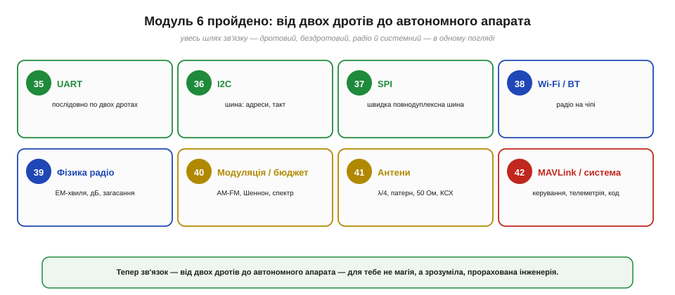
*Рис. 6.9.7.7. Увесь модуль в одному погляді: **UART** (§6.1) — послідовно по двох дротах; **I2C** (§6.2) — шина з адресами; **SPI** (§6.3) — швидка повнодуплексна шина; **Wi-Fi/Bluetooth** (§6.5) — радіо на чіпі; **фізика радіо** (§6.6) — ЕМ-хвиля, децибели, загасання; **модуляція й бюджет** (§6.7) — AM/FM, Шеннон, спектр; **антени** (§6.8) — λ/4, патерн, 50 Ом, КСХ; **MAVLink і система** (§6.9) — керування, телеметрія, код.*

Ми почали з найпростішого — двох дротів, якими два чіпи передають байти (UART), — і пройшли весь шлях до **автономного апарата**, що сам читає радіо й ухвалює рішення. Дорогою ми відкрили **дротові шини** (I2C, SPI), **бездротовий зв'язок на чіпі** (Wi-Fi, Bluetooth), занурилися в саму **фізику радіо** (хвилі, децибели, загасання), навчилися **садити інформацію на хвилю** й рахувати **бюджет лінії** (модуляція, Шеннон, спред-спектр), розібрали **антени** до останнього ома опору, і нарешті зібрали все в **систему** (MAVLink, телеметрія, автономність). А ще — і це не менш важливо — ми щоразу бачили за технікою **людей**: Бодо й Герца, Геді Ламарр і Армстронга, Марконі, Попова й Бозе, Маєра й Тридджелла, — і вчилися віддавати належне **колективній, відкритій** праці, не вірячи в міфи про одного героя.

Тепер зв'язок — від двох дротів до автономного апарата — для тебе **не магія, а зрозуміла, прорахована інженерія**. Ти можеш прочитати чужу плату, порахувати дальність наперед, налаштувати антену, продіагностувати лінк і написати код, що говорить із дроном. Це міцний фундамент — і саме на ньому будуватиметься наступний модуль, де окремі вузли складуться в **повноцінну автономну систему**: польотний контролер, давачі й оцінка стану, відео й машинне бачення.

> ▶️ Далі: [Модуль 7 — Розділ 7.1: Архітектура автономної системи й політний контролер](../../block-7-systems/architecture-flight-controller/architecture-flight-controller.md)