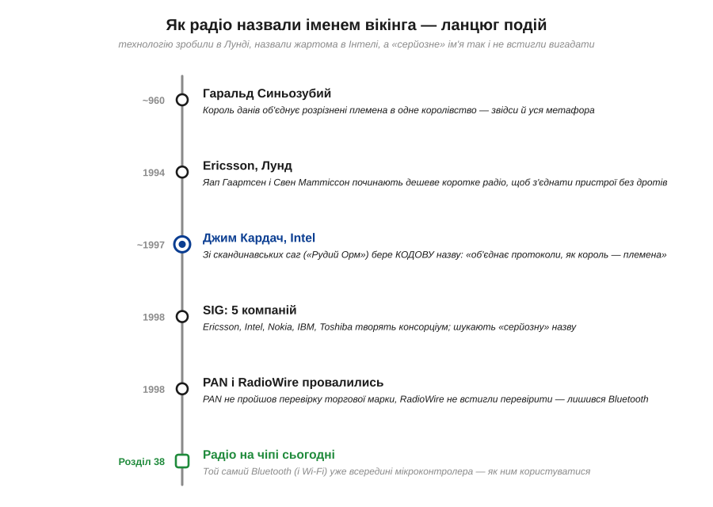
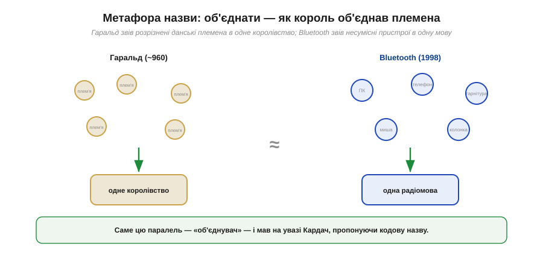
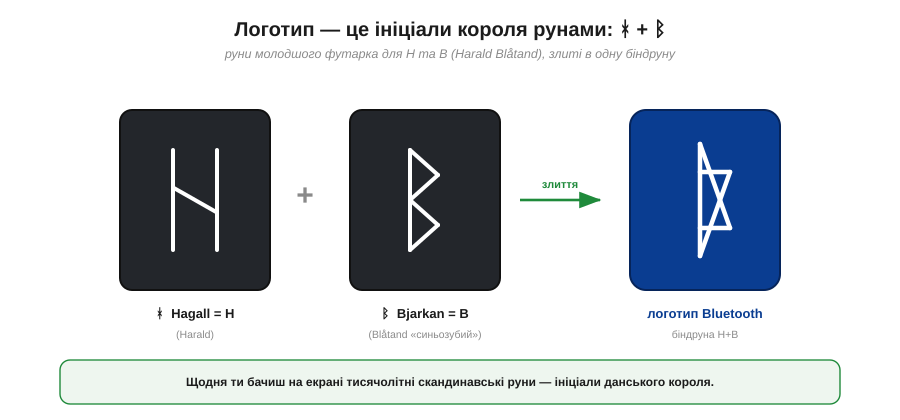
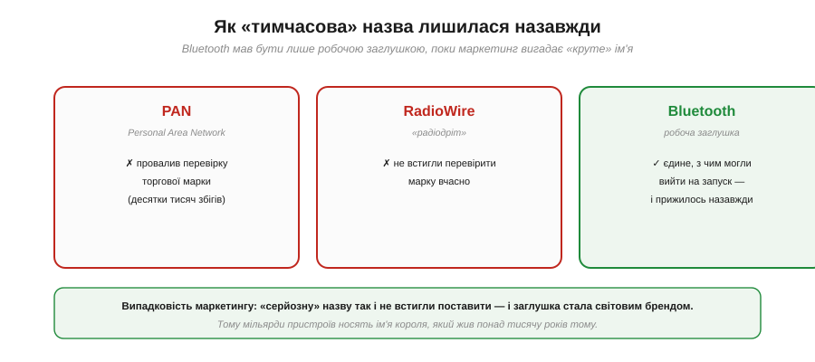
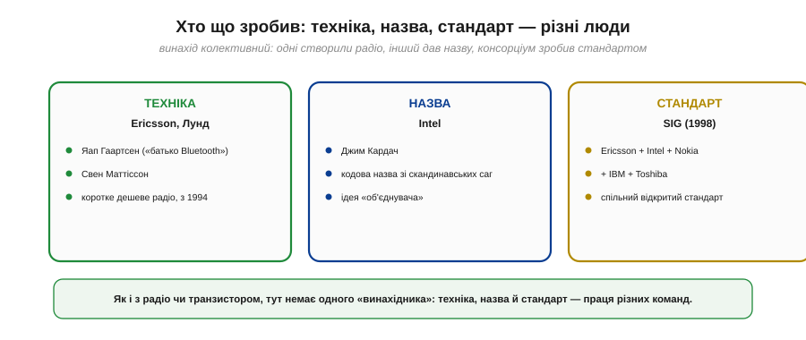

📜 *Історична вставка до [Розділу 6.5 — Бездротовий зв'язок на чіпі: Wi-Fi і Bluetooth](wifi-bluetooth.md).*

# Історія: Чому Bluetooth названо на честь вікінга-короля

Глянь на значок Bluetooth на екрані телефона. Це не абстрактна закарлючка дизайнера — це **ініціали данського короля**, який жив понад тисячу років тому, записані скандинавськими **рунами**. А сама назва «Bluetooth» («синій зуб») — це прізвисько того самого короля, яке інженер з Intel узяв жартома, як тимчасову заглушку, поки маркетологи вигадають щось «серйозне». Серйозне так і не встигли вигадати — і нині мільярди пристроїв носять ім'я вікінга.

Ця історія варта розповіді не лише тому, що вона кумедна. Вона показує дві речі, корисні для розуміння всього розділу. По-перше, що за «безликою» технологією радіо на чіпі стоять конкретні люди й конкретні рішення — і навіть випадковості маркетингу. По-друге — і це головне, — що сама **ідея** Bluetooth була про **об'єднання**: зв'язати несумісні пристрої однією радіомовою, як король колись зв'язав розрізнені племена в одне королівство. Тримаючи цю метафору в голові, легше зрозуміти, навіщо взагалі знадобилося радіо на чіпі.

*Рис. 6.5.0.1. Дорога назви: близько 960 року король Гаральд об'єднує данів; 1994-го інженери Ericsson у Лунді починають коротке радіо; ~1997-го Джим Кардач з Intel бере кодову назву зі скандинавських саг; 1998-го п'ять компаній творять консорціум, а «серйозні» назви PAN і RadioWire провалюються — і заглушка Bluetooth лишається назавжди.*

---

## Король, що об'єднав данів

Спершу — про самого короля. **Гаральд Синьозубий** (*Harald "Bluetooth" Gormsson*, данською *Harald Blåtand*, давньоскандинавською *blátǫnn*) правив Данією приблизно в 958–986 роках. Його головне досягнення, увічнене на знаменитому рунічному камені в Єллінгу (його часто звуть «свідоцтвом про народження Данії»), — те, що він **об'єднав** розрізнені данські племена в одне королівство й навернув данів у християнство; під його владою опинилися й частини Норвегії.

*Рис. 6.5.0.2. Ліворуч: Гаральд зводить розрізнені данські племена в одне королівство. Праворуч: Bluetooth зводить несумісні пристрої — ПК, телефон, гарнітуру, мишу — в одну радіомову. Саме цю паралель «об'єднувача» і мав на увазі той, хто запропонував назву.*

А чому, власне, «Синьозубий»? Тут історики не мають певності, і чесно це визнати. Найпоширеніше пояснення: у короля був помітний **мертвий, потемнілий зуб**, що здавався синюватим, — звідси й прізвисько. Є й інші здогади (наприклад, що «синій» у давній мові означало радше «темний»). Хай там як, прізвисько закріпилося — і саме воно через тисячу років стало назвою радіотехнології. Запам'ятаймо головне: Гаральд увійшов в історію як **об'єднувач**, і саме ця риса виявиться ключем до назви.

---

## Кодова назва з вікінгського роману

Перенесімося в кінець 1990-х. Кілька компаній незалежно працювали над тим, щоб позбавити пристрої дротів: ПК мав «бачити» телефон, телефон — гарнітуру, і все це без кабелів. Проблема була не лише технічна, а й **організаційна**: різні галузі (комп'ютерна й мобільна) тягли у свій бік, і потрібен був **єдиний** стандарт, який погодяться підтримати всі.

Один з учасників — **Джим Кардач** (*Jim Kardach*) з Intel — згодом згадував, як народилася назва. На якійсь зустрічі його колега **Свен Маттіссон** (*Sven Mattisson*) з Ericsson розповідав йому скандинавську історію — зокрема за мотивами роману **«Рудий Орм»** (*Röde Orm*; в англійському перекладі *The Long Ships*) шведського письменника **Франса Ґ. Бенгтссона** (*Frans G. Bengtsson*), де діє і король Гаральд. Пізніше Кардач натрапив на зображення рунічного каменя Гаральда в книжці з історії вікінгів — і його осяяло.

Логіка була красива. Гаральд **об'єднав** ворогуючі данські племена в одне ціле — а їхня нова технологія мала так само **об'єднати** ворогуючі галузі (комп'ютерну й мобільну) навколо одного протоколу зв'язку. Кардач сам сформулював це приблизно так: «Король Гаральд Синьозубий уславився тим, що об'єднав Скандинавію — так само, як ми збиралися об'єднати індустрії ПК і мобільного зв'язку». Тож він запропонував **Bluetooth** — англізовану версію прізвиська Blåtand — як **кодову назву** проєкту.

> 🔧 **Навіщо це.** За цією байкою — серйозна думка, що проходить через увесь розділ. Bluetooth із самого задуму був про **сумісність**: єдину мову, якою заговорять пристрої різних виробників. Саме тому це **відкритий стандарт**, а не власність однієї фірми, — і саме тому будь-яка гарнітура працює з будь-яким телефоном. Коли в Розділі 6.5 ми говоритимемо про «радіо на чіпі», пам'ятаймо: його головна цінність — не сам радіосигнал, а **спільна домовленість**, що дає різним пристроям розуміти одне одного.

---

## Логотип — це руни-ініціали

Тепер найдотепніше — **логотип**. Дизайнери не стали вигадувати абстракцію, а взяли **ініціали** короля й записали їх давніми скандинавськими рунами **молодшого футарка** (*Younger Futhark*) — тієї самої абетки, якою карбували рунічні камені за часів Гаральда.

*Рис. 6.5.0.3. Руна **ᚼ (Hagall)** позначає звук H — від «Harald». Руна **ᛒ (Bjarkan)** позначає B — від «Blåtand». Злиті в одну **біндруну** (руни, накладені на спільну стійку), вони й дають знайомий значок Bluetooth. Щодня мільярди людей дивляться на тисячолітні руни, навіть не здогадуючись про це.*

Технічно це **біндруна** (*bind rune*) — давня традиція накладати кілька рун на спільну вертикальну стійку. Руна **ᚼ (Hagall)** дає літеру **H** (Harald), руна **ᛒ (Bjarkan)** — літеру **B** (Blåtand, «синьозубий»). Накладені одна на одну, вони утворюють той самий значок, що світиться на кожному екрані. Тобто й назва, і логотип — це послідовно витримана данина одному історичному персонажу: ім'я — його прізвисько, знак — його ініціали.

---

## Як заглушка стала брендом

Найкумедніше, що **Bluetooth ніхто не збирався лишати** як остаточну назву. Це була **робоча заглушка** (*placeholder*) — кодове слово на час розробки, поки маркетинг вигадає щось гучне й «продаване». Коли дійшло до вибору серйозного імені, розглядали два головні варіанти: **RadioWire** («радіодріт») і **PAN** (*Personal Area Network*, «персональна мережа»).

*Рис. 6.5.0.4. PAN провалив перевірку торгової марки (пошук давав десятки тисяч збігів — захистити таке ім'я неможливо). RadioWire ж просто не встигли вчасно перевірити на марку. Тож єдиним іменем, з яким можна було виходити на запуск у стислі строки, лишався Bluetooth — і він прижився назавжди.*

Сталося ось що. Фаворитом був **PAN**, але перевірка показала, що це слово вже вживається скрізь — пошук давав десятки тисяч збігів, і зареєструвати його як торгову марку було неможливо. Запасний **RadioWire** теж мав стати на заміну — але його **не встигли вчасно перевірити** на чистоту марки перед самим запуском. У підсумку єдиним іменем, з яким можна було виходити в світ у стислі строки, виявилася та сама **кодова заглушка Bluetooth**. Так випадковість бюрократії перетворила тимчасове жартівливе слово на світовий бренд.

> 🔧 **Навіщо це.** Ця деталь — не лише курйоз. Вона нагадує, що технічні стандарти роблять **живі люди** в реальних обставинах — поспіх, юридичні перевірки, компроміси. За сухими абревіатурами на кшталт «BLE» чи «GATT», які ми зустрінемо в розділі, теж стоять конкретні рішення конкретних команд. Розуміти це корисно: стандарт — не закон природи, а домовленість, яку можна (і часом варто) читати критично.

---

## Хто насправді зробив технологію

І останнє — найважливіше для справедливості. Назву придумав Кардач, але **технологію** Bluetooth створив не він. Як і з історією радіо чи транзистора, тут **немає одного «винахідника»**: різні команди зробили різні частини.

*Рис. 6.5.0.5. **Техніку** — коротке дешеве радіо — створили в Ericsson у шведському місті Лунд: інженер **Яап Гаартсен** (*Jaap Haartsen*), якого часто звуть «батьком Bluetooth», і **Свен Маттіссон**, починаючи з 1994 року. **Назву** дав **Джим Кардач** з Intel. А **стандартом** її зробив консорціум **SIG** (1998): Ericsson, Intel, Nokia, IBM і Toshiba разом.*

Розкладімо чесно. Власне радіотехнологію — як упакувати приймач-передавач у дешевий чіп для зв'язку на кілька метрів — розробляли в **Ericsson** у місті **Лунд** (Швеція); ключові постаті — **Яап Гаартсен** (нідерландський інженер, якого зазвичай і називають «батьком Bluetooth») та **Свен Маттіссон**, починаючи приблизно з 1994 року. **Назву** й метафору об'єднання дав **Джим Кардач** з Intel. А щоб технологія стала **загальним стандартом**, а не власністю однієї фірми, 1998 року п'ять компаній — Ericsson, Intel, Nokia, IBM і Toshiba — заснували консорціум **Bluetooth SIG** (*Special Interest Group*). Кожна ланка — окрема праця окремих людей.

> 🔧 **Навіщо це.** Це не дрібниця, а правильна звичка мислення. Зручно казати «Bluetooth винайшли вікінги» чи «його придумала одна геніальна людина» — але правда складніша й цікавіша: техніку зробили інженери в Лунді, назву — інженер в Intel, стандарт — консорціум із п'яти компаній. За кожною технологією зв'язку (як побачимо далі — і за Wi-Fi, і за радіо взагалі) стоїть **колективна** робота, а не один герой. Знати справжнє авторство — частина чесного розуміння техніки.

---

## Що з цього лишилось

Сьогодні і Bluetooth, і його сусід **Wi-Fi** живуть прямо всередині мікроконтролерів — таких, як ESP32, що вивчаємо в курсі. Те, що колись було окремими чіпами й цілими платами, тепер уміщається в куточку кристала разом із процесором: достатньо кількох рядків коду, щоб пристрій заговорив по радіо з телефоном, мережею чи іншим апаратом. Уся складність радіо — антени, модуляція, пакети, повторні передачі — захована за зручним програмним інтерфейсом.

Але важливіше за факти — **думка**, яку несе ця історія і яку ми розкриватимемо в Розділі 6.5:

- Bluetooth (як і Wi-Fi) — це насамперед **домовленість про сумісність**, спільна мова для різних пристроїв; сам радіосигнал тут — лише носій.
- Радіо на чіпі **ховає** від нас купу складності — і це зручно, та водночас означає, що під простим інтерфейсом ховається **ненадійний** фізичний канал, який ми не контролюємо.
- За кожним стандартом стоять **люди й рішення** — інженери, компроміси, навіть випадковості маркетингу.

Тепер, тримаючи в голові і вікінгського короля, і ту просту ідею «об'єднати пристрої однією радіомовою», перейдімо від «звідки взялася назва» до «як це працює»: розберімо, що таке радіо на чіпі, чому воно ненадійне і як на ньому будувати Wi-Fi та Bluetooth.

▶️ Далі: [Розділ 6.5 — Бездротовий зв'язок на чіпі: Wi-Fi і Bluetooth](wifi-bluetooth.md)
