# Розділ 6.5 — Бездротовий зв'язок на чіпі: Wi-Fi і Bluetooth

Три попередні розділи навчили чіпи говорити **по дротах** — UART, I2C, SPI. Усі вони мали спільну рису: фізичне з'єднання, по якому біт гарантовано доходить від А до Б. Та сучасний пристрій дедалі частіше мусить спілкуватися **без дротів**: дрон шле телеметрію на наземну станцію, давач — на телефон, плата — у домашню мережу. Як тільки зникає дріт, зникають і його гарантії — і ми входимо в зовсім інший світ, де канал спільний для всіх, сигнал слабшає й спотворюється, а повідомлення часом просто зникають.

Найзручніший вхід у цей світ — готові радіомодулі **Wi-Fi** і **Bluetooth**, вбудовані прямо в мікроконтролер (як в ESP32). Вони ховають усю фізику радіо за звичним програмним інтерфейсом: кілька рядків коду — і пристрій уже в мережі. Цей розділ розбирає їх практично: що таке радіо на чіпі й чому воно ненадійне (ця тема), як улаштовані канал, смуга й пакет, як працює Wi-Fi і чим TCP відрізняється від UDP, що таке Bluetooth Classic і BLE, і нарешті — як спроєктувати надійний обмін із **failsafe** на втрату зв'язку. Глибоку фізику самих радіохвиль ми відкладемо на наступні розділи; тут — рівень «готового радіо», яким користуються щодня.

> 📜 **Перед матеріалом — історія:** [Чому Bluetooth названо на честь вікінга-короля](hist-bluetooth-name.md). Вона показує, що сама ідея Bluetooth — про **об'єднання** несумісних пристроїв однією радіомовою, і нагадує, що за технологією стоять конкретні люди й навіть випадковості.

---

## 6.5.1 Радіо на чіпі: що це й чому ненадійне

Перш ніж занурюватися в Wi-Fi та Bluetooth, треба засвоїти одну фундаментальну зміну мислення. Усі дротові шини, які ми вивчили, спиралися на тиху гарантію: біт, відправлений по дроту, **дійде**. Радіо цієї гарантії не дає — і це не вада конкретного чіпа, а сама природа бездротового каналу. Зрозуміти, **чому** радіо принципово ненадійне і **як** із цим живуть, — головне завдання цієї теми; без цього подальші Wi-Fi і Bluetooth здаватимуться магією, що то працює, то ні.

### Радіо всередині чіпа

Спершу — що таке «радіо на чіпі». Колись приймач-передавач був окремою платою з купою деталей; сьогодні весь він уміщається в **куточку кристала** поряд із процесором.

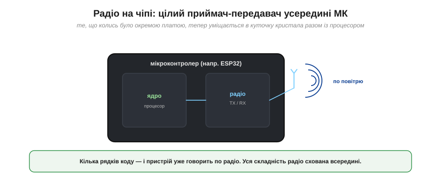
*Рис. 6.5.1.1. Сучасний мікроконтролер на кшталт ESP32 містить і обчислювальне ядро, і повноцінне радіо (передавач TX, приймач RX, керування антеною) на одному кристалі. Кілька рядків коду — і пристрій передає байти по повітрю; уся складність радіо схована всередині.*

Це величезна зручність: інженеру не треба розуміти антени й модуляцію, щоб під'єднати пристрій до мережі, — досить викликати `send()`. Але та сама зручність ховає важливу правду: під простим інтерфейсом працює **ненадійний** фізичний канал, який ми не контролюємо. І щоб писати робочий код, цю правду треба бачити крізь зручну обгортку.

### Дріт проти повітря: приватний канал проти спільного

Корінь усієї ненадійності — в одній відмінності дроту від повітря. Дріт — це **приватний** канал між двома точками; повітря — **спільне** середовище для всіх.

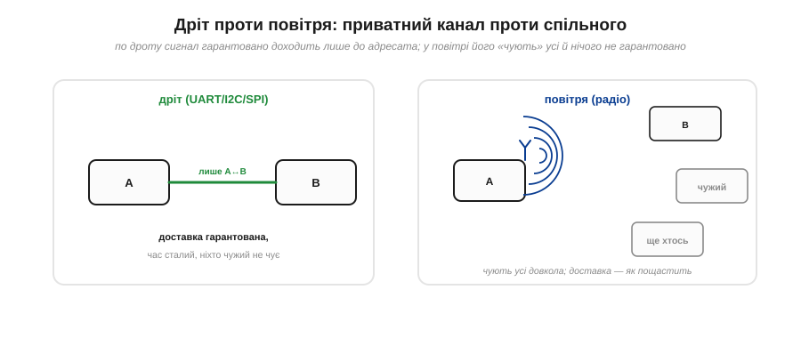
*Рис. 6.5.1.2. По дроту сигнал іде лише від A до B, доставка гарантована, час сталий, ніхто чужий його не чує. У повітрі сигнал A «чують» усі довкола — і B, і чужі пристрої, — а доставка залежить від відстані, перешкод і завад. Канал спільний і неконтрольований.*

З цієї відмінності випливає все інше. По-перше, **спільність**: ефір ділять усі — інші ваші пристрої, сусідський Wi-Fi, мікрохвильова піч, Bluetooth-гарнітури. Вони заважають одне одному, їхні передачі **стикаються**. По-друге, **відсутність з'єднання**: ви не «під'єднані» до приймача дротом — ви просто кричите в простір і сподіваєтесь, що вас почують. Жодного фізичного зв'язку, який гарантував би доставку, немає.

### Чому радіо ненадійне: вороги сигналу

Поки сигнал летить від передавача до приймача, на нього чатує цілий набір ворогів, яких на дроті не буває зовсім.

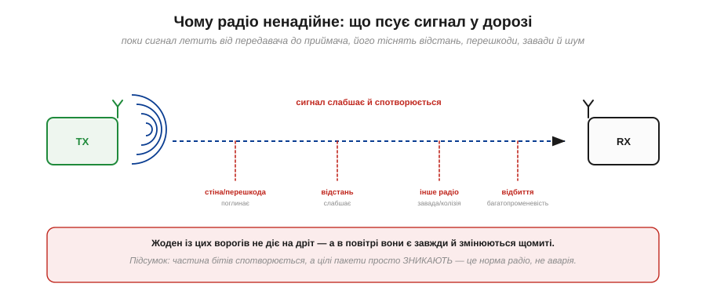
*Рис. 6.5.1.3. Сигнал слабшає з **відстанню**, його поглинають **стіни й перешкоди**, йому заважає **інше радіо** (завади й колізії), а **відбиття** від поверхонь приходять із затримкою й гасять прямий сигнал (багатопроменевість). Додайте сюди постійний **шум** — і частина бітів псується, а цілі пакети зникають.*

Жоден із цих ворогів не діє на дріт, а в повітрі вони присутні **завжди** й змінюються щомиті: людина пройшла між пристроями — сигнал просів; увімкнулася піч — з'явилася завада; апарат відлетів далі — зв'язок ослаб. Підсумок невблаганний: частина бітів спотворюється (і це ловить CRC, як у §6.1.6), але головне — **цілі пакети просто не доходять**. У радіо це не аварія, а **норма**, з якою протокол мусить уміти жити.

### Пакети губляться й псуються

Зробімо цей наслідок наочним. Радіо передає не суцільним потоком, а окремими **пакетами**, і кожен пакет живе своїм життям: одні доходять, інші — ні.

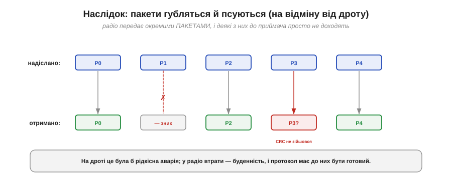
*Рис. 6.5.1.4. З п'яти надісланих пакетів P1 зник у дорозі (колізія чи завада), P3 прийшов спотвореним (CRC не зійшовся, його теж відкидають), а P0, P2, P4 дійшли. Приймач отримав лише частину — і має якось із цим упоратися.*

На дроті втрата пакета була б рідкісною аварією, яку згадуєш роками; у радіо це **буденність**. Звідси й принципово інший підхід до проєктування: бездротовий протокол від початку будують у припущенні, що **частина повідомлень загубиться**, — і питання лише в тому, що з цим робити.

### Підтвердження й перевідправлення

Стандартна відповідь на втрати — той самий механізм, що ми вже бачили в I2C (ACK, §6.2.4) і закладали в пакети UART: **підтвердження** й **перевідправлення**. Передавач шле пакет і чекає від приймача сигналу «отримав» (ACK); не дочекався за відведений час — шле пакет **ще раз**.

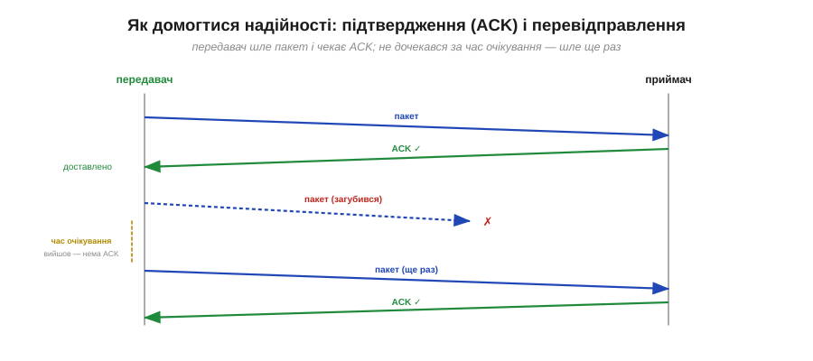
*Рис. 6.5.1.5. Успіх: передавач шле пакет, приймач відповідає ACK — доставлено. Втрата: пакет загубився, ACK не прийшов; передавач, дочекавшись кінця **часу очікування** (timeout), шле пакет наново — і цього разу отримує ACK. Так загублене врешті доходить.*

Цей цикл «надіслав → чекаю ACK → не дочекався → повторюю» і перетворює ненадійний канал на **надійний** — ціною часу. Подивімося, наскільки це дієво.

**Приклад (як ретраї рятують доставку).** Хай у середньому губиться кожен **десятий** пакет (10%), а передавач робить до **3** спроб:

```
імовірність, що пакет НЕ дійде за 1 спробу = 0.10
... що не дійде за 3 незалежні спроби       = 0.10³ = 0.001 = 0.1%

тобто з ретраями втрачається 1 пакет на 1000 замість 1 на 10
```

Три спроби знизили частоту остаточних втрат у сто разів — із 10% до 0.1%. Ось чому ACK із перевідправленням — основа надійного радіо. Але зверніть увагу на ціну: кожна повторна спроба **додає затримку**, і час доставки стає непередбачуваним.

### Best-effort проти надійного

Звідси — два режими роботи, між якими доводиться обирати. Можна слати **без** підтверджень («вистрілив і забув»), а можна **з** ними.

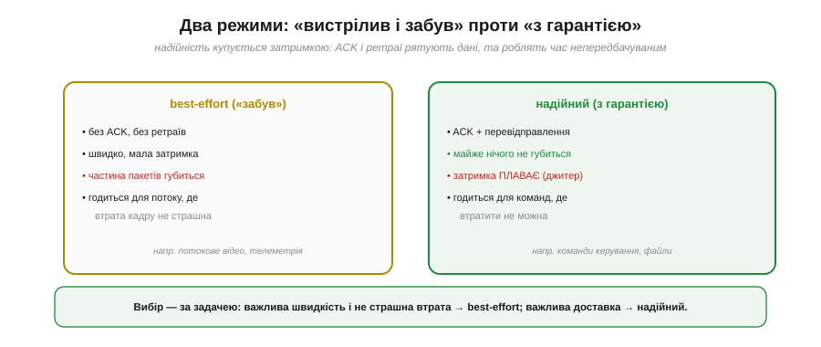
*Рис. 6.5.1.6. **Best-effort**: без ACK і ретраїв — швидко, мала стала затримка, але частина пакетів губиться (годиться для потоку, де втрата кадру не страшна). **Надійний**: ACK + перевідправлення — майже нічого не губиться, але затримка «плаває» (джитер), бо ретраї непередбачувані (годиться для команд, які втратити не можна).*

Вибір — суто за задачею. Для **потокових** даних (відео, безперервна телеметрія), де втрата окремого кадру непомітна, а важлива свіжість, беруть **best-effort**: швидко й без затримок. Для **команд керування** чи передачі файлу, де втрата неприпустима, беруть **надійний** режим, миряючись із плаваючою затримкою. Ту саму дилему ми скоро побачимо як вибір між UDP і TCP (§6.5.4) — це рівно ці два режими, але на рівні мережі.

### Стек ховає, але failsafe — твій

Насамкінець — найважливіше про **межу відповідальності**. Уся ця механіка пакетів, CRC, ACK і ретраїв зазвичай схована в **стеку** радіо (у самому чіпі Wi-Fi чи Bluetooth). Ти лише викликаєш `send()`, а перешле він загублений пакет сам.

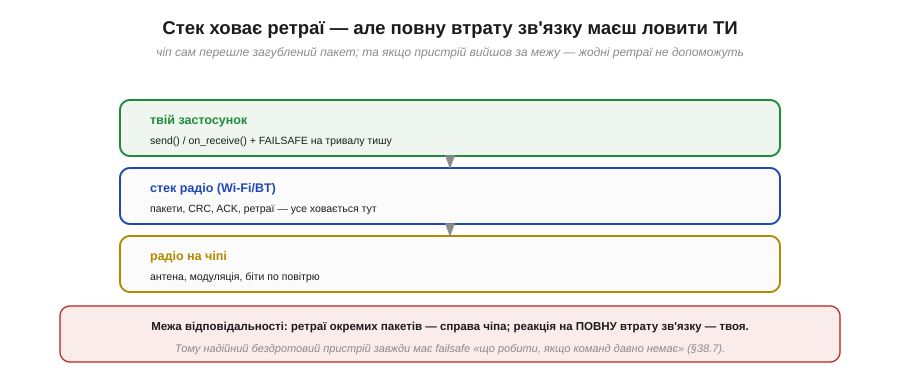
*Рис. 6.5.1.7. Нижні шари (радіо й стек) самі дбають про біти, CRC, ACK і перевідправлення окремих пакетів — це від тебе сховано. Та якщо пристрій вийшов за межу дальності чи зв'язок заглушили, **жодні ретраї не допоможуть** — і реагувати на цю повну тишу мусить уже твій застосунок.*

Ось критичне розрізнення. Ретраї **окремих** пакетів — справа чіпа, і вона працює прозоро. Але **повну** втрату зв'язку (апарат відлетів за межу дальності, антену заглушили, сіла батарея на тому кінці) ніякий стек не врятує — і саме твій код має це помітити й безпечно зреагувати.

> 🔧 **Навіщо це.** Звідси золоте правило бездротового пристрою: **завжди закладай failsafe** — заздалегідь продуману реакцію на тривалу тишу. Дрон, що втратив зв'язок із пультом, не повинен летіти далі «як летів» — він має, скажімо, зависнути й повертатися додому. Робот, що не чує команд, має зупинитися. Бездротовий зв'язок **ненадійний за визначенням**, тож питання не «чи зникне зв'язок», а «що пристрій робитиме, коли він зникне». Цьому проєктуванню надійного обміну й failsafe присвячено окрему тему (§6.5.7), але думку про нього варто тримати з самого початку.

Ми зрозуміли головне про радіо: канал спільний і ненадійний, пакети губляться, а рятують справу підтвердження, ретраї й failsafe. Та поки що ми говорили про «повітря» загально. Як насправді багато пристроїв уживаються в тому самому ефірі, не глушачи одне одного остаточно? Тут на сцену виходять **канали**, **смуга** частот і структура **пакета** — те, як радіо ділить спільний ресурс. Із них і почнемо предметну розмову.

---

## 6.5.2 Канал, смуга, пакет

«Спільне повітря» з попередньої теми — це не хаос, у якому всі кричать абияк. Ефір **ділять** за певними правилами: вирізають смугу частот, нарізають її на канали, домовляються, як по черзі користуватися, і пакують дані в стандартні пакети. Зрозуміти цей поділ важливо практично: він пояснює, чому Wi-Fi у людному місці гальмує, чому Bluetooth стійкіший до завад, і навіть чому варто обрати 5 ГГц замість 2.4. Розберімо все по черзі — від смуги до пакета.

### Смуга 2.4 ГГц: безліцензійна, тому переповнена

І Wi-Fi, і Bluetooth (і ще багато хто) живуть в одній і тій самій смузі частот — близько **2.4 гігагерца**. Чому саме там? Бо це **безліцензійна** смуга (її звуть **ISM** — *Industrial, Scientific, Medical*): користуватися нею можна без жодного дозволу, і вона доступна майже в усьому світі.

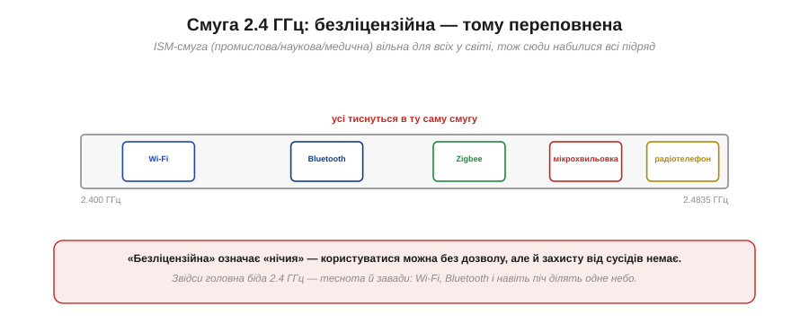
*Рис. 6.5.2.1. У смугу 2.400–2.4835 ГГц набилися всі: Wi-Fi, Bluetooth, Zigbee, навіть мікрохвильова піч (вона теж випромінює на 2.45 ГГц) і старі радіотелефони. «Безліцензійна» означає «нічия» — заходити можна без дозволу, але й захисту від сусідів немає.*

Звідси й головна біда 2.4 ГГц — **тіснота**. «Безліцензійна» — це палиця на два кінці: з одного боку, будь-хто може робити пристрої без бюрократії (тому радіо й стало таким дешевим і всюдисущим), з іншого — ніхто не гарантує тобі чистого ефіру. Твій Wi-Fi бореться за місце із сусідським, з твоїм же Bluetooth, а коли вмикається мікрохвильовка — і з нею. Уся подальша хитрість каналів і стратегій уживання — це боротьба за виживання в цьому людному небі.

### Канали: смугу ділять, але вони перекриваються

Щоб не всі тиснулися в одне місце, смугу нарізають на **канали** — підсмуги, на яких можна працювати окремо. Та з Wi-Fi тут криється пастка: його канали **широкі** й насправді **перекриваються**.

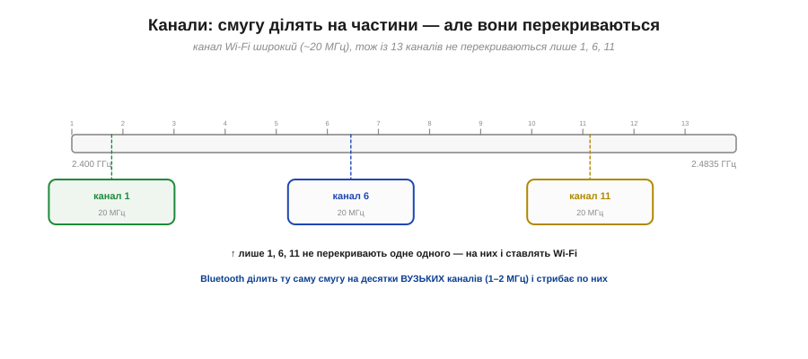
*Рис. 6.5.2.2. На папері Wi-Fi у 2.4 ГГц має 13 каналів, та кожен завширшки ~20 МГц — тож сусідні налазять один на одного. Не перекриваються лише три: **1, 6, 11**. Саме на них і ставлять Wi-Fi. Bluetooth натомість ділить ту саму смугу на десятки **вузьких** каналів (1–2 МГц) і стрибає по них.*

Ось чому номери Wi-Fi-каналів 1, 6 і 11 — майже сакральні: це **єдина** трійка, що не заважає одне одному. Якщо два роутери поряд стоять на каналах 1 і 3, вони частково перекриваються й глушать одне одного; на 1 і 6 — ні. Bluetooth пішов іншим шляхом: багато **вузьких** каналів, по яких він **стрибає** (про це нижче). Дві різні філософії поділу однієї смуги.

### Ширина каналу ↔ швидкість

Чому б не зробити канали ще ширшими, щоб гнати більше даних? Бо ширина каналу — це **компроміс**.

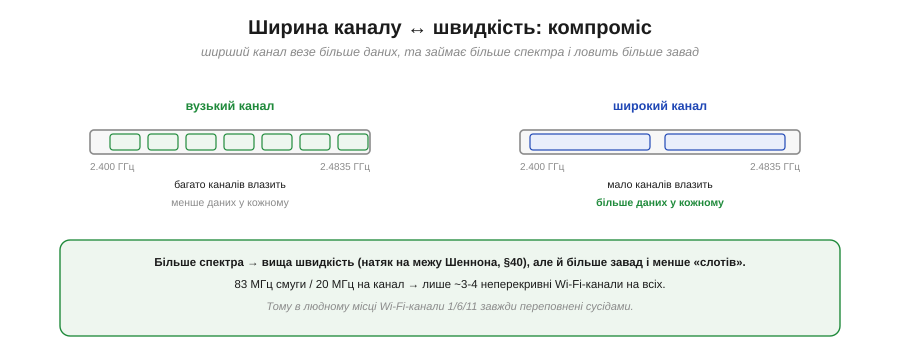
*Рис. 6.5.2.3. Вузький канал: їх влазить багато, але кожен везе мало даних. Широкий канал: везе більше даних, та займає більше спектра — тож таких каналів влазить мало, і вони ловлять більше завад. Більше спектра = вища швидкість, але менше «слотів».*

Зв'язок простий: **більше смуги — більше швидкості** (це фундаментальний закон, межу якого — теорему Шеннона — ми зачепимо в Розділі 6.7). Та спектр скінченний, тож широкі канали швидко його з'їдають.

**Приклад (скільки каналів влазить).** Порахуймо для Wi-Fi у 2.4 ГГц:

```
ширина всієї смуги ≈ 2483.5 − 2400 = 83.5 МГц
ширина одного Wi-Fi-каналу        ≈ 20 МГц

83.5 / 20 ≈ 4 канали, що не перекриваються
(на практиці — рівно 3: канали 1, 6, 11)
```

Лише три неперекривні канали на **всіх** у радіусі — ось чому в багатоквартирному будинку Wi-Fi гальмує: десятки роутерів б'ються за ті самі 1, 6, 11. Широка смуга дала швидкість, але забрала простір для сусідів.

### Як уживатися: три стратегії

Оскільки змусити інших замовкнути не можна, пристрої вживаються трьома способами «чемності» в спільному ефірі.


*Рис. 6.5.2.4. **Обрати тихий канал**: Wi-Fi сидить на одному каналі — варто вибрати найвільніший. **Стрибати частотою**: Bluetooth скаче по каналах ~1600 разів за секунду, оминаючи зайняті. **Слухати перед передачею**: Wi-Fi спершу перевіряє, чи канал вільний, і лише тоді говорить (метод CSMA/CA).*

Кожна стратегія по-своєму знижує ймовірність зіткнень. Wi-Fi сидить на фіксованому каналі, але **слухає перед передачею** (почув, що канал зайнятий, — зачекав). Bluetooth не сидить на місці взагалі, а **стрибає** з каналу на канал. Спільне в них одне: **жодна не дає гарантії** — хтось завжди може заглушити ефір, — вони лише роблять зіткнення рідшими. Це знову та сама природа радіо: не «надійно», а «як вийде, але з розумом».

### Стрибки частотою

Стратегія Bluetooth — **стрибки частотою** (*frequency hopping*) — заслуговує окремого погляду, бо вона напрочуд елегантна. Пристрій щомиті міняє канал за наперед відомою (і передавачу, і приймачу) послідовністю — близько **1600 разів за секунду**.


*Рис. 6.5.2.5. Зв'язок скаче по каналах за відомою послідовністю. Якщо один канал постійно забитий завадою (червоний рядок), у нього влучає лише один стрибок із багатьох — тож втрачається лише **один** пакет, а решта проходить по інших каналах. Завада на одній частоті більше не валить увесь зв'язок.*

У цьому й геніальність ідеї: завада зазвичай сидить на **одній** частоті (як та сама мікрохвильовка), а пристрій, що стрибає, проводить на ній лише крихітну частку часу. Забитий канал коштує одного загубленого пакета — який легко перешлеться (§6.5.1), — а не розриву зв'язку. Сама ідея стрибків частоти, до речі, має яскраву й несподівану історію, до якої ми ще повернемося в Розділі 6.7.

**Приклад (тривалість одного стрибка).** За 1600 стрибків за секунду:

```
час на одному каналі = 1 / 1600 с = 625 мкс
```

Лише 625 мікросекунд на частоті — і пристрій уже на іншій. Навіть якщо завада постійна, вона псує крихітну частку передач.

### Анатомія радіопакета

Тепер про те, **що** саме летить у тому пакеті. По радіо йде не суцільний потік, а окремі **пакети**, і кожен влаштований за знайомою схемою — лише з однією новою частиною на початку.


*Рис. 6.5.2.6. Пакет: **преамбула** (відома послідовність, щоб приймач упіймав сигнал і синхронізувався) → **заголовок** (адреси, довжина, тип) → **дані** → **CRC** (контроль цілості). Усе, крім преамбули, — той самий пакет, що ми будували для UART у §6.1.6.*

Більшість частин уже знайомі з §6.1.6: заголовок з адресами й довжиною, корисні дані, CRC наприкінці. Нове тут — **преамбула** (*preamble*) на самому початку. На дроті приймач завжди «під'єднаний» і слухає; а в радіо він спершу мусить **упіймати** сигнал із шуму — налаштувати підсилення, синхронізувати свій годинник із чужим. Преамбула — це відома наперед послідовність на початку кожного пакета, по якій приймач «чіпляється» за сигнал, перш ніж читати корисні дані. Без неї він не знав би навіть, де пакет починається.

### 2.4 проти 5 ГГц

Насамкінець — чому існує ще й смуга **5 ГГц**, і коли яку брати.


*Рис. 6.5.2.7. 2.4 ГГц: бере далі, краще проходить крізь стіни, є майже всюди — але мало каналів і дуже людно, та й швидкість нижча. 5 ГГц: багато чистих каналів і вища швидкість — але коротша дальність і гірше крізь перешкоди. (Чому нижча частота краще огинає — фізика Розділу 6.6.)*

Коротко: **нижча** частота (2.4) краще **огинає** перешкоди й бере далі; **вища** (5) дає більше чистого спектра й швидкості, але слабшає на відстані й застряє у стінах. Малі пристрої — ESP32, давачі, носимі гаджети — майже завжди працюють на **2.4 ГГц**: для них дальність і всюдисутність важливіші за швидкість, а великих потоків вони й не передають.

> 🔧 **Навіщо це.** Практичні висновки. Якщо твій Wi-Fi-пристрій погано працює в людному місці — спробуй **інший канал** (1, 6 чи 11) або перейди на **5 ГГц**, якщо він є і дальності вистачає. Якщо потрібна **стійкість** до завад (а не максимальна швидкість) — Bluetooth зі своїми стрибками частоти витриваліший за Wi-Fi на тому самому 2.4 ГГц. А проєктуючи власний радіообмін, пам'ятай про преамбулу: приймачеві треба час «упіймати» кожен пакет, тож надто короткі чи надто часті пакети неефективні.

Ми розібралися, як радіо ділить спільний ефір на смугу, канали й пакети. Тепер можна піднятися на рівень вище — від «сирого радіо» до **готових систем**, які на ньому збудовані. Перша й найпоширеніша — **Wi-Fi**: як пристрій під'єднується до мережі, що таке точка доступу й IP-адреса, і як крізь радіо раптом починає працювати весь звичний інтернет. Із Wi-Fi і продовжимо.

---

## 6.5.3 Wi-Fi: клієнт, точка доступу, IP

Wi-Fi — це не просто «радіо», а ціла **система** поверх нього: спосіб під'єднати пристрій до мережі так, ніби він з'єднаний дротом, і дати йому повний доступ до інтернету. Для розробника найцінніше тут — що вся складність радіо й мережі схована, і маленький чіп на кшталт ESP32 стає **повноцінним вузлом мережі** за кілька рядків коду. Щоб користуватися цим свідомо, розберімо ключові поняття: точку доступу, приєднання, режими чіпа й, головне, **IP-адресу**, з якої й відкривається весь інтернет.

### Інфраструктурний режим: усе через точку доступу

Звичайний Wi-Fi працює в **інфраструктурному** режимі: пристрої не говорять напряму один з одним, а всі підключаються до центрального вузла — **точки доступу** (*access point*, AP), якою зазвичай є домашній роутер.

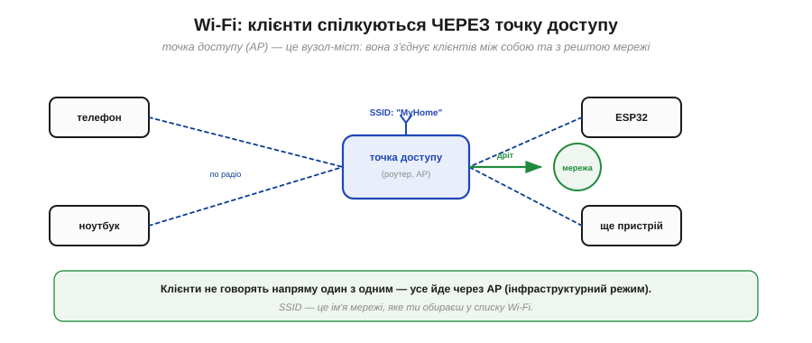
*Рис. 6.5.3.1. Телефон, ноутбук, ESP32 — усі **клієнти** — під'єднуються по радіо до **точки доступу**, а вона з'єднує їх між собою й виводить у решту мережі (часто дротом — в інтернет). Клієнти не спілкуються напряму: усе йде через AP. Ім'я мережі — **SSID** — це те, що ти бачиш у списку Wi-Fi.*

Точка доступу — це **хаб** і водночас **міст**: вона і керує тим, хто в мережі, і з'єднує радіо-світ із дротовим (виходом в інтернет). Звідси й перше практичне поняття — **SSID** (*Service Set Identifier*), ім'я мережі: саме його ти обираєш у списку Wi-Fi і вказуєш пристрою, до якої мережі приєднатися.

### Як приєднатися: скан, пароль, IP

Приєднання до Wi-Fi — це коротка послідовність кроків, однакова і для телефона, і для ESP32.


*Рис. 6.5.3.2. **Скан** — знайти доступні мережі (їхні SSID лунають в ефірі). **Автентифікація** — довести, що знаєш пароль (шифрування WPA2/WPA3). **Асоціація** — AP приймає клієнта в мережу. **IP-адреса** — роутер видає пристрою адресу (через DHCP), і лише тоді той по-справжньому «в мережі».*

У коді ESP32 усе це зазвичай стискається в один рядок на кшталт `WiFi.begin("MyHome", "пароль")` — а решту (скан, рукостискання, шифрування) робить вбудований стек. Важливий нюанс: **доки пристрій не отримав IP-адресу, він ще не «в мережі»**. Саме видача IP завершує приєднання — і про неї варто поговорити окремо.

### Два режими чіпа: STA і AP

Цікаво, що чіп на кшталт ESP32 може бути **по обидва боки** Wi-Fi.

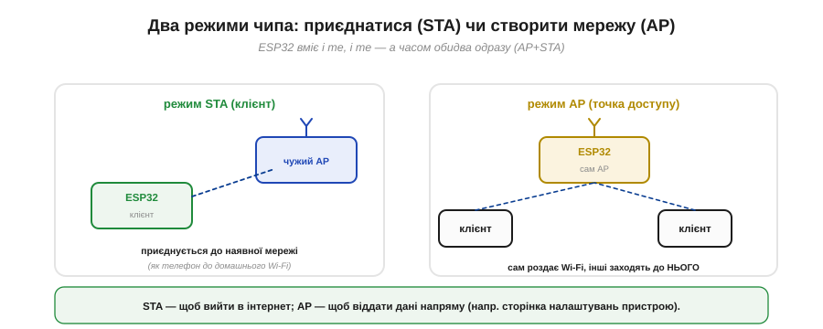
*Рис. 6.5.3.3. У режимі **STA** (*station*, клієнт) ESP32 приєднується до наявної мережі — точно як телефон до домашнього Wi-Fi. У режимі **AP** (*access point*) він **сам** створює мережу, і вже інші пристрої заходять до нього. ESP32 уміє навіть обидва режими одночасно (AP+STA).*

Це дуже практично. **STA** потрібен, щоб вийти в інтернет — пристрій стає клієнтом домашньої мережі. **AP** зручний, коли треба віддати дані **напряму**, без роутера: наприклад, ESP32 піднімає власну мережу й сторінку налаштувань, до якої під'єднуєшся телефоном, щоб ввести пароль домашнього Wi-Fi. А режим **AP+STA** дозволяє і бути в домашній мережі, і водночас приймати прямі підключення.

### IP-адреси й DHCP

Тепер — про ту саму IP-адресу. Коли пристрій приєднується, роутер автоматично видає йому **IP-адресу** — номер, за яким його знаходять у мережі. Робить це служба **DHCP** (*Dynamic Host Configuration Protocol*), вбудована в роутер.


*Рис. 6.5.3.4. Роутер (зазвичай сам із адресою 192.168.1.1 — це **шлюз** в інтернет) роздає приєднаним пристроям адреси: телефону 192.168.1.10, ноутбуку .11, ESP32 .12. Так кожен отримує свою адресу в локальній мережі автоматично.*

Локальні адреси виду **192.168.x.x** (є й інші приватні діапазони) роздаються в межах твоєї мережі; адреса .1 зазвичай належить самому роутеру й слугує **шлюзом** — воротами в інтернет. Один важливий наслідок: оскільки IP **видається** при приєднанні, він може **мінятися** — пристрій, переприєднавшись, дістане іншу адресу. Тому, коли потрібна стала адреса (щоб до пристрою завжди можна було звернутися), задають **фіксований** IP.

### Дві адреси: MAC і IP

Тут варто розрізнити дві зовсім різні «адреси», які має пристрій, бо їх часто плутають.

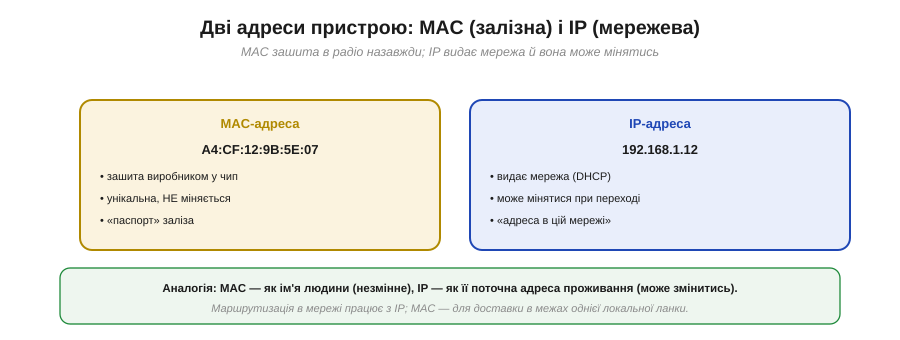
*Рис. 6.5.3.5. **MAC-адреса** (як-от A4:CF:12:9B:5E:07) зашита виробником у саме радіо, унікальна й не міняється — «паспорт заліза». **IP-адреса** (192.168.1.12) видається мережею й може змінюватися — «адреса в цій мережі». Це два різні рівні.*

Гарна аналогія: **MAC** — як ім'я людини (незмінне, дане раз), а **IP** — як її поточна адреса проживання (може помінятися при переїзді). MAC зашита в чіп назавжди й унікальна на весь світ; IP залежить від того, у якій мережі пристрій зараз. Маршрутизація по інтернету працює з **IP**-адресами, а MAC потрібен для доставки в межах однієї локальної ланки. Обидві потрібні, але на різних рівнях.

### З IP відкривається весь інтернет

І ось головне диво Wi-Fi. Щойно пристрій отримав IP-адресу, він користується тим самим **TCP/IP**, що й будь-який комп'ютер, — і раптом йому стає доступний **весь інтернет**.

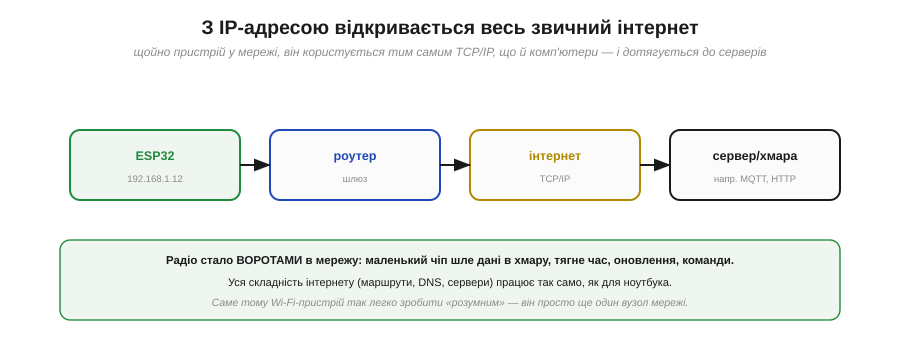
*Рис. 6.5.3.6. ESP32 (192.168.1.12) → роутер (шлюз) → інтернет → сервер чи хмара. З IP-адресою маленький чіп шле дані в хмару, тягне точний час, оновлення, команди — як повноцінний учасник мережі. Уся складність інтернету (маршрути, DNS, сервери) працює так само, як для ноутбука.*

Радіо тут перетворюється на **ворота** в мережу. Те, що було копійчаним мікроконтролером, тепер може звертатися до серверів по всьому світу: надсилати телеметрію в хмару, отримувати команди, синхронізувати час, завантажувати оновлення. І все це — стандартними засобами інтернету, бо для мережі ESP32 — просто ще один вузол із IP-адресою. Саме тому Wi-Fi-пристрій так легко зробити «розумним»: не треба винаходити зв'язок, досить підключитися до наявної інфраструктури.

### IP : порт = адреса послуги

Лишилася одна деталь, без якої картина неповна. IP-адреса доводить тебе до **пристрою**, але на одному пристрої може працювати **багато** служб одразу. Яку з них ти хочеш? На це відповідає **порт**.

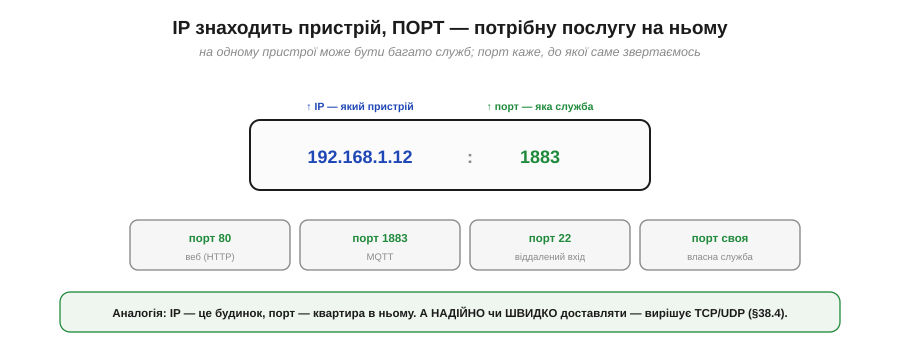
*Рис. 6.5.3.7. Повна адреса служби — це IP **і** порт: 192.168.1.12:1883. IP (192.168.1.12) каже, **який пристрій**; порт (1883) — **яка служба** на ньому. Приклади: порт 80 — веб (HTTP), 1883 — MQTT, 22 — віддалений вхід, або твій власний номер для власної служби.*

Аналогія проста: **IP — це будинок, а порт — квартира** в ньому. Щоб дістатися конкретної служби, треба знати і те, і те. Стандартні служби мають усталені порти (веб — 80, захищений веб — 443, MQTT — 1883), а для власного протоколу обираєш будь-який вільний номер. Пара «IP:порт» — це повна адреса, за якою один пристрій звертається до конкретної служби на іншому.

> 🔧 **Навіщо це.** Це базовий словник будь-якого мережевого пристрою. Підключаючи ESP32 до Wi-Fi, ти: даєш йому **SSID і пароль** (`WiFi.begin`), чекаєш, поки він отримає **IP** (інакше він ще не в мережі), і далі відкриваєш з'єднання за адресою **IP:порт** потрібного сервера. Якщо «не працює» — перевір саме ці кроки: чи приєднався (є SSID, правильний пароль), чи отримав IP (а не 0.0.0.0), і чи правильні адреса й порт сервера. А для пристрою, до якого звертаються **ззовні**, подбай про сталу адресу — DHCP-IP може змінитися.

Ми бачимо, що з Wi-Fi і IP пристрій стає вузлом мережі. Та лишилося ключове питання, від якого залежить надійність обміну: **як** саме доставляти дані по цій мережі — з гарантією чи якнайшвидше? Згадаймо «best-effort проти надійного» з §6.5.1 — на рівні мережі це втілено у двох протоколах, **TCP** і **UDP**, і вибір між ними визначає характер усього зв'язку. Їм і присвячена наступна тема.

---

## 6.5.4 TCP vs UDP: надійно vs швидко

Коли пристрій уже в мережі (має IP), постає вибір **способу доставки** даних — і це чи не найважливіше архітектурне рішення всього бездротового обміну. Поверх IP працюють два транспортні протоколи: **TCP** і **UDP**. Перший — надійний, але повільніший; другий — швидкий, але без гарантій. Це той самий вибір «надійно проти швидко», що ми бачили на рівні сирого радіо (§6.5.1), — тільки тепер його роблять одним рядком коду. Зрозуміти різницю критично: невдалий вибір транспорту перетворює добрий пристрій на або «гальмівний», або «ненадійний».

### Дві служби доставки

Спершу — загальне зіставлення.


*Рис. 6.5.4.1. **TCP** встановлює з'єднання, гарантує доставку, тримає порядок — але повільніший, із плаваючою затримкою й більшими накладними; це «потік байтів». **UDP** не встановлює з'єднання, нічого не гарантує, може плутати порядок — зате швидкий, із мінімальними накладними; це «окремі датаграми».*

Гарна побутова аналогія: **TCP** — як надійна служба доставки з підписом про вручення (повільніше, дорожче, але точно дійде й у тому стані); **UDP** — як кинути листівку в скриньку (миттєво й дешево, але без гарантій, що дійде). Розгляньмо кожен ближче.

### TCP спершу встановлює з'єднання

Найхарактерніша риса TCP — він не починає слати дані одразу. Спершу сторони **встановлюють з'єднання** особливим обміном службовими пакетами, який звуть **трикроковим рукостисканням**.

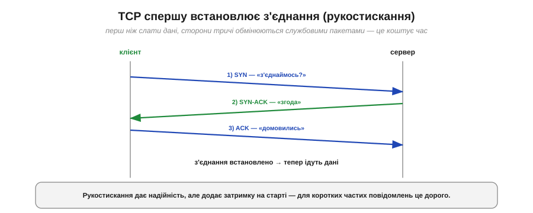
*Рис. 6.5.4.2. Клієнт шле SYN («з'єднаймось?»), сервер відповідає SYN-ACK («згода»), клієнт підтверджує ACK («домовились») — і лише тоді йдуть дані. Три обміни туди-сюди ще до першого байта корисних даних.*

Це рукостискання — основа надійності TCP: сторони домовляються, синхронізують лічильники, готуються стежити за доставкою. Але воно ж — і ціна: **затримка на старті** (кілька проходів туди-назад) ще до першого корисного байта. Для разової великої передачі це дрібниця; а от для коротких частих повідомлень накладні з'єднання стають відчутними.

### TCP: дані приходять повні й по порядку

Установивши з'єднання, TCP бере на себе всю боротьбу з ненадійністю мережі — і віддає застосунку ідеально рівний результат.


*Рис. 6.5.4.3. Хай у дорозі пакети переплутались, а один загубився — TCP перешле втрачений, дочекається решти й вишикує все в правильному порядку, перш ніж віддати застосунку. Той бачить рівний потік 1-2-3-4, не знаючи про жоден збій мережі.*

Це і є суть TCP: він ховає **весь** безлад мережі (втрати, переплутаний порядок, дублікати) усередині й гарантує застосунку, що дані прийдуть **повними** й **у тому порядку**, у якому надіслані. Працює це знайомими механізмами — підтвердженнями (ACK, як у §6.2.4) і перевідправленнями (§6.5.1), плюс нумерацією пакетів для впорядкування. Розплата — час: кожна втрата вимагає ретраю, а впорядкування змушує **чекати**. І саме це очікування породжує головну ваду TCP для реального часу, до якої ми зараз дійдемо.

### UDP: швидко й без гарантій

Протилежність TCP — **UDP**. Він не встановлює з'єднання й нічого не гарантує: просто шле окремі **датаграми** й одразу забуває про них.


*Рис. 6.5.4.4. UDP шле пакети й не чекає підтверджень: частина приходить не по черзі, один загубився — і ніхто його не перешле. Зате немає ні рукостискання, ні ретраїв, ні очікування впорядкування — дані доходять миттєво й свіжими.*

UDP — це чистий **best-effort** (§6.5.1) на рівні мережі: швидко, дешево, без церемоній, але без жодних обіцянок. Пакет може загубитися, прийти не в тому порядку чи навіть продублюватися — і UDP цим не переймається. Якщо надійність усе ж потрібна, її будують **самотужки** зверху (легкими ACK для важливих повідомлень) — рівно стільки, скільки треба, не платячи за повний апарат TCP.

### Блокування голови черги: чому TCP погано для реального часу

Тепер — ключове прозріння, чому для відео чи гри беруть саме UDP. Винна вимога TCP віддавати дані **строго по порядку**. Якщо один пакет загубився, усі наступні, що вже прийшли, **застрягають** у черзі, чекаючи на його перевідправлення. Це звуть **блокуванням голови черги** (*head-of-line blocking*).

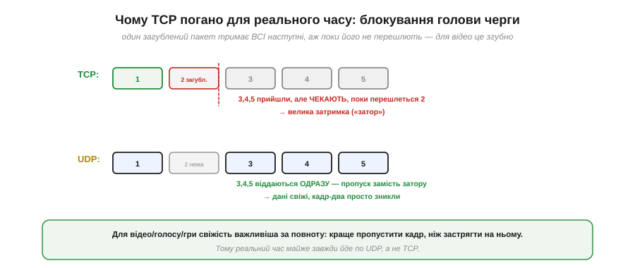
*Рис. 6.5.4.5. TCP: пакет 2 загубився — пакети 3, 4, 5 уже прийшли, але **чекають**, поки перешлеться 2; виходить великий «затор» і стрибок затримки. UDP: пакет 2 просто відсутній — 3, 4, 5 віддаються **одразу**; натомість маємо пропуск (зник кадр-два), але дані лишаються свіжими.*

Для потокових даних це вирішальна різниця. У відеодзвінку краще **пропустити** один кадр, ніж заморозити картинку на пів секунди, чекаючи його перевідправлення, — стара інформація вже нікому не потрібна. TCP же, женучи все по порядку, саме й заморожує. Тому **реальний час майже завжди йде по UDP**: свіжість важливіша за повноту, і пропуск кадру кращий за затор.

### Коли що

Зведімо вибір у просте правило.


*Рис. 6.5.4.6. **TCP** — коли важливий кожен байт: команди керування, передача файлів і прошивок, веб (HTTP), MQTT (типова IoT-телеметрія), будь-що, де втрата неприпустима. **UDP** — коли важлива свіжість: потокове відео й голос, ігровий стан, жива телеметрія, що часто оновлюється, широкомовлення.*

Орієнтир простий: **разовий важливий обмін** (команда, файл, запит) — бери TCP; **безперервний потік**, де старі дані вже не потрібні (відео, часта телеметрія), — бери UDP. Зауваж, що дуже популярний у пристроях протокол **MQTT** (легка IoT-телеметрія) працює поверх **TCP** — бо там важлива гарантована доставка кожного повідомлення.

### Той самий вибір — у коді

Найкраще, що ця глибока дилема в коді зводиться до вибору **класу**.


*Рис. 6.5.4.7. Надійно — береш `WiFiClient` (TCP): `connect()`, `print()` — з'єднання, ACK і впорядкування сховані. Швидко — береш `WiFiUDP`: `beginPacket()`, `write()`, `endPacket()` — шлеш і не чекаєш. Одна й та сама задача, два транспорти.*

```
// надійно (TCP): кожен байт дійде, по порядку
WiFiClient tcp;
tcp.connect(serverIP, 1883);
tcp.print(command);            // з'єднання й ретраї — усередині

// швидко (UDP): шлеш і не чекаєш
WiFiUDP udp;
udp.beginPacket(serverIP, port);
udp.write(telemetry, len);     // може загубитись — і байдуже
udp.endPacket();
```

> 🔧 **Навіщо це.** Обирай транспорт **за природою даних**, а не «про всяк випадок надійно». Команда «зброя на запобіжник» чи передача файлу прошивки — **TCP**: тут втрата неприпустима. Потік телеметрії 50 разів на секунду чи відео — **UDP**: одне старе значення нікому не потрібне, а затримка від ретраїв зашкодила б керуванню. Дуже часто в одному пристрої беруть **обидва**: рідкісні важливі команди — по TCP, безперервний потік стану — по UDP. Сліпо обрати TCP «бо надійніше» для реального часу — класична помилка, що дає смикану, лагучу картинку замість плавної.

Ми завершили з Wi-Fi: від радіо до IP й до вибору транспорту. Та Wi-Fi — не єдиний шлях у бездротовий світ, і для багатьох задач він завеликий: він жадібний до енергії й заточений під вихід у мережу. Коли ж треба просто з'єднати **два** пристрої поряд — пульт із роботом, давач із телефоном — простіше й ощадливіше взяти **Bluetooth**. Почнемо з його класичного варіанта, який прикидається знайомим нам послідовним портом: **Bluetooth Classic** і профіль SPP — «бездротовий UART».

---

## 6.5.5 Bluetooth Classic (SPP): бездротовий UART

Якщо Wi-Fi — це «під'єднати пристрій до мережі», то Bluetooth — це «з'єднати два пристрої між собою». Для багатьох задач саме друге й потрібне: керувати роботом із телефона, прочитати давач, замінити надокучливий кабель бездротом. І тут Bluetooth Classic пропонує напрочуд приємний трюк — він уміє прикинутися звичайним **послідовним портом**, який ми вже знаємо з Розділу 6.1. Цей профіль (SPP) — улюблений інструмент аматорів, бо дозволяє «перерізати дріт», майже не міняючи код. Розберімо, як це працює.

### Bluetooth Classic: постійне з'єднання двох

**Bluetooth Classic** (його ще звуть BR/EDR) призначений для **тривалого потоку** між **двома** пристроями. Це не мережа з багатьма вузлами, як Wi-Fi, а проста пара «точка-точка».


*Рис. 6.5.5.1. Два спарені пристрої (телефон і ESP32) тримають **неперервне** двостороннє з'єднання: дані течуть в обидва боки, поки воно живе. Classic заточений під сталий потік — звук, файли, послідовні дані. З'єднання «завжди увімкнене», тож і енергії бере відчутно (на відміну від BLE з §6.5.6).*

Ключове слово тут — **неперервний**. Classic тримає з'єднання активним увесь час, готовий передавати потік без пауз. Це чудово для звуку (навушники) чи постійного обміну, але має ціну: «завжди увімкнене» радіо помітно **їсть енергію**. Саме тому для давачів і носимих пристроїв згодом вигадали економніший BLE — але про нього далі; зараз нас цікавить найкорисніша риса Classic.

### SPP: Bluetooth прикидається UART

Серед можливостей Bluetooth Classic є профіль **SPP** (*Serial Port Profile*) — і він робить дивовижну річ: перетворює радіоканал на **точну подобу UART**. Два спарені пристрої отримують віртуальний послідовний порт: шлеш байти — вони приходять на той бік, як по дроту.

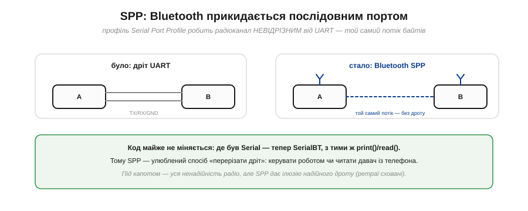
*Рис. 6.5.5.2. Було: два пристрої з'єднані дротом UART (TX/RX/GND). Стало: той самий потік байтів іде по Bluetooth SPP — без дроту. Модель та сама — послідовний потік, — лише канал тепер радіо. Тому код майже не міняється: де був `Serial`, тепер `SerialBT`.*

Це і є «перерізати дріт». Уся ваша робота з UART (Розділ 6.1) — `print()`, `read()`, побайтовий потік — переноситься на Bluetooth майже без змін: міняєш `Serial` на `SerialBT` — і той самий код тепер працює бездротово. Хочеш керувати роботом із телефона? Відкрив Bluetooth-термінал, шлеш команди — пристрій їх читає, як з UART. Саме ця простота й зробила SPP народним улюбленцем.

### Спарювання: встановити довіру один раз

Перш ніж два пристрої почнуть обмінюватися, вони мусять **спаритися** (*pairing*) — установити довірчий зв'язок. Це робиться раз, і далі вони пам'ятають одне одного.


*Рис. 6.5.5.3. **Виявлення** — знайти пристрій у списку поруч. **Ключ** — підтвердити PIN (часто 0000 чи 1234) або звірити число на обох екранах. **Довіра** — обмін ключами, відтепер пристрої «свої». **Пам'ять** — наступного разу вони з'єднаються самі, без повторного введення коду.*

Спарювання — це **безпека**: лише довірені пристрої дістають доступ, а ключ зберігається в обох. Тому смартфон одразу «бачить» свою гарнітуру — вони спарилися раніше й пам'ятають одне одного. Для розробника це означає простий сценарій: спарив телефон із ESP32 один раз (ввівши код), а далі вони з'єднуються автоматично.

### Профілі Bluetooth

SPP — лише один із багатьох **профілів** Bluetooth. Профіль — це домовленість не лише про те, **як** передавати біти, а й **що** саме й навіщо.


*Рис. 6.5.5.4. **SPP** — послідовні дані (наш «бездротовий UART»). **A2DP** — стереозвук (навушники, колонки). **HID** — клавіатури й миші (ввід). **HFP** — гарнітура й дзвінки (голос). Кожен профіль — готовий сценарій під свою задачу; нам для довільних даних потрібен саме SPP.*

Це зручно: замість винаходити свій спосіб передати звук чи зімітувати клавіатуру, береш готовий профіль. Для **довільних даних** (команди, телеметрія, текст) універсальний інструмент — **SPP**: він дає простий двосторонній потік байтів, як UART, і не нав'язує жодної структури зверху. Решта профілів спеціалізовані; нам у курсі потрібен саме SPP.

### Під капотом: чистий потік над брудним ефіром

Варто пам'ятати, що зручна «ілюзія дроту» в SPP — саме ілюзія. Під нею ховається вся ненадійність радіо з §6.5.1.

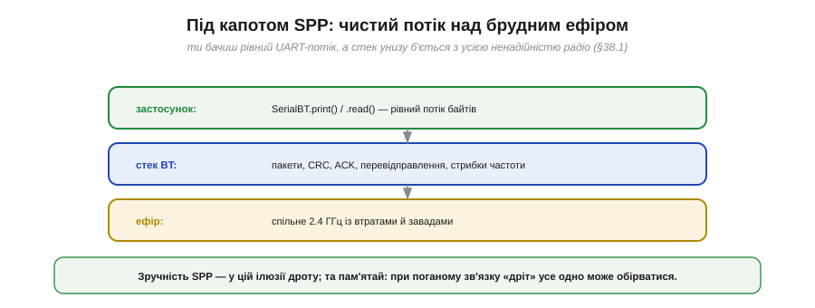
*Рис. 6.5.5.5. Застосунок бачить рівний UART-потік (`SerialBT.print/read`). Стек Bluetooth унизу непомітно робить усю чорну роботу: пакети, CRC, ACK, перевідправлення, стрибки частоти. А ще нижче — спільний брудний ефір 2.4 ГГц із втратами й завадами. Чистий потік нагорі — результат боротьби стека внизу.*

Тобто SPP не **скасовує** ненадійність радіо — він її **ховає**, додаючи знизу підтвердження й ретраї (як TCP для Wi-Fi). Для тебе це означає: зазвичай «дріт» працює прозоро, але за поганого зв'язку (далеко, завади) він усе одно може **обірватися** — і твій код має бути до цього готовий (failsafe, §6.5.7). Зручність є, та фізику не обдуриш.

### У коді: SerialBT ≈ Serial

Найкраще все це видно в коді — він майже не відрізняється від звичайного UART.


*Рис. 6.5.5.6. Кілька рядків — і ESP32 уже бездротовий послідовний порт: `SerialBT.begin("ім'я")` піднімає його під цим іменем у списку Bluetooth, а далі `println()` і `read()` працюють точно як у `Serial`.*

```
#include "BluetoothSerial.h"
BluetoothSerial SerialBT;

SerialBT.begin("ESP32-robot");                 // ім'я в списку Bluetooth
SerialBT.println("привіт з ESP32");            // як Serial.println
if (SerialBT.available()) c = SerialBT.read(); // як Serial.read
```

> 🔧 **Навіщо це.** Це найшвидший спосіб додати пристрою бездротове керування. Якщо ти вже вмієш працювати з `Serial` (а після Розділу 6.1 — умієш), то Bluetooth SPP даєш майже задарма: заміни `Serial` на `SerialBT`, спар із телефона, відкрий Bluetooth-термінал — і керуй пристроєм чи читай із нього байти без жодного дроту. Це ідеально для налагодження, простих пультів і прототипів. Пам'ятай лише дві речі: Classic помітно **їсть батарею** (для автономних давачів краще BLE), і «дріт» бездротовий, тож при втраті зв'язку потрібен failsafe.

### Classic проти BLE

Насамкінець — анонс наступної теми, бо Bluetooth буває **двох** дуже різних видів.


*Рис. 6.5.5.7. **Bluetooth Classic**: неперервний потік, з'єднання завжди увімкнене, більше енергії — звук, файли, серійні дані (профіль SPP). **BLE** (*Bluetooth Low Energy*): короткі сплески замість потоку, більшість часу пристрій спить, мізерна енергія — давачі, маячки, носимі гаджети (характеристики, GATT).*

Коротко: **Classic** — для тривалого потоку, коли енергія не критична (наш бездротовий UART саме тут). **BLE** — для рідкісних дрібних обмінів, коли пристрій має жити роками від маленької батарейки: він більшість часу **спить** і прокидається лише на мить, щоб надіслати порцію даних. Це принципово інша філософія — не «потік», а «ощадливі сплески», — і вона потребує іншої моделі даних. Саме BLE з його рекламою, характеристиками й GATT — тема наступного підрозділу.

---

## 6.5.6 BLE: реклама, характеристики, GATT

**BLE** (*Bluetooth Low Energy*) — не «полегшений Classic», а зовсім інший звір, побудований навколо однієї нав'язливої ідеї: **жити роками від крихітної батарейки**. Заради цього в ньому інакше геть усе — і як пристрої знаходять одне одного, і як організовані дані. Якщо Classic — це «бездротовий дріт» із потоком байтів, то BLE — це «бездротова дошка оголошень» із названими значеннями. Розібратися в його моделі важливо, бо саме на BLE працює переважна більшість сучасних давачів, маячків і носимих гаджетів, а ESP32 легко стає таким пристроєм.

### Філософія BLE: спить, прокидається на мить

Уся суть BLE — у режимі роботи радіо. Замість тримати з'єднання ввімкненим (як Classic), BLE-пристрій **більшість часу спить**, прокидаючись лише на коротку мить, щоб надіслати чи прийняти крихітну порцію даних.


*Рис. 6.5.6.1. Classic тримає радіо ввімкненим увесь час (~десятки міліампер постійно). BLE натомість майже весь час спить біля нуля, зрідка даючи короткий сплеск струму на прокидання. Через це **середній** струм мізерний — мікроампери, — і батарейка живе роками.*

**Приклад (наскільки довше живе батарейка).** Порівняймо від однієї монетної батарейки на 220 мА·год:

```
Classic, ~30 мА постійно : 220 мА·год / 30 мА ≈ 7 годин
BLE, середній ~10 мкА     : 220 мА·год / 0.01 мА ≈ 22 000 годин ≈ 2.5 року
```

Різниця в тисячі разів — ось чому BLE й вигадали. Той самий копійчаний елемент живить пульсометр чи давач **роками** замість годин. Але така ощадливість можлива лише тому, що BLE **відмовився** від постійного потоку на користь рідких коротких обмінів — а це вимагає й іншого способу знаходити пристрої, і іншої моделі даних.

### Реклама: сповіщати без з'єднання

Перша несподіванка BLE: пристрої вміють обмінюватися даними **взагалі без з'єднання**. Периферія час від часу **рекламує** себе — шле короткі пакети-сповіщення (*advertising*), а той, хто слухає, їх ловить.

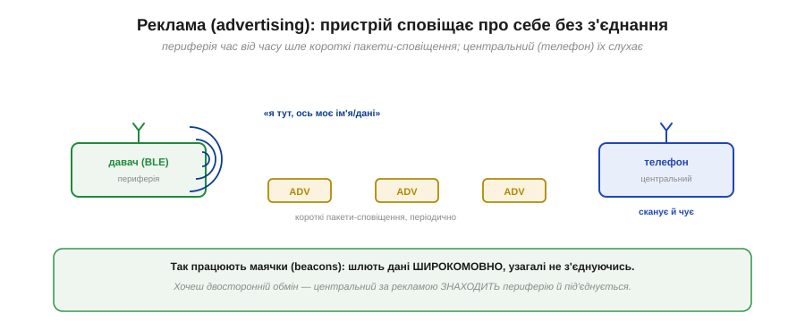
*Рис. 6.5.6.2. BLE-периферія (давач) періодично шле короткі пакети-сповіщення «я тут, ось моє ім'я/дані», а центральний (телефон) сканує ефір і їх чує. Так працюють **маячки** (beacons): вони мовлять дані широкомовно, ні до кого не під'єднуючись. А коли треба двосторонній обмін — центральний за рекламою знаходить периферію й під'єднується.*

Це дає два режими. **Без з'єднання** (маячки): пристрій просто розкидає свої дані в ефір, і будь-хто поруч може їх прочитати — ідеально для «я тут» чи «температура така-то», коли відповідь не потрібна. **Зі з'єднанням**: центральний, почувши рекламу, під'єднується до периферії для повноцінного двостороннього обміну. Реклама — це і спосіб бути знайденим, і водночас найдешевший спосіб щось повідомити.

### Дві ролі: периферія і центральний

У BLE чіткі ролі, які варто не плутати з master/slave: **периферія** (*peripheral*) і **центральний** (*central*).

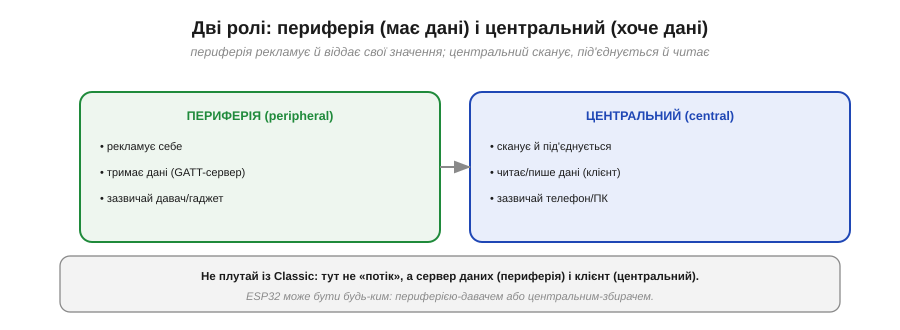
*Рис. 6.5.6.3. **Периферія** рекламує себе й тримає дані (вона — сервер); зазвичай це давач чи гаджет. **Центральний** сканує, під'єднується й читає/пише дані (він — клієнт); зазвичай це телефон чи ПК. ESP32 може бути будь-ким: периферією-давачем або центральним-збирачем.*

Зверніть увагу: на відміну від Classic із його потоком, тут стосунки — це **сервер даних** (периферія) і **клієнт** (центральний). Периферія не «ллє потік», а **зберігає** набір значень, які центральний може запитати. А як саме ці значення організовані — найважливіша частина BLE, його модель **GATT**.

### GATT: дані як дерево сервісів і характеристик

**GATT** (*Generic Attribute Profile*) — це спосіб, у який BLE-периферія розкладає свої дані. Замість безликого потоку байтів дані організовані в **дерево** іменованих значень.

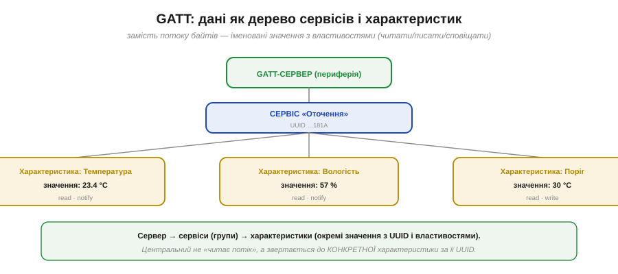
*Рис. 6.5.6.4. Сервер (периферія) містить **сервіси** — групи пов'язаних даних (наприклад, «Оточення»), у кожного свій UUID. Усередині сервісу — **характеристики**: окремі значення (Температура, Вологість, Поріг), кожна теж із UUID, поточним значенням і **властивостями** (читати / писати / сповіщати).*

Розберімо ієрархію. **Сервіс** (*service*) — це група пов'язаних даних: «Сервіс пульсу», «Сервіс батареї», «Сервіс оточення». **Характеристика** (*characteristic*) — конкретне значення всередині сервісу: власне пульс, відсоток заряду, температура. Кожна характеристика має **UUID** (унікальний ідентифікатор, за яким до неї звертаються), поточне **значення** і набір **властивостей** — що з нею можна робити. Тобто центральний не «читає потік», а звертається до **конкретної** характеристики за її UUID — як до названої комірки.

### Три операції: read, write, notify

Що ж можна робити з характеристикою? Три речі — і третя з них і є головний секрет ощадливості BLE.

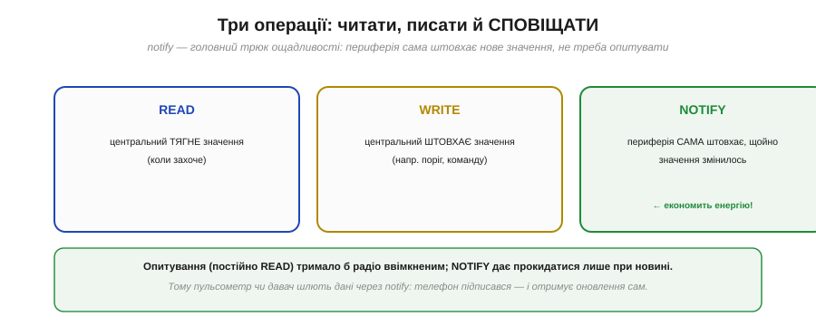
*Рис. 6.5.6.5. **READ** — центральний тягне значення, коли захоче. **WRITE** — центральний штовхає значення (наприклад, поріг чи команду). **NOTIFY** — периферія **сама** штовхає нове значення, щойно воно змінилось, без запиту. Notify економить енергію.*

**Read** і **write** очевидні: центральний читає характеристику або записує в неї. А ось **notify** — це справжній рятівник батарейки. Замість того щоб центральний **постійно опитував** периферію («а зараз? а зараз?» — тримаючи радіо ввімкненим), він один раз **підписується** на характеристику, і далі периферія **сама** надсилає нове значення лише тоді, коли воно змінилось. Радіо прокидається тільки за новиною. Саме так працює пульсометр: телефон підписався на характеристику пульсу — і отримує оновлення, поки давач більшість часу спить.

> 🔧 **Навіщо це.** Запам'ятай **notify** як ключ до енергоефективного BLE. Якщо твій пристрій має періодично віддавати дані (давач, лічильник), **не змушуй** центральний опитувати його — натомість зроби характеристику з властивістю notify, і хай периферія штовхає оновлення сама. Опитування (постійний read) тримало б радіо ввімкненим і вбило б усю перевагу BLE; notify дозволяє йому спати між подіями. Це різниця між «батарейка на тиждень» і «батарейка на роки».

### Потік (SPP) проти структури (GATT)

Варто чітко відчути різницю між двома моделями Bluetooth, які ми пройшли.


*Рис. 6.5.6.6. **SPP (Classic)** — це «труба для байтів»: просто потік 4A 12 FF…, а структуру (де що) вигадуєш сам. **GATT (BLE)** — набір **названих** значень: Температура = 23.4, Вологість = 57, Заряд = 88%, до кожного звертаєшся за іменем (UUID).*

Це дві різні філософії. **SPP** зручний, коли в тебе вже є власний байтовий протокол (як ми будували для UART у §6.1.6) — ти просто переносиш його в радіо. **GATT** зручний, коли дані природно розкладаються на окремі значення — тоді не треба вигадувати формат, а ще краще: телефонні застосунки **вже вміють** читати стандартні GATT-сервіси (пульс, батарея, оточення) без жодного рядка коду з твого боку. Структура коштує трохи більше зусиль при налаштуванні, але дає сумісність зі світом готових застосунків.

### На практиці й короткий вибір

Зведімо все докупи — і заразом завершимо вибір між трьома бездротовими інструментами модуля.


*Рис. 6.5.6.7. **Давач на батарейці з рідкими даними → BLE** (роки автономності, notify). **Бездротовий «дріт», пульт, потік → Bluetooth Classic / SPP** (простий потік байтів). **Вихід у мережу, інтернет, хмару → Wi-Fi** (IP, TCP/UDP, сервери). ESP32 вміє всі три.*

На практиці зробити ESP32 BLE-периферією нескладно: піднімаєш **сервіс** із кількома **характеристиками**, задаєш їм значення й властивості (read/notify) — і телефон уже може їх читати чи підписатися. А короткий підсумок вибору такий:

- **BLE** — коли пристрій має жити довго від маленької батарейки й віддавати дані **рідко й потроху** (давачі, маячки, носимі).
- **Bluetooth Classic (SPP)** — коли треба простий **потік** між двома пристроями поряд, а енергія не критична (пульт, бездротовий «дріт», налагодження).
- **Wi-Fi** — коли потрібен вихід у **мережу** чи інтернет (хмара, веб, віддалене керування).

> 🔧 **Навіщо це.** Це фінальна карта бездротового вибору. Питай себе по черзі: чи потрібен **інтернет**? — тоді Wi-Fi. Чи потрібна **довга автономність** і дані йдуть рідко? — тоді BLE. Чи треба просто **замінити дріт** потоком між двома пристроями? — тоді Classic/SPP. ESP32 уміє всі три, тож обмеження — не залізо, а правильний добір під енергію, дальність і потребу в мережі. Сплутати їх — типова помилка: робити давач-«довгожитель» на Wi-Fi (з'їсть батарею за дні) або тягти потік відео по BLE (він на це не розрахований).

Ми пройшли три бездротові технології — Wi-Fi, Bluetooth Classic і BLE — і навчилися обирати між ними. Та всі вони, попри відмінності, мають одну спільну рису, з якої ми почали розділ: **радіо ненадійне**. Зручні обгортки ховають це, але не скасовують — зв'язок може ослабнути, перерватися, зникнути зовсім. Тож завершальне питання модуля про радіо на чіпі — практичне й найважливіше: **як спроєктувати обмін так, щоб пристрій лишався безпечним і передбачуваним, коли зв'язок таки зникне?** Цьому — надійному обміну й failsafe — присвячена остання тема розділу.

---

## 6.5.7 Проєктування надійного обміну + failsafe

Це найважливіша тема всього розділу — і водночас найпрактичніша. Усі попередні теми показали зручні обгортки (Wi-Fi, Bluetooth), що ховають ненадійність радіо. Але ховати — не значить скасувати: зв'язок **зникне**, питання лише коли. Тому надійну бездротову систему будують **навколо** цього факту: не сподіваючись на «гарний сигнал», а заздалегідь вирішивши, що пристрій робитиме, коли сигналу не стане. Зберімо тут усі прийоми — від виявлення втрати до безпечної реакції — в один практичний звід.

### Серцебиття: «я живий»

Перше питання — **як узагалі помітити**, що зв'язок зник? Радіо рідко дає чітку подію «від'єднано» (це ж не дріт, який можна висмикнути). Тому втрату ловлять інакше: пристрій періодично шле короткий сигнал «я живий» — **серцебиття** (*heartbeat*), а той бік чекає його через рівні проміжки.

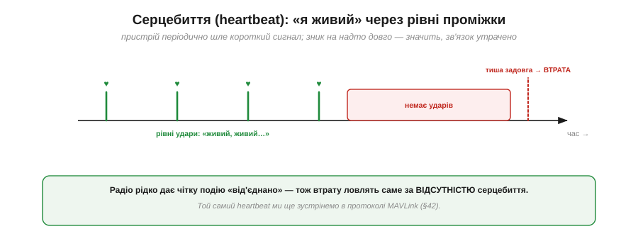
*Рис. 6.5.7.1. Пристрій шле рівні «удари»: живий, живий, живий… Поки вони приходять — зв'язок є. Щойно ударів немає **задовго** — приймач робить висновок: зв'язок утрачено. Це і є спосіб виявити втрату за відсутністю сигналу, а не за якоюсь «подією».*

Серцебиття — універсальний прийом надійних систем. Той самий механізм ми ще зустрінемо в протоколі телеметрії дронів MAVLink (Розділ 6.9), де heartbeat — обов'язкова частина. Суть проста: **тиша теж несе інформацію** — якщо «живих» сигналів нема, значить, щось обірвалося.

### Виявлення за таймаутом

Технічно втрату виявляють **таймаутом**: стежать за часом від останнього отриманого повідомлення, і якщо він перевищив поріг — запускають реакцію.


*Рис. 6.5.7.2. У головному циклі (патерн `millis()` з §4.6.5): щоразу, як прийшло повідомлення, запам'ятовуємо час; якщо `millis() − lastMsg` перевищив TIMEOUT — викликаємо failsafe. Це той самий watchdog-підхід (§4.6.7), лише для зв'язку.*

```
// у головному циклі — неблокуюче стеження за зв'язком
if (gotMessage) lastMsg = millis();          // оновлюємо при кожному пакеті
if (millis() - lastMsg > TIMEOUT) {
    failsafe();                              // зв'язок утрачено → безпечна дія
}
```

Поріг `TIMEOUT` добирають із запасом, але без надмірності. Замало — і випадкова втрата кількох пакетів (а вона буде, §6.5.1) хибно спрацює як «втрата зв'язку». Забагато — і пристрій надто пізно зреагує на справжній обрив. Звичайний підхід: якщо серцебиття йде кожні 100 мс, дозволити **три** пропуски й поставити поріг ≈300 мс. Це знову той самий **сторожовий таймер** (watchdog, §4.6.7), лише націлений на зв'язок.

### Що робити при втраті: failsafe

А тепер — найголовніше рішення всієї теми: **що робити**, коли таймаут спрацював? Відповідь залежить від пристрою, але є одне непорушне правило.

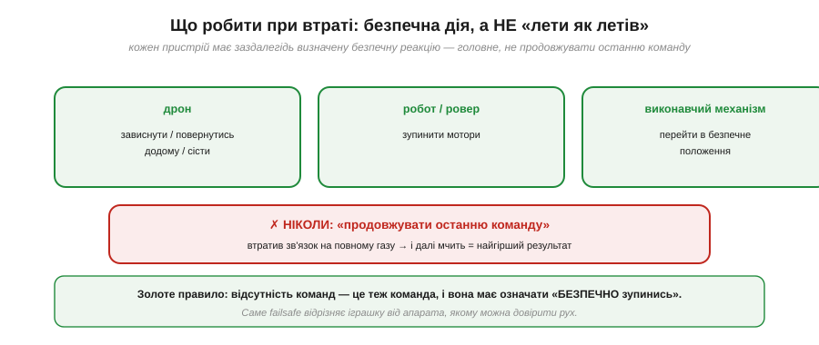
*Рис. 6.5.7.3. Дрон — зависнути, повернутися додому чи сісти. Робот або ровер — зупинити мотори. Виконавчий механізм — перейти в безпечне положення. А чого робити **ніколи** не можна — це «продовжувати останню команду»: апарат, що втратив зв'язок на повному газу й мчить далі, — найгірший можливий результат.*

Це кардинальне правило надійних систем: **відсутність команд — це теж команда, і вона має означати «безпечно зупинись»**. Інтуїтивна, але згубна помилка новачка — лишити пристрій «робити, що робив»: дрон полетить у невідомість, ровер вріжеться у стіну, маніпулятор зламає деталь. Правильний **failsafe** — це заздалегідь продумана **безпечна** реакція: зупинка, повернення, перехід у нейтраль. Саме наявність failsafe відрізняє іграшку від апарата, якому можна довірити рух у реальному світі.

### Шли стан, а не приріст

Перейдімо від виявлення втрати до **стійкості до неї** самого протоколу. Перший потужний прийом: передавати **абсолютний стан**, а не **приріст**. Це тонка, але глибока ідея.

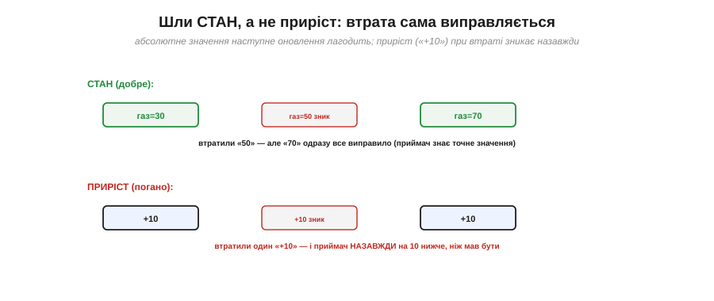
*Рис. 6.5.7.4. Угорі (добре): шлемо стан «газ=30», «газ=50», «газ=70». Загубили «50» — але наступне «70» одразу все виправило, бо приймач знає **точне** значення. Унизу (погано): шлемо приріст «+10», «+10», «+10». Загубили один «+10» — і приймач **назавжди** на 10 нижче, ніж мав бути: втрачений приріст не повернути.*

Різниця вирішальна для ненадійного каналу. Якщо ти шлеш **поточне значення** («швидкість = 50%», «кут = 30°»), то будь-яка загублена посилка **самовиправляється** наступною — вона несе повний стан, не залежний від попередніх. А якщо шлеш **зміну** («додай 10», «поверни на 5°»), то кожна втрата **накопичується** назавжди: загублений приріст ніколи не компенсується. Тому в надійних бездротових протоколах майже завжди передають **стан**, а не команди-прирости — це робить систему стійкою до неминучих втрат майже задарма.

### Номери послідовності

Радіо не лише губить пакети — воно може й **переплутати** їхній порядок (§6.5.1). Старіша команда може прийти **після** свіжішої — і виконати її означало б відкотити стан назад. Рятують **номери послідовності**.

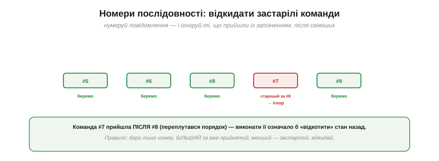
*Рис. 6.5.7.5. Команди нумерують: #5, #6, #8… А коли після #8 раптом приходить запізніла #7 — її **ігнорують**, бо вона старіша за вже прийняту. Правило: бери лише номер, БІЛЬШИЙ за останній прийнятий; менший — застарілий, відкидай.*

Номери послідовності розв'язують одразу кілька бід: дають **відкидати застарілі** команди (як на рисунку), **помічати втрати** (пропуск у нумерації) і **відсіювати дублікати** (той самий номер двічі). Простий лічильник у заголовку пакета — і протокол перестає плутатися в часі, навіть коли мережа тасує посилки.

### ACK для критичного, best-effort для потоку

Не всі повідомлення рівноцінні, і платити за надійність варто **вибірково**. Згадаймо «best-effort проти надійного» з §6.5.1: критичні команди мусять дійти напевно, а безперервний потік можна й губити.


*Рис. 6.5.7.6. **Критичні** команди («увімкнути мотори», «вимкнути», зміна режиму) шлють із підтвердженням і повторюють, поки не отримають ACK — вони мусять дійти. **Потік** (телеметрія, позиція, кут, відео) шлють best-effort: загубилось — байдуже, наступне свіже значення прийде за мить.*

Принцип ясний: **не плати за надійність там, де вона не потрібна, і не економ там, де команда мусить дійти**. Команду «роззброїти мотори» повторюй, поки не підтвердять (її втрата небезпечна); а поточну висоту чи кут шли просто потоком — одне старе значення нічого не варте проти свіжого. Змішувати ці два режими в одній системі — норма: рідкісні важливі команди надійно, часта телеметрія — як вийде.

### Три шари надійності

Зведімо всі прийоми в єдину картину — вони природно лягають у **три шари**.


*Рис. 6.5.7.7. **Стек радіо** сам перешле окремі загублені пакети (CRC, ACK) — це сховано. **Твій протокол** додає номери послідовності й передачу стану замість приросту — стійкість до плутанини й втрат. **Твій застосунок** робить серцебиття, таймаут і failsafe — реакцію на повну втрату зв'язку. Кожен шар ловить свій клас бід.*

Ось чому надійність будують **шарами**, а не сподіваннями на «гарний сигнал». Нижній шар (стек) бере на себе **окремі** загублені пакети. Середній (твій протокол) робить дані **стійкими** до втрат і переплутування — номерами й передачею стану. Верхній (твій застосунок) ловить **повну** втрату зв'язку й безпечно реагує. Разом вони перетворюють принципово ненадійне радіо на пристрій, що поводиться **передбачувано** навіть у найгіршому випадку.

> 🔧 **Навіщо це.** Це чек-лист будь-якого серйозного бездротового пристрою: (1) **серцебиття** — щоб було за чим стежити; (2) **таймаут** — щоб помітити втрату; (3) **failsafe** — безпечна дія (ніколи не «як було»); (4) **стан замість приросту** — щоб втрати самовиправлялися; (5) **номери послідовності** — щоб не плутати час; (6) **ACK на критичне** — щоб важливе точно дійшло. Пройдешся цими шістьма пунктами — і твій пристрій переживе те, що неминуче станеться: зникнення зв'язку. Пропустиш failsafe — рано чи пізно матимеш некерований апарат.

---

Підсумуймо Розділ 6.5. Ми піднялися від **сирого радіо** до **готових бездротових систем**: чому радіо ненадійне (§6.5.1), як ділять смугу 2.4 ГГц на канали й пакети (§6.5.2), як Wi-Fi дає вихід у мережу через IP (§6.5.3), чим TCP відрізняється від UDP (§6.5.4), як Bluetooth Classic стає бездротовим UART (§6.5.5), як BLE живе роками від батарейки через GATT (§6.5.6) і як спроєктувати надійний обмін із failsafe (§6.5.7). Тепер ти вмієш не лише користуватися Wi-Fi і Bluetooth, а й **свідомо** обирати між ними та будувати на ненадійному радіо передбачувану систему.

Та весь цей розділ свідомо лишався на рівні **готового радіо** — ми користувалися ним, не питаючи, що ж насправді летить «по повітрю». А там, під зручними обгортками, працює одне з найкрасивіших явищ фізики — **електромагнітна хвиля**. Що це таке, як електрика й магнетизм разом біжать простором зі швидкістю світла, чому частота визначає все — від дальності до розміру антени? Час відкрити «чорну скриньку» радіо й зазирнути в саму фізику хвиль.

> ▶️ Далі: [Розділ 6.6 — Радіо: фізика електромагнітних хвиль](../radio-em-waves/radio-em-waves.md)