# Розділ 43 — Архітектура автономної системи й політний контролер

Досі ми вивчали окремі цеглинки: давачі, що перетворюють фізику на сигнал; фільтри, що чистять цей сигнал; регулятори, що тримають величину біля заданої; шини, якими все це спілкується; радіо, яким апарат говорить із землею. Тепер настав час скласти їх **в одну систему**, яка робить щось ціле — летить, їде чи пливе **сама**. Цей розділ — про **архітектуру** такої системи: які в неї великі частини, як вони з'єднані в потік і чому в центрі стоїть окремий, виділений «мозок» — **політний контролер** (*flight controller*).

Ми не проєктуватимемо власний автопілот з нуля. Мета — навчитися **бачити структуру** будь-якої автономної системи: відкривши чужий апарат, чужу плату чи чужу прошивку, упізнавати в них ті самі великі блоки й розуміти, хто за що відповідає. За приклад зрілого, відкритого й читабельного стека правитиме **ArduPilot** — але ідеї тут загальні й переносяться на будь-який автопілот.

> 📜 Історія теми: [ArduPilot — як спільнота аматорів зробила автопілот](ch43-history-ardupilot.md). Раджу прочитати її першою — вона пояснює, **чому** сучасний автопілот улаштований саме так (шари, відкритість, виділений контролер).

---

## 43.1 З чого складається автономний апарат

Спитаймо найпряміше: що взагалі означає, що машина діє **сама**? Радіокерована модель не автономна — нею керує людина, яка дивиться очима, оцінює ситуацію мозком і рухає стіки руками. Щоб апарат робив це **без людини**, усі три ролі — очі, мозок, руки — мусять переїхати на борт і працювати **безперервно**, десятки чи сотні разів на секунду. Весь цей розділ — про те, як ці ролі влаштовано. А починається все з однієї форми, яку ти вже бачив у Розділі 34, коли ми розбирали зворотний зв'язок і ПІД-регулятор: з **замкненого контуру**.

### Чотири ланки одного контуру

Будь-яка автономна система — від кімнатного робота-пилососа до літака — це той самий ланцюг із чотирьох ланок, замкнений сам на себе:

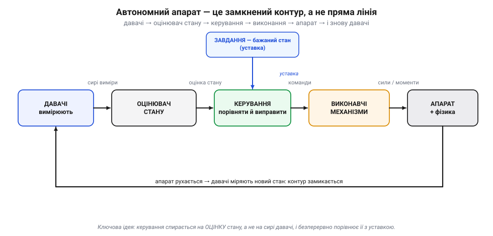
*Рис. 43.1.1. Скелет будь-якого автономного апарата. Чотири блоки передають сигнал по колу, а «завдання» (уставка) входить збоку, у блок керування. Лінія знизу — найважливіша: апарат рухається у фізичному світі, давачі міряють новий стан, і контур замикається. Без цього замикання це була б не автономна система, а сліпа команда.*

Пройдімо ланки по черзі — поки що оглядово, бо кожна з них розкривається далі в цьому модулі:

1. **Давачі** (*sensors*) — «очі» системи. Вони перетворюють фізичні величини на числа: інерціальний блок (*IMU*) міряє прискорення й кутову швидкість, барометр — тиск (а отже, висоту), магнітометр — напрям на північ, супутниковий приймач (*GNSS*) — координати, давач струму й напруги — стан живлення. Кожен давач **недосконалий**: шумить, дрейфує і бачить лише **частину** картини. Жоден із них сам не каже «ти нахилений на 12° і летиш на північ зі швидкістю 8 м/с».

2. **Оцінювач стану** (*state estimator*) — той, хто з купи шумних, часткових вимірів складає **одну злагоджену оцінку** повного стану апарата: орієнтацію (крен, тангаж, курс — *roll, pitch, yaw*), висоту, положення, швидкість. Це не просто «згладити давач»; це **поєднати** різні давачі так, щоб сильні сторони одного закривали слабкі іншого. Саме тут живе сенсорний фьюжн (про який — далі в цьому модулі).

3. **Керування** (*control*) — «мозок-виконавець». Воно бере оцінку стану й **бажаний стан** (уставку, *setpoint*), рахує **неузгодженість** (*error*) між ними й видає команди, що цю неузгодженість зменшують. Це той самий ПІД та каскадні контури з Розділу 34, тільки тепер вони керують реальним апаратом.

4. **Виконавчі механізми** (*actuators*) — «руки». Вони перетворюють команди на фізичну дію: регулятор обертів (*ESC*) крутить мотори, серворушії відхиляють керма й елерони. Звідси на апарат діють сили й моменти.

І тоді — найважливіше — апарат **рухається**. Його новий стан знову потрапляє в давачі, і все починається спочатку. Це і є **зворотний зв'язок** (*feedback*): система не «вистрілює» командою наосліп, а постійно дивиться на результат і поправляється. Розімкни цей контур (прибери лінію знизу на Рис. 43.1.1) — і апарат осліпне: даватиме команди, не знаючи, що з них вийшло, і за секунди втратить керованість. Різницю видно навіть на найпростішому досліді — утриманні рівного положення під поривом вітру:

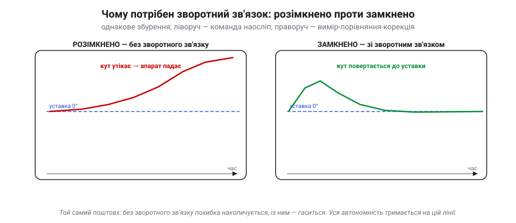
*Рис. 43.1.5. Те саме збурення, два контури. Без зворотного зв'язку (ліворуч) команда йде наосліп: найменша неточність накопичується, і кут невпинно тікає, аж поки апарат не зірветься. Замкнений контур (праворуч) щомиті бачить свою помилку й гасить її — поштовх лише на мить хитає апарат, а тоді той повертається до уставки.*

Ось чому автономність тримається не на тому, щоб «вистрілити правильну команду», а на тому, щоб **безперервно міряти результат і виправлятися**. Розімкнена система довіряє своїм припущенням; замкнена — перевіряє їх реальністю по сто разів на секунду. Усе інше в цьому розділі — деталі того, як зробити цю перевірку швидкою й надійною.

> 🔧 **Навіщо це.** Ця чотириланкова схема — твоя **карта для читання чужих систем**. Відкривши незнайомий апарат, шукай, де в ньому кожна ланка: які давачі стоять, що рахує оцінку, де контур керування, чим він рухає світ. Якщо якоїсь ланки «не видно» — значить, ти ще не зрозумів систему до кінця. У наступних розділах ми наповнюватимемо кожен блок конкретикою, але **рамка** лишиться цією.

### Та сама абстракція — у залізі й коді

Блоки на Рис. 43.1.1 — не філософія. За кожним стоять відчутні мікросхеми, мотори й рядки коду:

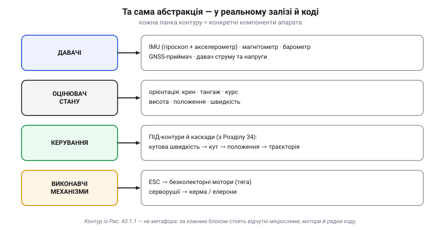
*Рис. 43.1.2. Кожна ланка контуру — це конкретні речі на борту. «Давачі» — це IMU, барометр, магнітометр, GNSS; «оцінювач» видає крен/тангаж/курс, висоту й положення; «керування» — це ПІД-каскади з Розділу 34; «виконання» — це ESC із моторами й серворушії. Абстракція рівно настільки реальна, наскільки реальне залізо під нею.*

Зверни увагу на праву колонку рядка «керування»: там не одна петля, а **ланцюжок** «кутова швидкість → кут → положення → траєкторія». Це не випадково — до цього ми ще повернемося нижче. А поки запам'ятай головне: коли в документації побачиш слова *attitude estimator*, *position controller*, *navigation*, *mixer*, *output* — це не екзотика, а просто **назви тих самих чотирьох ланок** (та їхніх під-частин) англійською.

### Чому керування спирається на ОЦІНКУ, а не на сирі давачі

Може здатися зайвим окремий блок «оцінювач»: чому б керуванню не читати давачі напряму? Бо сирий давач **бреше** — кожен по-своєму. Розгляньмо лише орієнтацію.

- **Гіроскоп** міряє кутову швидкість дуже чисто й швидко, але щоб дістати з нього **кут**, його треба інтегрувати — а інтеграл накопичує найменшу похибку, і за хвилину «кут нахилу» з гіроскопа **спливає** (*drift*) на десятки градусів.
- **Акселерометр** у спокої бачить напрям сили тяжіння, тобто дає **абсолютний** кут нахилу — але лише поки головна сила, що на нього діє, це **гравітація** (спокій або рівномірний рух). У маневрі він домішує до неї **лінійні прискорення** апарата, тож «горизонт» із нього кривиться; до того ж він трясеться від вібрації мотора. Тож миттєвому його значенню довіряти не можна.

Жоден сам не годиться. А разом — годяться ідеально: швидкий гіроскоп дає короткочасну точність, повільний акселерометр прив'язує його до «справжнього» горизонту й не дає спливати. Саме це поєднання й робить оцінювач (згадай комплементарний фільтр і фільтр Калмана з Розділу 34). На виході — **одне** чисте число «крен = 12.3°», якому вже можна довіряти.

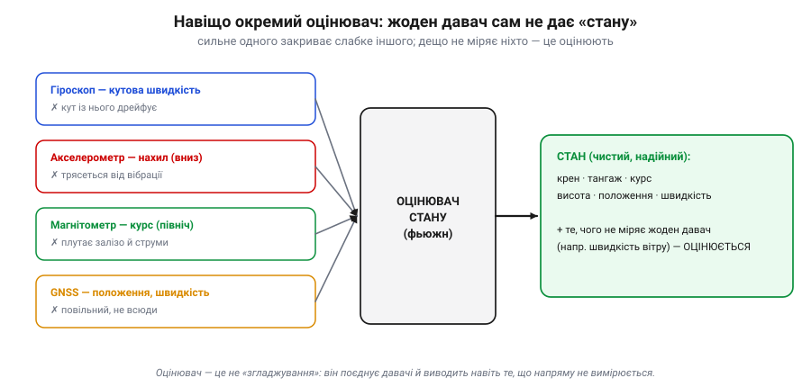
*Рис. 43.1.6. Чому ланка «оцінювач» окрема. Гіроскоп точний, але його кут дрейфує; акселерометр абсолютний, але трясеться; магнітометр дає курс, але плутається біля заліза; GNSS дає положення, але повільний. Оцінювач поєднує їх так, що сильне одного закриває слабке іншого — і видає чистий стан.*

Та й це ще не вся його робота. Деяких величин, потрібних для польоту, **не міряє жоден** давач напряму — наприклад, швидкість відносно повітря або чисту вертикальну швидкість. Оцінювач **виводить** їх, поєднуючи кілька давачів зі знанням про те, як апарат рухається. Тому точніше казати, що він не «згладжує давачі», а **будує модель стану** апарата — повнішу й надійнішу, ніж будь-який окремий вимір. Подивімося на один прохід контуру в числах:

**Приклад (один такт стабілізації крену).** Апарат має триматися рівно: уставка крену 0°. Порив вітру завалює його праворуч.

```
уставка (бажаний крен)         r =   0.0°
оцінка стану (з фьюжну)        y = +12.0°       ← НЕ сирий давач, а злита оцінка
неузгодженість                 e = r − y = −12.0°
проп. складова керування       u = Kp · e = 0.5 · (−12.0) = −6.0   (умовних одиниць моменту)
команда мікшеру                «додати тягу правому борту, зняти лівому»
→ апарат повертається до 0; наступний такт:  y = +8.5°,  e = −8.5°,  u = −4.25 ...
```

З такту в такт неузгодженість меншає, команда слабшає, апарат плавно повертається до рівного — це і є робота замкненого контуру. Ключове: у рядку `y` стоїть **оцінка**, а не показ гіроскопа чи акселерометра окремо. Підстав туди сирий давач — і керування то «ловитиме» вібрацію акселерометра, то «гнатиметься» за дрейфом гіроскопа, замість тримати апарат рівно.

> 🔧 **Навіщо це.** Запам'ятай розрізнення «вимір ≠ стан». Вимір — це те, що дав давач; стан — це те, у що ти **віриш** про апарат після того, як зважив усі давачі разом. Плутати їх — типова причина, чому саморобні стабілізатори «трясе»: керування підключають до сирого давача замість оцінки.

### Контур у контурі: різні задачі — різні темпи

Тепер повернімося до того ланцюжка «кутова швидкість → кут → положення → траєкторія». Виявляється, контур керування — **не один**. Їх кілька, **вкладених** один в одного, і кожен працює зі своїм темпом:

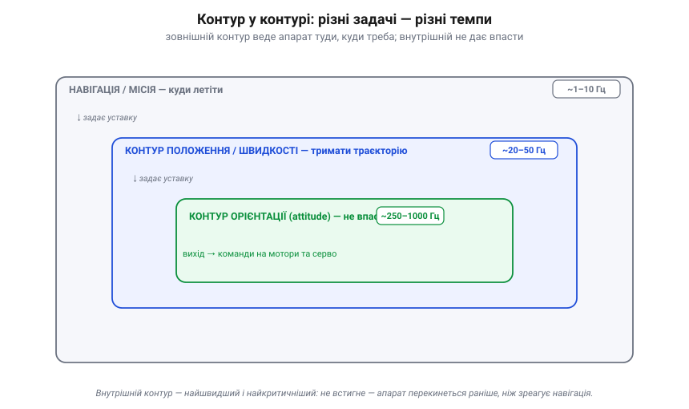
*Рис. 43.1.3. Контур у контурі. Внутрішній контур орієнтації крутиться найшвидше (сотні разів за секунду) — бо фізика падіння швидка: апарат перекидається за частки секунди. Зовнішні контури (положення, потім навігація) повільніші — їм не треба поспішати. Кожен зовнішній контур задає **уставку** внутрішньому: навігація каже «лети до точки B», контур положення перетворює це на «нахилися на 10° уперед», а контур орієнтації втілює цей нахил, ганяючи мотори.*

Чому саме так? Бо **різні задачі мають різну терміновість**. Утримати апарат від перекидання треба **негайно** — тому внутрішній контур орієнтації (*attitude loop*) виконують з частотою в сотні герц (нерідко 400–1000 Гц). А «долетіти до потрібної точки» можна й не поспішаючи — навігаційний контур оновлюється лічені рази на секунду. Класична **каскадна** структура з Розділу 34, тільки розгорнута на весь апарат: швидкий внутрішній контур **стабілізує**, повільний зовнішній — **веде**.

Простежмо одну команду згори вниз. Навігація вирішує «лети до точки B» і передає контуру положення бажані напрям та швидкість. Той рахує: «щоб набрати цю швидкість, нахилися вперед на 10°» — і віддає цей кут контуру орієнтації **як уставку**. А вже контур орієнтації, найшвидший, відхиляє керма й підправляє тягу моторів, щоб утримати саме той нахил. Кожен рівень не робить чужої роботи: він лише перетворює завдання, що прийшло зверху, на уставку для рівня під собою. Вихід зовнішнього контуру — це **вхід** внутрішнього; так складна мета «долетіти кудись» розкладається на ланцюжок простих, кожен зі своїм темпом.

> 🔧 **Навіщо це.** Ця ієрархія темпів пояснює, чому політний контролер мусить бути **реального часу**: якщо внутрішній контур хоч раз спізниться, апарат перекинеться раніше, ніж зовнішня логіка взагалі помітить проблему. Звідси й вимоги до «мозку», який усе це крутить, — про них наступна тема.

### Звідки береться «бажаний стан»

Лишилося одне питання: а **хто задає уставку** — той «бажаний стан», з яким керування порівнює оцінку? Відповідь показує, чому ручний і автономний політ — це **та сама** архітектура:

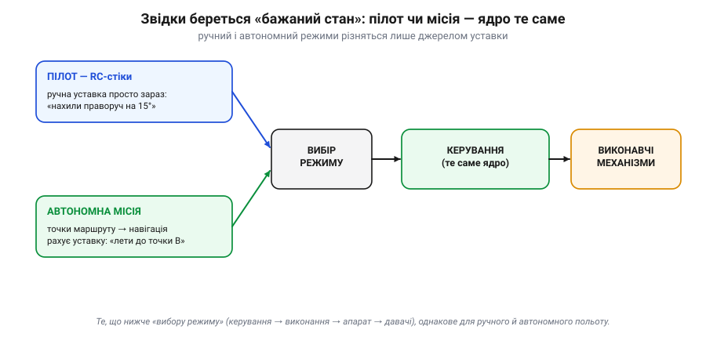
*Рис. 43.1.4. Уставка приходить ззовні контуру — і байдуже звідки. У ручному режимі її щомиті задає пілот стіками («нахили праворуч на 15°»). В автономному режимі бортова навігація сама рахує уставку з маршрутних точок («лети до точки B»). Усе, що нижче «вибору режиму» — керування, виконання, апарат, давачі, — **однакове**. Автономність — це не інша система, а інше **джерело уставки**.*

Це одна з найважливіших ідей усього розділу. Новачок уявляє «автопілот» як окрему чарівну коробку, відмінну від ручного керування. Насправді ж **ядро однакове**: той самий замкнений контур, ті самі давачі, той самий оцінювач, те саме керування. Змінюється лише **верхній** модуль — звідки береться бажаний стан. Тому той самий апарат легко перемикається між ручним і автономним польотом: під капотом крутиться один і той самий контур, просто уставку йому дає то людина, то програма.

> 🔧 **Навіщо це.** Коли розбиратимеш режими польоту в чужій прошивці (*Stabilize*, *Loiter*, *Auto* тощо), не шукай для кожного окрему систему — шукай, **звідки в цьому режимі береться уставка** і **який контур її відпрацьовує**. Усі режими — це варіації одного контуру з різними джерелами завдання.

### Підсумок теми

Автономний апарат — це **замкнений контур** із чотирьох ланок: давачі вимірюють, оцінювач складає з вимірів злагоджений стан, керування порівнює стан із уставкою й видає команди, виконавчі механізми втілюють їх у рух, а рух знову потрапляє в давачі. Уставку — бажаний стан — контур дістає ззовні: від пілота або від автономної місії, і саме це робить ручний та автономний політ однією архітектурою. А всередині керування ховається не одна петля, а **каскад** вкладених контурів із різними темпами, де внутрішній мусить устигати найшвидше.

Цей контур треба виконувати **багато сотень разів на секунду, без затримок і без збоїв** — інакше апарат просто впаде. Саме ця вимога й диктує, яким має бути «мозок», що крутить контур, і чому йому віддають **окрему**, виділену плату. Із цього й почнемо далі.

---

## 43.2 Навіщо виділений політний контролер

Здавалося б, навіщо городити окрему скромну плату, коли на борту нерідко вже є потужний комп'ютер — одноплатний Linux, а то й смартфон, що в сотні разів швидший за дешевий мікроконтролер? Чому б не крутити контур керування **там**? Відповідь — у трьох вимогах, яких потужність сама по собі **не** задовольняє: **реальний час**, **надійність** і **резервування**. Саме вони, а не «гігагерци», вирішують, чи втримається апарат у повітрі. Розгляньмо їх по черзі — і стане ясно, чому критичне керування віддають окремому, навмисно простому контролеру.

### Реальний час: вчасно — важливіше, ніж швидко

Згадай внутрішній контур орієнтації з 43.1: він мусить оновлюватися сотні разів на секунду. «Реальний час» (*real-time*) — це **не** «швидко». Це **вчасно, ГАРАНТОВАНО, кожного разу**. Система реального часу — та, що встигає до **строку** (*deadline*) не в середньому, а **завжди**, навіть у найгіршому випадку. Бо у польоті запізнення на один такт — це не «трохи лаг», а кут, який встиг вирости, поки контур мовчав.

Порахуймо строк у числах:

```
такт контуру орієнтації:   400 Гц   →   T = 1 / 400 = 2.5 мс
обчислення за такт:        ~1.2 мс              1.2 < 2.5  ✓ вкладаємось
пауза універсальної ОС:    до ~20 мс            (планувальник зайнявся іншим)
   20 мс / 2.5 мс  ≈  8 пропущених тактів   →   стабілізацію може зірвати
```

Ось де ховається диявол. Виділений мікроконтролер з невеликою операційною системою реального часу (RTOS — з Розділу 27) або взагалі на «голому залізі» дає **обмежену, передбачувану** затримку: ти знаєш найгірший час відгуку й гарантуєш, що такт устигне. А **звичайна, не налаштована** універсальна ОС — Linux на одноплатнику чи Android у телефоні — оптимізована під **середню пропускну здатність**, а не під строки. Вона будь-якої миті може на десятки мілісекунд призупинити твою задачу заради своїх справ: перемикання процесів, робота з пам'яттю, мережа, фонові служби. У середньому — блискавично; але **гарантії немає**, а саме гарантія тут — питання життя апарата. (Це не вирок самому Linux: із ядром реального часу **PREEMPT_RT** і потоками з реальним пріоритетом затримку утискають до десятків мікросекунд — і ArduPilot саме так працює на Linux-платах. Та навіть тоді строки треба **рахувати** й перевіряти, а не вважати, що «RTOS = магічна гарантія».)

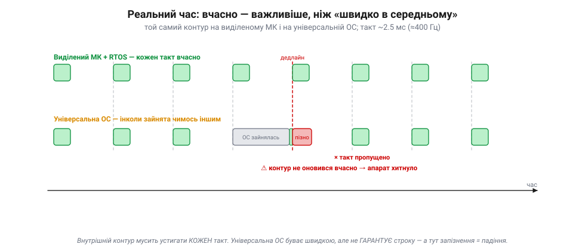
*Рис. 43.2.1. Той самий контур, два «мозки». На виділеному МК такти йдуть рівно, кожен укладається у свої 2.5 мс. На універсальній ОС більшість тактів теж устигає — але варто планувальнику відволіктися, і один такт перескакує дедлайн. У відеоплеєрі це непомітне підвисання; у польоті — апарат хитнуло, бо контур не оновився вчасно.*

Чому універсальна ОС узагалі дозволяє собі такі паузи? Бо її будували для **справедливості й пропускної здатності**, а не для строків: планувальник чесно ділить процесор між десятками задач, перемикає їх, обробляє переривання від мережі й диска, підвантажує сторінки пам'яті. Кожна з цих дрібниць корисна — і кожна може на мить «вкрасти» процесор у твого контуру. Інженер реального часу мислить не середнім, а **найгіршим** часом виконання (*worst-case execution time*): питання не «як швидко зазвичай», а «який найбільший час відгуку я можу **гарантувати**». Виділений контролер на те й виділений, щоб цю гарантію взагалі можна було дати.

Розрізняють **жорсткий** і **м'який** реальний час (*hard / soft real-time*). Пропустити строк внутрішнього контуру — **жорсткий**: наслідок катастрофічний, апарат падає. Спізнитися з пакетом телеметрії — **м'який**: прикро, але не смертельно. Виділений контролер існує саме заради **жорсткої** частини: він робить мало, але робить це з гарантією за часом.

> 🔧 **Навіщо це.** Коли побачиш у даташиті чи описі автопілота слова *real-time*, *RTOS*, *deterministic*, *jitter*, *loop rate 400 Hz* — це не маркетинг, а обіцянка **строків**. І це пояснює, чому контур керування не варто вішати на завантажену універсальну ОС: вона швидка, але непередбачувана, а керуванню потрібна саме передбачуваність.

#### Коли «майже вчасно» ледь не згубило місію

У 1997 році на Марс сів апарат **Mars Pathfinder** із ровером Sojourner. За кілька днів його бортовий комп'ютер почав раз по раз **сам себе перезавантажувати**, втрачаючи дані. Причина виявилася підступною: **інверсія пріоритетів** (*priority inversion*) у системі реального часу. Високопріоритетна задача керування шиною даних чекала на ресурс, зайнятий низькопріоритетною задачею; а та ніяк не могла його звільнити, бо її саму витісняла задача середнього пріоритету. Високопріоритетна задача не вкладалась у строк — і **watchdog** (про нього нижче), помітивши це, перезапускав усю систему.

Інженери відтворили збій на земній копії, поставили діагноз і **дистанційно** залили виправлення — увімкнули «успадкування пріоритету» на тому ресурсі. Мораль подвійна. По-перше, реальний час — це про **строки**, і навіть на ідеальному залізі тонка взаємодія задач може їх зірвати. По-друге — апарат **вижив** лише тому, що watchdog зловив зависання й перезапустив систему в безпечний стан. Саме тому виділений контролер навмисно простий: що менше в ньому всього, то менше місць, де така інверсія може зачаїтися.

#### Watchdog: остання лінія оборони

А що, як код не просто спізнився, а **завис** зовсім — зациклився чи застряг у блокуванні? Тоді нема кому навіть помітити проблему. Рятує апаратний **сторожовий таймер** (*watchdog timer* — з Розділу 24): окремий лічильник у залізі, який контур керування мусить **скидати щотакту** («я живий»). Якщо контур перестав скидати таймер, той за визначений час добігає нуля й **апаратно перезавантажує** мікроконтролер — а той піднімається у заздалегідь безпечному стані.


*Рис. 43.2.5. Watchdog як «вимикач мертвої руки». Поки контур живий, він раз за разом скидає таймер, і той ніколи не доходить до нуля. Щойно контур завис і перестав «відмічатися» — таймер спрацьовує й перезапускає контролер. Це залізо, незалежне від коду, тож воно діє навіть тоді, коли сам код зламався.*

> 🔧 **Навіщо це.** Watchdog — причина, чому виділений контролер уміє **оговтатися** від власної помилки за частку секунди, а зависання застосунку на універсальній ОС може тривати скільки завгодно. Налаштовуючи чужий автопілот, не вимикай watchdog «щоб не заважав»: це буквально та страховка, що піднімає апарат після збою.

### Надійність: одна робота, зроблена без відволікань

Друга вимога — **надійність**. І тут головна перевага виділеної плати парадоксальна: вона в тому, що плата робить **мало**. Контролер, який лише читає давачі й крутить мотори, має **маленький, доступний для перевірки** код і небагато режимів збою. Універсальний же комп'ютер тягне цілу ОС, мережевий стек, драйвери, застосунки — і кожна з цих частин може зависнути, з'їсти всю пам'ять чи впасти. Ти ж не хочеш, щоб код «не дай впасти» ділив процесор із відеокодеком, який одної миті вирішить підвиснути.

Тому критичне керування **ізолюють**: виділений контролер не відволікається ні на що, окрім польоту. До цього додаються апаратні запобіжники — той самий watchdog, контроль просідання живлення (*brown-out detection*), скидання у відомий стан. А головне — **failsafe**: на кожну ймовірну біду в контролер **заздалегідь** зашито безпечну реакцію, яка спрацює навіть тоді, коли все інше відмовило.


*Рис. 43.2.2. Надійність — це не «нічого не ламається», а «коли ламається, поведінка передбачувана». Втрата RC-зв'язку, низький заряд, зникнення GNSS, вихід за дозволену зону — на кожне контролер має наперед визначену відповідь: утримання, повернення додому, посадка чи роззброєння. Рішення зашите заздалегідь, тож не потребує ні пілота, ні «розумного» комп'ютера в момент аварії.*

Зверни увагу: failsafe тому й працює, що він **простий і автономний**. Самій його логіці не треба ні зв'язку із землею, ні бортового комп'ютера — лише контролер, який і так крутиться. (Щоправда, яку саме **дію** він обере, залежить від наявних давачів: «повернутися додому» (RTL) потребує придатної оцінки позиції — а як GNSS не годен, безпечнішим вибором стає **посадка на місці**.) Якби ці реакції жили в застосунку на Linux, вони б відмовили рівно тоді, коли найпотрібніші, — разом із рештою системи.

Тут варто розрізняти два рівні відповіді на відмову. **Безпечна відмова** (*fail-safe*) — перейти у завідомо безпечний стан: зависнути на місці, сісти, повернутися додому. **Працездатна відмова** (*fail-operational*) — продовжити виконувати завдання навіть із вадою, спираючись на резерв. Простий апарат зазвичай тягне на fail-safe: щось пішло не так — акуратно сядь. Відповідальний — на fail-operational: відмовив давач, перемкнися на резервний і лети далі. Виділений контролер — основа обох: він і є тим простим ядром, якому можна довірити рішення «що робити, коли зламалося».

> 🔧 **Навіщо це.** Розбираючи чужий апарат, шукай, **де живе failsafe-логіка**. Якщо вона у виділеному контролері — система переживе зависання «розумної» частини. Якщо її повісили на бортовий комп'ютер чи мобільний застосунок — це червоний прапорець: у найгірший момент вона відмовить разом із ними.

### Резервування: пережити відмову, а не сподіватися на безвідмовність

Третя вимога — **резервування** (*redundancy*). Жодна деталь не безвідмовна, тож критичні дублюють: на серйозних платах ставлять **кілька IMU**, буває два барометри, кілька приймачів GNSS, подвійне живлення. Сенс не в точності, а в тому, щоб **відмова однієї деталі не стала відмовою системи**. Якщо один давач «збожеволів», контролер має це **помітити** й перемкнутися на справний. (На малюнку нижче це показано як просте «голосування» трьох IMU — зручна модель для інтуїції. Реальний ArduPilot робить тонше: веде кілька оцінювачів-**«ланів»** EKF на різних наборах давачів, дає кожному «бал помилки» за узгодженістю й перемикається на лан із найкращим балом — це *EKF lane switching*.)

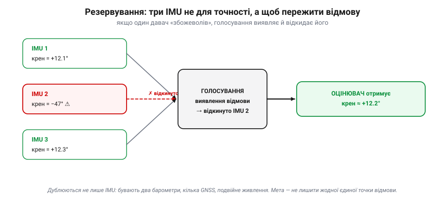
*Рис. 43.2.3. Три IMU не для краси. Коли один видає −47° замість реальних ~+12°, голосування виявляє «викид», відкидає його й передає оцінювачу узгоджене значення двох справних. Так апарат переживає відмову окремого давача замість того, щоб сліпо повірити брехливому й перекинутися.*

Таке перемикання називають **плавною деградацією** (*graceful degradation*): система не падає від першої відмови, а втрачає по трохи — спершу віддає резерв, а вже якщо біда не минула, переходить у failsafe. Добрий контролер ще й **повідомляє** у лог і на землю, який саме давач відмовив, щоб після польоту було ясно, що сталося, а не лишалася загадка.

Але резервування має пастку, про яку варто знати кожному, хто будує надійні системи. Просто **подвоїти** щось — мало, якщо обидві копії ламаються **однаково**.

#### Дві історії резервування: Ariane 5 і шатл

4 червня 1996 року перший політ європейської ракети **Ariane 5** (рейс 501) завершився вибухом приблизно на 37-й секунді. Причина — у блоці інерціальної навігації (*SRI*), чий код переносили зі старішої Ariane 4. Одне зі значень швидкості не вмістилося при перетворенні 64-бітного числа з комою у 16-бітне ціле — сталося **переповнення** (згадай Розділ 17). Блок аварійно зупинився й видав на шину діагностику, яку головний комп'ютер прийняв за дані польоту й різко відхилив сопла — ракету зламало аеродинамікою, спрацював самопідрив.

Найважливіше для нас: блоків SRI було **два**, резервних, — і обидва крутили **однаковий** код. Резервний відмовив тим самим переповненням за мілісекунди до основного. Це **спільна за причиною відмова** (*common-mode failure*): дублювання з ідентичним програмним забезпеченням **не рятує** від програмної вади, бо обидві копії падають однаково.

Для контрасту — космічний шатл. У ньому було **чотири** однакові керівні комп'ютери, що працювали як резервна група з голосуванням, **плюс п'ятий** — резервний, із **незалежно написаним** програмним забезпеченням. Логіка прямо протилежна Ariane: якщо в основному коді ховається спільна вада, її не повторить код, написаний іншою командою з нуля. Це **різнорідне** (диверсифіковане) резервування. Урок обох історій один: дублюй не лише залізо, а й **способи відмови** — інакше дві однакові копії впадуть в один і той самий момент.

> 🔧 **Навіщо це.** Побачивши на платі «аж три IMU», не думай, що це про точність, — це про **виживання за відмови**. І пам'ятай межу: резервування захищає від випадкових поломок заліза, але не від вади у спільному коді. Тому failsafe (проста, окремо написана логіка) і резервні давачі доповнюють одне одного.

### Чому саме ВИДІЛЕНА плата: складімо докупи

Три вимоги — реальний час, надійність, резервування — і ведуть до однієї відповіді: критичне керування заслуговує на **власний, навмисно простий** контролер, а не кутик на завантаженому універсальному комп'ютері.

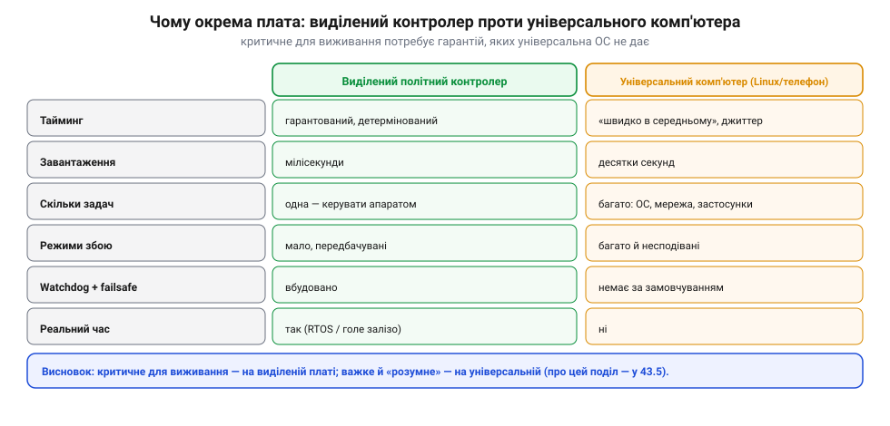
*Рис. 43.2.4. Чому не «просто на потужному комп'ютері». За кожною ознакою, що важить для виживання — гарантований тайминг, миттєве завантаження, мало режимів збою, вбудовані watchdog і failsafe, справжній реальний час — виграє виділена плата. Універсальний комп'ютер сильний в іншому: важкі, «розумні» задачі. Тому їх і розділяють.*

Зверни увагу: це **не** означає, що універсальний комп'ютер поганий — він чудовий там, де треба багато обчислень і гнучкості (обробка відео, бачення, планування). Просто це **інша** робота з іншими вимогами. Мудра архітектура не вибирає одне з двох, а **розділяє** ролі: виживання — виділеному контролеру реального часу, «розум» — потужному комп'ютеру. Саме цей поділ ми й розберемо наприкінці розділу.

> 🔧 **Навіщо це.** Це відповідь на питання теми одним рядком: виділений політний контролер існує тому, що **гарантії за часом, простота й резервування коштовніші за гігагерци**, коли на кону — не впасти. Універсальний комп'ютер додають **поряд**, а не **замість**.

### Підсумок теми

Виділений політний контролер потрібен через три вимоги, яких сама потужність не дає. **Реальний час**: внутрішній контур мусить устигати кожен такт із гарантією, а універсальна ОС цього не обіцяє; страхує watchdog. **Надійність**: проста плата з однією роботою має мало режимів збою й несе автономний failsafe, що спрацьовує навіть тоді, коли все інше відмовило. **Резервування**: критичні давачі дублюють і голосуванням відкидають відмовлені — пам'ятаючи, що проти спільної програмної вади допомагає лише різнорідність. Разом це й робить «мозок» апарата окремою, навмисно скромною платою.

Тепер, знаючи **навіщо** потрібен такий контролер, погляньмо **зсередини**: як влаштована зріла прошивка, що його оживляє, — на прикладі шарів ArduPilot.

---

## 43.3 Шари ArduPilot: драйвери/HAL, оцінювач, керування, навігація

У 43.1 ми накреслили автономний апарат як абстрактний контур, у 43.2 — пояснили, чому його віддають окремій платі. Тепер відкриймо **реальну** зрілу прошивку й подивімося, на що цей контур перетворюється в коді. За приклад візьмемо ArduPilot — не тому, що він єдиний, а тому, що він **відкритий** (пам'ятаєш GPLv3 з історії розділу?), тож його будову можна не уявляти, а **прочитати** рядок за рядком. І виявиться, що чотири абстрактні ланки стають **стосом шарів**, де кожен спирається лише на сусідній знизу. Саме ця пошарова будова — не примха, а те, що дає прошивці три суперсили: **переносність** (той самий код на десятках плат), **спільний код** (коптер, літак, ровер, субмарина — з однієї бази) і **тестовність** (повний політ можна прогнати на ПК).

За цим стоїть одна з найважливіших інженерних ідей — **розділення відповідальності** (*separation of concerns*). Кожен шар відповідає за щось одне й спілкується із сусідами через вузький, чітко окреслений **інтерфейс**, а не лізе всередину їхньої роботи. Вигода подвійна. По-перше, складність дробиться на шматки, які можна осягнути поодинці: щоб поправити драйвер давача, не треба розуміти навігацію. По-друге — і це закономірно для проєкту, що виріс зі спільноти (згадай історію розділу), — різні люди можуть **володіти різними шарами** й працювати паралельно, не наступаючи одне одному на ноги. Пошарова будова — це не лише про код, а й про те, як над ним працює велика команда.

### Шар за шаром: від заліза до місії


*Рис. 43.3.1. Прошивка автопілота — це шари. Унизу HAL ховає конкретну плату; над ним драйвери перетворюють давачі на калібровані виміри; вище оцінювач складає стан; ще вище керування рахує команди; над ним навігація вирішує, куди летіти; на вершині — код конкретного апарата з режимами. Збоку — наскрізні служби (планувальник, MAVLink, журнали, параметри), якими користуються всі шари.*

Пройдімо стос знизу вгору — і помітимо, що це той самий ланцюг із 43.1, лише розкладений на полиці:

- **HAL** (*Hardware Abstraction Layer*, `AP_HAL`) — фундамент. Він дає всім верхнім шарам **однакові** інтерфейси до заліза: послідовні порти, I2C, SPI, ніжки, виходи на мотори (`RCOut`), планувальник. Завдяки йому решта коду **не знає**, на якій саме платі біжить.
- **Драйвери давачів** (`AP_InertialSensor`, `AP_GPS`, `AP_Baro`, `AP_Compass`…) — сидять на шинах HAL і перетворюють сирі реєстри мікросхем на калібровані виміри. Це ланка «давачі» з 43.1; тут же живе обробка кількох екземплярів (резервування з 43.2).
- **Оцінювач стану** (`AP_AHRS` поверх фільтра `EKF3`) — фьюзить виміри в єдиний стан: орієнтацію, положення, швидкість. Це ланка «оцінювач».
- **Керування** (`AC_AttitudeControl`, `AC_PosControl`, `AC_PID`) — бере стан і уставку, рахує команди. Ланка «керування»; усередині — каскад контурів із 43.1.
- **Навігація й режими** (`AP_Mission`, `AC_WPNav`, режими `Stabilize`/`Loiter`/`Auto`/`RTL`) — вирішують, **куди** летіти, і задають уставку керуванню. Це джерело уставки з Рис. 43.1.4.
- **Код апарата** (`ArduCopter`, `ArduPlane`, `Rover`…) — вершина: головний цикл, мікшер виходів, специфіка саме цього типу апарата.

Збоку — **наскрізні служби**, якими користуються всі шари одразу: планувальник (`AP_Scheduler`, темпи задач), зв'язок із землею (`GCS_MAVLink`, Розділ 42), журнали (`AP_Logger`) і параметри (`AP_Param` — про них у 43.4). Ключове правило стосу: **кожен шар спирається лише на той, що під ним**. Тому будь-який шар можна **замінити**, не чіпаючи решти: інша плата — міняється HAL; інший давач — міняється драйвер; а оцінювач, керування й навігація лишаються ті самі.

Через цей стос дані течуть у **два** боки. **Вгору** піднімаються виміри, перетворюючись по дорозі на знання: драйвери віддають калібровані числа, оцінювач зводить їх у стан. **Вниз** спускаються наміри, перетворюючись на дію: навігація задає уставку, керування — команди, мікшер — напругу на моторах. А межа між будь-якими двома шарами — це **контракт**: верхній обіцяє звертатися лише через домовлений інтерфейс, нижній обіцяє цей інтерфейс чесно виконувати. Саме контракт, а не добра воля, робить заміну шару безпечною: поки новий драйвер тримає той самий інтерфейс, оцінювачу байдуже, який давач під ним.

### Той самий контур — тепер з іменами модулів

Щоб остаточно зв'язати нове зі знайомим, накладімо чотири ланки з 43.1 прямо на модулі ArduPilot:


*Рис. 43.3.2. Той самий замкнений контур, що й на Рис. 43.1.1, лише підписаний реальними бібліотеками. «Давачі» — це `AP_InertialSensor`/`AP_GPS`/…; «оцінювач» — `AP_AHRS`+`EKF3`; «керування» — `AC_AttitudeControl`/`AC_PosControl`; «виконання» — `AP_Motors`/`SRV_Channels`. Уставку згори дає навігація (`AP_Mission`, `AC_WPNav`).*

Це не нова система — це наша стара схема, у якій кожен блок нарешті має ім'я. Коли в чужому коді натрапиш на `AP_AHRS::get_roll()` чи `AC_AttitudeControl::input_euler_angle_roll_pitch_yaw()`, ти вже знаєш, **яку ланку контуру** читаєш, навіть не знаючи деталей.

У ArduPilot принцип «інтерфейс окремо, реалізація окремо» доведено до конкретного, упізнаваного взірця — поділу на **фронтенд і бекенд** (*frontend / backend*). Фронтенд — це стабільне «обличчя» модуля, з яким говорить решта коду (наприклад, `AP_GPS` чи `AP_InertialSensor`); бекенди — змінні реалізації під ним (драйвер під конкретний чип GNSS; драйвер під конкретну модель IMU). Решта стека звертається лише до фронтенду й не знає, який бекенд працює всередині. Цей поділ — заразом і відповідь на резервування з 43.2: фронтенд може тримати **кілька** бекендів одночасно (три IMU, два компаси) і перемикатися між ними при відмові. Тож побачивши в коді пару «`AP_Щось`» та «`AP_Щось_Backend`», знай: це той самий контракт-інтерфейс плюс його взаємозамінні втілення.

> 🔧 **Навіщо це.** Це і є вміння «читати чужі системи», заради якого писався курс. Назва модуля = його місце в контурі. Префікс `AP_` — спільна бібліотека ArduPilot; `AC_` — родом з ArduCopter; `EKF` — оцінювач; `Nav`/`WP` — навігація. Знаючи цей словник, ти орієнтуєшся в півмільйоні рядків коду, не читаючи їх усі.

### HAL: один код — десятки плат і навіть симулятор

Найнижчий шар вартий окремої розмови, бо саме він пояснює, як **одна** прошивка живе на стількох різних платах. HAL — це **контракт**: набір однакових інтерфейсів (порт, шина, ніжка, вихід на мотор, планувальник), які весь верхній код викликає, не питаючи, що під ними. А під ними — змінні **бекенди**:


*Рис. 43.3.3. Увесь політний код звертається до `AP_HAL`, а той уже говорить із конкретним залізом через бекенд: ChibiOS на платах STM32 (Pixhawk, Cube), Linux на одноплатниках, ESP32 — або **SITL**, бекенд-симулятор, що замість заліза підставляє змодельовану фізику. Той самий код, інший «низ».*

Найцікавіший бекенд — останній. **SITL** (*Software In The Loop*) дозволяє запустити **весь справжній політний код** звичайною програмою на комп'ютері: замість реальних давачів і моторів він під'єднує модель фізики апарата, а назовні говорить тим самим MAVLink, що й справжня плата. Навіщо? Бо колись тестувати зміну в автопілоті означало **ризикувати реальним апаратом** — баг коштував розбитого літака. SITL це перевернув: тепер можна «розбити» дрон тисячу разів за вечір, нічим не ризикуючи, а проєкт ще й ганяє автоматичний набір тестів (*autotest*), який на кожну зміну коду **пролітає змодельовані місії** й перевіряє, що нічого не зламалося. Це стало можливим саме завдяки HAL: симулятор — то лише ще один «низ» під незмінним верхом.

Звісно, абстракція не безплатна: HAL — це тонкий шар перенаправлення, який коштує крихту швидкодії й зусиль на підтримку кількох бекендів. Але ціна мізерна проти виграшу, а поява HAL — пряме відлуння історії розділу: коли 8-бітні плати вперлися в стелю й код довелося переносити на 32-бітні ARM, стало ясно, що прив'язувати логіку до конкретного заліза — глухий кут. HAL і народився як стіна між «що робити» та «на чому це бігає».

> 🔧 **Навіщо це.** Якщо колись писатимеш чи правитимеш прошивку — спершу жени її в SITL, а не на живому апараті. А читаючи чужий стек, шукай шар HAL: він підкаже, на яких платах код працює й чи можна його запустити в симуляції. Переносність — ознака зрілої архітектури.

### Планувальник: хто й коли біжить

Пам'ятаєш вкладені контури з різними темпами (Рис. 43.1.3) і вимогу реального часу (43.2)? У коді вони стають **таблицею планувальника**: список задач, кожна зі своєю частотою, які `AP_Scheduler` запускає за пріоритетом.

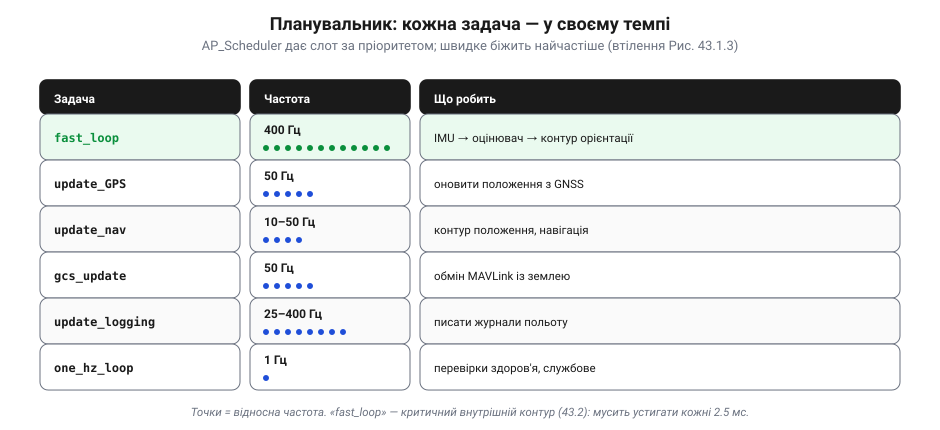
*Рис. 43.3.4. Планувальник дає кожній задачі слот за її темпом. Критичний `fast_loop` (читання IMU, оцінювач, контур орієнтації) біжить найчастіше; навігація й обмін із землею — повільніше; службові перевірки — раз на секунду. Точки в колонці частоти показують відносну густину запусків.*

Як планувальник «дає слоти» — проста арифметика від головного циклу:

```
головний цикл (коптер):   400 Гц   → кожні 2.5 мс
fast_loop:                щоцикл                 (400 / 400 = 1)
update_GPS @ 50 Гц:       кожен 8-й цикл         (400 / 50  = 8)
update_nav @ ~10 Гц:      кожен 40-й цикл        (400 / 10  = 40)
one_hz_loop @ 1 Гц:       кожен 400-й цикл       (400 / 1   = 400)
```

Швидке біжить щотакту, повільне — раз на багато тактів. Планувальник ще й стежить, щоб задачі **вкладалися** у свій час: якщо в циклі лишається замало, він відкладе менш термінову задачу, щоб насамперед устиг `fast_loop`. (Та сам планувальник процесорного часу не «домальовує»: він радше **розподіляє** наявний і **вимірює**, чи його вистачає, — а за справжнього перевантаження CPU і `fast_loop` може спізнитися. Тобто це інструмент, а не залізна гарантія реального часу сама по собі.) Так абстрактна «ієрархія темпів» перетворюється на конкретний, перевірений за часом розклад.

А що, коли процесора на все не вистачає — задач забагато, цикл не встигає? Тут і виявляється цінність планувальника: він знає **пріоритети**. Найкритичніше — `fast_loop` зі стабілізацією — він проганяє **першочергово**, а менш термінові задачі (журнали, рідкісні перевірки) за потреби трохи відкладе чи розмаже на кілька циклів. Це прямий відголос 43.2: коли ресурсу бракує, система жертвує не виживанням, а зручністю. Тому, до речі, перевантажений автопілот спершу «глухне» до телеметрії й журналів, а вже потім, якщо зовсім зле, торкається важливішого — і саме **порядок цих жертв** підказує, де шукати проблему.

> 🔧 **Навіщо це.** Натрапивши в чужій прошивці на «scheduler table» чи «loop rate», ти тепер бачиш у ній не магію, а розклад вкладених контурів. А якщо апарат «гальмує» чи перевантажений — дивись саме сюди: яка задача не вкладається у свій слот.

### Де що шукати у вихідниках

Нарешті — практична карта. Усі імена з фігур вище — це **реальні теки** в дереві ArduPilot, і знаючи їх, чужий код перестає лякати:


*Рис. 43.3.5. Куди дивитися. Теки апаратів (`ArduCopter`, `ArduPlane`…) — це верхній шар; уся решта живе в `libraries/`, згрупована за роллю в контурі: `AP_HAL*` — залізо, `AP_InertialSensor`/`AP_GPS` — драйвери, `AP_AHRS`/`AP_NavEKF3` — оцінювач, `AC_AttitudeControl`/`AC_WPNav` — керування й навігація, `GCS_MAVLink`/`AP_Logger`/`AP_Param` — наскрізні служби. У `Tools/` — SITL і автотести.*

Тут видно й чому стільки бібліотек з префіксами: `AP_*` — спільне ядро, яким користуються всі апарати; `AC_*` — те, що народилося в ArduCopter. Відкривши незнайому гілку коду, за префіксом і текою одразу скажеш, яку ланку контуру вона реалізує, — і це найшвидший спосіб зорієнтуватися у великому чужому проєкті.

Варто наголосити: ця конкретна розкладка — ArduPilot'ова, але сам **принцип** універсальний. Відкрий PX4, політний стек дрона іншого виробника чи будь-яку зрілу embedded-систему — і знайдеш ту саму трійцю: тонкий шар над залізом, посередині логіку, що нічого не знає про конкретні мікросхеми, і збоку служби зв'язку та журналювання. Назви тек будуть інші, а форма — та сама. Тому, навчившись читати один такий стек пошарово, ти, по суті, навчився читати їх усі.

> 🔧 **Навіщо це.** Ця карта — твій компас у будь-якому великому embedded-проєкті, не лише в ArduPilot. Зрілі системи майже завжди розкладені пошарово: шукай «де HAL/драйвери», «де логіка», «де зв'язок» — і незнайомий код складеться в знайому картину.

### Підсумок теми

Зріла прошивка автопілота — це **шари**: HAL ховає плату, драйвери дають калібровані виміри, оцінювач складає стан, керування рахує команди, навігація задає уставку, а код апарата зводить усе докупи; збоку — наскрізні служби (планувальник, MAVLink, журнали, параметри). Це не нова конструкція, а **той самий контур із 43.1**, розкладений на полиці так, щоб кожен шар спирався лише на сусідній знизу — звідси переносність (HAL і SITL), спільний код для багатьох апаратів і можливість усе протестувати. А найпрактичніше — імена цих шарів є реальними теками, тож архітектура стає **картою для читання** чужого коду. І це окупається щоразу, коли відкриваєш незнайомий апарат: замість суцільної стіни коду бачиш знайомі полиці й одразу знаєш, з якої знімати потрібне.

Ми побачили, **з чого** складається стек і **як** він розкладений. Лишилося питання: як цим усім **керувати ззовні** — налаштовувати поведінку, не переписуючи код, і дивитися на апарат із землі. Це — параметри й наземна станція, до яких переходимо далі.

---

## 43.4 Параметри й конфігурація; наземна станція

Прошивка з 43.3 — зріла й потужна, але сама по собі вона ще не знає, **яким саме** апаратом керує: скільки в нього моторів, як круто йому дозволено нахилятися, за якої напруги вертатися додому. І жоден розробник не сидить поруч, щоб це «дописати в код». Усе це задає **оператор** — людина, що збирає й готує апарат, — двома засобами, які ми тут і розберемо: **параметрами** (налаштовними «крутилками» поведінки) і **наземною станцією** (програмою-пультом, якою ці крутилки крутять і за апаратом стежать). Це погляд на архітектуру **збоку оператора**: як скерувати автономну систему, не торкаючись її коду.

### Параметри: одна прошивка — безліч апаратів

Почнімо із загадки. Той самий завантажений у плату образ прошивки однаково добре літає на крихітному квадрокоптері й на великому гексакоптері. Як це можливо, якщо код **той самий**? Відповідь — **параметри**: сотні (а в зрілому стеку — понад тисячу) іменованих величин, що зберігаються в плати й налаштовують її поведінку, **не чіпаючи коду**.

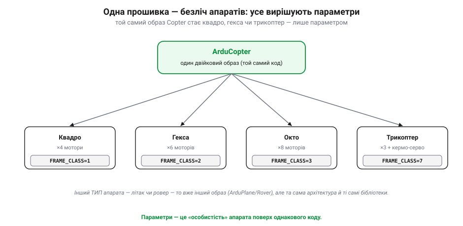
*Рис. 43.4.1. Той самий двійковий образ Copter стає квадрокоптером, гексою чи октокоптером — залежно лише від параметра `FRAME_CLASS`. Код описує **всі** ці можливості; параметр обирає, якою з них стати цьому апарату. (А от **традиційний гелікоптер** — то вже **окрема** прошивка з суфіксом `-heli`, бо керування там геть інше; так само літак чи ровер — окремі образи на тій самій архітектурі й тих самих бібліотеках.)*

У цьому й суть: **код задає, ЩО апарат уміє в принципі; параметри — ЯК саме цей екземпляр має поводитися**. Завдяки цьому одну прошивку можна випустити раз, а налаштувати — нескінченно: змінити поведінку можна за секунди, просто записавши інше число, без перекомпіляції й перепрошивки. Параметри — це «особистість», яку вдягають поверх однакового «мозку».

Варто оцінити, наскільки це тиха революція. У ранніх автопілотах змінити поведінку означало **переписати й перезібрати** код — а отже, вміти програмувати й мати тулчейн. Винесення поведінки в параметри відв'язало **налаштування** від **розробки**: тепер апарат готує той, хто його збирає, не торкаючись жодного рядка коду, а зміни пробує наживо, крутячи числа й одразу бачачи результат. Саме це зробило складні автопілоти доступними не лише інженерам, а й тисячам аматорів (згадай дух DIY Drones з історії розділу). Зворотний бік — параметрів стало так багато, що в них легко загубитися: зрілий стек має їх понад тисячу.

### Будова параметра: ім'я, значення, пам'ять

Параметр — це пара «ім'я + значення», і ім'я не випадкове: воно **кодує сенс** за чіткою схемою груп.

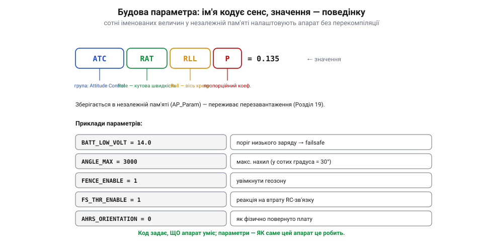
*Рис. 43.4.2. Ім'я параметра читається зліва направо як адреса: `ATC` — група керування орієнтацією, `RAT` — контур кутової швидкості, `RLL` — вісь крену, `P` — пропорційний коефіцієнт. Тобто `ATC_RAT_RLL_P` — це P-коефіцієнт того самого ПІД із Розділу 34, тільки для швидкісного контуру крену. Значення живе в незалежній пам'яті й переживає перезавантаження.*

Значення зберігається в **незалежній (енергонезалежній) пам'яті** плати (за це відповідає `AP_Param`) — тій, що не стирається при вимкненні живлення (згадай Flash проти RAM із Розділу 19). Тому налаштування переживає перезавантаження: записав раз — лишається назавжди, поки не зміниш. Подивімося на фрагмент справжнього файлу параметрів — саме так їх зберігають, передають і порівнюють:

```
# фрагмент файлу параметрів (.param)
FRAME_CLASS,1          # квадрокоптер
ANGLE_MAX,3000         # макс. нахил = 30.00°  (у СОТИХ градуса!)
BATT_LOW_VOLT,14.0     # поріг низького заряду → failsafe
FS_THR_ENABLE,1        # увімкнути failsafe на втрату RC
ATC_RAT_RLL_P,0.135    # P-коеф. контуру крену (тюнінг із Розділу 34)
```

Зверни увагу на `ANGLE_MAX,3000`: це **не** 3000 градусів, а 30.00° — багато кутових параметрів задають у **сотих частках градуса** (сентиградусах), щоб не тягати дробові числа. Така «пастка одиниць» — типове джерело помилок: те саме число може означати градуси, сентиградуси, метри чи сантиметри залежно від параметра.

Звідки ж беруться правильні значення? Частину дає сам стек — у кожного типу апарата є розумні **типові** налаштування. Частину підбирають автоматично — є режими авто-тюнінгу, що самі гойдають апарат у повітрі й шукають коефіцієнти. Решту спільнота **ділить** файлами `.param` для популярних збірок. Але тут чигає й пастка: сліпо залити чужий набір — означає перенести чужі коефіцієнти на свій, інакший апарат, і легко дістати нестабільність. Параметри переносні рівно настільки, наскільки схожі апарати.

> 🔧 **Навіщо це.** Параметри — це водночас і сила, і **небезпека**. Одне неправильне число (хибний `FRAME_CLASS`, завищений коефіцієнт, переплутані одиниці) здатне покласти апарат одразу після зльоту. Тому досвідчені оператори тримають апарат у файлі `.param`, звіряють зміни й знають, що означає кожен рядок. Уміння **прочитати чужий набір параметрів** — пряме продовження вміння читати код: за іменами видно, як налаштовано чужу систему.

### Наземна станція: кокпіт оператора на землі

Хтось же має ці параметри **бачити й записувати**, планувати маршрут і стежити за апаратом у польоті. Це робить **наземна станція** (*ground control station*, GCS) — програма на ноутбуці чи планшеті: в екосистемі ArduPilot це передусім **Mission Planner** (давнє творіння Майкла Оборна, *Michael Oborne*) і кросплатформна **QGroundControl**. Ці дві станції — спадок двох ліній з історії розділу: Mission Planner виросла навколо ArduPilot у світі Windows, QGroundControl — кросплатформна й спільна з PX4. На щастя, обидві говорять тим самим MAVLink, тож почасти взаємозамінні: апарат на ArduPilot можна готувати й тією, й іншою. Для оператора це вибір зручнішого інструмента, а не прив'язка до одного.

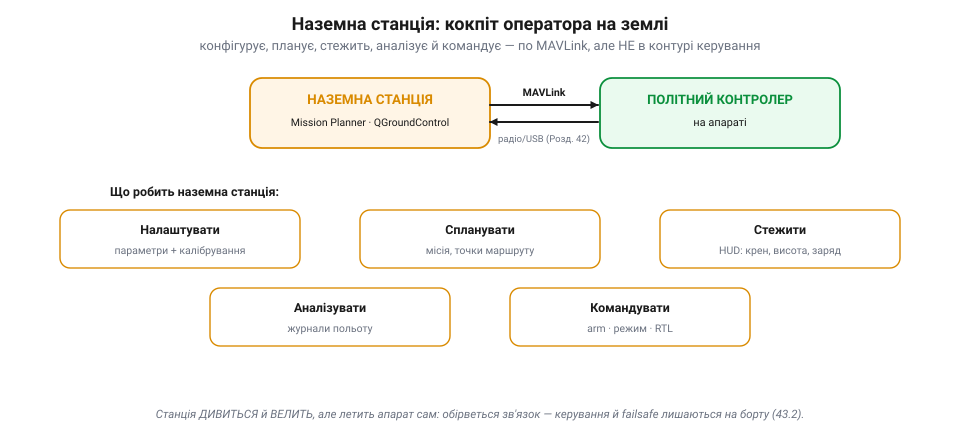
*Рис. 43.4.3. П'ять ролей наземної станції. Вона **налаштовує** (параметри й калібрування), **планує** (місію з точок), **стежить** (живий HUD: крен, висота, заряд), **аналізує** (журнали польоту) і **командує** (зброїти, змінити режим, наказати повернутися). З політним контролером вона говорить по MAVLink (Розділ 42) — через радіо чи USB.*

Зверни увагу: усі п'ять ролей — це **взаємодія з уже готовою** системою, а не керування нею вручну. Станція не «крутить мотори» — вона читає й пише параметри, вантажить місію, показує телеметрію й передає високорівневі команди. Спілкування йде тим самим протоколом MAVLink, що ми розбирали в Розділі 42: компактні пакети «heartbeat», запити параметрів, потоки телеметрії, команди — по тонкому радіоканалу між землею й бортом.

Найбільше часу оператор проводить у режимі **стеження**. На головному екрані станції — штучний горизонт (HUD), що показує крен і тангаж у реальному часі, поряд — висота, швидкість, заряд, кількість спійманих супутників, «здоров'я» оцінювача. А перед зльотом станція проганяє **передпольотні перевірки**: чи зловила GNSS, чи відкалібровані давачі, чи розумний рівень вібрації, чи не конфліктують параметри. Якщо щось не так — апарат просто не дасть себе «зброїти». Це теж частина надійності з 43.2: останній бар'єр перед польотом — людина з повною картиною стану перед очима.

> 🔧 **Навіщо це.** Наземна станція — це перше, що ти відкриєш, узявши незнайомий апарат: через неї видно **весь** його стан — параметри, давачі, режими, журнали. Навчившись читати її екрани (HUD, список параметрів, перегляд логів), ти «бачиш» чужу систему наскрізь, навіть не маючи її схеми.

### Місія як послідовність точок

Найвиразніша з ролей станції — **планування місії**. Автономний маршрут — це впорядкований список **точок** (*waypoints*) із діями: злетіти, пролетіти сюди, покружляти там, повернутися, сісти.

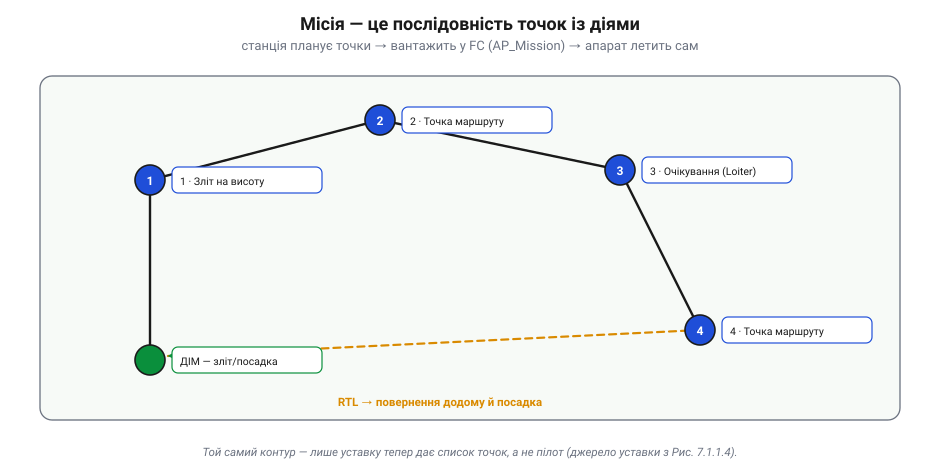
*Рис. 43.4.4. Місія — це послідовність точок із прив'язаними діями. Станція складає її на карті, вантажить у контролер (`AP_Mission`), і далі апарат проходить точку за точкою **сам**. Це і є те «джерело уставки» з Рис. 43.1.4: у режимі автономної місії бажаний стан задає не пілот, а цей список.*

Тут красиво змикається все попереднє. Місія живе в контролері (її зберігає `AP_Mission`), навігаційний шар (з 43.3) перетворює поточну точку на уставку, а керування відпрацьовує її тим самим контуром, що й завжди. Станція **спланувала й завантажила** — а летить апарат самостійно, навіть якщо зв'язок із землею зникне. Це ще раз підкреслює межу: станція готує й наглядає, борт виконує.

До того ж місія — це не лише точки «лети сюди». Між ними можна вплести дії й умови: змінити швидкість, зробити знімок чи скинути вантаж над точкою, покружляти задану кількість обертів, перескочити на іншу точку за умовою. А поверх усього лежить **геозона** (*geofence*) — невидима межа, за яку апарат не випустять. Усе це контролер виконує детерміновано, рядок за рядком, як невелику програму польоту. Тож «спланувати місію» — це, по суті, написати апарату сценарій, який він відіграє сам.

### Калібрування: від сирого давача до довіри

Перш ніж апарат комусь полетить, його давачі треба **калібрувати** — і це теж робить станція, майстрами-помічниками (*wizards*), а результат лягає в параметри. Чому це взагалі потрібно? Бо давач на платі живе не в ідеальному світі, а серед заліза, магнітів і струмів самого апарата.

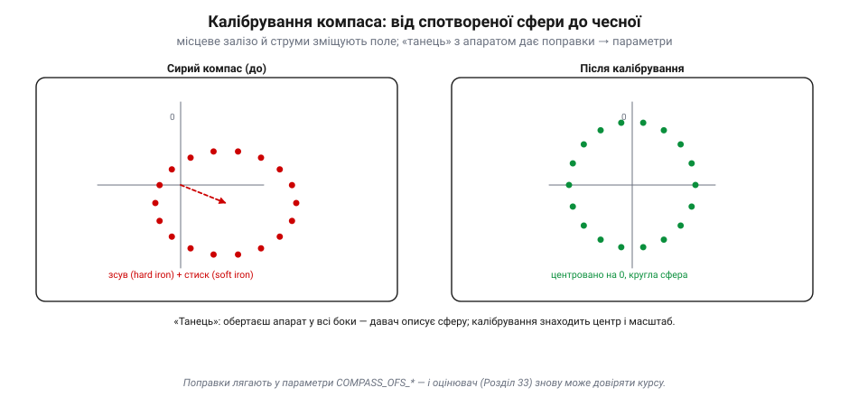
*Рис. 43.4.5. Чому компас «бреше» без калібрування. Магнітне поле, що його малюють сирі виміри, зміщене (постійні магніти й дроти — «hard iron») і стиснуте (феромагнітне залізо спотворює — «soft iron»), тож сфера вимірів не центрована на нулі. Калібрування знаходить зсув і масштаб, центрує сферу — і поправки лягають у параметри `COMPASS_OFS_*`.*

Звідси й знайомий кожному дрономайстру ритуал — **«танець» із компасом**: береш апарат і повертаєш його в усі боки (часто вісімками), поки давач не «опише» всю сферу напрямків. Виглядає по-дурному, але сенс глибокий: магнітне поле Землі слабке, а власні мотори, акумулятор і дроти апарата створюють поряд значно сильніші збурення (про фізику магнітометра — Розділ 33). Калібрування вимірює це спотворення саме **для цього** апарата й записує поправку. Без нього оцінювач отримав би хибний курс — і повів би апарат не туди. Так само калібрують «рівень» акселерометра й кінцівки RC-каналів: щоразу результат — це знову **параметри**, збережені в платі. Логіка скрізь та сама: реальний давач чи канал має свої відхилення, майстер у станції їх вимірює, а поправку зберігає числом. Калібрування рівня ловить те, що плату закріплено не ідеально горизонтально; калібрування RC запам'ятовує, які крайні положення дають саме твої стіки. Зробив це раз під час збирання — і далі система працює з чесними входами, не здогадуючись щоразу заново.

> 🔧 **Навіщо це.** Калібрування — місток між фізикою давача (Модуль 5) і готовою системою. Якщо чужий апарат «гуляє» курсом, тягне вбік чи дивно реагує на стіки — підозрюй насамперед калібрування й відповідні параметри (`COMPASS_OFS_*`, зсуви акселерометра, межі RC), а не «зламаний» код.

### GCS — не в контурі керування

Один момент варто проговорити окремо, бо його часто плутають. Наземна станція, хоч і всемогутня на вигляд, **не входить** у контур керування з 43.1. Швидкий внутрішній контур крутиться на борту з частотою в сотні герц; станція ж під'єднана тонким, повільним і **ненадійним** радіоканалом, який будь-якої миті може обірватися. Якби апарат залежав від станції, він би падав за кожної втрати зв'язку. Натомість усе критичне — оцінювання, керування, failsafe (з 43.2) — живе **на борту**, а станція лишається наглядачем і командиром високого рівня. Обірвався зв'язок — борт спокійно вмикає failsafe (повертається додому, а як надійної позиції нема — сідає на місці).

Уяви це конкретно. Апарат на середині автономної місії за кілометр від оператора; раптом радіоміст глухне — сіла батарея в наземному блоці, чи завада, чи просто задалеко. На екрані станції завмирає телеметрія, оператор втрачає картинку. Але апаратові байдуже: він і так летів сам, спираючись на бортовий оцінювач і список точок. Спрацьовує наперед заданий failsafe на втрату зв'язку — скажімо, «долети місію до кінця» або «вертайся додому» (а якщо для повернення бракує надійної позиції — безпечно сідає там, де є), — і апарат робить це без жодної допомоги ззовні. Станція потрібна, щоб **задати** поведінку наперед, а не щоб **тримати** апарат у повітрі щомиті.

> 🔧 **Навіщо це.** Це рятує від поширеної ілюзії, ніби «дрон летить із ноутбука». Ні: ноутбук лише дивиться й велить. Перевіряючи чужу систему на надійність, постав питання — що станеться, якщо вимкнути наземну станцію? Якщо відповідь «апарат впаде» — архітектуру побудовано неправильно.

### Підсумок теми

Оператор керує автономною системою **не через код**, а через дві речі. **Параметри** — сотні іменованих, збережених у платі величин, що роблять із однієї прошивки конкретний налаштований апарат; їхні імена кодують сенс, а помилка в них небезпечна. **Наземна станція** — програма-кокпіт на землі, що по MAVLink налаштовує, планує місії, стежить, аналізує журнали й командує, лишаючись при цьому **поза** контуром керування. А калібрування зшиває фізику давачів із готовою системою, складаючи результат знову ж у параметри. Разом це — людський інтерфейс до всієї архітектури: спосіб скерувати складну систему, не торкаючись її нутрощів.

Ми пройшли апарат зсередини (43.1), зрозуміли, чому в нього виділений «мозок» (43.2), розклали прошивку на шари (43.3) і навчилися керувати нею ззовні (43.4). Лишилося звести все докупи й відповісти на питання, яке вже кілька разів зринало: де проходить межа між «політним контролером» і «розумним» бортовим комп'ютером — і чому їх розділяють. Це й буде фінал розділу.

---

## 43.5 Поділ «політ vs розум»: політний контролер і бортовий комп'ютер (огляд)

У 43.2 ми зіткнулися з напругою: критичне керування потребує **виділеного, простого, реального** контролера, а складні задачі — **потужного, гнучкого** комп'ютера, і ці дві вимоги несумісні в одній машині. Тоді ми пообіцяли, що мудра архітектура не вибирає одне з двох. Час виконати обіцянку. Розв'язок простий і елегантний: поставити на борт **обидва** мозки й **поділити** їх за роллю. Це і є кульмінація всього розділу.

Звучить майже банально — «розклади роботу між двома комп'ютерами», — але вся сіль у тому, **як** саме розділити й де провести межу. Проведеш її не там — або втратиш реальний час (і апарат впаде), або переплатиш складністю там, де вистачило б одного контролера. Тож розгляньмо цей поділ уважно.

### Два мозки, дві ролі

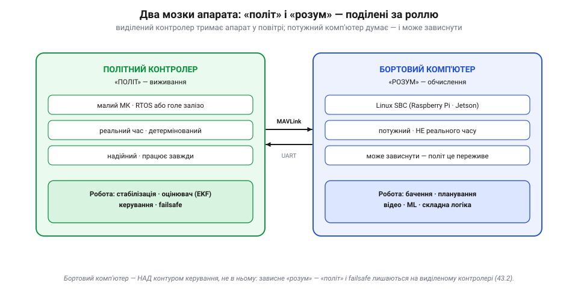
*Рис. 43.5.1. Поділ праці між двома машинами. Зліва — **політний контролер**: малий МК реального часу, що тримає апарат у повітрі (стабілізація, оцінювач, керування, failsafe). Справа — **бортовий комп'ютер** (*companion computer*): потужний Linux-одноплатник (Raspberry Pi, NVIDIA Jetson), що думає (бачення, планування, відео, ML) — і якому **дозволено** зависнути. З'єднані вони тонким каналом MAVLink по UART.*

Назвемо їх по-простому: **«політ»** і **«розум»**. «Політ» — це виживання: він має бути швидким, передбачуваним і надійним, тому живе на виділеному контролері (усе з 43.2). «Розум» — це кмітливість: розпізнати ціль, прокласти маршрут, стиснути відео, виконати нейромережу. Ці задачі **важкі** обчислювально, але — ключове — **не миттєві**: якщо розпізнавання цілі спізниться на 50 мс, нічого страшного; а якщо на 50 мс спізниться стабілізація, апарат може помітно хитнути чи й зірватися зі стабілізації (наскільки фатально — залежить від апарата, режиму й запасу стійкості). Тому «розум» можна спокійно довірити потужній, але не реального часу машині, яка часом і підвисне.

Бортовий комп'ютер з'явився на аматорських апаратах тоді, коли подешевшали Linux-одноплатники: щойно Raspberry Pi й подібні стали доступними, спільнота почала «приклеювати» їх до польотних контролерів, щоб додати апаратам зір і автономність — не чіпаючи перевіреного «польотного» ядра.

А чому не зробити навпаки — узяти один потужний комп'ютер і змусити його ще й стабілізувати апарат, скажімо, з «латкою реального часу» для Linux? Інколи так і роблять, але це боротьба з природою системи. Між двома задачами — глибока **несумісність**: контур стабілізації хоче крихітних, але **залізно вчасних** порцій роботи сотні разів на секунду, а бачення чи планування хочуть **великих** обчислень, які тривають довго й непередбачувано. Запхати їх в одну машину — означає, що важка задача рано чи пізно «вкраде» процесор у критичної (згадай джиттер із 43.2). Простіше, дешевше й **безпечніше** дати кожній своє залізо, ніж героїчно мирити їх в одному. Поділ — не милиця, а правильна відповідь на різну природу задач.

### Що де живе

Якщо тримати в голові поділ «виживання проти кмітливості», розкласти задачі по двох машинах легко:

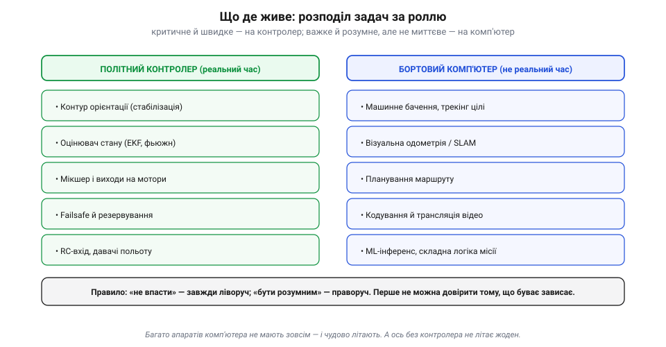
*Рис. 43.5.2. Хто за що відповідає. На контролері — усе, що критичне для виживання й мусить бути швидким: контур орієнтації, оцінювач стану, мікшер моторів, failsafe, RC. На комп'ютері — усе важке й розумне, але не миттєве: машинне бачення й трекінг, візуальна одометрія, планування, відео, ML-інференс. Без комп'ютера апарат літає; без контролера — ні.*

Останнє варто підкреслити: **дуже багато апаратів узагалі не мають бортового комп'ютера** — і чудово літають, бо все потрібне для польоту живе в контролері. Комп'ютер додають лише тоді, коли потрібна **автономна кмітливість**: летіти за рухомою ціллю, обходити перешкоди по камері, ухвалювати рішення на основі того, що апарат «бачить». «Розум» — це розкіш поверх «польоту», а не його заміна.

Розкіш має ціну, і чесний інженер її зважує. Бортовий комп'ютер — це додаткова вага й габарити, помітне споживання енергії (а отже, коротший політ), тепло, яке треба відводити, і — головне — **більша поверхня відмов**: ще одна машина, ще один кабель, ще один протокол, що можуть підвести. Тому комп'ютер ставлять не «про всяк випадок», а коли його кмітливість справді потрібна. Якщо задачу розв'язує сам контролер режимами й місією — зайвий мозок лише обтяжує апарат і вкорочує політ.

Між «явно політ» і «явно розум» є й сіра зона. Просте обминання перешкоди по далекоміру цілком уміщається в контролер; складне — по камері з побудовою карти — вже ні. Точну посадку по мітці інколи роблять на контролері, інколи на комп'ютері. Правило для сірої зони те саме, що й завжди: спитай, **чи критична задача для виживання й чи мусить бути миттєвою**. Так — тягни її ліворуч, до надійного ядра, навіть ціною простоти. Ні — хай живе праворуч, де є обчислювальна воля.

> 🔧 **Навіщо це.** Беручи до рук незнайому систему, спершу з'ясуй, **скільки в ній мозків**. Один (лише контролер) — апарат робить те, що зашито в режимах і місії. Два (контролер + комп'ютер) — шукай, що саме «розум» додає й по якому каналу він командує «польотом». Це одразу окреслює можливості й слабкі місця апарата.

### Як «розум» керує «політом»

Якщо комп'ютер не в контурі керування, то як він взагалі впливає на політ? **Високорівневими уставками**. Контролер має спеціальний режим (в ArduPilot — *Guided*, у PX4 — *Offboard*), у якому він приймає команди ззовні: «лети до точки X», «тримай таку швидкість», «дивись на ціль отут». Комп'ютер рахує **що** робити (скажімо, бачить ціль на кадрі й переводить «піксель → напрям»), а **як** це виконати — стабілізувати, відмішати на мотори — лишається контролеру.

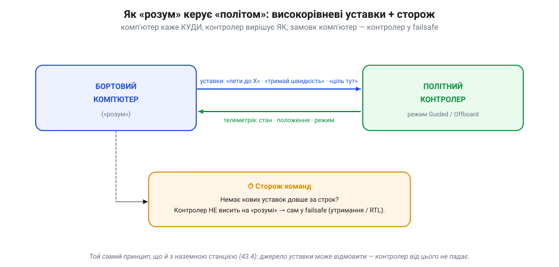
*Рис. 43.5.3. Діалог двох мозків. Комп'ютер шле вниз високорівневі уставки (по MAVLink, часто через `pymavlink` з Розділу 42), контролер відповідає телеметрією. Але — критично — контролер **не висить** на комп'ютері. У **PX4** режим *Offboard* прямо вимагає безперервного потоку уставок (>2 Гц): пропав потік на заданий строк — і контролер виходить з режиму в failsafe. В **ArduPilot** *Guided* — м'якше й залежно від типу команди: разову ціль «лети в точку» апарат доводить до кінця, а безперервні уставки (швидкість/кут) мають таймаут, по якому він вертається до попередньої команди. Спільне одне: **джерело уставки має право відмовити**, і політ це переживе.*

Це той самий запобіжник, що ми бачили з наземною станцією (43.4), лише тепер для бортового «розуму»: **джерело уставки має право відмовити**. Комп'ютер може зависнути, перегрітися чи захлинутися обчисленнями — і саме тому контролер ставиться до його команд як до **порад згори**, а не до життєво необхідного входу. Замовк «розум» — «політ» спокійно бере керування на себе.

Фізично цей місток зазвичай простий: послідовний порт (UART) між комп'ютером і контролером, по якому йде той самий MAVLink, що й до наземної станції. На стороні комп'ютера з ним працюють через готові бібліотеки — `pymavlink` (з Розділу 42), MAVSDK чи через ROS, — тож «розум» пише команди кількома рядками, а не б'ється з протоколом вручну. Іноді комп'ютер ще й **ретранслює** потік далі на землю, тобто водночас служить мостом між контролером і наземною станцією. Але хоч би скільки ролей він брав, у контур керування він так і не входить.

**Приклад (апарат, що сам летить за ціллю).** Бортовий комп'ютер бачить ціль на відеокадрі й хоче, щоб апарат тримався над нею. Потік виглядає так:

```
1. камера → кадр → комп'ютер («розум»)
2. нейромережа знаходить ціль:        піксель (320, 210)
3. «піксель → напрям»:                ціль на 4° праворуч від центру
4. комп'ютер шле уставку по MAVLink:  «змісти позицію праворуч»  (кілька разів за секунду)
5. контролер (режим Guided) приймає → контур керування веде апарат туди
6. ціль зрушила — крок 1 повторюється; апарат «висить» над ціллю
   ── камера осліпла чи комп'ютер завис → уставки спинились
      → сторож контролера спрацював → утримання / RTL (апарат НЕ падає)
```

Уся «кмітливість» (кроки 1–3) — на комп'ютері; уся «фізика польоту» (крок 5) — на контролері; а крок 4 — це тонкий місток MAVLink між ними. Прибери комп'ютер — апарат просто не вмітиме стежити за ціллю, але літати й сідати безпечно не розучиться.

І знову виручає стандартний інтерфейс. Оскільки два мозки зустрічаються на **документованому** протоколі (MAVLink), їх можна міняти незалежно: переставити «розум» з простого одноплатника на потужніший, не чіпаючи контролера; або замінити сам контролер, не переписуючи код комп'ютера. Це той самий «контракт між шарами» з 43.3, лише тепер між двома фізичними машинами. Відкритий протокол — ось що дозволяє збирати апарат із частин різних виробників, наче конструктор, і саме тому MAVLink (Розділ 42) виявився такою важливою цеглинкою всієї екосистеми.

> 🔧 **Навіщо це.** Це золоте правило безпечної інтеграції: ніколи не клади виживання в залежність від машини, що може зависнути. Якщо бачиш систему, де зупинка бортового комп'ютера роняє апарат, — архітектуру побудовано небезпечно. Правильно — коли «розум» лише **підказує**, а останнє слово (і failsafe) завжди за «польотом».

### Companion — не наземна станція

Варто розвести два схожі поняття, які легко сплутати. І наземна станція (43.4), і бортовий комп'ютер сидять **над** контуром керування й шлють контролеру високорівневі команди по MAVLink. Але різниця принципова: **наземна станція — на землі, керована людиною**; **бортовий комп'ютер — на апараті, автономний**. Станція — це очі й руки оператора; комп'ютер — це самостійний розум, що ухвалює рішення в польоті без людини. Перша робить апарат **керованим** із землі, другий — **автономно кмітливим** у повітрі. А контролер для обох — той самий надійний виконавець унизу.

Часто вони працюють разом. Оператор із наземної станції лише **запускає** автономну задачу («почни обліт» чи «знайди й супроводжуй»), далі бортовий комп'ютер веде її сам, а станція тим часом просто показує, що відбувається. Людина задає **намір** згори, комп'ютер перетворює його на потік уставок, контролер — на політ. Виходить три рівні, кожен повільніший і «розумніший» за нижній, — і знову той самий принцип вкладених контурів із 43.1, тільки розгорнутий аж до людини на землі.

### Той самий патерн — усюди

Цей поділ — не примха дронів. Він повторюється скрізь, де машина має бути **і безпечною, і розумною**. У безпілотному автомобілі є швидкий контролер реального часу, що тримає гальма й кермо в межах безпеки, і окремий потужний комп'ютер, що розпізнає світ і планує шлях. У промисловому роботі — реальний контролер приводів і вищий «мозок» завдань. Скрізь — та сама пара: **швидке, просте, надійне ядро** плюс **повільний, складний, кмітливий верх**, з'єднані чітким інтерфейсом і захищені правилом «ядро переживає відмову верху». Зрозумівши цей патерн на прикладі апарата, ти впізнаватимеш його в десятках інших систем.

За цим стоїть і глибша причина, ніж просто продуктивність. Просте, незмінне «ядро» можна **ретельно перевірити** й навіть сертифікувати на безпеку — бо воно мале й робить одне. А «розумний» верх змінюється часто, тягне гори стороннього коду й моделей, які годі вичерпно перевірити. Відокремивши одне від одного, ми **локалізуємо ризик**: експериментуй із зором та ML скільки завгодно — найгірше, що буде при збої, — апарат увімкне failsafe. Тому поділ «політ vs розум» — це не лише про гігагерци, а про те, **де живе довіра**: критична, перевірена частина окремо від гнучкої, але непередбачуваної. Це й робить систему водночас і сміливою в можливостях, і консервативною в безпеці.

### Весь розділ в одній карті

Зведімо тепер усе, що ми пройшли, в один малюнок:

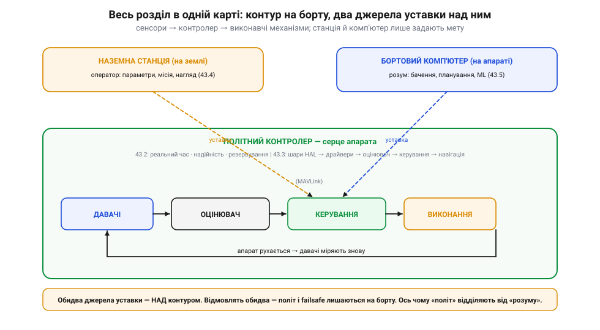
*Рис. 43.5.4. Архітектура автономного апарата цілком. У центрі — замкнений контур (43.1) на політному контролері (43.2), розкладеному на шари (43.3). Над ним — два джерела уставки: наземна станція (43.4) і бортовий комп'ютер (43.5), обидва по MAVLink. Жодне з них не в контурі: відмовлять обидва — апарат лишається керованим, а його failsafe спрацює за наявними давачами. Оце і є відповідь на питання «з чого складається автономний апарат».*

### Підсумок теми

Пройдімо подумки весь розділ. Автономний апарат — це **замкнений контур** «давачі → оцінювач → керування → виконання → апарат → знову давачі», де уставку дають ззовні (43.1). Цей контур мусить крутитися швидко й надійно, тому його віддають **виділеному контролеру** реального часу з watchdog, failsafe і резервуванням (43.2). Зсередини контролер — це **стос шарів** від HAL до навігації, той самий контур, розкладений на полиці заради переносності й тестовності (43.3). Налаштовують його **параметрами**, а спостерігають і командують із **наземної станції** по MAVLink, причому станція лишається поза контуром (43.4). А коли апарату потрібна автономна кмітливість, поряд із «польотом» ставлять «розум» — **бортовий комп'ютер**, що підказує згори, але не тримає апарат у повітрі (43.5).

Це — кістяк, спільний для будь-якої автономної системи. Усе подальше в цьому модулі нарощує на нього м'ясо: ми розберемо конкретні **компоненти** апарата, **живлення**, глибше — **оцінювання стану**, а далі — **зір** і **машинне навчання**, тобто те, чим саме займається «розум». Але хоч би яким складним ставав апарат, у його основі лишатиметься цей самий контур і цей самий поділ ролей.

І ще одне, заради чого все це писалося. Тепер, відкривши будь-який чужий апарат — від іграшкового коптера до серйозного безпілотника, — ти знаєш, **що в ньому шукати**: де замкнений контур, де його виділене ядро, як воно розкладене на шари, чим його налаштовують і хто над ним «думає». Складна автономна машина перестає бути суцільною загадкою й розкладається на знайомі, осмислені частини. Саме ця системна грамотність — а не запам'ятовані назви — і є справжній підсумок розділу: уміння **бачити архітектуру** крізь будь-яку конкретну реалізацію.

> ▶️ Далі: [Розділ 44 — Компоненти польотної системи](../ch44-flight-components/ch44-flight-components.md)
