# Розділ 7.3 — Компоненти польотної системи

У Розділі 7.1 ми зрозуміли **архітектуру** автономного апарата: замкнений контур, виділений політний контролер, шари прошивки, поділ «політ vs розум». Але архітектура — це план будинку; тепер час оглянути **самі цеглини**. Цей розділ — про фізичні компоненти польотної системи: **давачі**, якими апарат відчуває світ, і **виконавчі механізми**, якими він на світ діє. Ми не проєктуватимемо їх, а навчимося **впізнавати** на чужому апараті й розуміти роль кожного — від інерціального блока до регулятора обертів.

Почнемо з відчуття — бо керувати можна лише тим, що вмієш вимірювати. А завершимо рухом — моторами й кермами, якими апарат утілює рішення контролера в політ.

> 📜 Історія теми: [GPS — від військового проєкту до кожного дрона](ch44-history-gps.md). Вона показує на прикладі супутникової навігації, **скільки** науки й історії стоїть за одним маленьким бортовим давачем.

---

## 7.3.1 Давачі апарата оглядом

У контурі з Розділу 7.1 ланка «давачі» виглядала одним блоком. Насправді ж це не один прилад, а цілий **набір** різних давачів, кожен зі своєю фізикою, своїми сильними й слабкими сторонами. Перш ніж занурюватися в кожен окремо (далі в цьому розділі), складімо **карту**: хто що відчуває, навіщо їх стільки й за яким принципом вони доповнюють одне одного. Це і є погляд на «вхідний бік» апарата згори.

### Карта чуттів: хто що відчуває

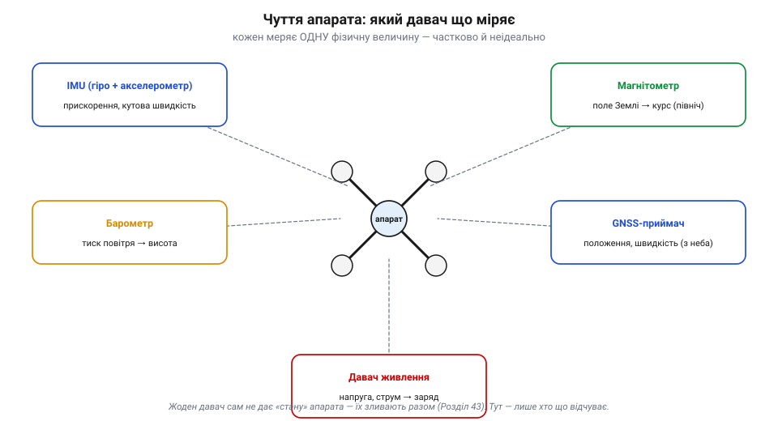
*Рис. 7.3.1.1. П'ять основних чуттів апарата. **IMU** (інерціальний блок) міряє прискорення й кутову швидкість; **магнітометр** — напрям магнітного поля Землі (курс); **барометр** — тиск повітря (висоту); **GNSS-приймач** — положення й швидкість із супутників; **давач живлення** — напругу й струм (заряд). Кожен відчуває **одну** грань реальності.*

Пройдімося набором — поки що оглядово:

- **IMU** (*inertial measurement unit*, інерціальний блок) — серце відчуття орієнтації. Усередині — **гіроскоп** (міряє кутову швидкість) і **акселерометр** (міряє прискорення, зокрема напрям тяжіння). Це найшвидший давач апарата; саме на ньому тримається стабілізація. Його фізику ми вже бачили в Розділі 5.7 (MEMS), а тут — як компонент.
- **Магнітометр** (*magnetometer*, електронний компас) — міряє напрям магнітного поля Землі й дає **абсолютний курс** (де північ). Він потрібен, бо сам по собі IMU не знає, куди апарат повернутий «по землі».
- **Барометр** (*barometer*) — міряє атмосферний тиск, який падає з висотою, і так дає **швидку оцінку висоти** (тиск нижчий — вище піднявся).
- **GNSS-приймач** — той самий герой історії цього розділу: дає **абсолютне положення** на Землі, а також грубу швидкість і висоту. Повільний і потребує неба, але незамінний для прив'язки до карти.
- **Давач живлення** (*power monitor*) — стоїть осторонь від навігації, але критичний: міряє напругу й струм акумулятора, рахує спожиту енергію й **вмикає failsafe**, коли заряд падає. Без нього апарат не знав би, що пора повертатися.

На серйозних апаратах до цього набору додають і вужчі давачі — **давач повітряної швидкості** (трубка Піто) для літаків, **далекомір** (лазерний чи ультразвуковий) для точної висоти над землею, **давач оптичного потоку** для оцінки швидкості над поверхнею. Але п'ятірка вище — це кістяк, який є майже завжди.

Кілька деталей, що варто знати наперед. IMU насправді **шестивісний**: три осі акселерометра й три гіроскопа на одному MEMS-чіпі — акселерометр відчуває і тяжіння, і рух, гіроскоп — обертання. Магнітометр міряє **дуже слабке** поле (земне — лише десятки мікротесла), тому його так легко «забити» місцевим залізом і струмами. Барометр сучасний роздільністю сягає сантиметрів висоти, хоч і пливе на метри за погодою. А ще давачі різняться **темпом**: IMU оновлюється сотні-тисячі разів на секунду — тому на ньому й тримається швидкий внутрішній контур (Розділ 7.1); барометр і магнітометр устигають десятки разів, а GNSS — лише кілька. Темп давача задає, який контур він здатний живити: швидке відчуття — для стабілізації, повільне — для навігації. Так сенсори природно лягають на вкладені контури з Рис. 7.1.1.3.

Варто згадати й **кількість**. Критичні давачі на серйозних апаратах дублюють — ставлять два-три IMU, кілька компасів (згадай резервування з 7.1.2). Оцінювач голосуванням відкидає той, що «збожеволів», і апарат переживає відмову окремого давача. Тож, рахуючи давачі на чужій платі, не дивуйся, побачивши «забагато» однакових: це не надмірність заради надмірності, а навмисна страховка, до якої ми повернемося наприкінці розділу (7.3.7).

Помітьмо й тонкість, що пронизує весь набір. Жоден давач не міряє того, що нам **насправді** потрібно. Нам треба «крен у градусах» — а гіроскоп дає кутову швидкість, акселерометр — напрям сили. Нам треба «висота над злетом» — а барометр дає тиск у паскалях. Нам треба «де я на карті» — а GNSS дає затримки сигналів від супутників. Між тим, що давач **повідомляє**, і тим, що ми **хочемо знати**, завжди лежить обчислення — інколи просте, інколи (як фьюжн) хитре. Це пряме продовження думки з 7.1.1: вимір — ще не стан. Давач — це сирий голос фізики; перетворити його на осмислену величину вже мусить прошивка.

### Який давач у що вкладається

Чому давачів **стільки**? Бо «стан» апарата (орієнтація, висота, положення, швидкість) — це не те, що міряє один прилад. Кожну частину стану доводиться **складати з кількох** давачів:

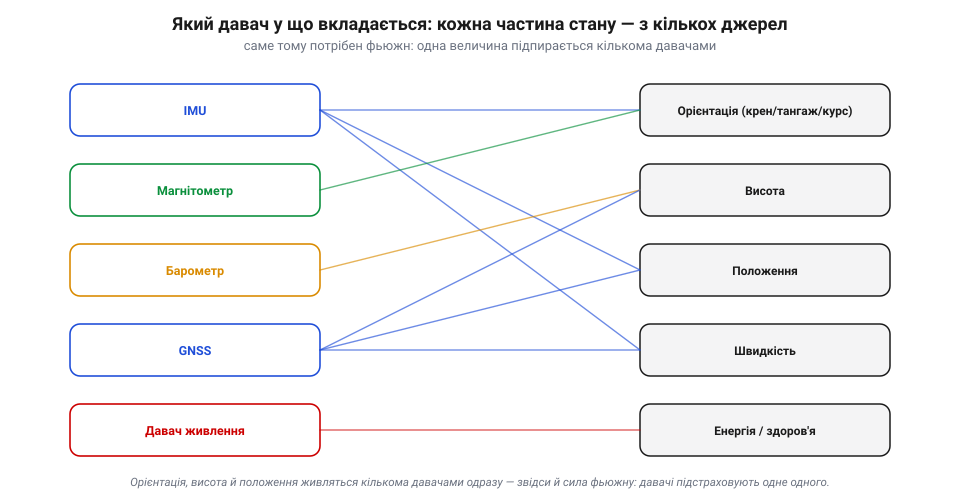
*Рис. 7.3.1.2. Хто в що вкладається. Орієнтацію дають IMU й магнітометр разом; висоту — барометр і GNSS; положення й швидкість — GNSS та IMU; енергію — давач живлення. Зверни увагу: майже кожна частина стану живиться з **кількох** давачів одразу. Саме тому в Розділі 7.1 між «давачами» й «керуванням» стояв окремий блок — оцінювач, що все це зливає.*

Видно головне: **орієнтація, висота й положення кожна спираються не на один давач, а на кілька**. IMU дає швидку, але «спливаючу» орієнтацію — магнітометр прив'язує її курс до півночі. Барометр дає швидку висоту — GNSS не дає їй відпливати надовго. Ця надмірність не випадкова: вона і є причина, чому потрібен фьюжн.

Як саме зливати — тема окрема (її торкнемося далі в модулі), але інтуїція проста: оцінювач щомиті вирішує, **кому більше вірити**. Гіроскопу — на короткому проміжку, поки той не встиг сплисти; акселерометру з магнітометром — на довгому, щоб підтягнути абсолют; GNSS — для прив'язки положення, а IMU — у проміжках між його рідкісними фіксами. Виходить, що сильна сторона одного давача рівно закриває слабку іншого — і це працює, тільки якщо давачів **кілька** й вони різного типу.

> 🔧 **Навіщо це.** Коли в чужому апараті бачиш «зайві» на перший погляд давачі (нащо і барометр, і GNSS, якщо обидва дають висоту?) — тепер ясно: вони **підстраховують** одне одного. Прибери один — і та частина стану стане крихкою. Читаючи склад давачів, питай не «що тут є», а «яку частину стану кожен підпирає».

### Абсолютні проти відносних — головна вісь

Є один поділ, що пояснює **всю** логіку бортового відчуття. Усі давачі лягають на одну вісь: **відносні** проти **абсолютних**.

- **Відносні** давачі (IMU, барометр) **швидкі й гладкі**, але **дрейфують**: вони міряють зміни, а не абсолют, тож дрібні похибки накопичуються. Гіроскоп інтегрують, щоб дістати кут, — і похибка інтеграла повзе. Барометр прив'язаний до погоди, що сама собою змінює тиск.
- **Абсолютні** давачі (GNSS, магнітометр) **не дрейфують** — вони прив'язані до чогось зовнішнього (супутників, поля Землі), — але **повільні й шумні**: оновлюються рідко, скачуть від завад.

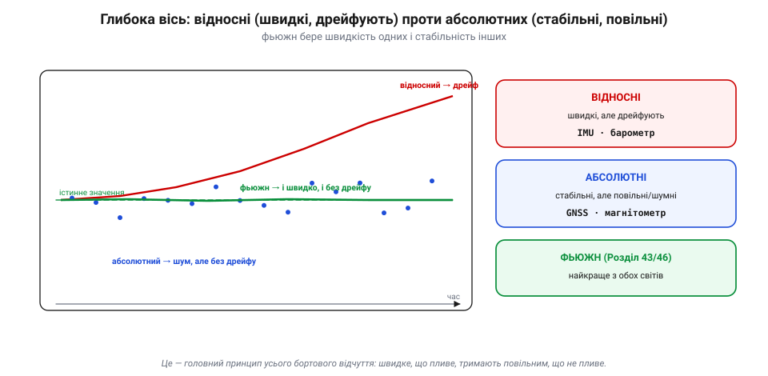
*Рис. 7.3.1.3. Чому самих лише відносних чи самих лише абсолютних давачів мало. Відносний (червоний) спершу точний, але невпинно відпливає від істини. Абсолютний (сині точки) тримається істини, але стрибає. Фьюжн (зелений) бере **швидкість** першого й **стабільність** другого — і йде рівно по істині. Це принцип усього бортового відчуття.*

Наскільки реальний цей дрейф? Цілком відчутний. Дешевий гіроскоп зі зсувом нуля всього 1°/с за хвилину «накрутить» 60° хибного кута — апарат «думатиме», що нахилений, хоча стоїть рівно. Барометр за зміни погоди на кілька гектопаскалів «побачить» десятки метрів неіснуючого набору висоти. Поодинці кожен давач за хвилини стає брехуном — а от **разом**, через фьюжн, вони тримають правду годинами.

З положенням ще гірше, ніж із кутом. Щоб дістати положення з акселерометра, його доводиться інтегрувати **двічі**: прискорення → швидкість → положення. А подвійне інтегрування роздуває похибку ще швидше — суто інерціальна навігація без зовнішнього якоря «відпливає» на кілометри за лічені хвилини. Ось чому GNSS такий цінний: він — той абсолютний кілок, до якого прив'язують швидкий, але невпинно тікаючий IMU. Прибери цей якір — і навіть найкращий інерціальний блок незабаром заведе апарат не туди.

А що, коли абсолютного якоря **немає зовсім** — апарат летить у приміщенні чи в каньйоні, де GNSS не ловить? Тоді доводиться шукати **інший** абсолют. Саме для цього й існують ті «додаткові» давачі: **оптичний потік** дивиться камерою вниз і оцінює зсув поверхні (замінник GPS для швидкості), **далекомір** дає чесну висоту над підлогою (замість барометра), а зір бортового комп'ютера будує власну прив'язку до місцевості. Принцип незмінний: відносному відчуттю завжди потрібен **хоч якийсь** абсолютний якір, інакше воно попливе. Зникне GPS — добра система не падає, а **перемикається** на те, що лишилось.

> 🔧 **Навіщо це.** Цю вісь «абсолютне ↔ відносне» варто тримати в голові завжди. Вона пояснює, чому будь-яка серйозна навігація **поєднує** типи давачів, а не покладається на один. І вона ж підказує, що шукати, коли система «пливе»: або зламався абсолютний якір (втрата GNSS, збитий компас), або відносний давач дрейфує сильніше, ніж очікувалося (вібрація, температура).

#### Маленький історичний гачок: компас

До речі, наймолодший на вигляд давач — електронний **магнітометр** — насправді спадкоємець найдавнішого навігаційного приладу. Магнітний компас (намагнічена голка, що показує на північ) знали в Китаї понад тисячу років тому, і саме він уперше дав мореплавцям **абсолютний** орієнтир, не залежний від видимості зірок. Сучасний MEMS-магнітометр робить те саме — лише міряє поле електронікою, а не хитанням голки. Тож коли апарат «крутить» компас вісімкою для калібрування (Розділ 7.1), він, по суті, повторює тисячолітній жест пошуку півночі — тільки в кремнії.

### Де й як їх ставлять

Карта була б неповна без слова про **монтаж**, бо навіть добрий давач легко зробити брехливим, поставивши не туди. Кожен має свою «алергію»:

- **IMU** ізолюють від **вібрації** — садять на м'які демпфери чи піну. Тряска моторів забиває акселерометр шумом, і оцінювач «бачить» неіснуючі поштовхи; сильна вібрація — одна з найчастіших причин, чому апарат «сходить з розуму» в польоті.
- **Магнітометр** відсувають **подалі від силових дротів і заліза**: поряд зі струмом у десятки ампер він міряв би поле власного апарата, а не Землі. Тому компас часто виносять на щоглу або ховають у GNSS-модуль зверху, далі від батареї й моторів.
- **GNSS-антені** потрібне **чисте небо** — її кладуть угорі апарата, подалі від джерел радіозавад (зокрема від того ж «розумного» комп'ютера й камер).
- **Барометр** прикривають **пінкою від вітру** й струменя від гвинтів: інакше тиск стрибає від кожного пориву, і висота «дихає».

До монтажу додається ще дві наскрізні турботи. **Калібрування** (з Розділу 7.1) — майже кожен давач має індивідуальні відхилення, які треба раз виміряти й зберегти в параметрах. І **температура**: майже всі MEMS-давачі трохи «пливуть» при нагріванні чи охолодженні, тож серйозні системи вимірюють температуру плати й вносять поправку (а інколи навіть підігрівають IMU до сталої температури).

> 🔧 **Навіщо це.** Це половина вміння читати чужу збірку: глянь, **де** стоїть кожен давач. Компас притулено до батареї? Курс «попливе». IMU прикручено намертво, без демпферів? Чекай вібраційного шуму. GNSS-антена під вуглепластиком чи поряд із камерою? Будуть зриви фіксу. Часто проблему видно очима ще до вмикання живлення.

### Коротка довідка

Звівши все докупи, маємо таку карту давачів — її ланки ми розкриватимемо в наступних темах:

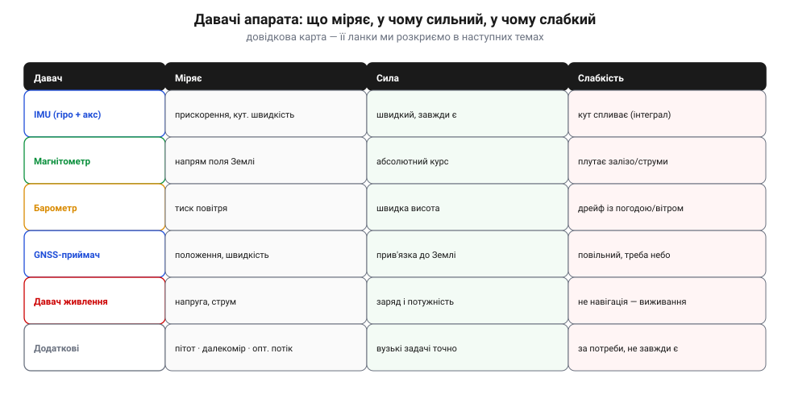
*Рис. 7.3.1.4. Довідкова карта бортових давачів. Кожен має свою силу й свою ваду — і саме тому вони працюють командою, а не поодинці.*

### Що далі в цьому розділі

Карта складена; далі ми розгорнемо її ланки в деталях. Спершу — найважливіша пара відчуття: **інерціальний блок і барометр** (7.3.2), тоді — **супутникова навігація** зсередини (7.3.3). Після давачів перейдемо на бік дії: **безколекторний мотор** (7.3.4), **регулятор обертів** (7.3.5), **серво й керма** (7.3.6) — і завершимо тим, як апарат тримається купи за відмови: **надлишковість і поведінка за збою** (7.3.7).

### Підсумок теми

Ланка «давачі» з Розділу 7.1 — це насправді **набір** доповнювальних приладів: IMU дає швидку орієнтацію, магнітометр — абсолютний курс, барометр — швидку висоту, GNSS — абсолютне положення, давач живлення — стан енергії. Кожна частина стану апарата спирається на **кілька** давачів, а не на один, — звідси й потреба у фьюжні. А головна вісь, що все впорядковує, — **відносне проти абсолютного**: швидке, що дрейфує, тримають повільним, що не дрейфує.

І останнє, що варто винести з цього огляду: **відчуття — це фундамент**. Хоч би яким досконалим був оцінювач чи керування з Розділу 7.1, вони працюють лише з тим, що дали давачі. Кепські, погано поставлені чи нескалібровані сенсори — і жодна математика не врятує: «сміття на вході — сміття на виході». Тому грамотний апарат починається не з ефектного коду, а з чесних, правильно змонтованих чуттів. Тримаючи цю карту в голові, перейдімо до першої й найважливішої пари давачів — інерціального блока та барометра.

---

## 7.3.2 Інерціальний блок (IMU) і барометр

Дві найшвидші, найфундаментальніші чуття апарата — **інерціальний блок** (відповідає за орієнтацію й рух) і **барометр** (за висоту). Обидва — «відносні» давачі з 7.3.1: блискавичні на коротких масштабах, але такі, що дрейфують і потребують абсолютного якоря. Фізику MEMS-давачів ми вже бачили в Розділі 5.7; тут нас цікавить інше — **як вони поводяться як компоненти польоту**, у чому їхня підступність і чому без них нічого не злетить. Почнемо з найбільшої пастки — акселерометра, який міряє зовсім не те, що здається.

### Акселерометр: він міряє не те, що ти думаєш

Назва обманює. Акселерометр **не** міряє «прискорення апарата» в звичному сенсі. Він міряє **питому силу** (*specific force*) — негравітаційну силу на одиницю маси, яка діє на його пробну масу. Наслідки цього неінтуїтивні, але саме вони — ключ до розуміння всієї орієнтації:

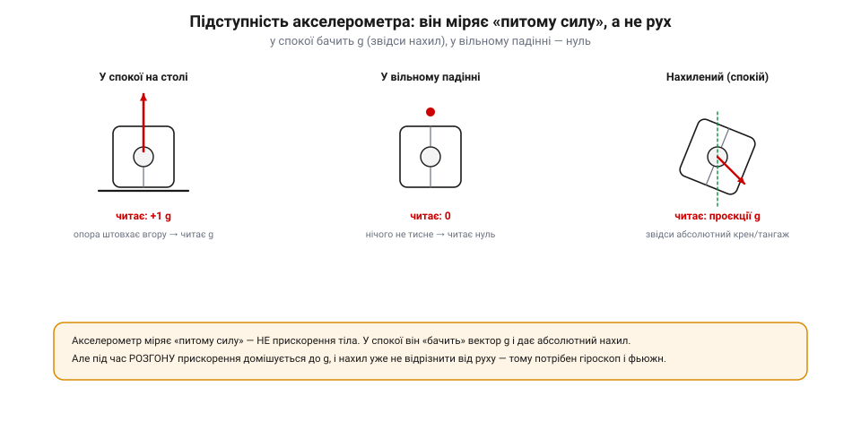
*Рис. 7.3.2.1. Акселерометр міряє не рух, а питому силу. **У спокої** на столі опора штовхає його вгору з силою mg — і він читає **+1g угору** (а не «нуль», хоч і лежить нерухомо). **У вільному падінні** на нього не діє жодна опора — і він читає **нуль** (хоч і розганяється!). **Нахилений** у спокої він бачить проєкції вектора g на свої осі — звідси й абсолютний крен і тангаж.*

Спершу це збиває з пантелику, та якщо вдуматися — прекрасно. У спокої акселерометр «відчуває» вектор тяжіння (точніше, реакцію опори, спрямовану проти нього), а отже, **знає, де низ**. Із напрямку «низу» легко дістати, наскільки апарат нахилений, — це **абсолютний** орієнтир крену й тангажа, що не дрейфує. Саме тому акселерометр — той «якір», що не дає орієнтації спливати.

Але є й біда, заради якої існує решта IMU. Коли апарат **розганяється**, до тяжіння домішується реакція на це прискорення — і акселерометр уже не може відрізнити «я нахилений» від «я прискорююсь убік». На віражі чи різкому розгоні він «бреше» про нахил. Сам по собі він надійний лише в спокої чи рівному русі.

Наскільки сильно розгін «прикидається» нахилом? Геометрія проста: горизонтальне прискорення `a` виглядає для акселерометра як нахил на кут `arctan(a/g)`. Прискорення всього в 0.2g (помірний ривок) підробляє нахил приблизно на 11° — чимала брехня, якби їй повірити сліпо. Ось чому фьюжн на маневрі більше покладається на гіроскоп, а до акселерометра прислухається тим менше, чим сильніше апарат розганяється. Акселерометр — добрий суддя «де низ» лише тоді, коли апарат не пришвидшується.

> 🔧 **Навіщо це.** Запам'ятай: акселерометр у спокої читає **1g вгору**, у вільному падінні — **нуль**. Це не курйоз, а робоче знання: ось чому показанням акселерометра не можна довіряти нахил під час маневру, і чому будь-який стабілізатор обов'язково поєднує його з гіроскопом. Хто намагається тримати кут «лише на акселерометрі», отримує апарат, що смикається на кожному пориві.

### Гіроскоп і чому самого IMU мало для курсу

Друга половина IMU — **гіроскоп** — міряє **кутову швидкість** (°/с): як швидко апарат обертається. Він швидкий, чистий і не плутає нахил із прискоренням. Та щоб дістати з нього **кут**, його доводиться інтегрувати, а інтеграл, як ми знаємо з 7.3.1, накопичує найменший зсув нуля й **спливає**. Тож виходить ідеальна пара протилежностей: гіроскоп точний на коротку мить, але дрейфує; акселерометр абсолютний, але плутається в русі. Зливши їх (комплементарний фільтр чи фільтр Калмана з Розділу 5.8), дістаємо орієнтацію, що й швидка, і стабільна.

Але навіть удвох вони мають сліпу пляму. Акселерометр бачить вектор g — **вертикальний**. А обертання навколо **вертикальної** осі (курс, *yaw*) цей вектор не змінює зовсім:

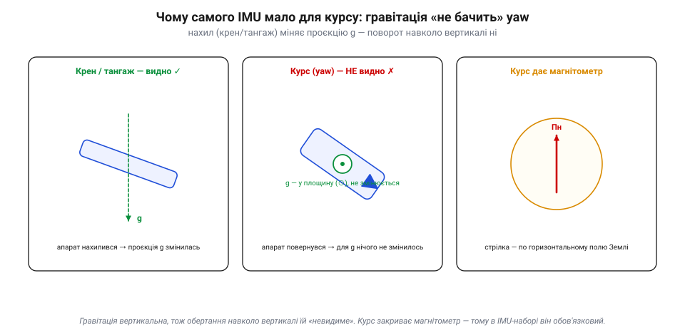
*Рис. 7.3.2.2. Сліпа пляма гравітації. Нахил по крену чи тангажу повертає апарат відносно вектора g — і акселерометр це бачить. Але поворот навколо вертикалі (курс) лишає g незмінним — для гравітації «нічого не сталося». Тому абсолютний курс дає окремий давач — **магнітометр**, що орієнтується по горизонтальному полю Землі.*

Ось чому в наборі давачів (7.3.1) магнітометр стоїть **поряд** з IMU, а не замість: гіроскоп дає швидку зміну курсу, але його абсолютне значення нема чим прив'язати, окрім компаса. Гравітація фіксує два кути з трьох; третій — за магнітним полем.

> 🔧 **Навіщо це.** Це пояснює типову поведінку апаратів: крен і тангаж тримаються добре навіть без компаса, а от **курс «пливе» або бреше саме тоді, коли збитий магнітометр**. Якщо апарат злітає рівно, але «не знає», куди дивиться, чи повільно крутиться на місці — підозрюй насамперед компас і його калібрування, а не гіроскоп.

> 📜 До речі, сам термін «гіроскоп» (грец. «бачити обертання») дав 1852 року **Леон Фуко** (*Léon Foucault*), що розкрученим ротором наочно показав обертання Землі. Згодом **Елмер Сперрі** (*Elmer Sperry*) зробив із гіроскопа **гірокомпас** і стабілізатори для кораблів, а перший **авіаційний автопілот** публічно показав 1914 року в Парижі вже його син **Лоренс Сперрі** (*Lawrence Sperry*) — пролетів над Сеною, знявши руки з керування, поки механік ходив по крилу. Сучасний MEMS-гіроскоп не крутиться — він відчуває обертання через ефект Коріоліса на крихітній вібруючій структурі (Розділ 5.7), — але робить ту саму роботу, що й важкий ротор Фуко.

### IMU в польоті: шум, зсув і головний ворог — вібрація

На сучасних апаратах акселерометр і гіроскоп сидять на одному MEMS-чіпі (а часто поряд і магнітометр — звідси «9 осей»), і саме цей чіп задає **серцебиття** швидкого контуру: його опитують сотні-тисячі разів на секунду, і кожне опитування — новий такт стабілізації. Якщо IMU «затнувся» чи зашумів, здригається весь політ — тому його читають із найвищим пріоритетом (згадай планувальник із 7.1.3).

Реальний IMU недосконалий і по-іншому. У нього є **зсув нуля** (*bias* — показує трохи не нуль навіть у спокої), **шум**, **температурний дрейф** (показання повзуть при нагріванні — тому серйозні плати міряють температуру й вносять поправку, а інколи навіть підігрівають IMU до сталої). Усе це фьюжн здебільшого приборкує. Але є один ворог, що губить навіть добрий IMU, — **вібрація**.

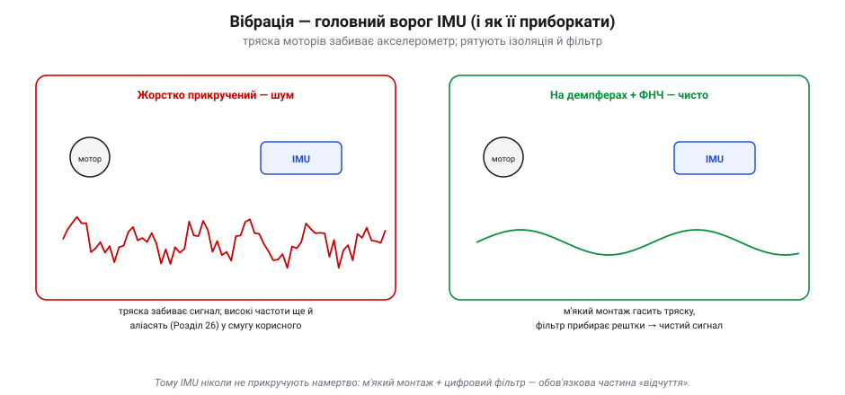
*Рис. 7.3.2.5. Чому IMU ніколи не прикручують намертво. Тряска моторів і гвинтів передається на акселерометр і забиває корисний сигнал (ліворуч). Гірше: високочастотна вібрація через дискретизацію «аліасить» (Розділ 4.8) у смугу корисних частот, і її вже не відфільтрувати потім. Рятують **м'який монтаж** (демпфери, піна), що гасить тряску фізично, і **цифровий фільтр**, що прибирає рештки (праворуч).*

Вібрація — підступна тим, що частина її енергії, через ефект аліасингу (згадай Найквіста з Розділу 4.8), маскується під повільні рухи апарата, і оцінювач сприймає її за реальні поштовхи. Тому боротьба з нею **дворівнева**: спершу прибрати фізично (демпфери під IMU), бо що в сигнал потрапило — те аліас уже міг зіпсувати, а тоді відфільтрувати залишки. Це не «тонке налаштування», а базова умова, щоб IMU взагалі давав правду.

> 🔧 **Навіщо це.** Вібраційний шум — причина №1, чому саморобні апарати «сходять з розуму» в польоті, хоч на столі все працює. Читаючи чужу збірку, перевір: чи стоїть IMU (часто всередині польотного контролера) на демпферах, чи збалансовані гвинти, чи не передається тряска від рами. Логи польоту майже завжди мають канал вібрації — це перше, куди дивляться за дивної поведінки.

З усього цього випливає й звична вимога: зсув нуля гіроскопа міряють **щоразу при ввімкненні**, поки апарат стоїть нерухомо, — ось чому наземна станція просить «не рухати» під час підготовки до зброєння. Кілька секунд спокою дають оцінювачу заміряти поточний зсув, щоб потім його віднімати з кожного відліку. Поворушиш апарат саме в цю мить — і зсув заміряється з помилкою, а орієнтація почне тихо спливати вже в польоті. Дрібний ритуал «постав і зачекай» — насправді калібрування, без якого швидке відчуття бреше.

### Барометр: тиск замість висоти

Тепер — друга чуття цієї пари. **Барометр** дає висоту, але робить це хитро: він міряє не висоту, а **атмосферний тиск**, який передбачувано падає, що вище піднімаєшся (повітря над тобою менше — воно менше тисне).

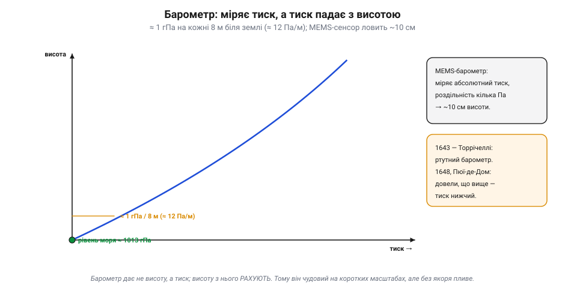
*Рис. 7.3.2.3. Барометр міряє тиск, а висоту з нього рахують. Тиск спадає з висотою (біля землі — приблизно 1 гПа на кожні 8 метрів, тобто ~12 Па на метр). Сучасний MEMS-барометр розрізняє лічені паскалі — а отже, кроки висоти в сантиметри. Звідси його надзвичайна чутливість на коротких масштабах.*

Перевага вражає: оскільки сенсор ловить зміни тиску в кілька паскалів, він «бачить», як апарат піднявся на **десяток сантиметрів**. Звичайний (неаугментований) GNSS такої тонкості висоти не дасть — його вертикальна точність гірша за горизонтальну (хоча RTK-GNSS уже сягає сантиметрів). Порахуймо зв'язок тиску й висоти на простому прикладі:

**Приклад (тиск → висота).** Біля рівня моря тиск падає приблизно на 12 Па на метр, тобто 1 гПа (100 Па) ≈ 8.3 м. Нехай барометр показав, що тиск упав із 1013 до 1000 гПа:

```
Δp = 1013 − 1000 = 13 гПа
крок:  1 гПа ≈ 8.3 м   (≈ 12 Па/м біля землі)
Δh ≈ 13 × 8.3 ≈ 108 м
```

Тобто апарат піднявся приблизно на 108 метрів. (Точна формула — барометрична, з урахуванням температури, — але для відчуття масштабу годиться й цей лінійний крок.)

> 📜 Цей зв'язок «тиск ↔ висота» відкрили задовго до дронів. 1643 року **Еванджеліста Торрічеллі** (*Evangelista Torricelli*) зробив ртутний барометр і довів, що повітря має вагу й тисне. А 1648-го, за ідеєю **Блеза Паскаля** (*Blaise Pascal*), його швагер **Флорен Пер'є** (*Florin Périer*) виніс барометр на вершину гори Пюї-де-Дом (≈ 1000 м) — і ртутний стовпчик там був помітно нижчий, ніж біля підніжжя. Так народилася сама ідея **висотоміра**: міряючи тиск, можна знати висоту. Твій MEMS-барометр повторює дослід Пер'є тисячі разів на секунду.

### Чому барометр «дихає»: дрейф із погодою

Якщо барометр такий точний — чому ж він теж «відносний»? Бо тиск залежить не лише від висоти, а й від **погоди**. Атмосферний фронт може зсунути тиск на кілька гектопаскалів за години — і барометр «побачить» десятки метрів набору чи зниження висоти, яких насправді немає.

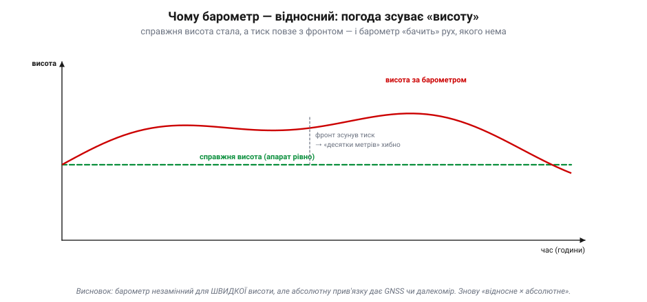
*Рис. 7.3.2.4. Барометр «дихає» разом із погодою. Апарат стоїть на місці (зелена пряма — справжня висота), але тиск повільно повзе з атмосферним фронтом, і барометрична висота (червона) дрейфує на десятки метрів. На коротких хвилинах польоту це майже непомітно; на довгих — суттєво. Тому абсолютну прив'язку висоти дає GNSS або далекомір.*

Тому барометр використовують як **відносний** давач: висоту зазвичай «обнуляють» при зльоті (відлік відносно точки старту), а повільний дрейф підправляють GNSS чи далекоміром. Додаймо ще дві практичні біди: барометр чутливий до **струменя від гвинтів і вітру** (динамічний тиск «дме» в сенсор), тому його прикривають пінкою; і до **ефекту землі** при посадці. Усе це — знайома пісня з 7.3.1: швидке, що дрейфує, тримають повільним, що не дрейфує.

Ще одна тонкість — **відносно чого** барометр міряє. Висота з тиску — це висота над якоюсь опорною точкою (зазвичай — місцем зльоту, де відлік і обнуляють). Це **не** висота над поточною землею: пролітаючи над пагорбом, барометр не помітить, що земля піднялась назустріч. Для справжньої висоти над поверхнею — потрібної саме на зльоті й посадці — ставлять **далекомір** (лазерний чи ультразвуковий), що міряє відстань прямо вниз. Барометр каже «висоту польоту загалом», далекомір — «скільки лишилось до землі тут і зараз».

> 🔧 **Навіщо це.** Якщо апарат у режимі утримання висоти повільно «спливає» вгору-вниз протягом польоту — це майже напевно барометричний дрейф або незакритий від вітру сенсор, а не поломка. А ще: ніколи не порівнюй барометричну висоту двох польотів у різні дні «в лоб» — погода між ними могла зсунути нуль на десятки метрів.

### Підсумок теми

Інерціальний блок і барометр — це швидке, але «відносне» ядро відчуття апарата. **Акселерометр** міряє питому силу: у спокої бачить вектор g (дає абсолютний крен і тангаж), але плутає нахил із прискоренням у русі. **Гіроскоп** дає чисту кутову швидкість, але його кут дрейфує; разом вони (через фьюжн) тримають орієнтацію, проте курс лишається сліпою плямою — його закриває магнітометр. Реальному IMU дошкуляють зсув, шум і насамперед **вібрація**, тож його ставлять на демпфери й фільтрують. **Барометр** дає надзвичайно тонку висоту з тиску (сантиметри!), але «дихає» з погодою, тож працює як відносний давач, що його прив'язує GNSS. Обидва давачі — яскравий доказ головної тези модуля: чесне відчуття народжується не з одного приладу, а з командної гри багатьох.

Варто помітити, що та сама пара закриває й **вертикаль**. Барометр дає висоту — повільно й шумно; вертикальна вісь акселерометра дає швидке вертикальне прискорення. Зливши їх, оцінювач отримує гладку вертикальну швидкість і висоту — точнісінько як орієнтацію він злив із гіроскопа й акселерометра. Та сама ідея фьюжну, та сама пара «швидке × стабільне», лише для іншої величини.

А найабсолютніший якір із усіх — супутникова навігація, історію якої ми вже знаємо. Час розібрати, **як** вона працює зсередини.

---

## 7.3.3 Супутникова навігація (GNSS): як працює

Історія цього розділу розповіла **звідки** взявся GPS і на якій ідеї він тримається — перевернута задача Доплера, трилатерація в часі, релятивістська поправка. Тепер — інженерна частина: що **насправді** летить у сигналі, як приймач із нього дістає координати, чому перший фікс не миттєвий, від чого залежить точність і як її піднімають до сантиметрів. Це найтехнічніша тема про давачі — але саме вона перетворює «чарівну коробку» на зрозумілий компонент.

### Що насправді в сигналі: код і навігаційне повідомлення

Почнімо з того, що супутник **передає**. У його сигналі дві речі: **PRN-код** (*pseudo-random noise* — псевдовипадкова послідовність, унікальна для кожного супутника) і **навігаційне повідомлення** з даними.


*Рис. 7.3.3.1. Що в сигналі й як міряється дальність. Супутник безперервно шле свій унікальний PRN-код разом із навігаційним повідомленням (ефемериди — точна орбіта саме цього супутника; альманах — грубі орбіти всіх; поправки годинника; здоров'я). Приймач має **свою копію** коду й «совгає» її в часі, поки вона не збіжиться з прийнятим сигналом. Величина зсуву — це час польоту, а помножена на швидкість світла — дальність.*

Тут ховається елегантний трюк. У межах одного сигналу (скажімо, цивільного **L1 C/A**) усі супутники GPS передають на **спільній** частоті — а приймач розрізняє їх саме за **різними кодами** (це називають кодовим розділенням, *CDMA*). Сам GPS має кілька частот (**L1, L2, L5**) і різні сигнали, але всередині кожного супутники однаково розділяють кодом. Знаючи форму коду кожного супутника наперед, приймач корелює (зіставляє) прийнятий шум зі своїми копіями — і та копія, що «впізналася», каже, який це супутник і з якою затримкою прийшов його сигнал. Так з одної антени приймач одночасно «чує» десяток супутників.

Є тут і ще одне диво. Сигнал від супутника за 20 000 км доходить **слабшим за шум** — приймач «чує» його нижче рівня власних теплових шумів. Як же він узагалі його ловить? Завдяки тій самій кореляції: коли довгий псевдовипадковий код збігається сам із собою, його енергія складається в гострий пік, а шум — ні. Цей виграш від згортки (*processing gain*) витягує корисний сигнал з-під шуму. Тому GNSS працює з мікроскопічними потужностями — але тому ж він і **вразливий**, до чого ми ще повернемося.

А чому час треба міряти аж так точно? Бо світло швидке до неможливого:

```
відстань до супутника:   ~20 200 км
час польоту сигналу:     20 200 / 300 000 ≈ 67 мс
світло за 1 наносекунду: ~30 см
→ похибка часу 1 нс  =  похибка дальності 30 см
```

Один наносекундний промах годинника — і дальність бреше на 30 см. Ось чому на супутниках стоять **атомні** годинники, ось чому потрібна релятивістська поправка з історії, і ось чому час — серце всієї системи.

> 🔧 **Навіщо це.** Слова «PRN», «ефемериди», «альманах» ти зустрінеш у будь-якому GNSS-модулі й у його логах. **Ефемериди** — свіжа точна орбіта (швидко застаріває); **альманах** — груба орбіта всіх супутників (живе довго, потрібен, щоб знати, де кого шукати). Розрізняти їх — ключ до розуміння, чому приймач інколи «думає» довго (про це нижче).

### Псевдодальність: чому потрібен саме четвертий супутник

В історії ми сказали: для фікса треба **щонайменше чотири** супутники. Тепер зрозуміймо чому — точно. Виміряна приймачем відстань — це не справжня дальність, а **псевдодальність**: вона завищена на похибку **власного** годинника приймача (дешевого, не атомного).

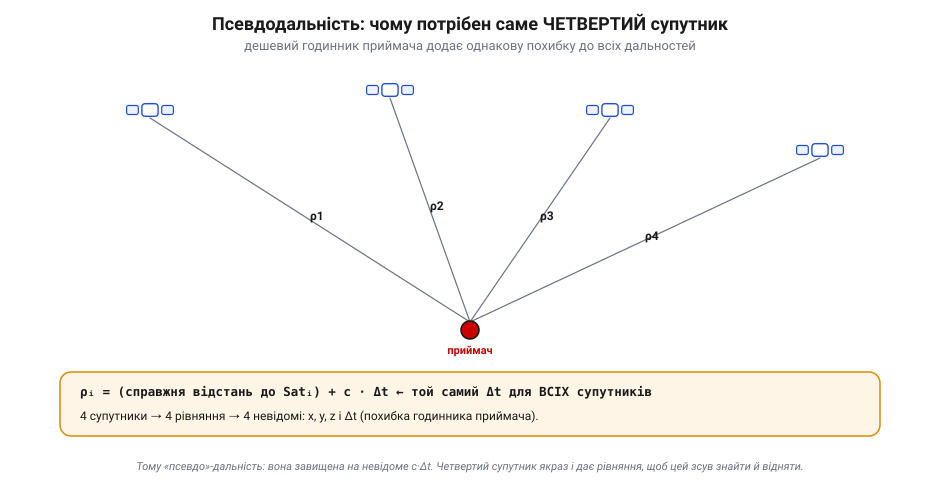
*Рис. 7.3.3.2. Чому супутників саме чотири. Кожна виміряна дальність ρᵢ — це справжня відстань до супутника плюс однакова для всіх добавка c·Δt, де Δt — невідома похибка годинника приймача. Маємо чотири невідомі (x, y, z і Δt) — отже, потрібні чотири рівняння, тобто чотири супутники. Третій дав би x, y, z, якби годинник був ідеальний; четвертий «оплачує» його неідеальність.*

У цьому — геніальність системи: вона **не вимагає** від приймача дорогого атомного годинника. Замість цього вона робить похибку годинника ще однією невідомою й **сама її обчислює**, додавши один супутник. Дешевий кварцовий резонатор у приймачі — і та сама точність. (Як приємний побічний ефект, GPS заодно віддає й **дуже точний час** — тому ним синхронізують мережі й біржі.)

> 🔧 **Навіщо це.** «Псевдо» в назві — не дрібниця: воно нагадує, що сире вимірювання GPS системно зміщене, поки не розв'язано похибку годинника. Тому й кажуть «потрібно 4 супутники для 3D-фікса»; із трьома буде лише 2D (якщо висоту взяти звідкись іще). Побачивши в логах «3D fix: 6 sats» — тепер знаєш, що це означає.

### Чому перший фікс не миттєвий: холодний, теплий, гарячий старт

Кожен, хто вмикав навігатор чи дрон, помічав: свіжовключений приймач «думає» — інколи довго. Причина в тому, **скільки** йому ще треба дізнатися, перш ніж порахувати позицію:

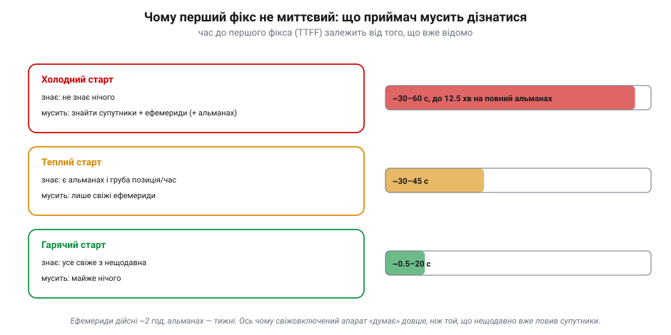
*Рис. 7.3.3.3. Час до першого фікса (TTFF) залежить від наявних знань. **Холодний старт** (нічого не знає) — мусить знайти супутники й завантажити ефемериди, а як немає альманаху — то й його (а він передається аж 12.5 хв!); тому буває від ~30 секунд до хвилин. **Теплий старт** (є альманах і груба позиція) — лише підвантажити свіжі ефемериди, ~30–45 с. **Гарячий старт** (усе свіже) — лічені секунди.*

Ключ — у тривкості даних: **ефемериди** точні, їх оновлюють приблизно раз на **2 години** (а чинні вони зазвичай до ~4 годин), тоді як **альманах** грубий, зате лишається придатним тижнями. Тому приймач, що нещодавно працював, стартує швидко (його ефемериди ще свіжі), а той, що пролежав вимкненим тиждень, мусить усе завантажувати наново — і тому «думає» довше. Передові модулі прискорюють це, підкачуючи ефемериди з інтернету (так званий *A-GPS*), якщо він є.

> 🔧 **Навіщо це.** Ось чому апарат після довгого простою чи перельоту в інший регіон ловить супутники довше — і чому не варто квапити зліт, поки фікс не стабілізувався. Якщо GNSS «не ловить» там, де раніше ловив швидко, причина часто проста: холодний старт після тривалого вимкнення, а не поломка.

### Геометрія важить: HDOP і кількість супутників

Чотири супутники — мінімум, але не запорука точності. Величезну роль грає, **як саме** супутники розкидані по небу:


*Рис. 7.3.3.4. Геометрія вирішує. Коли супутники широко розкидані по небосхилу (ліворуч), перетин дальностей «гострий» — похибка мала й кругла; кажуть, низький **HDOP** (горизонтальне «розмиття точності»). Коли ж усі збилися в одному кутку неба (праворуч), перетин «пологий» — похибка велика й витягнута, високий HDOP. Та сама кількість супутників, та інша точність.*

Тому добрий приймач (і автопілот) дивиться не лише на **кількість** супутників, а й на **HDOP**: чим він менший, тим надійніший фікс. Автопілоти зазвичай не дають зброїтися для автономного польоту, поки HDOP не впаде нижче порога й супутників не набереться з запасом. Багато супутників із різних сузір'їв (GPS + GLONASS + Galileo + BeiDou) тут якраз і виручають: більше видимих супутників — майже завжди краща геометрія.

> 🔧 **Навіщо це.** «Кількість супутників» — лише півправди про якість фікса; друга половина — HDOP. У місті серед висоток чи в каньйоні супутників може бути багато, але всі у вузькій смузі неба — і точність кепська. Дивлячись у телеметрію, читай **обидва** числа.

### Звідки похибки й як їх бити

Чому ж навіть із гарною геометрією звичайний GPS дає метри, а не сантиметри? Через низку похибок, що домішуються до кожної дальності:

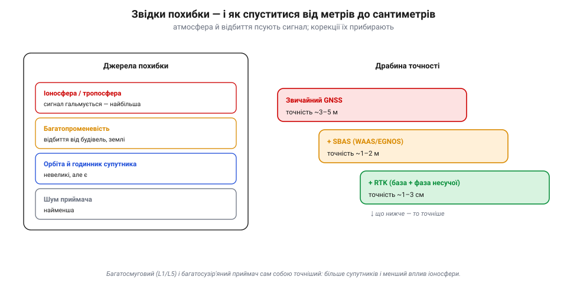
*Рис. 7.3.3.5. Похибки й способи їх побороти. Найбільша — **затримка в атмосфері** (іоносфера й тропосфера гальмують сигнал); далі **багатопроменевість** (сигнал відбивається від будівель і землі), дрібні похибки орбіти й годинника супутника, шум приймача. Праворуч — драбина точності: звичайний GNSS ~3–5 м; із доповненням **SBAS** (WAAS/EGNOS) ~1–2 м (інколи субметрово); із **RTK** (база поряд + вимір фази несучої) ~1–3 см.*

Способи покращення — це по суті способи **прибрати** ці похибки. **SBAS** (супутники доповнення WAAS у США, EGNOS у Європі) розсилає поправки на атмосферу й орбіти. **RTK** (*real-time kinematic*) використовує нерухому базову станцію поряд і вимір **фази несучої** хвилі, даючи сантиметри — саме його ставлять на дрони для точного картографування й посадки. А ще сам приймач можна зробити точнішим: **багатосмуговий** (L1/L5) майже усуває іоносферну похибку, а багатосузір'яний бачить більше супутників.

> 🔧 **Навіщо це.** Коли в описі модуля бачиш «RTK», «SBAS», «multi-band L1/L5» — це прямо про точність, і тепер ясно, що кожне з них прибирає. Для звичайного апарата вистачає метрів; для точної посадки чи аерознімання беруть RTK — але він потребує базової станції чи мережі поправок, а не лише кращого приймача.

А звідки RTK бере ті сантиметри? Він міряє відстань не за кодом, а за **фазою несучої** хвилі — а її довжина близько 19 см, тож «лінійка» стає в сотні разів тоншою за кодову. Уся хитрість — порахувати, скільки **цілих** хвиль умістилося в дальності (цю «неоднозначність» і розв'язують спільно нерухома база та рухомий приймач). Тому RTK дає сантиметри — але лише з поправками від близької бази; самотній приймач, хоч який добрий, такого не вміє.

Чимало залежить і від самої **антени**. Багатопроменевість б'є найдужче саме знизу й збоку, тому GNSS-антену ставлять угорі апарата на невеликій металевій «тарілці» — **площині землі** (*ground plane*), що екранує відбиття від корпусу. Дешева антена без площини землі в місті «збирає» відбиття від стін і дає стрибки на метри. Знову та сама думка з 7.3.1: добрий давач, погано поставлений, — це поганий давач.

#### Слабке місце: глушіння й підміна

Те, що сигнал такий кволий, має зворотний бік, про який мовчати не можна. **Глушилка** (*jammer*) потужністю в кілька ватів здатна «засліпити» GNSS на сотні метрів навколо, просто заливши діапазон шумом, — і дешеві автомобільні глушилки вже не раз клали навігацію цілих районів. Гірше — **підміна** (*spoofing*): передавач, що імітує справжні супутники, може непомітно «повести» приймач у хибне місце, і той рапортуватиме координати з повною впевненістю. Для апарата висновок прямий: на GNSS **не можна сліпо покладатися**. Тому добра система перевіряє, чи правдоподібний фікс (чи згоден він з IMU й барометром), і має failsafe на раптову втрату або стрибок GNSS — рівно як ми обговорювали надійність і резервування в 7.1.2.

### Що GNSS дає апарату

Підсумуймо, що ж приймач **віддає** в оцінювач стану. По-перше, **положення** (широта, довгота, висота) — той абсолютний якір, якого не дасть жоден інший бортовий давач. По-друге, **час** — надточний. І, по-третє, що часто недооцінюють, — **швидкість**, причому хорошої якості: її рахують не з різниці положень, а з **доплерівського зсуву** несучої (як швидко міняється дальність до кожного супутника). Це та сама фізика, що вразила вчених у 1957-му, тільки тепер вона дає апарату вектор руху.

Варто знати й **формат**: положення GNSS віддає в геодезичних координатах — широта, довгота й висота над опорним еліпсоїдом (математичною моделлю форми Землі, до точності якої, пам'ятаєш, доклалася Глейдіс Вест з історії розділу). Автопілот переводить їх у зручний локальний кадр «північ-схід-вниз» відносно точки зльоту — саме в ньому й живе навігація з Розділу 7.1.

Розплата — у двох речах, які ми вже знаємо: GNSS **повільний** (оновлення кілька разів на секунду) і потребує **видимості неба**. До речі, гнатися за «10 Гц GPS» заради точності марно: приймач хоч і рахує на 10 Гц справжні нові рішення (із безперервного стеження за супутниками), **абсолютної** точності вища частота не додає — джерела похибок ті самі. Справжню гладкість між рідкими абсолютними фіксами дає не швидший приймач, а **фьюжн з IMU**. Тому в архітектурі з Розділу 7.1 GNSS ніколи не керує сам: він — повільний абсолютний якір, який зливають зі швидким IMU. GNSS каже «де ти насправді» раз на секунду; IMU заповнює проміжки й згладжує — разом вони й дають гладку, точну, незношувану оцінку положення.

### Підсумок теми

GNSS працює так: супутники шлють унікальні коди й свої точні орбіти; приймач кореляцією міряє час польоту до кожного, дістаючи **псевдодальності**, і з чотирьох супутників розв'язує і своє положення (x, y, z), і похибку власного дешевого годинника (Δt). Перший фікс не миттєвий, бо приймачу треба завантажити ефемериди (а часом і альманах); точність залежить від **геометрії** (HDOP) і обмежена похибками атмосфери й відбиттів — їх прибирають доповненнями (SBAS, RTK) аж до сантиметрів. На виході апарат має абсолютне положення, точний час і доплерівську швидкість — повільні, залежні від неба, але незамінні як якір для фьюжну. Тримай у голові цей образ: GNSS — не «де я» з абсолютною певністю, а кволий, повільний, та чесно прив'язаний до Землі голос, який лише в команді з рештою давачів стає надійним відчуттям місця.

На цьому ми завершуємо **сенсорну** половину розділу — те, чим апарат відчуває світ. Далі — половина **дії**: як апарат на світ впливає. Почнемо з того, що дає йому рух, — безколекторного мотора.

---

## 7.3.4 Безколекторний мотор (BLDC): 3 фази, KV

Уся обчислена контролером воля апарата зрештою впирається в одне: треба **закрутити гвинти**. Перетворює електрику на обертання — **мотор**, і майже всі літальні апарати сьогодні крутять саме **безколекторні** (*brushless DC*, BLDC). Розберімо, чому саме вони, як вони працюють на трьох фазах, що означає загадкове число **KV** на наклейці й чому мотор не розганяється безмежно. Це підготує нас і до наступної теми — про ESC, що цим мотором керує.

### Чому безщітковий: щітки прибрали

Класичний **щіткований** мотор має обмотки на роторі (тому, що крутиться), а перемикає в них струм механічно — через **щітки** й **колектор**, що труться об вал. Це працює, але має вади: щітки **зношуються**, **іскрять**, обмежують оберти й потужність. Безколекторний мотор вивертає конструкцію навиворіт:

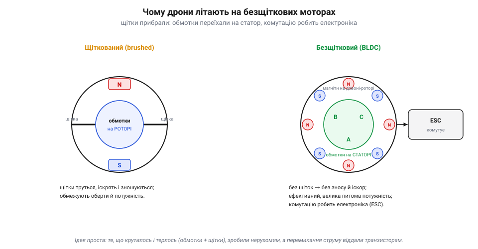
*Рис. 7.3.4.1. Головна ідея безщіткового мотора. У щіткованому (ліворуч) обмотки крутяться на роторі, а струм у них перемикають щітки з колектором — вони труться, іскрять і зношуються. У безщітковому (праворуч) усе навпаки: обмотки нерухомі на **статорі**, а магніти крутяться на **роторі** (часто це зовнішній «дзвін»), і перемикає струм не щітка, а **електроніка** — регулятор обертів (ESC). Нема чому тертися — нема й зносу.*

Виграш величезний: без щіток мотор служить роками, не іскрить, дуже ефективний і має високу **питому потужність** (багато вату з малої ваги) — саме те, що треба літальному апарату. Розплата одна: ним не можна керувати, просто подавши напругу, — потрібен «розумний» драйвер, що перемикає фази (це і є ESC з 7.3.5).

Чому ж безщіткові мотори не витіснили щіткованих давно? Бо вони **неможливі без електроніки**. Хтось мусить швидко й точно перемикати три фази — а це під силу лише потужним транзисторам (MOSFET із Розділу 2.7) під керуванням мікроконтролера. Поки такі ключі були дорогі, щітки лишалися дешевшим рішенням. Коли ж силові MOSFET і дешеві МК подешевшали, безщітковий мотор разом із ESC і літієвою батареєю склали ту трійцю, на якій і злетіла вся аматорська дронова революція. Мотор тут — не новинка фізики (їй понад сто років), а новинка **доступної електроніки**.

> 🔧 **Навіщо це.** Майже все, що крутиться на сучасному апараті, — безщіткове. На вигляд дронові мотори бувають двох типів: **outrunner** (крутиться зовнішній дзвін — великий момент на малих обертах, прямий привід гвинта; саме такі на мультикоптерах) і **inrunner** (крутиться внутрішній ротор — шалені оберти, малий момент, для імпелерів і редукторів). Побачивши, що крутиться корпус мотора, а не лише вал, — знаєш: це outrunner для прямого приводу гвинта.

### Три фази й обертове поле

Як же електроніка крутить ротор без щіток? Через **три фази** — три групи обмоток на статорі, зсунуті на 120°. Вмикаючи їх по черзі в правильному порядку, ESC створює магнітне поле, що **обертається**, — а постійні магніти ротора женуться за ним.

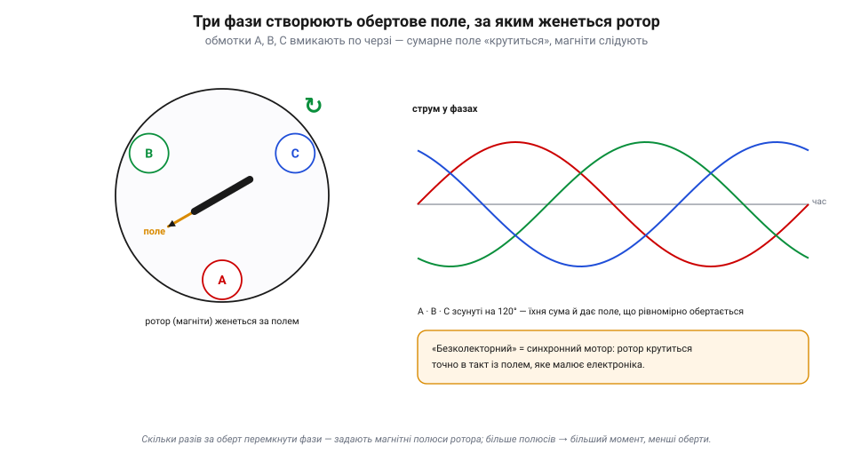
*Рис. 7.3.4.2. Серце BLDC — обертове магнітне поле. Струм по черзі тече через обмотки A, B, C (унизу — їхні струми, зсунуті на 120°), і сумарне поле плавно обертається. Магніти ротора синхронно слідують за ним — тому BLDC і називають **синхронним** мотором: ротор крутиться точно в такт із полем, яке малює електроніка. Скільки перемикань на оберт — задає число магнітних полюсів ротора.*

Кількість пар полюсів ротора визначає передачу між «електричними» обертами поля й «механічними» обертами вала: більше полюсів — більший момент, але менші оберти (тому підйомні мотори роблять багатополюсними). А сама ідея обертового поля — не нова й не дронова.

> 📜 Обертове магнітне поле відкрили на зорі епохи змінного струму, причому **двоє вчених незалежно**. Італієць **Галілео Ферраріс** (*Galileo Ferraris*) продемонстрував його й оприлюднив у березні 1888 року в Туринській академії; майже водночас серб **Нікола Тесла** (*Nikola Tesla*), що задумав ідею ще близько 1882-го, запатентував свій багатофазний двигун 1888-го й передав його компанії Westinghouse (згадай «війну струмів» з історії Розділу 1.2). Їхні мотори були **індукційні** (струм у роторі наводився полем), а сучасний BLDC ставить на ротор готові постійні магніти й перемикає фази транзисторами — але серце те саме, те обертове поле, якому вже понад сто років.

Перемикати фази можна по-різному, і це варто знати наперед. Класичний стиль — **трапецоїдний** (шість грубих кроків на електричний оберт): фази вмикаються повними «сходинками». Він простий і надійний, але на малих обертах дає ривки й характерне гудіння. Сучасніший — **синусоїдний**, а в досконалому вигляді **векторне керування** (*FOC*): струм у фазах ведуть плавно, як справжні синусоїди з Рис. 7.3.4.2, і мотор крутиться тихо й рівно навіть повільно. Який стиль застосувати — вирішує вже ESC, тож деталі лишимо наступній темі; тут досить знати, що та сама трифазна машина може крутитися або «сходинками», або гладко.

### KV: головна цифра мотора

На кожному безколекторному моторі написано число **KV**. Це його «характер»: **KV — це оберти на хвилину на кожен вольт** (на холостому ходу). Мотор 1000KV без навантаження крутитиметься приблизно 1000 об/хв на кожен прикладений вольт.

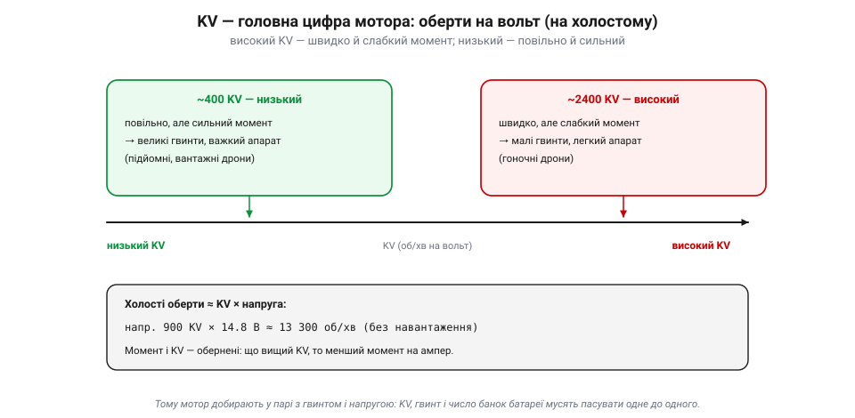
*Рис. 7.3.4.3. KV задає компроміс «швидкість проти моменту». Низький KV (скажімо, 400) — мотор крутиться повільно, але з великим моментом: під великі гвинти й важкі апарати. Високий KV (скажімо, 2400) — швидко, але момент малий: під малі гвинти гоночних дронів. Холості оберти ≈ KV × напруга, а момент і KV обернені: що вищий KV, то менший момент на ампер струму.*

Порахуймо на прикладі, бо це найпрактичніша формула розділу:

**Приклад (оберти з KV).** Мотор 900KV живиться від батареї 4S (чотири банки літію, ≈ 14.8 В):

```
холості оберти ≈ KV × напруга
              ≈ 900 × 14.8
              ≈ 13 300 об/хв   (без гвинта, без навантаження)
```

Із гвинтом мотор крутитиметься помітно повільніше (гвинт навантажує його), але порядок зрозумілий. Звідси й мистецтво добору: **KV, гвинт і число банок батареї мусять пасувати одне одному** — високий KV із великим гвинтом перевантажить мотор і спалить його, а низький KV із малим гвинтом не дасть тяги.

Корисно бачити й повну картину потужності. Механічна потужність мотора — це **момент, помножений на оберти**. Тому той самий мотор може віддати потужність або як «багато моменту на малих обертах», або як «мало моменту на високих» — а KV лише зміщує цей баланс. Гвинт же «забирає» потужність тим жадібніше, чим швидше крутиться (його опір росте з обертами), і саме перетин характеристик мотора й гвинта задає робочу точку. Ось чому мотор і гвинт завжди добирають **разом**, а не окремо.

> 🔧 **Навіщо це.** KV — перше, на що дивляться, добираючи чи впізнаючи мотор. Бачиш високий KV (2000+) — це швидкісний мотор під малий гвинт; низький (кількасот) — тяговий під великий. І пам'ятай зв'язок із тягою: тяга гвинта зростає приблизно як **квадрат** обертів, тож невелика зміна обертів помітно міняє підйомну силу.

Окрім KV, на моторі часто стоїть і код розміру — наприклад, **2207**. Це габарити статора: діаметр близько 22 мм і висота близько 7 мм. Чим більший статор (більше заліза й міді), тим більший момент і тим краще мотор відводить тепло, — тому важчі апарати беруть «товстіші» мотори. Повний «паспорт» мотора читається як пара: **розмір статора** каже про потужність і момент, а **KV** — про швидкісний характер. Маленький високо-KV мотор — для легкого швидкого дрона; великий низько-KV — для важкого тягового.

### Зворотна ЕРС: чому мотор сам не розганяється безмежно

Якщо оберти ростуть із напругою — чому ж мотор не розкручується до нескінченності? Через явище, що ми вже знаємо з Розділу 2.2: **зворотну ЕРС**. Магніти ротора, обертаючись повз обмотки, **наводять** у них напругу — і за законом Ленца вона спрямована **проти** прикладеної. Що швидше крутиться мотор, то більша ця зустрічна напруга.

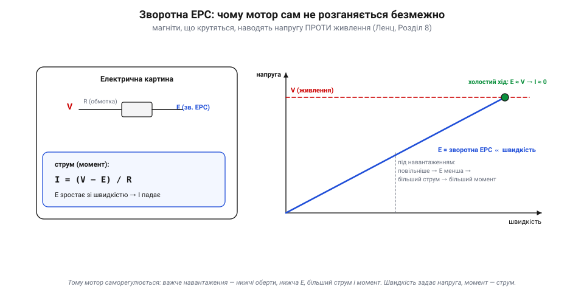
*Рис. 7.3.4.4. Чому мотор саморегулюється. Струм в обмотці (а отже, момент) визначає різниця `(V − E)/R`, де E — зворотна ЕРС, що росте зі швидкістю. На холостому ходу мотор розганяється, поки E майже не зрівняється з напругою живлення V, — тоді струм падає майже до нуля, і оберти більше не ростуть. Під навантаженням ротор крутиться повільніше, E менша, різниця більша — тече більший струм і мотор розвиває більший момент.*

Це робить мотор елегантно **саморегульованим**. Прикладена напруга задає **швидкість** (мотор розганяється, поки зворотна ЕРС її не врівноважить), а навантаження само витягує потрібний **струм** (а отже, момент): важче навантаження → нижчі оберти → менша зворотна ЕРС → більший струм і момент. Тому коротко кажуть: **швидкість задає напруга, момент — струм**. А керує ефективною напругою на моторі саме ESC, швидко вмикаючи й вимикаючи живлення (ШІМ із Розділу 4.7).

Варто розкрити цю думку, бо вона неочевидна. ESC **не міняє** напругу батареї — та стала. Натомість він дуже швидко вмикає й вимикає живлення обмоток: що більша частка часу «ввімкнено» (шпаруватість), то вища **середня** напруга на моторі, то вищі оберти. Команда «газ 60%» означає приблизно «тримай ефективну напругу 60% від батареї». Тому той самий мотор на тій самій батареї слухняно йде від нуля до максимуму — швидкістю керує не джерело, а **шпаруватість** ключів ESC. Це прямий нащадок ідеї ШІМ із Розділу 4.7, тільки на трьох фазах одразу.

> 🔧 **Навіщо це.** Звідси й розуміння, чому мотор **гріється під навантаженням**: більший момент = більший струм = більші втрати I²R в обмотці (Розділ 1.3). Перевантажений гвинтом чи заклинений мотор тягне величезний струм (зворотної ЕРС майже нема) і швидко згорає. Дивний нагрів мотора — майже завжди ознака поганого добору гвинта чи механічного опору.

Звідси й теплові межі, спільні для всієї силової частини. Жоден мотор не ідеальний: частина енергії завжди гине на опорі обмоток (втрати I²R) і в залізі, перетворюючись на тепло. Тому мотор має **номінальний струм** і максимальну потужність — перевищиш їх надовго, і ізоляція обмоток перегріється та вийде з ладу. Виробники дають межі, а інженер тримає **запас** (рівно як із резисторами в Розділі 1.3): мотор, що в польоті ледь теплий, прослужить роками; той, що обпікає пальці, — на межі зриву. Тепло — головний ворог не лише мотора, а й усього, що далі по силовому тракту.

### Як ESC знає, коли перемикати: зворотна ЕРС знову

Лишилося питання: щоб правильно перемикати фази, ESC мусить **знати положення ротора**. Як він його дізнається без жодного давача? Знову через зворотну ЕРС.

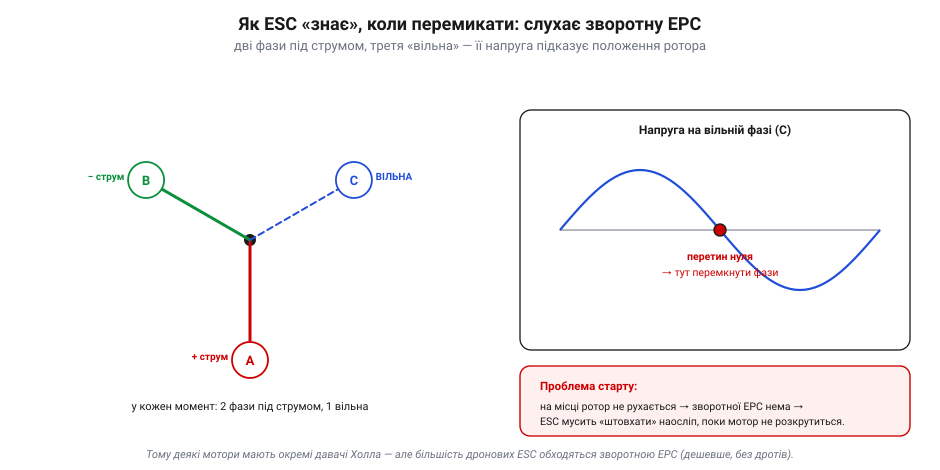
*Рис. 7.3.4.5. Безсенсорна комутація. У кожен момент дві фази під струмом, а третя — «вільна». На цій вільній фазі магніти ротора наводять зворотну ЕРС, і момент, коли вона перетинає нуль, точно каже ESC, де ротор, — отже, коли перемикати на наступний крок. Хитро й без жодного дроту-давача. Слабке місце — **старт**: нерухомий ротор не наводить ЕРС, тож ESC мусить спершу «штовхати» мотор наосліп, поки той не розкрутиться.*

Саме тому безколекторні мотори інколи **сіпаються або пищать** на старті — це ESC наосліп розгойдує ротор, поки зворотна ЕРС не стане досить великою, щоб її «почути». Альтернатива — вбудовані **давачі Холла**, що прямо міряють положення ротора (тоді старт плавний), але це дорожче й потребує зайвих дротів, тож більшість дронових ESC обходяться зворотною ЕРС.

> 🔧 **Навіщо це.** Це пояснює знайому поведінку: легке посмикування мотора перед стартом — норма для безсенсорних ESC. А от якщо мотор **не може зрушити** з місця, тільки пищить, — часто це невдалий старт під навантаженням, заклинений вал або проблема ESC, а не «згорілий» мотор. Розуміючи, що старт безсенсорного мотора — окремий важкий режим, легше діагностувати.

### Підсумок теми

Безколекторний мотор — це вивернутий навиворіт класичний: обмотки нерухомі на статорі, магніти крутяться на роторі, а перемикає струм електроніка, а не щітки. Працює він на **трьох фазах**, що по черзі творять обертове магнітне поле (ідея Ферраріса й Тесли), за яким синхронно женеться ротор. Його характер задає **KV** — оберти на вольт: високий KV для швидкості й малих гвинтів, низький для моменту й великих. **Зворотна ЕРС** робить мотор саморегульованим (швидкість від напруги, момент від струму) і заодно дозволяє ESC визначати положення ротора без давачів. Але сам по собі мотор — лише півсправи: три його фази треба ще й правильно живити. Цим займається регулятор обертів, до якого й переходимо.

---

## 7.3.5 Регулятор обертів (ESC): як керує мотором

У попередній темі ми сказали: безколекторним мотором не можна керувати, просто подавши напругу, — потрібен «розумний» драйвер. Цей драйвер і є **регулятор обертів** (*electronic speed controller*, ESC). Він стоїть між політним контролером і мотором: контролер каже йому «скільки газу», а ESC робить усю силову й брудну роботу — перемикає фази, тримає такт і дозує потужність. По суті, ESC — це окремий **крихітний комп'ютер**, присвячений одному мотору.

### Три роботи ESC

Усе, що робить ESC, зводиться до трьох робіт:

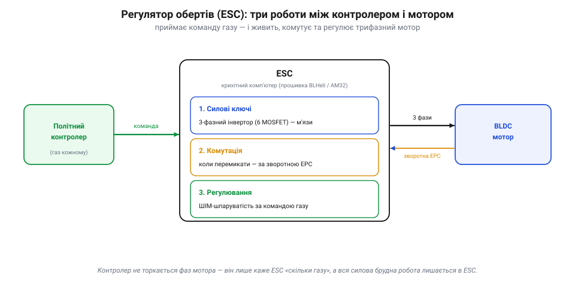
*Рис. 7.3.5.1. Три роботи ESC. **Силові ключі** — трифазний інвертор із шести MOSFET, що власне підмикає фази мотора до батареї (м'язи). **Комутація** — рішення, коли яку фазу перемкнути, за зворотною ЕРС із 7.3.4 (мозок-таймер). **Регулювання швидкості** — дозування ефективної напруги шпаруватістю ШІМ за командою газу. Контролер не торкається фаз мотора — лише шле ESC число «газ».*

Зверни увагу на поділ відповідальності, знайомий ще з Розділу 7.1: політний контролер тримає **високий рівень** («цьому мотору 60% газу»), а ESC — **низький, силовий** («у яку наносекунду який транзистор відкрити»). Це той самий принцип шарів: брудну роботу з кіловатами й наносекундами ізолюють у спеціалізованому пристрої.

Варто на мить піднятися над окремим ESC і глянути, **звідки** береться його команда. Контролер не думає «мотору 1 — 60%, мотору 2 — 55%». Він мислить величинами апарата: «нахилитись уперед на стільки, повернути на стільки, дати стільки загальної тяги». А окремий крок — **мікшер** (*mixer*) — перетворює це бажання на персональне число газу для **кожного** мотора, знаючи геометрію апарата (де який мотор і в який бік крутить). Скажімо, щоб нахилити квадрокоптер уперед, мікшер додає газу заднім моторам і знімає з передніх. Кожен ESC дістає свій результат і виконує його, нічого не знаючи про загальний задум. Це знову той самий поділ рівнів: контролер мислить апаратом, мікшер розкладає на мотори, ESC править кожним окремо.

Корисно пам'ятати й те, що зв'язок «газ → тяга» **нелінійний**: тяга росте приблизно як квадрат обертів (7.3.4), тож апарат зависає десь на 30–50% газу, а решту лишають **запасом** на маневри й вітер. Якщо завис уже близько до повного газу — апарат перевантажений: керувати ним майже нічим, бо «вгору» вже нема куди. Тому добру збірку роблять так, щоб зависання припадало ближче до середини діапазону газу.

> 🔧 **Навіщо це.** ESC — не «дріт», а самостійний обчислювач зі своєю **прошивкою** (популярні: закрита **BLHeli_32** і відкриті **AM32**, **BLHeli_S**/**BlueJay**). У нього є власні налаштування, телеметрія й навіть оновлення прошивки. Тому, читаючи чужий апарат, став ESC у той самий ряд, що й політний контролер: це ще один програмований вузол, який може мати свою конфігурацію й свої баги.

### Силова частина: трифазний інвертор

Серце ESC — **трифазний інвертор**: шість силових MOSFET (Розділ 2.7), зібраних у три **півмости**. Кожен півміст може підмкнути свою фазу або до «плюса», або до «мінуса» батареї, а керує їхніми затворами мікроконтролер ESC.

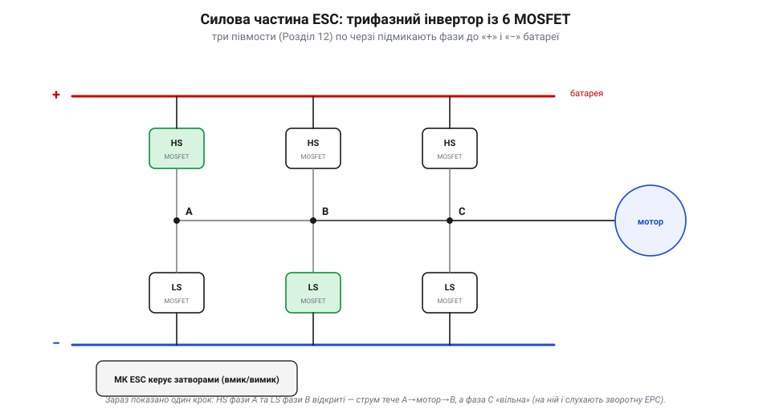
*Рис. 7.3.5.2. Силова частина ESC — це шість MOSFET (три півмости). Щоб прокрутити мотор, ESC по черзі відкриває потрібні пари: на рисунку верхній ключ фази A та нижній ключ фази B відкриті, тож струм тече «+ → A → мотор → B → −», а фаза C лишається вільною (на ній і слухають зворотну ЕРС). Перемикаючи ці пари у правильному порядку, інвертор і малює обертове поле з 7.3.4.*

Тут сходяться кілька знайомих ниток. **MOSFET** (Розділ 2.7) — бо вони перемикають великі струми з мізерними втратами й дуже швидко. Обмотки мотора **індуктивні**, тож при кожному перемиканні виникають викиди напруги (Розділ 2.2), які гасять вбудовані діоди MOSFET — точно та сама проблема flyback, що ми вже бачили. А ще на цих шести транзисторах виділяється **тепло** (втрати при провідності й перемиканні) — друга половина теплової історії з 7.3.4: гріється не лише мотор, а й ключі ESC, тому в потужних ESC є радіатори й струмові межі.

Кілька важливих деталей силової частини. По-перше, маленький МК ESC **не може сам** хитати масивні затвори силових MOSFET — між ними стоїть **драйвер затворів** (*gate driver*), що дає потужні короткі імпульси на відкриття й закриття (а для верхніх ключів — ще й хитро «підняти» керування вище за плюс батареї). По-друге, інвертор перемикає ключі ШІМ-ом на високій частоті — десятки кілогерц, досить високій, щоб мотор «бачив» гладку середню напругу, а не окремі імпульси, і щоб писк лежав за межею чутного.

Багато ESC роблять і додаткову послугу — **BEC** (*battery eliminator circuit*): вбудований перетворювач, що з високої напруги батареї робить стабільні 5 В для живлення контролера, приймача чи серво. Це позбавляє окремого джерела, але має межу за струмом — переобтяжиш BEC, і впаде живлення всієї електроніки. Тому на серйозних апаратах живлення логіки часто виносять в окремий надійніший модуль (про живлення складних систем — Розділ 7.4).

На мультикоптерах чотири ESC часто об'єднують в одну плату — **4-in-1**: компактно, спільне живлення, менше дротів. А оскільки ESC має прошивку, у нього є й **налаштування**: напрям обертання (щоб не перепаювати фази — досить змінити його програмно), стиль комутації (трапеція чи синус), потужність старту, гальмування. Тож «налаштувати мотори» — це інколи саме конфігурація ESC, а не контролера.

А оскільки прошивка ESC відкрита, у неї є й тонші ручки, які часом рятують збірку: **випередження комутації** (timing) під конкретний мотор, компенсація розмагнічування на високих обертах, плавність і потужність старту. Більшості апаратів вистачає типових значень, але знати, що ці ручки є, корисно: дивний свист, зриви чи кепський старт мотора часто лікуються саме в налаштуваннях ESC, а не заміною заліза.

> 🔧 **Навіщо це.** Тепер «6 MOSFET» у даташиті ESC — не магія, а буквально три півмости з Розділу 2.7. І зрозуміло, чому ESC має **струмовий номінал** (скажімо, «40 A»): це межа, яку витримають його ключі, перш ніж перегрітися. Мотор, що тягне більше струму, ніж розрахований ESC, спалить **регулятор**, а не лише себе. Тому ESC завжди добирають із запасом за струмом під свій мотор і гвинт.

### Сигнал від контролера: від PWM до DShot

Як саме контролер передає ESC команду газу? Тут відбулася ціла маленька еволюція, і знати її варто, бо протокол ESC — одне з перших, що впізнаєш на чужому апараті.

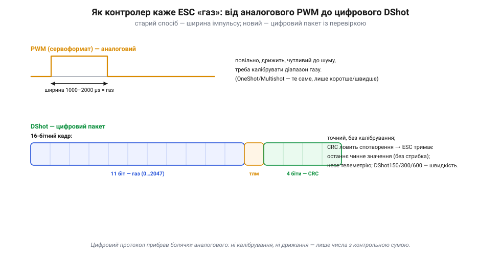
*Рис. 7.3.5.3. Як контролер каже ESC «газ». Старий спосіб — **аналоговий PWM** сервоформату: ширина імпульсу від 1000 до 2000 мкс кодує газ від 0 до 100%. Простий, але повільний, чутливий до шуму й потребує калібрування діапазону. Новий — **DShot**: цифровий 16-бітний кадр (11 біт газу + 1 біт запиту телеметрії + 4 біти CRC). Точний, без калібрування, із вбудованою перевіркою на спотворення.*

Подивімося на цифровий кадр зблизька — він гарно показує, наскільки «дорослішим» став сигнал:

```
Кадр DShot (16 біт):
  11 біт газу       → 2048 значень  (0 = роззброїти; 48…2047 = газ; 1…47 — команди)
   1 біт телеметрії  → запит даних від ESC
   4 біти CRC        → ESC може виявити спотворений кадр (реакція залежить від прошивки)
```

Краса DShot — не лише в точності. CRC дає ESC змогу **виявити** спотворений завадою кадр (і не сприйняти його за випадковий стрибок газу) — а що робити далі (відкинути, утримати останнє значення, перейти у власний failsafe), вирішує його прошивка; немає й калібрування діапазону (числа абсолютні); а ще той самий канал несе **команди** (бікнути, змінити напрям) і **телеметрію**. Швидші варіанти — DShot150, 300, 600 — відрізняються лише темпом передачі.

Чому ж аналоговий PWM відходить? Окрім калібрування (треба «показати» ESC, де 0% і де 100% газу, інакше діапазони не збігаються), він **повільний** і **дрижить**: позиція фронту імпульсу плаває від шуму, а оновлюється лише десятки-сотні разів на секунду. А команда газу — це **останній крок** швидкого контуру з Розділу 7.1: контролер порахував, скільки тяги дати кожному мотору, і мусить це передати негайно. Тому темп і затримка протоколу ESC прямо впливають на чуйність апарата: чим швидше й точніше команда доходить до інвертора, тим жвавіше апарат тримає рівновагу. DShot виграє не лише точністю, а й малою затримкою — він закриває контур щільніше.

> 📜 І PWM-протокол, і його цифрові нащадки — спадок тієї самої спільнотної, відкритої культури, що й ArduPilot. Прошивку для ESC здебільшого пишуть відкрито (**AM32**, **BLHeli_S**, **BlueJay**) — хоч найпоширеніша донедавна **BLHeli_32** була, навпаки, **закрита** (її розробку 2024-го згорнули, естафету перебрав відкритий AM32); а протокол **DShot** народився в спільноті FPV-перегонів близько 2016 року саме щоб позбутися болячок аналогового PWM — калібрування, дрижання, повільності. Так само, як ArduPilot зробив відкритим «великий мозок» апарата, ця спільнота зробила відкритим «маленький мозок» кожного мотора. Відкритість тут — не ідеологія, а інженерна зручність: будь-хто може вдосконалити прошивку дешевого ESC.

> 🔧 **Навіщо це.** Протокол ESC — практичне знання. Бачиш на апараті стару добру PWM — чекай калібрування й нижчої чуйності; бачиш DShot — маєш точність, телеметрію й захист від завад «з коробки». І пам'ятай: контролер та ESC мусять **узгодити** протокол; неспівпадіння — часта причина, чому мотори «не оживають» на новій збірці.

### Зворотний зв'язок і захист

Сучасний ESC не лише сліпо крутить — він **доповідає** й **захищає себе**:

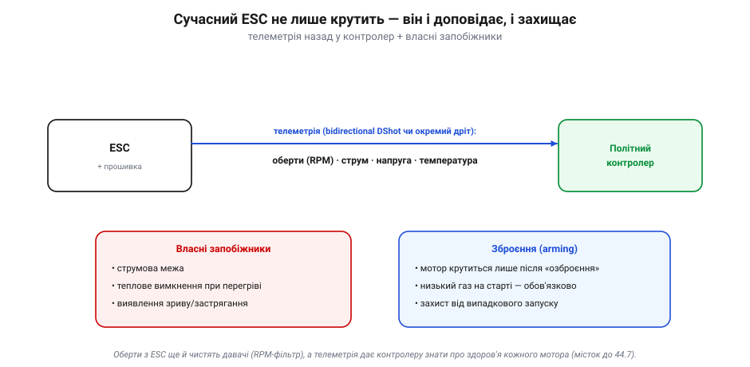
*Рис. 7.3.5.4. ESC як двосторонній учасник. По телеметрії він повертає контролеру оберти, струм, напругу й температуру — тож контролер «знає здоров'я» кожного мотора. (Тонкість: **двонапрямлений DShot** тим самим дротом повертає насамперед **оберти** (eRPM); струм, напругу й температуру дає або **окремий** дріт телеметрії, або розширення *Extended DShot Telemetry*, якщо його підтримують обидві сторони.) Має й власні запобіжники: струмову межу, теплове вимкнення при перегріві, виявлення зриву. А зброєння (*arming*) не дає мотору крутитися, поки система не озброєна й газ не на нулі.*

Особливо корисні **оберти** з телеметрії: знаючи точну частоту обертання мотора, контролер може вичистити саме її гармоніку з показань гіроскопа (так званий RPM-фільтр) — тобто телеметрія ESC покращує навіть **відчуття** апарата.

Найновіші ESC уміють **двонапрямлений DShot**: той самий єдиний сигнальний дріт носить і команду газу туди, і **оберти** мотора назад — без жодного окремого дроту (а напругу/струм/температуру, як треба, дає окрема телеметрія). Звідси сучасний RPM-фільтр дістається майже «безплатно»: контролер знає точні оберти кожного мотора щомиті й вичищає їхній шум із гіроскопа. Маленька цеглинка протоколу, а помітно піднімає якість польоту — і черговий приклад, як цифровий зв'язок зробив можливим те, чого аналоговий PWM не вмів у принципі. А виявлення зриву й температура — це вже місток до надійності: контролер може помітити, що мотор «нездоровий», і відреагувати, про що — наприкінці розділу (7.3.7).

Згадаймо й про **зброєння**: ESC навмисне не дасть мотору крутитися, поки апарат не «озброєно» й газ не на нулі. Це проста, але критична безпека — щоб гвинти не закрутилися від випадкового сигналу чи перешкоди, поки людина поряд.

Ще одна корисна здатність — **активне гальмування** (його ще звуть «damped light»): замкнувши фази мотора накоротко, ESC різко його гальмує, замість дати вільно обертатися за інерцією. Для спритного апарата це важливо: коли контролер просить **зменшити** тягу, мотор має сповільнитися негайно, а не «викочуватися» секунду за інерцією. Без гальмування апарат реагував би на команди «вниз» мляво й запізно. Тому жваві мультикоптери майже завжди літають з увімкненим гальмуванням — це ще один спосіб, яким ESC впливає на якість керування, а не лише крутить мотор.

> 🔧 **Навіщо це.** Якщо мотор не крутиться — перше питання не «згорів?», а «чи озброєно й чи на нулі газ?». А телеметрія ESC у логах (RPM, струм, температура кожного мотора) — золото для діагностики: по ній видно, який мотор перевантажений, який гріється, а який раптом втратив оберти. Це часто перше місце, куди дивляться, шукаючи причину дивної поведінки чи падіння.

### Підсумок теми

ESC — це силовий «виконавець» між контролером і безколекторним мотором, що робить три речі: **перемикає потужність** (трифазний інвертор із шести MOSFET, Розділ 2.7), **тримає такт комутації** (за зворотною ЕРС) і **дозує швидкість** (шпаруватістю ШІМ за командою газу). Команду він дістає цифровим протоколом — сучасний **DShot** несе газ, телеметрію й CRC замість старого аналогового PWM. Назад ESC віддає оберти, струм і температуру, має власні запобіжники й вимагає зброєння. А сам він — програмований вузол зі своєю відкритою прошивкою, маленький брат великого політного контролера. Зрештою мотор, гвинт, ESC і батарея — це один **рушійний вузол**, що працює лише злагоджено: KV мотора, крок і діаметр гвинта, струм ESC і напруга батареї мусять пасувати одне одному, і зміниш одне — переглянь решту. Тому досвідчені складальники говорять не «мотор такий-то», а «зв'язка: такий мотор + такий гвинт + стільки банок + такий ESC» — бо саме зв'язка визначає тягу, струм і нагрів, а не жоден компонент поодинці.

Разом мотор і ESC дають апарату **тягу**. Але не всі апарати керуються лише тягою: літакам і деяким машинам потрібні ще й рухомі поверхні. Про серворушії та керма — далі.

---

## 7.3.6 Серво й керма; узгодження сигналів керування

Мультикоптер керує собою самою лише **тягою** — змінюючи оберти моторів. Але літак нахиляє елерони, руль висоти й напряму; гелікоптер змінює крок лопатей; ровер повертає колеса; камера висить на стабілізованому підвісі. Усе це — рух **механічних поверхонь**, і робить його інший виконавчий механізм — **серворушій** (*servo*). А ще лишається питання, спільне для всіх виходів: як зробити, щоб сигнал контролера **підійшов** саме цьому виконавцю. Цим — узгодженням сигналів — і завершимо огляд виконавчої частини.

### Серво: маленький контур, що тримає кут

Найважливіше зрозуміти одразу: серво й мотор — принципово різні. Моторові ти командуєш **швидкість**, і він крутиться безперервно. Серво ти командуєш **кут**, і воно повертає вал у цю позицію й **тримає** її. Як воно це робить? Усередині — крихітний замкнений контур:

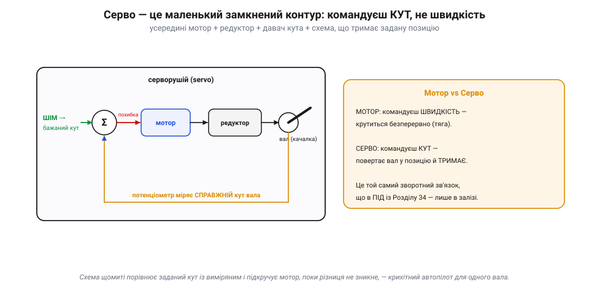
*Рис. 7.3.6.1. Серво — це міні-автопілот для одного вала. Усередині: маленький мотор через редуктор крутить вихідний вал (качалку), а **потенціометр** на валу міряє його **справжній** кут. Схема щомиті порівнює заданий кут (із ширини імпульсу) з виміряним і підкручує мотор, поки різниця не зникне. Це той самий зворотний зв'язок, що й ПІД із Розділу 5.8, тільки відлитий у залізо й присвячений одному валу.*

Тобто всередині серво ховається вся логіка Розділу 5.8 у мініатюрі: **помилка → корекція → вимір → знову помилка**. Подаси команду «30°» — серво активно тримає 30°, опираючись зовнішнім силам (вітру на кермі, навантаженню на колесі); штовхнеш вал — воно поверне його назад. Саме тому серво ставлять там, де треба **утримувати позицію** проти зусиль, а не просто крутити.

Кілька рис цього внутрішнього контуру варто знати. У серво є **мертва зона** (deadband) — крихітний діапазон навколо цілі, де воно вже «не смикається», щоб не дрижати без потреби; звідси й невелика неточність утримання. На краях ходу серво впирається в механічний обмежувач — туди не варто «тиснути» командою надовго, бо мотор гудітиме під струмом намарно. А **момент утримання** — це сила, з якою серво опирається спробі зрушити вал: що вона більша, то твердіше кермо стоїть проти потоку, але то більший струм серво тягне під навантаженням.

І не лише керма. Серво рухають усе, що має ставати в позицію: підвіси камер (тримати горизонт чи вести ціль), забірне шасі, скиди вантажу, заслінки, навіть випуск парашута. Скрізь та сама ідея — «стань у заданий кут і тримай», — тож, упізнавши серво, питай не «що це», а «яку поверхню чи механізм воно позиціює».

> 📜 Слово «серво» — від **серворушія** (*servomechanism*): систем, що за зворотним зв'язком тримають механізм у заданому положенні. Їх відточили у XX столітті для серйозних задач — стернування кораблів, наведення гармат і антен (особливо у Другу світову, де точність наведення вирішувала все). Хобі-серво з радіокерованих моделей — прямий мініатюрний нащадок тих важких систем; та сама ідея зворотного зв'язку, лише завбільшки із сірникову коробку.

> 🔧 **Навіщо це.** Тримай розрізнення «мотор ↔ серво» завжди: мотор крутить (швидкість/тяга), серво позиціює (кут і утримання). На чужому апараті це одразу каже, що чим керується: бачиш серво на кермі — ним правлять **кутом** через окрему петлю; бачиш мотор на гвинті — ним правлять **обертами** через ESC.

### Сигнал серво: ширина імпульсу = кут

Як контролер каже серво потрібний кут? Тим самим **класичним RC-сигналом**, що ми вже зустріли в простого ESC (7.3.5):


*Рис. 7.3.6.2. Мова серво — ширина імпульсу. Імпульс ~1000 мкс ставить качалку в один край, ~1500 мкс — у центр (нейтраль), ~2000 мкс — в інший край; повторюється кожні ~20 мс (≈50 Гц). Це десятиліттями спільний «RC-стандарт» виконавчих механізмів моделей — тому той самий сигнал розуміє і простий регулятор обертів.*

Серво бувають **аналогові** й **цифрові**. Аналогове підкручує мотор приблизно з тим самим темпом ~50 Гц, що й вхідний сигнал; цифрове має всередині швидший внутрішній цикл (сотні герц), тож реагує жвавіше, міцніше тримає позицію й дає більший момент — але споживає більше струму. Решта характеристик серво — **момент** (скільки кг·см утримає на качалці), **швидкість** (секунд на 60° повороту), напруга й матеріал шестерень (пластик чи метал).

Розміри теж різні — від «стандартних» (класична коробочка ~40 г) до мікро- й субмікро-серво для маленьких апаратів. Окрім розміру, серво різняться шестернями (пластик — легше й дешевше; метал — міцніше під ударним навантаженням), наявністю підшипника на валу та робочою напругою (часто 5 чи ~7.4 В — вища дає більший момент і швидкість). Підбираючи серво, дивляться на трійцю «момент — швидкість — вага» під конкретну поверхню: важке кермо швидкого літака потребує сильного й прудкого серво, легкий елерон малятка — крихітного.

Варто знати й межі класичного RC-сигналу. Ширину імпульсу 1000–2000 мкс контролер і приймач розрізняють приблизно з кроком у мікросекунду — звідси близько тисячі градацій кута: зазвичай досить, але не більше. До того ж аналоговий імпульс трохи **дрижить** від шуму, а оновлюється лише ~50 разів на секунду. Для цифрових серво контролер може гнати сигнал частіше (сотні герц), а сучасні цифрові протоколи виходу (рідня тих, що в ESC) поступово приходять і сюди — але добрий старий «півтори мілісекунди» досі лишається спільною мовою виконавчих механізмів.

Останнє про сам сигнал: серво (як і ESC) має три проводи — живлення, землю й сигнал. Сигнальний несе ті самі 1–2 мс імпульси, а от **спільна земля** з контролером обов'язкова: без неї імпульс «нема відносно чого» міряти, і серво поводиться хаотично. Тому за роздільного живлення серво й логіки їхні землі однаково **з'єднують**. Дрібниця, але забути її — класична причина, чому «все підключив, а серво смикається».

> 🔧 **Навіщо це.** «1–2 мс, 50 Гц» — мова, яку розумієш тепер і ти, і будь-який приймач: 1.5 мс — це нейтраль. А вибираючи серво, дивись на **момент** і **швидкість**: замалий момент — і кермо «віддуватиме» назад потоком повітря; замала швидкість — і апарат реагуватиме на команди із запізненням. Цифрове тримає краще, але дужче гріється й тягне струм.

### Від серво до поверхні: качалка й тяга

Оберт серво ще треба **передати** на кермо. Робить це проста механіка:

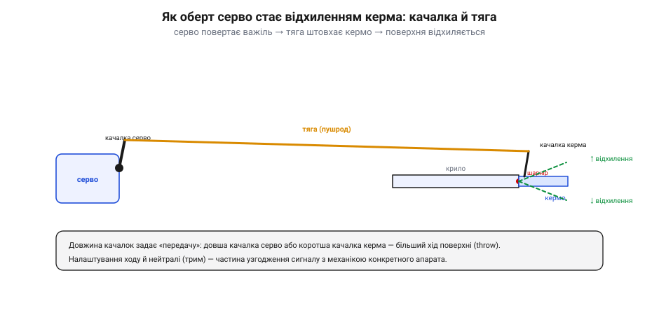
*Рис. 7.3.6.3. Від оберту до відхилення. Серво повертає свій важіль (качалку), жорстка **тяга** (пушрод) передає рух на качалку керма, і поверхня відхиляється на шарнірі. Довжини качалок задають «передачу»: довша качалка серво або коротша качалка керма — більший хід поверхні. Налаштування ходу й нейтралі (трим) — частина узгодження сигналу з конкретною механікою.*

Тут і ховається перший рівень **узгодження** — механічний. Хід поверхні (throw) має бути таким, як треба апарату: замалий — мляве керування, завеликий — апарат смикається й може зірватися в потік. Нейтраль качалок виставляють так, щоб за сигналу 1500 мкс поверхня стояла рівно. Це роблять і механічно (довжина тяг, отвори в качалках), і програмно (трим, межі ходу в налаштуваннях виходу).

Налаштовуючи механіку, дбають про дві речі. По-перше, **нейтраль**: серво ставлять у центр (1500 мкс) і вже тоді кріплять качалку та тягу так, щоб поверхня стояла рівно, — а дрібний залишок прибирають тримом. По-друге, **люфт** (backlash): будь-яка слабина в качалках, тягах і кріпленнях означає, що поверхня трохи «гуляє» незалежно від серво, — а це шум і неточність у самому кінці контуру керування. Тому тяги роблять жорсткими, а з'єднання — щільними: млява механіка зведе нанівець найточніше серво.

> 🔧 **Навіщо це.** Якщо в чужого апарата кермо стоїть не по центру в нейтралі або ходить замало/забагато — дивись на механіку тяг і на налаштування ходу/триму виходу, а не на «зламане серво». І пам'ятай про **навантаження**: серво на великому кермі швидкого літака відчуває потужний потік — момент серво має його перебороти, інакше керма «віддме».

### Узгодження сигналів: вихідний каскад

Тепер — головне узагальнення теми, заради якого вона й існує. Для контролера **мотори й серво — це однакові «виходи»**. Він не мислить «ШІМ на пін 3»; він мислить бажаним рухом апарата — і спеціальний каскад розкладає це бажання по фізичних виходах:


*Рис. 7.3.6.4. Як бажаний рух стає сигналами виконавцям. Контролер видає бажані крен, тангаж, курс і тягу; **мікшер** (з 7.3.5) розкладає їх по фізичних виходах за геометрією апарата; а кожен вихід проходить **узгодження** — масштаб, реверс, трим, положення failsafe — і йде до свого виконавця: мотора через ESC або серво. Для контролера обидва типи — просто пронумеровані «виходи».*

«Узгодження сигналів керування» — це і є цей останній крок: зробити так, щоб абстрактна команда контролера правильно лягла на **конкретний** виконавець. Воно охоплює:

- **мікшування** за схемою апарата (літак, крило, V-подібний хвіст, мультиротор);
- **масштаб і межі** (endpoints) — щоб повний хід команди дав потрібний, але не надмірний хід поверхні;
- **реверс** — якщо серво стоїть «дзеркально», напрям перевертають програмно;
- **трим** — зсув нейтралі;
- **положення failsafe** — куди стати виходу, якщо зв'язок чи система відмовлять.

Найвиразніший приклад мікшування — **елевони** «літаючого крила», де немає окремих елеронів і руля висоти: дві поверхні роблять і те, й те разом:

```
літаюче крило (елевони):
  лівий елевон  = тангаж + крен
  правий елевон = тангаж − крен
   → обидва вгору  = підняти ніс (тангаж)
   → різнойменно   = накренити (крен)
```

Той самий принцип — V-подібний хвіст (руль напряму + висоти на двох поверхнях), диференціал коліс ровера тощо. Мікшер ховає цю геометрію, тож решта стека лишається однаковою для будь-якого апарата (згадай шари ArduPilot із 7.1.3: `SRV_Channels` — це саме цей вихідний каскад).

Ще складніший приклад — **автомат перекосу** (swashplate) гелікоптера: три (а то й більше) серво разом нахиляють тарілку, що змінює крок лопатей. Щоб підняти ніс — серво рухаються в одній комбінації, щоб дати загальний крок угору — синхронно, щоб накренити — в іншій. Жодне серво тут не відповідає за «один» канал — кожне є **сумою** кількох команд за геометрією тарілки. Це той самий мікшер, доведений до краю: кілька входів керування розкладаються на кілька серво за тригонометрією механізму.

Варто оцінити силу цієї абстракції «виходів». У зрілій прошивці кожному фізичному виходу **призначають функцію** (цей пін — елерон, той — руль висоти, той — мотор 1), і логіка апарата оперує функціями, а не пінами. Завдяки цьому **та сама прошивка** літає геть різними апаратами: щоб зробити з мультикоптера літак, не переписують код — лише перепризначають виходи й вибирають інший мікшер. Залізо інше, стек той самий — рівно та переносність, що ми хвалили в архітектурі (7.1.3).

Окремо про **failsafe-положення** виходів. На відміну від мультикоптера, який при втраті зв'язку виконує наперед задану дію (залежно від налаштувань — RTL, SmartRTL, посадку чи навіть «нічого не робити»; а як GPS непридатний, RTL зазвичай переходить у посадку), апарат із кермами мусить знати, **куди поставити кожну поверхню**, якщо все піде не так: газ — на нуль (чи в режим планування), керма — у безпечне положення (часто легкий крен і набір висоти по колу, поки зв'язок не відновиться). Ці положення задають наперед — і це знову та сама думка з 7.1.2: реакція на відмову має бути зашита заздалегідь, а не вигадуватися в аварії.

> 🔧 **Навіщо це.** Це найпрактичніша річ розділу. Перше, що перевіряють на новому апараті, — **узгодження виходів**: чи туди їде кожна поверхня (реверс), чи правильний хід (межі), чи стоїть нейтраль (трим), чи коректне мікшування для цього типу. Переплутаний реверс однієї поверхні — і апарат розіб'ється на першій секунді, керуючи «навпаки». Тому перед першим польотом завжди роблять перевірку: ворухнув апарат — подивився, чи поверхні реагують у правильний бік.

Останнє, суто практичне: серво (а надто кілька) можуть тягти чималий струм, особливо під навантаженням. Тому їх живлять від окремої шини (BEC чи стабілізатора з 7.3.5), **не** від тонкого логічного живлення контролера, — інакше різкий ривок серво «просадить» напругу й перезавантажить усю електроніку в найгірший момент. Це вже місток до живлення складних систем (Розділ 7.4) і до надійності.

### Підсумок теми

Серво — це виконавець **кута**, а не швидкості: усередині крихітний замкнений контур (мотор + редуктор + давач + схема), що тримає задану позицію проти зовнішніх сил, — мініатюрний нащадок серйозних серворушіїв. Командують ним класичним RC-сигналом (1–2 мс, ~50 Гц), а оберт передають на кермо качалками й тягами. Але головне — **вихідний каскад**: для контролера мотори (через ESC) і серво — однакові «виходи», а мікшер і узгодження (масштаб, реверс, трим, failsafe) роблять так, щоб абстрактний «бажаний рух» правильно ліг на конкретне залізо будь-якого апарата. Ми пройшли всі компоненти — від давачів до виконавців. Лишилося питання, що стоїть над усіма ними: що буде, коли якийсь із них **відмовить**? Цим — надлишковістю й поведінкою за відмови — і завершимо розділ.

---

## 7.3.7 Надлишковість і поведінка за відмови

Кожен компонент, що ми розглянули, **може відмовити**. Давач збреше, мотор стане, ESC перегріється, дріт обірветься, батарея просяде. Тому добрий апарат визначається не тим, що він працює бездоганно, — бездоганного не буває, — а тим, **як він ламається**. Ця тема зшиває всі компоненти з Розділу 7.3 із принципами надійності з 7.1.2: як зробити так, щоб відмова однієї деталі не означала падіння всього апарата.

### Перше питання: де єдині точки відмови

Проєктуючи (чи розбираючи) апарат на надійність, перше питання таке: **які частини, відмовивши поодинці, валять усе?** Це — **єдині точки відмови** (*single point of failure*, SPOF):

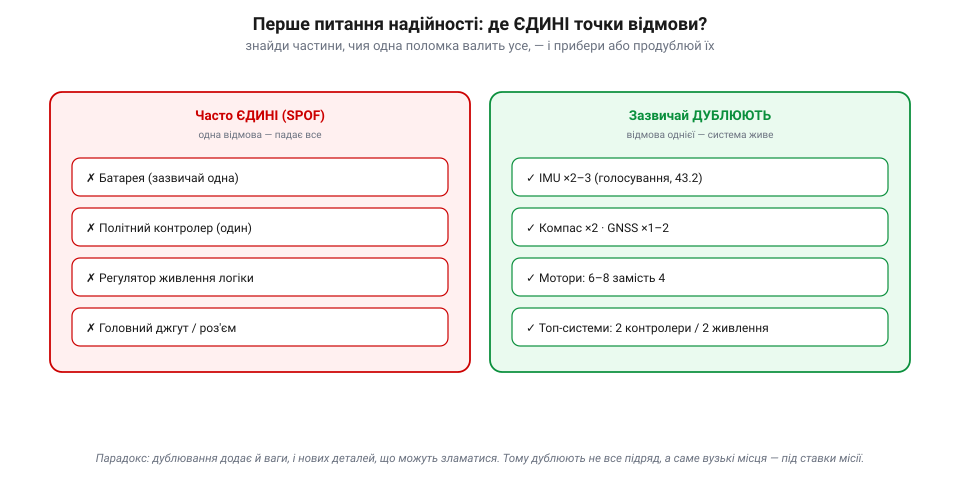
*Рис. 7.3.7.1. Карта вразливості. Ліворуч — типові єдині точки відмови: одна батарея, один політний контролер, один регулятор живлення логіки, головний джгут. Відмовить така — падає все. Праворуч — те, що зазвичай дублюють: IMU (два-три, з голосуванням), компас, GNSS, а на серйозних апаратах — навіть два контролери чи два джерела живлення. Правило просте: знайди вузькі місця — і прибери їх або продублюй.*

Але дублювати все підряд — помилка. Кожна зайва деталь додає **ваги, ціни й нових деталей, що теж можуть зламатися**. Тому резервування — це завжди компроміс: дублюють саме критичні вузькі місця, і то відповідно до **ставок**: іграшковому дрону вистачить одного всього, апарату, що возить щось цінне над людьми, — кількох. І пам'ятай пастку зі спільною відмовою з 7.1.2 (Ariane 5): подвоїти **однакове** мало, якщо обидві копії ламаються однаково.

Ця пастка цілком жива й на рівні компонентів. Два однакові GNSS-приймачі однаково «осліпнуть» від тієї самої глушилки; два IMU, жорстко прикручені поряд, однаково потонуть у тій самій вібрації; дві ланки, що живляться від одного регулятора, помруть разом із ним. Тому справжнє резервування — це ще й **різнорідність**: рознести давачі фізично, узяти різні їх типи, розвести живлення. Інакше «дубльована» система має приховану єдину точку відмови — спільну причину.

Серед усіх SPOF **живлення** — найпідступніше, бо від нього залежить геть усе разом. Тому в серйозних системах резервують і його: два акумулятори через діодне «АБО» (щоб відмова одного не знеструмила борт), окреме надійне живлення політного контролера, моніторинг кожної шини. Просадка напруги при ривку моторів чи серво здатна перезавантажити контролер у найгірший момент — тому логіку живлять окремо від силової частини (про все це — наступний розділ).

Тут варто бути чесним: резервування — **не безплатне добро**. Кожна додана деталь — це ще й нове джерело відмови, зайва вага, складніша збірка й більше з'єднань (а роз'єми та пайки — класичні місця поломок). Інколи простіша система з меншою кількістю частин **надійніша** за хитромудру з дублями, бо в ній просто менше чому ламатися. Тому інженерна мудрість — не «продублюй усе», а «продублюй те, що варте дублювання, і спрости решту». Надійність — це судження, а не кількість запчастин.

> 🔧 **Навіщо це.** Беручи чужий апарат, мисленнєво спитай: «що буде, якщо це відмовить?» — по кожній ланці. Знайдеш SPOF — знайдеш, де апарат найслабший. Часто це **живлення**: одна батарея, один роз'єм, один регулятор, від яких залежить геть усе. Тому надійні апарати так пильнують саме живлення (наступний розділ — про нього).

### Резервування виконавців: чому 6–8 моторів

Резервування давачів ми вже обговорили (7.1.2). Але є й резервування **виконавців**, і тут — найвиразніший приклад усієї теми:

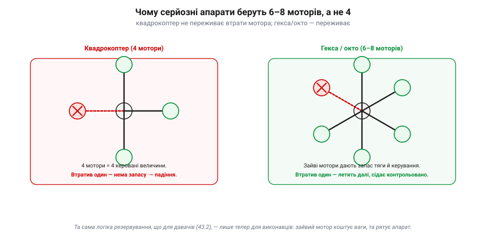
*Рис. 7.3.7.2. Чому серйозні апарати беруть 6–8 моторів. Квадрокоптер має рівно 4 мотори на 4 керовані величини (крен, тангаж, курс, тяга) — запасу немає, тож втрата одного мотора зазвичай означає падіння. Гекса- й октокоптери мають **зайві** мотори: втративши один, вони — **за достатнього запасу тяги, правильної геометрії й належної детекції/мікшера** — ще мають чим і триматися в повітрі, і керувати, тож можуть сісти контрольовано. (Та не кожен гекс автоматично переживає втрату мотора: це вимога до конструкції й налаштування, а не дарунок самих шести моторів.) Та сама логіка резервування, що для давачів, лише для виконавчої частини.*

Ось чому апарати, яким падати не можна (важкі, над людьми, з цінним вантажем), роблять на шести-восьми моторах, а не на чотирьох: це **актуаторне резервування**. Те саме стосується й інших виконавців: заклинило серво керма на літаку — і поверхня застрягла; тому відповідальні апарати дублюють і керма, і канали, щоб відмова одного приводу не позбавляла керованості.

Актуаторне резервування ширше за мотори. Зламалася лопать чи промінь рами — і навіть зайвий мотор не врятує, тож міцність конструкції теж частина надійності. Заклинило один із кількох серво на поверхні — інші мають дотягнути. Але за все це платять **вагою й ціною**: гекса важча й дорожча за квадро, дубльовані керма складніші. Тому, як і скрізь, рівень резервування виконавців добирають під ставки — від «впаде, то й нехай» до «не має права впасти ніколи».

> 🔧 **Навіщо це.** Рахуючи мотори на чужому апараті, ти тепер бачиш не лише «потужніше», а й «надійніше»: шість-вісім моторів — це часто саме про здатність пережити відмову одного. А якщо важливий апарат стоїть на чотирьох моторах — це свідомо прийнятий ризик: одна поломка мотора чи ESC його покладе.

### Спершу — виявити

Будь-яка реакція на відмову починається з того, що відмову треба **помітити**. Не можна зреагувати на те, чого не бачиш:

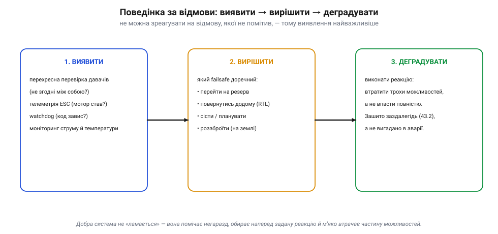
*Рис. 7.3.7.3. Поведінка за відмови — це конвеєр. Спершу **виявити**: перехресною перевіркою давачів (вони не згодні між собою?), телеметрією ESC (мотор раптом утратив оберти?), сторожовим таймером (код завис?), моніторингом струму й температури. Потім **вирішити**, яка наперед задана реакція доречна. І нарешті **деградувати** — виконати її, втративши трохи можливостей, а не все одразу.*

Виявлення — найважче й найважливіше. Саме тут стають у пригоді всі ті дрібниці, які ми розкидали по розділі: телеметрія ESC, що доповідає про здоров'я мотора (7.3.5); кілька давачів, що дають змогу їх **звірити** (7.3.1); watchdog, що ловить зависання (7.1.2). Система, що не вміє помітити власну хворобу, не зможе на неї й відповісти — хоч би які гарні в неї були failsafe.

Виявлення відмов — не лише робота автоматики. Над нею стоїть **оператор**, що читає телеметрію (7.1.4) і може втрутитися раніше, ніж автомат; а ще раніше працюють **передпольотні перевірки** — той самий список «чи зловила GNSS, чи відкалібровані давачі, чи здорові мотори», що не дає апарату навіть зброїтися з відомою вадою. Найдешевша відмова — та, яку зловили **на землі**, до зльоту. Тому грамотна експлуатація — теж шар надійності, не менш важливий за резервні давачі.

> 🔧 **Навіщо це.** Це пояснює, чому варті уваги «зайві» канали діагностики — телеметрія, логи, перехресні перевірки. Вони не крутять моторів і не міряють висоти, але саме вони дають системі **знати**, що щось не так. Розбираючи аварію по логах, ти йдеш тим самим шляхом: що система могла помітити й коли.

### Поведінка за відмови: драбина, а не обрив

Мета всієї цієї роботи — щоб апарат, втрачаючи щось, **сходив сходами вниз**, а не падав з обриву:

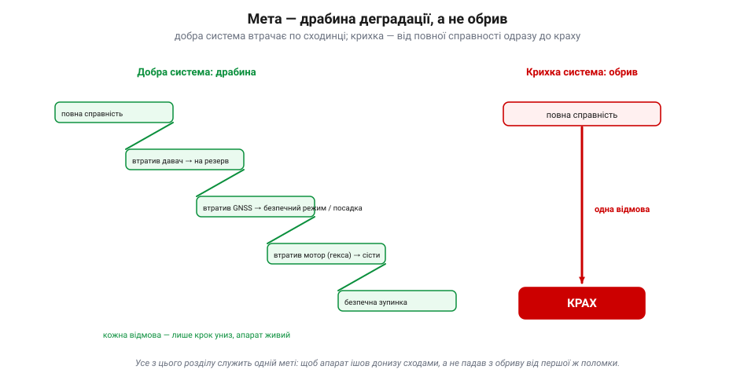
*Рис. 7.3.7.4. Дві долі за відмови. Добра система деградує **сходинками**: відмовив давач — перейшла на резерв; зник GNSS — переходить у безпечніший режим (без супутників горизонтальну позицію довго не втримати — зазвичай це посадка або утримання висоти під ручне керування); відмовив мотор (на гекса з запасом тяги) — сідає; зрештою — безпечна зупинка. Кожна відмова лише на крок знижує можливості, апарат живий. Крихка система натомість зривається з **обриву**: від повної справності одразу до краху від першої ж поломки. Весь цей розділ служить тому, щоб перетворити обрив на сходи.*

Реакції — ті самі failsafe, що ми зустрічали наскрізь: втрата зв'язку → повернутись додому; низький заряд → сісти; втрата GNSS → перейти в режим без супутників; відмова давача → виключити його й летіти на решті; відмова мотора → переконфігуруватись і сідати. Усі вони мають бути **зашиті заздалегідь** (7.1.2) — бо в момент аварії вигадувати нíколи.

Згадаймо й розрізнення з 7.1.2: **безпечна відмова** (сісти чи повернутись) проти **працездатної** (летіти далі на резерві). Просте резервування дозволяє безпечно завершити політ; глибше — продовжити завдання попри поломку. Який рівень потрібен — диктує місія, а не амбіція: інколи найрозумніша реакція на відмову — акуратно сісти, а не героїчно дотягувати на останніх силах.

І останнє, найважливіше на практиці: **failsafe, який не випробувано, не працює**. Реакції на відмови — найрідше виконуваний код, тож саме в ньому ховаються баги, що вилазять у найгірший момент. Тому їх **навмисне перевіряють**: «вбивають» GNSS у симуляції (SITL із 7.1.3 уміє впорскувати відмови), імітують втрату зв'язку на прив'язаному апараті, дивляться поведінку за низького заряду. Система, чиї failsafe жодного разу не спрацьовували на випробуванні, — це система з невипробуваною половиною.

> 📜 Найвеличніший в історії приклад «драбини, а не обриву» — рейс **United 232**. 19 липня 1989 року в DC-10 над Айовою зруйнувався хвостовий двигун, і його уламки перебили **всі три** незалежні гідросистеми — літак повністю втратив керма, елерони, руль висоти. За підручником це «некерований» літак. Та екіпаж капітана **Ела Гейнса** (*Al Haynes*), якому допоміг пілот-інструктор з пасажирів **Денні Фітч** (*Denny Fitch*), знайшов **інший** канал керування: вони правили літаком самою лише **різницею тяги** двох уцілілих двигунів — додаси газу одному, і ніс повертає. Тобто кермували точно так, як кермує мультикоптер! Сісти ідеально не вдалося, але з 296 людей на борту вижило 184 — там, де мала б загинути більшість. Урок подвійний: по-перше, навіть за катастрофічної відмови лишається шанс, якщо є **інший шлях** впливати на апарат; по-друге, керування самою тягою — не екзотика, а те, на чому щодня тримається кожен дрон.

> 🔧 **Навіщо це.** Запитуй про чужу (і свою) систему не «чи зламається», а «**як** вона зламається». Деградує сходинками — добра інженерія; падає з обриву від першої поломки — крихка. І шукай «інші канали»: те, що тримає апарат, коли основне відмовило, — від резервного мотора до керування самою тягою.

Проживімо одну відмову до кінця, щоб усе зійшлося. Гекса в автономній місії; раптом один мотор клинить. ESC миттю бачить, що оберти впали попри повний газ, і **доповідає** про це по телеметрії (7.3.5). Контролер **виявляє** негаразд — і за частку секунди **переконфігуровує** мікшер (7.3.6), розподіляючи тягу по п'ятьох здорових моторах; апарат хитнуло, але він вирівнявся — бо мав **запас тяги** й налаштовану реакцію на втрату мотора (без цього й гекса може не втриматися). Далі — **рішення**: дотягнути місію чи перервати? Спрацьовує наперед задане — скажімо, «повернутись додому». Апарат **деградував**: утратив запас і дрібку маневреності, але не впав. Якби це був квадрокоптер — історія скінчилася б на слові «клинить». Ось чому всі ланки розділу — давачі, телеметрія, мікшер, резервування, failsafe — це не окремі деталі, а одна система, що рятує апарат **разом**.

### Підсумок теми

Корисно перебрати весь розділ очима **відмов**. IMU — вібрація й дрейф (тому демпфери й фьюжн); барометр — дрейф із погодою (тому GNSS-якір); GNSS — глушіння й втрата неба (тому не сам); мотор — перегрів і клин (тому запас і телеметрія); ESC — струм і тепло (тому номінал із запасом); серво — заклинення й люфт (тому момент і жорсткі тяги); живлення — просадка (тому окремі шини). Кожен компонент — це не лише функція, а й **спосіб відмовити**, і знати другий не менш важливо, ніж перший.

Цей розділ пройшов апарат по компонентах — від відчуття до дії. **Давачі** (IMU, магнітометр, барометр, GNSS, живлення) дають сирі, неідеальні виміри, що їх зливають у стан; ми розібрали інерціальний блок із барометром і супутникову навігацію зсередини. **Виконавці** перетворюють рішення на рух: безколекторний мотор крутить гвинти, ESC ним керує, серво позиціює керма, а вихідний каскад узгоджує сигнали з будь-яким апаратом. А ця остання тема звела все докупи питанням надійності: знайти єдині точки відмови, продумано резервувати, **виявляти** негаразди й деградувати сходинками, а не зриватися з обриву. Бо апарат — це не набір деталей, а **система**, і її якість міряється не тим, як вона працює справна, а тим, як вона тримається, коли щось іде не так.

Цей погляд «через відмови» — і є межа між іграшкою та серйозним апаратом. Іграшку будують так, щоб вона **літала**; серйозний апарат — так, щоб він **не падав**, коли щось зламається. Те саме й при читанні чужої системи: подивись на неї очима песиміста — де тонко, що дублюється, як вона поводиться за збою — і про її справжню якість дізнаєшся більше, ніж із будь-якого списку характеристик. Це й є та зріла інженерна грамотність, до якої веде весь курс.

Ми двічі вже наштовхнулися на те, що найчастіша й найкритичніша єдина точка відмови — **живлення**. Саме йому, найнедооціненішій частині складного апарата, і присвячений наступний розділ.

> ▶️ Далі: [Розділ 7.4 — Живлення складних систем](../ch45-power-systems/ch45-power-systems.md)
