# Розділ 7.4 — Живлення складних систем

Історія цього розділу показала: батарея — це **фундамент** усього портативного апарата й водночас його найбільший тягар і найкритичніша єдина точка відмови (7.3.7). Але мати добру батарею — лише півсправи. Між нею й рештою апарата стоїть ціла **система живлення**: перетворювачі, що роблять із однієї напруги багато; шини, що розводять енергію; схеми, що бережуть і заряджають акумулятор; і розрахунок, чи вистачить запасу на політ. Саме цьому — інженерії живлення — і присвячений розділ.

Тема ця обманливо «нудна», та насправді саме негаразди з живленням — одна з найчастіших причин дивної поведінки й раптових падінь: просіла напруга — перезавантажився контролер; перегрівся перетворювач — вимкнувся; неправильно порахували бюджет — сів акумулятор у польоті. Розберімося по черзі, і почнемо з найпершого кроку: як узагалі перетворювати енергію.

> 📜 Історія теми: [літій-іонний акумулятор — Нобель 2019](ch45-history-lithium.md). Вона пояснює, **звідки** взялася енергія на борту й чому з нею треба обережно.

---

## 7.4.1 Перетворення енергії: лінійний vs імпульсний

Почнемо з простого факту, що породжує всю проблему: **батарея дає одну напругу, а апарату їх треба кілька**. Причому батарейна напруга ще й **плаває** під час розряду.

### Одна батарея, багато напруг

Чотирибаночний літій-полімерний акумулятор (4S) видає близько 14.8 В, але впродовж розряду його напруга сповзає приблизно з 16.8 В (повний) до 12 В. Тільки 12 В для 4S — це вже 3.0 В на комірку, тобто **небезпечна нижня межа**, а не «майже сів»: на практиці сідати цілять раніше, десь на 3.3–3.5 В/комірку під навантаженням (≈13–14 В), щоб не саджати літій у глибокий розряд. А компонентам апарата потрібні **стабільні** й **різні** напруги:

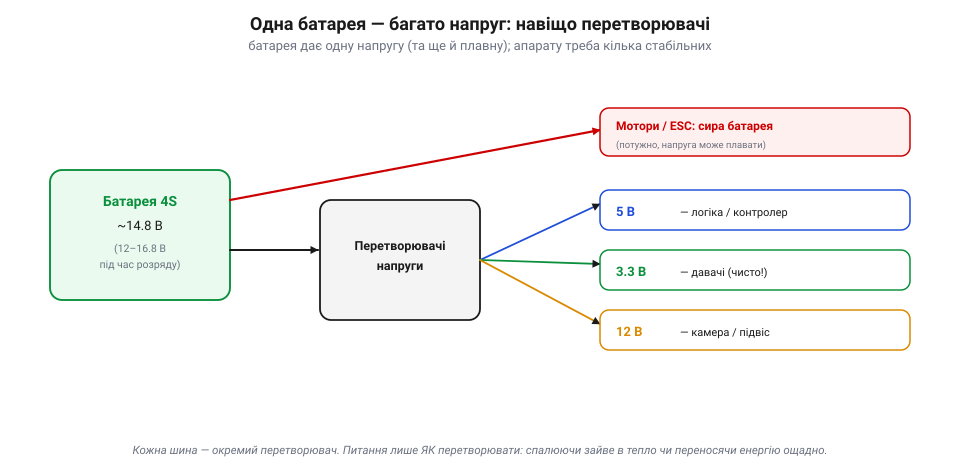
*Рис. 7.4.1.1. Одна батарея — багато шин. Мотори через ESC беруть напругу батареї «сирою» (їм потужність важливіша за стабільність). А ось логіці потрібні стабільні 5 В, давачам — чисті 3.3 В, камері чи підвісу — скажімо, 12 В. Кожну таку шину робить окремий **перетворювач**. Питання лише, **як** перетворювати: спалюючи зайве в тепло чи переносячи енергію ощадно.*

Чому саме такі напруги? Бо різні частини апарата живуть за різними «стандартами». Цифрова логіка працює на 3.3 чи 5 В (рівні з Розділу 3.1); давачі часто хочуть власні **чисті** 3.3 В; деякі камери, підвіси чи світло — 12 В; а мотори беруть усе, що дає батарея, бо їм потрібна сира потужність, а не точність. Кожен такий «острівець» має свою напругу — і свій перетворювач, що забезпечує її з єдиного батарейного джерела.

Зверни увагу: перетворювач не лише **змінює** напругу, а й **тримає** її сталою. Батарея під час польоту просідає (з 16.8 до 12 В) і сіпається на ривках газу — а контролер і давачі хочуть рівно 5.0 і 3.3 В **завжди**. Тож друга, не менш важлива робота перетворювача — **стабілізація**: давати незмінний вихід, хоч би як стрибав вхід. Саме тому логіку не живлять напряму від батареї: її напруга надто «жива», і від кожної просадки контролер міг би перезавантажитися. Перетворювач стоїть буфером між примхливою батареєю й вимогливою електронікою.

Отже, на апараті завжди є перетворювачі напруги. І є рівно **два** принципово різні способи їх будувати — і вибір між ними визначає, скільки енергії змарнується в тепло.

### Лінійний стабілізатор: різницю — у тепло

Перший спосіб — **лінійний стабілізатор**. Він діє, як розумний регульований резистор: пропускає струм через транзистор і **гасить** на ньому надлишок напруги, утримуючи на виході рівно стільки, скільки треба.

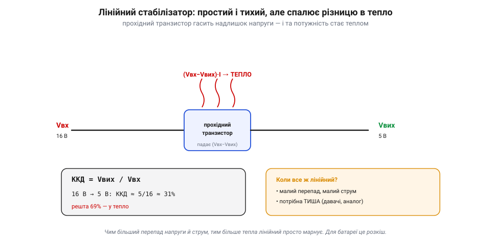
*Рис. 7.4.1.2. Лінійний стабілізатор гасить різницю напруг на прохідному транзисторі — а вся та «зайва» напруга, помножена на струм, перетворюється на **тепло**. Звідси його ККД = Vвих / Vвх: за перетворення 16 В у 5 В корисними лишаються тільки ~31% енергії, а решта 69% гріє повітря. Простий і тихий, але для глибокого перепаду — марнотратний.*

Проблема очевидна: уся погашена напруга, помножена на струм, стає **теплом**. Порахуймо це прямо:

**Приклад (втрати лінійного стабілізатора).** Робимо 5 В із 16 В (4S LiPo) за струму 1 А:

```
лінійний 16 В → 5 В @ 1 А:
  корисна потужність:  P_вих = 5 В × 1 А = 5 Вт
  втрата в тепло:      P_втр = (16 − 5) В × 1 А = 11 Вт
  ККД = 5 / (5 + 11) ≈ 31%      →  69% енергії — просто в тепло
```

Тридцять один відсоток! На кожен корисний ват — два ватти в нікуди, та ще й у вигляді тепла, яке треба кудись подіти. Для апарата на батареї це подвійна біда: і політ коротший, і гарячий компонент на борту. Тому лінійний стабілізатор беруть лише там, де перепад **малий**, струм **невеликий** або де понад усе цінують **тишу** — бо лінійний майже не шумить, і це робить його незамінним для живлення чутливих давачів та аналогових кіл.

Усередині лінійний стабілізатор — це маленький **контур керування** (знову Розділ 5.8): він безперервно міряє свій вихід і підкручує прохідний транзистор так, щоб тримати задану напругу, хоч би як мінявся струм чи вхід. Важлива його риса — **напруга падіння** (*dropout*): мінімальна різниця Vвх − Vвих, нижче за яку він уже не тримає вихід. Звичайні стабілізатори потребують 2–3 В запасу, а особливі — **малопадінні** (*LDO*) — обходяться часткою вольта, що цінно, коли вхід лише трохи вищий за вихід (скажімо, 3.6 В батареї → 3.3 В логіки).

І ще межа: лінійний уміє **тільки знижувати** напругу (бо тільки гасить надлишок). Якщо ж треба зробити напругу **вищу** за батарейну — скажімо, 12 В для підвісу, коли 4S просіла, — лінійний безсилий, і без імпульсного (boost) тут не обійтися. Це ще одна причина, чому імпульсні витіснили лінійні з головних шин: вони просто гнучкіші.

> 📜 Лінійні стабілізатори — ветерани електроніки. Іще з 1970-х по платах розійшлася ціла родина простих трививідних мікросхем «78xx»: 7805 робить 5 В, 7812 — 12 В, і так далі. Дешеві, надійні, в одну деталь — вони стали настільки звичними, що «поставити 7805» довго було синонімом «зробити 5 вольтів». А коли енергоощадність стала важливою (портативні пристрої, батареї), на сцену вийшли складніші, але куди ефективніші імпульсні перетворювачі — і потіснили лінійні всюди, крім тихих малопотужних шин.

> 🔧 **Навіщо це.** Побачив лінійний стабілізатор (часто це маленька мікросхема, що відчутно гріється) — знай: він **палить різницю напруг**. Якщо він живить щось потужне з великим перепадом — це джерело марних втрат і тепла; шукай, чи не варто там імпульсний. А якщо він живить давач чи АЦП — навпаки, його тиша тут навмисна й корисна.

### Імпульсний перетворювач: енергію — пакетами

Другий спосіб геть інший. **Імпульсний перетворювач** (*switching regulator*, або імпульсне джерело, SMPS) не гасить різницю, а **переносить** енергію порціями — швидко вмикаючи й вимикаючи ключ і запасаючи енергію в котушці та конденсаторі.

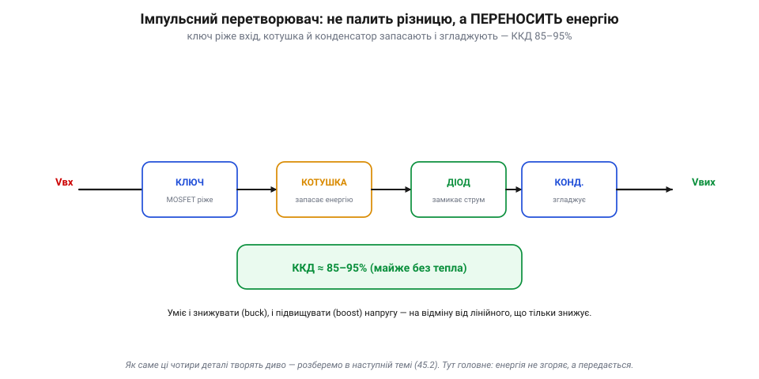
*Рис. 7.4.1.3. Імпульсний перетворювач складають чотири знайомі з Модуля 2 деталі: **ключ** (MOSFET) ріже вхідну напругу на імпульси, **котушка** запасає в собі енергію магнітного поля, **діод** замикає її струм у паузах, а **конденсатор** згладжує вихід. Енергія не згоряє на жодному елементі, а передається пакетами — звідси типово високий ККД (85–95%). До того ж він уміє і знижувати напругу (buck), і підвищувати (boost), чого лінійний не може.*

Ось у чому фокус: жоден елемент не «гасить» напругу постійно, а отже, не виділяє багато тепла. Ключ або повністю відкритий (малий опір, малі втрати), або повністю закритий (нема струму); котушка й конденсатор енергію **зберігають**, а не марнують. Тому ККД зазвичай високий — десь 85–95% — і, на відміну від лінійного, **слабко** залежить від глибини перетворення напруги (хоч і не сталий: він залежить від струму, частоти, деталей — ключа, діода, котушки — і режиму роботи перетворювача). Платою є **складність** (більше деталей, потрібна котушка) і **шум** — швидке перемикання породжує пульсації й завади, з якими треба боротися (особливо біля радіо й давачів). А **як саме** ці чотири деталі творять диво перетворення — це вже наступна тема (7.4.2); тут досить запам'ятати принцип: енергія не згоряє, а передається.

Ключова ідея — у **котушці**. Коли ключ відкритий, струм накачує в неї енергію магнітного поля (Розділ 2.2); коли ключ закривається, котушка не дає струму урватися миттєво й віддає запасене далі — у конденсатор і навантаження, — а діод (Розділ 2.5) замикає для цього струму шлях. Міняючи **шпаруватість** перемикання (Розділ 4.7), задають вихідну напругу. Залежно від того, як з'єднати ці деталі, перетворювач **знижує** напругу (buck), **підвищує** (boost) чи вміє й те, й те. Власне, імпульсний перетворювач — це і є той «міст» між конденсатором, котушкою й ключем, що ми відкладали ще з Модуля 2: тут усі троє нарешті працюють разом.

Шум імпульсного — не дрібниця, а інженерна турбота. Різкі перемикання струму в котушці породжують **пульсації** на виході й електромагнітні **завади** в ефірі, що можуть зіпсувати і радіозв'язок, і покази чутливих давачів. Тому імпульсні перетворювачі розводять подалі від приймача й антени, згладжують додатковими конденсаторами та фільтрами, а інколи й екранують. Бачиш котушку перетворювача поруч із радіомодулем — придивись, чи добре він відфільтрований: це часте джерело прихованих завад.

> 🔧 **Навіщо це.** Імпульсний перетворювач упізнаєш за **котушкою** (індуктором) поряд із мікросхемою — це його прикмета. Саме вони роблять головні шини живлення на сучасних апаратах. А оскільки вони шумлять, то поряд із радіоприймачем чи аналоговим давачем дивись, чи не доповнено їх фільтром або тихим лінійним стабілізатором «на хвості».

### ККД і тепло: чому для батареї беруть імпульсний

Зведімо два способи в одну картину — і стане ясно, чому на апаратах із батареєю панує імпульсний:

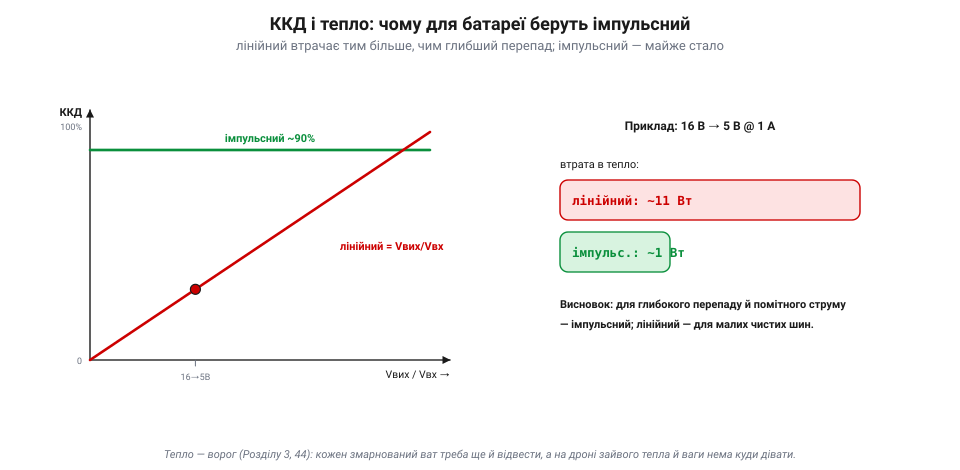
*Рис. 7.4.1.4. Чому імпульсний виграє. ККД лінійного дорівнює відношенню напруг (Vвих/Vвх): що глибший перепад, то більше він марнує. ККД імпульсного тримається високим (близько 90%) у широкому діапазоні перепаду (точне число залежить від струму, деталей і режиму). У нашому прикладі (16 В → 5 В за 1 А) лінійний спалює ~11 Вт у тепло, а імпульсний — близько 1 Вт. На батареї, де кожен ват — це час польоту, а кожен градус тепла треба ще й відвести, вибір очевидний.*

Усе зводиться до **тепла й енергії** — тем, знайомих ще з Розділу 1.3. Кожен змарнований ват не лише вкорочує політ, а й гріє компонент, а зайвого тепла й ваги на дроні дівати нікуди (згадай теплові межі моторів і ESC із Розділу 7.3). Тому на серйозному апараті імпульсні перетворювачі роблять усю важку роботу — головні шини живлення, — а лінійні лишають для маленьких **чистих** шин, де цінніша тиша. Часто їх навіть **поєднують**: імпульсний ефективно знижує напругу батареї до, скажімо, 5 В, а тихий лінійний робить із цих 5 В бездоганно чисті 3.3 В для давачів — ефективність плюс чистота.

На рівні всього апарата кілька відсотків ККД складаються у відчутну різницю. Помнож втрати кожного перетворювача на години роботи — і побачиш, скільки заряду йде не на політ, а в нікуди; на маленькому апараті це прямо вкорочує час у повітрі. А ще все змарноване стає теплом у тісному корпусі, де його нічим відвести, окрім обдуву гвинтами. Тому за ефективністю живлення женуться не з ощадливості, а з потреби: енергія й тепло на дроні — у дефіциті завжди.

Корисно й навчитися **читати** живлення на чужій платі. Велика мікросхема поряд із **котушкою** (а часто й кількома) — це майже напевно імпульсний перетворювач, головна робоча шина. Маленький трививідний компонент, що відчутно гріється й **без** котушки, — лінійний стабілізатор. Скупчення конденсаторів — згладжування біля перетворювачів. А простеживши, від чого живиться кожен вузол, складеш «дерево живлення» апарата: від батареї йде головна шина, від неї — перетворювачі на 5 і 12 В, від п'ятивольтової — ще й тихі 3.3 В. Кожна гілка має свій перетворювач і свій струмовий ліміт, а відмова чи просадка в корені валить усі гілки нижче — недарма живлення таке улюблене серед єдиних точок відмови (7.3.7).

Ще тонкість: ККД перетворювача — не одне число, а **крива** від навантаження. При дуже малому струмі (апарат «дрімає») ефективність падає, бо сам перетворювач споживає трохи на себе — **струм спокою** (*quiescent current*). Для апаратів, що довго чекають увімкненими, ця дрібка вирішує, скільки протримає батарея в режимі очікування. Тому добрий перетворювач підбирають не лише за піковим струмом, а й за поведінкою на типовому та малому навантаженні.

Наостанок — як живлення **ламається**. Класика — переплутана **полярність** батареї: миттєво вбиває електроніку, тому серйозні плати мають захист від зворотного підмикання. Небезпечні й **викиди** напруги при під'єднанні чи від'єднанні (та сама індуктивність дротів із Розділу 2.2), від яких рятують вхідні конденсатори. І перевантаження: перетягнеш струм понад розрахунок перетворювача — і він перегріється чи вимкнеться. Тому живлення проєктують із запасом і захистами, як і все критичне на апараті.

> 🔧 **Навіщо це.** Це практичне правило добору: **глибокий перепад або помітний струм → імпульсний; малий чистий струм для давача → лінійний**. І коли апарат «гріється без причини» чи несподівано мало літає — перевір перетворювачі: лінійний на потужній шині з великим перепадом легко з'їдає і заряд, і прохолоду.

### Підсумок теми

Апарат живиться від однієї плавної напруги батареї, а потребує кількох стабільних — тому на ньому завжди є перетворювачі. Будувати їх можна двома способами. **Лінійний** простий і тихий, але **спалює різницю напруг у тепло** (ККД = Vвих/Vвх), тож годиться лише для малих чистих шин. **Імпульсний** складніший і шумніший, зате **переносить енергію пакетами** з високим ККД (зазвичай 85–95%, залежно від струму, деталей і режиму), та ще й уміє підвищувати напругу. Для апарата на батареї, де кожен ват і кожен градус на рахунку, імпульсний робить важку роботу, а лінійний — тонку. Лишилося зрозуміти, **як саме** імпульсний перетворювач творить своє диво з ключа, котушки, діода й конденсатора, — і це наступна тема.

---

## 7.4.2 Як працює імпульсний перетворювач

У 7.4.1 ми сказали: імпульсний перетворювач не палить різницю напруг, а **переносить** енергію пакетами. Тепер розберімо, **як** саме він це робить, — на прикладі найпоширенішого, **знижувального** перетворювача (його звуть *buck*). І це буде красивий момент: чотири компоненти, кожен із яких ми вивчали окремо в Модулі 2 — **ключ** (MOSFET, Розділ 2.7), **котушка** (Розділ 2.2), **діод** (Розділ 2.5) і **конденсатор** (Розділ 2.1), — нарешті заграють разом. Це і є той «міст», що ми відкладали ще тоді.

### Дві фази бак-перетворювача

Уся робота зводиться до **двох фаз**, які повторюються десятки чи сотні тисяч разів на секунду:

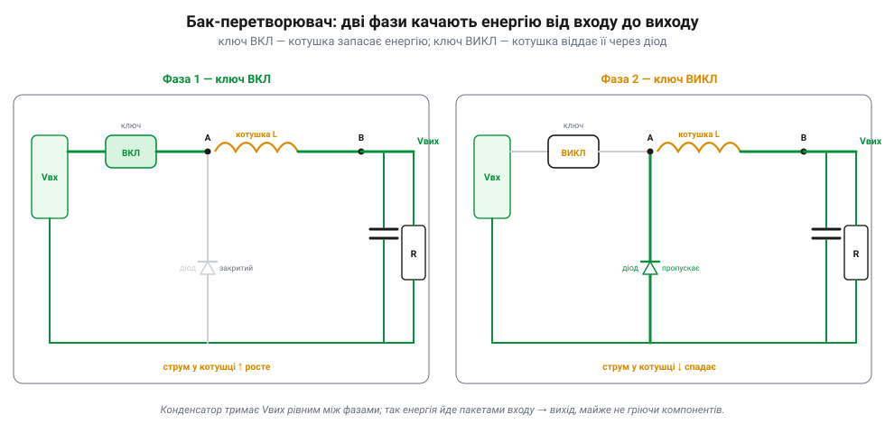
*Рис. 7.4.2.1. Дві фази знижувального перетворювача. **Фаза 1 (ключ ВКЛ):** вхід через котушку живить вихід; котушка чинить опір різкому зростанню струму (V = L·di/dt, Розділ 2.2) і **запасає** в собі енергію магнітного поля — струм у ній плавно росте. **Фаза 2 (ключ ВИКЛ):** вхід від'єднано, але струм у котушці не може урватися миттєво — тож вона тягне його далі, тепер уже через **діод** (той «ловить» струм), і **віддає** запасене у вихід; струм спадає. Конденсатор увесь час згладжує вихід, тримаючи Vвих рівним.*

Серце цього механізму — **дві властивості котушки** з Розділу 2.2. По-перше, вона **опирається зміні струму**: коли ключ вмикається, струм не стрибає, а плавно наростає, і котушка під час цього **накопичує** енергію. По-друге — і це ключове — струм через котушку **не може урватися миттєво**: щойно ключ розмикається, котушка робить усе, щоб струм продовжився, і «всмоктує» його через діод із землі. Діод тут — **черговий**: він замикає шлях для струму котушки, поки ключ відпочиває. А конденсатор на виході згладжує пульсації, щоб навантаження бачило рівну напругу, а не ці перемикання.

Жоден елемент не **гасить** напругу постійно (як прохідний транзистор у лінійному), тож і тепла майже немає: ключ або повністю відкритий, або закритий; котушка й конденсатор енергію **зберігають і віддають**, а не палять. Ось чому ККД сягає 90% і вище.

Може виникнути питання: а навіщо взагалі котушка — чому не вмикати-вимикати вхід прямо на навантаження? Тоді на виході був би грубий **меандр** (то повна напруга, то нуль), а не рівні 5 В. Саме котушка з конденсатором **усереднюють** цей рубаний сигнал у гладку напругу: котушка згладжує струм, конденсатор — напругу. Можна сказати, перетворювач рубає вхід на дрібні шматочки, а тоді з них «зліплює» рівний нижчий рівень — і робить це майже без втрат, бо рубає, а не гасить.

Варто згадати й **вхідні** конденсатори. Перетворювач смикає з входу струм **імпульсами** (ключ то бере повний струм, то нічого), а тонкий дріт від батареї має свою індуктивність і не любить різких ривків. Тому поряд із входом ставлять конденсатори, що тримають ці імпульси «під рукою»: вони віддають струм у моменти ввімкнення ключа й добираються між ними. Без них на вході були б викиди напруги, а батарейний дріт «дзвенів» би завадами. Ось чому перетворювач завжди оточений конденсаторами з **обох** боків.

> 🔧 **Навіщо це.** Тепер зрозуміло, чому імпульсний перетворювач **немислимий без котушки** (вона — упізнавана прикмета на платі) і чому поряд завжди є діод (або, як побачимо, другий транзистор) та конденсатори. Це не випадковий набір, а саме та четвірка, що качає енергію. Прибери чи зіпсуй будь-кого — і перетворювач не працюватиме або згорить.

### Струм котушки й чому Vвих = Vвх × D

Якщо подивитися на струм у котушці в часі, побачимо характерну **трикутну** хвилю: вгору під час «ВКЛ», вниз під час «ВИКЛ»:

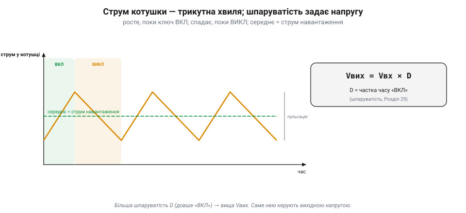
*Рис. 7.4.2.2. Струм котушки гойдається трикутником: наростає, поки ключ «ВКЛ», і спадає, поки «ВИКЛ»; його середнє значення й живить навантаження, а розмах — це пульсація. Найважливіше: вихідна напруга дорівнює вхідній, помноженій на **шпаруватість** D (частку часу, коли ключ увімкнено): Vвих = Vвх × D — це **ідеальна** формула buck-перетворювача в режимі безперервного струму котушки; реальні втрати (ключ, діод, опори, переривчастий режим) її трохи коригують.*

Звідси й керування напругою — через **шпаруватість** (*duty cycle*, D), ту саму, що ми вивчали в Розділі 4.7. Що довшу частку циклу ключ тримається відкритим, то вища середня напруга на виході. Порахуймо нашу шину:

**Приклад (шпаруватість бак-перетворювача).** Робимо 5 В із 16 В:

```
Vвих = Vвх × D
   D = Vвих / Vвх = 5 / 16 ≈ 0.31
   → ключ «ВКЛ» приблизно 31% часу кожного циклу,
     решту 69% — «ВИКЛ» (працює діод)
частота перемикання — десятки–сотні кГц
   (що вища, то менша потрібна котушка й тихіша пульсація)
```

Тридцять один відсоток часу — ключ відкритий; усе інше робить котушка з діодом. А висока частота перемикання (десятки-сотні кілогерц) дозволяє взяти маленьку котушку й конденсатор: що частіше «качаєш», то менші порції енергії й то менша пульсація.

Тут є компроміс. Підняти частоту — і котушку з конденсатором можна взяти крихітні (тому сучасні перетворювачі такі дрібні); але задорого піднімеш — і саме перемикання почне з'їдати ефективність, бо кожне ввімкнення-вимкнення транзистора має свою маленьку втрату. Тому частоту обирають як баланс: достатньо високу для малих деталей і тихої пульсації, та не настільки, щоб втрати на перемиканні з'їли весь виграш.

Є й тонкість на малому навантаженні. Коли струм великий, він тече в котушці безперервно. А коли навантаження мале, струм за фазу «ВИКЛ» може встигнути впасти до нуля — і перетворювач переходить у **переривчастий** режим, де ККД на зовсім малих струмах падає. Тому той самий перетворювач поводиться неоднаково на повному газі й на холостому — що варто пам'ятати, рахуючи живлення в режимі очікування.

Є тут і красивий, неочевидний наслідок. Оскільки перетворювач майже не втрачає енергії, потужність на вході дорівнює потужності на виході: Vвх × Iвх ≈ Vвих × Iвих. А отже, **знижуючи напругу, він підвищує струм**: щоб віддати 5 В × 4 А = 20 Вт навантаженню, він бере з 16-вольтової батареї лише близько 1.25 А (20 Вт ÷ 16 В). Тобто бак-перетворювач — наче «трансформатор постійного струму»: на вході висока напруга й малий струм, на виході — низька напруга й більший струм. Лінійний так не вміє: він бере з входу **той самий** струм, що віддає, а різницю просто палить — ще одна причина його марнотратності.

> 🔧 **Навіщо це.** Формула Vвих = Vвх × D — суть керування імпульсним перетворювачем. І вона ж пояснює, чому такий перетворювач **гнучкий**: міняючи лише шпаруватість (число в коді чи опір у схемі), дістаєш будь-яку нижчу напругу з тієї самої схеми. А висока частота — причина, чому котушки перетворювачів дрібні: на низькій частоті вони були б громіздкі, як у старих важких блоках живлення.

### Шпаруватість і зворотний зв'язок

Але самої формули мало: батарея просідає, навантаження стрибає — і якби шпаруватість була **фіксована**, вихід плавав би разом із входом. Тому справжній перетворювач — це **контур зі зворотним зв'язком** (знову Розділ 5.8):

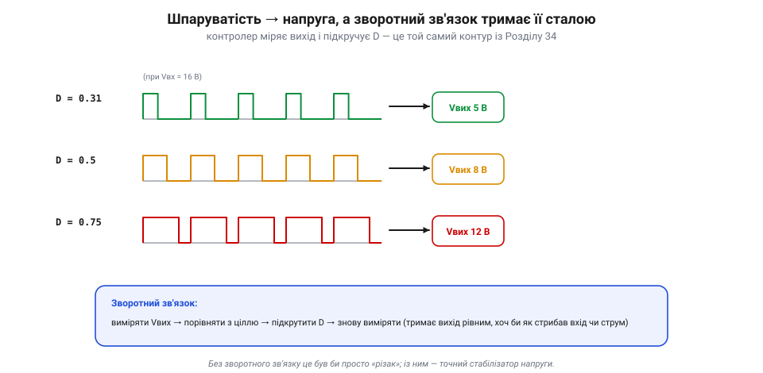
*Рис. 7.4.2.3. Більша шпаруватість — вища напруга (приклади для Vвх = 16 В). А щоб тримати вихід **сталим**, схема безперервно міряє Vвих, порівнює з ціллю й підкручує D: просів вхід — додала шпаруватості, зросло навантаження — теж підправила. Без цього зворотного зв'язку це був би просто «різак» напруги; із ним — точний стабілізатор.*

Тобто всередині імпульсного перетворювача крутиться той самий цикл «виміряти → порівняти → виправити», що й у ПІД-регуляторі апарата чи в серво з 7.3.6. Він стежить за виходом сотні тисяч разів на секунду й щоразу трішки міняє шпаруватість, щоб напруга стояла як укопана, хоч би що коїлося на вході. Саме це робить його **стабілізатором**, а не просто перетворювачем.

Цей внутрішній контур, як і будь-який зі зворотним зв'язком, можна **розхитати**: підбереш погані параметри — і замість стояти рівно, вихід почне дзвеніти чи коливатися. Тому перетворювачі **компенсують** — навмисно підбирають характеристику контуру так, щоб він був і швидкий, і стійкий. Готові мікросхеми роблять це за тебе; але якщо колись побачиш «дзвін» на виході перетворювача в осцилографі — знай, що це не магія, а той самий контур керування на межі стійкості (Розділ 5.8).

> 🔧 **Навіщо це.** Якщо колись побачиш, що вихід перетворювача «гуляє» чи дзвенить — це часто проблема саме цього контуру (його стійкості, як і в ПІД із Розділу 5.8). А ще: завдяки зворотному зв'язку імпульсний тримає вихід рівним навіть тоді, коли батарея сповзає з 16.8 до 12 В, — те, заради чого ми його й ставимо.

### Менше втрат і підвищення: синхронний і boost

Наостанок — дві важливі варіації тієї самої четвірки деталей:

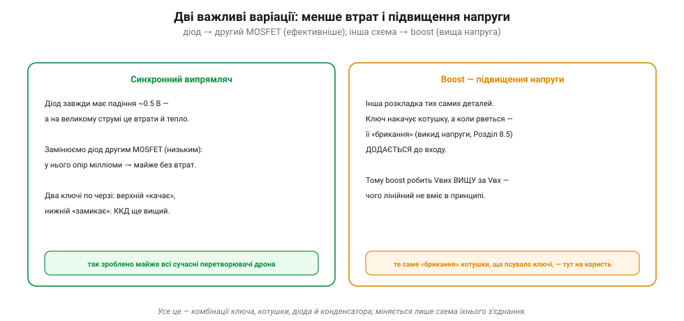
*Рис. 7.4.2.4. Дві варіації. **Синхронний випрямляч:** діод завжди має падіння ~0.5 В, а на великому струмі це помітні втрати й тепло — тож його замінюють другим MOSFET із мізерним опором, і ККД росте ще. **Boost (підвищення):** інша розкладка тих самих деталей, де «брикання» котушки (викид напруги при розмиканні, §2.2.5) **додається** до входу — і перетворювач дає напругу **вищу** за вхідну, чого лінійний не вміє в принципі.*

Перша варіація — **синхронний випрямляч** — прибирає втрати на діоді, замінивши його керованим транзистором; так зроблено майже всі сучасні перетворювачі на дронах. Друга — **boost** — гарна тим, що ставить собі на службу те саме «брикання» котушки, яке в Розділі 2.2 псувало нам ключі: викид напруги від різкого розмикання струму тут не шкодить, а **додається** до входу, даючи вищу напругу. Так із тих самих чотирьох деталей, лише по-іншому з'єднаних, виходить перетворювач, що **підвищує** напругу.

Між «лише знижує» і «лише підвищує» є й золота середина — **buck-boost**, що вміє і те, й те: незамінний там, де вхідна напруга може бути і вищою, і нижчою за потрібну (як батарея, що сповзає крізь рівень виходу під час розряду). А загалом «зоопарк» топологій ширший — SEPIC, flyback та інші, — але всі вони лише по-різному переставляють ті самі ключ, котушку, діод і конденсатор. Зрозумівши бак, ти зрозумів принцип усіх.

І трохи практики читання плати. Точку, де ключ «рубає» напругу (між ключем і котушкою), звуть **вузлом перемикання** — це найгаласливіше місце перетворювача, джерело тих самих завад із 7.4.1. Тому на платі котушку, транзистори й вхідні конденсатори тримають щільною компактною групою, щоб петлі струму були короткі. Велика котушка плюс дрібна мікросхема-контролер плюс щільні конденсатори поряд — і ти впізнав імпульсний перетворювач та його шумний куток, навіть не читаючи маркування.

> 📜 Перехід від лінійних блоків живлення до імпульсних — тиха революція, яку видно неозброєним оком. Старі блоки живлення були **важкі й гарячі**: усередині — масивний залізний трансформатор і лінійний стабілізатор, що грів повітря. Сучасний зарядний пристрій телефона — крихітний і холодний, бо всередині імпульсний перетворювач на високій частоті, якому й трансформатор потрібен мізерний. Принцип бак-перетворювача знали давно, та практичним його зробили лише **швидкі силові напівпровідники** (ті самі MOSFET) — і відтоді важкі лінійні блоки зникли майже звідусіль.

> 🔧 **Навіщо це.** Уся ця родина — бак, boost, синхронний — це **комбінації ключа, котушки, діода й конденсатора**; міняється лише схема з'єднання. Упізнавши на платі котушку з парою транзисторів і конденсаторами, ти бачиш не загадку, а знайому четвірку — і можеш сказати, знижує цей вузол напругу чи підвищує.

На щастя, інженеру апарата рідко доводиться **проєктувати** перетворювач із нуля — це тонка справа з купою нюансів. Зазвичай беруть готовий модуль чи мікросхему-перетворювач і добирають її за кількома числами: діапазон вхідної напруги, потрібний вихід, максимальний струм, ККД. Але **розуміти**, що всередині качає енергію ключ із котушкою, а не «чорна магія», критично важливо: тоді ясно, чому модуль має саме такі межі за струмом, чому гріється, чому шумить і де його слабкі місця. Ця тема — саме про таке розуміння, а не про розрахунок витків.

### Підсумок теми

Знижувальний (buck) перетворювач працює двома фазами: коли ключ увімкнено, котушка запасає енергію й живить вихід; коли вимкнено — її струм не уривається, а тече далі через діод, віддаючи запасене. Конденсатор згладжує вихід, а вихідна напруга в ідеалі (безперервний режим, без втрат) дорівнює вхідній, помноженій на шпаруватість (Vвих = Vвх × D), якою й керують; на практиці втрати на ключі, діоді та опорах її трохи коригують. Зворотний зв'язок (Розділ 5.8) безперервно підправляє шпаруватість, тримаючи вихід сталим попри просадки батареї й стрибки навантаження. Ефективний він тому, що ключ лише вмикається й вимикається, а котушка з конденсатором енергію зберігають, а не палять. Варіації — синхронний випрямляч (менше втрат) і boost (підвищення напруги) — це та сама четвірка деталей в інших з'єднаннях. Так нарешті зійшлися конденсатор, котушка й ключ із Модуля 2. А тепер, маючи перетворювачі, погляньмо, як із них будують **усю систему живлення** апарата — кілька шин і правильну послідовність їх увімкнення.

---

## 7.4.3 Кілька шин живлення й послідовність

Маючи перетворювачі (7.4.1–7.4.2), складемо з них **усю систему живлення**. Бо на складному апараті це не один регулятор, а ціле **дерево** шин — і разом із ним приходять субтильні, але кусючі проблеми: кидок струму при під'єднанні, порядок увімкнення рейок, місцева розв'язка й — найпідступніше — заземлення. Саме тут живлення найчастіше «йде не так», тож пройдімо по черзі.

### Дерево живлення

Від єдиного кореня — батареї — живлення розходиться гілками: щось бере напругу сирою, щось — через перетворювачі, і кожна гілка має своїх споживачів:

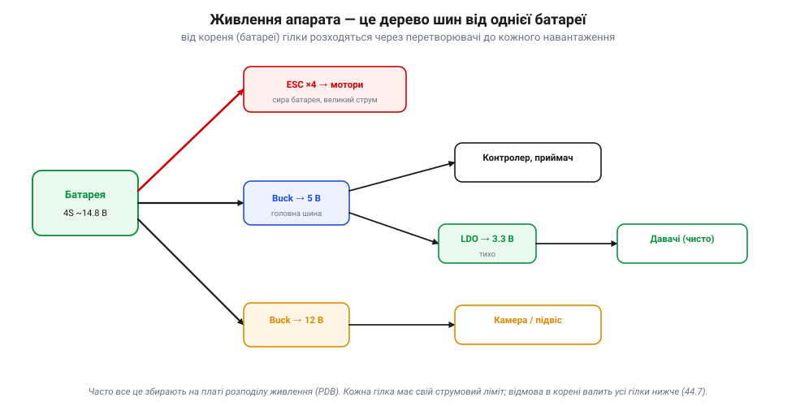
*Рис. 7.4.3.1. Живлення апарата — дерево. Корінь — батарея. Одна гілка йде «сирою» до моторів через ESC (їм потрібна потужність, не точність). Інша — через знижувальний перетворювач на головну 5-вольтову шину (контролер, приймач), а від неї тихий LDO робить чисті 3.3 В для давачів. Третя — на 12 В для камери чи підвісу. Часто все це збирають на одній платі розподілу живлення (PDB).*

Кожна гілка має свій **струмовий бюджет**: перетворювач і дроти розраховані на певний максимум, і навантажити гілку понад нього — означає перегрів чи просадку. А головне правило дерева ми вже знаємо з 7.3.7: **відмова в корені валить усі гілки нижче**. Сіла батарея, згорів головний перетворювач, відпав головний роз'єм — і знеструмлено все. Тому корінь дерева бережуть найпильніше.

Кілька слів про практику. Готовий вузол, що робить 5 чи 12 В для логіки з батареї, на дронах часто звуть **BEC** (з 7.3.5) — це просто перетворювач у складі ESC чи окремий блок. А там, де падати не можна, дерево живлення **дублюють**: ставлять два акумулятори через діодне «АБО» (кожен через свій діод у спільну шину, тож відмова одного не знеструмить борт) — а в сильнострумових чи ощадливих системах звичайний діод (з його падінням напруги й нагрівом) замінюють на **MOSFET-«ідеальний діод»** (*ORing/PowerPath*) — або окреме надійне живлення політного контролера. І рахуючи бюджет гілки, завжди додають запас: пікові струми (різкий газ, ввімкнення) вищі за середні, і перетворювач мусить витримати їх без просадки й перегріву.

Не варто забувати й про найпростіше — **дроти й роз'єми**. Сильнострумова гілка (батарея → ESC → мотори) тягне десятки ампер, тож дроти там товсті: тонкий провід має помітний опір, грітиметься й «з'їдатиме» напругу (та сама втрата I²R з Розділу 1.3). Роз'єми теж мусять бути на потрібний струм, інакше гріються в контакті. А сигнальні лінії, навпаки, тонкі — струми там мізерні. Тому, дивлячись на джгут апарата, за товщиною дроту одразу видно, де тече сила, а де лиш сигнал.

Числовий приклад допомагає відчути масштаб. Скажімо, чотири мотори на повному газі тягнуть по ~25 А — це вже близько 100 А на сильнострумовій гілці (звідси й товсті дроти, і потужна батарея). А вся «розумна» частина — контролер, давачі, приймач — разом споживає, може, 0.5 А на 5-вольтовій шині, тобто лише ~2.5 Вт. Контраст разючий: майже вся енергія йде на політ, а логіка — крихта. Тому 5-вольтовий перетворювач можна взяти маленький, а от силову гілку рахують прискіпливо: помилка в десяток ампер тут — це перегрітий дріт чи просадка напруги.

> 🔧 **Навіщо це.** Перше, що варто намалювати (або відновити подумки) для будь-якого апарата, — це його **дерево живлення**: від чого живиться кожен вузол, через який перетворювач, з яким лімітом. Тоді одразу видно, де вузькі місця (перевантажені гілки), а де єдині точки відмови (спільний корінь). Це той самий «погляд через відмови», що й у 7.3.7, тільки для живлення.

### Кидок струму й іскра при під'єднанні

Перша несподіванка чатує вже в мить, коли ти **під'єднуєш** батарею. Пам'ятаєш конденсатори на входах перетворювачів (7.4.2)? Поки апарат вимкнений, вони **порожні**. А порожній конденсатор у перші миттєвості поводиться як **коротке замикання** — і жадібно тягне величезний струм, щоб зарядитися:


*Рис. 7.4.3.2. Кидок струму (*inrush*) при під'єднанні. Порожні вхідні конденсатори заряджаються майже миттєво, видираючи з батареї пік струму в десятки чи сотні ампер на коротку мить — і саме він спалахує **іскрою** на контактах роз'єму. Лікують це резистором передзаряду чи «анти-іскровим» роз'ємом, що перші струми пускає через опір, а вже тоді змикає основний контакт.*

Ось чому літій-полімерна батарея при під'єднанні часто **стріляє** видимою іскрою — це не поломка, а нормальний кидок струму на заряд конденсаторів. Але іскра шкідлива: вона **обпалює** контакти роз'єму (з часом псує їх), стресує батарею й може злякати. Тому на серйозних збірках ставлять **анти-іскрові** роз'єми (з додатковим контактом-резистором, що замикається першим) або схему **м'якого старту**, яка плавно піднімає напругу. Принцип скрізь один: дати конденсаторам зарядитися **повільно**, через опір, перш ніж пустити повний струм.

Як саме резистор приборкує кидок? Він просто **обмежує** перший струм законом Ома: великий опір — малий початковий струм, конденсатори заряджаються плавно за частку секунди, а вже тоді змикається прямий контакт. На дронах для цього є спеціальні роз'єми з додатковим «передзарядним» штирком, що торкається першим через опір (відомі як анти-іскрові). Без них доводиться вмикати акумулятор обережно або через зовнішній модуль м'якого старту.

> 🔧 **Навіщо це.** Іскра при під'єднанні LiPo — норма, але якщо вона велика й контакти чорніють, варто перейти на анти-іскровий роз'єм: обпалені контакти зростають опором, гріються й зрештою підводять у польоті. А ще: великі вхідні конденсатори (потрібні для тихого живлення) **посилюють** кидок — тож тут є компроміс між чистотою живлення й силою іскри.

### Послідовність увімкнення

Друга субтильність: на деяких апаратах рейки не можна вмикати **як заманеться** — їх треба піднімати в певному **порядку**. Складні чіпи (процесори, ПЛІС) часто мають окремі живлення для ядра й для входів-виходів, і виробник вимагає, щоб вони з'являлися строго одне за одним:


*Рис. 7.4.3.3. Деяким чіпам потрібен порядок. Тут ядро (1.8 В) має піднятися першим, потім живлення входів-виходів (3.3 В), а тоді периферія (5 В). Подаси напруги не в тому порядку — і чіп може «защемити» (latch-up), перегрітись чи зависнути. Тому ставлять **контролер послідовності**, що вмикає рейки одна за одною з паузами; те саме — і при вимкненні, часто у зворотному порядку.*

Що таке те «защемлення» (latch-up)? У деяких чіпах неправильна напруга на входах раніше за живлення відкриває паразитний шлях усередині кремнію, і чіп починає проводити сам крізь себе — гріється й може згоріти, поки не знімеш живлення. Тому й порядок. Споріднена ідея — **блокування за низькою напругою** (*UVLO*): перетворювач сам не вмикає вихід, поки вхід не підніметься до робочого рівня, щоб не годувати чіпи «недопеченою» напругою.

Для простого апарата про це здебільшого подбали вже **готові мікросхеми** живлення чи плата контролера — але знати, що така вимога існує, корисно: інколи «чіп не стартує» чи «гріється на ввімкненні» — це саме порушений порядок живлення, а не дефект.

> 🔧 **Навіщо це.** Якщо складний модуль поводиться дивно одразу після ввімкнення — серед підозр має бути **послідовність живлення**. А проєктуючи власну плату з потужним процесором, перевір у його даташиті розділ *power sequencing*: знехтуваний порядок рейок — підступне джерело нестабільності.

### Розв'язка й заземлення

Дві останні, але найважливіші тонкощі. Перша — **розв'язка** (*decoupling*): біля кожного чіпа ставлять маленькі конденсатори (Розділ 2.1), що служать **місцевим запасом** енергії. Коли чіп раптом смикає струм (а цифрові чіпи смикають його різко, щотакту), цей запас віддає його **миттєво**, поки далека шина «не помітила», — і напруга біля чіпа не просідає. Без розв'язки кожен такий смик «дзвенів» би по всій платі. Ось чому на платах так багато дрібних конденсаторів — кожен стереже спокій свого сусіда.

Зазвичай розв'язку роблять **двома** типами конденсаторів: дрібні керамічні — біля самих ніжок чіпа, бо вони реагують найшвидше на різкі смики; і більші, «об'ємні» (електролітичні чи танталові) — трохи далі, як ширший резерв на повільніші коливання. Разом вони покривають і блискавичні, і неквапні провали напруги. Тому біля кожного складного чіпа бачиш розсип конденсаторів різного розміру — це не надмір, а ешелонована оборона напруги.

Друга, найпідступніша — **заземлення**. Здавалося б, земля одна для всіх. Але провід має опір, і коли через спільну землю тече **сильний** струм мотора, він створює на ній маленьку напругу — яку чутливий давач, прив'язаний до тієї ж землі, бачить як **шум**:


*Рис. 7.4.3.4. Чому сильний струм «шумить» у давачі. Ліворуч (неправильно): мотор і давач ділять один провід землі; струм мотора, помножений на опір проводу, дає напругу, яку давач помилково «бачить» (*ground bounce*). Праворуч (правильно): **зіркова земля** — сильнострумова земля моторів і тиха земля давачів ідуть окремими шляхами, що сходяться в одній точці біля батареї; струм мотора більше не тече через землю давача.*

Це класична пастка: апарат начебто справний, а давачі «шумлять» чи компас «бреше» — і причина не в них, а в тому, що їхню землю «забруднив» струм моторів. Розв'язок — **зіркова земля** (*star ground*): розвести «брудну» сильнострумову землю й «тиху» сигнальну окремими шляхами та звести їх в **одній** точці. Тоді струм моторів не тече крізь землю давачів, і шум не потрапляє в сигнал.

На друкованих платах цю ідею втілюють **площиною землі** — суцільним мідним шаром, що дає струмам найкоротший шлях і малий опір. А от **різати** цю площину на «тиху» (аналогову, біля давачів та АЦП) й «гучну» (цифрову/силову) — рішення тонке й часто **шкідливе**: сучасна порада для змішаних плат — радше **суцільна** низькоомна площина, продумане **розміщення** блоків і контроль **зворотних струмів**, а розрізати її варто лише тоді, коли це прямо радить даташит чи архітектура (бо розрив у непідходящому місці лише подовжує петлю зворотного струму й **додає** завад). Дрібниця в розведенні землі вирішує, чи буде давач чистим, чи «брудним», — і це одна з найтонших, найменш очевидних частин проєктування, помилку в якій видно лише в готовому виробі за дивним шумом.

> 🔧 **Навіщо це.** Заземлення — найчастіша прихована причина «нез'ясовного» шуму давачів і збоїв. Якщо компас чи аналоговий давач «брудний» саме під газом — підозрюй спільну землю із силовою частиною. А правило просте: сигнальну землю тримай окремо від сильнострумової, зводячи їх в одній точці. Те саме стосується й розташування — давачі подалі від силових петель (згадай монтаж із 7.3.1).

Помітьмо, що розв'язка, зіркова земля й фільтри проти шуму імпульсних перетворювачів (7.4.1) — це все боротьба з **одним ворогом**: завадами. Швидкі струми всюди — у перемиканнях перетворювача, у смиках цифрових чіпів, у моторах — наводять напруги там, де їх не чекали. Тому «чисте» живлення — це не один прийом, а ціла культура: коротити петлі струму, розводити брудне й тихе, ставити конденсатори там, де енергія потрібна вмить. Недбалість в одному місці зводить нанівець старання в інших.

### Захист і підсумок

Лишилося згадати **захист**. Серйозна система живлення має запобіжники: **захист від зворотної полярності** (переплутав «+» і «−» — і без захисту електроніка згоряє миттєво), **запобіжники** чи електронні «еФьюзи» від перевантаження й короткого, контроль перегріву. Усе це — бо живлення критичне, а помилки тут руйнівні.

І ще один вузол варто згадати саме тут — **давач живлення** з 7.3.1. Він сидить на головній шині й міряє напругу та струм батареї (струм — через малий шунтовий резистор, напругу — дільником). Звідси контролер знає спожиту енергію, поточну потужність і — головне — коли вмикати failsafe за низьким зарядом. Тобто система живлення не лише роздає енергію, а й **доповідає** про себе, замикаючи місток на бюджет енергії (7.4.7) і на надійність із 7.3.7.

Отже, система живлення апарата — це **дерево** шин від батареї-кореня, кожна гілка зі своїм перетворювачем, бюджетом і споживачами. Навколо нього — субтильності, що найчастіше й підводять: **кидок струму** з іскрою при під'єднанні (лікують анти-іскрою), **послідовність** увімкнення для складних чіпів, **розв'язка** місцевими конденсаторами й — найпідступніше — правильне **заземлення** зіркою, щоб струм моторів не шумів у давачі. Плюс захист від зворотної полярності й перевантажень. А над усім — пам'ять, що живлення є головною єдиною точкою відмови (7.3.7), тож його проєктують найретельніше.

Звідси й практичний підсумок: коли апарат «дивно поводиться», а явної поломки нема, винна несподівано часто саме система живлення. Перелік підозр сталий: просіла напруга під газом (слабкий перетворювач чи тонкі дроти); шум давачів під навантаженням (спільна земля); збій на ввімкненні (кидок струму чи порядок рейок); раптовий перезапуск контролера (просадка логічної шини). Навчившись підозрювати живлення першим, заощаджуєш години марних пошуків деінде.

Тепер, знаючи, як енергію перетворювати й розводити, придивімося до самого її джерела — **акумулятора**: його хімії, напруги, ємності й енергії.

---

## 7.4.4 Акумулятори: хімія, напруга, ємність, енергія

Історія розділу пояснила, **чому** літій. Тепер навчімося **читати акумулятор** — ті числа на наклейці, за якими ховається все, що важить для апарата: скільки він дасть вольтів, як довго протримає й де його межі. Розберімо чотири поняття, які постійно плутають: напругу, ємність, енергію та криву розряду.

### Напруга комірки й рахунок «S»

Усе починається з **однієї комірки** (*cell*). Літій-полімерна комірка має напругу, що залежить від заряду: **4.2 В** повна, близько **3.7 В** «номінальна» (середня) і близько **3.0 В** порожня — нижче за яку сходити **не можна** (про це далі). Цю напругу задає сама хімія: інші хімії дають інше (наприклад, безпечніший літій-залізо-фосфат — близько 3.2 В на комірку).

Хімій під «літієм» кілька, і вони різняться компромісами. **LiPo** (літій-полімерний) — у м'якому пакеті-«пакетику», легкий і віддає струм дуже швидко, тому панує на дронах; його слабкість — крихкість і пожежонебезпека. **Li-ion** у твердих циліндрах (як 18650) — щільніший за енергією й живучіший, але важчий і не любить шалених струмів; його беруть туди, де важливіша тривалість, ніж ривок. **LiFePO₄** — найбезпечніший і найдовговічніший, але з нижчою напругою (3.2 В) і меншою щільністю. Немає «найкращої» батареї — є та, що пасує задачі: ривкому дрону, витривалому крилу чи безпечному стенду.

Щільність енергії, до речі, буває двох видів: на **вагу** (Вт·год/кг) і на **об'єм** (Вт·год/л). Для дрона головна — вагова: він підіймає батарею в повітря, і кожен грам коштує тяги. Для апарата, де тісно, але вага не критична, важить об'ємна. Літій добрий за обома, але саме вагова й зробила можливим електричний політ — те, про що казала історія розділу.

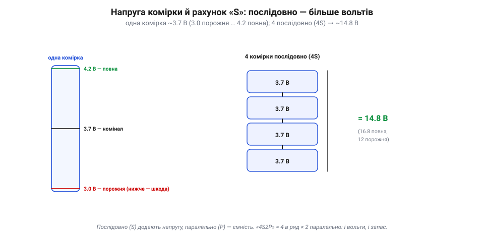
*Рис. 7.4.4.1. Напруга комірки й рахунок «S». Одна комірка гойдається між 3.0 (порожня) і 4.2 В (повна), із номіналом ~3.7. Щоб дістати більше вольтів, комірки з'єднують **послідовно**: чотири в ряд — це «4S» і дає ~14.8 В номіналу (16.8 повна, 12 порожня). Послідовне з'єднання (**S**) додає **напругу**, паралельне (**P**) — **ємність**; «4S2P» означає 4 в ряд × 2 паралельно.*

Звідси й знайоме маркування: **«S» — це напруга**. 3S ≈ 11.1 В, 4S ≈ 14.8 В, 6S ≈ 22.2 В номіналу. Що більше банок у ряд, то вища напруга — і тому потужні апарати беруть 6S замість 4S (вища напруга за тієї ж потужності означає менший струм у дротах, а отже, менші втрати). Паралельні з'єднання (**P**) напруги не міняють, лише складають ємність кількох комірок.

> 📜 Цікаво, що багато літієвих комірок у світі — фізично **однакові**. Класична циліндрична комірка зветься **18650** просто за розмірами: 18 мм у діаметрі та 65 мм завдовжки. Такі самі комірки стоять у ноутбуках, акумуляторних інструментах, а в електромобілі їх можуть бути **тисячі**, з'єднані в довгі ряди й паралелі. Той самий «цеглинка-елемент» живить і дитячу іграшку, і авто — змінюється лише, скільки їх і як з'єднано.

> 🔧 **Навіщо це.** «S» на акумуляторі — це перше, що звіряють: напруга батареї має пасувати апарату (його перетворювачам, ESC, моторам за KV із 7.3.4). Підключиш 6S туди, де чекали 4S, — і легко спалиш електроніку зайвою напругою. А «P» (чи просто більший розмір) — про запас ходу, не про вольти.

### Ємність і енергія: mAh проти Вт·год

Друга пара понять, яку плутають найчастіше, — **ємність** і **енергія**. Ємність (у міліампер-годинах, mAh) — це **заряд**: скільки струму впродовж скількох годин батарея віддасть. А енергія (у ват-годинах, Вт·год) — це власне **паливо**, і саме вона визначає час польоту:

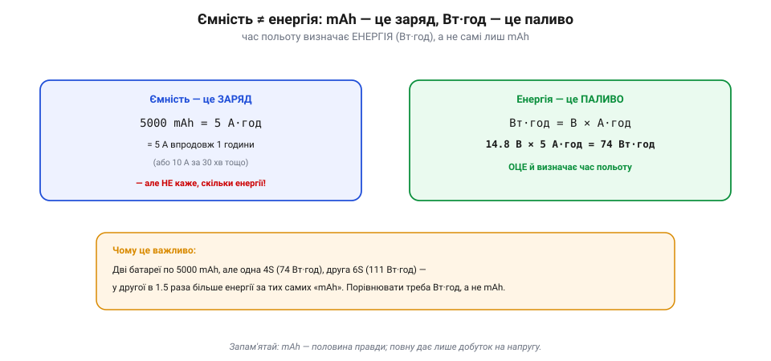
*Рис. 7.4.4.2. Ємність ≠ енергія. 5000 mAh = 5 А·год — це заряд: 5 ампер упродовж години (чи 10 ампер за пів години). Але саме по собі це **не каже**, скільки енергії. Енергію дає добуток на напругу: Вт·год = В × А·год. Тому 14.8 В × 5 А·год = 74 Вт·год — оце й визначає, надовго вистачить. Дві батареї по 5000 mAh, але одна 4S, друга 6S, мають **різну** енергію.*

Порахуймо повний «паспорт» типової батареї:

**Приклад (енергія батареї).** Батарея 4S 5000 mAh:

```
напруга (номінал) = 4 × 3.7 В = 14.8 В
ємність           = 5000 mAh = 5 А·год
ЕНЕРГІЯ           = 14.8 В × 5 А·год = 74 Вт·год
   → саме ці 74 Вт·год і визначають час польоту
```

Звідси й груба оцінка тривалості: поділи енергію на середню потужність споживання. Якщо апарат у польоті бере, скажімо, ~300 Вт, то 74 Вт·год вистачить приблизно на 74/300 год ≈ 15 хвилин (із запасом — менше). Деталі бюджету енергії — у 7.4.7, але принцип уже ясний: рахувати треба **ват-години**, а не mAh.

І ще нюанс, що випливає з ваги. Здавалося б, постав батарею вдвічі більшу — і політ удвічі довший. Але більша батарея **важча**, апарат мусить дужче тягти, щоб її нести, — і виграш швидко тане, а за певною межею навіть **спадає** (батарея важить більше, ніж додає ходу). Тому для кожного апарата є оптимальна вага батареї; «більше» не завжди означає «довше». Це знову та сама межа щільності енергії, лише з іншого боку.

Тепер наклейку LiPo можна прочитати цілком. Напис на кшталт «4S 5000 mAh 50C» каже все: **4S** — чотири банки, ~14.8 В; **5000 mAh** — ємність (заряд); **50C** — максимальний струм віддачі (про цю літеру «C» — наступна тема). Три числа: напруга, запас і потужність. Додай до них вагу — і маєш повний «паспорт» батареї, з якого видно і час польоту (через Вт·год), і чи потягне вона твої мотори.

> 🔧 **Навіщо це.** Порівнюючи акумулятори, дивись на **Вт·год**, а не лише на mAh: батарея з більшим «S» за тих самих mAh несе більше енергії. І саме Вт·год обмежують у багажі літаків та в правилах — бо це міра запасеної енергії, а отже, потенційної небезпеки. mAh — половина правди; повну дає лише добуток на напругу.

### Крива розряду: вольти ≠ відсотки

Може здатися, що за напругою легко вгадати залишок: повна 4.2, порожня 3.0, отже, 3.6 — це половина. Але насправді напруга падає **нелінійно**:

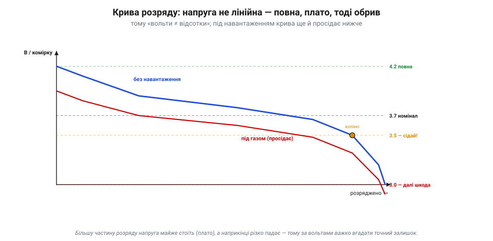
*Рис. 7.4.4.3. Крива розряду комірки. Напруга стартує з 4.2 В, швидко осідає на пологе **плато** ~3.7–3.8 В, де майже стоїть більшу частину розряду, а під кінець, за «коліном», різко падає до 3.0. Тому за вольтами важко вгадати точний відсоток — на плато вони майже не міняються. До того ж **під навантаженням** (під газом) напруга просідає нижче, ніж у спокої, тож «жива» цифра в польоті ще й залежить від того, скільки апарат саме зараз тягне.*

Звідси два важливі наслідки. По-перше, **«вольти ≠ відсотки»**: на плато батарея може бути і на 70%, і на 40% за майже однакової напруги. По-друге, та «номінальна» напруга 3.7 В — це просто **середнє** по кривій, а не те, що бачиш будь-якої миті. Через це оцінювати залишок лише за напругою — справа приблизна, особливо в польоті.

На криву впливає й **температура**: на холоді хімія млявіша, напруга просідає сильніше, а доступна ємність падає — тому взимку апарат літає помітно менше, а зовсім холодну батарею перед стартом гріють. А ще різниця між напругою **у спокої** й **під навантаженням** — це натяк на наступну тему: батарея має внутрішній опір, на якому напруга «провалюється» тим більше, чим більший струм. Про це — у 7.4.5.

> 🔧 **Навіщо це.** Не довіряй простому «вольтметру» як точному покажчику заряду, надто під навантаженням: на плато він майже не рухається, а тоді раптом падає. Саме тому досвідчені оператори не «вичавлюють» батарею до кінця за вольтами, а садять із запасом — бо за «коліном» напруга обвалюється швидко, і легко проґавити момент.

### Скільки лишилось і де межа

Як же тоді знати, скільки лишилось, і де зупинитися? Двома способами оцінки й одним твердим правилом:

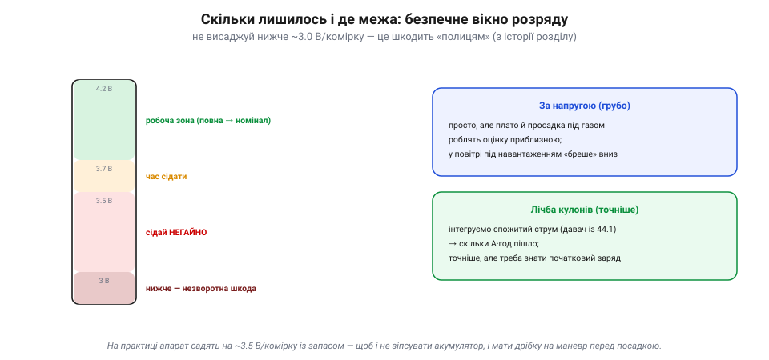
*Рис. 7.4.4.4. Заряд (SoC) і безпечне вікно. Оцінити залишок можна **за напругою** (просто, але грубо через плато й просадку) або **лічбою кулонів** — інтегруючи спожитий струм давачем живлення (7.3.1), скільки А·год уже пішло (точніше, але треба знати початок). А тверде правило — **не висаджувати нижче ~3.0 В/комірку**: за цією межею «полиці» решітки ушкоджуються незворотно (згадай інтеркаляцію з історії). Тому апарат садять завчасно, десь на 3.5 В/комірку.*

Перший спосіб — **за напругою**: грубо, але просто, і саме його показує більшість «пищалок» заряду. Другий, точніший, — **лічба кулонів** (*coulomb counting*): давач живлення з 7.3.1 безперервно міряє струм і додає, скільки А·год уже витрачено, — як лічильник пального. А тверде правило одне: **не розряджати глибше за межу**. Нижче ~3.0 В на комірку починається незворотна шкода (ушкоджуються ті самі шаруваті електроди, що ми бачили в історії), тож на практиці апарат садять завчасно — десь на 3.5 В/комірку, лишаючи запас і на маневр перед посадкою, і на здоров'я акумулятора.

На практиці поєднують обидва підходи. Простий апарат оснащують **пищалкою низької напруги**, що верещить, коли найслабша комірка падає до заданого порога (скажімо, 3.5 В), — і це сигнал негайно сідати. Серйозніший автопілот веде failsafe за напругою **й** за спожитими mAh (лічбою кулонів із давача живлення), вмикаючи «повернення додому», коли лишається замало на дорогу назад. Тобто межу заряду не «прикидають на око», а стережуть автоматикою — бо ціна помилки подвійна: зіпсована батарея або апарат, що не дотягнув додому.

Поза польотом теж є правила. Літій **не люблять** лежати ні повними, ні порожніми: для зберігання їх тримають десь на 3.8 В/комірку («storage»), бо і повний, і висаджений акумулятор старіє швидше. А старіння й ушкодження видно очима: комірка, що **здулася** (напнулась газом), уже небезпечна — її не заряджають і не пхають у польоти. Здуття, гарячий нагрів при заряді чи різке падіння ходу — сигнали, що акумулятор віджив своє.

Зрештою акумулятор — **витратний** компонент: він живе скінченне число циклів заряд-розряд (сотні), і з кожним повним циклом, глибоким розрядом чи перегрівом його ємність потроху тане. Дбайливий режим — не висаджувати в нуль, не перегрівати, заряджати помірним струмом, зберігати напівзарядженим — розтягує життя на роки; недбалий — убиває за місяці.

Ще важлива річ про послідовні комірки: вони мусять лишатися **збалансованими** — мати однакову напругу. Заряд тече крізь усі по черзі, і якщо одна комірка слабша чи відстала, вона першою досягне меж — перерозрядиться при розряді чи перезарядиться при заряді, поки інші ще «здорові». Тому пакет «настільки сильний, наскільки слабка його найгірша комірка», а заряджають літій спеціально, **вирівнюючи** банки. Як саме — у 7.4.6; тут досить запам'ятати, що в багатобаночному пакеті стежать не лише за сумарною напругою, а й за кожною коміркою окремо.

І слово про безпеку, бо літій її вимагає. Уся та цінна щільність енергії при аварії — проколі, перезаряді, короткому, перегріві — виходить **тепловою втечею**: комірка розігріває сама себе, спалахує й горить так, що **коротким заливанням** її не спинити — комірка сама постачає й паливо, і окисник, тож вогонь не «придушити». Тут потрібне **тривале охолодження**, і саме **багато води** його дає (так радить, зокрема, FAA): вода відводить тепло й не дає загорітися сусіднім коміркам. Тому LiPo заряджають і зберігають у вогнетривких мішках чи коробах, не лишають заряд без нагляду, а здуту чи пошкоджену комірку утилізують, а не «дотягують». Повага до батареї — не педантизм, а елементарна безпека.

> 🔧 **Навіщо це.** Глибокий розряд — найшвидший спосіб «убити» літієвий акумулятор: одна посадка «в нуль» помітно скорочує його життя, а кілька — псують безповоротно. Тому failsafe за низьким зарядом (з 7.1.2/7.3.7) — не примха, а захист коштовної батареї; і тому її ніколи не лишають розрядженою «в нуль» на зберігання.

### Підсумок теми

Читати акумулятор просто, якщо розрізняти чотири речі. **Напруга** задається хімією комірки (~3.7 В номінал) і рахунком «**S**» — скільки їх послідовно (4S ≈ 14.8 В). **Ємність** (mAh) — це заряд, скільки струму за скільки годин. **Енергія** (Вт·год = В × А·год) — це справжнє паливо, що й визначає час польоту, тож порівнювати треба саме її, а не mAh. А **крива розряду** нагадує, що напруга нелінійна: майже стоїть на плато й обвалюється за «коліном», тож «вольти ≠ відсотки», а глибше за ~3.0 В/комірку сходити не можна. Маючи цю абетку, перейдімо до того, як батарея поводиться **під навантаженням** — до C-rate, внутрішнього опору й просадки напруги.

---

## 7.4.5 C-rate, внутрішній опір, просадка

Досі ми читали батарею «у спокої»: номінал, ємність, енергія, крива розряду. Але апарат бере струм **поривами** — і саме під навантаженням батарея показує свою справжню вдачу. Тут діють три пов'язані речі: **C-rate** — нормована мова, якою міряють струм відносно ємності; **внутрішній опір** — мала, але вперта завада всередині комірки; і **просадка** — провал напруги, що з того опору випливає. Хто їх плутає, той дивується, чому «повна» батарея раптом перезавантажує контролер на ривку газу. Розберімо по черзі.

### C-rate: нормована мова струму

Скільки струму — «багато»? Сама по собі цифра в амперах нічого не каже: 10 А — дрібниця для великого пакета й непосильний тягар для крихітного. Тому струм батареї міряють не в голих амперах, а в **C-rate** — кратно до ємності. Одиниця тут проста:

> **1C** — це струм, що спорожнив би батарею рівно за **одну годину**. Чисельно 1C (в амперах) дорівнює ємності (в ампер-годинах).

Звідси вся арифметика одним рядком: **I = C-rate × ємність**. Для пакета 5000 mAh (= 5 А·год):

```
1C   = 1   × 5 =   5 А     (розряд за 1 годину)
0.5C = 0.5 × 5 = 2.5 А     (за 2 години — м'яко)
10C  = 10  × 5 =  50 А
50C  = 50  × 5 = 250 А     (це і є «50C» на наклейці)
```


*Рис. 7.4.5.1. C-rate — це струм, нормований до ємності. Ліворуч пакет 5000 mAh (= 5 А·год) і формула I = C-rate × Q. Посередині драбинка: 1C = 5 А (спорожнення за годину), 10C = 50 А, 50C = 250 А — це і є «стеля» з наклейки. Праворуч — нащо взагалі нормувати: ті самі 10 А для пакета 5000 mAh — лагідні 2C, а для крихітного 1300 mAh — люті ~7.7C. C-rate одразу каже, **наскільки важко** батареї, незалежно від її розміру.*

Тепер «50C» на наклейці читається без загадок: це **заявлений виробником максимум** струму віддачі — 50 × ємність. Для нашого пакета 5000 mAh це 250 А. (Тільки пам'ятай: у RC-LiPo ці цифри часто **оптимістичні** — справжню межу диктують нагрів, просадка, внутрішній опір і охолодження, тож реально виходить помітно нижче.) Часто пишуть два числа — **тривалий** і **піковий** («burst», на кілька секунд): тривалий тримають довго, піковий дозволяють лише на короткий ривок. Та сама мова годиться й для **заряду**: «заряд 1C» означає струм, що наповнить пакет приблизно за годину (про заряд — у 7.4.6).

І головне, навіщо взагалі ця морока з кратністю: C-rate показує **навантаженість режиму незалежно від розміру** пакета. Ті самі 10 А — це прогулянкові 2C для пакета 5000 mAh, але люті ~7.7C для крихітного 1300 mAh. Один і той самий струм для одного — забавка, для іншого — на межі. C-rate стирає цю різницю й одразу показує, **наскільки важко** батареї.

> 🔧 **Навіщо це.** Перш ніж брати пакет, прикинь свій **пік струму** й перелічи його в C для цієї ємності. Якщо мотори на піку просять 100 А, а пакет 5000 mAh, то це 20C — і брати треба з добрим запасом понад 20C, а не «впритул». Наклейка «50C» — не реклама заради реклами, а обіцянка, скільки струму пакет віддасть, не задихнувшись.

### Внутрішній опір: чому напруга провалюється

Чому ж не можна просто взяти струм «під саму наклейку»? Бо жодна батарея не є ідеальним джерелом. Усередині кожної комірки, окрім «рушія» — хімічної електрорушійної сили (EMF), — сидить маленький **внутрішній опір** (Rвн): опір електроліту, електродів, з'єднань. Він крихітний — одиниці-десятки **міліом** на комірку, — але саме він псує всю ідилію під струмом.

Модель проста: реальна батарея — це ідеальне джерело EMF **плюс послідовний резистор** Rвн. А на резисторі, щойно крізь нього тече струм, падає напруга. Тому на клемах ми бачимо не повну EMF, а:

```
Vклем = EMF − I × Rвн
```

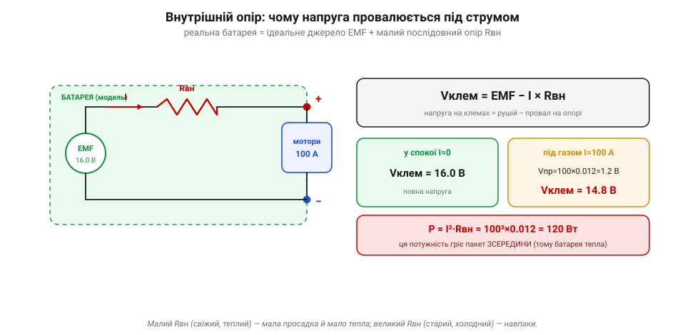
*Рис. 7.4.5.2. Реальна батарея = ідеальне джерело EMF + послідовний опір Rвн. У спокої (струм майже нульовий) на клемах уся EMF — 16.0 В. Та щойно мотори потягли 100 А, на опорі «провалюється» Vпр = I × Rвн = 100 × 0.012 = 1.2 В, і на клемах лишається 14.8 В. Та сама втрата гріє пакет **зсередини**: P = I²·Rвн = 120 Вт. Квадрат струму — тому подвоїв струм, а тепла вчетверо більше.*

Порахуймо на живому прикладі. Здоровий 4S-пакет має внутрішній опір десь **12 мОм** (сумарно по чотирьох комірках). У спокої він показує, скажімо, 16.0 В. Даємо газ — і мотори тягнуть 100 А:

```
просадка:   Vпр   = I × Rвн = 100 А × 0.012 Ом = 1.2 В
на клемах:  Vклем = 16.0 − 1.2 = 14.8 В
```

Цілий вольт із гаком просто зник на внутрішньому опорі, щойно пішов струм. А куди він подівся? У **тепло**: на тому ж опорі розсіюється потужність **P = I²·Rвн = 100² × 0.012 = 120 Вт**, що гріють пакет **зсередини**. Ось чому батарея після злого польоту тепла на дотик, а близька до межі — навіть гаряча. І ось чому залежність квадратична: подвоїв струм — учетверо більше тепла.

> 📜 Ще 1897 року німецький інженер **Вільгельм Пойкерт** (*Wilhelm Peukert*) помітив на свинцевих акумуляторах: що більший струм розряду, то **менше** корисної ємності встигаєш узяти. Чим швидше «висмоктуєш» батарею, тим більше губиш на внутрішніх втратах — частина енергії йде в тепло, а не в роботу. Тому ємність на наклейці міряють за **малого** струму; на великому C доступних ампер-годин завжди трохи менше. Закон Пойкерта старший за літій на ціле століття, а правда його та сама: батарею не можна квапити безкарно.

> 🔧 **Навіщо це.** Внутрішній опір — це і просадка, і тепло, і втрачена ємність воднораз. Пакет із **малим** Rвн (свіжий, якісний, теплий) тримає напругу під газом і менше гріється; пакет із **великим** Rвн (старий, дешевий, холодний) провалюється й перегрівається на тому самому струмі. Тому зарядки й вимірюють Rвн кожної комірки — це найчесніший показник **здоров'я** батареї.

### Просадка під навантаженням

Тепер з'єднаймо це з польотом. Газ на апараті не стоїть рівно — він **сіпається**: завис, ривок угору, різкий маневр. І за кожним ривком струму напруга на клемах **провалюється** на I × Rвн, а коли газ слабшає — вертається назад. Це і є **просадка** (sag): жива напруга в польоті гойдається синхронно з газом, осідаючи на піках і підіймаючись на холостому.

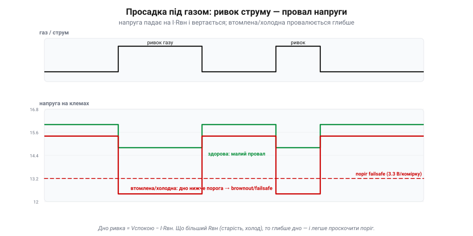
*Рис. 7.4.5.3. Просадка в часі. Угорі — газ (струм), що стрибає ривками; унизу — напруга на клемах, яка на кожному ривку провалюється на I × Rвн і вертається. Здорова батарея (зелена) робить малий провал і лишається вище порога. А втомлена чи холодна (червона) має більший Rвн — і її дно **провалюється нижче критичного порога** (3.3 В/комірку), де спрацьовує failsafe або контролер геть перезавантажується (brownout) посеред маневру.*

Поки пакет здоровий, просадка невелика, і дно провалу лишається вище порога — усе гаразд. Але є дві пастки. Перша — **втомлена** батарея: з віком Rвн росте, тож та сама сотня ампер провалює напругу вже не на вольт, а на два-три. Друга — **холод**: на морозі хімія млявіша, Rвн підскакує, і навіть свіжий пакет просідає глибше. У будь-якому з цих випадків дно ривка може **впасти нижче критичного порога** — і тоді контролер бачить миттєву недонапругу: у кращому разі спрацьовує failsafe (повернення додому за низьким зарядом, 7.1.2/7.3.7), у гіршому — мікроконтролер просто **перезавантажується** (brownout) посеред маневру. Класична загадка «повна батарея, а апарат упав на різкому газі» — це майже завжди вона, просадка втомленого чи холодного пакета.

Звідси й корисний бік просадки: вона — **діагностика**. Якщо напруга валиться від найменшого газу, пакет або старий, або змерз, або недостатній за C — час придивитися. Досвідчені оператори навіть навмисне «вантажать» батарею, дивлячись, наскільки глибоко вона сяде: малий провал — здорова, глибокий — на пенсію.

> 🔧 **Навіщо це.** Поріг failsafe став з оглядкою на просадку, а не на напругу спокою: він має ловити **дно ривка**, інакше апарат «клюватиме» носом у браунаут на кожному піку. Узимку давай батареї прогрітися й закладай більший запас — холодний пакет бреше вниз дужче. А якщо напруга під газом раптом валиться глибше, ніж раніше, — це сигнал, що пакет здає.

### Скільки «C» треба: вибір під пік струму

Лишилося звести все в просте інженерне рішення: **який C-rate брати?** Відповідь — від **піку струму**, а не від середнього. Порахуй найбільший струм, який апарат може попросити воднораз: для квадрокоптера це приблизно сума максимальних струмів усіх моторів.


*Рис. 7.4.5.4. Вибір C-rate робиться під **пік** струму. Чотири мотори на піку тягнуть по ~25 А — разом ~100 А. Тоді Cмін = пік ÷ ємність = 100 ÷ 5 = 20C. Та «впритул» не беруть: замалий C карає просадкою, перегрівом, здуттям і коротким життям; завеликий — це лише зайва вага й ціна. Тому беруть **із запасом** — 50C там, де треба 20.*

Нехай чотири мотори на піку тягнуть по ~25 А — разом це ~100 А. Тоді мінімальний C для пакета 5000 mAh:

```
Cмін = пік струму ÷ ємність = 100 А ÷ 5 А·год = 20C
```

Але «впритул» брати не можна — бо біля своєї стелі пакет максимально просідає й гріється. Тому беруть **із запасом**: 50C там, де треба 20C. Що дає запас? Менший Rвн відносно струму, отже — менша просадка, менше тепла, більший ресурс і витриваліша напруга під газом. Недостатній C карає одразу всім: глибока просадка (браунаути), перегрів, **здуття** комірок і коротке життя. А завеликий C — це переважно зайва **вага** й ціна (потужніші пакети важчі), тож і тут є золота середина, як і з ємністю в 7.4.4.

> 🔧 **Навіщо це.** Підбирай пакет за піком, не за «середнім»: апарат падає не від середнього струму, а від провалів на піках. Бери C з запасом удвічі-втричі понад розрахунковий мінімум — це найдешевша страховка від браунаутів і здуття. І пам'ятай: справжній C реальних пакетів зазвичай **оптимістичніший** за наклейку, тож запас рятує ще й від маркетингу.

### Підсумок теми

Під навантаженням батарея перестає бути ідеальною — і три поняття пояснюють чому. **C-rate** дає нормовану мову струму: 1C спорожнює пакет за годину, а I = C-rate × ємність, тож «50C» на 5000 mAh — це 250 А стелі. **Внутрішній опір** (одиниці-десятки міліом) — причина всіх бід під струмом: на ньому напруга падає як Vпр = I × Rвн, а потужність I²·Rвн іде в тепло. **Просадка** — видимий наслідок: напруга гойдається з газом і може провалитися нижче порога, надто у втомленого чи холодного пакета, спричиняючи failsafe або браунаут. А вибір **C-rate** робиться під пік струму із запасом — щоб просадка, тепло й старіння лишалися в безпечних межах. Тепер, коли ясно, як батарея віддає енергію, перейдімо до дзеркальної задачі — як її **безпечно повертати**: заряд CC/CV, баланс банок і захист BMS.

---

## 7.4.6 Заряд CC/CV, баланс, захист (BMS)

Тема 7.4.5 була про те, як батарея **віддає** енергію. Тепер — дзеркальна задача: як її **повертати**, та ще й безпечно. Заряджати літій — не те саме, що доливати воду в бак: переллєш струму чи напруги — і комірка не просто зіпсується, а може спалахнути. Тому заряд літію — це строгий **протокол**, а не «під'єднав і забув». У ньому три дійові особи: метод **CC/CV** (як саме подавати струм і напругу), **баланс** (щоб усі банки йшли в ногу) і **BMS** — вартовий, що стереже межі. Розберімо кожного.

### Заряд CC/CV: дві фази

Чому не можна просто подати на батарею потрібну напругу? Бо на майже порожній комірці різниця з джерелом велика, і струм ринув би катастрофічний (згадай малий внутрішній опір із 7.4.5). А подавати малий сталий струм аж до повного — означало б у кінці **перевищити** безпечні 4.2 В і влаштувати перезаряд. Тому заряд літію роблять у **дві фази**, і зветься це **CC/CV** — *constant current / constant voltage*.


*Рис. 7.4.6.1. Дві фази заряду. **CC**: зарядник жене незмінний струм (типово 1C), а напруга комірки росте, поки не впреться в стелю 4.2 В — тут набирається 70–80% заряду, і то швидко. **CV**: далі зарядник тримає рівно 4.2 В, і струм сам собою спадає по спадній; коли він падає до ~C/10, пакет повний і заряд спиняють. Струм спадає сам, бо зарядник тримає стелю напруги; але заряд **зупиняє зарядник** за порогом струму (*termination*), а не «втомлена» комірка.*

**Фаза CC (сталий струм).** Зарядник жене **незмінний** струм — типово 1C (5 А для пакета 5000 mAh), а напруга на комірці потроху **росте**, поки не впреться в стелю 4.2 В. Тут набирається левова частка заряду — десь 70–80%, і то швидко.

**Фаза CV (стала напруга).** Щойно напруга дійшла 4.2 В, зарядник перемикається: тепер він **тримає** рівно 4.2 В і вже не дає напрузі рости. Комірка наповнюється, її «апетит» до струму спадає — і струм сам собою **зменшується** по спадній. Коли він падає десь до **C/10** (однієї десятої від ємності), пакет вважають повним і заряд **припиняють**. Струм згасає сам, бо зарядник тримає стелю напруги; але **зупиняє** заряд за порогом струму сам зарядник, а не «втомлена» комірка — лишена надовго фаза CV чи завищена напруга вже шкодять, тож це не «самозахист» батареї.

Чому не лити більший струм, щоб швидше? Бо великий зарядний струм — це той самий I²·R-нагрів (7.4.5) плюс прискорене старіння. Тому стандарт — заряд **≤1C**; «швидкі» пакети дозволяють більше, але платять ресурсом. І ще: заряд завжди до **стелі своєї хімії** — для звичайного Li-ion/LiPo це **4.2 В/комірку**, ані на десяту вище, бо понад це починається небезпечна хімія. (В інших хімій стеля інша: LiFePO4 — ~3.6 В, «високовольтні» LiHV — ~4.35 В; тож звіряйся з типом пакета.)

> 🔧 **Навіщо це.** Заряджай балансирним зарядником на струмі **≤1C** і ніколи не «підкручуй» напругу понад 4.2 В/комірку. Якщо хочеш, щоб пакет жив роками, став навіть 0.5C — повільніший заряд менше його зношує. А «дотискання» в кінці (фаза CV із малим струмом) — нормальне: останні відсотки завжди заходять повільно.

### Баланс: пакет міцний, як найслабша банка

У багатобаночному пакеті (4S — чотири послідовно) комірки **не однакові**: вони злегка різняться від народження й по-різному старіють. А заряд тече крізь усі **по черзі**, тим самим струмом. Тому одна, трохи повніша банка дійде 4.2 В **раніше** за інші — і якби заряд тривав, вона **перезарядилася** б, поки сусіди ще не повні. І навпаки при розряді: найслабша першою впаде до межі. Виходить, увесь пакет **обмежений найгіршою коміркою**.

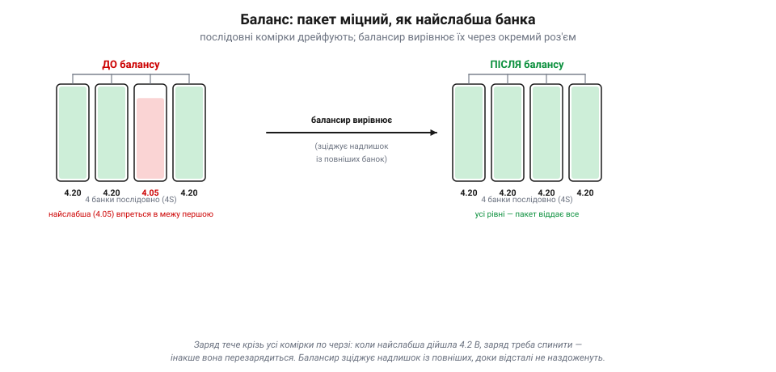
*Рис. 7.4.6.2. Чому потрібен баланс. Ліворуч — пакет до балансу: одна банка відстала (4.05 В проти 4.20). При заряді вона дійде межі останньою, при розряді — першою впаде, і саме вона обмежує весь пакет. Праворуч — після балансу: балансир зцідив надлишок із повніших банок, усі стоять на рівних 4.20 В, і пакет віддає всю ємність. Для цього в LiPo є окремий **балансирний роз'єм** із виводом від кожної банки (для 4S — п'ять дротів).*

Розв'язок — **балансування**. Саме тому в LiPo, окрім двох силових дротів, є ще окремий тонкий **балансирний роз'єм** з виводом від **кожної** банки (для 4S — п'ять дротів). Через нього зарядник бачить напругу **кожної** комірки нарізно й під час заряду **вирівнює** їх: зціджує надлишок із тих, що вирвалися вперед (пасивний баланс — крізь резистори, «у тепло»), доки відсталі не наздоженуть. Наприкінці всі банки стоять на однакових 4.2 В — і пакет віддає всю свою ємність, а не стільки, скільки дозволяє найгірша.

Ось чому **завжди** заряджають через балансирний роз'єм, а не лише через силові дроти: без балансу банки поступово **розбігаються**, аж доки одна не вийде за межу — у перезаряд (небезпечно) чи в глибокий розряд (псує). Дисбаланс видно прямо: добрий зарядник показує напругу кожної банки, і якщо одна помітно відстає — пакет старіє нерівномірно й проситься на пенсію.

> 🔧 **Навіщо це.** Підключай балансирний роз'єм щоразу й позирай на напруги банок: різниця в кілька сотих вольта — норма, а от десяті — тривога. «Роздута» різниця між банками — рання ознака, що пакет здає; такий не варто ганяти на межі.

### BMS: вартовий батареї

CC/CV й баланс — це як **правильно** заряджати. Але потрібен ще й той, хто **стереже**, щоб ніхто не вийшов за межу — при заряді, розряді й узагалі завжди. Це робота **BMS** (*Battery Management System*) — невеликої електроніки-наглядача, що міряє кожну банку, струм і температуру й **обриває коло**, щойно щось виходить за безпечні рамки.


*Рис. 7.4.6.3. BMS стереже чотири межі: **понапругу** (банка вище ~4.25 В → обрізає заряд), **недонапругу** (банка нижче ~3.0 В → обрізає розряд, рятуючи від глибокого висаджування з 7.4.4), **надструм** (струм понад межу чи коротке → вимикає миттєво) і **перегрів** (t° понад ~60 °C). Часто той самий вузол ще й балансує банки. На «голому» LiPo цю роль ділять зарядник і польотний контролер; у Li-ion пакетах стоїть повноцінний BMS.*

BMS стереже чотири межі: **понапругу** (банка вище ~4.25 В → обрізає заряд), **недонапругу** (банка нижче ~3.0 В → обрізає розряд, рятуючи від глибокого висаджування з 7.4.4), **надструм** (струм понад межу чи коротке → вимикає миттєво) і **перегрів** (температура понад ~60 °C → вимикає). Часто той самий вузол ще й **балансує** банки. По суті, BMS — це автоматика безпеки, що робить літій придатним для щоденного вжитку: без неї одна помилка означала б пожежу.

Тут є нюанс саме для дронів. Гоночний чи польотний **LiPo** часто буває «голий» — без власного BMS, заради ваги; його захист розподілений: **зарядник** робить CC/CV й баланс, а **польотний контролер та ESC** стережуть низьку напругу в польоті (failsafe з 7.1.2/7.3.7). А от у серйозніших системах — великих **Li-ion** складанках, павербанках, електротранспорті — стоїть повноцінний BMS, що сам обриває коло на будь-якому порушенні. Тобто захист **намагаються** мати завжди, питання лише — вбудований він у пакет чи розкладений по заряднику й контролеру. Тільки не плутай **моніторинг** з апаратним захистом: зарядник і автопілот стежать за напругою, та вони **не замінять** апаратного захисту від короткого, проколу чи миттєвого надструму на голому польотному LiPo. І навпаки — BMS, що **різко відрубить** силовий пакет у польоті, сам може спричинити **падіння**, тож для летючих систем його поведінку добирають окремо (краще м'яке попередження, ніж раптовий обрив).

> 📜 Перший комерційний літій-іонний акумулятор випустила **Sony 1991 року** — і не «голим». Інженери чудово знали про норовистість літію (історія розділу!), тож від початку продавали комірки **разом зі схемою захисту** — платою, що обриває коло при перезаряді, перерозряді й короткому. Саме ця непомітна електроніка-наглядач, прабатько сучасного BMS, і зробила літій безпечним для кишені пересічної людини. Без неї геніальна хімія Йосіно так і лишилася б лабораторною небезпекою.

> 🔧 **Навіщо це.** Знай, **хто** в твоїй системі стереже межі. Якщо літієвий пакет «голий», то поза зарядником його єдиний захист у польоті — це правильно налаштований failsafe контролера; постав його сумлінно. А пакет із вбудованим BMS, що раптом «вимкнувся» під навантаженням, — це не поломка, а спрацював захист: шукай причину (просадка, холод, надструм), а не «обходь» його.

### Як заряджати на практиці

Зведімо все в коротку практику. Заряд літію — чи не єдина операція, де недбалість карається не лагом, а **вогнем**, тож тут діють тверді правила.


*Рис. 7.4.6.4. Практика заряду. Балансирний зарядник підключають до пакета **двома** джгутами — силовим і балансирним, — а сам пакет кладуть у вогнетривкий мішок. Праворуч — звід правил «роби / не роби»: заряд ≤1C, баланс щоразу, зберігання на ~3.8 В, нагляд — проти перезаряду, заряду здутого пакета, морозу й залишення без догляду. Кожне «не роби» — це запобіжник проти теплової втечі.*

**Роби:** заряджай **балансирним** зарядником, струмом **≤1C**, **щоразу** через балансирний роз'єм; став пакет у **вогнетривкий** мішок чи короб; **будь поряд** і поглядай; давай гарячому після польоту пакету **прохолонути** перед зарядом. Для тривалого зберігання тримай **storage-напругу** ~3.8 В/комірку (добрі зарядники мають режим «storage»), бо і повний, і порожній літій старіє швидше.

**Не роби:** не **перезаряджай** (понад 4.2 В/комірку); не заряджай **здуту** чи пошкоджену комірку — її утилізують, а не «дотягують»; не заряджай на **морозі** (нижче 0 °C); не лишай заряд **без нагляду** на ніч; не **проколюй** і не тисни пакет; не лишай **висадженим у нуль** на зберігання. Кожне з цих «не» — запобіжник проти теплової втечі, яку ми згадували в 7.4.4: коротким заливанням її не спинити (комірка сама постачає й паливо, і окисник) — тут потрібне **тривале охолодження великою кількістю води**.

> 🔧 **Навіщо це.** Більшість «пожеж від літію» — це не зла доля, а порушене одне з цих правил: перезаряд, заряд здутого пакета чи кинутий без нагляду зарядник. Дотримуйся протоколу — і батарея служитиме роками тихо й безпечно; знехтуй — і одна ніч може коштувати майстерні.

### Підсумок теми

Заряджати літій — означає шанувати протокол. **CC/CV** дає правильну форму заряду: спершу сталий струм (≤1C) піднімає напругу до 4.2 В/комірку, тоді стала напруга «дотискає», поки струм не впаде до ~C/10. **Баланс** через окремий роз'єм тримає всі послідовні банки рівними, бо пакет міцний лише настільки, наскільки міцна найслабша. А **BMS** — вартовий, що обриває коло при понапрузі, недонапрузі, надструмі чи перегріві; на «голому» LiPo його роль ділять зарядник і польотний контролер. І над усім — тверда практика безпеки, бо ціна помилки тут вогонь. Тепер ми вміємо й читати батарею, і віддавати з неї енергію, і безпечно повертати — лишилося звести це в **бюджет**: чи вистачить запасу на весь політ. Це й буде остання тема розділу — 7.4.7.

---

## 7.4.7 Бюджет енергії: надовго вистачить

Ми навчилися читати батарею (7.4.4), знаємо, як вона віддає енергію під навантаженням (7.4.5) і як її безпечно заряджати (7.4.6). Лишилося найпрактичніше питання, заради якого все це й рахували: **чи вистачить заряду на політ?** Відповідь дає **бюджет енергії** — простий розрахунок, що з'єднує запас у батареї з витратою апарата й каже, скільки хвилин ти протримаєшся в повітрі. Без нього політ перетворюється на лотерею «сяде — не сяде».

### Головна формула: запас ділимо на витрату

Серце бюджету — одне ділення:

```
час польоту = корисна енергія (Вт·год) ÷ середня потужність (Вт)
```

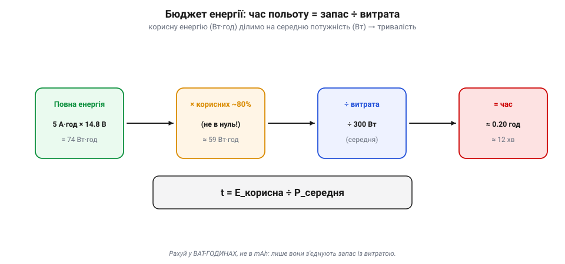
*Рис. 7.4.7.1. Бюджет енергії в чотири кроки. Повна енергія пакета — ємність × напруга (5 А·год × 14.8 В = 74 Вт·год). Із неї беруть лише ~80% **корисних** (нижче ~3.3 В/комірку не сходять) — близько 59 Вт·год. Це ділять на **середню потужність** витрати (скажімо, 300 Вт) — і дістають час: ≈ 0.20 год ≈ 12 хвилин. Рахунок ведуть у ват-годинах, бо лише вони стикуються з ватами витрати.*

Розберімо по кроках на пакеті 4S 5000 mAh. **Повна енергія** — це ємність на напругу: 5 А·год × 14.8 В = **74 Вт·год** (саме Вт·год, не mAh — лише вони з'єднують запас із витратою). Але всю енергію взяти не можна: нижче ~3.3–3.5 В/комірку сходити не варто (7.4.4), тож **корисних** лишається десь **80%** — близько **59 Вт·год**. Тепер ділимо на **середню потужність** витрати — скажімо, апарат у польоті бере ~300 Вт: 59 ÷ 300 ≈ 0.20 год ≈ **12 хвилин**. Ось і весь бюджет.

Зверни увагу на два «але», що ховаються в цифрах. Перше — **корисні 80%, а не 100%**: планувати на повне висаджування означає вбивати батарею й ризикувати просадкою (7.4.5). Друге — потужність **середня**, а політ нерівний: зависання, ривки, вітер. Тому 12 хвилин — це стеля за ідеальних умов; реально закладай менше.

> 🔧 **Навіщо це.** Рахуй бюджет у **ват-годинах**, бо лише вони стикуються з ватами витрати. Швидка прикидка: подвоїв середню потужність — удвічі коротший політ; узяв удвічі більше корисних Вт·год — удвічі довший (поки не завелика вага, про що далі). І завжди бери **корисну** частку, а не повну ємність.

### Куди йдуть ватти: бюджет потужності

Звідки береться та «середня потужність»? Її складають усі споживачі апарата — але вони геть нерівні. Левову частку з'їдають **мотори**, щоб просто втримати апарат у повітрі; решта — крихти на їхньому тлі, та в бюджет їх теж вписують.

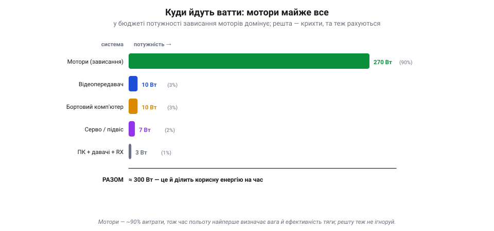
*Рис. 7.4.7.2. Бюджет потужності типового квадрокоптера. Зависання моторів — близько 90% усієї витрати; саме тому час польоту найперше визначають вага й ефективність тяги. Решту складають відеопередавач, бортовий комп'ютер машинного бачення, серво й підвіс, а також дрібнота — польотний контролер, давачі, приймач. Поодинці крихти, але разом — кілька відсотків, і течуть вони постійно, навіть коли апарат просто висить.*

Для типового квадрокоптера зависання моторів — це десь **90%** усієї витрати; саме тому час польоту найперше визначають **вага** апарата й **ефективність** його тяги (більший гвинт на менших обертах — ощадніший). Решту складають **відеопередавач** (одиниці-десяток ватів), **бортовий комп'ютер** для машинного бачення (теж одиниці-десяток), **серво й підвіс**, а також дрібнота — польотний контролер, давачі, приймач (разом одиниці ватів). Поодинці це крихти, але разом вони з'їдають кілька відсотків бюджету, а головне — течуть **постійно**, навіть коли апарат просто висить.

Тому повний бюджет — це сума: потужність зависання плюс уся «електроніка на борту». Для апарата з важкою корисною навантагою (камера, обчислювач, підвіс) ця «дрібнота» вже не така дрібна, і її варто враховувати чесно.

> 🔧 **Навіщо це.** Хочеш довший політ — бий по найбільшій статті: **знижуй вагу** й бери ефективнішу тягу (більші гвинти, правильні мотори), бо мотори — це 90%. Але як ставиш ненажерливий вантаж (потужний обчислювач, прожектор), додай його в бюджет окремо: він точить запас увесь політ, навіть на зависанні.

### Чому більша батарея не рятує

Здавалося б, рецепт довшого польоту очевидний: постав батарею більшу. Але тут чигає пастка, яку ми вже згадували в 7.4.4: більша батарея **важча**, а важчий апарат мусить **дужче тягти**, щоб її ж і нести, — і та зайва тяга з'їдає додаткову енергію.


*Рис. 7.4.7.3. Час польоту проти ваги батареї. Спершу більша батарея додає хвилин, але приріст дедалі менший, аж поки в оптимумі не спиняється, а далі час навіть падає: батарея стає така важка, що левова частка її енергії йде на те, щоб тримати в повітрі саму себе. Тому в кожного апарата є оптимальна вага батареї, і «найбільша» — не значить «найдовша».*

Виходить крива з **горбом**: попервах більша батарея таки додає хвилин, але приріст дедалі менший, аж поки в **оптимумі** не спиняється, а далі час навіть **падає** — батарея стає така важка, що левова частка її енергії йде на те, щоб тримати в повітрі саму себе. Тому в кожного апарата є **оптимальна вага батареї**, і просто «взяти найбільшу» не лише не подовжить політ, а й може скоротити. Це та сама межа щільності енергії з історії розділу, лише з практичного боку: важить не скільки всього енергії, а скільки її на грам.

> 📜 Що тривалість польоту залежить від енергії, ваги й ефективності, зрозуміли ще на світанку авіації. Французький піонер **Луї Бреге** (*Louis Breguet*) — авіаконструктор і математик — у 1920-х вивів знамениті **рівняння дальності й тривалості Бреге**: вони зв'язали, як далеко й як довго протримається літак, із запасом палива, вагою та аеродинамічною досконалістю. Для електричного апарата змінилося лише «паливо» — замість бензину Вт·год у батареї, — але логіка та сама: дальність і час ростуть із запасом енергії на одиницю ваги й падають із вагою конструкції. Сторічна формула досі керує і реактивним лайнером, і твоїм дроном.

> 🔧 **Навіщо це.** Не женися за «найбільшою банкою»: для свого апарата шукай оптимум ваги, а не максимум ємності. Якщо хочеш суттєво довший політ, чесний шлях — не товща батарея, а **легший апарат**, ефективніша тяга або якісніші комірки (більше Вт·год на грам), а не просто більше грамів на борту.

### Резерв і повернення: не плануй на нуль

І останнє, найважливіше для безпеки: **ніколи не плануй використати весь бюджет**. Реальний політ повен несподіванок — зустрічний вітер назад, незапланований маневр, постаріла батарея, що віддає менше. Тому корисну енергію ділять не на «всю місію», а на **місію плюс резерв**.


*Рис. 7.4.7.4. Як ділять корисний запас. Не вся енергія йде на місію: за нею — резерв на дорогу додому, посадку із запасом на вітер і недоторканний залишок. Польотний контролер рахує спожиті mAh (лічба кулонів, давач живлення 7.3.1) і вмикає **повернення (RTL)** рівно тоді, коли лишилось стільки, щоб долетіти й сісти. Тверде правило — садити з 20–30% у запасі.*

Працює це так. Польотний контролер увесь час **рахує спожите** — лічить витрачені mAh давачем живлення (лічба кулонів із 7.3.1) і/або стежить за напругою під навантаженням. Щойно лишається рівно стільки, скільки треба, **щоб долетіти додому й сісти**, він сам умикає **повернення** (*RTL — return to launch*) чи інший failsafe (7.1.2/7.3.7). Тобто межу не «прикидають на око» — її стереже автоматика, бо ціна помилки — апарат, що впав, не дотягнувши.

Тверде практичне правило: **сідай із 20–30% у запасі**. «До нуля» не літають з трьох причин одразу: за низького заряду найгірша просадка (7.4.5), глибокий розряд убиває батарею (7.4.4), а будь-яка несподіванка — вітер, промах із курсом — уже не лишає права на помилку. Резерв — це не марнотратство, а страховка, яка одного дня поверне апарат додому.

> 🔧 **Навіщо це.** Налаштуй failsafe за зарядом **із запасом на дорогу назад**, а не «поки зовсім не сяде»: апарат має вертатися, коли ще має чим. І зважай на старіння: торішня батарея віддає менше, ніж каже наклейка, тож резерв для неї закладай більший. Найкращий бюджет — той, що завжди трохи песимістичний.

### Підсумок теми

Бюджет енергії перетворює всю абетку живлення на одну практичну відповідь — **надовго вистачить**. Час польоту — це **корисна енергія ÷ середня потужність**: рахуй у Вт·год (ємність × напруга × ~80% корисних) і поділи на суму витрат, де мотори — ~90%, а решта електроніки точить решту. Більша батарея допомагає лише до **оптимуму ваги**, за яким сама себе несе, тож довший політ дає радше легкість і ефективність, ніж зайві грами. А над усім — **резерв 20–30%** і автоматичне повернення, бо садити в нуль означає бити по просадці, ресурсу батареї й власній удачі воднораз. На цьому **Розділ 7.4 завершено**: ми пройшли шлях від перетворення енергії до її бюджету — і тепер уміємо живити складну систему так, щоб вона літала довго й не падала через живлення. Далі — **Розділ 7.5**: як апарат зводить покази всіх своїх давачів в одну довірену оцінку власного стану.