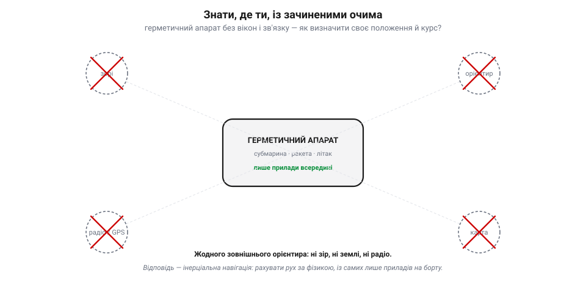
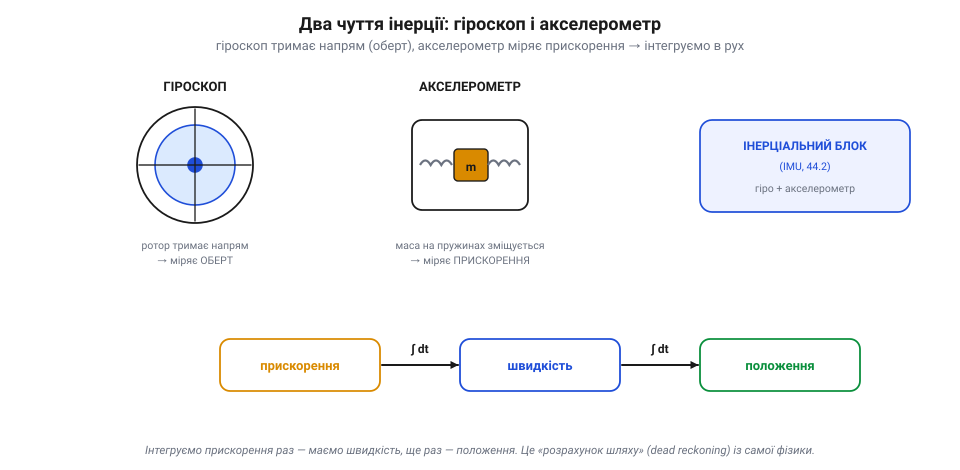
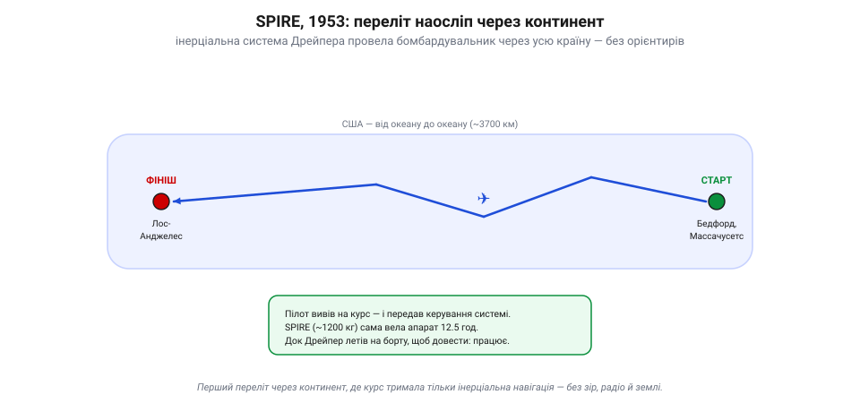
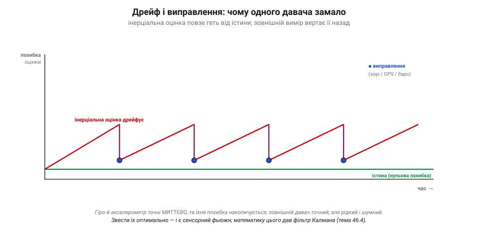

📜 *Історична вставка до [Розділу 7.5 — Оцінювання стану й сенсорний фьюжн](ch46-state-estimation-fusion.md).*

# Історія: Чарльз Дрейпер та інерціальна навігація — як летіти, не бачачи землі

Перш ніж апарат зможе кудись летіти, він мусить знати одну річ: **де він і як рухається**. Здавалося б, дрібниця — глянь униз. Але що, як унизу не видно нічого: ніч, хмари, відкритий океан, глибина під водою, космос? Як знати своє положення, швидкість і нахил, **не бачачи зовсім нічого** ззовні? Відповідь на це — окрема інженерна сага завдовжки в півстоліття, а її головний герой — скромний професор з MIT на прізвисько **«Док» Дрейпер**, якого називають **батьком інерціальної навігації**. Його ідея — рахувати рух із самої лише фізики, нічого не питаючи в зовнішнього світу — лежить в основі того, як орієнтується кожен сучасний апарат, від субмарини до твого дрона. І саме з неї виростає вся тема цього розділу: чому жоден давач не достатній сам і як звести їхні покази в одну довірену оцінку.

## Знати, де ти, із зачиненими очима

Уся навігація тисячі років спиралася на **зовнішні орієнтири**: берег, зорі, маяк, згодом радіо. Але є апарати, яким ці орієнтири недоступні в принципі. Субмарина під водою не бачить ні зір, ні берега й не може виставити антену. Балістична ракета летить надто швидко й не сміє покладатися на радіо, яке ворог заглушить. Літак у хмарах чи вночі лишається без землі під ногами. Усім їм треба знати своє положення **зсередини зачиненої коробки** — без вікон, без зв'язку, без жодного погляду назовні.

*Рис. 7.5.0.1. Задача інерціальної навігації. Герметичний апарат — субмарина, ракета, літак у хмарах — позбавлений усіх зовнішніх орієнтирів: ні зір, ні землі, ні радіо, ні карти. Своє положення він мусить знати **зсередини**, із самих лише приладів на борту. Здається неможливим — та фізика дає лазівку: стеж за кожним поштовхом і поворотом, і зможеш порахувати, куди перемістився.*

Це здається неможливим: як визначити, де ти, нічого не спостерігаючи? Але фізика дає лазівку. Якщо точно стежити за **кожним поштовхом і поворотом**, яких апарат зазнає від самого старту, то можна **порахувати**, куди він за цей час перемістився — як подорожній, що із заплющеними очима лічить кожен свій крок і поворот, аби знати, де опинився. Цей спосіб і зветься **інерціальною навігацією**: рух виводять не зі спостережень, а з вимірювання власних прискорень та обертань. Лишалося навчитися міряти їх досить точно — а це виявилося страшенно важко.

## Два чуття інерції: гіроскоп і акселерометр

В інерціальної навігації два органи чуття, обидва спираються на **інерцію** — впертість матерії зберігати свій рух.

*Рис. 7.5.0.2. Два органи чуття інерції. **Гіроскоп**: обертовий ротор за інерцією тримає вісь у просторі, тож за поворотом корпусу відносно неї читають орієнтацію апарата. **Акселерометр**: маса на пружинах зміщується під прискоренням — так його й міряють. А далі математика: прискорення інтегрують раз — дістають швидкість, ще раз — положення. Разом гіро й акселерометр утворюють інерціальний блок (IMU, 7.3.2).*

Перший — **гіроскоп**. Обертовий ротор за інерцією вперто зберігає вісь свого обертання в просторі, хоч би як крутився апарат довкола. Тому гіроскоп править за незмінний **дороговказ напряму**: за тим, як корпус повертається відносно його осі, можна щомиті знати **орієнтацію** апарата — куди він нахилений і повернутий. Другий — **акселерометр**. По суті, це **тягарець на пружинах**: коли апарат прискорюється, інерція притискає масу назад, пружина прогинається — і за цим прогином міряють **прискорення**.

А далі — чиста математика. Прискорення, проінтегроване за часом, дає **швидкість**; швидкість, проінтегрована ще раз, дає **пройдений шлях**, тобто **положення**. Знаючи, з якої точки стартували, і безперервно складаючи всі прискорення й повороти, апарат **обчислює** своє теперішнє місце — без жодного погляду назовні. Це класичний **«розрахунок шляху»** (*dead reckoning*), доведений до автоматизму й точності приладів. Гіроскопи з акселерометрами разом утворюють **інерціальний блок** (IMU з 7.3.2) — те саме «вестибулярне чуття», що ти бачив на платі дрона.

> 🔧 **Навіщо це.** Та сама пара — гіроскоп і акселерометр — сидить у кожному дроні, телефоні й геймпаді. Інерціальна навігація не «застаріла магія», а жива основа: коли GPS пропадає (у приміщенні, під мостом, під глушилкою), апарат якийсь час тримається саме на ній — рахує рух із власних поштовхів і поворотів.

## Док Дрейпер: людина, що зробила це практичним

Принцип знали давно — а от **зробити його точним** не вдавалося нікому. Найменша похибка гіроскопа чи акселерометра з кожною секундою накопичується, і за годину розрахунок «попливе» на кілометри. Потрібні були неймовірно досконалі прилади — і тут на сцену вийшов **Чарльз Старк Дрейпер** (*Charles Stark Draper*, 1901–1987), професор Массачусетського технологічного інституту, якого всі звали **«Док»**.

Дрейпер заснував у MIT **Лабораторію приладобудування** (*Instrumentation Laboratory*) — згодом її назвуть його ім'ям, **Draper Laboratory**. Він був не кабінетним теоретиком, а інженером-фанатиком точності: роками вилизував конструкцію гіроскопів, борючись із тертям, дрейфом і вібрацією. Перший гучний успіх прийшов ще під час Другої світової — Дрейперів **гіроскопічний приціл** для зеніток сам обчислював випередження, і влучність корабельних гармат різко зросла. Це довело: точні інерціальні прилади — не фантазія, а робочий інструмент. Та головне випробування було попереду.

## SPIRE, 1953: переліт наосліп через континент

Щоб довести світові (і скептичним військовим), що інерціальна навігація може **провести апарат сама**, Дрейпер влаштував зухвалий експеримент. Його лабораторія збудувала систему **SPIRE** (*Space Inertial Reference Equipment*) — махину вагою близько **1200 кілограмів**, напхану гіроскопами, акселерометрами й обчислювачем.

*Рис. 7.5.0.3. Доказ принципу, 1953. Бомбардувальник B-29 із системою SPIRE (~1200 кг) пролетів від Бедфорда (Массачусетс) до Лос-Анджелеса, ведений **лише** інерціальною навігацією: пілот вивів на курс і передав керування, а далі апарат сам тримав шлях через увесь континент — без зір, радіо й землі. Док Дрейпер летів на борту. 12.5 години — і на місці.*

У **1953 році** SPIRE встановили на бомбардувальник **B-29**. Пілот підняв літак, вивів на курс — і **передав керування системі**. Далі апарат летів через **увесь континент**, від Бедфорда в Массачусетсі до Лос-Анджелеса, **без жодного орієнтира**: ніхто не дивився на зорі, не слухав радіомаяків, не звірявся з картою. Курс тримала сама лише інерціальна система, рахуючи шлях зі своїх гіроскопів і акселерометрів. Дванадцять із половиною годин — і літак прибув на місце. Сам Дрейпер летів **на борту**, аби особисто засвідчити: машина знає, де вона, не бачачи землі.

Це був тріумф. Той самий принцип невдовзі повів **ракети підводних човнів «Поларіс»** (субмарина мусить стріляти точно, ніколи не виринаючи) і ліг в основу навігації **міжконтинентальних ракет**. Інерціальна навігація стала хребтом цілої епохи — і не лише військової.

> 🔧 **Навіщо це.** Запам'ятай головний урок SPIRE: інерціальна система **самодостатня, але важка й дорога** рівно настільки, наскільки точна. У дроні стоїть її крихітний нащадок — MEMS-IMU за копійки, — тож і точність його незрівнянно менша. Звідси проста істина: дешевий IMU чудовий на **короткій** дистанції (частки секунди), та сам по собі швидко дрейфує. Що з цим робити — підказала наступна сторінка історії.

## Аполлон і фільтр Калмана: коли одного давача замало

В інерціальної навігації є вроджена вада: вона **дрейфує**. Кожна крихітна похибка приладу інтегрується разом із сигналом, і оцінка положення поволі «відпливає» від істини — що далі, то більше. Точніші прилади дрейфують повільніше, але вічно не протримається жоден. Самої лише інерції **замало**.

*Рис. 7.5.0.4. Чому потрібен фьюжн. Інерціальна оцінка точна миттєво, але її похибка **накопичується** — лінія поволі повзе геть від істини (червона). Зовнішній вимір — зорі, GPS, баро — приходить зрідка й шумно, зате **не накопичує дрейфу** (на відміну від інерції): кожне таке виправлення осаджує оцінку назад до істини (сині мітки). Звести їх оптимально, зважуючи за довірою, — робота фільтра Калмана (тема 7.5.4).*

Розв'язок очевидний за ідеєю й хитрий за виконанням: **доповнити** інерцію іншим, незалежним джерелом. Інерціальна система точна **миттєво** (між поштовхами вона бездоганна), але дрейфує на довгій дистанції. А, скажімо, зоряний візир чи — сьогодні — GPS дають точну позицію **зрідка** й із шумом, зате **не дрейфують**. З'єднай їх — і одне підлатає слабкість іншого: зовнішній вимір раз у раз «осаджує» інерціальний дрейф назад до істини. Це і є **сенсорний фьюжн**.

Та як з'єднати їх **оптимально** — скільки довіряти інерції, а скільки рідкому шумному виміру? Відповідь дала математика, що з'явилася саме вчасно. У 1960 році **Рудольф Калман** (*Rudolf Kálmán*) опублікував свій знаменитий **фільтр** — рецепт, як із зашумлених вимірів і моделі руху щомиті добувати найкращу можливу оцінку стану, зважуючи кожне джерело за його **довірою**. А першу велику роботу цей фільтр дістав… у програмі **«Аполлон»**: інженери (зокрема **Стенлі Шмідт**, що розвинув його під нелінійні задачі — звідси розширений фільтр, *EKF* / фільтр Шмідта–Калмана, — і **Річард Беттін** із тієї самої лабораторії Дрейпера) вбудували **фільтр Калмана** в бортовий навігаційний комп'ютер, аби вести корабель до Місяця, зводячи інерціальні дані з вимірами кутів до зір. Інерціальна навігація Дрейпера й фільтр Калмана зустрілися на дорозі до Місяця — і відтоді працюють у парі всюди.

> 🔧 **Навіщо це.** Ось чому весь цей розділ — про фьюжн, а не про «найкращий давач». Немає давача, точного й миттєво, і надовго; є тільки **взаємодоповнення**: швидка, та дрейфлива інерція плюс повільний, та стабільний зовнішній орієнтир. Фільтр Калмана (тема 7.5.4) — це і є те зважування «за довірою», яке колись повело «Аполлон» до Місяця, а тепер тримає твій дрон у небі.

## Що з цього в нашому апараті

Те, що в Дрейпера важило понад тонну й коштувало як літак, сьогодні вміщається в **MEMS-чип** за кілька доларів на платі польотного контролера — той самий IMU з 7.3.2. Принцип незмінний: гіроскопи й акселерометри рахують рух апарата зсередини, миттєво й самодостатньо. Але й вада незмінна, ще й загострена дешевизною: бюджетний MEMS-IMU дрейфує **швидко** — за секунди, не за години. Тому жоден сучасний апарат не довіряє йому самому.

Замість цього він робить рівно те, що винайшли для «Аполлона»: **зливає** інерцію з рештою давачів — баро, GNSS, магнітометром (усі з Розділу 7.3), — і з усього цього щомиті будує одну **довірену оцінку стану**: де я, куди лечу, як нахилений. Саме цей сплав, а не якийсь один прилад, дає апарату його впевнене відчуття себе в просторі. Як це робиться — чому жоден давач не достатній сам, як модель руху передбачає майбутнє, як зважити передбачення проти виміру й що насправді робить фільтр Калмана — і є зміст цього розділу. Історія дала нам героїв і головну ідею; далі — інженерія.
