# Розділ 7.5 — Оцінювання стану й сенсорний фьюжн

Історія цього розділу привела нас до головної ідеї: апарат мусить знати свій **стан** — де він, куди й як швидко лине, як нахилений, — і жоден окремий давач не дає цього знання надійно. Дрейпер навчив машину рахувати рух із самої інерції, але та оцінка **дрейфує**; GPS не дрейфує, та приходить рідко й шумно. Вихід, що його відкрили ще на шляху до Місяця, — **зливати** покази багатьох недосконалих давачів в одну довірену оцінку. Цей сплав і зветься **оцінюванням стану** (*state estimation*), а спосіб його робити — **сенсорним фьюжном**. Саме йому присвячений розділ.

Це, мабуть, найглибша «невидима» інженерія всього апарата: користувач її не бачить, а проте саме вона перетворює мішанину суперечливих, шумних сигналів на впевнене відчуття «я тут, лечу туди, нахилений так». Без неї не буде ні стабільного зависання, ні утримання позиції, ні повернення додому. Почнемо з найпершого: чому взагалі не можна просто взяти найкращий давач і довіритися йому.

> 📜 Історія теми: [Чарльз Дрейпер та інерціальна навігація](ch46-history-draper.md). Вона пояснює, **звідки** взялася ідея рахувати рух із приладів — і чому одного приладу замало.

---

## 7.5.1 Чому жоден давач не достатній сам

### Кожен давач — свідок зі своєю вадою

Уяви, що збираєш свідчення про подію від кількох очевидців. Один бачив зблизька, але лише мить; другий — здалеку й невиразно, зате весь час; третій точний, та інколи зовсім замовкає. Жодному не можна вірити **наосліп** — у кожного свій сліпий кут. Давачі апарата — рівно такі свідки: кожен каже щось правдиве про рух, і кожен у чомусь систематично хибить.


*Рис. 7.5.1.1. «Галерея свідків» апарата. У кожного давача є сильний бік (✓) і вроджена вада (✗): IMU швидкий, але дрейфує; GNSS абсолютний, та повільний і зникний; барометр усюдисущий, та шумний і чутливий до погоди; магнітометр єдиний знає курс, але його кривлять мотори й залізо. Бездоганного свідка немає — отож і не можна вірити жодному наодинці.*

Пройдімося по «свідках» нашого апарата (усі з Розділу 7.3):
- **IMU** (гіроскоп + акселерометр) — швидкий і самодостатній, відповідає **миттєво** й на будь-який рух. Але його оцінка **дрейфує**: похибки інтегруються, і за секунди-хвилини вона «попливе» (як ми бачили в історії).
- **GNSS (GPS)** — дає **абсолютну** позицію на Землі й, на відміну від інерції, **не накопичує інтеграційного дрейфу**. Зате **повільний** (оновлюється кілька разів на секунду), **шумний** (метри розкиду), запізнюється, має власні похибки (геометрія супутників, перевідбиття-*multipath*, атмосфера, глушіння — від них позиція може повільно «повзти» чи стрибнути) й узагалі **пропадає** під дахом, у каньйоні вулиць чи під глушилкою.
- **Барометр** — міряє висоту за тиском **будь-де** й дешево. Та його показ **шумить** і «пливе» зі зміною погоди, а потік від гвинтів і вітер збивають тиск біля апарата.
- **Магнітометр** — каже **курс** (де північ), якого не знає більше ніхто. Але магнітне поле Землі слабке, і його легко **кривлять** струми моторів, залізо та електроніка самого апарата.

Бачиш закономірність: **бездоганного свідка немає**. У кожного давача є те, що він уміє добре, і те, у чому він безнадійний. Покладешся на одного — успадкуєш усі його вади разом із чеснотами.

> 🔧 **Навіщо це.** Коли апарат поводиться дивно — стрибає висота, «пливе» позиція, хитається курс, — не питай «який давач зламався», а думай «**якому давачеві тут не можна вірити**». Висота скаче — підозрюй баро (вітер, гвинти); курс крутить — магнітометр (близько мотор чи залізо); позиція гуляє — GPS (погана видимість неба). Знання слабких місць кожного давача — половина діагностики.

### Слабкість одного — сила іншого

Якби вади давачів збігалися, фьюжн був би безсилий: десять однаково сліпих свідків не бачать краще за одного. Та нам пощастило — їхні сильні й слабкі сторони **доповнюються**. Найяскравіша пара — IMU і GPS.

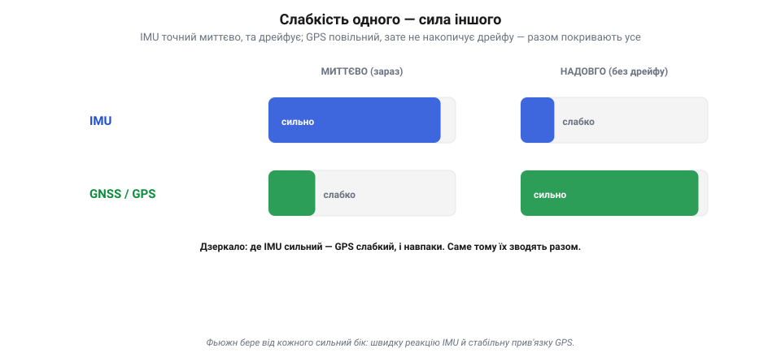
*Рис. 7.5.1.2. Чому фьюжн працює: вади доповнюються. IMU сильний «миттєво» (добре ловить кожен порух тут і зараз), але слабкий «надовго» (дрейфує). GNSS — дзеркальне відображення: шумний на коротку мить, зате стабільний надовго (не накопичує інтеграційного дрейфу). Склади їх — і кожен затуляє діру іншого: IMU дає гладку миттєву реакцію, GPS осаджує дрейф назад до істини.*

IMU **добрий миттєво**: між поштовхами він чітко ловить рух на коротку мить — але **дрейфує надовго** (заважають зсув-*bias*, температурний дрейф, вібрації, насичення). GPS — дзеркало: **неточний на коротку мить** (повільний, шумний, із власними похибками), зате **стабільний надовго** (не накопичує інтеграційного дрейфу). Склади їх — і одне затуляє слабкість іншого: IMU дає **гладку, миттєву** реакцію між рідкими відліками GPS, а GPS раз у раз **осаджує** інерціальний дрейф назад до правди. Разом вони покривають і коротку, і довгу дистанцію, чого жоден не вміє сам.

Те саме з рештою: барометр дає миттєву висоту між повільними відліками GPS-висоти; магнітометр дає абсолютний курс, який утримує гіроскоп між його замірами. Скрізь та сама логіка — **взаємодоповнення похибок**: швидке плюс стабільне, відносне плюс абсолютне, тихе плюс певне.

> 📜 Це не винахід електроніки — так навігували століттями. Моряки вели **числення шляху** (*dead reckoning*): за курсом і швидкістю рахували, де корабель, — швидко, та з похибкою, що росла з кожною годиною. І періодично «осаджували» її **астрономічним визначенням** за сонцем чи зорями — точним, але рідкісним і можливим лише в ясну погоду. Швидке-та-дрейфливе числення плюс повільний-та-абсолютний астрономічний фікс — це той самісінький фьюжн IMU+GPS, лише за двісті років до нього. Інженери не вигадали ідею, а дали їй математику.

> 🔧 **Навіщо це.** Добираючи давачі, дивись не на «найкращий», а на **взаємодоповнення**: пара «швидкий, але дрейфливий» + «повільний, зате стабільний» сильніша за два однакових. Саме тому в кожному польотному контролері навмисне стоять і IMU, і баро, і компас, і приймач GNSS — не для дублювання, а щоб затуляти діри одне одного.

### Приклад на висоті: жоден сам, разом — точно

Зведімо все на одному конкретному числі — **висоті**, бо її апарат міряє аж трьома способами, і кожен по-своєму поганий.

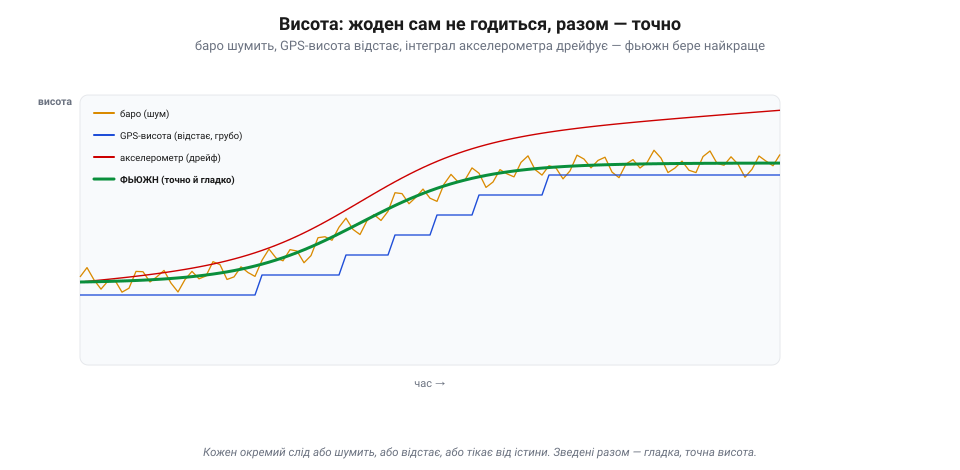
*Рис. 7.5.1.3. Висота трьома поганими способами — і одним добрим. Барометр (бурштиновий) тремтить від шуму; GPS-висота (синя) йде грубими сходинками й відстає; подвійний інтеграл акселерометра (червоний) гладкий, але дрейфує геть. Зведена оцінка (товста зелена) бере від кожного найкраще: гладкість акселерометра, прив'язку баро й GPS — і виходить точною та спокійною. Ціле краще за будь-яку частину.*

**Барометр** дає висоту щомиті, але його слід **тремтить** від шуму й поривів. **GPS-висота** не накопичує дрейфу, проте йде **грубими сходинками**, відстає, шумить і по вертикалі взагалі неточна. **Подвійний інтеграл акселерометра** ідеально гладкий на коротку мить, але **тікає** від істини — дрейфує. Кожен слід окремо — або шумить, або відстає, або пливе; жодному не можна довірити висоту самому.

А тепер поглянь на **зведену** оцінку (товста зелена): вона гладка, як інтеграл акселерометра, **не тремтить**, як баро, і **не дрейфує**, бо її прив'язують GPS і барометр. Фьюжн узяв від кожного давача його сильний бік і відкинув слабкий. Оце і є сенс усього розділу в одній картинці: **ціле виходить кращим за будь-яку зі своїх частин**.

### Від багатьох недосконалих — до одного стану

Зберімо ідею докупи. Польотний контролер не сидить і не вибирає «найкращий давач на цю мить». Він робить інше: **безперервно зливає** покази геть усіх давачів в одну-єдину, найкращу можливу оцінку — **стан апарата**.

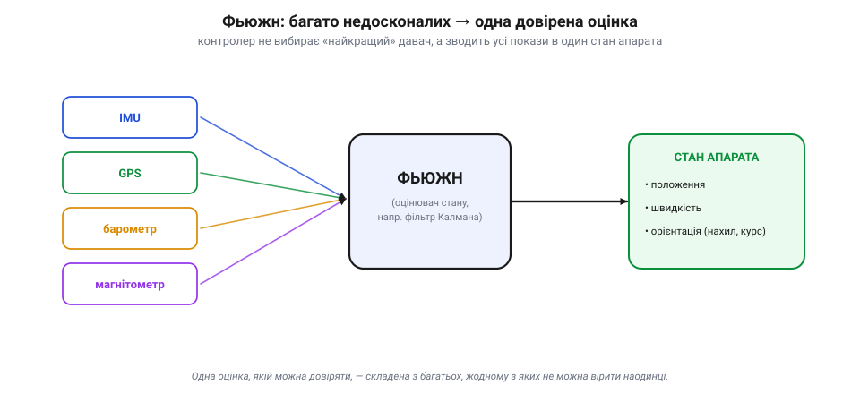
*Рис. 7.5.1.4. Суть розділу однією схемою. Контролер не вибирає «найкращий» давач, а зводить покази всіх — IMU, GPS, барометра, магнітометра — фьюжном (оцінювачем на кшталт фільтра Калмана) в одну довірену **оцінку стану**: положення, швидкість, орієнтація. Саме цим станом, а не сирими давачами, живе все керування апарата.*

«Стан» — це повний набір чисел, що описує апарат **тут і зараз**: де він (положення), куди й як швидко рухається (швидкість), як обернутий у просторі (орієнтація — нахил і курс). Саме цей стан потрібен керуванню (Розділ 7.1), щоб тримати апарат рівно, летіти в точку й вертатися додому. І дає його не якийсь один прилад, а **оцінювач** — алгоритм, що раз по раз поєднує всі давачі, зважуючи кожен за його надійністю. Найвідоміший такий оцінювач — **фільтр Калмана**, з яким ми вже стрілися в історії й до якого дійдемо в 7.5.4.

Тобто питання «який давач найкращий?» — хибне від початку. Правильне питання — «**як найкраще їх поєднати?**». І відповідь на нього розгортається в решті розділу: спершу навчимося **передбачати** рух моделлю (7.5.2), тоді — зважувати передбачення проти свіжого виміру (7.5.3), а далі складемо це у фільтр Калмана (7.5.4) і подивимось, як воно працює живцем у польоті (7.5.5).

> 🔧 **Навіщо це.** Запам'ятай головну установку розділу: апарат живе не «показами давачів», а **оцінкою стану**, складеною з них. Тому й у логах дивись не лише на сирий давач, а на оцінку (*estimate*) — і на те, як фьюжн вирішив суперечку між давачами. Коли оцінка стану хибна, апарат робить дурниці, хоч би якими справними були окремі давачі.

### Підсумок теми

Жоден давач не достатній сам, бо в кожного свій сліпий кут: IMU швидкий, та дрейфує; GPS абсолютний, та повільний і зникний; баро всюдисуще, та шумне; компас єдиний знає курс, та його кривлять. Рятує те, що їхні вади **доповнюються**: швидке стуляють зі стабільним, відносне з абсолютним — і ціле виходить кращим за будь-яку частину, як ми бачили на висоті. Тому апарат не вибирає давач, а **зводить** усі в одну довірену **оцінку стану** — положення, швидкість, орієнтацію. Як саме звести — і є наука цього розділу; перший її крок — навчитися **передбачати** рух наперед, аби було з чим порівнювати виміри. Цим і займемося в 7.5.2.

---

## 7.5.2 Модель руху: передбачення

У 7.5.1 ми домовилися: апарат живе оцінкою стану, зведеною з багатьох давачів. Та перш ніж зводити, треба зрозуміти **дві дії**, з яких складається будь-який оцінювач: **передбачення** (вгадати, де апарат буде, за моделлю руху) і **корекція** (підправити цю здогадку свіжим виміром). Ця тема — про перше. Воно здається дивним («навіщо вгадувати, коли є давачі?»), але саме воно робить оцінку гладкою, швидкою й готовою зустріти наступний вимір.

### Передбачення = продовжити рух за фізикою

Ідея проста, як штовхнути санки. Якщо я знаю, **де** апарат і **як** він рухається — його положення й швидкість, — то можу сказати, де він буде **за мить**, навіть не дивлячись: він просто проїде за час свою швидкість, помножену на цей час.

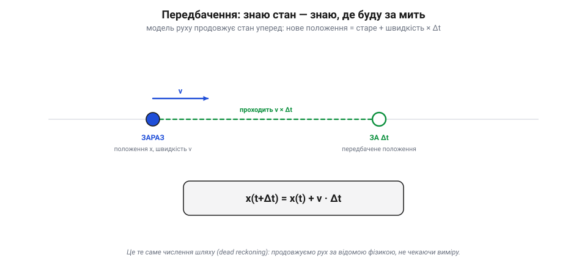
*Рис. 7.5.2.1. Передбачення — це продовження руху за фізикою. Знаючи теперішнє положення x і швидкість v, рахуємо, де апарат буде за час Δt: він проходить v×Δt, отже x(t+Δt) = x(t) + v·Δt. Жодного давача не питали — просто продовжили відомий рух. Це й є числення шляху (dead reckoning).*

Це і є **передбачення** (*prediction*), або, фізичною мовою, **числення шляху** (dead reckoning з історії): беремо теперішній стан і **продовжуємо** його вперед за відомим законом руху. Найпростіший закон — «тіло рухається з тією ж швидкістю»: нове положення = старе + швидкість × Δt. Складніший додасть прискорення (нова швидкість = стара + прискорення × Δt), а на апараті прискорення прямо дає **акселерометр** IMU. По суті, передбачення — це інтегрування руху, те саме, що робила інерціальна навігація Дрейпера: рахувати, куди занесло, із самого знання динаміки.

> 🔧 **Навіщо це.** Передбачення — це «безкоштовний» давач: воно не питає нічого ззовні, лише продовжує те, що вже відомо. Тому між рідкими, повільними вимірами апарат не сліпне — модель руху веде його оцінку далі. На дроні цю роль грає швидкий IMU: він кількасот разів на секунду «штовхає» оцінку вперед між нечастими відліками GPS.

### Навіщо передбачати, коли є давачі

Тут законне питання: якщо все одно прийде вимір, навіщо вгадувати наперед? Аж три причини.

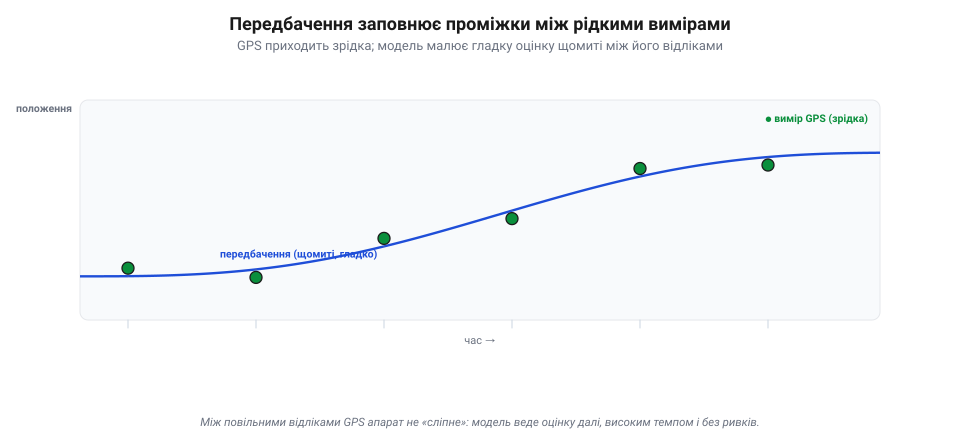
*Рис. 7.5.2.2. Передбачення тримає темп. GPS дає лише рідкі відліки (зелені точки), та ще й шумні. Між ними модель руху веде оцінку **щомиті** й гладко (синя лінія) — апарат не «сліпне» в проміжках і дає керуванню рівну, високочастотну оцінку. Кожен новий вимір трохи підправляє цю лінію (далі — 7.5.3).*

Перша — **темп і гладкість**. Давачі повільні: GPS дає кілька відліків на секунду, та й ті стрибають. А керуванню (Розділ 7.1) потрібна оцінка **щомиті** й без ривків. Передбачення малює гладку лінію між рідкими вимірами, тримаючи високий темп. Друга — **переживання провалів**: коли давач замовк (GPS зник під дахом), модель ще певний час веде апарат «наосліп», не даючи оцінці обвалитися. Третя, найглибша, — передбачення дає **очікування**, з яким можна порівняти наступний вимір. Без «де я гадав опинитися» свіжий вимір — просто число; а маючи передбачення, можна спитати: збігається вимір з очікуванням чи ні? — і саме на цій різниці тримається корекція (7.5.3).

### Модель наближена — невизначеність росте

Та є й розплата. Модель руху — лише **наближення** дійсності: вона не знає про порив вітру, про неточність акселерометра, про сотню дрібних сил. Тому щокроку передбачення **трохи помиляється**, і ці похибки накопичуються. Що довше ведеш оцінку самим передбаченням, без свіжого виміру, то далі вона **відпливає** від правди — і то менше їй можна довіряти.

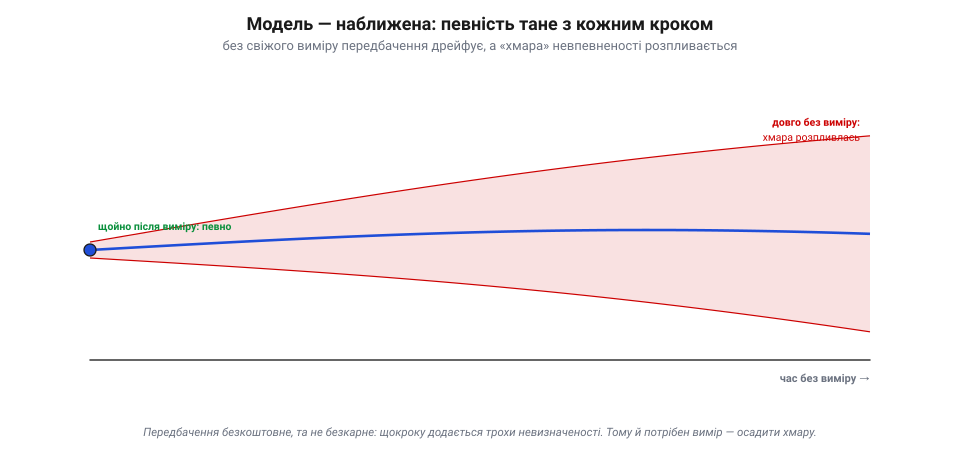
*Рис. 7.5.2.3. Розплата за передбачення — зростання невизначеності. Модель наближена (не знає вітру, шуму, дрібних сил), тож «хмара» довкола передбаченого положення (червона) розпливається ширше з кожним кроком без виміру. Щойно після виміру вона тісна (ми певні), та що довше ведемо оцінку самим передбаченням, то менше їй можна довіряти. Тому вимір конче потрібен — осадити хмару.*

Це варто уявляти не як точку, а як **хмару**: одразу після виміру вона тісна (ми певні, де апарат), а з кожним кроком чистого передбачення — розпливається ширше. Передбачення безкоштовне, але **не безкарне**: воно не додає знання, лише розтягує наявне в часі, втрачаючи певність. Ось чому одного передбачення замало й конче потрібен вимір — він **осаджує** хмару назад, повертаючи певність. Ця «хмара невизначеності» — не образ заради краси: у фільтрі Калмана вона стає конкретним числом (коваріацією), і саме нею фільтр вирішує, кому більше вірити (7.5.4).

> 📜 Сила передбачення з моделі засяяла ще 1705 року. Англієць **Едмонд Галлей** (*Edmond Halley*), застосувавши свіжі закони Ньютона до спостережень комети, зробив зухвале: **передбачив** її повернення через 76 років — на 1758-й, коли його самого вже не буде. Комета повернулась точно за розрахунком. Це був тріумф «передбачення за моделлю»: знаючи закон руху й теперішній стан, можна вирахувати майбутнє на десятиліття вперед — рівно те, що робить (на частки секунди) кожен оцінювач у польотному контролері.

> 🔧 **Навіщо це.** Не довіряй довгому передбаченню наосліп. Якщо GPS пропав надовго, оцінка позиції неминуче «попливе» — і апарат це знає (хмара росте), тому розважливо переходить в обережніший режим. У логах ця зростаюча невизначеність видна прямо; різке її падіння — це момент, коли прийшов добрий вимір і «осадив» оцінку.

### Передбачення — половина циклу

Складемо все докупи. Передбачення — це **перша з двох дій** оцінювача, які повторюються щомиті по колу.

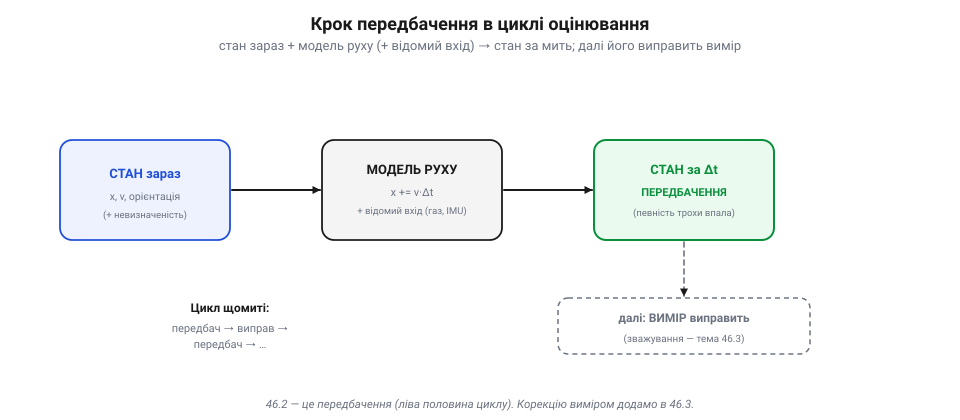
*Рис. 7.5.2.4. Передбачення — ліва половина циклу. Береш стан зараз, проганяєш крізь модель руху (плюс відомий вхід — газ, IMU) і дістаєш передбачений стан за Δt, із трохи більшою невизначеністю. Далі (пунктир, тема 7.5.3) вимір виправить це передбачення — і цикл «передбач → виправ» повторюється щомиті.*

Цикл такий: береш теперішній стан, проганяєш його крізь **модель руху** (плюс відомий вхід — газ, дані IMU) і дістаєш **передбачений** стан за мить уперед, із трохи більшою невизначеністю. Це — крок **передбачення**. Далі приходить вимір, і другий крок — **корекція** — підтягує передбачення до виміру, зважуючи обидва за довірою; певність знову зростає. Тоді все повторюється: передбач → виправ → передбач → … — сотні разів на секунду. Ця тема дала нам ліву половину циклу. Праву — як саме зважити передбачення проти виміру — розберемо в наступній.

### Підсумок теми

Передбачення — це продовження стану вперед за моделлю руху: знаючи положення й швидкість, рахуємо, де апарат буде за мить (x += v×Δt), не питаючи давачів. Воно дає гладку, високотемпову оцінку між рідкими вимірами, переживає короткі провали давачів і — найважливіше — створює очікування, з яким можна звірити наступний вимір. Платня за це — **зростаюча невизначеність**: модель наближена, тож «хмара» певності щокроку розпливається, аж доки вимір її не осадить. Передбачення — перша половина циклу оцінювання; друга, корекція, зважує передбачення проти виміру — і саме до неї, до мистецтва зважування, ми переходимо в 7.5.3.

---

## 7.5.3 Передбачення vs вимірювання (зважування)

Тема 7.5.2 дала нам **передбачення** — здогад, де апарат буде, з його «хмарою» невпевненості. Тепер приходить **вимір** від давача — і майже завжди він **не збігається** з передбаченням. Хто має рацію? Відповідь на це й є серцем усього фьюжну: не вибрати одне, а **зважено поєднати** обидва. Ця тема — про мистецтво зважування.

### Двоє свідків, кожен непевний

Уяви двох свідків події. Передбачення каже: «апарат отут» — упевнено настільки, наскільки тісна його хмара. Вимір каже: «ні, отам» — теж зі своєю похибкою. Вони розходяться.

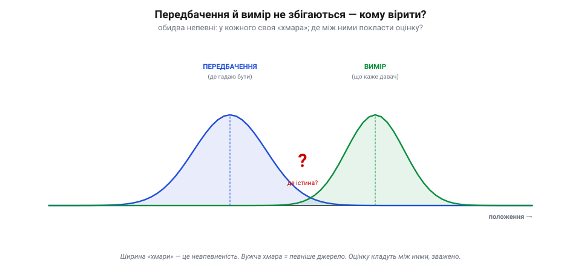
*Рис. 7.5.3.1. Передбачення й вимір розходяться. Кожне — «хмара» на осі положення: центр — найімовірніше значення, ширина — невпевненість. Передбачення (синє) каже одне, вимір давача (зелене) — інше. Вибрати лише одне погано (стрибки або дрейф), просте середнє — несправедливо (а раптом один певніший?). Оцінку кладуть між ними, зважено за шириною хмар.*

Перша спокуса — вибрати когось одного. Та обидва крайнощі погані: повірити **тільки виміру** — і оцінка стрибатиме на кожному шумі давача; повірити **тільки передбаченню** — і вона дрейфуватиме, ігноруючи реальність. Друга спокуса — взяти **просте середнє**, по півдорозі. Але й це хибно: а що, як один свідок дивився в окуляр, а другий — крізь туман? Рівно їх слухати несправедливо. Правильно — **зважити за певністю**: ближче до того, чия хмара вужча.

### Сплав, ближчий до певнішого

Отут і криється головна ідея. Зведена оцінка лягає **між** передбаченням і виміром, але **не посередині**, а **ближче до того, хто певніший** (чия хмара вужча, тобто похибка менша).

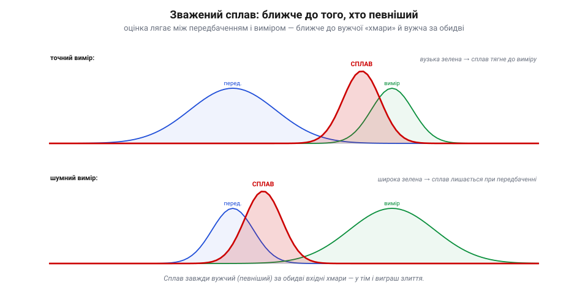
*Рис. 7.5.3.2. Сплав тягнеться до певнішого. Угорі вимір точний (вузька зелена) — сплав (червоний) лягає близько до виміру. Унизу вимір шумний (широка зелена) — сплав майже не зрушується з передбачення. У типовому випадку (незалежні, добре змодельовані виміри) зведена хмара виходить **вужчою за обидві вхідні**: поєднання двох свідчень знає більше, ніж кожне окремо.*

Поглянь на два випадки. Якщо **вимір точний** (вузька зелена хмара), а передбачення розпливлося — сплав тягнеться майже до виміру: свіжому точному відліку віримо більше. Якщо ж **вимір шумний** (широка зелена), а передбачення тісне — навпаки, сплав майже не зрушується з передбачення: навіщо псувати добру оцінку шумом? І — найважливіше — коли свідчення **незалежні й правильно змодельовані**, зведена хмара виходить **вужчою за обидві вхідні**: ми знаємо більше, ніж із кожного окремо. У тім і виграш злиття: не компроміс, а **підсилення певності**. (Якщо ж вимір зміщений, скорельований чи геть хибний — «викид», — він може й **зіпсувати** оцінку; саме тому фільтр відсіює неправдоподібні виміри «брамою» (*innovation gate*), про яку нижче.)

> 📜 Цю науку — як оптимально зважувати непевні свідчення — дав світові **Карл Фрідріх Гаусс**. 1801 року астроном Піацці відкрив карликову планету **Цереру**, простежив її лиш 40 днів — і втратив у сонячному сяйві. Здавалося, знайти знов неможливо: замало даних, ще й зашумлених. Та 24-річний Гаусс застосував свій **метод найменших квадратів** — спосіб скласти короткий ряд неточних спостережень так, щоб похибка вийшла найменшою, **зважуючи** кожне за його точністю, — і вирахував орбіту. Наприкінці того ж року Цереру знайшли **точно там, де він указав**. Метод найменших квадратів Гаусса — це й є прабатько оптимального зважування, на якому через півтора століття постане фільтр Калмана.

### Регулятор довіри: підсилення

Як апарат вирішує, **наскільки** зрушитися від передбачення до виміру? Через одне число — **підсилення** (*gain*), що грає роль регулятора довіри.

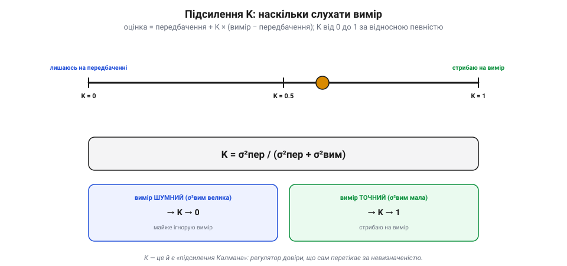
*Рис. 7.5.3.3. Підсилення K — регулятор довіри. Нова оцінка = передбачення + K × (вимір − передбачення). При K=0 вимір ігнорують (лишаються на передбаченні), при K=1 стрибають на вимір, між ними — сплав. K = σ²пер / (σ²пер + σ²вим): шумний вимір (велика σ²вим) тягне K до 0, точний — до 1. K сам перетікає за відносною певністю — це й є підсилення Калмана.*

Працює воно за простою формулою. Спершу беруть **різницю** між виміром і передбаченням — «несподіванку» (*innovation*): наскільки реальність розійшлася з очікуванням. Тоді нову оцінку дістають так:

```
нова оцінка = передбачення + K × (вимір − передбачення)
```

де **K** — підсилення від 0 до 1. При **K = 0** вимір геть ігнорують (лишаються на передбаченні); при **K = 1** стрибають прямо на вимір; між ними — зважений сплав. А визначає K **відносна певність**: грубо кажучи, K = (невпевненість передбачення) ділена на (невпевненість передбачення + невпевненість виміру). Тому шумний вимір (велика похибка) тягне K до нуля, а точний — до одиниці. Найкраще те, що K **сам перетікає** за обставинами: щойно передбачення розпливлося (давач довго мовчав) — K росте, і наступний вимір беруть охочіше; щойно вимір зашумів — K падає. Це й є знамените **підсилення Калмана**: автоматичний, самоналаштовний регулятор довіри.

> 🔧 **Навіщо це.** Звідси практичне розуміння налаштувань фьюжну в польотному контролері. Коли задаєш «шум» давача в параметрах (скажімо, наскільки довіряти GPS чи баро), ти насправді **рухаєш K** — кажеш фільтрові, вужча чи ширша хмара цього давача. Заявив давач точнішим, ніж він є, — фільтр стрибатиме на його шум; заявив надто шумним — фільтр його майже не слухатиме й дрейфуватиме. Тонке настроювання оцінювача — це, по суті, чесне зважування довіри до кожного давача.

### Певність зростає — і цикл замикається

Зведімо обидві теми докупи. Маємо повний **цикл оцінювання**: передбачення (7.5.2) штовхає оцінку вперед, розширюючи хмару; корекція (7.5.3) підтягує її до виміру, **звужуючи** хмару назад.

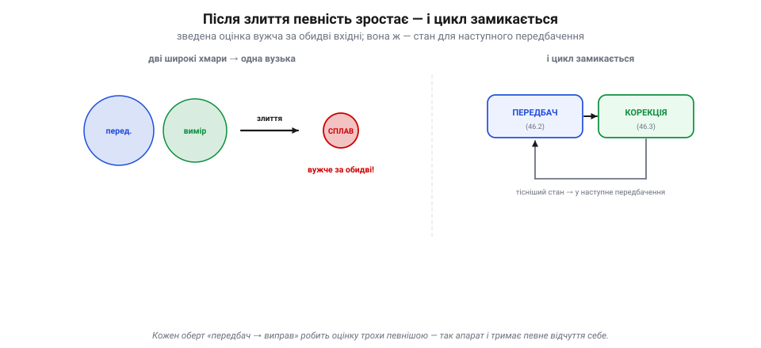
*Рис. 7.5.3.4. Цикл замикається. Дві широкі хмари — передбачення й вимір — зливаються у вужчу: після корекції певність зростає. Ця тісніша оцінка стає станом для наступного передбачення, і цикл «передбач → виправ» крутиться сотні разів на секунду, щоразу тримаючи оцінку настільки певною, наскільки дозволяють давачі.*

І ось ключове: після корекції оцінка **певніша**, ніж була, — і саме вона стає вихідним станом для **наступного** передбачення. Цикл замикається: передбач → виправ → передбач → виправ, сотні разів на секунду, і щоразу оцінка лишається настільки певною, наскільки дозволяють давачі. Саме цей невпинний оберт і дає апаратові його стабільне, довірене відчуття себе — те, на якому тримається все керування. А коли до цих двох кроків додати математику «хмар» (коваріацію) і формулу підсилення K — вийде вже не якісна картинка, а **фільтр Калмана** в усій повноті. До нього, нарешті, й переходимо.

### Підсумок теми

Передбачення й вимір майже завжди розходяться — і ні вибір одного, ні просте середнє не годяться. Правильно — **зважити за певністю**: оцінка лягає між ними, ближче до того, чия «хмара» вужча, і виходить певнішою за обидва. Скільки саме зрушитися від передбачення до виміру, вирішує **підсилення K** (нова оцінка = передбачення + K × (вимір − передбачення)): шумний вимір тягне K до 0, точний — до 1, і K сам перетікає за відносною невизначеністю. Так замикається цикл «передбач → виправ», що з кожним обертом тримає оцінку тісною. Ми зібрали всю якісну логіку фьюжну — лишилось одягти її в математику. Це й робить **фільтр Калмана**, до якого переходимо в 7.5.4.

---

## 7.5.4 Фільтр Калмана / EKF концептуально

Дві попередні теми зібрали всю логіку фьюжну: **передбачення** (7.5.2) штовхає оцінку вперед моделлю руху, **зважування** (7.5.3) підтягує її до виміру за довірою. **Фільтр Калмана** — це їхній строгий, математичний шлюб: той самий цикл «передбач → виправ», але з акуратним обліком тієї «хмари» невпевненості, яку ми досі малювали на пальцях. Саме він уже понад півстоліття є серцем майже кожного оцінювача стану — від «Аполлона» до твого дрона. Розберімо його концептуально, без важких матриць, але чесно.

### Стан і його хмара: коваріація

Перша ключова річ: фільтр веде **дві** речі воднораз. Не лише **оцінку стану** (найкращу здогадку — де апарат, як швидко, як нахилений), а й її **коваріацію** — ту саму «хмару» невпевненості, тільки записану числами.

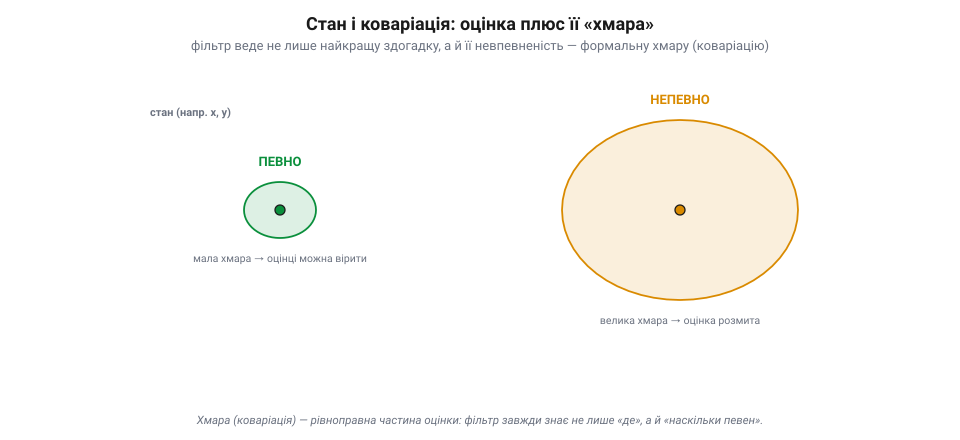
*Рис. 7.5.4.1. Оцінка — це точка плюс хмара. Поряд із найкращою здогадкою (точкою) фільтр веде **коваріацію** — формальний розмір і форму хмари невпевненості. Мала хмара (зелена) — оцінці можна вірити; велика (бурштинова) — вона розмита. Хмара не додаток, а рівноправна половина оцінки: фільтр завжди знає не лише «де я», а й «наскільки я певен».*

Коваріація — це формальний розмір і форма хмари: наскільки фільтр **певний** у кожній складовій стану. Мала хмара — оцінці можна вірити; велика — вона розмита. Це не якийсь додаток, а **рівноправна половина** оцінки: фільтр Калмана завжди знає не лише «де я», а й «наскільки я в цьому певен». І, як ми зараз побачимо, саме хмара керує всім — бо з неї рахується підсилення, і саме вона росте в передбаченні й меншає в корекції.

### Два кроки, одне коло

Тепер — увесь фільтр, як він крутиться. Це той самий двокроковий цикл із 7.5.3, але тепер ми стежимо й за хмарою.


*Рис. 7.5.4.2. Увесь фільтр одним колом. **Крок 1, передбачення**: стан іде крізь модель руху, а хмара роздувається — додаємо «шум руху» Q (модель неточна → менше певності). **Крок 2, оновлення**: приходить вимір, із співвідношення хмар рахується підсилення K, стан підтягується до виміру, а хмара стискається (певність зросла). Виправлений стан із меншою хмарою йде в наступний цикл — і так сотні разів на секунду.*

**Крок 1 — передбачення.** Беремо стан, проганяємо крізь модель руху (x += v·Δt), а хмару **роздуваємо**: модель неточна, тож додаємо до неї «шум руху» (його позначають Q) — мовляв, за цей крок ми трохи менше певні. **Крок 2 — оновлення.** Прийшов вимір; із співвідношення хмар (наскільки певні передбачення проти виміру) фільтр рахує **підсилення K**; підтягує стан до виміру на K×(вимір − передбачення); а хмару **стискає** — після злиття певності побільшало. Тоді виправлений стан із меншою хмарою йде в наступне передбачення, і все повторюється сотні разів на секунду. Передбач — хмара росте; онови — хмара меншає (коли вимір **незалежний і добре змодельований**; хибний чи скорельований краще відкинути «брамою», ніж ним «оновлюватись»). Уся премудрість.

### Чому це оптимально, а не просто розумно

Тут варто спинитися на слові, яке робить фільтр Калмана особливим: **оптимальний**. Калман довів, що **за певних умов** (рух і виміри **лінійні**, шуми — гаусові «дзвоники», а коваріації **правильно задані**) його фільтр дає **найкращу можливу** оцінку — оптимальну в строгому сенсі. Це не вдалий трюк і не одна з евристик: це **математично доведений** найкращий лінійний спосіб поєднати передбачення з вимірами. (Поза цими умовами — для нелінійних чи негаусових задач — оптимальність уже не гарантована, і в діло йдуть його нащадки: EKF, UKF, фільтри частинок, згладжувачі.) Саме тому Калманів фільтр і став основою всієї галузі.

### Магія коваріації: одне виправляє пов'язане

А тепер найкрасивіше, заради чого варто було морочитися з хмарою-матрицею, а не просто числом. Коваріація зберігає не лише **розмір** невпевненості кожної змінної, а й **зв'язки** між ними.

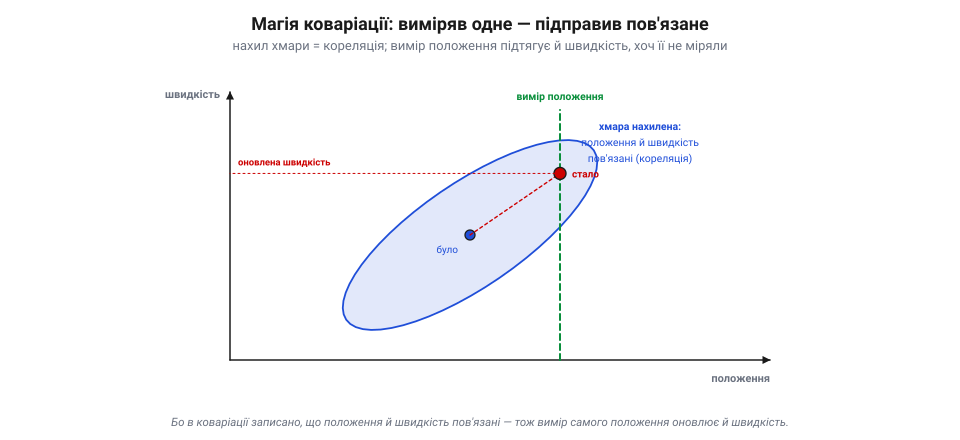
*Рис. 7.5.4.3. Чому хмара — матриця, а не число. Якщо положення й швидкість пов'язані (був далі — мабуть, і рухався швидше), цей зв'язок записаний як **нахил** хмари. І тоді вимір самого лише **положення** (зелена лінія) зсуває оцінку вздовж нахилу — підправляючи **й швидкість**, якої ніхто не міряв. Один вимір цілющий для всіх пов'язаних змінних.*

Уяви, що оцінюєш **положення** і **швидкість**. Вони пов'язані: якщо ти насправді був трохи далі, то, певно, і рухався трохи швидше. Цей зв'язок записаний у коваріації як **нахил** хмари. І ось чудо: коли приходить вимір самого лише **положення**, фільтр, користуючись цим нахилом, підправляє **й швидкість** — хоч її ніхто не міряв! Один вимір цілющий для всіх пов'язаних із ним змінних. Саме тому на дроні відлік GPS (позиція) покращує й оцінку швидкості, а часом і вирівнювання гіроскопа: коваріація розносить користь від одного виміру по всьому стану. Оце і є те, чого не дасть жоден простий усереднювач.

> 📜 Сам фільтр народився 1960 року, коли угорсько-американський інженер **Рудольф Калман** (*Rudolf Kálmán*) опублікував статтю «Новий підхід до лінійної фільтрації та передбачення». Спершу її зустріли з **недовірою**: математикам вона здавалася підозріло простою, а авторові навіть довелося проштовхувати публікацію. Та інженери побачили золото: Стенлі Шмідт із NASA, ледь розібравшись у статті, упізнав у ній відповідь для навігації «Аполлона» — і фільтр полетів до Місяця (історія розділу). Відтоді він тихо оселився чи не в кожному GPS-приймачі, телефоні, супутнику й дроні. А 2009 року президент Обама вручив Калманові Національну медаль науки — найвищу наукову відзнаку США. Невелика формула, що зважує здогад проти виміру, виявилася однією з найкорисніших в історії техніки.

### EKF: коли світ нелінійний

Лишилася одна заковика. Класичний фільтр Калмана вимагає, щоб усе було **лінійним** — прямі залежності. А реальний апарат **нелінійний**: оберти, тригонометрія курсу, перехід від кутів до координат — усе це криві, а не прямі. Як бути?

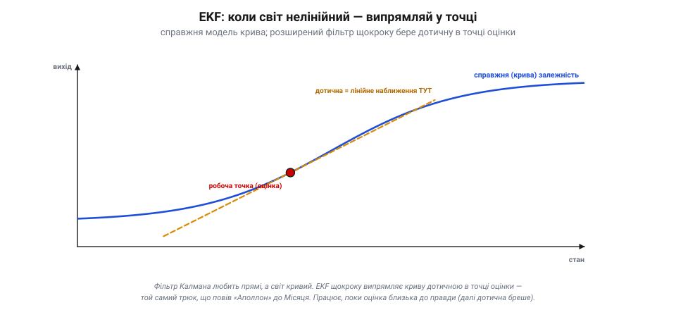
*Рис. 7.5.4.4. Розширений фільтр (EKF) і лінеаризація. Справжня залежність крива (синя), а класичний Калман любить прямі. EKF бере **дотичну** до кривої в точці теперішньої оцінки (бурштинова) й удає, що поблизу все лінійне. Працює, поки оцінка близька до правди — далеко від точки дотична вже бреше. Саме так — **розширивши** фільтр Калмана лінеаризацією (EKF) — Стенлі Шмідт пристосував його до нелінійної навігації «Аполлона»; в ArduPilot оцінювач — теж EKF.*

Відповідь — **розширений фільтр Калмана** (*Extended Kalman Filter, EKF*). Ідея проста й зухвала: якщо світ кривий, а фільтр любить прямі — то на кожному кроці **випрямляй криву** в одній точці. EKF бере **дотичну** до нелінійної моделі в точці теперішньої оцінки й удає, що поблизу все лінійне, — і застосовує звичайний Калман. Це працює, **поки оцінка близька до правди** (дотична добре наближає криву лише поряд); якщо ж оцінка сильно схибить, наближення збреше й фільтр може «розійтися». Саме так Стенлі Шмідт **розвинув розширений фільтр** (EKF; його варіант звуть ще *фільтром Шмідта–Калмана*), пристосувавши Калманову теорію до нелінійної навігації «Аполлона» та її обчислювальних обмежень. А в ArduPilot оцінювач стану — це теж EKF (відомий як EKF2/EKF3): він і зводить докупи IMU, GNSS, баро й магнітометр у єдину оцінку, що нею живе весь політ.

> 🔧 **Навіщо це.** Тепер параметри фьюжну в наземній станції читаються змістовно: «шум» кожного давача — це його хмара (скільки йому довіряти), а «шум процесу» — як швидко роздувати хмару в передбаченні. А ще: EKF може **розійтися**, якщо стартова оцінка кепська (тому апарат перед зльотом стоїть і «вирівнюється») або якщо давач раптом збрехав сильно. Здоров'я EKF видно в логах — за «несподіванками» (innovations) і розміром хмари; різкий стрибок — сигнал, що оцінка перестала довіряти собі.

### Підсумок теми

Фільтр Калмана — це строге втілення циклу «передбач → виправ», де поряд зі станом ведеться його **коваріація** — формальна «хмара» певності. У передбаченні хмара росте (додаємо шум руху Q), у корекції — меншає (вимір зважується підсиленням K, що саме рахується з хмар). Для лінійно-гаусових систем це **доведено-оптимальна** оцінка, а її коваріація ще й розносить користь одного виміру на всі пов'язані змінні (вимір положення підправляє швидкість). Реальний нелінійний апарат обслуговує **EKF**, що щокроку випрямляє криву дотичною в точці оцінки, — саме він стоїть в ArduPilot. Тепер, коли ми знаємо механізм, лишилось подивитися на нього **в роботі**: як саме на дроні зливаються IMU, баро, GNSS і магнітометр. Це — тема 7.5.5.

---

## 7.5.5 Фьюжн у польоті: IMU + баро + GNSS + магнітометр

Теми 7.5.2–7.5.4 дали механізм — фільтр Калмана з його циклом «передбач → виправ» і хмарою-коваріацією. Тепер подивімося на нього **в роботі**: як саме на дроні чотири знайомі давачі (усі з Розділу 7.3) зливаються в одну оцінку стану. Тут абстракція стає конкретикою: видно, **хто** з давачів що робить і чому всі вони потрібні.

### Розподіл праці: хто веде, хто осаджує

Перше, що треба вкласти в голову: давачі **не рівноправні** у фьюжні. Один із них — **IMU** — особливий: він веде **передбачення** (7.5.2). Гіроскоп і акселерометр швидкі (сотні разів на секунду), тож саме вони щомиті штовхають оцінку вперед — це кістяк, основа. Решта давачів — баро, GNSS, магнітометр — приходять рідше й роблять **корекцію** (7.5.3): кожен осаджує дрейф IMU у **своїй** частині стану.

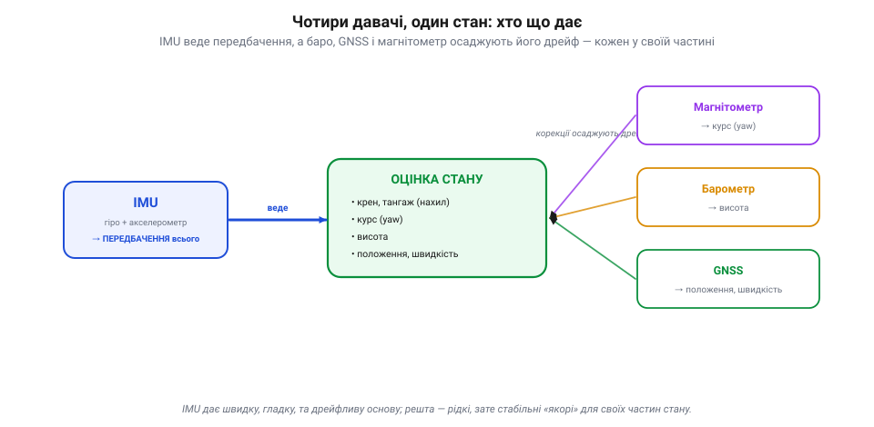
*Рис. 7.5.5.1. Поділ праці у фьюжні. IMU (гіро + акселерометр) швидкий, тож веде **передбачення** всього стану — це кістяк. Повільніші магнітометр, барометр і GNSS роблять **корекцію**, кожен осаджуючи дрейф IMU у своїй частині: компас — курс, баро — висоту, GNSS — положення і швидкість. Швидка дрейфлива основа плюс рідкі стабільні «якорі».*

Чому так? Бо IMU **самодостатній і швидкий**, але дрейфливий (історія Дрейпера); а кожен із інших **повільний, зате стабільний** у своєму. Тож природний поділ: IMU несе оцінку між корекціями, а зовнішні давачі раз у раз «прив'язують» її до правди. Це той самий фьюжн «швидке + стабільне» з 7.5.1, тільки тепер розписаний по конкретних приладах.

### Хто що утримує

Тепер найважливіше для розуміння — **яку частину стану утримує який давач**. Кожну величину хтось **передбачає** (завжди IMU) і хтось **прив'язує** (свій коректор).

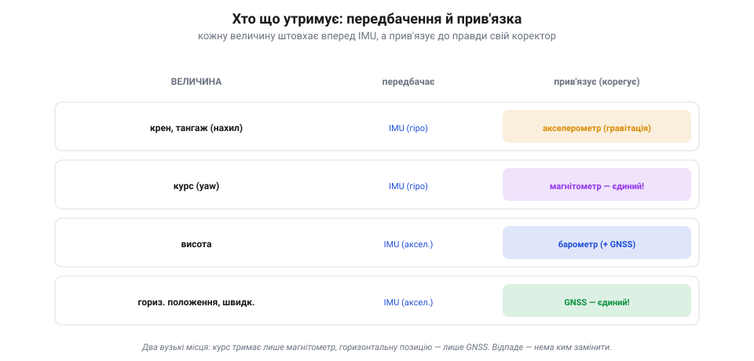
*Рис. 7.5.5.2. Хто яку величину утримує. Кожну штовхає вперед IMU (передбачення), а прив'язує до правди свій коректор: нахил — акселерометр (гравітація), курс — магнітометр, висоту — барометр (+GNSS), горизонтальне положення — GNSS. Два вузькі місця: курс тримає **лише** компас, позицію — **лише** GPS; відпаде — замінити нема ким.*

- **Крен і тангаж** (нахил): гіроскоп передбачає, **акселерометр** прив'язує — бо в спокої він «бачить» вектор гравітації, тобто де низ (7.3.2). Так оцінка нахилу не дрейфує.
- **Курс** (yaw, поворот навколо вертикалі): гіроскоп передбачає, а прив'язує найчастіше **магнітометр** (він бачить, де північ). Та він не єдиний: сучасний ArduPilot уміє брати курс і з **двоантенного GPS** (*moving baseline*), із зовнішньої навігації (*ExternalNav*), ба навіть оцінювати його з рухів за GPS (фільтр **GSF**) — тож компас тут хоч і головний, але **замінний**.
- **Висота**: акселерометр передбачає (подвійний інтеграл), **барометр** прив'язує (швидкий вертикальний орієнтир), а GNSS додає грубу абсолютну прив'язку.
- **Горизонтальне положення й швидкість**: акселерометр передбачає, а прив'язує зазвичай **GNSS** — найдоступніше джерело абсолютних координат. (Але не єдине: у приміщенні чи без супутників позицію дають **оптичний потік**, зовнішня навігація (*ExternalNav*, камери типу T265), радіомаяки чи системи на кшталт Vicon.)

Зверни увагу на два типові **вузькі місця**: у звичайному наборі (IMU + GNSS + баро + компас) курс тримає **компас**, а горизонтальну позицію — **GPS**. Інші джерела (GPS-курс, оптичний потік, зовнішня навігація, маяки) існують, та коли їх нема — саме ці дві прив'язки стають найслабшою ланкою. Запам'ятай це — воно пояснює, що буде при відмові.

> 🔧 **Навіщо це.** Звідси читаються типові негаразди. «Поплив» курс, апарат повертає кудись не туди в авто-режимах — підозрюй **магнітометр** (близько мотор, струм, залізо), бо курс більше нема кому виправити. «Попливла» позиція, дрон дрейфує в режимі утримання — це **GPS** (погане небо). А хитається нахил у спокої — дивись **акселерометр** і вібрації. Знаючи, хто що прив'язує, ти зразу знаєш, де копати.

### Різні темпи, один потік

Усі ці давачі ще й **різношвидкісні**, і фільтр спокійно це переварює.


*Рис. 7.5.5.3. Різні темпи, один потік. IMU тікає сотні разів на секунду — і на кожному тику фільтр передбачає. Барометр і магнітометр корегують десятки разів на секунду, GNSS — лише кілька (5–10 Гц). Корекцію вставляють тоді, коли прилетів відлік. Тому оцінка свіжа й гладка (темп IMU) і водночас прив'язана до правди (рідкі стабільні корекції).*

IMU тікає сотні разів на секунду — і на **кожному** його тику фільтр робить передбачення. А корекції прилітають **коли прийдуть**: барометр і магнітометр — десятки разів на секунду, GNSS — лише кілька (5–10 Гц). Щойно прилетів відлік будь-якого давача, фільтр вставляє корекцію саме за ним, для його частини стану. Тому оцінка завжди **свіжа й гладка** (у темпі IMU) і водночас **прив'язана до правди** (рідкими, зате стабільними корекціями). Жодної потреби, щоб давачі йшли в ногу: кожен зважується тоді, коли має що сказати.

### Коли давач відпав: плавна деградація

І ось де поділ праці показує всю свою красу — у відмові. Що буде, якщо один давач замовкне?

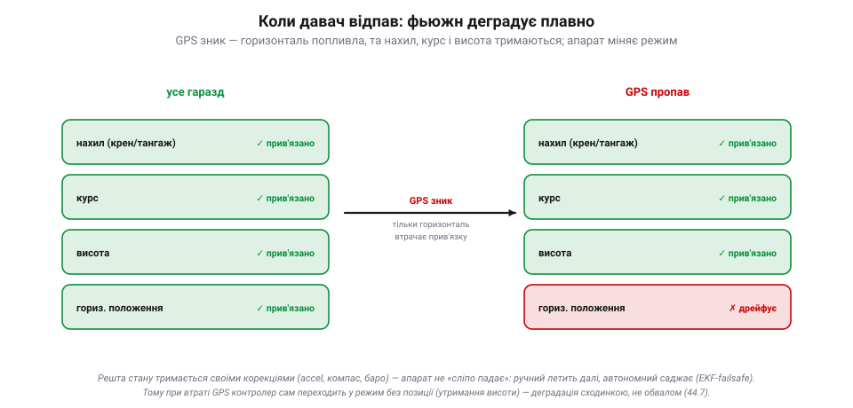
*Рис. 7.5.5.4. Плавна деградація. Поки все працює, кожна частина стану прив'язана (ліворуч, зелене). Зник GPS — і лише **горизонтальне положення** втрачає прив'язку й дрейфує на IMU (праворуч, червоне); нахил, курс і висота тримаються своїми корекціями. Апарат не «сліпо падає», а **керовано реагує** (у ручному режимі летить далі; у GPS-залежних автономних — EKF-failsafe зазвичай саджає) — деградація сходинкою, не обвалом (7.3.7).*

Уяви, що **GPS пропав** (заїхали під міст, погане небо, глушилка). Що станеться? Горизонтальне положення втратить єдину свою прив'язку й почне **дрейфувати** на самому IMU — його хмара поповзе ширшати. Але **нахил, курс і висота — цілі**: їх тримають акселерометр, компас і баро, яким до GPS байдуже. Що буде далі — залежить від режиму. У **ручному** режимі (де позиція й не потрібна) апарат летить собі далі, лише втративши утримання точки. А от у **автономних, GPS-залежних** режимах (Loiter, Auto, RTL…) контролер це помічає (хмара тієї частини стану росте) і вмикає **EKF-failsafe** — типово **переходить на посадку** (саме щоб погана оцінка не спричинила «втечу»/flyaway). Тобто апарат не «сліпо падає», а **керовано реагує**. Це й є **деградація сходинкою**, а не обвалом (7.3.7): відмова однієї прив'язки забирає одну здатність, а не весь політ.

Так само з рештою: збився компас — попливе курс, а позиція й висота тримаються; завадив баро потік від гвинтів — засмикається висота, а решта ціла. У доброму разі фільтр втрачає приблизно стільки, скільки забрав відмовлений давач, — бо кожну частину стану стереже свій коректор. Але це не гарантія: давач, що **бреше правдоподібно** (повільний відхід компаса, «глітч» GPS), може на якийсь час потягти за собою й оцінку — аж поки його не зловить «брама» чи EKF-failsafe. Тому здоров'я оцінювача моніторять окремо.

> 📜 Що апарат можна вести, **довіряючи самим приладам**, людство вперше довело 1929 року. 24 вересня лейтенант **Джиммі Дуліттл** (*Jimmy Doolittle*) піднявся в небо над аеродромом Мітчел-Філд із **накритою ковпаком** кабіною — нічого не бачачи назовні — і виконав перший в історії повністю «сліпий» зліт, політ і посадку лише за приладами. Серцем були щойно винайдені **гіроскопічний авіагоризонт** і **курсовий гіроскоп** Сперрі (плюс точний висотомір Кольсмана): авіагоризонт показував крен і тангаж, курсовий гіроскоп — напрям. Це той самий набір величин — нахил, курс, висота, — що його сьогодні зводить EKF дрона з копійчаних MEMS. Дуліттл довів принцип; фільтр Калмана через тридцять років зробив його дешевим, точним і автоматичним.

### Підсумок теми

Фьюжн у польоті — це поділ праці між давачами. **IMU** (швидкий, та дрейфливий) веде передбачення всього стану, а повільні, зате стабільні **коректори** осаджують його дрейф, кожен у своїй частині: акселерометр тримає **нахил**, магнітометр — **курс**, барометр — **висоту**, GNSS — **горизонтальне положення**. Фільтр передбачає на кожному тику IMU й вставляє корекцію щоразу, коли прилітає відлік будь-якого давача, хоч які різні їхні темпи. А коли давач відпадає, фьюжн **деградує плавно**: губиться лише та частина стану, яку він прив'язував, а решта тримається — звідси й автоматична зміна режиму при втраті GPS. Лишилося розібрати, що псує цю злагоджену роботу на практиці — затримки, неузгодженість у часі — і як читати здоров'я оцінювача по логах. Це — остання тема розділу, 46.6.

---

## 7.5.6 Затримки, синхронізація, діагностика по логах

Ми зібрали красиву картину: фільтр Калмана зливає чотири давачі в одну довірену оцінку. Та між теорією й живим польотом стоять дві прозаїчні, але злі перешкоди — **затримки** й **неузгодженість у часі**, — і одне рятівне вміння: **читати лог**, у якому оцінювач сам звітує про своє здоров'я. Цією практичною темою й завершимо розділ.

### Кожен вимір приходить застарілим

Перша незручна правда: жоден вимір не описує **«зараз»**. Поки давач поміряв, оцифрував, передав по шині, поки фільтр його дістав — минув час. Для IMU це частки мілісекунди (дрібниця), а от для **GPS** — відчутна **десята частка секунди**: фікс описує, де апарат був, поки сигнал ще оброблявся.


*Рис. 7.5.6.1. Затримка псує корекцію. Поки GPS-фікс долетів, апарат проїхав уперед (синя точка — «зараз»), а фікс описує минулу точку (зелена, Δt тому). Якщо вставити його як «тепер», корекція потягне оцінку **назад** (червона стрілка) — позиція засмикається, а в утриманні апарат може піти по колу. GPS — найзатриманіший: його фікс «старший» на десяту частку секунди.*

І ось пастка: якщо вставити цей запізнілий вимір у фільтр **як свіжий**, він почне виправляти теперішню оцінку за **минулим** положенням — і потягне її назад, туди, де апарат уже не є. Наслідок — позиція засмикається, «забовтається», а в найгіршому разі апарат у режимі утримання піде **по колу** (відоме «toilet-bowling»): фільтр женеться за власною тінню з минулого. Затримку не можна ігнорувати.

### Лік: виправити минуле й програти наперед

Як же фьюзити старий вимір **правильно**? Хитро, але елегантно: треба прикласти його не до теперішнього стану, а до того, **яким стан був у момент виміру**. Для цього фільтр тримає **буфер** недавніх станів.

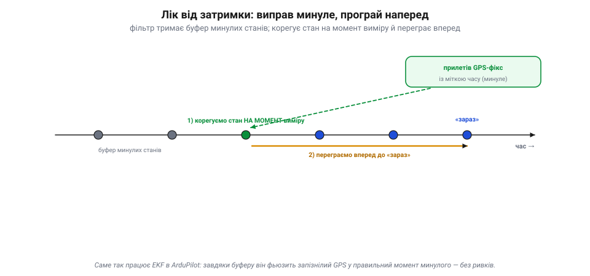
*Рис. 7.5.6.2. Як фьюзити старий вимір правильно. Фільтр тримає **буфер** недавніх станів. Коли прилітає запізнілий GPS (зі своєю міткою часу), фільтр фьюзить його на **затриманому часовому горизонті** — у тій точці минулого, якій відповідає мітка, — а свій вихід доводить уперед до «зараз». Корекція лягає в правильну точку часу — без ривків. Саме так робить EKF в ArduPilot.*

Працює так: коли прилітає запізнілий GPS-фікс (зі своєю **міткою часу**), фільтр **фьюзить** його на затриманому часовому горизонті — корегує стан у тій точці буфера, що відповідає мітці, — і доводить вихід уперед до «зараз». Так корекція лягає в правильну точку часу, без ривків. (Це зручна модель «відмотати–виправити–переграти»; на практиці NavEKF3 тримає **буфери** вимірів та IMU й зливає кожен давач на його **затриманому** горизонті, а не псує ним поточну оцінку.) Саме це й робить EKF в ArduPilot: завдяки буферу станів він фьюзить повільний, запізнілий GPS у відповідний момент **минулого**, а не псує ним теперішню оцінку. Звідси й вимога **синхронізації**: кожен вимір мусить мати чесну мітку часу на спільній шкалі, інакше фільтр приклеїть його не туди.

> 🔧 **Навіщо це.** Тому в налаштуваннях EKF є параметри **затримки** кожного давача (особливо GPS): кажеш фільтрові, на скільки запізнюється цей потік. Помилишся з затримкою — і навіть справний GPS даватиме «забовтування» позиції. А ще тому ж так важлива акуратна **проводка й шина**: давач, чию мітку часу збиває переривчастий зв'язок, отруює фьюжн дужче за трохи шумніший, зате вчасний.

### Вібрація — тихий убивця оцінки

Окремо варто назвати найпідступнішого ворога фьюжну на дроні — **вібрацію**. Гвинти й мотори трясуть раму, а та трясе IMU. Акселерометр чесно міряє ту трясанину — і вона **підмішується** в передбачення як фальшиве прискорення. Оскільки IMU — основа всього фьюжну, забруднений вібрацією акселерометр псує **всю** оцінку: висота «спливає», позиція дрейфує, а в тяжкому разі EKF **розходиться** зовсім. Тому політний контролер **м'яко підвішують** (на демпферах), а сигнал фільтрують — щоб до фьюжну доходив рух апарата, а не дрож рами.

### Лог: оцінювач сам каже, де болить

І тут — головне практичне вміння розділу. Коли політ вийшов дивним, не треба гадати «що зламалося»: фільтр **сам про себе звітує** в логах. Найцінніший його показник — **несподіванка** (*innovation*): та сама різниця «вимір − передбачення» з 7.5.3.

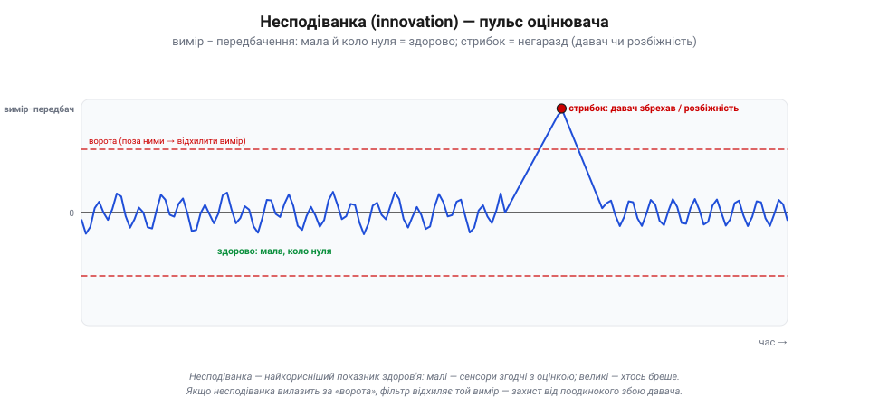
*Рис. 7.5.6.3. Несподіванка — пульс фільтра. Різниця «вимір − передбачення» в часі: поки мала й коливається коло нуля (синя) — давачі згодні з оцінкою, усе здорово. Стрибок за **«ворота»** (червоні пунктири) означає, що давач збрехав або фільтр розходиться — і такий вимір відхиляють. Це найкорисніший показник здоров'я оцінювача.*

Поки все добре, несподіванка **мала й коливається коло нуля**: давачі згодні з оцінкою, фільтр здоровий. Щойно якийсь давач збрехав чи фільтр почав розходитися — несподіванка **стрибає**. Більше того, у фільтра є **«ворота»** (поріг): якщо несподіванка вилазить за них, вимір вважають хибним і **відхиляють** — це вбудований захист від поодинокого збою давача (скажімо, разового стрибка GPS). У логах ArduPilot ці несподіванки (і «коефіцієнти тесту» за воротами) пишуться для кожного давача окремо.

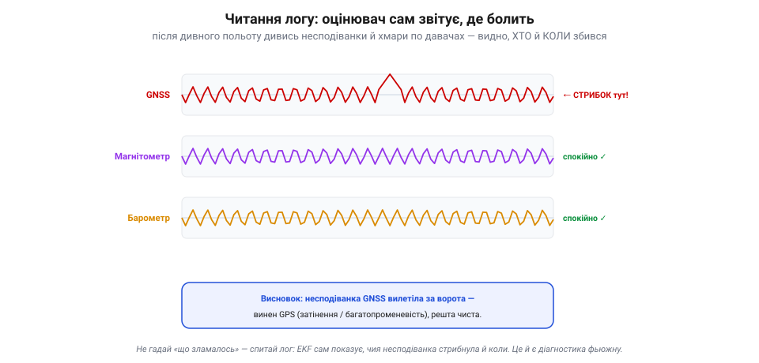
*Рис. 7.5.6.4. Лог сам викриває винного. Несподіванки по кожному давачу окремо: компас і баро спокійні (✓), а GNSS дав стрибок — отже, винен GPS (затінення чи багатопроменевість), решта чиста. Діагностика фьюжну — це не здогади, а погляд у лог: хто стрибнув і коли.*

Тому діагностика фьюжну зводиться до простого ритуалу: після підозрілого польоту витягни лог і подивись **несподіванки по кожному давачу** та **розмір хмари** (дисперсію) оцінки. Хто стрибнув — той і винен, а коли стрибнув — там і причина. Дрейфувала позиція й несподіванка GPS вилітала за ворота — винен GPS (затінення, багатопроменевість). Крутився курс, стрибала несподіванка компаса — магнітні завади. Спливала висота, шумів баро — потік від гвинтів чи вібрація. Оцінювач не мовчить про свої біди — треба лише вміти його прочитати.

> 📜 Сама ідея — **записувати все, щоб потім зрозуміти, що сталося** — теж має батька. На початку 1950-х загадково розбивалися перші реактивні лайнери «Комета», і австралійський учений **Девід Воррен** (*David Warren*) з Авіаційної дослідної лабораторії в Мельбурні запропонував зухвале: поставити в літак прилад, що безперервно пише дані польоту й голоси в кабіні, — аби після аварії «розпитати» розбитий апарат. Його **«чорну скриньку»** (задум 1954-го, прилад кінця 1950-х) спершу зустріли байдуже на батьківщині, та підхопив світ — і відтоді жоден лайнер не літає без неї. Лог твого дрона — прямий нащадок тієї ідеї: він мовчки пише все, щоб одного дня відповісти, **чому** політ пішов не так.

> 🔧 **Навіщо це.** Привчися після кожного незрозумілого польоту лізти не в здогади, а в **лог EKF**: несподіванки й дисперсії покажуть винного давача й мить збою точніше за будь-яке відчуття. Це той самий принцип «чорної скриньки», тільки в тебе вдома — дані вже записані, лишилось їх прочитати.

### Підсумок теми

Між чистою теорією фьюжну й реальним польотом стоять три практичні речі. **Затримки**: кожен вимір застарілий (надто GPS), тож фільтр тримає буфер станів і фьюзить запізнілий відлік у правильний момент минулого, а тоді переграє наперед — звідси й параметри затримки та потреба чесних міток часу. **Вібрація**: трясанина рами підмішується в акселерометр і псує всю оцінку, тому контролер м'яко підвішують і фільтрують. **Діагностика по логах**: оцінювач сам звітує про здоров'я через **несподіванки** (вимір−передбачення) і розмір хмари — малі означають злагоду, стрибок викриває винного давача й мить збою. На цьому **Розділ 7.5 завершено**: ми пройшли від «жоден давач не достатній сам» через передбачення, зважування й фільтр Калмана до живого фьюжну в польоті та його діагностики. Апарат тепер не просто має давачі — він має **довірене відчуття себе** в просторі. Далі Модуль 7 повертає від навігації до сприйняття світу: **Розділ 7.7** почне розмову про те, як апарат бачить, — від світла до кадру.
