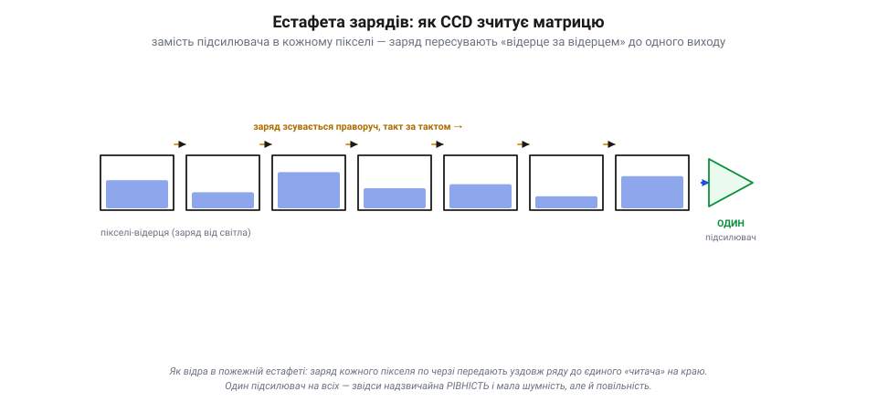
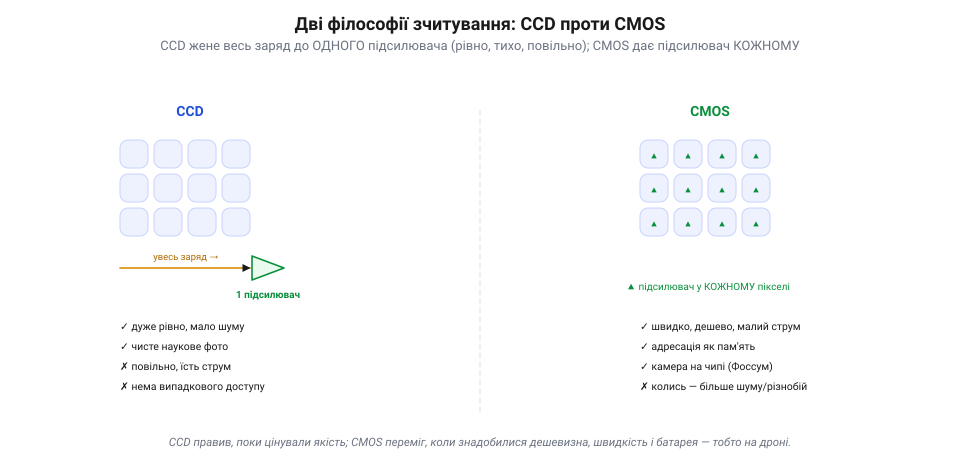
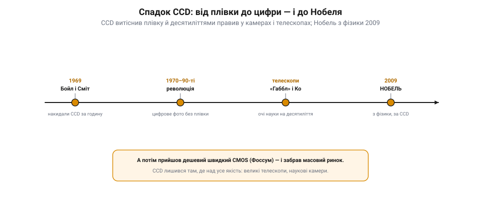

📜 *Історична вставка до теми 7.7.2 «Матриця CMOS» розділу [Відеосигнали I](ch47-video-signals-1.md).*

# Історія: CCD — як заряд навчили ходити строєм

У темі 7.7.2 ми бачили, як **CMOS** зчитує матрицю: кожен піксель має свій підсилювач і адресується, мов комірка пам'яті. Та це не єдиний спосіб — і навіть не перший. Задовго до тріумфу CMOS панував його суперник, **CCD**, що народився за одну годину біля дошки в Bell Labs, перевернув фотографію й через сорок років приніс своїм творцям Нобелівську премію. Ось його історія — і чому варто знати обидва підходи.

## Година біля дошки: народження CCD (1969)

1969 року двоє інженерів **Bell Labs** — **Віллард Бойл** (*Willard Boyle*) і **Джордж Сміт** (*George Smith*) — сиділи над зовсім іншою задачею: шукали новий вид **пам'яті** на напівпровідниках. І за якусь **годину** накидали на дошці схему пристрою, де інформацію зберігають **порціями заряду** в ланцюжку крихітних конденсаторів. Робочий зразок зібрали менш ніж за тиждень. Це й був **CCD** — *charge-coupled device*, прилад із зарядовим зв'язком.

*Рис. CCD-1. Естафета зарядів у CCD. Кожне відерце-піксель тримає заряд від світла; такт за тактом ці пакети пересувають уздовж ряду — як відра в пожежній естафеті — до **одного** підсилювача на краю, де кожен по черзі вимірюють. Заряди «зчеплено» в ланцюг (charge-coupled) і виливають послідовно, а не читають паралельно.*

Та невдовзі стало ясно, що ця «пам'ять» уміє куди цікавіше: якщо дати світлу падати на ці конденсатори, **фотоефект** (7.7.1) наповнить кожен зарядом, пропорційним яскравості, — і вийде не пам'ять, а **сенсор зображення**. Так задум для зберігання даних обернувся на пристрій, що **зловив світло електронно**, без плівки. Це й перевернуло фотографію.

## Естафета зарядів: як CCD зчитує

Уся хитрість CCD — у тому, **як** він віддає накопичене. У CMOS кожне відерце має власного «читача» (підсилювач). А CCD класично має **один** читач на краю (буває й кілька — у швидких сенсорах) і доправляє до нього заряд кожного пікселя **естафетою**.

Працює це, як відра в пожежній естафеті: заряд із крайнього відерця передають у сусіднє, з того — в наступне, і так уздовж усього ряду, такт за тактом, аж поки кожна порція по черзі дійде до єдиного підсилювача на краю, де її й вимірюють. Звідси й назва — **зарядовий зв'язок** (charge-coupled): заряди «зчеплено» в ланцюг і пересувають разом. Картину зчитують не паралельно, а **послідовно**, виливаючи відерця одне за одним у спільний «злив».

> 🔧 **Навіщо це.** Один підсилювач на всіх — це і сила, і слабкість CCD. Сила: всі пікселі проходять крізь **той самий** тракт, тож виходять надзвичайно **рівними** й малошумними — звідси чисте, однорідне зображення. Слабкість: естафета **повільна** і їсть струм, а зчитати один піксель «навмання» не можна — лише виливши всі по черзі.

## CCD проти CMOS: дві філософії

Тепер видно, що CCD і CMOS — це **дві відповіді** на те саме питання «як прочитати матрицю відерець».

*Рис. CCD-2. Дві філософії зчитування. **CCD** (ліворуч) жене весь заряд до одного підсилювача: рівно й тихо, та повільно й ненажерливо до струму. **CMOS** (праворуч) дає підсилювач кожному пікселю: швидко, дешево, ощадно — ціною того, що колись пікселі виходили різнобійними. CCD царював, поки цінували якість; CMOS переміг там, де треба дешевизна, швидкість і батарея — тобто на дроні.*

**CCD** жене весь заряд до **одного** підсилювача: рівно, тихо, якісно — але повільно, ненажерливо до струму й без випадкового доступу. **CMOS** дає підсилювач **кожному** пікселю: швидко, дешево, ощадно до батареї, з адресацією як у пам'яті — ціною того, що колись пікселі виходили різнобійними й шумнішими. Через цю різницю CCD **царював перший**: десятиліттями саме він стояв у цифрових камерах, сканерах і наукових приладах, де над усе цінують якість. А коли потрібні стали **дешевизна, швидкість і живлення від батарейки** — переміг CMOS (7.7.2). На дроні, де кожен грам, ват і долар на лік, стоїть, звісно, **CMOS**.

## Що з цього лишилося

*Рис. CCD-3. Шлях CCD. 1969 — Бойл і Сміт накидали його за годину; 1970–90-ті — революція цифрового фото без плівки; десятиліттями — очі телескопів, зокрема «Габбла»; 2009 — Нобелівська премія з фізики. А далі дешевий швидкий CMOS забрав масовий ринок, лишивши CCD частину наукових і космічних задач (та й там його тіснить sCMOS).*

CCD зробив головне: довів, що світло можна ловити **електронно**, а не на плівку, — і відкрив епоху цифрового зображення. Сорок років він був очима науки: саме CCD дивився в космос із телескопа **«Габбл»** і з безлічі обсерваторій. А 2009 року Бойл і Сміт дістали за нього **Нобелівську премію з фізики** — рідкісний випадок, коли нагороджують не відкриття законів природи, а **інженерний прилад**, що змінив світ. Сьогодні масовий ринок (і твій дрон) належить дешевшому й швидшому CMOS; CCD ще тримається в частині наукових та космічних камер, хоча й там його дедалі тіснить науковий **sCMOS**. Дві філософії зчитування живуть поряд — і добре знати обидві, бо вони пояснюють, **чому** камера така, яка вона є.
