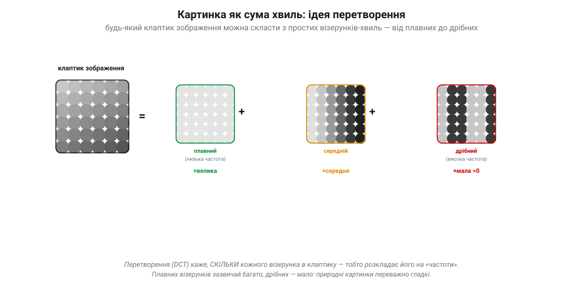
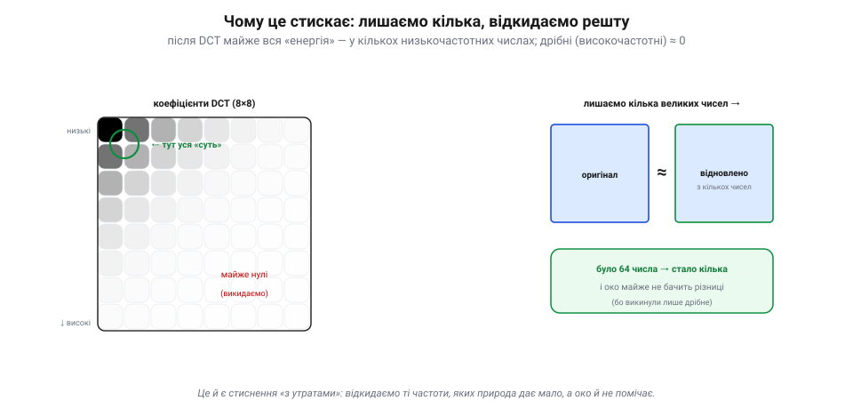
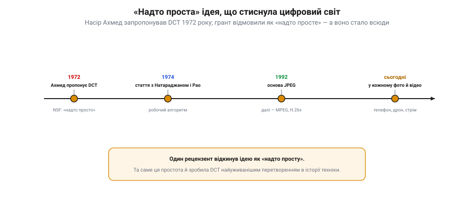
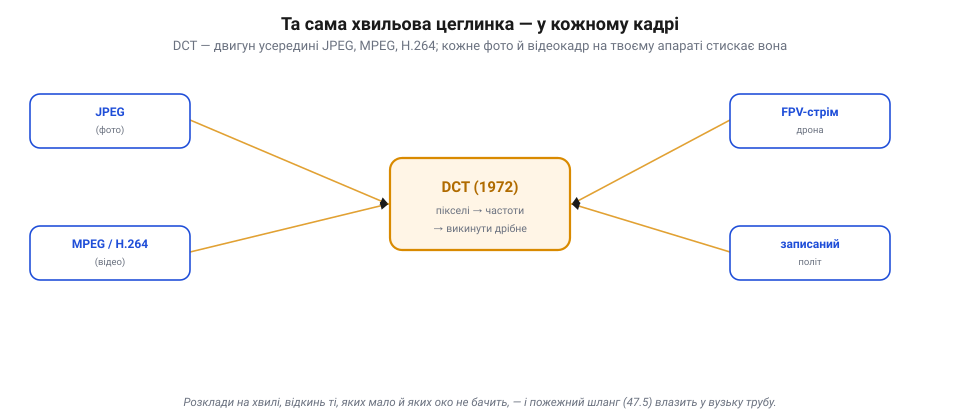

📜 *Історична вставка до [Розділу 7.8 — Відеосигнали II: стиснення й передача](ch48-video-signals-2.md).*

# Історія: дискретне косинусне перетворення — «надто проста» ідея, що стиснула світ

Розділ 7.7 лишив нас перед прірвою: сире відео — це **пожежний шланг** даних (1080p30 ≈ 1.5 Гбіт/с), якого не проковтне ні радіоканал, ні картка. Щоб відео взагалі можна було передати чи зберегти, його треба **стиснути** в рази — і не зіпсувавши на вигляд. Як? Майже вся цифрова відео- й фотокартина світу стискається одним математичним прийомом — **дискретним косинусним перетворенням** (DCT). Його запропонував 1972 року інженер **Насір Ахмед**, а наукова рада відмовила йому в гранті, бо ідея здалася… **надто простою**. Ось як ця «надто проста» думка стала однією з найважливіших в історії техніки — і чому без неї не було б ні JPEG, ні відео з твого дрона.

## Картинка як сума хвиль

Почнімо з ідеї, бо вона напрочуд гарна. Візьми маленький **клаптик** зображення — скажімо, квадратик 8×8 пікселів. Здавалося б, це просто 64 числа-яскравості. Але їх можна записати **інакше**: як **суму простих візерунків-хвиль**.

*Рис. 7.8.0.1. Картинку розкладають на хвилі. Клаптик зображення (ліворуч) можна точно скласти із суми стандартних візерунків-хвиль: зовсім плавного (з великою вагою), трохи хвилястого, аж до дуже дрібного (з вагою, близькою до нуля). DCT каже, **скільки** кожного візерунка в клаптику — тобто розкладає його на «частоти». Плавних зазвичай багато, дрібних — мало.*

Уяви набір **стандартних** візерунків: зовсім **плавний** (рівна заливка), трохи хвилястий, ще дрібніший, аж до дуже частої «ряботіні». Виявляється, **будь-який** клаптик можна точно скласти, взявши кожен візерунок із певною **вагою** й додавши їх. DCT — це і є рецепт, що каже, **скільки** кожного візерунка в клаптику: він **розкладає** картинку на «частоти», від плавних (низькі) до дрібних (високі). Замість 64 яскравостей маємо 64 **ваги** — поки що нічого не виграли. Виграш — далі.

## Чому це стискає: природа любить плавне

Уся магія в одному спостереженні про **природні** картинки: вони переважно **плавні**. Небо, обличчя, стіна, поле — це великі гладкі ділянки, де яскравість міняється повільно; різких дрібних змін мало. А це означає, що в розкладі такого клаптика **низькочастотні** (плавні) візерунки мають **великі** ваги, а **високочастотні** (дрібні) — крихітні, майже **нулі**.

*Рис. 7.8.0.2. Чому це стискає. Після DCT майже вся «енергія» клаптика збирається в кількох **низькочастотних** числах (ліворуч-угорі, темні), а високочастотні (дрібні) виходять майже нульовими. Їх можна викинути чи грубо округлити — і картинка майже не зміниться: було 64 числа, лишилось кілька. А око й не помічає, бо викинули лише дрібне. Це і є стиснення «з утратами».*

А раз дрібні ваги майже нульові — їх можна просто **викинути** (чи грубо округлити), і картинка майже не зміниться! Замість 64 чисел лишається **кілька** великих — ось і стиснення. Та ще й **око** до дрібних деталей менш чутливе (згадай зелений у 7.7.3), тож відкинуте воно й не помічає. Це і є стиснення **«з утратами»** (*lossy*): ми свідомо губимо те, чого мало й чого не видно, заради того, щоб картинка важила в рази менше. DCT не стискає сам — він лише **перекладає** картинку в таку форму, де видно, що можна викинути.

## Надто проста ідея: Насір Ахмед, 1972

А тепер — про людину. **Насір Ахмед** (*Nasir Ahmed*), інженер родом з Індії, працював у Канзаському університеті, коли 1972 року надумав застосувати косинуси для стиснення зображень. Він подав заявку на грант до Національного наукового фонду США — і дістав **відмову**: рецензент відписав, що ідея здається «**надто простою**».

*Рис. 7.8.0.3. Шлях «надто простої» ідеї. 1972 — Ахмед пропонує DCT, та грант відмовляють як «надто просте». 1973–74 — він зі студентами доводить ідею до алгоритму й публікує статтю. 1992 — DCT лягає в основу JPEG, далі — MPEG, H.264 і всіх відеостандартів. Сьогодні вона в кожному стисненому фото й відео — від телефона до дрона.*

Ахмед не здався. Уже без гранту, разом зі студентами Т. Натараджаном і К. Р. Рао, він довів ідею до робочого алгоритму й 1974 року опублікував статтю «Discrete Cosine Transform». Минули роки — і та «надто проста» ідея виявилася **золотом**: DCT давала чудове стиснення за малих обчислень, і коли в 1992-му творили стандарт **JPEG**, її поклали в саму його основу. За JPEG прийшли відео-стандарти — MPEG, потім H.261, H.263, **H.264** і далі, — і всі вони теж стоять на DCT. Сьогодні майже кожне стиснене фото й відеокадр на планеті проходить крізь перетворення, яке колись відхилили як надто очевидне.

## Що з цього в нашому апараті

Щоразу, коли дрон передає тобі картинку по цифровому FPV чи записує політ у файл, він робить рівно те, що винайшов Ахмед: ріже кадр на клаптики, **розкладає** кожен на частоти косинусним перетворенням, **викидає** дрібні (високочастотні) ваги, яких мало й яких ти не побачиш, — і так упихає пожежний шланг відео (7.7.5) у вузьку трубу радіоканалу чи картки.

*Рис. 7.8.0.4. Одна цеглинка — всюди. DCT — двигун усередині JPEG (фото), MPEG/H.264 (відео), а отже й цифрового FPV-стріму та записаного польоту твого апарата. Розклади кадр на хвилі, відкинь ті, яких мало й яких око не бачить, — і пожежний шланг даних (7.7.5) влазить у вузьку трубу каналу.*

Уся решта стиснення — то надбудови над цією серцевиною: як саме округлювати ваги, як використати ще й **схожість сусідніх кадрів** (7.8.3), як спакувати результат. Але двигун — той самий: розклади на хвилі, відкинь зайве. Цей розділ — про те, як із цієї простої ідеї виростає вся машинерія, що дає змогу взагалі **передати** відео з апарата. Історія дала нам двигун; далі — конструкція.
