# Розділ 48 — Відеосигнали II: стиснення й передача

Розділ 47 закінчився парадоксом: ми вміємо зробити прекрасний відеокадр — але передати його не можемо, бо сирий потік завеликий у сотні разів. Цей розділ — про те, як цю прірву **перестрибнути**: як **стиснути** відео в рази, не вбивши картинки, і як потім **доправити** його з апарата на землю. Тут абстрактна історія про косинуси (DCT) обертається на робочу машинерію, без якої не було б ні FPV, ні запису польоту, ні зору, що передають на землю.

Почнімо з найпершого: **навіщо** взагалі стискати — і чому це взагалі **можливо**.

> 📜 Історія теми: [дискретне косинусне перетворення (Ахмед, 1972)](ch48-history-dct.md). Вона пояснює **двигун** усього стиснення — як розкласти картинку на хвилі й викинути зайве.

---

## 48.1 Чому відео треба стискати (сирий потік величезний)

### Прірва між «знято» і «передано»

Згадаймо число з 47.5: сире 1080p на 30 кадрах — це близько **1.5 гігабіта за секунду** (187 мегабайт!). А тепер поглянь, у що це треба влити. Радіоканал FPV тягне **десятки мегабіт** за секунду. Мережа Wi-Fi — десятки-сотні. Навіть SD-картка, дарма що швидка, має скінченний обсяг: хвилина сирого 1080p — це понад **10 гігабайтів**, і картка заповниться за лічені хвилини.

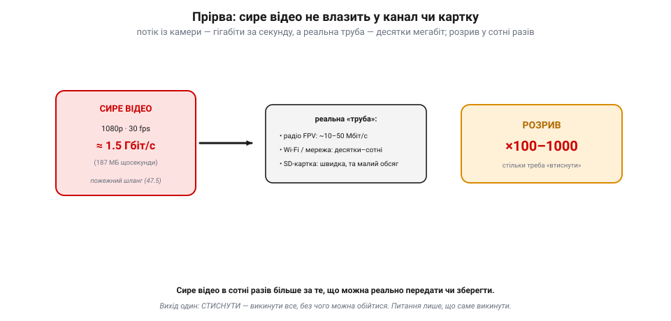
*Рис. 48.1.1. Прірва між «знято» й «передано». Сире 1080p30 — це ≈1.5 Гбіт/с (187 МБ щосекунди). А реальна «труба» куди вужча: радіо FPV тягне ~10–50 Мбіт/с, мережа — десятки-сотні, SD-картка швидка, та малого обсягу. Розрив у **сотні-тисячі разів**: сире відео просто не влазить. Вихід один — стиснути, викинувши все, без чого можна обійтися.*

Розрив — **у сотні, а то й тисячі разів**. Сирий потік просто **не влазить** ні в радіоканал, ні розумно — на картку. Тому вибору нема: відео **мусить** бути стиснене, ще на борту, перш ніж його кудись послати чи покласти. Уся подальша машинерія цього розділу — відповідь на одне питання: **як викинути в сотні разів даних, не зіпсувавши картинки?**

### Чому стиснення взагалі можливе: надлишок

Може здатися, що викинути 99% даних і зберегти картинку — це фокус на межі чуда. Та насправді сире відео **страшенно марнотратне**: воно зберігає тонни **повторюваного** й **непомітного**. А повтор не треба писати двічі. Цей запас зайвини зветься **надлишком** (*redundancy*), і саме його полює стиснення. Надлишку — три роди.

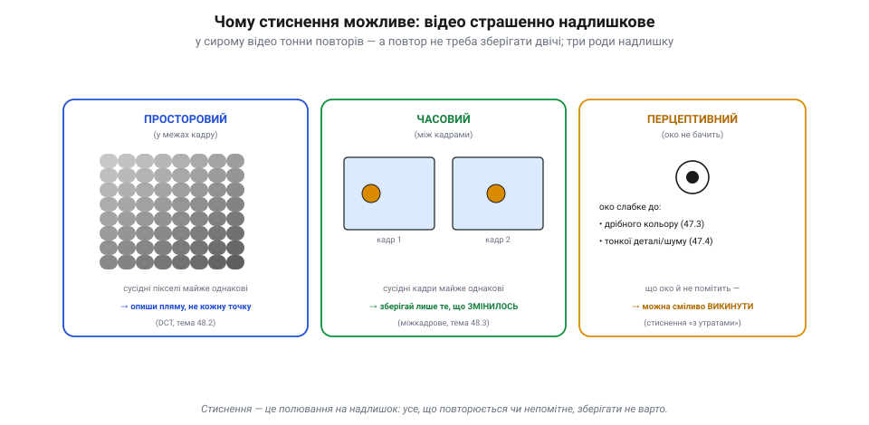
*Рис. 48.1.2. Три роди надлишку, що його полює стиснення. **Просторовий**: сусідні пікселі в кадрі майже однакові (гладкі плями) — опиши пляму, не кожну точку (DCT, 48.2). **Часовий**: сусідні кадри майже однакові — зберігай лише те, що змінилося (міжкадрове, 48.3). **Перцептивний**: око слабке до дрібного кольору й тонкої деталі — що воно й не помітить, можна викинути (з утратами).*

**Просторовий** надлишок — у межах одного кадру: сусідні пікселі майже завжди **схожі** (небо, стіна, обличчя — великі гладкі плями). Навіщо писати яскравість кожної точки, коли можна описати **пляму** загалом? Це й робить DCT (тема 48.2). **Часовий** надлишок — між кадрами: сусідні кадри відео майже **однакові**, бо за 1/30 секунди світ майже не змінюється — рухається лише дрібка. Навіщо слати весь кадр щоразу, коли можна слати лише те, що **змінилося**? Це міжкадрове стиснення (48.3). І третій — **перцептивний**: око людини **не бачить** багато чого (дрібний колір — 47.3, тонку деталь і шум — 47.4). Що око й не помітить, можна сміливо **викинути**. Уся троїстість і дає той стократний виграш.

> 📜 Що інформацію взагалі можна **виміряти** числом, а надлишок — **вирізати** до межі, довів 1948 року **Клод Шеннон** (*Claude Shannon*) у Bell Labs. Його стаття «Математична теорія зв'язку» заснувала цілу науку — **теорію інформації**. Шеннон показав: у будь-якому повідомленні є справжня «несподіванка» (він назвав її **ентропією**), а все понад неї — **надлишок**, який можна стиснути без втрати змісту. Він-таки впровадив у науку й слово «**біт**» — одиницю інформації (а сам термін, скорочення від *binary digit*, 1947 року підказав його колега **Джон Тюкі**). Уся техніка стиснення, від zip до H.264, лише **наближається** до межі, яку накреслив Шеннон: не можна стиснути менше, ніж є справжньої інформації, але все зайве над нею — чесна здобич. Дрон, що ужимає відео в сто разів, грає за правилами, написаними ще 1948-го.

### Без утрат і з утратами

Полювати на надлишок можна двома способами. **Без утрат** (*lossless*) — стиснути так, щоб відновити оригінал **точно, до біта**: просто записати повтори розумніше (як архіватор zip). Це чесно, та скромно — зображення так ужимається разів у два, не більше. **З утратами** (*lossy*) — свідомо **викинути** те, чого мало й чого око не бачить (як DCT відкидає дрібні частоти). Відновлене вже **не точна** копія оригіналу, зате стиск — **у десятки й сотні разів**.

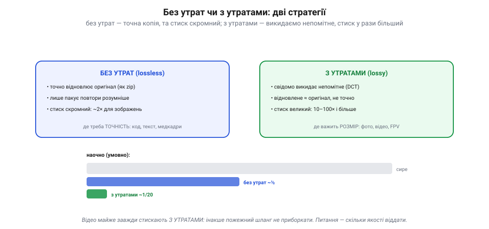
*Рис. 48.1.3. Дві стратегії. **Без утрат** (lossless): точно відновлює оригінал (як zip), лише пакуючи повтори розумніше — стиск скромний (~2× для зображень), там, де треба точність. **З утратами** (lossy): свідомо викидає непомітне (DCT) — відновлене ≈ оригінал, та стиск у 10–100 разів, там, де важить розмір. Відео майже завжди стискають з утратами.*

Для відео вибір очевидний: самим лише **без утрат** прірву не перестрибнути — двократного стиску не досить. Тому відео майже завжди стискають **з утратами**, миряючись із крихітною, непомітною втратою якості заради того, щоб воно взагалі влізло в канал. Уся майстерність — у тому, щоб викинути рівно те, чого не шкода, і не торкнутися важливого.

### Душа стиснення: пиши лише несподіване

Зведімо все в один принцип, що пронизує **геть усе** стиснення. Не зберігай те, що можна **передбачити** з уже відомого; зберігай лише **різницю** — несподіванку.

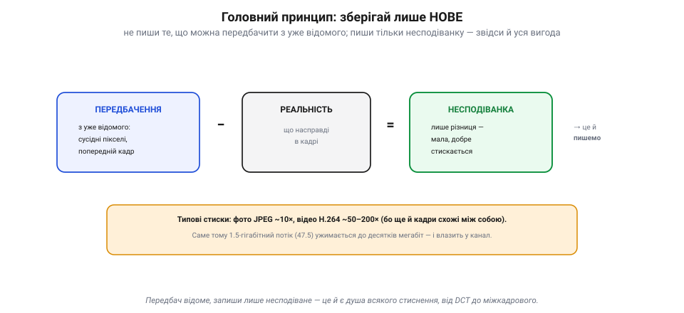
*Рис. 48.1.4. Душа стиснення: пиши лише нове. Передбач значення з уже відомого (сусідні пікселі, попередній кадр); відніми від реальності — лишиться сама **несподіванка** (різниця), мала й добре стискана. Її й записують. Чим краще передбачення, тим менша несподіванка й сильніше стиснення: фото JPEG ~10×, відео H.264 ~50–200× (бо ще й кадри схожі).*

Передбачив піксель із сусідів — записуй лише похибку передбачення (вона мала). Передбачив кадр із попереднього — записуй лише те, що зрушилося. Що краще передбачення, то менша несподіванка, то сильніше стиснення. Саме тому фото JPEG ужимається разів у десять, а відео H.264 — у **п'ятдесят-двісті**: воно експлуатує не лише схожість пікселів у кадрі, а ще й схожість кадрів між собою. Так півтора-гігабітний потік (47.5) і стає десятками мегабіт, що вже влазять у радіоканал чи картку.

### Підсумок теми

Сире відео завелике в **сотні разів** за будь-який реальний канал чи картку — тож стискати його не забаганка, а необхідність. Можливе ж стиснення тому, що відео **страшенно надлишкове**: у ньому повно **просторових** повторів (сусідні пікселі схожі), **часових** (сусідні кадри схожі) і **перцептивних** (око не бачить дрібниць). Прибравши цей надлишок — переважно **з утратами**, викидаючи непомітне, — відео ужимають у десятки-сотні разів. А душа всього — один принцип: **передбач відоме, запиши лише несподіване**. Тепер, коли ясно, **навіщо** й **чому можна**, розберімо **як** — і почнемо з надлишку всередині одного кадру, з ідеї JPEG (48.2).

---

## 48.2 Просторова надмірність: ідея JPEG (intra-frame)

Перший рід надлишку — **просторовий**: сусідні пікселі в кадрі схожі. Як його прибрати, найкраще показує **JPEG** — спосіб стиснути **одне** зображення, не озираючись на інші кадри (тому й кажуть **intra-frame**, «у межах кадру»). Той самий прийом потім стане основою для відео (I-кадри, 48.3). Розберімо конвеєр JPEG по кроках — він напрочуд логічний.

### Конвеєр у чотири кроки

JPEG не стискає весь кадр заразом — він ріже його на **квадратики 8×8 пікселів** і обробляє кожен **окремо**, одним і тим самим конвеєром.

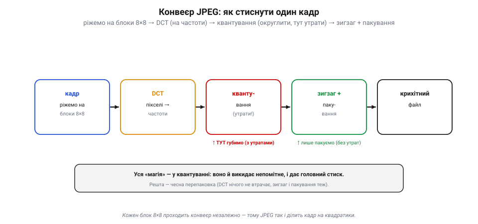
*Рис. 48.2.1. Конвеєр JPEG. Кадр ріжуть на блоки 8×8, і кожен незалежно проходить: **DCT** (пікселі → частоти, без утрат) → **квантування** (грубо округлити — тут єдина втрата й головний стиск) → **зигзаг** (нулі в хвіст) → **пакування** (RLE + Гаффман, без утрат) → крихітний файл. Уся «магія» — у квантуванні; решта — чесна перепаковка.*

Кроки такі. **Перший** — DCT (історія розділу): 64 пікселі блока перетворюють на 64 **коефіцієнти частот**, де майже вся «суть» збирається в кількох низькочастотних числах, а високочастотні крихітні. Це **без утрат** — лише інша форма запису. **Другий, головний** — **квантування**: коефіцієнти грубо **округлюють**, і дрібні (високочастотні) стають **нулями**. Ось тут — і єдина **втрата**, і головний стиск. **Третій** — **зигзаг**: коефіцієнти зчитують особливим порядком, щоб усі нулі зібралися в хвіст. **Четвертий** — **пакування** (RLE + Гаффман): довгий хвіст нулів і решту чисел упаковують у кілька байтів, знов **без утрат**. На виході — крихітний файл.

### Квантування: де ховаються стиск і втрати

Спинімося на серці JPEG — **квантуванні**, бо саме воно робить усю роботу.

*Рис. 48.2.2. Квантування — серце JPEG. Кожен коефіцієнт DCT ділять на число з таблиці й округлюють. Високі частоти ділять на великі числа — і вони стають нулями (а нулі майже нічого не коштують). Із 64 чисел лишається кілька. Грубість ділення — це і є «якість»: грубіше → більше нулів, менший файл, та блочніше. Це єдиний крок «з утратами».*

Ідея проста: кожен коефіцієнт **ділять** на число з **таблиці квантування** й **округлюють** до цілого. Таблицю підбирають так, щоб **високі** частоти ділити на **великі** числа — і вони після округлення обертаються на **нулі**. А нулів зберігати майже нічого не коштує! Так із 64 чисел лишається **кілька** ненульових. І тут-таки сидить **ручка якості**: ділиш **грубо** (великі числа в таблиці) — більше нулів, менший файл, але грубіша картинка; ділиш **дрібно** — навпаки. Те, що ти крутиш повзунком «якість 90 / 50 / 10» у редакторі, — це і є **грубість квантування**. І саме тут — єдина точка, де JPEG **губить** інформацію: усі інші кроки оборотні.

> 📜 А пакують ту жменю чисел рекордно щільно завдяки коду, що його придумав **студент**, аби не складати іспит. 1951 року в MIT професор **Роберт Фано** (колега Шеннона) дав своєму класу вибір: іспит або реферат — знайти **найкоротший** можливий двійковий код. **Девід Гаффман** бився над задачею, уже мало не здався й сів готуватися до іспиту — аж тут його осяяло: будувати дерево коду **знизу вгору**, від найрідших символів. Так він знайшов **оптимальний** код — кращий за той, що мали сам Фано із Шенноном! Опублікований 1952-го, **код Гаффмана** дає **найкоротший можливий запис серед посимвольних (префіксних) кодів** із цілими довжинами — і досі пакує фінальний крок JPEG, ZIP, MP3 і безлічі іншого. (Ще щільніше вміє **арифметичне кодування**, не прив'язане до цілого числа бітів на символ, — його беруть новіші кодеки.) Студент, що не хотів складати іспит, винайшов одну з найуживаніших цеглинок цифрового світу.

### Зигзаг: чому саме він

Лишилося пояснити дивний крок — **зигзаг**. Навіщо читати коефіцієнти якимось хитрим порядком?

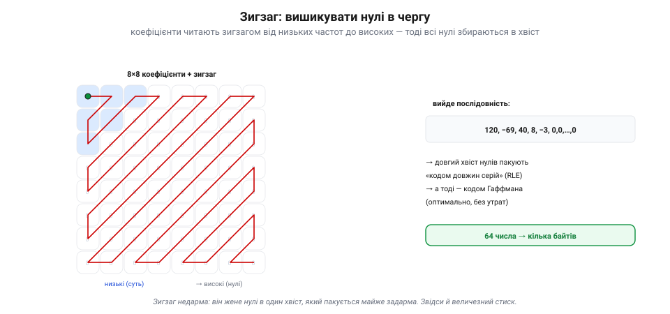
*Рис. 48.2.3. Навіщо зигзаг. Після квантування ненульові числа купчаться в кутку низьких частот (синє), решта — нулі. Зигзаг-обхід по діагоналях, від низьких частот до високих, вишиковує всі нулі в один довгий хвіст. Такий хвіст пакують майже задарма (кодом довжин серій), а решту — кодом Гаффмана: 64 числа → кілька байтів.*

Бо після квантування ненульові числа купчаться **в одному кутку** (низькі частоти, ліворуч-угорі), а решта блока — суцільні нулі. Якби їх читати рядками, нулі чергувалися б із числами. А **зигзаг** іде по діагоналях — від низьких частот до високих, — і всі нулі вишиковуються в **один довгий хвіст**. А довгу низку однакових нулів пакують майже **задарма** (кодом довжин серій: «далі 47 нулів» — це кілька байтів). Тоді решту чисел дотискають кодом Гаффмана. Так блок із 64 чисел стає **кількома байтами**. Просто, послідовно, ефективно.

### Ручка якості й артефакти

За все, звісно, платиться. Що грубіше квантування (менший файл) — то помітніші **артефакти**.

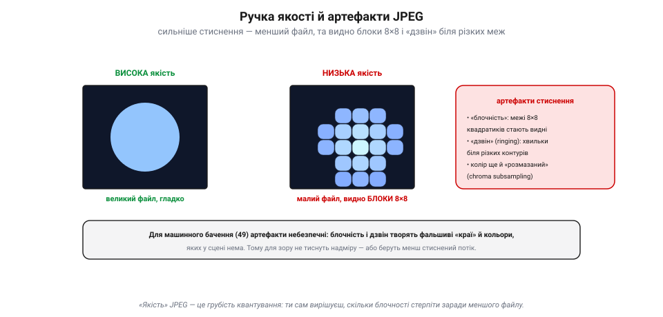
*Рис. 48.2.4. Ручка якості й артефакти. Висока якість — великий файл, гладко; низька — малий файл, та видно **блоки 8×8** (бо кожен стискали окремо) і **«дзвін»** біля різких меж (погрубили високі частоти). Для машинного бачення (49) це халепа: блочність і дзвін творять фальшиві краї й кольори, яких у сцені нема.*

Найхарактерніший — **блочність**: оскільки кожен квадратик 8×8 стискали окремо, при сильному стисненні їхні **межі** стають видні, і картинка розпадається на квадратики. Другий — **«дзвін»** (*ringing*): біля різких контурів з'являються хвильки-відлуння (бо різкий перепад — це високі частоти, які квантування погрубило). Плюс колір буває «розмазаний» (бо його ще й проріджують, як у 47.3). Для **машинного бачення** (Розділ 49) це справжня халепа: блочність і дзвін творять фальшиві «краї» й кольори, яких у сцені нема, — і алгоритм бачить те, чого немає. Тому для зору відео намагаються **не перетискати**, або беруть менш стиснений потік.

> 🔧 **Навіщо це.** «Якість» у налаштуваннях камери чи кодувальника — це прямо **грубість квантування**: тиснеш сильніше — менший файл і менша затримка, але блочніша картинка. Для запису красивого відео став якість вище; для FPV у вузькому каналі — нижче (аби влізло й не лагало); а для машинного бачення стережися перетиску, бо артефакти збивають детектори. І пам'ятай: JPEG ділить кадр на блоки 8×8 — якщо бачиш на сильно стисненому відео квадратну «решітку», це вони.

### Підсумок теми

JPEG прибирає **просторовий** надлишок одного кадру конвеєром: ріже кадр на **блоки 8×8**, кожен переводить **DCT** на частоти, **квантує** (грубо округлює — і дрібні частоти стають нулями: тут і втрата, і головний стиск), читає **зигзагом** (нулі — в хвіст) і **пакує** (RLE + Гаффман — без утрат). Єдина точка втрати — квантування, а його грубість і є **ручкою якості**. Платня — артефакти при сильному стисненні: **блочність** 8×8 і **дзвін** біля контурів, небезпечні для машинного бачення. Це — стиснення **одного** кадру. Та відео має ще багатший надлишок — **схожість сусідніх кадрів**; як її використати, щоб ужати ще в рази, — наступна тема (48.3).

---

## 48.3 Часова надмірність: міжкадрове стиснення (I/P-кадри)

JPEG (48.2) вичавив надлишок із **одного** кадру. Та відео ховає ще багатший запас зайвини — **часовий**: сусідні кадри майже **однакові**. За 1/30 секунди світ майже не міняється — рухається лише дрібка. Гріх слати весь кадр щоразу; розумніше слати **різницю**. Саме це й піднімає стиск відео з десятків (як у JPEG) у **сотні** разів.

### Сусідні кадри — близнюки

Уяви два сусідні кадри польоту: тло (земля, небо, обрій) однаковісіньке, зрушився хіба об'єкт у кадрі та трохи поповзла картина від руху камери. Якщо **відняти** один кадр від іншого, майже все стане **нулем** — лишиться сама дрібна зміна.

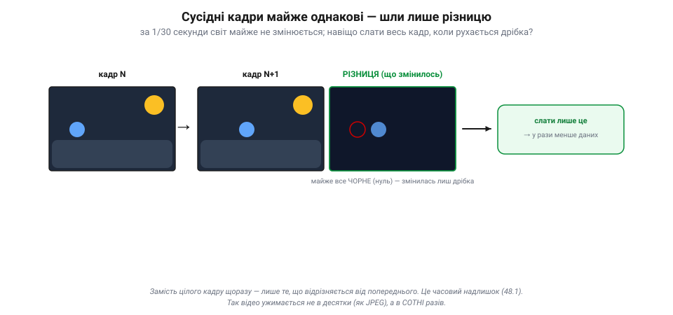
*Рис. 48.3.1. Сусідні кадри — близнюки. Тло (земля, обрій, сонце) у кадрах N і N+1 однакове; зрушився лише об'єкт. Їхня різниця майже суцільно чорна (нуль) — лишається сама дрібна зміна. Її й передають замість цілого кадру: у рази менше даних. Це часовий надлишок, що піднімає стиск відео в сотні разів.*

А раз різниця майже порожня, **передати** її — копійки проти цілого кадру. Це і є **міжкадрове** (inter-frame) стиснення: замість «ось новий кадр» — «ось що змінилося від попереднього». Сама ж різниця ще й стискається тим самим JPEG-конвеєром (48.2). Так часовий надлишок додає до просторового ще множник стиску — і відео важить у рази менше за низку окремих фото.

### I-кадри й P-кадри

Але різницю треба від **чогось** відняти. Тому кадри відео бувають двох головних родів. **I-кадр** (*Intra*, опорний) — це **повний**, самодостатній кадр, стиснений сам по собі, як JPEG. Він великий, зате ні від кого не залежить. **P-кадр** (*Predicted*, передбачений) зберігає лише **зміну** від попереднього кадру — і тому крихітний.

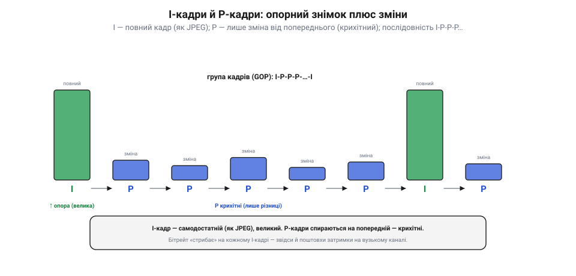
*Рис. 48.3.2. Група кадрів: I-P-P-P-…-I. **I-кадр** — повний, самодостатній (стиснений як JPEG), великий. **P-кадри** — лише зміна від попереднього, тому крихітні. Опорний I дає картину, P нарощують на неї рух. Бітрейт «стрибає» на кожному I-кадрі (раптова велика порція) — звідси й поштовхи затримки на вузькому каналі.*

Відео йде **групами кадрів** (GOP): один **I**-кадр, а за ним низка **P**-кадрів, що нарощують на нього зміни: I-P-P-P-…-P-I-P-P-… Опорний I важить багато (повна картина), а кожен P — дрібку (сама різниця). Звідси й характерна риса відеопотоку: **бітрейт стрибає** щоразу на I-кадрі (раптом велика порція даних), а між ними тече тоненько. На вузькому каналі ці стрибки даються взнаки поштовхами затримки. (Є ще й **B-кадри**, що дивляться і назад, і вперед, — стискають ще краще, але додають затримки, тож для живого FPV їх часто уникають.)

### Компенсація руху: найрозумніший трюк

А тепер найкрасивіше. Просто «відняти попередній кадр» — грубувато: якщо камера ведеться вбік, **усе** зрушилося, і різниця вийде немала. Тому кодувальник робить хитріше — **компенсацію руху** (*motion compensation*).

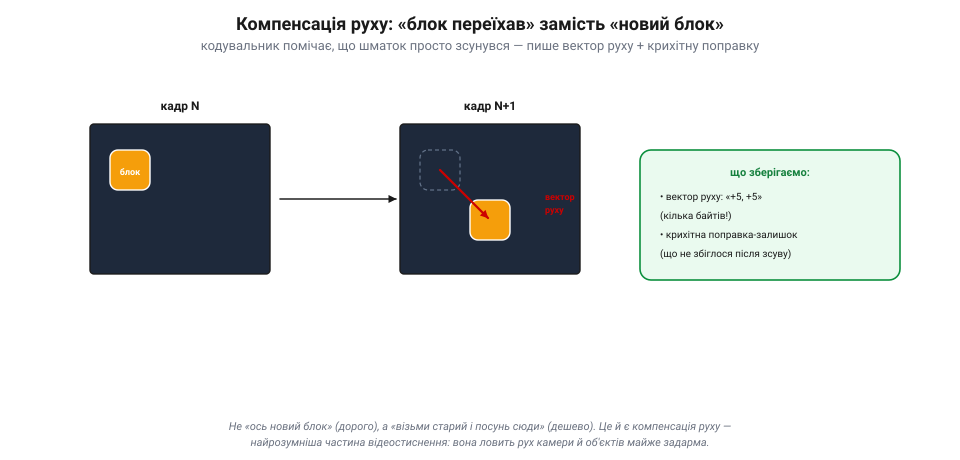
*Рис. 48.3.3. Компенсація руху. Кодувальник помічає, що блок із кадру N просто **переїхав** у кадрі N+1, і замість «ось новий блок» пише коротке «візьми старий і посунь на +5,+5» — **вектор руху** (кілька байтів) плюс крихітну поправку-залишок. Так рух камери й об'єктів ловиться майже задарма — це найрозумніша частина відеостиснення.*

Він ріже кадр на шматки й для кожного **шукає** в попередньому кадрі, **звідки** той шматок міг приїхати. Знайшов — і замість «ось новий шматок» пише коротке «**візьми отой шматок і посунь на +5, +5**» (це **вектор руху**, кілька байтів) плюс крихітну **поправку-залишок** (що не збіглося після зсуву). Так рух камери й об'єктів ловиться майже **задарма**: панораму на пів-екрана опише жменя однакових векторів. Саме компенсація руху й робить відео таким стисливим — вона розуміє, що світ не з'являється наново щокадру, а **рухається**.

> 📜 Зібрати всі ці прийоми — DCT, квантування, I/P-кадри, компенсацію руху — в єдині світові стандарти випало **MPEG** (*Moving Picture Experts Group*), яку 1988 року заснував італійський інженер **Леонардо Кьярільйоне** (*Leonardo Chiariglione*) разом із Хіросі Ясудою. За якихось чотири роки MPEG змінила світ: стандарт **MPEG-1** дав Video CD й аудіо MP3, **MPEG-2** — DVD та цифрове телебачення (кабель, супутник, ефір), а пізніший **MPEG-4** із кодеком **H.264** — інтернет-відео, Blu-ray і потокові сервіси. Кьярільйоне головував у MPEG понад тридцять років. Уся відеоіндустрія, від DVD до YouTube і цифрового FPV твого дрона, говорить мовою, що її уклала ця група, — і в основі тієї мови ті самі I- та P-кадри.

### Чому потрібні періодичні I-кадри

Лишилось одне «але», важливе для апарата. Якщо P-кадри спираються один на одного ланцюжком, то **втратиш один** (радіозбій, завада) — і всі **наступні** P, що на нього спираються, теж зіпсуються: помилка **розмазується** далі й далі.

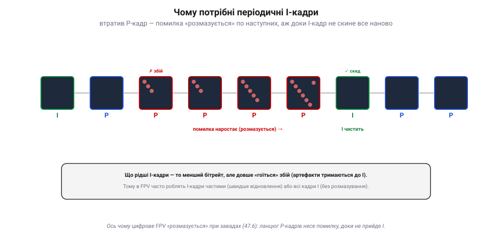
*Рис. 48.3.4. Навіщо періодичні I-кадри. Якщо P-кадр зіпсувався (завада), помилка **розмазується** по наступних P, що на нього спираються, — артефакти ростуть. Повний **I-кадр** ні від кого не залежить, тож, прийшовши, скидає помилку чисто. Рідші I — менший бітрейт, та довше «гоїться»; частіші — швидке відновлення, та товстіший потік. Це й є «розмазування» цифрового FPV (47.6).*

Рятунок — **періодичні I-кадри**: повний кадр ні від кого не залежить, тож, прийшовши, він **скидає** накопичену помилку начисто. Що частіші I-кадри, то швидше «гоїться» збій — але тим більший бітрейт (бо I важкі). Тут і компроміс: рідкі I — компактно, та збій тримається довго; часті I — швидке відновлення, та товстіший потік. **Ось чому цифрове FPV «розмазується» при завадах** (згадай 47.6): загубився кадр — і артефакти повзуть, доки не прийде наступний I. Тому для FPV часто роблять I-кадри **частими**, а то й узагалі всі кадри **I** (intra-only): більший потік, зате жодного розмазування — кожен кадр самостійний, як в аналозі.

> 🔧 **Навіщо це.** Якщо твоє цифрове FPV «зависає квадратами» й повільно відходить — це ланцюг P-кадрів несе збій до наступного I. Лік — **частіші I-кадри** (параметр кодувальника) чи intra-only режим: відновлення вмить, ціною бітрейту. А ще: великі I-кадри дають **стрибки** бітрейту й затримки — на ледь живому каналі це помітно. Загалом: P-кадри дають стиск, але крихкість; I-кадри — стійкість, але вагу. Балансуй під свій канал.

### Підсумок теми

Часовий надлишок — це **схожість сусідніх кадрів**: за мить світ майже не міняється, тож слати варто лише **різницю**. Звідси два роди кадрів: **I** — повний, самодостатній (як JPEG, великий), і **P** — лише зміна від попереднього (крихітний); відео йде групами I-P-P-…-I. А **компенсація руху** робить різницю ще меншою: замість «новий блок» — «старий блок, посунутий на вектор», тож рух ловиться майже задарма. Цей часовий трюк і піднімає стиск із десятків (JPEG) у **сотні** разів. Платня — **крихкість ланцюга**: втрата P-кадру розмазується, доки I-кадр не скине помилку, тож I роблять періодичними (а для FPV — частими чи всуціль). Ми побачили обидва двигуни стиснення — просторовий і часовий; далі порівняймо, як їх поєднують реальні кодеки — MJPEG проти H.264 (48.4).

## 48.4 MJPEG проти H.264: компроміси

Ми розібрали обидва двигуни стиснення — **просторовий** (JPEG, 48.2) і **часовий** (I/P-кадри, 48.3). Реальні **кодеки** (від *coder-decoder* — «кодувальник-декодувальник») поєднують їх по-різному, і вибір сильно впливає на те, як відео поводиться на апараті. Порівняймо два крайні підходи: гранично простий **MJPEG** і всемогутній **H.264**.

### Дві філософії

**MJPEG** (*Motion JPEG*) — це найпростіше, що можна уявити: кожен кадр стискають **окремо**, як звичайний JPEG, і ніяк не використовують схожість кадрів. По суті, це **всі кадри — I-кадри** (48.3), без жодного P чи B.

*Рис. 48.4.1. Дві філософії кодека. **MJPEG**: кожен кадр — окремий повний JPEG (усі I), усі однаково великі, та незалежні — звідси стійкість і малий лаг, але слабкий стиск (~як JPEG). **H.264**: I + P + B з компенсацією руху; P/B крихітні (лише зміни) — звідси дуже компактно, та складно, з лагом і крихкістю (залежність кадрів). Двигун-перетворення (DCT, а в H.264 — його цілочислове наближення) споріднений — різниця в тому, чи використати ще й схожість кадрів.*

**H.264** (*AVC*, *Advanced Video Coding*) — навпаки, видавлює максимум: повний набір **I-, P- і B-кадрів**, компенсація руху, розумне внутрішньокадрове передбачення. «Двигун»-перетворення всередині **споріднене** з JPEG-овим, хоч і не буквально те саме (H.264 бере не 8×8 DCT, а **цілочислове** 4×4/8×8 наближення); але H.264 використовує **ще й** схожість кадрів між собою — тож стискає в рази дужче. Головна різниця між ними не в «двигуні», а в тому, **чи експлуатувати часовий надлишок** (48.1): MJPEG свідомо його ігнорує, H.264 — вичавлює до краплі.

### За все платиться

Здавалося б, H.264 кращий «у всьому» — навіщо тоді MJPEG? Бо за могутній стиск платять, і MJPEG виграє там, де ця плата завелика.

*Рис. 48.4.2. Компроміси MJPEG ↔ H.264. За **стиском** H.264 перемагає вдесятеро-двадцятеро. Та MJPEG виграє за **затримкою** (простіше кодувати), **стійкістю** (кожен кадр окремий, збій не розмазується), **обчисленнями** (легкий, як JPEG) і **простотою** (кожен кадр — ключовий, легко гортати й різати). Нема «кращого» — є придатний під задачу.*

Підсумуймо плату. За **стиском** H.264 розгромлює MJPEG: 50–200 разів проти жалюгідних ~10. Та за все інше платить. **Затримка**: MJPEG простий, тож кодує-декодує майже миттєво; H.264 з його пошуком руху й B-кадрами думає довше — десятки мілісекунд лагу (47.7). **Стійкість**: у MJPEG кожен кадр **окремий**, тож завада псує лише його; у H.264 збій **розмазується** по ланцюгу P/B-кадрів (48.3). **Обчислення й енергія**: MJPEG легкий, як JPEG; H.264 ненажерливий (пошук руху — важка робота). **Простота**: у MJPEG кожен кадр — ключовий, тож відео легко **різати й гортати**; у H.264 треба декодувати цілий ланцюг, щоб дістатися потрібного кадру. Тобто «кращого» нема — є **придатний під задачу**.

### Де що ставлять

Звідси й розподіл ролей на апараті.

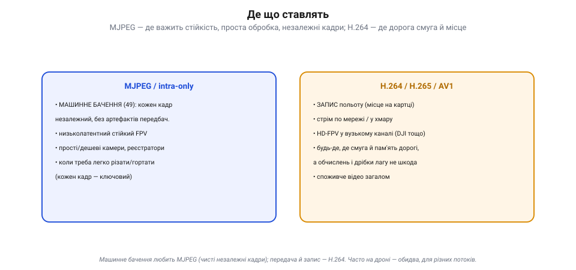
*Рис. 48.4.3. Де що ставлять. **MJPEG / intra-only** — де важать стійкість і незалежність кадрів: машинне бачення (чисті кадри без артефактів передбачення), прості камери, низьколатентний FPV, монтаж. **H.264 / H.265 / AV1** — де дорога смуга й місце: запис, стрім, HD-FPV у вузькому каналі, споживче відео. Часто на дроні — обидва, для різних потоків.*

**MJPEG** (чи будь-який *intra-only* режим) люблять там, де важить **стійкість і незалежність кадрів**. Найперше — **машинне бачення** (Розділ 49): алгоритмові потрібен **чистий, повний** кадр без артефактів передбачення й без «розмазування»; кожен кадр самодостатній — ідеально. Також — прості дешеві камери, реєстратори, низьколатентний стійкий FPV, монтаж (де треба легко гортати по кадрах). **H.264** (і молодші H.265/AV1) ставлять там, де **дорога смуга й місце**: запис польоту на картку, стрім у мережу чи хмару, HD-цифрове FPV у вузькому радіоканалі (DJI тощо), споживче відео взагалі. Часто на одному апараті живуть **обидва**: H.264 — для запису й передачі, а сирий чи MJPEG-потік — для бортового зору.

### Драбина кодеків

H.264 — не кінець історії. Кодеки йдуть драбиною, і кожне покоління тисне ще краще, ціною ще більших обчислень.

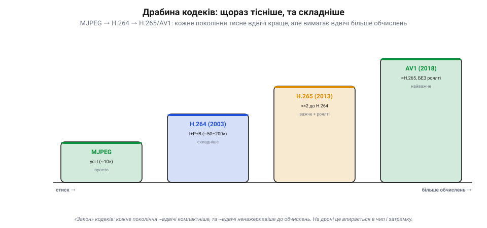
*Рис. 48.4.4. Драбина кодеків. MJPEG (~10×, просто) → H.264/AVC (2003, ~50–200×) → H.265/HEVC (2013, ≈×2 до H.264, + роялті) → AV1 (2018, ≈H.265, але без роялті). Майже «закон»: кожне покоління ~вдвічі компактніше, та ~вдвічі ненажерливіше до обчислень. На дроні це впирається в бортовий чип і затримку.*

Після H.264 (2003) прийшов **H.265** (*HEVC*, 2013) — приблизно **вдвічі** компактніший за ту саму якість, але й помітно важчий для кодування. Це майже «закон» кодеків: кожне покоління дає ще вдвічі менший файл, та вимагає ще вдвічі більше обчислень. На дроні це впирається прямо в **бортовий чип** і **затримку**: новіший кодек заощадить смугу, але з'їсть процесор і додасть лагу.

> 📜 **Кодек без роялті — як суперечка про патенти накреслила, чим ти дивишся відео.** Новіші кодеки рухає не лише техніка, а й **гроші**. H.264 і H.265 — **запатентовані**: за їх використання треба платити роялті власникам патентів. Коли 2015-го власники HEVC заломили за ліцензію ще більше, ніж колись за H.264, велетні інтернету збунтувалися: **Amazon, Google, Netflix, Mozilla, Intel, Microsoft, Cisco** за лічені тижні скупчилися в **Alliance for Open Media** (вересень 2015) — і спільно зробили **AV1**, кодек **без жодних роялті** (готовий березень 2018). За якістю AV1 не гірший за H.265, зате вільний — тому його й узяли YouTube, Netflix та інші, щоб не платити данину за кожне відео. Так суперечка про патенти, а не лише про біти, визначила, яким кодеком ти дивишся відео сьогодні.

> 🔧 **Навіщо це.** Вибираючи кодек для апарата, питай не «який стискає найкраще», а «що мені дорожче». Дорога **смуга/пам'ять** — бери H.264/H.265. Дорогі **затримка чи стійкість** (FPV, керування) — ближче до MJPEG/intra. Працює **машинне бачення** — дай йому MJPEG чи сирий кадр, бо артефакти H.264 (блочність, розмазування) збивають детектори. І зваж бортовий **чип**: новіший кодек заощадить ефір, але якщо процесор не тягне — додасть саме ту затримку, якої ти уникав.

### Підсумок теми

Кодеки поєднують просторовий і часовий стиск по-різному, і вибір — це **компроміс**. **MJPEG** (усі кадри — окремі JPEG) простий, низьколатентний і стійкий (кожен кадр самостійний), та слабко стискає (~10×) — тож його місце там, де важать стійкість, темп і незалежність кадрів: машинне бачення, прості камери, монтаж. **H.264** (I+P+B, компенсація руху) стискає в рази дужче (50–200×), та платить складністю, затримкою, ненажерливістю й крихкістю ланцюга — його місце там, де дорога смуга й пам'ять: запис, стрім, HD-FPV. А над ними — драбина дедалі кращих, та важчих (і часом платних) кодеків: H.265, AV1. «Найкращого» кодека нема — є придатний під задачу й бортовий чип. Ми навчилися тиснути; далі поглянемо, як крутити три ручки разом — **якість ↔ бітрейт ↔ затримка** (48.5).

## 48.5 Компроміс: якість ↔ бітрейт ↔ затримка

Ми навчилися стискати відео й вибирати кодек. Та коли доходить до реальної передачі з апарата, стискання впирається в **залізний компроміс**, якого не обійти жодним кодеком. Є три речі, яких усі хочуть водночас: **якість** (щоб гарно було видно), малий **бітрейт** (щоб улізти у вузький канал і пам'ять) і мала **затримка** (щоб бачити **зараз**, а не пів секунди тому). Біда в тім, що всі три найкращими не бувають — вони тягнуть одна одну.

### Три ручки, що тягнуть одна одну

Уяви три ручки на пульті кодувальника. **Якість** — наскільки чітка й чиста картинка (роздільність, деталі, мало артефактів). **Бітрейт** — скільки біт за секунду їсть потік (а отже, яку смугу каналу й скільки місця він займає). **Затримка** — скільки минає від моменту, коли світло впало на сенсор, до моменту, коли кадр спалахнув на твоєму екрані.

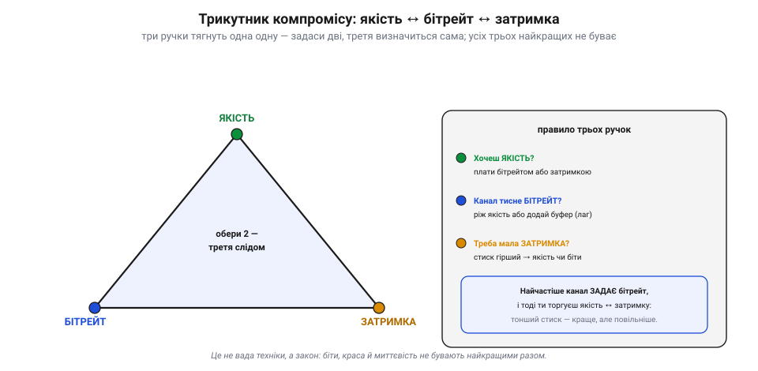
*Рис. 48.5.1. Трикутник компромісу. Три ручки — **якість**, **бітрейт**, **затримка** — тягнуть одна одну: викрутиш дві як хочеш, а третя визначиться сама. Хочеш якість — плати бітрейтом або затримкою. Канал тисне бітрейт — ріж якість або копи буфер (лаг). Треба мала затримка — стиск гірший, тож або якість падає, або бітрейт росте. Найчастіше **канал задає бітрейт** (його смуга фіксована), і тоді ти торгуєш якість проти затримки.*

Це не вада конкретної техніки, а **закон**: викрутиш дві ручки як заманеться — третя визначиться сама. Хочеш максимум якості при малому бітрейті? Доведеться тиснути «розумно» й повільно — виросте затримка. Хочеш миттєвість при гарній якості? Готуй широкий бітрейт. Зазвичай реальність ще й **забирає вибір однієї ручки**: канал (радіо чи мережа) має фіксовану смугу, тобто **задає бітрейт** згори. Тоді в тебе лишаються тільки дві ручки — і ти торгуєш **якість проти затримки**.

### Якість проти бітрейту: крива з насиченням

Перша пара — якість і бітрейт. Головна ручка тут — **грубість квантування** (48.2): тиснеш грубіше — менше біт, але видно блоки й артефакти; тонше — більше біт і чистіша картинка. Якщо намалювати залежність якості від бітрейту, вийде не пряма, а **крива з насиченням**.

*Рис. 48.5.2. Біти за якість. Перша половина біт дає майже всю якість — крива круто йде вгору; далі вона **вирівнюється**: кожен наступний мегабіт додає все менше помітного. Зліва — мало біт: блочно й брудно (48.2). «Коліно» — найвигідніша точка (максимум якості за біт). Справа — багато біт, та зиск дрібніє, бо око вже не бачить різниці. Звідси й дві стратегії бітрейту: **CBR** (сталий — для каналу) і **VBR** (змінний — для запису).*

Крива круто росте спочатку (перші біти дають майже всю якість), а тоді **вирівнюється**: кожен наступний мегабіт додає все менше помітного — око вже не бачить різниці. «**Коліно**» цієї кривої — найвигідніша точка: максимум якості за вкладений біт. Звідси й дві стратегії розподілу бітрейту в часі. **CBR** (*constant bitrate*, сталий) тримає біти фіксованими, а якість гуляє — складна сцена виглядає гірше; зате потік рівно лягає у вузький канал. **VBR** (*variable bitrate*, змінний) тримає **якість** сталою, а біти стрибають — на складних сценах їх більше; чудово для запису, та на каналі ці стрибки треба десь **буферити**, а буфер додає затримку. І так ми впираємось у третю ручку.

### Звідки береться затримка

Затримку часто звуть «**від скла до скла**» (*glass-to-glass*) — від скла об'єктива до скла екрана. Це **сума** дрібних затримок усього ланцюга, і кожна ланка щось додає.

*Рис. 48.5.3. Затримка від скла до скла. Кадр проходить ланцюг: захоплення сенсором → кодування → буфер передачі → канал → буфер прийому → декодування → екран. Фіксовані ланки (сенсор, канал) майже не вкоротиш. А ось **кодек і буфери** — головні схованки лагу: B-кадри й lookahead «думають наперед», буфери згладжують сплески, та все це коштує часу. Щоб зрізати затримку — жертвують стиском: B-кадри геть, intra-важко, малий буфер, проста обробка.*

Найбільше затримки ховається у двох місцях. Перше — **кодек**: пошук руху (48.3) — важка робота, а **B-кадри** взагалі мусять зазирати в «майбутні» кадри, тобто кодувальник чекає, доки вони прийдуть, перш ніж видати поточний. Те саме з «**lookahead**» — заглядання наперед заради кращого стиску. Друге — **буфери**: вони згладжують стрибки бітрейту (VBR) і нерівний прихід пакетів («джитер»), та все, що осіло в буфері, **чекає** — а це лаг. Тому рецепт малої затримки завжди той самий і завжди коштує стиску: **B-кадри геть** (не чекати майбутніх), **intra-важко** чи малий GOP (менше залежностей), **малий буфер** (терпіти джитер, а не копити лаг), проста швидка обробка замість «розумної». Менша затримка — гірший стиск; іншого не буває.

### Як це лягає на апарат

Звідси й видно, чому різні апарати крутять ці ручки геть по-різному — кожен жертвує тим, що для його місії дешевше.

*Рис. 48.5.4. Три апарати — три кути трикутника. **Гоночний FPV**: цар — затримка (<30 мс), жертва — чіткість і дальність; intra-важко, малий буфер, аналог або DJI low-latency. **Далекобій / HD-лінк**: канал на відстані вузький, тож тиснуть сильно (H.265) і терплять десятки мс лагу, а якість — під залишок смуги. **Кінозйомка / запис**: цар — якість, лаг байдужий (не наживо), тож B-кадри, великий буфер, VBR і високий бітрейт. Той самий кодек — різні налаштування.*

**Гоночний FPV**: затримка — цар (пілотові потрібні <30 мс, бо інакше він б'ється об ворота), тож жертвують і чіткістю, і дальністю — intra-важке кодування, крихітний буфер. **Далекобійний HD-лінк**: на відстані канал вужчає, бітрейт і дальність у дефіциті, тож тиснуть сильно (H.265) і терплять десятки мілісекунд лагу, а якість беруть «під залишок» смуги. **Кінозйомка чи запис на картку**: дивитися наживо не треба, тож затримка байдужа — і можна викрутити якість на максимум: B-кадри, великий буфер, VBR, високий бітрейт. Кодек той самий — різниця лише в тому, які ручки прикрутили.

> 📜 **Як цифрове FPV роками програвало аналогу — поки затримка не впала до 28 мс.** Десятиліттями гонщики-дрони вперто літали на **аналоговому** відео — каламутному, шумному, з роздільністю гіршою за старий телевізор. Чому? Бо аналог давав майже **нульову затримку**: картинка з'являлася перед очима практично миттєво. Перші **цифрові** системи (на Wi-Fi чи з екшн-камер) давали гарну HD-картинку, але з лагом у сотні мілісекунд — на такому в гонці не полетиш, дрон у стіні раніше, ніж ти побачиш стіну. Це був трикутник у чистому вигляді: цифра вигравала якість, та програвала затримку. Аж 2019-го **DJI** випустила Digital FPV System і нарешті зламала компроміс: HD-картинка із затримкою всього **~28 мілісекунд** — нарівні з аналогом. Хитрість була саме в тому, щоб свідомо **пожертвувати** двома кутами трикутника заради третього: знизити роздільність (720p, не 1080p) і дальність, зате відкрутити ручку затримки до краю. DJI навіть винесла цей компроміс прямо в меню: **Low-Latency Mode** (720p/120 кадрів, <28 мс) проти **High-Quality Mode** (720p/60 кадрів, <40 мс) — пілот власноруч крутить ту саму ручку «якість ↔ затримка», про яку ця тема. Трикутник нікуди не зник — його просто дали в руки пілотові.

> 🔧 **Навіщо це.** Налаштовуючи відеолінк, спершу спитай: **яка ручка для цієї місії священна?** Гонка чи ручне пілотування — священна **затримка**: бери аналог чи цифровий low-latency режим, intra-важко, малий буфер, і не плач за роздільністю. Далекий політ — священний **бітрейт/дальність**: тисни H.265, терпи лаг, віддай якість під залишок смуги. Запис «для кіно» — священна **якість**: VBR, великий буфер, B-кадри, лаг неважливий. Головне — **не чекай усіх трьох одразу**: щойно хтось обіцяє «HD, миттєво й по тонкому каналу» — він щось замовчує (зазвичай дальність або стабільність).

### Підсумок теми

Якість, бітрейт і затримка — три ручки, що тягнуть одна одну: викрутиш дві — третя визначиться сама, і найкращими разом вони не бувають. **Якість проти бітрейту** — це крива з насиченням: перші біти дають майже всю якість, далі зиск дрібніє, тож розумний вибір — «коліно» кривої; а **CBR/VBR** вирішують, тримати сталими біти (для каналу) чи якість (для запису). **Затримка** — сума ланцюга «від скла до скла», і ховається вона головно в кодеку (B-кадри, lookahead) та буферах; зрізати її можна лише ціною стиску. Найчастіше канал **задає бітрейт** згори, лишаючи тобі торг якість ↔ затримка — і кожен апарат розв'язує його по-своєму: гонка тягне за затримку, далекобій — за бітрейт, кінозйомка — за якість. Ми зрозуміли, **чим** торгуємо; далі — **як** саме відео долітає з апарата на землю: радіо (аналогове FPV) і мережа (48.6).

## 48.6 Передача відео: радіо (аналогове FPV) і мережа

Ми стиснули відео й зважили компроміси. Лишилося найприземленіше питання: **як ці біти фізично долітають** з борту до тебе на землю? Тут є дві великі родини, геть різні за духом. Перша — **аналогове радіо**: відеохвилю кладуть просто на радіонесучу, без жодного стиску й пакетів (класичне FPV, на якому виросли гонки). Друга — **цифрова мережа**: стиснений потік ріжуть на пакети й шлють цифровим радіо чи через інтернет. Розберімо обидві — і, головне, чим вони відрізняються на практиці.

### Дві дороги з борту на землю

Найперше — загальна картина. Аналог і цифра роблять принципово різне ще до того, як сигнал торкнеться антени.

*Рис. 48.6.1. Дві дороги з борту на землю. **Аналогове FPV**: камера → відеосигнал (яскравість+синхро) → модулятор кладе його на несучу 5.8 ГГц → ефір → демодулятор → окуляри. Без стиску, без пакетів — звідси майже нульова затримка, та грубо й односторонньо. **Цифрова мережа**: камера → стиск H.264 (48.4) → пакети → цифрове радіо або IP → збір пакетів → декодування → екран. HD, шифрування, маршрут в інтернет — та лаг (кодек+буфер) і складність.*

Бачиш ключову різницю? **Аналог** кладе відео **просто на хвилю**: модулює нею радіонесучу — і все. **Цифра** спершу **стискає** кадр (48.2–48.4) і ріже на **пакети**, а вже тоді шле. Усі інші відмінності — миттєвість, якість, поведінка на краю дальності — випливають саме звідси.

### Аналогове FPV: відео просто на несучій хвилі

Почнімо з простішого. В аналоговому FPV беруть **композитний відеосигнал** — той самий, що ми бачили в Розділі 47: яскравість рядків плюс імпульси синхронізації, усе в одній хвилі. Цією хвилею **модулюють** радіонесучу (зазвичай у діапазоні ~5.8 ГГц), антена випромінює, приймач на землі **демодулює** назад у відеосигнал — і одразу на окуляри.

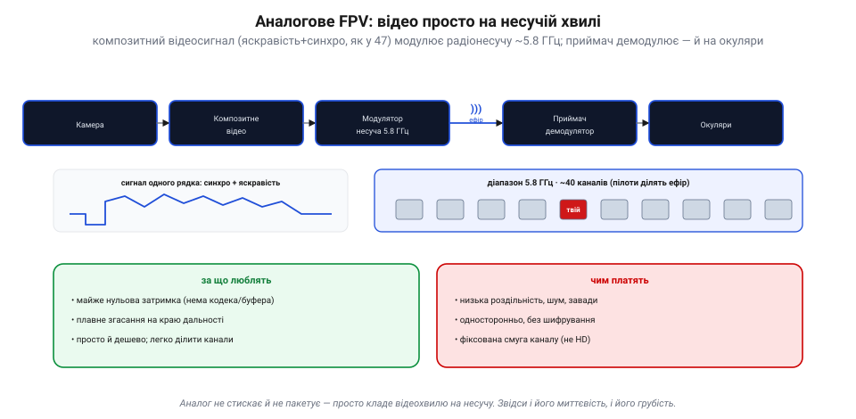
*Рис. 48.6.2. Аналогове FPV. Композитний відеосигнал одного рядка (синхро + яскравість, як у 47) модулює радіонесучу ~5.8 ГГц; приймач демодулює — й на окуляри. Діапазон 5.8 ГГц поділений на ~40 каналів, тож багато пілотів літають поряд. **За що люблять**: майже нульова затримка (нема кодека й буфера), плавне згасання, простота й дешевизна. **Чим платять**: низька роздільність, шум і завади, односторонній зв'язок без шифрування, фіксована смуга каналу (не HD).*

Уся принада — у **простоті**. Нема кодека, нема буферів, нема пакетів — тому затримка **майже нульова** (світло впало на сенсор — і за мить уже перед очима). Тому ж гонщики десятиліттями обирали саме аналог. Ціна простоти — **груба картинка**: низька роздільність (як у старого телевізора), шум, чутливість до завад, односторонній зв'язок без захисту, і фіксована вузька смуга каналу, у яку HD просто не влізе. Зате на діапазоні 5.8 ГГц уміщається близько **40 каналів**, тож десяток пілотів злітає поряд, не глушачи одне одного.

### Цифрова мережа: відео як потік пакетів

Цифра працює інакше. Стиснений бітпотік (48.4) ріжуть на **пакети** — невеликі порції, кожна зі своїм **номером** і **заголовком** (адресою). Пакети летять цифровим радіо чи мережею й на тому боці збираються назад по порядку.

*Рис. 48.6.4. Відео як потік пакетів. Стиснений бітпотік ріжуть на пакети (номер + заголовок + шматок відео). Загубився пакет — буде збій (до наступного I-кадру, 48.3). Наживо шлють по **UDP** (не перепитувати — спізнілий кадр уже непотрібний), а втрати латають **FEC** (надлишкові пакети — відновлення без зворотного запиту, тож без зайвого лагу). Дві ниші: **локальний радіолінк** точка-точка (OcuSync/HDZero/Walksnail — малий лаг, обмежена дальність) і **IP-мережа** (LTE/5G → інтернет — відео в хмару й за обрій, та лаг мережі й залежність від покриття).*

Тут з'являються три речі, яких в аналога не було. Перше — **втрата пакета**: загубився — і в картинці буде збій, що тягнеться до наступного I-кадру (48.3). Друге — **протокол**: відео наживо шлють по **UDP** (шлемо й не перепитуємо — спізнілий кадр уже непотрібний), а **не** по TCP (той гарантує доставку, але перепитування додає затримку — для живого відео згубну); а щоб усе ж латати втрати, додають **FEC** (*forward error correction*) — надлишкові пакети, з яких приймач **сам відновлює** загублене, без зворотного запиту. Третє — **масштаб**: цифру можна слати або **локальним радіолінком** точка-точка (OcuSync, HDZero, Walksnail — борт↔пульт напряму, малий лаг, та обмежена дальність), або через **IP-мережу** (LTE/5G → інтернет), і тоді відео летить хоч у хмару, хоч за обрій (BVLOS) — ціною мережевого лагу й залежності від покриття.

### Плавно чи з обриву: головна практична різниця

А тепер — найважливіше для пілота. Аналог і цифра **по-різному вмирають**, коли сигнал слабшає на краю дальності. І це різниця, яку відчуваєш шкірою.

*Рис. 48.6.3. Плавно чи з обриву. По горизонталі — слабшання сигналу (відстань), по вертикалі — якість картинки. **Аналог** (синя) гасне **плавно**: росте «сніг», та картинку ще видно — є запас і попередження, встигаєш розвернутись. **Цифра** (бурштинова) тримається **ідеально**… і за порогом раптом **обривається** в стоп-кадр чи розсип квадратів. Сучасні системи пом'якшують обрив (адаптивний бітрейт, FEC), та сам обрив лишається: за порогом декодер просто не збере кадр.*

**Аналог гасне плавно** (*graceful degradation*): що далі — то більше «снігу» й шуму, але картинку **ще видно**, і ти встигаєш зрозуміти, що пора розвертатись. **Цифра падає з обриву** (*cliff effect*): тримає ідеальну HD-картинку — і раптом, за якимось порогом сигналу, **обривається** в завмерлий стоп-кадр чи розсип квадратів (саме той «цифровий розпад», що ми бачили в 47.6, через зламаний ланцюг P-кадрів із 48.3). Причина проста: нижче певного відношення сигнал/шум декодер уже **не може** зібрати кадр із побитих пакетів — або все, або нічого. Сучасні системи цей обрив **пом'якшують**: адаптивний бітрейт (на слабкому сигналі сама знижує якість, аби втримати зв'язок) і FEC (латає дрібні втрати). Та зовсім його не прибрати — тому в цифрі критично **знати, де твій «обрив»**, і не залітати за нього наосліп.

> 📜 **Як голлівудська зірка наблизила глушко-стійке радіо.** Хоч би яким радіо ти слав відео й команди — його можна **заглушити** чи підслухати. Розв'язок придумала… кінозірка. 1942 року актриса **Геді Ламар** разом із композитором **Джорджем Антейлом** отримали патент США № 2 292 387 на «секретну систему зв'язку»: ідея була в тому, щоб передавач і приймач **синхронно стрибали** по багатьох радіочастотах за відомим лише їм візерунком — тоді ворог не може ні заглушити сигнал (він щомиті на новій частоті), ні підслухати. Синхронізували стрибки… перфострічкою від механічного піаніно (а 88 частот — мов 88 клавіш!). Винахід призначався для некерованого глушіння радіоторпед, та військові поклали його під сукно як «нездійсненний». Аж за десятиліття ця ідея — **стрибки частот** (*frequency hopping*) — постала як одна з ранніх у родині **розширеного спектра** (*spread spectrum*). Частотами й досі стрибають **Bluetooth** і стійкі дрон-лінки; а от **Wi-Fi, GPS і мобільний** зв'язок користуються **іншими** формами розширеного спектра (CDMA, OFDM), а не прямою її схемою — та й подібні ідеї патентували ще до неї. А ще — у твій апарат: сучасні стійкі лінки керування (FrSky, Crossfire, ExpressLRS) і цифрове відео/телеметрія стрибають частотами рівно за Ламар, щоб дрон не «осліп» від першої-ліпшої завади. Голлівудська зірка стояла біля **витоків** того, завдяки чому твій квадрокоптер чує пульт у переповненому ефірі (його стійкий лінк справді стрибає частотами).

> 🔧 **Навіщо це.** Вибираючи відеолінк, став питання руба: **аналог чи цифра?** Гонка, простота, граничний запас за дальністю, миттєвість — **аналог** (плавне згасання прощає помилки). HD-картинка, шифрування, дальність за обрій, відео в хмару — **цифра**, але вивчи, **де її обрив**, стеж за статистикою лінка (RSSI/якість) і не залітай за поріг. Тримай відеолінк **окремо** від лінка керування й телеметрії — щоб важкий відеопотік не «забивав» команди. І пам'ятай про §10: стійкі лінки **стрибають частотами** — це твій головний захист від завад у переповненому ефірі.

### Підсумок теми

Відео долітає з борту двома дорогами. **Аналогове радіо** кладе відеохвилю просто на несучу: жодного стиску чи пакетів, тому майже нульова затримка й **плавне згасання** — але груба картинка, шум і фіксована вузька смуга. **Цифрова мережа** ріже стиснений потік на **пакети**: HD, шифрування, маршрут хоч в інтернет (BVLOS) — але затримка, складність і **обрив** на краю дальності (за порогом декодер не збере кадр). Тому відео наживо шлють по **UDP** з **FEC**, а не по TCP, і обирають масштаб — локальний радіолінк чи IP-мережу. Головна практична різниця — **graceful** проти **cliff**: аналог попереджає, цифра обриває. А над усім цим — стара ідея **стрибків частот**, що робить лінки стійкими до завад. Ми побачили **дороги**; далі — їхні **реалії**: пропускна здатність, втрати й буферизація (48.7).

## 48.7 Пропускна здатність, втрати, буферизація

Ми побачили дві дороги відео з борту (48.6). Тепер — **реалії**, на які натикаєшся, надто на цифровій: скільки біт за секунду канал насправді витягне (**пропускна здатність**), що буде, коли пакети **зникають** (втрати), і як черга-**буфер** згладжує нерівний прихід. Саме ця трійця вирішує, чи потік іде гладко, чи смикається й розсипається. Це остання цеглинка передачі — і вона змикає весь Розділ 48.

### Пропускна здатність: бітрейт мусить улізти під стелю

**Пропускна здатність** (англ. *bandwidth*, *throughput*) — це скільки біт за секунду канал реально доправляє. І вона **не стала**: що далі апарат, що більше завад і перешкод, то слабший сигнал — а отже, нижча «стеля» (згадай межу Шеннона з 48.1: менше відношення сигнал/шум — менша ємність каналу). Твій **відеобітрейт** (48.5) мусить іти **під** цією стелею, та ще й із запасом.

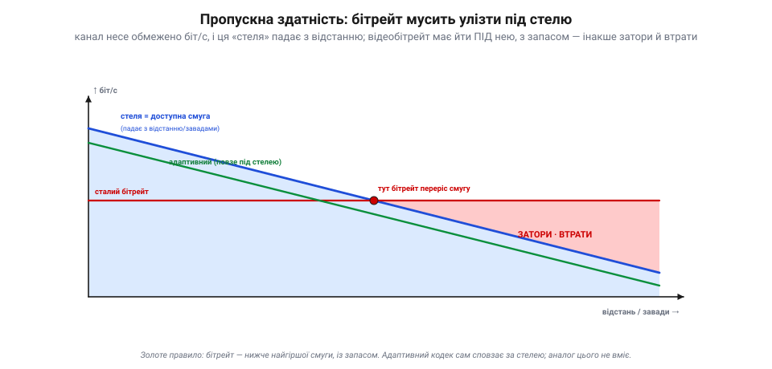
*Рис. 48.7.1. Бітрейт під стелею смуги. «Стеля» (доступна смуга) падає з відстанню й завадами. Поки **сталий бітрейт** іде під нею — усе гаразд; та щойно стеля опускається нижче — бітрейт її **переростає**, і починаються затори й **втрати** (червона зона). Рятунок — **адаптивний бітрейт**: кодек сам знижує потік, повзучи під стелею, тож якість плавно падає, а зв'язок тримається (без обриву). Аналог так не вміє — у нього бітрейт фіксований формою хвилі.*

Якщо бітрейт **перевищить** доступну смугу — канал захлинається: пакети стають у чергу, спізнюються, **губляться**. Ось чому розумні цифрові системи крутять **адаптивний бітрейт**: коли смуга вужчає, кодувальник сам **знижує** потік (грубіше квантування, 48.2) — картинка м'якшає, але зв'язок живий. Це і є та «плавність» проти «обриву», що ми бачили в 48.6: адаптивність перетворює різкий обрив на поступове згасання якості.

### Втрати: коли пакет зникає

Хоч як добре влізли під стелю, **пакети все одно гублять** — і дорогою, і в самому приймачі. Причини: зіткнення в ефірі, слабкий сигнал, затор у каналі, переповнення буфера. А наслідок для відео ми вже знаємо: загублений пакет — це **збій у картинці**, що тягнеться до наступного I-кадру (48.3).

*Рис. 48.7.2. Коли пакет зникає. Пакет губиться від зіткнень, слабкого сигналу, заторів чи переповнення буфера — і в картинці буде збій, доки не прийде I-кадр (48.3). Три відповіді, і кожна за свою плату: **FEC** (шлемо надлишкові пакети, приймач сам відновлює загублене — плата: смуга), **ARQ** (просимо надіслати пакет ще раз — плата: затримка), **терпіти** (лишаємо збій, чекаємо наступний I-кадр — плата: якість).*

Проти втрат є рівно три ходи, і кожен бере свою ціну. **FEC** (*forward error correction*): шлемо трохи **надлишкових** пакетів, з яких приймач **сам відновить** загублене, нічого не перепитуючи — плата йде **смугою**. **ARQ** (перепит, *retransmit*): приймач **просить** надіслати втрачений пакет ще раз — надійно, та зворотний запит коштує **затримки**, тому для живого відео майже непридатний (спізнілий кадр уже нікому не потрібен). **Терпіти**: просто лишити збій і дочекатися наступного I-кадру — плата **якістю**. Тобто загублений пакет завжди обходиться **смугою, затримкою або якістю** — задарма його не повернеш.

### Джитер і буфер: згладити нерівний прихід

Навіть коли пакети доходять усі, вони приходять **нерівно**: мережа щоразу затримує їх трохи по-різному. Цю нерівність приходу звуть **джитером** (*jitter*). Якби кадри віддавали на екран рівно в міру приходу — відео б **смикалося**. Рятує **буфер**: невелика черга, що тримає кілька пакетів напоготові, аби на екран завжди йшов рівний потік.

*Рис. 48.7.3. Джитер і буфер. Пакети **шлють рівно**, але мережа доправляє їх **нерівно** (джитер — десь густо, десь із розривом). **Буфер** тримає кілька пакетів у черзі, тож на виході знов виходить **рівний, гладкий** потік на екран. Ціна — кілька кадрів затримки: кожен пакет чекає в черзі своєї миті.*

Буфер **всотує** нерівність: швидкі пакети чекають у черзі, повільні встигають надійти — і відтворення йде гладко. Та за це платять **затримкою**: усе, що лежить у буфері, чекає своєї миті. І ось ми приходимо до головного компромісу буферизації.

### Глибина буфера: гладко чи миттєво

Скільки пакетів тримати в буфері — це і є ручка між **гладкістю** і **затримкою**.

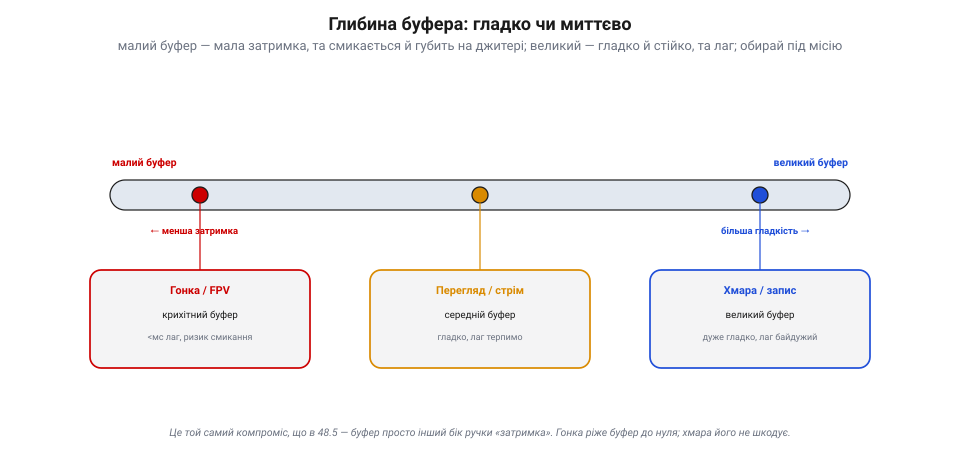
*Рис. 48.7.4. Глибина буфера — компроміс. **Малий** буфер — мала затримка, та на джитері смикається й губить (бракне запасу). **Великий** — гладко й стійко всотує і джитер, і дрібні втрати, та додає лаг. Тож гонка/FPV беруть крихітний буфер (миттєвість понад усе), перегляд і стрім — середній (гладко, лаг терпимо), а хмара й запис — великий (лаг байдужий). Це той самий компроміс, що в 48.5 — буфер просто інший бік ручки «затримка».*

**Малий** буфер дає малу затримку, та на джитері легко **смикається** й губить (не встигає підстрахувати спізнілий пакет). **Великий** буфер гладко всотує і джитер, і дрібні втрати — але кожен зайвий пакет у черзі додає **лагу**. Тому гонка й ручне FPV ріжуть буфер мало не до нуля (миттєвість понад усе, хай і смикне), перегляд і стрім тримають середній (гладко, а десяток мілісекунд лагу не шкода), а запис у хмару чи на картку не шкодує буфера зовсім (лаг там байдужий). Це, по суті, **той самий компроміс**, що ми крутили в 48.5: буфер — просто інший бік ручки «затримка».

> 📜 **Як ідея пережити ядерну війну зробила відео стійким до втрат.** Чому загублений пакет лише дряпає картинку, а не рве зв'язок? Бо відео йде **незалежними пакетами** — а цю ідею народила холодна війна. На початку 1960-х інженер **Пол Беран** із корпорації RAND шукав, як збудувати мережу зв'язку, що **переживе ядерний удар**: якщо ворог вирве кілька вузлів, решта має працювати. Його розв'язок (доповідь «On Distributed Communications», серпень 1964) був радикальний: не тягнути один тендітний провід від А до Б, а **порізати** повідомлення на дрібні порції даних (*message blocks*), пустити кожен **самостійно** через комірчасту мережу найшвидшим вільним шляхом — і зібрати докупи на тому кінці. Незалежно від нього те саме 1965 року придумав британець **Дональд Девіс** із NPL — і саме він назвав ці порції **пакетами** (*packets*). Військові спершу махнули рукою (а телефонна монополія AT&T казала, що це не запрацює), та згодом ідея лягла в основу **ARPANET**, а далі — усього інтернету. І твого відеолінка теж: коли цифровий потік летить **незалежними пакетами**, втрата кількох — лише збій, а не розрив: решта приходять самі й збираються в кадр. (Щоправда, «знайти **інший шлях**» уміють маршрутизовані й комірчасті мережі; у звичайному двоточковому дрон-лінку шлях один, тож загублений пакет просто втрачено — рятують незалежність пакетів і FEC, а не перемаршрутизація.) Стійкість, задумана проти бомби, щодня рятує твою картинку від звичайних завад.

> 🔧 **Навіщо це.** Постав відеобітрейт **нижче найгіршої** очікуваної смуги, із запасом — і ввімкни **адаптивний** режим, якщо є: хай кодек сам сповзає за стелею, а не б'ється об обрив. Не «наливай» канал по вінця — повний канал = затори = втрати. Для наживо лікуй втрати **FEC**, не перепитом (ARQ додасть лаг). Крути **буфер** під місію: гонка — мінімум (хай смикне, аби миттєво), запис — більший (гладко). І стеж за **статистикою лінка** (смуга, втрати, джитер): саме вони, а не «магія», вирішують, чи долетить картинка.

### Підсумок теми й Розділу 48

Передача має три реалії. **Пропускна здатність** — стеля, що падає з відстанню; бітрейт мусить іти під нею з запасом, а адаптивний кодек сам сповзає за стелею. **Втрати** неминучі (зіткнення, завади, затори), і гасять їх лише трьома способами — FEC (смугою), ARQ (затримкою) чи терпінням (якістю). **Буферизація** згладжує джитер, та глибина буфера — це ручка «гладкість ↔ затримка». А під усім лежить ідея **пакетів** Берана й Девіса, що й робить цифрове відео стійким до втрат.

На цьому Розділ 48 замкнувся. Ми перестрибнули прірву з 47-го: навчилися **стискати** відео (DCT, JPEG, I/P-кадри), **вибирати кодек** (MJPEG ↔ H.264 ↔ H.265/AV1), крутити **трикутник** якість↔бітрейт↔затримка, **доправляти** потік (аналогове радіо чи цифрова мережа) і давати раду його **реаліям** (смуга, втрати, буфер). Тепер апарат уміє не лише **бачити** (47), а й **донести** побачене. Далі — наступний крок: навчити машину не просто передавати кадр, а **розуміти** його. Вітаємо в машинному баченні (Розділ 49).