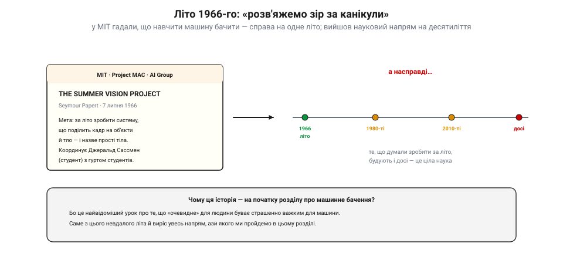
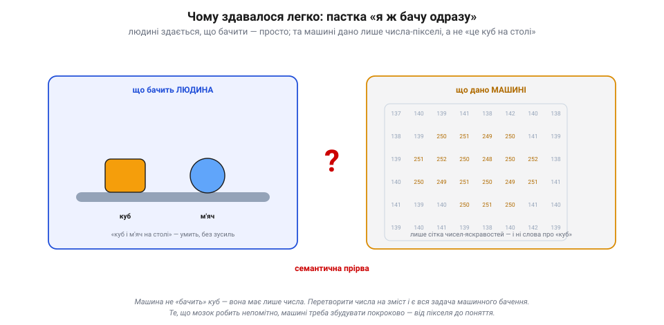
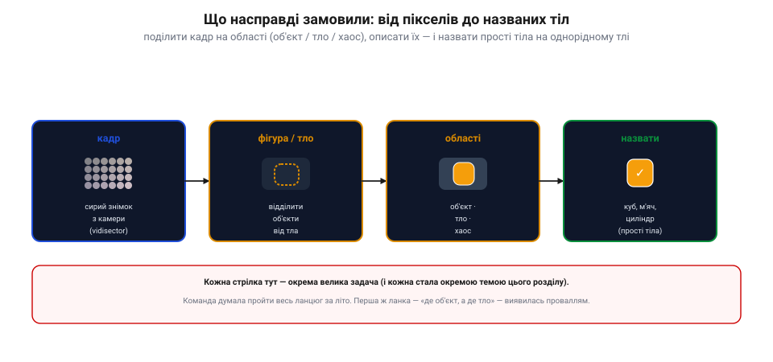
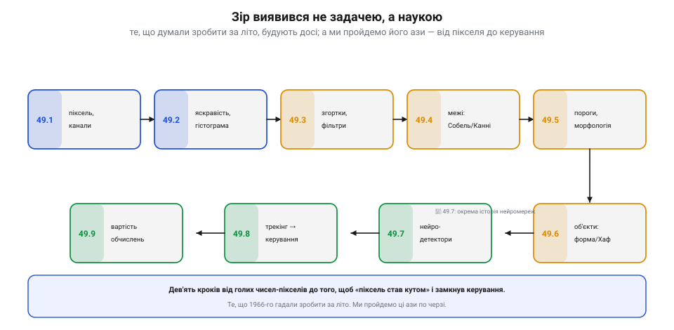

📜 *Історична вставка до [Розділу 7.9 — Машинне бачення: основи](ch49-computer-vision.md).*

# Історія: «літній проєкт зору» — як машинне бачення замовили на канікули

Розділ 7.8 навчив апарат **донести** картинку до нас. Тепер — найамбітніший крок: навчити машину не просто передавати кадр, а **розуміти** його. І почати тут варто з найвідомішого провалу в історії штучного інтелекту — провалу настільки повчального, що з нього виріс цілий науковий напрям. 1966 року в MIT вирішили, що навчити комп'ютер **бачити** — це робота на одне літо. Ось як ця наївна впевненість зустрілася з реальністю — і чому твій дрон досі не «бачить» так легко, як ти.

## «Зробити зір за літо»: записка липня 1966-го

На зорі штучного інтелекту панував шалений оптимізм. У лабораторії ШІ при MIT (групі Марвіна Мінського) **Сеймур Паперт** 7 липня 1966 року написав коротку записку під назвою «The Summer Vision Project». У ній він окреслив **літній** проєкт для студентів: за канікули збудувати систему, що візьме картинку з камери, поділить її на об'єкти й тло — і **назве** прості тіла. Координувати доручили студентові **Джеральду Сассмену** з невеликим гуртом інших студентів.

*Рис. 7.9.0.1. Літо 1966-го. Записка Сеймура Паперта (MIT, лабораторія ШІ) ставила за мету **за одне літо** зробити систему, що поділить кадр на об'єкти й тло та назве прості тіла; координував студент Джеральд Сассмен. Насправді ж те, що думали зробити за канікули, будують і досі — машинне бачення виявилося не задачею на літо, а цілою наукою на десятиліття.*

Сьогодні це звучить як анекдот, але тоді думка була цілком серйозна. Інші задачі ШІ — гра в шахи, доведення теорем, символьна алгебра — вже піддавалися, тож **зір** здавався радше технічною дрібницею: ну камера ж є, картинка є — лишилось «прочитати», що на ній. Та саме тут і чаїлася пастка.

## Пастка очевидного: людині легко, машині — ні

Чому розумні люди так помилилися в оцінці? Бо **зір оманливо легкий** — для нас. Ти дивишся на стіл із кубиком і м'ячиком і **вмить**, без жодного зусилля, знаєш: ось куб, ось м'яч, ось стіл. Здається, що й машині буде так само просто. Але машині не дано «куба» — їй дано лише **сітку чисел**: яскравість кожного пікселя, і більш нічого.

*Рис. 7.9.0.2. Пастка очевидного. **Людина** вмить бачить «куб і м'яч на столі». **Машині** ж дано лише сітку чисел-яскравостей — і ні слова про «куб». Перетворити ці числа на зміст («тут об'єкт, він кубічний, він на столі») і є вся задача машинного бачення. Цю відстань між пікселями й поняттями звуть **семантичною прірвою**.*

Оце провалля між **числами** й **змістом** — між «137, 140, 250, 251…» і «це куб» — згодом назвуть **семантичною прірвою**. Людський мозок перестрибує її непомітно, за мільйонами років еволюції відточеним «залізом» зорової кори. А машині кожен крок треба **збудувати власноруч**: де межа об'єкта, де тінь, а де справжній край, що тут одне тіло, а що два, який це предмет. Те, що в нас «само собою», для комп'ютера — ланцюг важких задач. (Згодом це сформулюють як **парадокс Моравека**: що легше дається людині, то важче дається машині, і навпаки.)

## Справжнє замовлення: від кадру до названих тіл

Якщо вчитатися в записку, видно, що Паперт просив не «магію», а цілком конкретний **ланцюг** перетворень. Спершу — **фігура й тло**: відділити ймовірні об'єкти від тла (і від «хаосу» — ділянок, де не розібрати). Тоді — **описати області**: де об'єкт, де тло. І нарешті — **назвати** прості тіла (куб, м'яч, циліндр), та й то лише не перекриті, з однорідним кольором і на рівному тлі.

*Рис. 7.9.0.3. Що насправді замовили. Ланцюг від сирого кадру (з «vidisector» — тодішньої передавальної трубки) до названих тіл: спершу відділити **фігуру від тла**, тоді поділити на **області** (об'єкт / тло / хаос), і врешті **назвати** прості тіла на однорідному тлі. Кожна стрілка тут — окрема велика задача; команда ж думала пройти весь ланцюг за літо. А перша ж ланка — «де об'єкт, а де тло» — виявилась проваллям.*

Здавалося б, скромно — навіть не «впізнати все на світі», а лише кілька кубиків на чистому столі. Та навіть **перша** ланка — відділити об'єкт від тла — виявилася неприступною: реальні тіні, відблиски, текстури, нечіткі межі робили «очевидне» розбиття пекельно складним. Літо скінчилося, а зір — ні.

## Зір як наука, а не літній проєкт

Те, що Паперт планував на канікули, виросло в **окрему науку**, яку будують і донині. Кожна ланка того наївного ланцюга — відділення фігури, опис областей, виявлення країв, розпізнавання форм — стала окремою великою темою з власними методами, а врешті привела до нейромереж, що сьогодні бачать краще за давні алгоритми (але теж не «задарма»).

*Рис. 7.9.0.4. Зір як наука. Те, що 1966-го гадали зробити за літо, ми пройдемо **по черзі**, ази за азами: піксель і канали (7.9.1) → яскравість і гістограма (7.9.2) → згортки й фільтри (7.9.3) → межі (7.9.4) → пороги й морфологія (7.9.5) → виявлення об'єктів (7.9.6) → нейромережі-детектори (7.9.7) → трекінг і «піксель → кут» (7.9.8) → вартість обчислень (7.9.9). Дев'ять кроків від голих чисел до того, щоб зір замкнув **керування** апаратом.*

Саме тому ми **починаємо** з цієї історії: щоб поважати складність. Машинне бачення — не «прочитати картинку», а кропітко, крок за кроком, перекинути міст через семантичну прірву. Розділ 7.9 — це і є ті перші кроки моста, від яких колись так необачно відмахнулися.

## Що з цього в нашому апараті

На дроні машинне бачення — це вже буденність: утримати ціль у кадрі, знайти посадковий майданчик, летіти вздовж лінії, оминути перешкоду, перетворити **піксель** на **кут** для автопілота (7.9.8). Усе це робить або бортовий комп'ютер-супутник (на кшталт Raspberry Pi чи Jetson), або, для простих задач, навіть мікроконтролер. Та хоч би яким потужним було залізо, під капотом — той самий ланцюг із записки 1966-го: відділити, описати, розпізнати.

І урок того літа лишається в силі: **зір — це важко**. Коли твій бортовий детектор плутає тінь із перешкодою чи губить ціль на строкатому тлі — це не «поганий код», а та сама семантична прірва, через яку люди наводять мости вже понад півстоліття. Ми перейдемо її разом — від найпершого пікселя. Історія дала нам **смирення**; далі — ремесло.
