# Розділ 50 — Машинне навчання й нейромережі на пристрої

Розділ 49 раз у раз спирався на **навчені** моделі — детектори, що бачать те, чого жодним рукотворним правилом не задаси (49.7). Ми користувалися ними як «чорною скринею». Цей, **останній** розділ модуля, відкриває скриньку: що таке **машинне навчання**, як нейромережа вчиться з прикладів, чому згорткові мережі такі добрі для зображень — і, головне для нас, як втиснути навчену модель у **бортовий чип** апарата (TinyML). Від ідеї «вчитися з даних, а не з правил» — до нейромережі, що працює просто на дроні.

Почнімо з історії — не про алгоритм, а про **впертість**, що пронесла цю ідею крізь два «льодовикові періоди» штучного інтелекту.

> 📜 Історія розділу: [Джеффрі Гінтон і зворотне поширення — упертість крізь «зими ШІ»](ch50-history-ai-winters.md). Вона пояснює, чому ідею машинного навчання двічі ховали — і чому 2012-го вона нарешті перемогла.

---

## 50.1 Що таке машинне навчання: вчитися з даних, а не з правил

Усе попереднє програмування, що ми бачили в курсі, влаштоване однаково: людина пише **правила** (якщо так — роби це), а машина їх виконує. Працює чудово — **поки правило можна сформулювати**. Та для багатьох задач правила нема: спробуй описати словами, *за якими ознаками* фото — це кіт. Машинне навчання перевертає підхід: замість правил машині дають **приклади**, і вона виводить правило **сама**. Це фундамент усього розділу.

### Переворот: дані + відповіді → правило

Порівняймо два світи. У **класичному** програмуванні на вхід ідуть **дані** й **правила** (написані людиною), а на виході — **відповіді**. У **машинному навчанні** на вхід ідуть **дані** й **відповіді** (приклади з підписами), а на виході — саме **правило** (його звуть **моделлю**).

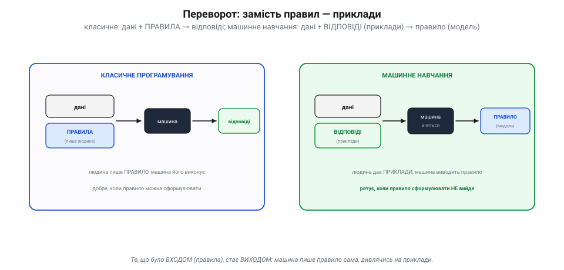
*Рис. 50.1.1. Переворот. У **класичному програмуванні** людина пише правило, а машина його виконує: дані + правила → відповіді. У **машинному навчанні** людина дає приклади (дані + відповіді), а машина сама виводить правило — **модель**: дані + відповіді → правило. Те, що було **входом** (правила), стає **виходом**. Машина пише собі правило, дивлячись на приклади.*

Це і є суть: те, що раніше людина **закладала** (правило), машина тепер **виводить** сама — з прикладів. Замість «я знаю, як це зробити, і напишу інструкцію» — «я не знаю інструкції, зате маю багато прикладів, як правильно». Модель — це і є та вивчена інструкція (для нейромережі — її **ваги**, 50.3).

### Де правила безсилі — а приклади є

Навіщо це? Бо є цілий клас задач, де правило написати **неможливо**, хоч скільки старайся.

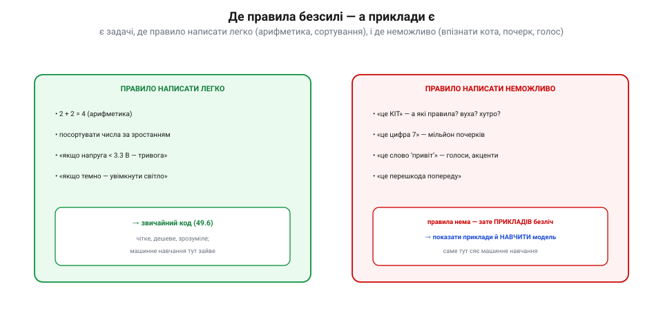
*Рис. 50.1.2. Де правила безсилі. **Легко формалізувати**: 2+2, сортування, «якщо напруга мала — тривога» — це звичайний код (49.6), і машинне навчання тут зайве. **Неможливо формалізувати**: «це кіт», «це цифра 7», «це слово ‘привіт’», «це перешкода» — спробуй виписати правило для «кота» (вуха? хутро? а в профіль? а руде?) і потонеш. Зате **прикладів** — безліч. Саме тут і сяє машинне навчання.*

Для «2+2» чи сортування правило очевидне — пиши звичайний код (49.6), дешево й зрозуміло. А от спробуй формалізувати «це **кіт**»: вуха? хутро? чотири лапи? — кожне правило має тисячу винятків (кіт у профіль, руде кошеня, кіт за кущем). Людина впізнає кота **миттєво**, але пояснити **правилом** не може (згадай семантичну прірву, 49.0). Проте **показати** тисячу фото котів — легко. Машинне навчання саме для цього: **не можеш написати правило, але маєш приклади** — навчи модель.

### Три роди навчання

Як саме «показують» приклади — буває по-різному. Класично виділяють три роди навчання.

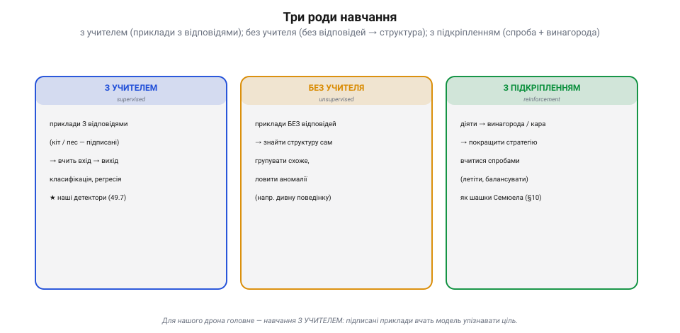
*Рис. 50.1.3. Три роди навчання. **З учителем** (*supervised*): приклади **з** відповідями (підписані «кіт»/«пес») — модель учить зв'язок вхід → вихід (класифікація, регресія); це і є наші детектори (49.7). **Без учителя** (*unsupervised*): приклади **без** відповідей — модель сама знаходить структуру (групує схоже, ловить аномалії). **З підкріпленням** (*reinforcement*): агент діє, дістає винагороду чи кару й покращує стратегію (вчиться спробами — як шашки Семюела з §10).*

**З учителем** — найважливіший для нас: моделі дають приклади **з правильними відповідями** (фото, підписані «кіт» чи «пес»), і вона вчить відображення вхід → вихід. Так працюють **класифікація** (який це клас) і **регресія** (передбачити число), а отже й усі детектори з 49.7. **Без учителя** — прикладів дають **без** відповідей, і модель сама шукає **структуру**: групує схоже (кластери), вирізняє аномалії (корисно для виявлення несправностей). **З підкріпленням** — агент **діє**, отримує **винагороду** чи кару й поступово виробляє вдалу **стратегію**; так вчаться балансувати, грати, керувати (і так само вчилися Семюелові шашки, §10).

### Серце машинного навчання — дані

І головне застереження. Модель не «розуміє» світ — вона **припасовується** до показаних прикладів і **узагальнює** на нові, схожі. Тому вона **рівно настільки добра, наскільки добрі її дані**.

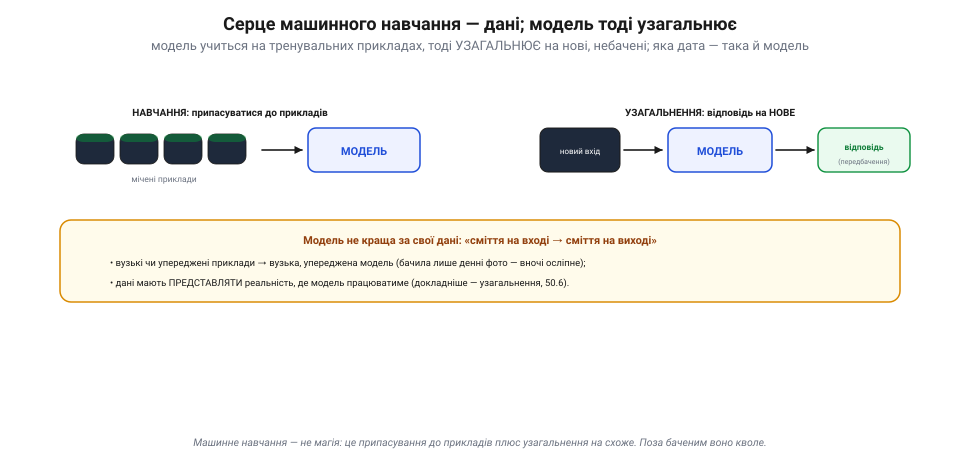
*Рис. 50.1.4. Серце ML — дані. Під час **навчання** модель припасовується до мічених прикладів; під час роботи — **узагальнює** на новий, небачений вхід (видає передбачення). Та модель **не краща за свої дані**: «сміття на вході → сміття на виході». Вузькі чи упереджені приклади дають вузьку, упереджену модель (бачила лише денні фото — вночі осліпне). Дані мусять **представляти** реальність, де модель працюватиме (про це — узагальнення, 50.6).*

«**Сміття на вході — сміття на виході**»: якщо приклади вузькі чи перекошені, такою ж буде й модель. Навчив детектор лише на денних знімках — у сутінках він осліпне; показав тільки європейські дорожні знаки — на інших розгубиться. Тому збирання **представницьких** даних — половина успіху (повернемося до цього в 50.6). І ще: машинне навчання — **не магія**. Це припасування до прикладів плюс узагальнення на **схоже**; поза тим, що воно «бачило», воно кволе й може **впевнено помилятися** (49.7). Це інструмент із чіткими межами, а не чарівна паличка.

> 📜 **Програма, що сама навчилася грати: шашки Артура Семюела (1959).** Сам термін «машинне навчання» подарував світові інженер IBM **Артур Семюел** — і не лекцією, а **діючою** програмою. Ще в 1950-х він написав для комп'ютера IBM програму, що грала в **шашки** (англійські draughts) — але не за жорсткими правилами «як ходити», а так, що **вчилася на досвіді**: грала партію за партією, зокрема **сама проти себе**, помічала, які ходи вели до перемоги, і потроху підправляла свою оцінку позицій. З кожною партією вона грала **краще** — і зрештою обігрувала самого Семюела. У статті 1959 року «Some Studies in Machine Learning Using the Game of Checkers» він і вжив назву «machine learning», давши їй означення, яке цитують досі: це коли комп'ютер дістає **здатність учитися, не будучи явно запрограмованим**. Одна з перших у світі програм, що **самонавчалися**, — пращур кожного детектора на твоєму дроні. Семюел показав те, із чого ми почали цю тему: машину можна не **програмувати** правилами, а **навчати** з досвіду — і часом вона перевершить того, хто її створив.

> 🔧 **Навіщо це.** Берися за машинне навчання, коли **не можеш написати правило, але маєш приклади** — мінливі об'єкти, нечіткі образи, голос, почерк (49.7). Для наших задач це майже завжди навчання **з учителем**: збери **підписані** дані → навчи модель → застосовуй. Пам'ятай, що модель **не краща за дані**: збирай **представницькі** приклади з усіх умов, де вона працюватиме (день/ніч, різні ракурси), інакше дістанеш «сміття на виході». І не тягни ML туди, де **досить правила**: для «2+2» чи порога в HSV (49.6) звичайний код дешевший, швидший і зрозуміліший. Машинне навчання — потужний інструмент **під свій клас задач**, а не заміна здоровому глузду.

### Підсумок теми

Машинне навчання **перевертає** програмування: замість «дані + правила → відповіді» — «дані + **відповіді** (приклади) → **правило** (модель)»; машина сама виводить інструкцію з прикладів. Це незамінне там, де правило сформулювати **неможливо** (кіт, почерк, голос), зате прикладів вдосталь. Розрізняють навчання **з учителем** (підписані приклади — наші детектори), **без учителя** (шукати структуру) і **з підкріпленням** (спроба + винагорода). А над усім — залізне правило: модель **не краща за свої дані**, тож вони мають представляти реальність, і це не магія, а припасування плюс узагальнення на схоже. Сам термін і першу самонавчальну програму подарував Артур Семюел зі своїми шашками 1959-го. Тепер, коли ясно **що** таке навчання, розгляньмо його **дві фази**, які вже мелькали в 49.7: навчання й вивід (50.2).

## 50.2 Навчання vs вивід (inference): дві фази

Кожна модель проживає **два** геть різні життя. Спершу — довге, важке, одноразове: **навчання**, коли вона вчиться на даних. Потім — коротке, легке, повторюване безліч разів: **вивід** (інференс), коли вже навчену модель **застосовують** до нового входу. Ми побіжно бачили цей поділ у 49.7; тепер розберімо його як слід, бо саме на ньому стоїть уся практика машинного навчання **на апараті**.

### Дві фази життя моделі

Найперше — у чому різниця. Під час **навчання** модель **змінюється**: їй дають дані з відповідями, і вона підкручує свої внутрішні **ваги**, щоб менше помилятися. Під час **виводу** модель **заморожена**: ваги вже не міняються, вона лише **читає** вхід і видає відповідь.

*Рис. 50.2.1. Дві фази. **Навчання**: моделі дають дані з мітками, і вона **підкручує ваги** (↻ багато разів), доки не навчиться; виходить навчена модель (файл ваг). Важко, **раз**, на потужних машинах (GPU/хмара). **Вивід**: цю **заморожену** модель запускають на новому вході — вона лише застосовує вивчене й видає відповідь. Легко, **щоразу**, на пристрої. Натренуй раз — застосовуй безліч разів.*

Це і є ключ: **навчена раз — застосовується безліч разів**. Модель, яку тижнями тренували в дата-центрі, потім роками працює на дешевому чипі, відповідаючи за мілісекунди. Тому навчання й вивід **розділяють у часі й просторі**: тренують там, де потужно (хмара), а застосовують там, де треба (борт апарата). І майже завжди апарат робить **лише вивід** — він возить **готову** модель, навчену кимось іншим.

### Що тече в кожній фазі: вперед — і назад

Чому ж навчання таке важче за вивід? Бо в ньому вдвічі більше роботи. **Вивід** — це лише прохід **уперед**: вхід тече крізь шари мережі до відповіді. **Навчання** додає до цього прохід **назад**.

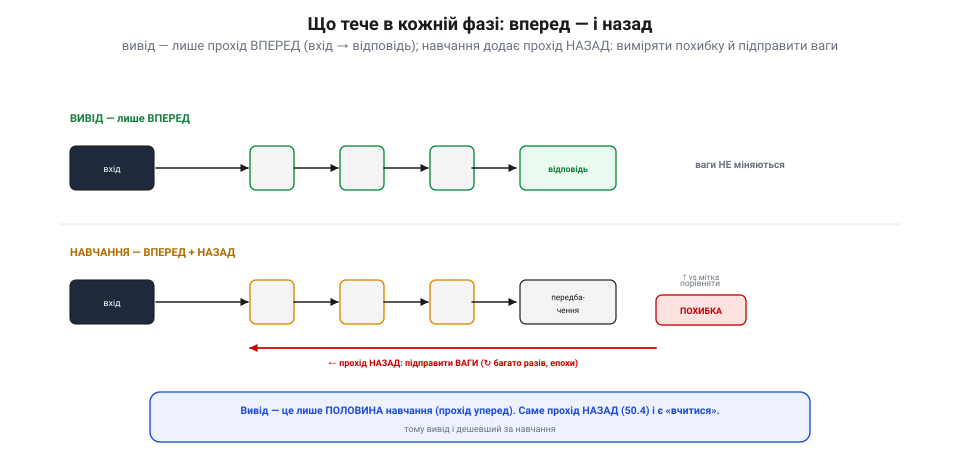
*Рис. 50.2.2. Що тече. **Вивід** — прохід лише **вперед**: вхід → шари → відповідь, ваги не міняються. **Навчання** — спершу так само вперед (дістати передбачення), тоді **порівняти** його з правильною міткою (це **похибка**), і пройти **назад**, підправивши ваги так, щоб похибка зменшилась; і повторити по всіх прикладах багато разів («епохи»). Вивід — це лише половина навчання (прохід уперед); саме прохід назад (50.4) і є «вчитися».*

Послідовність навчання така: прогнати вхід **уперед** → отримати передбачення → **порівняти** з правильною відповіддю (виходить **похибка**) → пройти **назад** і підправити ваги, щоб наступного разу помилитися менше → і так **багато разів** по всьому набору (кожен повний прохід даних звуть **епохою**). Прохід назад — це і є власне «вчитися», і саме його ми розберемо в 50.4. А вивід — це лише **прохід уперед**, половина роботи; **тому він і дешевший** за навчання.

### Велика асиметрія: де й скільки коштує

Через цю різницю фази **кардинально** різняться за ціною — і це визначає, де кожну запускати.

*Рис. 50.2.3. Асиметрія. **Навчання**: тижні часу, ферма GPU чи хмара, увесь набір даних, величезна енергія — та робиться **раз** (чи зрідка). **Вивід**: мілісекунди, один чип на борту, лише новий вхід, мала енергія — зате **постійно**, щокадру. Висновок: тренуй там, де потужно (хмара); застосовуй там, де треба (апарат). Звідси й уся архітектура «де рахувати» — 50.8.*

Дивись на контраст. **Навчання**: тижні роботи, ферма відеокарт, увесь набір даних у пам'яті, гори енергії — але **один раз**. **Вивід**: мілісекунди на кадр, один скромний чип, лише поточний вхід, мало енергії — зате **безперервно**. Це й диктує архітектуру: ресурсомістке навчання віддають **хмарі**, а легкий (відносно) вивід ставлять на **апарат** (детальніше — 50.8). Тренувати на борту дрона майже ніколи не мають сенсу — бракне ні даних, ні потужності, ні часу.

### Що це означає для апарата

Звідси — кілька твердих практичних наслідків для того, хто ставить ML на дрон.

*Рис. 50.2.4. На апараті. Модель **навчають у хмарі** (гори даних + GPU), а на борт **розгортають** уже готову, **заморожену**. Апарат лише робить **вивід** (прохід уперед на кадрі) і **в польоті не вчиться**. Щоб покращити поведінку, треба зібрати нові дані, **перенавчити в хмарі** й **перевстановити** модель — повільний зовнішній цикл. Модель = заморожене знання; на борт їде лише вона (ваги), а не приклади.*

По-перше, апарат **возить готову, заморожену** модель і **в польоті не вчиться** — він лише застосовує те, що вже вивчено. По-друге, щоб **змінити** поведінку моделі, її не «підправляють на борту»: треба зібрати нові дані, **перенавчити** в хмарі й **перевстановити** новий файл ваг (повільний зовнішній цикл). По-третє, на борт їде **лише модель** (ваги), а не дані, на яких вона вчилася, — вони лишаються в хмарі. І по-четверте, хоч вивід і легший за навчання, він **усе одно коштує** (мільйони множень на кадр), тож його оптимізують під чип (квантування, малі моделі — 50.7). Важливий висновок: коли модель на дроні **хибить**, це часто не «баг у коді», а **межі того, на чому її навчили** — і лік тут не правка коду, а кращі дані й перенавчання.

> 📜 **Місяці тренування — і хід, якого не зробила б людина: AlphaGo (2016).** Найкраще цей поділ на дві фази видно на найгучнішій перемозі ШІ над людиною. У березні 2016-го програма **AlphaGo** від DeepMind у Сеулі обіграла одного з найсильніших гравців світу в **ґо**, Лі Седоля, з рахунком **4:1**. Але перемогу здобули **задовго** до матчу — у фазі **навчання**: AlphaGo спершу вивчили на партіях сильних людей, а тоді вона зіграла **десятки мільйонів** партій **сама проти себе** (привіт Семюеловим шашкам із 50.1, лише в незрівнянно більшому масштабі), поступово вдосконалюючи свої нейромережі. До матчу ця наука вже **застигла**: за столом мережі були **заморожені**, і AlphaGo не «довчалася» по ходу — вона лише **застосовувала** накопичене, обираючи ходи. І ось у другій партії стався славетний **хід №37**: AlphaGo поставила камінь так, що коментатори спершу вирішили — помилка (її ж власна оцінка казала, що людина зробила б цей хід із імовірністю ~1 до 10 000). Та хід виявився блискучим. Він не «придумався на ходу» — він **виринув** із місяців тренування, спресованих у заморожену модель. Дві фази в чистому вигляді: довге, важке навчання — і миттєве, холоднокровне застосування.

> 🔧 **Навіщо це.** Чітко розділяй фази. На апарат став **готову, наперед навчену** (заморожену) модель — і не намагайся вчити її в польоті. Тренуй (чи дотреновуй) у **хмарі** на потужному залізі, тоді **експортуй** і розгортай. Пам'ятай, що модель **статична**: щоб змінити поведінку — **перенавчи й перевстанови**, а не «підкрути на борту». Вивід усе одно **коштує** (прохід уперед — це мільйони множень), тож оптимізуй його під чип (50.7). І не плутай: **дані для навчання** лишаються в хмарі, а на борт їде лише **модель**. Якщо детектор систематично хибить — шукай провину не в коді на дроні, а в **даних і навчанні**.

### Підсумок теми

Модель живе у двох фазах. **Навчання**: дані з мітками → прохід уперед → похибка проти мітки → прохід **назад**, що підправляє ваги, і так багато разів (епохи) — важко, раз, у хмарі, модель **змінюється**. **Вивід**: новий вхід → прохід лише **вперед** → відповідь — легко, щоразу, на пристрої, модель **заморожена**. Вивід — це половина навчання, тому й дешевший; а різка **асиметрія** ціни й диктує: тренуй у хмарі, застосовуй на апараті, який лише робить вивід і в польоті не вчиться. Щоб його покращити — перенавчають і перевстановлюють. AlphaGo показала це велично: місяці самонавчання, спресовані в заморожену модель, що за мить вибрала хід №37. Тепер відкриймо саму модель: із чого вона складається — нейрон і шар, ваги й активація (50.3).

## 50.3 Нейрон і шар: будівельні цеглинки (ваги, активація)

Нейромережа звучить загадково, та всередині вона складена з украй простих цеглинок. Розберімо їх: атом — **нейрон**, тканина — **шар**, а «знання» — це **ваги** й **активація**. Коли побачиш, із чого збудована модель, «чорна скриня» з 49.7 перестане бути такою чорною: це просто **стос зважених сум**.

### Штучний нейрон: зважена сума плюс «вмикач»

**Штучний нейрон** робить три прості дії. Бере кілька **входів** (чисел), множить кожен на свою **вагу**, **додає** все докупи (плюс окреме число — **зсув**), а тоді пропускає суму крізь **активацію** — і видає один вихід.

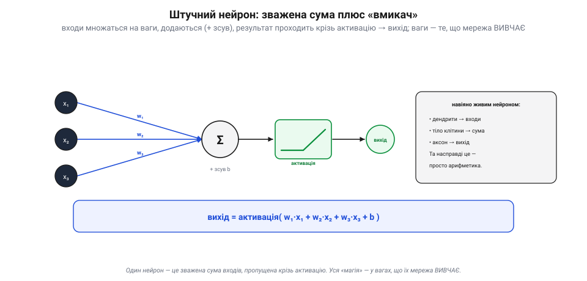
*Рис. 50.3.1. Штучний нейрон. Входи (x₁, x₂, x₃) множаться на ваги (w₁, w₂, w₃), додаються разом із **зсувом** b, і ця сума проходить крізь **активацію** → вихід. Формула: **вихід = активація(w₁·x₁ + w₂·x₂ + w₃·x₃ + b)**. Ідею навіяв живий нейрон (дендрити → входи, тіло → сума, аксон → вихід), та насправді це проста арифметика.*

Уся формула — `вихід = активація(w₁·x₁ + w₂·x₂ + w₃·x₃ + b)`. Назва «нейрон» — данина біології (вхід нагадує дендрити, сума — тіло клітини, вихід — аксон), але плутати не варто: це **арифметика**, а не жива клітина. І головне: **ваги — це те, що мережа вивчає** (50.2, 50.4); сам нейрон лишається тією самою формулою, а навчання просто підбирає числа в ній.

### Ваги і зсув: що нейрон вивчає

Зупинімося на цих числах, бо вони — серце всього. **Вага** каже, наскільки **важливий** кожен вхід для рішення. **Зсув** посуває **поріг** спрацювання.

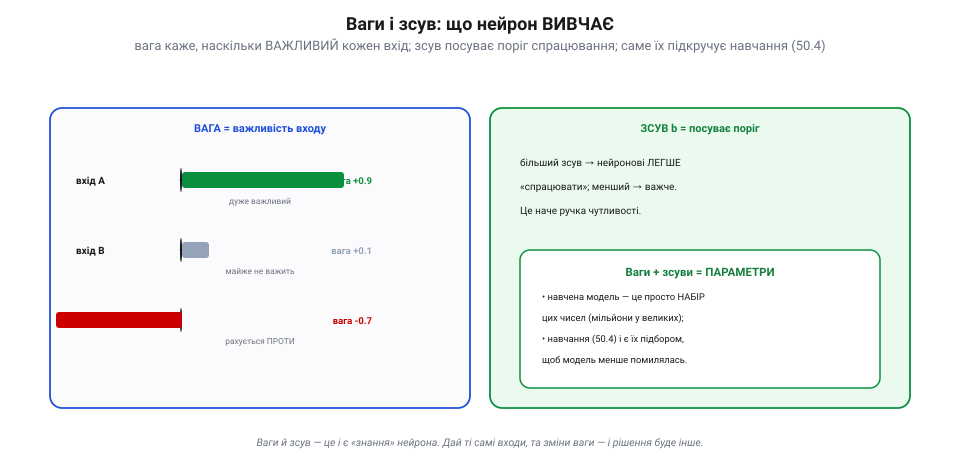
*Рис. 50.3.2. Ваги і зсув. **Вага** = важливість входу: велика (наприклад +0.9) — вхід дуже важить; близька до нуля — майже ігнорується; **від'ємна** — рахується **проти**. **Зсув** b — як ручка чутливості: посуває поріг, роблячи нейронові легше чи важче «спрацювати». Разом ваги й зсуви — це **параметри** моделі: навчена мережа — просто набір цих чисел, а навчання (50.4) і є їх підбором.*

Велика вага — вхід дуже впливає; близька до нуля — майже не зважає; **від'ємна** — вхід рахується **проти** спрацювання. Зсув — ніби ручка чутливості: посунув — і нейронові легше чи важче «загорітися». Усі ці числа разом (ваги + зсуви всіх нейронів) і звуть **параметрами**. Тут — важливе осяяння: **навчена модель — це просто набір чисел** (часто мільйони). Файл моделі, який ти возиш на дроні (50.2), — це і є ці ваги. А «навчити модель» означає **підібрати** їх так, щоб вона менше помилялася (це й робить градієнтний спуск, 50.4).

### Активація: чому без «згину» мережа безсила

Лишилася остання, та критична деталь — **активація**. Це функція, крізь яку пропускають суму. Здавалося б, дрібниця — але без неї нейромережа **безсила**.

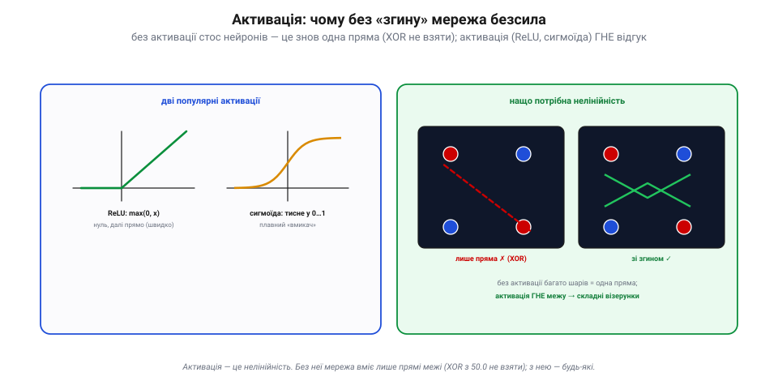
*Рис. 50.3.3. Активація й нелінійність. Дві популярні: **ReLU** — max(0, x): нуль для від'ємних, далі прямо (проста й швидка, типова нині); **сигмоїда** — плавно тисне у 0…1. Навіщо? Без активації хоч скільки шарів дають **усе одно пряму** межу — а нею XOR (50.0) не розітнеш (✗). Активація **гне** відгук, тож мережа вчиться будь-яких, складних меж (✓).*

Чому без неї ніяк? Бо зважена сума — це **лінійна** операція, і скільки лінійних дій не складай, вийде знову **пряма**. А прямою не розділиш навіть простого XOR (згадай стіну XOR з історії розділу, 50.0). **Активація вносить нелінійність** — «згинає» відгук, — і аж тоді стос шарів здатен вигнути межу як завгодно й вивчити складні візерунки. Найпопулярніша сьогодні — **ReLU** (`max(0, x)`: відсікає від'ємне, далі пускає прямо): проста, швидка, і саме вона свого часу допомогла «розгойдати» глибокі мережі (AlexNet, історія до 49.7). Класична **сигмоїда** плавно тисне результат у діапазон 0…1. Активація — маленька, та без неї вся міць багатошаровості зникає.

### Нейрон → шар → мережа

Один нейрон — слабкий. Сила — в **кількості** й **глибині**. Постав багато нейронів **пліч-о-пліч**, усі дивляться на ті самі входи, але кожен зі **своїми** вагами — це **шар**. Постав шари **один за одним** — це **нейромережа**.

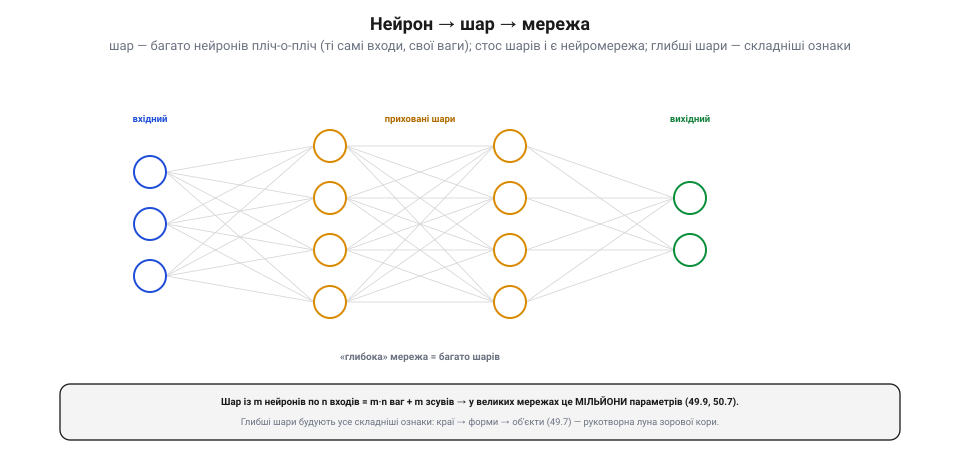
*Рис. 50.3.4. Нейрон → шар → мережа. **Шар** — багато нейронів поряд (ті самі входи, свої ваги). Стос шарів — **вхідний → приховані → вихідний** — і є нейромережа (її звуть багатошаровим перцептроном). «**Глибока**» = багато шарів. Шар із m нейронів по n входів = m·n ваг + m зсувів, тож у великих мережах — **мільйони** параметрів (49.9, 50.7). Глибші шари будують усе складніші ознаки: краї → форми → об'єкти (49.7) — рукотворна луна зорової кори.*

Кадр (чи будь-які дані) тече крізь шари: **вхідний → приховані → вихідний**, і кожен шар — це купа зважених сум плюс активація. Що **глибша** мережа (більше шарів), то складніші **ознаки** вона будує: перші шари ловлять прості речі (краї), глибші складають із них форми, а ще глибші — цілі об'єкти (точно як прості→складні клітини зорової кори, 49.7, і як шари згорток, 49.3). Платня за міць — **кількість параметрів**: шар із m нейронів по n входів має m·n ваг плюс m зсувів, тож велика мережа легко набирає **мільйони** чисел — а це прямо впирається в пам'ять і обчислення апарата (49.9, 50.7). Ось і вся «чорна скриня»: стос шарів зі зважених сум і активацій, повний вивчених чисел.

> 📜 **Нейрон як логіка: Мак-Каллок, Піттс і думка, що мозок рахує (1943).** Перший «штучний нейрон» з'явився на папері ще 1943 року — задовго до перцептрона й комп'ютерів. Нейрофізіолог **Воррен Мак-Каллок** і логік **Волтер Піттс** у статті «A Logical Calculus of the Ideas Immanent in Nervous Activity» запропонували вважати нейрон **пороговим логічним вмикачем**: він додає зважені входи й **спрацьовує**, якщо сума перевищить поріг (саме та схема, що в 50.3.1, лише з різким порогом замість плавної активації). І довели разюче: посполучавши такі вмикачі, можна скласти **будь-яку логічну функцію** — тобто мережа простих нейронів здатна, в принципі, обчислити що завгодно. Це і є зерно всіх нейромереж. А постать Піттса — окрема легенда: син бідняків, **самоук**, він підлітком утік із дому, сам опанував грецьку, латину й логіку, у **дванадцять** років три дні читав у бібліотеці «Principia Mathematica» Бертрана Рассела — і написав авторові листа з переліком помилок; вражений Рассел запросив його до Кембриджа. До університету Піттс так і не вступив, та осів у Чикаґо, слухаючи лекції незаписаним студентом, — і змінив науку. Його з Мак-Каллоком ідея, що **мислення — це обчислення над простими вмикачами**, лягла в основу того, чим сьогодні бачить твій дрон.

> 🔧 **Навіщо це.** Тримай у голові, що нейромережа — **не магія, а стос зважених сум**: входи × ваги + зсув → активація, і так шар за шаром. «Навчена модель» = **набір чисел** (ваг), тож і файл моделі на борту — це вони. Більше нейронів і шарів — більша **міць**, але й більше **параметрів** (пам'ять, обчислення — 49.9), тож на апарат бери **компактні** мережі (50.7). Пам'ятай про **активацію**: без нелінійності мережа вміє лише прямі межі; ReLU нині майже всюди. І не дивуйся, чому глибші шари «бачать» складніше — вони буквально складають прості ознаки в складні, як зорова кора (49.7).

### Підсумок теми

Нейромережа складена з простих цеглинок. **Нейрон** = зважена сума входів плюс зсув, пропущена крізь **активацію**: `вихід = активація(Σ wᵢ·xᵢ + b)`. **Ваги** (важливість входів) і **зсуви** (поріг) — це **параметри**, тобто саме «знання» моделі; навчена модель — просто набір цих чисел, а навчання їх підбирає (50.4). **Активація** вносить нелінійність — без неї хоч скільки шарів дають лише пряму (XOR не взяти), з нею — будь-яку межу. **Шар** — багато нейронів поряд; стос шарів (вхідний → приховані → вихідний) і є мережа, причому глибші шари будують усе складніші ознаки, ціною мільйонів параметрів. А перший такий нейрон-вмикач описали Мак-Каллок і Піттс ще 1943-го. Тепер, коли ясно, **з чого** складається модель, погляньмо, **як** вона підбирає ці ваги — похибка й градієнтний спуск (50.4).

## 50.4 Як мережа «вчиться»: похибка й градієнтний спуск

Ми знаємо, що модель — це набір **ваг** (50.3), і що навчання їх **підбирає** проходом назад (50.2). Лишилося найцікавіше: **як саме** воно підбирає мільйони чисел так, щоб мережа стала розумною? Відповідь напрочуд проста й майже механічна: виміряти, **наскільки модель помиляється** (похибка), а тоді **скотити ваги з гори** цієї похибки. Оце «скочування» і є все «навчання».

### Похибка: одне число «наскільки модель помиляється»

Щоб щось покращувати, треба це **виміряти**. Беремо приклади з відомими відповідями, проганяємо крізь модель, дивимося на її передбачення — і рахуємо, **наскільки вони розходяться** з правильними. Усі ці розходження згортають в **одне число** — **похибку** (її ще звуть **функцією втрат**).

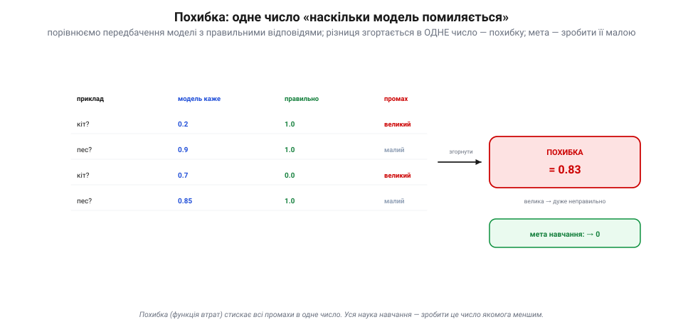
*Рис. 50.4.1. Похибка. Для кожного прикладу порівнюють, що сказала **модель**, із тим, що **правильно**, і бачать **промах**. Усі промахи згортають в одне число — **похибку** (функцію втрат). Велика похибка = модель дуже помиляється; нуль = ідеально. Уся наука навчання — зробити це число якомога **меншим**.*

Велика похибка — модель дурна; нульова — відповідає ідеально. Тож **мета навчання** стає кришталево чіткою: знайти такі ваги, за яких похибка **найменша**. Усе інше — лише техніка, як цю мету досягти. А техніка ця — геніально проста.

### Градієнтний спуск: котитися з гори похибки

Уяви похибку як **рельєф** над значеннями ваг: для кожного набору ваг — своя висота (похибка). Вийде горбкуватий ландшафт, і нам треба знайти його **найнижчу низину** — там ваги, що дають найменшу похибку. Як її дістатися, не бачачи всієї карти? **Котитися вниз.**

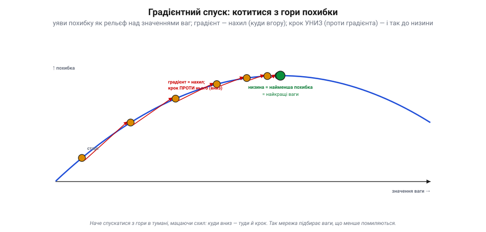
*Рис. 50.4.2. Градієнтний спуск. Похибка — це рельєф над значеннями ваг. У кожній точці **градієнт** показує, куди **вгору** (найкрутіший підйом). Тож робимо маленький крок **проти** градієнта — тобто **вниз**. І так крок за кроком скочуємося в **низину** — туди, де похибка найменша, а ваги найкращі. Наче спускаєшся з гори в тумані, мацаючи схил ногою.*

Інструмент — **градієнт**: це **нахил** рельєфу, він каже, у який бік похибка росте найдужче (куди «вгору»). Ми ж хочемо вниз — тож робимо маленький крок **проти** градієнта. Опинившись у новій, трохи нижчій точці, знову міряємо нахил і знову крокуємо вниз. І так багато разів — аж доки не скотимося в **низину**. Це і є **градієнтний спуск**: ніби спускаєшся з гори в густому тумані, не бачачи долини, а лише мацаючи ногою, **куди схил донизу**, — і йдеш туди. Жодної магії: на кожному кроці мережа трішки підправляє ваги так, щоб помилятися **трохи менше**.

### Темп навчання: який крок униз

Один параметр тут вирішує долю спуску — **розмір кроку**, або **темп навчання**.

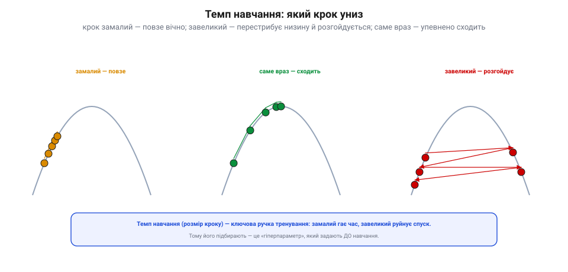
*Рис. 50.4.3. Темп навчання. **Замалий** крок — мережа повзе до низини нескінченно довго. **Завеликий** — перестрибує низину, відскакує на інший схил, розгойдується й може взагалі втекти геть (спуск розвалюється). **Саме враз** — упевнено сходить униз. Тому темп навчання підбирають заздалегідь — це «гіперпараметр», який задають **до** навчання.*

Крок **замалий** — спуск повзе вічно, навчання тягнеться без кінця. Крок **завеликий** — мережа **перестрибує** низину, відлітає на протилежний схил, починає розгойдуватися дедалі дужче й може зовсім **розвалити** спуск (похибка не падає, а росте). Крок **саме враз** — рівний, упевнений рух донизу. Темп навчання не вивчається сам — його **задають наперед** (такі наперед-задані ручки звуть **гіперпараметрами**), і вдалий вибір — половина мистецтва тренування.

### Цикл навчання й зворотне поширення

Складімо все в один **цикл**, який і крутиться весь час навчання.

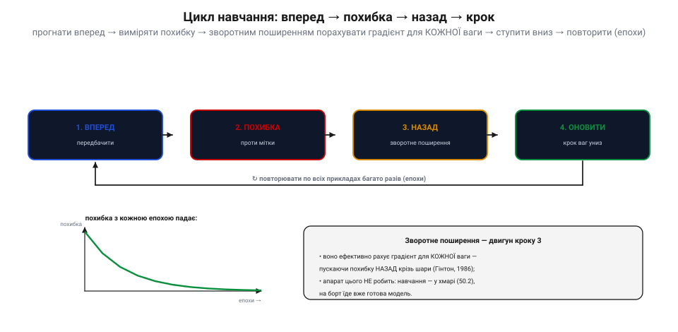
*Рис. 50.4.4. Цикл навчання. **1) Вперед**: прогнати приклад крізь мережу, дістати передбачення. **2) Похибка**: порівняти з правильною міткою. **3) Назад**: **зворотним поширенням** порахувати градієнт для кожної ваги, пускаючи похибку назад крізь шари (Гінтон, 1986). **4) Оновити**: ступити кожною вагою трохи вниз. І повторити по всіх прикладах багато разів («**епохи**») — похибка з кожною епохою падає, модель кращає. Апарат цього **не** робить: навчання — у хмарі (50.2).*

Кроки такі: **вперед** (прогнати приклад → передбачення) → **похибка** (порівняти з міткою) → **назад** (порахувати градієнт для кожної ваги) → **оновити** (ступити вагами вниз) → і знову, по всіх прикладах, багато **епох**. З кожним проходом похибка трохи спадає — крива втрат повзе донизу, модель розумнішає. А **двигун** третього кроку — славетне **зворотне поширення** (*backpropagation*): воно **ефективно** обчислює градієнт для **кожної** з мільйонів ваг, пускаючи похибку **назад** крізь шари (від виходу до входу). Саме його популяризація 1986-го (Гінтон та ін., історія розділу) зробила навчання глибоких мереж практичним. І ще раз: усе це коло крутиться **в хмарі** під час навчання (50.2); апарат лише возить готову модель.

> 📜 **Котитися з гори: Коші винаходить градієнтний спуск (1847).** Метод, яким сьогодні навчають **кожну** нейромережу планети, придумали не для штучного інтелекту, а для… **зірок** — і за сто сімдесят років до глибокого навчання. 1847 року великий французький математик **Огюстен-Луї Коші** бився над громіздкими обчисленнями в **астрономії**: щоб передбачати рух небесних тіл, доводилося розв'язувати велетенські системи рівнянь, а робити це напряму було пекельно довго. І Коші запропонував хитрий обхід: уявити задачу як **рельєф** і **спускатися ним за нахилом** — крок за кроком котитися туди, куди функція спадає найкрутіше, доки не дійдеш до низини (опубліковано в «Comptes Rendus» Паризької академії). Це і був **градієнтний спуск** — рівно та сама ідея, що в 50.4.2, лише застосована до орбіт, а не до ваг. Цілих півтора століття вона тихо служила інженерам і фізикам, аж доки нейромережі не зробили її **головним двигуном** усього машинного навчання. Коли твій майбутній детектор навчається в хмарі, він котиться з гори похибки рівно так, як Коші колись котився до розв'язку зоряних рівнянь.

> 🔧 **Навіщо це.** Тримай у голові, що «навчання» — це **не магія, а спуск**: виміряти похибку → порахувати нахил → ступити вагами вниз → повторити. Сам апарат цього **не робить** (лише вивід, 50.2) — це коло крутиться **в хмарі**, тому й потрібні гори **даних** (є на чому міряти похибку) і **обчислень** (багато кроків). Якщо чужа (чи твоя) модель «не вчиться» — підозрюй насамперед **темп навчання** (завеликий руйнує спуск, замалий — гає час) і **дані**, а не «поганий код». І пам'ятай: спуск може застрягти в **неглибокій** низині чи впертися в межі даних — тому модель буває недосконалою не через баг, а через сам **ландшафт** задачі (узагальнення — 50.6).

### Підсумок теми

«Навчитися» означає **зменшити похибку**. Спершу її **міряють** — згортають усі промахи моделі в одне число (функцію втрат). Тоді **мінімізують** градієнтним спуском: уявивши похибку як рельєф над вагами, на кожному кроці рахують **градієнт** (нахил) і ступають вагами **вниз**, проти нього, — і так скочуються в низину найменшої похибки. Розмір кроку — **темп навчання** — критичний: завеликий розхитує спуск, замалий його гальмує. Усе це крутиться циклом **вперед → похибка → назад → оновити** по багатьох епохах, а градієнт для кожної ваги ефективно рахує **зворотне поширення** (двигун, що оживив глибокі мережі, 1986). Апарат у цьому не бере участі — навчання живе в хмарі. А сам градієнтний спуск подарував світові Коші ще 1847-го, рахуючи зорі. Тепер у нас є всі цеглинки; складімо з них найважливішу для зору архітектуру — **згорткові мережі** (50.5).

## 50.5 Згорткові мережі (CNN) для зображень

Ми маємо нейрони й шари (50.3) і вміємо їх навчати (50.4). Здавалося б — бери та нацькуй мережу на зображення. Але «звичайна» (повноз'єднана) мережа на картинках **захлинається**. Рятунок виявився знайомим: занести **згортку** (49.3) всередину мережі — тільки тепер із **вивченими** ядрами. Так народилися **згорткові мережі** (*CNN*) — архітектура, на якій стоїть **кожен** сучасний зоровий детектор (49.7).

> 📜 Історія теми: [Ян Лекун і згорткова мережа, що читала поштові індекси (1989)](ch50-s5-history-lecun-cnn.md) — як CNN із наукової ідеї стала першою, що працювала в реальному світі.

### Чому звичайна мережа давиться зображенням

Згадаймо повноз'єднаний шар (50.3): **кожен** вхід тягне зв'язок до **кожного** нейрона. Для зображення це катастрофа.

*Рис. 50.5.1. Чому звичайна мережа давиться. **Вибух ваг**: кадр 200×200×3 — це 120 000 входів, і шар із 1000 нейронів дає вже **120 мільйонів** ваг (один шар — і не влазить). **Не ділить знання за позицією**: той самий кіт у лівому кутку й у правому — для повноз'єднаної мережі це **два різні** входи, тож вона мусить учити кожну позицію наново, марнуючи і ваги, і приклади.*

Дві біди. Перша — **вибух ваг**: кадр 200×200×3 — це 120 тисяч входів, і навіть один шар із тисячі нейронів дає **120 мільйонів** ваг; такого не вивчити й не вмістити. Друга, тонша — **немає спільного знання за позицією**: для повноз'єднаної мережі кіт у лівому кутку й кіт у правому — **геть різні** входи, тож вона мусить вивчати «кота» **окремо** для кожного місця кадру. Марнотратство і ваг, і прикладів. Потрібен інший підхід — і він уже був у нас у руках.

### Згортковий шар: одне навчене ядро ковзає всюди

Замість тягти зв'язок від кожного пікселя, візьмімо **маленьке ядро** (49.3) і **проведімо** ним по всьому кадру (згортка), шукаючи ознаку. Ті самі ваги ядра працюють **скрізь** — це і є **згортковий шар**.

*Рис. 50.5.2. Згортковий шар. Замість зв'язку від кожного пікселя — мале **ядро** ковзає кадром і будує **мапу ознак** (де ця ознака спалахує). Два виграші: **спільні ваги** — одне маленьке ядро на весь кадр, тож ваг мало (і не залежить від розміру кадру); **інваріантність до зсуву** — ту саму ознаку знаходимо будь-де. Ключове: ядро тут **вивчене** (градієнтним спуском, 50.4), а не рукотворне (Собель, 49.4).*

Звідси — два величезні виграші. **Спільні ваги** (*parameter sharing*): одне ядро 3×3 — це лиш дев'ять чисел замість зв'язку до кожного пікселя, тож ваг **мізерно мало** (і байдуже, наскільки великий кадр). **Інваріантність до зсуву**: оскільки ядро ковзає всюди, ознаку воно знайде **в будь-якому** кутку — кіт зліва чи справа спрацює однаково. І найголовніше: на відміну від Собеля (49.4), це ядро **ніхто не малював руками** — мережа **сама вивчає** його ваги градієнтним спуском (50.4), винаходячи, які ознаки шукати. Багато ядер у шарі → багато **мап ознак**.

### Пулінг: стиснути мапу й стерпіти зсув

Між згортковими шарами мапу зазвичай **зменшують** — це **пулінг** (підвибірка). Найпоширеніший — **макс-пулінг**: у кожному маленькому віконці (скажімо, 2×2) лишають **максимум**.

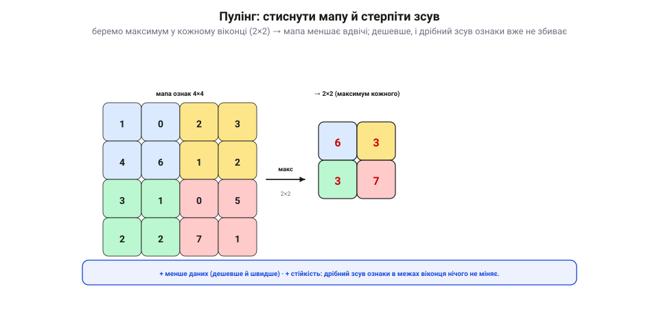
*Рис. 50.5.3. Пулінг. Мапу ознак ріжуть на віконця 2×2 й беруть **максимум** кожного — мапа 4×4 стискається в 2×2. Два зиски: **менше даних** (дешевше й швидше далі рахувати) і **стійкість до дрібного зсуву** — якщо ознака трохи зсунулась у межах віконця, максимум той самий, тож мережа цього й не помітить.*

Пулінг дає два зиски. **Менше даних** — мапа меншає, отже, наступні шари рахувати дешевше. І **стійкість до дрібного зсуву** — якщо ознака трохи посунулась у межах віконця, її максимум не змінився, тож мережа не здригнеться. Це, по суті, та сама терпимість до позиції, що й у згортки, лише на іншому рівні (а корінням — у «складних клітинах» зорової кори, 49.7).

### Стос CNN: від країв до об'єктів

Тепер складімо все докупи. **Згортка → активація (ReLU) → пулінг** — і так **багато разів**; наприкінці — кілька повноз'єднаних шарів, що з ознак роблять відповідь.

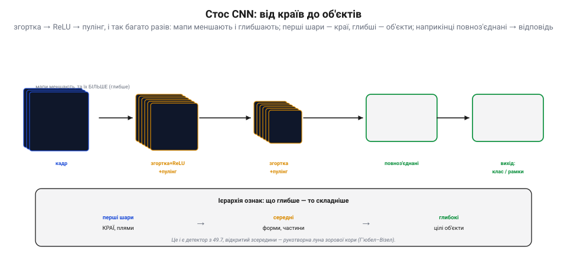
*Рис. 50.5.4. Стос CNN. Кадр проходить повторювані ланки «згортка + ReLU + пулінг»: мапи **меншають**, але їх стає **більше** (глибше). Наприкінці **повноз'єднані** шари перетворюють ознаки на відповідь (клас чи рамки). А головне — **ієрархія**: перші шари ловлять **краї** й плями, середні складають із них **форми й частини**, глибокі — **цілі об'єкти**. Це і є детектор з 49.7, відкритий зсередини, — рукотворна луна зорової кори (Г'юбел–Візел).*

З кожною ланкою мапи стають **меншими**, зате **глибшими** (більше ознак). І виникає те, заради чого все затівалося, — **ієрархія ознак**: перші шари ловлять прості **краї** (точнісінько Собель, але вивчений), середні складають із країв **форми й частини**, а глибокі — **цілі об'єкти**. Це достоту простими→складними клітини зорової кори (Г'юбел і Візел, 49.7), тільки рукотворні й навчені. Наприкінці повноз'єднані шари дивляться на знайдені об'єкти-ознаки й видають відповідь. Ось вона, «чорна скриня» детектора з 49.7, розкрита: стос вивчених згорток і пулінгів, що сходить від країв до сенсу.

> 📜 **Неокогнітрон: Фукусіма будує зорову кору із S- і C-клітин (1980).** Архітектуру CNN — згортки плюс пулінг плюс ієрархія — придумали не для комп'ютерів, а **списавши з мозку**, ще до того, як її навчилися тренувати. 1980 року японський інженер **Куніхіко Фукусіма** взяв відкриття Г'юбела й Візела (прості й складні клітини зорової кори, 49.7) і втілив їх у багатошаровій мережі — **неокогнітроні**. Він поклав у неї два роди клітин навперемін: **S-клітини** (від *simple*) — детектори ознак на кшталт країв у певному місці (рівно те, що робить згортка) і **C-клітини** (від *complex*) — що відгукуються на ознаку **незалежно** від точного положення (рівно те, що робить пулінг). Складені шарами, вони ловили прості ознаки внизу й цілі образи вгорі — і впізнавали візерунки **попри зсув** у кадрі. Це й була перша **згорткова мережа** за духом — прямий предок усього, чим бачить твій дрон. Фукусімі бракувало лише способу її **зручно навчати**; цей останній шматок — і реальне застосування — додасть за дев'ять років Ян Лекун (історія до цієї теми). Та кістяк сучасного машинного зору виклав саме неокогнітрон, змайстрований за лекалами котячої зорової кори.

> 🔧 **Навіщо це.** Затям головне: **кожен** сучасний зоровий детектор на дроні (49.7) — це **CNN**, тобто вивчена, навчена версія тієї згортки, що ми робили руками в 49.3. Її сила — зі **спільних ваг** (мало параметрів попри величезні кадри) і **пулінгу** (дешевизна + стійкість до зсуву), а «розум» — з **ієрархії** (краї → об'єкти). На апарат ти ставиш **готову, наперед навчену** CNN (вивід, 50.2) і береш **компактну** архітектуру (як-от MobileNet), щоб улізти в бортовий чип (50.7). І коли наступного разу детектор «не бачить» цілі — згадай, що всередині не магія, а стос навчених фільтрів «край → форма → об'єкт», обмежений тим, на чому його тренували.

### Підсумок теми

Повноз'єднані мережі **давляться** зображеннями: вибух ваг і жодного спільного знання між позиціями. Рятунок — **згортковий шар**: мале **вивчене** ядро (49.3) ковзає кадром зі **спільними вагами** (мало параметрів) і **інваріантністю до зсуву** (ознака знаходиться будь-де), даючи **мапи ознак**. **Пулінг** стискає мапи й додає стійкості до дрібного зсуву. Складені в стос (згортка → ReLU → пулінг, багато разів, тоді повноз'єднані), вони утворюють **ієрархію** — від країв до об'єктів — і це є **CNN**, архітектура кожного сучасного детектора (49.7), навчена/тренована рідня ручної згортки. А кістяк цей виклав ще 1980-го неокогнітрон Фукусіми, списаний із зорової кори. Як же цю архітектуру навчили **по-справжньому** працювати — у наступній історії (Лекун, 1989). А далі — найважче в практиці ML: **дані, перенавчання й узагальнення** (50.6).

## 50.6 Дані, перенавчання, узагальнення (train/val/test)

Навчити модель (50.4) — це півсправи. Справжня мета не в тому, щоб вона добре відповідала на **бачені** приклади, а щоб працювала на **нових**, яких ніколи не бачила. Це й зветься **узагальнення**. І тут чигає головна пастка всього машинного навчання — **перенавчання**: коли модель замість того, щоб **зрозуміти** закономірність, просто **зазубрює** приклади. Ця тема — про те, як цього уникнути й чесно перевірити, чи модель справді чогось навчилась.

### Узагальнення проти зубріння

Уяви, що модель припасовують до точок-прикладів. Зробити це можна по-різному — і не всяк добре.

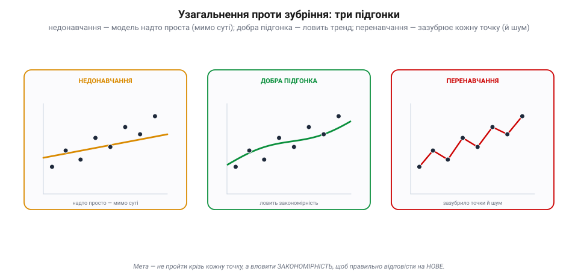
*Рис. 50.6.1. Три підгонки. **Недонавчання**: модель надто проста (пряма крізь криві дані) — проходить мимо суті. **Добра підгонка**: плавна крива ловить **закономірність**. **Перенавчання**: звивиста крива продирається крізь **кожну** точку, повторюючи навіть випадковий шум, — на тренувальних даних ідеально, а на нових схибить. Мета — не пройти крізь кожну точку, а вловити закономірність, щоб відповісти на **нове**.*

Між двох бід — золота середина. **Недонавчання** (*underfitting*): модель **надто проста** чи недовчена, не схопила навіть основного тренду — погана і на бачених, і на нових даних. **Перенавчання** (*overfitting*): модель **надто гнучка** й вивчила приклади **напам'ять**, разом із їхнім випадковим шумом, — блискуча на тренувальних даних, та безпорадна на нових. А посередині — **добра підгонка**, що вловила саму **закономірність** і тому правильно відповідає й на небачене. Саме її ми й шукаємо.

### Зубрить чи розуміє: симптом перенавчання

Як розпізнати перенавчання? За характерним **симптомом**. Згадай учня, що перед іспитом **завчив** відповіді на питання минулих років.

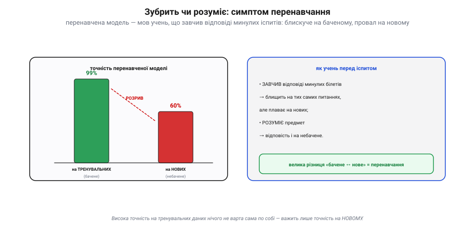
*Рис. 50.6.2. Зубрити чи розуміти. Перенавчена модель показує **99%** на тренувальних (бачених) прикладах — і провалюється до **60%** на нових. Цей **розрив** і є симптом. Достоту як учень: хто **завчив** білети — блищить на тих самих питаннях, але плаває на нових; хто **зрозумів** предмет — відповість і на небачене. Висока точність на бачених даних сама по собі нічого не варта — важить лише точність на НОВОМУ.*

Такий учень **блищить** на знайомих питаннях, але плаває на нових — він **завчив**, а не **зрозумів**. Так само й перенавчена модель: **99%** на тренувальних даних і жалюгідні **60%** на нових. Цей **розрив** між «баченим» і «небаченим» — головний сигнал перенавчання. Звідси найважливіша думка теми: **висока точність на тренувальних даних нічого не варта сама по собі**; важить лише точність на тому, чого модель не бачила. А щоб її виміряти, треба правильно поділити дані.

### Як чесно виміряти: тренувальний / валідаційний / тестовий

Щоб чесно оцінити узагальнення, дані ділять на **три** частини, кожна зі своєю роллю.

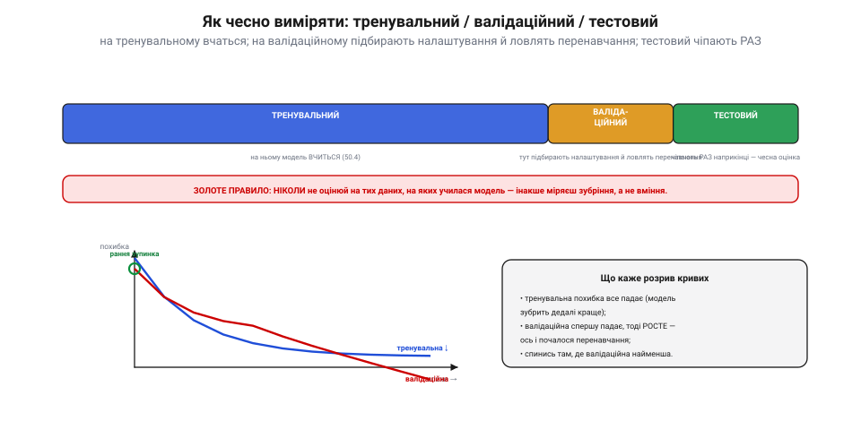
*Рис. 50.6.3. Три набори. **Тренувальний** (більшість): на ньому модель **вчиться** (50.4). **Валідаційний**: на ньому **підбирають налаштування** (архітектуру, темп навчання) і **ловлять перенавчання** під час розробки. **Тестовий**: його чіпають **раз** наприкінці — для чесної оцінки. **Золоте правило**: ніколи не оцінюй на тих даних, на яких училася модель. Унизу — криві похибки: тренувальна все падає, а валідаційна спершу падає, тоді **росте** (почалося перенавчання) — спинись на її мінімумі (рання зупинка).*

**Тренувальний** набір — на ньому модель **вчиться** (підбирає ваги, 50.4). **Валідаційний** — на ньому **під час розробки** перевіряють, як модель тримається на небаченому, **підбирають налаштування** (гіперпараметри, 50.4) і **ловлять** початок перенавчання. **Тестовий** — недоторканний резерв, який чіпають **один-єдиний раз** наприкінці, щоб дістати **чесну** оцінку справжньої якості. І **золоте правило**, яке порушувати не можна: **ніколи** не оцінюй модель на даних, на яких вона вчилася, — бо так ти виміряєш **зубріння**, а не вміння. Якщо стежити за похибкою: тренувальна весь час падає (модель усе краще «зубрить»), а **валідаційна** спершу падає, а тоді **починає рости** — ось і момент перенавчання; розумно **спинити** навчання саме на її мінімумі (це й зветься **рання зупинка**).

### Ліки й головне правило: дані — цар

Якщо перенавчання таки настало, є перевірені **ліки** — і одне правило, важливіше за всі.

*Рис. 50.6.4. Ліки й головне правило. Проти перенавчання: **більше даних** (найсильніші ліки), **простіша модель** (менше що зубрити), **dropout/регуляризація** (глушити зайву складність), **аугментація** (з одного кадру роблять багато — відбити, обрізати, підсвітити), **рання зупинка**. А над усім — **дані-цар**: представницькі, **різноманітні** приклади важать понад усе (50.1). Для дрона — знімай і вдень, і вночі, і в різних місцях.*

Найсильніші ліки — **більше даних**: що більше різних прикладів, то важче їх зазубрити й то більше мережа змушена **узагальнювати**. Далі — **простіша модель** (менше параметрів — менше що запам'ятовувати напам'ять), **регуляризація** й **dropout** (під час навчання випадково «вимикають» частину нейронів, змушуючи мережу не покладатися на зубріння), **аугментація** (з одного знімка штучно роблять багато — віддзеркалюють, обрізають, міняють яскравість, 49.2 — і так дешево розширюють набір), і вже знайома **рання зупинка**. Та над усіма ліками — **головне правило, з якого ми почали (50.1): дані — цар**. Представницькі, **різноманітні** приклади важать більше за будь-яку хитру архітектуру. Для дрона це означає: збирай дані **в усіх** умовах, де модель працюватиме, — і вдень, і вночі, і в різних місцях, — інакше вона «знатиме» лише твою лабораторію.

> 📜 **Розумний Ганс: кінь, що «вмів рахувати», а насправді читав підказки (1907).** Найкращу пересторогу про перенавчання дав не комп'ютер, а **кінь**. На початку XX століття вся Німеччина дивувалася жеребцеві на прізвисько **Розумний Ганс** (*Kluger Hans*): його господар, учитель **Вільгельм фон Остен**, ставив коневі задачі — додати числа, назвати дату, — і Ганс **вистукував** копитом правильну відповідь. Здавалося, тварина опанувала арифметику. Та психолог **Оскар Пфунгст** 1907 року розкрив фокус: Ганс **не рахував** — він читав **мимовільні** рухи тіла того, хто питав. Коли копито наближалося до правильного числа, людина несвідомо ледь напружувалась, нахилялася чи затримувала подих — і кінь, помітивши це, спинявся. Варто було поставити запитання так, щоб **сам питач не знав** відповіді (або щоб Ганс його не бачив), — і «геній» розсипався: кінь угадував навмання. Ганс блискуче «склав іспит», не вміючи рахувати, — бо вхопився за **підказку**, а не за суть. Це і є **перенавчання** в чистому вигляді, і в машинному навчанні цей «**ефект Розумного Ганса**» згадують щодня: модель «впізнає вовка», бо на всіх навчальних фото з вовками був **сніг**; «бачить танк», бо ті знімки були **темніші**; працює в лабораторії, бо вивчила **твоє тло**, а не ціль. Щойно зміниться обстановка — і, як той кінь без підказки, вона осоромиться.

> 🔧 **Навіщо це.** Завжди пам'ятай: мета — **узагальнення**, а не точність на тренуванні. **Тримай окремо** валідаційний і тестовий набори й **ніколи** не оцінюй модель на тому, на чому вона вчилася (інакше міряєш зубріння). Стеж за **розривом** тренувальної й валідаційної похибок — росте розрив, отже, перенавчання; застосуй ранню зупинку. І бійся **Розумного Ганса**: твій детектор, що «працює» в лабораторії, може чіплятися за **спадкову підказку** (тло, водяний знак, освітлення), а не за ціль, — тож **перевіряй його в реальних, різних умовах**, а не лише там, де знімав дані. Найдешевші й найдієвіші ліки — **більше різноманітних даних** (50.1) та **аугментація**; за ними — простіша модель і dropout.

### Підсумок теми

Мета навчання — не вгадувати **бачені** приклади, а **узагальнювати** на нові. Головна загроза — **перенавчання**: модель зазубрює дані (й шум) замість закономірності, і її викриває **розрив** між високою точністю на тренувальних даних і низькою на небачених (а протилежна біда — **недонавчання**, надто проста модель). Щоб чесно міряти, дані ділять на **тренувальний / валідаційний / тестовий**, і діє золоте правило: ніколи не оцінюй на тренувальних даних; стеж за валідаційною похибкою й роби **ранню зупинку**. Лікують перенавчання **більшою кількістю різноманітних даних** (найсильніше — бо «дані-цар», 50.1), **аугментацією**, **простішою моделлю**, **dropout** і ранньою зупинкою. А класичну пересторогу — модель, що «склала іспит» за спадковою підказкою, — нам ще 1907-го подарував кінь Розумний Ганс. Тепер, коли модель навчена й перевірена, лишилось **запхати** її в крихітний бортовий чип — **TinyML і квантування** (50.7).

## 50.7 Запуск моделі на пристрої: TinyML і квантування

Маємо навчену й перевірену модель (50.1–50.6). Та між нею й бортовим чипом апарата — **прірва**. Сучасна нейромережа — це мільйони ваг і мільйони множень на кадр; а мікроконтролер має кілобайти пам'яті й мілівати потужності (49.9). Щоб машинне навчання поїхало **на борту**, модель треба **стиснути**. Цим і займається **TinyML** — машинне навчання на крихітних пристроях, — а його головний прийом зветься **квантування**.

### Прірва: велика модель, крихітний пристрій

Спершу — масштаб біди. З одного боку — навчена модель: мільйони параметрів, десятки мегабайтів ваг, важкий вивід. З іншого — мікроконтролер: кілобайти RAM, мегагерци, мілівати, та ще й часто без апаратної підтримки дробових обчислень.

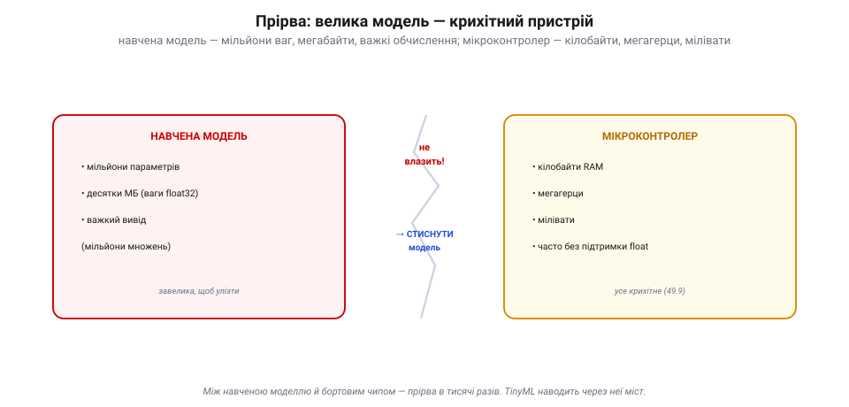
*Рис. 50.7.1. Прірва. Ліворуч — **навчена модель**: мільйони параметрів, десятки МБ (ваги у форматі float32), важкий вивід. Праворуч — **мікроконтролер**: кілобайти RAM, мегагерци, мілівати, часто без апаратної підтримки дробових чисел (49.9). Між ними — прірва у тисячі разів. Модель просто **не влізе**, тож її треба **стиснути**. Це й робить TinyML.*

Прірва — у **тисячі разів**. Просто взяти й залити модель на чип не вийде: не вистачить ні пам'яті, ні швидкості, ні енергії. Та виявляється, цю прірву можна перекрити — бо модель майже завжди **надлишкова**, і її реально вщент ужати, майже не втративши якості.

### Квантування: 32-бітні ваги → 8-бітні

Найдієвіший і найпростіший прийом — **квантування**. Ваги модель зазвичай зберігає як **32-бітні** дробові числа (float32, по 4 байти кожне). Та така точність **не потрібна**: округлимо кожну вагу до одного з **256 рівнів** і збережемо її **8 бітами** (1 байт).

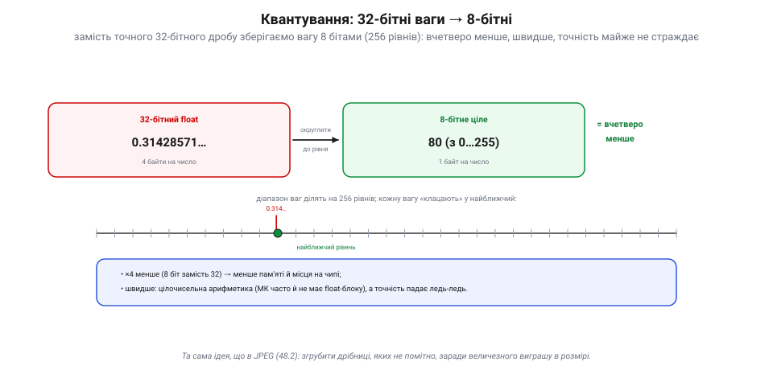
*Рис. 50.7.2. Квантування. Точне 32-бітне число (0.31428…, 4 байти) **округлюють** до найближчого з 256 рівнів і зберігають **8 бітами** (1 байт). Діапазон ваг ділять на 256 поділок, і кожну вагу «клацають» у найближчу. Виграш: **вчетверо менше** пам'яті, **швидше** (цілочисельна арифметика, яку МК любить, а підтримки float у залізі часто нема), а точність падає **ледь-ледь**. Та сама ідея, що в JPEG (48.2).*

Виграш величезний: **вчетверо менше** пам'яті (8 біт замість 32), і ще й **швидше** — бо цілочисельна арифметика дешевша за дробову, а простенький мікроконтролер часто **взагалі не має** апаратної підтримки float-чисел. А коштує це сущі дрібниці точності: округлення ваг до 256 рівнів модель майже не помічає. Упізнаєш ідею? Це достоту те, що робив JPEG (48.2): **згрубити** дрібниці, яких усе одно не видно, заради грубезного виграшу в розмірі. Квантування — найдешевший спосіб ужати модель у рази.

### Скриня прийомів стиснення

Квантування — не єдиний прийом; зазвичай їх **складають** разом.

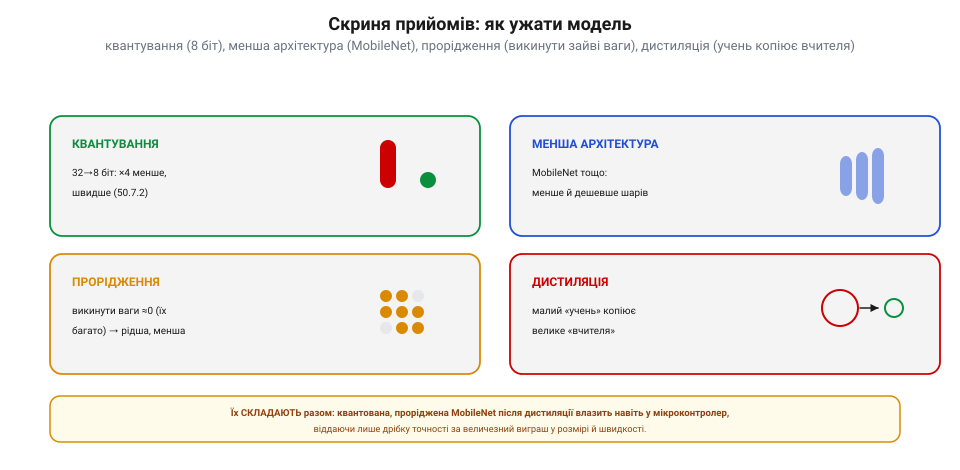
*Рис. 50.7.3. Скриня прийомів. **Квантування** — 32→8 біт, ×4 менше. **Менша архітектура** — мережі на кшталт MobileNet, навмисно складені з небагатьох дешевих шарів. **Прорідження** (pruning) — викинути ваги, близькі до нуля (а їх багато), зробивши мережу рідшою й меншою. **Дистиляція** — натренувати малого «учня» **копіювати** великого «вчителя», діставши майже ту саму точність у дрібці розміру. Прийоми складають разом.*

Окрім квантування є ще три. **Менша архітектура**: можна від початку взяти мережу, навмисне зроблену компактною (як **MobileNet**) — з небагатьох дешевих шарів. **Прорідження** (*pruning*): у навченій мережі багато ваг майже **нульові** — їх викидають, роблячи мережу рідшою й меншою, майже без втрат. **Дистиляція** (*knowledge distillation*): велику точну мережу-**вчителя** використовують, щоб навчити маленьку мережу-**учня** копіювати її відповіді — і учень виходить майже такий розумний, як учитель, але в рази менший. Складені разом — квантована, проріджена MobileNet — вони вщухають велику модель до розмірів, що влазять навіть у мікроконтролер.

### Конвеєр TinyML: від хмари до мікроконтролера

Як це робиться на практиці? Тренують **звичайно** (у хмарі, повна точність — 50.2), а тоді модель **конвертують** і **квантують** під пристрій спеціальним інструментом, і вже стиснуту розгортають на чип.

*Рис. 50.7.4. Конвеєр TinyML. **Хмара**: навчити модель як завжди (float32, 50.2). **Конвертувати + квантувати**: спеціальний інструмент (як-от TFLite Micro чи ONNX) перетворює й стискає її під пристрій. **МК / edge**: крихітну модель розгортають на чип, де вона робить вивід за **мілівати**. Уже сьогодні так на найдрібніших чипах бігають розпізнавання слова-команди («прокинься»), жестів і прості детектори — без хмари й мережі.*

Інструмент (наприклад, **TFLite Micro** чи **ONNX**) бере натреновану модель, квантує її й пакує у формат, що влізе на чип. На виході — крихітна модель, що робить вивід прямо на мікроконтролері за **мілівати**, без жодної хмари й мережі. Так уже сьогодні на найдрібніших чипах працюють розпізнавання слова-команди (те саме «прокинься» в навушниках, що слухає **завжди**, бо їсть копійки енергії), розпізнавання жестів, прості детектори «є людина / нема». Машинне навчання дісталося навіть туди, де лише кілобайти й батарейка-таблетка.

> 📜 **Квантувати — означає округлити до рівнів: Алек Рівз і PCM (1937).** Ідея квантування — замінити точне неперервне число кількома **дискретними рівнями** — старша за комп'ютери, і народилася вона в телефонії. 1937 року британський інженер **Алек Рівз**, працюючи в паризькій лабораторії ITT, придумав **імпульсно-кодову модуляцію** (PCM): щоб передати звук **цифрою**, він пропонував замірювати його гучність багато разів за секунду й кожен замір **округлювати** до найближчого з обмеженого набору рівнів, записуючи номер рівня двійковим числом. Це і є **квантування** в чистому вигляді — рівно те, що ми робимо з вагами, округлюючи їх до 256 рівнів (50.7.2). Та Рівз настільки випередив час, що мусив свій винахід **закинути**: лампова техніка 1930-х просто не тягла такого, і PCM довелося чекати на транзистор. Дочекавшись, вона стала основою **всього** цифрового звуку — телефонії, компакт-дисків, а вперше засяяла у Другу світову, у секретній системі зв'язку SIGSALY. Тож коли твій бортовий чип «клацає» ваги по рівнях, щоб улізти в пам'ять, він повторює думку, яку Рівз накидав за вісімдесят років до того, цифруючи людський голос. І знову, як із нейромережами, гарна ідея просто **чекала** на залізо, що її потягне.

> 🔧 **Навіщо це.** Щоб модель поїхала на борт (мало енергії, мало ваги — 49.9), її треба **стиснути**, і перший прийом — **квантування** (8 біт): майже задарма дає ×4 за розміром і помітно за швидкістю, та ще й дружить із цілочисельними МК. Бери **компактну архітектуру** (MobileNet), за потреби **прорідь** і **дистилюй**. Робочий порядок такий: натренуй повноточну модель **у хмарі** (50.2), тоді **сконвертуй і квантуй** інструментом (TFLite Micro тощо) і розгорни вже стиснуту. Готуйся віддати **дрібку точності** за великий виграш у розмірі, швидкості й споживанні — і **зміряй це на самому пристрої** (кадри/с, пам'ять, ват), а не на папері. TinyML дає змогу запустити просте розпізнавання навіть на чипі за копійки — але важке бачення все одно проситиме потужнішого заліза (50.8).

### Підсумок теми

Навчена модель завелика для крихітного чипа, тож **TinyML** її стискає, щоб вона працювала на мікроконтролерах за мілівати. Головний прийом — **квантування**: ваги з 32-бітних дробів роблять **8-бітними** цілими (256 рівнів) — вчетверо менше, швидше, дружньо до МК, а точність падає ледь-ледь (та сама ідея, що в JPEG, 48.2). До нього додають **меншу архітектуру** (MobileNet), **прорідження** (викинути ваги ≈0) і **дистиляцію** (малий учень копіює великого вчителя). Конвеєр простий: натренувати повноточно в хмарі → сконвертувати й квантувати інструментом (TFLite Micro) → розгорнути крихітну модель на пристрої. А саме квантування — це думка Алека Рівза з 1937-го (PCM: округлити неперервне до дискретних рівнів), що теж колись чекала на залізо. Тепер, коли модель і стиснута, і готова, лишилось вирішити останнє: **де саме** її рахувати — на МК, бортовому комп'ютері чи в хмарі (50.8).

## 50.8 Де рахувати: МК vs бортовий комп'ютер vs хмара

Модель навчено (50.1–50.6) і стиснуто (50.7). Останнє рішення — **де** її запускати. Місць три: на самому **польотному контролері** (МК), на **бортовому комп'ютері** (супутнику) або в **хмарі** (на віддаленому сервері через мережу). Вибір — це компроміс між **потужністю**, **затримкою** й **автономністю**, і саме він зводить докупи всі нитки модуля (49.9, 48.5, 48.6, 50.2, 50.7).

### Три місця для обчислень

Розгляньмо ці три рівні — від найближчого до апарата до найдальшого.

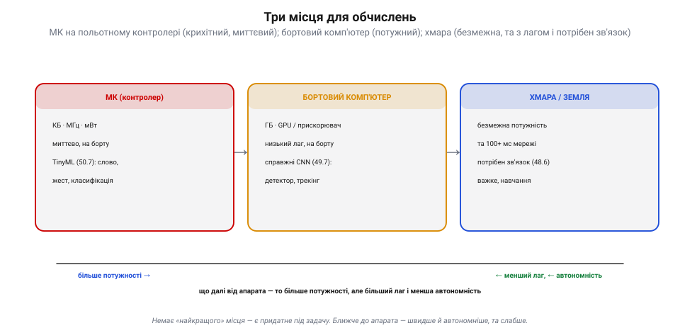
*Рис. 50.8.1. Три місця. **МК** (польотний контролер): кілобайти, мілівати, миттєво й автономно — тягне лише TinyML (50.7). **Бортовий комп'ютер** (Pi/Jetson на борту): гігабайти, GPU, низький лаг — справжні CNN (49.7). **Хмара/земля**: безмежна потужність, та 100+ мс мережі й потрібен зв'язок (48.6). Що далі від апарата — то більше потужності, але більший лаг і менша автономність.*

**МК** (сам польотний контролер) — найближче: кілобайти, мілівати, рахує **миттєво** й завжди доступний, але тягне лише найдрібніше (TinyML, 50.7) — слово-команду, жест, просту класифікацію. **Бортовий комп'ютер** (супутник — Raspberry Pi чи Jetson на борту) — потужніший: гігабайти, GPU чи прискорювач, низький лаг (усе **на борту**, без мережі) — це робоча конячка серйозного зору (детектор, трекінг, 49.7). **Хмара** (потужний віддалений сервер через радіо/мережу) — найпотужніша, фактично **безмежна**, та платить за це мережевою **затримкою** (сотні мс і непередбачувано) і **залежністю від зв'язку** (нема сигналу — нема обчислень, 48.6). Закономірність ясна: що далі від апарата, то більше сили, але й більший лаг і менша автономність.

### Що з чим торгуємо

Звідси — таблиця компромісів, за якою й вибирають.

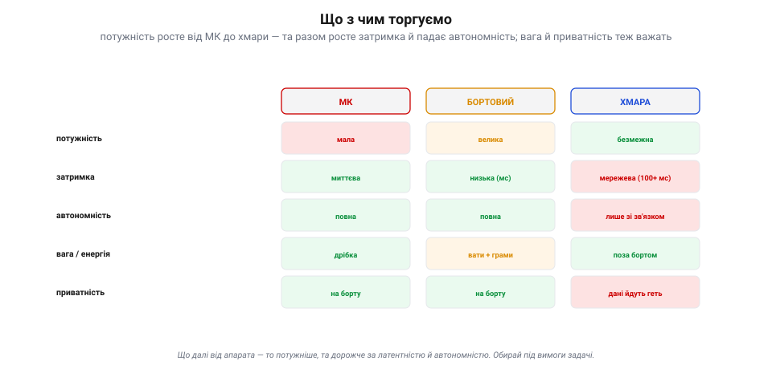
*Рис. 50.8.2. Що з чим торгуємо. **Потужність** росте від МК до хмари (мала → велика → безмежна). Та разом росте **затримка** (миттєва → мс → мережева 100+ мс) і падає **автономність** (повна → повна → лише зі зв'язком). Додай **вагу/енергію** (МК — дрібка; бортовий — вати й грами, 49.9; хмара — поза бортом) і **приватність** (на борту дані лишаються; у хмару — йдуть геть). Обирай під вимоги задачі.*

Осі компромісу такі. **Потужність**: МК < бортовий < хмара. **Затримка**: МК миттєво, бортовий — мілісекунди, хмара — десятки-сотні мс мережі (і нестабільно). **Автономність**: МК і бортовий працюють **будь-де**; хмара — лише доки є зв'язок. **Вага й енергія**: МК — дрібка, бортовий комп'ютер коштує **ват і грамів** (а отже, часу польоту, 49.9), хмара — поза бортом (та радіоканал теж їсть енергію). **Приватність**: на борту дані лишаються вдома, у хмару — відлітають геть. Усього одразу не виграти — кожну задачу ставлять туди, де її вимоги збігаються з можливостями рівня.

### Золоте правило розподілу

Попри п'ять осей, головне рішення зводиться до **одного** питання: **чи критична задача за часом?**

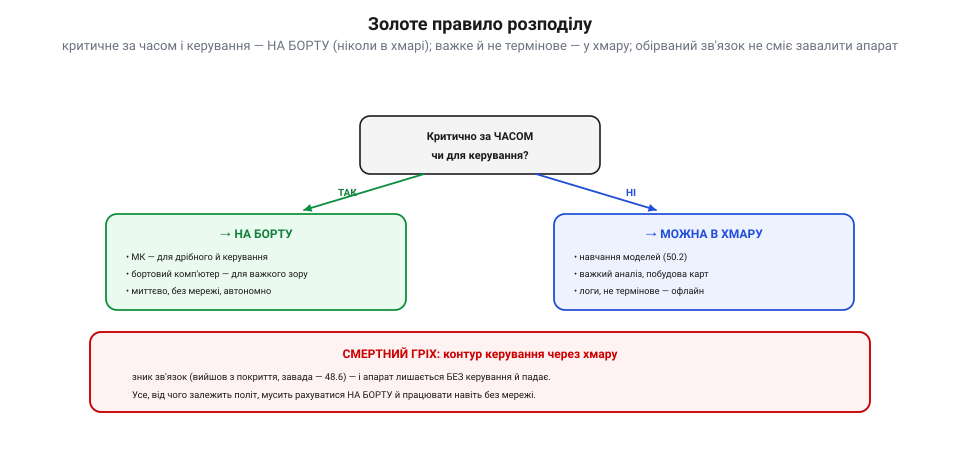
*Рис. 50.8.3. Золоте правило. Питання одне: **критично за часом чи для керування?** Якщо **так** — рахуй **на борту** (МК для дрібного й керування, бортовий комп'ютер для важкого зору): миттєво, без мережі, автономно. Якщо **ні** — можна в **хмару** (навчання моделей, важкий аналіз, карти — офлайн). **Смертний гріх**: пускати контур керування через хмару — зник зв'язок (48.6), і апарат лишається без керування й падає.*

Якщо **так** (керування, реальний час) — рахуй **на борту**: дрібне й керування на МК, важкий зір на бортовому комп'ютері. Тут усе **миттєво**, автономно, без оглядки на мережу. Якщо **ні** (важке, не термінове) — сміливо віддавай у **хмару**: навчання моделей (50.2), важкий аналіз, побудова карт, логи. А **смертний гріх** — пускати **контур керування** через хмару: щойно зникне зв'язок (вийшов з покриття, завада — 48.6), апарат залишиться **без керування** й розіб'ється. Запам'ятай назавжди: **усе, від чого залежить політ, мусить рахуватися на борту й працювати навіть без мережі.**

### Гібрид на практиці

Тому реальний апарат майже завжди **гібридний** — він розкладає задачі по всіх трьох рівнях.

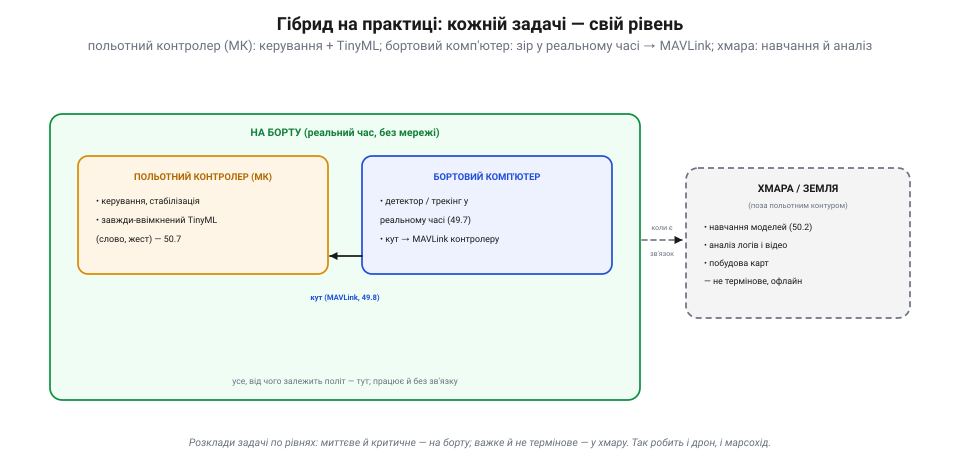
*Рис. 50.8.4. Гібрид на практиці. **На борту** (реальний час, без мережі): **польотний контролер** (МК) веде керування й завжди-ввімкнений TinyML (слово, жест, 50.7), а **бортовий комп'ютер** робить детектор/трекінг у реальному часі й шле кут по MAVLink контролеру (49.8). **Хмара/земля** (поза польотним контуром, лише коли є зв'язок): навчання моделей (50.2), аналіз логів і відео, побудова карт — усе не термінове, офлайн.*

Розподіл звичайно такий. **Польотний контролер** (МК) — керування, стабілізація й завжди-ввімкнений TinyML (наприклад, реакція на голосову команду чи жест). **Бортовий комп'ютер** — зір у реальному часі: детектор і трекінг (49.7), що віддає **кут** цілі по MAVLink назад у контролер (49.8). І те, й те — **на борту**, у польотному контурі, працює без мережі. А **хмара чи земля** стоять **поза** польотним контуром: туди, коли є зв'язок, скидають важке й не термінове — навчають моделі (50.2), аналізують логи й відео, будують карти. Кожна задача — на своєму рівні: миттєве й критичне внизу, потужне й офлайнове нагорі.

> 📜 **Чому марсохід думає сам: швидкість світла забороняє пульт.** Найпереконливіший доказ золотого правила дала не земна техніка, а **Марс**. Уяви: інженер на Землі хоче кермувати марсоходом джойстиком. Та сигнал від Землі до Марса йде **від 3 до 22 хвилин** (туди-назад — близько **25**), бо такою є відстань навіть для світла. Поки картинка «попереду яма» долетить до Землі, а команда «гальмуй» долетить назад, мине пів години — і марсохід давно вже **в ямі**. Керувати ним у реальному часі **фізично неможливо**. Тому марсоходи (Curiosity, Perseverance) **думають самі**: із Землі їм надсилають лише **план** на день — куди їхати, — а **рішення на ходу** вони ухвалюють **на борту**. Їхня система автономної навігації (AutoNav) знімає місцевість стереокамерами, будує тривимірну карту, сама бачить небезпеки (камені, схили, пухкий пісок) і прокладає **безпечний** шлях — Perseverance так долає до 200 метрів за день **без жодної команди** з Землі. Це і є наше золоте правило, лише в космічному масштабі: **критичне за часом не можна виносити «в хмару»** — затримка вб'є. Те, що для марсохода диктує швидкість світла, для твого дрона диктує надійність радіоканалу: контур, від якого залежить апарат, мусить замикатися **на борту**. Марс просто робить цей урок неспростовним.

> 🔧 **Навіщо це.** Розподіляй задачі за **одним** питанням: критично за часом — на борт, ні — можна в хмару. **Керування й реальний час** тримай **на борту** (МК для дрібного й польоту, бортовий комп'ютер для важкого зору) і **ніколи** не замикай політний контур через мережу — обірвався зв'язок, і апарат падає (48.6). **Важке й не термінове** (навчання — 50.2, аналіз, карти) спокійно віддавай у хмару чи на землю. Зважуй ціну бортового комп'ютера — **вати й грами** коротшають політ (49.9), — і пам'ятай про **приватність** (у хмару дані відлітають). За умовчанням бери **гібрид**: МК плюс бортовий комп'ютер для всього термінового, хмара — лише для офлайнового. І перевіряй найгірший випадок: **що буде, коли зникне зв'язок?** — правильна відповідь має бути «апарат і далі літає».

### Підсумок теми

Запускати модель можна у трьох місцях: **МК** (крихітний, миттєвий, автономний — TinyML), **бортовий комп'ютер** (потужний, низьколатентний, на борту — справжні CNN) і **хмара** (безмежна, та з мережевим лагом і залежна від зв'язку). Компроміс незмінний: що далі від апарата, то більше потужності, але більша затримка й менша автономність — плюс ціна у вазі/енергії та приватності. **Золоте правило**: критичне за часом і керування — **на борту** (ніколи в хмарі: обірваний зв'язок не сміє завалити апарат), важке й не термінове — у хмару. На практиці апарат **гібридний**: контролер веде політ і TinyML, бортовий комп'ютер — зір у реальному часі (кут по MAVLink), а хмара навчає й аналізує поза польотним контуром. Неспростовний доказ цього правила — марсохід, що змушений думати сам, бо світло від Землі йде надто довго. Лишилася остання тема модуля — чесний погляд на **межі, етику й практичні кроки** (50.9).

## 50.9 Куди далі: межі, етика, практичні кроки

Ми пройшли довгий шлях — від світла на сенсорі (47) до навченої моделі, що бачить, розуміє й діє на апараті (50). Та інженер вирізняється не лише вмінням **будувати**, а й чесністю про те, **чого** його інструмент не може, відповідальністю за те, як його застосовують, і тверезим планом, **з чого почати**. Цією — останньою в модулі — темою й завершимо.

### Чесні межі: що машинне навчання НЕ вміє

Найперше — без ілюзій. Хай яким разючим здається сучасний зір, у нього **чіткі межі**, і знати їх — частина майстерності.

*Рис. 50.9.1. Чесні межі. **Не розуміє**: зіставляє взірці, а не осягає сенс — ні здорового глузду, ні «навіщо» (50.1, 49.7). **Крихке**: поза тренуванням хибить і **впевнено** бреше (Розумний Ганс, спадкові підказки — 50.6). **Зв'язане даними**: не краще за свої приклади; справді нове чи рідкісне не подужає (50.1). **Без гарантій**: імовірнісне, «чорна скриня» — нема доказу правильності, важко знати чому (49.7).*

Запам'ятай ці чотири межі. Модель **не розуміє** — вона зіставляє взірці, без сенсу й здорового глузду (50.1). Вона **крихка**: поза тим, що бачила, хибить, та ще й **упевнено** (49.7, 50.6). Вона **зв'язана даними**: не краща за свої приклади, і справді нове їй не до снаги. І вона **без гарантій**: імовірнісна «чорна скриня», що не доводить своєї правоти. Це потужний інструмент — але **інструмент**, не розум і не магія. Хто плутає одне з іншим, рано чи пізно дорого платить.

### Етика: відповідальність за зрячий апарат

Дати літальному апарату **очі** — велика сила, а з нею й велика **відповідальність**. Зрячий, автономний дрон зачіпає речі, важливіші за код.

*Рис. 50.9.2. Етика. **Упередженість**: перекошені дані дають несправедливу чи небезпечну модель (50.6) — збирай чесно. **Приватність**: зрячий дрон — потужне стеження; поважай право людей і закон. **Безпека**: упевнено-хибна модель, що керує польотом, — це загроза, тож запобіжники, людський нагляд, аварійні режими. **Подвійне призначення**: те саме вміння служить порятунку, агро й огляду — або злу; вибір за інженером.*

Чотири осі відповідальності. **Упередженість**: перекошені чи вузькі дані породжують несправедливу модель (50.6) — тож збирай їх чесно й широко. **Приватність**: камера з розпізнаванням у небі — це потужне **стеження**; поважай право людей і закон. **Безпека**: упевнено-хибна модель (49.7), що керує польотом, небезпечна — **ніколи** не довіряй їй наосліп, тримай запобіжники, людський нагляд і аварійні режими (50.8). І **подвійне призначення**: ті самі очі служать порятунку в горах, огляду мостів чи врожаю — або стеженню й зброї. Техніка нейтральна; **вибір — за тобою**. Відповідальність за те, що апарат робить очима, лежить на інженері, а не на моделі.

### Практичні кроки: як почати

Досить теорії — як **узятися** за справу, не потонувши? Кілька перевірених правил.

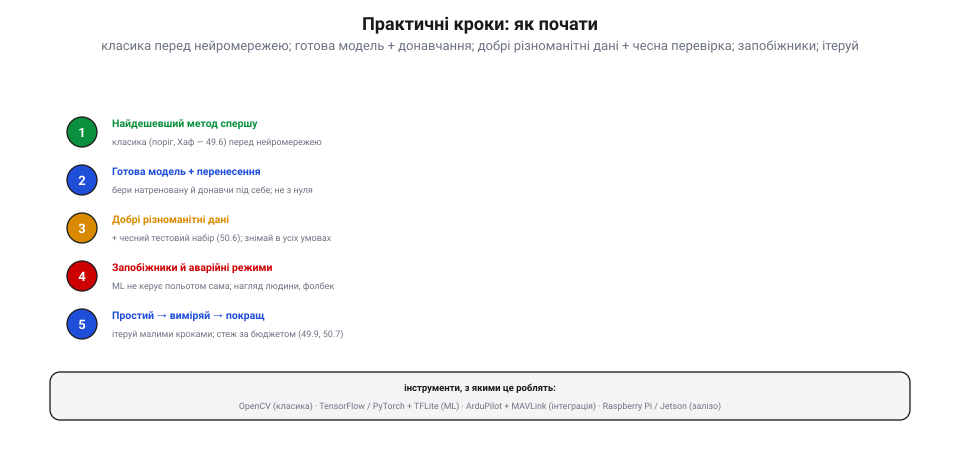
*Рис. 50.9.3. Практичні кроки. **1.** Найдешевший метод спершу — класика (поріг, Хаф — 49.6) перед нейромережею. **2.** Бери **готову** натреновану модель і **донавчи** під себе, а не тренуй з нуля. **3.** Збирай **добрі різноманітні** дані й **чесний тест** (50.6) — знімай в усіх умовах. **4.** Постав **запобіжники** й аварійні режими: ML не керує польотом сама. **5.** Простий → виміряй → покращ, ітеруючи малими кроками. Інструменти: OpenCV, TensorFlow/PyTorch + TFLite, ArduPilot + MAVLink, Raspberry Pi / Jetson.*

Починай із **найдешевшого** методу, що працює — класика (49.6) часто рятує там, де нейромережу й не варто тягти. Якщо потрібна модель — бери **готову, наперед навчену** й **донавчи** її під свою задачу (перенесення навчання), а не тренуй з нуля. Збирай **добрі, різноманітні** дані й суворо тримай **чесний тестовий набір** (50.6) — і перевіряй у **справжніх** умовах, не лише в лабораторії. Будуй **запобіжники**: жодна модель не керує польотом одноосібно — людський нагляд і аварійний режим обов'язкові. І рухайся **ітераціями**: простий варіант → виміряй → покращ, не забуваючи про бортовий бюджет (49.9, 50.7). Інструменти готові й безкоштовні: **OpenCV** для класики, **TensorFlow/PyTorch** із **TFLite** для ML, **ArduPilot** із **MAVLink** для інтеграції, **Raspberry Pi** чи **Jetson** для заліза.

> 📜 **Машина, що вдавала розуміння: ELIZA Вайценбаума (1966).** Найважливішу пересторогу всього цього модуля дав не критик ШІ, а його **творець** — і дав ще 1966 року. Професор MIT **Джозеф Вайценбаум** написав **ELIZA** — першу в світі «балакучу» програму. Її найвідоміший сценарій, **DOCTOR**, удавав психотерапевта: він **віддзеркалював** твої ж фрази назад відкритими питаннями («Мене непокоїть мати» → «Розкажіть більше про вашу матір»). Усередині не було **жодного розуміння** — лише прості правила, що ловили ключові слова й перетасовували їх. Вайценбаум і будував ELIZA, **щоб показати**, як легко створити **ілюзію** розуму. Та сталося неочікуване: люди повірили. Його власна секретарка, знаючи, що це програма, просила залишити її **наодинці** з ELIZA, щоб «поговорити»; інші **відкривали їй душу**, приписуючи машині співчуття й мудрість, яких у ній не було ні краплі. Цей «**ефект ELIZA**» так вразив Вайценбаума, що він став одним із найгостріших критиків ШІ: у книзі «Computer Power and Human Reason» (1976) він доводив, що машина може переконливо **вдавати** розуміння, не маючи його, — і що деякі рішення, які потребують мудрості й совісті, **не можна** віддавати машинам. Це і є серце 50.9: твоя модель, як ELIZA, **зіставляє взірці, а не розуміє** (50.1); і хоч би як впевнено вона звучала, **остаточне судження** — особливо там, де на кону безпека, — лишай за людиною. Творець першого чат-бота застеріг нас про це шістдесят років тому.

> 🔧 **Навіщо це.** Шануй **межі**: твоя модель зіставляє взірці, а не розуміє, — тож **ніколи** не довіряй їй наосліп, надто в критичному за безпекою (запобіжники, нагляд людини, аварійні режими — 50.8). Думай про **етику** з першого дня: різноманітні дані проти упередженості (50.6), повага до приватності (зрячий дрон — це стеження), тверезе ставлення до подвійного призначення. Дій **практично**: класика перед нейромережею (49.6), готова модель + перенесення замість навчання з нуля, добрі дані + чесний тест (50.6), ітерації малими кроками. І, як Вайценбаум, не плутай **переконливість** із **розумінням**: машина може звучати впевнено й помилятися — останнє слово лишай за собою. А далі — **учись далі**: галузь біжить, та засади, які ти тут заклав, лишаються.

### Підсумок теми, Розділу 50 і Модуля 7

Машинне навчання має **чесні межі** (зіставлення взірців, а не розуміння; крихкість поза баченим; залежність від даних; жодних гарантій), вимагає **етичної** відповідальності (упередженість, приватність, безпека, подвійне призначення) і береться **практично** (класика спершу, готова модель із перенесенням, добрі дані з чесним тестом, запобіжники, ітерації). А вічна пересторога ELIZA — не приймати переконливе вдавання за справжнє розуміння й лишати остаточне судження людині.

На цьому замкнувся **Розділ 50**: машинне навчання — це вчитися з даних, а не з правил; модель живе у двох фазах (навчання й вивід); складена вона з нейронів і шарів, а вчиться градієнтним спуском за похибкою; для зору беруть згорткові мережі (CNN); головний клопіт — узагальнення проти перенавчання; щоб поїхати на борт, модель квантують (TinyML); а де її рахувати — диктує золоте правило «критичне — на борту».

І замкнувся весь **Модуль 7**. Ми почали з того, що апарат уміє лише **передати** картинку, а закінчили тим, що він **бачить**, **розуміє** й **діє** з побаченого — відповідально.

*Рис. 50.9.4. Куди ти прийшов. **Відео** (47–48): зняти кадр → стиснути (DCT, кодеки) → доправити (радіо/мережа). **Зір** (49): піксель → межі → об'єкти → детектор → трекінг → керування. **Навчання** (50): вчитися з даних → тренувати → CNN → стиснути (TinyML) → запустити на пристрої. Машина навчилася **бачити, розуміти й діяти** — від світла на сенсорі до рішення, що замикає керування апаратом.*

Це й була мета Модуля 7: дати апарату **очі — і розум, щоб ними скористатися**. Тепер очі й розум у нього є. Лишилося найважливіше, і це вже за тобою: **користуватися ними мудро**.
