# Розділ 7.9 — Машинне бачення: основи

Розділ 7.8 навчив апарат **донести** картинку — стиснути її й передати на землю. Та передати кадр — ще не означає його **зрозуміти**. Цей розділ — про те, як машина перетворює сиру сітку пікселів на **зміст**: де об'єкт, де край, де ціль, який це предмет, і куди він рухається. Це і є **машинне бачення** — від найпростіших дій над яскравістю до навчених нейромереж-детекторів, а врешті — до того, щоб зір замкнув **керування** апаратом («піксель → кут»).

Почнімо з історії, що ставить усе на свої місця — і вчить нас поважати, наскільки зір насправді важкий.

> 📜 Історія розділу: [«літній проєкт зору» (MIT, 1966)](hist-summer-vision.md). Вона пояснює **семантичну прірву** — провалля між числами-пікселями й змістом, яке ми долатимемо весь цей розділ.

---

## 7.9.1 Зображення як дані: піксель, канали, колірні простори

Щоб машина «бачила», спершу треба зрозуміти, **чим** для неї є зображення. А воно для машини — не картинка, а **дані**: великий стіл чисел. Ця тема перетворює слово «зображення» на слово «матриця» — і саме з цього починається все машинне бачення.

### Піксель і сітка чисел

**Піксель** (від англ. *picture element* — «елемент зображення») — це атом картинки: одна точка з певним значенням. Усе зображення — це **прямокутна сітка** таких точок, тобто **матриця** чисел. Скільки їх — каже **роздільність**: ширина × висота в пікселях (наприклад, 1920×1080).

*Рис. 7.9.1.1. Зображення — це сітка чисел. Наблизься до фото — і воно розпадеться на **пікселі**, кожен з яких — просто **число** (тут — яскравість від 0 = чорне до 255 = біле). А отже, будь-яка дія зору — розмиття, пошук меж, виявлення цілі — це **арифметика** над цією матрицею. Піксель адресують як `[рядок, стовпець]`.*

Для відтінкового (сірого) зображення кожен піксель — **одне** число яскравості, зазвичай від 0 (чорне) до 255 (біле). Це і є вся «магія»: коли далі ми говоритимемо про фільтри, межі чи розпізнавання, насправді йтиметься про **дії над числами** в цій сітці — додати, зрушити, помножити, порівняти. Машина не «дивиться» — вона **рахує**.

### Канали: колір — це кілька сіток разом

А як же **колір**? Кольоровий піксель — це вже не одне число, а **кілька**. Найпоширеніше — **RGB**: три числа, скільки в пікселі **червоного** (R), **зеленого** (G) і **синього** (B), кожне 0…255. Тобто кольорове зображення — це **три сірі мапи** одна над одною, по одній на кожен основний колір.

*Рис. 7.9.1.2. Канали. Кольорове зображення — це три накладені сірі мапи: канал **R** (скільки червоного), **G** (зеленого) і **B** (синього), кожна 0…255. Разом вони дають колір. Звідси форма масиву **H×W×3** (висота × ширина × канали). Відтінок сірого — це **1** канал (утричі менше даних, і часто його досить для форм і меж).*

Звідси й «форма» цифрового зображення: масив **H×W×C** — висота на ширину на число каналів (3 для RGB, 1 для сірого, інколи 4 з прозорістю). «Глибина» 8 біт дає звичні 0…255 на канал; буває й 10–12 біт — ширший діапазон яскравостей (згадай динамічний діапазон, Розділ 7.7). Важливий практичний висновок: **сіре зображення втричі легше** за кольорове, тож коли задача про **форму** чи **межі**, а не про колір, його часто й беруть — заощаджуючи пам'ять і обчислення.

### Колірні простори: різні способи записати той самий колір

RGB — не єдиний спосіб записати колір. Той самий піксель можна закодувати **по-різному**, і кожне кодування зручне для свого. Ці способи звуть **колірними просторами**.

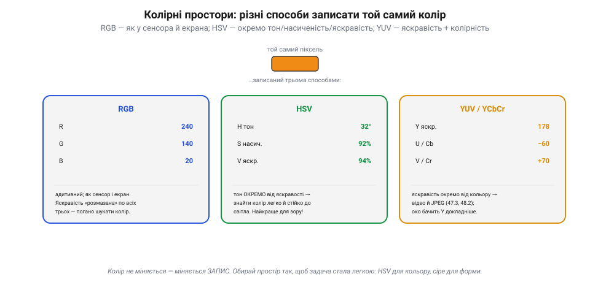
*Рис. 7.9.1.3. Колірні простори. Той самий піксель, три записи. **RGB** — адитивний, як у сенсора й екрана; зручний для показу, та яскравість «розмазана» по всіх трьох числах. **HSV** — окремо тон (H), насиченість (S) і яскравість (V); тон відділений від світла. **YUV/YCbCr** — яскравість (Y) окремо від колірності (U/V); так працюють відео й JPEG (7.7.3, 7.8.2), і око бачить Y докладніше.*

Три головні для нас. **RGB** — як дає сенсор (після демозаїки, 7.7.4) і як світить екран; природний для показу, та незручний, щоб **шукати колір**, бо зміна освітлення зрушує всі три числа разом. **HSV** (тон, насиченість, яскравість) — розділяє **колір** (тон H) і **світло** (яскравість V); саме тому його люблять у машинному баченні. **YUV / YCbCr** — яскравість (Y) окремо від колірності; так зберігають відео й JPEG (7.7.3, 7.8.2), бо око до яскравості чутливіше, ніж до кольору.

### Чому для зору беруть HSV

Найпрактичніше тут — **HSV**, і ось чому. Уяви, що треба знайти в кадрі **помаранчевий м'яч**. У **RGB** це пекло: на сонці м'яч дає одні числа, у тіні — геть інші (бо світло змінює R, G і B водночас), тож «помаранчевий» стає **рухомою ціллю** в тривимірному просторі чисел.

*Рис. 7.9.1.4. Чому HSV. Той самий м'яч на яскравому й тьмяному світлі. У **RGB** усі три числа сильно поповзли (R250 G150 B40 → R120 G70 B18) — поріг задати важко. У **HSV** змінилася лише яскравість V, а **тон H тримається ≈32°** — тож «помаранчевий» — це стала **смужка тону** (≈20–40°). Один поріг по тону — і ціль знайдено, стійко до освітлення.*

У **HSV** усе простіше: міняється світло — повзе лише **яскравість** (V), а **тон** (H) тримається майже сталим. Тож «помаранчевий» стає **смужкою тону** (скажімо, 20–40°), яку легко відсікти **одним порогом** — і то стійко до зміни освітлення. Звідси типовий прийом машинного бачення: перевести кадр **RGB → HSV** і шукати колір по тону (детальніше — у 7.9.6). А для **форми** й **меж** беруть **сіре** (7.9.3–7.9.4) — дешевше й теж байдуже до кольору.

> 📜 **Перша кольорова фотографія: стрічку зняли тричі — і склали колір.** Думка, що колір — це **три канали**, не нова: її вперше **показали** ще 1861 року. Шотландський фізик **Джеймс Клерк Максвелл** (той самий, чиї рівняння описують електромагнетизм) припустив, що будь-який колір можна відтворити, змішавши три — червоне, зелене й синє. Щоб довести це, на лекції в Королівському інституті він зробив дослід: фотограф **Томас Саттон** зняв барвисту шотландську **стрічку** (tartan) **тричі** — крізь червоний, зелений і синій світлофільтри, діставши три **чорно-білі** платівки. Тоді ці платівки спроєктували трьома ліхтарями крізь ті самі фільтри, наклавши зображення одне на одне, — і на екрані спалахнула **перша у світі кольорова фотографія**. Це і є рівно те, що сьогодні робить кожен сенсор і екран: колір — це **три накладені канали** (R, G, B). Максвелл показав принцип за століття до того, як ми навчили цьому машини; з того досліду й тягнеться нитка просто до того, як твій дрон зберігає кадр.

> 🔧 **Навіщо це.** Тверди собі: зображення — це **масив чисел**, і кожна операція зору — математика над ним. Не «дивись» на колір як на одне ціле — пам'ятай про **канали**. Шукаєш кольорову ціль (м'яч, стрічку, маркер) — переводь у **HSV** і лови по тону: стійко до світла. Працюєш із **формою** чи **межами** — бери **сіре**: утричі дешевше й байдуже до кольору. І зважай на **роздільність** та **глибину**: що більше пікселів і бітів — то більше пам'яті й обчислень для бортового заліза (7.9.9). А якщо береш кадр прямо з відеопотоку — він, найпевніше, уже у **YUV** (7.8.2), і це теж варто врахувати.

### Підсумок теми

Для машини зображення — це **дані**: матриця чисел, де піксель — атом, а число — його яскравість. Колір додає **канали**: RGB — три накладені сірі мапи (форма H×W×3), сіре — одна (втричі дешевше). Той самий колір можна записати в різних **колірних просторах** — RGB (сенсор/екран), HSV (тон окремо від світла), YUV (яскравість окремо, для кодеків), — і вибирають той, у якому задача **легша**: HSV, щоб шукати колір стійко до освітлення; сіре, щоб працювати з формою. А принцип «колір = три канали» нам ще 1861-го показав Максвелл своєю потрійною фотографією стрічки. Тепер, коли зображення — це числа, гляньмо на **розподіл** цих чисел: яскравість, контраст і гістограму (7.9.2).

## 7.9.2 Яскравість, контраст, гістограма

Зображення — матриця чисел (7.9.1). Та перш ніж шукати в ній межі чи об'єкти, варто глянути на **розподіл** цих чисел: чи кадр не надто темний, не надто світлий, чи стане в ньому контрасту, щоб узагалі щось розгледіти. Цим і займається ця тема — найпростішими діями над **яскравістю** кожного пікселя, без огляду на сусідів.

### Гістограма — «відбиток тонів» кадру

**Гістограма** — це стовпчикова діаграма, що рахує, **скільки пікселів** має кожну яскравість від 0 (чорне) до 255 (біле). Вона нічого не знає про те, *що* на кадрі, — лише про те, *яких тонів* і *скільки*. Але за її **формою** одразу видно стан кадру.

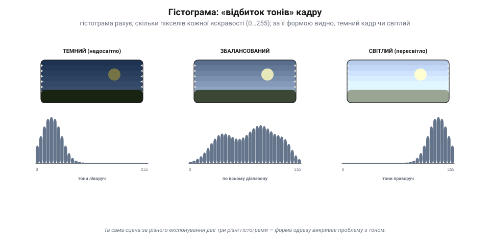
*Рис. 7.9.2.1. Гістограма — відбиток тонів. Одна й та сама сцена за різного експонування. **Темний** кадр: усі стовпчики тиснуться **ліворуч** (мало світла). **Збалансований**: тони розкидані **по всьому** діапазону. **Світлий**: стовпчики збилися **праворуч**. Гістограма не каже, що в кадрі, — зате миттєво викриває недо- чи переекспозицію й брак контрасту.*

Читати її просто: стовпчики **ліворуч** — темний кадр (недосвітло), **праворуч** — світлий (пересвітло), збиті у **вузький** стовпчик посередині — мало контрасту (сіра «каша»), розкидані **рівно** по всій ширині — повний, контрастний кадр. Для машинного бачення це безцінний **миттєвий діагноз**: перш ніж щось обробляти, глянь на гістограму — і знатимеш, чи взагалі є з чим працювати.

### Яскравість і контраст: зсунути й розтягнути

Тепер найпростіші **виправлення**. Обидва — лінійні й діють на **кожен піксель окремо**: новий = **a**·старий + **b**.

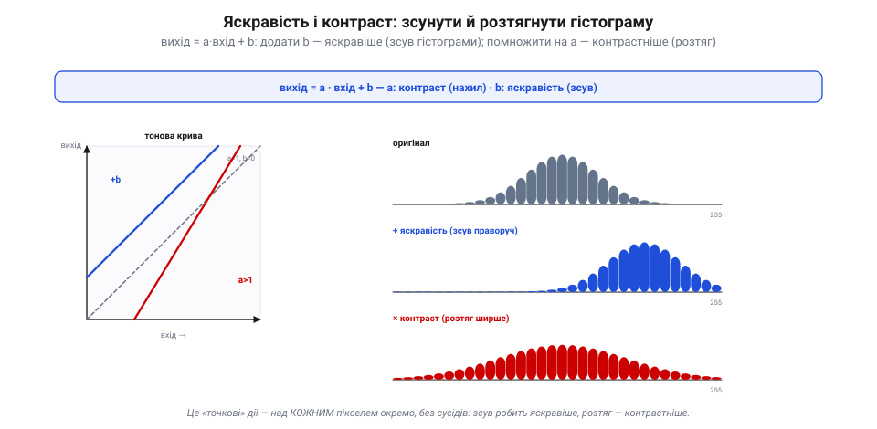
*Рис. 7.9.2.2. Яскравість і контраст. Формула **вихід = a·вхід + b**. Додати **b** до кожного пікселя — зсунути всю гістограму праворуч (яскравіше) чи ліворуч (темніше). Помножити на **a** (відносно середини) — розтягнути гістограму ширше (контрастніше, a>1) чи стиснути (млявіше, a<1). На «тоновій кривій» (вхід→вихід) b — це зсув лінії вгору, a — її нахил.*

**Яскравість** — це доданок **b**: додаси до кожного пікселя — весь кадр світлішає, і гістограма **зсувається** вправо; віднімеш — темнішає. **Контраст** — це множник **a**: помножиш яскравості (відносно середини) — світлі стають світлішими, темні темнішими, гістограма **розтягується** ширше (a>1, контрастніше) або стискається (a<1, мляво). Зручно уявляти це **тоновою кривою**: по горизонталі — вхідна яскравість, по вертикалі — вихідна; **b** піднімає лінію, **a** змінює її **нахил**. Запам'ятай цей нахил — в історичній вставці нижче виявиться, що нахил кривої і є контраст.

### Розтягнення й вирівнювання гістограми

Ручні a й b — грубі. Розумніше дати алгоритму самому підправити розподіл. Два головні прийоми.

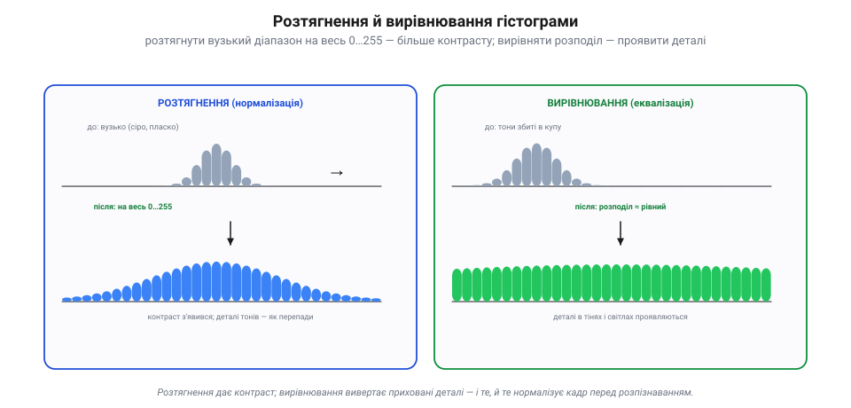
*Рис. 7.9.2.3. Два автоматичні прийоми. **Розтягнення** (нормалізація): береться вузький зайнятий діапазон і розтягується на весь 0…255 — сірий плаский кадр стає контрастним. **Вирівнювання** (еквалізація): значення перерозподіляють так, щоб гістограма стала **≈рівною**, — і деталі, збиті в купу (у тінях чи світлах), проявляються. Обидва нормалізують кадр перед розпізнаванням.*

**Розтягнення** (нормалізація): знаходимо найтемніший і найсвітліший реально присутні тони й **розтягуємо** цей вузький діапазон на весь 0…255. Млявий сірий кадр стає контрастним, бо тони, що тулилися, скажімо, у 80–160, тепер займають усю шкалу. **Вирівнювання** (еквалізація): хитріший хід — значення перерозподіляють так, щоб гістограма стала якомога **рівнішою**. Це особливо рятує темні чи низькоконтрастні кадри: деталі, збиті в одну купу, **розсуваються** й стають видні. Обидва прийоми — типова **підготовка** кадру, щоб зробити його придатним для подальшого зору, та ще й однаковим попри різне освітлення.

### Обрізання тонів — і чому це важить для зору

Є межа, якої не перескочиш: 0 і 255. Якщо яскравість виштовхнути за ці краї — вона просто **прилипне** до краю, і деталі там **загинуть безповоротно**.

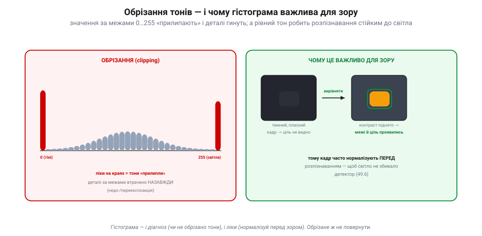
*Рис. 7.9.2.4. Обрізання і зір. **Ліворуч**: пік на **0** — провалені тіні, пік на **255** — вибілені світла; усе, що за межами, «прилипло» й деталей там уже не повернути (недо-/переекспозиція). **Праворуч**: чому це важливо для зору — темний плаский кадр, де ціль не видно, після **вирівнювання** дає чітку картинку, де межі й об'єкт проявились, і детектор їх знаходить (7.9.6).*

Це **обрізання** (*clipping*): на гістограмі видно **піки** на самих краях — провалені в чорне тіні (пік на 0) чи вибілені світла (пік на 255). На відміну від яскравості-контрасту, тут деталь **втрачена назавжди** — її в числах просто немає. Ось чому для машинного бачення гістограма — і **діагноз**, і **ліки**: спершу перевір, чи кадр не обрізаний і не млявий, а тоді **нормалізуй** його (розтягни чи вирівняй) — щоб детектор бачив межі й цілі **однаково** і на сонці, і в сутінках, а не плутався від кожної зміни світла.

> 📜 **Контраст як нахил кривої: Гуртер і Дріффілд міряють світло (1890).** Сьогодні ми крутимо «яскравість» і «контраст» повзунками, не думаючи. А до кінця XIX століття фотографія була мистецтвом-вгадайкою: скільки світла дати, проявник тримали «на око». Двоє британців-аматорів — швейцарський хімік **Фердинанд Гуртер** і англійський інженер **Веро Дріффілд** — у вільний час перетворили це на **науку**. Їхня праця 1890 року заснувала **сенситометрію**: вони виміряли, як **експозиція** (скільки світла) перетворюється на **щільність** (наскільки темною стає платівка), і побудували **характеристичну криву** — графік щільності від логарифма експозиції, відому й досі як «крива H&D». І ось ключове для нас: **нахил** прямої ділянки цієї кривої — то і є **контраст**. Крутіша крива — більший контраст (світло й тінь розходяться різкіше), полога — мляво. Те, що ми робимо множником **a** на тоновій кривій (7.9.2), Гуртер і Дріффілд формалізували півтораста років тому: контраст — це **стрімкість**, із якою вхідне світло перетворюється на вихідний тон. Два хобісти дали фотографії (а через неї й цифровому зору) мову, якою ми досі міряємо тон.

> 🔧 **Навіщо це.** Перш ніж щось розпізнавати — **глянь на гістограму** кадру: збита ліворуч (темно), праворуч (пересвітло), у вузький стовпчик (мало контрасту), з піками на краях (обрізано — деталі вже не врятуєш). Як ліки — **нормалізуй** (розтягни) чи **вирівняй** кадр; це робить детектор стійким до освітлення й часто коштує копійки (проста таблиця замін «старе значення → нове», яку тягне навіть мікроконтролер). Не «витискай» контраст наосліп — обрізані тони не повертаються. І пам'ятай: яскравість — це **зсув** (b), контраст — **розтяг** (a), а їхня крива — той самий нахил, що його міряли Гуртер і Дріффілд.

### Підсумок теми

Гістограма — це **розподіл** яскравостей кадру, його тоновий відбиток: за формою видно, темний кадр чи світлий, контрастний чи млявий, обрізаний чи цілий. Виправляють тон двома лінійними діями над кожним пікселем: **яскравість** = доданок **b** (зсуває гістограму), **контраст** = множник **a** (розтягує її), разом — **вихід = a·вхід + b**. Розумніші **розтягнення** й **вирівнювання** автоматично підганяють розподіл, проявляючи деталі й нормалізуючи кадр перед розпізнаванням, — а от **обрізані** на 0/255 тони втрачено назавжди. Для зору гістограма — і діагноз, і підготовка: нормалізуй, щоб світло не збивало детектор. А що контраст — це нахил тонової кривої, нам ще 1890-го виміряли Гуртер і Дріффілд. Досі ми чіпали пікселі поодинці; далі — дії, що дивляться на **сусідів**: згортки й фільтри (розмиття, різкість) (7.9.3).

## 7.9.3 Згортки й фільтри: розмиття й різкість

Досі ми чіпали кожен піксель **поодинці** (7.9.2). Та сенс пікселя — у його **сусідах**: межа, текстура, шум — це не про одну точку, а про те, як точки **відрізняються** одна від одної. Щоб таке побачити, треба дивитися на маленький **окіл** кожного пікселя. Інструмент для цього — **згортка**, і це робоча конячка всієї обробки зображень (а згодом — і нейромереж, 7.9.7).

### Згортка: маленьке ядро ковзає кадром

**Згортка** (англ. [*convolution*](book:math/convolution)) працює так: беремо маленьку сітку **ваг** — **ядро** (*kernel*), зазвичай 3×3 чи 5×5, — і кладемо її на піксель та його сусідів. Перемножуємо кожну вагу на піксель під нею, **додаємо** все — і отримане число стає новим значенням центрального пікселя. Тоді **зсуваємо** ядро на піксель далі й повторюємо — і так по всьому кадру.

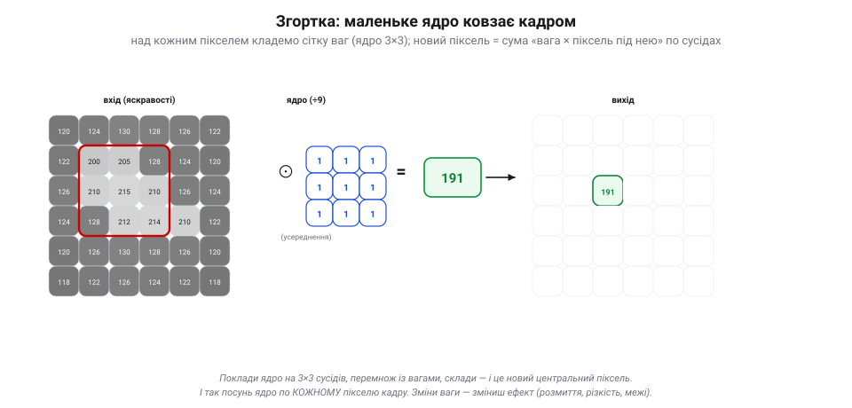
*Рис. 7.9.3.1. Згортка. Ядро 3×3 (тут — усереднення, усі ваги ÷9) лягає на піксель і його вісьмох сусідів; кожну вагу множать на піксель під нею, усе складають — і сума (тут 191) стає новим **центральним** пікселем у вихідному кадрі. Тоді ядро зсувають на наступний піксель — і так по **кожному**. Зміниш ваги — зміниш ефект.*

Уся сила — в одній думці: **ваги ядра вирішують усе**. Той самий механізм ковзання дає геть різні ефекти — залежно від того, які числа в ядрі. Усереднювальні ваги розмиють, протиставні — підкреслять межі, центрально-підсилені — зроблять різкіше. Згортка — це **універсальний фільтр**: одна операція, безліч облич.

### Розмиття: усереднити сусідів

Найпростіше ядро — **усереднювальне**. Якщо всі ваги рівні (для 3×3 — по 1/9), новий піксель стає просто **середнім** свого околу. Це і є **розмиття** (*blur*).

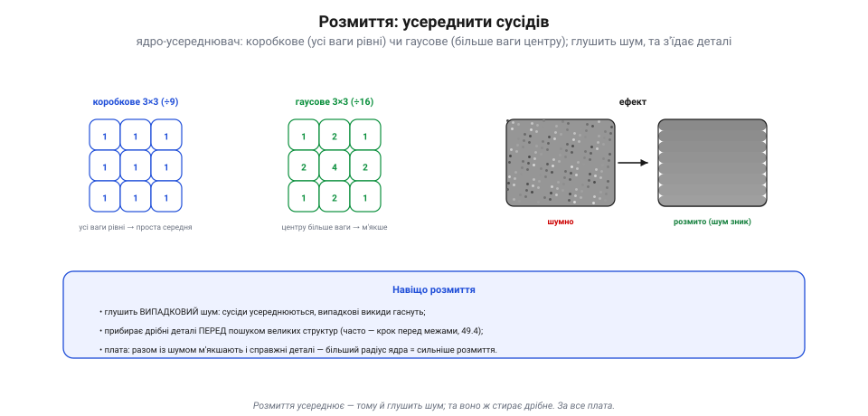
*Рис. 7.9.3.2. Розмиття. **Коробкове** ядро — усі ваги рівні (проста середня). **Гаусове** — центру більше ваги (1 2 1 / 2 4 2 / 1 2 1, ÷16), тож розмиття м'якше, без «коробкових» слідів. Ефект: випадковий **шум** усереднюється й гасне (сусіди компенсують викиди), та разом із ним м'якшають і дрібні **деталі**. Більший радіус ядра — сильніше розмиття.*

Навіщо псувати картинку розмиттям? Бо воно **глушить шум**: випадкові викиди яскравості (7.9.2) усереднюються із сусідами й гаснуть. Тому розмиття — типовий **перший крок** перед пошуком меж (7.9.4): прибрати дрібну «зернистість», щоб не наплодити фальшивих контурів. **Гаусове** ядро (центру більше ваги) розмиває м'якше й природніше за **коробкове** (рівні ваги). Плата очевидна: усереднення стирає не лише шум, а й **справжні дрібні деталі** — чим більший окіл, тим сильніше «замилюється» кадр.

### Різкість: підкреслити перепади

Протилежне завдання — зробити **різкіше**, підкреслити межі. Ядро різкості влаштоване хитро: центр **підсилено**, сусідів **віднято** (наприклад, 0 −1 0 / −1 5 −1 / 0 −1 0). Воно підсилює саме те, **чим піксель різниться** від свого околу.

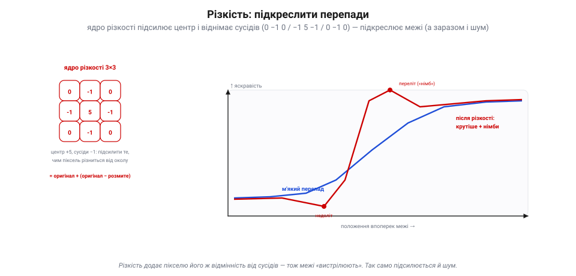
*Рис. 7.9.3.3. Різкість. Ядро (0 −1 0 / −1 5 −1 / 0 −1 0) додає до пікселя його **відмінність** від сусідів. На профілі впоперек межі видно, як м'який перепад (синій) стає **крутішим** (червоний), із характерними «німбами» — недольотом перед стрибком і перельотом після. Суть: **різкість = оригінал + (оригінал − розмите)**. Та разом із межами підсилюється й шум.*

Чому ці ваги дають різкість? Бо вони реалізують просту ідею: **різкість = оригінал + (оригінал − розмите)**. «Оригінал − розмите» — це і є **перепади** (там, де піксель відрізняється від усередненого околу, тобто на межах); додаємо їх назад до оригіналу — і межі **вистрілюють**. На профілі впоперек контуру це видно як крутіший стрибок із «німбами» (легкий недоліт перед і переліт після межі). Ціна та сама, що завжди: різкість підсилює межі, **але й шум** — тож гострити варто **чистий** кадр, а не зернистий.

### Галерея ядер і ціна згортки

Підсумуймо: те саме ковзання, різні ваги — різні фільтри. І не забуваймо про **ціну**.

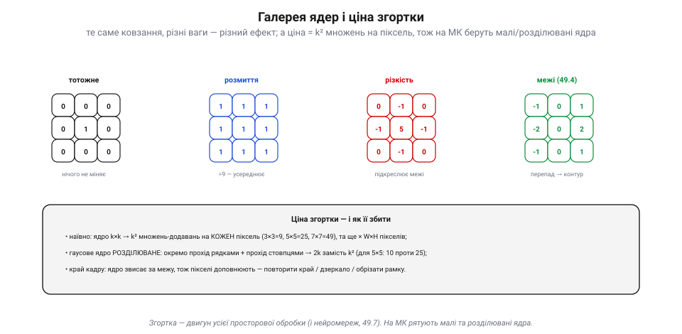
*Рис. 7.9.3.4. Галерея ядер і ціна. **Тотожне** (центр 1) — нічого не міняє; **розмиття** (рівні ваги) — усереднює; **різкість** (центр +5, сусіди −1) — підкреслює межі; **межі** (протиставні половини) — дають контур (7.9.4). Ціна: наївно ядро k×k коштує **k² множень-додавань на піксель** (× усі W×H пікселів). Гаусове ядро **розділюване** (рядок × стовпець → 2k замість k²), а на краю кадру пікселі **доповнюють** (повтор краю / дзеркало / обрізка).*

Та сама згортка з різними ядрами дає **тотожність**, **розмиття**, **різкість** чи **межі** (це вже 7.9.4). Але згортка **недешева**: ядро k×k вимагає k² множень-додавань на **кожен** піксель, помножити на мільйони пікселів — і бортовий чип закашляється. Рятують два прийоми: **розділювані** ядра (гаусове можна зробити двома проходами 1D замість одного 2D — 2k замість k²) і **малі** ядра. А ще треба вирішити, що робити на **краю** кадру, де ядро звисає за межу: повторити крайній піксель, віддзеркалити чи просто обрізати рамку. Дрібниця, та без неї — артефакти по периметру.

> 📜 **Різкість із розмиття: «нечітка маска» з віденської темної кімнати (1931).** Думка «різкість = оригінал мінус його ж розмиття» здається суто цифровою — а народилася вона в **темній кімнаті**, ще коли про комп'ютери не чули. 1931 року у Відні двоє рентгенологів, **Ґоттфрід Шпіґлер** і **Кальман Юріс**, шукали, як зробити чіткішими бліді, низькоконтрастні рентгенівські знімки. І придумали трюк, від якого паморочиться: зробити **розмиту** копію негатива (так звану «**нечітку маску**», *unsharp mask*) і скласти її разом з оригіналом у проєкторі. Розмита копія **гасила** м'які, низькоконтрастні ділянки, та майже не чіпала **різких меж** — тож на відбитку межі ставали виразнішими. Це буквально **оригінал мінус розмите**, зведене на склі й желатині. Прийом так сподобався, що до 1950-х його взяли на озброєння всі професійні лабораторії й поліграфія, а звідти він майже без змін перекочував у цифру — фільтр «Unsharp Mask» у будь-якому фоторедакторі носить ім'я тієї віденської маски. Те, що твій дрон робить ядром 3×3 за мікросекунди, рентгенологи робили руками, складаючи дві плівки, — і принцип той самий.

> 🔧 **Навіщо це.** Згортка — **двигун** усієї просторової обробки, тож варто чути її ритм. **Розмиваєш** — щоб прибрати шум перед пошуком меж чи об'єктів (але не перестарайся: заразом зникнуть і дрібні цілі). **Гостриш** — щоб підкреслити межі, та лише на **чистому** кадрі (на шумному різкість зробить гірше). Тримай у голові **порядок**: зазвичай спершу легке розмиття (прибрати шум), тоді вже межі (7.9.4). І зважай на **ціну**: k² множень на піксель — на мікроконтролері це багато, тож бери малі (3×3) та розділювані ядра, а великі згортки лиши бортовому комп'ютеру (7.9.9).

### Підсумок теми

Згортка — це ковзання маленького **ядра** ваг по кадру: новий піксель = зважена **сума** його околу. Ваги вирішують ефект: рівні — **розмиття** (усереднення → глушить шум, та стирає деталі), центр-плюс-сусіди-мінус — **різкість** (підкреслює перепади за принципом «оригінал + (оригінал − розмите)», та підсилює й шум), а протиставні половини дадуть **межі** (7.9.4). Ціна згортки — k² множень на піксель, тож на борту рятують малі й розділювані ядра та акуратна обробка країв. А ідею «різкість із розмиття» подарувала світу віденська темна кімната 1931-го. Розмиття й різкість — лише розминка; тепер візьмемося за **найважливіший** фільтр зору, заради якого все й затівалося, — пошук **меж** (градієнт, Собель, Канні) (7.9.4).

## 7.9.4 Виділення меж: градієнт, Собель, Канні

Ось ми й дійшли до **серця** машинного бачення. Якщо в кадрі й є інформація, то вона — на **межах**: там, де закінчується один об'єкт і починається інший, де контур, силует, лінія. Рівні гладкі ділянки (небо, стіна) майже нічого не кажуть; усе важливе живе на **перепадах**. Тому виділення меж — фільтр, заради якого здебільшого й затівають усе попереднє, і фундамент майже всього подальшого (форми, лінії, об'єкти, трекінг).

### Межа — це великий градієнт

Що таке межа з погляду чисел? Це місце, де яскравість **різко змінюється**. А «швидкість зміни» має точну назву — **градієнт** (по суті, [**похідна**](book:math/derivative) яскравості). Там, де кадр гладкий, градієнт ≈ 0; там, де перепад, — градієнт дає **сплеск**. Знайти межі = знайти великі градієнти.

*Рис. 7.9.4.1. Межа й градієнт. Яскравість упоперек межі — це **сходинка** (синій профіль). Її **похідна** (градієнт, червоний) — майже нуль на рівних ділянках і дає **сплеск** саме там, де перепад. Тож межа = велике значення градієнта. У градієнта є **сила** (наскільки різкий перепад) і **напрям** (куди він повернутий — перпендикулярно до межі).*

Важливо, що градієнт — **двовимірний**: яскравість може мінятися і по горизонталі, і по вертикалі. Тому в кожному пікселі рахують **дві** похідні: **Gx** (зміна вліво-вправо) і **Gy** (зміна вгору-вниз). З них дістають **силу** межі — `|G| = √(Gx² + Gy²)` (наскільки різко) — і **напрям** — `atan2(Gy, Gx)` (куди повернута). Сила каже, *чи* тут межа; напрям — *як* вона лежить (це знадобиться для ліній, 7.9.6).

### Собель: згортка, що оцінює градієнт

Як порахувати ці похідні? Згорткою (7.9.3!) зі спеціальним **ядром-похідною**. Найвідоміше — **Собель**: пара ядер 3×3, одне для Gx, друге для Gy.

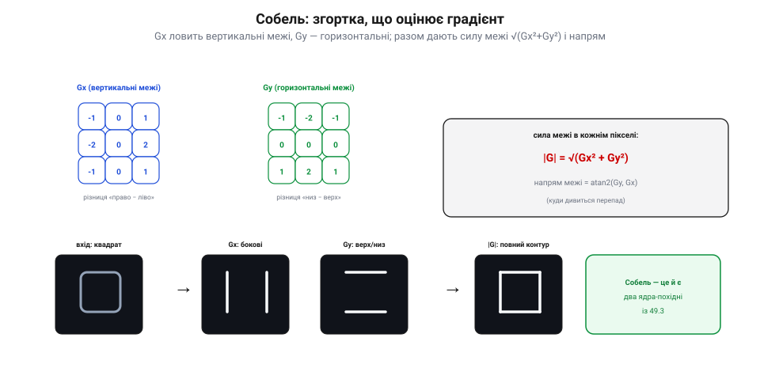
*Рис. 7.9.4.2. Собель. Ядро **Gx** (−1 0 1 / −2 0 2 / −1 0 1) — це різниця «право − ліво», тож воно спалахує на **вертикальних** межах. Ядро **Gy** (−1 −2 −1 / 0 0 0 / 1 2 1) — різниця «низ − верх», ловить **горизонтальні**. Прогнавши квадрат через обидва, дістаємо бокові межі (Gx) і верх/низ (Gy); їх з'єднують у силу межі `|G| = √(Gx²+Gy²)` — повний контур. Собель — це просто **два ядра-похідні** з 7.9.3.*

Ядро **Gx** (`−1 0 1 / −2 0 2 / −1 0 1`) рахує різницю «що праворуч мінус що ліворуч» — тому реагує на **вертикальні** межі. Ядро **Gy** (`−1 −2 −1 / 0 0 0 / 1 2 1`) — різницю «низ мінус верх» — ловить **горизонтальні**. (Середній рядок/стовпець із вагою 2 заразом трохи **згладжує** впоперек, тож Собель стійкіший до шуму, ніж гола похідна.) Прогнали кадр через обидва ядра, у кожному пікселі взяли `√(Gx²+Gy²)` — і маємо **мапу сили меж**: світлі лінії там, де контури. Дешево, один прохід — і вже видно скелет сцени.

### Канні: конвеєр чистих, тонких, зв'язаних меж

Собелева мапа корисна, та **груба**: межі товсті, рвані, поцятковані шумом. Коли треба **чисті** контури, беруть **Канні** — не одне ядро, а цілий **конвеєр** (Джон Канні, 1986).

*Рис. 7.9.4.3. Конвеєр Канні. Чотири кроки: **1)** розмити (Гаус) — приглушити шум, щоб не плодити фальшивих меж; **2)** градієнт (Собель) — сила й напрям, та поки товсто; **3)** стоншення (придушення немаксимумів) — лишити тільки гребінь перепаду, тонкий у 1 піксель; **4)** гістерезис (два пороги) — сильні межі лишити, слабкі — лише якщо вони **тривають** від сильних. Результат — тонкі, чисті, зв'язані контури.*

Кроки такі. **Перший** — розмити Гаусом (7.9.3), щоб шум не наплодив фальшивих меж. **Другий** — Собелем порахувати силу й напрям градієнта. **Третій** — **придушення немаксимумів**: лишити тільки самий **гребінь** перепаду (де градієнт максимальний упоперек межі), стоншивши товсту смугу до лінії в **1 піксель**. **Четвертий** — **гістерезис** із двома порогами: межі, сильніші за верхній поріг, лишаємо завжди; слабші за нижній — викидаємо; а проміжні зберігаємо **лише якщо** вони дотикаються до сильної (тобто є **продовженням** справжнього контуру). Так шум відсівається, а контури виходять **зв'язані**. Канні недарма звуть золотим стандартом: Джон Канні вивів його як **математично оптимальний** — добре виявляти, точно ставити на місце, давати один відгук на одну межу.

### Собель проти Канні: коли що брати

Обидва дають межі — але різної якості й ціни.

*Рис. 7.9.4.4. Собель проти Канні. **Собель** — сирий градієнт: товсто, з шумом, не зв'язано, зате **дешево й швидко** (один прохід) — годиться для мікроконтролера, стеження за лінією, простих міток. **Канні** — тонкі, чисті, **зв'язані** контури, основа для пошуку форм і ліній (7.9.6), та важчий (4 кроки, два пороги) — краще для бортового комп'ютера (7.9.9). Сирий градієнт — коли швидко й дешево; чистий контур — коли далі будувати форми й об'єкти.*

**Собель** дешевий і швидкий (одна згортка), тож його легко тягне навіть мікроконтролер — добре для стеження за **лінією**, простих маркерів, грубого «де тут контраст». Та межі в нього товсті, шумні й не зв'язані. **Канні** дає тонкі, чисті, зв'язані контури — саме те, на чому будують **пошук форм** і **ліній** (7.9.6) та **трекінг** (7.9.8), — але коштує чотирьох кроків і двох порогів, тож радше для бортового комп'ютера. Правило просте: треба **швидко й грубо** — Собель; треба **чисто, щоб будувати далі** — Канні.

> 📜 **Оператор, якого не друкували: Собель і Фельдман у Стенфорді (1968).** Ядро Собеля сьогодні є в кожній бібліотеці комп'ютерного зору, у кожному телефоні, у твоєму дроні — а от **наукової статті** про нього... ніколи не було. 1968 року в Стенфордській лабораторії штучного інтелекту (SAIL) аспірант **Ірвін Собель** разом із колегою **Гері Фельдманом** вигадали зручний спосіб рахувати градієнт зображення ядром 3×3. Вони лиш **розповіли** про нього в доповіді «A 3×3 Isotropic Gradient Operator for Image Processing» на семінарі — і не опублікували як належить. Оператор міг би й загубитися, та 1973-го його згадали **у виносці** до підручника Дуди й Гарта «Pattern Classification and Scene Analysis» — і саме звідти, з footnote, він розійшовся світом. Так одна з найуживаніших операцій в історії машинного зору здобула ім'я не через товсту статтю, а через усну доповідь і примітку дрібним шрифтом. Коли твій апарат шукає лінію горизонту чи край злітної смуги, він рахує рівно те, що двоє стенфордців накидали на семінарі понад півстоліття тому — й полінувалися надрукувати.

> 🔧 **Навіщо це.** Межі — **скелет** сцени, на якому тримається майже все подальше, тож навчися їх діставати. Треба **дешево й швидко** (стеження за лінією, груба орієнтація на МК) — бери **Собель**; треба **чисті контури** під форми чи лінії Хафа (7.9.6) — бери **Канні**, але дай йому бортовий комп'ютер. **Завжди розмивай перед** пошуком меж (7.9.3): шум інакше наплодить фальшивих контурів. Підбирай **пороги** Канні під свою сцену (два числа — верхній і нижній) і пам'ятай про **напрям** градієнта: він знадобиться, щоб з меж зібрати прямі лінії й форми.

### Підсумок теми

Межа — це місце різкої зміни яскравості, тобто великий **градієнт** (похідна), що має **силу** (`√(Gx²+Gy²)`) і **напрям** (`atan2`). Порахувати градієнт можна згорткою з ядрами-похідними — це й є **Собель** (Gx для вертикальних меж, Gy для горизонтальних): дешево, та грубо. Для чистих контурів беруть **Канні** — конвеєр «розмити → градієнт → стоншити → гістерезис», що дає тонкі, зв'язані межі (золотий стандарт від Джона Канні, 1986). Собель — швидко й приблизно (МК); Канні — чисто й під дальшу роботу (борткомп'ютер). А саме ядро Собеля світ дістав 1968-го з усної доповіді й виноски в підручнику. Тепер, маючи межі (й сірі мапи), навчимося різати кадр на **чисті області** — пороги й морфологія (7.9.5).

## 7.9.5 Пороги й морфологія

Ми вміємо знаходити межі (7.9.4) і маємо сірі чи кольорові мапи (7.9.1–7.9.2). Та для багатьох задач потрібне простіше й рішучіше: розрізати кадр навпіл — на **«об'єкт»** і **«тло»**. Отримати чорно-білу **маску**, де біле — це наша ціль (м'яч, мітка, лінія, посадковий майданчик), а чорне — усе решта. Це робить **поріг**. А тоді **морфологія** прибирає за ним безлад.

### Поріг: із сірого — чорно-біле

**Поріг** (*threshold*) — найпростіша сегментація: вибираємо число **T**, і кожен піксель, яскравіший за T, робимо **білим** (об'єкт), а темніший — **чорним** (тло). З мапи яскравостей виходить **бінарна маска**: лише 0 і 1.

*Рис. 7.9.5.1. Поріг. Якщо об'єкт і тло різняться яскравістю, на гістограмі (7.9.2) видно **дві купи** — темну (тло) і світлу (об'єкт). Поставивши поріг **T** у **долину** між ними, ділимо кадр: усе світліше за T → біле, темніше → чорне. Метод **Оцу** знаходить це найкраще T **автоматично** — там, де дві купи розділяються найчистіше.*

Звідки взяти T? Якщо об'єкт і тло помітно різняться яскравістю, на **гістограмі** (7.9.2) буде дві «купи», і найкраще T лежить у **долині** між ними. Шукати її вручну — морока, тож беруть **метод Оцу**: він перебирає всі можливі пороги й вибирає той, що найчистіше **розділяє** дві купи (формально — найдужче розводить їхні середні). Один рядок коду — і поріг підібрано сам. (Так само порогом ловлять **колір**: переводимо кадр у HSV і лишаємо білими лише пікселі з потрібним тоном — 7.9.1, 7.9.6.)

### Коли один поріг не годиться: адаптивний поріг

Один поріг на весь кадр (**глобальний**) має ахіллесову п'яту — **нерівне світло**. Якщо один край кадру яскравий, а інший у тіні, жодне єдине T не підійде всюди.

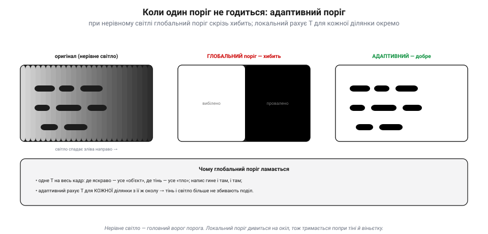
*Рис. 7.9.5.2. Адаптивний поріг. Кадр із нерівним світлом (яскраво ліворуч, тінь праворуч). **Глобальний** поріг (одне T на все): світлий бік стає суцільно білим, темний — суцільно чорним, напис гине і там, і там. **Адаптивний** (локальний) рахує своє T для **кожної ділянки** з її ж околу, тож і в тіні, і на світлі поділ виходить правильний.*

Рятунок — **адаптивний** (локальний) поріг: для кожної ділянки кадру рахуємо **своє** T, виходячи з яскравості її **околу**. Там, де темно, поріг сам опускається; де яскраво — підіймається. Так тіні, віньєтка чи нерівне підсвічування більше не збивають поділ. Це трохи дорожче (для кожного пікселя — окіл), та незамінне в реальному світлі. Запам'ятай: **глобальний поріг крихкий**; щойно світло гуляє по кадру — бери адаптивний (або спершу вирівняй кадр, 7.9.2).

### Ерозія і дилатація: стиснути й розростити

Свіжа маска майже завжди **брудна**: по ній розсипані дрібні білі цятки (шум), у тілах об'єктів зяють дірки, краї рвані, а дві цілі злиплися в одну. Чистити це — робота **морфології**. Вона теж ковзає по зображенню малою формою — **структурним елементом** (наприклад, 3×3), — але працює з бінарною маскою. Два її атоми:

*Рис. 7.9.5.3. Ерозія і дилатація. **Ерозія**: піксель лишається білим, лише якщо **всі** його сусіди (під структурним елементом) білі — тож біле «худне», дрібні цятки зникають, тонкі перемички рвуться, злиплі тіла роз'єднуються. **Дилатація**: піксель стає білим, якщо білий **хоч один** сусід — тож біле «гладшає», дірки й щілини затягуються, близькі тіла зливаються.*

**Ерозія** (*erosion*) «з'їдає» край білого: піксель лишається білим, тільки якщо **всі** сусіди під елементом теж білі. Тож біле стискається — дрібні цятки **зникають** зовсім, тонкі перемички рвуться, а злиплі об'єкти роз'єднуються. **Дилатація** (*dilation*) — навпаки, «нарощує»: піксель стає білим, якщо білий **хоч один** сусід. Біле розростається — дірки й щілини **затягуються**, близькі шматки зливаються. Поодинці вони змінюють і **розмір** тіла (ерозія все потоншує, дилатація потовщує) — а це не завжди бажано. Тому їх **поєднують**.

### Відкриття і закриття: прибрати й залатати

Хитрість у тім, що ерозія й дилатація — **взаємно зворотні** за напрямом, тож роблячи їх **по черзі**, можна прибрати дрібне, **не змінивши** розміру головного тіла.

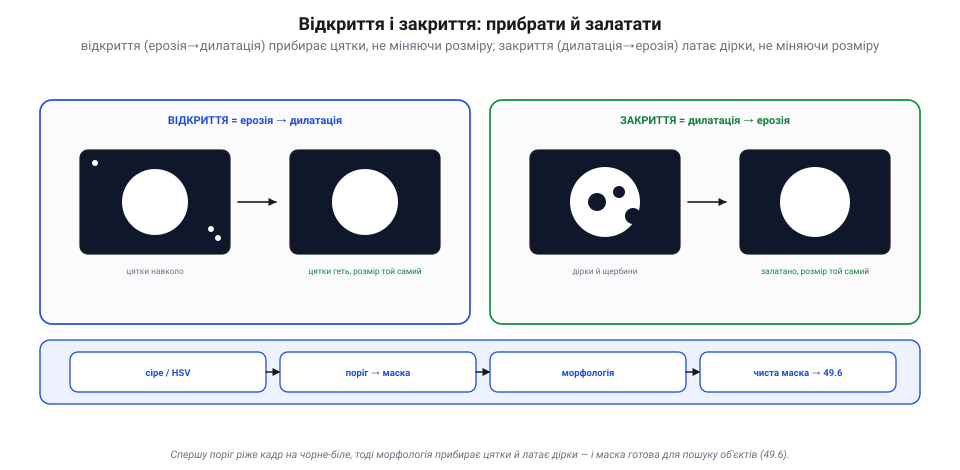
*Рис. 7.9.5.4. Відкриття і закриття. **Відкриття** (ерозія → дилатація): ерозія знищує дрібні цятки, а наступна дилатація повертає головному тілу його розмір — цятки геть, об'єкт цілий. **Закриття** (дилатація → ерозія): дилатація затягує дірки й щербини, а ерозія повертає розмір — дірки залатано, об'єкт цілий. Унизу — типовий конвеєр: сіре/HSV → поріг → морфологія → чиста маска, готова до пошуку об'єктів (7.9.6).*

**Відкриття** (*opening*) = ерозія, **потім** дилатація: ерозія стирає дрібні цятки, а дилатація повертає головному тілу втрачений розмір. Результат — **прибрані шуми** без усихання об'єкта. **Закриття** (*closing*) = дилатація, **потім** ерозія: дилатація затягує дірки й щілини, ерозія повертає розмір. Результат — **залатані діри** без розбухання. Це і є робочий тандем чистки маски: відкриттям — геть цятки, закриттям — заповнити проломи. Після нього маска стає **чистою**: суцільні тіла, рівні краї, без сміття — саме те, на чому далі легко знайти й **порахувати** об'єкти (7.9.6).

> 📜 **Морфологія, народжена з каменю: Матерон і Серра у Фонтенбло (1964).** Ерозія, дилатація, відкриття, закриття — сьогодні вони чистять маски в кожній програмі зору. А винайшли їх, щоб роздивлятися… **руду**. 1964 року у Паризькій гірничій школі молодий інженер **Жан Серра** писав дисертацію під орудою математика **Жоржа Матерона**: треба було за тонкими шліфами (зрізами) залізної руди Лотарингії **виміряти** геометрію зерен мінералу — щоб передбачити, як та руда видобуватиметься. Серра придумав «прикладати» до зображення зрізу маленькі пробні форми — **структурні елементи** — і так міряти й перетворювати фігури; із цього вийшов навіть прилад, «Texture Analyser» (патент 1965). Матерон узагальнив ці дії в **ерозію** й **дилатацію**, а з них — **відкриття** й **закриття**. А назву всьому цьому троє дослідників вигадали взимку 1966-го **в пивничці міста Нансі** — «математична морфологія»; 1968-го Матерон заснував у **Фонтенбло** цілий її центр. Тож коли твій дрон чистить маску посадкового знака — ерозією геть шум, закриттям залатати дірку, — він застосовує математику, придуману, щоб рахувати зерна заліза під мікроскопом.

> 🔧 **Навіщо це.** Щоб виділити ціль, **порогуй**: за яскравістю (Оцу сам підбере T) або за кольором у HSV (лиши потрібний тон, 7.9.1). При **нерівному світлі** не довіряй одному T — бери **адаптивний** поріг або спершу вирівняй кадр (7.9.2). Сиру маску завжди **чисти морфологією**: **відкриттям** — геть дрібні цятки, **закриттям** — залатати дірки, **ерозією** — роз'єднати злиплі тіла, **дилатацією** — з'єднати розірване. Усе це — копійчані бінарні дії, які тягне навіть мікроконтролер. Аж тоді на чистій масці шукай об'єкти (7.9.6).

### Підсумок теми

**Поріг** ріже сіру (чи кольорову) мапу на бінарну **маску** «об'єкт / тло»: T у долині гістограми, причому **Оцу** підбирає його сам, а під **нерівне світло** беруть **адаптивний** (локальний) поріг. Сира маска брудна, тож її чистять **морфологією** структурним елементом: **ерозія** стискає біле (геть цятки, роз'єднати), **дилатація** розростає (залатати, з'єднати), а їхні пари — **відкриття** (прибрати цятки, зберігши розмір) і **закриття** (залатати дірки, зберігши розмір) — доводять маску до чистоти. І все це — спадок Матерона й Серра, що 1964-го міряли морфологією залізну руду. Маска чиста; нарешті можна знайти на ній **самі об'єкти** — за кольором, формою чи шаблоном, аж до прямих ліній перетворенням Хафа (7.9.6).

## 7.9.6 Виявлення об'єктів: колір, форма, шаблон, Хаф

Уся попередня робота — канали (7.9.1), гістограми (7.9.2), фільтри (7.9.3), межі (7.9.4), маски (7.9.5) — вела до одного: **знайти об'єкт**. І перш ніж кидатися до нейромереж (7.9.7), варто знати **класичний** набір детекторів: дешевих, прозорих, без жодного навчання. Їхня спільна ідея проста — обери **прикмету**, за якою твоя ціль виділяється з-поміж усього, і лови саме її. Прикмет чотири: **колір**, **форма**, **геометричний примітив** (лінія, коло) і **взірець**.

### За кольором: маска → пляма → центр

Якщо ціль має **виразний колір** (помаранчевий м'яч, червоний маркер), це найдешевший шлях. Переводимо кадр у **HSV** (7.9.1), порогом лишаємо тільки потрібний тон (7.9.5), чистимо маску морфологією — і шукаємо на ній **пляму** (зв'язну білу область).

*Рис. 7.9.6.1. Виявлення за кольором. Конвеєр: кадр → поріг у **HSV** лишає лише потрібний тон (маска) → морфологія прибирає цятки (7.9.5) → лишається чиста **пляма**. З неї дістаємо **центр** (cx, cy), **площу** (скільки пікселів) і **габаритну рамку**. Дешево, прозоро — тягне навіть мікроконтролер.*

Знайдена пляма одразу видає корисне: її **центр** (cx, cy) — куди дивитися; **площу** — наскільки ціль велика (а отже, груба оцінка відстані); **габаритну рамку** — межі об'єкта. Це і є детектор кольорової цілі: тримати м'яч у кадрі, летіти за маркером, знайти кольорову мітку. Дешево, миттєво, зрозуміло.

### За формою: контур → кути → що це

Коли колір не виручає, рятує **форма**. Обвівши пляму чи контур (з меж, 7.9.4), його **спрощують** до многокутника й рахують **кути**: три — трикутник, чотири з рівними сторонами — квадрат, а якщо кутів нема й фігура «кругла» — коло.

*Рис. 7.9.6.2. Виявлення за формою. Контур спрощують і рахують **кути**: 3 → трикутник, 4 (з ≈рівними сторонами) → квадрат, 0 кутів і висока «круглість» → коло. Плями ще й **фільтрують**: за площею (відсіяти дрібне й завелике), співвідношенням сторін (видовжене?) і круглістю — так із купи кандидатів лишаються тільки потрібні.*

Тут же стають у пригоді **фільтри плям**: відкинути надто дрібні (шум) і надто великі, лишити лише потрібного **видовження** чи **круглості**. Так із десятків випадкових плям лишаються самі цілі. Усе це — проста, прозора арифметика над контуром: жодного навчання, легко налагодити й зрозуміти, **чому** детектор спрацював (чи ні).

### Перетворення Хафа: голосуванням знайти лінії й кола

Найгеніальніший із класичних — **перетворення Хафа**. Воно знаходить **прямі лінії** (і кола) навіть тоді, коли вони **розірвані** чи потонули в шумі. Ідея — **голосування**: кожна точка межі «голосує» за **всі** лінії, що можуть крізь неї пройти; там, де голоси багатьох точок **збігаються**, і є справжня лінія.

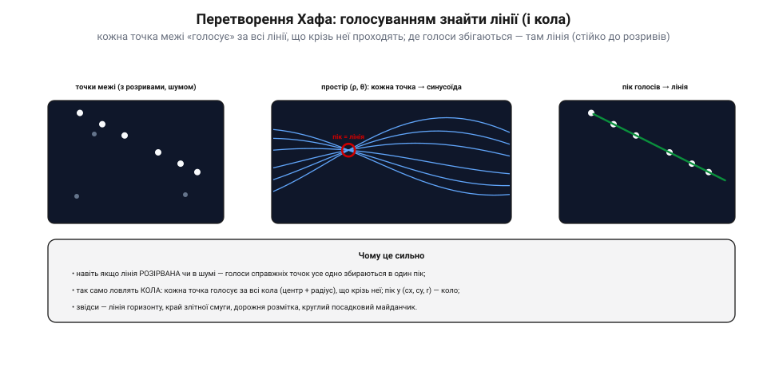
*Рис. 7.9.6.3. Перетворення Хафа. Ліворуч — точки межі, що лежать на лінії (з розривами й шумом). Кожна точка перетворюється на **синусоїду** в просторі параметрів (ρ — відстань, θ — кут): це всі лінії, що крізь неї проходять. Синусоїди справжніх точок **перетинаються в одній точці** (середній графік) — це **пік голосів**, тобто параметри лінії. За піком відновлюємо саму лінію (праворуч). Так само голосуванням ловлять і **кола** (у просторі центр + радіус).*

Технічно кожну точку (x, y) описують усі прямі крізь неї — у просторі параметрів (ρ, θ) це **синусоїда**. Для точок, що лежать на одній лінії, ці синусоїди **перетинаються в одній клітинці** — і там накопичується **пік голосів**, що й видає параметри лінії (ρ, θ). Сила методу — **стійкість до розривів**: навіть якщо лінію видно шматками, голоси її справжніх точок усе одно зберуться в пік. Так само ловлять **кола** (голосуючи в просторі «центр + радіус»). Звідси практичні застосунки: лінія **горизонту**, край **злітної смуги**, дорожня **розмітка** для стеження, круглий **посадковий майданчик**.

### За шаблоном і міткою; коли що брати

Останні два інструменти — для **відомого взірця**. **Зіставлення з шаблоном** (*template matching*): маленьку картинку-зразок **ковзають** по кадру й міряють схожість; де схожість найбільша — там і збіг. Просто, та чутливо до масштабу й повороту. Надійніший варіант — **фідуційні мітки** (*ArUco*, *AprilTag*): спеціально намальовані чорно-білі квадрати, які легко й точно знайти, а вони ще й дають **ID** і **позу** (положення та кут). Саме на них тримається **точна посадка** дронів (зокрема в ArduPilot).

*Рис. 7.9.6.4. Шаблон, мітка й вибір методу. **Зіставлення з шаблоном**: зразок ковзає кадром, найбільша схожість = знайдено (та чутливо до масштабу/повороту). **Мітка** ArUco/AprilTag: надійний чорно-білий код дає ID і позу — основа точної посадки. Праворуч — правило вибору: помітний **колір** → HSV-пляма; **геометрія** → кути/круглість; **лінії/кола** → Хаф; відомий **взірець** → шаблон чи мітка; а **надто різні** об'єкти — це вже до нейромереж (7.9.7).*

Як вибрати? За **сигналом**, яким ціль виділяється: помітний колір — HSV-пляма; чітка геометрія — кути чи круглість; прямі лінії або кола — Хаф; відомий незмінний взірець — шаблон чи мітка. Усі вони **дешеві, прозорі й без навчання**, тож для **добре заданих** цілей це перший вибір. А коли об'єкт **надто мінливий** (сотні порід «собаки», люди в різних позах) — тоді вже потрібні нейромережі (7.9.7).

> 📜 **Лінії з бульбашок: Пол Хаф рахує сліди частинок (1962).** Перетворення Хафа, яким твій дрон ловить лінію горизонту, народилося… у фізиці елементарних частинок. На зламі 1950–60-х фізики фотографували **бульбашкові камери**: заряджена частинка, пролітаючи крізь перегріту рідину, лишала ланцюжок бульбашок — **слід**, який на знімку виглядав як ламана лінія. Знімків були гори, і армія людей-«сканувальників» вручну обводила сліди, не встигаючи за потоком плівки. Фізик **Пол Хаф**, працюючи в Лоуренсівській лабораторії (Берклі), 1959 року на конференції в CERN запропонував, як доручити це **машині**: нехай кожна точка сліду «голосує» за всі прямі, що крізь неї проходять, а комп'ютер шукає, де голоси збіглися. 1962-го він дістав на це патент США № 3 069 654. Спершу метод був незграбний (через нахил-зсув ламався на вертикалях), та 1972 року **Річард Дуда** й **Пітер Гарт** (ті самі, чия виноска прославила Собеля!) переписали його в зручних полярних координатах (ρ, θ) і узагальнили на криві — у такому вигляді він і живе досі. Так прийом, придуманий рахувати сліди частинок, тепер тримає дрон над злітною смугою.

> 🔧 **Навіщо це.** Перш ніж тягнути важку нейромережу, спитай: **чим моя ціль виділяється?** Виразний **колір** — HSV-пляма (центр, площа, рамка — і вистачить для стеження). Чітка **геометрія** — лічи кути й круглість, фільтруй плями за площею. Прямі **лінії** чи **кола** (горизонт, смуга, майданчик) — **Хаф**: він прощає розриви й шум. Відома **мітка** для посадки — **ArUco/AprilTag**: дає не лише «де», а й позу для автопілота. Усе це дешеве й зрозуміле, тож і **налагоджувати** легко: видно, чому спрацювало. Лиши нейромережі (7.9.7) тільки те, що класикою не береться.

### Підсумок теми

Класичне виявлення об'єкта — це вибір **прикмети**, якою ціль виділяється. За **кольором**: HSV-поріг → маска → пляма, що видає центр, площу й рамку. За **формою**: контур → кути (3/4) чи круглість, плюс фільтри плям. **Перетворенням Хафа**: голосування точок межі дає лінії й кола, стійко до розривів і шуму (горизонт, смуга, майданчик). За **взірцем**: зіставлення з шаблоном чи надійні мітки **ArUco/AprilTag** (ID + поза для точної посадки). Усі ці методи дешеві, прозорі й не потребують навчання — ідеальні для чітко заданих цілей. А Хаф, до речі, прийшов із бульбашкових камер фізики 1962-го. Коли ж об'єкти **надто різноманітні** для рукотворних прикмет, настає черга **навченої** моделі — нейромереж-детекторів (7.9.7).

## 7.9.7 Нейромережі-детектори: що таке навчена модель (інференс)

Класичні детектори (7.9.6) тримаються на **рукотворному правилі**: ти сам кажеш, за якою прикметою шукати. Та для багатьох цілей такого правила просто **немає**. Тоді детектор **навчають** на прикладах — і це нейромережі. Ця тема не про математику навчання (її історію розкаже окрема вставка), а про головне для апарата: що таке **навчена модель** і що означає запустити її на борту — **інференс**.

> 📜 Глибша історія теми: [від перцептрона до AlexNet](hist-neural-nets.md) — як ідею «машини, що вчиться бачити», двічі ховали як глухий кут, і двічі вона верталася, аж поки 2012-го не перемогла остаточно.

### Чому не правило, а навчання

Згадай помаранчевий м'яч: один колір — і правило в HSV ловить його чудово. А тепер спробуй написати правило для «**людини**»: який у неї колір? форма? Жодного єдиного — людина буває в тисячах поз, одеж і ракурсів. Рукотворна прикмета тут безсила.

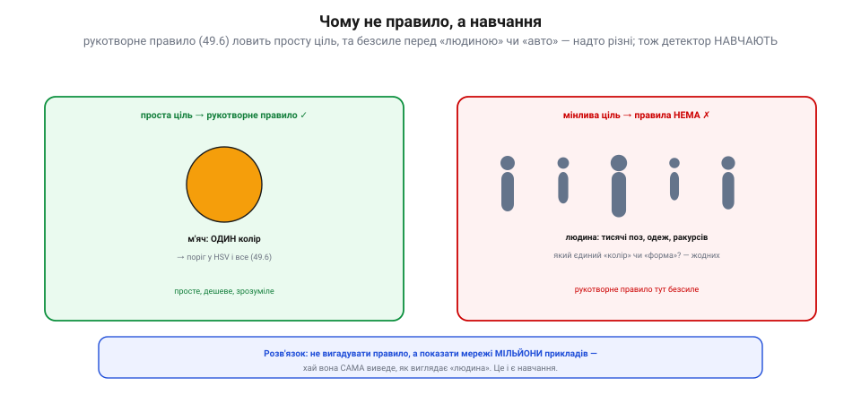
*Рис. 7.9.7.1. Чому навчання. Ліворуч: проста ціль (м'яч — один колір) чудово ловиться **рукотворним правилом** (поріг у HSV, 7.9.6) — дешево й зрозуміло. Праворуч: мінлива ціль (людина — тисячі поз, одеж, ракурсів) не має єдиного «кольору» чи «форми», тож правила не напишеш. Розв'язок: показати мережі **мільйони прикладів** і дати їй самій вивести, як виглядає «людина».*

Замість вигадувати правило, ми **показуємо** мережі мільйони прикладів — фото з підписами «тут людина», «тут авто» — і вона **сама** виводить, які ознаки відрізняють одне від одного. Це і є машинне навчання: не запрограмувати прикмету, а **вивчити** її з даних. Так детектор стає **загальним** — ловить те, що жодним простим правилом не задаси.

### Навчання проти інференсу

Ось найважливіше розрізнення теми. Життя нейромережі ділиться на дві геть різні фази.

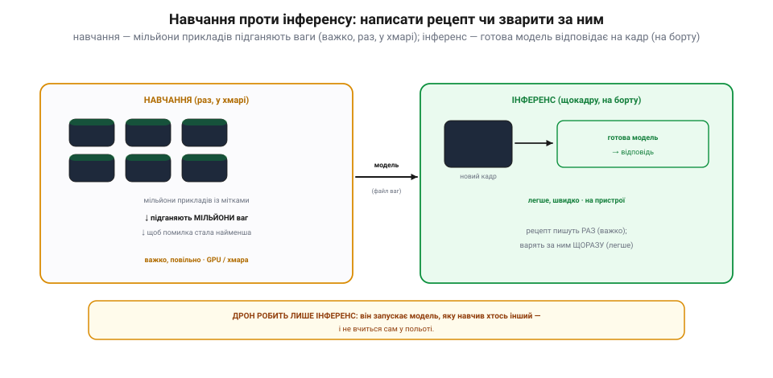
*Рис. 7.9.7.2. Навчання проти інференсу. **Навчання**: мережі дають мільйони прикладів із мітками, і вона підганяє свої **мільйони ваг**, щоб помилка стала найменшою — важко, повільно, раз, на потужних машинах (GPU, хмара). Результат — **модель** (файл ваг). **Інференс**: цю готову модель запускають на **новому** кадрі й дістають відповідь — легше, швидко, на пристрої. Як рецепт: написати його — морока (раз), а зварити за ним — щоразу легше.*

**Навчання** (*training*): мережі згодовують мільйони прикладів із мітками, і вона потроху підкручує свої внутрішні **ваги** (мільйони чисел), доки не навчиться вгадувати правильно. Це важко й повільно, потребує гір даних і потужних машин (GPU, хмара) — і робиться **один раз**. Результат — **навчена модель**: по суті, файл із вивченими вагами. **Інференс** (*inference*): цю **готову** модель запускають на **новому** кадрі — і вона видає відповідь. Це легше й швидше, і робиться **щокадру**, на самому пристрої. Аналогія — кулінарія: скласти рецепт (навчання) важко й робиться раз; варити за ним (інференс) — щоразу й легше. **Ключове для нас**: дрон робить **лише інференс** — він запускає модель, яку навчив хтось інший, і **не вчиться сам** у польоті.

### Що видає детектор: рамки, клас, упевненість

Що ж усередині навченого детектора — і що він повертає? Усередині — стос **згорток** (7.9.3!), але їхні ядра не придумані рукою (як Собель), а **вивчені** під час навчання. Це й називають згортковою нейромережею (**CNN**).

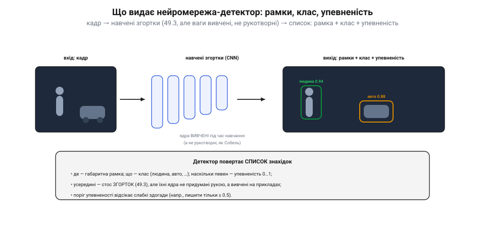
*Рис. 7.9.7.3. Вхід і вихід детектора. Кадр проходить крізь стос **навчених згорток** (CNN) — тих самих згорток із 7.9.3, але з ядрами, **вивченими** на прикладах, а не рукотворними. На виході — **список знахідок**: де (габаритна **рамка**), що (**клас** — людина, авто…) і наскільки певен (**упевненість** 0…1). Поріг упевненості відсікає слабкі здогади.*

На вході — кадр; на виході — **список знахідок**, де кожна має три речі: **рамку** (де об'єкт), **клас** (що це — людина, авто, собака…) і **упевненість** (число 0…1, наскільки мережа певна). Скажімо, «людина 0.94», «авто 0.88». Це типовий вихід сучасних детекторів (на кшталт YOLO). **Поріг упевненості** дає змогу відсікти слабкі здогади — лишити, наприклад, тільки знахідки ≥ 0.5. Згортки роблять ту саму роботу, що й у 7.9.3–7.9.4 (шукають ознаки, межі, текстури), та оскільки їхні ваги **вивчені**, мережа сама склала з простих ознак складні — від країв до «вух», «коліс», «облич».

### Інференс на борту: чим і за скільки

Здавалося б, інференс легкий — та «легкий» тут відносний. Прогнати кадр крізь мережу — це все одно **мільйони множень**, тож голий мікроконтролер його **не потягне**.

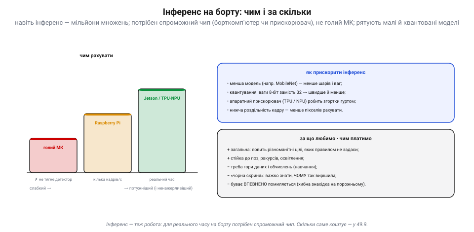
*Рис. 7.9.7.4. Інференс на борту. Чим рахувати: голий **МК** детектор не тягне; **Raspberry Pi** дасть кілька кадрів за секунду; **Jetson** чи апаратний прискорювач (**TPU/NPU**) — реальний час. Прискорюють інференс меншою моделлю (MobileNet), **квантуванням** (ваги 8-біт замість 32), апаратним прискорювачем і нижчою роздільністю. Плата за загальність: гори даних і обчислень, «чорна скриня» (важко знати, **чому** так вирішила) і ризик **упевнено** помилитися.*

Для інференсу на апараті потрібен **спроможний чип**: бортовий комп'ютер (Raspberry Pi дасть кілька кадрів за секунду, Jetson — реальний час) або апаратний **прискорювач** (TPU/NPU), що робить згортки гуртом. Швидкість міряють у **кадрах за секунду** — і її має вистачати для керування. Прискорюють інференс кількома шляхами: **менша** модель (MobileNet — менше шарів), **квантування** (ваги по 8 біт замість 32 → швидше й компактніше), апаратний прискорювач, нижча роздільність кадру. А за загальність нейромережі платять трьома цінами: потрібні **гори даних і обчислень**; модель — «**чорна скриня**» (важко сказати, **чому** вона так вирішила); і вона буває **впевнено помиляється** — бачить ціль там, де її нема. Тому вихід детектора завжди **перевіряють** (поріг упевненості, здоровий глузд, інші давачі).

> 📜 **Нейрон, що побачив край: Г'юбел і Візел і котячий мозок (1959).** Чому згорткова мережа складає образ саме з **країв і простих ознак**? Бо так влаштований живий зір — і відкрили це випадково. Наприкінці 1950-х двоє нейрофізіологів, **Девід Г'юбел** і **Торстен Візел**, устромляли тонесенький електрод у зорову кору **кота** й світили йому на екран різні плями, намагаючись змусити нейрон озватися. Виходило кепсько — аж доки одного разу, коли вони міняли скляну пластинку в проєкторі, її **край** ковзнув екраном тонкою лінією під певним кутом — і нейрон **вистрілив** чергою імпульсів. Дослідники збагнули: ця клітина реагує не на пляму, а на **орієнтований край**! Той єдиний нейрон вони вивчали дев'ять годин поспіль. Виявилося, що в корі є **прості клітини** (ловлять межу під певним кутом і в певнім місці) і **складні** (ловлять край будь-де) — тобто зір будується **шарами**, від простих ознак до складних. За це відкриття 1981 року дали Нобелівську премію, а ще воно надихнуло інженерів: сучасні згорткові мережі (7.9.3) — це і є рукотворна копія тих шарів, де кожен наступний складає зі знайдених країв усе складніші форми. Твій бортовий детектор бачить світ так, як півстоліття тому навчив нас бачити кіт у лабораторії.

> 🔧 **Навіщо це.** Бери нейромережу-детектор, коли ціль **надто мінлива** для правила (люди, авто, тварини, перешкоди різного вигляду). Запускай **готову, наперед навчену** модель — завантаж і розгорни, **не намагайся вчити** її на борту. Для інференсу постав **спроможний чип** (Jetson чи Pi з прискорювачем), а не голий МК, і переконайся, що **кадрів за секунду** вистачає для керування. Бери **малу/квантовану** модель, аби влізти в бортові ват і байти (7.9.9). І ніколи не вір детектору сліпо: став **поріг упевненості**, перевіряй знахідки іншими даними — «чорна скриня» вміє впевнено брехати. А для простих, чітко заданих цілей **класика (7.9.6) дешевша й прозоріша** — не тягни нейромережу там, де досить порога в HSV.

### Підсумок теми

Коли об'єкт надто різноманітний для рукотворного правила, детектор **навчають** на прикладах. Життя моделі ділиться на **навчання** (мільйони прикладів підганяють мільйони ваг — важко, раз, у хмарі) та **інференс** (готова модель відповідає на новий кадр — легше, щокадру, на пристрої), і апарат робить **лише інференс**. Усередині детектора — стос **навчених згорток** (7.9.3), а на виході — список **рамок** із **класом** і **упевненістю**. Інференс на борту теж недешевий: потрібен спроможний чип (Pi, Jetson, прискорювач), а виграш у загальності оплачено даними, обчисленнями, «чорною скринею» й ризиком упевнених помилок. Сама ж ідея шарів простих→складних ознак прийшла від котячого зору Г'юбела й Візела. А **як** людство дійшло від першого штучного нейрона до мереж, що бачать краще за класику, — окрема історія: **від перцептрона до AlexNet** (наступна вставка). Далі ж ми замкнемо все бачене в **керування**: перетворимо піксель на кут і трек (7.9.8).

## 7.9.8 Трекінг і «піксель → кут»: замикання зору в керування

Усе дотепер вело сюди. Ми навчилися **знаходити** ціль у кадрі (7.9.1–7.9.7) — та знайти ще не означає **діяти**. Ця тема замикає коло: повести ціль крізь кадри (**трекінг**), перетворити її піксельне положення на **кут** («піксель → кут») і подати цей кут як **похибку** регуляторові, що поверне апарат чи підвіс. Зір нарешті стає **датчиком у петлі керування** — і це, по суті, мета всього Розділу 7.9.

### Виявлення проти трекінгу: знайти раз, далі вести

Детектор працює **щокадру з нуля**: дорого, а ще його рамка **блимає** й часом губиться (кадр змазався, ціль на мить сховалась). Тут і потрібен **трекінг** — він не шукає заново, а **веде** вже знайдену ціль із кадру в кадр.

*Рис. 7.9.8.1. Виявлення проти трекінгу. **Виявлення** працює щокадру з нуля — дорого, і коли кадр невдалий, рамка зникає (3-й кадр). **Трекінг** веде ту саму ціль: дешевше, неперервно, з єдиною «особистістю», а коли детекція випала — **передбачає** положення (фільтр Кальмана, 7.5) і не губить. На практиці часто роблять так: детектор запускають **зрідка** (він важкий, 7.9.7), а між його спрацюваннями ціль **веде** легкий трекер.*

Трекер тримає не лише «де ціль зараз», а й її **стан** (положення + швидкість) у часі. Тому він уміє **передбачати**, куди ціль зміститься далі — і саме це рятує, коли детектор на мить осліп (ціль за перешкодою, кадр змазався). Тут у пригоді стає старий знайомий — **фільтр Кальмана** (7.5): він зливає зашумлені детекції з передбаченням, згладжує трек і перекидає місток через прогалини. Виходить дешево (трекер легший за детектор), неперервно й стійко.

### Піксель → кут: де ціль відносно камери

Тепер головний геометричний місток. Детектор каже: «ціль у пікселі (cx, cy)». Та апарат не керує **пікселями** — йому потрібен **кут**: на скільки градусів ціль збоку від того, куди дивиться камера. Перехід дає **поле зору** (FOV) камери.

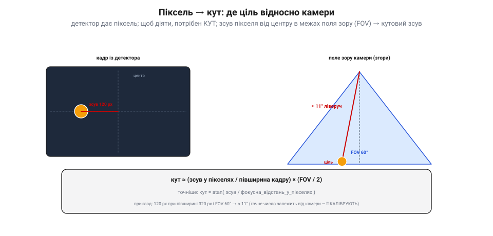
*Рис. 7.9.8.2. Піксель → кут. Детектор дає **зсув** цілі в пікселях від центру кадру. Знаючи **поле зору** камери (FOV), цей зсув переводять у **кут**: кут ≈ (зсув / півширина кадру) × (FOV / 2), а точніше — кут = atan(зсув / фокусна відстань у пікселях). Приклад: 120 px за півширини 320 px і FOV 60° → ≈ 11° ліворуч. Точне число залежить від камери, тож її **калібрують**.*

Ідея проста: піксель на самому краю кадру відповідає **краю поля зору** (півкута FOV), а піксель у центрі — куту 0. Між ними — пропорція: **кут ≈ (зсув у пікселях / півширина кадру) × (FOV / 2)**. Точніше беруть `кут = atan(зсув / фокусна_відстань_у_пікселях)`, де фокусну відстань дає **калібрування** камери (7.9.1 — піксель це число, але щоб зв'язати його з кутом, треба знати оптику). Так «ціль за 120 пікселів ліворуч» стає «ціль за 11° ліворуч» — а кут уже можна **виконати**: повернути апарат чи підвіс саме на стільки.

### Замикання петлі: зір як датчик керування

І ось тут зір вмикається у звичну петлю керування. **Кутова похибка** (наскільки ціль не в центрі) — це просто **сигнал помилки** для регулятора. А регулятор у нас уже є: той самий **PID**.

*Рис. 7.9.8.3. Замикання петлі. Камера дає кадр → детектор/трекер знаходить ціль (7.9.1–7.9.7) → «піксель → кут» дає **кутову похибку** → регулятор **PID** крутить **виконавці** (рискання, підвіс, тяга) → апарат повертається, і ціль вертається до центру кадру → петля замикається. Зір тут — **просто ще один датчик**: похибка = «наскільки ціль не в центрі», а PID той самий, що завжди.*

Уся петля: камера → знайти/вести ціль → перевести в кут → дістати кутову **похибку** → подати її в **PID** → той крутить **рискання** (повернути ніс), **підвіс** (повернути камеру) чи **тягу** — аж доки ціль не опиниться **в центрі** (похибка → 0). Це й зветься **візуальне керування** (*visual servoing*). Чудо в тому, що нічого нового тут нема: зір — це просто **ще один датчик**, як гіроскоп чи GPS, а навколо — звичайнісінький контур керування з тих самих модулів. Камера побачила зсув — регулятор його виправив.

### Застосунки й застереження про затримку

Так замикають десятки корисних поведінок — але з однією важливою осторогою.

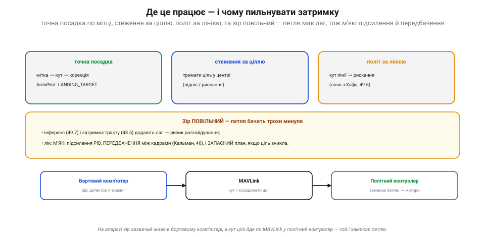
*Рис. 7.9.8.4. Застосунки й затримка. **Точна посадка**: кут мітки (ArUco/AprilTag, 7.9.6) → корекція (в ArduPilot — повідомлення LANDING_TARGET). **Стеження**: тримати ціль у центрі підвісом чи рисканням. **Політ за лінією**: кут лінії (з Хафа, 7.9.6) → рискання. **Та зір ПОВІЛЬНИЙ** (інференс 7.9.7, затримка тракту 7.8.5), тож петля бачить трохи минуле — звідси ризик розгойдування. Лік: **м'які** підсилення PID, **передбачення** між кадрами (Кальман, 7.5) і **запасний план**, якщо ціль зникла. На апараті зір зазвичай живе в **бортовому комп'ютері**, а кут цілі йде по **MAVLink** у політний контролер.*

Найважливіша осторога — **затримка**. Зір повільний: інференс (7.9.7) і затримка відеотракту (7.8.5) означають, що петля реагує на **трохи застаріле** положення цілі. А запізніла реакція в контурі керування — прямий шлях до **розгойдування** (згадай стійкість регуляторів). Тому: тримай **підсилення PID м'якими**, додай **передбачення** (Кальман, 7.5), щоб заповнити час між кадрами, і завжди май **запасний план** на випадок, коли ціль загубилась (зависнути, розширити пошук, передати керування пілотові). У типовій схемі на дроні зір крутиться на **бортовому комп'ютері** (7.9.7), а готовий **кут** (чи координати) цілі він шле по **MAVLink** у політний контролер — і вже той замикає петлю на моторах.

> 📜 **Перший, хто перетворив бачене на дію: робот Shakey (SRI, 1966–1972).** Замикати зір у керування першим навчився не дрон, а кошлатий візок на колесах. У Стенфордському дослідному інституті (SRI) між 1966 і 1972 роками збудували **Shakey** — перший у світі мобільний «розумний» робот, що **бачив** і **діяв**. На ньому стояла телекамера; кадри з неї робот розкладав на **межі** (рівно та обробка, що в 7.9.4), щоб розгледіти стіни й коробки, тоді **планував** маршрут і **їхав**, навіть штовхаючи ящики штовхачем. По суті, Shakey вперше зімкнув ланцюг «**побачив → обміркував → зробив**» — пращур нашого «піксель → кут → керування». А ще проєкт лишив техніці коштовний спадок: саме з нього вийшли алгоритм пошуку **A\*** і **перетворення Хафа** (7.9.6), а серед його творців був **Річард Дуда** — той самий, чия виноска прославила Собеля (7.9.4), а стаття подарувала Хафу сучасний вигляд. (Прізвисько «Shakey» бідолаха дістав за те, що **трусився**, коли рушав.) Тож коли твій апарат наводиться на мітку, він повторює те, що півстоліття тому, тремтячи, робив перший зрячий робот.

> 🔧 **Навіщо це.** Не запускай важкий детектор **щокадру** — лови ціль зрідка, а між тим **веди** її легким трекером (дешевше й гладше); коли детекція випала, **передбачай** (Кальман, 7.5), а не губи. Щоб діяти, переводь **піксель у кут** через FOV/фокус своєї камери — і обов'язково **калібруй** її, інакше кут брехатиме. Подавай кутову похибку у **звичайний PID**: зір — це лиш ще один датчик. Найбільше пильнуй **затримку**: зір повільний, тож тримай підсилення **м'якими**, додавай **передбачення** й завжди май **запасний план**, якщо ціль зникла. На ArduPilot віддай зір **бортовому комп'ютеру**, а кут шли в контролер по **MAVLink** (для посадки — LANDING_TARGET).

### Підсумок теми

Знайти ціль — півсправи; щоб **діяти**, її треба **вести** й **виміряти кутом**. **Трекінг** веде вже знайдену ціль крізь кадри — дешевше, неперервно й із передбаченням (Кальман, 7.5), що рятує, коли детектор на мить осліп. **«Піксель → кут»** через поле зору (й калібрування) камери перетворює піксельний зсув на кутову похибку. А далі — звичне **замикання петлі**: похибку подають у **PID**, що крутить рискання чи підвіс, доки ціль не стане в центр (візуальне керування) — для точної посадки, стеження, польоту за лінією. Головна осторога — **затримка** зору: м'які підсилення, передбачення, запасний план. Так увесь Розділ 7.9 — від пікселя до кута — змикається в керування апаратом, як уперше зробив тремтливий Shakey 1966-го. Лишилось чесно порахувати, у що все це обходиться бортовому залізу (7.9.9).

## 7.9.9 Вартість обчислень: МК vs бортовий комп'ютер

Ми зібрали цілий арсенал зору (7.9.1–7.9.8). Та на летючому роботі діє жорстока арифметика: **усе коштує**, а бюджети — крихітні. Не кожен алгоритм улізе на борт, і головне інженерне рішення тут — **де** запускати зір: на простому мікроконтролері чи на повноцінному бортовому комп'ютері. Ця, остання в розділі, тема — про **ціну** обчислень і про те, як вкласти зір у те, що апарат справді підніме.

### Усе коштує: бюджети летючого робота

На відміну від комп'ютера на столі, апарат у польоті обмежений з усіх боків. Кожна дія зору витрачає кілька дефіцитних ресурсів **водночас**.

*Рис. 7.9.9.1. Усе коштує. Зір на борту витрачає **обчислення** (операцій за секунду), **пам'ять** (RAM під кадр і модель), **живлення** (вати — а отже, час польоту), **вагу** (грами «мозку» — теж час польоту), **тепло** (треба відводити) і додає **затримку** (кадрів за секунду для керування). Усе це — спільний бюджет: важчий і ненажерливіший «мозок» **коротшає** політ. Зір завжди торгується з витривалістю.*

Найболючіше — **вати** й **грами**: потужніший комп'ютер більше важить і більше їсть, а отже, **скорочує** час польоту. Тобто зоровий «мозок» завжди забирає щось у витривалості апарата. Тому питання не «який алгоритм найкращий», а «що **влізе** в мій бюджет ват, грамів, пам'яті й затримки».

### Драбина заліза: від МК до бортового комп'ютера

Залізо для зору лягає в драбину — від крихітного й ощадливого до потужного й ненажерливого.

*Рис. 7.9.9.2. Драбина заліза. **Мікроконтролер** (STM32/ESP32, сам політний контролер): кілобайти пам'яті, мегагерци, мілівати, без ОС — тягне поріг, колірну пляму, лінію, малий Собель; нейромережі чи Канні на HD — зась. **Одноплатник** (Raspberry Pi, Linux): гігабайти, гігагерци, вати — повні конвеєри (Канні, Хаф, контури, шаблон), а легкі нейромережі — повільно. **Одноплатник + прискорювач** (Jetson, Coral TPU, NPU): GPU/NPU роблять згортки гуртом — нейромережі-детектори в реальному часі, ціною десятків ват, тепла й грошей.*

На нижньому щаблі — **мікроконтролер** (МК): той самий чип, що часто й керує польотом. У нього кілобайти пам'яті й мегагерци — досить для **простої** обробки (поріг 7.9.5, колірна пляма 7.9.6, стеження за лінією, дрібний Собель 7.9.4), та аж ніяк не для нейромереж. Вище — **одноплатний комп'ютер** (Raspberry Pi й рідня): гігабайти, кілька гігагерцових ядер, Linux — тут уже крутяться **повні** конвеєри OpenCV (Канні, Хаф, контури, шаблони). А на верхньому щаблі — той самий одноплатник **із прискорювачем** (Jetson, Coral TPU, NPU чи GPU), що робить згортки гуртом і тягне **нейромережі-детектори** (7.9.7) у реальному часі — ціною найбільших ват, тепла й ціни.

### Що скільки коштує: задача → мінімальне залізо

Звідси — практична мапа: кожній задачі зору відповідає **мінімальне** залізо, на якому вона поїде.

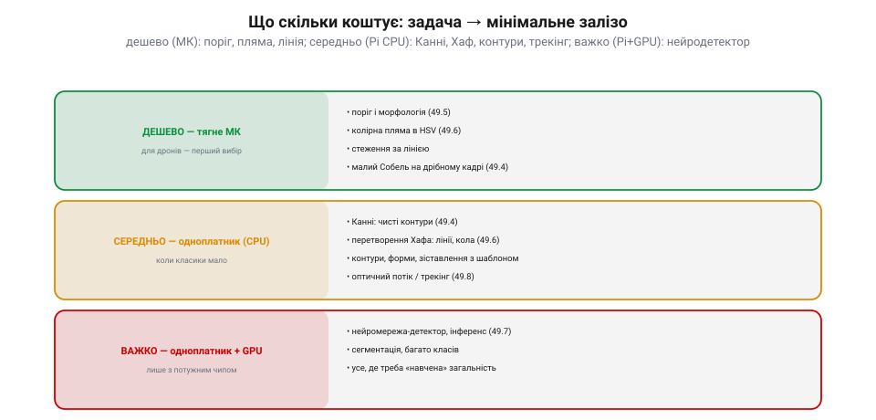
*Рис. 7.9.9.3. Що скільки коштує. **Дешево** (тягне МК): поріг і морфологія (7.9.5), колірна пляма в HSV (7.9.6), стеження за лінією, малий Собель (7.9.4) — для дронів це перший вибір. **Середньо** (одноплатник, CPU): Канні (7.9.4), перетворення Хафа (7.9.6), контури й форми, зіставлення з шаблоном, оптичний потік-трекінг (7.9.8). **Важко** (одноплатник + GPU/прискорювач): нейромережа-детектор та інференс (7.9.7), сегментація, багато класів — усе, де потрібна «навчена» загальність.*

Правило просте: спускайся драбиною вниз, доки задача ще їде. **Поріг, колірна пляма, лінія** — дешеві, тягне МК. **Канні, Хаф, контури, трекінг** — середні, треба одноплатник. **Нейромережа** — важка, треба прискорювач. Перш ніж тягти на борт Jetson, спитай: а може, цілі вистачить порога в HSV на тому чипі, що вже є?

### Як улізти в бюджет; де що крутити

Якщо задача все ж не влазить — її **здешевлюють**, а обчислення **розподіляють**.

*Рис. 7.9.9.4. Як улізти й де крутити. **Здешевити зір**: менший кадр (менше пікселів), сіре (1 канал замість 3, 7.9.1), ROI (лише потрібна ділянка), пропуск кадрів із трекінгом (7.9.8), квантована/мала модель (7.9.7), найдешевший метод спершу (класика 7.9.6 перед нейромережею 7.9.7). **Розподілити**: політний контролер (МК) тримає політ — не зір; бортовий комп'ютер крутить зір і шле кут по MAVLink (7.9.8); найважче можна віддати на землю/в хмару (та з лагом мережі, 7.8.6).*

Прийомів здешевлення кілька: **менший кадр** (менше пікселів), **сіре** замість кольору (1 канал, 7.9.1), **ROI** (обробляти лише ділянку, де ціль), **пропуск кадрів** із трекінгом між ними (7.9.8), **квантована** чи мала модель (7.9.7) — і завжди **найдешевший метод спершу**. А розподіл — це класична архітектура дрона: **політний контролер** (МК) займається лише польотом; **бортовий комп'ютер** (Pi/Jetson) крутить зір і віддає готовий **кут** по MAVLink (7.9.8); а найважче, як-от навчання, лишають **землі чи хмарі** (ціною мережевої затримки, 7.8.6). Кожній задачі — своє місце.

> 📜 **Менше за мікроконтролер — а сів на Місяць: комп'ютер Apollo (1969).** Коли здається, що бортовий чип «слабенький», згадай, на чому люди літали **на Місяць**. Бортовий комп'ютер «Аполлона» (Apollo Guidance Computer), що вів кораблі й садив місячний модуль, мав близько **2 тисяч** комірок оперативної пам'яті та **36 тисяч** постійної, а тактувався на **1 мегагерці** — менше, ніж найдешевший мікроконтролер на твоєму столі сьогодні. Та постійну пам'ять там не «прошивали», а **ткали руками**: дротик крізь магнітне кільце — одиниця, повз — нуль (так звана «канатна пам'ять»). Програму для цього дива писала команда під орудою **Маргарет Гамілтон** у Лабораторії приладобудування MIT — і писала так щільно й вивірено, що під час посадки Аполлона-11, коли комп'ютер **перевантажився** й заблимав тривогою «1202», її система не впала, а **відкинула** другорядні задачі й утримала головне — садіння. Урок для нашого зору подвійний: по-перше, **тісні рамки** змушують писати чисто (багу нема де сховатися); по-друге, розумна система під **перевантаженням** не падає, а **жертвує** найменш важливим — рівно те, що варто закладати й у бортовий зір. Якщо 2 кілослова посадили людину на Місяць, то твій Jetson здатен на чимало — за умови, що ти **поважаєш бюджет**.

> 🔧 **Навіщо це.** Підбирай залізо **під задачу**: не став Jetson, де досить порога на МК, і не проси в МК нейромережі. Лічи не лише обчислення, а й **вати та грами** — вони прямо коротшають політ. Якщо не влазить — **здешевлюй**: менший і сірий кадр, ROI, пропуск кадрів із трекінгом, квантована модель, найдешевший метод спершу. **Розподіляй**: контролер — політ, бортовий комп'ютер — зір (кут по MAVLink), земля — найважче. І, як Гамільтон, **плануй перевантаження**: хай під браком обчислень система кине другорядне, а не задачу польоту. Зрештою — заміряй **кадри за секунду** в реальному польоті: саме вони, а не паспортні цифри чипа, кажуть, чи встигає зір за керуванням.

### Підсумок теми й Розділу 7.9

Зір на борту коштує **обчислень, пам'яті, ват, грамів, тепла й затримки**, тож залізо беруть **під задачу**: МК — для простого (поріг, пляма, лінія), одноплатник — для конвеєрів (Канні, Хаф, трекінг), одноплатник із прискорювачем — для нейромереж. Не влазить — здешевлюй (менший/сірий кадр, ROI, пропуск кадрів, квантування, найдешевший метод) і розподіляй (контролер — політ, комп'ютер — зір по MAVLink, земля — важке). А спадок Apollo нагадує: навіть крихітний комп'ютер здатен на велике, якщо поважати бюджет і гідно зносити перевантаження.

На цьому **Розділ 7.9 завершено**. Ми пройшли семантичну прірву крок за кроком: зробили із зображення **числа** (піксель, канали, колірні простори), приборкали їхній **розподіл** (яскравість, контраст, гістограма), навчилися дивитися на **сусідів** (згортки, фільтри), діставати **межі** (градієнт, Собель, Канні), різати кадр на **області** (пороги, морфологія), **знаходити об'єкти** класикою (колір, форма, Хаф) і **нейромережами** (навчена модель, інференс), **вести** ціль і перетворювати **піксель на кут**, замикаючи зір у керування, — і нарешті чесно зважили **ціну** всього цього. Машина навчилася не лише бачити, а й **діяти** з побаченого. А оскільки найпотужніший зір спирається на **навчені** моделі (7.9.7), наступний розділ відкриє саму цю скриньку — **машинне навчання** (Розділ 7.10).
