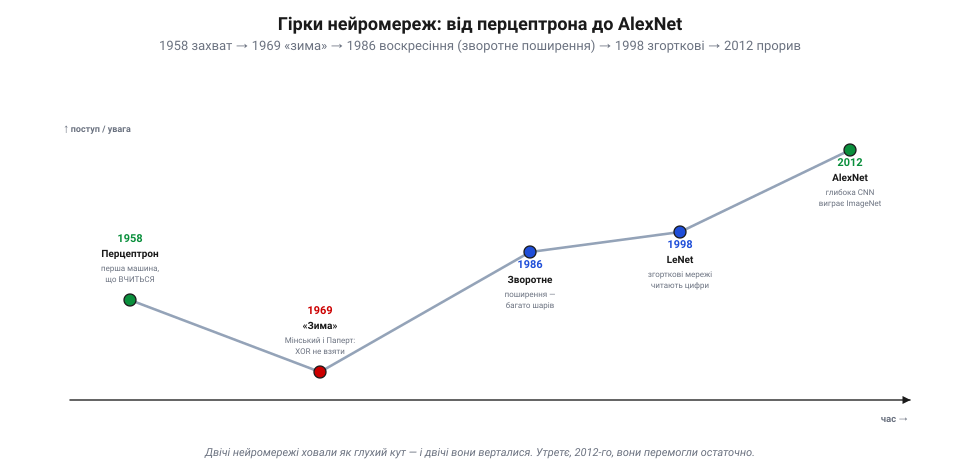
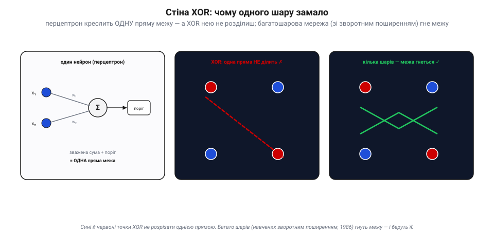
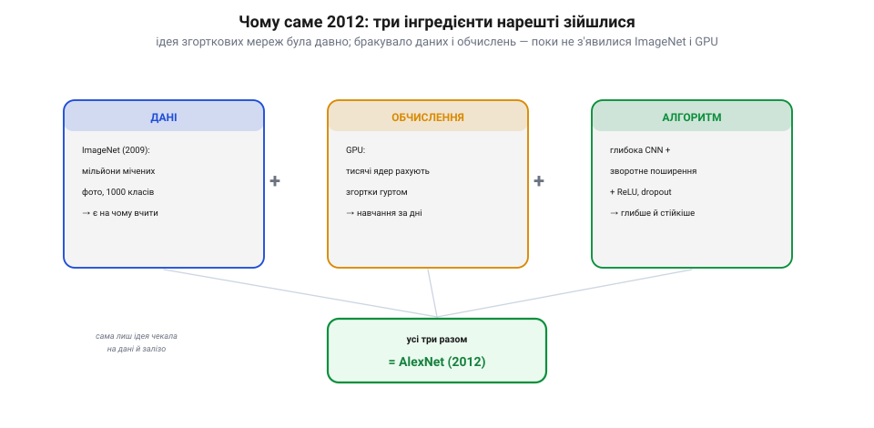
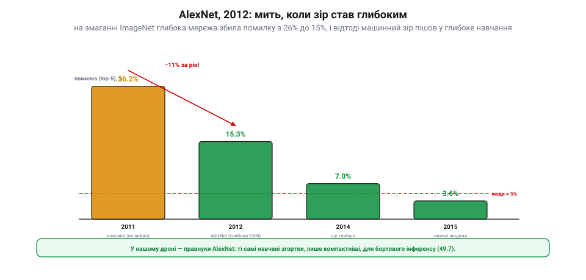

📜 *Історична вставка до [Розділу 7.9 — Машинне бачення: основи](computer-vision.md), теми 7.9.7.*

# Історія: від перцептрона до AlexNet — як нейромережі навчилися бачити

Тема 7.9.7 показала, **що** таке навчена модель і що дрон робить лише інференс. Та за цим спокоєм — півстоліття бурі: ідею «машини, що вчиться бачити», двічі ховали як глухий кут, і двічі вона верталася, аж поки 2012 року не перемогла остаточно. Це історія про впертість однієї думки — і про те, як їй довелося **дочекатися** свого часу.

## Перцептрон: перша машина, що вчиться (1958)

Усе почалося із захвату. 1958 року психолог **Френк Розенблат** збудував **перцептрон** — першу машину, яка не виконувала готову програму, а **вчилася** на прикладах. Його штучний «нейрон» брав кілька входів, множив кожен на свою **вагу**, додавав і порівнював із порогом — і, дивлячись на помилки, сам **підкручував ваги**, доки не починав правильно розрізняти прості образи (скажімо, фігури на сітці фотоелементів).

*Рис. 1. П'ятдесят років гірок. Перцептрон (1958) викликав захват; критика 1969-го («зима») його поховала; зворотне поширення (1986) воскресило багатошарові мережі; згорткові LeNet (1998) навчилися читати цифри; а 2012-го глибока мережа AlexNet виграла ImageNet — і зір остаточно став «глибоким». Двічі впавши, утретє нейромережі перемогли.*

Преса нетямилася: газети писали про «зародок електронного мозку», що скоро ходитиме, говоритиме й бачитиме. Здавалося, до думаючої машини — рукою подати.

## Стіна XOR і перша зима (1969)

А тоді прийшло протверезіння. 1969 року **Марвін Мінський** і **Сеймур Паперт** (так-так, той самий Паперт, що 1966-го замовив «зір на літо», 7.9.0) видали книжку «Perceptrons», де математично довели **межу** одного шару: перцептрон креслить лише **одну пряму** межу між класами — а отже, безсилий перед задачами, яких прямою не розітнеш. Класичний приклад — **XOR**.

*Рис. 2. Стіна XOR. Один нейрон — це зважена сума плюс поріг, тобто **одна пряма** межа. Але чотири точки XOR (по діагоналях — різні класи) однією прямою не розділити (середня панель ✗). Аж **багатошарова** мережа здатна **зігнути** межу й розрізнити їх (права панель ✓) — та навчати такі мережі тоді ще не вміли.*

Висновок звучав як вирок: щоб обійти XOR, потрібні **багато шарів**, а навчати багатошарові мережі тоді ніхто не вмів. Фінансування пересохло, ентузіазм згас — настала перша «**зима** штучного інтелекту». Перцептрон списали в архів.

## Зворотне поширення вертає життя (1986)

Думка, проте, не вмерла. Бракувало одного — способу **навчати багато шарів**. Його дало **зворотне поширення помилки** (*backpropagation*): обчислити, наскільки кожна вага в кожному шарі винна в підсумковій помилці, і підправити всі ваги в правильний бік. Ідея визрівала з 1970-х (Вербос), та гучно її подали 1986 року **Девід Румельгарт**, **Джеффрі Гінтон** і **Рональд Вільямс**. Тепер багатошарова мережа могла **взяти й XOR**, і складніше.

Невдовзі ці ідеї дали перший справжній зоровий успіх. **Ян Лекун** поєднав зворотне поширення зі **згортками** (7.9.3) — і його мережа **LeNet** (доведена до LeNet-5 1998 року) навчилася **читати рукописні цифри**: поштові індекси, суми на чеках. Згорткові мережі вже працювали в реальному світі. Та масштабувати їх на «усе на світі» бракувало двох речей.

## Три інгредієнти сходяться: дані, обчислення, алгоритм

Чому ж тоді LeNet читав цифри, а «бачити світ» мережі навчилися аж за чверть століття після перцептрона? Бо для цього мали зійтися **три** інгредієнти — а в наявності довго було лише два.

*Рис. 3. Три інгредієнти. Сама **ідея** (глибока згорткова мережа + зворотне поширення) була готова ще з 1980–90-х. Бракувало **даних** — поки 2009-го не з'явився **ImageNet** (мільйони мічених фото); і **обчислень** — поки для навчання не запрягли **GPU** (відеокарти з тисячами ядер). Щойно всі три зійшлися — стався прорив.*

**Алгоритм** (глибока CNN зі зворотним поширенням) уже був. Бракувало **даних**, аби нагодувати голодну до прикладів мережу, — і їх дав **ImageNet**: зібраний під орудою **Фей-Фей Лі** велетенський набір із мільйонів розмічених фото на тисячу класів (2009), а з ним — щорічне змагання розпізнавачів. Бракувало **обчислень** — і їх дали **відеокарти** (GPU): тисячі їхніх ядер рахують згортки гуртом, тож навчання, що тривало б місяці, стискалося до днів. Ідея просто **чекала** на дані й залізо.

## AlexNet і мить, коли зір став глибоким (2012)

2012 року все зійшлося. На змаганні ImageNet **глибока** згорткова мережа **AlexNet** (Алекс Крижевський, Ілля Суцкевер і Джеффрі Гінтон), навчена на GPU, розгромила всіх.

*Рис. 4. Мить перелому. Доти найкращі (не нейромережеві) розпізнавачі давали ≈26% помилок; AlexNet 2012-го збив це до **15.3%** — стрибок, нечуваний за один рік. А далі глибокі мережі покотилися вниз, за кілька років пробивши навіть **людський** рівень (≈5%). Відтоді машинний зір — це здебільшого глибоке навчання.*

Розрив був разючий: **15.3%** помилок проти **26.2%** у найкращого суперника. За один рік — стрибок, якого галузь не бачила. Усі зрозуміли: майбутнє зору — за **глибокими** мережами. За кілька наступних років вони пробили навіть людський рівень розпізнавання, а архітектура AlexNet (за духом — підрослий LeNet) породила цілий рід дедалі глибших мереж. Те, що Розенблат намріяв 1958-го, нарешті збулося — просто треба було дочекатися даних і заліза.

## Що з цього в нашому апараті

Коли твій дрон проганяє кадр крізь навчений детектор (7.9.7), він користає рівно цим спадком. Усередині — **згортки** (7.9.3), навчені **зворотним поширенням** (1986); сама архітектура — нащадок **LeNet** і **AlexNet**; а ваги вивчені на величезних наборах на кшталт **ImageNet**, на потужних **GPU** в хмарі. Бортовий чип лише запускає готову модель — **правнука** AlexNet, обрізаного й квантованого, щоб улізти у ват і байти апарата (7.9.9).

І ще урок, вартий пам'яті: гарна ідея може **випередити** свій час на десятиліття. Перцептрон не був хибним — він був **завчасним**; йому бракувало шарів, даних і заліза. Тож коли наступного разу почуєш, що якийсь підхід «не працює», згадай нейромережі: іноді бракує не ідеї, а лише її часу. Історія дала нам **двигун** сучасного зору; час замкнути все це в керування апаратом (7.9.8).
