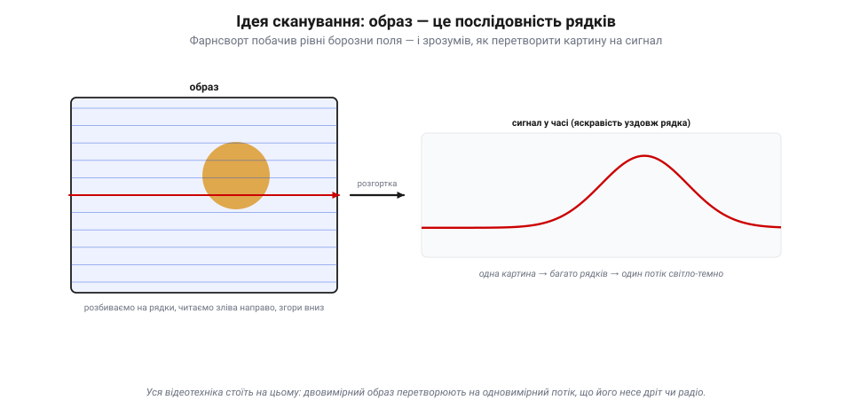
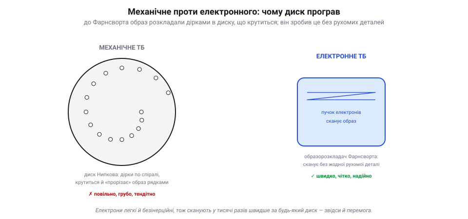
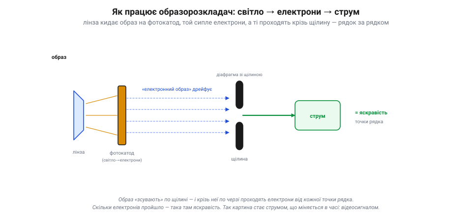
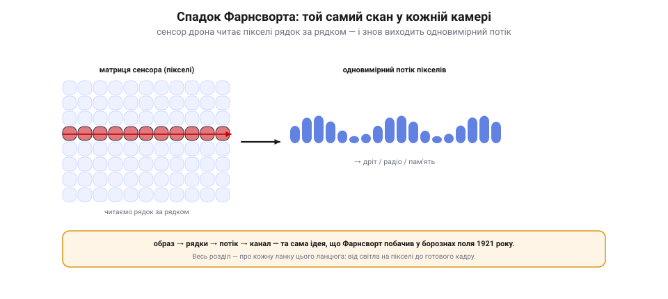

📜 *Історична вставка до [Розділу 7.7 — Відеосигнали I: від світла до кадру](video-signals-1.md).*

# Історія: Філо Фарнсворт — фермерський хлопець, що винайшов електронну телекамеру

Наступні розділи Модуля 7 — про **зір** апарата: як камера перетворює світло на кадр, як той кадр стискають і передають, як машина бачить у ньому об'єкти. Та перш ніж розкладати все на пікселі й біти, варто спинитися на найпершому, найхитрішому: **як узагалі перетворити живу картину на щось, що можна передати дротом?** Образ — двовимірний і неперервний; дріт несе лише одне число за раз. Відповідь, що лежить в основі всієї відеотехніки, знайшов **підліток із ферми** в Айдахо, задивившись на зоране поле. Звали його **Філо Фарнсворт**.

## Образ у борознах: ідея сканування

1921 року чотирнадцятирічний Філо боронував батькове картопляне поле — рядок за рядком, туди й назад, аж до обрію. І раптом, дивлячись на ці **рівні борозни**, він побачив відповідь на питання, над яким бились інженери: щоб передати картину дротом, її треба **розбити на рядки** — так само, як поле розбите на борозни, — і «прочитати» їх **по черзі**, точку за точкою, рядок за рядком.

*Рис. 7.7.0.1. Ідея сканування. Двовимірний образ (ліворуч) розбивають на горизонтальні рядки й читають по черзі — зліва направо, згори вниз. Яскравість уздовж одного рядка стає сигналом у часі (праворуч): сплеск там, де яскрава пляма. Багато таких рядків — і ціла картина перетворюється на єдиний одновимірний потік «світло-темно», що його несе дріт чи радіо.*

У цьому й уся таємниця. Двовимірний образ **неможливо** передати дротом цілком — зате можна **розгорнути** його в один довгий потік: бери верхній рядок, пробігай по ньому зліва направо, передаючи яскравість кожної точки; тоді наступний рядок, і так до низу. На тому кінці дроту цей потік знов «складають» у картину — рядок під рядок. Так двовимірне стає одновимірним, картина стає **сигналом у часі**. Ця ідея — **сканування** (розгортки) — і досі лежить в основі геть усього: і старого телевізора, і камери твого дрона. Усе подальше — лише техніка того, як швидше й точніше пробігати ці рядки.

## Механічне проти електронного: чому диск програв

Фарнсворт був не перший, хто хотів передати образ рядками. До нього вже **існувало** механічне телебачення: перед об'єктивом крутився **диск Нипкова** — кружало з дірочками по спіралі, що, обертаючись, по черзі «прорізали» образ на рядки. Воно навіть працювало — але кепсько: диск важкий і тендітний, крутиться повільно, картинка виходила груба (кілька десятків рядків) і миготлива.

*Рис. 7.7.0.2. Чому переміг електронний скан. Механічне ТБ (ліворуч) прорізало образ дірками в **диску Нипкова**, що крутиться, — повільно, грубо, тендітно. Фарнсворт (праворуч) сканував образ **пучком електронів** без жодної рухомої деталі: електрони безінерційні, тож ганяти їх можна в тисячі разів швидше — більше рядків, чіткіше, надійніше. Механічне ТБ зникло за кілька років.*

Геніальність Фарнсворта була в тому, щоб викинути **будь-яку рухому деталь**. Замість диска, що механічно прорізає образ, він запропонував сканувати його **пучком електронів**. Електрони майже нічого не важать і не мають інерції, тож їх можна ганяти по образу **в тисячі разів швидше** за будь-яке кружало — а отже, дати багато рядків, чітко й без миготіння. Це й була ідея **повністю електронного** телебачення: ні диска, ні моторчика, сама лише фізика заряджених частинок. Майбутнє лишилося за ним, а механічне ТБ зникло за кілька років.

## Хлопець із лабораторії: перша лінія (1927)

Ідею треба було втілити в залізо — точніше, у скло й вакуум. Фарнсворт сконструював **образорозкладач** (*image dissector*) — вакуумну трубку, де лінза кидала образ на світлочутливу пластину (фотокатод), та під світлом сипала електрони, і цей «електронний образ» по черзі простягали повз вузьку **щілину**.

*Рис. 7.7.0.3. Образорозкладач Фарнсворта. Лінза кидає образ на **фотокатод**, який під світлом сипле електрони — виходить «електронний образ». Його зсувають повз вузьку **щілину**, і крізь неї по черзі проходять електрони від кожної точки рядка. Скільки пройшло — така там яскравість. Так картина стає струмом, що міняється в часі: відеосигналом.*

Скільки електронів проходило крізь щілину тієї миті — така була яскравість точки. Так образ перетворювався на **струм, що міняється в часі**, — на відеосигнал. **7 вересня 1927 року** двадцятиоднорічний Фарнсворт у своїй лабораторії в Сан-Франциско передав цим приладом перше **електронне телевізійне зображення** — просту **пряму лінію** на скельці. Дрібниця на вигляд — а насправді народження всього подальшого відео: уперше картину розклали й передали **без жодної рухомої деталі**. Кажуть, згодом він показав інвесторам знак долара, що тремтить на екрані, — і ті спитали: «Коли ж ми побачимо в цьому гроші?»

## Війна з гігантом: Фарнсворт проти RCA

А далі почалася історія, сумно типова для одинака проти корпорації. Телевізійне майбутнє запахло мільйонами, і за нього взялася могутня **RCA** на чолі з Девідом Сарновим. Її інженер **Володимир Зворикін** (емігрант із Російської імперії) розробляв свою передавальну трубку — іконоскоп. 1930 року RCA прислала Зворикіна **оглянути** лабораторію Фарнсворта; камера-образорозкладач його вразила, і невдовзі RCA запропонувала Фарнсвортові 100 тисяч доларів за його роботу. Той **відмовився**.

Почалася виснажлива **патентна війна**. RCA, звична вигравати такі справи грішми й адвокатами, доводила, що пріоритет за Зворикіним. Та Фарнсворта врятувала несподівана деталь: його шкільний учитель фізики згадав і **відтворив той самий малюнок**, що юний Філо накреслив йому на дошці ще 1922 року, пояснюючи ідею сканування. Цей доказ вирішив справу — патент лишився за Фарнсвортом, і RCA, уперше у своїй історії, мусила платити роялті сторонньому винахідникові.

Тут варто бути чесним до обох таборів: електронне ТБ постало **не з однієї голови**. Фарнсвортові належить **принцип** і пріоритет першої електронної телекамери (образорозкладача); але практичну передавальну трубку для мовлення — **іконоскоп** — довели вже Зворикін і RCA, уклавши в це величезні гроші. Один дав ідею й патент, інші — інженерну та промислову основу; робоче телебачення зійшлося з **обох** внесків.

Та особистого щастя це не принесло: роки судів, війна (коли телебачення згорнули), виснаження. Фарнсворт так і не розбагатів на своєму винаході й помер досить забутим, тоді як слава дісталася корпораціям. Лишився, утім, головний спадок — **сама ідея**, без якої не було б ні екранів, ні камер.

## Що з цього в нашому апараті

Камера дрона не має ні диска, ні вакуумної трубки — у ній крихітна кремнієва матриця. Та робить вона рівно те, що Філо побачив у борознах: **розбиває образ на рядки й читає пікселі по черзі**, рядок за рядком, перетворюючи двовимірну картину на **одновимірний потік** чисел.

*Рис. 7.7.0.4. Той самий скан сьогодні. Кремнієва матриця сенсора читає пікселі **рядок за рядком** (червоний — рядок, що зчитується зараз) і видає **одновимірний потік** значень — у дріт, радіо чи пам'ять. Образ → рядки → потік → канал: рівно та ідея, що Філо Фарнсворт побачив у борознах поля 1921 року. Цей розділ — про кожну її ланку.*

Цей потік уже можна стиснути, передати по радіо на землю чи згодувати машинному баченню — але починається все з тієї самої **розгортки**. І саме її ланки розбирає цей розділ: як піксель ловить світло (7.7.1), як матриця збирає кадр (7.7.2), як зчитують колір (7.7.3), скільки в кадрі шуму й деталей (7.7.4–7.7.5), як це тече аналоговим сигналом у FPV (7.7.6) і чому **затримка** цього потоку критична, коли на ньому летить апарат (7.7.7). Фарнсворт дав ідею побачити; інженерія перетворення світла на кадр — попереду.
