# Розділ 7.7 — Відеосигнали I: від світла до кадру

Історія цього розділу лишила нас із великою ідеєю Фарнсворта: образ можна розкласти на рядки й передати потоком. Та лишилося питання, з якого все буквально починається: **як одна точка картини стає числом?** Перш ніж бігати по рядках, треба вміти зміряти яскравість в одній цятці — упіймати світло й перетворити його на сигнал. Цей розділ — про шлях **від світла до кадру**: як піксель ловить фотони (7.7.1), як мільйони пікселів збираються в матрицю (7.7.2), як із сірого виходить колір (7.7.3), скільки в кадрі деталей і шуму (7.7.4–7.7.5) і як усе це тече відеосигналом, яким керують апаратом (7.7.6–7.7.7).

Почнімо з найменшої цеглинки — **пікселя**, крихітної пастки для світла. Зрозумієш, як вона працює, — і весь дальший шлях образу стане прозорим.

> 📜 Історія теми: [Філо Фарнсворт — хлопець, що винайшов електронне ТБ](hist-farnsworth.md). Вона пояснює головну ідею — **сканування**, на якій стоїть усе відео.

---

## 7.7.1 Сенсор зображення: піксель ловить світло

### Фотон вибиває електрон

Світло — це потік крихітних «зерняток» енергії, **фотонів**. А пастка для них зроблена з **кремнію** — того самого напівпровідника, що й уся мікроелектроніка. Фокус у простій фізиці: коли фотон влучає в кремній, він **вибиває** з атома один **електрон**, роблячи його вільним. Світло-причина — електрон-наслідок. Це і є місток від світу світла до світу електрики.

*Рис. 7.7.1.1. Фотоефект — місток від світла до електрики. Світло — потік фотонів; коли фотон влучає в кремній, він вибиває з атома вільний електрон. Що яскравіше світло — то більше фотонів за секунду й більше вибитих електронів. Отже, **кількість електронів пропорційна кількості світла** — лишається їх зібрати й порахувати.*

Що яскравіше світло — то **більше фотонів** за секунду, а отже, більше вибитих електронів. Ось і вся таємниця: **кількість електронів пропорційна кількості світла**. Лишається їх зібрати й порахувати — і матимеш число, що каже, наскільки яскрава ця цятка.

> 📜 Те, що світло вибиває електрони саме «зернятками» (порціями), пояснив 1905 року **Альберт Ейнштейн** — і не теорією відносності, а саме **фотоефектом**. Він припустив, що світло складається з квантів (фотонів), кожен зі своєю порцією енергії, і це акуратно пояснило, чому світло вибиває електрони так, а не інакше. Саме за **фотоефект**, а не за відносність, Ейнштейн дістав Нобелівську премію 1921 року. Сто років по тому той самий фотоефект працює в кожному пікселі твоєї камери: фотон зайшов — електрон вибито.

### Піксель — це відерце для електронів

Як же зібрати й порахувати вибиті електрони? Кожен **піксель** — це крихітне «**відерце**» (потенціальна яма), куди стікаються електрони, вибиті світлом саме в цій цятці. Поки триває знімок, фотони сиплються, електрони накопичуються — і відерце потроху **наповнюється**. Що яскравіше світло било в цей піксель, то вищий рівень у відерці наприкінці.

*Рис. 7.7.1.2. Піксель — відерце для електронів. Поки триває знімок, фотони наповнюють «відерце» (потенціальну яму) вибитими електронами; що яскравіше світло, то вищий рівень. Наприкінці заряд перетворюють на напругу, а АЦП — на число: **світло → електрони → заряд → напруга → число**. Це число і є яскравість пікселя. Саме відерце сліпе до кольору — лічить усі фотони підряд.*

Наприкінці знімка електроніка **міряє рівень** у кожному відерці. Зібраний заряд перетворюють на **напругу**, а ту — **АЦП** (з Розділу 4.7) на **число**. Виходить ланцюжок: **світло → електрони → заряд → напруга → число**. Оце число — яскравість пікселя — і є той «світло-темно», що його Фарнсворт гнав рядками. Мільйони таких відерець у сітці (7.7.2) — і маєш сенсор, що одним кліком наповнює їх усі, а тоді зчитує рядок за рядком.

Зверни увагу: відерце саме по собі **сліпе до кольору**. Воно лічить усі фотони підряд, не розрізняючи, червоні вони чи сині, — тобто міряє тільки **яскравість**. Звідки ж береться колір — окрема хитрість (7.7.3); поки що піксель бачить світ у відтінках сірого.

> 🔧 **Навіщо це.** Чим **більше** відерце (фізичний розмір пікселя), то більше світла воно вловить, перш ніж переповниться, — і то менше шуму на темному. Тому за однакових мегапікселів сенсор із **більшими** пікселями (більша матриця) знімає чистіше, надто в сутінках. Це пояснює, чому камера дрона з крихітним сенсором гірша поночі за «велике» око, хоч би скільки мегапікселів обіцяла наклейка.

### Витримка: скільки тримати відерце відкритим

Скільки електронів набереться, залежить не лише від яскравості, а й від того, **як довго** ми збираємо, — від **витримки** (експозиції). Це час, протягом якого відерце «відкрите» й ловить фотони.

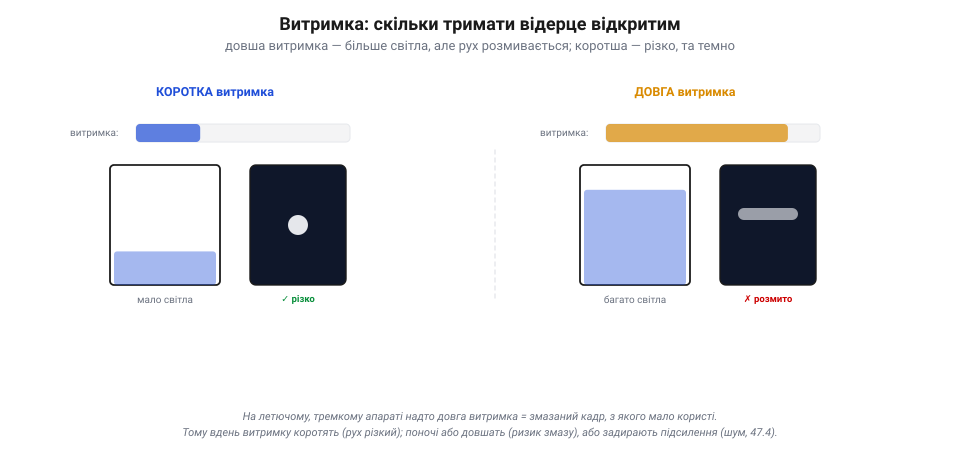
*Рис. 7.7.1.3. Витримка — скільки тримати відерце відкритим. Коротка витримка ловить мало світла (кадр темний), зате застигає рух чітко. Довга набирає багато світла (яскраво), та якщо щось рухалося — розмаже (motion blur). На тремкому летючому апараті надто довга витримка дає змазаний кадр, тож камера балансує між яскравістю й різкістю.*

Тут компроміс. **Коротка** витримка ловить мало світла — кадр темний, зате рух **застигає** чітко. **Довга** витримка набирає багато світла — кадр яскравий, та якщо за цей час щось рухалося, воно **розмажеться** (motion blur), бо в одне відерце впали фотони з різних місць. На дроні це критично: апарат тремтить і летить, тож надто довга витримка дасть **змазаний** кадр, з якого ні людині, ні машинному баченню користі мало. Тому камера балансує: відкрити відерце надовго, щоб набрати світла, — але не настільки, щоб політ розмив картинку.

> 🔧 **Навіщо це.** «Темне й зернисте» чи «світле, але змазане» — це майже завжди про витримку. Удень її коротять (світла досить, рух чіткий); поночі мусять довшати — і тоді або задирають **підсилення** (про шум — 7.7.4), або ловлять змазування. На рухливому апараті радше жертвуй яскравістю заради короткої витримки: різкий темний кадр кращий за яскравий мазок.

### Стеля й підлога: переповнення та шум

У відерця є **межі**. Зверху — **повна місткість** (full-well): більше за певне число електронів воно не вмістить. Як світла забагато (яскраве небо, сонце в кадрі), відерце **переповнюється** — і всі такі пікселі однаково «білі», деталей у них уже нема. Це **насичення** (пересвіт): за стелею яскравості картина обрізається в суцільну білість.

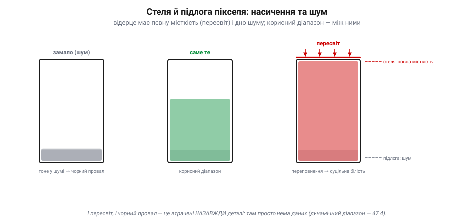
*Рис. 7.7.1.4. Стеля й підлога пікселя. Зверху — **повна місткість**: забагато світла переповнює відерце, і пікселі стають однаково білими (насичення, пересвіт) — деталей нема. Знизу — **підлога шуму**: слабке світло тоне у випадкових електронах. Корисний піксель — лише між ними; це його динамічний діапазон (7.7.4). І пересвіт, і чорний провал — це втрачені назавжди дані.*

Знизу теж є межа — **підлога шуму**. Навіть у темряві у відерці трохи «бовтається» випадкових електронів (тепловий шум, завади). Якщо реального світла менше за цей дріб, його не відрізнити від шуму — деталь тоне. Тож піксель **корисний** лише між підлогою (шум) і стелею (насичення); це його **динамічний діапазон**, до якого ми ще повернемося (7.7.4). Звідси й мистецтво експозиції: підібрати витримку й підсилення так, щоб важливе світло лягло **між** цими межами, не потонувши в шумі й не вилетівши в білість.

> 🔧 **Навіщо це.** І пересвіт, і провал у чорне — це **втрачені назавжди** деталі: з вибіленого неба чи чорної тіні нема чого витягати, там просто нема даних. Тому для машинного бачення (Розділ 7.9) важливо тримати об'єкт у середині діапазону: не пересвітити марку чи лінію й не загубити її в тіні. Камера, що сама «жене» експозицію по середньому кадру, може засліпнути на яскравому небі — і проґавити темну ціль під ним.

### Підсумок теми

Піксель — це пастка для світла, що працює на простій фізиці: фотон вибиває з кремнію електрон (фотоефект Ейнштейна), і що яскравіше світло, то більше електронів. Кожен піксель — **відерце**, куди ці електрони стікаються за час **витримки**; наприкінці рівень міряють і перетворюють у число: **світло → електрони → заряд → напруга → число**. Витримка задає компроміс «світло проти різкості» (довга набирає яскравість, та розмиває рух — критично на летючому апараті), а саме відерце обмежене згори **насиченням** (пересвіт) і знизу **шумом**, між якими й лежить корисний діапазон. Одне відерце вже вміє зміряти яскравість цятки — лишилось скласти мільйони їх у сітку й навчитися швидко зчитувати. Цим і займемося в 7.7.2.

---

## 7.7.2 Матриця CMOS; експозиція й підсилення

У 7.7.1 ми розібрали одне **відерце** — як піксель ловить світло й перетворює його на число. Та камера — це не один піксель, а **мільйони** їх, складених у сітку, плюс хитра механіка зчитування й дві ручки яскравості. Про цей рівень — від купи відерець до готового кадру — і буде тема.

### Сітка відерець, адресована як пам'ять

Сенсор — це **матриця**: пікселі-відерця, вишикувані рядками й стовпцями, мільйонами. У найпростішій картині всі вони ловлять світло **воднораз** за час витримки (так і робить **глобальний** затвор; а в дешевшому **згортковому** рядки експонуються зі зсувом — про це нижче). А ось зчитати їх воднораз неможливо — тож сенсор адресує пікселі, мов комірки пам'яті.

*Рис. 7.7.2.1. CMOS-матриця адресує пікселі, мов пам'ять. Мільйони пікселів-відерець стоять сіткою й ловлять світло воднораз. Зчитування: електроніка вмикає **один рядок** (червоний), усі його пікселі віддають заряд у **стовпцеві підсилювачі** → АЦП → потік чисел; тоді наступний рядок, згори вниз. У CMOS кожен піксель має свій підсилювач і адресується окремо — тому сенсор дешевий, швидкий, малоспоживний.*

Працює це так само, як читання пам'яті: електроніка **вмикає один рядок**, і всі його пікселі віддають свій заряд у **стовпцеві підсилювачі**, а ті — в АЦП; виходить рядок чисел. Тоді наступний рядок, і так згори вниз — точнісінько Фарнсвортова розгортка, тільки електронна й паралельна по стовпцях. Саме така архітектура й зветься **CMOS**: кожен піксель має **свій** підсилювач і адресується окремо, як осередок мікросхеми. Це робить сенсор дешевим, швидким, малоспоживним — тому CMOS і стоїть нині майже в кожній камері, від телефона до дрона.

> 📜 Зробити з матриці пікселів дешеву «камеру на чіпі» зумів **Ерік Фоссум** із командою НАСівської Лабораторії реактивного руху (JPL) на початку 1990-х. Шукаючи, як **зменшити** камери для міжпланетних апаратів, не втративши якості, його група (зокрема Сунетра Мендіс і Сабрина Кемені) 1993 року довела до практичного вигляду **CMOS-сенсор з активним пікселем**: кожен піксель дістав власний підсилювач прямо на чіпі. Сама ідея активного пікселя мала попередників, але доти такі сенсори надто шуміли; команда Фоссума **приборкала шум** — і вийшла «камера на одному кристалі». 1995-го він заснував компанію, щоб це продавати, а сьогодні його винахід стоїть у **мільярдах** камер щороку — майже в кожному смартфоні. Космічна технологія, що опинилась у кожній кишені — і на кожному дроні.

### Згортковий затвор: ціна рядкового зчитування

Та в рядкового зчитування є підступна ціна. Якщо пікселі **починають і завершують** збір світла не воднораз, а рядок за рядком згори вниз, то верх кадру знято трохи **раніше** за низ. Це **згортковий затвор** (*rolling shutter*) — і на швидкому русі він кривить картинку.

*Рис. 7.7.2.2. Згортковий проти глобального затвора. **Згортковий** (ліворуч): рядки знято в різні миті (t0, t1, …) згори вниз, тож рухома пряма щогла виходить **косою**, а вібрація робить кадр хвилястим («желе»). **Глобальний** (праворуч): усі пікселі замикаються воднораз — щогла пряма. Для машинного бачення глобальний затвор кращий, та дорожчий.*

Уяви, що знімаєш швидку вертикальну щоглу, а вона (чи камера) рухається вбік. Поки сенсор дочитав до низу, об'єкт уже зрушив — і пряма щогла виходить **косою**. А коли апарат вібрує, різні рядки ловлять різну фазу тремтіння, і кадр **хвилюється**, наче желе (так і кажуть — *jello effect*). Ліки від цього — **глобальний затвор** (*global shutter*), де всі пікселі замикаються воднораз: жодного перекосу, та коштує він дорожче й складніший. Для звичайного відео терплять згортковий; а от для **машинного бачення** на дроні (одометрія, фотограмметрія — Розділ 7.9) перекоси отруйні, тож там цінують глобальний затвор.

> 🔧 **Навіщо це.** Хвилясте «желе» на FPV-відео й косі стовпи — це згортковий затвор плюс вібрація. Ліки ті самі, що рятують і фьюжн (7.5.6): **гасити вібрацію** (м'яко підвісити камеру, збалансувати гвинти). А якщо камера працює на машинне бачення — бери сенсор із **глобальним затвором**, інакше алгоритми міритимуть скривлений світ.

### Дві ручки яскравості: витримка й підсилення

Кадр вийшов темним — як його **освітлити**? Ручок дві, і в кожної своя плата.

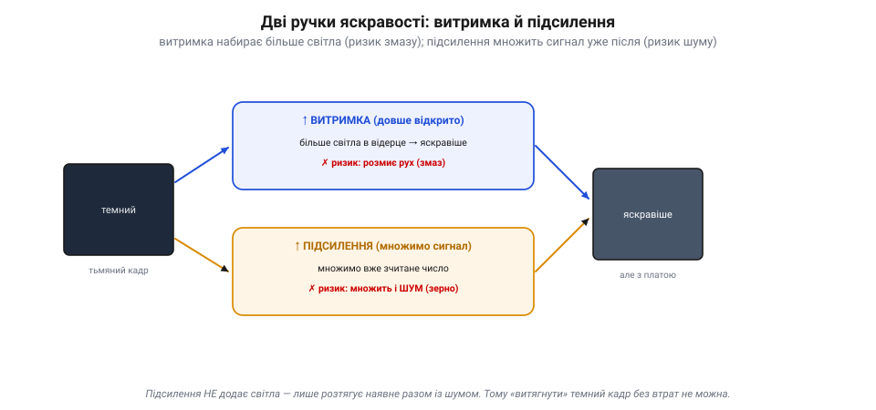
*Рис. 7.7.2.3. Дві ручки яскравості. Темний кадр можна освітлити двома шляхами. **↑ Витримка** (синій): тримати відерце відкритим довше — більше світла, але ризик змазати рух. **↑ Підсилення** (бурштиновий): домножити вже зчитане число електронно — миттєво й без змазу, та множиться й **шум**, кадр зернить. Підсилення не додає світла — лише розтягує наявне разом із шумом.*

Перша ручка — **витримка** (з 7.7.1): тримай відерце відкритим **довше**, набереться більше світла, кадр яскравішає. Плата відома — **змаз** руху. Друга ручка — **підсилення** (*gain*, у фотографії — ISO): уже **зчитане** число просто **домножити** на електроніці. Кадр теж яскравішає, причому миттєво й без змазу. Та підсилення **не додає світла** — воно розтягує те, що є, **разом із шумом**: тихий дріб випадкових електронів (7.7.1) множиться нарівні з сигналом, і кадр стає **зернистим**. Тому «витягнути» темний кадр підсиленням можна лише до межі: за нею бачиш не деталі, а зерно.

### Компроміс: на що міняти що

Складемо все в одну формулу яскравості: **світло сцени × витримка × підсилення**. Світло сцени тобі **не підвладне** (яке є, таке є), тож граєш лише двома ручками — а вони тягнуть у різні боки.

*Рис. 7.7.2.4. Компроміс експозиції на дроні. Яскравість = світло × витримка × підсилення, а світло сцени тобі непідвладне — граєш двома ручками. На швидкому/тряскому апараті: коротка витримка (щоб не змазати) + високе підсилення (брак світла) → різко, але шумно. На повільному/стабільному: довга витримка + низьке підсилення → чисто, та чутливо до руху. На дроні зазвичай виграє перше.*

На **летючому апараті** вибір майже завжди той самий. Він тремтить і рухається, тож **довгу витримку дозволити не можна** — змаже. Лишається коротити витримку, а брак світла надолужувати **підсиленням** — і миритися з шумом. Тому відео з дрона поночі радше **зернисте, зате різке**, ніж яскраве й змазане: різкий шумний кадр корисніший і людині, і алгоритму, ніж гарний мазок. Автоматика камери (авто-експозиція) крутить ці ручки сама, тримаючи середню яскравість, — але її, як ми бачили (7.7.1), легко обдурити яскравим небом чи темною ціллю.

> 🔧 **Навіщо це.** Зернистий нічний кадр із дрона — це не «погана камера», а неминучий наслідок короткої витримки плюс підсилення; інакше була б каша. Якщо керуєш налаштуваннями вручну: для машинного бачення став **межу витримки** короткою (щоб не змазувало), а яскравість лиши підсиленню — алгоритм радше переживе шум, ніж розмиту лінію. І не забувай: справжні ліки від браку світла — не ручки камери, а **більше світла** (ширша діафрагма, чутливіший сенсор) або ясніша сцена.

### Підсумок теми

Сенсор — це **матриця** мільйонів пікселів-відерець, що їх адресують, мов пам'ять: вмикають рядок, зчитують усі стовпці крізь підсилювачі в АЦП, і так згори вниз (архітектура **CMOS**, де в кожного пікселя свій підсилювач). Платою за рядкове зчитування є **згортковий затвор**: рядки знято в різні миті, тож рух і вібрація косять і хвилюють кадр — для машинного бачення беруть глобальний затвор і гасять вібрацію. Яскравість регулюють двома ручками: **витримка** набирає більше світла (ризик змазу), **підсилення** множить уже зчитаний сигнал разом із шумом (зернистість). А що світло сцени дане, на летючому апараті майже завжди виграє коротка витримка з підсиленням — різко, хоч і шумно. Ми навчилися ловити яскравість і збирати кадр; далі — звідки в цьому кадрі береться **колір** (7.7.3).

---

## 7.7.3 Колір: баєрівський фільтр (демозаїка)

У 7.7.1 ми лишили піксель **сліпим до кольору**: він лічить усі фотони підряд і знає тільки яскравість. Звідки ж тоді кольорове фото? Відповідь — хитрий компроміс, який стоїть майже в кожній цифровій камері: **баєрівський фільтр** і **демозаїка**. Розберімо, як із сітки сліпих до кольору відерець виходить барвистий кадр — і яку ціну за це платять.

### Дамо пікселю кольорове скельце

Раз піксель не розрізняє кольорів сам, навчимо його **бачити лише один**. Над кожним пікселем ставлять крихітне **кольорове скельце** — світлофільтр, що пропускає тільки свою смугу: червоний фільтр — лише червоне світло, зелений — зелене, синій — синє.

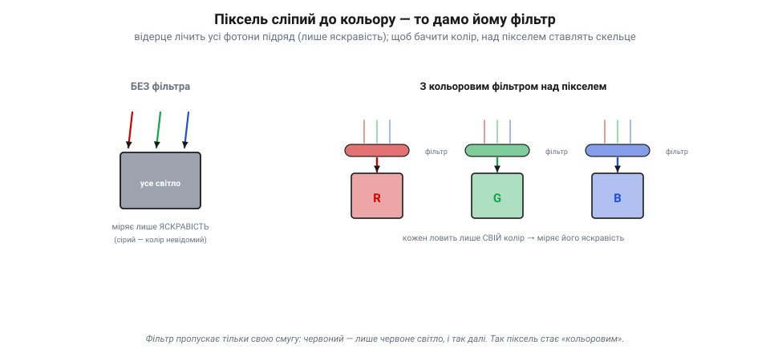
*Рис. 7.7.3.1. Колір додає фільтр, не сам піксель. Без фільтра (ліворуч) піксель ловить усе світло й міряє лише яскравість — колір невідомий (сірий). Над пікселем ставлять кольорове скельце (праворуч), що пропускає лише свою смугу: червоний фільтр — лише червоне світло, зелений — зелене, синій — синє. Тепер кожен піксель міряє яскравість **свого** кольору.*

Тепер червоний піксель міряє, **скільки червоного** світла впало в цю цятку, зелений — скільки зеленого, синій — синього. Це геніально просте рішення: сам сенсор лишається тим самим сліпим лічильником фотонів, а колір додає **пасивне скельце** згори. Лишилося розкласти ці фільтри по матриці — і тут починається головна хитрість.

### Баєрівська мозаїка: шахівниця фільтрів

Як саме розкидати червоні, зелені й сині фільтри по мільйонах пікселів? Найвідоміша відповідь — **баєрівська мозаїка**: повторюваний квадрат 2×2 з фільтрів **R G / G B**, тобто червоний, два зелені й синій, тиражований по всій матриці шахівницею.

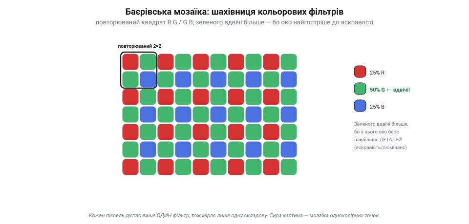
*Рис. 7.7.3.2. Баєрівська мозаїка RGGB. Кольорові фільтри розкладені повторюваним квадратом 2×2: червоний, два зелені, синій — тиражованим по всій матриці. Зеленого **вдвічі** більше (50% проти 25% R і 25% B), бо око бере з нього найбільше деталей (яскравість/люмінанс), а до тонких відтінків кольору байдужіше. Кожен піксель дістає лише один фільтр — тож сира картина є мозаїкою одноколірних точок.*

Поглянь на пропорції: **50% зелених** фільтрів, по 25% червоних і синіх. Зеленого **вдвічі** більше — і це не примха. Людське око бере найбільше **деталей** (різкості) саме із зеленої частини спектра — звідти йде відчуття яскравості, *люмінансу*; а от до тонких відтінків кольору (*хромінансу*) воно куди байдужіше. Тому розумно густіше міряти те, що дає різкість (зелене), і рідше — те, що дає лише барву. Так баєрівська мозаїка віддає більше «роздільності» туди, де її помітить око.

> 📜 Цю мозаїку придумав **Брайс Баєр** (*Bryce Bayer*), науковець компанії **Kodak**, і запатентував 1976 року. У патенті він прямо назвав зелені пікселі «**чутливими до яскравості**», а червоні й сині — «чутливими до кольору», заклавши в саму сітку те, як бачить людське око: гостро до світла, м'яко до барви. Минуло півстоліття — а ця проста шахівниця RGGB досі стоїть майже в кожному цифровому сенсорі планети, від телескопа до камери твого дрона. Рідко чий винахід так тихо й так повсюдно служить.

### Демозаїка: вгадати дві відсутні складові

Тут криється каверза. У баєрівській матриці кожен піксель виміряв **лише один** колір — або червоний, або зелений, або синій. А для повноколірного кадру в **кожній** точці потрібні всі три: R, G **і** B. Звідки взяти два відсутні?

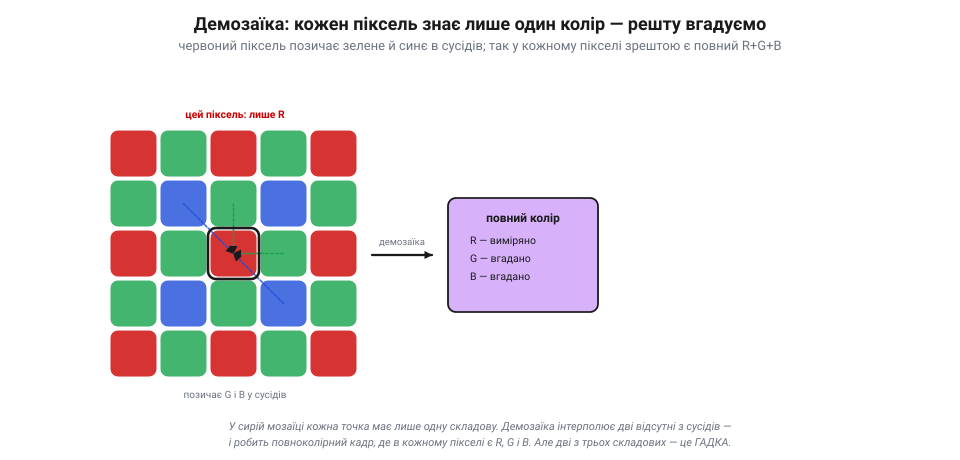
*Рис. 7.7.3.3. Демозаїка вгадує відсутнє. У мозаїці червоний піксель виміряв лише R. Щоб дати йому повний колір, зелене й синє **інтерполюють** із сусідніх зелених і синіх пікселів (пунктирні стрілки). Так у кожній точці зрештою є R, G і B — повноколірний кадр; але дві з трьох складових у кожному пікселі не виміряні, а обчислені, тобто гадка.*

Їх **угадують** — інтерполюють із сусідів. Червоний піксель «питає» в найближчих зелених і синіх, скільки в них світла, і за цим **прикидає** свої власні зелене й синє. Той самий фокус роблять для кожного пікселя: одну складову він виміряв, дві домалював із оточення. Цей процес і зветься **демозаїка** (*demosaicing*) — складання повноколірної картини з одноколірної мозаїки. На виході — звичний кадр, де в кожному пікселі є R, G і B; от тільки **дві з трьох** складових у кожній точці — не виміряні, а **обчислена гадка**.

### Ціна вгадування: артефакти й знижена роздільність

За цю гадку доводиться платити. По-перше, **кольорова роздільність нижча**, ніж обіцяє число мегапікселів: камера «12 МП» насправді виміряла 6 млн зелених точок і по 3 млн червоних та синіх, а решту домалювала. По-друге, на **тонких деталях** інтерполяція помиляється — і з'являються **артефакти**: несправжні кольорові плями на чітких межах (*false color*), «застібка-блискавка» вздовж контурів (*zipper*), райдужний **муар** на дрібному візерунку.

*Рис. 7.7.3.4. Артефакти демозаїки. На тонких деталях (смужки, чіткі межі) інтерполяція помиляється — і з'являються несправжні кольорові плями («застібка», муар). Праворуч: **RAW** — це сира мозаїка до демозаїки (одна складова на піксель, найбільше даних, але треба «проявити»). Для машинного бачення артефакти збивають колірні пороги, тож часто беруть RAW або яскравість.*

Звідси й поняття **RAW**: це **сира мозаїка** до демозаїки — одна складова на піксель, найбільше «чесних» даних, але її ще треба «проявити» (демозаїка плюс обробка), щоб дістати звичне фото. А JPEG із камери — це вже **після** демозаїки й обробки.

> 🔧 **Навіщо це.** Для машинного бачення (Розділ 7.9) артефакти демозаїки — справжня халепа: несправжній колір на межах **збиває колірні пороги**, і алгоритм бачить барву, якої нема. Тому для надійного розпізнавання кольору часто беруть **RAW** (щоб самим контролювати інтерполяцію) або спираються на **зелений/яскравість**, де даних найбільше й гадки найменше. А ще пам'ятай: «мегапікселі» на наклейці — це лічильники відерець, а не чесна кольорова роздільність; дрібну кольорову деталь камера радше домалює, ніж побачить.

### Підсумок теми

Сенсор сліпий до кольору, тож колір йому додають **зовні**: над кожним пікселем ставлять кольоровий фільтр, що пропускає лише свою смугу. Розкладають ці фільтри **баєрівською мозаїкою** RGGB — із подвійною часткою зеленого, бо з нього око бере найбільше різкості (яскравість). Та кожен піксель тоді міряє лише **одну** складову, і дві відсутні доводиться **вгадувати** з сусідів — це **демозаїка**. Платою є знижена кольорова роздільність і артефакти (несправжній колір, муар) на тонких деталях, через що серйозні задачі беруть **RAW** або яскравісний канал. Ми вже вміємо ловити світло, збирати кадр і фарбувати його; час спитати, **скільки** в цьому кадрі правди — про шум і динамічний діапазон (7.7.4).

---

## 7.7.4 Динамічний діапазон і шум

Ми навчилися ловити світло (7.7.1), збирати кадр (7.7.2) і фарбувати його (7.7.3). Час спитати найважливіше для довіри до камери: **скільки в цьому кадрі правди?** Дві величини відповідають на це — **динамічний діапазон** (яку широчінь яскравостей камера вловить за один кадр) і **шум** (скільки в кадрі випадкового «зерна»). Саме вони визначають, чи побачить камера ціль у блиску сонця й у тіні — а отже, чи буде з неї користь машинному баченню.

### Динамічний діапазон: від тіні до блиску

Згадай дві межі пікселя з 7.7.1: знизу — **підлога шуму**, зверху — **насичення** (повна місткість). **Динамічний діапазон** (DR) — це і є відстань між ними: відношення найяскравішого світла, яке камера ще вловить, не «вибілившись», до найслабшого, яке ще видно над шумом. Усе, що ширше за цю смугу, гине.

*Рис. 7.7.4.1. Динамічний діапазон і його межі. Сцена (ліворуч) тягнеться від яскравого неба до темної тіні. Сенсор ловить лише **смугу** яскравостей — від підлоги шуму до насичення (зелене вікно). Усе, що **вище** вікна, вибілюється; усе, що **нижче** — провалюється в чорноту, і деталі там гинуть. Ширину міряють у **стопах** (кожен — удвічі більше світла): у сенсора 8–12, а сонячна сцена буває й 20.*

Біда в тому, що реальні сцени бувають **ширші** за вікно сенсора. Класика — яскраве небо й темна земля під ним водночас: різниця в яскравості величезна. Якщо камера виставиться по небу — земля **провалиться** в чорноту; виставиться по землі — небо **вибілиться**. Деталі за межами вікна не приглушені, а **втрачені** (7.7.1): там нема даних. Широчінь діапазону міряють у **стопах** (кожен стоп — удвічі більше світла): у сенсора зазвичай 8–12 стопів, а сонячна сцена легко сягає 20. Звідси й вічна боротьба фотографа: вкласти важливе в обмежене вікно.

> 📜 Це мистецтво — вкладати неосяжну яскравість світу в скромний діапазон плівки — звели в науку **Ансель Адамс** і **Фред Арчер** близько 1939–40 років. Їхня **зонна система** ділила всю шкалу від чорного до білого на **одинадцять зон** (0 — чорне, X — біле, V — середнє сіре), де кожна зона — рівно один стоп. Фотограф наперед **уявляв**, у яку зону лягне кожна частина сцени, і свідомо «**експонував по тінях, проявляв по світлах**», аби втиснути сюжет у вузький діапазон негатива. Сьогоднішні слова «динамічний діапазон» і «HDR» — це та сама задача Адамса, лише цифрова: світ завжди ширший за камеру, і митець (чи алгоритм) мусить вирішити, що зберегти.

### Шум: три джерела зерна

Тепер про нижню межу — **шум**, ту випадкову «крупинку», що псує темні ділянки. Він не один; джерел три.

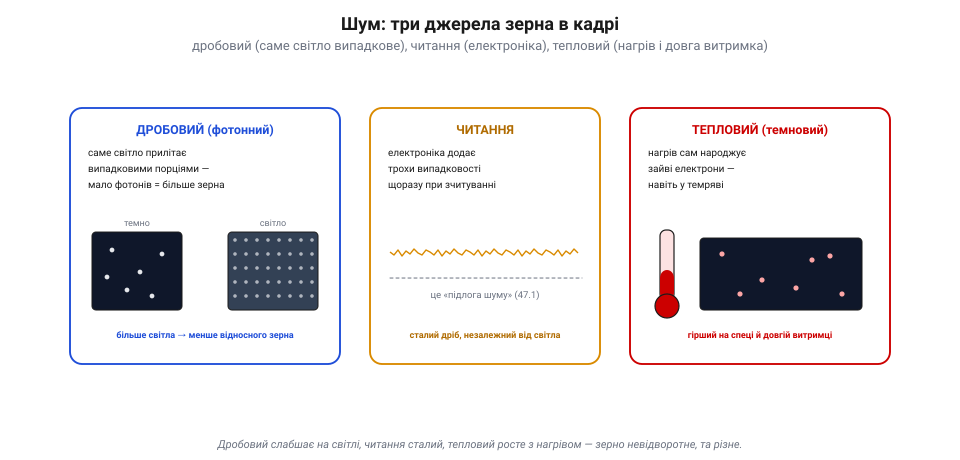
*Рис. 7.7.4.2. Три джерела шуму. **Дробовий** (фотонний): світло прилітає випадковими порціями, тож на темному (мало фотонів) зерна більше, на світлому — менше; це фундамент, його не вимкнути. **Читання**: електроніка щоразу домішує крихту випадковості — стала «підлога шуму», незалежна від світла. **Тепловий** (темновий): нагрів сам народжує зайві електрони, тим гірше, чим гарячіше й довша витримка.*

Перший і найглибший — [**дробовий** (фотонний) шум](book:math/poisson-statistics). Світло само прилітає **випадковими порціями**: за однакової яскравості в піксель щоразу впаде трохи різна кількість фотонів. Коли світла **мало** (темна сцена), ця випадковість помітна — жменя фотонів коливається сильно, і кадр зернить. Коли світла **багато**, відносні коливання дрібніють. Це **фундаментальний** шум: він у самій природі світла, його не «вимкнути». Другий — **шум читання**: електроніка, перетворюючи заряд на число, щоразу домішує крихту випадковості — це та сама «підлога» з 7.7.1, стала й незалежна від світла. Третій — **тепловий** (темновий) шум: нагрів сам народжує зайві електрони навіть у повній темряві, тим більше, чим **гарячіше** й чим **довша** витримка.

### Сигнал-шум: чому рятує лише світло

Як боротися із зерном? Ключ — **відношення сигнал/шум** (SNR): скільки корисного сигналу припадає на одиницю шуму. І тут є проста, але важлива правда: SNR росте з **коренем** числа спійманих фотонів. Учетверо більше світла — удвічі чистіший кадр.

*Рис. 7.7.4.3. Сигнал-шум і чому рятує лише світло. Темна сцена (мало фотонів) — низький SNR, кадр зернить; світла — високий SNR, чисто. SNR росте з кореня числа фотонів: учетверо світла → удвічі чистіше. А підсилення множить **і сигнал, і шум** на одне число — SNR від фотонного шуму не поліпшує, кадр яскравішає, та не чистішає. Єдиний справжній лік — більше фотонів.*

З цього випливає сувора істина про **підсилення** (7.7.2). Здавалося б, кадр темний — підкрути gain, стане яскравіше й, може, чистіше? Майже ні: підсилення множить **і сигнал, і шум** на одне число, тож у кадрі, обмеженому **фотонним шумом**, їхнє відношення по суті **не поліпшується** — нових фотонів воно не додає. (Аналогове підсилення **перед АЦП** здатне трохи послабити внесок шуму зчитування й квантування — для того й існує «ISO», — але справжньої інформації з нічого не створює.) Кадр яскравішає, та не чистішає від зерна — воно стає яскравішим разом із картинкою. Єдиний справжній лік від шуму — **більше фотонів**: більший піксель (7.7.1), ширша діафрагма об'єктива, довша витримка (де можна) чи просто ясніша сцена. Світло — і тільки світло — купує чистоту; електроніка лише розтягує наявне.

> 🔧 **Навіщо це.** Зернистий нічний кадр із дрона не «вилікувати» налаштуваннями — у ньому просто **замало світла**, а підсилення тільки яскравить зерно. Якщо потрібен чистий кадр поночі, рішення фізичні: світліший об'єктив, більший сенсор, підсвітка. А машинне бачення в сутінках працює гірше не від «поганого коду», а від низького SNR: алгоритм бачить зерно й помиляється. Тому надійні системи або додають світла, або знають межу й не довіряють темному кадру.

### Коли сцена ширша за сенсор: HDR

Що ж робити, коли сцена все одно **ширша** за діапазон сенсора — і небо, і тінь не влазять разом? Один кадр тут безсилий: або те, або те. Вихід — **HDR** (*high dynamic range*): зняти **кілька** кадрів із різною витримкою й **злити** їх в один.

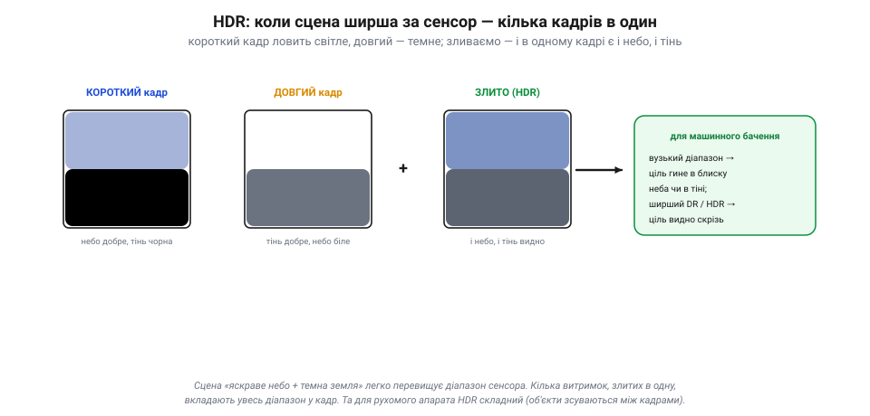
*Рис. 7.7.4.4. HDR зливає кілька витримок. Короткий кадр зберігає світле (небо), та тінь у ньому чорна; довгий зберігає темне (тінь), та небо вибілене. Склавши з кожного добру частину, дістають один кадр ширшого діапазону, де видно і блиск, і тінь. Та на рухомому апараті об'єкти зсуваються між кадрами — тому на дронах радше беруть сенсор із ширшим власним діапазоном.*

Логіка проста: **короткий** кадр зберігає світле (небо), хоч тінь у ньому чорна; **довгий** — зберігає темне (тінь), хоч небо вибілене. Склавши з кожного його добру частину, дістають один кадр, де видно **і блиск, і тінь** — ширший діапазон, ніж сенсор уловив би за раз. Та на рухомому апараті HDR **підступний**: між кадрами об'єкти (і сам дрон) зсуваються, і злиття дає привиди й змазування. Тому замість багатокадрового HDR на дронах радше беруть сенсор із **ширшим власним діапазоном** і мудро виставляють експозицію — щоб ціль не згинула ні в блиску, ні в тіні.

### Підсумок теми

«Скільки в кадрі правди» визначають дві речі. **Динамічний діапазон** — широчінь яскравостей від підлоги шуму до насичення (8–12 стопів у сенсора); сцена, ширша за нього, обрізається в білість чи чорноту, і деталі там гинуть. **Шум** має три джерела: дробовий (випадковість самого світла, головний на темному), читання (стала електронна підлога) і тепловий (від нагріву й довгої витримки). Бореться з ним лише **світло**: SNR росте з кореня числа фотонів, а підсилення множить сигнал і шум разом, тож чистоти не додає. А коли сцена ширша за сенсор, кілька витримок зливають у **HDR** — хоч на рухомому апараті це й непросто. Ми розібрали якість одного кадру; далі — скільки таких кадрів за секунду й який це обсяг даних (7.7.5).

---

## 7.7.5 Роздільність і частота кадрів (обсяг даних)

Якість одного кадру ми розібрали. Тепер дві останні цифри, що описують відео як **потік**: **роздільність** (скільки пікселів у кадрі) і **частота кадрів** (скільки кадрів за секунду). Разом вони визначають, **скільки даних** ллється з камери щомиті — а це число вражає й диктує майже все подальше: стиснення, канал, обчислення на борту.

### Роздільність: скільки відерець у кадрі

**Роздільність** — це просто розмір сітки пікселів: ширина × висота. VGA — 640×480 (≈0.3 Мпк), HD «720p» — 1280×720, Full HD «1080p» — 1920×1080 (≈2 Мпк), 4K — 3840×2160 (≈8 Мпк). Що більше пікселів, то **дрібніші деталі** видно — текст здалеку, тонку лінію, малу ціль.

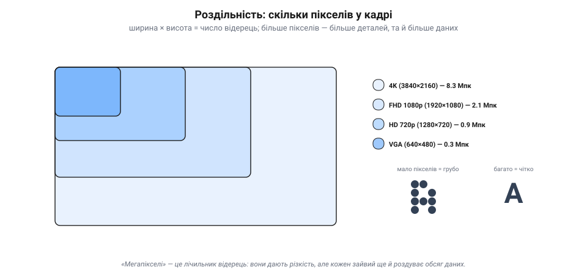
*Рис. 7.7.5.1. Роздільність — розмір сітки пікселів. Від VGA (640×480, ~0.3 Мпк) до 4K (3840×2160, ~8.3 Мпк): що більше пікселів, то дрібніші деталі видно (груба «А» з кількох пікселів проти чіткої). Але кожен зайвий піксель — це ще одне число для зчитування, передачі й обробки, а на малому сенсорі ще й менше світла на піксель (більше шуму, 7.7.4).*

Та «мегапікселі» — палиця на два кінці. Так, більше пікселів дає різкість. Але кожен зайвий піксель — це ще одне число, яке треба зчитати, передати, зберегти й обробити. До того ж (згадай 7.7.4) на крихітному сенсорі більше пікселів означає **менший** піксель — менше світла на кожен, більше шуму. Тому гонитва за мегапікселями має межу: для дрона часто **корисніша** скромна роздільність із чистим, швидким кадром, ніж гори зашумлених пікселів.

### Частота кадрів: рух із застиглих знімків

Відео не існує — є тільки **послідовність знімків**, показаних так швидко, що око зливає їх у рух. Скільки знімків за секунду — це **частота кадрів** (fps, *frames per second*).

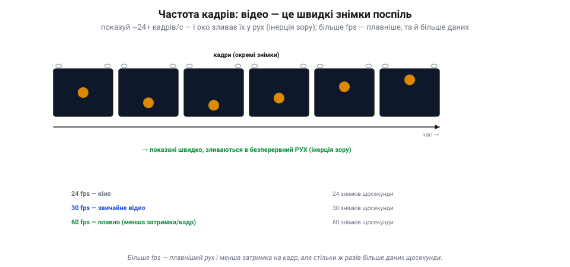
*Рис. 7.7.5.2. Відео — це швидкі знімки поспіль. Камера знімає окремі кадри (м'яч у різних місцях); показані понад ~20 разів на секунду, вони зливаються в безперервний рух (інерція зору). Кіно йде на 24 fps, звичайне відео — 30, плавне — 60. Більше fps дає плавніший рух і меншу затримку на кадр — але стільки ж разів більше даних щосекунди.*

Поріг злиття — десь **за 20 кадрів/с**: кіно йде на 24, звичайне відео — 30, плавне — 60, а для сповільненої зйомки знімають сотні. Більше fps дає не лише **плавніший** рух, а й — важливо для апарата — **меншу затримку**: новий кадр приходить частіше, тож керування бачить свіжіший світ (про затримку — 7.7.7). Плата очевидна: 60 кадрів/с — це **вдвічі** більше даних, ніж 30.

> 📜 Що рух — це насправді **низка застиглих миттєвостей**, уперше довів **Едвард Майбрідж** 1878 року. Залізничний магнат Ліленд Стенфорд посперечався, чи відриває кінь у галопі всі чотири копита від землі воднораз, — і найняв Майбріджа це зняти. Той вишикував уздовж бігової доріжки **низку камер**, кожну зі шнурком-розтяжкою: кінь на ім'я Саллі Гарднер пробігав, ногами зачіпав шнурки — і камери клацали одна за одною. Знімки **довели**: так, є мить, коли всі копита в повітрі. А наступного року Майбрідж склав ці кадри на диск свого **зоопраксископа** й закрутив — і застиглі миттєвості **ожили рухом**. Це й був прабатько кіно: рух, розкладений на кадри й зібраний назад, — рівно те, що робить камера твого дрона 30 разів на секунду.

### Сирий потік: пожежний шланг даних

Тепер перемножмо все й жахнімося. Скільки даних дає камера за секунду?

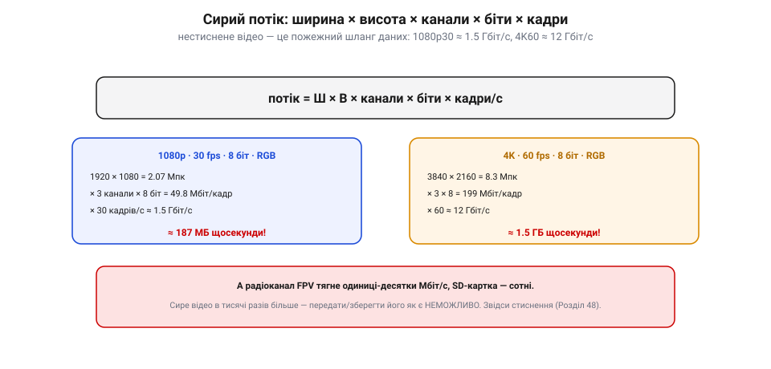
*Рис. 7.7.5.3. Сирий потік — пожежний шланг. Потік = ширина × висота × канали × біти × кадри/с. Навіть скромне 1080p30 (8 біт, RGB) — це ≈1.5 Гбіт/с (≈187 МБ щосекунди); 4K60 — ≈12 Гбіт/с (≈1.5 ГБ/с). А радіоканал FPV тягне одиниці-десятки Мбіт/с, SD-картка — сотні. Сире відео в тисячі разів більше — передати його як є неможливо, звідси стиснення (Розділ 7.8).*

Рахунок простий: **потік = ширина × висота × канали × біти × кадри/с**. Для скромного 1080p, 30 кадрів/с, по 8 біт на кожен із трьох (RGB) каналів: 1920×1080 = 2 млн пікселів, ×3×8 ≈ 50 Мбіт на кадр, ×30 ≈ **1.5 Гбіт/с** — тобто майже **190 мегабайт щосекунди**. А 4K на 60 кадрах — близько **12 Гбіт/с**, півтора гігабайта за секунду. Це **пожежний шланг**: звичайна microSD (десятки-сотні МБ/с) і тим паче радіоканал FPV (одиниці-десятки Мбіт/с) такого й близько не проковтнуть (хіба найшвидші карти потягнуть нижні режими). Сире відео в **тисячі разів** більше за те, що можна реально передати чи зберегти.

### Компроміс: за все платиться бітами

Звідси головний висновок розділу про дані: роздільність і fps — **не** «що більше, то краще», а **вибір під ресурси**.

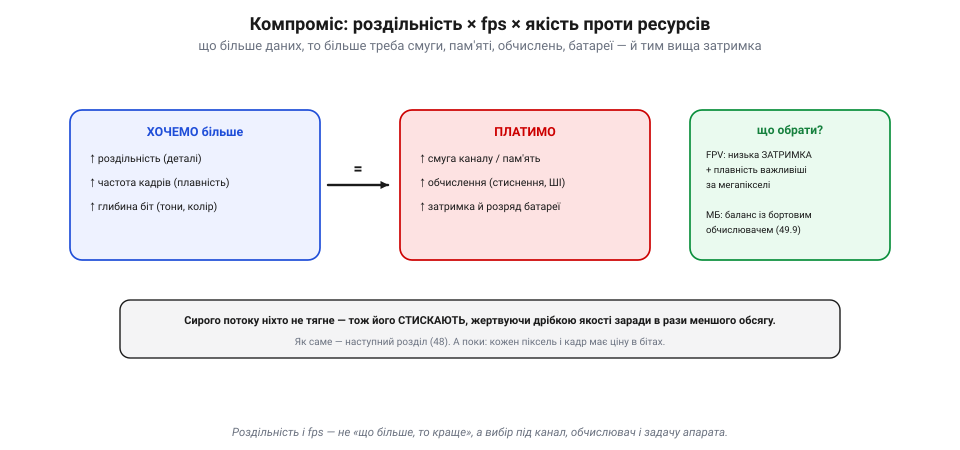
*Рис. 7.7.5.4. За все платиться бітами. Хочемо більше (роздільності, fps, глибини) — платимо смугою каналу, пам'яттю, обчисленнями, затримкою й розрядом батареї. Тому вибір залежить від задачі: для FPV над усе низька затримка й плавність (а не мегапікселі), для машинного бачення — баланс із бортовим обчислювачем (7.9.9). А сирий потік однаково стискають (7.8).*

Кожен доданий піксель, кадр чи біт глибини коштує **смуги** каналу, **пам'яті**, **обчислень** і **батареї** — а часто й **затримки**. Тому розумний вибір залежить від задачі. Для **FPV** (ти летиш, дивлячись у відео) над усе — **низька затримка** й плавність, а не мегапікселі: краще чітке 720p без лагу, ніж розкішне 4K, що приходить із запізненням. Для **машинного бачення** роздільність і fps балансують із тим, скільки потягне бортовий обчислювач (7.9.9): забагато даних — і він не встигне обробити кадр вчасно. А оскільки сирий потік не тягне ніхто, його неминуче **стискають** — жертвуючи дрібкою якості заради в рази меншого обсягу. Як саме це роблять — і є зміст наступного розділу.

### Підсумок теми

Відео описують двома цифрами потоку: **роздільність** (ширина × висота пікселів — більше деталей, але менший і шумніший піксель та більше даних) і **частота кадрів** (знімків за секунду — понад ~20 око зливає їх у рух; більше fps — плавніше й менша затримка, та й удвічі більше даних). Перемножені — ширина × висота × канали × біти × fps — вони дають **сирий потік**, що навіть для 1080p30 сягає ~1.5 Гбіт/с, а для 4K60 — ~12: у тисячі разів більше, ніж проковтне канал чи картка. Тому роздільність і fps завжди **обирають під ресурси** (для FPV — низьку затримку, для машинного бачення — баланс із обчислювачем), а сирий потік неодмінно **стискають**. Саме стисненню — як упхати цей шланг у вузьку трубу — і присвячений **Розділ 7.8**, та спершу лишилося розібрати, як відеосигнал тече «по-старому», аналогом (7.7.6), і чому його **затримка** вирішує долю керованого польоту (7.7.7).

---

## 7.7.6 Аналоговий відеосигнал: рядки, кадри, синхро (FPV)

Дотепер ми говорили про цифровий кадр — сітку чисел. Але є й **старий, аналоговий** спосіб нести відео, що й досі живий, надто у **FPV** (*first-person view* — політ «очима» камери). Тут картина тече не числами, а **плавною напругою**, точнісінько за ідеєю Фарнсворта (історія розділу). Розберімо, як влаштований цей сигнал — і чому аналог пережив свій вік.

### Один рядок — це напруга в часі

Згадай Фарнсвортову розгортку: образ розбивають на рядки й читають по черзі. В аналоговому відео кожен **рядок** — це просто **напруга, що міняється в часі**: вище — світліше, нижче — темніше. Камера «проводить» по рядку зліва направо й видає відповідну криву; приймач малює її назад тим самим рухом.

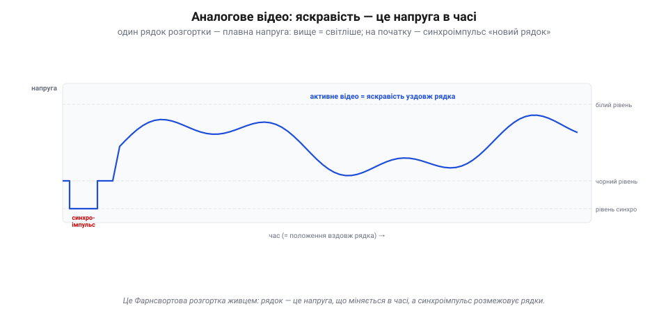
*Рис. 7.7.6.1. Рядок аналогового відео як осцилограма. Картина тече плавною напругою: вище — світліше (білий рівень), нижче — темніше (чорний рівень). Перед кожним рядком сигнал падає нижче чорного — це **синхроімпульс** «новий рядок», а за ним коротке **гасіння** (поки промінь біжить назад). Далі — **активне відео**: сама яскравість уздовж рядка. Це Фарнсвортова розгортка живцем.*

Але як приймач знає, **де** рядок починається? Перед кожним рядком сигнал на мить падає нижче «чорного» — це **синхроімпульс** (*sync*), умовний знак «новий рядок тут». Між синхроімпульсом і картинкою є коротка чорна пауза (**гасіння**, *blanking*) — поки промінь приймача перебігає назад до початку наступного рядка, його «гасять», щоб цей зворотний хід не псував картину. Отже, рядок сигналу — це: синхроімпульс, гасіння, тоді **активне відео** (сама яскравість). Просто, як і все геніальне.

### Синхро: щоб картинка не «їхала»

Синхроімпульси — це нерви всього аналогового відео. Їх два роди. **Горизонтальний** синхро (на початку кожного рядка) тримає приймач у такт по рядках. **Вертикальний** — довший, особливий імпульс на початку кожного **кадру** — каже «починай згори». Разом вони тримають розгортку приймача **синхронно** з камерою.

*Рис. 7.7.6.2. Синхро тримає картинку на місці. **Горизонтальний** синхроімпульс позначає початок кожного рядка, **вертикальний** (довший) — початок кадру; приймач замикає на них свою розгортку (ліворуч — рядки рівно). Без синхро картинка «їде» й рветься навскіс (праворуч). Синхроімпульси лежать нижче рівня чорного, у службовій зоні, якої око не бачить.*

Що буде без синхро? Картинка «**попливе**»: рядки розповзуться, кадр покотиться вгору чи вниз, зображення розірве навскіс. Хто застав аналогові телевізори, пам'ятає це «перевертання» картинки, поки не підкрутиш — то губився синхро. У сигналі синхроімпульси вирізняються тим, що лежать **нижче** рівня чорного, у «службовій» зоні, якої око не бачить, — тож приймач легко відрізняє «де малювати» від «де початок».

### Кадри й поля: черезрядковість

Стара аналогова традиція має ще одну хитрість — **черезрядкову розгортку** (*interlacing*). Замість малювати всі рядки кадру поспіль, сигнал малює спершу всі **непарні** рядки (це одне **поле**), а тоді всі **парні** (друге поле). Два поля, прокладені одне крізь одне, складають **кадр**.

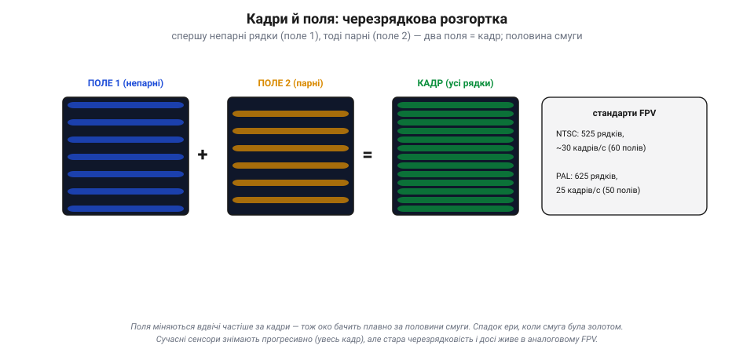
*Рис. 7.7.6.3. Черезрядкова розгортка. Сигнал малює спершу непарні рядки (поле 1), тоді парні (поле 2); два поля, прокладені одне крізь одне, складають кадр. Поля міняються вдвічі частіше за кадри — тож рух плавний за половини смуги. Звідси й стандарти, що їх успадкував FPV: NTSC (525 рядків, ~30 кадрів) і PAL (625 рядків, 25 кадрів).*

Навіщо так? Щоб за **половину** смуги зберегти плавність: поля міняються вдвічі частіше за кадри, тож око бачить рух гладким, хоч даних удвічі менше. Це спадок ери, коли смуга була на вагу золота. Сучасні сенсори знімають **прогресивно** (увесь кадр за раз), але стара черезрядковість досі живе в аналоговому FPV. Тут і коріння двох стандартів, між якими й нині обирає пілот: **NTSC** (525 рядків, ~30 кадрів) і **PAL** (625 рядків, 25 кадрів).

> 📜 Ці два стандарти FPV успадкував прямо з епохи аналогового телебачення. Американський **NTSC** (525 рядків) перший приніс кольорове мовлення (1953), та його колір «плив» від фазових спотворень у каналі — інженери жартома розшифровували NTSC як «*Never The Same Color*», ніколи той самий колір. Ліки знайшов німець **Вальтер Брух** у Telefunken: 1963 року він показав систему **PAL** (*Phase Alternating Line*), де фазу кольору **перевертають щорядка**, і приймач сам усереднює помилки, відновлюючи чесний колір — ціною дрібки вертикальної роздільності. Так світ розділився на 525/30 і 625/25, а через півстоліття ти, вибираючи в меню FPV-камери «PAL чи NTSC», тиснеш на відлуння суперечки 1960-х.

### Чому аналог пережив свій вік

Здавалося б, цифрове відео чіткіше — то чому гонщики FPV десятиліттями трималися **аналогу**? Дві причини, обидві про **виживання в реальному польоті**.

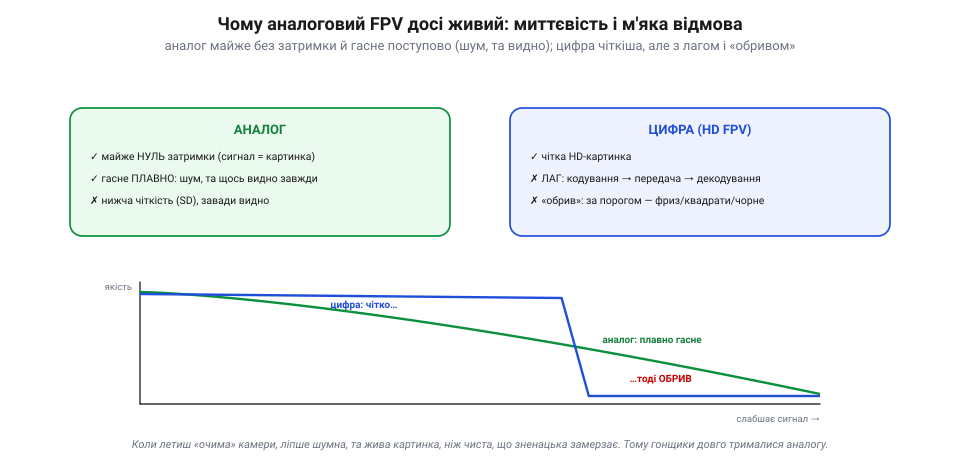
*Рис. 7.7.6.4. Аналог проти цифри в польоті. **Аналог**: майже нуль затримки (сигнал і є картинкою) і **плавне** згасання — слабне сигнал, наростає шум, та деградує плавно, з попередженням до повної втрати. **Цифра** (HD FPV): чітка картинка, та з лагом (кодування→передача→декодування) і **обривом** — тримається до порога, а за ним фриз/квадрати/чорне. Для польоту очима камери «шумне, та живе» безпечніше за «чисте, що замерзає».*

Перша — **затримка**. В аналозі сигнал **і є** картинкою: що камера бачить, те вмить летить в окуляри, без кодування й декодування. Цифра ж мусить кадр **стиснути**, передати й **розтиснути** — а це десятки мілісекунд лагу, які при польоті на швидкості відчутні (про затримку — 7.7.7). Друга — **м'яка відмова**. Коли аналоговий сигнал слабшає (далеко, завада), картинка **поступово** заростає шумом-«снігом»: вона деградує плавніше й **попереджає** до повної втрати, тож пілот устигає відвернути (хоча за певною межею сильний шум і збитий синхросигнал убивають картинку й тут). Цифра ж тримається чітко до порога, а за ним **обривається стрімко**: фриз, квадрати, чорний екран — і ти осліп миттєво. Для того, хто летить очима камери, «шумне, та живе» безпечніше за «чисте, що зненацька замерзає». Тому аналог і живий — хоч цифрове FPV (з кращою картинкою) дедалі його тіснить.

> 🔧 **Навіщо це.** Якщо літаєш на аналоговому FPV — стеж за наростанням «снігу»: це чесне попередження, що сигнал слабне, і час вертатися, поки видно. Цифрове FPV такого ввічливого попередження не дає — воно «тримається до останнього», а тоді гасне різко, тож для нього важливіші запас зв'язку й failsafe (7.1.2). І вибирай PAL чи NTSC однаково на камері й в окулярах — інакше не зчитається синхро, і ти не побачиш нічого.

### Підсумок теми

Аналогове відео несе картину не числами, а **плавною напругою**: кожен рядок — це яскравість у часі (вище — світліше), а розмежовують рядки й кадри **синхроімпульси** (горизонтальний — новий рядок, вертикальний — новий кадр), без яких зображення «їде» й рветься. Стара **черезрядковість** малює кадр двома полями (непарні, тоді парні), заощаджуючи смугу, — звідси й стандарти NTSC (525/30) та PAL (625/25), між якими й досі обирає FPV. А живий аналог тому, що дає дві речі, безцінні в польоті очима камери: **майже нульову затримку** й **м'яку відмову** (поступовий шум замість раптового обриву). Цим аналог і кращий за цифру там, де секунда сліпоти коштує апарата. Лишилося поглянути на головну з цих переваг пильніше — на **затримку** й чому вона вирішує долю керованого польоту (7.7.7).

---

## 7.7.7 Затримка (latency) і чому критична для керування

Ми пройшли весь шлях відео: від фотона на пікселі (7.7.1) до сигналу, що тече дротом чи радіо (7.7.6). Лишилася одна, найважливіша для **керування** величина — **затримка** (*latency*): скільки часу минає від миті, коли світло впало на лінзу камери, до миті, коли картинку видно (тобі чи алгоритму). На вигляд дрібниця в мілісекундах — а насправді саме вона вирішує, чи можна на цьому відео **летіти**.

### Скло-до-скла: з чого складається затримка

Затримку міряють «**скло-до-скла**» (*glass-to-glass*): від скла об'єктива камери до скла твого екрана. І складається вона з **ланцюжка** кроків, кожен зі своїми мілісекундами.

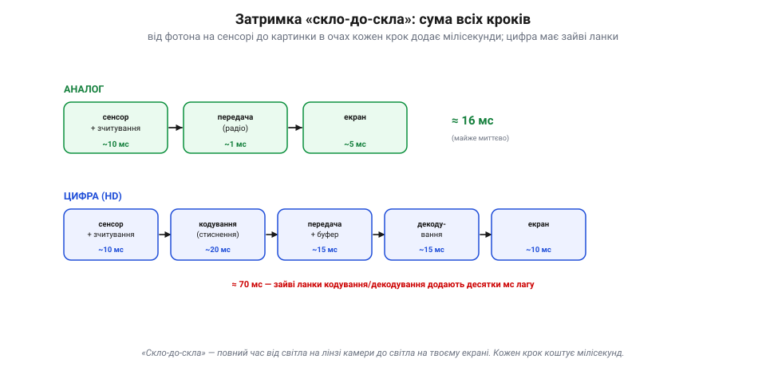
*Рис. 7.7.7.1. Затримка «скло-до-скла» — сума ланцюжка. Світло треба зекспонувати й зчитати з сенсора, передати, показати на екрані — кожен крок коштує мілісекунд. В **аналозі** ланцюг короткий (~16 мс, майже миттєво). **Цифра** додає дві ненажерливі ланки — кодування (стиснення) перед передачею й декодування після — плюс буфери, і набирає ~70 мс і більше.*

Світло треба **зекспонувати й зчитати** з сенсора (7.7.2) — кілька-десяток мс. Тоді — **передати** (радіо, кабель). Тоді — **показати** на екрані (у нього свій буфер і оновлення). У **аналозі** цей ланцюг короткий: сигнал майже відразу стає картинкою — разом десь **15–40 мс**. А **цифра** додає дві ненажерливі ланки: кадр треба **стиснути** (закодувати) перед передачею й **розтиснути** (декодувати) після — а це ще десятки мс, плюс буфери. Звідси цифрове HD FPV легко набирає **70–130 мс** і більше. Кожен крок коштує часу, і вони **додаються**.

### Летиш у минулому

Чому ці мілісекунди такі важливі? Бо картинка, яку ти бачиш, — **застаріла**. Поки кадр зняли, передали й показали, апарат уже **зрушив**. Ти керуєш по тому, де він **був**, а не де він **є**.

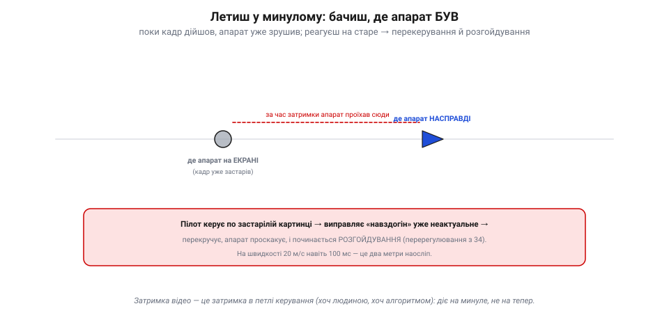
*Рис. 7.7.7.2. Керуєш по застарілій картинці. Поки кадр зняли, передали й показали, апарат уже зрушив: на екрані він там, де **був** (сіре), а насправді — далі по курсу (синє). Виправляючи неактуальне, пілот (чи алгоритм) перекручує, апарат проскакує — і починається розгойдування (перерегулювання з 5.8). На швидкості 20 м/с навіть 100 мс — це два метри наосліп.*

На малій швидкості це дрібниця, та на швидкому польоті — біда. За 100 мс дрон на швидкості 20 м/с пролітає **два метри** — наосліп, бо ти їх іще не бачив. Реагуючи на застарілу картинку, пілот (чи алгоритм) виправляє вже **неактуальне**, апарат проскакує ціль, доводиться виправляти назад — і починається **розгойдування**, те саме перерегулювання, що ми бачили в керуванні (Розділ 5.8). Що більша затримка й швидший політ, то сильніше «пливе» керування.

### Затримка в петлі — ворог стійкості

І це не випадковість, а закон. Керування — це **петля** зі зворотним зв'язком: **бачу → вирішую → дію → знову бачу**. А затримка відео сидить прямісінько в цій петлі, на ланці «бачу».

*Рис. 7.7.7.3. Затримка в петлі керування. Керування — петля «бачу → вирішую → дію → знову бачу», і затримка відео сидить на ланці «бачу». За малої затримки відхилення стихає (стійко, зелене); за великої — кожне виправлення спізнюється й накладається не туди, тож петля **розгойдується** (червоне). Та сама хвороба, що в керуванні (5.8) і фьюжні (7.5.6).*

Теорія керування (5.8) і навіть фьюжн (7.5.6) уже навчили нас цього правила: **затримка у зворотному зв'язку — головний ворог стійкості**. Коли реакція на дію приходить запізно, кожне виправлення накладається не туди, де треба, — і замість того, щоб гасити відхилення, петля його **розгойдує**. Чим довша затримка, тим **повільнішим і м'якшим** мусить бути керування, щоб не піти врознос, — а отже, тим гіршу динаміку терпить апарат. Ось чому затримка відео — не питання комфорту, а питання **керованості**: за певною межею летіти стає просто неможливо.

> 📜 Найжорстокіший урок про затримку дала місячна поверхня. 1970 року радянський **«Луноход-1»** став першим апаратом, що його **керували по відео** з іншого світу: п'ятеро операторів на Землі (командир, водій, штурман…) вели місяцехід, дивлячись на знімки з його камер. Та які знімки! Камера слала не відео, а **окремі кадри**, раз на **7–20 секунд**, а самому радіосигналу треба було **~3 секунди** на дорогу туди-назад. Тож водій бачив наслідок свого керма аж за багато секунд — а місяцехід за цей час уже від'їжджав на метри вперед. Вести його було пекельно важко: рушали поштовхами, завмирали, боялися кратерів. Це й є затримка в петлі, доведена до краю: керувати, дивлячись у глибоке минуле. «Луноход» проїздив 11 місяців — тріумф попри все, — але назавжди показав, **чому** далеким апаратам потрібна власна автономія, а не лише джойстик із Землі.

### Бюджет затримки: де межа летабельності

Скільки ж затримки апарат **терпить**? Грубо — поки вона мала проти швидкості реакції самого апарата.

*Рис. 7.7.7.4. Бюджет летабельності. «Миттєвим» для меткого польоту відчувається десь до 50 мс; до ~100 ще летабельно, за ~150–200 — майже неможливо. Тому аналоговий FPV (~20–40 мс) любий гонщикам, цифрове HD FPV (~70–130) на межі, а стрім/телефон (сотні мс) для керування непридатний. Менша затримка майже завжди коштує якості.*

Для меткого FPV-польоту «миттєвим» відчувається десь **до 50 мс**; до ~100 ще летабельно, хоч важче; за ~150–200 мс керувати на швидкості стає майже неможливо. Тому **аналог** (20–40 мс) такий любий гонщикам, **цифрове HD FPV** (70–130 мс) — на межі прийнятного, а звичайний відеострім чи телефон (сотні мс) для керування **непридатний** зовсім — ним хіба фотографувати, не летіти. І скрізь та сама плата: **менша затримка коштує якості** — менше стиснення, простіший тракт, нижча чіткість. FPV свідомо обирає затримку понад роздільність.

> 🔧 **Навіщо це.** Для **машинного бачення** на борту «затримка відео» обертається на **час обчислень** (7.9.9): поки алгоритм пережовує кадр, апарат летить далі, тож повільний точний детектор у петлі керування гірший за швидкий простіший — бо діє на застаріле. Тому в зорі-в-петлі цінують **темп**, а важку обробку виносять із критичного кола. А ще: міряй **усю** затримку скло-до-скла, не лише «лаг каналу» — найбільше з'їдають кодування й буфери, а не саме радіо.

### Підсумок теми

Затримка — це повний час «**скло-до-скла**» від світла на лінзі до картинки в очах: сума всіх кроків (експозиція, зчитування, у цифри ще кодування й декодування, передача, екран), що дає десятки мс в аналозі й сотню-півтори в цифровому HD. Вона критична, бо картинка завжди **застаріла**: керуєш по тому, де апарат був, а на швидкості це метри наосліп. А головне — затримка сидить **у петлі керування**, а там вона головний ворог стійкості: запізніле виправлення **розгойдує** замість гасити (Розділ 5.8, 7.5.6). Тому є **бюджет летабельності** (грубо до ~100 мс), і FPV свідомо жертвує якістю заради малої затримки, а машинне бачення — точністю заради темпу. Цим завершено **Розділ 7.7**: ми пройшли весь шлях відео — від фотона на пікселі через кадр, колір, шум, потік даних і сигнал аж до затримки, що вирішує, чи можна на цьому відео летіти. Далі **Розділ 7.8** відповість на питання, що зринало раз у раз: як приборкати той пожежний шланг даних — **стиснути** відео, не вбивши ні картинки, ні затримки.
