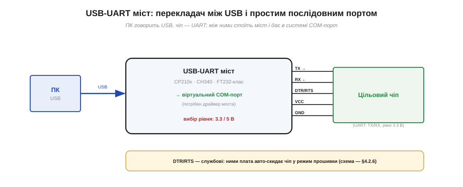
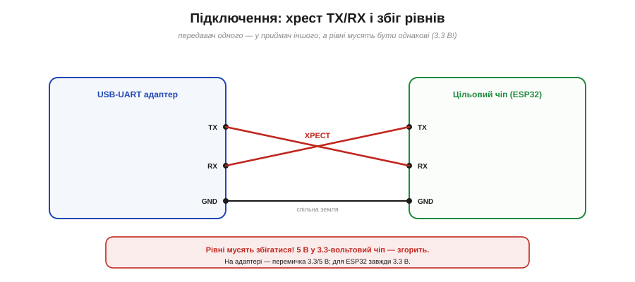

# 🔌 USB-UART адаптер (CP210x/CH340/FT232-класи): піни, рівні, драйвери

> Компонентна вставка до **теми [§4.2.5 «Прошивка у Flash»](book:programming/toolchain)**. Ми бачили, що код тече в чіп «по USB/UART». Той, хто перекладає одне на одне, — **USB-UART адаптер**; розберімо його піни, рівні й драйвери.

## Що це за клас

Комп'ютер говорить мовою **USB**, а мікроконтролер — простим **послідовним портом (UART)**: дві лінії, TX і RX. Між ними потрібен перекладач — **USB-UART міст** (Рис. 4.2.5c.1). Це маленький чип, що з одного боку прикидається USB-пристроєм, а з другого видає звичайні TX/RX. У системі він з'являється як **віртуальний COM-порт**, і програми (термінал, `esptool`) працюють із ним, наче з класичним послідовним портом.

*Рис. 4.2.5c.1. Міст перекладає USB на UART і назад. ПК бачить **віртуальний COM-порт** (для нього потрібен драйвер моста); до чипа йдуть TX/RX, службові DTR/RTS, живлення й земля. Перемичка задає рівень — 3.3 чи 5 В.*

Поширені сімейства — **CP210x** (Silicon Labs), **CH340/CH341** (WCH), **FT232** (FTDI) і старіший **PL2303** (Prolific). Усі роблять те саме, різняться драйверами й дрібницями.

## Піни й підключення

Типовий набір виводів: **TX**, **RX**, **GND**, **VCC** (живлення, часто з вибором 3.3/5 В) і службові **DTR/RTS**. Два правила підключення критичні (Рис. 4.2.5c.2):

*Рис. 4.2.5c.2. Дві обов'язкові речі. **Хрест:** передавач адаптера (TX) — у приймач чипа (RX), і навпаки. **Збіг рівнів:** і адаптер, і чіп мусять бути на однаковій напрузі; 5 В у 3.3-вольтовий ESP32 його спалить. Плюс спільна **земля**.*

- **Хрест TX↔RX.** Передавач одного йде в приймач іншого: `TX → RX`, `RX → TX`. Найчастіша помилка новачка — з'єднати TX з TX; тоді мовчанка.
- **Збіг рівнів.** ESP32 — **3.3-вольтовий**. Адаптер на 5 В подасть на його входи 5 В і **спалить** ніжки. Тому на адаптері є перемичка рівня — для ESP32 ставимо **3.3 В**.
- **Спільна земля** обов'язкова, інакше рівні нема відносно чого міряти.
- **DTR/RTS** — службові лінії: ними плата (чи ваша схема) автоматично вводить чіп у режим завантаження, смикаючи EN та IO0. Сам цей механізм авто-скидання розбираємо у §4.2.6.

## «Перший байт»

Утикаєте адаптер у USB → система створює COM-порт (потрібен **драйвер** саме цього моста) → відкриваєте порт на узгодженій швидкості (*baud rate*) → байти течуть в обидва боки. Саме через цей міст `esptool` і розмовляє із ROM-завантажувачем чипа, заливаючи прошивку (§4.2.5). Той самий міст потім возить ваш `Serial`-лог назад на екран (§4.2.8).

## Типові граблі

- **5 В на 3.3-вольтовий чіп** — найдорожча помилка: тихо вбиває ніжки. Перевіряйте перемичку рівня **перш** ніж підключати.
- **Не схрещені TX/RX** — порт є, а зв'язку нема.
- **Немає драйвера** — кожне сімейство (CP210x, CH340, FT232) має свій; без нього COM-порт не з'явиться.
- **Підробний FT232.** Свого часу FTDI випустила драйвер, що навмисно «**заблоковував**» чипи-підробки — і ті, хто несвідомо купив фейк, лишилися з мертвими адаптерами. Урок: дешевий безіменний адаптер може виявитися клоном.
- **Невідповідність швидкості** (baud) з обох боків — на екрані сміття замість тексту.

## Варіації класу

Окрім сімейства (CP210x / CH340 / FT232 / PL2303), адаптери різняться формою — окрема плата-«свисток» проти моста, **вбудованого** прямо на плату розробника (саме він стоїть на DevKit, див. [вставку про DevKit](book:programming/esp32-architecture/comp-devkit.md)), — вибором рівня (3.3/5 В чи фіксований) і набором виведених ліній (інколи лише TX/RX/GND, інколи з повним DTR/RTS/CTS).

> ▶️ Повернутися до теми: [§4.2.5 — Прошивка у Flash](book:programming/toolchain)
