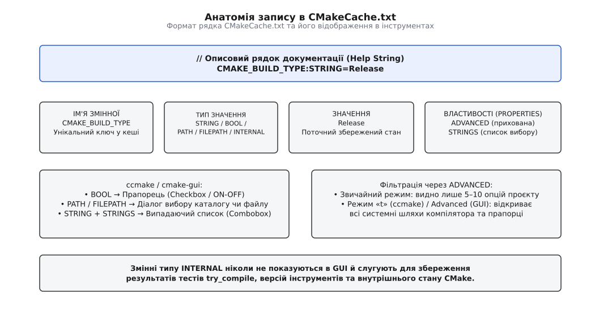
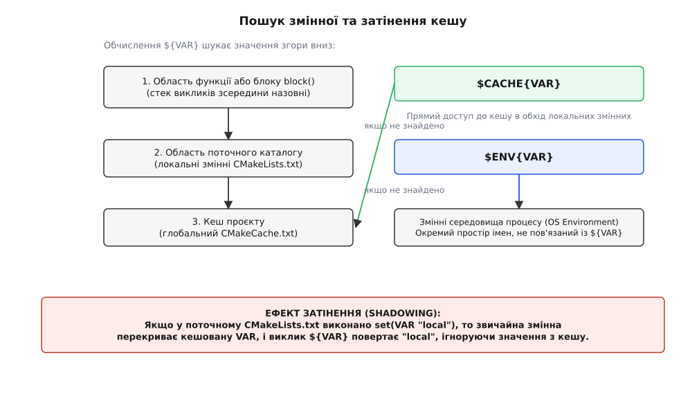
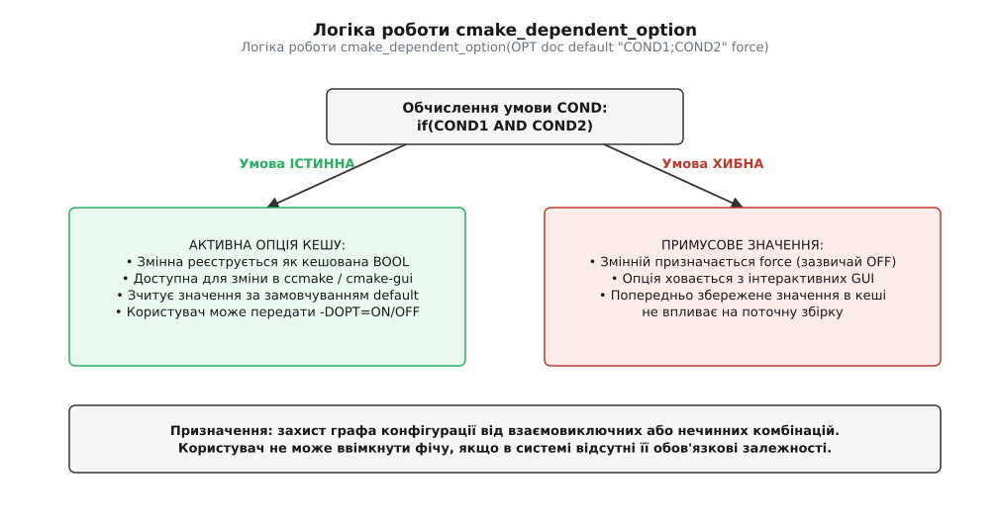
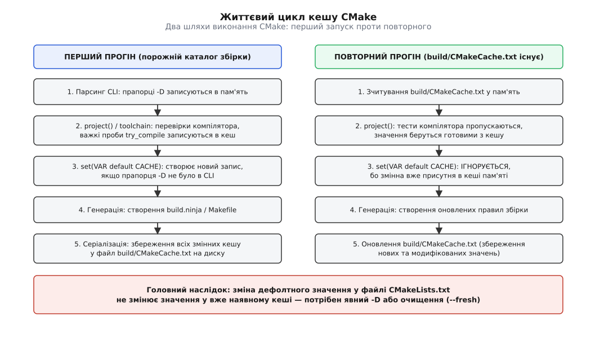

# Кеш CMake, опції та їхнє життя між прогонами

<preknowlist>
- [Мова CMakeLists: змінні, області, потік керування](topic:build-systems/cmake-language) — як влаштовані звичайні змінні, області функцій і каталогів.
- [Конфігурація, генерація і збірка](topic:build-systems/configure-and-generate) — три стадії життєвого циклу проєкту й чому конфігурація виконується до запуску компілятора.
- [Цілі й властивості замість глобальних змінних](topic:build-systems/targets-and-properties) — як CMake зберігає стан у моделі цілей і чому глобальні змінні поступаються властивостям.
- [Роль системи збірки](topic:build-systems/build-system-role) — навіщо системі збірки знати про компілятор, бібліотеки й платформу.
</preknowlist>

Коли ви запускаєте конфігурацію великого C++-проєкту на свіжому комп'ютері, процес займає від кількох секунд до пів хвилини: система безперервно компілює десятки дрібних тестових програм, з'ясовуючи, чи підтримує компілятор стандарт C++20, який розмір має вказівник `void*`, чи існує в системі заголовок `pthread.h`, яка версія Clang чи GCC встановлена та де лежать системні бібліотеки. Якби цей повний цикл інтроспекції доводилося повторювати під час кожного редагування файлу `CMakeLists.txt` або кожного виклику `cmake --build`, інкрементальна розробка перетворилася б на нестерпне очікування. До того ж інженер, який викликав `cmake -DCMAKE_BUILD_TYPE=Release -DENABLE_TESTS=ON`, розраховує, що система запам'ятає його вибір і не вимагатиме повторного введення десятків прапорців під час кожного оновлення конфігурації.

Усі ці проблеми CMake розв'язує через єдиний механізм довготривалого збереження стану — файл `CMakeCache.txt`, розташований у корені каталогу збірки. Проте за зовнішньою простотою звичайного текстового файлу типу «ключ — значення» криється складна модель взаємодії між пам'яттю інтерпретатора, областями видимості змінних, командами конфігурації та файловою системою. Нерозуміння того, коли саме CMake читає кеш, чому він ігнорує змінені значення за замовчуванням у вихідному коді та як локальні змінні затінюють глобальні записи, є головним джерелом так званих «фантомних помилок збірки» у повсякденній розробці.

---

## Ціна системної інтроспекції та потреба у довготривалому стані

Система збірки C++ кардинально відрізняється від систем збірки мов зі стандартизованим середовищем виконання (таких як Rust із Cargo чи Go). У світі C/C++ не існує єдиного універсального двійкового інтерфейсу (ABI), шляхи до системних заголовків різняться між дистрибутивами Linux, динамічні бібліотеки можуть мати різні суфікси та версії, а компілятори мають власні діалекти прапорців командного рядка.

Перший виклик команди `project()` у кореневому `CMakeLists.txt` запускає механізм глибокої системної інтроспекції. Інтерпретатор CMake не обмежується зчитуванням змінних середовища: він створює у тимчасових підкаталогах повноцінні тестові C та C++ файли, компілює їх через `try_compile()`, лінкує виконувані бінарники та перевіряє їхню працездатність через `try_run()`. У такий спосіб CMake визначає:
1. Точну версію та ідентифікатор компілятора (`CMAKE_CXX_COMPILER_ID`, наприклад `Clang`, `GNU` або `MSVC`).
2. Розрядність цільової архітектури, порядок байтів (Endianness) та розміри базових типів (`CMAKE_SIZEOF_VOID_P`).
3. Підтримку конкретних прапорців оптимізації, санітайзерів та можливостей стандартної бібліотеки.
4. Шляхи до системних компонентів лінкувальника та архіватора статичних бібліотек (`CMAKE_AR`, `CMAKE_LINKER`).

Кожен такий тест є повноцінним процесом запуску компілятора та лінкувальника на диску. Якщо проєкт підключає зовнішні бібліотеки через `find_package()`, до цього додається сканування сотень системних каталогів у пошуках заголовочних файлів та бінарників. Сумарна вартість цих операцій сягає десятків тисяч дискових звернень.

Збереження результатів цих перевірок у довготривалій пам'яті дозволяє скоротити час повторної конфігурації з десятків секунд до кількох мілісекунд: CMake просто зчитує готові відповіді з файлу `CMakeCache.txt`, миттєво пропускаючи всю фазу апаратно-програмної діагностики.

Друга фундаментальна функція кешу — збереження користувацьких налаштувань. Коли розробник конфігурує проєкт прапорцем `-DENABLE_BENCHMARKS=ON`, цей параметр стає частиною кешу. Під час подальшої роботи, коли генератор автоматично запускає переконфігурацію після зміни будь-якого `CMakeLists.txt`, CMake зберігає активований прапорець, не змушуючи людину вводити його наново.

---

## Анатомія CMakeCache.txt: структура записів і типізація

Файл `CMakeCache.txt` є текстовим документом зі строгою внутрішньою граматикою. На відміну від звичайних змінних у мові CMakeLists, де єдиним внутрішнім типом є звичайний рядок ([мова CMakeLists](topic:build-systems/cmake-language)), кеш CMake є строго типізованим сховищем.

Кожен запис у файлі кешу має чітку структуру:

```text
// Рядок документації (Help String), що пояснює призначення опції
CMAKE_BUILD_TYPE:STRING=Release

// Логічний перемикач збірки тестового набору
BUILD_TESTING:BOOL=ON

// Абсолютний шлях до каталогу заголовків бібліотеки OpenSSL
OPENSSL_INCLUDE_DIR:PATH=/usr/include/openssl
```


*Формат рядка в CMakeCache.txt, його складові частини та відповідність елементам керування в графічних інтерфейсах.*

Рядки, що починаються з `//`, містять коментар документації (`Help String`). Цей текст автоматично використовується графічними утилітами `cmake-gui` та псевдографічною оболонкою `ccmake` як підказка у нижній панелі під час наведення курсора на відповідне поле.

Двокрапка відокремлює ім'я змінної від її типу, а знак рівності — тип від поточного збереженого значення. У підсистемі кешування визначено п'ять основних типів даних:

* **`BOOL`** — логічне значення (`ON`/`OFF`, `TRUE`/`FALSE`, `1`/`0`). В інтерактивних графічних інтерфейсах `BOOL` відображається у вигляді прапорця (Checkbox), що дозволяє перемикати налаштування одним кліком миші або пробілом у терміналі.
* **`PATH`** — шлях до каталогу на файловій системі. У графічних утилітах відкриває системний діалог вибору теки. Шляхи у кеші CMake завжди нормалізуються з використанням прямого слешу `/`, навіть на платформі Windows.
* **`FILEPATH`** — повний шлях до конкретного файлу на диску (наприклад, до бібліотеки `.so`/`.lib` або виконуваного файлу компілятора). У GUI викликає стандартний діалог вибору файлу з фільтрацією за розширеннями.
* **`STRING`** — довільний текстовий рядок (наприклад, версія стандарту, URL сервера або прапорці компілятора). Рядки можуть бути обмежені фіксованим списком варіантів за допомогою спеціальної властивості `STRINGS`.
* **`INTERNAL`** — спеціальний системний тип для зберігання внутрішнього стану. Змінні типу `INTERNAL` ніколи не показуються користувачеві в `cmake-gui` чи `ccmake`. Вони використовуються модулями CMake для збереження знайдених системних структур, результатів `try_compile`, версій утиліт та внутрішніх шляхів генератора.

Окрім типів, кеш-змінні можуть мати метадані — властивості (Properties). Найважливішою з них є властивість `ADVANCED`. Якщо змінна позначена як розширена (через виклик команди `mark_as_advanced()`), вона за замовчуванням приховується з переліку опцій в інтерактивних утилітах. Завдяки цьому кінцевий користувач або прикладний програміст бачить у діалоговому вікні лише 5–10 ключових опцій проєкту, тоді як сотні системних шляхів до компіляторів, лінкувальників та внутрішніх бібліотек залишаються схованими, доки не буде активовано режим експертного перегляду (клавіша `t` у `ccmake` або галочка «Advanced» у `cmake-gui`).

Повний синтаксис інструкцій реєстрації властивостей, маніпуляцій прапорцями та правил роботи з метаданими винесено в окремий документ: [довідка команд і властивостей кешу](topic:build-systems/cache-and-options/api-cache-commands.md).

---

## Два світи змінних: локальні області та ефект затінення

Головне джерело плутанини під час роботи з параметрами у CMake полягає в тому, що під час виконання сценаріїв `CMakeLists.txt` одночасно співіснують два принципово різних шари змінних:
1. **Звичайні (нормальні / локальні) змінні**. Вони існують виключно в оперативній пам'яті інтерпретатора під час поточного прогону конфігурації. Локальні змінні створюються командою `set(VAR "value")` і підпорядковуються стандартним правилам областей видимості: кожен каталог, підключений через `add_subdirectory()`, отримує ізольовану копію змінних, а виклик функції `function()` або блоку `block()` створює новий стек-фрейм. Після завершення генерації файлів збірки всі локальні змінні безслідно зникають із пам'яті.
2. **Змінні кешу (Cache variables)**. Вони є глобальними для всього дерева проєкту незалежно від глибини вкладеності каталогів чи викликів функцій. Вони зчитуються з файлу `CMakeCache.txt` на самому початку роботи і записуються назад на диск наприкінці.

Коли інтерпретатор зустрічає у коді конструкцію розіменування `${VAR}`, він виконує пошук значення за строгою ієрархічною драбиною згори вниз.


*Схема розв'язання імені змінної під час розіменування ${VAR} та механізм прямого доступу через $CACHE{VAR}.*

Алгоритм пошуку працює так:
1. Спочатку CMake перевіряє локальну область видимості поточної функції або блоку `block()`. Якщо виклики функцій були вкладеними, пошук іде від найглибшого стек-фрейму вгору.
2. Якщо у функціональному стеку змінну не знайдено, перевіряється область видимості поточного каталогу `CMakeLists.txt`.
3. Лише якщо змінна відсутня в усіх локальних областях, інтерпретатор звертається до глобальної таблиці кешу `CMakeCache.txt`.
4. Якщо змінна відсутня і в кеші, вираз `${VAR}` обчислюється як порожній рядок.

Цей порядок породжує фундаментальне явище — **затінення кешу (Cache Shadowing)**. Якщо в кеші існує змінна `BUILD_SHARED_LIBS` зі значенням `ON`, але в поточному `CMakeLists.txt` розробник виконав команду:

```cmake
set(BUILD_SHARED_LIBS OFF)
```

то у поточному каталозі створюється локальна змінна `BUILD_SHARED_LIBS`. Тепер будь-яке звернення `${BUILD_SHARED_LIBS}` повертатиме значення `OFF`, оскільки локальна змінна стоїть вище в ієрархії пошуку і повністю затінює однойменний запис кешу. При цьому значення в кеші залишається незмінним (`ON`) і буде прочитано іншими підкаталогами, де локальна змінна не була створена.

### Прямий доступ через $CACHE{VAR} та $ENV{VAR}

В історичних версіях CMake розробник не мав простого способу прочитати значення з кешу, якщо воно було затінене локальною змінною. Починаючи з **CMake 3.13**, мова отримала спеціальний префікс прямого доступу до кешу:

```cmake
# Пряме зчитування з кешу, повз усі локальні стек-фрейми
if($CACHE{BUILD_SHARED_LIBS})
    message(STATUS "У глобальному кеші увімкнено динамічну збірку!")
endif()
```

Синтаксис `$CACHE{VAR}` гарантовано повертає значення безпосередньо з таблиці кешу, повністю ігноруючи наявність будь-яких однойменних локальних змінних у поточному файлі чи функції.

Аналогічно, синтаксис `$ENV{VAR}` використовується для звернення до змінних середовища процесу операційної системи (`Environment Variables`). Змінні середовища не мають жодного зв'язку з кешем CMake і не зберігаються між перезапусками, якщо тільки розробник явно не скопіює їх у кеш.

---

## Оголошення та запис у кеш: команда set(CACHE) та семантика FORCE

Створення або оновлення кеш-змінної з коду виконується розширеною формою команди `set()`:

```cmake
set(VAR_NAME "default_value" CACHE STRING "Опис призначення змінної")
```

Тут криється найважливіший інваріант підсистеми кешування CMake: **команда `set(... CACHE ...)` без модифікатора `FORCE` має семантику «записати лише тоді, коли запис відсутній у кеші» (Write-once-unless-empty)**.

Якщо змінна `VAR_NAME` ще не існує у кеші на момент виконання цього рядка, CMake створить її та призначить їй значення `"default_value"`. Проте, якщо змінна `VAR_NAME` вже існує в кеші (наприклад, користувач передав `-DVAR_NAME="custom"` у командному рядку або значення збереглося з попереднього запуску), команда `set(... CACHE ...)` **не робить абсолютно нічого**: вона зберігає старе значення з кешу, а передане у виклику значення `"default_value"` безслідно відкидається.

Ця поведінка є фундаментальною архітектурною вимогою: вибір користувача, переданий через прапорці або відредагований у GUI, повинен мати абсолютний пріоритет над значеннями за замовчуванням, які автор бібліотеки прописав у вихідному коді `CMakeLists.txt`.

### Небезпека та призначення модифікатора FORCE

Якщо автор сценарію обов'язково повинен перезаписати значення в кеші, незалежно від того, що там знаходилося раніше, він додає ключове слово `FORCE`:

```cmake
set(VAR_NAME "enforced_value" CACHE STRING "Примусово встановлений параметр" FORCE)
```

Використання `FORCE` для користувацьких опцій конфігурації вважається **грубим антипатерном**. Якщо ви запишете `set(ENABLE_TESTS ON CACHE BOOL "..." FORCE)`, користувач втратить можливість вимкнути тести: навіть якщо він запустить `cmake -DENABLE_TESTS=OFF`, під час першого ж прогону `CMakeLists.txt` інструкція з `FORCE` безумовно перетре вибір користувача назад на `ON`.

Модифікатор `FORCE` має лише два законних сценарії використання:
1. Оновлення внутрішніх технічних параметрів типу `INTERNAL`, які зберігають вирахувані системні шляхи або результати перевірок `try_compile`.
2. Сценарії попереднього завантаження кешу (скрипти `cmake -C`), де фіксація точних налаштувань для серверів тестування є прямою метою профілю.

> 🔧 **Навіщо це.** В історичних версіях CMake виклик `set(VAR val CACHE ... FORCE)` мав неприємний побічний ефект: він автоматично видаляв однойменну локальну змінну з поточної області видимості. Це призводило до прихованих дефектів під час спроби оновити кеш всередині функцій. Політика **CMP0126** (введена в CMake 3.21) виправила цю проблему: команда `set(CACHE)` більше не чіпає локальні змінні, залишаючи стан стек-фрейму повністю передбачуваним.

---

## Опції проєкту та залежні конфігурації: option() і CMakeDependentOption

Для зручного оголошення булевих прапорців у мові CMake передбачено спеціалізовану команду `option()`:

```cmake
option(BUILD_SHARED_LIBS "Збирати всі бібліотеки як динамічні (.so/.dll)" OFF)
```

Команда `option(NAME "help" DEFAULT)` є простим синтаксичним скороченням для виклику `set(NAME DEFAULT CACHE BOOL "help")`. Якщо значення за замовчуванням не вказано, `option()` автоматично вважає його рівним `OFF`.

### Політика CMP0077 та вкладені підпроєкти

До появи CMake 3.13 виклик `option()` у дочірньому підпроєкті, підключеному через `add_subdirectory()` або `FetchContent`, міг створювати серйозні конфлікти: дочірній проєкт перезаписував значення, яке батьківський проєкт намагався передати через звичайну локальну змінну.

Політика **CMP0077** гарантує, що якщо перед викликом `option(FOO ...)` у поточній області вже існує локальна змінна `FOO`, команда `option()` поважає це значення і не змінює стан кешу. Завдяки цьому зовнішні бібліотеки можна безперешкодно вбудовувати у великі проєкти без необхідності модифікувати їхні внутрішні `CMakeLists.txt`.

### Залежні опції: CMakeDependentOption

У реальних проєктах опції конфігурації рідко бувають повністю ізольованими. Розглянемо класичну проблему: у проєкті є опція збірки графічного інтерфейсу `BUILD_GUI`. Проте графічний інтерфейс може працювати лише тоді, коли увімкнено модуль клієнта `BUILD_CLIENT` і на комп'ютері встановлено бібліотеку `Qt6`.

Якщо оголосити звичайний `option(BUILD_GUI "..." ON)`, користувач у `cmake-gui` зможе увімкнути цю опцію навіть на безголовому сервері без графічної підсистеми, що призведе до фатальної помилки компіляції на середині процесу збірки.

Для вирішення цієї проблеми стандартна бібліотека CMake надає модуль `CMakeDependentOption`:

```cmake
include(CMakeDependentOption)

cmake_dependent_option(
    BUILD_GUI 
    "Збирати графічний інтерфейс моніторингу" ON
    "BUILD_CLIENT;Qt6_FOUND" OFF
)
```


*Логіка роботи cmake_dependent_option: перемикання між активною кеш-опцією та примусовим значенням.*

Механізм роботи залежної опції влаштований так:
1. Інтерпретатор обчислює складену умову `"BUILD_CLIENT;Qt6_FOUND"`. Усі умови у списку перевіряються через логічне `AND`.
2. Якщо умова **істинна**: змінна `BUILD_GUI` стає звичайною кеш-змінною типу `BOOL`. Вона відображається в `cmake-gui` та `ccmake`, і користувач може вільно змінювати її значення.
3. Якщо умова **хибна**: змінна `BUILD_GUI` примусово отримує значення за замовчуванням (у нашому випадку `OFF`), а сама опція приховується з інтерактивних графічних інтерфейсів. Якщо користувач раніше встановив `BUILD_GUI=ON`, це значення тимчасово заморожується у внутрішній пам'яті і не впливає на поточну збірку, доки необхідні системні залежності знову не стануть доступними.

Це повністю виключає формування нечинних, суперечливих комбінацій параметрів у графі компіляції.

---

## Життєвий цикл кешу: перший прогін, повторна конфігурація та проблема забруднення

Робота з кешем підпорядковується чіткому двофазному життєвому циклу. Розуміння різниці між першим запуском та повторною конфігурацією дозволяє уникнути переважної більшості проблем під час розробки.


*Послідовність стадій обробки змінних кешу під час первинного та повторного запусків.*

### Фаза 1. Перший запуск (порожній каталог збірки)

Коли ви виконуєте команду `cmake -B build -DENABLE_TESTS=ON`:
1. **Парсинг аргументів CLI**: CMake зчитує всі прапорці `-D` і заносить їх у таблицю символів пам'яті кешу зі статусом `MODIFIED`.
2. **Ініціалізація проєкту**: команда `project()` виконує тести компілятора та системні проби. Знайдені шляхи та параметри цільової платформи записуються у пам'ять кешу (переважно як змінні типу `INTERNAL` та `FILEPATH`).
3. **Виконання коду**: інтерпретатор послідовно виконує всі інструкції `CMakeLists.txt`. Зустрічаючи `set(VAR default CACHE)`, CMake бачить, чи була ця змінна визначена раніше (наприклад, через `-D`). Якщо ні — вона реєструється з дефолтним значенням.
4. **Генерація правил**: генератор створює файли `build.ninja` або `Makefile`.
5. **Серіалізація на диск**: інтерпретатор атомарно скидає вміст внутрішньої таблиці пам'яті у файл `build/CMakeCache.txt`.

### Фаза 2. Повторний запуск (файл CMakeCache.txt існує)

Коли ви вносите зміни до вихідного коду і повторно викликаєте `cmake -B build` або коли система збірки автоматично запускає переконфігурацію:
1. **Завантаження з диска**: CMake зчитує наявний `build/CMakeCache.txt` і повністю наповнює таблицю кешу в пам'яті збереженими значеннями.
2. **Пропуск інтроспекції**: тести компілятора не виконуються повторно — готові результати беруться з пам'яті кешу.
3. **Виконання коду**: інтерпретатор знову виконує `CMakeLists.txt`. Проте тепер кожен виклик `set(VAR default CACHE)` або `option(VAR ... default)` **ігнорує значення `default` у коді**, оскільки змінна вже присутня в пам'яті з попереднього прогону!
4. **Оновлення файлу**: якщо якісь змінні було змінено скриптами через `FORCE` або додано нові параметри, оновлений стан записується назад у `CMakeCache.txt`.

### Проблема «забруднення кешу» (Cache Pollution) та застарілих значень

Ця двофазна модель створює класичну пастку для розробників: **зміна значення за замовчуванням у файлі `CMakeLists.txt` ніколи автоматично не змінює значення у вже наявному кеші**.

Розглянемо типовий випадок: автор проєкту мав рядок:

```cmake
option(ENABLE_AVX2 "Векторні оптимізації AVX2" OFF)
```

Розробник одного разу запустив конфігурацію, і в його `build/CMakeCache.txt` назавжди записалося `ENABLE_AVX2:BOOL=OFF`. Згодом автор проєкту вирішив увімкнути цю оптимізацію за замовчуванням і змінив рядок у коді на `ON`. Розробник оновлює гілку через `git pull` і запускає збірку. Проте збірка продовжує відбуватися без AVX2! Причина проста: під час повторного прогону CMake зчитав старий файл кешу, побачив там `ENABLE_AVX2=OFF`, а новий рядок з коду був проігнорований правилом «записати лише якщо відсутній».

Друга поширена проблема — **застарілі записи-сироти (Stale Cache Entries)**. Якщо ви перейменували опцію `USE_OPENGL` на `GRAPHICS_BACKEND`, старий ключ `USE_OPENGL:BOOL=ON` залишиться жити у файлі `CMakeCache.txt` назавжди. Він не видаляється автоматично, оскільки CMake не може знати, чи цей ключ належав старому коду, чи був переданий користувачем навмисно.

Третя критична ситуація — **зміна компілятора у наявному каталозі**. Якщо ви спочатку конфігурували проєкт за допомогою GCC, а потім вирішили змінити компілятор на Clang (`export CXX=clang++`), CMake видасть фатальну помилку:

```text
CMake Error: The current CMakeCache.txt was generated with directory ...
You are trying to run CMake with a different compiler.
```

Це пов'язано з тим, що сотні внутрішніх кешованих змінних (`CMAKE_CXX_COMPILER_ABI`, прапорці стандартної бібліотеки, результати пошуку системних заголовків) жорстко прив'язані до конкретного бінарного файлу GCC і стають нечинними для Clang.

### Гігієна очищення кешу

Для вирішення проблем застарілого кешу застосовують три інструменти:

1. **Точкове видалення за маскою (Uncache)**:
   ```bash
   cmake -B build -U'ENABLE_*' -U'OPENSSL_*'
   ```
   Прапорець `-U` видаляє з кешу всі змінні, імена яких відповідають масці регулярного виразу (Glob Pattern), змушуючи відповідні блоки `CMakeLists.txt` чи команди `find_package()` виконатися наново.

2. **Повне скидання через прапорець --fresh (CMake 3.24+)**:
   ```bash
   cmake -B build --fresh
   ```
   Прапорець `--fresh` видаляє `build/CMakeCache.txt` та службовий каталог `build/CMakeFiles/` безпосередньо перед стартом аналізу проєкту. Це забезпечує повністю чистий перший прогін без видалення вже скомпільованих об'єктних файлів, які не зазнали змін.

3. **Радикальне очищення каталогу збірки**:
   Видалення всього вмісту каталогу `build/` (`rm -rf build/*`) залишається найнадійнішим способом гарантувати стовідсоткову відтворюваність у разі глибоких змін у системних бібліотеках чи перемиканні тулчейнів.

---

## Інтерактивне конфігурування: ccmake, cmake-gui та властивості змінних

Окрім передачі параметрів через консольні прапорці `-D`, екосистема CMake містить два потужні інтерактивні інструменти конфігурації:
* **`cmake-gui`** — повноцінний графічний додаток на базі бібліотеки Qt.
* **`ccmake`** — консольна псевдографічна оболонка на базі бібліотеки Curses (ідеальна для налаштування збірок на віддалених серверах через SSH).

Обидві утиліти працюють за строгою **двофазною моделлю узгодження параметрів**:
1. **Фаза Configure (Конфігурація)**: інтерпретатор запускає виконання `CMakeLists.txt`. Усі нові змінні кешу, додані під час прогону або модифіковані користувачем, підсвічуються **червоним кольором**.
2. **Фаза редагування**: користувач переглядає червоні поля, вводить потрібні шляхи або змінює логічні прапорці.
3. **Повторна фаза Configure**: інтерпретатор повторно виконує код проєкту. Завдяки цьому обчислюються залежні опції (`cmake_dependent_option`) та підтягуються нові пакети, пов'язані з увімкненими модулями. Якщо після повторного натискання кнопки нових червоних полів не з'явилося, кнопка **Generate** стає активною.
4. **Фаза Generate (Генерація)**: формуються фінальні файли для Ninja чи Makefiles, а стан пам'яті зберігається в `CMakeCache.txt`.

### Створення випадаючих списків через властивість STRINGS

Коли параметр проєкту передбачає вибір одного варіанта з кількох фіксованих альтернатив (наприклад, тип графічного бекенду чи алгоритм хешування), звичайна змінна типу `STRING` створює ризик друкарської помилки: користувач може випадково ввести `vulkan` замість `Vulkan` або помилитися у літері.

Прив'язка списку значень через властивість `STRINGS` кардинально покращує інтерфейс користувача:

```cmake
set(RENDER_BACKEND "Vulkan" CACHE STRING "Графічний бекенд для відображення сцени")
set_property(CACHE RENDER_BACKEND PROPERTY STRINGS "Vulkan" "OpenGL" "Metal" "DirectX12")
```

У середовищі `cmake-gui` це поле автоматично трансформується у зручний випадаючий список (Combobox), де користувач може обрати виключно одне з дозволених значень. У консольній оболонці `ccmake` натискання клавіші `Enter` на такому полі циклічно перемикає доступні варіанти по колу.

---

## Автоматизація та попередня ініціалізація: скрипти cmake -C

У промисловій розробці, на серверах безперервної інтеграції (CI/CD) або під час постачання складних вбудованих SDK проєкт може містити понад 30 різних параметрів конфігурації. Передавати їх усі через командний рядок у вигляді `cmake -DOPT1=ON -DOPT2=OFF -DOPT3=...` вкрай незручно і небезпечно.

Для вирішення цього завдання CMake надає механізм **скриптів попереднього завантаження початкового кешу (Initial Cache Files)**, які викликаються прапорцем `-C`:

```bash
cmake -B build -S . -C cmake/profiles/ci-linux-release.cmake
```

Коли інтерпретатор бачить прапорець `-C <script.cmake>`:
1. Він запускає вказаний файл у спеціальному ізольованому режимі сценарію **до того**, як буде прочитано перший рядок кореневого `CMakeLists.txt`.
2. Усі інструкції `set(VAR val CACHE TYPE "doc" FORCE)` у цьому файлі наповнюють таблицю кешу в пам'яті заздалегідь визначеними значеннями.
3. Після цього розпочинається звичайна конфігурація проєкту. Усі виклики `option()` та `set(CACHE)` у коді проєкту бачать уже заповнений кеш і не перетирають його значення.

```cmake
# Вміст файлу cmake/profiles/ci-linux-release.cmake
set(CMAKE_C_COMPILER "clang" CACHE FILEPATH "Компілятор C для серверів CI" FORCE)
set(CMAKE_CXX_COMPILER "clang++" CACHE FILEPATH "Компілятор C++ для серверів CI" FORCE)
set(CMAKE_BUILD_TYPE "Release" CACHE STRING "Оптимізована продуктивна збірка" FORCE)
set(CMAKE_EXPORT_COMPILE_COMMANDS ON CACHE BOOL "Експорт компіляційної бази" FORCE)

set(BUILD_TESTING ON CACHE BOOL "Збирати модульні тести" FORCE)
set(ENABLE_LOGGING ON CACHE BOOL "Увімкнути детальне журналювання" FORCE)
set(NETWORK_TRANSPORT "QUIC" CACHE STRING "Мережевий протокол за замовчуванням" FORCE)
```

Повний наскрізний приклад побудови промислового проєкту з модульною структурою опцій, верифікацією некоректного введення користувача, шаблоном конфігураційного заголовка та профілями для CI розібрано в практичній вставці: [практика побудови конфігураційних профілів](topic:build-systems/cache-and-options/proj-cache-presets.md).

### Скрипти -C проти CMakePresets.json

У сучасних версіях CMake починаючи з версії 3.19 альтернативою скриптам `-C` став декларативний формат [CMakePresets](topic:build-systems/cmake-presets). Файл `CMakePresets.json` описує ті самі змінні кешу в секції `cacheVariables` у вигляді структурованого JSON-документа:

```json
{
  "version": 6,
  "configurePresets": [
    {
      "name": "ci-release",
      "generator": "Ninja",
      "binaryDir": "${sourceDir}/build/ci",
      "cacheVariables": {
        "CMAKE_BUILD_TYPE": "Release",
        "BUILD_TESTING": true,
        "NETWORK_TRANSPORT": "QUIC"
      }
    }
  ]
}
```

Головна відмінність полягає в тому, що `CMakePresets.json` є статичним декларативним документом, який автоматично інтегрується з усіма сучасними IDE (Visual Studio, CLion, VS Code), тоді як скрипти `-C` є імперативними сценаріями мови CMake, у яких можна виконувати логічні перевірки, цикли та обчислювати динамічні шляхи до локальних SDK.

---

## Архітектурні висновки та правила гігієни кешу

Робота з кешем CMake вимагає дотримання кількох фундаментальних інженерних правил:

1. **Кеш є зовнішнім станом, а не середовищем передачі даних між цілями**. Ніколи не використовуйте `set(VAR val CACHE INTERNAL ...)` для передачі списків вихідних файлів чи прапорців компіляції між сусідніми каталогами проєкту. Внутрішня комунікація між компонентами програми має відбуватися виключно через об'єктну модель CMake: цілі (`add_library`, `add_executable`) та вимоги вжитку ([цілі й властивості замість глобальних змінних](topic:build-systems/targets-and-properties)).
2. **Кеш створюється для людини та системного середовища**. Єдине призначення змінних кешу — служити точками входу для користувацького налаштування (перемикачі функцій, рівні журналювання) та зберігати важкі результати системного аналізу компілятора й пошуку бібліотек.
3. **Уникайте модифікатора FORCE у бібліотечному коді**. Використання `FORCE` для звичайних опцій конфігурації ламає керування збіркою, позбавляючи користувача можливості перевизначити параметр через прапорець `-D` або графічну оболонку.
4. **Захищайте граф від нечинних станів**. Будь-яка опція, яка вимагає зовнішніх системних компонентів, має бути задекларована через `cmake_dependent_option()`, а рядкові параметри обов'язково повинні обмежуватися переліком дозволених значень через властивість `STRINGS` та перевірятися під час виконання функціями валідації.
5. **Ніколи не зберігайте каталог збірки та CMakeCache.txt у Git**. Файл кешу є унікальним знімком стану конкретної машини і містить абсолютні шляхи до системних файлів. Спроба перенести файл кешу на інший комп'ютер призводить до фатальних помилок генератора.
