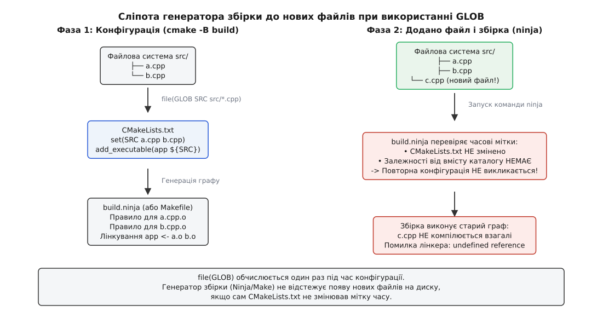
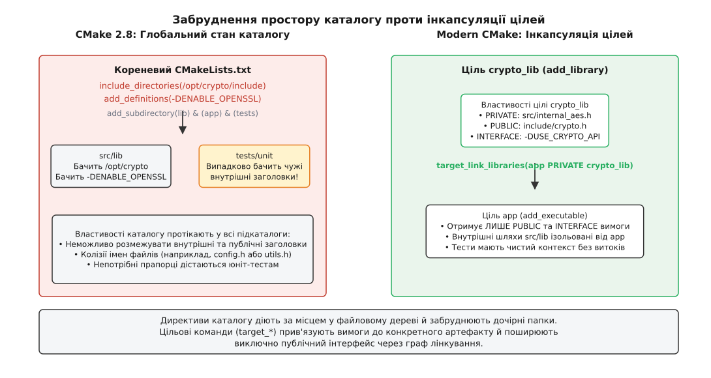
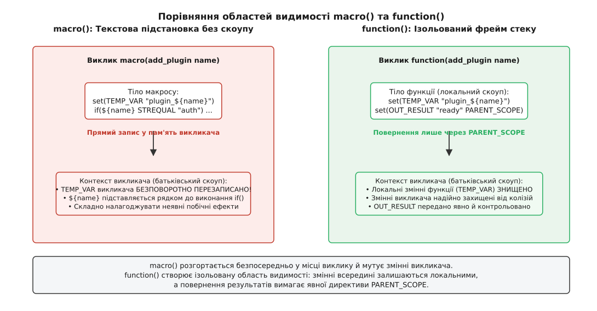
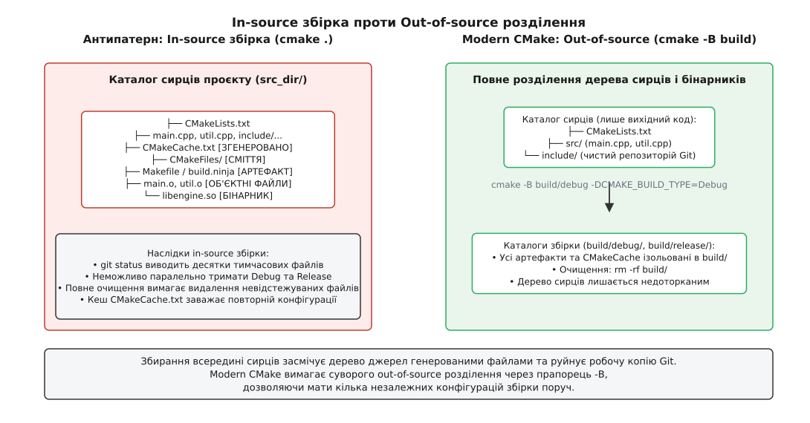

# Антипатерни CMake і чому вони живучі

<preknowlist>
- [Мова CMakeLists: змінні, області, потік керування](topic:build-systems/cmake-language) — значення в CMake є рядками, змінні прив'язані до областей видимості каталогу або функції, команди виконуються послідовно під час конфігурації.
- [Цілі й властивості замість глобальних змінних](topic:build-systems/targets-and-properties) — сучасна модель CMake будується навколо іменованих об'єктів (цілей), які інкапсулюють власні вихідні файли, прапорці компіляції та шляхи пошуку заголовків.
- [Вимоги вжитку: PUBLIC, PRIVATE, INTERFACE](topic:build-systems/usage-requirements) — специфікатори видимості, що керують транзитивним поширенням властивостей цілі графом залежностей.
- [Конфігурація, генерація і збірка](topic:build-systems/configure-and-generate) — трифазна модель роботи CMake: обчислення скриптів у пам'яті, генерація нативних файлів збірки (Ninja/Make) і безпосередня компіляція.
- [Інкрементальна збірка: як вирішують, що застаріло](topic:build-systems/incremental-build) — механізм перевірки часових міток і графів залежностей систем Ninja та Make.
- [Кеш CMake, опції та їхнє життя](topic:build-systems/cache-and-options) — збереження параметрів між запусками у файлі `CMakeCache.txt` та пріоритети перевизначення змінних.
- [find_package: Config проти Module](topic:build-systems/find-package) — пошук залежностей та підключення зовнішніх бібліотек через імпортовані цілі.
</preknowlist>

Розробник додає новий файл `src/crypto_aes.cpp` до наявного репозиторію, відкриває термінал і запускає команду збірки `ninja`. Компілятор збирає змінені частини коду, але на етапі лінкування процес раптово завершується фатальною помилкою: `undefined reference to AES_Encrypt`. Розробник перевіряє каталог — файл на місці. Відкриває конфігураційний файл `CMakeLists.txt` і бачить рядок, який, здавалося б, мав охопити все автоматично: `file(GLOB_RECURSE SOURCES src/*.cpp)`. Система `ninja` навіть не намагалася викликати компілятор для нового файлу.

Причина цієї аварії криється в фундаментальному розриві між фазою **конфігурації мета-системи** та фазою **виконання графу збірки**. Команда `file(GLOB)` виконується один раз під час запуску `cmake -B build`. У цей момент CMake сканує файлову систему, фіксує перелік знайдених файлів і записує статичний список правил у файл `build.ninja`. Коли на диску з'являється `crypto_aes.cpp`, інструмент `ninja` перевіряє часові мітки вхідних файлів самого графу збірки: оскільки `CMakeLists.txt` ніхто не редагував, його часова мітка старіша за `build.ninja`. Утиліта збірки робить логічний висновок, що конфігурація проєкту не змінилася, генератор CMake викликати не потрібно, а про існування нового файлу на диску система збірки не знає взагалі.

Цей випадок — лише один із симптомів великого класу системних дефектів, відомих як **антипатерни CMake**. Вони виникають тоді, коли інструментом керування збіркою користуються за правилами застарілої моделі CMake 2.8 (каталоги, глобальні списки та рядкові прапорці), ігноруючи інкапсульовану цільову модель Modern CMake.

## Маятник часу: дві епохи однієї системи

Історія CMake чітко ділиться на два періоди, між якими лежить прірва в парадигмі інженерного мислення:

1. **Епоха застарілого CMake (CMake 2.8 style, до 2014 року).** У цій парадигмі CMake розглядався як простий макрогенератор файлів `Makefile`. Одиницею структурування був **каталог**. Усі команди змінювали глобальний стан поточного каталогу або конкатенували системні змінні: `include_directories()`, `link_libraries()`, `add_definitions()`, `set(CMAKE_CXX_FLAGS ...)`. Уся інформація про прапорці компіляції та шляхи заголовків зливалася в єдиний неструктурований потік параметрів, де не було різниці між внутрішніми та зовнішніми залежностями.
2. **Епоха Modern CMake (CMake 3.0+, започаткована у 2014 році).** Одиницею структурування є **ціль** (target) — самодостатній об'єкт, аналогічний екземпляру класу в об'єктно-орієнтованому програмуванні. Кожна ціль має чіткі межі, ізольовані внутрішні властивості (properties) та публічний інтерфейс взаємодії ([вимоги вжитку](topic:build-systems/usage-requirements)), що поширюється через `target_include_directories()`, `target_compile_definitions()` та `target_link_libraries()`.

Застарілий підхід створює небезпечну ілюзію простоти: для маленького монолітного проєкту з кількох файлів в одній папці написати три глобальні директиви здається швидшим і коротшим, ніж конструювати цільову структуру. Проте як тільки проєкт розростається до кількох підкаталогів, підключає зовнішні бібліотеки або починає збиратися під іншу платформу чи в іншому режимі компіляції, глобальні директиви спричиняють каскадні помилки.

Повна зведена таблиця заміни всіх застарілих директив на цільові властивості наведена в довідковій вставці [Таблиця заміни антипатернів](topic:build-systems/cmake-antipatterns/api-modern-replacements.md). Нижче розібрано механіку відмови кожного класичного антипатерна до самого інженерного дна.

---

## Пастка перша: `file(GLOB)` для вихідних файлів

Шаблонний підхід багатьох початківців виглядає так:

```cmake
# ❌ Антипатерн: збирання вихідних файлів за маскою
file(GLOB SOURCES "src/*.cpp")
add_executable(my_app ${SOURCES})
```

Мотивація розробника зрозуміла: небажання вручну вписувати ім'я кожного нового файлу в `CMakeLists.txt`. Проте ціна цієї удаваної зручності — повна сліпота генератора збірки до змін у файловій структурі на диску.



*file(GLOB) обчислюється лише під час конфігурації; генератор збірки не знає про нові файли на диску, доки не зміниться сам CMakeLists.txt.*

### Механізм відмови при додаванні та видаленні файлів

Розглянемо дві протилежні ситуації життєвого циклу репозиторію:

1. **Додавання файлу.** Розробник створив новий файл `src/render.cpp`. Запускає команду `ninja` (або `make`). Граф збірки описує залежності між наявними об'єктними файлами та вихідними файлами, зафіксованими під час минулої конфігурації. У цьому графі немає зв'язку між вмістом *папки* `src/` та файлом `build.ninja`. Як наслідок, `render.cpp` не компілюється взагалі, а лінкер падає з помилкою невизначених символів. Проблема «лікується» лише ручним примусовим перезапуском `cmake -B build` або фіктивною зміною часової мітки файлу `CMakeLists.txt` (наприклад, через утиліту `touch`).
2. **Видалення або перейменування файлу.** Розробник видалив застарілий файл `src/legacy.cpp` або перемкнув гілку в системі Git (`git checkout feature-branch`), де цього файлу ще не існувало. Запускає `ninja`. У файлі `build.ninja` досі записано жорстке правило: «зібрати `legacy.cpp.o` із `src/legacy.cpp`». Оскільки цільовий вузол графу вимагає вхідного файлу, якого більше немає на диску, збірка миттєво аварійно зупиняється з повідомленням: `ninja: error: 'src/legacy.cpp', needed by 'legacy.cpp.o', missing and no known rule to make it`.

### Чи рятує прапорець `CONFIGURE_DEPENDS`?

Починаючи з версії CMake 3.12, у команду `file(GLOB)` було додано прапорець `CONFIGURE_DEPENDS`:

```cmake
# ⚠️ Часткове вирішення з відчутними прихованими витратами
file(GLOB SOURCES CONFIGURE_DEPENDS "src/*.cpp")
add_executable(my_app ${SOURCES})
```

Під час генерації для інструментів Ninja та Make цей прапорець створює спеціальну службову перевірочну ціль, яка під час кожного виклику збірки звертається до операційної системи й запитує лістинг каталогу `src/`. Якщо перелік файлів змінився, система збірки автоматично ініціює повторну конфігурацію CMake.

Хоча це усуває проблему непомічених файлів, `CONFIGURE_DEPENDS` має суттєві інженерні недоліки:
- **Накладні витрати на дисковий ввід/вивід.** Якщо проєкт налічує сотні підкаталогів, перевірка стану кожного каталогу перед початком будь-якої інкрементальної збірки помітно уповільнює час реакції (особливо на повільних файлових системах Windows NTFS, мережевих дисках або всередині Docker-контейнерів).
- **Сміття в бінарниках.** Якщо розробник тимчасово створив експериментальний файл `src/test_hack.cpp` або текстовий редактор зберіг резервну копію `src/main.cpp.bak`, неакуратна маска `*.cpp` підхопить цей код у фінальну збірку продукту.
- **Конфлікти з Unity-збірками.** При використанні механізму `CMAKE_UNITY_BUILD` або плагінів пакетного об'єднання файлів, неконтрольований порядок зчитування файлів через glob може змінювати послідовність включення трансляційних одиниць від одного прогону до іншого, викликаючи приховані помилки компіляції та порушення внутрішніх макросів.
- **Втрата швидкості індексації в середовищах розробки.** Сучасні IDE (CLion, Visual Studio Code з плагіном CMake Tools, Visual Studio) використовують внутрішній протокол CMake File API (`.cmake/api/v1/reply/`) для отримання точного списку файлів цілі. Коли файли задані явно, середовище миттєво будує дерево проєкту та індекс символів. При використанні масок IDE змушена очікувати повної фази генерації файлової системи.

### Канонічне рішення Modern CMake

Єдиним надійним інженерним стандартом є **явний перелік файлів** у кожній цілі. У великих проєктах файли групують або додають за допомогою `target_sources()` та сучасного механізму наборів файлів (`FILE_SET`), введеного в CMake 3.23:

```cmake
# ✅ Канонічний Modern CMake: явний контроль складу цілі
add_library(crypto_core STATIC)

target_sources(crypto_core
    PRIVATE
        src/aes.cpp
        src/sha256.cpp
        src/internal_keys.h
    PUBLIC
        FILE_SET HEADERS
        BASE_DIRS include
        FILES
            include/crypto/aes.h
            include/crypto/sha256.h
)
```

Явний список джерел фіксує точний склад бібліотеки у системі контролю версій Git, унеможливлює випадкове потрапляння тимчасових файлів у збірку та забезпечує максимальну швидкість [інкрементальної збірки](topic:build-systems/incremental-build).

---

## Пастка друга: глобальні директиви каталогу

Найпоширеніший рудимент CMake 2.8 — використання команд, які модифікують стан каталогу:

```cmake
# ❌ Антипатерн: глобальне забруднення середовища каталогу
include_directories(include /opt/vendor/include)
add_definitions(-DENABLE_LOGGING -DAPI_VERSION=2)
link_libraries(pthread m)

add_subdirectory(core)
add_subdirectory(tests)
```



*Директиви каталогу діють за місцем у файловому дереві й забруднюють дочірні папки. Цільові команди (target_*) прив'язують вимоги до конкретного артефакту.*

### Механізм витоку областей видимості

Директиви `include_directories()`, `link_libraries()` та `add_definitions()` модифікують **властивості каталогу** (`INCLUDE_DIRECTORIES`, `LINK_LIBRARIES`, `COMPILE_DEFINITIONS`). 

Коли CMake зустрічає команду `add_subdirectory(core)`:
1. Каталог `core` отримує точну **копію** властивостей батьківського каталогу на момент виклику.
2. Каталог `tests` також отримує ту саму копію.
3. Якщо всередині `core/CMakeLists.txt` викликати ще один `include_directories(internal)`, він просочиться у всі вкладені каталоги `core`, але залишиться невидимим для сусіднього каталогу `tests`.

Це створює три критичні проблеми архітектури:
1. **Колізії заголовків та порушення правила єдиного визначення (ODR — One Definition Rule).** Якщо каталог `/opt/vendor/include` містить заголовок `utils.h`, а модуль `tests` має власний файл `tests/utils.h`, компілятор під час складання тестів може помилково підключити вендорний заголовок замість власного. Такі дефекти вкрай важко знайти, оскільки порядок пошуку залежить від черговості викликів `include_directories` у різних частинах кодової бази.
2. **Неможливість відокремлення деталей реалізації.** Бібліотека `core` не може приховати свої приватні заголовки від зовнішніх споживачів: усе, що додано в каталог, стає публічно видимим для всіх підкаталогів.
3. **Забруднення тестового середовища продуктивними прапорцями.** Юніт-тести змушені компілюватися з макросами та шляхами, які їм не потрібні, що порушує чистоту та ізоляцію тестування.

### Канонічне рішення Modern CMake

Усі вимоги до збірки мають бути прив'язані виключно до цілей із явним зазначенням області видимості (`PRIVATE`, `PUBLIC`, `INTERFACE`):

```cmake
# ✅ Канонічний Modern CMake: ізоляція через властивості цілі
add_library(network_engine STATIC
    src/socket.cpp
    src/packet.cpp
)

target_include_directories(network_engine
    PUBLIC
        $<BUILD_INTERFACE:${CMAKE_CURRENT_SOURCE_DIR}/include>
        $<INSTALL_INTERFACE:include>
    PRIVATE
        ${CMAKE_CURRENT_SOURCE_DIR}/src/internal
)

target_compile_definitions(network_engine
    PRIVATE
        INTERNAL_BUFFER_SIZE=4096
    PUBLIC
        NET_ENGINE_ACTIVE=1
)

target_link_libraries(network_engine
    PUBLIC
        Threads::Threads
)
```

Коли інша ціль лінкує `network_engine`:
```cmake
add_executable(server_app app/main.cpp)
target_link_libraries(server_app PRIVATE network_engine)
```
Додаток `server_app` автоматично отримує доступ до публічних заголовків `include/` та макросу `NET_ENGINE_ACTIVE`, але не бачить внутрішньої папки `src/internal` і не отримує макрос `INTERNAL_BUFFER_SIZE`.

---

## Пастка третя: ручне маніпулювання `CMAKE_CXX_FLAGS`

Одним із найнебезпечніших антипатернів є пряма модифікація глобальних рядків прапорців компілятора:

```cmake
# ❌ Антипатерн: жорстка конкатенація прапорців у глобальну змінну
set(CMAKE_CXX_FLAGS "${CMAKE_CXX_FLAGS} -std=c++17 -Wall -Wextra -O3 -fPIC")
```

Цей рядок порушує одразу кілька фундаментальних принципів надійності систем збірки.

### Чому прямий запис у `CMAKE_CXX_FLAGS` руйнує збірку

1. **Прив'язка до одного компілятора (Vendor Lock-in).** Прапорець `-std=c++17` є специфічним для компіляторів GCC та Clang. Якщо цей проєкт спробувати зібрати під Windows за допомогою MSVC (Microsoft Visual C++), компілятор зупинить збірку з помилкою або проігнорує невідомий параметр, оскільки для MSVC прапорець стандарту записується як `/std:c++17`. Те саме стосується `-Wall` (еквівалент MSVC — `/W4`) та `-fPIC` (який взагалі не має сенсу у форматі PE/COFF для Windows).
2. **Затирання конфігурацій збірки користувача.** Якщо розробник запускає налагоджувальну збірку `cmake -DCMAKE_BUILD_TYPE=Debug`, жорстко прописаний прапорець `-O3` змусить компілятор оптимізувати бінарний код, зробивши покрокове налагодження в `gdb` чи `lldb` практично неможливим через викидання змінних та інлайнінг функцій.
3. **Знищення мультиконфігураційних генераторів.** Генератори для Visual Studio, Xcode або `Ninja Multi-Config` генерують єдиний проєкт, що містить одночасно конфігурації `Debug`, `Release`, `RelWithDebInfo` та `MinSizeRel`. Вибір типу збірки відбувається не під час конфігурації, а в момент запуску `cmake --build . --config Debug`. Якщо зашити оптимізації в загальну змінну `CMAKE_CXX_FLAGS`, налагоджувальний бінарник буде зіпсовано незалежно від обраного режиму.
4. **Глобальне зараження підпроєктів.** Якщо проєкт підключає сторонню бібліотеку через `add_subdirectory()` або `FetchContent`, ця бібліотека також отримає `-Wall -Wextra`. Якщо сторонній код містить незначні попередження, які автори бібліотеки вважали допустимими, збірка всього проєкту буде заблокована (особливо якщо додатково встановлено `-Werror`).

### Канонічне рішення Modern CMake

Для керування стандартом мови використовують **властивості стандарту цілі** або команду `target_compile_features()`:

```cmake
# ✅ Задання стандарту мови для конкретної цілі
target_compile_features(my_target PUBLIC cxx_std_20)

# Додаткові системні налаштування цілі за потреби:
set_target_properties(my_target PROPERTIES
    CXX_STANDARD 20
    CXX_STANDARD_REQUIRED ON
    CXX_EXTENSIONS OFF  # Вимикає нестандартні розширення на кшталт gnu++20
)
```

Для додавання специфічних прапорців діагностики та оптимізації застосовують `target_compile_options()` у поєднанні з **генераторними виразами** ([generator expressions](topic:build-systems/generator-expressions)):

```cmake
# ✅ Компіляторо-незалежні прапорці попереджень
target_compile_options(my_target PRIVATE
    $<$<OR:$<CXX_COMPILER_ID:Clang>,$<CXX_COMPILER_ID:AppleClang>,$<CXX_COMPILER_ID:GNU>>:
        -Wall -Wextra -Wpedantic -Wshadow -Wconversion
    >
    $<$<CXX_COMPILER_ID:MSVC>:
        /W4 /permissive-
    >
)
```

Починаючи з CMake 3.24, для суворого контролю попереджень замість небезпечного прапорця `-Werror` використовують стандартну цільову властивість `COMPILE_WARNING_AS_ERROR`:

```cmake
# ✅ Безпечне перетворення попереджень на помилки лише для власного коду
set_target_properties(my_target PROPERTIES
    COMPILE_WARNING_AS_ERROR ON
)
```

Такий підхід гарантує, що прапорці попереджень застосовуються суворо до зазначеної цілі, не ламаючи сторонні залежності.

---

## Пастка четверта: жорстке зашивання абсолютних шляхів і прапорця `link_directories`

У старих інструкціях часто радять підключати сторонні бібліотеки в один із двох способів:

```cmake
# ❌ Антипатерн А: використання глобального каталогу пошуку лінкера
link_directories(/usr/local/lib /opt/boost/lib)
target_link_libraries(app boost_filesystem)

# ❌ Антипатерн Б: зашивання абсолютного шляху до бінарного файлу бібліотеки
target_link_libraries(app /usr/lib/x86_64-linux-gnu/libssl.so)
```

Обидва варіанти фатально ламають переносимість і крос-компіляцію.

### Чому `link_directories` є токсичною командою

Команда `link_directories(/path)` додає прапорець `-L/path` у командний рядок лінкера для всіх наступних цілей. Лінкер операційної системи перевіряє каталоги пошуку у строго визначеному порядку. Якщо у каталозі `/opt/boost/lib` випадково опиниться стара або несумісна версія системної бібліотеки `libz.so`, лінкер підхопить її замість системної бібліотеки з `/usr/lib`, спричинивши непередбачувані помилки лінкування або збої під час виконання програми (ABI breakage). Крім того, прапорці `-L` ламають механізм відносних шляхів `RPATH`/`RUNPATH` на Linux та `@rpath` на macOS. При правильному лінкуванні через цілі CMake автоматично прописує в заголовок ELF-бінарника шлях відносно `$ORIGIN`, дозволяючи додатку знаходити власні динамічні бібліотеки у папці `lib/` після інсталяції. Глобальні каталоги лінкера цей механізм руйнують.

### Чому прямі шляхи ламають крос-компіляцію

Якщо вказати абсолютний шлях `/usr/lib/x86_64-linux-gnu/libssl.so`, проєкт зможе зібратися виключно на 64-бітному дистрибутиві Ubuntu/Debian x86_64:
- На Fedora/RHEL бібліотека лежить у `/usr/lib64/libssl.so` — збірка впаде.
- На macOS бібліотеки мають розширення `.dylib` і живуть у `/opt/homebrew/lib` — збірка впаде.
- Під час [крос-компіляції](topic:build-systems/cross-compilation) для ARM64 (наприклад, для Raspberry Pi або промислового контролера) компілятор спробує слінкувати бінарник ARM64 з хостовою бібліотекою x86_64 — лінкер видасть фатальну помилку несумісності форматів (`file in wrong format`).

### Канонічне рішення Modern CMake

Зовнішні залежності мають виявлятися виключно через механізм пакетів із генерацією імпортованих цілей (`IMPORTED targets`):

```cmake
# ✅ Коректний пошук через модуль або конфігураційний пакет
find_package(OpenSSL REQUIRED)

target_link_libraries(app PRIVATE
    OpenSSL::SSL
    OpenSSL::Crypto
)
```

Імпортована ціль `OpenSSL::SSL` містить у собі правильний абсолютний шлях до файлу бібліотеки для поточної цільової платформи, коректні каталоги заголовків та необхідні супутні бібліотеки. Під час крос-компіляції CMake автоматично візьме бібліотеку з вказаного каталогу `sysroot` цільової системи через змінну `CMAKE_SYSROOT`, повністю ігноруючи несумісні хостові файли.

---

## Пастка п'ята: примусове затирання кешу `set(... CACHE ... FORCE)`

Під час розробки модульних систем автори підпроєктів іноді намагаються примусово задати глобальні параметри за допомогою модифікатора `FORCE`:

```cmake
# ❌ Антипатерн: знищення вибору користувача
set(BUILD_SHARED_LIBS ON CACHE BOOL "Збирати спільні бібліотеки" FORCE)
set(CMAKE_BUILD_TYPE "Release" CACHE STRING "Тип збірки" FORCE)
```

### Механіка пошкодження кешу

[Кеш CMake (`CMakeCache.txt`)](topic:build-systems/cache-and-options) створений для того, щоб зберігати налаштування, які користувач або зовнішній інструмент (IDE, CI-скрипт, пакетний менеджер Conan/vcpkg, файл конфігурації CMakePresets) передав під час конфігурації:

```bash
cmake -B build -DBUILD_SHARED_LIBS=OFF -DCMAKE_BUILD_TYPE=Debug
```

Коли у файлі `CMakeLists.txt` виконується команда `set(... CACHE ... FORCE)`, CMake під час кожного прогону безумовно перезаписує збережене в кеші значення новим рядком.

Наслідки:
1. **Ігнорування командного рядка.** Розробник або скрипт безперервної інтеграції (CI) передає `-DCMAKE_BUILD_TYPE=Debug`, але рядок із `FORCE` мовчки скидає його назад у `Release`. Зібрати проєкт у налагоджувальному режимі стає неможливо без ручного редагування вихідних файлів `CMakeLists.txt`.
2. **Конфлікти у мультипроєктних репозиторіях.** Якщо підпроєкт `A` викликає `set(BUILD_SHARED_LIBS ON ... FORCE)`, він ламає конфігурацію кореневого проєкту та сусіднього підпроєкту `B`, який розраховував на статичне лінкування.

### Канонічне рішення Modern CMake

Для створення опцій конфігурації використовують команду `option()` або команду `set(... CACHE ...)` **без** прапорця `FORCE`:

```cmake
# ✅ option() шанує значення з командного рядка
option(BUILD_SHARED_LIBS "Збирати спільні бібліотеки за замовчуванням" OFF)

# ✅ set() для кешованої змінної без FORCE ініціалізує її ЛИШЕ якщо вона ще не створена
if(NOT CMAKE_BUILD_TYPE AND NOT CMAKE_CONFIGURATION_TYPES)
    set(CMAKE_BUILD_TYPE "RelWithDebInfo" CACHE STRING "Тип збірки за замовчуванням" FORCE)
    # Єдиний легітимний випадок FORCE — встановлення дефолту, коли змінна повністю порожня
    set_property(CACHE CMAKE_BUILD_TYPE PROPERTY STRINGS "Debug" "Release" "MinSizeRel" "RelWithDebInfo")
endif()
```

Політика `CMP0077` (введена в CMake 3.13) додатково гарантує, що команда `option()` не перезаписує навіть звичайні (не кешовані) змінні, встановлені батьківським проєктом перед викликом `add_subdirectory()`. Це забезпечує передбачувану композицію модулів у великих системах.

---

## Пастка шоста: використання `macro()` замість `function()`

У скриптах CMake часто можна побачити створення допоміжних команд через `macro()` замість `function()`:

```cmake
# ❌ Антипатерн: макрос із витоком змінних та текстовою заміною
macro(register_test test_name test_source)
    set(target_name "test_${test_name}")
    add_executable(${target_name} ${test_source})
    target_link_libraries(${target_name} PRIVATE GTest::gtest_main)
    add_test(NAME ${target_name} COMMAND ${target_name})
endmacro()
```



*macro() розгортається безпосередньо у місці виклику й мутує змінні викликача. function() створює ізольовану область видимості.*

### Фундаментальна різниця між `macro()` та `function()`

Різниця між цими двома сутностями полягає в способі виконання та роботі з областями видимості:

1. **`function()` створює новий стек викликів (нова область видимості).** Усі змінні, створені чи змінені всередині функції (наприклад, `set(target_name ...)`), є суворо локальними і безслідно знищуються після завершення функції. Щоб повернути результат назовні, розробник мусить явно викликати `set(OUT_VAR "value" PARENT_SCOPE)`.
2. **`macro()` виконує пряму текстову підстановку у контекст того, хто його викликав.** Макрос не створює власної області видимості. Усі операції `set()` всередині макросу виконуються безпосередньо над змінними викликача.

### Пастки поведінки `macro()`

- **Забруднення та пошкодження змінних викликача.** Якщо у файлі, що викликає `register_test`, уже існувала важлива змінна `target_name`, макрос без попередження затре її новим значенням, що призведе до катастрофічних побічних ефектів у наступних рядках файлу.
- **Текстова природа аргументів.** Аргументи макросу (`test_name`, `test_source`, `${ARGN}`) не є справжніми змінними CMake. Вони є рядковими літералами, які препроцесор CMake буквально підставляє в тіло макросу перед його виконанням. Через це перевірки умов поводяться непередбачувано:

```cmake
macro(check_flag flag_name)
    # Якщо викликати check_flag(ENABLE_FEATURE), рядок розгорнеться в:
    # if(ENABLE_FEATURE) -> перевіряє змінну з іменем ENABLE_FEATURE
    # Але якщо передати назву рядком, конструкції if(DEFINED ${flag_name}) зламаються
    if(${flag_name})
        message(STATUS "Flag is active")
    endif()
endmacro()
```

### Коли макроси справді потрібні

Макроси в Modern CMake мають лише два легітимні призначення:
- Коли дія повинна перервати виконання викликаючого файлу: виклик `return()` всередині макросу зупиняє виконання файлу `CMakeLists.txt`, який викликав цей макрос (виклик `return()` всередині `function()` зупиняє лише саму функцію).
- Обгортки над системними командами `find_package()` або `include()`, які повинні експортувати десятки імпортованих цілей і кешованих змінних безпосередньо у поточний файл без ручного переліку в `PARENT_SCOPE`.

У всіх інших випадках слід використовувати виключно `function()`, а для розбору іменованих параметрів застосовувати стандартний модуль `cmake_parse_arguments`:

```cmake
# ✅ Канонічна функція з безпечною обробкою аргументів
function(register_unit_test)
    cmake_parse_arguments(ARG "" "NAME;SOURCE" "LIBRARIES" ${ARGN})
    
    set(target_name "test_${ARG_NAME}")
    add_executable(${target_name} ${ARG_SOURCE})
    target_link_libraries(${target_name} PRIVATE GTest::gtest_main ${ARG_LIBRARIES})
    add_test(NAME ${target_name} COMMAND ${target_name})
endfunction()
```

---

## Пастка сьома: In-source збірка (`cmake .`) та її блокування

Найпростіший спосіб початківця запустити збірку за звичкою від утиліти `make` — зайти в корінь проєкту й виконати:

```bash
# ❌ Антипатерн: запуск конфігурації у поточному каталозі сирців
cd my_project
cmake .
make
```

Ця операція називається **in-source збіркою** (збиранням у дереві джерел).



*Збирання всередині сирців засмічує дерево джерел генерованими файлами. Out-of-source розділення тримає репозиторій чистим.*

### Руйнівні наслідки in-source збірки

1. **Засмічення репозиторію.** CMake генерує у каталозі вихідного коду десятки службових файлів: `CMakeCache.txt`, каталог `CMakeFiles/`, `cmake_install.cmake`, тимчасові файли Make або Ninja, а компілятор додає туди ж сотні об'єктних файлів `.o`. Команда `git status` перетворюється на нечитабельне полотно невідстежуваних файлів.
2. **Неможливість паралельних конфігурацій.** Розробник не може одночасно тримати поруч налагоджувальну збірку `Debug` з увімкненими санітайзерами та оптимізовану збірку `Release` для бенчмарків. Кожна зміна вимагає повного ручного очищення.
3. **«Отруєння» дерева сирців.** Якщо в корені проєкту одного разу з'явився файл `CMakeCache.txt`, будь-яка майбутня спроба правильної out-of-source збірки (`cmake -B build`) буде знаходити старий кореневий кеш і зчитувати з нього застарілі шляхи, призводячи до незрозумілих помилок лінкування. Видалити всі сліди невдалої in-source збірки часто вдається лише повною командою очищення `git clean -fdx`, яка ризикує безповоротно стерти незбережені нові вихідні файли.

### Канонічне блокування in-source збірок у коді

Сучасний `CMakeLists.txt` повинен містити апаратний запобіжник на самому початку файлу, **до** виклику команди `project()`:

```cmake
# ✅ Гарантована заборона збирання у дереві джерел
if(CMAKE_SOURCE_DIR STREQUAL CMAKE_BINARY_DIR)
    message(FATAL_ERROR 
        "❌ In-source збірка суворо заборонена!\n"
        "CMake згенерував службові файли всередині дерева сирців.\n"
        "1. Видаліть CMakeCache.txt та каталог CMakeFiles/\n"
        "2. Запустіть коректну out-of-source збірку: cmake -B build"
    )
endif()
```

Сучасний робочий процес вимагає використання прапорця `-B`:

```bash
# ✅ Канонічний робочий процес Modern CMake
cmake -B build/debug -DCMAKE_BUILD_TYPE=Debug
cmake --build build/debug -j $(nproc)
```

---

## Чому антипатерни такі живучі: соціологія та інерція екосистеми

Технічні недоліки CMake 2.8 style були детально задокументовані й вирішені понад десять років тому. Проте навіть сьогодні значна частина відкритих репозиторіїв та корпоративних баз коду продовжує наповнюватися застарілими конструкціями. Чому це відбувається?

Детальний аналіз історичного переходу від Makefile до Modern CMake розкрито у вставці [Народження Modern CMake](topic:build-systems/cmake-antipatterns/hist-modern-cmake.md). З інженерного та соціологічного погляду живучість антипатернів підтримується чотирма основними факторами:

1. **Ціна абсолютної зворотної сумісності.** Компанія Kitware ніколи не ламає зворотну сумісність радикально. Завдяки механізму політик (`cmake_policy`), застарілі команди на кшталт `include_directories()` не видаляються з рушія, а продовжують працювати. Розробник, який написав неякісний скрипт, не отримує помилки конфігурації — проєкт тихо збирається, відкладаючи катастрофу до моменту масштабування або перенесення на іншу ОС.
2. **Пастка пошукових систем.** Відповіді на платформі StackOverflow, написані у 2008–2012 роках, мають найвищий рейтинг цитованості та переглядів. Пошуковий запит «how to add include directory cmake» у перших посиланнях досі видає застарілу `include_directories()`, а не `target_include_directories()`. Новачки копіюють перше посилання, закріплюючи антипатерн.
3. **Генеративні моделі штучного інтелекту.** Сучасні мовні моделі навчаються на терабайтах коду з відкритих репозиторіїв GitHub. Оскільки за 25 років існування CMake кодових баз зі старим стилем накопичилося значно більше, ніж із сучасним цільовим підходом, генератори коду за замовчуванням пропонують розробникам суміш застарілих антипатернів.
4. **Ілюзія швидкого старту.** Для одиночного файлу `main.cpp` скрипт із трьох рядків `include_directories`, `add_definitions` та `add_executable` виглядає коротшим, ніж конструювання цілі з правильними властивостями та псевдонімами `ALIAS`. Проте цей виграш у три рядки обертається днями налагодження, коли проєкт виростає у повноцінний програмний комплекс.

Повний покроковий приклад перетворення застарілого проєкту з усіма сімома антипатернами на чистий Modern CMake наведено у практичній вставці [Рефакторинг застарілого проєкту](topic:build-systems/cmake-antipatterns/proj-antipattern-refactoring.md).

---

## Інструменти діагностики та виявлення антипатернів

Для виявлення прихованих проблем конфігурації у наявних проєктах використовують три вбудовані діагностичні механізми CMake:

### 1. Трасування виконання скриптів (`--trace-expand`)
Команда дозволяє побачити кожен рядок CMakeLists із повністю підставленими значеннями змінних:
```bash
cmake -B build --trace-expand | grep -E "(include_directories|link_libraries|CMAKE_CXX_FLAGS)"
```
Це допомагає миттєво локалізувати місце, де підпроєкт намагається перезаписати глобальні прапорці компілятора або викликом `include_directories` змінює каталог пошуку.

### 2. Генерація графу залежностей через Graphviz
```bash
cmake -B build --graphviz=build/dependencies.dot
dot -Tsvg build/dependencies.dot -o build/dependencies.svg
```
На згенерованій діаграмі цілі Modern CMake утворюють чіткий спрямований граф (DAG). Якщо в проєкті присутні застарілі глобальні директиви `link_libraries()`, граф покаже неприродні зв'язки між непов'язаними модулями та тестовими утилітами.

### 3. Діагностика пошуку пакетів (`--debug-find`)
```bash
cmake -B build --debug-find-pkg=OpenSSL
```
Виводить покроковий журнал того, де саме CMake шукає заголовки та бінарні файли бібліотеки, дозволяючи переконатися, що імпортована ціль посилається на коректний `sysroot` цільової системи, а не на випадкові хостові шляхи.

---

## Архітектурні правила Modern CMake: зведення інженерної дисципліни

Щоб захистити архітектуру системи збірки від деградації, конфігураційні файли CMake повинні підпорядковуватися суворим інженерним правилам:

1. **Думати цілями, а не каталогами.** Будь-який бібліотечний модуль або виконуваний файл повинен бути створений як самостійна ціль (`add_library`, `add_executable`), що володіє власними вихідними файлами, макросами та шляхами пошуку.
2. **Суворо розділяти області видимості вимог.** Кожна вимога до компіляції та лінкування повинна мати чіткий модифікатор:
   - `PRIVATE` — потрібно лише для компіляції самої цілі;
   - `INTERFACE` — потрібно лише споживачам цілі (типово для header-only бібліотек);
   - `PUBLIC` — потрібно і самій цілі, і всім, хто з нею лінкується.
3. **Використовувати простори імен для цілей.** Усі бібліотеки, призначені для експорту назовні або внутрішнього вжитку між підпроєктами, повинні мати псевдонім із подвійною двокрапкою: `add_library(Project::Engine ALIAS Engine)`. Це гарантує, що помилка в назві бібліотеки призведе до миттєвої зупинки на фазі конфігурації CMake, а не до загадкової помилки лінкера.
4. **Ніколи не змінювати глобальні прапорці компілятора напряму.** Замість конкатенації `CMAKE_CXX_FLAGS` слід використовувати `target_compile_features()` для стандарту C++ та `target_compile_options()` із генераторними виразами для компіляторо-залежних прапорців.
5. **Завжди вказувати вихідні файли явно.** Відмовитися від `file(GLOB)` на користь явного переліку файлів у цілі, забезпечуючи детермінованість графу інкрементальної збірки.
6. **Ізолювати складання від сирців.** Завжди використовувати окремий каталог збірки (`cmake -B build`) та впроваджувати апаратне блокування in-source збірок у кореневому `CMakeLists.txt`.
7. **Використовувати лінтери та статичні аналізатори CMake.** Інтегрувати у процес безперервної інтеграції (CI) утиліти перевірки коду збірки (наприклад, `cmake-lint` або `gersemi`), які автоматично виявляють застарілі команди та заборонені глобальні модифікації на етапі перевірки коду.

Дотримання цих правил перетворює систему збірки з джерела постійних аварійних збоїв на надійний, передбачуваний та самодокументований каркас інженерного проєкту.
