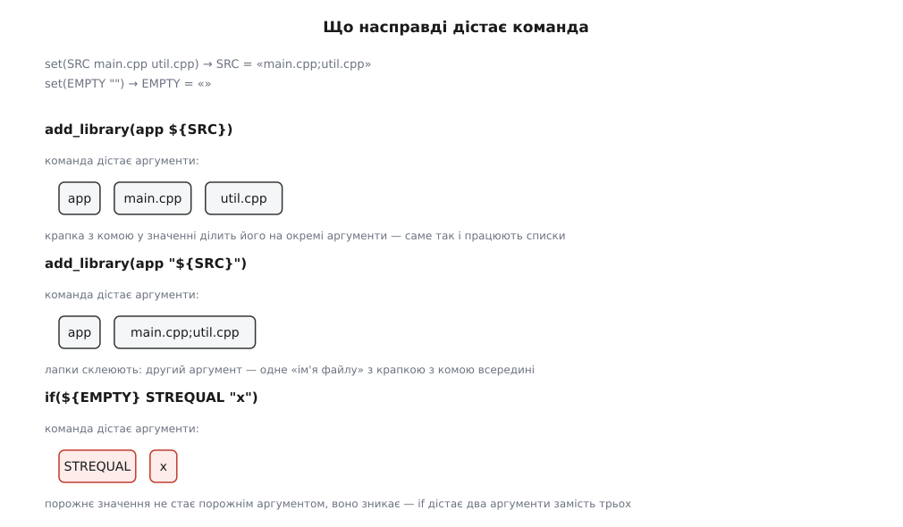
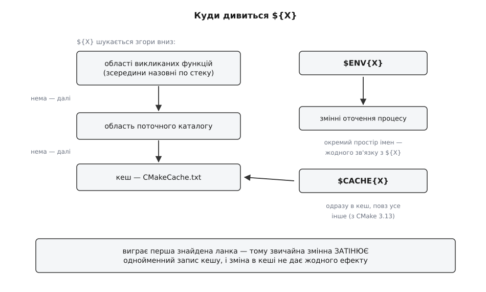
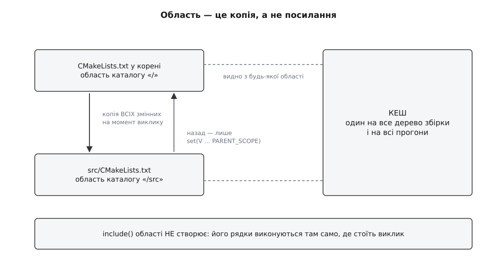

# Мова CMakeLists: змінні, області, потік керування

<preknowlist>
- [Роль системи збірки](book:build-systems/build-system-role) — навіщо між деревом джерел і готовим артефактом узагалі стоїть окремий інструмент і що він зобов'язаний вирішити.
- [Конфігурація, генерація і збірка](book:build-systems/configure-and-generate) — три різні моменти часу: коли CMake читає ваші файли, коли пише файли для ninja чи make і коли нарешті працює компілятор.
- [Компіляція](book:programming/compilation) — що перетворює текст програми на об'єктний файл і якими параметрами цим керують.
- [Лінкування](book:programming/linking) — як окремі об'єктні файли й бібліотеки стають однією програмою; звідси беруться ті списки, якими оперує CMake.
- [Область видимості змінної](book:programming/variable-scope) — ім'я має значення не скрізь, а лише в певній частині програми; поза нею те саме ім'я або порожнє, або чуже.
</preknowlist>

Ці шість рядків виглядають бездоганно і не працюють:

```cmake
function(collect_sources out)
  set(${out} main.cpp util.cpp)
endfunction()

collect_sources(SOURCES)
add_library(app ${SOURCES})
```

CMake зупиняється на останньому рядку: `add_library called with incorrect number of arguments`. Функція перед тим відпрацювала без жодної скарги — просто змінна `SOURCES` після неї порожня. Готовий рецепт із мережі («допишіть `PARENT_SCOPE`») справу полагодить, але лишить неприємне відчуття: чому саме так і де воно вистрелить наступного разу.

Відповіді немає в цих шести рядках. Вона в тому, чим є мова CMakeLists, — а найкоротший шлях до неї починається з питання, що взагалі відбувається, коли ви кажете `cmake ..`.

## Що виконується, коли ви кажете cmake

Опис збірки не можна записати таблицею. На Linux бібліотека математики зветься `m` і додається окремо, на Windows її взагалі немає; у Clang попередження вмикаються одними прапорцями, у MSVC — іншими; тести збираються, лише якщо знайдено потрібну бібліотеку; користувач хоче зібрати без графіки. Усе це — рішення, які можна ухвалити тільки на конкретній машині в конкретний момент. Отже, файл опису мусить не просто перелічувати факти, а **вирішувати**: подивитися, що є навколо, і залежно від цього описати збірку так чи інакше. А «вирішувати» записують мовою.

Тому `cmake ..` не «читає конфіг». Він **запускає інтерпретатор**, який виконує ваш `CMakeLists.txt` згори вниз, рядок за рядком, рівно один раз. Кожен рядок — виклик команди. Команди бувають двох ґатунків: одні перевіряють оточення й крутять власними змінними інтерпретатора, інші **дописують щось у модель проєкту**, яку CMake будує в себе в пам'яті. Модель — це набір цілей із їхніми властивостями та зв'язками ([цілі й властивості](book:build-systems/targets-and-properties) — окремий і головний предмет CMake). Коли останній рядок виконано, інтерпретатор більше не потрібен: за роботу береться генератор і перетворює модель на файли для ninja, make чи Visual Studio.

З цього одразу випливає перше практичне: у мові CMakeLists **немає нічого, що виконується під час збірки**. Жоден `if`, жоден цикл, жодна змінна не доживають до моменту, коли компілятор запускається. Усе, що вони встигають, — вплинути на модель. Питання, які об'єктивно неможливо вирішити під час конфігурації (наприклад, які прапорці ставити в конфігурації Debug, якщо генератор Visual Studio дозволяє вибрати конфігурацію вже після генерації), мова не розв'язує зовсім — для них існує окремий механізм відкладених рішень, [генераторні вирази](book:build-systems/generator-expressions).

І друге, менш очевидне: команди мови нічого не **повертають**. Немає виразів, немає значення виклику, немає `x = f(y)`. Є лише виклик команди з аргументами й наслідки цього виклику — у моделі проєкту або у змінних. Мову, у якій усе є побічним ефектом, читати треба інакше, ніж звичну: питання «яке значення тут вийшло» майже завжди беззмістовне, змістовне питання — «що цей виклик змінив і де».

## Одне-єдине сховище: рядок

Чим ця мова оперує? Її кінцева продукція — рядки команд для інших програм: `clang++ -O2 -Wall -Ibuild/include main.cpp -o main`. Не числа, не об'єкти, не дерева — рядки. Додайте до цього вимогу, з якою CMake народжувався: працювати однаково на Unix, Windows і Mac, залежати лише від компілятора C++ і нічого більше. Найдешевше сховище, яке точно поводиться однаково скрізь і природно лягає на кінцеву мету, — рядок. Його й обрали за єдиний тип значення. Як саме це вирішувалося 2000 року в Kitware і чому мова відтоді росла латками, а не проєктувалася, розказано окремо: [історія мови CMake](book:build-systems/cmake-language/hist-cmake-language.md).

Наслідок радикальніший, ніж здається. У мові немає **жодного** іншого типу. Число — рядок:

```cmake
set(N 42)
math(EXPR M "${N} + 1")
message(STATUS "${M}")      # -- 43
```

Арифметика тут — не операція мови, а команда `math`, яка розбирає рядок, рахує й кладе назад рядок. Логічне значення — теж рядок: `ON`, `TRUE`, `OFF`, `NO` — це просто послідовності літер, які певні команди домовилися тлумачити як істину чи хибу.

Найцікавіше — список. Спробуймо записати кілька файлів:

```cmake
set(SRC main.cpp util.cpp)
message(STATUS "[${SRC}]")   # -- [main.cpp;util.cpp]
```

Список не є структурою даних. Це той самий рядок, у якому елементи розділено крапкою з комою. `set` дістав три аргументи — ім'я й два значення — і склеїв два останні через `;`. Команда `list(APPEND …)` дописує до рядка `;` та ще один шматок. Тобто «список» у CMake — не тип, а **домовленість про те, як читати рядок**. Ця ідея не унікальна: так само влаштований [Tcl](book:programming/tcl), де все теж є рядком, а списковість — питання розбору.

> 🔧 **Навіщо це.** Звідси випливає жорстке правило гігієни: у значеннях CMake не повинно бути крапки з комою, якщо ви не мали на увазі список. Шлях, що містить `;`, або прапорець компілятора з `;` усередині розпадуться на кілька елементів у першій-ліпшій команді, яка їх торкнеться, і зламаються не там, де їх записали, а десь глибоко всередині чужого модуля. Коли крапка з комою потрібна як символ, її екранують: `\;`.

## Що насправді дістає команда

Тепер найважливіше місце у всій мові — те, як рядок вихідного тексту перетворюється на аргументи команди. Тут ховається більшість щоденних загадок.

Аргумент можна записати трьома способами, і вони відрізняються не стилем, а поведінкою.

**У лапках.** `"…"` — підстановка `${}` всередині відбувається, екранування працює, але результат **завжди** віддається команді як рівно один аргумент, скільки б у ньому не було пробілів і крапок з комою.

**Без лапок.** Підстановка `${}` теж відбувається — а далі отримане значення **ділиться на крапках з комою**, і кожен непорожній шматок стає окремим аргументом. Пробіли всередині значення нічого не ділять: рядок `My Project/src`, підставлений із змінної, лишиться одним аргументом. Ділить саме крапка з комою.

**У подвійних квадратних дужках.** `[[…]]` (з CMake 3.0) — вміст не зазнає ні підстановки, ні екранування взагалі. Це рятівний спосіб записати регулярний вираз або шматок скрипта оболонки, не воюючи з бекслешами.



*Пробіл у вихідному тексті розділяє аргументи; крапка з комою в підставленому значенні розділяє їх ще раз. Порожнє значення не перетворюється на порожній аргумент — воно просто зникає.*

Останній рядок картинки — джерело найчастішої аварії в CMake. `${VAR}` без лапок — це не «значення змінної». Це **нуль, один або багато аргументів**, і скільки саме, залежить від того, що всередині. Якщо змінна порожня чи не визначена, команда дістає на один аргумент менше, ніж написано в тексті, і скаржиться на кількість аргументів у місці, де синтаксично все гаразд. Якщо змінна містить список, аргументів раптом стає більше.

Звідси правило, до якого зводиться половина порад із гігієни CMakeLists: **беріть у лапки все, що є однією річчю** — шлях, повідомлення, ім'я цілі, значення для порівняння. Лишайте без лапок лише те, що ви свідомо хочете розгорнути на кілька аргументів, тобто список.

## Три місця, де живуть значення

Розібравшись, як значення потрапляє в команду, лишається з'ясувати, звідки воно береться. Імена в CMake шукаються не в одному сховищі, а в трьох, і плутанина між ними породжує клас помилок, у якому «я змінив значення, а нічого не сталося».

**Звичайна змінна.** Створюється командою `set(X значення)`, живе в поточній області (про них — далі) і зникає разом із нею. Кожен новий прогін CMake починає без жодної звичайної змінної.

**Запис кешу.** Створюється `set(X значення CACHE STRING "опис")` або `option(X "опис" ON)`. Кеш — це файл `CMakeCache.txt` у теці збірки, і він **єдине, що переживає прогони**. Саме тому все, що задає користувач ключем `-DX=…`, лягає в кеш: інакше CMake, запущений повторно, забув би про вибір. Із цієї ролі випливає дивна на перший погляд поведінка: `set(… CACHE …)` **не перезаписує** наявний запис. Якщо він уже є, команда мовчки нічого не робить — інакше кожен прогін затирав би вибір користувача власним усталеним значенням. Перезапис вимагає окремого слова `FORCE`, і саме тому `FORCE` майже завжди є ознакою помилки в проєкті. Життя кешу, типи записів і те, як він взаємодіє з опціями, розібрано окремо: [кеш CMake і опції](book:build-systems/cache-and-options).

**Змінна оточення.** Читається як `$ENV{PATH}`. Це справді оточення процесу, окремий простір імен, який із `${}` не перетинається ніяк.

Тепер — правило пошуку, з якого все й починає плутатися. Коли інтерпретатор бачить `${X}`, він шукає **звичайну** змінну: спершу в областях функцій, у яких зараз перебуває, потім в області поточного каталогу. І тільки якщо звичайної немає, дивиться в кеш.



*Виграє перша ланка, у якій ім'я знайшлося. Тому звичайна змінна повністю затіняє однойменний запис кешу — той нікуди не подівся, просто до нього не доходить черга.*

Це затінення — причина класичної розгубленості. Ви змінюєте `BUILD_TESTS` у графічному `ccmake`, перезапускаєте — нічого не змінюється. Причина в тому, що десь у проєкті стоїть `set(BUILD_TESTS OFF)` без слова `CACHE`, і звичайна змінна забиває кеш назавжди. Пробитися повз неї можна синтаксисом `$CACHE{BUILD_TESTS}` (з CMake 3.13), але правильна дія — прибрати затінення, а не обходити його.

Затінення настільки типове, що з часом дістало легальне застосування. З CMake 3.13 команда `option()` **нічого не робить**, якщо звичайна змінна з таким іменем уже існує (політика `CMP0077`). Це зроблено навмисне: проєкт, який вкладає в себе чужий як підкаталог, ставить `set(FOO_BUILD_TESTS OFF)` перед `add_subdirectory` і тим самим жорстко задає режим підпроєкта, не чіпаючи його кешу й не сперечаючись із користувачем.

## Області: копія, а не посилання

Слово «область» у CMake означає не зовсім те, до чого привчають інші мови, і саме тут ховається розгадка прикладу з початку.

**Область каталогу** створюється, коли батьківський файл викликає `add_subdirectory(src)`. У цю мить CMake бере **всі** змінні, визначені в батьківській області, і **копіює** їх у нову. Не позичає, не робить посилання — копіює. Далі два світи живуть окремо: усе, що підкаталог у себе змінить, лишиться в підкаталозі; батько цього не побачить ніколи.



*Копіювання відбувається один раз, у момент виклику: змінна, яку батько задасть після `add_subdirectory`, у підкаталог уже не потрапить. Кеш під це правило не підпадає — він спільний, тому саме через нього підпроєкти й домовляються.*

**Область функції** створюється на час виклику `function()`. Вона поводиться інакше: значень туди ніхто не копіює, натомість читання, яке не знайшло імені всередині, **провалюється назовні** — у ту область, звідки функцію викликано, і далі вниз по драбині з попередньої картинки. Тому функція бачить змінні того, хто її викликав. Але `set` усередині функції прив'язує ім'я **локально** — і разом із виходом із функції прив'язка зникає.

**`include()` області не створює зовсім.** Його рядки виконуються так, ніби їх вставили просто в те місце, де стоїть виклик. Це відмінність, яку легко проґавити: `add_subdirectory` ізолює, `include` — ні.

Тепер повернімося до шести рядків із початку. `set(${out} main.cpp util.cpp)` усередині функції створив звичайну змінну з ім'ям `SOURCES` — **в області функції**. Функція завершилася, область зникла разом зі змінною. Той, хто викликав, ніколи її не бачив. Виправлення:

```cmake
function(collect_sources out)
  set(${out} main.cpp util.cpp PARENT_SCOPE)
endfunction()
```

І тут-таки — пастка, на якій ловляться навіть ті, хто знає про `PARENT_SCOPE`. Це слово означає буквально «постав у батьківській області», а **не** «постав тут і ще й там»:

```cmake
function(f)
  set(V one PARENT_SCOPE)
  message(STATUS "усередині: [${V}]")   # -- усередині: []
endfunction()
```

Усередині функції значення не з'явилося. Якщо воно потрібне і тут, і назовні, доводиться писати `set(V one)` та `set(V one PARENT_SCOPE)` поспіль — незграбно, але чесно щодо моделі.

З CMake 3.25 незграбності поменшало. З'явилася команда `block()`, яка створює область просто посеред коду, без функції, і вміє одразу оголосити, що з неї винести:

```cmake
block(PROPAGATE RESULT)
  set(TMP_A "проміжне")
  set(TMP_B "теж проміжне")
  set(RESULT "${TMP_A}/${TMP_B}")
endblock()
# TMP_A і TMP_B тут уже не існують, RESULT — існує
```

Тоді ж `return()` дістав опцію `PROPAGATE`, яка виносить перелічені змінні до того, хто викликав, проскакуючи всі вкладені `block()` усередині функції.

> 🔧 **Навіщо це.** Копіювання областей — технічна причина, чому «глобальні змінні з прапорцями» так погано працюють у великих проєктах. Ви ставите `set(CMAKE_CXX_FLAGS "…")` у корені, підкаталог отримує копію, змінює її під себе — і сусідній підкаталог про це не знає, бо його копію зроблено з тієї самої батьківської. Значення розповзається деревом непередбачувано, а помилка виявляється на іншому кінці проєкту. Саме тому сучасний CMake переносить усе, що можна, з змінних у властивості цілей: ціль — один глобальний об'єкт, а не набір копій ([антипатерни CMake](book:build-systems/cmake-antipatterns) розбирають цю заміну докладно).

## Умови й цикли: чому if() поводиться дивно

Керування потоком у CMake виглядає звичайно — `if`/`elseif`/`else`/`endif`, `foreach`, `while`, `break`, `continue`. Дивацтво в іншому: у мові немає виразів, а отже, немає й способу передати умову як значення. Умову передають **аргументами**, і `if` розбирає їх сам, за власними правилами, які не збігаються з правилами решти мови.

Головне з цих правил: **неквотований аргумент, який виявився іменем визначеної змінної, `if` замінює її значенням**. Це не підстановка `${}` — та вже відбулася раніше, до виклику. Це додаткове, друге розіменування, яке робить особисто `if`.

Із цього одразу випливає, як писати умови:

```cmake
if(BUILD_TESTS)        # правильно: if сам зазирне у змінну
if(${BUILD_TESTS})     # неправильно: підставляється значення, і if бачить його як рядок
```

Перший запис безпечний завжди. Другий ламається щоразу, коли значення не є акуратним словом: порожня змінна зникає й лишає `if` без аргументів (помилка розбору), список розсипається на кілька аргументів (теж помилка), а значення, яке випадково збіглося з іменем іншої змінної, розіменується вдруге й дасть щось геть стороннє.

Істинними `if` вважає `ON`, `YES`, `TRUE`, `Y` й будь-яке ненульове число; хибними — `OFF`, `NO`, `FALSE`, `N`, `IGNORE`, `NOTFOUND`, нуль, порожній рядок і будь-який рядок, що закінчується на `-NOTFOUND`. Останнє не примха: команди пошуку кладуть у результат саме `<ІМ'Я>-NOTFOUND`, коли нічого не знайшли, і завдяки цьому правилу результат пошуку можна перевіряти просто через `if`. Повний перелік операторів `if` — порівняння рядків, чисел і версій, перевірки `DEFINED`, `TARGET`, `EXISTS`, регулярні вирази — разом із набором підкоманд `list()` і `string()` зібрано окремо: [довідка мови CMake](book:build-systems/cmake-language/api-if-and-lists.md).

Автоматичне розіменування колись поширювалося й на аргументи в лапках, і це давало по-справжньому моторошні наслідки:

```cmake
set(A E)
set(E "")
if("${A}" STREQUAL "")
```

Підстановка `${A}` дає рядок `E`, після чого старий `if` розіменовував і його — знаходив змінну `E`, підставляв її порожнє значення й повідомляв, що `"E"` дорівнює порожньому рядку. CMake 3.1 це виправив політикою `CMP0054`: аргументи в лапках і в квадратних дужках більше не розіменовуються. Проєкт отримує нову поведінку автоматично, якщо оголосив `cmake_minimum_required(VERSION 3.1)` або вище.

Цикли підпорядковані тій самій логіці рядків. Два записи роблять різне:

```cmake
foreach(f ${SRC})        # значення підставилося й розсипалося на аргументи
foreach(f IN LISTS SRC)  # передано ІМ'Я змінної, а список бере сам foreach
```

Форма `IN LISTS` приймає імена, а не значення, тому не залежить від того, як аргументи поділилися при підстановці, і коректно обробляє порожній список. Вона ж дозволяє перерахувати кілька списків поспіль, а з CMake 3.17 — і йти кількома списками паралельно через `IN ZIP_LISTS`. `while()` користується тими самими правилами умови, що й `if()`, і потрібен нечасто: обчислень у мові мало, а перебирати щось звичайно зручніше через `foreach`.

## Свої команди: function проти macro

Мова дозволяє оголосити власну команду двома способами, і різниця між ними — не стилістична.

`function()` створює справжню команду з власною областю. Аргументи стають звичайними змінними: названі параметри — під своїми іменами, повний список — у `ARGV`, решта після названих — в `ARGN`, кількість — в `ARGC`.

`macro()` не створює області **зовсім**. Її тіло виконується прямо там, де стоїть виклик, з усіма наслідками: `set` усередині макроса змінює змінні того, хто викликав; `return()` усередині макроса повертає керування не з макроса, а з функції чи файлу, що його викликали.

Але найважливіша різниця — в аргументах. **Аргументи макроса не є змінними.** Вони підставляються в текст тіла перед виконанням, майже так само, як це робить [препроцесор C](book:programming/preprocessor-macros). Тому:

```cmake
macro(m name)
  if(DEFINED name)          # ніколи не істина: змінної name не існує
    message(STATUS "є")
  endif()
  message(STATUS "${name}") # а це працює — текст замінили до виконання
endmacro()
```

Такі макроси ламаються тихо й у найнезручніший спосіб: у типовому випадку все виглядає правильно, а варто передати порожнє значення, значення з крапкою з комою або звернутися до аргументу не через `${}` — і поведінка стає незрозумілою.

Практичне правило коротке: **пишіть `function()`**. `macro()` виправданий рівно тоді, коли вам свідомо потрібно змінювати змінні того, хто викликає, — наприклад, у тонкій обгортці навколо `find_package`, яка мусить лишити знайдені шляхи в області виклику.

Позиційні аргументи в CMake швидко стають незручними: команда на п'ять параметрів, два з яких — списки, читається нестерпно. Тому в мові є `cmake_parse_arguments` (з CMake 3.5 — вбудована команда, раніше модуль; з 3.7 має форму `PARSE_ARGV`, доступну у функціях). Вона розбирає `ARGN` на прапорці, одиничні значення й списки, даючи вашій команді такий самий іменований синтаксис, як у вбудованих. Повністю робоча функція-обгортка з розбором аргументів, перевіркою помилок і поверненням результату розібрана окремо: [власна команда CMake від початку до кінця](book:build-systems/cmake-language/proj-helper-function.md).

## Мова, що змінюється: політики

Питання «а в якій версії?» до цієї мови доречне як мало до якої. Мова CMakeLists росла двадцять із гаком років разом із проєктами, які нею описано, і кожна зміна поведінки загрожувала зламати тисячі чужих файлів. Механізм, який дозволив змінювати мову й водночас не ламати старе, зветься **політикою** (від гр. *politikḗ* — мистецтво врядування): кожна зміна поведінки дістає номер виду `CMP0054`, старий і новий варіанти співіснують, а який діє — вирішує проєкт.

Вирішує він одним рядком:

```cmake
cmake_minimum_required(VERSION 3.20)
```

Це не просто перевірка версії. Рядок наказує: усі політики, запроваджені до 3.20 включно, вмикай у новому варіанті, пізніші лиши в старому. Тому файл, який починається з `cmake_minimum_required(VERSION 2.8)`, свідомо просить стару поведінку `if` і всього іншого — навіть якщо його виконує найсвіжіший CMake.

Нескінченно так тривати не могло. CMake 4.0 прибрав сумісність із версіями до 3.5: `cmake_minimum_required(VERSION 3.4)` тепер не попередження, а помилка збірки. Тимчасовий обхід для чужого коду, який нікому підтримувати, — ключ `-DCMAKE_POLICY_VERSION_MINIMUM=3.5`. Механізм політик як такий — окрема тема з власними правилами успадкування й локального перевизначення: [політики CMake](book:build-systems/cmake-policies).

## Що з цього випливає для щоденного письма

Усе, що вище, тримається на трьох фактах: значення є рядком, аргументи народжуються з рядка діленням на крапках з комою, області копіюються. Практичні правила — просто ці факти, вивернуті в бік дії.

Беріть у лапки все, що мусить лишитися однією річчю, і лишайте без лапок лише свідомі списки. Не робіть зі списками операцій над рядками — для цього є `list()`, який знає про екранування; ручне склеювання через `;` рано чи пізно з'їсть елемент із крапкою з комою всередині. Пишіть `if(VAR)`, а не `if(${VAR})`. Оголошуйте `cmake_minimum_required` із реальною версією, а не з тією, що дісталася в спадок, — інакше ви користуєтеся мовою, поведінку якої вам ніхто не обіцяв.

І останнє, найважливіше — те, що з моделі випливає, але рідко проговорюється. Змінна в CMake — **локальна за своєю природою**: вона живе в області, копіюється при спуску в підкаталог, зникає при виході з функції. Ціль — навпаки, **глобальний об'єкт**: вона одна на все дерево збірки, її властивості видно звідусіль за іменем, і жодне копіювання областей їх не розмножує. Тому кожен опис, який ви переносите зі змінної у властивість цілі, перестає залежати від того, хто, звідки і в якому порядку викликав ваш файл. Не тому, що «так модно», а тому, що змінні в цій мові влаштовані так, як влаштовані.
