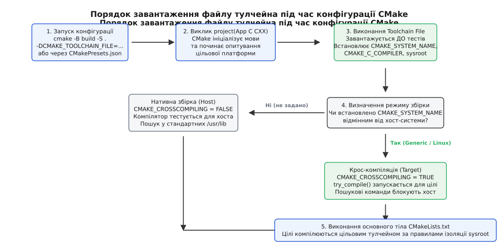
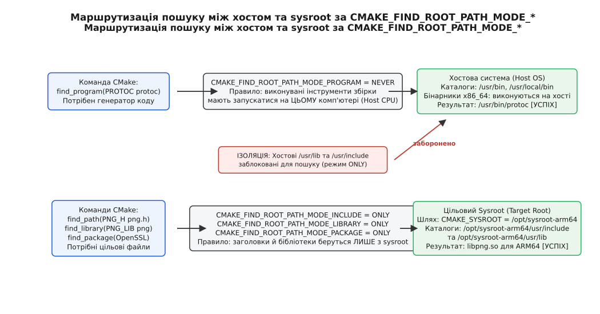
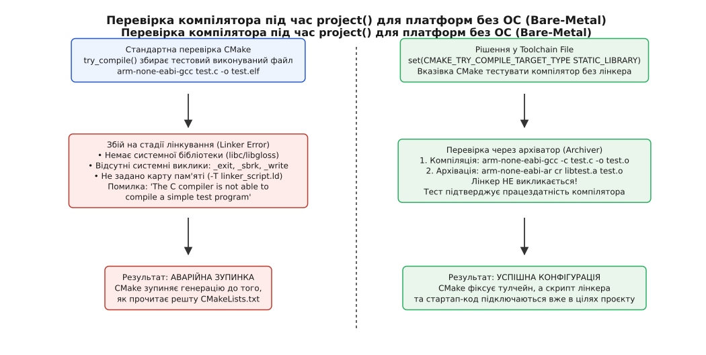

# Файл тулчейна: як CMake дізнається про чужу платформу

<preknowlist>
- [Конфігурація, генерація і збірка](book:build-systems/configure-and-generate) — життєвий цикл CMake та момент опитування компіляторів перед генерацією файлів складання.
- [Мова CMakeLists: змінні, області, потік керування](book:build-systems/cmake-language) — як змінні потрапляють у кеш CMake і чому локальні змінні не проникають у дочірні виклики.
- [Цілі й властивості замість глобальних змінних](book:build-systems/targets-and-properties) — трансляція прапорців і параметрів компіляції через інтерфейсні властивості цілей.
- [find_package: Config проти Module й імпортовані цілі](book:build-systems/find-package) — як працюють пошукові шляхи та чому важлива ізоляція системних каталогів.
- [Крос-компіляція: хост, ціль і що між ними](book:build-systems/cross-compilation) — поняття хостової робочої станції, цільового пристрою та ролі крос-компілятора.
- [Цільовий тріплет і sysroot](book:build-systems/target-triple-sysroot) — анатомія тріплетів архітектур і структура ізольованого дерева системних бібліотек.
- [CMakePresets: конфігурації як декларація](book:build-systems/cmake-presets) — збереження параметрів конфігурації та файлів тулчейна у версіонованих пресетах.
</preknowlist>

Розробник на робочій станції під керуванням x86_64 Ubuntu намагається зібрати прошивку для мікроконтролера STM32 (ARM Cortex-M4) або застосунок для одноплатного комп'ютера з процесором AArch64. У терміналі запускається конфігурація проєкту з передачею прямого шляху до крос-компілятора:

```bash
cmake -B build -S . -DCMAKE_C_COMPILER=arm-none-eabi-gcc
```

CMake запускає процес ініціалізації, але ще до прочитання першої команди `add_executable()` у кореневому `CMakeLists.txt` конфігурація аварійно зупиняється з фатальною помилкою:

```text
-- The C compiler identification is GNU 13.2.1
-- Detecting C compiler ABI info
-- Detecting C compiler ABI info - FAILED
-- Check for working C compiler: /usr/bin/arm-none-eabi-gcc
-- Check for working C compiler: /usr/bin/arm-none-eabi-gcc - broken
CMake Error at /usr/share/cmake/Modules/CMakeTestCCompiler.cmake:67 (message):
  The C compiler
    "/usr/bin/arm-none-eabi-gcc"
  is not able to compile a simple test program.
  ...
  /usr/bin/arm-none-eabi-ld: cannot find crt0.o: No such file or directory
  /usr/bin/arm-none-eabi-ld: cannot find -lc
```

Причина збою полягає в тому, що за замовчуванням CMake працює в режимі **нативної збірки** (англ. *native compilation*). Він припускає, що створювана програма виконуватиметься на тому самому комп'ютері, де запущено CMake. Щоб перевірити працездатність компілятора, CMake намагається скомпілювати й повністю скомпонувати мінімальний тестовий бінарник під стандартне хостове середовище. Але для мікроконтролера немає операційної системи Linux, немає готової бібліотеки `libc.so` та стандартного стартового коду `crt0.o` — лінкер вимагає карту пам'яті та специфічні прапорці платформи, про які CMake на цьому етапі нічого не знає.

Навіть якщо збірка ведеться під Embedded Linux (де є ядро та бібліотека C), без спеціальних налаштувань команди `find_package()`, `find_path()` та `find_library()` почнуть перевіряти каталоги хостової системи `/usr/include` та `/usr/lib`. Як наслідок, цільовий двійковий файл для ARM64 спробує залінкувати бібліотеку `libssl.so`, скомпільовану для x86_64, або підтягне несумісні заголовні файли хоста.

Єдиним правильним і підтримуваним інструментом вирішення цієї проблеми в екосистемі CMake є **файл тулчейна** (англ. *Toolchain File*).

---

## Анатомія та життєвий цикл файлу тулчейна

Файл тулчейна — це сценарій мовою CMake (зазвичай із розширенням `.cmake`), який повністю описує цільове апаратне й програмне середовище та набір інструментів збірки: крос-компілятори, архіватори, утиліти створення образів пам'яті, шляхи до системних заголовків і бібліотек цільової системи, а також правила поведінки пошукових команд.

Шлях до цього файла передається через змінну `CMAKE_TOOLCHAIN_FILE` у командному рядку або оголошується у файлі налаштувань `CMakePresets.json`:

```bash
# Передача через аргумент командного рядка
cmake -B build -S . -DCMAKE_TOOLCHAIN_FILE=cmake/arm-none-eabi.cmake

# Або скорочений прапорець (CMake 3.21+)
cmake -B build -S . --toolchain cmake/arm-none-eabi.cmake
```

Щоб зрозуміти, чому файл тулчейна не можна замінити звичайними командами `set()` усередині кореневого `CMakeLists.txt`, слід простежити послідовність кроків ініціалізації CMake.



*Порядок завантаження файлу тулчейна під час конфігурації CMake: завантаження до внутрішніх перевірок компіляторів та активація режиму CMAKE_CROSSCOMPILING.*

### Коли саме CMake виконує файл тулчейна

Коли інтерпретатор CMake починає читати `CMakeLists.txt`, першою змістовною командою завжди є `project(<Name> LANGUAGES C CXX)` (або явний виклик `enable_language()`). Саме в цей момент запускається внутрішній механізм ідентифікації платформи:

1. **Завантаження системної інформації**: CMake завантажує внутрішній модуль `CMakeDetermineSystem.cmake`. У цей момент CMake перевіряє наявність змінної `CMAKE_TOOLCHAIN_FILE`.
2. **Первинне виконання тулчейна**: Якщо змінну задано, CMake знаходить вказаний файл і виконує його зверху вниз. Усі змінні, визначені у файлі тулчейна, потрапляють у внутрішню область видимості платформи.
3. **Визначення режиму збірки**: CMake аналізує змінну `CMAKE_SYSTEM_NAME`. Якщо вона задана й відрізняється від `CMAKE_HOST_SYSTEM_NAME` (або дорівнює `Generic`), внутрішній прапорець `CMAKE_CROSSCOMPILING` автоматично встановлюється в значення `TRUE`.
4. **Ініціалізація компіляторів**: Завантажуються модулі `CMakeDetermineCCompiler.cmake` та `CMakeDetermineCXXCompiler.cmake`. Вони зчитують змінні `CMAKE_C_COMPILER` та `CMAKE_CXX_COMPILER`, налаштовані у файлі тулчейна.
5. **Тестування компілятора (`try_compile`)**: CMake запускає внутрішні підпроєкти перевірки (модулі `CMakeTestCCompiler.cmake` та `CMakeTestCXXCompiler.cmake`). Тут перевіряється, чи здатний компілятор зібрати тестовий двійковий файл і визначити розміри базових типів, розрядність та підтримуваний ABI.
6. **Повторні виклики файлу тулчейна**: Щоразу, коли CMake всередині викликає команду `try_compile()` для перевірки наявності системних функцій чи заголовків, він створює повністю ізольований дочірній процес конфігурації. Цей дочірній процес **автоматично** заново завантажує та виконує `CMAKE_TOOLCHAIN_FILE`.

### Чому set() у CMakeLists.txt запізнюється

Якщо спробувати налаштувати цільовий компілятор чи операційну систему безпосередньо в `CMakeLists.txt`:

```cmake
# Помилковий підхід у CMakeLists.txt
cmake_minimum_required(VERSION 3.20)

set(CMAKE_SYSTEM_NAME Generic)                 # Запізно або не передасться в try_compile
set(CMAKE_C_COMPILER arm-none-eabi-gcc)        # Небезпечно: зламає внутрішнє кешування

project(MyEmbeddedApp C CXX)
```

Виникають дві критичні проблеми:
- Якщо `set(CMAKE_C_COMPILER ...)` викликано після `project()`, воно повністю ігнорується, оскільки компілятор уже зафіксовано в кеші під час виконання `project()`.
- Якщо `set()` стоїть до `project()`, ці змінні залишаються звичайними локальними змінними поточного файла. Коли CMake запустить внутрішній тест `try_compile()`, дочірній проєкт нічого не знатиме про ці локальні змінні й спробує виконати тест стандартним хостовим компілятором `gcc`, що призведе до конфлікту конфігурації.

Файл тулчейна є єдиним місцем, яке CMake гарантовано завантажує **до** початку будь-яких тестів компілятора та передає у всі дочірні підпроєкти `try_compile()`.

---

## Декларація цільової платформи: CMAKE_SYSTEM_NAME та процесор

Основним обов'язком файлу тулчейна є однозначне інформування CMake про те, для якого саме середовища збираються бінарні файли.

### Роль змінної CMAKE_SYSTEM_NAME

Змінна `CMAKE_SYSTEM_NAME` задає ім'я цільової операційної системи. Сам факт її визначення є для CMake тригером переходу в режим крос-компіляції:

```cmake
# У файлі тулчейна
set(CMAKE_SYSTEM_NAME Linux)
```

Щойно CMake бачить, що `CMAKE_SYSTEM_NAME` встановлено:
- Змінна `CMAKE_CROSSCOMPILING` переходить у стан `TRUE`.
- CMake припиняє використовувати хостові шляхи пошуку за замовчуванням.
- CMake блокує запуск скомпільованих цільових бінарників на хості (якщо не налаштовано емулятор).

Значення `CMAKE_SYSTEM_NAME` обирається відповідно до цільової ОС:
- `Linux` — для будь-яких дистрибутивів GNU/Linux або систем на базі BusyBox/musl (наприклад, плати Raspberry Pi, BeagleBone, i.MX8 під керуванням Yocto або Buildroot).
- `Generic` — спеціальне ключове слово CMake для платформ, де взагалі **немає операційної системи** (чистий bare-metal на мікроконтролерах) або використовується легковажна операційна система реального часу без стандартного POSIX-оточення (FreeRTOS, Zephyr, RT-Thread).
- `Android` — цільова збірка під операційну систему Android (зазвичай супроводжується зазначенням `CMAKE_ANDROID_NDK`).
- `Windows` — крос-компіляція з Linux під Windows за допомогою MinGW-w64 (`x86_64-w64-mingw32-gcc`).
- `Darwin` або `iOS` — збірка під екосистему Apple.
- `QNX` — крос-компіляція під операційну систему реального часу QNX Neutrino.

### Змінні CMAKE_SYSTEM_PROCESSOR та CMAKE_SYSTEM_VERSION

Поряд із назвою системи тулчейн фіксує архітектуру центрального процесора:

```cmake
set(CMAKE_SYSTEM_PROCESSOR arm)
```

Типові значення архітектури:
- `arm` — 32-розрядні ядра ARM (Cortex-M0/M3/M4/M7, Cortex-A7/A9, ARMv7-A).
- `aarch64` — 64-розрядні процесори ARMv8-A / ARMv9-A (Cortex-A53, Cortex-A72 тощо).
- `riscv32` та `riscv64` — 32- та 64-розрядні процесори з відкритою архітектурою RISC-V.
- `x86_64` або `x86` — архітектури Intel/AMD.
- `mips` — процесори родини MIPS.

Змінна `CMAKE_SYSTEM_PROCESSOR` використовується багатьма модулями CMake (наприклад, для вибору оптимізованих асемблерних вставок або визначення порядку байтів у пам'яті через `CMAKE_WORDS_BIGENDIAN`).

Змінна `CMAKE_SYSTEM_VERSION` задає версію цільової системи. Для вбудованого Linux це може бути версія ядра (наприклад `5.15.0`), для Android — числовий рівень API (`29` для Android 10), а для Windows — версія Windows SDK.

Повний список системних змінних із типами та діапазонами значень наведено в окремому документі: [довідник змінних тулчейна CMake](book:build-systems/cmake-toolchain-file/api-toolchain-variables.md).

---

## Внутрішній механізм виявлення компілятора та визначення ABI

Щоб зрозуміти, чому крос-компіляція без файлу тулчейна призводить до збоїв, розглянемо внутрішній алгоритм опитування компілятора в CMake.

Коли під час виклику `project()` виконується файл `CMakeDetermineCompilerABI.cmake`, CMake компілює внутрішній файл `CMakeCCompilerABI.c`. Головна мета цього етапу — не просто перевірити, чи компілятор створює файли, а витягнути з скомпільованого двійкового об'єкта фундаментальні характеристики цільової платформи:

1. **Розмір покажчика (розрядність архітектури)**: Компілятор записує у двійковий файл магічний рядок виду `INFO:sizeof_dptr[8]` або `INFO:sizeof_dptr[4]`. CMake зчитує двійковий файл через пошук сигнатур і фіксує змінну `CMAKE_SIZEOF_VOID_P` (8 для 64-бітних платформ, 4 для 32-бітних).
2. **Формат двійкового файла та порядок байтів**: CMake шукає маркер `INFO:abi[ELF]` або `INFO:abi[PE]` та визначає endianness (`INFO:endianness[little]` або `INFO:endianness[big]`).
3. **Неявні системні каталоги заголовків**: CMake запускає компілятор із прапорцем `-v` (verbose) над порожнім файлом і парсить вивід, витягуючи стандартні шляхи, такі як `/usr/include` чи шляхи всередині toolchain SDK. Вони зберігаються у змінній `CMAKE_C_IMPLICIT_INCLUDE_DIRECTORIES`.
4. **Неявні системні бібліотеки та шляхи лінкування**: CMake аналізує команди, які компілятор передає лінкеру під час створення двійкового файла, і виділяє стандартні бібліотеки (`-lgcc`, `-lgcc_s`, `-lc`) та каталоги їхнього розміщення (`CMAKE_C_IMPLICIT_LINK_DIRECTORIES`).

Якщо крос-компілятор викликається без попереднього налаштування `CMAKE_SYSROOT` або з неправильним `CMAKE_SYSTEM_NAME`, парсер CMake може помилково підхопити системні шляхи хостової операційної системи. У результаті значення `CMAKE_C_IMPLICIT_INCLUDE_DIRECTORIES` виявиться забрудненим хостовими каталогами, що призведе до катастрофічних помилок компіляції складних C++ бібліотек.

---

## Тріплети компіляторів та бінарні інструменти (GNU Triplets)

Під час крос-компіляції кожен виконуваний файл компілятора та лінкера має специфічний префікс — **цільовий тріплет** (англ. *Target Triple*).

### Анатомія цільового тріплета

Тріплет стандарту GNU будується за формулою:

```text
<архітектура>-<виробник>-<операційна_система>-<інтерфейс_бінарного_рівня>
```

Наприклад:
- `arm-none-eabi`: архітектура `arm` (32 біти), виробник відсутній (`none`), операційна система відсутня (bare-metal), двійковий інтерфейс `eabi` (Embedded ABI). Стандартний тулчейн для Cortex-M.
- `aarch64-linux-gnu`: 64-розрядний ARM, стандартний постачальник, ОС Linux, двійковий інтерфейс GNU EABI (динамічне лінкування з glibc).
- `arm-linux-gnueabihf`: 32-розрядний ARM Linux із підтримкою апаратної плаваючої коми (суфікс `hf` — Hard Float).
- `x86_64-w64-mingw32`: 64-розрядна архітектура x86_64, збірка для Windows через стек MinGW.
- `riscv64-unknown-elf`: 64-розрядний RISC-V для систем без операційної системи у форматі ELF.

### Призначення компіляторів у файлі тулчейна

Файл тулчейна вказує CMake шляхи до бінарних файлів компілятора:

```cmake
# Визначення префікса або абсолютного шляху
set(TOOLCHAIN_PREFIX "/opt/toolchains/aarch64-linux-gnu/bin/aarch64-linux-gnu-")

# Обов'язкове призначення компіляторів
set(CMAKE_C_COMPILER   "${TOOLCHAIN_PREFIX}gcc")
set(CMAKE_CXX_COMPILER "${TOOLCHAIN_PREFIX}g++")
set(CMAKE_ASM_COMPILER "${TOOLCHAIN_PREFIX}gcc")

# Допоміжні бінарні утиліти (archiver, ranlib, strip, objcopy)
set(CMAKE_AR           "${TOOLCHAIN_PREFIX}ar" CACHE FILEPATH "Archiver")
set(CMAKE_RANLIB       "${TOOLCHAIN_PREFIX}ranlib" CACHE FILEPATH "Ranlib")
set(CMAKE_STRIP        "${TOOLCHAIN_PREFIX}strip" CACHE FILEPATH "Strip")
set(CMAKE_OBJCOPY      "${TOOLCHAIN_PREFIX}objcopy" CACHE FILEPATH "Objcopy")
set(CMAKE_OBJDUMP      "${TOOLCHAIN_PREFIX}objdump" CACHE FILEPATH "Objdump")
```

Якщо інструменти знаходяться у системній змінній середовища `PATH`, у змінних можна вказувати лише імена двійкових файлів (наприклад `arm-none-eabi-gcc`). Проте у промислових середовищах рекомендується використовувати або явні шляхи, або формувати їх відносно змінної середовища (наприклад `$ENV{SDK_PATH}`).

### Відмінність між GCC та Clang

У разі використання GCC для кожної цільової архітектури потрібен окремий бінарник (`arm-none-eabi-gcc`, `aarch64-linux-gnu-gcc`). 

Компілятор Clang є крос-компілятором за замовчуванням: один і той самий двійковий файл `clang` здатний генерувати машинний код для будь-якої підтримуваної архітектури. Щоб повідомити Clang про цільову платформу, у файлі тулчейна використовують змінні `CMAKE_<LANG>_COMPILER_TARGET`:

```cmake
# Налаштування Clang для крос-компіляції під AArch64
set(CMAKE_C_COMPILER clang)
set(CMAKE_CXX_COMPILER clang++)

set(CMAKE_C_COMPILER_TARGET   aarch64-linux-gnu)
set(CMAKE_CXX_COMPILER_TARGET aarch64-linux-gnu)
set(CMAKE_ASM_COMPILER_TARGET aarch64-linux-gnu)
```

CMake автоматично транслює ці змінні у прапорець компілятора `--target=aarch64-linux-gnu`.

---

## Системний корінь (Sysroot) та ізоляція файлової системи

У разі крос-компіляції для операційних систем (Embedded Linux, Android, QNX) програмі потрібні системні заголовні файли (`stdio.h`, `pthread.h`, `linux/ioctl.h`) та скомпільовані під цільову архітектуру динамічні або статичні бібліотеки (`libc.so`, `libm.so`, `libcrypto.so`).

На машині хоста ці файли лежать у стандартних каталогах `/usr/include` та `/usr/lib`, але вони скомпільовані для процесора хоста (x86_64) і є абсолютно непридатними для цільового процесора.

Для розміщення цільового дерева файлів використовується каталог **Sysroot** (системний корінь). Це каталог на диску хостової машини, що повністю відтворює структуру кореневої файлової системи цільової плати:

```text
/opt/sysroots/aarch64-buildroot-linux-gnu/
├── lib/
│   ├── ld-linux-aarch64.so.1
│   └── libc.so.6
└── usr/
    ├── include/
    │   ├── stdio.h
    │   └── openssl/
    └── lib/
        ├── libssl.so
        └── libz.so
```

### Змінна CMAKE_SYSROOT

Щоб компілятор і лінкер шукали стандартні системні заголовки та бібліотеки виключно всередині цього ізольованого каталогу, у файлі тулчейна оголошують змінну `CMAKE_SYSROOT`:

```cmake
set(CMAKE_SYSROOT "/opt/sysroots/aarch64-buildroot-linux-gnu")
```

Коли задано `CMAKE_SYSROOT`, CMake автоматично додає до всіх викликів компілятора та компонувальника прапорець `--sysroot=/opt/sysroots/aarch64-buildroot-linux-gnu`. У результаті будь-яке системне включення на зразок `#include <math.h>` шукатиметься в `/opt/sysroots/.../usr/include/math.h`, а запит на лінкування `-lc` приєднає бібліотеку з `/opt/sysroots/.../lib/libc.so`.

Якщо заголовкові файли та бібліотеки рознесені за різними каталогами (рідкісний випадок специфічних SDK), CMake дозволяє задати їх окремо через `CMAKE_SYSROOT_COMPILE` та `CMAKE_SYSROOT_LINK`.

---

## Керування пошуковими шляхами: CMAKE_FIND_ROOT_PATH

Найнебезпечнішою проблемою під час крос-компіляції є **забруднення хостовими залежностями** (англ. *Host Contamination*).

Якщо у вашому проєкті викликається `find_package(ZLIB REQUIRED)` або `find_program(PROTOC protoc REQUIRED)`, виникає фундаментальна дилема:
- Бібліотеку `libz.so` та її заголовки слід шукати **виключно в sysroot цільової системи**. Якщо знайти `libz.so` на хості, лінкер впаде з помилкою несумісності архітектур (`ELF class 32/64 mismatch` або `incompatible architecture x86_64`).
- Програму `protoc` (компілятор Protobuf) або кодогенератори `flex` / `bison` слід шукати **виключно на хостовій машині**. Якщо взяти двійковий файл `protoc` із sysroot, хостова машина взагалі не зможе його виконати, оскільки він скомпільований під машинний код ARM64.

Для точного керування цією поведінкою CMake використовує змінну `CMAKE_FIND_ROOT_PATH` та четвірку режимних змінних: `CMAKE_FIND_ROOT_PATH_MODE_*`.



*Маршрутизація пошуку між хостом та sysroot: блокування хостових бібліотек та використання хостових інструментів збірки.*

### Режими фільтрації шляхів

Змінна `CMAKE_FIND_ROOT_PATH` задає список кореневих каталогів пошуку (за замовчуванням вона містить значення `CMAKE_SYSROOT`):

```cmake
set(CMAKE_FIND_ROOT_PATH "/opt/sysroots/aarch64-buildroot-linux-gnu" "/opt/custom-sdk")
```

Поведінка кожної окремої команди пошуку регулюється одним із чотирьох режимів:
1. `NEVER` — префікси з `CMAKE_FIND_ROOT_PATH` повністю ігноруються. Пошук ведеться лише у звичайних каталогах хостової системи.
2. `ONLY` — пошук дозволено вести **виключно** всередині префіксів із `CMAKE_FIND_ROOT_PATH`. Будь-які системні каталоги хоста (`/usr/include`, `/usr/lib`, `/lib`) жорстко блокуються.
3. `BOTH` — спочатку перевіряються шляхи всередині `CMAKE_FIND_ROOT_PATH`, а якщо файл не знайдено — виконується пошук у звичайних шляхах хоста.

### Класична конфігурація тулчейна для Embedded Linux

У промисловому файлі тулчейна обов'язково встановлюється таке розмежування:

```cmake
# 1. Програми-генератори шукаються ТІЛЬКИ на хості
set(CMAKE_FIND_ROOT_PATH_MODE_PROGRAM NEVER)

# 2. Бібліотеки, заголовки та пакети шукаються ТІЛЬКИ в sysroot
set(CMAKE_FIND_ROOT_PATH_MODE_LIBRARY ONLY)
set(CMAKE_FIND_ROOT_PATH_MODE_INCLUDE ONLY)
set(CMAKE_FIND_ROOT_PATH_MODE_PACKAGE ONLY)
```

Така комбінація гарантує, що:
- `find_program(PROTOC protoc)` знайде виконуваний файл `/usr/bin/protoc` на x86_64 хості й успішно згенерує C++ файли під час білду.
- `find_package(OpenSSL)` або `find_library(PNG_LIB png)` підуть за адресою `/opt/sysroots/aarch64-buildroot-linux-gnu/usr/lib/libpng.so` і проігнорують хостовий `/usr/lib/x86_64-linux-gnu/libpng.so`.

---

## Крос-компіляція для Bare-Metal (ARM Cortex-M, RISC-V)

Під час розробки для мікроконтролерів без операційної системи виникає класична проблема ініціалізації компілятора, наведена на початку цієї статті.

Коли викликається `project()`, модуль `CMakeTestCCompiler.cmake` генерує простий файл `testCCompiler.c` із функцією `int main(){return 0;}` і намагається зібрати з нього повноцінний двійковий файл за допомогою команди:

```bash
arm-none-eabi-gcc testCCompiler.c -o testCCompiler.elf
```

У мікроконтролерному середовищі цей виклик обов'язково зазнає невдачі з низки причин:
1. Лінкер `arm-none-eabi-ld` не знає, в яку фізичну область пам'яті (Flash чи SRAM) класти секції коду й даних, оскільки скрипт лінкера (`-T layout.ld`) ще не передано.
2. Стандартна бібліотека C (`newlib`) вимагає реалізації системних функцій введення-виведення та управління пам'яттю (`_exit`, `_sbrk`, `_write`), яких у мінімальному тесті немає.
3. Немає таблиці векторів переривань і функції скидання `Reset_Handler`.



*Перевірка компілятора під час project() для платформ без ОС: перемикання try_compile у режим створення статичної бібліотеки.*

### Рішення: CMAKE_TRY_COMPILE_TARGET_TYPE

Щоб обійти цю проблему, CMake надає спеціальну змінну `CMAKE_TRY_COMPILE_TARGET_TYPE`:

```cmake
set(CMAKE_TRY_COMPILE_TARGET_TYPE STATIC_LIBRARY)
```

Коли у файлі тулчейна встановлено це значення, внутрішній механізм `try_compile()` змінює свою стратегію:
- Замість виклику компілятора разом із лінкером для створення виконуваного ELF-файла, CMake компілює вихідний файл у об'єктний (`arm-none-eabi-gcc -c test.c -o test.o`).
- Потім викликається архіватор `arm-none-eabi-ar cr libtest.a test.o`.
- Якщо статичний архів успішно створено, CMake вважає компілятор повністю працездатним і завершує ініціалізацію мови без виклику лінкера.

Це дозволяє успішно пройти конфігурацію, а правильний скрипт лінкера, опції оптимізації розміру `--specs=nano.specs` та реалізацію системних викликів `--specs=nosys.specs` підключити пізніше у цілях вашого проєкту через `target_link_options()`.

Повний приклад робочого тулчейна для ARM Cortex-M із налаштуванням скрипта лінкера та стартап-коду розібрано в окремій вставці: [практичний тулчейн для ARM Cortex-M](book:build-systems/cmake-toolchain-file/proj-baremetal-toolchain.md).

---

## Крос-компіляція для Embedded Linux (Yocto Project, Buildroot)

У промисловій розробці вбудованого Linux системні образи та SDK рідко збирають вручну. Замість цього використовують генератори дистрибутивів: **Yocto Project (OpenEmbedded)** або **Buildroot**.

Обидва інструменти автоматично генерують файли тулчейнів для CMake під час створення SDK.

### Підхід Buildroot

Коли Buildroot завершує збірку цільового образу та крос-тулчейна, він кладе готовий файл тулчейна в каталог складання:

```text
output/host/share/buildroot/toolchainfile.cmake
```

Цей файл генерується автоматично і містить динамічно обчислені шляхи:

```cmake
# Автоматично згенерований Buildroot тулчейн (фрагмент)
string(REGEX REPLACE "/+" "/" REL_CACHED_PATH "${CMAKE_CURRENT_LIST_DIR}/../../..")
get_filename_component(HOST_DIR "${REL_CACHED_PATH}" ABSOLUTE)

set(CMAKE_SYSTEM_NAME Linux)
set(CMAKE_SYSTEM_PROCESSOR aarch64)

set(CMAKE_C_COMPILER   "${HOST_DIR}/bin/aarch64-linux-gcc")
set(CMAKE_CXX_COMPILER "${HOST_DIR}/bin/aarch64-linux-g++")

set(CMAKE_SYSROOT "${HOST_DIR}/aarch64-buildroot-linux-gnu/sysroot")
set(CMAKE_FIND_ROOT_PATH "${CMAKE_SYSROOT}")
set(CMAKE_FIND_ROOT_PATH_MODE_PROGRAM NEVER)
set(CMAKE_FIND_ROOT_PATH_MODE_LIBRARY ONLY)
set(CMAKE_FIND_ROOT_PATH_MODE_INCLUDE ONLY)
set(CMAKE_FIND_ROOT_PATH_MODE_PACKAGE ONLY)
```

Розробнику достатньо передати цей файл у виклику CMake:

```bash
cmake -B build -S . -DCMAKE_TOOLCHAIN_FILE=/path/to/buildroot/output/host/share/buildroot/toolchainfile.cmake
```

### Підхід Yocto Project (SDK)

У Yocto після генерації SDK (`bitbake core-image-minimal -c populate_sdk`) інженер отримує скрипт встановлення оточення `environment-setup-cortexa53-crypto-poky-linux`.

Цей скрипт ініціалізує змінні середовища та вказує на згенерований файл `OECORE` тулчейна через змінну `$OECORE_NATIVE_SYSROOT/usr/share/cmake/OEToolchainConfig.cmake`.

При цьому Yocto додатково налаштовує взаємодію з утилітою `pkg-config`:
- Встановлює `PKG_CONFIG_SYSROOT_DIR` у значення цільового sysroot.
- Перевизначає `PKG_CONFIG_LIBDIR`, щоб `pkg-config` зчитував `.pc` файли цільових бібліотек (`/usr/lib/pkgconfig`), а не шукав пакети хоста.

### Проблема try_run() та використання емулятора

Деякі бібліотеки (наприклад, старі модулі перевірки архітектури чи вирівнювання пам'яті) використовують у CMake команду `try_run()`. Ця команда намагається скомпілювати тестову програму і відразу **запустити її на виконання**, щоб прочитати код повернення або stdout.

Під час крос-компіляції цільовий двійковий файл для ARM64 не може бути запущений безпосередньо на хості x86_64. За замовчуванням CMake зупинить конфігурацію з помилкою або вимагатиме ручного введення значень змінних через кеш.

Для вирішення цієї проблеми у файлі тулчейна налаштовують змінну `CMAKE_CROSSCOMPILING_EMULATOR`:

```cmake
# Використання емулятора QEMU User Space для запуску тестових бінарників
set(CMAKE_CROSSCOMPILING_EMULATOR
    "/usr/bin/qemu-aarch64"
    "-L" "${CMAKE_SYSROOT}"
)
```

Коли задано `CMAKE_CROSSCOMPILING_EMULATOR`:
- Команди `try_run()` автоматично виконують тестовий бінарник через QEMU.
- Тестові набори CTest (команда `ctest`) можуть запускати цільові тести безпосередньо на машині розробника або в CI/CD без підключення реальної плати.

---

## Ланцюжки файлів тулчейнів і менеджери пакетів

Сучасні C++ проєкти рідко збираються ізольовано: вони використовують менеджери пакетів на зразок **vcpkg** або **Conan**. Обидва менеджери пакетів надають власні файли тулчейнів для перехоплення команди `find_package()`.

Виникає питання: як поєднати файл тулчейна менеджера пакетів із файлом тулчейна цільової апаратної платформи? У CMake це вирішується за допомогою механізму **ланцюжка тулчейнів** (англ. *Toolchain Chaining*).

### Ланцюжок у vcpkg

У vcpkg конфігурація цільової платформи задається через так званий тріплет vcpkg (наприклад `arm64-linux-custom.cmake`). Усередині цього тріплета розробник вказує шлях до апаратного файлу тулчейна через спеціальну змінну `VCPKG_CHAINLOAD_TOOLCHAIN_FILE`:

```cmake
# vcpkg/triplets/arm64-linux-custom.cmake
set(VCPKG_TARGET_ARCHITECTURE arm64)
set(VCPKG_CRT_LINKAGE dynamic)
set(VCPKG_LIBRARY_LINKAGE static)
set(VCPKG_CMAKE_SYSTEM_NAME Linux)

# Вказівка vcpkg завантажити ваш апаратний тулчейн
set(VCPKG_CHAINLOAD_TOOLCHAIN_FILE "${CMAKE_CURRENT_LIST_DIR}/../../cmake/aarch64-linux-gnu.cmake")
```

Під час запуску конфігурації проєкту передається лише файл тулчейна vcpkg:

```bash
cmake -B build -S . \
  -DCMAKE_TOOLCHAIN_FILE=/path/to/vcpkg/scripts/buildsystems/vcpkg.cmake \
  -DVCPKG_TARGET_TRIPLET=arm64-linux-custom
```

Внутрішня логіка `vcpkg.cmake` спочатку підключає пакети vcpkg, а потім автоматично завантажує `VCPKG_CHAINLOAD_TOOLCHAIN_FILE`, коректно ініціалізуючи крос-компілятор, sysroot та правила пошуку.

### Ланцюжок у Conan 2.0

У Conan 2.0 підхід ще чистіший: під час виклику `conan install --profile:host=armv8 --profile:build=default` генератор `CMakeToolchain` створює файл `conan_toolchain.cmake`. Якщо в профілі хоста було вказано параметр `user_toolchain`, Conan автоматично генерує інструкцію `include()` всередині `conan_toolchain.cmake`, викликаючи ваш файл платформи:

```cmake
# Фрагмент згенерованого conan_toolchain.cmake
include("${CMAKE_CURRENT_LIST_DIR}/aarch64-linux-gnu.cmake")
```

Це дозволяє уникнути будь-яких конфліктів у командному рядку CMake та повністю зберегти модульність опису збірки.

---

## Гібридні збірки: генератори коду на хості та цільові бінарники

Класична архітектурна проблема вбудованих систем — потреба у внутрішніх генераторах коду. Наприклад, у проєкті є утиліта `codegen`, написана на C++, яка зчитує файл опису протоколу чи схему пам'яті й генерує файли `protocol_generated.c` та `protocol_generated.h`, які потім повинні компілюватися в прошивку мікроконтролера.

Якщо весь проєкт налаштовано через файл тулчейна для Cortex-M, ціль `add_executable(codegen ...)` буде скомпільована під Cortex-M. Команда `add_custom_command(COMMAND codegen ...)` завершиться помилкою, тому що машина хоста не може виконати двійковий файл для мікроконтролера.

Існує три правильних підходи до організації таких гібридних збірок:

1. **Двоетапна збірка (Рекомендовано для CI/CD)**: Проєкт генератора коду оформлюється як незалежний проєкт на CMake. Спочатку виконується нативна хостова збірка `codegen` і його інсталяція в системний префікс. Потім запускається крос-збірка цільового проєкту, де `find_program(CODEGEN codegen)` знаходить хостову утиліту (завдяки `CMAKE_FIND_ROOT_PATH_MODE_PROGRAM NEVER`).
2. **Вкладений хостовий підпроєкт через ExternalProject**: У головному `CMakeLists.txt` генератор коду описується через `ExternalProject_Add()`. У параметрах виклику явно передається `-DCMAKE_TOOLCHAIN_FILE=""` та хостовий компілятор, змушуючи CMake зібрати цю конкретну ціль нативним компілятором.
3. **Емуляція виконання**: Якщо генератор коду компілюється під цільовий Linux (AArch64), його виконання на хості x86_64 забезпечується через `CMAKE_CROSSCOMPILING_EMULATOR` (QEMU). Для мікроконтролерних прошивок цей метод непридатний.

---

## Управління RPATH та префіксом розгортання (Staging)

Під час крос-компіляції для операційних систем із динамічним завантажувачем (Embedded Linux) виникає специфічна пастка, пов'язана з шляхами пошуку динамічних бібліотек під час виконання програми — **RPATH / RUNPATH**.

Коли лінкер компонує бінарник на хості, він може автоматично зашити в заголовок ELF шляхи до знайдених бібліотек у каталозі `sysroot` (наприклад `/opt/sysroots/aarch64-buildroot-linux-gnu/usr/lib`). Коли цей бінарник переносять на фізичну плату, динамічний лінкер цільового ядра `ld-linux-aarch64.so` намагатиметься знайти залежності за несумісним абсолютним шляхом хоста `/opt/sysroots/...`, якого на цільовому пристрої не існує.

Для запобігання витоку шляхів хоста у файлі тулчейна налаштовують політику RPATH та проміжний каталог інсталяції:

```cmake
# Налаштування відносного або цільового RPATH
set(CMAKE_BUILD_WITH_INSTALL_RPATH FALSE)
set(CMAKE_INSTALL_RPATH "$ORIGIN/../lib:/usr/lib")
set(CMAKE_INSTALL_RPATH_USE_LINK_PATH FALSE)

# Проміжний каталог розгортання на машині хоста
set(CMAKE_STAGING_PREFIX "/opt/deploy/my_product")
```

Змінна `CMAKE_STAGING_PREFIX` дозволяє виконати команду `cmake --install build`, у результаті якої всі файли проєкту копіюються у тимчасовий каталог хоста зі структурою `/opt/deploy/my_product/usr/bin` та `/opt/deploy/my_product/usr/lib`. При цьому всередині скомпільованих бінарних файлів зберігається чистий цільовий префікс `CMAKE_INSTALL_PREFIX` (наприклад `/usr`), а RPATH вказує на коректні відносні шляхи цільової системи через спеціальний маркер `$ORIGIN`.

---

## Діагностика та налагодження файлів тулчейнів

Коли конфігурація крос-збірки зазнає невдачі, локалізувати проблему безпосередньо у виводі термінала буває складно, оскільки CMake приховує деталі невдалих запусків `try_compile()`.

Для глибокого аналізу поведінки тулчейна використовуються такі інструменти діагностики:

### 1. Збереження артефактів перевірки: --debug-trycompile

Прапорець `--debug-trycompile` змушує CMake не видаляти тимчасові каталоги перевірки компілятора:

```bash
cmake -B build -S . --toolchain cmake/arm-none-eabi.cmake --debug-trycompile
```

Після виконання невдалої конфігурації перейдіть у каталог `build/CMakeFiles/CMakeScratch/` (або `build/CMakeFiles/CMakeTmp/` у старіших версіях). Там знаходиться повноцінний міні-проєкт, згенерований для тестування компілятора. Відкривши файл `build.ninja` або `CMakeError.log`, можна побачити точний командний рядок запуску компілятора, всі передані прапорці, шляхи пошуку заголовків і повний текст діагностики лінкера.

### 2. Трасування завантаження змінних: --trace-expand

Якщо підозрюється, що якась змінна файлу тулчейна перезаписується стороннім модулем чи `CMakeLists.txt`, запустіть CMake у режимі трасування:

```bash
cmake -B build -S . --toolchain cmake/arm-none-eabi.cmake --trace-expand --trace-redirect=trace.log
```

Файл `trace.log` міститиме хронологічний запис кожного рядка коду CMake, який було виконано, із повністю розкритими значеннями всіх змінних на момент виклику інструкції.

### 3. Перевірка зафіксованих файлів платформи

У каталозі збірки `build/CMakeFiles/<version>/` CMake зберігає результати первинного опитування платформи:
- `CMakeSystem.cmake` — зафіксовані значення `CMAKE_SYSTEM_NAME`, `CMAKE_SYSTEM_PROCESSOR` та стан `CMAKE_CROSSCOMPILING`.
- `CMakeCCompiler.cmake` та `CMakeCXXCompiler.cmake` — шляхи до компіляторів, ідентифікатори вендорів (`CMAKE_C_COMPILER_ID`), знайдені системні шляхи включання та неявні бібліотеки лінкування.

Якщо ви внесли зміни у файл тулчейна, але CMake продовжує використовувати старі значення, ці файли підтвердять наявність застарілого кешу. Для застосування нових параметрів тулчейна завжди слід повністю видаляти каталог `build` або використовувати прапорець `cmake --fresh`.

---

## Інтеграція з CMakePresets.json

У сучасних проєктах на CMake розробники не передають довгі прапорці `-DCMAKE_TOOLCHAIN_FILE=...` вручну. Замість цього налаштування фіксуються у файлі `CMakePresets.json`:

```json
{
  "version": 3,
  "configurePresets": [
    {
      "name": "base-cross",
      "hidden": true,
      "generator": "Ninja",
      "binaryDir": "${sourceDir}/build/${presetName}"
    },
    {
      "name": "arm-cortex-m4",
      "inherits": "base-cross",
      "displayName": "STM32F4 (ARM Cortex-M4)",
      "toolchainFile": "${sourceDir}/cmake/arm-none-eabi.cmake",
      "cacheVariables": {
        "CMAKE_BUILD_TYPE": "MinSizeRel"
      }
    },
    {
      "name": "embedded-linux-arm64",
      "inherits": "base-cross",
      "displayName": "Embedded Linux (AArch64)",
      "toolchainFile": "${sourceDir}/cmake/aarch64-linux-gnu.cmake",
      "cacheVariables": {
        "CMAKE_BUILD_TYPE": "Release"
      }
    }
  ]
}
```

Виклик конфігурації у терміналі чи IDE стає гранично простим і захищеним від помилок:

```bash
# Конфігурація для мікроконтролера
cmake --preset arm-cortex-m4

# Збірка
cmake --build --preset arm-cortex-m4
```

---

## Типові пастки та антипатерни під час написання тулчейнів

Розробка файлів тулчейнів має власні правила гігієни, порушення яких призводить до важковловимих помилок і пошкодження кешу.

### 1. Жорстко закодовані абсолютні шляхи

Запис у тулчейні шляху на зразок `/home/user/gcc-arm-13.2/bin/arm-none-eabi-gcc` робить проєкт непрацездатним на машинах інших розробників або серверах CI/CD.

*Правильне рішення*: Використовувати пошук у системному `PATH`, конструювати шляхи відносно змінних оточення (`$ENV{ARM_TOOLCHAIN_DIR}`) або обчислювати шлях відносно самого файла тулчейна через `${CMAKE_CURRENT_LIST_DIR}`.

### 2. Засмічення CMAKE_C_FLAGS замість створення інтерфейсних цілей

Частою помилкою є додавання всіх прапорців мікроконтролера прямо в глобальну змінну `CMAKE_C_FLAGS`:

```cmake
# Поганий стиль у файлі тулчейна
set(CMAKE_C_FLAGS "-mcpu=cortex-m4 -mthumb -Wall -O2" CACHE STRING "" FORCE)
```

Це позбавляє окремі підпроєкти можливості перевизначати рівні оптимізації або стандарти мови.

*Правильне рішення*: Файл тулчейна визначає **лише платформу та інструменти**. Прапорці оптимізації, попереджень та специфіки чипа інкапсулюють у інтерфейсні бібліотеки всередині `CMakeLists.txt` (наприклад `target_link_libraries(my_target PRIVATE arch_flags)`).

### 3. Відсутність ідемпотентності

Оскільки CMake завантажує файл тулчейна багаторазово (під час кожного виклику `try_compile()`), файл тулчейна не повинен виконувати «важких» операцій: клонувати репозиторії, сканувати гігабайтні каталоги чи виводити десятки рядків повідомлень через `message(STATUS ...)`. Файл тулчейна має бути швидким, чистим і декларативним.

---

## Зв'язок із моделлю збірки CMake

Файл тулчейна усуває бар'єр між декларативним описом графа проєкту та фізичною реальністю цільового заліза. Завдяки ізоляції через `CMAKE_SYSROOT` та фільтрації команд `find_*`, один і той самий вихідний код у `CMakeLists.txt` компілюється для серверного процесора x86_64, вбудованого контролера AArch64 чи мікроконтролера Cortex-M без жодної правки у файлах самого проєкту — шляхом заміни одного параметра `--toolchain`.
