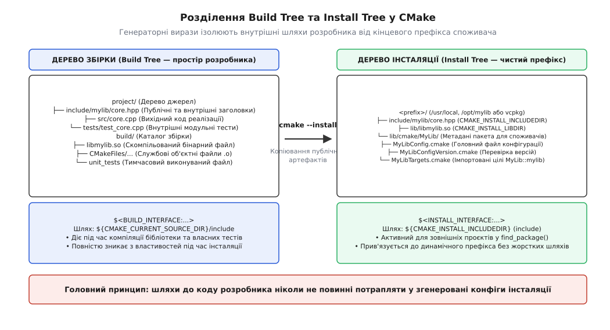
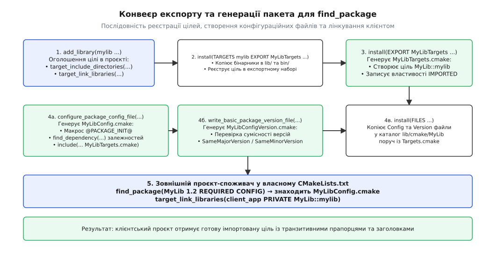
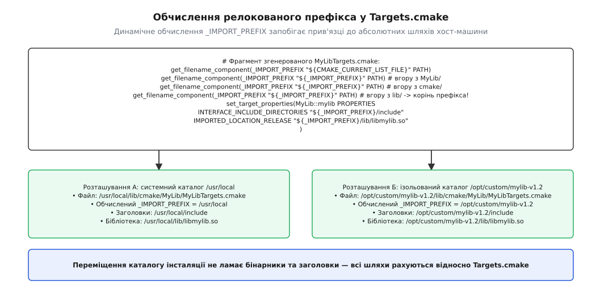

# install і export: зробити проєкт придатним для find_package

<preknowlist>
- [find_package: Config проти Module й імпортовані цілі](book:build-systems/find-package) — як працює пошук `*Config.cmake` у режимі конфігурації (Config Mode) та споживання цілей через простір імен `::`.
- [Цілі й властивості замість глобальних змінних](book:build-systems/targets-and-properties) — об'єктна модель CMake, властивості цілей, розмежування `INTERFACE_...` та `IMPORTED_...`.
- [Вимоги вжитку: PUBLIC, PRIVATE, INTERFACE](book:build-systems/usage-requirements) — механізм транзитивності прапорців компіляції та каталогів включення.
- [Генераторні вирази](book:build-systems/generator-expressions) — обчислення виразів `$<BUILD_INTERFACE:...>` та `$<INSTALL_INTERFACE:...>` на стадії генерації збірки.
- [Роль системи збірки: від дерева файлів до артефакту](book:build-systems/build-system-role) — різниця між вихідним кодом проєкту, проміжними об'єктними файлами та фінальним розташуванням у системі.
</preknowlist>

Бібліотека успішно компілюється всередині власного репозиторію, проходить модульні тести й лінкується з тестовими виконуваними файлами. Але щойно постає завдання надати її іншим розробникам, опублікувати у менеджері пакетів або встановити в системний каталог операційної системи, наївний підхід зазнає краху. Якщо просто скопіювати скомпільований файл `libcore.so` у каталог `/usr/local/lib`, а заголовки — у `/usr/local/include`, зовнішній проєкт не зможе підключити бібліотеку через сучасний виклик `find_package(Core REQUIRED)`: він не знайде конфігураційного файла `CoreConfig.cmake`, не отримає імпортованої цілі `Core::core`, не дізнається про обов'язковий стандарт C++20 і втратить інформацію про транзитивні системні залежності.

Ще небезпечнішою є спроба написати файл `CoreConfig.cmake` вручну, жорстко закодувавши в ньому абсолютні шляхи до файлів на робочій станції автора (наприклад `/home/developer/projects/core/include` або `C:/Libs/core/bin`). Такий пакет миттєво ламається на іншій машині, у контейнері неперервної інтеграції (CI) або в разі зміни каталогу встановлення користувачем.

Створення виробничого, повторно використовуваного пакета в екосистемі CMake вимагає суворого дотримання контракту між внутрішнім простором збірки (**Build Tree**) та кінцевим середовищем розгортання (**Install Tree**). Для цього CMake надає узгоджену систему команд: експорт цілей через `install(TARGETS ... EXPORT ...)` та `install(EXPORT ...)`, ізоляцію шляхів заголовків за допомогою генераторних виразів `$<BUILD_INTERFACE:...>` і `$<INSTALL_INTERFACE:...>`, генерацію файлів конфігурації за допомогою модуля `CMakePackageConfigHelpers`, а також забезпечення повної переміщуваності (англ. *relocatability*) згенерованого пакета.

## Анатомія розділення: Build Tree проти Install Tree

Коренева причина більшості помилок під час пакування бібліотек полягає у змішуванні двох принципово різних просторів існування коду:

1. **Дерево збірки (Build Tree):** це робоче середовище розробника самої бібліотеки. Воно складається з дерева вихідного коду (де лежать файли `.cpp`, публічні та внутрішні приватні заголовки, тести, службові сценарії) та каталогу артефактів збірки (де генератор створює тимчасові об'єктні файли `.o`, журнали та проміжні бінарники). У цьому дереві шляхи до заголовків прив'язані до змінної `${CMAKE_CURRENT_SOURCE_DIR}` або `${CMAKE_CURRENT_BINARY_DIR}`.
2. **Дерево інсталяції (Install Tree):** це чиста, компактна структура каталогів усередині префікса встановлення `CMAKE_INSTALL_PREFIX` (наприклад `/usr/local`, `/opt/company/mylib` або каталогу пакета всередині `vcpkg`/`Conan`). Тут немає вихідного коду, внутрішніх тестів чи тимчасових об'єктних файлів — присутні лише скомпільовані двійкові артефакти, публічний API та службові описи для системи збірки споживача.



*Розділення світів Build Tree та Install Tree: генераторні вирази ізолюють шляхи розробника від кінцевого префікса споживача.*

Якщо властивість цілі `INTERFACE_INCLUDE_DIRECTORIES` вказує на внутрішній шлях розробника `${CMAKE_CURRENT_SOURCE_DIR}/include`, CMake дозволить зібрати власні тести проєкту. Проте спроба експортувати таку ціль у дерево інсталяції призведе до фатальної помилки генератора: CMake суворо забороняє встановленим пакетам посилатися на шляхи каталогу збірки розробника.

Для легального розведення цих двох світів CMake надає генераторні вирази:
- `$<BUILD_INTERFACE:...>` — вміст виразу активується виключно тоді, коли ціль використовується всередині поточного дерева збірки (під час компіляції самої бібліотеки, прикладів чи модульних тестів). Під час формування експортованого файла цей фрагмент безслідно видаляється генератором.
- `$<INSTALL_INTERFACE:...>` — вміст виразу активується лише під час створення файлів експорту для дерева інсталяції. Під час локальної збірки проєкту цей вираз ігнорується.

```cmake
# Розділення шляхів включення для двох світів
target_include_directories(mylib
    PUBLIC
        $<BUILD_INTERFACE:${CMAKE_CURRENT_SOURCE_DIR}/include>
        $<INSTALL_INTERFACE:include>
)
```

Завдяки цьому запису, поки розробник працює в репозиторії, компілятор шукає файли у `${CMAKE_CURRENT_SOURCE_DIR}/include`. Коли ж викликається команда `cmake --install`, експортована ціль отримує чисту властивість із відносним шляхом `include`, яка автоматично прив'язується до префікса кінцевого встановлення.

## Стандартизоване розміщення файлів: модуль GNUInstallDirs

На різних операційних системах та дистрибутивах Linux правила розміщення двійкових файлів різняться. Наприклад, у 64-бітних дистрибутивах Red Hat та Fedora бібліотеки встановлюються в каталог `/usr/lib64`, у дистрибутивах Debian та Ubuntu використовується мультиархітектурний шлях `/usr/lib/x86_64-linux-gnu`, а на macOS чи Windows — звичайний `lib` або `bin`.

Жорстке кодування шляхів на зразок `DESTINATION lib` або `DESTINATION include` порушує стандарти системного пакування та ламає складання RPM/DEB-пакетів. Для розв'язання цієї проблеми в CMake вбудовано стандартний модуль `GNUInstallDirs`, який визначає загальноприйняті змінні шляхів згідно з конвенціями GNU Coding Standards:

```cmake
include(GNUInstallDirs)
```

Модуль надає набір відносних змінних, які автоматично підлаштовуються під цільову платформу:
- `CMAKE_INSTALL_BINDIR` — виконувані файли та користувацькі програми (зазвичай `bin`). На платформі Windows сюди також встановлюються спільні динамічні бібліотеки `.dll`.
- `CMAKE_INSTALL_LIBDIR` — бібліотеки об'єктного коду (`lib`, `lib64` або `lib/<arch-triple>`). На Windows сюди встановлюються файли імпорту `.lib`.
- `CMAKE_INSTALL_INCLUDEDIR` — публічні заголовкові файли мов C та C++ (`include`).
- `CMAKE_INSTALL_DATADIR` — архітектурно-незалежні дані та ресурси (`share`).
- `CMAKE_INSTALL_DOCDIR` — документація пакета (`share/doc/<project>`).

Куди саме слід встановлювати файли метаданих CMake (`*Config.cmake` та `*Targets.cmake`)? Конвенція екосистеми передбачає два стандартних місця:
1. Для платформно-залежних пакетів (що містять скомпільовані бінарні файли `.so`, `.dylib`, `.lib`):
   `${CMAKE_INSTALL_LIBDIR}/cmake/<PackageName>`
2. Для заголовочних (header-only) бібліотек або архітектурно-незалежних модулів:
   `${CMAKE_INSTALL_DATADIR}/<PackageName>/cmake` (або `${CMAKE_INSTALL_LIBDIR}/cmake/<PackageName>`).

Використання відносних змінних `GNUInstallDirs` гарантує, що системний пакувальник або користувач зможе переозначити будь-який каталог під час конфігурації (наприклад передавши `-DCMAKE_INSTALL_LIBDIR=custom_lib`).

## Експорт цілей: зв'язка install(TARGETS) та install(EXPORT)

Процес публікації цілей у CMake складається з двох послідовних операцій: фізичного копіювання двійкових файлів та генерації спеціального сценарію CMake, який описує цілі для споживача.



*Повний конвеєр експорту: реєстрація цілей в експортному наборі, генерація файлу імпортованих цілей та створення файлів конфігурації.*

### Крок 1: Реєстрація цілей в експортному наборі

Команда `install(TARGETS)` копіює скомпільовані бінарники у відповідні системні каталоги та додає цілі до іменованого набору експорту за допомогою ключа `EXPORT`:

```cmake
install(TARGETS mylib_core mylib_utils
    EXPORT MyLibTargets
    RUNTIME DESTINATION ${CMAKE_INSTALL_BINDIR}
    LIBRARY DESTINATION ${CMAKE_INSTALL_LIBDIR}
    ARCHIVE DESTINATION ${CMAKE_INSTALL_LIBDIR}
    INCLUDES DESTINATION ${CMAKE_INSTALL_INCLUDEDIR}
)
```

Класифікація артефактів у CMake враховує відмінності двійкових форматів операційних систем:
- `RUNTIME` — виконувані файли на всіх ОС, а також спільні бібліотеки `.dll` у Windows.
- `LIBRARY` — динамічні бібліотеки `.so` (Linux) та `.dylib` (macOS).
- `ARCHIVE` — статичні бібліотеки `.a`/`.lib`, а також файли імпорту `.lib` для динамічних бібліотек на Windows.
- `INCLUDES DESTINATION` — автоматично додає зазначений шлях до властивості `INTERFACE_INCLUDE_DIRECTORIES` імпортованої цілі, позбавляючи потреби вручну дублювати `$<INSTALL_INTERFACE:...>`.

### Сучасні набори файлів: FILE_SET у CMake 3.23+

У традиційному CMake для встановлення публічних заголовків розробник був змушений викликати окрему команду `install(DIRECTORY include/ DESTINATION ${CMAKE_INSTALL_INCLUDEDIR})`. Такий підхід мав фундаментальний недолік: система збірки не пов'язувала конкретні файли заголовків із конкретною ціллю, що ускладнювало аналіз залежностей та генерацію IDE-проєктів.

Починаючи з версії CMake 3.23, введено стандартний механізм наборів файлів **`FILE_SET`**:

```cmake
# Сучасний стиль CMake 3.23+ із використанням FILE_SET
add_library(mylib_core src/core.cpp)

target_sources(mylib_core
    PUBLIC
        FILE_SET HEADERS
        BASE_DIRS include
        FILES include/mylib/core.hpp include/mylib/export.hpp
)

install(TARGETS mylib_core
    EXPORT MyLibTargets
    FILE_SET HEADERS DESTINATION ${CMAKE_INSTALL_INCLUDEDIR}
)
```

Переваги `FILE_SET`:
1. Автоматичне налаштування `INTERFACE_INCLUDE_DIRECTORIES`: базовий каталог `BASE_DIRS` автоматично стає каталогом включення як для дерева джерел, так і для дерева інсталяції.
2. Точний контроль файлів: встановлюються виключно явно перелічені публічні файли, що унеможливлює випадковий витік приватних внутрішніх заголовків у релізний пакет.
3. Збереження ієрархії підкаталогів: відносне розташування файлів усередині `BASE_DIRS` автоматично відтворюється в каталозі призначення.

### Особливості заголовочних бібліотек (Interface Libraries)

Для суто заголовочних бібліотек (header-only libraries), створених через `add_library(mylib_math INTERFACE)`, відсутні бінарні артефакти `RUNTIME`, `LIBRARY` чи `ARCHIVE`. Правило інсталяції такої цілі спрощується:

```cmake
# Інсталяція заголовочної цілі
install(TARGETS mylib_math
    EXPORT MyLibTargets
    INCLUDES DESTINATION ${CMAKE_INSTALL_INCLUDEDIR}
)
```

Ціль `mylib_math` не створює файлів об'єктного коду, але завдяки реєстрації в `EXPORT MyLibTargets` потрапляє до `MyLibTargets.cmake` як `add_library(MyLib::mylib_math INTERFACE IMPORTED)` з усіма потрібними вимогами вжитку (стандарт C++, препроцесорні дефайни та шляхи до заголовків).

### Крок 2: Генерація файла імпортованих цілей

Оголошення `EXPORT MyLibTargets` у першому кроці лише формує внутрішній список цілей у пам'яті CMake. Щоб перетворити цей набір на реальний файл сценарію на диску, використовується команда `install(EXPORT)`:

```cmake
install(EXPORT MyLibTargets
    FILE MyLibTargets.cmake
    NAMESPACE MyLib::
    DESTINATION ${CMAKE_INSTALL_LIBDIR}/cmake/MyLib
)
```

Ключовим параметром тут є `NAMESPACE MyLib::`. Він додає до імені кожної експортованої цілі префікс простору імен із подвійною двокрапкою. Ціль `mylib_core` експортується як `MyLib::mylib_core`. Це захищає клієнтський проєкт від двох поширених проблем:
1. **Колізія імен:** якщо у споживача вже є власна локальна ціль із назвою `core`, імпортована ціль `MyLib::core` не конфліктуватиме з нею.
2. **Захист від помилок лінкування:** якщо користувач помилиться в назві (`MyLib::core_typo`), CMake повідомить про помилку відсутності цілі на етапі конфігурації, замість того, щоб передати неіснуючий прапорець `-lMyLib::core_typo` лінкеру в самому кінці тривалої збірки.

### Що генерується всередині Targets.cmake

Якщо заглянути всередину створеного файла `MyLibTargets.cmake`, можна побачити код, який CMake створив автоматично:

```cmake
# Фрагмент згенерованого MyLibTargets.cmake
add_library(MyLib::mylib_core SHARED IMPORTED)

set_target_properties(MyLib::mylib_core PROPERTIES
  INTERFACE_COMPILE_FEATURES "cxx_std_20"
  INTERFACE_INCLUDE_DIRECTORIES "${_IMPORT_PREFIX}/include"
)

# Підключення конфігураційного файла для конкретного типу збірки (Release/Debug)
include("${CMAKE_CURRENT_LIST_DIR}/MyLibTargets-release.cmake")
```

А у допоміжному файлі `MyLibTargets-release.cmake` записується фізичне розташування бінарного файла на диску:

```cmake
# Фрагмент згенерованого MyLibTargets-release.cmake
set_property(TARGET MyLib::mylib_core APPEND PROPERTY
  IMPORTED_CONFIGURATIONS RELEASE
)
set_target_properties(MyLib::mylib_core PROPERTIES
  IMPORTED_LOCATION_RELEASE "${_IMPORT_PREFIX}/lib/libmylib_core.so"
  IMPORTED_SONAME_RELEASE "libmylib_core.so.1"
)
```

Повний структурований довідник усіх сигнатур команд, типів артефактів та опцій наведено в окремому документі: [довідка команд install, export та хелперів конфігурації](book:build-systems/install-and-export/api-install-export.md).

## Анатомія переміщуваності (Relocatable Packages)

Звідки у згенерованому файлі `MyLibTargets.cmake` взялася змінна `${_IMPORT_PREFIX}` і чому вона є наріжним каменем архітектури пакетів CMake?

У минулі часи системи збірки часто генерували абсолютні шляхи до файлів бібліотеки:
```cmake
# Застарілий нерелокований підхід (антипатерн)
set_target_properties(MyLib::mylib_core PROPERTIES
  INTERFACE_INCLUDE_DIRECTORIES "/usr/local/include"
  IMPORTED_LOCATION_RELEASE "/usr/local/lib/libmylib_core.so"
)
```

Якщо такий пакет встановлено на машині розробника у `/home/user/.local`, а потім увесь каталог запаковано у tar-архів і розгорнуто на сервері у `/opt/company/libs`, такий файл стає непридатним: він продовжує шукати файли за старим шляхом `/usr/local` або `/home/user/.local`. Аналогічно руйнується збірка всередині менеджерів пакетів `vcpkg` та `Conan`, які збирають пакет у тимчасовому каталозі (staging directory), а потім переміщують його у фінальне сховище кешу.

Щоб зробити пакет **повністю переміщуваним (relocatable)**, CMake динамічно вираховує корінь префікса інсталяції на основі поточного місця розташування самого `.cmake`-файла на диску.



*Динамічне обчислення _IMPORT_PREFIX у згенерованому файлі Targets.cmake забезпечує повну переміщуваність пакета.*

На початку згенерованого `MyLibTargets.cmake` розміщується блок навігації вгору файловою системою:

```cmake
# Визначення кореня інсталяції відносно поточного файла MyLibTargets.cmake
get_filename_component(_IMPORT_PREFIX "${CMAKE_CURRENT_LIST_FILE}" PATH)
# Якщо файл лежить у <prefix>/lib/cmake/MyLib/ — піднімаємося на 3 рівні вгору:
get_filename_component(_IMPORT_PREFIX "${_IMPORT_PREFIX}" PATH) # вгору з MyLib/
get_filename_component(_IMPORT_PREFIX "${_IMPORT_PREFIX}" PATH) # вгору з cmake/
get_filename_component(_IMPORT_PREFIX "${_IMPORT_PREFIX}" PATH) # вгору з lib/ -> корінь <prefix>
```

Усі подальші властивості імпортованих цілей формуються виключно через `${_IMPORT_PREFIX}`:
- `${_IMPORT_PREFIX}/include`
- `${_IMPORT_PREFIX}/lib/libmylib_core.so`

Тепер каталог інсталяції можна перейменувати, перенести на інший диск, скопіювати на іншу робочу станцію або використати як складову частину sysroot для крос-компіляції: усі шляхи вираховуватимуться правильно й автоматично.

## Генерація файлів конфігурації: модуль CMakePackageConfigHelpers

Створення файла `MyLibTargets.cmake` забезпечує імпорт цілей, але виклик `find_package(MyLib CONFIG)` шукає файл із назвою `MyLibConfig.cmake` (або `mylib-config.cmake`) та відповідний файл перевірки версії `MyLibConfigVersion.cmake`.

Чому не можна просто перейменувати `MyLibTargets.cmake` на `MyLibConfig.cmake`?
Тому що файл конфігурації виконує ширший спектр задач:
1. Знаходить транзитивні зовнішні залежності бібліотеки (наприклад `OpenSSL` або `Boost`).
2. Налаштовує власні змінні та опції для споживача.
3. Перевіряє наявність обов'язкових компонентів (COMPONENTS).
4. Підключає один або кілька файлів `*Targets.cmake`.

Для створення цих файлів призначено стандартний модуль `CMakePackageConfigHelpers`:

```cmake
include(CMakePackageConfigHelpers)
```

### 1. Генерація файлу сумісності версій

Функція `write_basic_package_version_file()` створює сценарій перевірки версії, який CMake автоматично викликає до виконання основного конфігураційного файла:

```cmake
write_basic_package_version_file(
    "${CMAKE_CURRENT_BINARY_DIR}/MyLibConfigVersion.cmake"
    VERSION ${PROJECT_VERSION}
    COMPATIBILITY SameMajorVersion
)
```

Параметр `COMPATIBILITY` визначає семантику сумісності:
- `SameMajorVersion` — класичне семантичне версіонування (SemVer). Будь-яка версія з тим самим мажорним номером вважається сумісною, якщо встановлена версія не менша за запитану. Наприклад, якщо встановлено версію `2.4.0`, запит `find_package(MyLib 2.1)` буде успішним, а запит `find_package(MyLib 3.0)` — відхиленим. Для нульових версій (`0.x.y`) поведінка суворіша: сумісність зберігається лише в межах однакового мінорного номера (`0.1.x` несумісна з `0.2.x`).
- `SameMinorVersion` — суворіша перевірка, за якої зміна мінорного номера вважається несумісною. Цей режим є критично важливим для бібліотек, які часто змінюють структуру внутрішніх класів або двійковий ABI між мінорними випусками (наприклад рушіїв або модульних плагінів). Встановлена версія `1.2.5` задовольнить запит `1.2.0`, але запит `1.3.0` буде відхилено.
- `AnyNewerVersion` — будь-яка встановлена версія, що більша або дорівнює запитаній, вважається сумісною (наприклад версія `3.0` задовольнить запит `1.0`). Застосовується для стабільних C-бібліотек із чистою моделлю функцій та гарантією повної довготривалої зворотної сумісності.
- `ExactVersion` — вимагає абсолютно точного збігу всіх чисел версії (аж до Patch та Tweak).

Під час виконання сценарій версії встановлює змінні стану: `PACKAGE_VERSION_COMPATIBLE` (істина, якщо версія підходить), `PACKAGE_VERSION_EXACT` (істина, якщо збіг абсолютний) та `PACKAGE_VERSION_UNSUITABLE` (істина, якщо архітектура чи розрядність несумісні). Завдяки цьому `find_package()` відсікає невідповідні версії на ранньому етапі, не виконуючи важкий код основного конфігураційного файла.

Для заголовочних бібліотек (header-only) обов'язково слід передавати прапорець `ARCH_INDEPENDENT`:
```cmake
write_basic_package_version_file(
    "${CMAKE_CURRENT_BINARY_DIR}/MyLibConfigVersion.cmake"
    VERSION ${PROJECT_VERSION}
    COMPATIBILITY SameMajorVersion
    ARCH_INDEPENDENT
)
```
Без цього прапорця CMake запише у файл версії перевірку розрядності покажчиків (`CMAKE_SIZEOF_VOID_P`), і 64-бітний генератор клієнта відхилить пакет, якщо його було встановлено в універсальний архітектурно-незалежний каталог `share/`.

### 2. Генерація головного конфігураційного файла

Для створення релокованого файла `MyLibConfig.cmake` створюють шаблон із розширенням `.cmake.in` (зазвичай у каталозі `cmake/MyLibConfig.cmake.in`):

```cmake
# cmake/MyLibConfig.cmake.in
@PACKAGE_INIT@

# Підключення транзитивних залежностей (якщо є)
include(CMakeFindDependencyMacro)
# find_dependency(ZLIB 1.2 REQUIRED)

# Підключення згенерованого експортного набору цілей
include("${CMAKE_CURRENT_LIST_DIR}/MyLibTargets.cmake")

# Перевірка наявності запитаних компонентів
check_required_components(MyLib)
```

А в головному `CMakeLists.txt` викликають функцію `configure_package_config_file()`:

```cmake
set(MYLIB_CONFIG_INSTALL_DIR "${CMAKE_INSTALL_LIBDIR}/cmake/MyLib")

configure_package_config_file(
    "${CMAKE_CURRENT_SOURCE_DIR}/cmake/MyLibConfig.cmake.in"
    "${CMAKE_CURRENT_BINARY_DIR}/MyLibConfig.cmake"
    INSTALL_DESTINATION ${MYLIB_CONFIG_INSTALL_DIR}
    PATH_VARS CMAKE_INSTALL_INCLUDEDIR CMAKE_INSTALL_LIBDIR
)
```

Чому не можна використати звичайний `configure_file()`?
Тому що звичайна функція `configure_file()` підставила б абсолютні шляхи замість змінних, що зруйнувало б переміщуваність. Функція `configure_package_config_file()` аналізує глибину каталогу `INSTALL_DESTINATION` і генерує макрос `@PACKAGE_INIT@`.

У згенерованому файлі макрос `@PACKAGE_INIT@` розгортається в такий захисний механізм:
```cmake
# Фрагмент розгорнутого @PACKAGE_INIT@ у MyLibConfig.cmake
get_filename_component(PACKAGE_PREFIX_DIR "${CMAKE_CURRENT_LIST_DIR}/../../../" ABSOLUTE)

macro(set_and_check _var _file)
  set(${_var} "${_file}")
  if(NOT EXISTS "${_file}")
    message(FATAL_ERROR "File or directory ${_file} referenced by variable ${_var} does not exist !")
  endif()
endmacro()

macro(check_required_components _NAME)
  foreach(comp ${${_NAME}_FIND_COMPONENTS})
    if(NOT ${_NAME}_${comp}_FOUND)
      if(${_NAME}_FIND_REQUIRED_${comp})
        set(${_NAME}_FOUND FALSE)
      endif()
    endif()
  endforeach()
endmacro()
```

Якщо у шаблоні ви звертаєтеся до шляхів через макрос `@PACKAGE_CMAKE_INSTALL_INCLUDEDIR@`, CMake автоматично замінить його на безпечний відносний вираз `"${PACKAGE_PREFIX_DIR}/include"`.

## Транзитивні залежності: модуль CMakeFindDependencyMacro

Припустімо, що ваша бібліотека `MyLib::core` у своїх публічних заголовках використовує бібліотеку `fmt` або `OpenSSL`, і ви зв'язали їх у `CMakeLists.txt` через `PUBLIC`:

```cmake
find_package(fmt 10.0 REQUIRED)
target_link_libraries(mylib_core PUBLIC fmt::fmt)
```

Коли споживач у власному проєкті викличе `find_package(MyLib REQUIRED)` та спробує злінкуватися з `MyLib::core`, файл `MyLibTargets.cmake` вкаже лінкеру, що ціль `MyLib::core` залежить від `fmt::fmt`. Проте якщо ціль `fmt::fmt` ще не була імпортована в пам'ять системи збірки споживача, генерація зупиниться з критичною помилкою: `Target "MyLib::core" links to target "fmt::fmt" but the target was not found`.

Поширена помилка — написати всередині `MyLibConfig.cmake.in` звичайний виклик `find_package(fmt 10.0 REQUIRED)`. Це ламає поведінку системи збірки споживача у двох сценаріях:
1. Якщо споживач викликав вашу бібліотеку тихо `find_package(MyLib QUIET)`, прямий виклик `find_package(fmt)` проігнорує цей прапорець і почне друкувати діагностичні повідомлення в консоль.
2. Якщо споживач викликав бібліотеку як необов'язкову `find_package(MyLib)` (без `REQUIRED`), а бібліотеку `fmt` не знайдено, жорсткий виклик `find_package(fmt REQUIRED)` викине фатальну помилку та примусово зупинить усю конфігурацію проєкту споживача замість акуратної відмови `MyLib_FOUND = FALSE`.

Правильне рішення полягає у використанні спеціалізованого макроса `find_dependency()` із модуля `CMakeFindDependencyMacro`:

```cmake
# Всередині cmake/MyLibConfig.cmake.in
include(CMakeFindDependencyMacro)

# Коректний транзитивний пошук залежності
find_dependency(fmt 10.0)
find_dependency(Threads)

include("${CMAKE_CURRENT_LIST_DIR}/MyLibTargets.cmake")
check_required_components(MyLib)
```

Макрос `find_dependency()` автоматично наслідує прапорці `QUIET` та `REQUIRED` із зовнішнього виклику батьківського `find_package(MyLib)`. Якщо транзитивну залежність знайти не вдалося, макрос не ламає генератор, а акуратно встановлює змінну `MyLib_FOUND = FALSE` і передає зрозуміле діагностичне повідомлення про те, чому саме пакет `MyLib` не може бути використаний.

### Відмінність транзитивності для статичних і динамічних бібліотек

Особливу увагу слід звертати на тип створюваної бібліотеки під час лінкування залежностей через `PRIVATE`:

1. **Динамічна бібліотека (`SHARED`):** якщо залежність підключена через `PRIVATE`, вона лінкується всередину двійкового файлу `.so` або `.dll` на етапі створення бібліотеки. Споживачеві ця залежність не потрібна під час компіляції власного коду, тому CMake не включає її у властивість `INTERFACE_LINK_LIBRARIES` експортованої цілі. Відповідно, у `Config.cmake` не потрібно викликати `find_dependency()` для приватних залежностей спільної бібліотеки.
2. **Статична бібліотека (`STATIC`):** оскільки статична бібліотека є лише архівом незлінкованих об'єктних файлів (`.a` чи `.lib`), усі зовнішні виклики функцій залишаються нерозв'язаними. Коли споживач збирає свою кінцеву програму, лінкер клієнта зобов'язаний отримати всі статичні символи приватних залежностей. Тому CMake автоматично записує `PRIVATE`-залежності статичної цілі у властивість `INTERFACE_LINK_LIBRARIES` експортованої цілі, і споживач повинен мати доступ до цих бібліотек через виклики `find_dependency()` у конфігураційному файлі.

## Багатоконфігураційні генератори та суфікси імен

У середовищах розробки з багатоконфігураційними генераторами (Multi-Config Generators — такими як Microsoft Visual Studio, Apple Xcode або `Ninja Multi-Config`) розробники одночасно працюють із конфігураціями `Debug` та `Release`. Клієнтська програма повинна мати можливість перемикати тип збірки в IDE без перевстановлення сторонніх бібліотек.

CMake підтримує співіснування кількох типів збірки в одному дереві інсталяції завдяки розділенню файлів цілей:

1. **Головний файл:** `MyLibTargets.cmake` оголошує інтерфейс імпортованої цілі без прив'язки до двійкового файлу.
2. **Файли конфігурацій:** кожен виклик інсталяції додає власний фрагмент опису:
   - `MyLibTargets-release.cmake` — задає `IMPORTED_LOCATION_RELEASE` та прив'язує оптимізовану бібліотеку `libcore.so` (або `core.lib`).
   - `MyLibTargets-debug.cmake` — задає `IMPORTED_LOCATION_DEBUG` та прив'язує налагоджувальну бібліотеку `libcore_d.so` (або `core_d.lib`).

Щоб бінарні файли різних конфігурацій не перезаписували один одного в каталозі `${CMAKE_INSTALL_LIBDIR}`, у CMake прийнято призначати суфікси налагоджувальних імен через змінну або властивість цілі `DEBUG_POSTFIX`:

```cmake
# Призначення суфікса _d для налагоджувальних бінарників
set(CMAKE_DEBUG_POSTFIX "_d")

add_library(mylib_core src/core.cpp)
```

Під час встановлення конфігурації `Debug` буде створено файл `libmylib_core_d.so` (або `mylib_core_d.lib`), а під час встановлення `Release` — `libmylib_core.so`. Коли споживач збирає свій проєкт у режимі `Debug`, CMake автоматично вибирає файл із суфіксом `_d`, забезпечуючи сумісність C++ рантаймів (наприклад MSVCRT проти MSVCRTD у Windows).

## Механізм компонентів (COMPONENTS) у find_package

Коли проєкт розростається до масштабного SDK або фреймворку (на зразок Qt, Boost або комплексного рушія), споживачам рідко потрібні всі модулі одночасно. Споживач прагне підключати лише необхідні частини:

```cmake
# Вибірковий запит компонентів у клієнтському CMakeLists.txt
find_package(Hyperion 2.0 REQUIRED COMPONENTS Core Network OPTIONAL_COMPONENTS Gui)
```

Для реалізації модульної підтримки компонентів у конфігураційному файлі застосовують стандартну структуру обробки:

1. **Роздільні експортні набори:** кожен модуль інсталюється у власний експортний набір:
   ```cmake
   install(TARGETS hyperion_core EXPORT HyperionCoreTargets ...)
   install(TARGETS hyperion_network EXPORT HyperionNetworkTargets ...)
   install(TARGETS hyperion_gui EXPORT HyperionGuiTargets ...)
   ```
2. **Обробка запиту в `Config.cmake.in`:** файл конфігурації перевіряє, які саме компоненти були запрошені споживачем через змінну `${PACKAGE_FIND_COMPONENTS}`:

```cmake
# Шаблон HyperionConfig.cmake.in із підтримкою компонентів
@PACKAGE_INIT@

include(CMakeFindDependencyMacro)

# Список усіх підтримуваних компонентів бібліотеки
set(_supported_components Core Network Gui)

# Якщо споживач не вказав COMPONENTS, вважаємо всі компоненти обов'язковими
if(NOT Hyperion_FIND_COMPONENTS)
    set(Hyperion_FIND_COMPONENTS ${_supported_components})
endif()

# Послідовне підключення запрошених компонентів
foreach(_comp ${Hyperion_FIND_COMPONENTS})
    if(_comp IN_LIST _supported_components)
        set(_target_file "${CMAKE_CURRENT_LIST_DIR}/Hyperion${_comp}Targets.cmake")
        if(EXISTS "${_target_file}")
            include("${_target_file}")
            set(Hyperion_${_comp}_FOUND TRUE)
        else()
            set(Hyperion_${_comp}_FOUND FALSE)
        endif()
    else()
        set(Hyperion_${_comp}_FOUND FALSE)
        set(Hyperion_NOT_FOUND_MESSAGE "Невідомий компонент Hyperion: ${_comp}")
    endif()
endforeach()

# Перевірка наявності всіх REQUIRED компонентів
check_required_components(Hyperion)
```

Завдяки макросу `check_required_components(Hyperion)`, якщо споживач зазначив обов'язковий компонент `COMPONENTS Gui REQUIRED`, а відповідний модуль не було зібрано чи встановлено, конфігурація зупиниться зі зрозумілим повідомленням про помилку.

## Символьна видимість та динамічні бібліотеки

Під час створення динамічних бібліотек (`SHARED`) постає фундаментальна різниця у поведінці операційних систем щодо експорту двійкових символів:

- **Linux / macOS (ELF / Mach-O):** за замовчуванням компілятори GCC та Clang експортують усі функції та класи в таблицю динамічних символів (`visibility=default`). Це призводить до роздування розміру двійкового файлу, уповільнення завантаження програми динамічним лінкером та випадкового витоку внутрішніх деталей реалізації.
- **Windows (PE / COFF):** за замовчуванням компілятор MSVC не експортує жодного символу. Бібліотека створює файл `.dll`, але не створює файл таблиці імпорту `.lib`, що унеможливлює лінкування з клієнтським кодом.

Для вирішення цієї проблеми застосовують два взаємодоповнюючі механізми CMake:

### 1. Приховування внутрішніх символів на Linux/macOS

```cmake
# Приховування непублічних символів за замовчуванням
set(CMAKE_CXX_VISIBILITY_PRESET hidden)
set(CMAKE_VISIBILITY_INLINES_HIDDEN ON)
```

### 2. Модуль GenerateExportHeader

Модуль `GenerateExportHeader` автоматично генерує платформонезалежний заголовковий файл із правильними макросами експорту:

```cmake
include(GenerateExportHeader)
add_library(mylib_core SHARED src/core.cpp)
generate_export_header(mylib_core
    BASE_NAME MYLIB
    EXPORT_FILE_NAME "${CMAKE_CURRENT_BINARY_DIR}/include/mylib/export.hpp"
)
```

Згенерований файл `mylib/export.hpp` містить макрос `MYLIB_EXPORT`, який на Windows розгортається у `__declspec(dllexport)` під час компіляції бібліотеки та `__declspec(dllimport)` під час підключення споживачем, а на Linux — у `__attribute__((visibility("default")))`.

## Експорт C++20 модулів (CXX_MODULES)

Починаючи з версії CMake 3.28, стандартизовано підтримку C++20 модулів за допомогою спеціального набору файлів `FILE_SET TYPE CXX_MODULES`:

```cmake
# Оголошення бібліотеки з C++20 модулем
add_library(mylib_modern)
target_sources(mylib_modern
    PUBLIC
        FILE_SET CXX_MODULES
        BASE_DIRS src
        FILES src/core_module.cppm
)

install(TARGETS mylib_modern
    EXPORT MyLibModernTargets
    FILE_SET CXX_MODULES DESTINATION ${CMAKE_INSTALL_LIBDIR}/cmake/MyLibModern/modules
)

install(EXPORT MyLibModernTargets
    FILE MyLibModernTargets.cmake
    NAMESPACE MyLib::
    DESTINATION ${CMAKE_INSTALL_LIBDIR}/cmake/MyLibModern
    CXX_MODULES_DIRECTORY modules
)
```

На відміну від звичайних заголовків, двійковий інтерфейс модуля (BMI — Binary Module Interface) жорстко прив'язаний до версії та прапорців компілятора, тому він не може поширюватися у вигляді скомпільованого двійкового файлу. Замість цього CMake встановлює вихідні файли модулів (`.cppm`) та генерує спеціальні метадані у каталозі `CXX_MODULES_DIRECTORY`. Коли клієнтський проєкт виконує інструкцію `import MyLib.Core;`, система збірки споживача автоматично компілює модуль бібліотеки власним компілятором із поточними прапорцями збірки.

## Експорт цілей безпосередньо з дерева збірки

Іноді виникає потреба використовувати бібліотеку в зовнішніх тестових проєктах або суміжних репозиторіях ще до того, як її буде скомпільовано та інстальовано командою `cmake --install`. Типовий приклад — великі монорепозиторії або складні конвеєри CI, де споживачі тестуються безпосередньо проти каталогу збірки.

Для цього CMake надає команду `export()`:

```cmake
# Експорт цілей безпосередньо з каталогу збірки
export(TARGETS mylib_core mylib_math
    FILE "${CMAKE_CURRENT_BINARY_DIR}/MyLibTargets.cmake"
    NAMESPACE MyLib::
)
```

Також можна згенерувати файл `MyLibConfig.cmake` прямо в каталозі збірки:

```cmake
configure_package_config_file(
    "${CMAKE_CURRENT_SOURCE_DIR}/cmake/MyLibConfig.cmake.in"
    "${CMAKE_CURRENT_BINARY_DIR}/MyLibConfig.cmake"
    INSTALL_DESTINATION "${CMAKE_CURRENT_BINARY_DIR}"
    INSTALL_PREFIX "${CMAKE_CURRENT_BINARY_DIR}"
)
```

Якщо передати каталог збірки `${CMAKE_BINARY_DIR}` у змінну `CMAKE_PREFIX_PATH` проєкту-споживача, `find_package(MyLib CONFIG)` успішно знайде конфігурацію та злінкується з цілями `MyLib::*`.

Проте необхідно пам'ятати про важливе обмеження:
Цілі, експортовані з дерева збірки, містять шляхи до тимчасових каталогів розробника (через `$<BUILD_INTERFACE:...>`). Такий файл експорту жорстко прив'язаний до поточної файлової системи машини й миттєво стає недійсним у разі видалення чи переміщення каталогу збірки `build/`. Експорт із Build Tree придатний лише для локальної розробки та тестування — його категорично заборонено поширювати серед користувачів чи пакувати у дистрибутиви.

## Взаємодія з системними пакувальниками та CPack

Правила, визначені командами `install()`, є єдиним джерелом правди для утиліти `cpack`, що постачається разом із CMake для автоматизованого створення інсталяційних пакетів операційної системи (таких як `.deb` для Debian/Ubuntu, `.rpm` для Red Hat/Fedora, `.pkg` для macOS або Windows-інсталяторів NSIS).

Розподіл встановлюваних файлів за компонентами за допомогою параметра `COMPONENT` дозволяє генераторам CPack автоматично розбивати проєкт на окремі дистрибутивні пакети:

```cmake
# Розподіл артефактів за компонентами
install(TARGETS data_engine
    EXPORT DataEngineTargets
    RUNTIME DESTINATION ${CMAKE_INSTALL_BINDIR} COMPONENT runtime
    LIBRARY DESTINATION ${CMAKE_INSTALL_LIBDIR} COMPONENT runtime
    ARCHIVE DESTINATION ${CMAKE_INSTALL_LIBDIR} COMPONENT devel
    INCLUDES DESTINATION ${CMAKE_INSTALL_INCLUDEDIR}
)

install(EXPORT DataEngineTargets
    FILE DataEngineTargets.cmake
    NAMESPACE DataEngine::
    DESTINATION ${DATAENGINE_CONFIG_DIR}
    COMPONENT devel
)

install(FILES
    "${CMAKE_CURRENT_BINARY_DIR}/DataEngineConfig.cmake"
    "${CMAKE_CURRENT_BINARY_DIR}/DataEngineConfigVersion.cmake"
    DESTINATION ${DATAENGINE_CONFIG_DIR}
    COMPONENT devel
)
```

Під час запуску CPack створює окремий пакет `data-engine-runtime.deb`, який містить лише двійкові бібліотеки `.so`, та пакет `data-engine-devel.deb`, який містить заголовки, файли конфігурації та файли експорту цілей.

## Зневадження та інспекція імпортованих цілей

Коли клієнтський проєкт не знаходить пакет або лінкується з несподіваною версією бібліотеки, система збірки надає засоби детального аудиту.

### 1. Трасування пошуку через CLI

Прапорець `--debug-find-pkg` виводить покроковий журнал сканування файлової системи:

```bash
cmake -B build -S . --debug-find-pkg=DataEngine
```

У виводі буде показано кожен шлях змінних `CMAKE_PREFIX_PATH`, системні каталоги `/usr/local` та стан знайдених файлів `DataEngineConfig.cmake`.

### 2. Програмна інспекція властивостей у CMakeLists.txt

Усередині клієнтського `CMakeLists.txt` можна програмно перевірити параметри створеної імпортованої цілі за допомогою команди `get_target_property`:

```cmake
find_package(DataEngine 2.1 REQUIRED CONFIG)

if(TARGET DataEngine::engine)
    get_target_property(_loc DataEngine::engine IMPORTED_LOCATION_RELEASE)
    get_target_property(_inc DataEngine::engine INTERFACE_INCLUDE_DIRECTORIES)
    message(STATUS "DataEngine location: ${_loc}")
    message(STATUS "DataEngine headers:  ${_inc}")
endif()
```

Це дозволяє швидко переконатися, що генератор правильно обчислив префікс інсталяції та підставив правильні шляхи до заголовків.

## Повний зразок та типові дефекти пакування

Зведемо всі розглянуті правила у цілісний, еталонний виробничий блок `CMakeLists.txt`:

```cmake
cmake_minimum_required(VERSION 3.20)
project(DataEngine VERSION 2.1.0 LANGUAGES CXX)

include(GNUInstallDirs)
include(CMakePackageConfigHelpers)

# 1. Оголошення цілі бібліотеки
add_library(data_engine src/engine.cpp)
add_library(DataEngine::engine ALIAS data_engine)

target_compile_features(data_engine PUBLIC cxx_std_20)

target_include_directories(data_engine
    PUBLIC
        $<BUILD_INTERFACE:${CMAKE_CURRENT_SOURCE_DIR}/include>
        $<INSTALL_INTERFACE:${CMAKE_INSTALL_INCLUDEDIR}>
)

# 2. Інсталяція двійкових артефактів та заголовків
install(TARGETS data_engine
    EXPORT DataEngineTargets
    ARCHIVE DESTINATION ${CMAKE_INSTALL_LIBDIR}
    LIBRARY DESTINATION ${CMAKE_INSTALL_LIBDIR}
    RUNTIME DESTINATION ${CMAKE_INSTALL_BINDIR}
    INCLUDES DESTINATION ${CMAKE_INSTALL_INCLUDEDIR}
)

install(DIRECTORY include/
    DESTINATION ${CMAKE_INSTALL_INCLUDEDIR}
    FILES_MATCHING PATTERN "*.hpp"
)

# 3. Експорт набору цілей
set(DATAENGINE_CONFIG_DIR "${CMAKE_INSTALL_LIBDIR}/cmake/DataEngine")

install(EXPORT DataEngineTargets
    FILE DataEngineTargets.cmake
    NAMESPACE DataEngine::
    DESTINATION ${DATAENGINE_CONFIG_DIR}
)

# 4. Генерація та встановлення файлів конфігурації
write_basic_package_version_file(
    "${CMAKE_CURRENT_BINARY_DIR}/DataEngineConfigVersion.cmake"
    VERSION ${PROJECT_VERSION}
    COMPATIBILITY SameMajorVersion
)

configure_package_config_file(
    "${CMAKE_CURRENT_SOURCE_DIR}/cmake/DataEngineConfig.cmake.in"
    "${CMAKE_CURRENT_BINARY_DIR}/DataEngineConfig.cmake"
    INSTALL_DESTINATION ${DATAENGINE_CONFIG_DIR}
)

install(FILES
    "${CMAKE_CURRENT_BINARY_DIR}/DataEngineConfig.cmake"
    "${CMAKE_CURRENT_BINARY_DIR}/DataEngineConfigVersion.cmake"
    DESTINATION ${DATAENGINE_CONFIG_DIR}
)
```

Повний наскрізний приклад із вихідним кодом на C++, шаблоном конфігурації, інсталяцією у тимчасовий каталог та проєктом-споживачем наведено в окремій практичній роботі: [повний практичний проєкт створення та споживання пакета](book:build-systems/install-and-export/proj-complete-package.md).

### Перелік типових помилок пакування

Під час реалізації пакування найчастіше трапляються такі дефекти:

1. **Забута команда `install(EXPORT)`:** розробник викликав `install(TARGETS ... EXPORT MyLibTargets)`, скопіював бінарні файли на диск, але забув написати `install(EXPORT MyLibTargets ...)`. У результаті бібліотека встановлена, проте файл `MyLibTargets.cmake` не створюється, і `find_package()` не знаходить імпортованих цілей.
2. **Використання абсолютних шляхів у `target_include_directories`:** зазначення прямого шляху на зразок `target_include_directories(mylib PUBLIC /usr/include)` призводить до того, що CMake блокує експорт або ж пакет втрачає переміщуваність.
3. **Плутанина між RUNTIME та ARCHIVE на Windows:** при збірці динамічної бібліотеки (`SHARED`) у середовищі Windows компілятор створює два файли: двійковий образ `.dll` та файл таблиці імпорту `.lib`. Якщо в `install(TARGETS)` не вказати секцію `RUNTIME DESTINATION bin`, файл `.dll` взагалі не буде встановлено, а клієнтська програма впаде під час запуску із системною помилкою відсутності DLL.
4. **Витік приватних залежностей у `find_dependency`:** якщо ваша бібліотека використовує сторонню бібліотеку (наприклад `sqlite3`) виключно всередині власних `.cpp` файлів через `PRIVATE`, споживачу заголовки та цілі `sqlite3` не потрібні. Виклик `find_dependency(SQLite3)` у файлі конфігурації буде грубою помилкою: він змусить кожного клієнта встановлювати SQLite3, навіть якщо клієнтський код не має до нього жодного стосунку.
5. **Відсутність виклику `check_required_components`:** якщо наприкінці `Config.cmake.in` забути макрос `check_required_components()`, виклики з перевіркою компонентів на зразок `find_package(MyLib COMPONENTS non_existing REQUIRED)` мовчки повідомлятимуть про успіх, а помилка проявиться лише на етапі лінкування.

Дотримання викладених правил гарантує, що створена бібліотека бездоганно інтегрується в будь-яку сучасну інфраструктуру C++: від системних репозиторіїв Linux та менеджерів пакетів до ізольованих крос-компіляційних конвеєрів.
