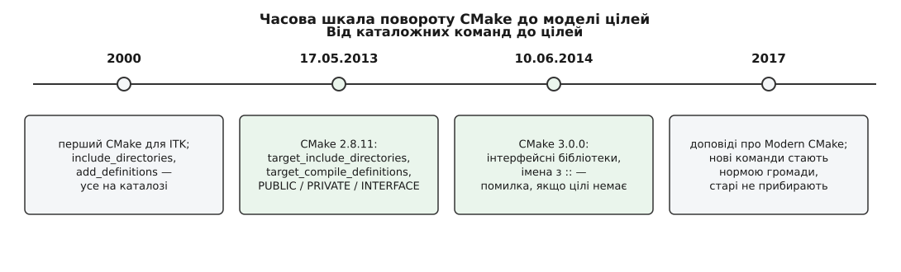

# 📜 Тринадцять років каталогів: як CMake дійшов до цілей

Модель цілей, у якій опис бібліотеки їде разом із бібліотекою, з'явилася в CMake не з першого дня, а на тринадцятому році його життя — 17 травня 2013 року, у версії 2.8.11. До того дня CMake умів переносити через межу каталогу єдину річ: залежності лінкування. Усе інше — шляхи до заголовків, макроси, прапорці — залишалося прив'язаним до каталогу, де його записали. Ця історія пояснює, чому початкова модель була саме такою, чому вона протрималася так довго і чому нові команди досі співіснують зі старими.

*Поворот стався одним релізом, але підготовляли його роки практики, а закріплювала — громада, а не реліз-ноут.*

## Чому першою одиницею став каталог

CMake почався 2000 року в Kitware: Національна медична бібліотека США замовила спосіб конфігурувати й збирати Insight Toolkit (ITK) на десятку різних платформ, а наявний тоді зв'язок autoconf з Unix і саморобного генератора nmake-файлів на Windows цю роботу тягнув погано. Автором задуму й першої реалізації був Білл Гоффман (Bill Hoffman), співзасновник Kitware; це задокументовано і на сторінці історії проєкту cmake.org, і в його власних розповідях — факт усталений.

Головна вимога звучала так: один вхідний файл описує збірку на всіх платформах, а рідні інструменти — Visual Studio, make — лишаються самими собою. І ось тут визначилася форма мови. Те, що CMake мав породжувати, було набором makefile-ів і проєктних файлів, а ті історично живуть **у каталогах**: один каталог — один makefile — один набір прапорців для всього, що в ньому лежить. Каталог був не просто зручною абстракцією, а прямим відбитком того, у що CMake генерує.

Звідси й початкові команди — `include_directories`, `add_definitions`, `link_libraries`. Жодна з них не бере імені цілі, бо не має чого брати: вона просто дописує рядок у набір прапорців поточного каталогу, а той набір потім розійдеться в кожну ціль, створену тут далі. Це не була помилка проєктування — це був найкоротший шлях від наявної моделі makefile-ів до крос-платформного опису.

## Що тримало цю модель тринадцять років

Найпростіша відповідь — вона працює, доки проєкт один. Якщо все дерево збирає одна команда за одними домовленостями, глобальні `include_directories` у корені й `add_definitions` там-таки дають рівно те, чого треба: усі частини компілюються однаково. Проблема з'являється, коли одну частину дерева пишуть одні люди, а вживають інші — і саме таких проєктів у 2000-х ставало дедалі більше.

Друге, що тримало стару модель, — тиша. Забутий шлях до заголовків дає помилку компіляції, її одразу видно й одразу латають руками. А от розбіжність макросів між бібліотекою та її споживачем не дає жодного попередження: обидві половини компілюються, лінкуються й падають пізніше та в іншому місці. Хиба, яка не кричить, не породжує вимоги її виправити.

Третє — сумісність. У 2006-му на CMake перейшов KDE, у 2008-му перші CMakeLists з'явилися в LLVM; кожен такий проєкт — це десятки тисяч рядків, написаних під каталожну модель. Будь-яка зміна мусила лишити їх робочими.

## 17 травня 2013: вимоги вжитку

Ключове формулювання дав сам анонс Kitware до 2.8.11: тепер розробники можуть задати **вимоги вжитку** своєї цілі — шляхи до заголовків і препроцесорні означення, — тоді як у попередніх версіях підтримувалися лише залежності лінкування. Це не «зручніший синтаксис» замість старого: раніше такої речі, як вимога вжитку, у моделі не існувало зовсім. Ціль знала, з чим її лінкувати, і не знала, як її компілювати в чужому каталозі.

Разом з поняттям прийшли дві команди — `target_include_directories` і `target_compile_definitions` — і три ключові слова, `PUBLIC`, `PRIVATE`, `INTERFACE`, що ділять кожну вимогу на «потрібне мені при збірці», «потрібне тому, хто мене вживає» і «те й те». Наслідок для читача CMakeLists найкраще видно в одному реченні того ж анонсу: після `target_link_libraries(myexe yourlib)` вихідники `myexe` збираються з вимогами, які оголосила `yourlib`. Лінкування перестало бути лише лінкуванням і стало переносом опису.

Реліз Kitware підписаний «від імені глобальної команди CMake», окремих імен у ньому немає — тож персональну атрибуцію тут варто позначати обережно. Добре задокументоване інше: безпосереднім штовхачем була робота над Qt 5 і KDE Frameworks 5, якою займалися Стівен Келлі (Stephen Kelly, ірландський розробник) і Александер Нойндорф (Alexander Neundorf); їхня спільна доповідь 2012 року так і зветься — про модернізацію вжитку CMake у Qt5 і KDE Frameworks 5. Відлуння видно в документації Qt: посібник із CMake для Qt 5 прямо радить 2.8.11 і пояснює, що `target_link_libraries` тепер сам додає каталоги заголовків, означення й прапорець позиційно-незалежного коду. Отже: сам факт і дата — усталені, конкретний авторський внесок — добре обґрунтований списками розсилки й доповідями, але не закріплений офіційним записом.

## 2014: інтерфейсні бібліотеки й дві двокрапки

Наступний крок зробила версія 3.0.0, доступна для завантаження 10 червня 2014 року (анонс у розсилці — наступного дня). Вона довела ідею до логічного кінця двома доповненнями.

Перше — інтерфейсна бібліотека: `add_library(... INTERFACE)` створює ціль, що не має жодного правила збірки, але має властивості з вимогами вжитку, і її можна встановлювати, експортувати й імпортувати. Тобто річ, яка є **самим лише описом**. Заголовкова бібліотека нарешті стала повноцінною ціллю, а не набором змінних, які кожен споживач мусив підключити руками.

Друге — правило про імена з `::`. Аналіз залежностей лінкування навчився вважати, що ім'я з двома двокрапками означає псевдонім (alias) або імпортовану ціль, і видавати помилку, якщо такої цілі немає. До цього промах в імені мовчки перетворювався на `-lQt5::Core` для лінкера й вилазив невиразною помилкою аж наприкінці. Дрібниця з вигляду, але вона зробила `::` надійним маркером «це справжня ціль з описом», і саме тому пакети відтоді експортують цілі саме в такому вигляді — про це докладно в темі [install і export](topic:build-systems/install-and-export).

## Чому старі команди не прибрали

Ані 3.0, ані жоден пізніший реліз не видалив `include_directories` і `add_definitions`. Причина — та сама, що тримала стару модель: працездатність написаного. У CMake є окремий механізм для зміни поведінки без поламаних проєктів — [політики](topic:build-systems/cmake-policies), і він розрахований на **зміну** семантики під оголошену версію, а не на зникнення команд. Прибрати каталожні команди означало б в один день зупинити збірку в тисячах репозиторіїв, серед них у KDE та LLVM.

Наслідок неприємний і триває дотепер: у мові одночасно живуть дві моделі, документація описує обидві, а старі приклади в інтернеті не мають на собі позначки «застаріле». Саме звідси беруться живучі [антипатерни](topic:build-systems/cmake-antipatterns) — не з незнання, а з того, що старий спосіб досі працює й досі знаходиться пошуком першим.

## Норму зробили доповіді, а не реліз-ноути

Команди з'явилися 2013-го, а звичкою стали помітно пізніше — і сталося це зусиллями громади. Виразом «Modern CMake» позначили не версію, а стиль: описувати збірку цілями та їхніми вимогами й не чіпати глобальних змінних. Найвпливовішою його викладкою вважають доповідь Даніеля Пфайфера (Daniel Pfeifer) «Effective CMake», прочитану на C++Now 19 травня 2017 року — слайди й відео відкриті. (Її часто згадують у зв'язці з іншими конференціями того ж року; за первинними джерелами — розкладом C++Now 2017 і репозиторієм слайдів — це саме C++Now.) Того ж року Стівен Келлі опублікував допис «Embracing Modern CMake», а короткий переказ порад Пфайфера розійшовся як gist «Effective Modern CMake» і став тим, що люди насправді читають перед першим CMakeLists.

Причина, чому знадобилися доповіді, проста й повчальна. Реліз-ноут повідомляє, що з'явилася нова команда. Він не повідомляє, що стару тепер не слід вживати ніколи, — бо формально її ніхто не забороняв. Різницю між «є нова можливість» і «змінилася модель мислення» довелося пояснювати окремо й голосом; докладний розбір самих ключових слів — у темі [вимоги вжитку](topic:build-systems/usage-requirements).
